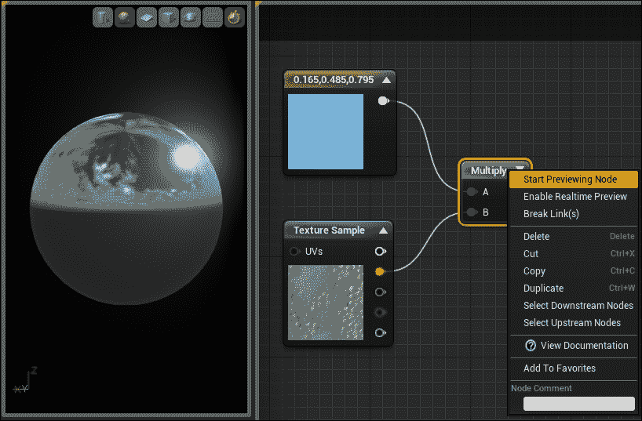

# 第三章：材料内容

材料是一种资产，它使用包括图像（纹理）和数学表达式在内的各种图节点来定义网格的外观。由于虚幻引擎 4 利用**基于物理的渲染**（**PBR**），创建金属、混凝土、砖块等逼真材料可以相当容易。虚幻引擎中的材料定义了网格表面的所有内容，例如其颜色、光泽、凹凸度和细分，甚至可以通过操纵顶点来动画化对象！在这个时候，您可能会想“好吧，材料仅用于网格”，但实际上，它们并不局限于网格。您还使用材料进行贴图、后期处理和光照功能。

创建材料是一个相当直接的过程。您只需在**内容浏览器**中右键单击，选择**材料**，并给它一个名称。完成！


# 材料用户界面

现在我们已经了解了材料是什么以及它做什么，让我们看看材料图的用户界面。


## 工具栏

**工具栏**面板包含各种按钮，有助于预览图形节点、删除孤立节点、材料统计信息等。让我们看看这些按钮的功能：

+   **保存**: 应用您对材料所做的更改并保存资产

+   **在 CB 中查找**: 在**内容浏览器**中导航并选择此材料

+   **应用**: 将更改应用到材料。请注意，这不会保存材料

+   **搜索**: 搜索材料表达式或注释

+   **主页**: 导航到并选择主画布节点

+   **清理**: 删除未连接的节点

+   **连接器**: 显示或隐藏未连接的引脚

+   **实时预览**: 切换预览材料的实时更新

+   **实时节点**: 切换图形节点的实时更新

+   **实时更新**: 为图中的每个节点重新编译着色器

+   **统计信息**: 切换材料统计信息和编译错误

+   **移动统计信息**: 与统计信息相同，但针对移动设备

实时节点对于新用户可能有些令人困惑，所以我将进一步解释它们。

### 实时预览

有时候在将特定节点连接到主节点之前或进行调试目的时，我们需要预览该节点的结果。

要预览节点，您需要在节点上右键单击并选择**开始预览节点**。



除非您启用**实时预览**，否则您将看不到预览材料中的任何更改。

### 小贴士

您可以按空格键强制预览。

### 实时节点

这将显示由于对节点所做的表达式更改而导致的节点实时更新。请参见以下示例：


在前面的屏幕截图中，**正弦**节点正在从**时间**接收恒定更新，乘以一。如果你启用**实时节点**，你会看到**正弦**节点在黑白之间脉冲。如果你将**乘法**值从**1**更改为任何其他值（例如，**5**），除非你同时启用**实时更新**，否则你将看不到变化。

### 实时更新

当启用时，每次你进行更改（如添加新节点、删除节点、更改属性等）时，所有表达式都会重新编译。如果你有一个复杂的图，建议禁用此选项，因为它必须每次你进行更改时编译所有节点。

## 预览面板

**预览**面板显示了当前正在编辑的材质的结果。你可以使用以下选项在预览材质中导航：

+   **旋转网格**：使用左鼠标按钮拖动

+   **平移**：使用中间鼠标按钮拖动

+   **缩放**：使用右鼠标按钮拖动

+   **更新光照**：按住*L*键并使用左鼠标按钮拖动

在预览视口的右上角，你可以更改一些设置。这会将预览网格更改为所选的原始形状：


这将预览网格更改为自定义网格。你需要在**内容浏览器**中**静态网格**：


这切换了预览视图中网格的渲染：


这切换了预览视口中的实时渲染：


## 细节面板

**细节**面板显示当你选择图中的节点时可以编辑的所有属性。如果没有选择节点，它将显示材质本身的属性。

有关这些设置的更多信息，请访问[`docs.unrealengine.com/latest/INT/Engine/Rendering/Materials/MaterialProperties/index.html`](https://docs.unrealengine.com/latest/INT/Engine/Rendering/Materials/MaterialProperties/index.html)的材质属性文档。

## 图面板

这是创建所有决定材质外观和行为节点的主体区域。默认情况下，材质图包含一个具有一系列输入的主节点，并且此主节点不能被删除。一些输入被灰色显示，可以通过在**细节**面板中更改**混合**模式来启用。


## 调色板面板

**调色板**面板列出了可以拖放到图中的所有图节点和材质函数。

### 小贴士

使用**类别**选项，你可以过滤**调色板**内容在表达式或材质函数之间。

# 常见材质表达式

在我们创建材质时，我们经常使用一些常见的材质节点。要创建节点，您需要在图形画布上右键单击并搜索它，或者您可以使用 **调色板** 窗口进行拖放。一些节点也分配了快捷键。

让我们来看看这些常用节点。

## 常量

常量表达式输出一个单一的浮点值，可以连接到几乎任何输入。您可以将常量表达式转换为参数，并实时更改材质实例。您还可以通过蓝图或 C++ 访问参数，并在游戏中查看更改。

+   **快捷键**：按住 *1* 并单击图形区域

+   **参数快捷键**：按住 *S* 并单击图形区域

+   **示例用法**：使纹理变亮或变暗

### 小贴士

常量参数被称为标量参数


您可以看到一个常量表达式（0.2）被用来使纹理变暗。

## Constant2Vector

Constant2Vector 表达式输出两个浮点值，这是一个二维向量值（例如，红色通道和绿色通道）。您可以将 Constant2Vector 转换为参数，并实时更改材质实例，或者在蓝图或 C++ 中访问它，以在游戏运行时对材质进行动态更改。

+   **快捷键**：按住 *2* 并单击图形区域

+   **参数快捷键**：按住 *V* 并单击图形区域

+   **示例用法**：分别调整纹理的 UV 坐标


您可以在前面的屏幕截图中看到 Constant2Vector 被用来平铺纹理。

## Constant3Vector

Constant3Vector 表达式输出三个浮点值，这是一个三通道向量值（例如，红色通道、绿色通道和蓝色通道）。您可以将 Constant3Vector 转换为参数，并实时更改材质实例，或者在蓝图或 C++ 中访问它，以在游戏运行时对材质进行动态更改。

+   **快捷键**：按住 *3* 并单击图形区域

+   **参数快捷键**：按住 *V* 并单击图形区域

+   **示例用法**：更改给定纹理的颜色


您可以在前面的屏幕截图中看到 Constant3Vector 被用来着色灰度纹理。

## 纹理坐标 (TexCoord)

纹理坐标表达式输出纹理 UV 坐标作为二维向量（例如，U 和 V），这有助于平铺，并允许您使用不同的 UV 坐标。

+   **快捷键**：按住 *U* 并单击图形区域


前面的屏幕截图显示了使用纹理坐标来平铺纹理。您可以通过查看左下角的 **详细信息** 面板来查看使用的值。

## 乘法

此表达式将给定输入相乘并输出结果：

+   乘法是按通道进行的。例如，如果你要乘以两个向量（0.2, 0.3, 0.4）和（0.5, 0.6, 0.7），实际过程如下：

    ```cpp
    0.2 x 0.5 = 0.1
    0.3 x 0.6 = 0.18
    0.4 x 0.7 = 0.28
    ```

    因此，输出结果如下：

    ```cpp
    (0.1, 0.18, 0.28)
    ```

+   **乘法** 节点期望输入类型相同，除非其中一个为常量。简而言之，你不能将 Constant2Vector 和 Constant3Vector 相乘，但你可以将 Constant2Vector 或 Constant3Vector 与一个常量表达式相乘。

    +   **快捷键**：按住 *M* 并点击图形区域

    

前面的截图显示了一个乘法节点被用来增强发射效果。

## 加法

此表达式将给定的输入相加并输出结果：

加法是按通道进行的。例如，如果你要加两个向量（1, 0, 0）和（0, 1, 0），实际过程如下：

```cpp
1 + 0 = 1
0 + 1 = 1
0 + 0 = 0
```

因此，输出结果如下：

```cpp
(1, 1, 0)
```

**加法** 节点期望输入类型相同，除非其中一个为常量。简而言之，你不能将 Constant2Vector 和 Constant3Vector 相加，但你可以将 Constant2Vector 或 Constant3Vector 与一个常量表达式相加。让我们看看为什么是这样的。请看以下截图：


在这里，我们试图将 Constant3Vector 和 Constant2Vector 相加，但它不会工作。这是因为，当材质编辑器尝试编译 **加法** 节点时，由于 Constant3Vector 的最后一个元素没有可以相加的内容，它将失败。它将像以下计算一样：

```cpp
1 + 2 = 3
1 + 2 = 3
1 + ? = fail
```

但你可以将 Constant3Vector 加到一个常量表达式中，如下图所示：


结果将如下所示：

```cpp
1 + 2 = 3
1 + 2 = 3
1 + 2 = 3
```

这将编译无误。

+   **快捷键**：按住 *A* 并点击图形区域

## 除法

此除法表达式将给定的输入除并以输出结果：

除法是按通道进行的。例如，如果你要除以两个向量（0.2, 0.3, 0.4）和（0.5, 0.6, 0.7），实际过程如下：

```cpp
0.2 / 0.5 = 0.4
0.3 / 0.6 = 0.5
0.4 / 0.7 = 0.571
```

因此，输出结果如下：

```cpp
(0.4, 0.5, 0.571)
```

**除法** 节点期望输入类型相同，除非其中一个为常量。简而言之，你不能将 Constant2Vector 除以 Constant3Vector，但你可以将 Constant2Vector 或 Constant3Vector 除以一个常量表达式。

+   **快捷键**：按住 *D* 并在图形区域中点击

## 减法

此表达式从给定的输入中减去并输出结果：

减法是按通道进行的。例如，如果你要从两个向量（0.2, 0.3, 0.4）和（0.5, 0.6, 0.7）中减去，实际过程如下：

```cpp
0.2 - 0.5 = -0.3
0.3 - 0.6 = -0.3
0.4 - 0.7 = -0.3
```

因此，输出结果如下：

```cpp
(-0.3, -0.3, -0.3)
```

**减法** 节点期望输入类型相同，除非其中一个为常量。简而言之，你不能从 Constant3Vector 中减去 Constant2Vector，但你可以从 Constant2Vector 或 Constant3Vector 中减去一个常量表达式。

+   **快捷键**：没有快捷键

## 纹理采样（Texture2D）

纹理采样输出给定的纹理。它还分别输出纹理的所有四个通道（即红色、绿色、蓝色和 alpha），以便您可以使用它们进行各种操作。这对于处理多个灰度纹理（如遮罩纹理、粗糙度纹理等）特别有用。您不必导入多个纹理，只需在 Photoshop 中创建一个纹理，并将其他纹理分配给不同的通道，在材质编辑器中，您可以获取每个通道并执行所有这些复杂操作。哦，我提到过 Texture2D 还可以使用电影纹理吗？

您可以将**纹理采样**转换为**TextureSampleParameter2D**，并通过材质实例实时更改纹理。您还可以通过蓝图或 C++在游戏中动态更改纹理。

+   **快捷键**：按住 *T* 并在图形区域单击

+   **参数快捷键**：无快捷键


## 组件遮罩

组件遮罩表达式可以从输入中提取不同的通道，输入应该是向量通道，例如**Constant2Vector**、**Constant3Vector**、**Constant4Vector**、**TextureSample**等。例如，Constant4Vector 只有一个输出，即 RGBA。因此，如果您想从 RGBA 中获取绿色通道，您将使用组件遮罩。您可以在组件**遮罩**上右键单击，将其转换为**参数**，并在材质实例中进行实时更改。

+   **快捷键**：无快捷键

+   **参数快捷键**：无快捷键

在此屏幕截图中，我们提取 alpha 通道并将其连接到**不透明度**，并将 RGB 通道连接到**基础颜色**。

## 线性插值（lerp）

这根据 alpha 值混合两种纹理或值。当 alpha 值为**0**（黑色）时，使用**A**输入。如果 alpha 值为**1**（白色），则使用**B**输入。大多数情况下，这是根据遮罩纹理混合两种纹理。

+   **快捷键**：按住 *L* 并在图形区域单击

+   **示例用法**：根据 alpha 值混合两种纹理，该值可以是常数或遮罩纹理

在这里，lerp 节点输出 100%的输入**A**，因为 alpha 值为**0**。如果我们设置 alpha 值为**1**，那么我们将看到 100%的**B**。如果 alpha 值为**0.5**，那么我们将看到**A**和**B**的混合。

## 功率

**功率**节点将基础输入乘以自身 Exp 次。例如，如果您在**基础**中有**4**，在**指数**中有**6**，那么实际过程是这样的：

```cpp
4 x 4 x 4 x 4 x 4 x 4 = 4096
```

因此，**功率**的结果是`4096`。

如果您将**纹理**应用到**基础**输入，并且有一个常数值（例如，**4**），那么**纹理**将被乘以四次。

+   **快捷键**：按住 *E* 并在图形区域单击

+   **示例用法**：调整高度图或环境遮挡图的对比度

前面的图像显示了使用 Power 节点来增强**纹理采样**对比度的用法。

## PixelDepth

**PixelDepth**输出当前正在渲染的像素到摄像机的距离。这可以用来根据玩家距离改变材料的视觉效果。

+   **快捷键**：无快捷键

+   **示例用法**：根据玩家距离改变物体的颜色

如果你将之前的材料应用到网格上，那么网格的颜色将根据玩家摄像机距离而改变。


前面的截图显示了网格在玩家摄像机附近的视觉效果。


前面的截图显示了网格在远离玩家摄像机时的外观。

## 去饱和度

正如标题所说，**去饱和度**表达式会去饱和其输入。简单来说，它可以根据一定百分比将彩色图像转换为灰度图像。

+   **快捷键**：无快捷键


## 时间

此表达式输出游戏的**时间流逝**（以秒为单位）。如果你想让你的材料随时间变化，可以使用此功能。

+   **快捷键**：无快捷键

+   **示例用法**：创建一个脉冲材料

在之前的材料中，我们将**时间**乘以一个常量表达式。**乘法**节点的结果连接到**正弦**节点，该节点输出一个连续的振荡波形，其值在**-1**到**1**的范围内。然后我们使用**常量偏移缩放**节点来防止值低于**0**。**常量偏移缩放**节点基本上是一个向输入添加偏移值并将其乘以缩放值的节点。默认情况下，偏移设置为**0.5**，缩放为**1**。所以如果**正弦**值为**-1**，那么结果是`(-1 + 1) * 0.5`，等于**0**。

## Fresnel

**Fresnel**创建边缘照明，这意味着它将突出网格的边缘。

+   **快捷键**：无快捷键

之前网络的输出结果如下：


## 材料类型

现在你已经了解了一些基本表达式，让我们来看看不同的材料类型。首先，显然是主要的材料编辑器，但随后你还有材料实例、材料函数和分层材料。

## 材料实例

材料实例用于在不重新编译的情况下更改材料的外观。当您在材料编辑器中更改任何值并应用它时，它将重新编译整个着色器并创建一组着色器。当您从该材料创建材料实例时，它将使用同一组着色器，因此您可以在不重新编译任何内容的情况下实时更改值。但是，当您在**父材料**中使用**静态切换参数**或**组件遮罩参数**时，情况就不同了，因为每个参数都有独特的组合。例如，假设您有一个没有**静态切换参数**的**Material_1**，以及一个具有名为**bEnableSwitch**的**静态切换参数**的**Material_2**。**Material_1**将只创建一组着色器，而**Material_2**将创建两组着色器，分别对应**bEnableSwitch = False**和**bEnableSwitch = True**。

一个示例工作流程是创建一个包含所有必要参数的主材料，并让设计师制作不同的版本。

材料实例有两种类型。它们是：

+   材料实例常量

+   材料实例动态

只有材料实例常量具有用户界面。材料实例动态没有用户界面，并且不能在内容浏览器中创建。

### 材料实例常量

正如标题所说，**材料实例常量**（**MIC**）只能在编辑器中编辑。这意味着您不能在运行时更改值。MIC 公开了您在父材料中创建的所有参数。您可以创建自己的组并很好地组织所有参数。


材料实例用户界面

+   **工具栏（1）**: 以下为工具栏选项：

    +   **保存**: 保存资产

    +   **在 CB 中查找**: 在内容浏览器中导航到该资产并选择它

    +   **参数**: 公开父材料的所有参数

    +   **移动统计**: 切换移动材料的统计信息

+   **详细信息（2）**: 显示父材料及其材料实例的所有参数。在这里，您还可以分配一个物理材料并覆盖父材料的基属性，例如混合模式、双面等。

+   **实例父级（3）**: 这里您将看到一系列父级，直到主主材料。当前正在编辑的实例以粗体显示。

+   **视口（4）**: 视口在网格上显示材料，以便您可以在实时中看到您的更改。您可以在右上角更改预览形状。这与材料编辑器中的相同。

### 材料实例常量示例

为了使材料实例工作，我们需要一个具有参数的主材料。让我们创建一个简单的材料，它将根据与玩家的距离改变其颜色，也就是说，当玩家靠近网格时，它将呈现红色，当玩家远离时，它的颜色将改变。请注意，UE4 中有 21 个参数表达式。

目前我们将坚持使用两个常见的参数，如下所示：

+   标量参数

+   矢量参数

如您在前面的截图中所见，我们创建了两个矢量参数（**Color1**、**Color2**）和两个标量参数（**TransitionDistance**、**Speed**）。我们将使用这些参数进行实时修改。要创建此材质的实例，您需要在**内容浏览器**中右键单击此材质，并选择**创建材质实例**。这将在此材质旁边创建一个新的实例材质。

如果您打开该实例，您将看到所有这些参数都在那里，并且您可以在不等待材质重新编译的情况下实时编辑它们：


要更改材质实例中的值，您需要首先覆盖它们。您需要点击参数附近的复选框来覆盖值。如下面的截图所示：


## 材质函数

材质函数是包含一组节点且可用于任何数量材质的图表。如果您经常发现自己创建复杂的网络，那么创建一个材质函数会更好，这样您就可以将这些复杂的网络包含在一个单独的节点中。需要注意的是，材质函数不能包含任何参数节点（例如，**标量参数**、**矢量参数**、**纹理参数**等）。要将数据传递到材质函数中，您需要使用特殊的**函数输入**节点。同样，如果您想从材质函数中获取数据，您需要使用**函数输出**节点。默认情况下，材质函数为您创建一个输出，但您可以根据需要创建更多输出。

材质函数的 UI 几乎与材质编辑器相同。如果您检查**详细信息**面板，您将看到一些选项，可以帮助您充分利用材质函数。让我们看看这些选项：

+   **描述**：当您在材质图中将鼠标悬停在此函数节点上时，它将显示为工具提示。

+   **暴露到库中**：启用此选项，当您在材质图中右键单击时，将显示您的材质函数。

+   **库分类**：此列表显示此函数所属的分类。默认情况下，它属于**杂项**分类，但您可以更改它并添加尽可能多的分类。

### 小贴士

材质函数不能应用于表面，因此如果您想使用材质函数，必须在材质中使用它。

### 材质函数示例

要创建材质函数，首先在**内容浏览器**中右键单击，转到**材质与纹理**并选择**材质函数**。在这个例子中，我们将创建一个名为**法线图调整器**的材质函数，它可以增强法线图的强度。让我们看看创建此类函数需要什么：

+   **纹理 [输入]**：显然我们需要传递一个需要修改的纹理。

+   **强度 [输入]**：我们还需要传递正常应该有多强的信息。**0**的值表示不更改正常贴图，而**1**的值表示增强正常效果。

+   **结果 [输出]**：最后我们将输出结果，我们可以将其连接到我们的材质中的正常通道。

### 小贴士

最终输出节点（结果）可以重命名为任何你想要的自定义名称。选择节点，在**细节**面板中，更改**输出名称**。

打开你的材质函数，在图表上右键单击并搜索**输入**。


选择**函数输入**节点。你将在**细节**面板中看到你刚刚选择的**输入**节点的某些属性。


让我们来看看这些设置：

+   **输入名称**：输入的自定义名称。你可以取任何你想要的名称。在这里，我将其命名为**法线纹理**。

+   **描述**：当你在材质图表中悬停在此输入上时，将用作工具提示。

+   **输入类型**：定义了此节点的输入类型。

+   **预览值**：如果此输入在材质图表中没有连接，则使用的值。仅在**使用预览值作为默认值**被选中时使用。

+   **使用预览值作为默认值**：如果选中，它将使用**预览值**并将此输入标记为可选。因此，当你使用此函数时，你可以不连接此输入。但是，如果你禁用此选项，那么在材质图表中，你必须连接所需的节点到此处。

+   **排序优先级**：安排此输入与其他输入节点的关系。

让我们创建一个简单的网络来增强正常效果。看看下面的截图：


在这里，我们正在分别提取红色、绿色和蓝色通道。这样做的原因很简单，我们只需要将**强度**（标量输入值）与蓝色通道相乘以增强正常效果。**强度**需要在**0**和**1**之间夹紧，然后使用**1-x**（OneMinus）节点进行反转，因为我们使用这个材质函数在材质中时，需要**0**作为默认的正常强度，**1**则真正增强效果。如果没有 OneMinus 节点，则相反，即**0**将增强正常贴图效果，**1**将产生常规效果。

函数完成后，点击工具栏上的**保存**按钮。

### 小贴士

自动保存会编译材质。

现在要将此放入材质中，在材质图表内右键单击并搜索**NormalMapAdjuster**。然后你只需要将一个**Normal**贴图和一个**标量参数**连接到**NormalMapAdjuster**，并将其连接到**Normal**通道。

### 小贴士

如果它没有出现在上下文菜单中，请确保你在材质功能中启用了**暴露到库**。


在你的材质实例中，你可以实时调整**NormalIntensity**。

#### 分层材质

分层材质基本上是**材质中的材质**，并且作为材质函数的扩展存在。基本工作流程如下：你创建一个**Make Material Attribute**（它具有所有材质属性，如**Base Color**、**Metallic**、**Specular**、**Roughness**等），并将你的节点连接到它。然后，将**Make Material Attributes**的输出连接到**Output Result**节点的输入。

当你的资产具有不同的材质层时，分层材质最有益。例如，考虑一个具有不同元素的角色，如金属装甲、皮革手套、皮肤等。以传统方式定义这些材质并将它们混合在一起将显著增加材质的复杂性。如果你在这种情况下使用分层材质，你可以将每个材质定义为单个节点，并非常容易地混合它们。

##### 使用 make material attributes 创建分层材质

对于本例，我们将创建两个简单的分层材质并将它们在我们的最终材质中混合在一起。首先，创建一个材质函数并打开它。在材质函数中，按照以下步骤操作：

1.  右键点击图编辑器，搜索**Make Material Attributes**并从菜单中选择该节点。

1.  创建一个**Constant3Vector**节点并将其连接到**Make Material Attributes**的**BaseColor**。

1.  创建一个常量值并将其连接到**Make Material Attributes**的**Metallic**。

1.  创建另一个常量值并将其连接到**Make Material Attributes**的**Roughness**。

1.  最后，将**Make Material Attributes**连接到材质函数的输出。

最终的材质函数应如下所示。注意我使用的常量节点值。


由于我们希望这是**Metallic**，我们将**Metallic**设置为**1**。

我们将创建这个相同的材质函数的副本，并将其制作为一个具有不同颜色的非金属材质。请参见以下图片：


这是一个非金属材质，我们将在材质编辑器中使用默认的**Material Layer Blend**函数将这两个材质混合在一起。

确保公开这两个材质函数，这样我们就可以在材质编辑器中使用它们。

在内容浏览器中打开一个现有的材质或创建一个新的材质，并打开它：

1.  右键点击图并搜索你的材质函数（选择两个）。

1.  再次右键点击图并搜索并选择**MatLayerBlend_Simple**。

1.  将你的材质函数连接到**MatLayerBlend_Simple**。将一个函数连接到**Base Material**，另一个连接到**Top Material**。

1.  现在，为了混合这两种材质，我们需要一个**Alpha (标量)**值。值为**1**（白色）将输出**基础材质**，值为**0**将输出**顶层材质**。值为**0.5**将输出**基础**和**顶层**材质的混合。

由于我们使用的是分层材质，我们不能像其他节点那样直接将其连接到材质编辑器。为了使此功能正常工作，有两种连接方式。

###### 方法 1：

我们可以使材质使用材质属性而不是常规节点。要使用此功能，请点击图上的任何位置，然后在**详细信息**面板中选择**使用材质属性**：


当您启用此功能时，主材质节点将只显示一个名为材质属性的节点，这样您就可以将**MatLayerBlend_Simple**的输出连接到该节点。

以下是用此方法创建的最终材质的截图：


###### 方法 2：

在此方法中，我们不是使用材质属性作为主节点，而是使用**BreakMaterialAttributes**并将它们作为常规节点连接：

1.  右键单击图区域，搜索并选择**BreakMaterialAttributes**。

1.  将**MatLayerBlend_Simple**的输出连接到**BreakMaterialAttributes**。

1.  最后，将**BreakMaterialAttributes**的所有输出节点连接到材质编辑器的主节点。

以下是用此方法创建的最终材质的截图：


# 摘要

在下一章中，我们将使用后处理技术来增强场景的外观。我们还将创建一个简单的材质并在后处理材质中使用它。
