# 第九章。粒子

在虚幻引擎 4 中，粒子是通过级联粒子编辑器创建的，这是一个强大且稳健的编辑器，允许艺术家创建视觉效果。级联编辑器允许您添加和编辑构成最终效果的各个模块。粒子编辑器的主要任务是控制粒子系统的行为，而外观和感觉通常由材质控制。

在本章中，您将了解级联粒子编辑器并创建一个简单的粒子系统。

# 级联粒子编辑器

要访问级联粒子编辑器，您需要在内容浏览器中通过右键单击内容浏览器并选择**粒子系统**来创建一个**粒子系统**。选择它后，将创建一个新的**粒子系统**，并提示您重命名。给它一个名字，然后双击它以打开级联粒子编辑器。

一旦打开，您将看到一个类似这样的窗口：

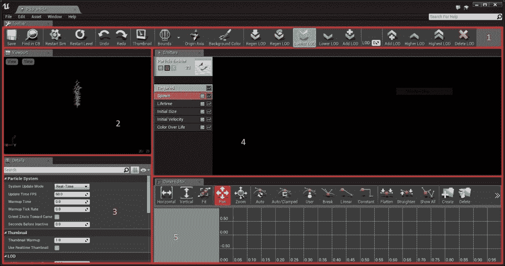

级联编辑器用户界面

级联粒子编辑器由五个主要区域组成，它们是：

+   **工具栏**：这包含可视化和导航工具

+   **视口**：这显示当前粒子系统

+   **详细信息**：这允许您编辑当前粒子系统、发射器或模块

+   **发射器**：这些是实际的粒子发射器，并包含与发射器关联的模块

+   **曲线编辑器**：这是允许您在相对或绝对时间内修改属性的编辑器

## 工具栏

工具栏包含各种按钮。让我们快速看一下它们：

+   **保存**：这保存粒子系统

+   **在 CB 中查找**：这将在内容浏览器中定位当前粒子系统

+   **重启模拟**：这重启（重置）当前模拟

+   **重启级别**：这与重启模拟相同，但还会更新放置在级别中的所有实例

+   **缩略图**：这会将视口视图保存为内容浏览器的缩略图

+   **边界**：这启用或禁用粒子边界的渲染

+   **原点轴**：这在视口中显示原点轴

+   **重新生成 LOD**：点击此按钮将生成最低 LOD，复制最高 LOD

+   **重新生成 LOD**：点击此按钮将使用基于最高 LOD 的值生成最低 LOD

+   **最低 LOD**：这切换到最低 LOD

+   **更低 LOD**：这切换到下一个最低 LOD

+   **添加 LOD**：在当前 LOD 之前添加一个新的 LOD

+   **添加 LOD**：在当前 LOD 之后添加一个新的 LOD

+   **更高 LOD**：这选择一个更高的 LOD

+   **最高 LOD**：这选择最高 LOD

+   **删除 LOD**：这删除当前 LOD

LODs（细节级别）是更新粒子效果以根据玩家距离使用高效屏幕空间的方法。根据效果，粒子系统中可能有模块在玩家距离较远时太小而无法渲染。想象一下火炭。如果玩家距离较远，粒子系统仍然会处理和计算这些我们不需要的效果。这就是我们使用 LOD 的地方。**细节级别**（**LODs**）可以根据玩家距离关闭特定的模块甚至关闭发射器。

## 视口

视口显示了粒子系统以及其他实时更改，例如总粒子数、边界等。在左上角，您可以单击**视图**按钮以在**未发光**、**纹理密度**、**线框模式**等不同视图模式之间切换。

### 导航

使用以下鼠标按钮可以在视口内部进行导航：

+   **左鼠标按钮**：此功能用于在粒子系统中移动相机。

+   **中鼠标按钮**：此功能用于平移相机。

+   **右鼠标按钮**：此功能用于旋转相机。

+   **Alt + 左鼠标按钮**：此功能使粒子系统围绕中心旋转。

+   **Alt + 右鼠标按钮**：此功能使相机从粒子系统向前或向后移动。

+   **F**：此功能专注于粒子系统。

+   **左键 + L 键**：此功能旋转灯光，并且仅影响使用**发光**材质的粒子。**非发光**材质无效果。

在**视口**内部，您可以播放/暂停粒子模拟以及调整模拟速度。您可以在**视口**下的**时间**选项中访问这些设置。

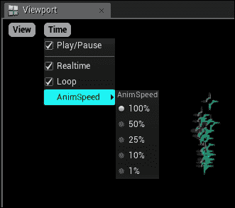

## 详情

**详情**面板由当前选定的模块或发射器填充。可以通过在**发射器**面板中选择“无”或通过在**发射器**列表上右键单击并导航到**粒子系统** | **选择粒子系统**来访问粒子系统的主要属性。

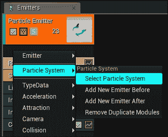

## 发射器

**发射器**面板是粒子系统的核心，包含所有发射器的水平排列。在每个发射器列中，您可以添加不同的模块以改变粒子的外观和感觉。您可以添加任意数量的发射器，每个发射器将处理最终效果的不同方面。

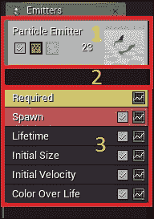

**发射器**包含三个主要区域，具体如下：

+   在发射器块上方是发射器的主要属性，例如名称、类型等。您可以通过双击灰色区域来折叠或展开发射器列。

+   在下面，您可以定义发射器的类型。如果您将其留空（如前一张截图所示），则粒子将在 CPU 上模拟。

+   最后，您可以添加模块来定义粒子的外观。

### 发射器类型

级联编辑器有四种不同的发射器类型，具体如下：

+   **光束类型**: 当使用此类型时，粒子将输出连接两个点的光束。这意味着您必须定义一个源点（例如，发射器本身）和一个目标点（例如，一个演员）。

+   **GPU 精灵**: 使用此类型可以让您在 GPU 上模拟粒子。使用此发射器可以让您高效地模拟和渲染成千上万的粒子。

+   **网格类型**: 当使用此选项时，粒子将使用实际的**静态网格**实例。这对于模拟破坏效果（例如，碎片）非常有用。

+   **带状物**: 这种类型表示粒子应该像一条尾巴。这意味着，所有粒子（按照它们的出生顺序）都相互连接，形成带状物。

## 曲线编辑器

这是标准的曲线编辑器，允许用户调整粒子在其生命周期内或发射器生命周期内需要更改的任何值。要了解更多关于曲线编辑器的信息，您可以访问官方文档，网址为[`docs.unrealengine.com/latest/INT/Engine/UI/CurveEditor/index.html`](https://docs.unrealengine.com/latest/INT/Engine/UI/CurveEditor/index.html)。

# 创建简单的粒子系统

要创建一个粒子系统：

1.  右键单击**内容浏览器**。

1.  从结果上下文菜单中选择**粒子**。

1.  在**内容浏览器**中创建一个新的粒子系统资产，并提示您重命名它。

1.  在这个例子中，让我们称它为**MyExampleParticleSystem**。

1.  现在，双击它以打开**粒子**编辑器。

默认情况下，虚幻引擎为您创建了一个默认的发射器，以便您可以使用。这个发射器包含六个模块，它们是：

+   **必需**: 这包含发射器所需的所有属性，例如用于渲染的材料、发射器在循环之前应运行多长时间、此发射器是否可以循环等。您不能删除此模块。

+   **生成**: 此模块包含确定粒子如何生成的属性。例如，每秒生成多少粒子。您不能删除此模块。

+   **生命周期**: 这是生成粒子的生命周期。

+   **初始大小**: 这设置粒子生成时的初始大小。要修改生成后的大小，请使用**大小随生命周期**或**大小随速度**。

+   **初始速度**: 这设置粒子生成时的初始速度（速度）。要修改生成后的速度，请使用**速度/生命周期**。

+   **颜色随生命周期变化**: 这将设置粒子在其生命周期内的颜色。

在这个例子中，我们将修改现有的发射器，使其成为一个看起来像火花的光照粒子系统。我们还将添加碰撞，以便我们的粒子与世界发生碰撞。

## 创建简单的材料

在我们开始处理粒子之前，我们需要创建一个简单的材料，我们可以将其应用于粒子。要创建一个新的材料：

1.  右键单击**内容浏览器**并选择**材料**。您可以随意命名它。

1.  打开**材质**编辑器，将**混合模式**更改为**半透明**。这是必需的，因为 GPU 粒子碰撞不会在不透明材质上工作。

1.  然后，将**着色模型**更改为**不发光**。这是因为我们不希望火花受到任何类型的光的影响，因为它们是自发光的。

1.  最后，创建一个这样的图表：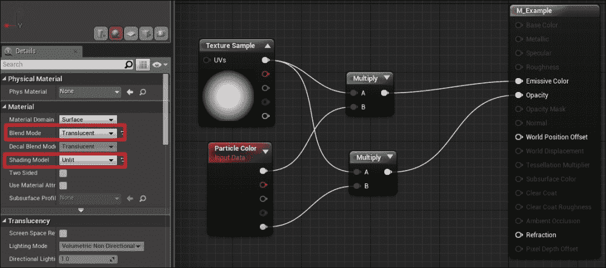

### 注意

注意，**纹理样本**节点中的圆形渐变纹理是引擎本身自带的。它被称为**灰度**。

现在我们有了我们的材质，是时候定制我们的粒子系统了：

1.  选择**必需**模块，并在**发射器**组下应用之前步骤中创建的材质。

1.  右键点击发射器下方的黑色区域，然后在**类型数据**下选择**新 GPU 精灵**。这将使我们的发射器在 GPU 上模拟粒子。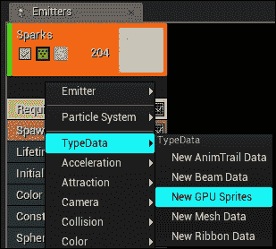

1.  选择**生成**模块，并在**生成**组下将**速率**设置为**0**。这是因为我们不想每秒生成一定数量的粒子，而是想在单帧中爆发数百个。

1.  在**爆发**组下，在**爆发列表**中添加一个新条目，并将**数量**设置为**100**，将**数量低**设置为**10**。这将选择一个介于**100**和**10**之间的随机值，并生成那么多粒子。

    最终的**生成**设置将看起来像这样：

    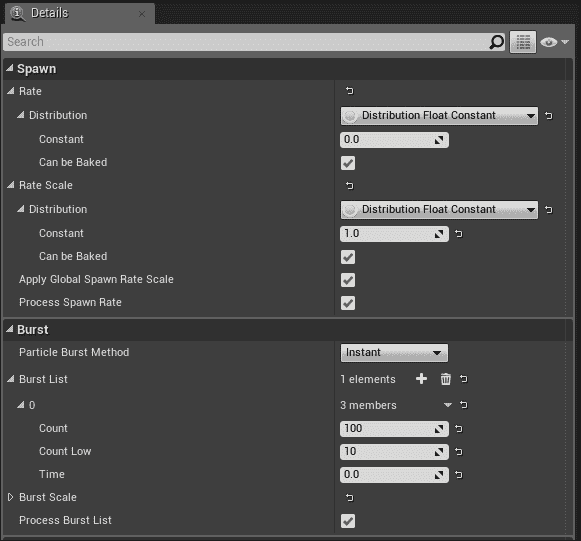

1.  调整**生成**设置后，我们将粒子的**生命周期**设置为**0.4**和**3.0**，因此每个生成的粒子的生命周期在**0.4**和**3.0**之间。现在我们已经有了粒子生成，是时候调整它们的大小了。为此，选择**初始大小**模块，并将**最大值**设置为**1.0**、**10.0**、**0.0**，将**最小值**设置为**0.5**、**8.0**、**0.0**。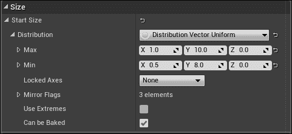

    ### 注意

    注意，由于 GPU 精灵是 2D 的，您可以忽略**Z**值。这就是为什么我们将它们设置为**0.0**。

1.  之后，选择**初始速度**模块，并将**最大值**设置为**100.0**、**200.0**、**200.0**，将**最小值**设置为**-100.0**、**-10.0**、**100.0**。

1.  现在，如果您将这个粒子拖放到世界中，您将看到粒子爆发到空中。

    ### 注意

    注意，如果您没有看到任何动作发生，请确保编辑器的**实时**选项已开启（*Ctrl*+*R*）。

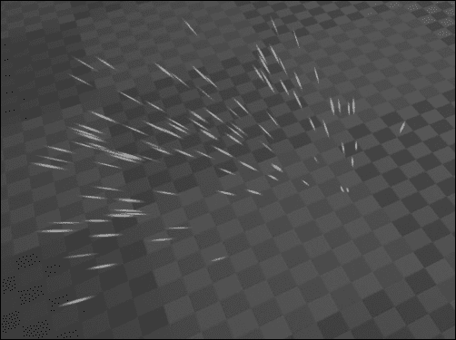

## 添加重力

为了使事情更加逼真，我们将对这些粒子模拟重力。回到您的粒子编辑器，按照以下步骤操作：

1.  右键点击模块区域。

1.  从**加速度**菜单中选择**恒定加速度**。此模块将给现有粒子的加速度添加给定的加速度，并更新当前和基本速度。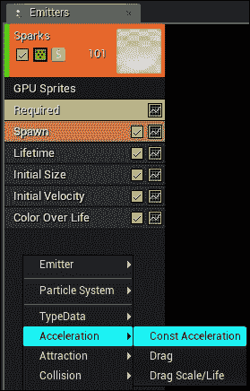

1.  对于**加速度**值，使用**0.0**、**0.0**、**-450.0**。Z 轴的负值（即**-450**）将使粒子向下移动，就像它们受到重力的影响一样。

### 注意

注意，默认的重力值是**-980.0**。你也可以尝试这个值。

现在，如果你查看世界中的粒子，你可以看到它们向下移动，就像它们受到重力的影响一样。

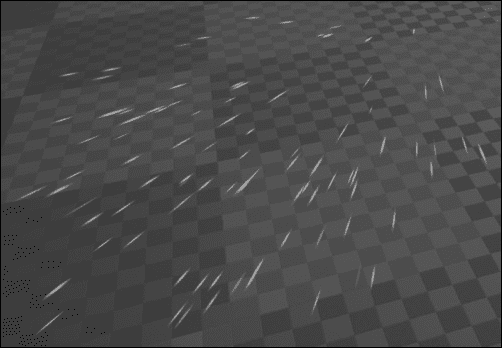

## 应用颜色覆盖生命模块

现在我们有了类似火花的东西，让我们给它应用一些颜色。选择颜色覆盖生命模块并应用以下设置：

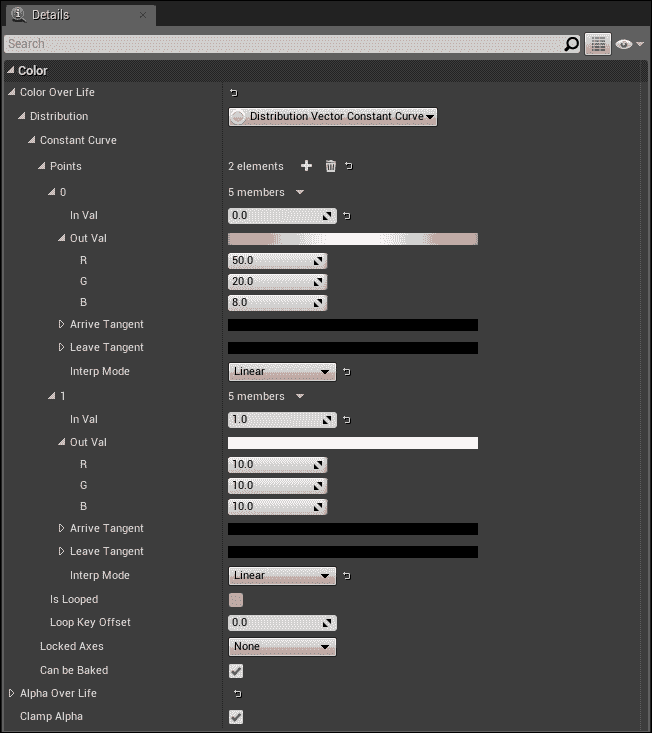

**颜色覆盖生命**是一个曲线值。这意味着你可以在粒子的生命周期中的某个点定义要应用的颜色。**0.0**值是开始，**1.0**是结束。在上面的截图中，你可以看到我在粒子生成时（**In Val** = **0.0**）应用了明亮的橙红色（**50.0**，**20.0**，**8.0**），并在结束时（**In Val** = **1.0**）应用了明亮的白色。

## 添加碰撞模块

要完成这个效果，我们将添加一个**碰撞**模块，以便我们的粒子可以与世界碰撞。要添加**碰撞**模块，请按照以下步骤操作：

1.  在模块区域右键单击并从**碰撞**菜单中选择**碰撞**。

1.  选择**碰撞**模块。

1.  将**韧性**值设置为**0.25**。这将使碰撞的粒子弹性更小。更高的韧性意味着弹性更大的粒子。

1.  将**摩擦**设置为**0.2**。这将使粒子粘附在地面上。更高的摩擦值（**1.0**）将使粒子在碰撞后无法移动，而较低的值使粒子在表面上滑动。

现在，如果你在这个世界中模拟或播放带有这个粒子的游戏，你可以看到它爆炸并与世界碰撞，但它非常不真实。你可以很容易地注意到每秒钟这个粒子都在重复。因此，为了防止这种情况，请按照以下步骤操作：

1.  打开粒子编辑器。

1.  选择**必需**模块。

1.  在**持续时间**设置下，将**发射器循环**设置为**1**。默认情况下，这设置为**0**，意味着它将无限循环。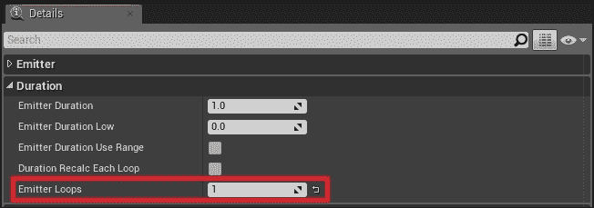

# 在蓝图中播放粒子

现在我们已经准备好了粒子效果，让我们使用蓝图来播放它：

1.  在**内容浏览器**上右键单击。

1.  选择**蓝图**类。

1.  从结果窗口中选择**Actor**。

1.  双击**蓝图**以打开编辑器。

1.  在**内容浏览器**中选择你的爆炸粒子。

1.  打开**蓝图**编辑器并添加一个新的**粒子系统组件**（如果你在**内容浏览器**中选择粒子，它将自动将该粒子设置为**粒子系统组件**的模板）。

1.  切换到**事件图**标签页。

1.  在图上任何位置右键单击，并从**添加事件**类别中选择**添加自定义事件…**。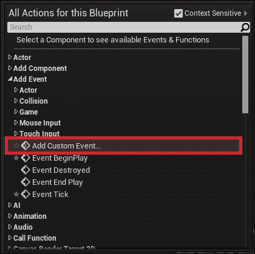

1.  将该**自定义事件**重命名为你喜欢的任何名称。在这个例子中，我将其重命名为**ActivateParticle**。

1.  创建一个类似这样的图：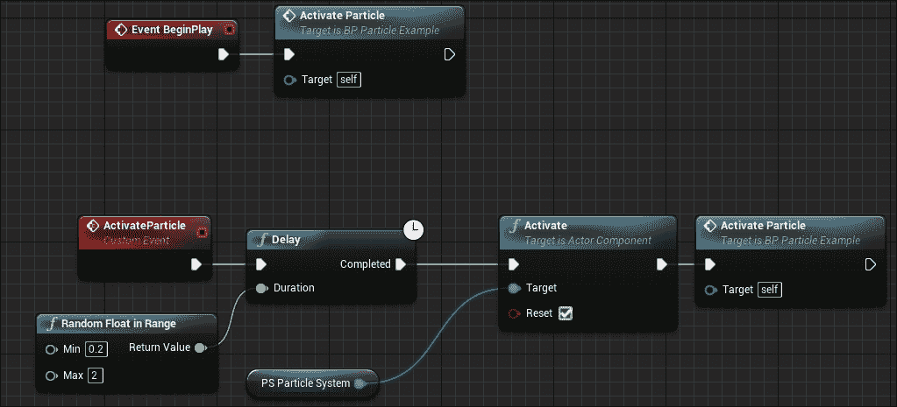

这个蓝图将在游戏开始时以及事件执行时首先执行**ActivateParticle**，当事件执行时，它会在**0.2**和**2**秒之间随机选择一个时间（以秒为单位）。当时间结束时，它激活粒子并再次调用此事件。

现在，如果你将这个粒子拖放到世界中并开始播放，你会看到粒子随机爆发：

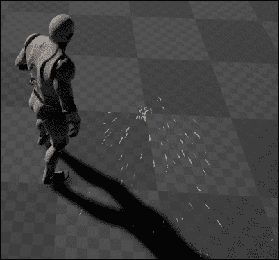

# 摘要

从这里，你可以扩展这个粒子并添加一些灯光，使其看起来更加逼真。请注意，**灯光**模块不能与 GPU 粒子一起使用，因此你需要创建另一个发射器并在那里添加灯光模块。既然你已经了解了 GPU 粒子数据类型，你可以添加更多使用其他数据类型的发射器，例如光束类型、网格类型、带状类型等等。从本章和其他章节中学到的知识，你可以创建一个蓝图，其中包含一个灯光网格，当它受到伤害时会发射这种火花粒子效果。

在下一章中，我们将深入探索 C++的世界。
