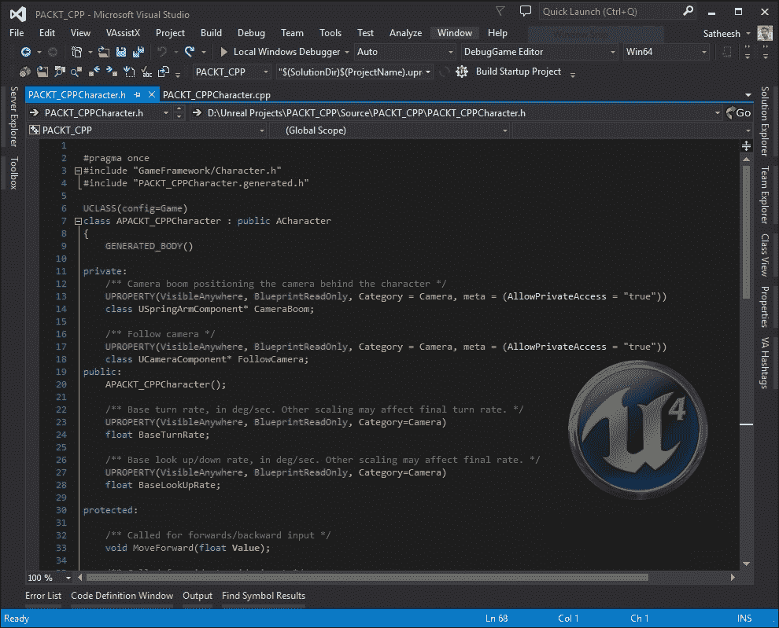
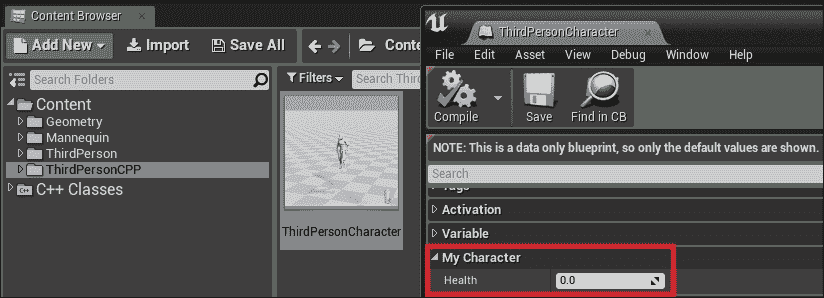
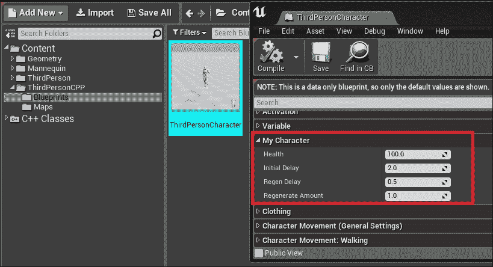
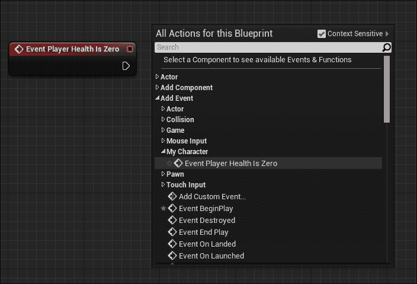

# 第十章。Unreal C++ 简介

在 第六章 *蓝图* 中，你学习了关于蓝图的内容，这是 Unreal Engine 4 的可视化脚本语言。现在你将学习 C++，它可以用来为蓝图创建基类。在本章中，你将学习如何创建一个 C++ 项目（我们将使用 **第三人称模板**）并修改它以添加对角色健康和健康恢复的支持。你还将学习如何将变量和函数暴露给蓝图。

本章将专注于在 Microsoft Windows 中使用 Visual Studio 2015 编写 C++ 代码。

# 设置 Visual Studio 2015

使用 Unreal Engine 4.10 时，您需要 Visual Studio 2015 来编译项目的 C++ 代码。Visual Studio 有三个版本可供选择。它们是：

+   **社区版**：对于任何个人和非企业组织，最多五名用户免费。对于这本书，我将使用这个版本。

+   **专业版**：这是一个付费版本，适用于小型团队。

+   **企业版**：适用于任何规模和复杂性的项目的大型团队。

您可以从 [`www.visualstudio.com/downloads/download-visual-studio-vs`](https://www.visualstudio.com/downloads/download-visual-studio-vs) 下载 Visual Studio 2015 社区版。

访问上述链接后，选择 **Community 2015** 并选择您的格式进行下载。您可以下载网络安装程序或离线安装程序。要下载离线安装程序，请选择 **ISO** 格式：


下载设置文件后，双击 **vs_community.exe** 运行设置并安装 Visual Studio 2015。

### 注意

在安装 Visual Studio 2015 之前，请确保在 **编程语言** 部分选择 **Visual C++**。这是与 Unreal Engine 4 一起工作的必要条件。


安装完成后，设置程序将提示您重新启动计算机。这样做，您就可以使用 Unreal Engine 4 C++ 了。

## 工作流程改进

为了使 Visual Studio 2015 与 Unreal Engine 4 一起工作并提高开发者的整体用户体验，有一些推荐的设置。其中一些包括：

+   关闭 **显示非活动块**。如果不关闭，许多代码块可能会在文本编辑器中显示为灰色。(**工具** | **选项** | **文本编辑器** | **C/C++** | **视图**）。

+   将 **禁用外部依赖文件夹** 设置为 **True** 以在 **解决方案资源管理器** 中隐藏不必要的文件夹。（**工具** | **选项** | **文本编辑器** | **C/C++** | **高级**）。

+   关闭 **编辑并继续** 功能。（**工具** | **选项** | **调试** | **编辑** 并点击 **继续**）。

+   启用 **IntelliSense**。

# 创建 C++ 项目

现在我们已经安装了 Visual Studio，让我们创建一个包含 C++ 代码的项目。在这个项目中，我们将扩展 Unreal Engine 4 附带的三人称模板，并添加对健康（包括健康恢复）的支持：


启动 Unreal Engine 4，当项目浏览器对话框出现时：

+   选择 **新建项目** 选项卡

+   选择 **C++** 子选项卡

+   选择 **第三人称**

+   命名您的项目

+   点击 **创建项目**

当您点击 **创建项目** 时，Unreal Engine 4 将创建所有必需的基本类，并为您编译项目。这可能需要一分钟或更长时间。一旦完成，您的项目解决方案文件（Visual Studio 文件）将自动打开，同时打开项目。

一旦项目打开，您可能会注意到的一个主要变化是在 **工具栏** 上出现了一个新的 **编译** 按钮。这只会出现在您的项目是代码项目的情况下：


这用于重新编译代码更改并在玩游戏时即时重新加载它们！这个系统被称为 **热重载**。作为程序员，您将广泛使用这个功能。

## 角色类

在这个项目中，我们已经有了一个角色类和一个游戏模式类可用。让我们快速看看角色类是如何制作的。

基本上，我们有一个源文件（扩展名为 `.cpp`）和一个头文件（`.h`）。简而言之，头文件包含所有声明，源文件包含这些声明的定义。要访问另一个文件中的特定方法（或函数），我们使用 `# include` `ExampleHeader.h`。这样，我们将能够访问在该头文件中声明的所有函数。

在另一个头文件中访问声明基于访问说明符。我们将在本章后面了解更多关于它们的内容。

要从 Unreal Engine 4 打开源文件（`.cpp`）和头文件（`.h`）：

+   打开 **内容浏览器**

+   前往 **C++ 类**

+   选择您的项目名称文件夹

+   双击您的角色类

这将在 Visual Studio 中打开源文件（`.cpp`）和头文件（`.h`）：



上一张截图显示了我们的角色类的头文件。让我们逐行分析它。

+   `#pragma once`：任何以井号（`#`）开头的行称为预处理器指令。将其视为在编译任何实际代码之前由编译器运行的指令。它们以井号（`#`）开头，通常以新行结束。您可以使用反斜杠（`\`）进行多行。在这种情况下，`#pragma once` 是一个预处理器，其任务是防止多次包含。`#pragma once` 也称为头文件保护。

+   `#include`：在这个文件中，我们看到两个包含文件。一个是来自 `GameFramework` 文件夹的 `Character.h`（位于 `UE4` 目录中），另一个是 `generated.h` 文件：

    +   `Character.h`: 包含这个文件是因为我们的角色类是从 Unreal Engine 4 中提供的 `ACharacter` 类继承而来的。这个包含是必须的，以便访问 `Character` 类中的所有声明。

    +   `generated.h`: 这是由 **Unreal Header Tool** （**UHT**）自动为你生成的。这些文件在你声明了 `USTRUCT()` 或 `UCLASS()` 宏时生成。它们包含了你的头文件中类型声明的详细信息。这应该是你头文件中的最后一个包含文件。

+   `Macros`: `Macros` 也是一种预处理指令，以 `#define` 开头。在编译时间之前，编译器会将实际值复制并粘贴到使用此宏的任何地方。例如，如果你创建了一个这样的宏：`#define MyMacro 3.14`，那么 `3.14` 将被复制并粘贴到使用 `MyMacro` 的任何地方。

+   `UCLASS(config=game)`: 这是一个 Unreal 宏，它使编辑器知道新的类。在括号内，你指定类修饰符和元数据。在这个例子中，我们指定了配置修饰符。这表示这个类允许在给定的配置文件中存储数据。在这种情况下，你的配置文件名将是 `YourGameNameGame.ini`。

+   `class APACKT_CPPCharacter`: `public ACharacter`: 这表示类名，并显示了我们从哪个类继承了这个类。对于这个类，我们是从 `Character` 类继承的。

+   `GENERATED_BODY()`: 这是一个必须放在类体非常开始的宏。在编译时，Unreal 会将其替换为所有必要的样板代码。这意味着在编译时间之前，`GENERATED_BODY()` 被替换为实际的代码。由于这段代码是编译类所必需的，Epic 通过创建这个宏使我们更容易做到这一点。

+   `private`, `public`, 和 `protected`: 这些被称为访问修饰符。访问修饰符允许你决定一个方法是否可以被其他文件访问。有三种类型的访问修饰符。它们是：

    +   `private`: 这意味着你只能在类内部访问成员。在这个例子中，`CameraBoom` 和 `FollowCamera` 被设置为私有属性。这意味着你只能在类内部访问它们。如果你创建一个新的从该类派生的类，你将无法访问它们。

    +   `public`: 这意味着所有成员都可以从任何其他类中访问。

    +   `protected`: 这意味着所有成员都可以从这个类及其派生类中访问。

+   `UPROPERTY()`: 这定义了属性元数据和修饰符。这些用于在属性上序列化、复制并将它们暴露给蓝图。你可以使用许多 `UPROPERTY ()` 修饰符。要查看完整列表，请访问此链接：[`docs.unrealengine.com/latest/INT/Programming/UnrealArchitecture/Reference/Properties/Specifiers/index.html`](https://docs.unrealengine.com/latest/INT/Programming/UnrealArchitecture/Reference/Properties/Specifiers/index.html)。

+   `void`：这意味着它是一个不返回任何数据类型的函数。一个函数可以返回任何类型的数据，如 `float`、`int`、`bool`，甚至对象，但并不总是需要数据类型。在这种情况下，你会使用 void 返回类型来表示此方法不返回任何类型的数据。这也可以防止在子类中覆盖函数。如果你想覆盖子类中的函数，那么你需要将其设置为 virtual void。当你创建一个 virtual void 时，这意味着子类可以覆盖此函数，实现自己的逻辑，并可选地使用关键字 `Super` 调用父类函数。

理解前面的内容（预处理程序、宏、访问说明符等）将有助于你在 Unreal C++ 中工作。

另一个值得提及的是双冒号（`::`）、连字符箭头（`->`）和点（`.`）的使用。理解它们是什么以及如何使用它们是至关重要的。在这些中，我们主要使用连字符箭头（`->`）符号。让我们看看它们是什么。

+   **双冒号** (`::`): 当使用此符号时，意味着你正在访问特定命名空间或作用域中的方法。例如，当你想要从其他类中调用静态方法时，你会使用此符号。

+   **连字符箭头** (`->`): 当你指向可能在内存中某个地方存在或不存在的数据时使用。使用此符号意味着你正在尝试访问一个指针。指针指向内存中某个位置，该位置存储了该指针的实际数据。在访问指针之前，始终检查它们并确保它们是有效的。指针是 Unreal C++ 中最重要的部分之一，所以我强烈建议阅读 Nathan Iyer (Rama) 提供的这篇文章：[`wiki.unrealengine.com/Entry_Level_Guide_to_UE4_C%2B%2B#Pointers`](https://wiki.unrealengine.com/Entry_Level_Guide_to_UE4_C%2B%2B#Pointers)

+   **点** (.): 这用于访问数据本身。例如，你将使用它来访问结构体内的数据。

### 添加生命值系统

现在我们已经了解了 `Character` 类，让我们开始修改我们的角色，以添加对生命值和生命值恢复系统的支持。在我们开始之前，让我们快速了解一下我们将要做什么。在这个系统中：

+   一个 `float` 变量，用于存储游戏开始时玩家的当前生命值。我们将确保当玩家初始化时，玩家拥有最大生命值。

+   覆盖 `Actor` 类的默认函数 `TakeDamage ()`。

+   当玩家受到伤害时，我们将检查受到的伤害量，并从生命值中减去这个数值。然后我们将启动一个计时器，该计时器将执行一个恢复生命值的事件。

#### 创建一个生命值变量

那么，让我们开始吧。打开你的角色源文件，并在私有访问说明符下添加以下代码：

```cpp
UPROPERTY( EditAnywhere, BlueprintReadWrite, Category = "My Character", meta = (AllowPrivateAccess = "true") )
float Health;
```

在这里，我们声明了一个 `Health` 变量，其数据类型为 `float`。我们还为我们的 `float` 变量添加了 `UPROPERTY` 并添加了 `EditAnywhere`、`BlueprintReadWrite` 和 `Category` 修饰符。`EditAnywhere` 修饰符允许你在 **Details** 面板中编辑这个属性。`BlueprintReadWrite` 允许你在 Blueprint 中获取或设置这个值。无论你将什么名字作为类别，它都会出现在 **Details** 面板中。如果你编译并启动你的游戏，查看 **ThirdPersonCharacter** Blueprint 的 **Details** 面板（在 **ThirdPersonCPP/Blueprints** 中），你会看到我们新暴露的属性：



如你所见，`0.0` 的值对 `Health` 来说没有意义。所以我们将打开我们角色类的源文件，并在类 `constructor` 下输入以下行：

```cpp
Health = 100.f; // .f is optional. If it's confusing you can replace it with 100.0
```

`constructor` 类通常是源文件中的第一个定义。它看起来像 `YourClassName::YourClassName()`。

### 注意

任何以 `//`（双斜杠）开头的一行都是注释，并且会被编译器忽略。

`constructor` 类基本上是我们设置类默认值的地方。在这种情况下，我们希望玩家的默认健康值为 `100`。

现在，如果你在 Unreal Engine 编辑器中按下 **Compile** 按钮，编辑器将编译新的更改，并在完成后进行热重载。当编译完成后，你应该看到 `health` 的默认值（**100**）。

#### 受伤

现在我们已经设置了健康值，我们可以在我们的 `character` 类中访问并更改它。我们现在需要在我们玩家受到伤害时更新这个值。由于我们的角色是 `Actor` 类，我们可以使用 `TakeDamage()` 函数来更新健康值。要做到这一点，请将以下代码添加到你的角色头文件中：

```cpp
virtual float TakeDamage( float Damage, struct FDamageEvent const& DamageEvent, AController* EventInstigator, AActor* DamageCauser ) override;
```

### 注意

`TakeDamage` 是 `Actor` 类中已经存在的一个虚拟函数。所以当你想在虚拟函数中实现自定义逻辑时，确保为它们包含一个 `override` 关键字。这样你就告诉编译器在父类中查找这个函数的定义。如果找不到基类定义或者它已经被修改，编译器将抛出一个错误。记住，如果没有 `override` 关键字，编译器将把它视为一个新的定义。

`TakeDamage` 函数接受一些参数并返回一个 `float` 类型的值，这是实际造成的伤害。在这个函数中，我们首先检查我们的健康值是否大于 `0`。如果是，我们将 `Health` 值减少 `Damage` 值。如果不是，我们则直接返回 `0`：

```cpp
float APACKT_CPPCharacter::TakeDamage(float Damage, struct FDamageEvent const& DamageEvent, AController* EventInstigator, AActor* DamageCauser)
{
 // Super key word is used here to call the actual TakeDamage function from the parent class which returns a float value.We then assign this value to ActualDamage which is a float type.
 const float ActualDamage = Super::TakeDamage(Damage, DamageEvent, EventInstigator, DamageCauser);
 // Check if we have health
 if (Health > 0.0)
 {
  // Reduce health by the damage received
  Health = Health - ActualDamage;
  // return the actual damage received
  return ActualDamage;
 }
 // Player has no health. So return 0.0
 return 0.0;
}
```

在前面的示例中，你可以看到注释的使用以及它如何有助于以后阅读代码。`TakeDamage` 函数首先调用父类函数，该函数返回要应用的实际伤害。我们将此值保存到名为 `ActualDamage` 的局部变量中。然后我们检查 `health` 值是否大于 `0.0`，如果是，则通过 `ActualDamage` `float` 变量减少 `health` 值并返回该值。每次你重写一个虚函数并实现自定义逻辑时，你使用 `Super::FunctionName()` 来继承父类的基本功能。由于 `TakeDamage()` 函数是虚函数，并且我们重写了该函数，因此我们使用 `Super::TakeDamage()` 来调用在父类中定义的实际函数，该函数执行对演员应用伤害的逻辑。

#### 生命恢复

现在我们知道我们的角色可以受到伤害，我们将进一步修改这个系统并添加生命恢复。我们的生命恢复系统将基于默认设置为每 1 秒恢复 `1.0` 的 `float` 变量来恢复生命值，这个值也设置为 `float` 变量。这些设置将公开到蓝图编辑器，这样我们可以在不重新编译游戏的情况下稍后更改它们。

让我们快速看一下生命恢复系统：

+   我们使用计时器来恢复生命值。

+   当玩家受到伤害时，我们将清除这个计时器。

+   在受到伤害后，我们将计时器设置为 2 秒后重启。计时器将调用一个自定义函数来恢复生命值。

+   当计时器结束时，它将调用自定义事件，增加 1 点生命值。这个计时器将持续运行，直到玩家达到最大生命值。

因此，我们首先需要的是一个 `TimerHandle`。这有助于识别绑定有相同方法的 `Timers`。要声明 `TimerHandle`，打开角色头文件，并在 `GENERATED_BODY ()` 下添加以下行：

```cpp
FTimerHandle TimerHandle_HealthRegen;
```

### 注意

你可以为 `TimerHandle` 使用任何名称。在这里，在 `HealthRegen` 前使用 `_TimerHandle` 是可选的。

既然我们知道我们将使用计时器，那么让我们添加两个新的 `float` 变量，它们将作为激活 `RegenerateHealth` 函数的时间：

+   我们将第一个 `float` 变量命名为 `InitialDelay`。这个变量用于在受到伤害后调用 `RegenerateHealth`。我们将默认值设置为 `2`。

+   我们将第二个 `float` 变量命名为 `RegenDelay`。当从 `TakeDamage` 函数开始恢复时，我们使用这个 `RegenDelay` 时间再次调用 `RegenerateHealth` 函数。我们将默认值设置为 `0.5`。

以下是一些变量：

```cpp
/* After taking damage, Regenerate Health will be called after this much seconds. */
UPROPERTY( EditAnywhere, Category = "My Character" )
float InitialDelay;

/* Time to regenerate health. */
UPROPERTY( EditAnywhere, Category = "My Character" )
float RegenDelay;
```

我们还将添加一个名为 `RegenerateAmount` 的新属性，并将其公开到蓝图编辑器：

```cpp
UPROPERTY( EditAnywhere, BlueprintReadWrite, Category = "My Character", meta = (AllowPrivateAccess = "true") )
float RegenerateAmount;
```

在`RegenerateAmount`变量中，你可以看到一个名为`AllowPrivateAccess`的新元指定符。当你想在私有访问指定符中有一个变量，但同时也需要在蓝图中使用它（`BlueprintReadOnly`或`BlueprintReadWrite`）时，会用到这个指定符。如果没有`AllowPrivateAccess`，当你在私有访问指定符下的变量上使用`BlueprintReadWrite`或`BlueprintReadOnly`时，编译器将抛出错误。最后，我们将添加一个名为`RegenerateHealth`的新函数，如下所示：

```cpp
void RegenerateHealth();
```

目前，我们已经完成了头文件的修改。让我们打开角色源文件，并在类构造函数（记住类构造函数是`YourClassName::YourClassName()`）中添加`RegenerateAmount`的默认值`1.0`。

### 注意

`constructor`类在蓝图中不是构造脚本。如果你想在 C++中实现构造脚本行为，你需要重写`OnConstruction`方法。

我们还将像这样将`RegenerateHealth`函数添加到我们的源文件中：

```cpp
void APACKT_CPPCharacter::RegenerateHealth()
{
}
```

在这个函数内部，我们将编写我们的代码，将`RegenerateAmount`值添加到我们现有的健康值中。所以让我们修改如下：

```cpp
void APACKT_CPPCharacter::RegenerateHealth()
{
    if (Health >= GetClass()->GetDefaultObject<ABaseCharacter>()->Health)
    {
        Health = GetClass()->GetDefaultObject<ABaseCharacter>()->Health;
    }
    else
    {
        Health += RegenerateAmount;
        FTimerHandle TimerHandle_ReRunRegenerateHealth;
        GetWorldTimerManager().SetTimer( TimerHandle_ ReRunRegenerateHealth, this, &APACKT_CPPCharacter::RegenerateHealth, RegenDelay );
    }
}
```

现在，让我们分析一下这段代码。在这个函数内部，我们首先做的事情是检查我们的`Health`是否大于或等于我们的默认`Health`。如果是，我们只需将健康值设置为默认值（这是我们在构造函数中设置的）。如果不是，我们向现有的健康值添加`RegenerateAmount`，并使用计时器重新运行此函数。

最后，我们修改`TakeDamage`函数以添加`HealthRegeneration`：

```cpp
float APACKT_CPPCharacter::TakeDamage( float Damage, struct FDamageEvent const& DamageEvent, AController* EventInstigator, AActor* DamageCauser )
{
// Get the actual damage applied
 const float ActualDamage = Super::TakeDamage(Damage, DamageEvent, EventInstigator, DamageCauser);

 if (Health <= 0.0)
 {
  // Player has no health. So return 0.0
  return 0.0;
 }

 // Reduce health by the damage received
 Health = Health - ActualDamage;

 //Is the health reduced to 0 for the first time?
 if (Health <= 0.0)
 {
  // Clear existing timer
  GetWorldTimerManager().ClearTimer(TimerHandle_HealthRegen);
  return 0.0;
 }

 // Set a timer to call Regenerate Health function, if it is not running already
 if (!GetWorldTimerManager().IsTimerActive(TimerHandle_HealthRegen))
 {
  GetWorldTimerManager().SetTimer(TimerHandle_HealthRegen, this, &APACKT_CPPCharacter::RegenerateHealth, InitialDelay);
 }

 // return the actual damage received
 return ActualDamage;
}
```

在上面的代码中，我们首先检查我们的健康值是否小于或等于`0.0`。如果是，那么我们知道玩家没有健康值，所以我们只需简单地返回`0.0`。否则，我们减少我们的`health`值，并检查健康是否小于或等于`0`。如果健康值为`0`，我们清除计时器，否则我们检查健康恢复是否当前处于活动状态。如果它不活跃，那么我们创建一个新的计时器来运行`RegenerateHealth`函数，最后返回应用的`ActualDamage`。

# C++ 到 蓝图

我们现在在我们的角色类中有一个健康和健康恢复系统。我们当前系统的一个问题是，我们还没有定义当健康值达到 0 时我们的角色会发生什么。在本节中，我们将创建一个事件，我们将在蓝图（Blueprint）中实现这个事件。当玩家的健康值达到 0.0 时，将调用此事件。要创建此蓝图事件，打开我们的角色头文件，并添加以下代码：

```cpp
UFUNCTION(BlueprintImplementableEvent, Category = "My Character")
void PlayerHealthIsZero();
```

正如你所见，我们添加了一个名为`PlayerHealthIsZero()`的普通函数。为了使其在蓝图（Blueprint）中可用，我们添加了`UFUNCTION`指定符，并在其中添加了`BlueprintImplementableEvent`。这意味着 C++可以调用这个函数，它将在蓝图内部执行，但我们不能在我们的角色源文件中为这个函数添加定义。相反，我们将在源文件中随时调用它。在这个例子中，如果玩家的健康值为`0`，我们将在`TakeDamage`事件中调用它。所以让我们这样修改我们的`TakeDamage`：

```cpp
float APACKT_CPPCharacter::TakeDamage( float Damage, struct FDamageEvent const& DamageEvent, AController* EventInstigator, AActor* DamageCauser )
{
// Get the actual damage applied
 const float ActualDamage = Super::TakeDamage(Damage, DamageEvent, EventInstigator, DamageCauser);

 if (Health <= 0.0)
 {
  // Player has no health. So return 0.0
  return 0.0;
 }

 // Reduce health by the damage received
 Health = Health - ActualDamage;

 //Is the health reduced to 0 for the first time?
 if (Health <= 0.0)
 {
  // Clear existing timer
  GetWorldTimerManager().ClearTimer(TimerHandle_HealthRegen);

  // Call the BLueprint event
  PlayerHealthIsZero();

  return 0.0;
 }

 // Set a timer to call Regenerate Health function, if it is not running already
 if (!GetWorldTimerManager().IsTimerActive(TimerHandle_HealthRegen))
 {
  GetWorldTimerManager().SetTimer(TimerHandle_HealthRegen, this, &APACKT_CPPCharacter::RegenerateHealth, InitialDelay);
 }

 // return the actual damage received
 return ActualDamage; }
```

在前面的代码中，我们在清除恢复计时器后立即调用`PlayerHealthIsZero`。

现在是编译和运行项目的时候了。在 Visual Studio 中，按*F5*编译并启动项目。一旦项目加载，打开我们的角色蓝图，你将在**详细信息**面板中看到我们新的变量被暴露出来：



从这里，你可以打开蓝图图并添加我们的**玩家健康值为零**事件：



在这个事件中，你可以编写逻辑来播放死亡动画，显示一些 UI 屏幕等等。

# 摘要

与实际的 C++相比，Unreal C++更容易学习。这是因为 Epic Games 的编程巫师们实现了许多功能，使得编写 Unreal C++变得有趣！你可以通过包括装甲系统、耐力系统等等来扩展你在本章中学到的内容，为你的角色添加功能。通过结合 UMG 和蓝图，你可以显示一个 HUD，显示玩家健康值，也许还有一个当玩家健康值低于 50 时弹出的小型警告系统。在下一章中，你将学习如何打包项目以进行分发。
