# 第二章：创建类

本章重点介绍如何创建与 UE4 蓝图编辑器良好集成的 C++类和结构。这些类是常规 C++类的毕业版本，称为`UCLASS`。

### 提示

`UCLASS`只是一个带有大量 UE4 宏装饰的 C++类。这些宏生成额外的 C++头文件代码，使其能够与 UE4 编辑器本身集成。

使用`UCLASS`是一个很好的实践。如果配置正确，`UCLASS`宏可能会使你的`UCLASS`可蓝图化。使你的`UCLASS`可蓝图化的优势在于，它可以使你的自定义 C++对象具有蓝图可视编辑属性（`UPROPERTY`），并带有方便的 UI 小部件，如文本字段、滑块和模型选择框。你还可以在蓝图图表中调用函数（`UFUNCTION`）。这两者都显示在以下截图中：

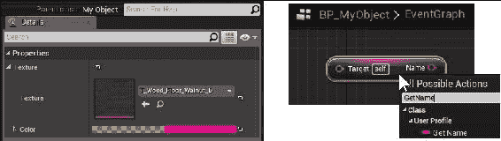

在左边，两个装饰为`UPROPERTY`的类成员（一个`UTexture`引用和一个`FColor`）显示在 C++类的蓝图中进行编辑。在右边，一个标记为`BlueprintCallable`的 C++函数`GetName`显示为可以从蓝图图表中调用的`UFUNCTION`。

### 注意

`UCLASS`宏生成的代码将位于`ClassName.generated.h`文件中，这将是你的`UCLASS`头文件`ClassName.h`中所需的最后一个`#include`。

以下是本章将涵盖的主题：

+   制作`UCLASS`-派生自`UObject`

+   创建可编辑的`UPROPERTY`

+   从蓝图中访问`UPROPERTY`

+   指定`UCLASS`作为`UPROPERTY`的类型

+   从你的自定义`UCLASS`创建蓝图

+   实例化`UObject`派生类（`ConstructObject <>`和`NewObject <>`）

+   销毁`UObject`派生类

+   创建`USTRUCT`

+   创建`UENUM()`

+   创建`UFUNCTION`

### 提示

你会注意到，即使我们在这个类中创建的示例对象是可蓝图化的，它们也不会被放置在关卡中。这是因为为了放置在关卡中，你的 C++类必须派生自`Actor`基类，或者在其下。有关更多详细信息，请参见第四章，*演员和组件*。

# 介绍

一旦你了解了模式，UE4 代码通常非常容易编写和管理。我们编写的代码用于从另一个`UCLASS`派生，或者创建`UPROPERTY`或`UFUNCTION`非常一致。本章提供了围绕基本`UCLASS`派生、属性和引用声明、构造、销毁和一般功能的常见 UE4 编码任务的示例。

# 制作`UCLASS`-派生自 UObject

使用 C++编码时，你可以拥有自己的代码，编译并运行为本机 C++代码，适当调用`new`和`delete`来创建和销毁你的自定义对象。只要你的`new`和`delete`调用适当配对，以便在你的 C++代码中没有泄漏，本机 C++代码在你的 UE4 项目中是完全可接受的。

然而，你也可以声明自定义的 C++类，它们的行为类似于 UE4 类，通过将你的自定义 C++对象声明为`UCLASS`。`UCLASS`使用 UE4 的智能指针和内存管理例程进行分配和释放，根据智能指针规则进行加载和读取，可以从蓝图中访问。

### 提示

请注意，当您使用`UCLASS`宏时，您的`UCLASS`对象的创建和销毁必须完全由 UE4 管理：您必须使用`ConstructObject`来创建对象的实例（而不是 C++本机关键字`new`），并调用`UObject::ConditionalBeginDestroy()`来销毁对象（而不是 C++本机关键字`delete`）。如何创建和销毁您的`UObject`派生类在本章后面的*实例化 UObject 派生类（ConstructObject <>和 NewObject <>）*和*销毁 UObject 派生类*部分中有详细说明。

## 准备工作

在本配方中，我们将概述如何编写一个使用`UCLASS`宏的 C++类，以启用托管内存分配和释放，并允许从 UE4 编辑器和蓝图中访问。您需要一个 UE4 项目，可以在其中添加新代码以使用此配方。

## 如何做...

要创建自己的`UObject`派生类，请按照以下步骤进行：

1.  从正在运行的项目中，在 UE4 编辑器中选择**文件** | **添加 C++类**。

1.  在**添加 C++类**对话框中，转到窗口的右上方，选中**显示所有类**复选框：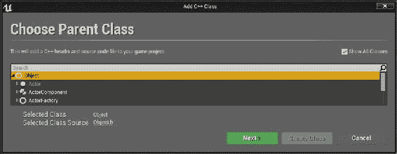

1.  通过选择从`Object`父类派生来创建`UCLASS`。`UObject`是 UE4 层次结构的根。您必须选中此对话框右上角的**显示所有类**复选框，才能在列表视图中看到`Object`类。

1.  选择`Object`（层次结构顶部）作为要继承的父类，然后单击**下一步**。

### 提示

请注意，虽然对话框中将写入`Object`，但在您的 C++代码中，您将从实际上以大写`U`开头的`UObject`派生的 C++类。这是 UE4 的命名约定：

从`UObject`（不在`Actor`分支上）派生的`UCLASS`必须以`U`开头命名。

从`Actor`派生的`UCLASS`必须以`A`开头命名（第四章，“演员和组件”）。

不派生自`UCLASS`的 C++类（不具有命名约定），但可以以`F`开头命名（例如`FAssetData`）。

直接派生自`UObject`的派生类将无法放置在级别中，即使它们包含`UStaticMeshes`等可视表示元素。如果要将对象放置在 UE4 级别中，您至少必须从`Actor`类或其下的继承层次结构中派生。请参阅第四章，“演员和组件”了解如何从`Actor`类派生可放置在级别中的对象。

本章的示例代码将无法放置在级别中，但您可以在 UE4 编辑器中基于本章中编写的 C++类创建和使用蓝图。

1.  为您的新的`Object`派生类命名，以适合您正在创建的对象类型。我称我的为`UserProfile`。在 UE4 生成的 C++文件中，这将显示为`UUserObject`，以确保遵循 UE4 的约定（C++ `UCLASS`前面加上`U`）。

1.  转到 Visual Studio，并确保您的类文件具有以下形式：

```cpp
#pragma once

#include "Object.h" // For deriving from UObject
#include "UserProfile.generated.h" // Generated code

// UCLASS macro options sets this C++ class to be 
// Blueprintable within the UE4 Editor
UCLASS( Blueprintable )
class CHAPTER2_API UUserProfile : public UObject
{
  GENERATED_BODY()
};
```

1.  编译并运行您的项目。现在，您可以在 Visual Studio 和 UE4 编辑器中使用自定义的`UCLASS`对象。有关您可以使用它做什么的更多详细信息，请参阅以下配方。

## 工作原理…

UE4 为你的自定义`UCLASS`生成和管理大量的代码。这些代码是由 UE4 宏（如`UPROPERTY`、`UFUNCTION`和`UCLASS`宏本身）的使用而生成的。生成的代码被放入`UserProfile.generated.h`中。你必须为了编译成功，将`UCLASSNAME.generated.h`文件与`UCLASSNAME.h`文件一起`#include`进来。如果不包含`UCLASSNAME.generated.h`文件，编译将失败。`UCLASSNAME.generated.h`文件必须作为`UCLASSNAME.h`中`#include`列表中的最后一个`#include`包含进来：

| 正确 | 错误 |
| --- | --- |

|

```cpp
#pragma once

#include "Object.h"
#include "Texture.h"
// CORRECT: .generated.h last file
#include "UserProfile.generated.h"
```

|

```cpp
#pragma once

#include "Object.h"
#include "UserProfile.generated.h" 
// WRONG: NO INCLUDES AFTER
// .GENERATED.H FILE
#include "Texture.h"
```

|

当`UCLASSNAME.generated.h`文件不是最后一个包含在包含列表中时，会出现错误：

```cpp
>> #include found after .generated.h file - the .generated.h file should always be the last #include in a header
```

## 还有更多...

这里有一堆关键字，我们想在这里讨论，它们修改了`UCLASS`的行为方式。`UCLASS`可以标记如下：

+   `Blueprintable`：这意味着你希望能够在 UE4 编辑器内的**Class Viewer**中构建一个蓝图（右键单击时，**创建蓝图类...**变为可用）。如果没有`Blueprintable`关键字，即使你可以在**Class Viewer**中找到它并右键单击，**创建蓝图类...**选项也不会对你的`UCLASS`可用：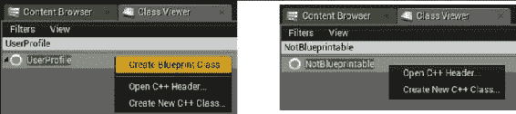

+   只有当你在`UCLASS`宏定义中指定了`Blueprintable`时，**创建蓝图类...**选项才可用。如果不指定`Blueprintable`，那么生成的`UCLASS`将不可用于蓝图。

+   `BlueprintType`：使用这个关键字意味着`UCLASS`可以作为另一个蓝图中的变量使用。你可以在任何蓝图的**EventGraph**的左侧面板的**Variables**组中创建蓝图变量。如果指定了`NotBlueprintType`，那么你不能将这个蓝图变量类型用作蓝图图表中的变量。在**Class Viewer**中右键单击`UCLASS`名称将不会显示**创建蓝图类...**：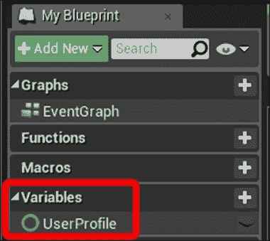

任何指定了`BlueprintType`的`UCLASS`都可以添加为蓝图类图表的变量列表。

你可能不确定是否将你的 C++类声明为`UCLASS`。这真的取决于你。如果你喜欢智能指针，你可能会发现`UCLASS`不仅可以使代码更安全，还可以使整个代码库更连贯和更一致。

## 另请参阅

+   要向蓝图图表添加可编程的`UPROPERTY`，请参阅下面的*创建可编辑的 UPROPERTY*部分。有关使用适当的智能指针引用`UCLASS`实例的详细信息，请参阅第三章，*内存管理和智能指针*。

# 创建可编辑的 UPROPERTY

你声明的每个`UCLASS`可以在其中声明任意数量的`UPROPERTY`。每个`UPROPERTY`可以是一个可视可编辑的字段，或者是`UCLASS`的蓝图可访问的数据成员。

我们可以为每个`UPROPERTY`添加一些限定符，这些限定符会改变它在 UE4 编辑器中的行为，比如`EditAnywhere`（可以更改`UPROPERTY`的屏幕）和`BlueprintReadWrite`（指定蓝图可以随时读写变量，而 C++代码也被允许这样做）。

## 准备工作

要使用这个方法，你应该有一个可以添加 C++代码的 C++项目。此外，你还应该完成前面的方法，*制作一个 UCLASS - 派生自 UObject*。

## 如何做...

1.  在你的`UCLASS`声明中添加成员如下：

```cpp
UCLASS( Blueprintable )
class CHAPTER2_API UUserProfile : public UObject
{
  GENERATED_BODY()
  public:
  UPROPERTY(EditAnywhere, BlueprintReadWrite, Category = Stats)
  float Armor;
  UPROPERTY(EditAnywhere, BlueprintReadWrite, Category = Stats)
  float HpMax;
};
```

1.  创建你的`UObject`类派生的蓝图，并通过从对象浏览器中双击打开 UE4 编辑器中的蓝图。

1.  现在你可以在蓝图中为这些新的`UPROPERTY`字段的默认值指定值：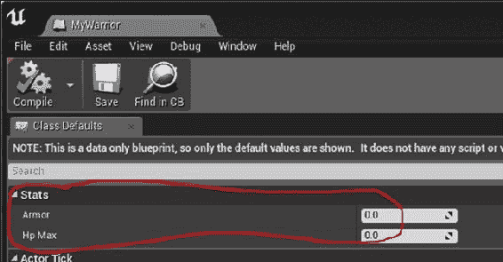

1.  通过将蓝图类的几个实例拖放到您的级别中，并编辑放置的对象上的值（双击它们）来指定每个实例的值。

## 它是如何工作的...

传递给`UPROPERTY()`宏的参数指定了关于变量的一些重要信息。在前面的示例中，我们指定了以下内容：

+   `EditAnywhere`：这意味着`UPROPERTY()`宏可以直接从蓝图中编辑，或者在游戏级别中放置的每个`UClass`对象的每个实例上进行编辑。与以下进行对比：

+   `EditDefaultsOnly`：蓝图的值是可编辑的，但不能在每个实例上进行编辑

+   `EditInstanceOnly`：这将允许在`UClass`对象的游戏级实例中编辑`UPROPERTY()`宏，而不是在基蓝图本身上进行编辑

+   `BlueprintReadWrite`：这表示属性可以从蓝图图中读取和写入。带有`BlueprintReadWrite`的`UPROPERTY()`必须是公共成员，否则编译将失败。与以下进行对比：

+   `BlueprintReadOnly`：属性必须从 C++中设置，不能从蓝图中更改

+   `类别`：您应该始终为您的`UPROPERTY()`指定一个`类别`。`类别`确定了`UPROPERTY()`将出现在属性编辑器中的哪个子菜单下。在`类别=Stats`下指定的所有`UPROPERTY()`将出现在蓝图编辑器中的相同`Stats`区域中。

## 另请参阅

+   完整的`UPROPERTY`列表位于[`docs.unrealengine.com/latest/INT/Programming/UnrealArchitecture/Reference/Properties/Specifiers/index.html`](https://docs.unrealengine.com/latest/INT/Programming/UnrealArchitecture/Reference/Properties/Specifiers/index.html)。浏览一下。

# 从蓝图中访问 UPROPERTY

从蓝图中访问`UPROPERTY`非常简单。成员必须作为`UPROPERTY`公开在您的蓝图图中要访问的成员变量上。您必须在宏声明中限定`UPROPERTY`，指定它是`BlueprintReadOnly`还是`BlueprintReadWrite`，以指定您是否希望变量从蓝图中只读取（仅）或甚至可以从蓝图中写入。

您还可以使用特殊值`BlueprintDefaultsOnly`来指示您只希望默认值（在游戏开始之前）可以从蓝图编辑器中进行编辑。`BlueprintDefaultsOnly`表示数据成员不能在运行时从蓝图中编辑。

## 如何做到...

1.  创建一些`UObject`派生类，指定`Blueprintable`和`BlueprintType`，例如以下内容：

```cpp
UCLASS( Blueprintable, BlueprintType )
class CHAPTER2_API UUserProfile : public UObject
{
  GENERATED_BODY()
  public:
  UPROPERTY(EditAnywhere, BlueprintReadWrite, Category = Stats)
  FString Name;
};
```

在`UCLASS`宏中的`BlueprintType`声明是使用`UCLASS`作为蓝图图中的类型所必需的。

1.  在 UE4 编辑器中，从 C++类派生一个蓝图类，如*从自定义 UCLASS 创建蓝图*中所示。

1.  通过将实例从**内容浏览器**拖放到主游戏世界区域中，在 UE4 编辑器中创建您的蓝图派生类的实例。它应该出现为游戏世界中的一个圆形白色球，除非您已为其指定了模型网格。

1.  在允许函数调用的蓝图图中（例如**级别蓝图**，通过**蓝图** | **打开级别蓝图**访问），尝试打印您的 Warrior 实例的**Name**属性，如下截图所示：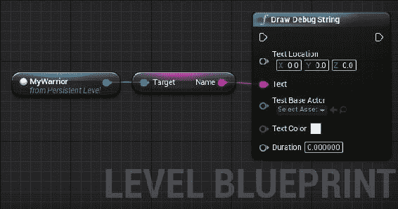

### 提示

导航蓝图图很容易。右键单击并拖动以平移蓝图图；*Alt* +右键单击+拖动以缩放。

## 它是如何工作的...

`UPROPERTY`会自动为 UE4 类编写`Get`/`Set`方法。但是，它们不能在`UCLASS`中声明为`private`变量。如果它们没有声明为`public`或`protected`成员，您将收到形式为的编译器错误：

```cpp
>> BlueprintReadWrite should not be used on private members
```

# 指定 UCLASS 作为 UPROPERTY 的类型

因此，您已经构建了一些用于在 UE4 中使用的自定义`UCLASS`。但是如何实例化它们呢？UE4 中的对象是引用计数和内存管理的，因此您不应该直接使用 C++关键字`new`来分配它们。相反，您将不得不使用一个名为`ConstructObject`的函数来实例化您的`UObject`派生类。`ConstructObject`不仅需要您创建对象的 C++类，还需要一个 C++类的蓝图类派生（`UClass*`引用）。`UClass*`引用只是指向蓝图的指针。

我们如何在 C++代码中实例化特定蓝图的实例？C++代码不应该知道具体的`UCLASS`名称，因为这些名称是在 UE4 编辑器中创建和编辑的，您只能在编译后访问。我们需要以某种方式将蓝图类名称传递给 C++代码以实例化。

我们通过让 UE4 程序员从 UE4 编辑器中列出的所有可用蓝图（从特定 C++类派生）的简单下拉菜单中选择 C++代码要使用的`UClass`来实现这一点。为此，我们只需提供一个可编辑的`UPROPERTY`，其中包含一个`TSubclassOf<C++ClassName>`类型的变量。或者，您可以使用`FStringClassReference`来实现相同的目标。

这使得在 C++代码中选择`UCLASS`就像选择要使用的纹理一样。`UCLASS`应该被视为 C++代码的资源，它们的名称不应该硬编码到代码库中。

## 准备工作

在您的 UE4 代码中，您经常需要引用项目中的不同`UCLASS`。例如，假设您需要知道玩家对象的`UCLASS`，以便在代码中使用`SpawnObject`。从 C++代码中指定`UCLASS`非常麻烦，因为 C++代码根本不应该知道在蓝图编辑器中创建的派生`UCLASS`的具体实例。就像我们不希望将特定资产名称嵌入 C++代码中一样，我们也不希望将派生的蓝图类名称硬编码到 C++代码中。

因此，我们在 UE4 编辑器中使用 C++变量（例如`UClassOfPlayer`），并从蓝图对话框中进行选择。您可以使用`TSubclassOf`成员或`FStringClassReference`成员来实现，如下面的屏幕截图所示：

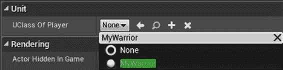

## 如何做…

1.  导航到您想要向其添加`UCLASS`引用成员的 C++类。例如，装饰一个类派生的`UCLASS`玩家相当容易。

1.  在`UCLASS`内部，使用以下形式的代码声明`UPROPERTY`，允许选择从层次结构中派生的`UObject`的`UClass`（蓝图类）：

```cpp
UCLASS()
class CHAPTER2_API UUserProfile : public UObject
{
  UPROPERTY(EditAnywhere, BlueprintReadWrite, Category = Unit)
  TSubclassOf<UObject> UClassOfPlayer; // Displays any UClasses
  // deriving from UObject in a dropdown menu in Blueprints

  // Displays string names of UCLASSes that derive from
  // the GameMode C++ base class
  UPROPERTY( EditAnywhere, meta=(MetaClass="GameMode"), Category = Unit )
  FStringClassReference UClassGameMode;
};
```

1.  将 C++类制作成蓝图，然后打开该蓝图。单击`UClassOfPlayer`菜单旁边的下拉菜单。

1.  从列出的`UClass`的下拉菜单中选择适当的`UClassOfPlayer`成员。

## 它是如何工作的…

### TSubclassOf

`TSubclassOf< >`成员将允许您在 UE4 编辑器内编辑具有`TSubclassOf< >`成员的任何蓝图时，使用下拉菜单指定`UClass`名称。

### FStringClassReference

`MetaClass`标签是指您期望`UClassName`派生自哪个基本 C++类。这将限制下拉菜单的内容仅显示从该 C++类派生的蓝图。如果您希望显示项目中的所有蓝图，可以省略`MetaClass`标签。

# 从您的自定义 UCLASS 创建蓝图

制作蓝图只是从您的 C++对象派生蓝图类的过程。从您的 UE4 对象创建蓝图派生类允许您在编辑器中可视化编辑自定义`UPROPERTY`。这避免了将任何资源硬编码到您的 C++代码中。此外，为了使您的 C++类能够放置在关卡中，必须首先制作成蓝图。但是，只有在蓝图下面的 C++类是`Actor`类派生类时才可能。

### 注意

有一种方法可以使用`FStringAssetReferences`和`StaticLoadObject`来加载资源（例如纹理）。然而，通常不鼓励通过将路径字符串硬编码到您的 C++代码中来加载资源。在`UPROPERTY()`中提供可编辑的值，并从正确的具体类型的资产引用中加载是一个更好的做法。

## 准备工作

要按照此步骤进行操作，您需要有一个构建好的`UCLASS`，您希望从中派生一个蓝图类（请参阅本章前面的*制作 UCLASS-从 UObject 派生*部分）。您还必须在`UCLASS`宏中将您的`UCLASS`标记为`Blueprintable`，以便在引擎内部进行蓝图制作。

### 提示

任何在`UCLASS`宏声明中具有`Blueprintable`元关键字的`UObject`派生类都可以制作成蓝图。

## 如何操作…

1.  要将您的`UserProfile`类制作成蓝图，首先确保`UCLASS`在`UCLASS`宏中具有`Blueprintable`标记。应如下所示：

```cpp
UCLASS( Blueprintable )
class CHAPTER2_API UUserProfile : public UObject
```

1.  编译并运行您的代码。

1.  在**类查看器**中找到`UserProfile` C++类（**窗口** | **开发人员工具** | **类查看器**）。由于先前创建的`UCLASS`不是从`Actor`派生的，因此要找到您的自定义`UCLASS`，您必须在**类查看器**中关闭**筛选器** | **仅显示角色**（默认已选中）：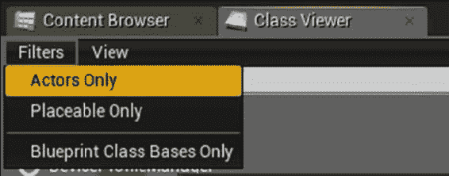

关闭**仅显示角色**复选标记，以显示**类查看器**中的所有类。如果不这样做，那么您的自定义 C++类可能不会显示！

### 提示

请记住，您可以使用**类查看器**中的小搜索框轻松找到`UserProfile`类，只需开始输入即可：

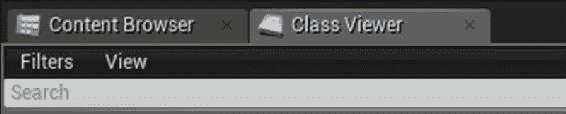

1.  在**类查看器**中找到您的`UserProfile`类，右键单击它，并通过选择**创建蓝图…**从中创建一个蓝图。

1.  给您的蓝图命名。有些人喜欢在蓝图类名之前加上`BP_`。您可以选择遵循这个惯例，也可以不遵循，只要确保保持一致即可。

1.  双击**内容浏览器**中出现的新蓝图，看一看。您将能够为创建的每个`UserProfile`蓝图实例编辑**名称**和**电子邮件**字段。

## 它是如何工作的…

在 UE4 编辑器中，您创建的任何具有`Blueprintable`标记的 C++类都可以在蓝图中使用。蓝图允许您在 UE4 的可视 GUI 界面中自定义 C++类的属性。

# 实例化`UObject`派生类（ConstructObject <>和 NewObject <>）

在 C++中创建类实例通常使用关键字`new`。但是，UE4 实际上在内部创建其类的实例，并要求您调用特殊的工厂函数来生成任何要实例化的`UCLASS`的副本。您创建的是 UE4 蓝图类的实例，而不仅仅是 C++类。当您创建`UObject`派生类时，您将需要使用特殊的 UE4 引擎函数来实例化它们。

工厂方法允许 UE4 在对象上进行一些内存管理，控制对象在删除时的行为。该方法允许 UE4 跟踪对象的所有引用，以便在对象销毁时轻松取消所有对对象的引用。这确保了程序中不存在指向无效内存的悬空指针。

## 准备工作

实例化不是`AActor`类派生类的`UObject`派生类不使用`UWorld::SpawnActor< >`。相反，我们必须使用名为`ConstructObject< >`或`NewObject< >`的特殊全局函数。请注意，您不应该使用裸的 C++关键字`new`来分配您的 UE4 `UObject`类派生的新实例。

您至少需要两个信息来正确实例化您的`UCLASS`实例：

+   一个指向您想要实例化的类类型（蓝图类）的 C++类型的`UClass`引用。

+   蓝图类派生的原始 C++基类

## 如何做...

1.  在全局可访问的对象（如您的`GameMode`对象）中，添加一个`TSubclassOf< YourC++ClassName > UPROPERTY()`来指定并提供`UCLASS`名称给您的 C++代码。例如，我们在我们的`GameMode`对象中添加以下两行：

```cpp
UPROPERTY( EditAnywhere, BlueprintReadWrite, Category = UClassNames )
TSubclassOf<UUserProfile> UPBlueprintClassName;
```

1.  进入 UE4 编辑器，并从下拉菜单中选择您的`UClass`名称，以便您可以看到它的作用。保存并退出编辑器。

1.  在您的 C++代码中，找到您想要实例化`UCLASS`实例的部分。

1.  使用以下公式使用`ConstructObject< >`实例化对象：

```cpp
ObjectType* object = ConstructObject< ObjectType >( UClassReference );
```

例如，使用我们在上一个示例中指定的`UserProfile`对象，我们将得到如下代码：

```cpp
// Get the GameMode object, which has a reference to 
// the UClass name that we should instantiate:
AChapter2GameMode *gm = Cast<AChapter2GameMode>( GetWorld()->GetAuthGameMode() );
if( gm )
{
  UUserProfile* object = ConstructObject<UUserProfile>( gm->UPBlueprintClassName );
}
```

### 提示

如果您愿意，您也可以使用`NewObject`函数如下：

```cpp
UProfile* object = NewObject<UProfile>( GetTransientPackage(), uclassReference );
```

## 它是如何工作的...

使用`ConstructObject`或`NewObject`实例化`UObject`类很简单。`NewObject`和`ConstructObject`几乎做同样的事情：实例化一个蓝图类类型的对象，并返回正确类型的 C++指针。

不幸的是，`NewObject`有一个讨厌的第一个参数，它要求您在每次调用时传递`GetTransientPackage()`。`ConstructObject`在每次调用时不需要此参数。此外，`ConstructObject`为您提供了更多的构造选项。

在构造您的 UE4 `UObject`派生类时不要使用关键字`new`！它将无法得到正确的内存管理。

## 还有更多...

`NewObject`和`ConstructObject`是面向对象编程世界所谓的工厂。您要求工厂为您制造对象-您不会自己构造它。使用工厂模式使引擎能够轻松跟踪对象的创建过程。

# 销毁 UObject 派生类

在 UE4 中删除任何`UObject`派生类都很简单。当您准备删除您的`UObject`派生类时，我们只需在其上调用一个函数（`ConditionalBeginDestroy()`）来开始拆卸。我们不使用本机 C++ `delete`命令来删除`UObject`派生类。我们将在下面的示例中展示这一点。

## 准备工作

您需要在任何未使用的`UObject`派生类上调用`ConditionalBeginDestroy()`，以便将其从内存中删除。不要调用`delete`来回收系统内存中的`UObject`派生类。您必须使用内部引擎提供的内存管理函数。下面将展示如何做到这一点。

## 如何做...

1.  在您的对象实例上调用`objectInstance->ConditionalBeginDestroy()`。

1.  在您的客户端代码中将所有对`objectInstance`的引用设置为 null，并且在对其调用`ConditionalBeginDestroy()`之后不再使用`objectInstance`。 

## 它是如何工作的...

`ConditionalBeginDestroy()`函数通过删除所有内部引擎链接来开始销毁过程。这标记了引擎认为的对象销毁。然后，对象稍后通过销毁其内部属性，随后实际销毁对象来销毁。

在对象上调用了`ConditionalBeginDestroy()`之后，您（客户端）的代码必须考虑对象已被销毁，并且不能再使用它。

实际的内存恢复发生在`ConditionalBeginDestroy()`在对象上调用后的一段时间。有一个垃圾收集例程，它在固定时间间隔内完成清除游戏程序不再引用的对象的内存。垃圾收集器调用之间的时间间隔列在`C:\Program Files (x86)\Epic Games\4.11\Engine\Config \BaseEngine.ini`中，默认为每 60 秒进行一次收集：

```cpp
gc.TimeBetweenPurgingPendingKillObjects=60
```

### 提示

如果在多次`ConditionalBeginDestroy()`调用后内存似乎不足，您可以通过调用`GetWorld()->ForceGarbageCollection(true)`来触发内存清理，以强制进行内部内存清理。

通常，除非您急需清除内存，否则无需担心垃圾收集或间隔。不要过于频繁地调用垃圾收集例程，因为这可能会导致游戏不必要的延迟。

# 创建一个 USTRUCT

您可能希望在 UE4 中构造一个蓝图可编辑的属性，其中包含多个成员。我们将在本章中创建的`FColoredTexture`结构将允许您将纹理和其颜色组合在同一结构中，以便在任何其他`UObject`衍生的`Blueprintable`类中进行包含和指定：

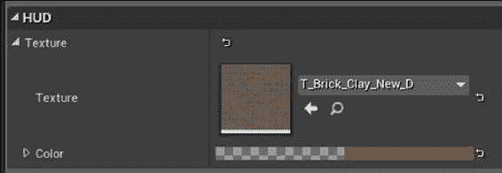

`FColoredTexture`结构确实在蓝图中具有上述图中显示的外观。

这是为了良好的组织和方便您的其他`UCLASS``UPROPERTIES()`。您可能希望在游戏中使用关键字`struct`构造一个 C++结构。

## 准备工作

`UObject`是所有 UE4 类对象的基类，而`FStruct`只是任何普通的 C++风格结构。所有使用引擎内的自动内存管理功能的对象必须从此类派生。

### 提示

如果您还记得 C++语言，C++类和 C++结构之间唯一的区别是 C++类具有默认的`private`成员，而结构默认为`public`成员。在 C#等语言中，情况并非如此。在 C#中，结构是值类型，而类是引用类型。

## 如何做...

我们将在 C++代码中创建一个名为`FColoredTexture`的结构，其中包含一个纹理和一个调制颜色：

1.  在项目文件夹中创建一个名为`ColoredTexture.h`的文件（而不是`FColoredTexture`）。

1.  `ColoredTexture.h`包含以下代码：

```cpp
#pragma once

#include "Chapter2.h"
#include "ColoredTexture.generated.h"

USTRUCT()
struct CHAPTER2_API FColoredTexture
{
  GENERATED_USTRUCT_BODY()
  public:
  UPROPERTY( EditAnywhere, BlueprintReadWrite, Category = HUD )
  UTexture* Texture;
  UPROPERTY( EditAnywhere, BlueprintReadWrite, Category = HUD )
  FLinearColor Color;
};
```

1.  在一些可蓝图化的`UCLASS()`中，使用`ColoredTexture.h`作为`UPROPERTY()`，使用如下的`UPROPERTY()`声明：

```cpp
UPROPERTY( EditAnywhere, BlueprintReadWrite, Category = HUD )
FColoredTexture* Texture;
```

## 它是如何工作的...

为`FColoredTexture`指定的`UPROPERTY()`将显示为可编辑字段，当作为`UPROPERTY()`字段包含在另一个类中时，如步骤 3 所示。

## 还有更多...

将结构标记为`USTRUCT()`而不仅仅是普通的 C++结构的主要原因是与 UE4 引擎功能进行接口。您可以使用纯 C++代码（而不创建`USTRUCT()`对象）快速创建小型结构，而不要求引擎直接使用它们。

# 创建一个 UENUM()

C++的`enum`在典型的 C++代码中非常有用。UE4 有一种称为`UENUM()`的自定义枚举类型，它允许您创建一个将显示在正在编辑的蓝图内的下拉菜单中的`enum`。

## 如何做...

1.  转到将使用您指定的`UENUM()`的头文件，或创建一个名为`EnumName.h`的文件。

1.  使用以下形式的代码：

```cpp
UENUM()
enum Status
{
  Stopped     UMETA(DisplayName = "Stopped"),
  Moving      UMETA(DisplayName = "Moving"),
  Attacking   UMETA(DisplayName = "Attacking"),
};
```

1.  在`UCLASS()`中使用您的`UENUM()`如下：

```cpp
UPROPERTY(EditAnywhere, BlueprintReadWrite, Category = Status)
TEnumAsByte<Status> status;

```

## 它是如何工作的...

`UENUM()`在代码编辑器中显示为蓝图编辑器中的下拉菜单，您只能从中选择几个值。

# 创建一个 UFUNCTION

`UFUNCTION()`很有用，因为它们是可以从您的 C++客户端代码以及蓝图图表中调用的 C++函数。任何 C++函数都可以标记为`UFUNCTION()`。

## 如何做...

1.  构建一个`UClass`，其中包含您想要暴露给蓝图的成员函数。用`UFUNCTION( BlueprintCallable, Category=SomeCategory)`装饰该成员函数，以使其可以从蓝图中调用。例如，以下是再次提到的“战士”类：

```cpp
// Warrior.h
class WRYV_API AWarrior : public AActor
{
  GENERATED_BODY()
  public:
  UPROPERTY(EditAnywhere, BlueprintReadWrite, Category = Properties)
  FString Name;
  UFUNCTION(BlueprintCallable, Category = Properties)
  FString ToString();
};

// Warrior.cpp
FString UProfile::ToString()
{
  return FString::Printf( "An instance of UProfile: %s", *Name );
}
```

1.  通过将实例拖放到游戏世界上来创建您的“战士”类的实例。

1.  从蓝图中，点击您的“战士”实例，调用`ToString()`函数。然后，在蓝图图表中，输入`ToString()`。它应该看起来像下面的截图：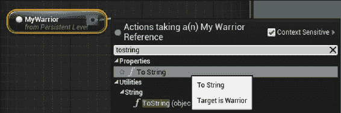

### 提示

为了在实例上调用函数，在蓝图图表中开始输入自动完成菜单时，实例必须在**世界大纲**中被选中，如下面的截图所示：

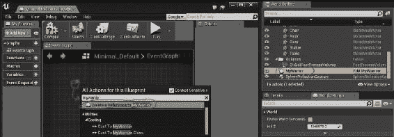

## 工作原理…

`UFUNCTION()`实际上是 C++函数，但具有额外的元数据，使它们可以被蓝图访问。
