# 第四章：Actor 和组件

在本章中，我们将涵盖以下示例：

+   在 C++中创建自定义`Actor`

+   使用`SpawnActor`实例化`Actor`

+   使用`Destroy`和定时器销毁`Actor`

+   使用`SetLifeSpan`在延迟后销毁`Actor`

+   通过组合实现`Actor`功能

+   使用`FObjectFinder`将资产加载到组件中

+   通过继承实现`Actor`功能

+   附加组件以创建层次结构

+   创建自定义`Actor`组件

+   创建自定义`Scene`组件

+   创建自定义`Primitive`组件

+   为 RPG 创建`InventoryComponent`

+   创建`OrbitingMovement`组件

+   创建生成单位的建筑物

# 介绍

Actor 是在游戏世界中具有一定存在的类。Actor 通过合并组件获得其专门功能。本章涉及创建自定义 Actor 和组件，它们的作用以及它们如何一起工作。

# 在 C++中创建自定义 Actor

在 Unreal 默认安装的一些不同类型的 Actor 中，您可能会发现自己在项目开发过程中需要创建自定义的 Actor。这可能发生在您需要向现有类添加功能时，将组件组合成默认子类中不存在的组合，或者向类添加额外的成员变量时。接下来的两个示例演示了如何使用组合或继承来自定义 Actor。

## 准备工作

确保您已经按照第一章中的示例安装了 Visual Studio 和 Unreal 4，*UE4 开发工具*。您还需要有一个现有项目，或者使用 Unreal 提供的向导创建一个新项目。

## 如何做...

1.  在 Unreal Editor 中打开您的项目，然后单击**Content Browser**中的**Add New**按钮：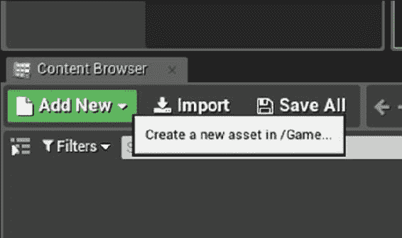

1.  选择**New C++ Class...**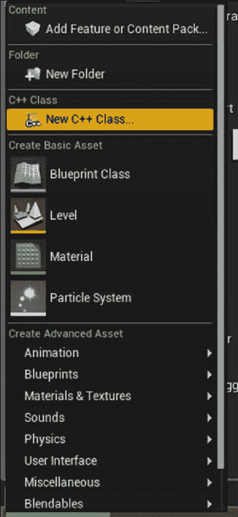

1.  在打开的对话框中，从列表中选择**Actor**：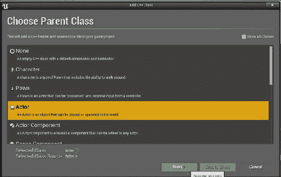

1.  给您的 Actor 一个名称，比如`MyFirstActor`，然后单击**OK**启动 Visual Studio。

### 提示

按照惯例，`Actor`子类的类名以`A`开头。在使用此类创建向导时，请确保不要为您的类添加`A`前缀，因为引擎会自动为您添加前缀。

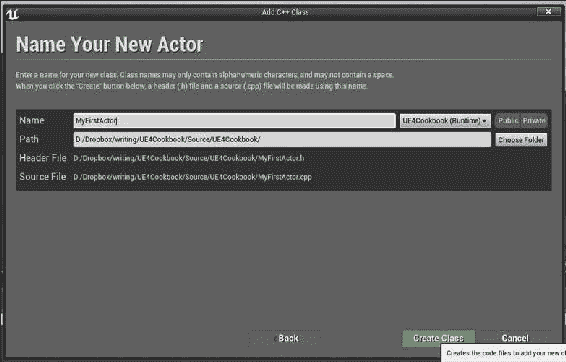

1.  当 Visual Studio 加载时，您应该看到与以下列表非常相似的内容：

```cpp
MyFirstActor.h
#pragma once

#include "GameFramework/Actor.h"
#include "MyFirstActor.generated.h"

UCLASS()
class UE4COOKBOOK_API AMyFirstActor : public AActor
{
  GENERATED_BODY()
  public:
  AMyFirstActor(); 
};
MyFirstActor.cpp
#include "UE4Cookbook.h"
#include "MyFirstActor.h"
AMyFirstActor::AMyFirstActor()
{
  PrimaryActorTick.bCanEverTick = true;
}
```

## 它是如何工作的...

随着时间的推移，您将熟悉标准代码，因此您将能够在不使用 Unreal 向导的情况下直接从 Visual Studio 创建新类。

+   `#pragma once`: 这个预处理器语句，或者`pragma`，是 Unreal 预期的实现包含保护的方法——防止多次引用`include`文件导致错误。

+   `#include "GameFramework/Actor.h"`: 我们将创建一个`Actor`子类，因此自然需要包含我们从中继承的类的`header`文件。

+   `#include "MyFirstActor.generated.h"`: 所有 actor 类都需要包含它们的`generated.h`文件。这个文件是根据它在您的文件中检测到的宏自动由**Unreal Header Tool** (**UHT**)创建的。

+   `UCLASS()`: `UCLASS`是这样一个宏，它允许我们指示一个类将暴露给 Unreal 的反射系统。反射允许我们在运行时检查和迭代对象属性，以及管理对我们对象的引用以进行垃圾回收。

+   `class UE4COOKBOOK_API AMyFirstActor : public AActor`：这是我们类的实际声明。`UE4COOKBOOK_API`宏是由 UHT 创建的，通过确保项目模块的类在 DLL 中正确导出，可以帮助我们的项目在 Windows 上正确编译。你还会注意到`MyFirstActor`和`Actor`都有前缀`A`——这是虚幻要求的从`Actor`继承的本地类的命名约定。

+   `GENERATED_BODY()`: `GENERATED_BODY`是另一个 UHT 宏，已经扩展到包括底层 UE 类型系统所需的自动生成函数。

+   `PrimaryActorTick.bCanEverTick = true;`：在构造函数实现中，这一行启用了这个`Actor`的 tick。所有的 Actor 都有一个名为`Tick`的函数，这个布尔变量意味着`Actor`将每帧调用一次该函数，使得`Actor`能够在每帧执行必要的操作。作为性能优化，默认情况下是禁用的。

# 使用 SpawnActor 实例化一个 Actor

对于这个配方，你需要准备一个`Actor`子类来实例化。你可以使用内置类，比如`StaticMeshActor`，但最好练习使用上一个配方中创建的自定义`Actor`。

## 如何操作...

1.  创建一个新的 C++类，就像在上一个配方中一样。这次，选择`GameMode`作为基类，给它起一个名字，比如`UE4CookbookGameMode`。

1.  在你的新`GameMode`类中声明一个函数重写：

```cpp
virtual void BeginPlay() override;
```

1.  在`.cpp`文件中实现`BeginPlay`：

```cpp
void AUE4CookbookGameMode::BeginPlay()
{
  Super::BeginPlay();
  GEngine->AddOnScreenDebugMessage(-1, -1, FColor::Red, TEXT("Actor Spawning"));

  FTransform SpawnLocation;
  GetWorld()->SpawnActor<AMyFirstActor>( AMyFirstActor::StaticClass(), &SpawnLocation);
}
```

1.  编译你的代码，可以通过 Visual Studio 或者在虚幻编辑器中点击**编译**按钮来进行。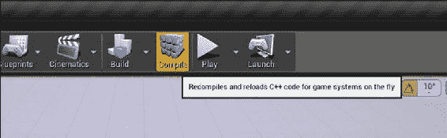

1.  通过点击**设置**工具栏图标，然后从下拉菜单中选择**World Settings**，打开当前级别的**World Settings**面板。在**GameMode Override**部分，将游戏模式更改为你刚刚创建的`GameMode`子类，如下两个截图所示: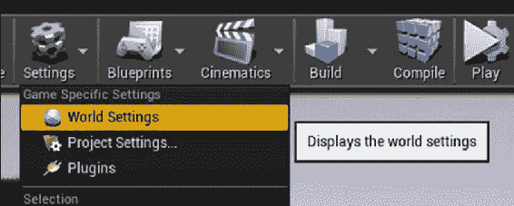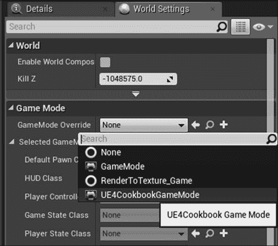

1.  启动关卡，并通过查看**World Outliner**面板来验证`GameMode`是否在世界中生成了你的`Actor`的副本。你可以通过查看屏幕上显示的**Actor Spawning**文本来验证`BeginPlay`函数是否正在运行。如果没有生成，请确保世界原点没有障碍物阻止`Actor`生成。你可以通过在**World Outliner**面板顶部的搜索栏中输入来搜索世界中的对象列表，以过滤显示的实体。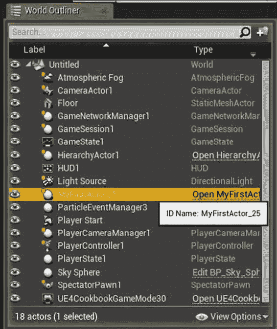

## 工作原理...

1.  `GameMode`是一种特殊类型的 Actor，它是虚幻游戏框架的一部分。地图的`GameMode`在游戏启动时由引擎自动实例化。

1.  通过将一些代码放入自定义`GameMode`的`BeginPlay`方法中，我们可以在游戏开始时自动运行它。

1.  在`BeginPlay`中，我们创建一个`FTransform`，用于`SpawnActor`函数。默认情况下，`FTransform`被构造为零旋转，并且位置在原点。

1.  然后，我们使用`GetWorld`获取当前级别的`UWorld`实例，然后调用它的`SpawnActor`函数。我们传入之前创建的`FTransform`，以指定对象应该在其位置即原点处创建。

# 使用 Destroy 和定时器销毁一个 Actor

这个配方将重用上一个配方中的`GameMode`，所以你应该先完成它。

## 如何操作...

1.  对`GameMode`声明进行以下更改：

```cpp
UPROPERTY()
AMyFirstActor* SpawnedActor;
UFUNCTION()
void DestroyActorFunction();
```

1.  在实现文件的包含中添加`#include "MyFirstActor.h"`。

1.  将`SpawnActor`的结果分配给新的`SpawnedActor`变量：

```cpp
SpawnedActor = GetWorld()->SpawnActor<AMyFirstActor> (AMyFirstActor::StaticClass(), SpawnLocation);
```

1.  在`BeginPlay`函数的末尾添加以下内容：

```cpp
FTimerHandle Timer;
GetWorldTimerManager().SetTimer(Timer, this, &AUE4CookbookGameMode::DestroyActorFunction, 10);
```

1.  最后，实现`DestroyActorFunction`：

```cpp
void AUE4CookbookGameMode::DestroyActorFunction()
{
  if (SpawnedActor != nullptr)
  {
    SpawnedActor->Destroy();
  }
}
```

1.  加载你在上一个配方中创建的具有自定义类游戏模式的关卡。

1.  播放你的关卡，并使用 Outliner 验证你的`SpawnedActor`在 10 秒后被删除。

## 它的工作原理...

+   我们声明一个`UPROPERTY`来存储我们生成的`Actor`实例，并创建一个自定义函数来调用，以便我们可以在计时器上调用`Destroy()`：

```cpp
UPROPERTY()
AMyFirstActor* SpawnedActor;
UFUNCTION()
void DestroyActorFunction();
```

+   在`BeginPlay`中，我们将生成的`Actor`分配给我们的新`UPROPERTY`：

```cpp
SpawnedActor = GetWorld()->SpawnActor<AMyFirstActor> (AMyFirstActor::StaticClass(), SpawnLocation);
```

+   然后我们声明一个`TimerHandle`对象，并将其传递给`GetWorldTimerManager::SetTimer`。`SetTimer`在 10 秒后调用`DestroyActorFunction`指向的对象。`SetTimer`返回一个对象，一个句柄，允许我们在必要时取消计时器。`SetTimer`函数将`TimerHandle`对象作为引用参数传入，因此我们提前声明它，以便正确地将其传递给函数：

```cpp
FTimerHandle Timer;
GetWorldTimerManager().SetTimer(Timer, this, &AUE4CookbookGameMode::DestroyActorFunction, 10);
```

+   `DestroyActorFunction`检查我们是否有一个有效的生成`Actor`的引用：

```cpp
void AUE4CookbookGameMode::DestroyActorFunction()
{
  if (SpawnedActor != nullptr)
}
```

+   如果这样做，它会调用实例上的`Destroy`，因此它将被销毁，并最终被垃圾回收：

```cpp
SpawnedActor->Destroy();
```

# 使用 SetLifeSpan 延迟销毁 Actor

让我们看看如何销毁一个`Actor`。

## 如何做...

1.  使用向导创建一个新的 C++类。选择`Actor`作为你的基类。

1.  在`Actor`的实现中，将以下代码添加到`BeginPlay`函数中：

```cpp
SetLifeSpan(10);
```

1.  将你的自定义`Actor`的一个副本拖到编辑器中的视口中。

1.  播放你的关卡，并查看 Outliner，以验证你的`Actor`实例在 10 秒后消失，自行销毁。

## 它的工作原理...

1.  我们将代码插入到`BeginPlay`函数中，以便在游戏启动时执行。

1.  `SetLifeSpan(10);`：`SetLifeSpan`函数允许我们指定持续时间（以秒为单位），之后`Actor`调用自己的`Destroy()`方法。

# 通过组合实现 Actor 功能

没有组件的自定义 Actor 没有位置，也不能附加到其他 Actor。没有根组件，Actor 没有基本变换，因此它没有位置。因此，大多数 Actor 至少需要一个组件才能有用。

我们可以通过组合创建自定义 Actor-向我们的`Actor`添加多个组件，其中每个组件提供所需的一些功能。

## 准备工作

这个示例将使用*在 C++中创建自定义 Actor*中创建的`Actor`类。

## 如何做...

1.  通过在`public`部分进行以下更改，在你的自定义类中添加一个新成员：

```cpp
UPROPERTY()
UStaticMeshComponent* Mesh;
```

1.  在 cpp 文件的构造函数中添加以下行：

```cpp
Mesh = CreateDefaultSubobject<UStaticMeshComponent>("BaseMeshComponent");
```

1.  验证你的代码看起来像以下片段，并通过编辑器中的**Compile**按钮编译它，或者在 Visual Studio 中构建项目：

```cpp
UCLASS()
class UE4COOKBOOK_API AMyFirstActor : public AActor
{
  GENERATED_BODY()
  public:
  AMyFirstActor();

  UPROPERTY() 
  UStaticMeshComponent* Mesh;
};

#include "UE4Cookbook.h"
#include "MyFirstActor.h"
AMyFirstActor::AMyFirstActor()
{
  PrimaryActorTick.bCanEverTick = true;

  Mesh = CreateDefaultSubobject<UStaticMeshComponent>("BaseMeshComponent");
}
```

1.  编译此代码后，将类的一个实例从**Content Browser**拖到游戏环境中，您将能够验证它现在具有变换和其他属性，例如来自我们添加的`StaticMeshComponent`的 Static Mesh。

## 它的工作原理...

1.  我们在类声明中添加的`UPROPERTY 宏`是一个指针，用于保存我们作为`Actor`子对象的组件。

```cpp
UPROPERTY()
UStaticMeshComponent* Mesh;
```

1.  使用`UPROPERTY()`宏确保指针中声明的对象被视为引用，并且不会被垃圾回收（即删除），从而使指针悬空。

1.  我们使用了一个 Static Mesh 组件，但任何`Actor`组件子类都可以工作。请注意，星号与变量类型连接在一起，符合 Epic 的样式指南。

1.  在构造函数中，我们使用`template`函数将指针初始化为已知的有效值，`template<class TReturnType> TReturnType* CreateDefaultSubobject(FName SubobjectName, bool bTransient = false)`。

1.  这个函数负责调用引擎代码来适当初始化组件，并返回一个指向新构造对象的指针，以便我们可以给我们的组件指针一个默认值。这很重要，显然，以确保指针始终具有有效值，最大程度地减少对未初始化内存的引用风险。

1.  该函数是基于要创建的对象类型进行模板化的，但还接受两个参数——第一个是子对象的名称，理想情况下应该是可读的，第二个是对象是否应该是瞬态的（即不保存在父对象中）。

## 另请参阅

+   以下食谱向您展示如何在静态网格组件中引用网格资产，以便可以在不需要用户在编辑器中指定网格的情况下显示它

# 使用 FObjectFinder 将资产加载到组件中

在上一个食谱中，我们创建了一个静态网格组件，但我们没有尝试加载一个网格来显示组件。虽然在编辑器中可以做到这一点，但有时在 C++中指定默认值会更有帮助。

## 准备工作

按照上一个食谱，这样您就有了一个准备好的自定义`Actor`子类，其中包含一个静态网格组件。

在您的**内容浏览器**中，单击**查看选项**按钮，然后选择**显示引擎内容**：

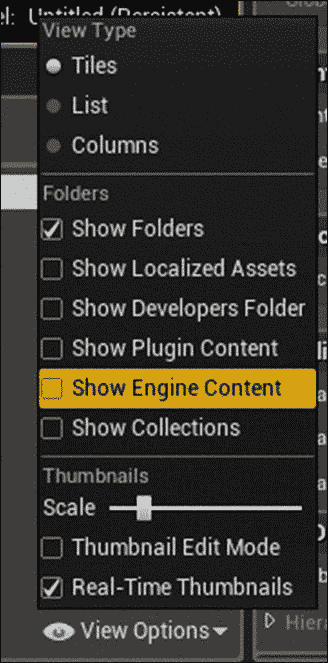

浏览到**引擎内容**，然后到**基本形状**，看看我们将在这个食谱中使用的**立方体**。

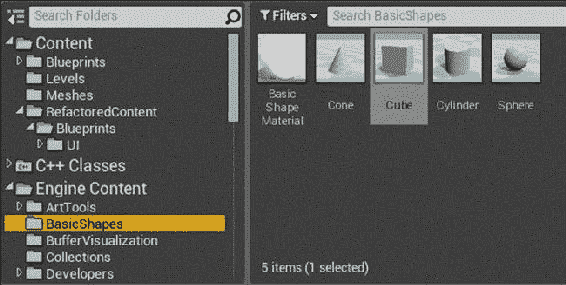

## 如何做...

1.  将以下代码添加到您的类的构造函数中：

```cpp
auto MeshAsset = ConstructorHelpers::FObjectFinder<UStaticMesh>(TEXT("StaticMesh'/Engine/BasicShapes/Cube.Cube'"));
if (MeshAsset.Object != nullptr)
{
  Mesh->SetStaticMesh(MeshAsset.Object);
}
```

1.  编译，并在编辑器中验证您的类的实例现在具有网格作为其视觉表示。

## 工作原理...

+   我们创建了`FObjectFinder`类的一个实例，将要加载的资产类型作为模板参数传递进去。

+   `FObjectFinder`是一个类模板，帮助我们加载资产。当我们构造它时，我们传入一个包含我们要加载的资产路径的字符串。

+   字符串的格式为`"{ObjectType}'/Path/To/Asset.Asset'"`。请注意字符串中使用了单引号。

+   为了获取已经存在于编辑器中的资产的字符串，您可以在**内容浏览器**中右键单击资产，然后选择**复制引用**。这会给您一个字符串，这样您就可以将其粘贴到您的代码中。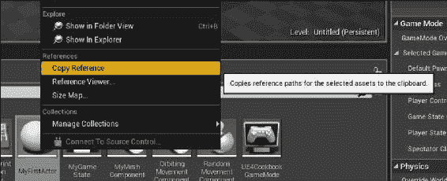

+   我们使用了 C++11 中的`auto`关键字，以避免在声明中输入整个对象类型；编译器会为我们推断出类型。如果没有`auto`，我们将不得不使用以下代码：

```cpp
ConstructorHelpers::FObjectFinder<UStaticMesh> MeshAsset = ConstructorHelpers::FObjectFinder<UStaticMesh>(TEXT("StaticMesh'/Engine/BasicShapes/Cube.Cube'"));
```

+   `FObjectFinder`类有一个名为`Object`的属性，它要么有指向所需资产的指针，要么是`NULL`，如果找不到资产。

+   这意味着我们可以将其与`nullptr`进行比较，如果它不是空的，就使用`SetStaticMesh`将其分配给`Mesh`。

# 通过继承实现 Actor 功能

继承是实现自定义`Actor`的第二种方法。这通常是为了创建一个新的子类，它添加成员变量、函数或组件到现有的`Actor`类中。在这个食谱中，我们将向自定义的`GameState`子类添加一个变量。

## 如何做...

1.  在虚幻编辑器中，单击**内容浏览器**中的**添加新内容**，然后单击**新建 C++类...**，然后选择**GameState**作为基类，然后给您的新类起一个名字。

1.  将以下代码添加到新类头文件中：

```cpp
AMyGameState(); 

UFUNCTION()
void SetScore(int32 NewScore);

UFUNCTION()
int32 GetScore();
private:
UPROPERTY()
int32 CurrentScore;
```

1.  将以下代码添加到 cpp 文件中：

```cpp
AMyGameState::AMyGameState()
{
  CurrentScore = 0;
}

int32 AMyGameState::GetScore()
{
  return CurrentScore;
}

void AMyGameState::SetScore(int32 NewScore)
{
  CurrentScore = NewScore;
}
```

1.  确认您的代码看起来像以下清单，并使用虚幻编辑器中的**编译**按钮进行编译：

```cpp
MyGameState.h
#pragma once

#include "GameFramework/GameState.h"
#include "MyGameState.generated.h"

/**
*
*/
UCLASS()
class UE4COOKBOOK_API AMyGameState : public AGameState
{
  GENERATED_BODY()
  public:
  AMyGameState();

  UPROPERTY()
  int32 CurrentScore;

  UFUNCTION()
  int32 GetScore();

  UFUNCTION()
  void SetScore(uint32 NewScore);
};
MyGameState.cpp
#include "UE4Cookbook.h"
#include "MyGameState.h"

AMyGameState::AMyGameState()
{
  CurrentScore = 0;
}

int32 AMyGameState::GetScore()
{
  return CurrentScore;
}

void AMyGameState::SetScore(uint32 NewScore)
{
  CurrentScore = NewScore;
}
```

## 工作原理...

1.  首先，我们添加了默认构造函数的声明：

```cpp
AMyGameState();
```

1.  这使我们能够在对象初始化时将我们的新成员变量设置为安全的默认值`0`：

```cpp
AMyGameState::AMyGameState()
{
  CurrentScore = 0;
}
```

1.  在声明新变量时，我们使用`int32`类型，以确保在虚幻引擎支持的各种编译器之间具有可移植性。这个变量将负责在游戏运行时存储当前游戏分数。与往常一样，我们将使用`UPROPERTY`标记我们的变量，以便它能够得到适当的垃圾回收。这个变量被标记为`private`，所以改变值的唯一方式是通过我们的函数：

```cpp
UPROPERTY()
int32 CurrentScore;
```

1.  `GetScore`函数将检索当前分数，并将其返回给调用者。它被实现为一个简单的访问器，只是返回基础成员变量。

1.  第二个函数`SetScore`设置成员变量的值，允许外部对象请求更改分数。将此请求作为函数确保`GameState`可以审核此类请求，并且仅在有效时才允许它们，以防止作弊。此类检查的具体内容超出了本配方的范围，但`SetScore`函数是进行此类检查的适当位置。

1.  我们的分数函数使用`UFUNCTION`宏声明有多种原因。首先，`UFUNCTION`可以通过一些额外的代码被蓝图调用或重写。其次，`UFUNCTION`可以标记为`exec`—这意味着它们可以在游戏会话期间由玩家或开发人员作为控制台命令运行，这样可以进行调试。

## 另请参阅

+   第八章, *集成 C++和虚幻编辑器,* 有一个名为*创建新控制台命令*的配方，您可以参考有关`exec`和控制台命令功能的更多信息

# 将组件附加到创建层次结构

在从组件创建自定义 Actor 时，考虑“附加”的概念非常重要。将组件附加在一起会创建一个关系，其中应用于父组件的变换也会影响附加到它的组件。

## 如何做...

1.  使用编辑器基于`Actor`创建一个新类，并将其命名为`HierarchyActor`。

1.  将以下属性添加到您的新类中：

```cpp
UPROPERTY()
USceneComponent* Root;
UPROPERTY()
USceneComponent* ChildSceneComponent;
UPROPERTY()
UStaticMeshComponent* BoxOne;
UPROPERTY()
UStaticMeshComponent* BoxTwo;
```

1.  将以下代码添加到类构造函数中：

```cpp
Root = CreateDefaultSubobject<USceneComponent>("Root");
ChildSceneComponent = CreateDefaultSubobject<USceneComponent>("ChildSceneComponent");
BoxOne = CreateDefaultSubobject<UStaticMeshComponent>("BoxOne");
BoxTwo = CreateDefaultSubobject<UStaticMeshComponent>("BoxTwo");

auto MeshAsset = ConstructorHelpers::FObjectFinder<UStaticMesh>(TEXT("StaticMesh'/Engine/BasicShapes/Cube.Cube'"));
if (MeshAsset.Object != nullptr)
{
  BoxOne->SetStaticMesh(MeshAsset.Object);
  BoxTwo->SetStaticMesh(MeshAsset.Object);
}
RootComponent = Root;
BoxOne->AttachTo(Root);
BoxTwo->AttachTo(ChildSceneComponent);
ChildSceneComponent->AttachTo(Root);
ChildSceneComponent->SetRelativeTransform(FTransform(FRotator(0, 0, 0), FVector(250, 0, 0), FVector(0.1f)));
```

1.  验证您的代码是否如下所示：

```cpp
HierarchyActor.h
#pragma once

#include "GameFramework/Actor.h"
#include "HierarchyActor.generated.h"

UCLASS()
class UE4COOKBOOK_API AHierarchyActor : public AActor
{
  GENERATED_BODY()
  public:
  AHierarchyActor();
  virtual void BeginPlay() override;
  virtual void Tick( float DeltaSeconds ) override;
  UPROPERTY()
  USceneComponent* Root;
  UPROPERTY()
  USceneComponent* ChildSceneComponent;
  UPROPERTY()
  UStaticMeshComponent* BoxOne;
  UPROPERTY()
  UStaticMeshComponent* BoxTwo;
};
HierarchyActor.cpp

#include "UE4Cookbook.h"
#include "HierarchyActor.h"

AHierarchyActor::AHierarchyActor()
{
  PrimaryActorTick.bCanEverTick = true;
  Root = CreateDefaultSubobject<USceneComponent>("Root");
  ChildSceneComponent = CreateDefaultSubobject<USceneComponent>("ChildSceneComponent");
  BoxOne = CreateDefaultSubobject<UStaticMeshComponent>("BoxOne");
  BoxTwo = CreateDefaultSubobject<UStaticMeshComponent>("BoxTwo");
  auto MeshAsset = ConstructorHelpers::FObjectFinder<UStaticMesh>(TEXT("StaticMesh'/Engine/BasicShapes/Cube.Cube'"));
  if (MeshAsset.Object != nullptr)
  {
    BoxOne->SetStaticMesh(MeshAsset.Object);
    BoxOne->SetCollisionProfileName(UCollisionProfile::Pawn_ProfileName);
    BoxTwo->SetStaticMesh(MeshAsset.Object);
    BoxTwo->SetCollisionProfileName(UCollisionProfile::Pawn_ProfileName);	
  }
  RootComponent = Root;
  BoxOne->AttachTo(Root);
  BoxTwo->AttachTo(ChildSceneComponent);
  ChildSceneComponent->AttachTo(Root);
  ChildSceneComponent->SetRelativeTransform(FTransform(FRotator(0, 0, 0), FVector(250, 0, 0), FVector(0.1f)));
}
void AHierarchyActor::BeginPlay()
{
  Super::BeginPlay();
}
void AHierarchyActor::Tick( float DeltaTime )
{
  Super::Tick( DeltaTime );
}
```

1.  编译并启动编辑器。将 HierarchyActor 的副本拖入场景中。！如何做...

1.  验证`Actor`在层次结构中是否有组件，并且第二个框的大小较小。！如何做...

## 它是如何工作的...

1.  像往常一样，我们为我们的 Actor 创建一些带有`UPROPERTY`标记的组件。我们创建了两个场景组件和两个静态网格组件。

1.  在构造函数中，我们像往常一样为每个组件创建默认子对象。

1.  然后，我们加载静态网格，如果加载成功，将其分配给两个静态网格组件，以便它们具有视觉表示。

1.  然后，我们通过附加组件在我们的`Actor`中构建了一个层次结构。

1.  我们将第一个场景组件设置为`Actor`根。此组件将确定应用于层次结构中所有其他组件的变换。

1.  然后，我们将第一个框附加到我们的新根组件，并将第二个场景组件作为第一个组件的父级。

1.  我们将第二个框附加到我们的子场景组件，以演示更改该场景组件上的变换如何影响其子组件，但不影响对象中的其他组件。

1.  最后，我们设置场景组件的相对变换，使其从原点移动一定距离，并且是比例的十分之一。

1.  这意味着在编辑器中，您可以看到`BoxTwo`组件继承了其父组件`ChildSceneComponent`的平移和缩放。

# 创建自定义 Actor 组件

Actor 组件是实现应该在 Actor 之间共享的常见功能的简单方法。Actor 组件不会被渲染，但仍然可以执行操作，比如订阅事件或与包含它们的 Actor 的其他组件进行通信。

## 如何做...

1.  使用编辑器向导创建一个名为`RandomMovementComponent`的`ActorComponent`。将以下类说明符添加到`UCLASS`宏中：

```cpp
UCLASS( ClassGroup=(Custom), meta=(BlueprintSpawnableComponent) )
```

1.  在类头文件中添加以下`UPROPERTY`：

```cpp
UPROPERTY()
float MovementRadius;
```

1.  将以下内容添加到构造函数的实现中：

```cpp
MovementRadius = 0;
```

1.  最后，将以下内容添加到`TickComponent()`的实现中：

```cpp
AActor* Parent = GetOwner();
if (Parent)
{
  Parent->SetActorLocation(
  Parent->GetActorLocation() +
  FVector(
  FMath::FRandRange(-1, 1)* MovementRadius,
  FMath::FRandRange(-1, 1)* MovementRadius,
  FMath::FRandRange(-1, 1)* MovementRadius));
}
```

1.  验证您的代码是否如下所示：

```cpp
#pragma once
#include "Components/ActorComponent.h"
#include "RandomMovementComponent.generated.h"
UCLASS( ClassGroup=(Custom), meta=(BlueprintSpawnableComponent) )
class UE4COOKBOOK_API URandomMovementComponent : public UActorComponent
{
  GENERATED_BODY()
  public:
  URandomMovementComponent();
  virtual void BeginPlay() override;
  virtual void TickComponent( float DeltaTime, ELevelTick TickType, FActorComponentTickFunction* ThisTickFunction ) override;
  UPROPERTY()
  float MovementRadius;
};

#include "UE4Cookbook.h"
#include "RandomMovementComponent.h"
URandomMovementComponent::URandomMovementComponent()
{
  bWantsBeginPlay = true;
  PrimaryComponentTick.bCanEverTick = true;
  MovementRadius = 5;
}

void URandomMovementComponent::BeginPlay()
{
  Super::BeginPlay();
}

void URandomMovementComponent::TickComponent( float DeltaTime, ELevelTick TickType, FActorComponentTickFunction* ThisTickFunction )
{
  Super::TickComponent( DeltaTime, TickType, ThisTickFunction );
  AActor* Parent = GetOwner();
  if (Parent)
  {
    Parent->SetActorLocation(
    Parent->GetActorLocation() +
    FVector(
    FMath::FRandRange(-1, 1)* MovementRadius,
    FMath::FRandRange(-1, 1)* MovementRadius,
    FMath::FRandRange(-1, 1)* MovementRadius));
  }
}
```

1.  编译您的项目。在编辑器中，创建一个空的`Actor`，并将**Random Movement**组件添加到其中。要做到这一点，从**放置**选项卡中将**空 Actor**拖到级别中，然后在**详细信息**面板中单击**添加组件**，并选择**Random Movement**。再次执行相同的操作以添加**Cube**组件，以便您有东西来可视化 actor 的位置。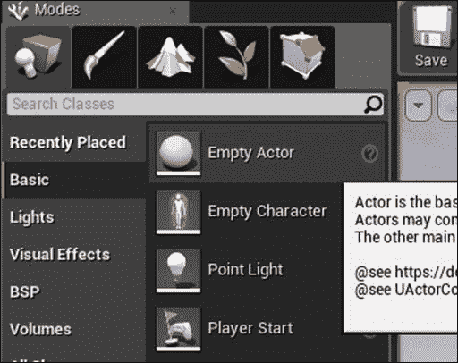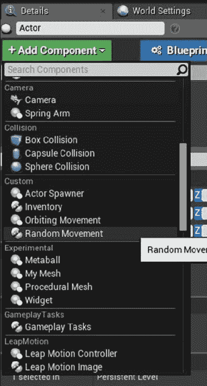

1.  播放你的关卡，并观察 actor 在每次调用`TickComponent`函数时随机移动的位置改变。

## 它是如何工作的...

1.  首先，在组件声明中使用的`UCLASS`宏中添加一些说明符。将`BlueprintSpawnableComponent`添加到类的元值中意味着可以在编辑器中将组件的实例添加到蓝图类中。`ClassGroup`说明符允许我们指示组件在类列表中属于哪个类别：

```cpp
UCLASS( ClassGroup=(Custom), meta=(BlueprintSpawnableComponent) )
```

1.  将`MovementRadius`作为新组件的属性添加，允许我们指定组件在单个帧中允许漫游的距离：

```cpp
UPROPERTY()
float MovementRadius;
```

1.  在构造函数中，我们将此属性初始化为安全的默认值：

```cpp
MovementRadius =5;
```

1.  `TickComponent`是引擎每帧调用的函数，就像`Tick`对于 Actors 一样。在其实现中，我们检索组件所有者的当前位置，即包含我们组件的`Actor`，并在世界空间中生成一个偏移量：

```cpp
AActor* Parent = GetOwner();
if (Parent)
{
  Parent->SetActorLocation(
  Parent->GetActorLocation() +
  FVector(
  FMath::FRandRange(-1, 1)* MovementRadius,
  FMath::FRandRange(-1, 1)* MovementRadius,
  FMath::FRandRange(-1, 1)* MovementRadius)
  );
}
```

1.  我们将随机偏移添加到当前位置以确定新位置，并将拥有的 actor 移动到该位置。这会导致 actor 的位置在每一帧随机改变并且跳动。

# 创建自定义 Scene Component

`Scene`组件是`Actor`组件的子类，具有变换，即相对位置、旋转和缩放。就像`Actor`组件一样，`Scene`组件本身不会被渲染，但可以使用它们的变换进行各种操作，比如在`Actor`的固定偏移处生成其他对象。

## 如何做...

1.  创建一个名为`ActorSpawnerComponent`的自定义`SceneComponent`。对头文件进行以下更改：

```cpp
UFUNCTION()
void Spawn();
UPROPERTY()
TSubclassOf<AActor> ActorToSpawn;
```

1.  将以下函数实现添加到 cpp 文件中：

```cpp
void UActorSpawnerComponent::Spawn()
{
  UWorld* TheWorld = GetWorld();
  if (TheWorld != nullptr)
  {
    FTransform ComponentTransform(this->GetComponentTransform());
    TheWorld->SpawnActor(ActorToSpawn,&ComponentTransform);
  }
}
```

1.  根据此片段验证您的代码：

```cpp
ActorSpawnerComponent.h
#pragma once

#include "Components/SceneComponent.h"
#include "ActorSpawnerComponent.generated.h"

UCLASS( ClassGroup=(Custom), meta=(BlueprintSpawnableComponent) )
class UE4COOKBOOK_API UActorSpawnerComponent : public USceneComponent
{
  GENERATED_BODY()

  public:
  UActorSpawnerComponent();

  virtual void BeginPlay() override;

  virtual void TickComponent( float DeltaTime, ELevelTick TickType, FActorComponentTickFunction* ThisTickFunction ) override;

  UFUNCTION(BlueprintCallable, Category=Cookbook)
  void Spawn();

  UPROPERTY(EditAnywhere)
  TSubclassOf<AActor> ActorToSpawn;

};
ActorSpawnerComponent.cpp
#include "UE4Cookbook.h"
#include "ActorSpawnerComponent.h"

UActorSpawnerComponent::UActorSpawnerComponent()
{
  bWantsBeginPlay = true;
  PrimaryComponentTick.bCanEverTick = true;
}

void UActorSpawnerComponent::BeginPlay()
{
  Super::BeginPlay();
}

void UActorSpawnerComponent::TickComponent( float DeltaTime, ELevelTick TickType, FActorComponentTickFunction* ThisTickFunction )
{
  Super::TickComponent( DeltaTime, TickType, ThisTickFunction );
}

void UActorSpawnerComponent::Spawn()
{
  UWorld* TheWorld = GetWorld();
  if (TheWorld != nullptr)
  {
    FTransform ComponentTransform(this->GetComponentTransform());
    TheWorld->SpawnActor(ActorToSpawn,&ComponentTransform);
  }
}
```

1.  编译并打开您的项目。将一个空的`Actor`拖到场景中，并将`ActorSpawnerComponent`添加到其中。在`详细信息`面板中选择您的新组件，并为`ActorToSpawn`分配一个值。现在，每当在组件的实例上调用`Spawn()`时，它将实例化`ActorToSpawn`中指定的`Actor`类的副本。

## 它是如何工作的...

1.  我们创建`Spawn UFUNCTION`和一个名为`ActorToSpawn`的变量。`ActorToSpawn`的`UPROPERTY`类型是`TSubclassOf<>`，这是一个模板类型，允许我们将指针限制为基类或其子类。这也意味着在编辑器中，我们将获得一个经过预过滤的类列表可供选择，防止我们意外分配无效值。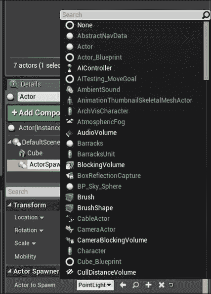

1.  在`Spawn`函数的实现中，我们可以访问我们的世界，并检查其有效性。

1.  `SpawnActor`需要一个`FTransform*`来指定生成新 Actor 的位置，因此我们创建一个新的堆栈变量来包含当前组件变换的副本。

1.  如果`TheWorld`有效，我们请求它生成一个`ActorToSpawn`指定的子类的实例，传入我们刚刚创建的`FTransform`的地址，其中现在包含了新`Actor`所需的位置。

## 另请参阅

+   第八章，“集成 C++和虚幻编辑器”，包含了对如何使蓝图可访问的更详细的调查。

# 创建自定义基本组件

`Primitive`组件是最复杂的`Actor`组件类型，因为它们不仅有一个变换，而且还在屏幕上呈现。

## 操作步骤...

1.  基于`MeshComponent`创建一个自定义的 C++类。当 Visual Studio 加载时，将以下内容添加到你的类头文件中：

```cpp
UCLASS(ClassGroup=Experimental, meta = (BlueprintSpawnableComponent))
public:
virtual FPrimitiveSceneProxy* CreateSceneProxy() override;
TArray<int32> Indices;
TArray<FVector> Vertices;
UPROPERTY(EditAnywhere, BlueprintReadWrite, Category = Materials)
UMaterial* TheMaterial;
```

1.  我们需要在 cpp 文件中为我们重写的`CreateSceneProxy`函数创建一个实现：

```cpp
FPrimitiveSceneProxy* UMyMeshComponent::CreateSceneProxy()
{
  FPrimitiveSceneProxy* Proxy = NULL;
  Proxy = new FMySceneProxy(this);
  return Proxy;
}
```

1.  这个函数返回一个`FMySceneProxy`的实例，我们需要实现它。通过在`CreateSceneProxy`函数上方添加以下代码来实现：

```cpp
class FMySceneProxy : public FPrimitiveSceneProxy
{
  public:
  FMySceneProxy(UMyMeshComponent* Component)
  :FPrimitiveSceneProxy(Component),
  Indices(Component->Indices),
  TheMaterial(Component->TheMaterial)
  {
    VertexBuffer = FMyVertexBuffer();
    IndexBuffer = FMyIndexBuffer();
    for (FVector Vertex : Component->Vertices)
    {
      Vertices.Add(FDynamicMeshVertex(Vertex));
    }
  };
  UPROPERTY()
  UMaterial* TheMaterial;
  virtual FPrimitiveViewRelevance GetViewRelevance(const FSceneView* View)  const override
  {
    FPrimitiveViewRelevance Result;
    Result.bDynamicRelevance = true;
    Result.bDrawRelevance = true;
    Result.bNormalTranslucencyRelevance = true;
    return Result;
  }
  virtual void GetDynamicMeshElements(const TArray<const FSceneView*>& Views, const FSceneViewFamily& ViewFamily, uint32 VisibilityMap, FMeshElementCollector& Collector) const override
  {
    for (int32 ViewIndex = 0; ViewIndex < Views.Num(); ViewIndex++)
    {
      FDynamicMeshBuilder MeshBuilder;
      if (Vertices.Num() == 0)
      {
        return;
      }
      MeshBuilder.AddVertices(Vertices);
      MeshBuilder.AddTriangles(Indices);
      MeshBuilder.GetMesh(FMatrix::Identity, new FColoredMaterialRenderProxy(TheMaterial->GetRenderProxy(false), FLinearColor::Gray), GetDepthPriorityGroup(Views[ViewIndex]), true, true, ViewIndex, Collector);
    }
  }
  uint32 FMySceneProxy::GetMemoryFootprint(void) const override
  {
    return sizeof(*this);
  }
  virtual ~FMySceneProxy() {};
  private:
  TArray<FDynamicMeshVertex> Vertices;
  TArray<int32> Indices;
  FMyVertexBuffer VertexBuffer;
  FMyIndexBuffer IndexBuffer;
};
```

1.  我们的场景代理需要一个顶点缓冲区和一个索引缓冲区。以下子类应该放在场景代理的实现之上：

```cpp
class FMyVertexBuffer : public FVertexBuffer
{
  public:
  TArray<FVector> Vertices;
  virtual void InitRHI() override
  {
    FRHIResourceCreateInfo CreateInfo;
    VertexBufferRHI = RHICreateVertexBuffer(Vertices.Num() * sizeof(FVector), BUF_Static, CreateInfo);
    void* VertexBufferData = RHILockVertexBuffer(VertexBufferRHI, 0, Vertices.Num() * sizeof(FVector), RLM_WriteOnly);
    FMemory::Memcpy(VertexBufferData, Vertices.GetData(), Vertices.Num() * sizeof(FVector));
    RHIUnlockVertexBuffer(VertexBufferRHI);
  }
};
class FMyIndexBuffer : public FIndexBuffer
{
  public:
  TArray<int32> Indices;
  virtual void InitRHI() override
  {
    FRHIResourceCreateInfo CreateInfo;
    IndexBufferRHI = RHICreateIndexBuffer(sizeof(int32), Indices.Num() * sizeof(int32), BUF_Static, CreateInfo);
    void* Buffer = RHILockIndexBuffer(IndexBufferRHI, 0, Indices.Num() * sizeof(int32), RLM_WriteOnly);
    FMemory::Memcpy(Buffer, Indices.GetData(), Indices.Num() * sizeof(int32));
    RHIUnlockIndexBuffer(IndexBufferRHI);
  }
};
```

1.  添加以下构造函数实现：

```cpp
UMyMeshComponent::UMyMeshComponent()
{
  static ConstructorHelpers::FObjectFinder<UMaterial> Material(TEXT("Material'/Engine/BasicShapes/BasicShapeMaterial'"));
  if (Material.Object != NULL)
  {
    TheMaterial = (UMaterial*)Material.Object;
  }
  Vertices.Add(FVector(10, 0, 0));
  Vertices.Add(FVector(0, 10, 0));
  Vertices.Add(FVector(0, 0, 10));
  Indices.Add(0);
  Indices.Add(1);
  Indices.Add(2);
}
```

1.  验证你的代码是否如下所示：

```cpp
#pragma once

#include "Components/MeshComponent.h"
#include "MyMeshComponent.generated.h"

UCLASS(ClassGroup = Experimental, meta = (BlueprintSpawnableComponent))
class UE4COOKBOOK_API UMyMeshComponent : public UMeshComponent
{
  GENERATED_BODY()
  public:
  virtual FPrimitiveSceneProxy* CreateSceneProxy() override;
  TArray<int32> Indices;
  TArray<FVector> Vertices;

  UPROPERTY(EditAnywhere, BlueprintReadWrite, Category = Materials)
  UMaterial* TheMaterial;
  UMyMeshComponent();
};

#include "UE4Cookbook.h"
#include "MyMeshComponent.h"
#include <VertexFactory.h>
#include "DynamicMeshBuilder.h"

class FMyVertexBuffer : public FVertexBuffer
{
  public:
  TArray<FVector> Vertices;

  virtual void InitRHI() override
  {
    FRHIResourceCreateInfo CreateInfo;
    VertexBufferRHI = RHICreateVertexBuffer(Vertices.Num() * sizeof(FVector), BUF_Static, CreateInfo);

    void* VertexBufferData = RHILockVertexBuffer(VertexBufferRHI, 0, Vertices.Num() * sizeof(FVector), RLM_WriteOnly);
    FMemory::Memcpy(VertexBufferData, Vertices.GetData(), Vertices.Num() * sizeof(FVector));
    RHIUnlockVertexBuffer(VertexBufferRHI);
  }
};

class FMyIndexBuffer : public FIndexBuffer
{
  public:
  TArray<int32> Indices;

  virtual void InitRHI() override
  {
    FRHIResourceCreateInfo CreateInfo;
    IndexBufferRHI = RHICreateIndexBuffer(sizeof(int32), Indices.Num() * sizeof(int32), BUF_Static, CreateInfo);

    void* Buffer = RHILockIndexBuffer(IndexBufferRHI, 0, Indices.Num() * sizeof(int32), RLM_WriteOnly);
    FMemory::Memcpy(Buffer, Indices.GetData(), Indices.Num() * sizeof(int32));
    RHIUnlockIndexBuffer(IndexBufferRHI);
  }
};
class FMySceneProxy : public FPrimitiveSceneProxy
{
  public:
  FMySceneProxy(UMyMeshComponent* Component)
  :FPrimitiveSceneProxy(Component),
  Indices(Component->Indices),
  TheMaterial(Component->TheMaterial)
  {
    VertexBuffer = FMyVertexBuffer();
    IndexBuffer = FMyIndexBuffer();

    for (FVector Vertex : Component->Vertices)
    {
      Vertices.Add(FDynamicMeshVertex(Component->GetComponentLocation() + Vertex));
    }
  };

UPROPERTY()
  UMaterial* TheMaterial;

  virtual FPrimitiveViewRelevance GetViewRelevance(const FSceneView* View)  const override
  {
    FPrimitiveViewRelevance Result;
    Result.bDynamicRelevance = true;
    Result.bDrawRelevance = true;
    Result.bNormalTranslucencyRelevance = true;
    return Result;
  }

  virtual void GetDynamicMeshElements(const TArray<const FSceneView*>& Views, const FSceneViewFamily& ViewFamily, uint32 VisibilityMap, FMeshElementCollector& Collector) const override
  {
    for (int32 ViewIndex = 0; ViewIndex < Views.Num(); ViewIndex++)
    {
      FDynamicMeshBuilder MeshBuilder;
      if (Vertices.Num() == 0)
      {
        return;
      }
      MeshBuilder.AddVertices(Vertices);
      MeshBuilder.AddTriangles(Indices);

      MeshBuilder.GetMesh(FMatrix::Identity, new FColoredMaterialRenderProxy(TheMaterial->GetRenderProxy(false), FLinearColor::Gray), GetDepthPriorityGroup(Views[ViewIndex]), true, true, ViewIndex, Collector);

    }
  }

  void FMySceneProxy::OnActorPositionChanged() override
  {
    VertexBuffer.ReleaseResource();
    IndexBuffer.ReleaseResource();
  }

  uint32 FMySceneProxy::GetMemoryFootprint(void) const override
  {
    return sizeof(*this);
  }
  virtual ~FMySceneProxy() {};
  private:
  TArray<FDynamicMeshVertex> Vertices;
  TArray<int32> Indices;
  FMyVertexBuffer VertexBuffer;
  FMyIndexBuffer IndexBuffer;
};

FPrimitiveSceneProxy* UMyMeshComponent::CreateSceneProxy()
{
  FPrimitiveSceneProxy* Proxy = NULL;
  Proxy = new FMySceneProxy(this);
  return Proxy;
}

UMyMeshComponent::UMyMeshComponent()
{
  static ConstructorHelpers::FObjectFinder<UMaterial> Material(TEXT("Material'/Engine/BasicShapes/BasicShapeMaterial'"));

  if (Material.Object != NULL)
  {
    TheMaterial = (UMaterial*)Material.Object;
  }
  Vertices.Add(FVector(10, 0, 0));
  Vertices.Add(FVector(0, 10, 0));
  Vertices.Add(FVector(0, 0, 10));
  Indices.Add(0);
  Indices.Add(1);
  Indices.Add(2);
}
```

1.  在编辑器中创建一个空的`Actor`，并将新的网格组件添加到其中，以查看你的三角形是否被渲染。尝试通过更改添加到顶点的值来进行实验。添加并查看在重新编译后几何图形如何改变。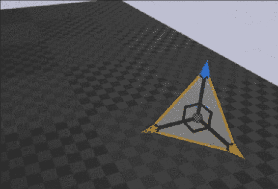

## 它是如何工作的...

1.  为了渲染一个`Actor`，描述它的数据需要被传递给渲染线程。

1.  最简单的方法是使用场景代理-在渲染线程上创建的代理对象，旨在为数据传输提供线程安全性。

1.  `PrimitiveComponent`类定义了一个`CreateSceneProxy`函数，返回`FPrimitiveSceneProxy*`。这个函数允许像我们这样的自定义组件返回一个基于`FPrimitiveSceneProxy`的对象，利用多态性。

1.  我们定义了`SceneProxy`对象的构造函数，以便每个创建的`SceneProxy`都知道与其关联的组件实例。

1.  然后这些数据被缓存在场景代理中，并使用`GetDynamicMeshElements`传递给渲染器。

1.  我们创建了一个`IndexBuffer`和一个`VertexBuffer`。我们创建的每个缓冲区类都是辅助类，帮助场景代理为这两个缓冲区分配特定于平台的内存。它们在`InitRHI`（也称为初始化渲染硬件接口）函数中这样做，在这个函数中，它们使用 RHI API 的函数来创建一个顶点缓冲区，锁定它，复制所需的数据，然后解锁它。

1.  在组件的构造函数中，我们使用`ObjectFinder`模板查找内置在引擎中的材质资源，以便我们的网格有一个材质。

1.  然后我们向我们的缓冲区添加一些顶点和索引，以便在渲染器请求场景代理时可以绘制网格。

# 为 RPG 创建一个 InventoryComponent

一个`InventoryComponent`使其包含的`Actor`能够在其库存中存储`InventoryActors`，并将它们放回游戏世界中。

## 准备工作

在继续本教程之前，请确保你已经按照第六章，“输入和碰撞”，中的*轴映射-键盘、鼠标和游戏手柄方向输入用于 FPS 角色*教程中的步骤进行操作，因为它向你展示了如何创建一个简单的角色。

此外，本章中的*使用 SpawnActor 实例化 Actor*教程向你展示了如何创建一个自定义的`GameMode`。

## 操作步骤...

1.  使用引擎创建一个`ActorComponent`子类，名为`InventoryComponent`，然后将以下代码添加到其中：

```cpp
UPROPERTY()
TArray<AInventoryActor*> CurrentInventory;
UFUNCTION()
int32 AddToInventory(AInventoryActor* ActorToAdd);

UFUNCTION()
void RemoveFromInventory(AInventoryActor* ActorToRemove);
```

1.  将以下函数实现添加到源文件中：

```cpp
int32 UInventoryComponent::AddToInventory(AInventoryActor* ActorToAdd)
{
  return CurrentInventory.Add(ActorToAdd);
}

void UInventoryComponent::RemoveFromInventory(AInventoryActor* ActorToRemove)
{
  CurrentInventory.Remove(ActorToRemove);
}
```

1.  接下来，创建一个名为`InventoryActor`的新`StaticMeshActor`子类。将以下内容添加到其声明中：

```cpp
virtual void PickUp();
virtual void PutDown(FTransform TargetLocation);
```

1.  在实现文件中实现新函数：

```cpp
void AInventoryActor::PickUp()
{
  SetActorTickEnabled(false);
  SetActorHiddenInGame(true);
  SetActorEnableCollision(false);
}

void AInventoryActor::PutDown(FTransform TargetLocation)
{
  SetActorTickEnabled(true);
  SetActorHiddenInGame(false);
  SetActorEnableCollision(true);
  SetActorLocation(TargetLocation.GetLocation());
}
```

1.  还要更改构造函数如下：

```cpp
AInventoryActor::AInventoryActor()
:Super()
{
  PrimaryActorTick.bCanEverTick = true;
  auto MeshAsset = ConstructorHelpers::FObjectFinder<UStaticMesh>(TEXT("StaticMesh'/Engine/BasicShapes/Cube.Cube'"));
  if (MeshAsset.Object != nullptr)
  {
    GetStaticMeshComponent()->SetStaticMesh(MeshAsset.Object);
    GetStaticMeshComponent()->SetCollisionProfileName(UCollisionProfile::Pawn_ProfileName);
  }
  GetStaticMeshComponent()->SetMobility(EComponentMobility::Movable);
  SetActorEnableCollision(true);
}
```

1.  我们需要向角色添加`InventoryComponent`，以便我们有一个可以存储物品的库存。使用编辑器创建一个新的`SimpleCharacter`子类，并将以下内容添加到其声明中：

```cpp
UPROPERTY()
UInventoryComponent* MyInventory;

UFUNCTION()
virtual void SetupPlayerInputComponent(class UInputComponent* InputComponent) override;

UFUNCTION()
void DropItem();
UFUNCTION()
void TakeItem(AInventoryActor* InventoryItem);

UFUNCTION()
virtual void NotifyHit(class UPrimitiveComponent* MyComp, AActor* Other, class UPrimitiveComponent* OtherComp, bool bSelfMoved, FVector HitLocation, FVector HitNormal, FVector NormalImpulse, const FHitResult& Hit) override;
```

1.  将此行添加到角色的构造函数实现中：

```cpp
MyInventory = CreateDefaultSubobject<UInventoryComponent>("MyInventory");
```

1.  将此代码添加到重写的`SetupPlayerInputComponent`中：

```cpp
void AInventoryCharacter::SetupPlayerInputComponent(class UInputComponent* InputComponent)
{
  Super::SetupPlayerInputComponent(InputComponent);
  InputComponent->BindAction("DropItem", EInputEvent::IE_Pressed, this, &AInventoryCharacter::DropItem);
}
```

1.  最后，添加以下函数实现：

```cpp
void AInventoryCharacter::DropItem()
{
  if (MyInventory->CurrentInventory.Num() == 0)
  {
    return;
  }

  AInventoryActor* Item = MyInventory->CurrentInventory.Last();
  MyInventory->RemoveFromInventory(Item);
  FVector ItemOrigin;
  FVector ItemBounds;
  Item->GetActorBounds(false, ItemOrigin, ItemBounds);
  FTransform PutDownLocation = GetTransform() + FTransform(RootComponent->GetForwardVector() * ItemBounds.GetMax());
  Item->PutDown(PutDownLocation);
}

void AInventoryCharacter::NotifyHit(class UPrimitiveComponent* MyComp, AActor* Other, class UPrimitiveComponent* OtherComp, bool bSelfMoved, FVector HitLocation, FVector HitNormal, FVector NormalImpulse, const FHitResult& Hit)
{
  AInventoryActor* InventoryItem = Cast<AInventoryActor>(Other);
  if (InventoryItem != nullptr)
  {
    TakeItem(InventoryItem);
  }
}

void AInventoryCharacter::TakeItem(AInventoryActor* InventoryItem)
{
  InventoryItem->PickUp();
  MyInventory->AddToInventory(InventoryItem);
}
```

1.  编译您的代码并在编辑器中进行测试。创建一个新级别，并将几个`InventoryActor`实例拖到场景中。

1.  如果需要提醒如何重写当前游戏模式，请参考*使用 SpawnActor 实例化 Actor*配方。将以下行添加到该配方中的游戏模式构造函数中，然后将您的级别的`GameMode`设置为您在该配方中创建的游戏模式：

```cpp
DefaultPawnClass = AInventoryCharacter::StaticClass();
```

1.  在编译和启动项目之前，请对照此处的清单验证您的代码。

```cpp
#pragma once

#include "GameFramework/Character.h"
#include "InventoryComponent.h"
#include "InventoryCharacter.generated.h"

UCLASS()
class UE4COOKBOOK_API AInventoryCharacter : public ACharacter
{
  GENERATED_BODY()

  public:
  AInventoryCharacter();
  virtual void BeginPlay() override;
  virtual void Tick( float DeltaSeconds ) override;
  virtual void SetupPlayerInputComponent(class UInputComponent* InputComponent) override;

  UPROPERTY()
  UInventoryComponent* MyInventory;
  UPROPERTY()
  UCameraComponent* MainCamera;
  UFUNCTION()
  void TakeItem(AInventoryActor* InventoryItem);
  UFUNCTION()
  void DropItem();
  void MoveForward(float AxisValue);
  void MoveRight(float AxisValue);
  void PitchCamera(float AxisValue);
  void YawCamera(float AxisValue);

  UFUNCTION()
  virtual void NotifyHit(class UPrimitiveComponent* MyComp, AActor* Other, class UPrimitiveComponent* OtherComp, bool bSelfMoved, FVector HitLocation, FVector HitNormal, FVector NormalImpulse, const FHitResult& Hit) override;
  private:
  FVector MovementInput;
  FVector CameraInput;
};

#include "UE4Cookbook.h"
#include "InventoryCharacter.h"

AInventoryCharacter::AInventoryCharacter()
:Super()
{
  PrimaryActorTick.bCanEverTick = true;
  MyInventory = CreateDefaultSubobject<UInventoryComponent>("MyInventory");
  MainCamera = CreateDefaultSubobject<UCameraComponent>("MainCamera");
  MainCamera->bUsePawnControlRotation = 0;
}

void AInventoryCharacter::BeginPlay()
{
  Super::BeginPlay();
  MainCamera->AttachTo(RootComponent);
}

void AInventoryCharacter::Tick( float DeltaTime )
{
  Super::Tick( DeltaTime );
  if (!MovementInput.IsZero())
  {
    MovementInput *= 100;
    FVector InputVector = FVector(0,0,0);
    InputVector += GetActorForwardVector()* MovementInput.X * DeltaTime;
    InputVector += GetActorRightVector()* MovementInput.Y * DeltaTime;
    GetCharacterMovement()->AddInputVector(InputVector);
    GEngine->AddOnScreenDebugMessage(-1, 1, FColor::Red, FString::Printf(TEXT("x- %f, y - %f, z - %f"),InputVector.X, InputVector.Y, InputVector.Z));
  }

  if (!CameraInput.IsNearlyZero())
  {
    FRotator NewRotation = GetActorRotation();
    NewRotation.Pitch += CameraInput.Y;
    NewRotation.Yaw += CameraInput.X;
    APlayerController* MyPlayerController =Cast<APlayerController>(GetController());
    if (MyPlayerController != nullptr)
    {
      MyPlayerController->AddYawInput(CameraInput.X);
      MyPlayerController->AddPitchInput(CameraInput.Y);
    }
    SetActorRotation(NewRotation);
  }
}
void AInventoryCharacter::SetupPlayerInputComponent(class UInputComponent* InputComponent)
{
  Super::SetupPlayerInputComponent(InputComponent);
  InputComponent->BindAxis("MoveForward", this, &AInventoryCharacter::MoveForward);
  InputComponent->BindAxis("MoveRight", this, &AInventoryCharacter::MoveRight);
  InputComponent->BindAxis("CameraPitch", this, &AInventoryCharacter::PitchCamera);
  InputComponent->BindAxis("CameraYaw", this, &AInventoryCharacter::YawCamera);
  InputComponent->BindAction("DropItem", EInputEvent::IE_Pressed, this, &AInventoryCharacter::DropItem);
}
void AInventoryCharacter::DropItem()
{
  if (MyInventory->CurrentInventory.Num() == 0)
  {
    return;
  }
  AInventoryActor* Item = MyInventory->CurrentInventory.Last();
  MyInventory->RemoveFromInventory(Item);
  FVector ItemOrigin;
  FVector ItemBounds;
  Item->GetActorBounds(false, ItemOrigin, ItemBounds);
  FTransform PutDownLocation = GetTransform() + FTransform(RootComponent->GetForwardVector() * ItemBounds.GetMax());
  Item->PutDown(PutDownLocation);
}

void AInventoryCharacter::MoveForward(float AxisValue)
{
  MovementInput.X = FMath::Clamp<float>(AxisValue, -1.0f, 1.0f);
}

void AInventoryCharacter::MoveRight(float AxisValue)
{
  MovementInput.Y = FMath::Clamp<float>(AxisValue, -1.0f, 1.0f);
}

void AInventoryCharacter::PitchCamera(float AxisValue)
{
  CameraInput.Y = AxisValue;
}
void AInventoryCharacter::YawCamera(float AxisValue)
{
  CameraInput.X = AxisValue;
}
void AInventoryCharacter::NotifyHit(class UPrimitiveComponent* MyComp, AActor* Other, class UPrimitiveComponent* OtherComp, bool bSelfMoved, FVector HitLocation, FVector HitNormal, FVector NormalImpulse, const FHitResult& Hit)
{
  AInventoryActor* InventoryItem = Cast<AInventoryActor>(Other);
  if (InventoryItem != nullptr)
  {
    TakeItem(InventoryItem);
  }
}
void AInventoryCharacter::TakeItem(AInventoryActor* InventoryItem)
{
  InventoryItem->PickUp();
  MyInventory->AddToInventory(InventoryItem);
}

#pragma once

#include "Components/ActorComponent.h"
#include "InventoryActor.h"
#include "InventoryComponent.generated.h"

UCLASS( ClassGroup=(Custom), meta=(BlueprintSpawnableComponent))
class UE4COOKBOOK_API UInventoryComponent : public UActorComponent
{
  GENERATED_BODY()

  public:
  UInventoryComponent();
  virtual void TickComponent( float DeltaTime, ELevelTick TickType, FActorComponentTickFunction* ThisTickFunction ) override;

  UPROPERTY()
  TArray<AInventoryActor*> CurrentInventory;
  UFUNCTION()
  int32 AddToInventory(AInventoryActor* ActorToAdd);

  UFUNCTION()
  void RemoveFromInventory(AInventoryActor* ActorToRemove);
};
#include "UE4Cookbook.h"
#include "InventoryComponent.h"

UInventoryComponent::UInventoryComponent()
{
  bWantsBeginPlay = true;
  PrimaryComponentTick.bCanEverTick = true;
}
void UInventoryComponent::TickComponent( float DeltaTime, ELevelTick TickType, FActorComponentTickFunction* ThisTickFunction )
{
  Super::TickComponent( DeltaTime, TickType, ThisTickFunction );
}

int32 UInventoryComponent::AddToInventory(AInventoryActor* ActorToAdd)
{
  return CurrentInventory.Add(ActorToAdd);
}

void UInventoryComponent::RemoveFromInventory(AInventoryActor* ActorToRemove)
{
  CurrentInventory.Remove(ActorToRemove);
}

#pragma once

#include "GameFramework/GameMode.h"
#include "UE4CookbookGameMode.generated.h"

UCLASS()
class UE4COOKBOOK_API AUE4CookbookGameMode : public AGameMode
{
  GENERATED_BODY()

  public:
  AUE4CookbookGameMode();
  };

#include "UE4Cookbook.h"
#include "MyGameState.h"
#include "InventoryCharacter.h"
#include "UE4CookbookGameMode.h"

AUE4CookbookGameMode::AUE4CookbookGameMode()
{
  DefaultPawnClass = AInventoryCharacter::StaticClass();
  GameStateClass = AMyGameState::StaticClass();
}
```

1.  最后，我们需要在编辑器中的绑定中添加我们的`InputAction`。为此，通过选择**Edit** | **Project Settings...**来打开**Project Settings...**窗口：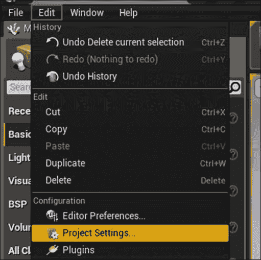

然后，在左侧选择**Input**。选择**Action Mappings**旁边的加号符号，并在出现的文本框中键入`DropItem`。在其下是您可以绑定到此操作的所有潜在按键的列表。选择标记为`E`的按键。您的设置现在应如下所示：

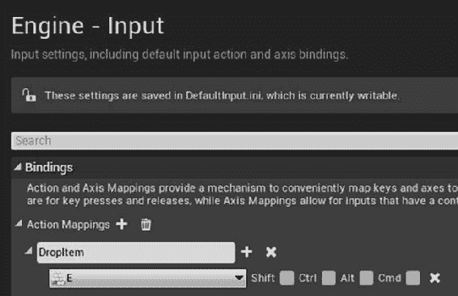

1.  然后我们可以点击播放，走到我们的库存角色旁边，它将被拾起。按*E*键将角色放置在新位置！通过多个库存角色测试，看它们是否都被正确收集和放置。

## 工作原理...

1.  我们的新组件包含一个存储指针的角色数组，以及声明添加或移除项目到数组的函数。这些函数是围绕`TArray`的添加/移除功能的简单包装器，但允许我们选择性地执行诸如在继续存储项目之前检查数组是否在指定大小限制内等操作。

1.  `InventoryActor`是一个基类，可用于玩家拿走的所有物品。

1.  在`PickUp`函数中，我们需要在拾起时禁用角色。为此，我们必须执行以下操作：

+   禁用角色打勾

+   隐藏角色

+   禁用碰撞

1.  我们使用`SetActorTickEnabled`、`SetActorHiddenInGame`和`SetActorEnableCollision`函数来实现这一点。

1.  `PutDown`函数是相反的。我们启用角色打勾，取消隐藏角色，然后重新打开其碰撞，并将角色传送到所需位置。

1.  我们还在新角色中添加了`InventoryComponent`以及一个用于获取物品的函数。

1.  在我们角色的构造函数中，我们为我们的`InventoryComponent`创建了一个默认子对象。

1.  我们还添加了一个`NotifyHit`覆盖，以便在角色撞到其他角色时得到通知。

1.  在此函数中，我们将其他角色转换为`InventoryActor`。如果转换成功，那么我们知道我们的`Actor`是一个`InventoryActor`，因此我们可以调用`TakeItem`函数来拿起它。

1.  在`TakeItem`函数中，我们通知库存物品角色我们要拿起它，然后将其添加到我们的库存中。

1.  `InventoryCharacter`中的最后一个功能是`DropItem`函数。此函数检查我们的库存中是否有任何物品。如果有任何物品，我们将其从库存中移除，然后使用物品边界计算我们的玩家角色前方的安全距离，以便放下物品。

1.  然后，我们通知物品我们正在将其放置在所需位置的世界中。

## 另请参阅

+   第五章, *处理事件和委托*，详细解释了事件和输入处理在引擎中如何一起工作，以及本教程中提到的`SimpleCharacter`类的用法。

+   第六章, *输入和碰撞*，还有关于绑定输入动作和轴的教程

# 创建一个 OrbitingMovement 组件

这个组件类似于`RotatingMovementComponent`，它旨在使附加到它的组件以特定方式移动。在这种情况下，它将以固定距离围绕固定点移动任何附加的组件。

例如，这可以用于**动作 RPG**中围绕角色旋转的护盾。

## 操作步骤...

1.  创建一个新的`SceneComponent`子类，并将以下属性添加到类声明中：

```cpp
UPROPERTY()
bool RotateToFaceOutwards;
UPROPERTY()
float RotationSpeed;
UPROPERTY()
float OrbitDistance;
float CurrentValue;
```

1.  将以下内容添加到构造函数中：

```cpp
RotationSpeed = 5;
OrbitDistance = 100;
CurrentValue = 0;
RotateToFaceOutwards = true;
```

1.  将以下代码添加到`TickComponent`函数中：

```cpp
float CurrentValueInRadians = FMath::DegreesToRadians<float>(CurrentValue);
SetRelativeLocation(FVector(OrbitDistance * FMath::Cos(CurrentValueInRadians), OrbitDistance * FMath::Sin(CurrentValueInRadians), RelativeLocation.Z));
if (RotateToFaceOutwards)
{
  FVector LookDir = (RelativeLocation).GetSafeNormal();
  FRotator LookAtRot = LookDir.Rotation();
  SetRelativeRotation(LookAtRot);
}
CurrentValue = FMath::Fmod(CurrentValue + (RotationSpeed* DeltaTime) ,360);
```

1.  根据以下清单验证你的工作：

```cpp
#pragma once
#include "Components/SceneComponent.h"
#include "OrbitingMovementComponent.generated.h"

UCLASS( ClassGroup=(Custom), meta=(BlueprintSpawnableComponent) )
class UE4COOKBOOK_API UOrbitingMovementComponent : public USceneComponent
{
  GENERATED_BODY()
  public:
  // Sets default values for this component's properties
  UOrbitingMovementComponent();

  // Called when the game starts
  virtual void BeginPlay() override;
  // Called every frame
  virtual void TickComponent( float DeltaTime, ELevelTick TickType, FActorComponentTickFunction* ThisTickFunction ) override;

  UPROPERTY()
  bool RotateToFaceOutwards;
  UPROPERTY()
  float RotationSpeed;
  UPROPERTY()
  float OrbitDistance;
  float CurrentValue;
};
#include "UE4Cookbook.h"
#include "OrbitingMovementComponent.h"
// Sets default values for this component's properties
UOrbitingMovementComponent::UOrbitingMovementComponent()
{
  // Set this component to be initialized when the game starts, and to be ticked every frame. You can turn these features
  // off to improve performance if you don't need them.
  bWantsBeginPlay = true;
  PrimaryComponentTick.bCanEverTick = true;
  RotationSpeed = 5;
  OrbitDistance = 100;
  CurrentValue = 0;
  RotateToFaceOutwards = true;
  //...
}

// Called when the game starts
void UOrbitingMovementComponent::BeginPlay()
{
  Super::BeginPlay();
  //...
}
// Called every frame
void UOrbitingMovementComponent::TickComponent( float DeltaTime, ELevelTick TickType, FActorComponentTickFunction* ThisTickFunction )
{
  Super::TickComponent( DeltaTime, TickType, ThisTickFunction );
  float CurrentValueInRadians = FMath::DegreesToRadians<float>(CurrentValue);
  SetRelativeLocation(
  FVector(OrbitDistance * FMath::Cos(CurrentValueInRadians),
  OrbitDistance * FMath::Sin(CurrentValueInRadians),
  RelativeLocation.Z));
  if (RotateToFaceOutwards)
  {
    FVector LookDir = (RelativeLocation).GetSafeNormal();
    FRotator LookAtRot = LookDir.Rotation();
    SetRelativeRotation(LookAtRot);
  }
  CurrentValue = FMath::Fmod(CurrentValue + (RotationSpeed* DeltaTime) ,360);
  //...
}
```

1.  你可以通过创建一个简单的`Actor`蓝图来测试这个组件。

1.  将一个`OrbitingMovement`组件添加到你的`Actor`中，然后使用`Cube`组件添加一些网格。通过将它们拖放到**Components**面板中的`OrbitingMovement`组件上，将它们作为子组件。最终的层次结构应该如下所示：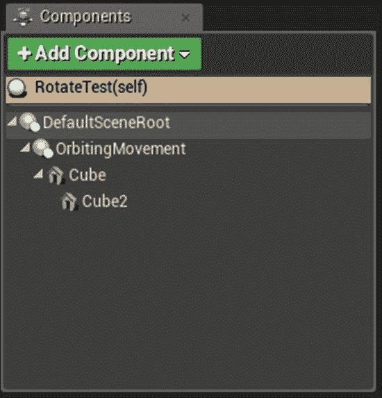

1.  如果你对这个过程不确定，可以参考*创建自定义 Actor 组件*教程。

1.  点击播放，看看网格是否围绕`Actor`中心以圆周运动。

## 工作原理...

1.  添加到组件的属性是我们用来自定义组件的圆周运动的基本参数。

1.  `RotateToFaceOutwards`指定组件是否在每次更新时朝向远离旋转中心。`RotationSpeed`是组件每秒旋转的度数。

1.  `OrbitDistance`表示旋转的组件必须从原点移动的距离。`CurrentValue`是当前的旋转位置（以度为单位）。

1.  在我们的构造函数中，我们为我们的新组件建立了一些合理的默认值。

1.  在`TickComponent`函数中，我们计算我们组件的位置和旋转。

1.  下一步的公式要求我们的角度用弧度而不是度来表示。弧度用 *π* 来描述角度。我们首先使用`DegreesToRadians`函数将我们当前的度数值转换为弧度。

1.  `SetRelativeLocation`函数使用了圆周运动的一般方程，即 *Pos(θ) = cos(θ in radians), sin(θ in radians)*。我们保留每个对象的 Z 轴位置。

1.  下一步是将对象旋转回原点（或者直接远离原点）。只有当`RotateToFaceOutwards`为`true`时才会计算这一步，它涉及到获取组件相对于其父级的相对偏移，并创建一个基于从父级指向当前相对偏移的向量的旋转器。然后我们将相对旋转设置为结果旋转器。

1.  最后，我们增加当前的度数值，使其每秒移动`RotationSpeed`单位，将结果值夹在 0 和 360 之间，以允许旋转循环。

# 创建一个生成单位的建筑

对于这个教程，我们将创建一个在特定位置定时生成单位的建筑。

## 操作步骤...

1.  在编辑器中创建一个新的`Actor`子类，然后将以下实现添加到类中：

```cpp
UPROPERTY()
UStaticMeshComponent* BuildingMesh;
UPROPERTY()
UParticleSystemComponent* SpawnPoint;

UPROPERTY()
UClass* UnitToSpawn;

UPROPERTY()
float SpawnInterval;

UFUNCTION()
void SpawnUnit();

UFUNCTION()
void EndPlay(const EEndPlayReason::Type EndPlayReason) override;

UPROPERTY()
FTimerHandle SpawnTimerHandle;
```

1.  将以下内容添加到构造函数中：

```cpp
BuildingMesh = CreateDefaultSubobject<UStaticMeshComponent>("BuildingMesh");
SpawnPoint = CreateDefaultSubobject<UParticleSystemComponent>("SpawnPoint");
SpawnInterval = 10;
auto MeshAsset = ConstructorHelpers::FObjectFinder<UStaticMesh>(TEXT("StaticMesh'/Engine/BasicShapes/Cube.Cube'"));
if (MeshAsset.Object != nullptr)
{
  BuildingMesh->SetStaticMesh(MeshAsset.Object);
  BuildingMesh->SetCollisionProfileName(UCollisionProfile::Pawn_ProfileName);

}
auto ParticleSystem =
ConstructorHelpers::FObjectFinder<UParticleSystem>(TEXT("ParticleSystem'/Engine/Tutorial/SubEditors/TutorialAssets/TutorialParticleSystem.TutorialParticleSystem'"));
if (ParticleSystem.Object != nullptr)
{
  SpawnPoint->SetTemplate(ParticleSystem.Object);
}
SpawnPoint->SetRelativeScale3D(FVector(0.5, 0.5, 0.5));
UnitToSpawn = ABarracksUnit::StaticClass();
```

1.  将以下内容添加到`BeginPlay`函数中：

```cpp
RootComponent = BuildingMesh;
SpawnPoint->AttachTo(RootComponent);
SpawnPoint->SetRelativeLocation(FVector(150, 0, 0));
GetWorld()->GetTimerManager().SetTimer(SpawnTimerHandle, this, &ABarracks::SpawnUnit, SpawnInterval, true);
```

1.  为`SpawnUnit`函数创建实现：

```cpp
void ABarracks::SpawnUnit()
{
  FVector SpawnLocation = SpawnPoint->GetComponentLocation();
  GetWorld()->SpawnActor(UnitToSpawn, &SpawnLocation);
}
```

1.  实现重写的`EndPlay`函数：

```cpp
void ABarracks::EndPlay(const EEndPlayReason::Type EndPlayReason)
{
  Super::EndPlay(EndPlayReason);
  GetWorld()->GetTimerManager().ClearTimer(SpawnTimerHandle);
}
```

1.  接下来，创建一个新的角色子类，并添加一个属性：

```cpp
UPROPERTY()
UParticleSystemComponent* VisualRepresentation;
```

1.  在构造函数中初始化组件：

```cpp
VisualRepresentation = CreateDefaultSubobject<UParticleSystemComponent>("SpawnPoint");
auto ParticleSystem =ConstructorHelpers::FObjectFinder<UParticleSystem>(TEXT("ParticleSystem'/Engine/Tutorial/SubEditors/TutorialAssets/TutorialParticleSystem.TutorialParticleSystem'"));
if (ParticleSystem.Object != nullptr)
{
  SpawnPoint->SetTemplate(ParticleSystem.Object);
}
SpawnPoint->SetRelativeScale3D(FVector(0.5, 0.5, 0.5));
SpawnCollisionHandlingMethod = ESpawnActorCollisionHandlingMethod::AlwaysSpawn;
```

1.  将可视化表示附加到根组件：

```cpp
void ABarracksUnit::BeginPlay()
{
  Super::BeginPlay();
  SpawnPoint->AttachTo(RootComponent);
}
```

1.  最后，将以下内容添加到 `Tick` 函数中以使生成的角色移动：

```cpp
SetActorLocation(GetActorLocation() + FVector(10, 0, 0));
```

1.  根据以下片段进行验证，然后编译您的项目。将兵营角色的副本放入级别中。然后您可以观察它以固定间隔生成角色：

```cpp
#pragma once
#include "GameFramework/Actor.h"
#include "Barracks.generated.h"
UCLASS()
class UE4COOKBOOK_API ABarracks : public AActor
{
  GENERATED_BODY()
  public:
  ABarracks();
  virtual void BeginPlay() override;
  virtual void Tick( float DeltaSeconds ) override;

  UPROPERTY()
  UStaticMeshComponent* BuildingMesh;
  UPROPERTY()
  UParticleSystemComponent* SpawnPoint;

  UPROPERTY()
  UClass* UnitToSpawn;

  UPROPERTY()
  float SpawnInterval;

  UFUNCTION()
  void SpawnUnit();
  UFUNCTION()
  void EndPlay(const EEndPlayReason::Type EndPlayReason) override;

  UPROPERTY()
  FTimerHandle SpawnTimerHandle;
};

#include "UE4Cookbook.h"
#include "BarracksUnit.h"
#include "Barracks.h"

// Sets default values
ABarracks::ABarracks()
{
  // Set this actor to call Tick() every frame. You can turn this off to improve performance if you don't need it.
  PrimaryActorTick.bCanEverTick = true;
  BuildingMesh = CreateDefaultSubobject<UStaticMeshComponent>("BuildingMesh");
  SpawnPoint = CreateDefaultSubobject<UParticleSystemComponent>("SpawnPoint");
  SpawnInterval = 10;
  auto MeshAsset = ConstructorHelpers::FObjectFinder<UStaticMesh>(TEXT("StaticMesh'/Engine/BasicShapes/Cube.Cube'"));
  if (MeshAsset.Object != nullptr)
  {
    BuildingMesh->SetStaticMesh(MeshAsset.Object);
    BuildingMesh->SetCollisionProfileName(UCollisionProfile::Pawn_ProfileName);

  }
  auto ParticleSystem = ConstructorHelpers::FObjectFinder<UParticleSystem>(TEXT("ParticleSystem'/Engine/Tutorial/SubEditors/TutorialAssets/TutorialParticleSystem.TutorialParticleSystem'"));
  if (ParticleSystem.Object != nullptr)
  {
    SpawnPoint->SetTemplate(ParticleSystem.Object);
  }
  SpawnPoint->SetRelativeScale3D(FVector(0.5, 0.5, 0.5));
  UnitToSpawn = ABarracksUnit::StaticClass();
}
void ABarracks::BeginPlay()
{
  Super::BeginPlay();
  RootComponent = BuildingMesh;
  SpawnPoint->AttachTo(RootComponent);
  SpawnPoint->SetRelativeLocation(FVector(150, 0, 0));
  GetWorld()->GetTimerManager().SetTimer(SpawnTimerHandle, this, &ABarracks::SpawnUnit, SpawnInterval, true);
}

void ABarracks::Tick( float DeltaTime )
{
  Super::Tick( DeltaTime );
}
void ABarracks::SpawnUnit()
{
  FVector SpawnLocation = SpawnPoint->GetComponentLocation();
  GetWorld()->SpawnActor(UnitToSpawn, &SpawnLocation);
}

void ABarracks::EndPlay(const EEndPlayReason::Type EndPlayReason)
{
  Super::EndPlay(EndPlayReason);
  GetWorld()->GetTimerManager().ClearTimer(SpawnTimerHandle);
}

#pragma once

#include "GameFramework/Character.h"
#include "BarracksUnit.generated.h"

UCLASS()
class UE4COOKBOOK_API ABarracksUnit : public ACharacter
{
  GENERATED_BODY()

  public:
  ABarracksUnit();

  virtual void BeginPlay() override;
  virtual void Tick( float DeltaSeconds ) override;

  virtual void SetupPlayerInputComponent(class UInputComponent* InputComponent) override;

  UPROPERTY()
  UParticleSystemComponent* SpawnPoint;
};

#include "UE4Cookbook.h"
#include "BarracksUnit.h"

ABarracksUnit::ABarracksUnit()
{
  PrimaryActorTick.bCanEverTick = true;
  SpawnPoint = CreateDefaultSubobject<UParticleSystemComponent>("SpawnPoint");
  auto ParticleSystem =ConstructorHelpers::FObjectFinder<UParticleSystem>(TEXT("ParticleSystem'/Engine/Tutorial/SubEditors/TutorialAssets/TutorialParticleSystem.TutorialParticleSystem'"));
  if (ParticleSystem.Object != nullptr)
  {
    SpawnPoint->SetTemplate(ParticleSystem.Object);
  }
  SpawnPoint->SetRelativeScale3D(FVector(0.5, 0.5, 0.5));
  SpawnCollisionHandlingMethod = ESpawnActorCollisionHandlingMethod::AlwaysSpawn;
}
void ABarracksUnit::BeginPlay()
{
  Super::BeginPlay();
  SpawnPoint->AttachTo(RootComponent);
}

void ABarracksUnit::Tick( float DeltaTime )
{
  Super::Tick( DeltaTime );
  SetActorLocation(GetActorLocation() + FVector(10, 0, 0));
}
void ABarracksUnit::SetupPlayerInputComponent(class UInputComponent* InputComponent)
{
  Super::SetupPlayerInputComponent(InputComponent);
}
```

## 它是如何工作的...

1.  首先，我们创建兵营角色。我们添加一个粒子系统组件来指示新单位将生成的位置，以及一个静态网格用于建筑的可视表示。

1.  在构造函数中，我们初始化组件，然后使用 `FObjectFinder` 设置它们的值。我们还使用 `StaticClass` 函数设置要生成的类，以从类类型中检索 `UClass*` 实例。

1.  在兵营的 `BeginPlay` 函数中，我们创建一个定时器，以固定间隔调用我们的 `SpawnUnit` 函数。我们将定时器句柄存储在类的成员变量中，这样当我们的实例被销毁时，我们可以停止定时器；否则，当定时器再次触发时，我们将遇到对象指针被取消引用的崩溃。

1.  `SpawnUnit` 函数获取了 `SpawnPoint` 对象的世界空间位置，然后请求世界在该位置生成一个我们单位类的实例。

1.  `BarracksUnit` 在其 `Tick()` 函数中有代码，每帧向前移动 10 个单位，以便每个生成的单位都会移动以为下一个单位腾出空间。

1.  `EndPlay` 函数重写调用父类函数的实现，如果父类中有要取消的定时器或要执行的去初始化操作，这一点很重要。然后使用存储在 `BeginPlay` 中的定时器句柄来取消定时器。
