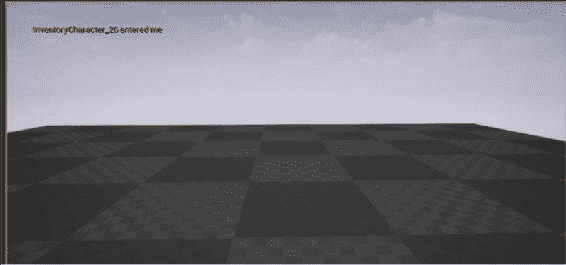
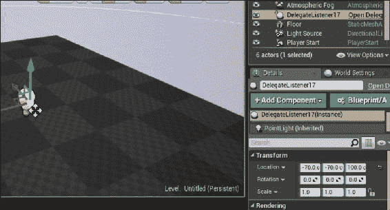
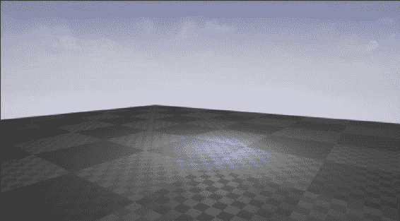
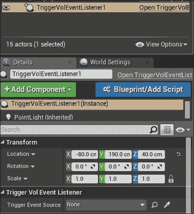
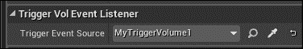
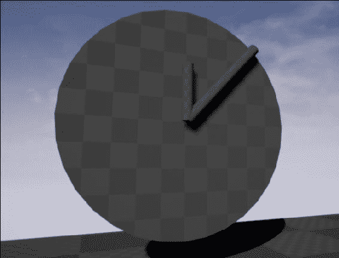
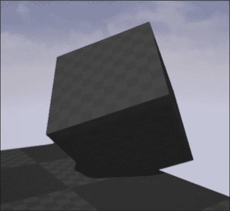

# 第五章：处理事件和委托

Unreal 使用事件有效地通知类有关游戏世界中发生的事情。事件和委托对于确保可以以最小化类耦合的方式发出这些通知以及允许任意类订阅以接收通知非常有用。

本章中将介绍以下教程：

+   通过虚函数实现事件处理

+   创建一个绑定到 UFUNCTION 的委托

+   取消注册委托

+   创建一个带有输入参数的委托

+   使用委托绑定传递有效负载数据

+   创建一个多播委托

+   创建一个自定义事件

+   创建一个时间处理程序

+   为第一人称射击游戏创建一个重生拾取物

# 通过虚函数实现事件处理

Unreal 提供的一些`Actor`和`Component`类包括以虚函数形式的事件处理程序。本教程将向您展示如何通过覆盖相关的虚函数来自定义这些处理程序。

## 操作步骤...

1.  在编辑器中创建一个空的`Actor`。将其命名为`MyTriggerVolume`。

1.  将以下代码添加到类头文件中：

```cpp
UPROPERTY()
UBoxComponent* TriggerZone;

UFUNCTION()
virtual void NotifyActorBeginOverlap(AActor* OtherActor) override;
UFUNCTION()
virtual void NotifyActorEndOverlap(AActor* OtherActor) override;
```

1.  将前述函数的实现添加到 cpp 文件中：

```cpp
void AMyTriggerVolume::NotifyActorBeginOverlap(AActor* OtherActor)
{
  GEngine->AddOnScreenDebugMessage(-1, 1, FColor::Red, FString::Printf(TEXT("%s entered me"),*(OtherActor->GetName())));
}

void AMyTriggerVolume::NotifyActorEndOverlap(AActor* OtherActor)
{
  GEngine->AddOnScreenDebugMessage(-1, 1, FColor::Red, FString::Printf(TEXT("%s left me"), *(OtherActor->GetName())));
}
```

1.  编译您的项目，并将`MyTriggerActor`的一个实例放入级别中。通过走进体积并查看屏幕上打印的输出来验证重叠/触摸事件是否已处理：

## 工作原理...

1.  与往常一样，我们首先声明一个`UPROPERTY`来保存对我们组件子对象的引用。然后创建两个`UFUNCTION`声明。这些标记为`virtual`和`override`，以便编译器理解我们要替换父类的实现，并且我们的函数实现可以被替换。

1.  在函数的实现中，我们使用`FString::printf`从预设文本创建一个`FString`，并替换一些数据参数。

1.  请注意，`FString` `OtherActor->GetName()`返回，并在传递给`FString::Format`之前使用`*`运算符进行解引用。不这样做会导致错误。

1.  然后将此`FString`传递给全局引擎函数`AddOnScreenDebugMessage`。

1.  `-1`的第一个参数告诉引擎允许重复字符串，第二个参数是消息显示的持续时间（以秒为单位），第三个参数是颜色，第四个参数是要打印的实际字符串。

1.  现在，当我们的 Actor 的组件与其他物体重叠时，其`UpdateOverlaps`函数将调用`NotifyActorBeginOverlap`，并且虚函数分发将调用我们的自定义实现。

# 创建一个绑定到 UFUNCTION 的委托

委托允许我们调用一个函数，而不知道分配了哪个函数。它们是原始函数指针的更安全版本。本教程向您展示如何将`UFUNCTION`与委托关联，以便在执行委托时调用它。

## 准备工作

确保您已按照之前的步骤创建了一个`TriggerVolume`类。

## 操作步骤...

1.  在我们的`GameMode`头文件中，在类声明之前使用以下宏声明委托：

```cpp
DECLARE_DELEGATE(FStandardDelegateSignature)
UCLASS()
class UE4COOKBOOK_API AUE4CookbookGameMode : public AGameMode
```

1.  向我们的游戏模式添加一个新成员：

```cpp
FStandardDelegateSignature MyStandardDelegate;
```

1.  创建一个名为`DelegateListener`的新`Actor`类。将以下内容添加到该类的声明中：

```cpp
UFUNCTION()
void EnableLight();

UPROPERTY()
UPointLightComponent* PointLight;
```

1.  在类实现中，将以下内容添加到构造函数中：

```cpp
PointLight = CreateDefaultSubobject<UPointLightComponent>("PointLight");
RootComponent = PointLight;
PointLight->SetVisibility(false);
```

1.  在`DelegateListener.cpp`文件中，在项目的`include`文件和`DelegateListener`头文件之间添加`#include "UE4CookbookGameMode.h"`。在`DelegateListener::BeginPlay`实现中，添加以下内容：

```cpp
Super::BeginPlay();
if (TheWorld != nullptr)
{
  AGameMode* GameMode = UGameplayStatics::GetGameMode(TheWorld);
  AUE4CookbookGameMode * MyGameMode = Cast<AUE4CookbookGameMode>(GameMode);
  if (MyGameMode != nullptr)
  {
    MyGameMode->MyStandardDelegate.BindUObject(this, &ADelegateListener::EnableLight);
  }
}
```

1.  最后，实现`EnableLight`：

```cpp
void ADelegateListener::EnableLight()
{
  PointLight->SetVisibility(true);
}
```

1.  将以下代码放入我们的 TriggerVolume 的`NotifyActorBeginOverlap`函数中：

```cpp
UWorld* TheWorld = GetWorld();
if (TheWorld != nullptr)
{
  AGameMode* GameMode = UGameplayStatics::GetGameMode(TheWorld);
  AUE4CookbookGameMode * MyGameMode = Cast<AUE4CookbookGameMode>(GameMode);
  MyGameMode->MyStandardDelegate.ExecuteIfBound();
}
```

1.  确保在 CPP 文件中也添加`#include "UE4CookbookGameMode.h"`，以便编译器在使用之前知道该类。

1.  编译您的游戏。确保您的游戏模式设置在当前级别中（如果您不知道如何设置，请参阅第四章中的*使用 SpawnActor 实例化 Actor*教程，*Actors and Components*），并将`TriggerVolume`的副本拖到级别中。还将`DelegateListener`的副本拖到级别中，并将其放置在平面表面上方约 100 个单位处：

1.  当您点击**播放**，并走进 Trigger volume 覆盖的区域时，您应该看到我们添加到`DelegateListener`的`PointLight`组件打开：

## 工作原理...

1.  在我们的`GameMode`头文件中，声明一个不带任何参数的委托类型，称为`FTriggerHitSignature`。

1.  然后，我们在`GameMode`类的成员中创建委托的实例。

1.  我们在`DelegateListener`中添加一个`PointLight`组件，以便我们有一个委托被执行的可视表示。

1.  在构造函数中，我们初始化我们的`PointLight`，然后禁用它。

1.  我们重写`BeginPlay`。我们首先调用父类的`BeginPlay()`实现。然后，我们获取游戏世界，使用`GetGameMode()`检索`GameMode`类。

1.  将生成的`AGameMode*`转换为我们的`GameMode`类的指针需要使用`Cast`模板函数。

1.  然后，我们可以访问`GameMode`的委托实例成员，并将我们的`EnableLight`函数绑定到委托，这样当委托被执行时就会调用它。

1.  在这种情况下，我们绑定到`UFUNCTION`()，所以我们使用`BindUObject`。如果我们想要绑定到一个普通的 C++类函数，我们将使用`BindRaw`。如果我们想要绑定到一个静态函数，我们将使用`BindStatic()`。

1.  当`TriggerVolume`与玩家重叠时，它检索`GameMode`，然后在委托上调用`ExecuteIfBound`。

1.  `ExecuteIfBound`检查委托是否绑定了函数，然后为我们调用它。

1.  `EnableLight`函数在被委托对象调用时启用`PointLight`组件。

## 另请参阅

+   接下来的部分，*取消委托*，向您展示了如何在`Listener`在委托被调用之前被销毁的情况下安全地取消注册委托绑定

# 取消委托

有时，有必要移除委托绑定。这就像将函数指针设置为`nullptr`，这样它就不再引用已被删除的对象。

## 准备工作

您需要按照先前的教程进行操作，以便您有一个要取消注册的委托。

## 操作步骤...

1.  在`DelegateListener`中，添加以下重写函数声明：

```cpp
UFUNCTION()
virtual void EndPlay(constEEndPlayReason::Type EndPlayReason) override;
```

1.  实现如下功能：

```cpp
void ADelegateListener::EndPlay(constEEndPlayReason::Type EndPlayReason)
{
  Super::EndPlay(EndPlayReason);
  UWorld* TheWorld = GetWorld();
  if (TheWorld != nullptr)
  {
    AGameMode* GameMode = UGameplayStatics::GetGameMode(TheWorld);
    AUE4CookbookGameMode * MyGameMode = Cast<AUE4CookbookGameMode>(GameMode);
    if (MyGameMode != nullptr)
    {
      MyGameMode->MyStandardDelegate.Unbind();
    }
  }
}
```

## 工作原理...

1.  本教程将本章迄今为止的两个先前教程结合起来。我们重写`EndPlay`，这是一个作为虚函数实现的事件，这样我们就可以在`DelegateListener`离开游戏时执行代码。

1.  在重写的实现中，我们在委托上调用`Unbind()`方法，这将从`DelegateListener`实例中取消链接成员函数。

1.  如果不这样做，委托就会像指针一样悬空，当`DelegateListener`离开游戏时，它就处于无效状态。

# 创建接受输入参数的委托

到目前为止，我们使用的委托没有接受任何输入参数。本教程向您展示如何更改委托的签名，以便它接受一些输入。

## 准备工作

确保您已经按照本章开头的教程进行了操作，该教程向您展示了如何创建`TriggerVolume`和我们为本教程所需的其他基础设施。

## 操作步骤...

1.  向`GameMode`添加一个新的委托声明：

```cpp
DECLARE_DELEGATE_OneParam(FParamDelegateSignature, FLinearColor)
```

1.  向`GameMode`添加新成员：

```cpp
FParamDelegateSignatureMyParameterDelegate;
```

1.  创建一个名为`ParamDelegateListener`的新`Actor`类。将以下内容添加到声明中：

```cpp
UFUNCTION()
void SetLightColor(FLinearColorLightColor);
UPROPERTY()
UPointLightComponent* PointLight;
```

1.  在类实现中，将以下内容添加到构造函数中：

```cpp
PointLight = CreateDefaultSubobject<UPointLightComponent>("PointLight");
RootComponent = PointLight;
```

1.  在`ParamDelegateListener.cpp`文件中，在项目的`include`文件和`ParamDelegateListener`头文件之间添加`#include "UE4CookbookGameMode.h"`。在`ParamDelegateListener::BeginPlay`实现内部添加以下内容：

```cpp
Super::BeginPlay();
UWorld* TheWorld = GetWorld();
if (TheWorld != nullptr)
{
  AGameMode* GameMode = UGameplayStatics::GetGameMode(TheWorld);
  AUE4CookbookGameMode * MyGameMode = Cast<AUE4CookbookGameMode>(GameMode);
  if (MyGameMode != nullptr)
  {
    MyGameMode->MyParameterDelegate.BindUObject(this, &AParamDelegateListener::SetLightColor);
  }
}
```

1.  最后，实现`SetLightColor`：

```cpp
void AParamDelegateListener::SetLightColor(FLinearColorLightColor)
{
  PointLight->SetLightColor(LightColor);
}
```

1.  在我们的`TriggerVolume`中，在`NotifyActorBeginOverlap`中，在调用`MyStandardDelegate.ExecuteIfBound`之后添加以下行：

```cpp
MyGameMode->MyParameterDelegate.ExecuteIfBound(FLinearColor(1, 0, 0, 1));
```

## 它是如何工作的...

1.  我们的新委托签名使用了一个稍微不同的宏来声明。请注意`DECLARE_DELEGATE_OneParam`末尾的`_OneParam`后缀。正如你所期望的，我们还需要指定参数的类型。

1.  就像我们创建没有参数的委托时一样，我们需要在我们的`GameMode`类的成员中创建委托的实例。

1.  我们现在创建了一个新类型的`DelegateListener`，它期望将参数传递到绑定到委托的函数中。

1.  当我们为委托调用`ExecuteIfBound()`方法时，我们现在需要传入将插入函数参数的值。

1.  在我们绑定的函数内部，我们使用参数来设置灯光的颜色。

1.  这意味着`TriggerVolume`不需要知道任何关于`ParamDelegateListener`的信息，就可以调用它的函数。委托使我们能够最小化两个类之间的耦合。

## 另请参阅

+   *取消注册委托*食谱向您展示了如何在监听器在调用委托之前被销毁时安全取消注册委托绑定

# 使用委托绑定传递有效负载数据

只需进行最小的更改，就可以在创建时将参数传递给委托。本食谱向您展示了如何指定要始终作为参数传递给委托调用的数据。这些数据在绑定创建时计算，并且从那时起不会改变。

## 准备工作

确保您已经按照之前的步骤进行操作。我们将扩展之前的步骤的功能，以将额外的创建时参数传递给我们绑定的委托函数。

## 如何做...

1.  在您的`AParamDelegateListener::BeginPlay`函数内部，将对`BindUObject`的调用更改为以下内容：

```cpp
MyGameMode->MyParameterDelegate.BindUObject(this, &AParamDelegateListener::SetLightColor, false);
```

1.  将`SetLightColor`的声明更改为：

```cpp
void SetLightColor(FLinearColorLightColor, bool EnableLight);
```

1.  修改`SetLightColor`的实现如下：

```cpp
void AParamDelegateListener::SetLightColor(FLinearColorLightColor, bool EnableLight)
{
  PointLight->SetLightColor(LightColor);
  PointLight->SetVisibility(EnableLight);
}
```

1.  编译并运行您的项目。验证当您走进`TriggerVolume`时，灯光会关闭，因为在绑定函数时传入了错误的有效负载参数。

## 它是如何工作的...

1.  当我们将函数绑定到委托时，我们指定了一些额外的数据（在本例中是一个值为`false`的布尔值）。您可以以这种方式传递多达四个“有效负载”变量。它们会应用于您的函数，而不是您使用的`DECLARE_DELEGATE_*`宏中声明的任何参数之后。

1.  我们更改了委托的函数签名，以便它可以接受额外的参数。

1.  在函数内部，我们使用额外的参数根据编译时的值是 true 还是 false 来打开或关闭灯光。

1.  我们不需要更改对`ExecuteIfBound`的调用 - 委托系统会自动首先应用通过`ExecuteIfBound`传入的委托参数，然后应用任何有效负载参数，这些参数始终在对`BindUObject`的调用中函数引用之后指定。

## 另请参阅

+   食谱*取消注册委托*向您展示了如何在监听器在调用委托之前被销毁时安全取消注册委托绑定

# 创建多播委托

本章迄今为止使用的标准委托本质上是一个函数指针 - 它们允许您在一个特定对象实例上调用一个特定函数。多播委托是一组函数指针，每个指针可能在不同的对象上，当委托被**广播**时，它们都将被调用。

## 准备工作

这个示例假设你已经按照本章的初始示例进行了操作，因为它向你展示了如何创建用于广播多播委托的`TriggerVolume`。

## 如何做...

1.  在`GameMode`头文件中添加新的委托声明：

```cpp
DECLARE_MULTICAST_DELEGATE(FMulticastDelegateSignature)
```

1.  创建一个名为`MulticastDelegateListener`的新的`Actor`类。将以下内容添加到声明中：

```cpp
UFUNCTION()
void ToggleLight();
UFUNCTION()
virtual void EndPlay(constEEndPlayReason::Type EndPlayReason) override;

UPROPERTY()
UPointLightComponent* PointLight;

FDelegateHandleMyDelegateHandle;
```

1.  在类实现中，将此添加到构造函数中：

```cpp
PointLight = CreateDefaultSubobject<UPointLightComponent>("PointLight");
RootComponent = PointLight;
```

1.  在`MulticastDelegateListener.cpp`文件中，在您项目的`include`文件和`MulticastDelegateListener`头文件包含之间添加`#include "UE4CookbookGameMode.h"`。在`MulticastDelegateListener::BeginPlay`实现中，添加以下内容：

```cpp
Super::BeginPlay();
UWorld* TheWorld = GetWorld();
if (TheWorld != nullptr)
{
  AGameMode* GameMode = UGameplayStatics::GetGameMode(TheWorld);
  AUE4CookbookGameMode * MyGameMode = Cast<AUE4CookbookGameMode>(GameMode);
  if (MyGameMode != nullptr)
  {
    MyDelegateHandle  = MyGameMode->MyMulticastDelegate.AddUObject(this, &AMulticastDelegateListener::ToggleLight);
  }
}
```

1.  实现`ToggleLight`：

```cpp
void AMulticastDelegateListener::ToggleLight()
{
  PointLight->ToggleVisibility();
}
```

1.  实现我们的`EndPlay`重写函数：

```cpp
void AMulticastDelegateListener::EndPlay(constEEndPlayReason::Type EndPlayReason)
{
  Super::EndPlay(EndPlayReason);
  UWorld* TheWorld = GetWorld();
  if (TheWorld != nullptr)
  {
    AGameMode* GameMode = UGameplayStatics::GetGameMode(TheWorld);
    AUE4CookbookGameMode * MyGameMode = Cast<AUE4CookbookGameMode>(GameMode);
    if (MyGameMode != nullptr)
    {
      MyGameMode->MyMulticastDelegate.Remove(MyDelegateHandle);
    }
  }
}
```

1.  在`TriggerVolume::NotifyActorBeginOverlap()`中添加以下行：

```cpp
MyGameMode->MyMulticastDelegate.Broadcast();
```

1.  编译并加载您的项目。将您的级别中的`GameMode`设置为我们的烹饪书游戏模式，然后将四到五个`MulticastDelegateListener`的实例拖到场景中。

1.  步入`TriggerVolume`以查看所有`MulticastDelegateListener`切换其灯光的可见性。

## 工作原理...

1.  正如你所期望的那样，委托类型需要明确声明为多播委托，而不是标准的单绑定委托。

1.  我们的新`Listener`类与我们原始的`DelegateListener`非常相似。主要区别在于，我们需要在`FDelegateHandle`中存储对委托实例的引用。

1.  当演员被销毁时，我们可以使用存储的`FDelegateHandle`作为`Remove()`的参数，安全地将自己从绑定到委托的函数列表中移除。

1.  `Broadcast()`函数是`ExecuteIfBound()`的多播等效。与标准委托不同，无需提前检查委托是否绑定，也不需要像`ExecuteIfBound`一样调用。无论绑定了多少个函数，甚至没有绑定任何函数，`Broadcast()`都是安全运行的。

1.  当我们在场景中有多个多播监听器实例时，它们将分别向在`GameMode`中实现的多播委托注册自己。

1.  然后，当`TriggerVolume`与玩家重叠时，它会广播委托，每个监听器都会收到通知，导致它们切换其关联点光的可见性。

1.  多播委托可以以与标准委托完全相同的方式接受参数。

# 创建自定义事件

自定义委托非常有用，但它们的一个限制是它们可以被一些其他第三方类外部广播，也就是说，它们的 Execute/Broadcast 方法是公开可访问的。

有时，您可能需要一个委托，可以由其他类外部分配，但只能由包含它们的类广播。这是事件的主要目的。

## 准备工作

确保您已经按照本章的初始示例进行了操作，以便您拥有`MyTriggerVolume`和`CookBookGameMode`的实现。

## 如何做...

1.  将以下事件声明宏添加到您的`MyTriggerVolume`类的头文件中：

```cpp
DECLARE_EVENT(AMyTriggerVolume, FPlayerEntered)
```

1.  向类添加已声明事件签名的实例：

```cpp
FPlayerEnteredOnPlayerEntered;
```

1.  在`AMyTriggerVolume::NotifyActorBeginOverlap`中添加此内容：

```cpp
OnPlayerEntered.Broadcast();
```

1.  创建一个名为`TriggerVolEventListener`的新的`Actor`类。

1.  向其声明中添加以下类成员：

```cpp
UPROPERTY()
UPointLightComponent* PointLight;

UPROPERTY(EditAnywhere)
AMyTriggerVolume* TriggerEventSource;
UFUNCTION()
void OnTriggerEvent();
```

1.  在类构造函数中初始化`PointLight`：

```cpp
PointLight = CreateDefaultSubobject<UPointLightComponent>("PointLight");
RootComponent = PointLight;
```

1.  在`BeginPlay`中添加以下内容：

```cpp
if (TriggerEventSource != nullptr)
{
  TriggerEventSource->OnPlayerEntered.AddUObject(this, &ATriggerVolEventListener::OnTriggerEvent);
}
```

1.  最后，实现`OnTriggerEvent()`：

```cpp
void ATriggerVolEventListener::OnTriggerEvent()
{
  PointLight->SetLightColor(FLinearColor(0, 1, 0, 1));
}
```

1.  编译您的项目，并启动编辑器。创建一个级别，其中游戏模式设置为我们的`UE4CookbookGameMode`，然后将`ATriggerVolEventListener`和`AMyTriggerVolume`的一个实例拖到级别中。

1.  选择`TriggerVolEventListener`，您将在**详细信息**面板中的类别中看到`TriggerVolEventListener`列出，其中包含属性**Trigger Event Source**：

1.  使用下拉菜单选择您的`AMyTriggerVolume`实例，以便监听器知道要绑定到哪个事件：

1.  玩游戏，并进入触发体积的影响区域。验证您的`EventListener`的颜色是否变为绿色。

## 它是如何工作的...

1.  与所有其他类型的代表一样，事件需要它们自己的特殊宏函数。

1.  第一个参数是事件将被实现到的类。这将是唯一能够调用`Broadcast()`的类，所以确保它是正确的类。

1.  第二个参数是我们新事件函数签名的类型名称。

1.  我们在我们的类中添加了这种类型的实例。虚幻文档建议使用`On<x>`作为命名惯例。

1.  当某物与我们的`TriggerVolume`重叠时，我们调用我们自己事件实例的广播。

1.  在新类中，我们创建一个点光源作为事件被触发的可视表示。

1.  我们还创建了一个指向`TriggerVolume`的指针来监听事件。我们将`UPROPERTY`标记为`EditAnywhere`，因为这样可以在编辑器中设置它，而不必使用`GetAllActorsOfClass`或其他方式在程序中获取引用。

1.  最后是我们的事件处理程序，当某物进入`TriggerVolume`时。

1.  我们像往常一样在构造函数中创建和初始化我们的点光源。

1.  游戏开始时，监听器检查我们的`TriggerVolume`引用是否有效，然后将我们的`OnTriggerEvent`函数绑定到`TriggerVolume`事件。

1.  在`OnTriggerEvent`中，我们将灯光的颜色改为绿色。

1.  当某物进入`TriggerVolume`时，它会导致`TriggerVolume`调用自己的事件广播。然后我们的`TriggerVolEventListener`就会调用其绑定的方法，改变我们灯光的颜色。

# 创建一个时间处理程序

这个教程向您展示了如何使用前面介绍的概念来创建一个演员，它通知其他演员游戏内时间的流逝。

## 如何做...

1.  创建一个名为`TimeOfDayHandler`的新的`Actor`类。

1.  在头文件中添加一个多播代表声明：

```cpp
DECLARE_MULTICAST_DELEGATE_TwoParams(FOnTimeChangedSignature, int32, int32)
```

1.  将我们的代表的一个实例添加到类声明中：

```cpp
FOnTimeChangedSignatureOnTimeChanged;
```

1.  将以下属性添加到类中：

```cpp
UPROPERTY()
int32 TimeScale;

UPROPERTY()
int32 Hours;
UPROPERTY()
int32 Minutes;

UPROPERTY()
float ElapsedSeconds;
```

1.  将这些属性的初始化添加到构造函数中：

```cpp
TimeScale = 60;
Hours = 0;
Minutes = 0;
ElapsedSeconds = 0;
```

1.  在`Tick`中，添加以下代码：

```cpp
ElapsedSeconds += (DeltaTime * TimeScale);
if (ElapsedSeconds> 60)
{
  ElapsedSeconds -= 60;
  Minutes++;
  if (Minutes > 60)
  {
    Minutes -= 60;
    Hours++;
  }

  OnTimeChanged.Broadcast(Hours, Minutes);
}
```

1.  创建一个名为`Clock`的新的`Actor`类。

1.  将以下属性添加到类头部：

```cpp
UPROPERTY()
USceneComponent* RootSceneComponent;

UPROPERTY()
UStaticMeshComponent* ClockFace;
UPROPERTY()
USceneComponent* HourHandle;
UPROPERTY()
UStaticMeshComponent* HourHand;
UPROPERTY()
USceneComponent* MinuteHandle;
UPROPERTY()
UStaticMeshComponent* MinuteHand;

UFUNCTION()
void TimeChanged(int32 Hours, int32 Minutes);
FDelegateHandleMyDelegateHandle;
```

1.  在构造函数中初始化和转换组件：

```cpp
RootSceneComponent = CreateDefaultSubobject<USceneComponent>("RootSceneComponent");
ClockFace = CreateDefaultSubobject<UStaticMeshComponent>("ClockFace");
HourHand = CreateDefaultSubobject<UStaticMeshComponent>("HourHand");
MinuteHand = CreateDefaultSubobject<UStaticMeshComponent>("MinuteHand");
HourHandle = CreateDefaultSubobject<USceneComponent>("HourHandle");
MinuteHandle = CreateDefaultSubobject<USceneComponent>("MinuteHandle");
auto MeshAsset = ConstructorHelpers::FObjectFinder<UStaticMesh>(TEXT("StaticMesh'/Engine/BasicShapes/Cylinder.Cylinder'"));
if (MeshAsset.Object != nullptr)
{
  ClockFace->SetStaticMesh(MeshAsset.Object);
  HourHand->SetStaticMesh(MeshAsset.Object);
  MinuteHand->SetStaticMesh(MeshAsset.Object);
}
RootComponent = RootSceneComponent;
HourHand->AttachTo(HourHandle);
MinuteHand->AttachTo(MinuteHandle);
HourHandle->AttachTo(RootSceneComponent);
MinuteHandle->AttachTo(RootSceneComponent);
ClockFace->AttachTo(RootSceneComponent);
ClockFace->SetRelativeTransform(FTransform(FRotator(90, 0, 0), FVector(10, 0, 0), FVector(2, 2, 0.1)));
HourHand->SetRelativeTransform(FTransform(FRotator(0, 0, 0), FVector(0, 0, 25), FVector(0.1, 0.1, 0.5)));
MinuteHand->SetRelativeTransform(FTransform(FRotator(0, 0, 0), FVector(0, 0, 50), FVector(0.1, 0.1, 1)));
```

1.  将以下内容添加到`BeginPlay`中：

```cpp
TArray<AActor*>TimeOfDayHandlers;
UGameplayStatics::GetAllActorsOfClass(GetWorld(), ATimeOfDayHandler::StaticClass(), TimeOfDayHandlers);
if (TimeOfDayHandlers.Num() != 0)
{
  auto TimeOfDayHandler = Cast<ATimeOfDayHandler>(TimeOfDayHandlers[0]);
  MyDelegateHandle = TimeOfDayHandler->OnTimeChanged.AddUObject(this, &AClock::TimeChanged);
}
```

1.  最后，实现`TimeChanged`作为您的事件处理程序。

```cpp
void AClock::TimeChanged(int32 Hours, int32 Minutes)
{
  HourHandle->SetRelativeRotation(FRotator( 0, 0,30 * Hours));
  MinuteHandle->SetRelativeRotation(FRotator(0,0,6 * Minutes));
}
```

1.  在您的级别中放置一个`TimeOfDayHandler`和`AClock`的实例，并播放以查看时钟上的指针是否在旋转：

## 它是如何工作的...

1.  `TimeOfDayHandler`包含一个带有两个参数的代表，因此使用宏的`TwoParams`变体。

1.  我们的类包含变量来存储小时、分钟和秒，以及`TimeScale`，这是一个用于加速测试目的的加速因子。

1.  在处理程序的`Tick`函数中，我们根据自上一帧以来经过的时间累积经过的秒数。

1.  我们检查经过的秒数是否超过了 60。如果是，我们减去 60，并增加`Minutes`。

1.  同样，对于`Minutes`——如果它们超过 60，我们减去 60，并增加`Hours`。

1.  如果`Minutes`和`Hours`被更新，我们会广播我们的代表，让订阅了代表的任何对象都知道时间已经改变。

1.  `Clock` actor 使用一系列场景组件和静态网格来构建类似时钟表盘的网格层次结构。

1.  在`Clock`构造函数中，我们将层次结构中的组件进行父子关联，并设置它们的初始比例和旋转。

1.  在`BeginPlay`中，时钟使用`GetAllActorsOfClass()`来获取级别中所有的`time of day`处理程序。

1.  如果级别中至少有一个`TimeOfDayHandler`，`Clock`就会访问第一个，并订阅其`TimeChanged`事件。

1.  当`TimeChanged`事件触发时，时钟会根据当前时间的小时和分钟数旋转时针和分针。

# 为第一人称射击游戏创建一个重生拾取物

这个教程向您展示了如何创建一个可放置的拾取物，在一定时间后重新生成，适用于 FPS 中的弹药或其他拾取物。

## 如何做...

1.  创建一个名为`Pickup`的新的`Actor`类。

1.  在`Pickup.h`中声明以下委托类型：

```cpp
DECLARE_DELEGATE(FPickedupEventSignature)
```

1.  将以下属性添加到类头文件中：

```cpp
virtual void NotifyActorBeginOverlap(AActor* OtherActor) override;
UPROPERTY()
UStaticMeshComponent* MyMesh;

UPROPERTY()
URotatingMovementComponent* RotatingComponent;

FPickedupEventSignatureOnPickedUp;
```

1.  将以下代码添加到构造函数中：

```cpp
MyMesh = CreateDefaultSubobject<UStaticMeshComponent>("MyMesh");
RotatingComponent = CreateDefaultSubobject<URotatingMovementComponent>("RotatingComponent");
RootComponent = MyMesh;
auto MeshAsset = ConstructorHelpers::FObjectFinder<UStaticMesh>(TEXT("StaticMesh'/Engine/BasicShapes/Cube.Cube'"));
if (MeshAsset.Object != nullptr)
{
  MyMesh->SetStaticMesh(MeshAsset.Object);
}
MyMesh->SetCollisionProfileName(TEXT("OverlapAllDynamic"));
RotatingComponent->RotationRate = FRotator(10, 0, 10);
```

1.  实现重写的`NotifyActorBeginOverlap`：

```cpp
void APickup::NotifyActorBeginOverlap(AActor* OtherActor)
{
  OnPickedUp.ExecuteIfBound();
}
```

1.  创建第二个名为`PickupSpawner`的`Actor`类。

1.  将以下内容添加到类头文件中：

```cpp
UPROPERTY()
USceneComponent* SpawnLocation;

UFUNCTION()
void PickupCollected();
UFUNCTION()
void SpawnPickup();
UPROPERTY()
APickup* CurrentPickup;
FTimerHandleMyTimer;
```

1.  在`PickupSpawner`的实现文件中将`Pickup.h`添加到包含文件中。

1.  在构造函数中初始化我们的根组件：

```cpp
SpawnLocation = CreateDefaultSubobject<USceneComponent>("SpawnLocation");
```

1.  在`BeginPlay`中使用`SpawnPickup`函数在游戏开始时生成一个拾取物：

```cpp
SpawnPickup();
```

1.  实现`PickupCollected`：

```cpp
void APickupSpawner::PickupCollected()
{
  GetWorld()->GetTimerManager().SetTimer(MyTimer, this, &APickupSpawner::SpawnPickup, 10, false);
  CurrentPickup->OnPickedUp.Unbind();
  CurrentPickup->Destroy();
}
```

1.  为`SpawnPickup`创建以下代码：

```cpp
void APickupSpawner::SpawnPickup()
{
  UWorld* MyWorld = GetWorld();
  if (MyWorld != nullptr){
    CurrentPickup = MyWorld->SpawnActor<APickup>(APickup::StaticClass(), GetTransform());
    CurrentPickup->OnPickedUp.BindUObject(this, &APickupSpawner::PickupCollected);
  }
}
```

1.  编译并启动编辑器，然后将`PickupSpawner`的一个实例拖到关卡中。走到由旋转立方体表示的拾取物上，并验证它在 10 秒后再次生成：

## 工作原理...

1.  像往常一样，在我们的`Pickup`内部创建一个委托，以便我们的 Spawner 可以订阅它，以便它知道玩家何时收集了拾取物。

1.  `Pickup`还包含一个静态网格作为视觉表示，以及一个`RotatingMovementComponent`，使网格以一种方式旋转，以吸引玩家的注意。

1.  在`Pickup`构造函数中，我们加载引擎内置的网格作为我们的视觉表示。

1.  我们指定网格将与其他对象重叠，然后在*X*和*Z*轴上将网格的旋转速率设置为每秒 10 个单位。

1.  当玩家与`Pickup`重叠时，它会从第一步触发其`PickedUp`委托。

1.  `PickupSpawner`有一个场景组件来指定生成拾取物的位置。它有一个执行此操作的函数，并且有一个`UPROPERTY`标记的对当前生成的`Pickup`的引用。

1.  在`PickupSpawner`构造函数中，我们像往常一样初始化我们的组件。

1.  游戏开始时，Spawner 运行其`SpawnPickup`函数。

1.  这个函数生成我们的`Pickup`的一个实例，然后将`APickupSpawner::PickupCollected`绑定到新实例上的`OnPickedUp`函数。它还存储对当前实例的引用。

1.  当玩家与`Pickup`重叠后，`PickupCollected`运行，创建一个定时器在 10 秒后重新生成拾取物。

1.  移除到已收集拾取物的现有委托绑定，然后销毁拾取物。

1.  10 秒后，定时器触发，再次运行`SpawnActor`，创建一个新的`Pickup`。
