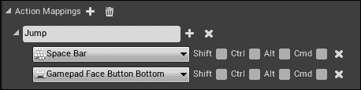
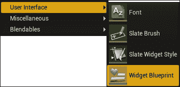
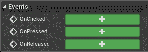
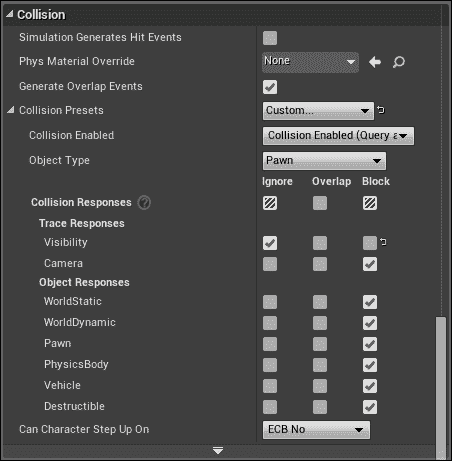
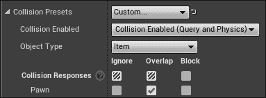
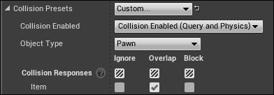
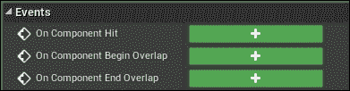
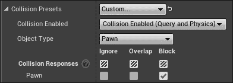

# 第六章：输入和碰撞

本章涵盖了围绕游戏控制输入（键盘、鼠标和游戏手柄）以及与障碍物的碰撞相关的教程。

本章将涵盖以下教程：

+   轴映射-键盘、鼠标和游戏手柄方向输入，用于 FPS 角色

+   轴映射-标准化输入

+   动作映射-用于 FPS 角色的单按钮响应

+   从 C++添加轴和动作映射

+   鼠标 UI 输入处理

+   UMG 键盘 UI 快捷键

+   碰撞-使用忽略让物体相互穿过

+   碰撞-使用重叠拾取物体

+   碰撞-使用阻止防止相互穿透

# 介绍

良好的输入控件在您的游戏中非常重要。提供键盘、鼠标和尤其是游戏手柄输入将使您的游戏更受用户欢迎。

### 提示

 您可以在 Windows PC 上使用 Xbox 360 和 PlayStation 控制器-它们具有 USB 输入。检查您当地的电子商店，以找到一些好的 USB 游戏控制器。您还可以使用无线控制器，连接到 PC 的游戏控制器无线接收器适配器。

# 轴映射-键盘、鼠标和游戏手柄方向输入，用于 FPS 角色

有两种类型的输入映射：**轴映射**和**动作映射**。轴映射是您按住一段时间以获得其效果的输入（例如，按住*W*键移动玩家向前），而动作映射是一次性输入（例如，按下游戏手柄上的*A*键使玩家跳跃）。在本教程中，我们将介绍如何设置键盘、鼠标和游戏手柄轴映射输入控件以移动 FPS 角色。

## 准备就绪

您必须有一个 UE4 项目，其中有一个主角玩家，以及一个地面平面可供行走，以准备进行此操作。

## 如何做...

1.  创建一个 C++类，`Warrior`，从`Character`派生：

```cpp
UCLASS()
class CH6_API AWarrior : public ACharacter
{
  GENERATED_BODY()
};
```

1.  启动 UE4，并根据您的`Warrior`类派生一个蓝图，`BP_Warrior`。

1.  创建并选择一个新的`GameMode`类蓝图，如下所示：

1.  转到**设置** | **项目设置** | **地图和模式**。

1.  单击默认**GameMode**下拉菜单旁边的**+**图标，这将创建一个`GameMode`类的新蓝图，并选择您选择的名称（例如`BP_GameMode`）。

1.  双击您创建的新`BP_GameMode`蓝图类以进行编辑。

1.  打开您的`BP_GameMode`蓝图，并选择您的蓝图化的`BP_Warrior`类作为默认的`Pawn`类。

1.  要设置键盘输入驱动玩家，打开**设置** | **项目设置** | **输入**。在接下来的步骤中，我们将完成在游戏中驱动玩家向前的过程：

1.  单击**轴映射**标题旁边的**+**图标。

### 提示

**轴映射**支持连续（按住按钮）输入，而**动作映射**支持一次性事件。

1.  为轴映射命名。第一个示例将展示如何移动玩家向前，因此将其命名为**Forward**。

1.  在**Forward**下方，选择一个键盘键来分配给此轴映射，例如*W*。

1.  单击**Forward**旁边的**+**图标，并选择一个游戏控制器输入，以将玩家前进映射到移动玩家的游戏控制器左拇指杆上。

1.  使用键盘、游戏手柄和可选的鼠标输入绑定，完成**轴映射**的后退、左转和右转。

1.  从您的 C++代码中，重写`AWarrior`类的`SetupPlayerInputComponent`函数，如下所示：

```cpp
void AWarrior::SetupPlayerInputComponent(UInputComponent* Input)
{
  check(Input);
  Input->BindAxis( "Forward", this, &AWarrior::Forward );
}
```

1.  在您的`AWarrior`类中提供一个`Forward`函数，如下所示：

```cpp
void AWarrior::Forward( float amount )
{
  if( Controller && amount )
  {
    // Moves the player forward by an amount in forward direction
    AddMovementInput(GetActorForwardVector(), amount );
  }
}
```

1.  编写并完成其余输入方向的函数，`AWarrior::Back`，`AWarrior::Left`和`AWarrior::Right`。

## 它是如何工作的...

UE4 引擎允许直接将输入事件连接到 C++函数调用。由输入事件调用的函数是某个类的成员函数。在前面的示例中，我们将*W*键的按下和手柄的左摇杆向上按下都路由到了`AWarrior::Forward`的 C++函数。调用`AWarrior::Forward`的实例是路由控制器输入的实例。这由在`GameMode`类中设置为玩家角色的对象控制。

## 另请参阅

+   您可以实际上从 C++中编写`Forward`输入轴绑定，而不是在 UE4 编辑器中输入。我们将在以后的示例中详细描述这一点，*从 C++添加轴和动作映射*。

# 轴映射 - 规范化输入

如果您注意到，右侧和前方的输入为 1.0 实际上会总和为 2.0 的速度。这意味着在对角线上移动可能比纯粹向前、向后、向左或向右移动更快。我们真正应该做的是夹住任何导致速度超过 1.0 单位的输入值，同时保持指示的输入方向。我们可以通过存储先前的输入值并覆盖`::Tick()`函数来实现这一点。

## 准备工作

打开一个项目，并设置一个`Character`派生类（我们称之为`Warrior`）。

## 如何做…

1.  如下覆盖`AWarrior::SetupPlayerInputComponent( UInputComponent* Input )`函数：

```cpp
void AWarrior::SetupPlayerInputComponent( UInputComponent* Input )
{
  Input->BindAxis( "Forward", this, &AWarrior::Forward );
  Input->BindAxis( "Back", this, &AWarrior::Back );
  Input->BindAxis( "Right", this, &AWarrior::Right );
  Input->BindAxis( "Left", this, &AWarrior::Left );
}
```

1.  编写相应的`::Forward`、`::Back`、`::Right`和`::Left`函数如下：

```cpp
void AWarrior::Forward( float amount ) {
  // We use a += of the amount added so that
  // when the other function modifying .Y
  // (::Back()) affects lastInput, it won't
  // overwrite with 0's
  lastInput.Y += amount;
}
void AWarrior::Back( float amount ) {
  lastInput.Y += -amount;
}
void AWarrior::Right( float amount ) {
  lastInput.X += amount;
}
void AWarrior::Left( float amount ) {
  lastInput.X += -amount;
}
```

1.  在`AWarrior::Tick()`函数中，在规范化输入向量中任何超大值后修改输入值：

```cpp
void AWarrior::Tick( float DeltaTime ) {
  Super::Tick( DeltaTime );
  if( Controller )
  {
    float len = lastInput.Size();
    if( len > 1.f )
      lastInput /= len;
    AddMovementInput(
    GetActorForwardVector(), lastInput.Y );
    AddMovementInput(GetActorRightVector(), lastInput.X);
    // Zero off last input values
    lastInput = FVector2D( 0.f, 0.f );
  }
}
```

## 工作原理…

当输入向量超过 1.0 的幅度时，我们对其进行规范化。这将限制最大输入速度为 1.0 单位（例如，当完全向上和向右按下时，速度为 2.0 单位）。

# 动作映射 - 用于 FPS 角色的单按钮响应

动作映射用于处理单按钮按下（而不是按住的按钮）。对于应该按住的按钮，请确保使用轴映射。

## 准备工作

准备好一个带有您需要完成的操作的 UE4 项目，例如`Jump`或`ShootGun`。

## 如何做…

1.  打开**设置** | **项目设置** | **输入**。

1.  转到**动作映射**标题，并单击旁边的**+**图标。

1.  开始输入应映射到按钮按下的操作。例如，为第一个动作输入`Jump`。

1.  选择要按下的键以执行该操作，例如，**空格键**。

1.  如果您希望通过另一个按键触发相同的操作，请单击**动作映射**名称旁边的**+**，然后选择另一个按键来触发该操作。

1.  如果要求**Shift**、**Ctrl**、**Alt**或**Cmd**键必须按下才能触发操作，请确保在键选择框右侧的复选框中指示。



1.  要将您的操作链接到 C++代码函数，您需要覆盖`SetupPlayerInputComponent(UInputControl* control )`函数。在该函数内输入以下代码：

```cpp
voidAWarrior::SetupPlayerInputComponent(UInputComponent* Input)
{
  check(Input );
  // Connect the Jump action to the C++ Jump function
  Input->BindAction("Jump", IE_Pressed, this, &AWarrior::Jump );
}
```

## 工作原理…

**动作映射**是单按钮按下事件，触发 C++代码以响应它们运行。您可以在 UE4 编辑器中定义任意数量的操作，但请确保将**动作映射**与 C++中的实际按键绑定起来。

## 另请参阅

+   您可以列出您希望从 C++代码映射的操作。有关此信息，请参阅*从 C++添加轴和动作映射*中的以下示例。

# 从 C++添加轴和动作映射

**轴映射**和**动作映射**可以通过 UE4 编辑器添加到游戏中，但我们也可以直接从 C++代码中添加它们。由于 C++函数的连接本来就是从 C++代码进行的，因此您可能会发现在 C++中定义您的轴和动作映射也很方便。

## 准备工作

您需要一个 UE4 项目，您想要在其中添加一些轴和动作映射。如果您通过 C++代码添加它们，您可以删除**Settings** | **Project Settings** | **Input**中列出的现有轴和动作映射。要添加您的自定义轴和动作映射，有两个 C++函数您需要了解：`UPlayerInput::AddAxisMapping`和`UPlayerInput::AddActionMapping`。这些是`UPlayerInput`对象上可用的成员函数。`UPlayerInput`对象位于`PlayerController`对象内，可以通过以下代码访问：

```cpp
GetWorld()->GetFirstPlayerController()->PlayerInput
```

您还可以使用`UPlayerInput`的两个静态成员函数来创建您的轴和动作映射，如果您不想单独访问玩家控制器的话：

```cpp
UPlayerInput::AddEngineDefinedAxisMapping()
UPlayerInput::AddEngineDefinedActionMapping()
```

## 如何做...

1.  首先，我们需要定义我们的`FInputAxisKeyMapping`或`FInputActionKeyMapping`对象，具体取决于您是连接轴键映射（用于按下按钮进行输入）还是连接动作键映射（用于一次性事件-按下按钮进行输入）。

1.  对于轴键映射，我们定义一个`FInputAxisKeyMapping`对象，如下所示：

```cpp
FInputAxisKeyMapping backKey( "Back", EKeys::S, 1.f );
```

1.  这将包括动作的字符串名称，要按的键（使用 EKeys `enum`），以及是否应按住*Shift*、*Ctrl*、*Alt*或*cmd*（Mac）来触发事件。

1.  对于动作键映射，定义`FInputActionKeyMapping`，如下所示：

```cpp
FInputActionKeyMapping jump("Jump", EKeys::SpaceBar, 0, 0, 0, 0);
```

1.  这将包括动作的字符串名称，要按的键，以及是否应按住*Shift*、*Ctrl*、*Alt*或*cmd*（Mac）来触发事件。

1.  在您的玩家`Pawn`类的`SetupPlayerInputComponent`函数中，将您的轴和动作键映射注册到以下内容：

1.  与特定控制器连接的`PlayerInput`对象：

```cpp
GetWorld()->GetFirstPlayerController()->PlayerInput->AddAxisMapping( backKey ); // specific to a controller
```

1.  或者，您可以直接注册到`UPlayerInput`对象的静态成员函数：

```cpp
UPlayerInput::AddEngineDefinedActionMapping(jump );
```

### 提示

确保您对轴与动作映射使用了正确的函数！

1.  使用 C++代码注册您的动作和轴映射到 C++函数，就像前两个示例中所示的那样：

```cpp
Input->BindAxis("Back", this, &AWarrior::Back);
Input->BindAction("Jump", IE_Pressed, this, &AWarrior::Jump );
```

## 它是如何工作的...

动作和轴映射注册函数允许您直接从 C++代码设置您的输入映射。C++编码的输入映射本质上与在**Settings** | **Project Settings** | **Input**对话框中输入映射相同。

# 鼠标 UI 输入处理

在使用**虚幻运动图形（UMG）**工具包时，您会发现鼠标事件非常容易处理。我们可以注册 C++函数以在鼠标单击或与 UMG 组件的其他类型交互后运行。

通常，事件注册将通过蓝图进行；但在这个示例中，我们将概述如何编写和连接 UMG 事件的 C++函数。

## 准备工作

在您的 UE4 项目中创建一个 UMG 画布。从那里，我们将为`OnClicked`、`OnPressed`和`OnReleased`事件注册事件处理程序。

## 如何做...

1.  在**Content Browser**中右键单击（或单击**Add New**），然后选择**User Interface** | **Widget Blueprint**，如下截图所示。这将向您的项目添加一个可编辑的小部件蓝图。

1.  双击您的**Widget Blueprint**进行编辑。

1.  通过从左侧的调色板拖动按钮来向界面添加按钮。

1.  滚动**Details**面板，直到找到**Events**子部分。

1.  单击您想要处理的任何事件旁边的**+**图标。

1.  将出现在蓝图中的事件连接到任何具有`BlueprintCallable`标签的 C++ `UFUNCTION()`。例如，在您的`GameMode`类派生中，您可以包括一个函数，如下：

```cpp
UFUNCTION(BlueprintCallable, Category = UIFuncs)
void ButtonClicked()
{
  UE_LOG(LogTemp, Warning, TEXT( "UI Button Clicked" ) );
}
```

1.  通过在您选择的事件下的蓝图图表中路由到它来触发函数调用。

1.  通过在`GameMode`的**Begin Play**函数中调用**Create Widget**，然后调用**Add to Viewport**来构建和显示您的 UI（或任何主要对象）。

## 它是如何工作的...

您的小部件蓝图的按钮事件可以轻松连接到蓝图事件，或通过前面的方法连接到 C++函数。

# UMG 键盘 UI 快捷键

每个用户界面都需要与之关联的快捷键。要将这些程序到您的 UMG 界面中，您可以简单地将某些键组合连接到一个动作映射中。当动作触发时，只需调用与 UI 按钮本身触发相同的蓝图函数。

## 准备工作

您应该已经创建了一个 UMG 界面，就像前面的示例中所示的那样。

## 如何做…

1.  在**设置** | **项目设置** | **输入**中，为您的热键事件定义一个新的动作映射，例如`HotKey_UIButton_Spell`。

1.  将事件连接到您的 UI 的函数调用，无论是在蓝图中还是在 C++代码中。

## 工作原理…

通过将动作映射与 UI 调用的函数进行短路连接，可以使您在游戏程序中很好地实现热键。

# 碰撞 - 使用忽略让物体相互穿过

碰撞设置相当容易获得。碰撞有三类交集：

+   `忽略`：相互穿过而没有任何通知的碰撞。

+   `重叠`：触发`OnBeginOverlap`和`OnEndOverlap`事件的碰撞。允许具有重叠设置的对象相互渗透。

+   `阻止`：阻止所有相互渗透的碰撞，并完全阻止物体相互重叠。

对象被归类为许多**对象类型**之一。特定蓝图组件的**碰撞**设置允许您将对象归类为您选择的**对象类型**，并指定该对象如何与所有其他类型的所有其他对象发生碰撞。这在蓝图编辑器的**详细信息** | **碰撞**部分以表格格式呈现。

例如，以下屏幕截图显示了角色的`CapsuleComponent`的**碰撞**设置：



## 准备工作

您应该有一个 UE4 项目，其中包含一些您希望为其编程交集的对象。

## 如何做…

1.  打开蓝图编辑器，选择您希望其他对象只是穿过并忽略的对象。在**组件**列表下，选择您想要设置程序的组件。

1.  选择您的组件后，查看您的**详细信息**标签（通常在右侧）。在**碰撞预设**下，选择**无碰撞**或**自定义…**预设。

1.  如果选择**无碰撞**预设，您可以只需保持不变，所有碰撞都将被忽略。

1.  如果选择**自定义…**预设，则选择以下之一：

1.  **无碰撞**在**启用碰撞**下拉菜单中。

1.  在**启用碰撞**下选择一个碰撞模式，确保为每个您希望忽略碰撞的**对象类型**勾选**忽略**复选框。

## 工作原理…

忽略的碰撞不会触发任何事件，也不会阻止标记为忽略的对象之间的相互渗透。

# 碰撞 - 使用重叠拾取物品

物品拾取是一件非常重要的事情。在这个示例中，我们将概述如何使用 Actor 组件基元上的**重叠**事件使物品拾取起作用。

## 准备工作

前面的示例，*碰撞：使用忽略让物体相互穿过*，描述了碰撞的基础知识。在开始本示例之前，您应该阅读它以了解背景。我们将在这里创建一个**新对象通道…**来识别`Item`类对象，以便可以对其进行重叠的编程，只与玩家角色的碰撞体发生重叠。

## 如何做…

1.  首先为`Item`对象的碰撞基元创建一个独特的碰撞通道。在**项目设置** | **碰撞**下，通过转到**新对象通道…**来创建一个新的对象通道！如何做…

1.  将新的对象通道命名为`Item`。

1.  取你的`Item`角色并选择用于与玩家角色交叉拾取的基本组件。将该基本组件的**对象类型**设置为`Item`类的**对象类型**。

1.  勾选`Pawn`类**对象类型**旁边的**Overlap**复选框，如下截图所示：

1.  确保勾选**Generate Overlap Events**复选框。

1.  选择将拾取物品的玩家角色，并选择他身上用于寻找物品的组件。通常，这将是他的`CapsuleComponent`。检查与`Item`对象的**Overlap**。

1.  现在玩家重叠了物品，物品也重叠了玩家角色。我们必须双向信号重叠（`Item`重叠`Pawn`和`Pawn`重叠`Item`）才能正常工作。确保`Pawn`交叉组件的**Generate Overlap Events**也被勾选。

1.  接下来，我们必须完成`OnComponentBeginOverlap`事件，要么是对物品，要么是对玩家的拾取体积，使用蓝图或 C++代码。

1.  如果你更喜欢蓝图，在 Coin 的可交叉组件的**Details**面板的**Events**部分，点击**On Component Begin Overlap**事件旁边的**+**图标。

1.  使用出现在你的`Actor`蓝图图表中的`OnComponentBeginOverlap`事件，将蓝图代码连接到玩家的胶囊体积发生重叠时运行。

1.  如果你更喜欢 C++，你可以编写并附加一个 C++函数到`CapsuleComponent`。在你的玩家角色类中编写一个成员函数，签名如下：

```cpp
UFUNCTION(BlueprintNativeEvent, Category = Collision)
void OnOverlapsBegin( UPrimitiveComponent* Comp, AActor* OtherActor,
UPrimitiveComponent* OtherComp, int32 OtherBodyIndex,
bool bFromSweep, const FHitResult& SweepResult );
```

### 提示

**在 UE 4.13 中，OnOverlapsBegin 函数的签名已更改为：**

```cpp
OnOverlapsBegin( UPrimitiveComponent* Comp, AActor* OtherActor,UPrimitiveComponent* OtherComp, int32 OtherBodyIndex, bool bFromSweep, const FHitREsult& SweepResult );
```

1.  在你的`.cpp`文件中完成`OnOverlapsBegin()`函数的实现，确保以`_Implementation`结束函数名：

```cpp
void AWarrior::OnOverlapsBegin_Implementation( AActor*
OtherActor, UPrimitiveComponent* OtherComp,
int32 OtherBodyIndex,
bool bFromSweep, const FHitResult& SweepResult )
{
  UE_LOG(LogTemp, Warning, TEXT( "Overlaps began" ) );
}
```

1.  然后，提供一个`PostInitializeComponents()`覆盖，将`OnOverlapsBegin()`函数与你的角色类中的胶囊体重叠连接起来，如下所示：

```cpp
void AWarrior::PostInitializeComponents()
{
  Super::PostInitializeComponents();
  if(RootComponent )
  {
    // Attach contact function to all bounding components.
    GetCapsuleComponent()->OnComponentBeginOverlap.AddDynamic( this, &AWarrior::OnOverlapsBegin );
    GetCapsuleComponent()->OnComponentEndOverlap.AddDynamic( this, &AWarrior::OnOverlapsEnd );
  }
}
```

## 它是如何工作的...

引擎引发的**Overlap**事件允许代码在两个 UE4`Actor`组件重叠时运行，而不会阻止对象的相互穿透。

# 碰撞 - 使用阻挡来防止穿透

阻挡意味着在引擎中将阻止`Actor`组件相互穿透，并且在发现碰撞后，任何两个基本形状之间的碰撞将被解决，不会重叠。

## 准备工作

从一个具有附加到它们的碰撞基元的对象的 UE4 项目开始（`SphereComponents`，`CapsuleComponents`或`BoxComponents`）。

## 如何做...

1.  打开你想要阻挡另一个角色的角色的蓝图。例如，我们希望玩家角色阻挡其他玩家角色实例。

1.  在**Details**面板中标记你不希望与其他组件相互穿透的角色内的基元，将这些组件标记为**Blocking**。

## 它是如何工作的...

当对象相互**阻挡**时，它们将不被允许相互穿透。任何穿透将被自动解决，并且对象将被推开。

## 还有更多...

你可以重写`OnComponentHit`函数，以便在两个对象相撞时运行代码。这与`OnComponentBeginOverlap`事件是不同的。
