# 第七章：类和接口之间的通信

本章向您展示如何编写自己的 UInterfaces，并演示如何在 C++中利用它们来最小化类耦合并帮助保持代码清晰。本章将涵盖以下内容：

+   创建一个`UInterface`

+   在对象上实现`UInterface`

+   检查类是否实现了`UInterface`

+   在本地代码中实现`UInterface`的转换

+   从 C++调用本地`UInterface`函数

+   相互继承`UInterface`

+   在 C++中重写`UInterface`函数

+   从本地基类向蓝图公开`UInterface`方法

+   在蓝图中实现`UInterface`函数

+   创建 C++ `UInterface`函数实现，可以在蓝图中重写

+   从 C++调用蓝图定义的接口函数

+   使用 UInterfaces 实现简单的交互系统

# 介绍

在您的游戏项目中，有时需要一系列潜在不同的对象共享共同的功能，但使用继承是不合适的，因为这些不同对象之间没有“是一个”关系。诸如 C++的语言倾向于使用多重继承来解决这个问题。

然而，在虚幻中，如果您希望从父类中的函数都可以在蓝图中访问，您需要将它们都设置为`UCLASS`。这有两个问题。在同一个对象中两次继承`UClass`会破坏`UObject`应该形成一个整洁的可遍历层次结构的概念。这也意味着对象上有两个`UClass`方法的实例，并且它们在代码中必须明确区分。虚幻代码库通过从 C#借用一个概念来解决这个问题——显式接口类型。

使用这种方法的原因是，与组合相比，组件只能在 Actor 上使用，而不能在一般的 UObjects 上使用。接口可以应用于任何`UObject`。此外，这意味着我们不再对对象和组件之间的“是一个”关系进行建模；相反，它只能表示“有一个”关系。

# 创建一个 UInterface

UInterfaces 是一对类，它们一起工作，使类能够在多个类层次结构中表现多态行为。本章向您展示了纯粹使用代码创建`UInterface`的基本步骤。

## 如何做...

1.  UInterfaces 不会出现在虚幻中的主类向导中，因此我们需要使用 Visual Studio 手动添加类。

1.  在**解决方案资源管理器**中右键单击**源**文件夹，然后选择**添加** | **新建项**。

1.  选择一个`.h`文件开始，命名为`MyInterface.h`。

1.  确保将项目中项目的目录更改为 Intermediate 到 Source/ProjectName。

1.  单击**OK**在项目文件夹中创建一个新的头文件。

1.  重复步骤，以创建`MyInterface.cpp`作为您的实现文件。

1.  将以下代码添加到头文件中：

```cpp
#include "MyInterface.generated.h"
/**  */
UINTERFACE()
class UE4COOKBOOK_API UMyInterface: public UInterface
{
  GENERATED_BODY()
};

/**  */
class UE4COOKBOOK_API IMyInterface
{
  GENERATED_BODY()

  public:
  virtualFStringGetTestName();
};
```

1.  在`.cpp`文件中使用以下代码实现类：

```cpp
#include "UE4Cookbook.h"
#include "MyInterface.h"

FString IMyInterface::GetTestName()
{
  unimplemented();
  return FString();
}
```

1.  编译您的项目以验证代码是否没有错误地编写。

## 它是如何工作的...

1.  UInterfaces 被实现为接口头文件中声明的一对类。

1.  与往常一样，因为我们正在利用虚幻的反射系统，我们需要包含我们生成的头文件。有关更多信息，请参阅第五章中关于通过虚拟函数实现的事件处理，处理事件和委托。

1.  与继承自`UObject`的类一样，它使用`UCLASS`，我们需要使用`UINTERFACE`宏来声明我们的新`UInterface`。

1.  该类被标记为`UE4COOKBOOK_API`，以帮助导出库符号。

1.  `UObject`部分的接口的基类是`UInterface`。

1.  就像`UCLASS`类型一样，我们需要在类的主体中放置一个宏，以便自动生成的代码被插入其中。

1.  对于 UInterfaces，该宏是`GENERATED_BODY()`。该宏必须放在类主体的开头。

1.  第二个类也被标记为`UE4COOKBOOK_API`，并且以特定的方式命名。

1.  请注意，`UInterface`派生类和标准类具有相同的名称，但具有不同的前缀。`UInterface`派生类具有前缀`U`，标准类具有前缀`I`。

1.  这很重要，因为这是 Unreal Header Tool 期望类的命名方式，以使其生成的代码正常工作。

1.  普通的本机接口类需要其自动生成的内容，我们使用`GENERATED_BODY()`宏包含它。

1.  我们在`IInterface`内声明了类应该在内部实现的函数。

1.  在实现文件中，我们实现了我们的`UInterface`的构造函数，因为它是由 Unreal Header Tool 声明的，并且需要一个实现。

1.  我们还为我们的`GetTestName()`函数创建了一个默认实现。如果没有这个，编译的链接阶段将失败。这个默认实现使用`unimplemented()`宏，当代码行被执行时会发出调试断言。

## 另请参阅

+   参考第五章中的*使用委托绑定传递有效负载数据*，*处理事件和委托*；特别是第一个示例解释了我们在这里应用的一些原则

# 在对象上实现 UInterface

确保您已经按照前面的示例准备好要实现的`UInterface`。

## 操作步骤...

1.  使用 Unreal Wizard 创建一个名为`SingleInterfaceActor`的新的`Actor`类。

1.  将`IInterface`—在本例中为`IMyInterface`—添加到我们新的`Actor`类的公共继承列表中：

```cpp
class UE4COOKBOOK_API ASingleInterfaceActor : public AActor, public IMyInterface
```

1.  为我们希望重写的`IInterface`函数在类中添加一个`override`声明：

```cpp
FStringGetTestName() override;
```

1.  通过添加以下代码在实现文件中实现重写的函数：

```cpp
FStringASingleInterfaceActor::GetTestName()
{
  return IMyInterface::GetTestName();
}
```

## 工作原理...

1.  C++使用多重继承来实现接口，因此我们在这里利用了这种机制，声明了我们的`SingleInterfaceActor`类，其中添加了`public IMyInterface`。

1.  我们从`IInterface`而不是`UInterface`继承，以防止`SingleInterfaceActor`继承两个`UObject`的副本。

1.  鉴于接口声明了一个`virtual`函数，如果我们希望自己实现它，我们需要使用 override 修饰符重新声明该函数。

1.  在我们的实现文件中，我们实现了我们重写的`virtual`函数。

1.  在我们的函数重写中，为了演示目的，我们调用函数的基本`IInterface`实现。或者，我们可以编写自己的实现，并完全避免调用基类的实现。

1.  我们使用`IInterface:: specifier`而不是`Super`，因为`Super`指的是我们类的父类`UClass`，而 IInterfaces 不是 UClasses（因此没有`U`前缀）。

1.  您可以根据需要在对象上实现第二个或多个 IInterfaces。

# 检查类是否实现了 UInterface

按照前两个示例，以便您有一个我们可以检查的`UInterface`，以及实现接口的类，可以对其进行测试。

## 操作步骤...

1.  在您的游戏模式实现中，将以下代码添加到`BeginPlay`函数中：

```cpp
FTransformSpawnLocation;
ASingleInterfaceActor* SpawnedActor = GetWorld()->SpawnActor<ASingleInterfaceActor> (ASingleInterfaceActor::StaticClass(), SpawnLocation);
if (SpawnedActor->GetClass()->ImplementsInterface(UMyInterface::StaticClass()))
{
  GEngine->AddOnScreenDebugMessage(-1, 1, FColor::Red, TEXT("Spawned actor implements interface!"));
}
```

1.  鉴于我们引用了`ASingleInterfaceActor`和`IMyInterface`，我们需要在我们的源文件中`#include` `MyInterface.h`和`SingleInterfaceActor.h`。

## 工作原理...

1.  在`BeginPlay`中，我们创建一个空的`FTransform`函数，它的默认值是所有平移和旋转分量的`0`，因此我们不需要显式设置任何分量。

1.  然后，我们使用`UWorld`中的`SpawnActor`函数，这样我们就可以创建我们的`SingleActorInterface`的实例，并将指针存储到临时变量中。

1.  然后，我们使用`GetClass()`在我们的实例上获取一个引用到其关联的`UClass`。我们需要一个对`UClass`的引用，因为该对象是保存对象的所有反射数据的对象。

1.  反射数据包括对象上所有`UPROPERTY`的名称和类型，对象的继承层次结构，以及它实现的所有接口的列表。

1.  因此，我们可以在`UClass`上调用`ImplementsInterface()`，如果对象实现了所讨论的`UInterface`，它将返回`true`。

1.  如果对象实现了接口，因此从`ImplementsInterface`返回`true`，我们就会在屏幕上打印一条消息。

## 另请参阅

+   第五章, *处理事件和委托*，有许多与生成 actor 相关的配方

# 在本机代码中实现 UInterface 的转换

作为开发人员，UInterfaces 为您提供的一个优势是，使用`Cast< >`来处理转换，可以将实现共同接口的异构对象集合视为相同对象的集合。

### 注意

请注意，如果您的类通过 Blueprint 实现接口，则此方法将无效。

## 准备工作

您应该为此配方准备一个`UInterface`和一个实现接口的`Actor`。

使用 Unreal 中的向导创建一个新的游戏模式，或者可选地，重用以前配方中的项目和`GameMode`。

## 操作步骤...

1.  打开游戏模式的声明，并向其中添加一个新的`UPROPERTY()宏`：

```cpp
UPROPERTY()
TArray<IMyInterface*>MyInterfaceInstances;
```

1.  在头文件的包含部分添加`#include "MyInterface.h"`。

1.  在游戏模式的`BeginPlay`实现中添加以下内容：

```cpp
for (TActorIterator<AActor> It(GetWorld(), AActor::StaticClass()); It; ++It)
{
  AActor* Actor = *It;
  IMyInterface* MyInterfaceInstance = Cast<IMyInterface>(Actor);
  if (MyInterfaceInstance)
  {
    MyInterfaceInstances.Add(MyInterfaceInstance);
  }
}
GEngine->AddOnScreenDebugMessage(-1, 1, FColor::Red, FString::Printf(TEXT("%d actors implement the interface"), MyInterfaceInstances.Num()));
```

1.  将级别的游戏模式覆盖设置为您的游戏模式，然后将几个实现自定义接口的 actor 实例拖放到级别中。

1.  当您播放级别时，屏幕上应该打印一条消息，指示在级别中实现了接口的实例的数量：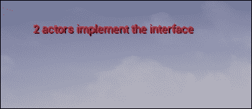

## 它是如何工作的...

1.  我们创建了一个指向`MyInterface`实现的指针数组。

1.  在`BeginPlay`中，我们使用`TActorIterator<AActor>`来获取我们级别中的所有`Actor`实例。

1.  `TActorIterator`有以下构造函数：

```cpp
explicitTActorIterator( UWorld* InWorld, TSubclassOf<ActorType>InClass = ActorType::StaticClass() )
: Super(InWorld, InClass )
```

1.  `TActorIterator`期望一个要操作的世界，以及一个`UClass`实例来指定我们感兴趣的 Actor 类型。

1.  `ActorIterator`是类似 STL 迭代器类型的迭代器。这意味着我们可以编写以下形式的`for`循环：

```cpp
for (iterator-constructor;iterator;++iterator)
```

1.  在循环内，我们取消引用迭代器以获取`Actor`指针。

1.  然后，我们尝试将其转换为我们的接口；如果它实现了它，这将返回一个指向接口的指针，否则将返回`nullptr`。

1.  因此，我们可以检查接口指针是否为`null`，如果不是，我们可以将接口指针引用添加到我们的数组中。

1.  最后，一旦我们遍历了`TActorIterator`中的所有 actor，我们就可以在屏幕上显示一条消息，显示实现了接口的项目的计数。

# 从 C++调用本机 UInterface 函数

按照前一个配方来理解将`Actor`指针转换为接口指针。

### 注意

请注意，由于此配方依赖于前一个配方中使用的转换技术，因此它只能与使用 C++实现接口的对象一起使用，而不能与 Blueprint 一起使用。这是因为 Blueprint 类在编译时不可用，因此在技术上不继承该接口。

## 操作步骤...

1.  使用编辑向导创建一个新的`Actor`类。将其命名为`AntiGravityVolume`。

1.  将`BoxComponent`添加到新的`Actor`中。

```cpp
UPROPERTY()
UBoxComponent* CollisionComponent;
```

1.  在头文件中重写以下`Actor` `virtual`函数：

```cpp
virtual void NotifyActorBeginOverlap(AActor* OtherActor) override;
virtual void NotifyActorEndOverlap(AActor* OtherActor) override;
```

1.  在源文件中创建一个实现，如下所示：

```cpp
voidAAntiGravityVolume::NotifyActorBeginOverlap(AActor* OtherActor)
{
  IGravityObject* GravityObject = Cast<IGravityObject>(OtherActor);
  if (GravityObject != nullptr)
  {
    GravityObject->DisableGravity();
  }
}

voidAAntiGravityVolume::NotifyActorEndOverlap(AActor* OtherActor)
{
  IGravityObject* GravityObject = Cast<IGravityObject>(OtherActor);
  if (GravityObject != nullptr)
  {
    GravityObject->EnableGravity();
  }
}
```

1.  在构造函数中初始化`BoxComponent`：

```cpp
AAntiGravityVolume::AAntiGravityVolume()
{
  PrimaryActorTick.bCanEverTick = true;
  CollisionComponent = CreateDefaultSubobject<UBoxComponent>("CollisionComponent");
  CollisionComponent->SetBoxExtent(FVector(200, 200, 400));
  RootComponent = CollisionComponent;

}
```

1.  创建一个名为`GravityObject`的接口。

1.  在`IGravityObject`中添加以下`virtual`函数：

```cpp
virtual void EnableGravity();
virtual void DisableGravity();
```

1.  在`IGravityObject`实现文件中创建`virtual`函数的默认实现：

```cpp
voidIGravityObject::EnableGravity()
{
  AActor* ThisAsActor = Cast<AActor>(this);
  if (ThisAsActor != nullptr)
  {
    TArray<UPrimitiveComponent*>PrimitiveComponents;
    ThisAsActor->GetComponents(PrimitiveComponents);
    for (UPrimitiveComponent* Component : PrimitiveComponents)
    {
      Component->SetEnableGravity(true);
    }
  }
}

voidIGravityObject::DisableGravity()
{
  AActor* ThisAsActor = Cast<AActor>(this);
  if (ThisAsActor != nullptr)
  {
    TArray<UPrimitiveComponent*>PrimitiveComponents;
    ThisAsActor->GetComponents(PrimitiveComponents);
    for (UPrimitiveComponent* Component : PrimitiveComponents)
    {
      Component->SetEnableGravity(false);
    }
  }
}
```

1.  创建一个名为`PhysicsCube`的`Actor`子类。

1.  添加一个静态网格：

```cpp
UPROPERTY()
UStaticMeshComponent* MyMesh;
```

1.  在构造函数中初始化组件：

```cpp
MyMesh = CreateDefaultSubobject<UStaticMeshComponent>("MyMesh");
autoMeshAsset = ConstructorHelpers::FObjectFinder<UStaticMesh>(TEXT("StaticMesh'/Engine/BasicShapes/Cube.Cube'"));
if (MeshAsset.Object != nullptr)
{
  MyMesh->SetStaticMesh(MeshAsset.Object);
}
MyMesh->SetMobility(EComponentMobility::Movable);
MyMesh->SetSimulatePhysics(true);
SetActorEnableCollision(true);
```

1.  要使`PhysicsCube`实现`GravityObject`，首先在头文件中`#include "GravityObject.h"`，然后修改类声明：

```cpp
class UE4COOKBOOK_API APhysicsCube : public AActor, public IGravityObject
```

1.  编译您的项目。

1.  创建一个新的关卡，并在场景中放置一个重力体积的实例。

1.  在重力体积上放置一个`PhysicsCube`的实例，然后稍微旋转它，使其有一个角落比其他角落低，如下图所示：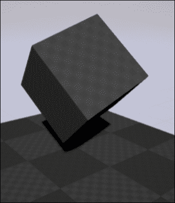

1.  验证当对象进入体积时重力被关闭，然后再次打开。

### 注意

请注意，重力体积不需要知道任何关于您的`PhysicsCube` actor 的信息，只需要知道重力对象接口。

## 工作原理...

1.  我们创建一个新的`Actor`类，并添加一个箱子组件，以便给角色添加一个会与角色发生碰撞的物体。或者，如果您想要使用 BSP 功能来定义体积的形状，您也可以对`AVolume`进行子类化。

1.  重写`NotifyActorBeginOverlap`和`NotifyActorEndOverlap`，以便在对象进入或离开`AntiGravityVolume`区域时执行某些操作。

1.  在`NotifyActorBeginOverlap`实现中，我们尝试将与我们发生重叠的对象转换为`IGravityObject`指针。

1.  这个测试是为了检查所讨论的对象是否实现了该接口。

1.  如果指针有效，则对象确实实现了接口，因此可以安全地使用接口指针调用对象上的接口方法。

1.  鉴于我们在`NotifyActorBeginOverlap`内部，我们希望禁用对象上的重力，因此我们调用`DisableGravity()`。

1.  在`NotifyActorEndOverlap`内部，我们执行相同的检查，但是我们重新启用了对象的重力。

1.  在`DisableGravity`的默认实现中，我们将我们自己的指针（`this`指针）转换为`AActor`。

1.  这使我们能够确认接口仅在`Actor`子类上实现，并调用在`AActor`中定义的方法。

1.  如果指针有效，我们知道我们是一个`Actor`，所以我们可以使用`GetComponents<class ComponentType>()`来从自身获取特定类型的所有组件的`TArray`。

1.  `GetComponents`是一个`template`函数。它需要一些模板参数：

```cpp
template<class T, class AllocatorType>
voidGetComponents(TArray<T*, AllocatorType>&OutComponents) const
```

1.  自 2014 年标准以来，C++支持模板参数的编译时推断。这意味着如果编译器可以从我们提供的普通函数参数中推断出模板参数，那么在调用函数时我们不需要实际指定模板参数。

1.  `TArray`的默认实现是`template<typename T, typename Allocator = FDefaultAllocator>`类`TArray;`

1.  这意味着我们不需要默认情况下指定分配器，因此当我们声明数组时，我们只使用`TArray<UPrimitiveComponent*>`。

1.  当`TArray`传递到`GetComponents`函数中时，编译器知道它实际上是`TArray<UPrimitiveComponent*, FDefaultAllocator>`，并且能够填充模板参数`T`和`AllocatorType`，所以在函数调用时不需要这两个作为模板参数。

1.  `GetComponents`遍历`Actor`拥有的组件，并且从`typename T`继承的任何组件都有指针存储在`PrimitiveComponents`数组中。

1.  使用基于范围的`for`循环，这是 C++的另一个新特性，我们可以在不需要使用传统的`for`循环结构的情况下迭代函数放入我们的`TArray`中的组件。

1.  对每个组件调用`SetEnableGravity(false)`，这将禁用重力。

1.  同样，`EnableGravity`函数遍历了 actor 中包含的所有 primitive 组件，并使用`SetEnableGravity(true)`启用了重力。

## 另请参阅

+   查看第四章, *Actors and Components,* 详细讨论了演员和组件。第五章, *处理事件和委托,* 讨论了诸如`NotifyActorOverlap`之类的事件。

# 相互继承 UInterface

有时，您可能需要创建一个更通用的`UInterface`专门用于`UInterface`。

这个配方向您展示了如何使用 UInterfaces 继承来专门化一个**Killable**接口，使其具有无法通过正常手段杀死的**Undead**接口。

## 操作步骤...

1.  创建一个名为`UKillable`的`UINTERFACE`/`IInterface`。

1.  在`UInterface`声明中添加`UINTERFACE(meta=(CannotImplementInterfaceInBlueprint))`。

1.  在头文件中添加以下函数：

```cpp
UFUNCTION(BlueprintCallable, Category=Killable)
virtual bool IsDead();
UFUNCTION(BlueprintCallable, Category = Killable)
virtual void Die();
```

1.  在实现文件中为接口提供默认实现：

```cpp
boolIKillable::IsDead()
{
  return false;
}

voidIKillable::Die()
{
  GEngine->AddOnScreenDebugMessage(-1,1, FColor::Red,"Arrrgh");
  AActor* Me = Cast<AActor>(this);
  if (Me)
  {
    Me->Destroy();
  }

}
```

1.  创建一个新的`UINTERFACE`/`IInterface`称为`Undead`。修改它们继承自`UKillable`/`IKillable`：

```cpp
UINTERFACE()
class UE4COOKBOOK_API UUndead: public UKillable
{
  GENERATED_BODY()
};

/**  */
class UE4COOKBOOK_API IUndead: public IKillable
{
  GENERATED_BODY()

};
```

1.  确保您包含了定义`Killable`接口的头文件。

1.  在新接口中添加一些重写和新的方法声明：

```cpp
virtual bool IsDead() override;
virtual void Die() override;
virtual void Turn();
virtual void Banish();
```

1.  为函数创建实现：

```cpp
boolIUndead::IsDead()
{
  return true;
}

voidIUndead::Die()
{
  GEngine->AddOnScreenDebugMessage(-1,1, FColor::Red,"You can't kill what is already dead. Mwahaha");
}

voidIUndead::Turn()
{
  GEngine->AddOnScreenDebugMessage(-1,1, FColor::Red, "I'm fleeing!");

}

voidIUndead::Banish()
{
  AActor* Me = Cast<AActor>(this);
  if (Me)
  {
    Me->Destroy();
  }
}
```

1.  在 C++中创建两个新的`Actor`类：一个名为`Snail`，另一个名为`Zombie`。

1.  将`Snail`类设置为实现`IKillable`接口，并添加适当的头文件`#include`。

1.  同样，将`Zombie`类设置为实现`IUndead`，并`#include "Undead.h"`。

1.  编译您的项目。

1.  启动编辑器，将`Zombie`和`Snail`的实例拖入你的关卡中。

1.  在**关卡蓝图**中为它们添加引用。

1.  在每个引用上调用`Die`（消息）。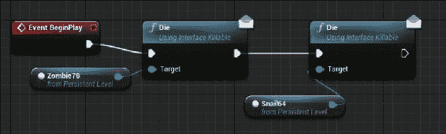

1.  连接两个消息调用的执行引脚，然后将其连接到`Event BeginPlay`。

运行游戏，然后验证`Zombie`对您的杀死尝试不屑一顾，但`Snail`呻吟着然后死去（从世界大纲中移除）。

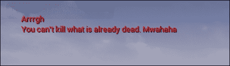

## 工作原理...

1.  为了能够在**关卡蓝图**中测试这个配方，我们需要使接口函数可以通过蓝图调用，所以我们需要在我们的`UFUNCTION`上加上`BlueprintCallable`修饰符。

1.  然而，在`UInterface`中，编译器默认期望接口可以通过 C++和蓝图实现。这与`BlueprintCallable`冲突，后者仅表示该函数可以从蓝图中调用，而不是可以在其中被重写。

1.  我们可以通过将接口标记为`CannotImplementInterfaceInBlueprint`来解决冲突。

1.  这使得我们可以使用`BlueprintCallable`作为我们的`UFUNCTION`修饰符，而不是`BlueprintImplementableEvent`（由于额外的代码允许通过蓝图重写函数而产生额外的开销）。

1.  我们将`IsDead`和`Die`定义为`virtual`，以使它们可以在另一个继承此类的 C++类中被重写。

1.  在我们的默认接口实现中，`IsDead`总是返回`false`。

`Die`的默认实现在屏幕上打印死亡消息，然后销毁实现此接口的对象（如果它是一个`Actor`）。

1.  现在我们可以创建一个名为`Undead`的第二个接口，它继承自`Killable`。

1.  我们在类声明中使用`public UKillable`/`public IKillable`来表示这一点。

1.  当然，结果是我们需要包含定义`Killable`接口的头文件。

1.  我们的新接口重写了`Killable`定义的两个函数，以提供更合适的`Undead`的`IsDead`/`Die`定义。

1.  我们的重写定义已经通过从`IsDead`返回`true`来使`Undead`已经死亡。

1.  当`Die`在`Undead`上调用时，我们只是打印一条消息，`Undead`嘲笑我们试图再次杀死它的微弱尝试，并且什么也不做。

1.  我们还可以为我们的`Undead`特定函数指定默认实现，即`Turn()`和`Banish()`。

1.  当`Undead`被转化时，它们会逃跑，为了演示目的，我们在屏幕上打印一条消息。

1.  然而，如果`Undead`被放逐，它们将被消灭并毁灭得无影无踪。

1.  为了测试我们的实现，我们创建了两个`Actors`，每个都继承自两个接口中的一个。

1.  在我们的级别中添加每个角色的一个实例后，我们使用**级别蓝图**来访问级别的`BeginPlay`事件。

1.  当关卡开始播放时，我们使用消息调用来尝试在我们的实例上调用`Die`函数。

1.  打印出来的消息是不同的，并且对应于两个函数实现，显示了 Zombie 对`Die`的实现是不同的，并且已经覆盖了 Snail 的实现。

# 在 C++中重写 UInterface 函数

UInterfaces 允许 C++中的继承的一个副作用是，我们可以在子类以及蓝图中覆盖默认实现。这个操作步骤向你展示了如何做到这一点。

## 准备工作

按照*从 C++调用本机 UInterface 函数*的步骤创建一个 Physics Cube，以便你已经准备好这个类。

## 操作步骤...

1.  创建一个名为`Selectable`的新接口。

1.  在`ISelectable`中定义以下函数：

```cpp
virtual bool IsSelectable();

virtual bool TrySelect();

virtual void Deselect();
```

1.  为这样的函数提供默认实现：

```cpp
boolISelectable::IsSelectable()
{
  GEngine->AddOnScreenDebugMessage(-1, 1, FColor::Red, "Selectable");
  return true;
}

boolISelectable::TrySelect()
{
  GEngine->AddOnScreenDebugMessage(-1, 1, FColor::Red, "Accepting Selection");
  return true;
}

voidISelectable::Deselect()
{
  unimplemented();
}
```

1.  创建一个基于`APhysicsCube`的类，名为`SelectableCube`。

1.  在`SelectableCube`类的头文件中包含`#include "Selectable.h"`。

1.  修改`ASelectableCube`的声明如下：

```cpp
class UE4COOKBOOK_API ASelectableCube : public APhysicsCube, public ISelectable
```

1.  将以下函数添加到头文件中：

```cpp
ASelectableCube();
virtual void NotifyHit(class UPrimitiveComponent* MyComp, AActor* Other, class UPrimitiveComponent* OtherComp, bool bSelfMoved, FVectorHitLocation, FVectorHitNormal, FVectorNormalImpulse, constFHitResult& Hit) override;
```

1.  实现以下函数：

```cpp
ASelectableCube::ASelectableCube()
: Super()
{
  MyMesh->SetNotifyRigidBodyCollision(true);
}

voidASelectableCube::NotifyHit(class UPrimitiveComponent* MyComp, AActor* Other, class UPrimitiveComponent* OtherComp, bool bSelfMoved, FVectorHitLocation, FVectorHitNormal, FVectorNormalImpulse, constFHitResult& Hit)
{
  if (IsSelectable())
  {
    TrySelect();
  }
}
```

1.  创建一个名为`NonSelectableCube`的新类，它继承自`SelectableCube`。

1.  `NonSelectableCube`应该覆盖`SelectableInterface`中的函数：

```cpp
virtual bool IsSelectable() override;

virtual bool TrySelect() override;

virtual void Deselect() override;
```

1.  实现文件应该被修改以包括以下内容：

```cpp
boolANonSelectableCube::IsSelectable()
{
  GEngine->AddOnScreenDebugMessage(-1, 1, FColor::Red, "Not Selectable");
  return false;
}

boolANonSelectableCube::TrySelect()
{
  GEngine->AddOnScreenDebugMessage(-1, 1, FColor::Red, "Refusing Selection");
  return false;
}

voidANonSelectableCube::Deselect()
{
  unimplemented();
}
```

1.  将`SelectableCube`的实例放置在离地面一定范围的级别中，并播放游戏。当方块触地时，您应该收到验证该角色可选择并已接受选择的消息。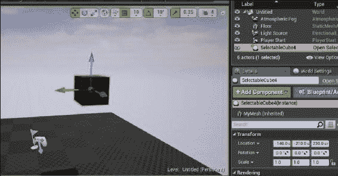

1.  删除`SelectableCube`并用`NonSelectableCube`的实例替换，以查看替代消息，指示该角色不可选择，并拒绝选择。

## 它是如何工作的...

1.  我们在`Selectable`接口中创建了三个函数。

1.  `IsSelectable`返回一个布尔值，表示对象是否可选择。你可以避免这样做，只需使用`TrySelect`，因为它返回一个布尔值来表示成功，但是，例如，你可能想知道你的 UI 内的对象是否是有效的选择，而不必实际尝试。

1.  `TrySelect`实际上尝试选择对象。没有明确的合同强制用户在尝试选择对象时尊重`IsSelectable`，因此`TrySelect`的命名是为了传达选择可能并不总是成功。

1.  最后，`Deselect`是一个添加的函数，允许对象处理失去玩家选择。这可能涉及更改 UI 元素，停止声音或其他视觉效果，或者只是从单位周围移除选择轮廓。

1.  函数的默认实现返回`true`表示`IsSelectable`（默认情况下，任何对象都是可选择的），返回`true`表示`TrySelect`（选择尝试总是成功），如果在没有被类实现的情况下调用`Deselect`，则会发出调试断言。

1.  如果愿意，也可以将`Deselect`实现为纯虚函数。

1.  `SelectableCube`是一个新的类，继承自`PhysicsCube`，同时实现了`ISelectable`接口。

1.  它还覆盖了`NotifyHit`，这是在`AActor`中定义的一个`virtual`函数，当演员经历**RigidBody**碰撞时触发。

1.  我们在`SelectableCube`的实现中使用`Super()`构造函数调用来调用`PhysicsCube`的构造函数。然后，我们添加我们自己的实现，它在我们的静态网格实例上调用`SetNotifyRigidBodyCollision(true)`。这是必要的，因为默认情况下，刚体（例如具有碰撞的`PrimitiveComponents`）不会触发`Hit`事件，以进行性能优化。因此，我们重写的`NotifyHit`函数将永远不会被调用。

1.  在`NotifyHit`的实现中，我们在自身上调用了一些`ISelectable`接口函数。鉴于我们知道我们是从`ISelectable`继承的对象，我们无需转换为`ISelectable*`即可调用它们。

1.  我们使用`IsSelectable`来检查对象是否可选择，如果是，则尝试使用`TrySelect`来实际执行选择。

1.  `NonSelectableCube`继承自`SelectableCube`，因此我们可以强制该对象永远不可选择。

1.  我们通过再次重写`ISelectable`接口函数来实现这一点。

1.  在`ANonSelectableCube::IsSelectable()`中，我们在屏幕上打印一条消息，以便我们可以验证该函数是否被调用，然后返回`false`以指示该对象根本不可选择。

1.  如果用户不尊重`IsSelectable()`，`ANonSelectableCube::TrySelect()`始终返回`false`，以指示选择不成功。

1.  鉴于不可能选择`NonSelectableCube`，`Deselect()`调用`unimplemented()`，这会引发一个断言警告，指出该函数未被实现。

1.  现在，在播放场景时，每当`SelectableCube`/`NonSelectableCube`撞击另一个物体，导致刚体碰撞时，相关的角色将尝试选择自己，并在屏幕上打印消息。

## 另请参阅

+   参见第六章，*输入和碰撞*，其中向您展示了如何**从鼠标光标向游戏世界进行射线投射**，并且可以用于扩展此示例以允许玩家点击物品进行选择

# 从本地基类向蓝图公开 UInterface 方法

能够在 C++中定义`UInterface`方法非常好，但它们也应该从蓝图中可访问。否则，使用蓝图的设计师或其他人将无法与您的`UInterface`进行交互。本示例向您展示了如何使接口中的函数在蓝图系统中可调用。

## 如何做...

1.  创建一个名为`UPostBeginPlay`/`IPostBeginPlay`的`UInterface`。

1.  向`IPostBeginPlay`添加以下`virtual`方法：

```cpp
UFUNCTION(BlueprintCallable, Category=Test)
virtual void OnPostBeginPlay();
```

1.  提供函数的实现：

```cpp
voidIPostBeginPlay::OnPostBeginPlay()
{
  GEngine->AddOnScreenDebugMessage(-1, 1, FColor::Red, "PostBeginPlay called");
}
```

1.  创建一个名为`APostBeginPlayTest`的新的`Actor`类。

1.  修改类声明，使其还继承`IPostBeginPlay`：

```cpp
UCLASS()
class UE4COOKBOOK_API APostBeginPlayTest : public AActor, public IPostBeginPlay
```

1.  编译您的项目。在编辑器内，将`APostBeginPlayTest`的实例拖入您的级别中。选择该实例，单击**打开级别蓝图**：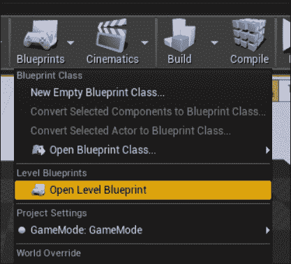

1.  在级别蓝图内，右键单击并**创建对 PostBeginPlayTest1 的引用**。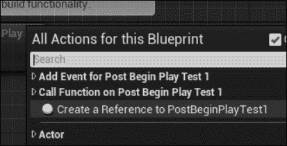

1.  从 actor 引用的右侧蓝色引脚拖动，然后在上下文菜单中搜索`onpost`，以查看您的新接口函数是否可用。单击它以在蓝图中插入对本机`UInterface`实现的调用。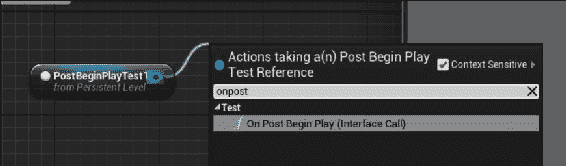

1.  最后，将`BeginPlay`节点的执行引脚（白色箭头）连接到`OnPostBeginPlay`的执行引脚。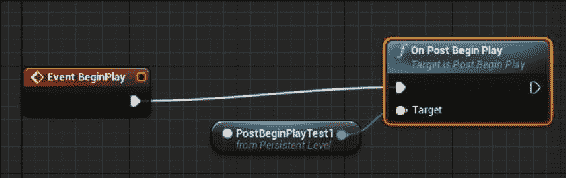

1.  当您播放级别时，您应该看到屏幕上出现**PostBeginPlay called**的消息，验证蓝图已成功访问并调用了您的`UInterface`的本地代码实现。

## 它是如何工作的...

1.  `UINTERFACE`/`IInterface`对在其他示例中的功能一样，`UInterface`包含反射信息和其他数据，而`IInterface`作为实际的接口类，可以被继承。

1.  允许`IInterface`内部函数暴露给蓝图的最重要的元素是`UFUNCTION`修饰符。

1.  `BlueprintCallable`标记此函数可以从蓝图系统中调用。

1.  以任何方式暴露给蓝图的函数也需要一个`Category`值。这个`Category`值指定了函数在上下文菜单中将被列在哪个标题下。

1.  该函数还必须标记为`virtual`，这样通过本地代码实现接口的类可以重写其中的函数实现。如果没有`virtual`修饰符，虚幻头部工具将给出一个错误，指示您必须添加`virtual`或`BlueprintImplementableEvent`作为`UFUNCTION`修饰符。

1.  这样做的原因是，如果没有这两者中的任何一个，接口函数将无法在 C++中被重写（由于缺少`virtual`），或者在蓝图中（因为缺少`BlueprintImplementableEvent`）。一个不能被重写，只能被继承的接口具有有限的实用性，因此 Epic 选择不在 UInterfaces 中支持它。

1.  然后，我们提供了`OnPostBeginPlay`函数的默认实现，它使用`GEngine`指针来显示一个调试消息，确认函数被调用。

## 另请参阅

+   有关如何将 C++类与蓝图集成的多个示例，请参阅第八章*集成 C++和虚幻编辑器*。

# 在蓝图中实现 UInterface 函数

虚幻中 UInterface 的一个关键优势是用户能够在编辑器中实现`UInterface`函数。这意味着接口可以严格在蓝图中实现，而不需要任何 C++代码，这对设计师来说是有帮助的。

## 如何操作...

1.  创建一个名为`AttackAvoider`的新`UInterface`。

1.  将以下函数声明添加到头文件：

```cpp
UFUNCTION(BlueprintImplementableEvent, BlueprintCallable, Category = AttackAvoider)
voidAttackIncoming(AActor* AttackActor);
```

1.  在编辑器中创建一个新的**蓝图类**：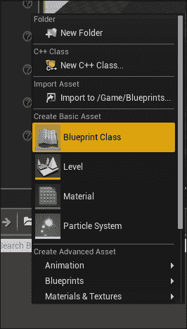

1.  将类基于**Actor**：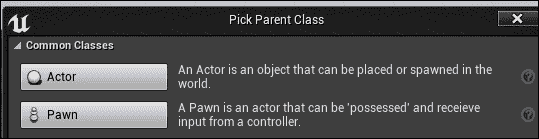

1.  打开**类设置**：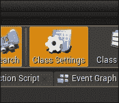

1.  单击**实现接口**的下拉菜单，并选择**AttackAvoider**：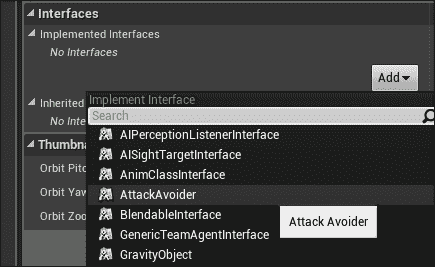

1.  **编译**您的蓝图：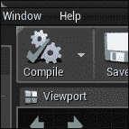

1.  在事件图中右键单击，输入`event attack`。在**上下文敏感**菜单中，您应该看到**Event Attack Incoming**。选择它以在图表中放置一个事件节点：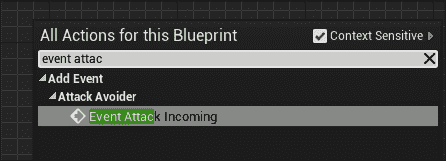

1.  从新节点的执行引脚中拖出，并释放。在**上下文敏感**菜单中输入`print string`以添加一个**Print String**节点。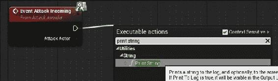

1.  您现在已经在蓝图中实现了一个`UInterface`函数。

## 工作原理...

1.  `UINTERFACE`/`IInterface`的创建方式与本章其他示例中看到的完全相同。

1.  然而，当我们向接口添加一个函数时，我们使用一个新的`UFUNCTION`修饰符：`BlueprintImplementableEvent`。

1.  `BlueprintImplementableEvent` 告诉虚幻头部工具生成代码，创建一个空的存根函数，可以由蓝图实现。我们不需要为函数提供默认的 C++实现。

1.  我们在蓝图中实现接口，这样就可以以一种允许我们在蓝图中定义其实现的方式暴露函数。

1.  头部工具生成的自动生成代码将`UInterface`函数的调用转发到我们的蓝图实现。

## 另请参阅

+   以下示例向您展示了如何在 C++中为您的`UInterface`函数定义默认实现，然后在必要时在蓝图中进行覆盖

# 创建 C++ UInterface 函数实现，可以在蓝图中被覆盖

与以前的示例一样，UInterfaces 很有用，但如果设计者无法使用其功能，那么其效用将受到严重限制。

上一个示例向您展示了如何从蓝图中调用 C++ `UInterface`函数；这个示例将向您展示如何用自己的自定义蓝图函数替换`UInterface`函数的实现。

## 操作步骤...

1.  创建一个名为`Wearable`（`IWearable`，`UWearable`）的新接口。

1.  在头文件中添加以下函数：

```cpp
UFUNCTION(BlueprintNativeEvent, BlueprintCallable, Category = Wearable)
int32GetStrengthRequirement();
UFUNCTION(BlueprintNativeEvent, BlueprintCallable, Category = Wearable)
boolCanEquip(APawn* Wearer);
UFUNCTION(BlueprintNativeEvent, BlueprintCallable, Category = Wearable)
voidOnEquip(APawn* Wearer);
```

1.  在实现文件中添加以下函数实现：

```cpp
int32 IWearable::GetStrengthRequirement_Implementation()
{
  return 0;
}

Bool IWearable::CanEquip_Implementation(APawn* Wearer)
{
  return true;
}

Void IWearable::OnEquip_Implementation(APawn* Wearer)
{

}
```

1.  在编辑器中创建一个名为`Boots`的新`Actor`类。

1.  在`Boots`的头文件中添加`#include "Wearable.h"`。

1.  修改类声明如下：

```cpp
UCLASS()
class UE4COOKBOOK_API ABoots : public AActor, public IWearable
```

1.  添加我们接口创建的纯`virtual`函数的以下实现：

```cpp
virtual void OnEquip_Implementation(APawn* Wearer) override
{
  IWearable::OnEquip_Implementation(Wearer);
}
virtual bool CanEquip_Implementation(APawn* Wearer) override
{
  return IWearable::CanEquip_Implementation(Wearer);
}
virtual int32 GetStrengthRequirement_Implementation() override
{
  return IWearable::GetStrengthRequirement_Implementation();
}
```

1.  创建一个基于`Actor`的名为`Gloves`的新蓝图类。

1.  在类设置中，选择`Wearable`作为`Gloves`角色将实现的接口。

1.  在`Gloves`中，像这样重写`OnEquip`函数：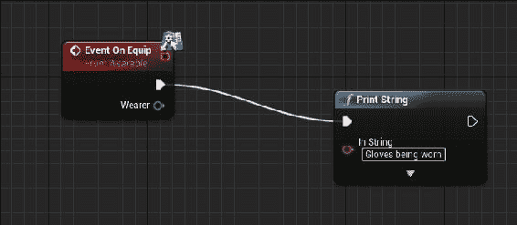

1.  将`Gloves`和`Boots`的副本拖到您的级别中进行测试。

1.  在您的级别中添加以下蓝图代码：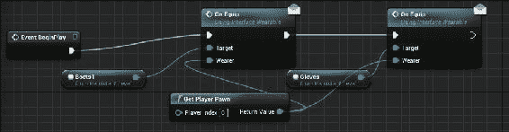

1.  验证`Boots`执行默认行为，但`Gloves`执行蓝图定义的行为。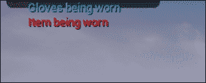

## 工作原理...

1.  这个示例同时使用了两个`UFUNCTION`修饰符：`BlueprintNativeEvent`和`BlueprintCallable`。

1.  `BlueprintCallable`在以前的示例中已经展示过，它是一种将`UFUNCTION`标记为在蓝图编辑器中可见和可调用的方法。

1.  `BlueprintNativeEvent`表示一个具有默认 C++（本机代码）实现的`UFUNCTION`，但也可以在蓝图中被覆盖。它是虚函数和`BlueprintImplementableEvent`的组合。

1.  为了使这种机制工作，虚幻头部工具生成函数的主体，以便如果存在函数的蓝图版本，则调用该函数的蓝图版本；否则，将方法调用分派到本机实现。

1.  为了将默认实现与分发功能分开，UHT 定义了一个新函数，该函数以您声明的函数命名，但在末尾添加了`_Implementation`。

1.  这就是为什么头文件声明了`GetStrengthRequirement`，但没有实现，因为那是自动生成的。

1.  这也是为什么您的实现文件定义了`GetStrengthRequirement_Implementation`，但没有声明它，因为它也是自动生成的。

1.  `Boots`类实现了`IWearable`，但没有覆盖默认功能。但是，因为`_Implementation`函数被定义为`virtual`，我们仍然需要显式实现接口函数，然后直接调用默认实现。

1.  相比之下，`Gloves`也实现了`IWearable`，但在蓝图中为`OnEquip`定义了一个重写的实现。

1.  当我们使用**级别蓝图**调用这两个角色的`OnEquip`时，可以验证这一点。

# 从 C++调用蓝图定义的接口函数

虽然以前的示例侧重于 C++在蓝图中的可用性，比如能够从蓝图中调用 C++函数，并用蓝图覆盖 C++函数，但这个示例展示了相反的情况：从 C++调用蓝图定义的接口函数。

## 操作步骤...

1.  创建一个名为`UTalker`/`ITalker`的新`UInterface`。

1.  添加以下`UFUNCTION`实现：

```cpp
UFUNCTION(BlueprintNativeEvent, BlueprintCallable, Category = Talk)
void StartTalking();
```

1.  在`.cpp`文件中提供一个默认的空实现：

```cpp
void ITalker::StartTalking_Implementation()
{

}
```

1.  创建一个基于`StaticMeshActor`的新类。

1.  添加`#include`并修改类声明以包括 talker 接口：

```cpp
#include "Talker.h"
class UE4COOKBOOK_API ATalkingMesh : public AStaticMeshActor, public ITalker
```

1.  还要在类声明中添加以下函数：

```cpp
void StartTalking_Implementation();
```

1.  在实现中，将以下内容添加到构造函数中：

```cpp
ATalkingMesh::ATalkingMesh()
:Super()
{
  autoMeshAsset = ConstructorHelpers::FObjectFinder<UStaticMesh>(TEXT("StaticMesh'/Engine/BasicShapes/Cube.Cube'"));
  if (MeshAsset.Object != nullptr)
  {
    GetStaticMeshComponent()->SetStaticMesh(MeshAsset.Object);
    //GetStaticMeshComponent()->SetCollisionProfileName(UCollisionProfile::Pawn_ProfileName);
    GetStaticMeshComponent()->bGenerateOverlapEvents = true;
  }
  GetStaticMeshComponent()->SetMobility(EComponentMobility::Movable);
  SetActorEnableCollision(true);
}
Implmement the default implementation of our StartTalking function:
voidATalkingMesh::StartTalking_Implementation()
{
  GEngine->AddOnScreenDebugMessage(-1, 1, FColor::Red, TEXT("Hello there. What is your name?"));
}
```

1.  创建一个基于`DefaultPawn`的新类，作为我们的玩家角色的功能。

1.  在我们的类头文件中添加一些`UPROPERTY`/`UFUNCTION`：

```cpp
UPROPERTY()
UBoxComponent* TalkCollider;
UFUNCTION()
voidOnTalkOverlap(AActor* OtherActor, UPrimitiveComponent* OtherComp, int32 OtherBodyIndex, bool bFromSweep, constFHitResult&SweepResult);
```

1.  修改构造函数：

```cpp
ATalkingPawn::ATalkingPawn()
:Super()
{
  // Set this character to call Tick() every frame. You can turn this off to improve performance if you don't need it.
  PrimaryActorTick.bCanEverTick = true;
  TalkCollider = CreateDefaultSubobject<UBoxComponent>("TalkCollider"); 
  TalkCollider->SetBoxExtent(FVector(200, 200, 100));
  TalkCollider->OnComponentBeginOverlap.AddDynamic(this, &ATalkingPawn::OnTalkOverlap);
  TalkCollider->AttachTo(RootComponent);
}
```

1.  实现`OnTalkOverlap`：

```cpp
voidATalkingPawn::OnTalkOverlap(AActor* OtherActor, UPrimitiveComponent* OtherComp, int32 OtherBodyIndex, bool bFromSweep, constFHitResult&SweepResult)
{
  if (OtherActor->GetClass()->ImplementsInterface(UTalker::StaticClass()))
  {
    ITalker::Execute_StartTalking(OtherActor);
  }
}
```

1.  创建一个新的`GameMode`，并将`TalkingPawn`设置为玩家的默认 pawn 类。

1.  将您的`ATalkingMesh`类的一个实例拖入级别中。

1.  通过右键单击它并从上下文菜单中选择适当的选项，基于`ATalkingMesh`创建一个新的蓝图类：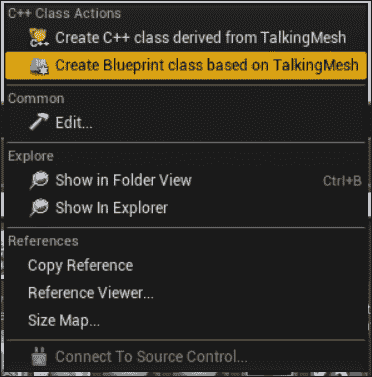

1.  将其命名为`MyTalkingMesh`。

1.  在蓝图编辑器中，创建一个像这样的`StartTalking`实现：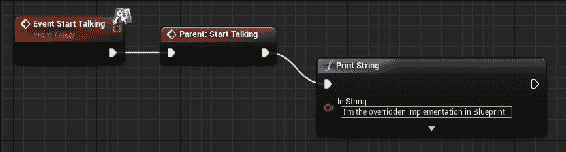

1.  将您的新蓝图的副本拖入级别中，放在您的`ATalkingMesh`实例旁边。

1.  走近这两个演员，并验证您的自定义 Pawn 是否正确调用了默认的 C++实现或蓝图实现。

## 它是如何工作的...

1.  一如既往，我们创建一个新的接口，然后在`IInterface`类中添加一些函数定义。

1.  我们使用`BlueprintNativeEvent`说明符来指示我们希望在 C++中声明一个默认实现，然后可以在蓝图中进行重写。

1.  我们创建了一个新的类（从`StaticMeshActor`继承以方便起见），并在其上实现了接口。

1.  在新类构造函数的实现中，我们加载了一个静态网格，并像往常一样设置了我们的碰撞。

1.  然后我们为我们的接口函数添加了一个实现，它只是在屏幕上打印一条消息。

1.  如果您在一个完整的项目中使用这个，您可以播放动画，播放音频，修改用户界面，以及其他必要的操作来开始与您的`Talker`对话。

1.  然而，此时，我们实际上没有任何东西来调用我们的`Talker`上的`StartTalking`。

1.  实现这一点的最简单方法是创建一个新的`Pawn`子类（再次从`DefaultPawn`继承以方便起见），它可以开始与任何与之发生碰撞的`Talker`演员交谈。

1.  为了使其工作，我们创建了一个新的`BoxComponent`来建立我们将触发对话的半径。

1.  一如既往，这是一个`UPROPERTY`，因此它不会被垃圾回收。

1.  我们还为一个函数创建了定义，当新的`BoxComponent`与场景中的另一个`Actor`重叠时将被触发。

1.  我们的`TalkingPawn`的构造函数初始化了新的`BoxComponent`，并适当设置了其范围。

1.  构造函数还将`OnTalkOverlap`函数绑定为事件处理程序，以处理与我们的`BoxComponent`发生碰撞。

1.  它还将盒组件附加到我们的`RootComponent`，以便随着玩家在级别中移动而移动。

1.  在`OnTalkOverlap`内部，我们需要检查另一个演员是否实现了与我们的盒子重叠的`Talker`接口。

1.  最可靠的方法是使用`UClass`中的`ImplementsInterface`函数。这个函数使用 Unreal Header Tool 在编译期间生成的类信息，并正确处理 C++和蓝图实现的接口。

1.  如果函数返回`true`，我们可以使用我们的`IInterface`中包含的特殊自动生成的函数来调用我们实例上所选择的接口方法。

1.  这是一个形式为`<IInterface>::Execute_<FunctionName>`的静态方法。在我们的实例中，我们的`IInterface`是`ITalker`，函数是`StartTalking`，所以我们要调用的函数是`ITalker::Execute_StartTalking()`。

1.  我们需要这个函数的原因是，当一个接口在蓝图中实现时，关系实际上并没有在编译时建立。因此，C++并不知道接口已经实现，因此我们无法将蓝图类转换为`IInterface`以直接调用函数。

1.  `Execute_`函数接受实现接口的对象的指针，并调用一些内部方法来调用所需函数的蓝图实现。

1.  当您播放级别并四处走动时，自定义的`Pawn`会不断接收到当其`BoxComponent`与其他对象重叠时的通知。

1.  如果它们实现了`UTalker`/`ITalker`接口，Pawn 然后尝试在相关的`Actor`实例上调用`StartTalking`，然后在屏幕上打印适当的消息。

# 使用 UInterfaces 实现一个简单的交互系统

本教程将向您展示如何将本章中的一些其他教程组合起来，以演示一个简单的交互系统和一个带有可交互门铃的门，以打开门。

## 如何操作...

1.  创建一个新的接口`Interactable`。

1.  将以下函数添加到`IInteractable`类声明中：

```cpp
UFUNCTION(BlueprintNativeEvent, BlueprintCallable, Category=Interactable)
boolCanInteract();
UFUNCTION(BlueprintNativeEvent, BlueprintCallable, Category = Interactable)
voidPerformInteract();
```

1.  在实现文件中为两个函数创建默认实现：

```cpp
boolIInteractable::CanInteract_Implementation()
{
  return true;
}

voidIInteractable::PerformInteract_Implementation()
{

}
```

1.  创建第二个接口`Openable`。

1.  将此函数添加到其声明中：

```cpp
UFUNCTION(BlueprintNativeEvent, BlueprintCallable, Category=Openable)
void Open();
```

1.  与`Interactable`一样，为`Open`函数创建一个默认实现：

```cpp
voidIOpenable::Open_Implementation()
{
}
```

1.  创建一个名为`DoorBell`的新类，基于`StaticMeshActor`。

1.  在`DoorBell.h`中`#include "Interactable.h"`，并在类声明中添加以下函数：

```cpp
virtual bool CanInteract_Implementation() override;
virtual void PerformInteract_Implementation() override;
UPROPERTY(BlueprintReadWrite, EditAnywhere)
AActor* DoorToOpen;
private:
boolHasBeenPushed;
```

1.  在`DoorBell`的`.cpp`文件中，`#include "Openable.h"`。

1.  在构造函数中为我们的`DoorBell`加载一个静态网格：

```cpp
HasBeenPushed = false;
autoMeshAsset = ConstructorHelpers::FObjectFinder<UStaticMesh>(TEXT("StaticMesh'/Engine/BasicShapes/Cube.Cube'"));
if (MeshAsset.Object != nullptr)
{
  GetStaticMeshComponent()->SetStaticMesh(MeshAsset.Object);
  //GetStaticMeshComponent()->SetCollisionProfileName(UCollisionProfile::Pawn_ProfileName);
  GetStaticMeshComponent()->bGenerateOverlapEvents = true;
}
GetStaticMeshComponent()->SetMobility(EComponentMobility::Movable);
GetStaticMeshComponent()-> SetWorldScale3D(FVector(0.5, 0.5, 0.5));
SetActorEnableCollision(true);

DoorToOpen = nullptr;
```

1.  将以下函数实现添加到我们的`DoorBell`上以实现`Interactable`接口：

```cpp
boolADoorBell::CanInteract_Implementation()
{
  return !HasBeenPushed;
}

voidADoorBell::PerformInteract_Implementation()
{
  HasBeenPushed = true;
  if (DoorToOpen->GetClass()->ImplementsInterface(UOpenable::StaticClass()))
  {
    IOpenable::Execute_Open(DoorToOpen);
  }
}
```

1.  现在创建一个基于`StaticMeshActor`的新类，名为`Door`。

1.  在类头文件中`#include` `Openable`和`Interactable`接口，然后修改`Door`的声明：

```cpp
class UE4COOKBOOK_API ADoor : public AStaticMeshActor, public IInteractable, public IOpenable
```

1.  将接口函数添加到`Door`上：

```cpp
UFUNCTION()
virtual bool CanInteract_Implementation() override { return IInteractable::CanInteract_Implementation(); };
UFUNCTION()
virtual void PerformInteract_Implementation() override;

UFUNCTION()
virtual void Open_Implementation() override;
```

1.  与`DoorBell`一样，在`Door`构造函数中，初始化我们的网格组件，并加载一个模型：

```cpp
autoMeshAsset = ConstructorHelpers::FObjectFinder<UStaticMesh>(TEXT("StaticMesh'/Engine/BasicShapes/Cube.Cube'"));
if (MeshAsset.Object != nullptr)
{
  GetStaticMeshComponent()->SetStaticMesh(MeshAsset.Object);
  //GetStaticMeshComponent()->SetCollisionProfileName(UCollisionProfile::Pawn_ProfileName);
  GetStaticMeshComponent()->bGenerateOverlapEvents = true;
}
GetStaticMeshComponent()->SetMobility(EComponentMobility::Movable);
GetStaticMeshComponent()->SetWorldScale3D(FVector(0.3, 2, 3));
SetActorEnableCollision(true);
```

1.  实现接口函数：

```cpp
voidADoor::PerformInteract_Implementation()
{
  GEngine->AddOnScreenDebugMessage(-1, 5, FColor::Red, TEXT("The door refuses to budge. Perhaps there is a hidden switch nearby?"));
}

voidADoor::Open_Implementation()
{
  AddActorLocalOffset(FVector(0, 0, 200));
}
```

1.  创建一个基于`DefaultPawn`的新类，名为`AInteractingPawn`。

1.  将以下函数添加到`Pawn`类头文件中：

```cpp
voidTryInteract();

private:
virtual void SetupPlayerInputComponent(UInputComponent* InInputComponent) override;
```

1.  在`Pawn`的实现文件中，`#include "Interactable.h"`，然后为头文件中的两个函数提供实现：

```cpp
voidAInteractingPawn::TryInteract()
{
  APlayerController* MyController = Cast<APlayerController>(Controller);
  if (MyController)
  {
    APlayerCameraManager* MyCameraManager = MyController->PlayerCameraManager;
    autoStartLocation = MyCameraManager->GetCameraLocation();
    autoEndLocation = MyCameraManager->GetCameraLocation() + (MyCameraManager->GetActorForwardVector() * 100);
    FHitResultHitResult;
    GetWorld()->SweepSingleByObjectType(HitResult, StartLocation, EndLocation, FQuat::Identity, 
    FCollisionObjectQueryParams(FCollisionObjectQueryParams::AllObjects),FCollisionShape::MakeSphere(25),
    FCollisionQueryParams(FName("Interaction"),true,this));
    if (HitResult.Actor != nullptr)
    {
      if (HitResult.Actor->GetClass()->ImplementsInterface(UInteractable::StaticClass()))
      {
        if (IInteractable::Execute_CanInteract(HitResult.Actor.Get()))
        {
          IInteractable::Execute_PerformInteract(HitResult.Actor.Get());
        }
      }
    }
  }
}
voidAInteractingPawn::SetupPlayerInputComponent(UInputComponent* InInputComponent)
{
  Super::SetupPlayerInputComponent(InInputComponent);
  InInputComponent->BindAction("Interact", IE_Released, this, &AInteractingPawn::TryInteract);
}
```

1.  现在，要么在 C++中创建一个新的`GameMode`，要么在蓝图中创建一个新的`GameMode`，并将`InteractingPawn`设置为我们的默认`Pawn`类。

1.  将`Door`和`Doorbell`的副本拖到级别中：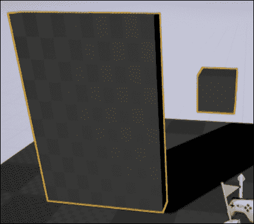

1.  使用眼滴工具在门铃的**Door to Open**旁边，如下图所示，然后单击您级别中的门角色实例：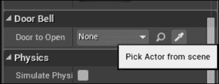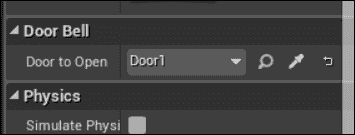

1.  在编辑器中创建一个名为`Interact`的新动作绑定，并将其绑定到您选择的一个键：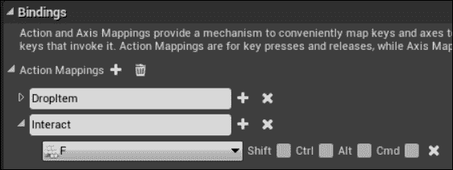

1.  播放您的级别，并走到门铃旁。看着它，按下您绑定`Interact`的键。验证门是否移动一次。

1.  您还可以直接与门交互以获取有关它的一些信息。

## 它是如何工作的...

1.  与以前的教程一样，我们将`UFUNCTION`标记为`BlueprintNativeEvent`和`BlueprintCallable`，以允许`UInterface`在本地代码或蓝图中实现，并允许使用任一方法调用函数。

1.  我们基于`StaticMeshActor`创建`DoorBell`以方便起见，并使`DoorBell`实现`Interactable`接口。

1.  在`DoorBell`的构造函数中，我们将`HasBeenPushed`和`DoorToOpen`初始化为默认安全值。

1.  在`CanInteract`的实现中，我们返回`HasBeenPushed`的反值，以便一旦按钮被按下，就无法进行交互。

1.  在`PerformInteract`中，我们检查是否有一个引用来打开门对象。

1.  如果我们有一个有效的引用，我们验证门角色是否实现了`Openable`，然后在我们的门上调用`Open`函数。

1.  在`Door`中，我们实现了`Interactable`和`Openable`，并重写了每个函数。

1.  我们将`Door`的`CanInteract`实现定义为与默认值相同。

1.  在`PerformInteract`中，我们向用户显示一条消息。

1.  在`Open`函数中，我们使用`AddActorLocalOffset`来将门移动到一定的距离。通过蓝图中的时间轴或线性插值，我们可以使这个过渡变得平滑，而不是瞬间移动。

1.  最后，我们创建一个新的`Pawn`，以便玩家实际上可以与物体交互。

1.  我们创建一个`TryInteract`函数，并将其绑定到重写的`SetupPlayerInputComponent`函数中的`Interact`输入动作。

1.  这意味着当玩家执行与`Interact`绑定的输入时，我们的`TryInteract`函数将运行。

1.  `TryInteract`获取对`PlayerController`的引用，将所有 Pawns 都具有的通用控制器引用进行转换。

1.  通过`PlayerController`检索`PlayerCameraManager`，这样我们就可以访问玩家摄像机的当前位置和旋转。

1.  我们使用摄像机的位置创建起始点和结束点，然后在摄像机位置的前方 100 个单位处，将它们传递给`GetWorld::SweepSingleByObjectType`函数。

1.  这个函数接受多个参数。`HitResult`是一个变量，允许函数返回有关跟踪到的任何对象的信息。`CollisionObjectQueryParams`允许我们指定我们是否对动态、静态物品或两者都感兴趣。

1.  我们通过使用`MakeSphere`函数来完成一个球体跟踪。

1.  球体跟踪通过定义一个圆柱体来检查物体，而不是一条直线，从而允许稍微有些人为误差。考虑到玩家可能不会完全准确地看着你的物体，你可以根据需要调整球体的半径。

1.  最后一个参数`SweepSingleByObjectType`是一个结构体，它给跟踪一个名称，让我们指定是否与复杂的碰撞几何体发生碰撞，最重要的是，它允许我们指定我们要忽略发起跟踪的对象。

1.  如果`HitResult`在跟踪完成后包含一个 actor，我们检查该 actor 是否实现了我们的接口，然后尝试调用`CanInteract`函数。

1.  如果 actor 表示可以进行交互，我们就告诉它实际执行交互操作。
