# 第八章：集成 C++和虚幻编辑器

在本章中，我们将介绍以下内容：

+   使用类或结构作为蓝图变量

+   创建可以在蓝图中作为子类化的类或结构

+   创建可以在蓝图中调用的函数

+   创建可以在蓝图中实现的事件

+   将多播委托公开给蓝图

+   创建可以在蓝图中使用的 C++枚举

+   在编辑器中的不同位置编辑类属性

+   使属性在蓝图编辑器图中可访问

+   响应编辑器中的属性更改事件

+   实现本地代码构造脚本

+   创建一个新的编辑器模块

+   创建新的工具栏按钮

+   创建新的菜单项

+   创建一个新的编辑器窗口

+   创建一个新的资产类型

+   为资产创建自定义上下文菜单项

+   创建新的控制台命令

+   为蓝图创建一个新的图钉可视化器

+   使用自定义详细信息面板检查类型

# 介绍

虚幻的主要优势之一是它为程序员提供了创建可以由设计师在编辑器中自定义或使用的角色和其他对象的能力。本章展示了如何实现这一点。在此之后，我们将尝试通过从头开始创建自定义蓝图和动画节点来自定义编辑器。我们还将实现自定义编辑器窗口和用于检查用户创建的类型的自定义详细信息面板。

# 使用类或结构作为蓝图变量

在 C++中声明的类型不会自动并入蓝图以用作变量。此示例向您展示如何使它们可访问，以便您可以将自定义本地代码类型用作蓝图函数参数。

## 如何操作...

1.  使用编辑器创建一个新的类。与之前的章节不同，我们将创建一个基于对象的类。对象在常见类列表中不可见，因此我们需要在编辑器 UI 中选中“显示所有类”按钮，然后选择“对象”。将您的新“对象”子类命名为`TileType`。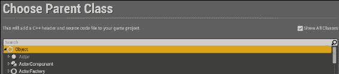

1.  将以下属性添加到`TileType`定义中：

```cpp
UPROPERTY()
int32 MovementCost;
UPROPERTY()
bool CanBeBuiltOn;

UPROPERTY()
FString TileName;
```

1.  编译您的代码。

1.  在编辑器中，基于`Actor`创建一个新的蓝图类。将其命名为`Tile`。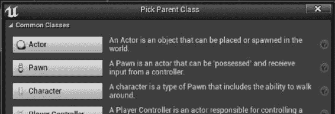

1.  在`Tile`的蓝图编辑器中，向蓝图添加一个新变量。检查您可以创建为变量的类型列表，并验证`TileType`是否不在其中。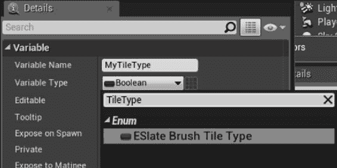

1.  将`BlueprintType`添加到`UCLASS`宏中，如下所示：

```cpp
UCLASS(BlueprintType)
class UE4COOKBOOK_API UTileType : public UObject
{
}
```

1.  重新编译项目，然后返回到`Tile`蓝图编辑器。

1.  现在，当您向角色添加新变量时，可以选择`TileType`作为新变量的类型。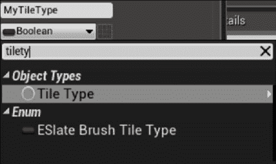

1.  我们现在已经建立了`Tile`和`TileType`之间的“有一个”关系。

1.  现在，`TileType`是一个可以用作函数参数的蓝图类型。在您的`Tile`蓝图上创建一个名为`SetTileType`的新函数。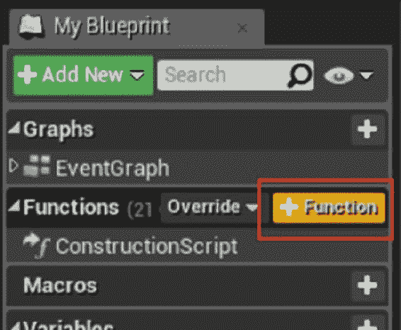

1.  添加一个新的输入：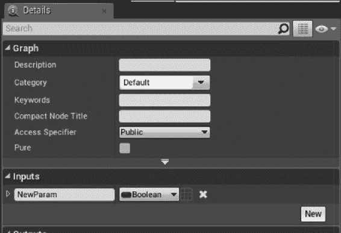

1.  将输入参数的类型设置为`TileType`。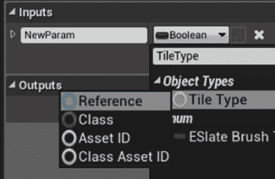

1.  您可以将我们的`Type`变量拖动到视口中，并选择“设置”。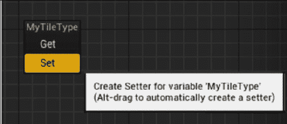

1.  将`SetTileType`的**Exec**引脚和输入参数连接到**Set**节点。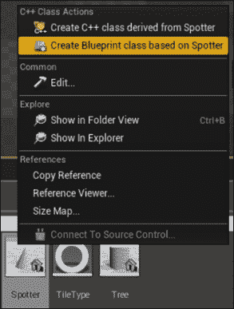

## 它是如何工作的...

1.  出于性能原因，虚幻假设类不需要额外的反射代码，以使类型可用于蓝图。

1.  我们可以通过在我们的`UCLASS`宏中指定`BlueprintType`来覆盖此默认值。

1.  包含说明符后，该类型现在可以作为蓝图中的参数或变量使用。

## 还有更多...

此示例显示，如果其本地代码声明包括`BlueprintType`，则可以在蓝图中使用类型作为函数参数。

然而，目前我们在 C++中定义的属性都无法在蓝图中访问。

本章的其他示例涉及使这些属性可访问，以便我们可以对自定义对象进行有意义的操作。

# 创建可以在蓝图中进行子类化的类或结构体

虽然本书侧重于 C++，但在使用虚幻引擎进行开发时，更标准的工作流程是将核心游戏功能以及性能关键代码实现为 C++，并将这些功能暴露给蓝图，以便设计师可以原型化游戏玩法，然后由程序员使用额外的蓝图功能进行重构，或者将其推回到 C++层。

其中一个最常见的任务是以这样的方式标记我们的类和结构体，以便它们对蓝图系统可见。

## 如何做...

1.  使用编辑器向导创建一个新的`Actor`类；将其命名为`BaseEnemy`。

1.  将以下`UPROPERTY`添加到该类中：

```cpp
UPROPERTY()
FString WeaponName;
UPROPERTY()
int32 MaximumHealth;
```

1.  将以下类限定符添加到`UCLASS`宏中：

```cpp
UCLASS(Blueprintable)
class UE4COOKBOOK_API ABaseEnemy : public AActor
```

1.  打开编辑器并创建一个新的蓝图类。展开列表以显示所有类，并选择我们的`BaseEnemyclass`作为父类。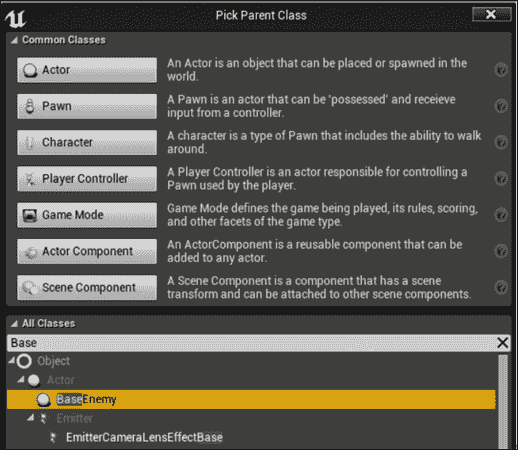

1.  将新的蓝图命名为`EnemyGoblin`并在蓝图编辑器中打开它。

1.  请注意，我们之前创建的`UPROPERTY`宏还不存在，因为我们尚未包含适当的标记以使它们对蓝图可见。

## 它是如何工作的...

1.  前面的示例演示了`BlueprintType`作为类限定符的用法。`BlueprintType`允许将该类型用作蓝图编辑器中的类型（即，它可以是变量或函数的输入/返回值）。

1.  然而，我们可能希望基于我们的类型创建蓝图（使用继承），而不是组合（例如将我们的类型的实例放在`Actor`内部）。

1.  这就是为什么 Epic 提供了`Blueprintable`作为类限定符的原因。`Blueprintable`意味着开发人员可以将类标记为蓝图类的可继承类。

1.  我们使用了`BlueprintType`和`Blueprintable`而不是单个组合限定词，因为有时您可能只需要部分功能。例如，某些类应该可用作变量，但出于性能原因，不允许在蓝图中创建它们。在这种情况下，您将使用`BlueprintType`而不是两个限定词。

1.  另一方面，也许我们想要使用蓝图编辑器创建新的子类，但我们不想在`Actor`蓝图中传递对象实例。在这种情况下，建议使用`Blueprintable`，但在这种情况下省略`BlueprintType`。

1.  与之前一样，`Blueprintable`和`BlueprintType`都没有指定类中包含的成员函数或成员变量的任何信息。我们将在后面的示例中使它们可用。

# 创建可以在蓝图中调用的函数

将类标记为`BlueprintType`或`Blueprintable`允许我们在蓝图中传递类的实例，或者用蓝图类对类型进行子类化，但这些限定词实际上并不涉及成员函数或变量，以及它们是否应该暴露给蓝图。

本示例向您展示了如何标记函数，以便可以在蓝图图表中调用它。

## 如何做...

1.  使用编辑器创建一个新的`Actor`类。将该 actor 命名为`SlidingDoor`。

1.  将以下`UPROPERTY`添加到新类中：

```cpp
UFUNCTION(BlueprintCallable, Category = Door)
void Open();
UPROPERTY()
bool IsOpen;

UPROPERTY()
FVector TargetLocation;
```

1.  通过将以下内容添加到`.cpp`文件中来创建类的实现：

```cpp
ASlidingDoor::ASlidingDoor()
:Super()
{
  auto MeshAsset = ConstructorHelpers::FObjectFinder<UStaticMesh>(TEXT("StaticMesh'/Engine/BasicShapes/Cube.Cube'"));
  if (MeshAsset.Object != nullptr)
  {
    GetStaticMeshComponent()->SetStaticMesh(MeshAsset.Object);
    GetStaticMeshComponent()->bGenerateOverlapEvents = true;
  }
  GetStaticMeshComponent()->SetMobility(EComponentMobility::Movable);
  GetStaticMeshComponent()->SetWorldScale3D(FVector(0.3, 2, 3));
  SetActorEnableCollision(true);
  IsOpen = false;
  PrimaryActorTick.bStartWithTickEnabled = true;
  PrimaryActorTick.bCanEverTick = true;
}
void ASlidingDoor::Open()
{
  TargetLocation = ActorToWorld().TransformPositionNoScale(FVector(0, 0, 200));
  IsOpen = true;
}

void ASlidingDoor::Tick(float DeltaSeconds)
{
  if (IsOpen)
  {
    SetActorLocation(FMath::Lerp(GetActorLocation(), TargetLocation, 0.05));
  }
}
```

1.  编译代码并启动编辑器。

1.  将门的副本拖动到关卡中。

1.  确保选择了`SlidingDoor`实例，然后打开关卡蓝图。右键单击空白画布，展开**在 Sliding Door 1 上调用函数**。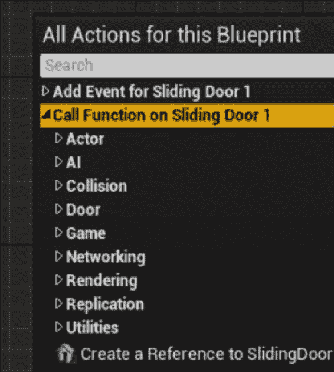

1.  展开**Door**部分，然后选择`Open`函数。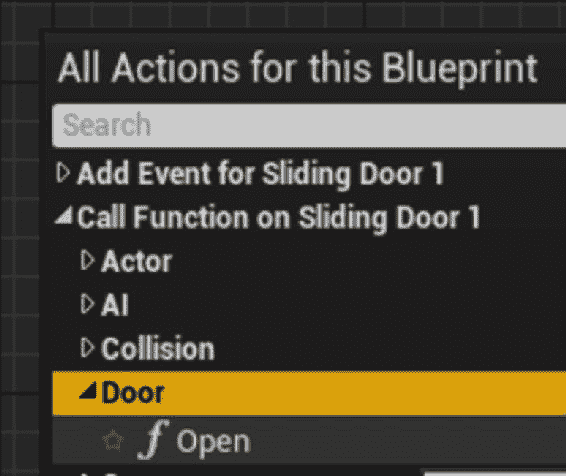

1.  将执行引脚（白色箭头）从`BeginPlay`连接到`Open`节点上的白色箭头，如下图所示：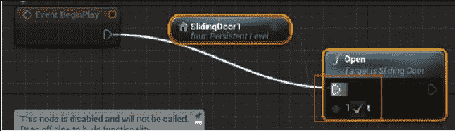

1.  播放您的关卡，并验证当在门实例上调用`Open`时，门是否按预期移动。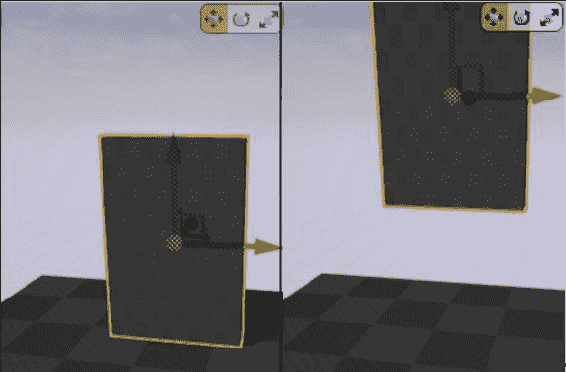

## 它的工作原理是...

1.  在门的声明中，我们创建一个新的函数来打开门，一个布尔值来跟踪门是否已被告知打开，以及一个向量，允许我们预先计算门的目标位置。

1.  我们还重写了`Tick` actor 函数，以便我们可以在每一帧上执行一些行为。

1.  在构造函数中，我们加载立方体网格并缩放它以表示我们的门。

1.  我们还将`IsOpen`设置为已知的好值`false`，并通过使用`bCanEverTick`和`bStartWithTickEnabled`启用 actor ticking。

1.  这两个布尔值分别控制是否可以为此 actor 启用 ticking 以及是否以启用状态开始 ticking。

1.  在`Open`函数内部，我们计算相对于门的起始位置的目标位置。

1.  我们还将`IsOpen`布尔值从`false`更改为`true`。

1.  现在`IsOpen`布尔值为`true`，在`Tick`函数内部，门尝试使用`SetActorLocation`和`Lerp`将自身移动到目标位置，以在当前位置和目标位置之间进行插值。

## 另请参阅

+   第五章, *处理事件和委托*，有一些与生成 actor 相关的示例

# 创建可以在蓝图中实现的事件

C++与 Blueprint 更紧密集成的另一种方式是创建可以在本地代码中具有 Blueprint 实现的函数。这允许程序员指定一个事件并调用它，而无需了解任何实现细节。然后可以在 Blueprint 中对该类进行子类化，并且制作团队的另一成员可以实现该事件的处理程序，而无需接触任何 C++代码。

## 如何操作...

1.  创建一个名为`Spotter`的新`StaticMeshActor`类。

1.  确保在类头文件中定义并重写以下函数：

```cpp
virtual void Tick( float DeltaSeconds ) override;
UFUNCTION(BlueprintImplementableEvent)
void OnPlayerSpotted(APawn* Player);
```

1.  将此代码添加到构造函数中：

```cpp
PrimaryActorTick.bCanEverTick = true;
auto MeshAsset = ConstructorHelpers::FObjectFinder<UStaticMesh>(TEXT("StaticMesh'/Engine/BasicShapes/Cone.Cone'"));
if (MeshAsset.Object != nullptr)
{
  GetStaticMeshComponent()->SetStaticMesh(MeshAsset.Object);
  GetStaticMeshComponent()->bGenerateOverlapEvents = true;
}
GetStaticMeshComponent()->SetMobility(EComponentMobility::Movable);
GetStaticMeshComponent()->SetRelativeRotation(FRotator(90, 0, 0));
```

1.  将此代码添加到`Tick`函数中：

```cpp
Super::Tick( DeltaTime );

auto EndLocation = GetActorLocation() + ActorToWorld().TransformVector(FVector(0,0,-200));
FHitResult HitResult;
GetWorld()->SweepSingleByChannel(HitResult, GetActorLocation(), EndLocation, FQuat::Identity, ECC_Camera, FCollisionShape::MakeSphere(25), FCollisionQueryParams("Spot", true, this));
APawn* SpottedPlayer = Cast<APawn>(HitResult.Actor.Get());

if (SpottedPlayer!= nullptr)
{
  OnPlayerSpotted(SpottedPlayer);
}
DrawDebugLine(GetWorld(), GetActorLocation(), EndLocation, FColor::Red);
```

1.  编译并启动编辑器。在**内容浏览器**中找到您的`Spotter`类，然后左键单击并将其拖到游戏世界中。

1.  当您播放关卡时，您将看到红线显示`Actor`执行的追踪。但是，什么都不会发生，因为我们还没有实现我们的`OnPlayerSpotted`事件。

1.  为了实现这个事件，我们需要创建一个`Spotter`的蓝图子类。

1.  在**内容浏览器**中右键单击`Spotter`，然后选择**基于 Spotter 创建蓝图类**。将类命名为`BPSpotter`。

1.  在蓝图编辑器中，点击**My Blueprint**面板的**Functions**部分的**Override**按钮：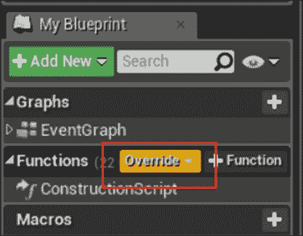

1.  选择**On Player Spotted**：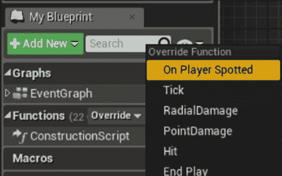

1.  从我们的事件的白色执行引脚上左键单击并拖动。在出现的上下文菜单中，选择并添加一个`Print String`节点，以便它与事件链接起来。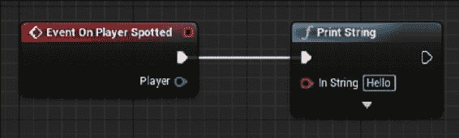

1.  再次播放关卡，并验证走在`Spotter`正在使用的追踪前是否将字符串打印到屏幕上。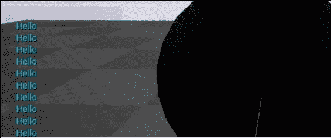

## 它的工作原理是...

1.  在我们的`Spotter`对象的构造函数中，我们将一个基本的原始体，一个锥体，加载到我们的静态网格组件中作为视觉表示。

1.  然后，我们旋转锥体，使其类似于指向 actor 的*X*轴的聚光灯。

1.  在`Tick`函数期间，我们获取 actor 的位置，然后找到沿其本地*X*轴 200 个单位的点。我们使用`Super::`调用父类的`Tick`实现，以确保尽管我们进行了重写，但任何其他 tick 功能都得以保留。

1.  通过首先获取`Actor`的 Actor-to-World 变换，然后使用该变换来转换指定位置的向量，将局部位置转换为世界空间位置。

1.  变换基于根组件的方向，根组件是我们在构造函数中旋转的静态网格组件。

1.  由于现有的旋转，我们需要旋转我们想要转换的向量。考虑到我们希望向量指向锥体底部的方向，我们希望沿着负上轴的距离，也就是说，我们希望一个形如(0,0,-d)的向量，其中*d*是实际的距离。

1.  计算了我们追踪的最终位置后，我们实际上使用`SweepSingleByChannel`函数进行追踪。

1.  执行扫描后，我们尝试将结果命中的`Actor`转换为一个 pawn。

1.  如果转换成功，我们调用`OnPlayerSpotted`的可实现事件，并执行用户定义的蓝图代码。

# 将多播委托公开给蓝图

多播委托是一种将事件广播给多个**监听**或**订阅**该事件的对象的好方法。如果你有一个生成事件的 C++模块，可能会有任意的 Actor 想要被通知到这些事件，那么多播委托尤其有价值。本示例向你展示了如何在 C++中创建一个多播委托，以便在运行时通知一组其他 Actor。

## 如何操作...

1.  创建一个名为`King`的新的`StaticMeshActor`类。在类头文件中添加以下内容：

```cpp
DECLARE_DYNAMIC_MULTICAST_DELEGATE_OneParam(FOnKingDeathSignature, AKing*, DeadKing);
```

1.  在类中添加一个新的`UFUNCTION`：

```cpp
UFUNCTION(BlueprintCallable, Category = King)
void Die();
```

1.  向类中添加我们的多播委托的实例：

```cpp
UPROPERTY(BlueprintAssignable)
FOnKingDeathSignature OnKingDeath;
```

1.  将我们的网格初始化添加到构造函数中：

```cpp
auto MeshAsset = ConstructorHelpers::FObjectFinder<UStaticMesh>(TEXT("StaticMesh'/Engine/BasicShapes/Cone.Cone'"));
if (MeshAsset.Object != nullptr)
{
  GetStaticMeshComponent()->SetStaticMesh(MeshAsset.Object);
  GetStaticMeshComponent()->bGenerateOverlapEvents = true;
}
GetStaticMeshComponent()->SetMobility(EComponentMobility::Movable);
```

1.  实现`Die`函数：

```cpp
void AKing::Die()
{
  OnKingDeath.Broadcast(this);
}
```

1.  创建一个名为`Peasant`的新类，也是基于`StaticMeshActor`的。

1.  在类中声明一个默认构造函数：

```cpp
APeasant();
```

1.  声明以下函数：

```cpp
UFUNCTION(BlueprintCallable, category = Peasant)
void Flee(AKing* DeadKing);
```

1.  实现构造函数：

```cpp
auto MeshAsset = ConstructorHelpers::FObjectFinder<UStaticMesh>(TEXT("StaticMesh'/Engine/BasicShapes/Cube.Cube'"));
if (MeshAsset.Object != nullptr)
{
  GetStaticMeshComponent()->SetStaticMesh(MeshAsset.Object);
  GetStaticMeshComponent()->bGenerateOverlapEvents = true;
}
GetStaticMeshComponent()->SetMobility(EComponentMobility::Movable);
```

1.  在`.cpp`文件中实现该函数：

```cpp
void APeasant::Flee(AKing* DeadKing)
{
  GEngine->AddOnScreenDebugMessage(-1, 2, FColor::Red, TEXT("Waily Waily!"));
  FVector FleeVector = GetActorLocation() – DeadKing->GetActorLocation();
  FleeVector.Normalize();
  FleeVector *= 500;
  SetActorLocation(GetActorLocation() + FleeVector);
}
```

1.  打开蓝图并创建一个基于`APeasant`的蓝图类，命名为`BPPeasant`。

1.  在蓝图中，点击并拖动离你的`BeginPlay`节点的白色（执行）引脚。输入`get all`，你应该会看到**获取所有类的 Actor**。选择该节点并放置在你的图表中。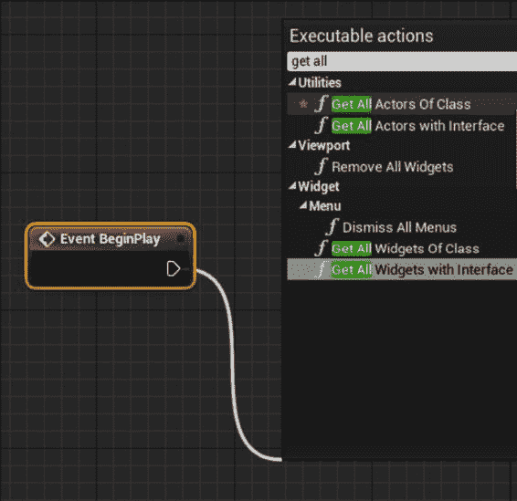

1.  将紫色（类）节点的值设置为`King`。你可以在搜索栏中输入`king`以更容易地找到该类。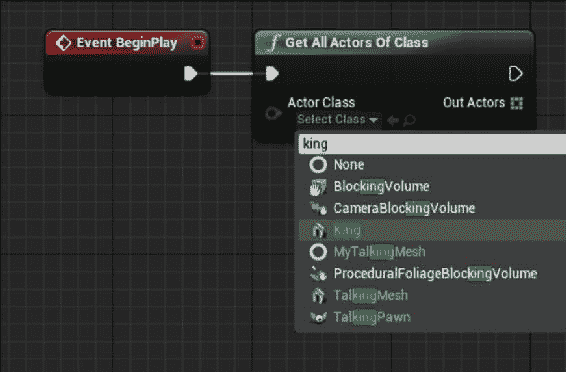

1.  从蓝色网格（对象数组）节点拖动到空白处并放置一个获取节点。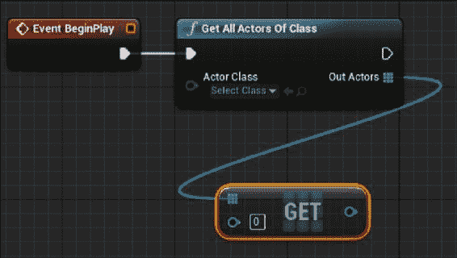

1.  从获取节点的蓝色输出引脚处拖动，并放置一个不等（对象）节点。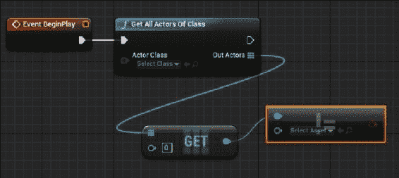

1.  将不等（bool）节点的红色引脚连接到一个`Branch`节点，并将`Branch`节点的执行引脚连接到我们的`Get All Actors Of Class`节点。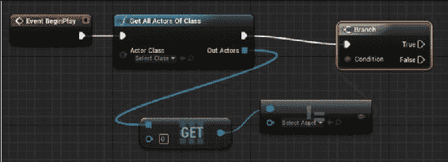

1.  将分支的**True**引脚连接到**Bind Event to OnKing Death**节点。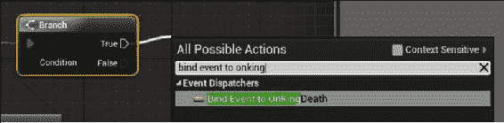

### 注意

注意，你可能需要在上下文菜单中取消选中**上下文敏感**以使**绑定事件**节点可见。

1.  从**Bind Event**节点的红色引脚拖动，并在释放鼠标左键后出现的上下文菜单中选择**Add Custom Event…**。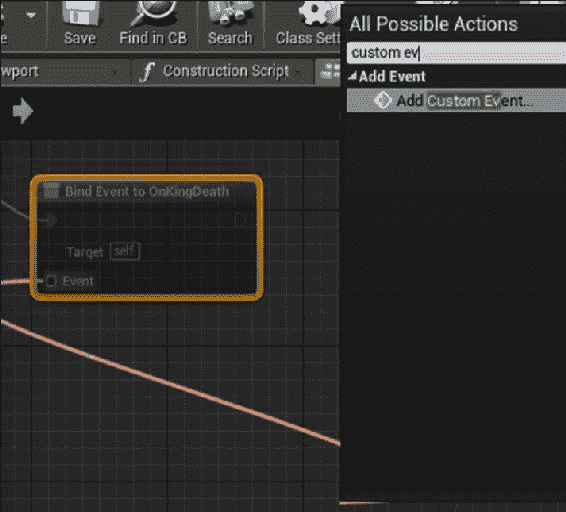

1.  给你的事件命名，然后将白色执行引脚连接到一个名为`Flee`的新节点。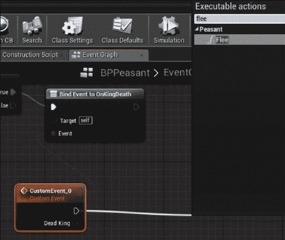

1.  验证你的蓝图是否如下图所示：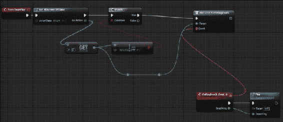

1.  将你的`King`类的副本拖动到关卡中，然后在其周围以圆形添加几个`BPPeasant`实例。

1.  打开关卡蓝图。在其中，从`BeginPlay`处拖动并添加一个`Delay`节点。将延迟设置为**5**秒。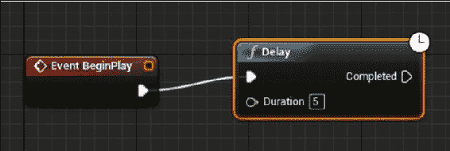

1.  在关卡中选择你的`King`实例，在图形编辑器中右键单击。

1.  选择**Call function on King 1**，并在`King`类别中查找一个名为`Die`的函数。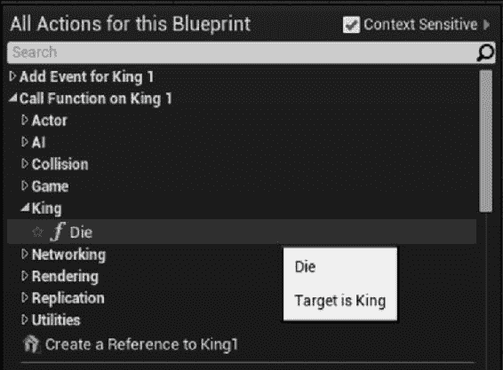

1.  选择`Die`，然后将其执行引脚连接到延迟的输出执行引脚。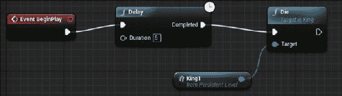

1.  当你播放关卡时，你应该会看到国王在 5 秒后死亡，农民们都哀号并直接远离国王。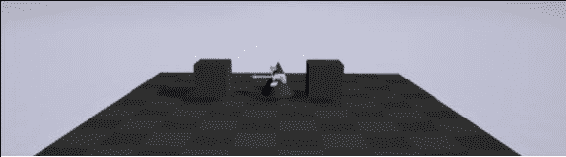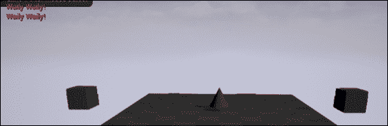

## 工作原理...

1.  我们创建一个新的演员（基于`StaticMeshActor`方便起见，因为这样可以省去为`Actor`的可视化表示声明或创建静态网格组件的步骤）。

1.  我们使用`DECLARE_DYNAMIC_MULTICAST_DELEGATE_OneParam`宏声明了一个动态多播委托。动态多播委托允许任意数量的对象订阅（监听）和取消订阅（停止监听），以便在广播委托时通知它们。

1.  该宏接受多个参数-正在创建的新委托签名的类型名称，签名参数的类型，然后是签名参数的名称。

1.  我们还在`King`中添加了一个函数，允许我们告诉它死亡。因为我们希望将该函数暴露给蓝图进行原型设计，所以将其标记为`BlueprintCallable`。

1.  我们之前使用的`DECLARE_DYNAMIC_MULTICAST_DELEGATE`宏只声明了一个类型，没有声明委托的实例，所以现在我们要做的是声明一个委托的实例，引用之前在调用宏时提供的类型名称。

1.  动态多播委托可以在其`UPROPERTY`声明中标记为`BlueprintAssignable`。这告诉虚幻引擎蓝图系统可以动态地将事件分配给委托，当调用委托的`Broadcast`函数时将调用这些事件。

1.  像往常一样，我们为我们的`King`分配一个简单的网格，以便在游戏场景中有一个可视化表示。

1.  在`Die`函数内部，我们调用自己的委托上的`Broadcast`函数。我们指定委托将有一个指向死去的国王的指针作为参数，所以我们将这个指针作为参数传递给广播函数。

### 注意

如果你希望国王被销毁，而不是在死亡时播放动画或其他效果，你需要改变委托的声明并传入不同的类型。例如，你可以使用`FVector`，并直接传入死去的国王的位置，这样农民仍然可以适当地逃离。

如果没有这个，当调用`Broadcast`时，`King`指针可能是有效的，但在执行绑定函数之前，调用`Actor::Destroy()`会使其无效。

1.  在我们的下一个`StaticMeshActor`子类`Peasant`中，我们像往常一样初始化静态网格组件，使用了与`King`不同的形状。

1.  在农民的`Flee`函数的实现中，我们通过在屏幕上打印一条消息来模拟农民发出声音。

1.  然后，我们计算一个向量，首先找到从死去的国王到这个农民位置的向量。

1.  我们将向量归一化以获得指向相同方向的单位向量（长度为 1）。

1.  通过缩放归一化向量并将其添加到当前位置，可以计算出一个固定距离的位置，正好是农民直接远离死去的国王的方向。

1.  然后使用`SetActorLocation`来实际将农民传送到该位置。

### 注意

如果你使用带有 AI 控制器的角色，你可以让`Peasant`寻路到目标位置，而不是瞬间传送。或者，你可以在农民的`Tick`中使用`Lerp`函数来使它们平滑滑动，而不是直接跳到位置。

## 另请参阅

+   在第四章中查看有关演员和组件的更详细讨论，第五章中讨论了诸如`NotifyActorOverlap`之类的事件。

# 创建可以在蓝图中使用的 C++枚举

枚举通常在 C++中用作标志或输入到 switch 语句中。然而，如果你想要从蓝图向 C++传递一个“枚举”值，或者从 C++向蓝图传递一个“枚举”值，该怎么办？或者，如果你想在蓝图中使用一个使用 C++中的“枚举”的`switch`语句，你如何让蓝图编辑器知道你的“枚举”应该在编辑器中可访问？本教程向你展示了如何使枚举在蓝图中可见。

## 如何操作...

1.  使用编辑器创建一个名为`Tree`的新的`StaticMeshActor`类。

1.  在类声明之前插入以下代码：

```cpp
UENUM(BlueprintType)
enum TreeType
{
  Tree_Poplar,
  Tree_Spruce,
  Tree_Eucalyptus,
  Tree_Redwood
};
```

1.  在`Tree`类中添加以下`UPROPERTY`：

```cpp
UPROPERTY(BlueprintReadWrite)
TEnumAsByte<TreeType> Type;
```

1.  在`Tree`构造函数中添加以下内容：

```cpp
auto MeshAsset = ConstructorHelpers::FObjectFinder<UStaticMesh>(TEXT("StaticMesh'/Engine/BasicShapes/Cylinder.Cylinder'"));
if (MeshAsset.Object != nullptr)
{
  GetStaticMeshComponent()->SetStaticMesh(MeshAsset.Object);
  GetStaticMeshComponent()->bGenerateOverlapEvents = true;
}
GetStaticMeshComponent()->SetMobility(EComponentMobility::Movable);
```

1.  创建一个名为`MyTree`的新蓝图类，基于`Tree`。

1.  在`MyTree`的蓝图编辑器中，点击“构造脚本”选项卡。

1.  在空白窗口中右键点击，输入`treetype`。有一个“获取 TreeType 中的条目数”节点。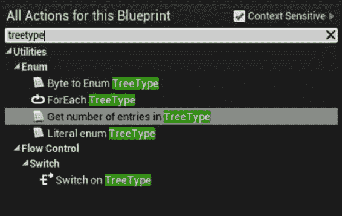

1.  放置它，然后将其输出引脚连接到一个“随机整数”节点。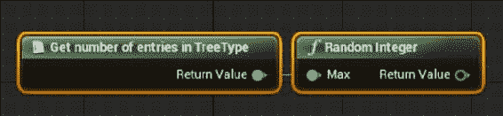

1.  将随机整数的输出连接到`ToByte`节点的输入。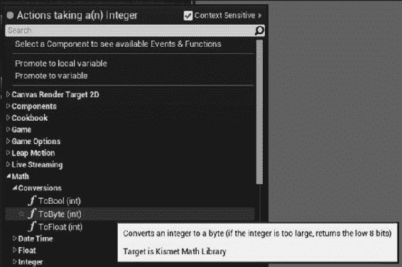

1.  在蓝图面板的“变量”部分，展开“Tree”并选择“Type”。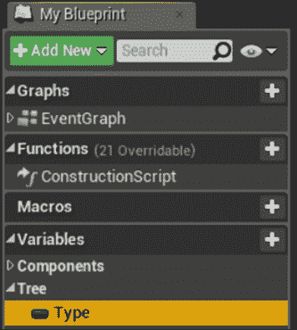

1.  将其拖入图中，并在出现小的上下文菜单时选择“Set”。

1.  将`ToByte`节点的输出连接到“SET 类型”节点的输入。你会看到一个额外的转换节点自动出现。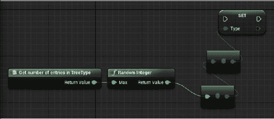

1.  最后，将“构造脚本”的执行引脚连接到“SET 类型”节点的执行引脚。

1.  你的蓝图应该如下所示：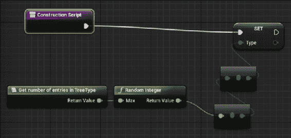

1.  为了验证蓝图是否正确运行并随机分配类型给我们的树，我们将在事件图中添加一些节点。

1.  在“Event BeginPlay”事件节点之后放置一个“打印字符串”节点。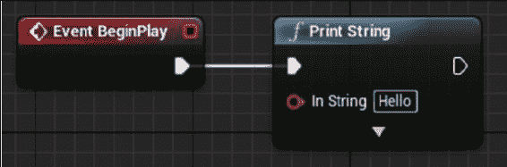

1.  放置一个“格式文本”节点，并将其输出连接到“打印字符串”节点的输入。一个转换节点将会被添加给你。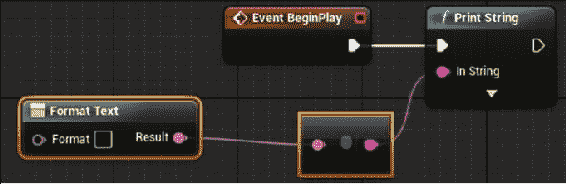

1.  在“格式文本”节点中，将“My Type is {`0`}!”添加到文本框中。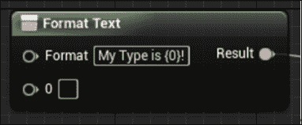

1.  从蓝图的变量部分拖动`Type`到图中，从菜单中选择“Get”。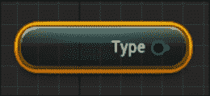

1.  将一个“Enum to Name”节点添加到`Type`的输出引脚。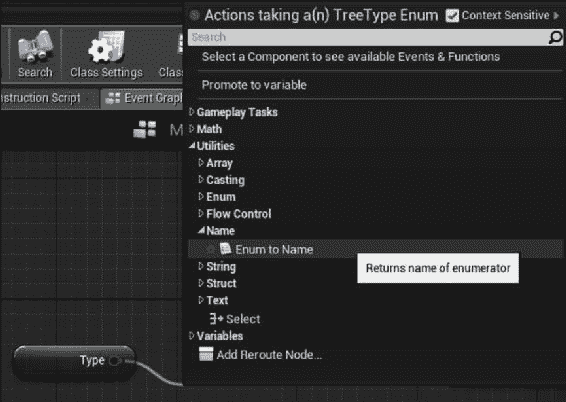

1.  将名称输出连接到标记为`0`的“格式文本”的输入引脚。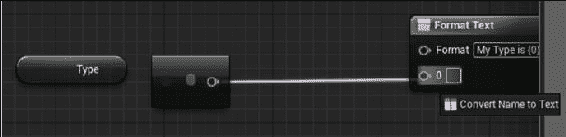

1.  你的事件图现在应该如下所示：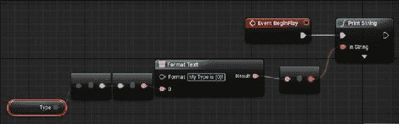

1.  将几个副本的蓝图拖入关卡并点击“播放”。你应该看到一些树打印有关它们类型的信息，验证了我们创建的蓝图代码随机分配类型的功能。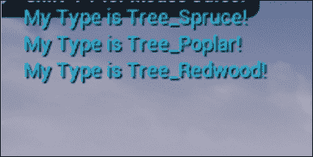

## 工作原理...

1.  和往常一样，我们使用`StaticMeshActor`作为我们的`Actor`的基类，以便我们可以在关卡中轻松地给它一个可视化表示。

1.  使用`UENUM`宏将枚举类型暴露给反射系统。

1.  我们使用`BlueprintType`修饰符将“枚举”标记为蓝图可用。

1.  “枚举”声明与我们在任何其他上下文中使用的方式完全相同。

1.  我们的`Tree`需要一个`TreeType`。因为我们想要体现的关系是*树具有树类型*，所以我们在`Tree`类中包含了一个`TreeType`的实例。

1.  和往常一样，我们需要使用`UPROPERTY()`使成员变量对反射系统可访问。

1.  我们使用`BlueprintReadWrite`修饰符来标记该属性在蓝图中具有获取和设置的支持。

1.  当在`UPROPERTY`中使用时，枚举类型需要被包装在`TEnumAsByte`模板中，因此我们声明一个`TEnumAsByte<TreeType>`的实例作为树的`Type`变量。

1.  `Tree`的构造函数只是标准的加载和初始化我们在其他示例中使用的静态网格组件前导。

1.  我们创建一个继承自我们的`Tree`类的蓝图，以便我们可以演示`TreeType enum`的蓝图可访问性。

1.  为了使蓝图在创建实例时随机分配树的类型，我们需要使用蓝图的**Construction Script**。

1.  在**Construction Script**中，我们计算`TreeType enum`中的条目数。

1.  我们生成一个随机数，并将其作为`TreeType enum`类型中的索引来检索一个值，将其存储为我们的`Type`。

1.  然而，随机数节点返回整数。在蓝图中，枚举类型被视为字节，因此我们需要使用`ToByte`节点，然后蓝图可以将其隐式转换为`enum`值。

1.  现在，我们已经在**Construction Script**中为创建的树实例分配了一个类型，我们需要在运行时显示树的类型。

1.  我们通过连接到事件图表选项卡中的`BeginPlay`事件附加的图表来实现。

1.  要在屏幕上显示文本，我们使用`Print String`节点。

1.  为了执行字符串替换并将我们的类型打印为可读字符串，我们使用`Format Text`节点。

1.  `Format Text`节点接受用花括号括起来的术语，并允许您替换这些术语的其他值，返回最终的字符串。

1.  将我们的`Type`替换到`Format Text`节点中，我们需要将变量存储从`enum`值转换为实际值的名称。

1.  我们可以通过访问我们的`Type`变量，然后使用`Enum to Name`节点来实现。

1.  `Name`或本机代码中的`FNames`是一种可以由蓝图转换为字符串的变量类型，因此我们可以将我们的`Name`连接到`Format Text`节点的输入上。

1.  当我们点击播放时，图表执行，检索放置在关卡中的树实例的类型，并将名称打印到屏幕上。

# 在编辑器中的不同位置编辑类属性

在使用虚幻引擎进行开发时，程序员通常会在 C++中为 Actor 或其他对象实现属性，并使其对设计师可见。然而，有时候查看属性或使其可编辑是有意义的，但仅在对象的默认状态下。有时，属性只能在运行时进行修改，其默认值在 C++中指定。幸运的是，有一些修饰符可以帮助我们限制属性的可用性。

## 如何操作...

1.  在编辑器中创建一个名为`PropertySpecifierActor`的新`Actor`类。

1.  将以下属性定义添加到类中：

```cpp
UPROPERTY(EditDefaultsOnly)
bool EditDefaultsOnly;
UPROPERTY(EditInstanceOnly)
bool EditInstanceOnly;
UPROPERTY(EditAnywhere)
bool EditAnywhere;
UPROPERTY(VisibleDefaultsOnly)
bool VisibleDefaultsOnly;
UPROPERTY(VisibleInstanceOnly)
bool VisibleInstanceOnly;
UPROPERTY(VisibleAnywhere)
bool VisibleAnywhere;
```

1.  编译代码并启动编辑器。

1.  在编辑器中基于该类创建一个新的蓝图。

1.  打开蓝图，查看**Class Defaults**部分。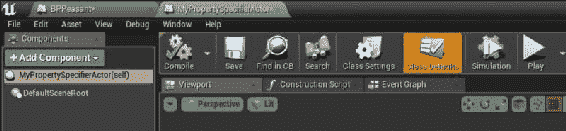

1.  请注意哪些属性是可编辑和可见的。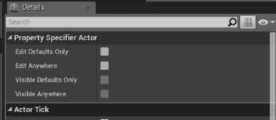

1.  在关卡中放置实例，并查看它们的**Details**面板。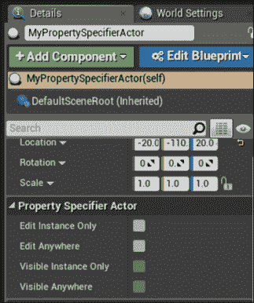

1.  请注意，可编辑的属性集不同。

## 它是如何工作的...

1.  在指定`UPROPERTY`时，我们可以指示我们希望该值在虚幻编辑器中的哪个位置可用。

1.  `Visible*`前缀表示该值可以在指定对象的**Details**面板中查看。但是，该值不可编辑。

1.  这并不意味着变量是`const`限定符；然而，本机代码可以更改值，例如。

1.  `Edit*`前缀表示该属性可以在编辑器中的**Details**面板中进行更改。

1.  作为后缀的`InstanceOnly`表示该属性仅在已放置到游戏中的类的实例的“详细信息”面板中显示。例如，在蓝图编辑器的“类默认”部分中将不可见。

1.  `DefaultsOnly`是`InstanceOnly`的反义词 - `UPROPERTY`仅显示在“类默认部分”中，并且无法在蓝图编辑器中的单个实例上查看。

1.  后缀`Anywhere`是前两个后缀的组合 - `UPROPERTY`将在检查对象的默认值或级别中的特定实例的所有“详细信息”面板中可见。

## 另请参阅

+   这个配方使得所讨论的属性在检视器中可见，但不允许在实际的蓝图事件图中引用该属性。请参阅下一个配方，了解如何实现这一点的描述。

# 使属性在蓝图编辑器图中可访问

前一个配方中提到的限定词都很好，但它们只控制了`UPROPERTY`在“详细信息”面板中的可见性。默认情况下，即使适当使用这些限定词，也无法在实际的编辑器图中查看或访问`UPROPERTY`以供运行时使用。

其他限定词可以选择与前一个配方中的限定词一起使用，以允许在事件图中与属性交互。

## 操作方法…

1.  使用编辑器向导创建一个名为`BlueprintPropertyActor`的新`Actor`类。

1.  使用 Visual Studio 将以下`UPROPERTY`添加到 Actor 中：

```cpp
UPROPERTY(BlueprintReadWrite, Category = Cookbook)
bool ReadWriteProperty;
UPROPERTY(BlueprintReadOnly, Category = Cookbook)
bool ReadOnlyProperty;
```

1.  编译项目并启动编辑器。

1.  创建一个基于你的“BlueprintPropertyActor”的蓝图类，并打开其图表。

1.  验证属性在“我的蓝图”面板的“变量”部分下的“Cookbook”类别下可见。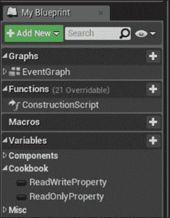

1.  左键单击并将 ReadWrite 属性拖入事件图中，然后选择`Get`。

1.  重复上一步并选择`Set`。

1.  将`ReadOnly`属性拖入图表中，并注意`Set`节点被禁用。

## 工作原理…

1.  作为`UPROPERTY`限定词的`BlueprintReadWrite`指示虚幻头文件工具应为蓝图公开该属性的`Get`和`Set`操作。

1.  `BlueprintReadOnly`是一个只允许蓝图检索属性值而不允许设置的限定词。

1.  当属性由本地代码设置但应在蓝图中访问时，`BlueprintReadOnly`非常有用。

1.  应该注意的是，`BlueprintReadWrite`和`BlueprintReadOnly`并没有指定属性在“详细信息”面板或编辑器的“我的蓝图”部分中是否可访问 - 这些限定词只控制用于蓝图图表中的 getter/setter 节点的生成。

# 响应编辑器中属性更改事件

当设计师更改放置在级别中的`Actor`的属性时，通常重要的是立即显示该更改的任何视觉结果，而不仅仅在模拟或播放级别时显示。

当使用“详细信息”面板进行更改时，编辑器会发出一个特殊事件，称为`PostEditChangeProperty`，该事件使类实例有机会响应属性的编辑。

本配方向您展示如何处理`PostEditChangeProperty`以实现即时的编辑器反馈。

## 操作方法…

1.  基于`StaticMeshActor`创建一个名为`APostEditChangePropertyActor`的新`Actor`。

1.  将以下`UPROPERTY`添加到类中：

```cpp
UPROPERTY(EditAnywhere)
bool ShowStaticMesh;
```

1.  添加以下函数定义：

```cpp
virtual void PostEditChangeProperty(FPropertyChangedEvent& PropertyChangedEvent) override;
```

1.  将以下内容添加到类构造函数中：

```cpp
auto MeshAsset = ConstructorHelpers::FObjectFinder<UStaticMesh>(TEXT("StaticMesh'/Engine/BasicShapes/Cone.Cone'"));
if (MeshAsset.Object != nullptr)
{
  GetStaticMeshComponent()->SetStaticMesh(MeshAsset.Object);
  GetStaticMeshComponent()->bGenerateOverlapEvents = true;
}
GetStaticMeshComponent()->SetMobility(EComponentMobility::Movable);
ShowStaticMesh = true;
```

1.  实现`PostEditChangeProperty`：

```cpp
void APostEditChangePropertyActor::PostEditChangeProperty(FPropertyChangedEvent& PropertyChangedEvent)
{
  if (PropertyChangedEvent.Property != nullptr)
  {
    const FName PropertyName(PropertyChangedEvent.Property->GetFName());
    if (PropertyName == GET_MEMBER_NAME_CHECKED(APostEditChangePropertyActor, ShowStaticMesh))
    {
      if (GetStaticMeshComponent() != nullptr)
      {
        GetStaticMeshComponent()->SetVisibility(ShowStaticMesh);
      }
    }
  }
  Super::PostEditChangeProperty(PropertyChangedEvent);
}
```

1.  编译代码并启动编辑器。

1.  将类的实例拖入游戏世界，并验证切换`ShowStaticMesh`的布尔值是否切换编辑器视口中网格的可见性。

## 它的工作原理是...

1.  我们基于`StaticMeshActor`创建一个新的`Actor`，以便通过静态网格轻松访问可视化表示。

1.  添加`UPROPERTY`以提供我们要更改的属性，以触发`PostEditChangeProperty`事件。

1.  `PostEditChangeProperty`是在`Actor`中定义的虚函数。

1.  因此，我们在我们的类中重写该函数。

1.  在我们的类构造函数中，我们像往常一样初始化我们的网格，并将我们的`bool`属性的默认状态设置为与其控制的组件的可见性相匹配。

1.  在`PostEditChangeProperty`中，我们首先检查属性是否有效。

1.  假设它是有效的，我们使用`GetFName()`检索属性的名称。

1.  `FNames`在引擎内部以唯一值的表格形式存储。

1.  接下来，我们需要使用`GET_MEMBER_NAME_CHECKED`宏。该宏接受多个参数。

1.  第一个是要检查的类的名称。

1.  第二个参数是要检查类的属性。

1.  宏将在编译时验证类是否包含指定名称的成员。

1.  我们将宏返回的类成员名称与我们的属性包含的名称进行比较。

1.  如果它们相同，那么我们验证我们的`StaticMeshComponent`是否正确初始化。

1.  如果是，我们将其可见性设置为与我们的`ShowStaticMesh`布尔值的值相匹配。

# 实现本地代码构造脚本

在蓝图中，**构造脚本**是一个事件图，它在附加到对象上的任何属性发生更改时运行-无论是通过在编辑器视口中拖动还是通过在**详细信息**面板中直接输入。

构造脚本允许对象根据其新位置“重建”自身，例如，或者根据用户选择的选项更改其包含的组件。

在使用虚幻引擎进行 C++编码时，等效的概念是`OnConstruction`函数。

## 如何实现...

1.  创建一个名为`AOnConstructionActor`的新`Actor`，基于`StaticMeshActor`。

1.  将以下`UPROPERTY`添加到类中：

```cpp
UPROPERTY(EditAnywhere)
bool ShowStaticMesh;
```

1.  添加以下函数定义：

```cpp
virtual void OnConstruction(const FTransform& Transform) override;
```

1.  将以下内容添加到类构造函数中：

```cpp
auto MeshAsset = ConstructorHelpers::FObjectFinder<UStaticMesh>(TEXT("StaticMesh'/Engine/BasicShapes/Cone.Cone'"));
if (MeshAsset.Object != nullptr)
{
  GetStaticMeshComponent()->SetStaticMesh(MeshAsset.Object);
  GetStaticMeshComponent()->bGenerateOverlapEvents = true;
}
GetStaticMeshComponent()->SetMobility(EComponentMobility::Movable);
ShowStaticMesh = true;
```

1.  实现`OnConstruction`：

```cpp
void AOnConstructionActor::OnConstruction(const FTransform& Transform)
{
  GetStaticMeshComponent()->SetVisibility(ShowStaticMesh);
}
```

1.  编译代码并启动编辑器。

1.  将类的实例拖动到游戏世界中，并验证切换`ShowStaticMesh`布尔值是否切换编辑器视口中网格的可见性。

1.  如果 C++的 Actor 被移动，目前`OnConstruction`不会运行。

1.  为了测试这个，将断点放在你的`OnConstruction`函数中，然后将你的 Actor 移动到关卡中。

### 提示

要设置断点，请将光标放在所需行上，然后在 Visual Studio 中按下*F9*。

1.  您会注意到该函数不会被调用，但是如果切换`ShowStaticMesh`布尔值，它会被调用，从而触发断点。

### 注意

为了了解原因，请查看`AActor::PostEditMove`：

```cpp
UBlueprint* Blueprint = Cast<UBlueprint>(GetClass()->ClassGeneratedBy);
if(Blueprint && (Blueprint->bRunConstructionScriptOnDrag || bFinished) && !FLevelUtils::IsMovingLevel() )
{
  FNavigationLockContext NavLock(GetWorld(), ENavigationLockReason::AllowUnregister);
  RerunConstructionScripts();
}
```

这里的顶行将当前对象的`UClass`转换为`UBlueprint`，并且只有在类是蓝图时才会运行构造脚本和`OnConstruction`。

## 它的工作原理是...

1.  我们基于`StaticMeshActor`创建一个新的 Actor，以便通过静态网格轻松访问可视化表示。

1.  添加`UPROPERTY`以提供我们要更改的属性-以触发`PostEditChangeProperty`事件。

1.  `OnConstruction`是在 Actor 中定义的虚函数。

1.  因此，我们在我们的类中重写该函数。

1.  在我们的类构造函数中，我们像往常一样初始化我们的网格，并将我们的`bool`属性的默认状态设置为与其控制的组件的可见性相匹配。

1.  在`OnConstruction`中，Actor 使用任何需要进行重建的属性来重建自身。

1.  对于这个简单的示例，我们将网格的可见性设置为与我们的`ShowStaticMesh`属性的值相匹配。

1.  这也可以扩展到根据`ShowStaticMesh`变量的值更改其他值。

1.  您会注意到，与前一个示例中使用`PostEditChangeProperty`显式过滤特定属性更改不同。

1.  `OnConstruction`脚本会在对象上的每个属性发生更改时完整运行。

1.  它无法测试刚刚编辑的属性，因此您需要谨慎地将计算密集型代码放在其中。

# 创建一个新的编辑器模块

以下示例都与编辑器模式特定代码和引擎模块进行交互。因此，根据惯例，创建一个仅在引擎以编辑器模式运行时加载的新模块，以便我们可以将所有仅限于编辑器的代码放在其中。

## 操作步骤如下：

1.  在文本编辑器（如记事本或 Notepad++）中打开项目的`.uproject`文件。

1.  将以下粗体部分添加到文件中：

```cpp
{
  "FileVersion": 3,
  "EngineAssociation": "4.11",
  "Category": "",
  "Description": "",
  "Modules": [
    {
      "Name": "UE4Cookbook",
      "Type": "Runtime",
      "LoadingPhase": "Default",
      "AdditionalDependencies": [
        "Engine",
        "CoreUObject"
      ]
    },
 {
 "Name": "UE4CookbookEditor",
 "Type": "Editor",
 "LoadingPhase": "PostEngineInit",
 "AdditionalDependencies": [
 "Engine",
 "CoreUObject"
 ]
 }
  ]
}
```

1.  注意第一个模块之后第二组花括号前的逗号。

1.  在源文件夹中，使用与您在`uproject`文件中指定的名称相同的名称创建一个新文件夹（在本例中为`"UE4CookbookEditor"`）。

1.  在这个新文件夹中，创建一个名为`UE4CookbookEditor.Build.cs`的文件。

1.  将以下内容插入文件中：

```cpp
using UnrealBuildTool;

public class UE4CookbookEditor : ModuleRules
{
  public UE4CookbookEditor(TargetInfo Target)
  {
    PublicDependencyModuleNames.AddRange(new string[] { "Core", "CoreUObject", "Engine", "InputCore", "RHI", "RenderCore", "ShaderCore" });
    PublicDependencyModuleNames.Add("UE4Cookbook");
    PrivateDependencyModuleNames.AddRange(new string[] { "UnrealEd" });
  }
}
```

1.  创建一个名为`UE4CookbookEditor.h`的新文件，并添加以下内容：

```cpp
#pragma once
#include "Engine.h"
#include "ModuleManager.h"
#include "UnrealEd.h"

class FUE4CookbookEditorModule: public IModuleInterface
{
};
```

1.  最后，创建一个名为`UE4CookbookEditor.cpp`的新源文件。

1.  添加以下代码：

```cpp
#include "UE4CookbookEditor.h"
IMPLEMENT_GAME_MODULE(FUE4CookbookEditorModule, UE4CookbookEditor)
```

1.  最后，如果您已经打开了 Visual Studio，请关闭它，然后右键单击`.uproject`文件，选择**生成 Visual Studio 项目文件**。

1.  您应该看到一个小窗口启动，显示进度条，然后关闭。

1.  现在可以启动 Visual Studio，验证 IDE 中是否可见新模块，并成功编译项目。

1.  该模块现在已准备好进行下一组操作。

### 注意

在此编辑器模块中进行的代码更改不支持与运行时模块中的代码相同的热重载。如果出现提到更改生成的头文件的编译错误，请关闭编辑器，然后从 IDE 内部重新构建。

## 工作原理如下：

1.  Unreal 项目使用`.uproject`文件格式来指定有关项目的许多不同信息。

1.  此信息用于通知头文件和构建工具关于组成此项目的模块，并用于代码生成和`makefile`创建。

1.  该文件使用 JSON 样式的格式。

1.  这些包括以下内容：

+   项目应该在其中打开的引擎版本

+   项目中使用的模块列表

+   模块声明列表

1.  每个模块声明都包含以下内容：

+   模块的名称。

+   模块的类型-它是一个编辑器模块（仅在编辑器构建中运行，可以访问仅限于编辑器的类）还是运行时模块（在编辑器和发布构建中运行）。

+   模块的加载阶段-模块可以在程序启动的不同阶段加载。这个值指定了模块应该在哪个点加载，例如，如果有其他模块的依赖应该先加载。

+   模块的依赖列表。这些是包含模块所依赖的导出函数或类的基本模块。

1.  我们向`uproject`文件添加了一个新模块。该模块的名称是`UE4CookbookEditor`（按照惯例，对于编辑器模块，应该在主游戏模块后附加`Editor`）。

1.  该模块被标记为编辑器模块，并设置为在基线引擎之后加载，以便可以使用在引擎代码中声明的类。

1.  我们的模块的依赖关系暂时保持默认值。

1.  将`uproject`文件修改为包含我们的新模块后，我们需要一个构建脚本。

1.  构建脚本是用 C#编写的，名称为`<ModuleName>.Build.cs`。

1.  与 C++不同，C#不使用单独的头文件和实现文件-所有内容都在一个`.cs`文件中。

1.  我们想要访问在`UnrealBuildTool`模块中声明的类，因此我们包含一个`using`语句来指示我们要访问该命名空间。

1.  我们创建一个与我们的模块同名的`public`类，并继承自`ModuleRules`。

1.  在我们的构造函数中，我们将多个模块添加到此模块的依赖项中。

1.  有私有依赖和公共依赖。根据`ModuleRules`类的代码，公共依赖是您模块的公共头文件依赖的模块。私有依赖是私有代码依赖的模块。在公共头文件和私有代码中都使用的内容应放入`PublicDependencyModuleNames`数组中。

1.  请注意，我们的`PublicDependencyModuleNames`数组包含我们的主游戏模块。这是因为本章中的一些示例将扩展编辑器以更好地支持我们主游戏模块中定义的类。

1.  现在，我们已经告诉构建系统通过项目文件构建新模块，并且已经指定了如何使用构建脚本构建模块，我们需要创建实际模块的 C++类。

1.  我们创建一个包含引擎头文件、`ModuleManager`头文件和`UnrealEd`头文件的头文件。

1.  我们包括`ModuleManager`，因为它定义了`IModuleInterface`，我们的模块将继承自该类。

1.  我们还包括`UnrealEd`，因为我们正在编写一个需要访问编辑器功能的编辑器模块。

1.  我们声明的类继承自`IModuleInterface`，并从通常的前缀`F`开始命名。

1.  在`.cpp`文件中，我们包含了模块的头文件，然后使用`IMPLEMENT_GAME_MODULE`宏。

1.  `IMPLEMENT_GAME_MODULE`声明了一个导出的 C 函数`InitializeModule()`，它返回我们新模块类的实例。

1.  这意味着 Unreal 可以简单地调用任何导出它的库上的`InitializeModule()`来检索对实际模块实现的引用，而不需要知道它是什么类。

1.  添加了新模块后，我们现在需要重新构建 Visual Studio 解决方案，因此关闭 Visual Studio，然后使用上下文菜单重新生成项目文件。

1.  重新构建项目后，新模块将在 Visual Studio 中可见，我们可以像往常一样向其添加代码。

# 创建新的工具栏按钮

如果您已经为编辑器创建了自定义工具或窗口，那么您可能需要一种让用户显示它的方法。最简单的方法是创建一个工具栏自定义，添加一个新的工具栏按钮，并在点击时显示您的窗口。

按照前面的示例创建一个新的引擎模块，因为我们需要它来初始化我们的工具栏自定义。

## 如何操作…

1.  创建一个新的头文件，并插入以下类声明：

```cpp
#pragma once
#include "Commands.h"
#include "EditorStyleSet.h"
/**
 * 
 */
class FCookbookCommands : public TCommands<FCookbookCommands>
{
  public:
  FCookbookCommands()
  :TCommands<FCookbookCommands>(FName(TEXT("UE4_Cookbook")), FText::FromString("Cookbook Commands"), NAME_None, FEditorStyle::GetStyleSetName()) 
  {
  };
  virtual void RegisterCommands() override;

  TSharedPtr<FUICommandInfo> MyButton;
};
```

1.  通过在`.cpp`文件中放置以下内容来实现新类：

```cpp
#include "UE4CookbookEditor.h"
#include "Commands.h"
#include "CookbookCommands.h"

void FCookbookCommands::RegisterCommands()
{
  #define LOCTEXT_NAMESPACE ""
  UI_COMMAND(MyButton, "Cookbook", "Demo Cookbook Toolbar Command", EUserInterfaceActionType::Button, FInputGesture());
  #undef LOCTEXT_NAMESPACE
}
```

1.  在您的模块类中添加以下内容：

```cpp
virtual void StartupModule() override;
virtual void ShutdownModule() override;
TSharedPtr<FExtender> ToolbarExtender;
TSharedPtr<const FExtensionBase> Extension;
void MyButton_Clicked()
{
  TSharedRef<SWindow> CookbookWindow = SNew(SWindow)
  .Title(FText::FromString(TEXT("Cookbook Window")))
  .ClientSize(FVector2D(800, 400))
  .SupportsMaximize(false)
  .SupportsMinimize(false);

  IMainFrameModule& MainFrameModule = FModuleManager::LoadModuleChecked<IMainFrameModule>(TEXT("MainFrame"));

  if (MainFrameModule.GetParentWindow().IsValid())
  {
    FSlateApplication::Get().AddWindowAsNativeChild(CookbookWindow,MainFrameModule.GetParentWindow().ToSharedRef());
  }
  else
  {
    FSlateApplication::Get().AddWindow(CookbookWindow);
  }
};
void AddToolbarExtension(FToolBarBuilder &builder)
{
  FSlateIcon IconBrush = FSlateIcon(FEditorStyle::GetStyleSetName(), "LevelEditor.ViewOptions", "LevelEditor.ViewOptions.Small");

  builder.AddToolBarButton(FCookbookCommands::Get().MyButton, NAME_None, FText::FromString("My Button"), FText::FromString("Click me to display a message"), IconBrush, NAME_None);
};
```

1.  确保还`#include`您的命令类的头文件。

1.  现在我们需要实现`StartupModule`和`ShutdownModule`：

```cpp
void FUE4CookbookEditorModule::StartupModule()
{
  FCookbookCommands::Register();
  TSharedPtr<FUICommandList> CommandList = MakeShareable(new FUICommandList());
  CommandList->MapAction(FCookbookCommands::Get().MyButton, FExecuteAction::CreateRaw(this, &FUE4CookbookEditorModule::MyButton_Clicked), FCanExecuteAction());
  ToolbarExtender = MakeShareable(new FExtender());
  Extension = ToolbarExtender->AddToolBarExtension("Compile", EExtensionHook::Before, CommandList, FToolBarExtensionDelegate::CreateRaw(this, &FUE4CookbookEditorModule::AddToolbarExtension));

  FLevelEditorModule& LevelEditorModule = FModuleManager::LoadModuleChecked<FLevelEditorModule>("LevelEditor");
  LevelEditorModule.GetToolBarExtensibilityManager()->AddExtender(ToolbarExtender);
}

void FUE4CookbookEditorModule::ShutdownModule()
{
  ToolbarExtender->RemoveExtension(Extension.ToSharedRef());
  Extension.Reset();
  ToolbarExtender.Reset();
}
```

1.  添加以下包含：

```cpp
#include "LevelEditor.h"
#include "SlateBasics.h"
#include "MultiBoxExtender.h"
#include "Chapter8/CookbookCommands.h"
```

1.  编译您的项目，并启动编辑器。

1.  验证在主级别编辑器的工具栏上有一个新按钮，可以单击它打开一个新窗口：

## 它是如何工作的…

1.  Unreal 的编辑器 UI 基于命令的概念。命令是一种设计模式，允许 UI 和它需要执行的操作之间的耦合度较低。

1.  为了创建一个包含一组命令的类，需要继承自`TCommands`。

1.  `TCommands`是一个模板类，利用了**奇异递归模板模式**（**CRTP**）。CRTP 在**Slate** UI 代码中常用作创建编译时多态的一种方式。

1.  在`FCookbookCommands`构造函数的初始化列表中，我们调用父类构造函数，传入多个参数。

1.  第一个参数是命令集的名称，是一个简单的`FName`。

1.  第二个参数是一个工具提示/可读字符串，因此使用`FText`，以便在需要时支持本地化。

1.  如果有一个命令的父组，第三个参数包含组的名称。否则，它包含`NAME_None`。

1.  构造函数的最后一个参数是包含命令集将使用的任何命令图标的 Slate 样式集。

1.  `RegisterCommands()`函数允许`TCommands`派生类创建它们所需的任何命令对象。从该函数返回的`FUICommandInfo`实例存储在`Commands`类中作为成员，以便可以将 UI 元素或函数绑定到命令上。

1.  这就是为什么我们有一个成员变量`TSharedPtr<FUICommandInfo> MyButton`。

1.  在类的实现中，我们只需要在`RegisterCommands`中创建我们的命令。

1.  `UI_COMMAND`宏用于创建`FUICommandInfo`的实例，即使只是一个空的默认命名空间，也需要定义一个本地化命名空间。

1.  因此，即使我们不打算使用本地化，我们仍需要用`#defines`来封装我们的`UI_COMMAND`调用，以设置`LOCTEXT_NAMESPACE`的有效值。

1.  实际的`UI_COMMAND`宏接受多个参数。

1.  第一个参数是用来存储`FUICommandInfo`的变量。

1.  第二个参数是一个可读的命令名称。

1.  第三个参数是命令的描述。

1.  第四个参数是`EUserInterfaceActionType`。这个枚举实际上指定了正在创建的按钮的类型。它支持`Button`、`ToggleButton`、`RadioButton`和`Check`作为有效类型。

1.  按钮是简单的通用按钮。切换按钮存储开和关的状态。单选按钮类似于切换按钮，但与其他单选按钮分组，并且一次只能启用一个。最后，复选框在按钮旁边显示一个只读复选框。

1.  `UI_COMMAND`的最后一个参数是输入键组合，或者激活命令所需的键的组合。

1.  这个参数主要用于为与该命令相关联的热键定义键组合，而不是按钮。因此，我们使用一个空的`InputGesture`。

1.  所以现在我们有了一组命令，但是我们还没有告诉引擎我们想要将这组命令添加到工具栏上显示的命令中。我们也还没有设置当按钮被点击时实际发生的事情。为了做到这一点，我们需要在模块开始时执行一些初始化操作，所以我们将一些代码放入`StartupModule`/`ShutdownModule`函数中。

1.  在`StartupModule`中，我们调用之前定义的命令类上的静态`Register`函数。

1.  然后，我们使用`MakeShareable`函数创建一个命令列表的共享指针。

1.  在命令列表中，我们使用`MapAction`来创建一个映射或关联，将我们设置为`FCookbookCommands`的成员的`UICommandInfo`对象与我们希望在调用命令时执行的实际函数关联起来。

1.  你会注意到，我们在这里没有明确设置任何关于如何调用命令的内容。

1.  为了执行这个映射，我们调用`MapAction`函数。`MapAction`的第一个参数是一个`FUICommandInfo`对象，我们可以通过使用它的静态`Get()`方法从`FCookbookCommands`中检索实例来获取它。

1.  `FCookbookCommands`被实现为一个单例类，即一个在整个应用程序中存在的单个实例。你会在大多数地方看到这种模式——引擎中有一个可用的静态`Get()`方法。

1.  `MapAction`函数的第二个参数是一个绑定到在执行命令时要调用的函数的委托。

1.  因为`UE4CookbookEditorModule`是一个原始的 C++类，而不是一个`UObject`，我们想要调用一个成员函数而不是一个`static`函数，所以我们使用`CreateRaw`来创建一个绑定到原始 C++成员函数的新委托。

1.  `CreateRaw`期望一个指向对象实例的指针，并且一个对该指针上要调用的函数的函数引用。

1.  `MapAction`的第三个参数是一个委托，用于调用以测试是否可以执行该操作。因为我们希望该命令始终可执行，所以我们可以使用一个简单的预定义委托，它始终返回`true`。

1.  通过将我们的命令与它应该调用的操作关联起来，我们现在需要告诉扩展系统我们想要向工具栏添加新的命令。

1.  我们可以通过`FExtender`类来实现这一点，该类可用于扩展菜单、上下文菜单或工具栏。

1.  我们最初创建了一个`FExtender`的实例作为共享指针，以便在模块关闭时我们的扩展未初始化。

1.  然后，我们在我们的新扩展器上调用`AddToolBarExtension`，将结果存储在共享指针中，以便在模块未初始化时将其移除。

1.  `AddToolBarExtension`的第一个参数是我们要添加扩展的扩展点的名称。

1.  要找到我们要放置扩展的位置，我们首先需要在编辑器 UI 中打开扩展点的显示。

1.  为此，请在编辑器的**Edit**菜单中打开**Editor Preferences**：

1.  打开**General** | **Miscellaneous**，然后选择**Display UIExtension Points**：

1.  重新启动编辑器，您应该会看到覆盖在编辑器 UI 上的绿色文本，如下面的屏幕截图所示：

1.  绿色文本表示`UIExtensionPoint`，文本的值是我们应该提供给`AddToolBarExtension`函数的字符串。

1.  在本示例中，我们将在**Compile**扩展点中添加我们的扩展，但是当然，您可以使用任何其他您希望的扩展点。

1.  重要的是要注意，将工具栏扩展添加到菜单扩展点将会静默失败，反之亦然。

1.  `AddToolBarExtension`的第二个参数是相对于指定的扩展点的位置锚点。我们选择了`FExtensionHook::Before`，所以我们的图标将显示在编译点之前。

1.  下一个参数是包含映射操作的命令列表。

1.  最后，最后一个参数是一个委托，负责将 UI 控件实际添加到我们之前指定的扩展点和锚点的工具栏上。

1.  委托绑定到一个具有形式 void(`*func`)(`FToolBarBuilder`和`builder`)的函数。在这个实例中，它是我们模块类中定义的一个名为`AddToolbarExtension`的函数。

1.  当调用该函数时，调用在作为函数参数传入的`FToolBarBuilder`实例上的命令，添加 UI 元素将将这些元素应用到我们指定的 UI 位置。

1.  最后，我们需要在此函数中加载级别编辑器模块，以便我们可以将我们的扩展器添加到级别编辑器中的主工具栏中。

1.  通常情况下，我们可以使用`ModuleManager`加载一个模块并返回对它的引用。

1.  有了这个引用，我们可以获取模块的工具栏扩展性管理器，并告诉它添加我们的扩展器。

1.  虽然一开始可能会感到繁琐，但这样做的目的是允许您将相同的工具栏扩展应用于不同模块中的多个工具栏，以便在不同的编辑器窗口之间创建一致的 UI 布局。

1.  当然，初始化我们的扩展的对应操作是在模块卸载时将其移除。为此，我们从扩展器中移除我们的扩展，然后将 Extender 和扩展的共享指针置空，以回收它们的内存分配。

1.  `AddToolBarExtension`函数在编辑器模块中负责实际将 UI 元素添加到工具栏中，这些 UI 元素可以调用我们的命令。

1.  它通过在传入的`FToolBarBuilder`实例上调用函数来实现这一点。

1.  首先，我们使用`FSlateIcon`构造函数为我们的新工具栏按钮获取适当的图标。

1.  有了加载的图标，我们在`builder`实例上调用`AddToolBarButton`。

1.  `AddToolbarButton`有许多参数。

1.  第一个参数是要绑定的命令 - 您会注意到它与我们之前绑定操作到命令时访问的`MyButton`成员相同。

1.  第二个参数是我们之前指定的扩展挂钩的覆盖，但我们不想覆盖它，所以我们可以使用`NAME_None`。

1.  第三个参数是我们创建的新按钮的标签覆盖。

1.  第四个参数是新按钮的工具提示。

1.  倒数第二个参数是按钮的图标，最后一个参数是用于引用此按钮元素以支持突出显示的名称，如果您希望使用编辑器内教程框架。

# 创建新菜单项

创建新菜单项的工作流程与创建新工具栏按钮的工作流程几乎相同，因此本教程将在前一个教程的基础上进行构建，并向您展示如何将其中创建的命令添加到菜单而不是工具栏。

## 操作步骤...

1.  在您的`module`类中创建一个新函数：

```cpp
void AddMenuExtension(FMenuBuilder &builder)
{
  FSlateIcon IconBrush = FSlateIcon(FEditorStyle::GetStyleSetName(), "LevelEditor.ViewOptions", "LevelEditor.ViewOptions.Small");

  builder.AddMenuEntry(FCookbookCommands::Get().MyButton);
};
```

1.  在`StartupModule`函数中找到以下代码：

```cpp
Extension = ToolbarExtender->AddToolBarExtension("Compile", EExtensionHook::Before, CommandList, FToolBarExtensionDelegate::CreateRaw(this, &FUE4CookbookEditorModule::AddToolbarExtension));
LevelEditorModule.GetToolBarExtensibilityManager()->AddExtender(ToolbarExtender);
```

1.  用以下代码替换前面的代码：

```cpp
Extension = ToolbarExtender->AddMenuExtension("LevelEditor", EExtensionHook::Before, CommandList, FMenuExtensionDelegate::CreateRaw(this, &FUE4CookbookEditorModule::AddMenuExtension));
LevelEditorModule.GetMenuExtensibilityManager()->AddExtender(ToolbarExtender);
```

1.  编译代码并启动编辑器。

1.  验证现在在**Window**菜单下是否有一个菜单项，当单击时显示**Cookbook**窗口。如果您按照前面的教程操作，您还将看到列出 UI 扩展点的绿色文本，包括我们在此教程中使用的扩展点（**LevelEditor**）。

## 工作原理如下...

1.  您会注意到`ToolbarExtender`的类型是`FExtender`而不是`FToolbarExtender`或`FMenuExtender`。

1.  通过使用通用的`FExtender`类而不是特定的子类，框架允许您创建一系列可以用于菜单或工具栏的命令-函数映射。实际添加 UI 控件的委托（在本例中为`AddMenuExtension`）可以将这些控件链接到您的`FExtender`中的一部分命令。

1.  这样，您就不需要为不同类型的扩展创建不同的`TCommands`类，并且可以将命令放入单个中央类中，而不管这些命令从 UI 的哪个位置调用。

1.  因此，唯一需要的更改如下：

1.  将`AddToolBarExtension`的调用与`AddMenuExtension`交换。

1.  创建一个可以绑定到`FMenuExtensionDelegate`而不是`FToolbarExtensionDelegate`的函数。

1.  将扩展器添加到菜单扩展性管理器而不是工具栏扩展性管理器。

# 创建一个新的编辑器窗口

自定义编辑器窗口在您具有具有用户可配置设置的新工具或希望向使用您的自定义编辑器的人显示一些信息时非常有用。

在开始之前，请确保按照本章前面的教程创建了一个编辑器模块。

阅读*创建新菜单项*或*创建新工具栏按钮*的任一教程，以便您可以在编辑器中创建一个按钮，该按钮将启动我们的新窗口。

## 操作步骤...

1.  在命令的绑定函数中，添加以下代码：

```cpp
TSharedRef<SWindow> CookbookWindow = SNew(SWindow)
.Title(FText::FromString(TEXT("Cookbook Window")))
.ClientSize(FVector2D(800, 400))
.SupportsMaximize(false)
.SupportsMinimize(false)
[
  SNew(SVerticalBox)
  +SVerticalBox::Slot()
  .HAlign(HAlign_Center)
  .VAlign(VAlign_Center)
  [
    SNew(STextBlock)
    .Text(FText::FromString(TEXT("Hello from Slate")))
  ]
];
IMainFrameModule& MainFrameModule = FModuleManager::LoadModuleChecked<IMainFrameModule>(TEXT("MainFrame"));

if (MainFrameModule.GetParentWindow().IsValid())
{
  FSlateApplication::Get().AddWindowAsNativeChild(CookbookWindow, MainFrameModule.GetParentWindow().ToSharedRef());
}
else
{
  FSlateApplication::Get().AddWindow(CookbookWindow);
}
```

1.  编译代码并启动编辑器。

1.  当您激活您创建的命令时，无论是选择自定义菜单选项还是您添加的工具栏选项，您都应该看到窗口已显示在中间的一些居中文本中：

## 工作原理如下...

1.  如自解释，您的新编辑器窗口不会自行显示，因此，在本教程开始时提到，您应该实现一个自定义菜单或工具栏按钮或控制台命令，我们可以使用它来触发显示我们的新窗口。

1.  所有 Slate 的小部件通常以`TSharedRef<>`或`TSharedPtr<>`的形式进行交互。

1.  `SNew()`函数返回一个以请求的小部件类为模板的`TSharedRef`。

1.  正如本章其他地方提到的，Slate 小部件有许多它们实现的函数，这些函数都返回调用该函数的对象。这允许在创建时使用方法链来配置对象。

1.  这就是允许使用 Slate 语法`<Widget>.Property(Value).Property(Value)`的原因。

1.  在这个示例中，我们设置的小部件属性包括窗口标题、窗口大小以及窗口是否可以最大化和最小化。

1.  一旦小部件上的所有必需属性都被设置好，括号运算符（`[]`）可以用来指定要放置在小部件内部的内容，例如，在按钮内部放置图片或标签。

1.  `SWindow`是一个顶级小部件，只有一个用于子小部件的 slot，所以我们不需要为它自己添加一个 slot。我们通过在括号内创建内容来将内容放入该 slot 中。

1.  我们创建的内容是`SVerticalBox`，它是一个可以有任意数量的子小部件的小部件，这些子小部件以垂直列表的形式显示。

1.  对于我们想要放置在垂直列表中的每个小部件，我们需要创建一个**slot**。

1.  做到这一点最简单的方法是使用重载的`+`运算符和`SVerticalBox::Slot()`函数。

1.  `Slot()`返回一个像其他小部件一样的小部件，所以我们可以像在`SWindow`上设置属性一样在其上设置属性。

1.  这个示例使用`HAlign`和`VAlign`来使 Slot 的内容在水平和垂直轴上居中。

1.  `Slot`有一个单独的子小部件，并且它是在`[]`运算符中创建的，就像对于`SWindow`一样。

1.  在`Slot`内容中，我们创建了一个带有一些自定义文本的文本块。

1.  我们的新`SWindow`现在已经添加了其子小部件，但还没有显示出来，因为它还没有添加到窗口层级中。

1.  主框架模块用于检查是否有顶级编辑器窗口，如果存在，则将我们的新窗口添加为子窗口。

1.  如果没有顶级窗口要作为子窗口添加，那么我们可以使用 Slate 应用程序单例将我们的窗口添加到没有父窗口的情况下。

1.  如果你想要查看我们创建的窗口的层次结构，你可以使用 Slate 小部件反射器，它可以通过**窗口** | **开发者工具** | **小部件反射器**访问。

1.  如果你选择**选择实时小部件**，并将光标悬停在我们自定义窗口中央的文本上，你将能够看到包含我们自定义小部件的**SWindow**的层次结构。

## 另请参阅

+   第九章，“用户界面 - UI 和 UMG”，讲解了 UI，并且会向你展示如何向你的新自定义窗口添加额外的元素。

# 创建一个新的资产类型

在项目的某个时候，你可能需要创建一个新的自定义资产类，例如，用于在 RPG 中存储对话数据的资产。

为了正确地将它们与**内容浏览器**集成，你需要创建一个新的资产类型。

## 如何操作…

1.  创建一个基于`UObject`的自定义资产：

```cpp
#pragma once

#include "Object.h"
#include "MyCustomAsset.generated.h"

/**
 * 
 */
UCLASS()
class UE4COOKBOOK_API UMyCustomAsset : public UObject
{
  GENERATED_BODY()
  public:
  UPROPERTY(EditAnywhere, Category = "Custom Asset")
  FString Name;
};
```

1.  创建一个名为`UCustomAssetFactory`的类，基于`UFactory`，并重写`FactoryCreateNew`方法：

```cpp
#pragma once

#include "Factories/Factory.h"
#include "CustomAssetFactory.generated.h"

/**
 * 
 */
UCLASS()
class UE4COOKBOOK_API UCustomAssetFactory : public UFactory
{
  GENERATED_BODY()

  public:
  UCustomAssetFactory();

  virtual UObject* FactoryCreateNew(UClass* InClass, UObject* InParent, FName InName, EObjectFlags Flags, UObject* Context, FFeedbackContext* Warn, FName CallingContext) override;
};
```

1.  实现这个类：

```cpp
#include "UE4Cookbook.h"
#include "MyCustomAsset.h"
#include "CustomAssetFactory.h"

UCustomAssetFactory::UCustomAssetFactory()
:Super()
{
  bCreateNew = true;
  bEditAfterNew = true;
  SupportedClass = UMyCustomAsset::StaticClass();
}

UObject* UCustomAssetFactory::FactoryCreateNew(UClass* InClass, UObject* InParent, FName InName, EObjectFlags Flags, UObject* Context, FFeedbackContext* Warn, FName CallingContext)
{
  auto NewObjectAsset = NewObject<UMyCustomAsset>(InParent, InClass, InName, Flags);
  return NewObjectAsset;
}
```

1.  编译你的代码，并打开编辑器。

1.  在**内容浏览器**中右键单击，在**创建高级资产**部分的**杂项**选项卡下，你应该能够看到你的新类，并能够创建你的新自定义类型的实例。

## 它的工作原理是…

1.  第一个类是实际在游戏运行时存在的对象。它可以是纹理、数据文件或曲线数据，根据你的需求而定。

1.  对于这个示例，最简单的例子是一个具有`FString`属性来存储名称的资产。

1.  该属性被标记为`UPROPERTY`，以便它保留在内存中，并且额外标记为`EditAnywhere`，以便在默认对象和其实例上都可以编辑它。

1.  第二个类是`Factory`。虚幻使用`Factory`设计模式来创建资产的实例。

1.  这意味着有一个通用的基础`Factory`，它使用虚拟方法来声明对象创建的接口，然后`Factory`的子类负责创建实际的对象。

1.  这种方法的优点是，用户创建的子类可以在需要时实例化其自己的子类；它将决定创建哪个对象的实现细节隐藏在请求创建的对象之外。

1.  以`UFactory`作为基类，我们包含适当的头文件。

1.  构造函数被重写，因为在默认构造函数运行后，我们希望为新工厂设置一些属性。

1.  `bCreateNew`表示工厂当前能够从头开始创建对象的新实例。

1.  `bEditAfterNew`表示我们希望在创建后立即编辑新创建的对象。

1.  `SupportedClass`变量是一个包含有关工厂将创建的对象类型的反射信息的`UClass`的实例。

1.  我们的`UFactory`子类最重要的功能是实际的工厂方法——`FactoryCreateNew`。

1.  `FactoryCreateNew`负责确定应该创建的对象类型，并使用`NewObject`构造该类型的实例。它将以下参数传递给`NewObject`调用。

1.  `InClass`是将要构造的对象的类。

1.  `InParent`是应该包含将要创建的新对象的对象。如果未指定此参数，则假定对象将进入临时包，这意味着它不会自动保存。

1.  `Name`是要创建的对象的名称。

1.  `Flags`是一个位掩码，用于控制创建标志，例如使对象在其所包含的包之外可见。

1.  在`FactoryCreateNew`中，可以根据需要决定实例化哪个子类。还可以执行其他初始化操作；例如，如果有需要手动实例化或初始化的子对象，可以在此处添加。

1.  此函数的引擎代码示例如下：

```cpp
UObject* UCameraAnimFactory::FactoryCreateNew(UClass* Class,UObject* InParent,FName Name,EObjectFlags Flags,UObject* Context,FFeedbackContext* Warn)
{
  UCameraAnim* NewCamAnim = NewObject<UCameraAnim>(InParent, Class, Name, Flags);
  NewCamAnim->CameraInterpGroup = NewObject<UInterpGroupCamera>(NewCamAnim);
  NewCamAnim->CameraInterpGroup->GroupName = Name;
  return NewCamAnim;
}
```

1.  如此所示，这里有第二次调用`NewObject`来填充`NewCamAnim`实例的`CameraInterpGroup`成员。

## 另请参阅

+   本章前面的“编辑类属性在编辑器中的不同位置”配方为`EditAnywhere`属性指定器提供了更多上下文。

# 为资产创建自定义上下文菜单项

自定义资产类型通常具有您希望能够对其执行的特殊功能。例如，将图像转换为精灵是您不希望添加到任何其他资产类型的选项。您可以为特定的资产类型创建自定义上下文菜单项，以使这些功能对用户可用。

## 操作步骤

1.  创建一个基于`FAssetTypeActions_Base`的新类。您需要在头文件中包含`AssetTypeActions_Base.h`。

1.  在类中重写以下虚拟函数：

```cpp
virtual bool HasActions(const TArray<UObject*>& InObjects) const override;
virtual void GetActions(const TArray<UObject*>& InObjects, FMenuBuilder& MenuBuilder) override;
virtual FText GetName() const override;
virtual UClass* GetSupportedClass() const override;

virtual FColor GetTypeColor() const override;
virtual uint32 GetCategories() override;
```

1.  声明以下函数：

```cpp
void MyCustomAssetContext_Clicked();
```

1.  在`.cpp`文件中实现声明的函数：

```cpp
bool FMyCustomAssetActions::HasActions(const TArray<UObject*>& InObjects) const
{
  return true;
}

void FMyCustomAssetActions::GetActions(const TArray<UObject*>& InObjects, FMenuBuilder& MenuBuilder)
{
  MenuBuilder.AddMenuEntry(
  FText::FromString("CustomAssetAction"),
  FText::FromString("Action from Cookbook Recipe"),
  FSlateIcon(FEditorStyle::GetStyleSetName(), "LevelEditor.ViewOptions"),
  FUIAction(
  FExecuteAction::CreateRaw(this, &FMyCustomAssetActions::MyCustomAssetContext_Clicked),
  FCanExecuteAction()));
}

uint32 FMyCustomAssetActions::GetCategories()
{
  return EAssetTypeCategories::Misc;
}
FText FMyCustomAssetActions::GetName() const
{
  return FText::FromString(TEXT("My Custom Asset"));
}
UClass* FMyCustomAssetActions::GetSupportedClass() const
{
  return UMyCustomAsset::StaticClass();
}

FColor FMyCustomAssetActions::GetTypeColor() const
{
  return FColor::Emerald;
}
voidFMyCustomAssetActions::MyCustomAssetContext_Clicked()
{
  TSharedRef<SWindow> CookbookWindow = SNew(SWindow)
  .Title(FText::FromString(TEXT("Cookbook Window")))
  .ClientSize(FVector2D(800, 400))
  .SupportsMaximize(false)
  .SupportsMinimize(false);

  IMainFrameModule& MainFrameModule = FModuleManager::LoadModuleChecked<IMainFrameModule>(TEXT("MainFrame"));

  if (MainFrameModule.GetParentWindow().IsValid())
  {
    FSlateApplication::Get().AddWindowAsNativeChild(CookbookWindow, MainFrameModule.GetParentWindow().ToSharedRef());
  }
  else
  {
    FSlateApplication::Get().AddWindow(CookbookWindow);
  }
};
```

1.  在编辑器模块中，将以下代码添加到`StartupModule()`函数中：

```cpp
IAssetTools& AssetTools = FModuleManager::LoadModuleChecked<FAssetToolsModule>("AssetTools").Get();

auto Actions =MakeShareable(new FMyCustomAssetActions);
AssetTools.RegisterAssetTypeActions(Actions);
CreatedAssetTypeActions.Add(Actions);
```

1.  在模块的`ShutdownModule()`函数中添加以下内容：

```cpp
IAssetTools& AssetTools = FModuleManager::LoadModuleChecked<FAssetToolsModule>("AssetTools").Get();

for (auto Action : CreatedAssetTypeActions)
{
  AssetTools.UnregisterAssetTypeActions(Action.ToSharedRef());
}
```

1.  编译项目并启动编辑器。

1.  在**内容浏览器**中创建自定义资产的实例。

1.  右键单击您的新资产，查看上下文菜单中的自定义命令。

1.  选择**CustomAssetAction**命令以显示一个新的空白编辑器窗口。

## 工作原理

1.  所有特定于资产类型的上下文菜单命令的基类是`FAssetTypeActions_Base`，因此我们需要从该类继承。

1.  `FAssetTypeActions_Base`是一个抽象类，定义了一些虚拟函数，允许扩展上下文菜单。包含这些虚拟函数的原始信息的接口可以在`IAssetTypeActions.h`中找到。

1.  我们还声明了一个函数，将其绑定到我们自定义的上下文菜单项。

1.  `IAssetTypeActions::HasActions(const TArray<UObject*>& InObjects)`是引擎代码调用的函数，用于查看我们的`AssetTypeActions`类是否包含可以应用于所选对象的任何操作。

1.  如果`HasActions`函数返回`true`，则调用`IAssetTypeActions::GetActions(const TArray<UObject*>& InObjects, class FMenuBuilder& MenuBuilder)`。它调用`MenuBuilder`上的函数来为我们提供的操作创建菜单选项。

1.  `IAssetTypeActions::GetName()`返回此类的名称。

1.  `IAssetTypeActions::GetSupportedClass()`返回我们的操作类支持的`UClass`的实例。

1.  `IAssetTypeActions::GetTypeColor()`返回与此类和操作相关联的颜色。

1.  `IAssetTypeActions::GetCategories()`返回适用于资产的类别。这用于更改在上下文菜单中显示的操作所属的类别。

1.  我们重写的`HasActions`的实现只是在所有情况下返回`true`，依赖于基于`GetSupportedClass`结果的过滤。

1.  在`GetActions`的实现中，我们可以在作为函数参数给出的`MenuBuilder`对象上调用一些函数。`MenuBuilder`是作为引用传递的，所以我们函数所做的任何更改在函数返回后仍然存在。

1.  `AddMenuEntry`有一些参数。第一个参数是操作本身的名称。这个名称将在上下文菜单中可见。名称是一个`FText`，所以如果需要，它可以进行本地化。为了简单起见，我们从字符串字面量构造`FText`，不关心多语言支持。

1.  第二个参数也是`FText`，我们通过调用`FText::FromString`来构造它。如果用户在我们的命令上悬停的时间超过一小段时间，此参数是显示在工具提示中的文本。

1.  下一个参数是命令的`FSlateIcon`，它是从编辑器样式集中的`LevelEditor.ViewOptions`图标构造的。

1.  这个函数的最后一个参数是一个`FUIAction`实例。`FUIAction`是一个委托绑定的包装器，所以我们使用`FExecuteAction::CreateRaw`将命令绑定到`FMyCustomAssetActions`的这个实例上的`MyCustomAsset_Clicked`函数。

1.  这意味着当菜单项被点击时，我们的`MyCustomAssetContext_Clicked`函数将被执行。

1.  我们的`GetName`的实现返回我们资产类型的名称。如果我们没有自己设置缩略图，这个字符串将用于我们的资产的缩略图上，除了在我们的自定义资产所在的菜单部分的标题中使用。

1.  正如你所期望的，`GetSupportedClass`的实现返回`UMyCustomAsset::StaticClass()`，因为这是我们希望我们的操作作用的资产类型。

1.  `GetTypeColor()`返回在**内容浏览器**中用于颜色编码的颜色，该颜色用于资产缩略图底部的条中。我在这里使用了 Emerald，但任何任意的颜色都可以工作。

1.  这个配方的真正工作马是`MyCustomAssetContext_Clicked()`函数。

1.  这个函数的第一件事是创建一个新的`SWindow`实例。

1.  `SWindow`是 Slate 窗口，是 Slate UI 框架中的一个类。

1.  Slate 小部件使用`SNew`函数创建，该函数返回所请求的小部件的实例。

1.  Slate 使用`builder`设计模式，这意味着在`SNew`返回正在操作的对象的引用之后，所有**链接**在其后的函数都返回对该对象的引用。

1.  在这个函数中，我们创建了我们的新`SWindow`，然后设置窗口标题、其客户区大小或区域以及是否可以最大化或最小化。

1.  准备好我们的新窗口后，我们需要获取对编辑器的根窗口的引用，以便将我们的窗口添加到层次结构中并显示出来。

1.  我们使用`IMainFrameModule`类来实现这一点。它是一个模块，所以我们使用**模块管理器**来加载它。

1.  如果无法加载模块，`LoadModuleChecked`将断言，因此我们不需要检查它。

1.  如果模块已加载，我们检查是否有一个有效的父窗口。如果该窗口有效，则使用`FSlateApplication::AddWindowAsNativeChild`将我们的窗口作为顶级父窗口的子窗口添加。

1.  如果我们没有顶级父窗口，该函数将使用`AddWindow`将新窗口添加到层次结构中的另一个窗口而不将其作为其子窗口。

1.  现在我们有了一个类，它将在我们的自定义 Asset 类型上显示自定义操作，但我们实际上需要告诉引擎它应该要求我们的类处理该类型的自定义操作。为了做到这一点，我们需要使用 Asset Tools 模块注册我们的类。

1.  最好的方法是在加载编辑器模块时注册我们的类，并在关闭时取消注册。

1.  因此，我们将代码放入`StartupModule`和`ShutdownModule`函数中。

1.  在`StartupModule`中，我们使用**Module Manager**加载 Asset Tools 模块。

1.  加载模块后，我们创建一个新的共享指针，引用我们自定义的 Asset actions 类的实例。

1.  我们只需要调用`AssetModule.RegisterAssetTypeActions`，并传入我们的 actions 类的实例。

1.  然后，我们需要存储对该`Actions`实例的引用，以便以后可以取消注册它。

1.  此示例代码使用一个数组来存储所有创建的 asset actions，以便我们还可以为其他类添加自定义操作。

1.  在`ShutdownModule`中，我们再次获取 Asset Tools 模块的实例。

1.  使用基于范围的 for 循环，我们遍历之前填充的`Actions`实例数组，并调用`UnregisterAssetTypeActions`，传入我们的`Actions`类以进行取消注册。

1.  注册了我们的类后，编辑器已被指示询问我们注册的类是否可以处理右键单击的资产。

1.  如果资产是 Custom Asset 类的实例，则其`StaticClass`将与`GetSupportedClass`返回的类匹配。然后编辑器将调用`GetActions`并显示由我们对该函数的实现所做的更改的菜单。

1.  当点击`CustomAssetAction`按钮时，我们通过创建的委托调用我们的自定义`MyCustomAssetContext_Clicked`函数。

# 创建新的控制台命令

在开发过程中，控制台命令可以非常有用，允许开发人员或测试人员轻松绕过内容或禁用与当前运行的测试不相关的机制。最常见的实现方式是通过控制台命令，在运行时调用函数。可以使用波浪线键（`~`）或键盘字母数字区域左上角的等效键来访问控制台。


## 准备工作

如果您还没有按照*创建新的编辑器模块*的步骤进行操作，请按照该步骤进行操作，因为此步骤需要一个地方来初始化和注册控制台命令。

## 操作步骤如下...

1.  打开编辑器模块的头文件，并添加以下代码：

```cpp
IConsoleCommand* DisplayTestCommand;
IConsoleCommand* DisplayUserSpecifiedWindow;
```

1.  在`StartupModule`的实现中添加以下内容：

```cpp
DisplayTestCommand = IConsoleManager::Get().RegisterConsoleCommand(TEXT("DisplayTestCommandWindow"), TEXT("test"), FConsoleCommandDelegate::CreateRaw(this, &FUE4CookbookEditorModule::DisplayWindow, FString(TEXT("Test Command Window"))), ECVF_Default);
DisplayUserSpecifiedWindow= IConsoleManager::Get().RegisterConsoleCommand(TEXT("DisplayWindow"), TEXT("test"), FConsoleCommandWithArgsDelegate::CreateLambda(
  &
  {
    FString WindowTitle;
    for (FString Arg : Args)
    {
      WindowTitle +=Arg;
      WindowTitle.AppendChar(' ');
    }
    this->DisplayWindow(WindowTitle);
  }
), ECVF_Default);
```

1.  在`ShutdownModule`中，添加以下内容：

```cpp
If (DisplayTestCommand)
{
  IConsoleManager::Get().UnregisterConsoleObject(DisplayTestCommand);
  DisplayTestCommand = nullptr;
}
If (DisplayUserSpecifiedWindow)
{
  IConsoleManager::Get().UnregisterConsoleObject(DisplayTestCommand);
  DisplayTestCommand = nullptr;
}
```

1.  在编辑器模块中实现以下函数：

```cpp
void DisplayWindow(FString WindowTitle)
{
  TSharedRef<SWindow> CookbookWindow = SNew(SWindow)
  .Title(FText::FromString(WindowTitle))
  .ClientSize(FVector2D(800, 400))
  .SupportsMaximize(false)
  .SupportsMinimize(false);
  IMainFrameModule& MainFrameModule = FModuleManager::LoadModuleChecked<IMainFrameModule>(TEXT("MainFrame"));
  if (MainFrameModule.GetParentWindow().IsValid())
  {
    FSlateApplication::Get().AddWindowAsNativeChild(CookbookWindow, MainFrameModule.GetParentWindow().ToSharedRef());
  }
  else
  {
    FSlateApplication::Get().AddWindow(CookbookWindow);
  }
}
```

1.  编译代码并启动编辑器。

1.  播放关卡，然后按下波浪线键打开控制台。

1.  输入`DisplayTestCommandWindow`，然后按下*Enter*键。

1.  您应该看到我们的教程窗口打开：

## 工作原理...

1.  控制台命令通常由一个模块提供。在加载模块时，让模块创建命令的最佳方法是将代码放在`StartupModule`方法中。

1.  `IConsoleManager`是包含引擎控制台功能的模块。

1.  由于它是核心模块的子模块，我们不需要在构建脚本中添加任何额外的信息来链接其他模块。

1.  为了调用控制台管理器内的函数，我们需要获取对引擎正在使用的当前`IConsoleManager`实例的引用。为此，我们调用静态的`Get`函数，它返回一个对模块的引用，类似于单例模式。

1.  `RegisterConsoleCommand`是我们可以用来添加新的控制台命令并在控制台中使其可用的函数：

```cpp
virtual IConsoleCommand* RegisterConsoleCommand(const TCHAR* Name, const TCHAR* Help, const FConsoleCommandDelegate& Command, uint32 Flags);
```

1.  函数的参数如下：

1.  `Name:` 用户将要键入的实际控制台命令。它不应包含空格。

1.  `Help:` 当用户在控制台中查看命令时显示的工具提示。如果控制台命令带有参数，这是一个向用户显示用法信息的好地方。

1.  `Command:` 这是当用户输入命令时将执行的实际函数委托。

1.  `Flags:` 这些标志控制命令在发布版本中的可见性，并且也用于控制台变量。`ECVF_Default`指定默认行为，其中命令可见，并且在发布版本中没有可用性限制。

1.  为了创建适当委托的实例，我们使用`FConsoleCommand`委托类型上的`CreateRaw`静态函数。这使我们可以将原始的 C++函数绑定到委托上。在函数引用之后提供的额外参数`FString` `"Test Command Window"`是一个在编译时定义的参数，传递给委托，以便最终用户不必指定窗口名称。

1.  第二个控制台命令`DisplayUserSpecifiedWindow`演示了使用控制台命令参数的用法。

1.  与此控制台命令的主要区别是，除了用户调用它的不同名称之外，还使用了`FConsoleCommandWithArgsDelegate`和其中的`CreateLambda`函数。

1.  这个函数允许我们将一个匿名函数绑定到一个委托上。当你想要包装或适应一个函数，使其签名与特定委托的签名匹配时，它特别方便。

1.  在我们特定的用例中，`FConsoleCommandWithArgsDelegate`的类型指定函数应该接受一个`const TArray`的 FStrings。我们的`DisplayWindow`函数接受一个单独的`FString`来指定窗口标题，所以我们需要以某种方式将控制台命令的所有参数连接成一个单独的`FString`来用作我们的窗口标题。

1.  lambda 函数允许我们在将`FString`传递给实际的`DisplayWindow`函数之前执行此操作。

1.  函数的第一行`&`指定了这个 lambda 或匿名函数希望通过引用捕获声明函数的上下文，通过在捕获选项`[&]`中包含和号。

1.  第二部分与普通函数声明相同，指定了我们的 lambda 以`const TArray`作为参数，其中包含名为`Args`的 FStrings。

1.  在 lambda 主体中，我们创建了一个新的`FString`，并将组成我们参数的字符串连接在一起，它们之间添加一个空格来分隔它们，以便我们不会得到没有空格的标题。

1.  为了简洁起见，它使用了基于范围的`for`循环来遍历它们并执行连接操作。

1.  一旦它们都被连接起来，我们使用之前提到的`&`运算符捕获的`this`指针来调用`DisplayWindow`并传入我们的新标题。

1.  为了在模块卸载时删除控制台命令，我们需要保持对控制台命令对象的引用。

1.  为了实现这一点，我们在模块中创建了一个名为`DisplayTestCommand`的类型为`IConsoleCommand*`的成员变量。当我们执行`RegisterConsoleCommand`函数时，它返回一个指向控制台命令对象的指针，我们可以稍后用作句柄。

1.  这使我们能够根据游戏玩法或其他因素在运行时启用或禁用控制台命令。

1.  在`ShutdownModule`中，我们检查`DisplayTestCommand`是否引用有效的控制台命令对象。如果是，我们获取对`IConsoleManager`对象的引用，并调用`UnregisterConsoleCommand`，传入我们在调用`RegisterConsoleCommand`时存储的指针。

1.  调用`UnregisterConsoleCommand`通过传入的指针删除`IConsoleCommand`实例，因此我们不需要自己`deallocate`内存，只需将`DisplayTestCommand`重置为`nullptr`，以确保旧指针不会悬空。

1.  `DisplayWindow`函数以`FString`参数形式接受窗口标题。这使我们可以使用带有参数的控制台命令来指定标题，或者使用有效负载参数来为其他命令硬编码标题。

1.  该函数本身使用一个名为`SNew()`的函数来分配和创建一个`SWindow`对象。

1.  `SWindow`是一个 Slate 窗口，它是使用 Slate UI 框架的顶级窗口。

1.  Slate 使用`Builder`设计模式来方便配置新窗口。

1.  这里使用的`Title`、`ClientSize`、`SupportsMaximize`和`SupportsMinimize`函数都是`SWindow`的成员函数，并且它们返回一个`SWindow`的引用（通常是调用该方法的对象，但有时是使用新配置构造的新对象）。

1.  所有这些成员方法返回配置对象的引用，使我们能够将这些方法调用链接在一起，以创建所需的配置对象。

1.  `DisplayWindow`中使用的函数创建了一个基于函数参数的新顶级窗口。它的宽度为 800x400 像素，不能最大化或最小化。

1.  创建了我们的新窗口后，我们获取对主应用程序框架模块的引用。如果编辑器的顶级窗口存在且有效，我们将我们的新窗口实例作为该顶级窗口的子窗口添加。

1.  为此，我们获取对 Slate 接口的引用，并调用`AddWindowAsNativeChild`将我们的窗口插入层次结构中。

1.  如果没有有效的顶级窗口，我们不需要将我们的新窗口添加为任何窗口的子窗口，所以我们可以简单地调用`AddWindow`并传入我们的新窗口实例。

## 另请参阅

+   有关委托的更多信息，请参阅第五章，*处理事件和委托*。它更详细地解释了有效负载变量。

+   有关 Slate 的更多信息，请参阅第九章，*用户界面*。

# 为蓝图创建新的图形引脚可视化器

在蓝图系统中，我们可以使用我们的`MyCustomAsset`类的实例作为变量，只要我们在其`UCLASS`宏中将该类标记为`BlueprintType`。

然而，默认情况下，我们的新资产只是被视为`UObject`，我们无法访问其任何成员：


对于某些类型的资产，我们可能希望以与`FVector`等类似的方式启用对字面值的内联编辑：


为了实现这一点，我们需要使用一个**Graph Pin**可视化器。本教程将向您展示如何使用您定义的自定义小部件来启用任意类型的内联编辑。

## 如何操作...

1.  创建一个名为`MyCustomAssetPinFactory.h`的新头文件。

1.  在头文件中，添加以下代码：

```cpp
#pragma once
#include "EdGraphUtilities.h"
#include "MyCustomAsset.h"
#include "SGraphPinCustomAsset.h"

struct UE4COOKBOOKEDITOR_API FMyCustomAssetPinFactory : public FGraphPanelPinFactory
{
  public:
  virtual TSharedPtr<class SGraphPin> CreatePin(class UEdGraphPin* Pin) const override 
  {
    if (Pin->PinType.PinSubCategoryObject == UMyCustomAsset::StaticClass())
    {
      return SNew(SGraphPinCustomAsset, Pin);
    }
    else
    {
      return nullptr;
    }
  };
};
```

1.  创建另一个名为`SGraphPinCustomAsset`的头文件：

```cpp
#pragma once
#include "SGraphPin.h"

class UE4COOKBOOKEDITOR_API SGraphPinCustomAsset : public SGraphPin
{
  SLATE_BEGIN_ARGS(SGraphPinCustomAsset) {}
  SLATE_END_ARGS()
  void Construct(const FArguments& InArgs, UEdGraphPin* InPin);
  protected:
  virtual FSlateColor GetPinColor() const override { return FSlateColor(FColor::Black); };
  virtual TSharedRef<SWidget> GetDefaultValueWidget() override;
  void ColorPicked(FLinearColor SelectedColor);
};
```

1.  在`.cpp`文件中实现`SGraphPinCustomAsset`：

```cpp
#include "UE4CookbookEditor.h"
#include "SColorPicker.h"
#include "SGraphPinCustomAsset.h"

void SGraphPinCustomAsset::Construct(const FArguments& InArgs, UEdGraphPin* InPin)
{
  SGraphPin::Construct(SGraphPin::FArguments(), InPin);
}
TSharedRef<SWidget> SGraphPinCustomAsset::GetDefaultValueWidget()
{
  return SNew(SColorPicker)
  .OnColorCommitted(this, &SGraphPinCustomAsset::ColorPicked);
}

void SGraphPinCustomAsset::ColorPicked(FLinearColor SelectedColor)
{
  UMyCustomAsset* NewValue = NewObject<UMyCustomAsset>();
  NewValue->ColorName = SelectedColor.ToFColor(false).ToHex();
  GraphPinObj->GetSchema()->TrySetDefaultObject(*GraphPinObj, NewValue);
}
```

1.  将`#include "Chapter8/MyCustomAssetDetailsCustomization.h"`添加到`UE4Cookbook`编辑器模块实现文件中。

1.  将以下成员添加到编辑器模块类中：

```cpp
TSharedPtr<FMyCustomAssetPinFactory> PinFactory;
```

1.  将以下内容添加到`StartupModule()`中：

```cpp
PinFactory = MakeShareable(new FMyCustomAssetPinFactory());
FEdGraphUtilities::RegisterVisualPinFactory(PinFactory);
```

1.  还要将以下代码添加到`ShutdownModule()`中：

```cpp
FEdGraphUtilities::UnregisterVisualPinFactory(PinFactory);
PinFactory.Reset();
```

1.  编译代码并启动编辑器。

1.  通过在**我的蓝图**面板中的**函数**旁边的加号符号上点击，创建一个新的**函数**：

1.  添加一个输入参数。

1.  将其类型设置为`MyCustomAsset`（**引用**）：

1.  在关卡蓝图的事件图中，放置一个新函数的实例，并验证输入引脚现在具有自定义的可视化器，形式为颜色选择器：

## 它的工作原理是...

1.  使用`FGraphPanelPinFactory`类来自定义蓝图引脚上对象的外观。

1.  这个类定义了一个虚拟函数：

```cpp
virtual TSharedPtr<class SGraphPin> CreatePin(class UEdGraphPin* Pin) const
```

1.  `CreatePin`函数的作用是创建图针的新的可视化表示。

1.  它接收一个`UEdGraphPin`实例。`UEdGraphPin`包含有关图针所代表的对象的信息，以便我们的工厂类可以根据这些信息做出有根据的决策，确定应该显示哪种可视化表示。

1.  在函数的实现中，我们检查引脚的类型是否是我们自定义的类。

1.  我们通过查看`PinSubCategoryObject`属性来实现这一点，该属性包含一个`UClass`，并将其与我们自定义资产类关联的`UClass`进行比较。

1.  如果引脚的类型符合我们的条件，我们将返回一个指向 Slate 小部件的新共享指针，这是我们对象的可视化表示。

1.  如果引脚的类型错误，我们返回一个空指针来表示失败状态。

1.  接下来的类`SGraphPinCustomAsset`是 Slate 小部件类，它是我们对象的一个字面上的可视化表示。

1.  它继承自`SGraphPin`，是所有图针的基类。

1.  `SGraphPinCustomAsset`类有一个`Construct`函数，在创建小部件时调用。

1.  它还实现了父类的一些函数：`GetPinColor()`和`GetDefaultValueWidget()`。

1.  最后定义的函数是`ColorPicked`，用于处理用户在自定义引脚中选择颜色的情况。

1.  在我们自定义类的实现中，我们通过调用`Construct`的默认实现来初始化我们的自定义引脚。

1.  `GetDefaultValueWidget`的作用是实际上创建我们类的自定义表示的小部件，并将其返回给引擎代码。

1.  在我们的实现中，它创建了一个新的`SColorPicker`实例，我们希望用户能够选择一种颜色，并将该颜色的十六进制表示存储在我们自定义类的`FString`属性中。

1.  这个`SColorPicker`实例有一个名为`OnColorCommitted`的属性，这是一个可以分配给对象实例上的函数的 slate 事件。

1.  在返回我们的新`SColorPicker`之前，我们将`OnColorCommitted`链接到当前对象上的`ColorPicked`函数，以便在用户选择新颜色时调用它。

1.  `ColorPicked`函数接收所选颜色作为输入参数。

1.  因为当我们关联的引脚没有连接到对象时，该小部件将被使用，所以我们不能简单地将属性设置为所需的颜色字符串。

1.  我们需要创建我们自定义资产类的一个新实例，我们使用`NewObject`模板函数来实现这一点。

1.  这个函数的行为类似于其他章节中讨论的`SpawnActor`函数，并在返回指针之前初始化指定类的新实例。

1.  有了一个新的实例，我们可以设置它的`ColorName`属性。`FLinearColors`可以转换为`FColor`对象，它定义了一个`ToHex()`函数，返回一个十六进制表示所选颜色的`FString`。

1.  最后，我们需要将我们的新对象实例放置到图中，以便在执行图时引用它。

1.  为了做到这一点，我们需要访问表示我们的图针对象，并使用`GetSchema`函数。该函数返回包含我们的针的节点所拥有的图的模式。

1.  模式包含与图针对应的实际值，并且在图评估过程中是一个关键元素。

1.  现在我们可以访问模式，我们可以为我们的小部件表示的针设置默认值。如果该针未连接到另一个针，该值将在图评估过程中使用，并且类似于 C++中函数定义期间提供的默认值。

1.  与本章中我们所做的所有扩展一样，必须进行某种初始化或注册，以告诉引擎在使用其默认内置表示之前，将其委托给我们的自定义实现。

1.  为了做到这一点，我们需要在编辑器模块中添加一个新的成员来存储我们的`PinFactory`类实例。

1.  在`StartupModule`期间，我们创建一个引用我们的`PinFactory`类实例的新共享指针。

1.  我们将其存储在编辑器模块的成员中，以便以后可以取消注册。然后我们调用`FEdGraphUtilities::RegisterVisualPinFactory(PinFactory)`来告诉引擎使用我们的`PinFactory`来创建可视化表示。

1.  在`ShutdownModule`期间，我们使用`UnregisterVisualPinFactory`取消注册针工厂。

1.  最后，通过在包含它的共享指针上调用`Reset()`来删除我们的旧`PinFactory`实例。

# 使用自定义详细面板检查类型

默认情况下，派生自`UObject`的 UAssets 在通用属性编辑器中打开。它的外观如下截图所示：


然而，有时您可能希望自定义小部件允许编辑类上的属性。为了方便这一点，虚幻支持**详细自定义**，这是本教程的重点。

## 如何操作...

1.  创建一个名为`MyCustomAssetDetailsCustomization.h`的新头文件。

1.  在头文件中添加以下内容：

```cpp
#include "MyCustomAsset.h"
#include "DetailLayoutBuilder.h"
#include "IDetailCustomization.h"
#include "IPropertyTypeCustomization.h"
```

1.  将我们的自定义类定义如下：

```cpp
class FMyCustomAssetDetailsCustomization : public IDetailCustomization
{
  public:
  virtual void CustomizeDetails(IDetailLayoutBuilder& DetailBuilder) override;
  void ColorPicked(FLinearColor SelectedColor);
  static TSharedRef<IDetailCustomization> FMyCustomAssetDetailsCustomization::MakeInstance()
  {
    return MakeShareable(new FMyCustomAssetDetailsCustomization);
  }
  TWeakObjectPtr<class UMyCustomAsset> MyAsset;
};
```

1.  在实现文件中，为`CustomizeDetails`创建一个实现：

```cpp
void FMyCustomAssetDetailsCustomization::CustomizeDetails(IDetailLayoutBuilder& DetailBuilder)
{
  const TArray< TWeakObjectPtr<UObject>>& SelectedObjects = DetailBuilder.GetDetailsView().GetSelectedObjects();
  for (int32 ObjectIndex = 0; !MyAsset.IsValid() && ObjectIndex < SelectedObjects.Num(); ++ObjectIndex)
  {
    const TWeakObjectPtr<UObject>& CurrentObject = SelectedObjects[ObjectIndex];
    if (CurrentObject.IsValid())
    {
      MyAsset = Cast<UMyCustomAsset>(CurrentObject.Get());
    }
  }
  DetailBuilder.EditCategory("CustomCategory", FText::GetEmpty(), ECategoryPriority::Important)
  .AddCustomRow(FText::GetEmpty())
  [
    SNew(SVerticalBox)
    + SVerticalBox::Slot()
    .VAlign(VAlign_Center)
    [
      SNew(SColorPicker)
      .OnColorCommitted(this, &FMyCustomAssetDetailsCustomization::ColorPicked)
    ]
  ];
}
```

1.  还要创建`ColorPicked`的定义：

```cpp
void FMyCustomAssetDetailsCustomization::ColorPicked(FLinearColor SelectedColor)
{
  if (MyAsset.IsValid())
  {
    MyAsset.Get()->ColorName = SelectedColor.ToFColor(false).ToHex();
  }
}
```

1.  最后，在`.cpp`文件中添加以下内容：

```cpp
#include "UE4CookbookEditor.h"
#include "IDetailsView.h"
#include "DetailLayoutBuilder.h"
#include "DetailCategoryBuilder.h"
#include "SColorPicker.h"
#include "SBoxPanel.h"
#include "DetailWidgetRow.h"
#include "MyCustomAssetDetailsCustomization.h"
```

1.  在我们的编辑器模块头文件中，在`StartupModule`的实现中添加以下内容：

```cpp
FPropertyEditorModule& PropertyModule = FModuleManager::LoadModuleChecked<FPropertyEditorModule>("PropertyEditor");
PropertyModule.RegisterCustomClassLayout(UMyCustomAsset::StaticClass()->GetFName(), FOnGetDetailCustomizationInstance::CreateStatic(&FMyCustomAssetDetailsCustomization::MakeInstance));
```

1.  将以下内容添加到`ShutdownModule`中：

```cpp
FPropertyEditorModule& PropertyModule = FModuleManager::LoadModuleChecked<FPropertyEditorModule>("PropertyEditor");
PropertyModule.UnregisterCustomClassLayout(UMyCustomAsset::StaticClass()->GetFName());
```

1.  编译代码并启动编辑器。通过内容浏览器创建`MyCustomAsset`的新副本。

1.  双击它以验证默认编辑器现在显示您的自定义布局：

## 它是如何工作的...

1.  通过`IDetailCustomization`接口执行详细自定义，开发人员可以从中继承，定义一个自定义显示某个类的资产的方式的类。

1.  `IDetailCustomization`用于允许此过程发生的主要函数是以下函数：

```cpp
virtual void CustomizeDetails(IDetailLayoutBuilder& DetailBuilder) override;
```

1.  在这个函数的实现中，我们使用作为参数传递的`DetailBuilder`上的方法来获取所有选定对象的数组。然后循环扫描这些对象，以确保至少有一个选定对象是正确类型的。

1.  通过在`DetailBuilder`对象上调用方法来自定义类的表示。我们使用`EditCategory`函数为我们的详细视图创建一个新的类别。

1.  `EditCategory`函数的第一个参数是我们要操作的类别的名称。

1.  第二个参数是可选的，并包含类别的可能本地化的显示名称。

1.  第三个参数是类别的优先级。优先级越高，它在列表中显示得越靠前。

1.  `EditCategory`作为`CategoryBuilder`返回对类别本身的引用，允许我们在调用`EditCategory`时链接其他方法调用。

1.  因此，我们在`CategoryBuilder`上调用`AddCustomRow()`，它会添加一个新的键值对以在类别中显示。

1.  使用 Slate 语法，我们指定该行将包含一个垂直盒子，其中有一个居中对齐的插槽。

1.  在插槽内，我们创建一个颜色选择器控件，并将其`OnColorCommitted`委托绑定到我们的本地`ColorPicked`事件处理程序上。

1.  当然，这要求我们定义和实现`ColourPicked`。它具有以下签名：

```cpp
void FMyCustomAssetDetailsCustomization::ColorPicked(FLinearColor SelectedColor)
```

1.  在`ColorPicked`的实现中，我们检查是否有一个选定的资源是正确的类型，因为如果至少有一个选定的资源是正确的，那么`MyAsset`将被填充为有效值。

1.  假设我们有一个有效的资源，我们将`ColorName`属性设置为用户选择的颜色对应的十六进制字符串值。
