# 第九章：用户界面-UI 和 UMG

在本章中，我们将涵盖以下主题：

+   使用 Canvas 进行绘图

+   将 Slate 小部件添加到屏幕上

+   为 UI 创建适应屏幕大小的缩放

+   在游戏中显示和隐藏一组 UMG 元素

+   将函数调用附加到 Slate 事件

+   使用数据绑定与 Unreal Motion Graphics

+   使用样式控制小部件外观

+   创建自定义的 SWidget/UWidget

# 介绍

向玩家显示反馈是游戏设计中最重要的元素之一，这通常涉及到 HUD 或至少游戏中的菜单。

在之前的 Unreal 版本中，有简单的 HUD 支持，允许您在屏幕上绘制简单的形状和文本。然而，从美学角度来看，它在某种程度上有一定的限制，因此，诸如 Scaleform 之类的解决方案变得常见，以解决这些限制。Scaleform 利用 Adobe 的 Flash 文件格式来存储矢量图像和 UI 脚本。然而，对于开发人员来说，它也有自己的缺点，尤其是成本方面-它是一个第三方产品，需要（有时昂贵的）许可证。

因此，Epic 为 Unreal 4 编辑器和游戏内 UI 框架开发了 Slate。Slate 是一组小部件（UI 元素）和一个框架，允许在编辑器中进行跨平台界面。它也可用于游戏中绘制小部件，例如滑块和按钮，用于菜单和 HUD。

Slate 使用声明性语法，允许以本机 C++中的层次结构的 xml 样式表示用户界面元素。它通过大量使用宏和运算符重载来实现这一点。

话虽如此，并不是每个人都想要让他们的程序员设计游戏的 HUD。在 Unreal 3 中使用 Scaleform 的一个重要优势是能够使用 Flash 可视化编辑器开发游戏 UI 的视觉外观，因此视觉设计师不需要学习编程语言。程序员可以单独插入逻辑和数据。这与 Windows Presentation Framework（WPF）的范例相同。

类似地，Unreal 提供了 Unreal Motion Graphics（UMG）。UMG 是 Slate 小部件的可视化编辑器，允许您以可视化方式样式化、布局和动画化用户界面。UI 小部件（或控件，如果您来自 Win32 背景）的属性可以通过蓝图代码（在 UMG 窗口的图形视图中编写）或通过 C++来控制。本章主要涉及显示 UI 元素、创建小部件层次结构和创建可以在 UMG 中进行样式化和使用的基本 SWidget 类。

# 使用 Canvas 进行绘图

Canvas 是在 Unreal 3 中实现的简单 HUD 的延续。虽然它在发货游戏中并不常用，大多被 Slate/UMG 取代，但在您想要在屏幕上绘制文本或形状时，它非常简单易用。Canvas 绘图仍然广泛用于用于调试和性能分析的控制台命令，例如`stat game`和其他`stat`命令。有关创建自己的控制台命令的方法，请参阅第八章，*集成 C++和 Unreal Editor*。

## 如何操作...

1.  打开您的<Module>.build.cs 文件，并取消注释/添加以下行：

```cpp
PrivateDependencyModuleNames.AddRange(new string[] { "Slate", "SlateCore" });
```

1.  使用编辑器类向导创建一个名为 CustomHUDGameMode 的新 GameMode。如果需要刷新此操作，请参阅第四章，*Actors and Components*。

1.  在类中添加一个构造函数：

```cpp
ACustomHUDGameMode();
```

1.  将以下内容添加到构造函数实现中：

```cpp
ACustomHUDGameMode::ACustomHUDGameMode()
:AGameMode()
{
  HUDClass = ACustomHUD::StaticClass();
}
```

1.  使用向导创建一个名为 CustomHUD 的新 HUD 子类。

1.  将`override`关键字添加到以下函数：

```cpp
public:
virtual void DrawHUD() override;
```

1.  现在实现函数：

```cpp
voidACustomHUD::DrawHUD()
{
  Super::DrawHUD();
  Canvas->DrawText(GEngine->GetSmallFont(), TEXT("Test string to be printed to screen"), 10, 10);
  FCanvasBoxItemProgressBar(FVector2D(5, 25), FVector2D(100, 5));
  Canvas->DrawItem(ProgressBar);
  DrawRect(FLinearColor::Blue, 5, 25, 100, 5);
}
```

1.  编译您的代码，并启动编辑器。

1.  在编辑器中，从“设置”下拉菜单中打开“世界设置”面板：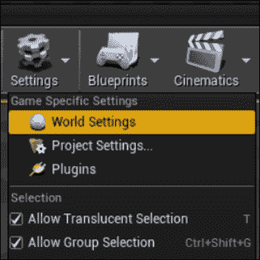

1.  在**世界设置**对话框中，从**游戏模式覆盖**列表中选择`CustomHUDGameMode`：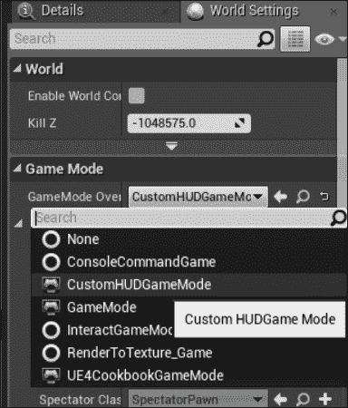

1.  播放并验证您的自定义 HUD 是否绘制到屏幕上：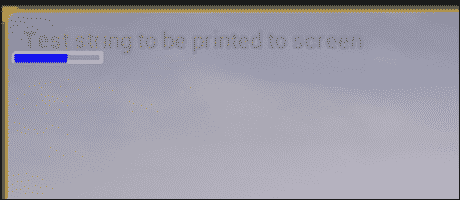

## 工作原理...

1.  这里的所有 UI 示例都将使用 Slate 进行绘制，因此我们需要在我们的模块和 Slate 框架之间添加依赖关系，以便我们可以访问在该模块中声明的类。

1.  将自定义 Canvas 绘制调用放入游戏 HUD 的最佳位置是在`AHUD`的子类中。

1.  为了告诉引擎使用我们的自定义子类，我们需要创建一个新的`GameMode`，并指定我们自定义类的类型。

1.  在自定义游戏模式的构造函数中，我们将新 HUD 类型的`UClass`分配给`HUDClass`变量。这个`UClass`在每个玩家控制器生成时传递给它们，并且控制器随后负责创建它创建的`AHUD`实例。

1.  由于我们的自定义`GameMode`加载了我们的自定义 HUD，我们需要实际创建所述的自定义 HUD 类。

1.  `AHUD`定义了一个名为`DrawHUD()`的虚函数，每帧调用该函数以允许我们向屏幕上绘制元素。

1.  因此，我们重写了该函数，并在实现内部执行绘制操作。

1.  首先使用的方法如下：

```cpp
floatDrawText(constUFont* InFont, constFString&InText, float X, float Y, float XScale = 1.f, float YScale = 1.f, constFFontRenderInfo&RenderInfo = FFontRenderInfo());
```

1.  `DrawText`需要一个字体来绘制。引擎代码中`stat`和其他 HUD 绘制命令使用的默认字体实际上存储在`GEngine`类中，并且可以使用`GetSmallFont`函数访问，该函数返回一个`UFont`的实例指针。

1.  我们使用的剩余参数是要渲染的实际文本以及应该绘制文本的像素偏移量。

1.  `DrawText`是一个允许您直接传入要显示的数据的函数。

1.  通用的`DrawItem`函数是一个访问者实现，允许您创建一个封装有关要绘制的对象的信息的对象，并在多个绘制调用中重用该对象。

1.  在本示例中，我们创建了一个用于表示进度条的元素。我们将关于框的宽度和高度的所需信息封装到一个`FCanvasBoxItem`中，然后将其传递给我们的 Canvas 上的`DrawItem`函数。

1.  我们绘制的第三个元素是一个填充的矩形。此函数使用在 HUD 类中定义的便利方法，而不是在 Canvas 本身上定义的方法。填充的矩形放置在与我们的`FCanvasBox`相同的位置，以便它可以表示进度条内的当前值。

# 将 Slate 小部件添加到屏幕上

之前的示例使用了`FCanvas` API 来绘制屏幕。然而，`FCanvas`有一些限制，例如，动画很难实现，绘制图形到屏幕上涉及创建纹理或材质。`FCanvas`还没有实现任何小部件或窗口控件，使得数据输入或其他形式的用户输入比必要的复杂。本示例将向您展示如何使用 Slate 开始在屏幕上创建 HUD 元素，Slate 提供了许多内置控件。

## 准备工作

如果您还没有这样做，请将`Slate`和`SlateCore`添加到您的模块依赖项中（有关如何执行此操作，请参见*使用 Canvas 进行绘制*的示例）。

## 操作步骤...

1.  创建一个名为`ACustomHUDPlayerController`的新的`PlayerController`子类。

1.  在你的新子类中重写`BeginPlay` `virtual`方法：

```cpp
public:
virtual void BeginPlay() override;
```

1.  在子类的实现中添加以下代码以覆盖`BeginPlay()`：

```cpp
void ACustomHUDPlayerController::BeginPlay()
{
  Super::BeginPlay();
  TSharedRef<SVerticalBox> widget = SNew(SVerticalBox)
  + SVerticalBox::Slot()
  .HAlign(HAlign_Center)
  .VAlign(VAlign_Center)
  [
    SNew(SButton)
    .Content()
    [
      SNew(STextBlock)
      .Text(FText::FromString(TEXT("Test button")))
    ]
  ];
  GEngine->GameViewport->AddViewportWidgetForPlayer(GetLocalPlayer(),widget, 1);
}
```

1.  如果您现在尝试编译，您将得到一些关于未定义类的错误。这是因为我们需要包含它们的头文件：

```cpp
#include "SlateBasics.h"
#include "SButton.h"
#include "STextBlock.h"
```

1.  创建一个名为`SlateHUDGameMode`的新的`GameMode`：

1.  在游戏模式中添加一个构造函数：

```cpp
ASlateHUDGameMode();
```

1.  使用以下代码实现构造函数：

```cpp
ASlateHUDGameMode::ASlateHUDGameMode()
:Super()
{
  PlayerControllerClass = ACustomHUDPlayerController::StaticClass();
}
```

1.  在实现文件中添加以下包含：

```cpp
#include "CustomHudPlayerController.h"
```

1.  在实现文件中添加包含后，编译游戏。

1.  在编辑器中，从工具栏打开**世界设置**：

1.  在**世界设置**中，覆盖关卡的游戏模式为我们的`SlateHUDGameMode`。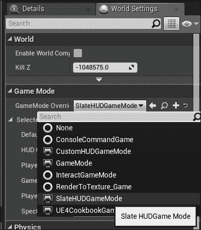

1.  播放关卡，看到新的 UI 显示在屏幕上：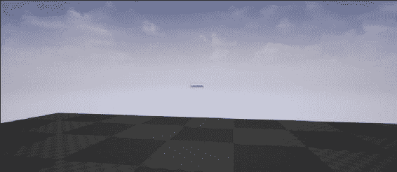

## 它是如何工作的...

1.  为了在我们的代码中引用 Slate 类或函数，我们的模块必须与`Slate`和`SlateCore`模块链接，因此我们将它们添加到模块依赖项中。

1.  我们需要在游戏运行时加载的类中实例化我们的 UI，因此在这个示例中，我们使用我们的自定义`PlayerController`在`BeginPlay`函数中作为创建 UI 的位置。

1.  在`BeginPlay`的实现中，我们使用`SNew`函数创建一个新的`SVerticalBox`。我们为我们的框添加一个小部件的插槽，并将该插槽设置为水平和垂直居中。

1.  在我们使用方括号访问的插槽内，我们创建一个内部有`Textblock`的按钮。

1.  在`Textblock`中，将`Text`属性设置为字符串字面值。

1.  现在创建了 UI，我们调用`AddViewportWidgetForPlayer`在本地玩家的屏幕上显示此小部件。

1.  准备好我们的自定义`PlayerController`后，现在我们需要创建一个自定义的`GameMode`来指定它应该使用我们的新`PlayerController`。

1.  在游戏开始时加载自定义的`PlayerController`，当调用`BeginPlay`时，我们的 UI 将显示出来。

1.  在这个屏幕尺寸下，UI 非常小。请参考下一个示例了解如何根据游戏窗口的分辨率进行适当的缩放。

# 为 UI 创建适应屏幕大小的缩放

如果您按照前面的示例操作，您会注意到当您使用**在编辑器中播放**时，加载的按钮非常小。

这是由 UI 缩放引起的，该系统允许您根据屏幕大小缩放用户界面。用户界面元素以像素表示，通常是绝对值（按钮应该是 10 个像素高）。

问题在于，如果您使用更高分辨率的面板，10 个像素可能会更小，因为每个像素的大小更小。

## 准备工作

虚幻引擎中的 UI 缩放系统允许您控制全局缩放修饰符，该修饰符将根据屏幕分辨率缩放屏幕上的所有控件。根据前面的示例，您可能希望调整按钮的大小，以便在较小的屏幕上查看 UI 时其表面大小保持不变。本示例演示了两种不同的方法来改变缩放率。

## 如何操作...

1.  创建一个自定义的`PlayerController`子类，将其命名为`ScalingUIPlayerController`。

1.  在该类中，覆盖`BeginPlay`：

```cpp
virtual void BeginPlay() override;
```

1.  在该函数的实现中添加以下代码：

```cpp
Super::BeginPlay();
TSharedRef<SVerticalBox> widget = SNew(SVerticalBox)
+ SVerticalBox::Slot()
.HAlign(HAlign_Center)
.VAlign(VAlign_Center)
[
  SNew(SButton)
  .Content()
  [
    SNew(STextBlock)
    .Text(FText::FromString(TEXT("Test button")))
  ]
];
GEngine->GameViewport->AddViewportWidgetForPlayer(GetLocalPlayer(), widget, 1);
```

1.  创建一个名为`ScalingUIGameMode`的新的`GameMode`子类，并给它一个默认构造函数：

```cpp
ScalingUIGameMode();
```

1.  在默认构造函数中，将默认的玩家控制器类设置为`ScalingUIPlayerController`：

```cpp
AScalingUIGameMode::AScalingUIGameMode()
:AGameMode()
{
  PlayerControllerClass = ACustomHUDPlayerController::StaticClass();
}
```

1.  这应该给您一个类似于前一个示例的用户界面。请注意，如果您在编辑器中播放，UI 会非常小：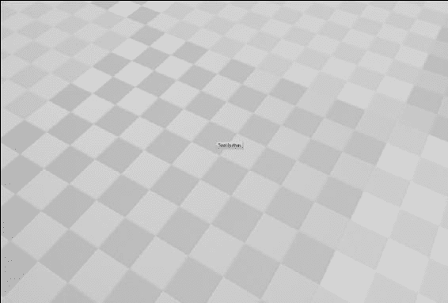

1.  要改变 UI 缩放的速率，我们需要改变缩放曲线。我们可以通过两种不同的方法来实现。

### 编辑器中的方法

1.  启动虚幻引擎，然后通过**编辑**菜单打开**项目设置**对话框：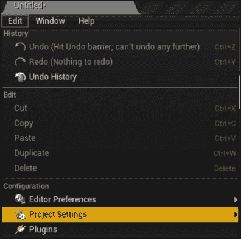

1.  在**用户界面**部分，有一个曲线可以根据屏幕的短边来改变 UI 缩放因子：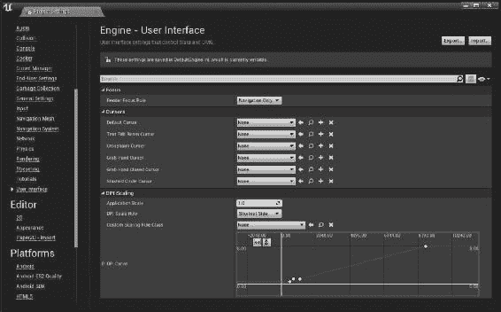

1.  点击图表上的第二个点或关键点。

1.  将其输出值更改为 1。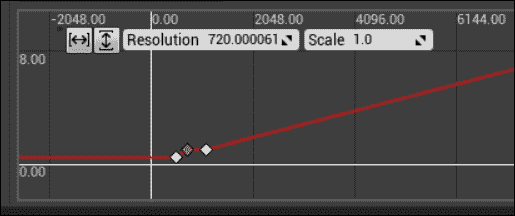

### 配置文件方法

1.  浏览到项目目录，并查看`Config`文件夹中的内容：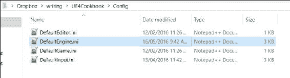

1.  在您选择的文本编辑器中打开`DefaultEngine.ini`。

1.  在`[/Script/Engine.UserInterfaceSettings]`部分中找到：

```cpp
[/Script/Engine.UserInterfaceSettings]
RenderFocusRule=NavigationOnly
DefaultCursor=None
TextEditBeamCursor=None
CrosshairsCursor=None
GrabHandCursor=None
GrabHandClosedCursor=None
SlashedCircleCursor=None
ApplicationScale=1.000000
UIScaleRule=ShortestSide
CustomScalingRuleClass=None
UIScaleCurve=(EditorCurveData=(PreInfinityExtrap=RCCE_Constant,PostInfinityExtrap=RCCE_Constant,Keys=((Time=480.000000,Value=0.444000),(Time=720.000000,Value=1.000000),(Time=1080.000000,Value=1.000000),(Time=8640.000000,Value=8.000000)),DefaultValue=340282346638528859811704183484516925440.000000),ExternalCurve=None)
```

1.  在该部分中查找名为`UIScaleCurve`的关键字。

1.  在该键的值中，您会注意到许多`(Time=x,Value=y)`对。编辑第二对，使其`Time`值为`720.000000`，`Value`为`1.000000`。

1.  如果您已经打开了编辑器，请重新启动编辑器。

1.  启动编辑器中的“Play In Editor”预览，以确认您的 UI 现在在**PIE**屏幕的分辨率下保持可读（假设您使用的是 1080p 显示器，因此 PIE 窗口以 720p 或类似分辨率运行）：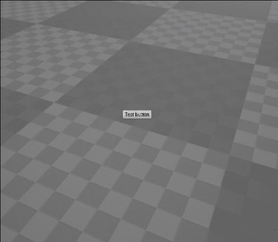

1.  如果您使用**新的编辑器窗口**预览游戏，还可以看到缩放是如何工作的。

1.  要这样做，请单击工具栏上**播放**右侧的箭头。

1.  选择**新的编辑器窗口**。

1.  在这个窗口中，您可以使用控制台命令`r.setreswidthxheight`来改变分辨率，并观察由此产生的变化。

## 工作原理...

1.  通常情况下，当我们想要使用自定义的`PlayerController`时，我们需要一个自定义的`GameMode`来指定使用哪个`PlayerController`。

1.  我们创建了一个自定义的`PlayerController`和`GameMode`，并在`PlayerController`的`BeginPlay`方法中放置了一些`Slate`代码，以便绘制一些 UI 元素。

1.  因为在 Unreal 编辑器中，主游戏视口通常非常小，所以 UI 最初以缩小的方式显示。

1.  这旨在使游戏 UI 在较小的分辨率显示器上占用更少的空间，但如果窗口没有被拉伸以适应全屏，可能会导致文本非常难以阅读。

1.  Unreal 存储应在会话之间保持的配置数据，但不一定硬编码到可执行文件中的配置文件中。

1.  配置文件使用扩展版本的`.ini`文件格式，这个格式通常用于 Windows 软件。

1.  配置文件使用以下语法存储数据：

```cpp
[Section Name]
Key=Value
```

1.  Unreal 有一个名为`UserInterfaceSettings`的类，其中有一个名为`UIScaleCurve`的属性。

1.  该`UPROPERTY`被标记为配置，因此 Unreal 将该值序列化到`.ini`文件中。

1.  结果，它将`UIScale`数据存储在`DefaultEngine.ini`文件的`Engine.UserInterfaceSettings`部分中。

1.  数据使用文本格式存储，其中包含一个关键点列表。编辑`Time`，`Value`对会改变或添加新的关键点到曲线中。

1.  **项目设置**对话框是直接编辑`.ini`文件的简单前端界面，对于设计师来说，这是一种直观的编辑曲线的方式。然而，将数据以文本形式存储允许程序员潜在地开发修改`UIScale`等属性的构建工具，而无需重新编译游戏。

1.  `Time`指的是输入值。在这种情况下，输入值是屏幕的较窄维度（通常是高度）。

1.  `Value`是应用于 UI 的通用缩放因子，当屏幕的较窄维度大约等于`Time`字段中的值的高度时。

1.  因此，要将 UI 设置为在 1280x720 分辨率下保持正常大小，请将时间/输入因子设置为 720，比例因子设置为 1。

## 另请参阅

+   您可以参考 UE4 文档以获取有关配置文件的更多信息

# 在游戏中显示和隐藏一组 UMG 元素

因此，我们已经讨论了如何将小部件添加到视口中，这意味着它将在玩家的屏幕上呈现。

然而，如果我们希望根据其他因素（例如与某些角色的接近程度、玩家按住某个键或者希望在指定时间后消失的 UI）切换 UI 元素，该怎么办呢？

## 如何操作...

1.  创建一个名为`ToggleHUDGameMode`的新`GameMode`类。

1.  覆盖`BeginPlay`和`EndPlay`。

1.  添加以下`UPROPERTY`：

```cpp
UPROPERTY()
FTimerHandle HUDToggleTimer;
```

1.  最后添加这个成员变量：

```cpp
TSharedPtr<SVerticalBox> widget;
```

1.  在方法体中使用以下代码实现`BeginPlay`：

```cpp
void AToggleHUDGameMode::BeginPlay()
{
  Super::BeginPlay();
  widget = SNew(SVerticalBox)
  + SVerticalBox::Slot()
  .HAlign(HAlign_Center)
  .VAlign(VAlign_Center)
  [
    SNew(SButton)
    .Content()
    [
      SNew(STextBlock)
      .Text(FText::FromString(TEXT("Test button")))
    ]
  ];
  GEngine->GameViewport->AddViewportWidgetForPlayer(GetWorld()->GetFirstLocalPlayerFromController(), widget.ToSharedRef(), 1);

  GetWorld()->GetTimerManager().SetTimer(HUDToggleTimer, FTimerDelegate::CreateLambda
  ([this] 
  {
    if (this->widget->GetVisibility().IsVisible())
    {
      this->widget->SetVisibility(EVisibility::Hidden);
    }
    else
    {
      this->widget->SetVisibility(EVisibility::Visible);
    }
  }), 5, true);
}
```

1.  实现`EndPlay`：

```cpp
void AToggleHUDGameMode::EndPlay(constEEndPlayReason::Type EndPlayReason)
{
  Super::EndPlay(EndPlayReason);
  GetWorld->GetTimerManager().ClearTimer(HUDToggleTimer);
}
```

1.  **编译**您的代码，并启动编辑器。

1.  在编辑器中，从工具栏打开**World Settings**：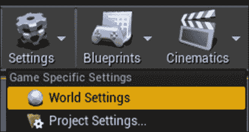

1.  在**World Settings**中，覆盖关卡的**Game Mode**为我们的`AToggleHUDGameMode`：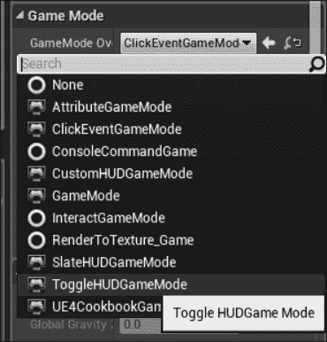

1.  玩游戏关卡，并验证 UI 每 5 秒切换可见性。

## 工作原理...

与本章中的大多数其他示例一样，我们使用自定义的`GameMode`类在玩家的视口上显示单人 UI 以方便操作：

1.  我们重写`BeginPlay`和`EndPlay`以便正确处理将为我们切换 UI 的计时器。

1.  为了实现这一点，我们需要将计时器的引用存储为`UPROPERTY`，以确保它不会被垃圾回收。

1.  在`BeginPlay`中，我们使用`SNew`宏创建一个新的`VerticalBox`，并将一个按钮放在其第一个槽中。

1.  按钮有`Content`，可以是其他小部件，如`SImage`或`STextBlock`。

1.  在这个示例中，我们将`STextBlock`放入`Content`槽中。文本块的内容不重要，只要足够长，我们就能正确看到按钮。

1.  在初始化小部件层次结构后，我们将根小部件添加到玩家的视口中，以便他们可以看到它。

1.  现在，我们设置一个计时器来切换小部件的可见性。我们使用计时器来简化这个示例，而不是实现用户输入和输入绑定，但原理是相同的。

1.  为此，我们获取游戏世界的引用和其关联的计时器管理器。

1.  有了计时器管理器，我们可以创建一个新的计时器。

1.  然而，我们需要实际指定计时器到期时要运行的代码。一种简单的方法是使用`lambda`函数来切换 hud 函数。

1.  `lambda`是匿名函数。将它们视为文字函数。

1.  要将`lambda`函数链接到计时器，我们需要创建一个`timer`委托。

1.  `FTimerDelegate::CreateLambda`函数旨在将`lambda`函数转换为委托，计时器可以在指定的间隔调用它。

1.  `lambda`需要从其包含对象（即我们的`GameMode`）访问`this`指针，以便它可以更改我们创建的小部件实例上的属性。

1.  为了给它所需的访问权限，我们在`lambda`声明中使用`[]`运算符，它将变量封装在`lambda`中，并在其中可访问。

1.  然后，花括号将函数体与普通函数声明的方式括起来。

1.  在函数内部，我们检查小部件是否可见。如果可见，则使用`SWidget::SetVisibility`隐藏它。

1.  如果小部件不可见，则使用相同的函数调用将其打开。

1.  在对`SetTimer`的其余调用中，我们指定调用计时器的间隔（以秒为单位），并设置计时器循环。

1.  但是，我们需要小心的是，在两个计时器调用之间，我们的对象可能被销毁，如果对我们的对象的引用被悬空，则可能导致崩溃。

1.  为了修复这个问题，我们需要移除计时器。

1.  鉴于我们在`BeginPlay`中设置了计时器，清除计时器在`EndPlay`中是有意义的。

1.  `EndPlay`将在`GameMode`结束游戏或被销毁时调用，因此我们可以在其实现期间安全地取消计时器。

1.  将`GameMode`设置为默认游戏模式后，UI 将在游戏开始播放时创建，并且计时器委托每 5 秒执行一次，以在小部件之间切换可见性。

1.  当你关闭游戏时，`EndPlay`会清除计时器引用，避免任何问题。

# 将函数调用附加到 Slate 事件

虽然创建按钮很好，但目前，无论用户点击它，屏幕上添加的任何 UI 元素都只是静静地存在。目前我们没有将事件处理程序附加到 Slate 元素，因此鼠标点击等事件实际上不会导致任何事情发生。

## 准备工作

此示例向您展示如何将函数附加到这些事件，以便在事件发生时运行自定义代码。

## 操作步骤...

1.  创建一个名为`AClickEventGameMode`的新的`GameMode`子类。

1.  将以下`private`成员添加到类中：

```cpp
private:
TSharedPtr<SVerticalBox> Widget;
TSharedPtr<STextBlock> ButtonLabel;
```

1.  添加以下`public`函数，注意`BeginPlay()`的重写：

```cpp
public:
virtual void BeginPlay() override;
FReplyButtonClicked();
```

1.  在`.cpp`文件中，添加`BeginPlay`的实现：

```cpp
void AClickEventGameMode::BeginPlay()
{
  Super::BeginPlay();
  Widget = SNew(SVerticalBox)
  + SVerticalBox::Slot()
  .HAlign(HAlign_Center)
  .VAlign(VAlign_Center)
  [
    SNew(SButton)
    .OnClicked(FOnClicked::CreateUObject(this, &AClickEventGameMode::ButtonClicked))
    .Content()
    [
      SAssignNew(ButtonLabel, STextBlock)
      .Text(FText::FromString(TEXT("Click me!")))
    ]
  ];
  GEngine->GameViewport->AddViewportWidgetForPlayer(GetWorld()->GetFirstLocalPlayerFromController(), Widget.ToSharedRef(), 1);
  GetWorld()->GetFirstPlayerController()->bShowMouseCursor = true;
  GEngine->GetFirstLocalPlayerController(GetWorld())->
  SetInputMode(FInputModeUIOnly().SetLockMouseToViewport(false).SetWidgetToFocus(Widget));
}
```

1.  还要为`ButtonClicked()`添加一个实现：

```cpp
FReplyAClickEventGameMode::ButtonClicked()
{
  ButtonLabel->SetText(FString(TEXT("Clicked!")));
  returnFReply::Handled();
}
```

1.  **编译**代码并启动编辑器。

1.  在**世界设置**中覆盖游戏模式为`AClickEventGameMode`：

1.  在编辑器中预览，并验证 UI 是否显示一个按钮，当您使用鼠标光标单击它时，按钮会从**Click Me!**更改为**Clicked!**。

## 工作原理...

1.  与本章中的大多数示例一样，我们使用`GameMode`来创建和显示 UI，以最小化需要创建的与示例目的无关的类的数量。

1.  在我们的新游戏模式中，我们需要保留对我们创建的 Slate 小部件的引用，以便在创建后与它们进行交互。

1.  因此，我们在`GameMode`中创建了两个共享指针作为成员数据，一个指向我们 UI 的整体父级或根部件，另一个指向我们按钮上的标签，因为我们将在运行时更改标签文本。

1.  我们重写`BeginPlay`，因为它是在游戏开始后创建 UI 的方便位置，并且我们将能够获得对玩家控制器的有效引用。

1.  我们还创建了一个名为`ButtonClicked`的函数。它返回`FReply`，一个指示是否处理了事件的`struct`。`ButtonClicked`的函数签名由我们将在下一步中使用的委托`FOnClicked`的签名确定。

1.  在我们的`BeginPlay`实现中，我们首先调用我们要重写的实现，以确保类适当地初始化。

1.  然后，像往常一样，我们使用`SNew`函数创建`VerticalBox`，并向其添加一个居中的插槽。

1.  我们在该插槽内创建一个新的`Button`，并向其添加一个值，该值包含在`OnClicked`属性中。

1.  `OnClicked`是一个委托属性。这意味着`Button`将在某个事件发生时广播`OnClicked`委托（正如在此示例中的名称所暗示的那样，当单击按钮时）。

1.  要订阅或监听委托，并在事件发生时收到通知，我们需要将委托实例分配给属性。

1.  我们可以使用标准的委托函数（如`CreateUObject`、`CreateStatic`或`CreateLambda`）来实现这一点。其中任何一个都可以工作 - 我们可以绑定`UObject`成员函数、静态函数、lambda 和其他函数。

### 注意

请查看第五章，*处理事件和委托*，了解更多关于委托的内容，以了解我们可以绑定到委托的其他类型的函数。

1.  `CreateUObject`期望一个指向类实例的指针，并且一个指向该类中定义的成员函数的指针来调用。

1.  该函数必须具有与委托的签名可转换的签名：

```cpp
/** The delegate to execute when the button is clicked */
FOnClickedOnClicked;
```

1.  如此所示，`OnClicked`委托类型为`FOnClicked` - 这就是为什么我们声明的`ButtonClicked`函数具有与`FOnClicked`相同的签名的原因。

1.  通过传入指向此对象实例的指针和要调用的函数的指针，当单击按钮时，引擎将在此特定对象实例上调用该函数。

1.  设置委托后，我们使用`Content()`函数，该函数返回对按钮应包含的任何内容的单个插槽的引用。

1.  然后，我们使用`SAssignNew`来创建我们按钮的标签，使用`TextBlock`小部件。

1.  `SAssignNew`很重要，因为它允许我们使用 Slate 的声明性语法，并且将变量分配给指向层次结构中特定子小部件的指针。

1.  `SAssignNew`的第一个参数是我们要将小部件存储在其中的变量，第二个参数是该小部件的类型。

1.  现在，`ButtonLabel`指向我们按钮的`TextBlock`，我们可以将其`Text`属性设置为静态字符串。

1.  最后，我们使用`AddViewportWidgetForPlayer`将小部件添加到玩家的视口中，该函数期望`LocalPlayer`作为参数添加小部件，小部件本身和深度值（较高的值在前面）。

1.  要获取`LocalPlayer`实例，我们假设我们在没有分屏的情况下运行，因此第一个玩家控制器将是唯一的控制器，即玩家的控制器。`GetFirstLocalPlayerFromController`函数是一个方便函数，它只是获取第一个玩家控制器，并返回其本地玩家对象。

1.  我们还需要将焦点放在小部件上，以便玩家可以点击它，并显示一个光标，以便玩家知道鼠标在屏幕上的位置。

1.  我们从上一步知道我们可以假设第一个本地玩家控制器是我们感兴趣的控制器，所以我们可以访问它并将其`ShowMouseCursor`变量更改为`true`。这将导致光标在屏幕上呈现。

1.  `SetInputMode`允许我们专注于一个小部件，以便玩家可以与其交互，以及其他与 UI 相关的功能，例如将鼠标锁定到游戏的视口。

1.  它使用一个`FInputMode`对象作为其唯一参数，我们可以使用`builder`模式构造具有我们希望包含的特定元素的对象。

1.  `FInputModeUIOnly`类是一个`FInputMode`子类，指定我们希望所有输入事件重定向到 UI 层，而不是玩家控制器和其他输入处理。

1.  `builder`模式允许我们在将对象实例作为参数发送到函数之前，链接方法调用以自定义对象实例。

1.  我们链式调用`SetLockMouseToViewport(false)`来指定玩家的鼠标可以离开游戏屏幕的边界，并使用`SetWidgetToFocus(Widget)`指定我们的顶级小部件作为游戏应该将玩家输入指向的小部件。

1.  最后，我们有了我们的实际实现`ButtonClicked`，我们的事件处理程序。

1.  当由于点击按钮而运行该函数时，我们将按钮的标签更改为指示它已被点击。

1.  然后，我们需要返回一个`FReply`的实例给调用者，以让 UI 框架知道事件已经被处理，并且不要继续向上传播事件。

1.  `FReply::Handled()`返回设置为指示给框架的`FReply`。

1.  我们本可以使用`FReply::Unhandled()`，但这将告诉框架点击事件实际上不是我们感兴趣的事件，它应该寻找其他可能对事件感兴趣的对象。

# 使用虚幻运动图形进行数据绑定

到目前为止，我们一直将静态值分配给 UI 小部件的属性。然而，如果我们想要在小部件内容或参数（如边框颜色）方面更加动态，怎么办？我们可以使用一个称为数据绑定的原则，将我们的 UI 的属性与更广泛的程序中的变量动态链接起来。

虚幻使用属性系统允许我们将属性的值绑定到函数的返回值，例如。这意味着更改这些变量将自动导致 UI 根据我们的意愿进行更改。

## 如何做到...

1.  创建一个名为`AAtributeGameMode`的新的`GameMode`子类。

1.  将以下`private`成员添加到类中：

```cpp
private:
TSharedPtr<SVerticalBox> Widget;
```

1.  添加以下`public`函数，注意`BeginPlay()`的重写：

```cpp
public:
virtual void BeginPlay() override;
FTextGetButtonLabel() const ;
```

1.  在`.cpp`文件中添加`BeginPlay`的实现：

```cpp
voidAClickEventGameMode::BeginPlay()
{
  Super::BeginPlay();
  Widget = SNew(SVerticalBox)
  + SVerticalBox::Slot()
  .HAlign(HAlign_Center)
  .VAlign(VAlign_Center)
  [
    SNew(SButton)
    .Content()
    [
      SNew(STextBlock)
      .Text( TAttribute<FText>::Create(TAttribute<FText>::FGetter::CreateUObject(this, &AAttributeGameMode::GetButtonLabel)))
    ]
  ];
  GEngine->GameViewport->AddViewportWidgetForPlayer(GetWorld()->GetFirstLocalPlayerFromController(), Widget.ToSharedRef(), 1);
}
```

1.  还要为`GetButtonLabel()`添加一个实现：

```cpp
FTextAAttributeGameMode::GetButtonLabel() const
{
  FVectorActorLocation = GetWorld()->GetFirstPlayerController()->GetPawn()->GetActorLocation();
  returnFText::FromString(FString::Printf(TEXT("%f, %f, %f"), ActorLocation.X, ActorLocation.Y, ActorLocation.Z));
}
```

1.  编译你的代码，并启动编辑器。

1.  在**世界设置**中覆盖游戏模式为`AAtributeGameMode`。

1.  请注意，在编辑器中播放时，UI 按钮上的值会随着玩家在场景中移动而改变。

## 工作原理...

1.  就像本章中几乎所有其他示例一样，我们首先需要创建一个游戏模式作为我们 UI 的方便宿主。我们以与其他示例相同的方式创建 UI，通过将`Slate`代码放在游戏模式的`BeginPlay()`方法中。

1.  这个示例的有趣之处在于我们如何设置按钮的标签文本的值：

```cpp
.Text( TAttribute<FText>::Create(TAttribute<FText>::FGetter::CreateUObject(this, &AAttributeGameMode::GetButtonLabel)))
```

1.  前面的语法非常冗长，但实际上它所做的事情相对简单。我们将某个值赋给`Text`属性，该属性的类型是`FText`。我们可以将`TAttribute<FText>`赋给该属性，每当 UI 想要确保`Text`的值是最新的时候，`TAttribute Get()`方法就会被调用。

1.  要创建`TAttribute`，我们需要调用静态的`TAttribute<VariableType>::Create()`方法。

1.  该函数期望一个委托的某种描述。根据传递给`TAttribute::Create`的委托类型，`TAttribute::Get()`调用不同类型的函数来检索实际值。

1.  在这个示例的代码中，我们调用了`UObject`的一个成员函数。这意味着我们知道我们将在某个委托类型上调用`CreateUObject`函数。

### 请注意

我们可以使用`CreateLambda`、`CreateStatic`或`CreateRaw`来分别在原始的 C++类上调用`lambda`、`static`或`member`函数。这将为我们提供属性的当前值。

1.  但是我们想要创建哪种委托类型的实例呢？因为我们在实际变量类型上对`TAttribute`类进行了模板化，所以我们需要一个委托，该委托的返回值也是以变量类型为模板的。

1.  也就是说，如果我们有`TAttribute<FText>`，与之连接的委托需要返回一个`FText`。

1.  我们在`TAttribute`中有以下代码：

```cpp
template<typenameObjectType>
classTAttribute
{
  public:
  /**
   * Attribute 'getter' delegate
   *
   * ObjectTypeGetValue() const
   *
   * @return The attribute's value
   */
  DECLARE_DELEGATE_RetVal(ObjectType, FGetter);
  (…)
}
```

1.  `FGetter`委托类型在`TAttribute`类内声明，因此它的返回值可以在`TAttribute`模板的`ObjectType`参数上进行模板化。

1.  这意味着`TAttribute<Typename>::FGetter`自动定义了一个具有正确返回类型`Typename`的委托。

1.  因此，我们需要创建一个类型和签名为`TAttribute<FText>::FGetter`的`UObject`绑定的委托。

1.  一旦我们有了那个委托，我们就可以在委托上调用`TAttribute::Create`，将委托的返回值与我们的`TextBlock`成员变量`Text`关联起来。

1.  在定义了我们的 UI 并将`Text`属性、`TAttribute<FText>`和返回`FText`的委托绑定之后，我们现在可以将 UI 添加到玩家的屏幕上，以便它可见。

1.  每一帧，游戏引擎都会检查所有属性，看它们是否与`TAttributes`相关联。

1.  如果存在连接，则调用`TAttribute`的`Get()`函数，调用委托，并返回委托的返回值，以便 Slate 可以将其存储在小部件的相应成员变量中。

1.  在我们演示这个过程时，`GetButtonLabel`检索游戏世界中第一个玩家角色的位置。

1.  然后我们使用`FString::Printf`将位置数据格式化为可读的字符串，并将其包装在`FText`中，以便将其存储为`TextBlock`的文本值。

# 使用样式控制小部件的外观

到目前为止，在本章中，我们一直在创建使用默认可视化表示的 UI 元素。本示例向您展示了如何在 C++中创建一个可以在整个项目中用作常见外观的样式。

## 操作步骤如下：

1.  在你的项目中创建一个新的类头文件。将文件命名为`"CookbookStyle.h"`。

1.  将以下代码添加到文件中：

```cpp
#pragma once
#include "SlateBasics.h"
#include "SlateExtras.h"
classFCookbookStyle
{
  public:
  static void Initialize();
  static void Shutdown();
  static void ReloadTextures();
  staticconstISlateStyle& Get();
  staticFNameGetStyleSetName();
  private:
  staticTSharedRef<class FSlateStyleSet> Create();
  private:
  staticTSharedPtr<class FSlateStyleSet>CookbookStyleInstance;
};
```

1.  为这个类创建一个相应的实现 cpp 文件，并将以下代码添加到其中：

```cpp
#include "UE4Cookbook.h"
#include "CookbookStyle.h"
#include "SlateGameResources.h"
TSharedPtr<FSlateStyleSet>FCookbookStyle::CookbookStyleInstance = NULL;
voidFCookbookStyle::Initialize()
{
  if (!CookbookStyleInstance.IsValid())
  {
    CookbookStyleInstance = Create();
    FSlateStyleRegistry::RegisterSlateStyle(*CookbookStyleInstance);
  }
}

voidFCookbookStyle::Shutdown()
{
  FSlateStyleRegistry::UnRegisterSlateStyle(*CookbookStyleInstance);
  ensure(CookbookStyleInstance.IsUnique());
  CookbookStyleInstance.Reset();
}
FNameFCookbookStyle::GetStyleSetName()
{
  staticFNameStyleSetName(TEXT("CookbookStyle"));
  returnStyleSetName;
}
#define IMAGE_BRUSH(RelativePath, ... ) FSlateImageBrush( FPaths::GameContentDir() / "Slate"/ RelativePath + TEXT(".png"), __VA_ARGS__ )
#define BOX_BRUSH(RelativePath, ... ) FSlateBoxBrush( FPaths::GameContentDir() / "Slate"/ RelativePath + TEXT(".png"), __VA_ARGS__ )
#define BORDER_BRUSH(RelativePath, ... ) FSlateBorderBrush( FPaths::GameContentDir() / "Slate"/ RelativePath + TEXT(".png"), __VA_ARGS__ )
#define TTF_FONT(RelativePath, ... ) FSlateFontInfo( FPaths::GameContentDir() / "Slate"/ RelativePath + TEXT(".ttf"), __VA_ARGS__ )
#define OTF_FONT(RelativePath, ... ) FSlateFontInfo( FPaths::GameContentDir() / "Slate"/ RelativePath + TEXT(".otf"), __VA_ARGS__ )

TSharedRef<FSlateStyleSet>FCookbookStyle::Create()
{
  TSharedRef<FSlateStyleSet>StyleRef = FSlateGameResources::New(FCookbookStyle::GetStyleSetName(), "/Game/Slate", "/Game/Slate");
  FSlateStyleSet& Style = StyleRef.Get();
  Style.Set("NormalButtonBrush", 
  FButtonStyle().
  SetNormal(BOX_BRUSH("Button", FVector2D(54,54),FMargin(14.0f/54.0f))));
  Style.Set("NormalButtonText",
  FTextBlockStyle(FTextBlockStyle::GetDefault())
  .SetColorAndOpacity(FSlateColor(FLinearColor(1,1,1,1))));
  returnStyleRef;
}
#undef IMAGE_BRUSH
#undef BOX_BRUSH
#undef BORDER_BRUSH
#undef TTF_FONT
#undef OTF_FONT

voidFCookbookStyle::ReloadTextures()
{
  FSlateApplication::Get().GetRenderer()->ReloadTextureResources();
}
constISlateStyle&FCookbookStyle::Get()
{
  return *CookbookStyleInstance;
}
```

1.  创建一个新的游戏模式子类`StyledHUDGameMode`，并将以下代码添加到其声明中：

```cpp
#pragma once
#include "GameFramework/GameMode.h"
#include "StyledHUDGameMode.generated.h"
/**
 * 
 */
UCLASS()
class UE4COOKBOOK_API AStyledHUDGameMode : public AGameMode
{
  GENERATED_BODY()
  TSharedPtr<SVerticalBox> Widget;
  public:
  virtual void BeginPlay() override;
};
```

1.  同样，实现`GameMode`：

```cpp
#include "UE4Cookbook.h"
#include "CookbookStyle.h"
#include "StyledHUDGameMode.h"
voidAStyledHUDGameMode::BeginPlay()
{
  Super::BeginPlay();
  Widget = SNew(SVerticalBox)
  + SVerticalBox::Slot()
  .HAlign(HAlign_Center)
  .VAlign(VAlign_Center)
  [
    SNew(SButton)
    .ButtonStyle(FCookbookStyle::Get(), "NormalButtonBrush")
    .ContentPadding(FMargin(16))
    .Content()
    [
      SNew(STextBlock)
      .TextStyle(FCookbookStyle::Get(), "NormalButtonText")
      .Text(FText::FromString("Styled Button"))
    ]
  ];
  GEngine->GameViewport->AddViewportWidgetForPlayer(GetWorld()->GetFirstLocalPlayerFromController(), Widget.ToSharedRef(), 1);
}
```

1.  最后，创建一个 54x54 像素的 png 文件，周围有一个边框用于我们的按钮。将其保存到`Content`|`Slate`文件夹中，名称为`Button.png`：！如何做...！如何做...

1.  最后，我们需要设置我们的游戏模块以在加载时正确初始化样式。在游戏模块的实现文件中，确保它看起来像这样：

```cpp
class UE4CookbookGameModule : public FDefaultGameModuleImpl
{
  virtual void StartupModule() override
  {
    FCookbookStyle::Initialize();
  };
  virtual void ShutdownModule() override
  {
    FCookbookStyle::Shutdown();
  };
};
```

1.  **编译**代码，并将游戏模式覆盖设置为本章中所做的其他示例中的新游戏模式。

1.  当你玩游戏时，你会看到你的自定义边框在按钮周围，并且文本是白色而不是黑色。！如何做...

## 它的工作原理是...

1.  为了创建可以在多个 Slate 小部件之间共享的样式，我们需要创建一个对象来包含这些样式并使它们保持在范围内。

1.  Epic 为此提供了`FSlateStyleSet`类。FSlateStyleSet 包含了许多样式，我们可以在 Slate 的声明语法中访问这些样式来为小部件设置皮肤。

1.  然而，将我们的`StyleSet`对象的多个副本散布在程序中是低效的。我们实际上只需要一个这样的对象。

1.  因为`FSlateStyleSet`本身不是一个单例，也就是说，一个只能有一个实例的对象，我们需要创建一个管理我们的`StyleSet`对象并确保我们只有一个实例的类。

1.  这就是为什么我们有`FCookbookStyle`类的原因。

1.  它包含一个`Initialize()`函数，我们将在模块的启动代码中调用它。

1.  在`Initialize()`函数中，我们检查是否有我们的`StyleSet`的实例。

1.  如果我们没有一个有效的实例，我们调用私有的`Create()`函数来实例化一个。

1.  然后，我们使用`FSlateStyleRegistry`类注册样式。

1.  当我们的模块被卸载时，我们需要撤销这个注册过程，然后擦除指针，以防止其悬空。

1.  现在，我们有了一个类的实例，在模块初始化时通过调用`Create()`来创建。

1.  您会注意到，`Create`被一些具有相似形式的宏包围。

1.  这些宏在函数之前定义，在函数之后取消定义。

1.  这些宏使我们能够通过消除我们的样式可能需要使用的所有图像资源的路径和扩展名来简化`Create`函数中所需的代码。

1.  在`Create`函数内部，我们使用函数`FSlateGameResources::New()`创建一个新的`FSlateStyleSet`对象。

1.  `New()`需要一个样式的名称，以及我们想要在这个样式集中搜索的文件夹路径。

1.  这使我们能够声明多个指向不同目录的样式集，但使用相同的图像名称。它还允许我们通过切换到其他基本目录中的样式集来简单地为整个 UI 设置皮肤或重新设置样式。

1.  `New()`返回一个共享引用对象，所以我们使用`Get()`函数检索实际的`FStyleSet`实例。

1.  有了这个引用，我们可以创建我们想要的样式集。

1.  要将样式添加到集合中，我们使用`Set()`方法。

1.  Set 期望样式的名称，然后是一个样式对象。

1.  可以使用`builder`模式自定义样式对象。

1.  我们首先添加一个名为`"NormalButtonBrush"`的样式。名称可以任意选择。

1.  因为我们想要使用这个样式来改变按钮的外观，所以我们需要使用第二个参数`FButtonStyle`。

1.  为了根据我们的要求自定义样式，我们使用 Slate 构建器语法，链接我们需要在样式上设置属性的任何方法调用。

1.  对于这个样式集中的第一个样式，我们只是在按钮没有被点击或处于非默认状态时改变其外观。

1.  这意味着我们希望在按钮处于正常状态时更改使用的画刷，因此我们使用的函数是`SetNormal()`。

1.  使用`BOX_BRUSH`宏，我们告诉 Slate 我们要使用`Button.png`，这是一个 54x54 像素大小的图像，并且我们要保持每个角的 14 像素不拉伸，以用于九切片缩放。

### 提示

要更直观地了解九切片缩放功能，请查看引擎源代码中的`SlateBoxBrush.h`。

1.  在我们的样式集中的第二个样式中，我们创建了一个名为`"NormalButtonText"`的样式。对于这个样式，我们不想改变样式中的所有默认值，我们只想改变一个属性。

1.  结果，我们访问默认的文本样式，并使用拷贝构造函数进行克隆。

1.  使用我们的默认样式的新副本后，我们将文本的颜色更改为白色，首先创建一个线性颜色 R=1 G=1 B=1 A=1，然后将其转换为 Slate 颜色对象。

1.  配置了我们的样式集并使用我们的两个新样式，然后我们可以将其返回给调用函数`Initialize`。

1.  `Initialize`存储了我们的样式集引用，并消除了我们创建进一步实例的需要。

1.  我们的样式容器类还有一个`Get()`函数，用于检索用于 Slate 的实际`StyleSet`。

1.  因为`Initialize()`已经在模块启动时被调用，所以`Get()`只是返回在该函数内创建的`StyleSet`实例。

1.  在游戏模块中，我们添加了实际调用`Initialize`和`Shutdown`的代码。这确保了在我们的模块加载时，我们始终有一个有效的 Slate 样式引用。

1.  与往常一样，我们创建一个游戏模式作为我们 UI 的主机，并重写`BeginPlay`以便在游戏开始时创建 UI。

1.  创建 UI 的语法与我们在之前的示例中使用的完全相同-使用`SNew`创建`VerticalBox`，然后使用 Slate 的声明性语法填充该框中的其他小部件。

1.  重要的是注意以下两行：

```cpp
.ButtonStyle(FCookbookStyle::Get(), "NormalButtonBrush")
.TextStyle(FCookbookStyle::Get(), "NormalButtonText")
```

1.  上述行是我们按钮的声明性语法的一部分，以及作为其标签的文本。

1.  当我们使用`<Class>Style()`方法为我们的小部件设置样式时，我们传入两个参数。

1.  第一个参数是我们实际的样式集，使用`FCookbookStyle::Get()`检索，第二个参数是一个字符串参数，其中包含我们要使用的样式的名称。

1.  通过这些小改动，我们重写了小部件的样式，以使用我们的自定义样式，这样当我们将小部件添加到播放器的视口时，它们会显示我们的自定义内容。

# 创建自定义的 SWidget/UWidget

到目前为止，本章的示例已经向您展示了如何使用现有的基本小部件创建 UI。

有时，开发人员使用组合来方便地将多个 UI 元素收集在一起，例如，定义一个按钮类，自动具有`TextBlock`作为标签，而不是每次手动指定层次结构。

此外，如果您在 C++中手动指定层次结构，而不是声明由子小部件组成的复合对象，您将无法使用 UMG 将这些小部件作为一组实例化。

## 准备工作

本示例向您展示了如何创建一个复合的`SWidget`，其中包含一组小部件，并公开新属性以控制这些子小部件的元素。它还将向您展示如何创建一个`UWidget`包装器，该包装器将新的复合`SWidget`类公开给 UMG 供设计师使用。

## 操作步骤如下：

1.  我们需要将 UMG 模块添加到我们模块的依赖项中。

1.  打开`<YourModule>.build.cs`，并将 UMG 添加到以下位置：

```cpp
PrivateDependencyModuleNames.AddRange(new string[] { "Slate", "SlateCore", "UMG" });
```

1.  创建一个名为`CustomButton`的新类，并将以下代码添加到其声明中：

```cpp
#pragma once
#include "SCompoundWidget.h"
class UE4COOKBOOK_API SCustomButton : public SCompoundWidget
{
  SLATE_BEGIN_ARGS(SCustomButton)
  : _Label(TEXT("Default Value"))
  , _ButtonClicked()
  {}
  SLATE_ATTRIBUTE(FString, Label)
  SLATE_EVENT(FOnClicked, ButtonClicked)
  SLATE_END_ARGS()
  public:
  void Construct(constFArguments&InArgs);
  TAttribute<FString> Label;
  FOnClickedButtonClicked;
};
```

1.  在相应的 cpp 文件中实现以下类：

```cpp
#include "UE4Cookbook.h"
#include "CustomButton.h"
voidSCustomButton::Construct(constFArguments&InArgs)
{
  Label = InArgs._Label;
  ButtonClicked = InArgs._ButtonClicked;
  ChildSlot.VAlign(VAlign_Center)
  .HAlign(HAlign_Center)
  [SNew(SButton)
  .OnClicked(ButtonClicked)
  .Content()
  [
  SNew(STextBlock)
  .Text_Lambda([this] {return FText::FromString(Label.Get()); })
  ]
  ];
}
```

1.  创建第二个类，这次基于`UWidget`，名为`UCustomButtonWidget`。

1.  添加以下包含：

```cpp
#include "Components/Widget.h"
#include "CustomButton.h"
#include "SlateDelegates.h"
```

1.  在类声明之前声明以下委托：

```cpp
DECLARE_DYNAMIC_DELEGATE_RetVal(FString, FGetString);
DECLARE_DYNAMIC_MULTICAST_DELEGATE(FButtonClicked);
```

1.  添加以下受保护成员：

```cpp
protected:
TSharedPtr<SCustomButton>MyButton;
virtualTSharedRef<SWidget>RebuildWidget() override;
```

1.  还添加以下公共成员：

```cpp
public:
UCustomButtonWidget();
UPROPERTY(BlueprintAssignable)
FButtonClickedButtonClicked;
FReplyOnButtonClicked();
UPROPERTY(BlueprintReadWrite, EditAnywhere)
FString Label;
UPROPERTY()
FGetStringLabelDelegate;
virtual void SynchronizeProperties() override;
```

1.  现在创建`UCustomButtonWidget`的实现：

```cpp
#include "UE4Cookbook.h"
#include "CustomButtonWidget.h"
TSharedRef<SWidget>UCustomButtonWidget::RebuildWidget()
{
  MyButton = SNew(SCustomButton)
  .ButtonClicked(BIND_UOBJECT_DELEGATE(FOnClicked, OnButtonClicked));
  returnMyButton.ToSharedRef();
}
UCustomButtonWidget::UCustomButtonWidget()
:Label(TEXT("Default Value"))
{
}

FReplyUCustomButtonWidget::OnButtonClicked()
{
  ButtonClicked.Broadcast();
  returnFReply::Handled();
}
voidUCustomButtonWidget::SynchronizeProperties()
{
  Super::SynchronizeProperties();
  TAttribute<FString>LabelBinding = OPTIONAL_BINDING(FString, Label);
  MyButton->Label = LabelBinding;
}
```

1.  通过右键单击**内容浏览器**，选择**用户界面**，然后选择**小部件蓝图**来创建一个新的小部件蓝图：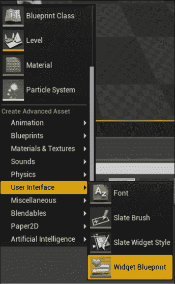

1.  通过双击打开您的新**小部件蓝图**。

1.  在小部件面板中找到**自定义按钮小部件**：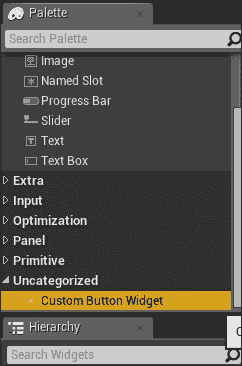

1.  将其拖动到主区域中的一个实例。

1.  选择实例后，在**详细信息**面板中更改**标签**属性：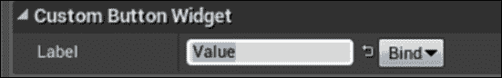

1.  验证您的按钮是否已更改其标签。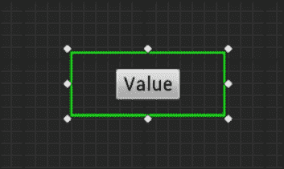

1.  现在我们将创建一个绑定，以证明我们可以将任意蓝图函数链接到小部件上的标签属性，从而驱动小部件的文本块标签。

1.  点击**标签**属性右侧的**绑定**，然后选择**创建绑定**：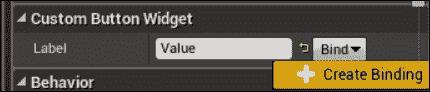

1.  在现在显示的图表中，放置一个**获取游戏时间（以秒为单位）**节点：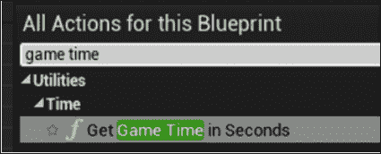

1.  将获取游戏时间节点的返回值链接到函数中的**返回值**引脚：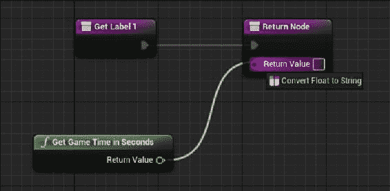

1.  将自动为您插入一个将浮点数转换为字符串的节点：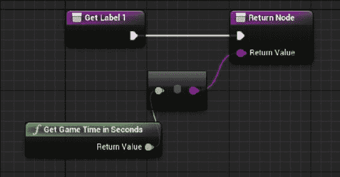

1.  接下来，通过单击任务栏上的**蓝图**按钮，然后选择**打开关卡蓝图**来打开**关卡蓝图**：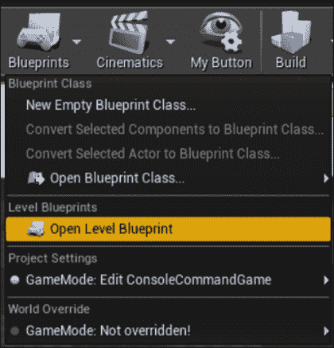

1.  将构造小部件节点放入图表中：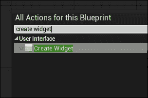

1.  选择要生成的小部件类作为我们刚刚在编辑器中创建的新小部件蓝图：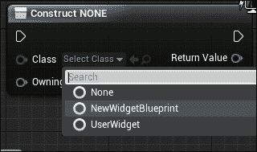

1.  从创建小部件节点上的“拥有玩家”引脚上点击并拖动，然后放置一个“获取玩家控制器”节点：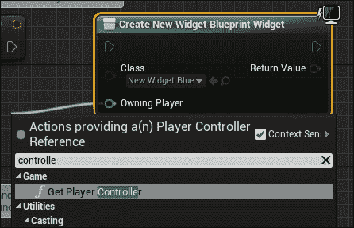

1.  同样，从创建小部件节点的返回值上点击并拖动，然后放置一个“添加到视口”节点：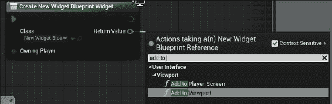

1.  最后，将`BeginPlay`节点链接到创建小部件节点上的执行引脚。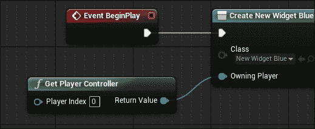

1.  预览游戏，并验证我们在屏幕上显示的小部件是我们的新自定义按钮，其标签绑定到游戏开始后经过的秒数：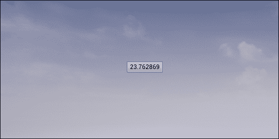

## 工作原理...

1.  为了使用`UWidget`类，我们的模块需要将 UMG 模块作为其依赖项之一，因为`UWidget`在 UMG 模块内定义。

1.  然而，我们需要创建的第一个类是我们实际的`SWidget`类。

1.  因为我们想要将两个小部件聚合到一个复合结构中，所以我们将我们的新小部件创建为`CompoundWidget`子类。

1.  `CompoundWidget`允许您将小部件层次结构封装为小部件本身。

1.  在类内部，我们使用`SLATE_BEGIN_ARGS`和`SLATE_END_ARGS`宏在我们的新`SWidget`上声明一个名为`FArguments`的内部结构。

1.  在`SLATE_BEGIN_ARGS`和`SLATE_END_ARGS`之间，使用了`SLATE_ATTRIBUTE`和`SLATE_EVENT`宏。

1.  `SLATE_ATTRIBUTE`为我们提供的类型创建`TAttribute`。

1.  在这个类中，我们声明了一个名为`_Label`的`TAttribute`，更具体地说，它是一个`TAttribute<FString>`。

1.  `SLATE_EVENT`允许我们创建成员委托，当小部件内部发生某些事情时可以广播。

1.  在`SCustomButton`中，我们声明了一个具有`FOnClicked`签名的委托，名为`ButtonClicked`。

1.  `SLATE_ARGUMENT`是另一个宏，在本示例中未使用，它创建一个带有您提供的类型和名称的内部变量，并在变量名前面添加下划线。

1.  `Construct()`是小部件在实例化时实现的自我初始化函数。

1.  您会注意到我们还创建了一个没有下划线的`TAttribute`和`FOnClicked`实例，这些是我们对象的实际属性，之前声明的参数将被复制到其中。

1.  在`Construct`的实现中，我们检索传递给我们的参数，并将它们存储在此实例的实际成员变量中。

1.  我们根据传入的内容分配`Label`和`ButtonClicked`，然后实际创建我们的小部件层次结构。

1.  我们使用与通常相同的语法，但需要注意的是，我们使用`Text_Lambda`来设置内部文本块的文本值。

1.  我们使用`lambda`函数使用`Get()`来检索我们的`Label` `TAttribute`的值，然后将其转换为`FText`，并将其存储为我们文本块的`Text`属性。

1.  现在我们已经声明了我们的`SWidget`，我们需要创建一个包装器`UWidget`对象，将这个小部件暴露给 UMG 系统，以便设计师可以在**所见即所得**编辑器中使用该小部件。

1.  这个类将被称为`UCustomButtonWidget`，它继承自`UWidget`而不是`SWidget`。

1.  `UWidget`对象需要引用它拥有的实际`SWidget`，所以我们在类中放置了一个受保护的成员，将其存储为共享指针。

1.  声明了一个构造函数，还声明了一个可以在蓝图中设置的`ButtonClicked`委托。我们还镜像了一个被标记为`BlueprintReadWrite`的`Label`属性，以便可以在 UMG 编辑器中设置它。

1.  因为我们希望能够将按钮的标签绑定到一个委托上，所以我们添加了最后一个成员变量，这是一个返回`String`的委托。

1.  `SynchronizeProperties`函数将在我们链接的`SWidget`上应用在`UWidget`类中被镜像的属性。

1.  `RebuildWidget`重新构建与此`UWidget`关联的本地小部件。它使用`SNew`来构造我们的`SCustomButton`小部件的实例，并使用 Slate 声明语法将 UWidget 的`OnButtonClicked`方法绑定到本地小部件内部的`ButtonClicked`委托。

1.  这意味着当本地小部件被点击时，`UWidget`将通过调用`OnButtonClicked`来接收通知。

1.  `OnButtonClicked`通过 UWidget 的`ButtonClicked`委托重新广播来自本地按钮的点击事件。

1.  这意味着 UObjects 和 UMG 系统可以在没有对本地按钮小部件的引用的情况下被通知到按钮被点击的事件。我们可以绑定到`UCustomButtonWidget::ButtonClicked`来接收通知。

1.  `OnButtonClicked`然后返回`FReply::Handled()`，表示事件不需要进一步传播。

1.  在`SynchronizeProperties`中，我们调用父类的方法，以确保父类中的任何属性也能正确同步。

1.  我们使用`OPTIONAL_BINDING`宏将我们`UWidget`类中的`LabelDelegate`委托与`TAttribute`和本地按钮的标签进行关联。重要的是要注意，`OPTIONAL_BINDING`宏期望委托被称为`NameDelegate`，基于宏的第二个参数。

1.  `OPTIONAL_BINDING`允许通过 UMG 进行的绑定覆盖值，但前提是 UMG 绑定是有效的。

1.  这意味着当`UWidget`被告知更新自身时，例如，因为用户在 UMG 中的**详细信息**面板中自定义了一个值，它将在必要时重新创建本地`SWidget`，然后通过`SynchronizeProperties`复制在蓝图/UMG 中设置的值，以确保一切正常工作。
