# 第十章：控制 NPC 的 AI

在游戏中，"人工智能"（AI）的角色非常重要。在本章中，我们将介绍以下用于控制 NPC 角色的 AI 的配方：

+   放置导航网格

+   遵循行为

+   将行为树连接到角色

+   构建任务节点

+   使用装饰器进行条件判断

+   使用周期性服务

+   使用复合节点-选择器、序列和简单并行

+   近战攻击者的 AI

# 介绍

AI 包括游戏的 NPC 以及玩家行为的许多方面。AI 的一般主题包括寻路和 NPC 行为。通常，我们将 NPC 在游戏中的一段时间内所做的选择称为行为。

UE4 中的 AI 得到了很好的支持。编辑器内部提供了许多构造，允许进行基本的 AI 编程。如果引擎内提供的 AI 不符合您的需求，还可以使用 C++进行自定义 AI 编程。

# 放置导航网格

导航网格（也称为"Nav Mesh"）基本上是 AI 控制单位认为可通过的区域的定义（即，"AI 控制"单位被允许进入或穿越的区域）。导航网格不包括如果玩家试图穿过它移动的几何体。

## 准备就绪

根据场景的几何形状构建导航网格在 UE4 中相当简单。从一些障碍物周围开始，或者使用一个地形。

## 如何做到这一点...

要构建导航网格，只需执行以下步骤：

1.  转到"模式" | "体积"。

1.  将导航网格边界体拖放到视口中。

### 提示

按下 P 键查看您的导航网格。

1.  将导航网格的范围扩大到允许使用导航网格的角色可以导航和路径规划的区域。

## 它是如何工作的...

导航网格不会阻止玩家角色（或其他实体）踩在特定的几何体上，但它可以指导 AI 控制的实体在哪里可以去，哪里不能去。

# 遵循行为

最基本的 AI 控制跟随行为可以作为一个简单的函数节点使用。您只需要执行以下步骤，就可以让一个 AI 控制的单位跟随一个单位或对象。

## 准备就绪

准备一个 UE4 项目，其中包含一个简单的地形或一组地形-理想情况下，地形中有一个"死胡同"，用于测试 AI 移动功能。在这个地形上创建一个导航网格，以便"AIMoveTo"函数可以按照前面的配方描述的方式工作。

## 如何做到这一点...

1.  根据前面的步骤，为您的关卡几何体创建一个导航网格，即"放置导航网格"中所述。

1.  通过在"类查看器"中找到"Character"类，右键单击它，并选择"创建蓝图类..."，创建一个从"Character"派生的蓝图类。

1.  将您的蓝图类命名为"BP_Follower"。

1.  双击"BP_Follower"类以编辑其蓝图。

1.  在"Tick"事件中，添加一个"AIMoveTo"节点，该节点向玩家角色（或任何其他单位）移动，如下所示：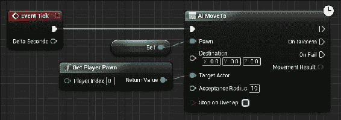

## 它是如何工作的...

如果有可用的导航网格，"AIMoveTo"节点将自动使用导航网格。如果没有可用的导航网格，NPC 单位将不会移动。

## 还有更多...

如果您不希望单位使用导航网格进行路径规划移动，只需使用"移动到位置或角色"节点即可。

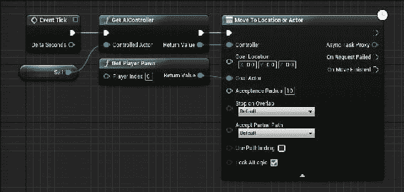

即使在几何体上没有导航网格，"移动到位置或角色"节点也可以工作。

# 将行为树连接到角色

在任何给定的时间点，"行为树"会选择一个 AI 控制单位要展示的行为。行为树相对简单，但需要进行大量的设置才能运行。您还必须熟悉用于构建"行为树"的组件，以便有效地进行设置。

行为树非常有用，可以定义 NPC 的行为，使其比仅仅向对手移动（如前面的`AIMoveTo`示例）更加多样化。

## 准备就绪

设置控制角色的行为树的过程相当复杂。我们首先需要一个`Character`类派生类的蓝图来进行控制。然后，我们需要创建一个自定义的 AI 控制器对象，该对象将运行我们的行为树来控制我们的近战攻击者角色。我们的蓝图中的`AIController`类将运行我们的行为树。

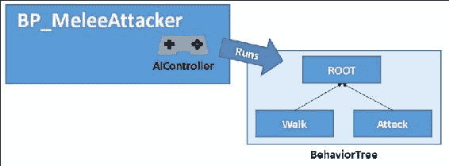

行为树本身包含一个非常重要的数据结构，称为**黑板**。黑板类似于一个黑板，用于存储行为树的变量值。

行为树包含六种不同类型的节点，如下所示：

1.  **任务**：任务节点是行为树中的紫色节点，包含要运行的蓝图代码。这是 AI 控制的单位必须要做的事情（代码方面）。任务必须返回`true`或`false`，取决于任务是否成功（通过在末尾提供`FinishExecution()`节点）。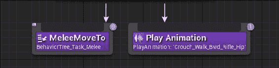

1.  **修饰器**：修饰器只是节点执行的布尔条件。它检查一个条件，通常在选择器或序列块中使用。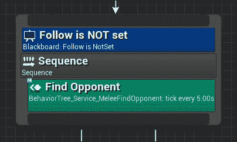

1.  **服务**：在每次执行时运行一些蓝图代码。这些节点的执行间隔是可调节的（可以比每帧执行慢，例如每 10 秒执行一次）。您可以使用这些节点查询场景更新，或者追逐新的对手等等。黑板可以用来存储查询到的信息。服务节点在末尾没有`FinishExecute()`调用。在前面的图表中的序列节点中有一个示例服务节点。

1.  **选择器**：从左到右运行所有子树，直到遇到成功。遇到成功后，执行返回到树的上层。

1.  **序列**：从左到右运行子树，直到遇到失败。遇到失败后，执行返回到树的上层。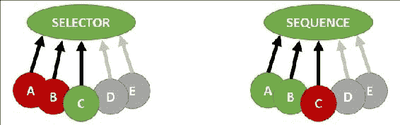

### 注意

选择器节点尝试执行节点，直到成功（然后返回），而序列节点执行所有节点，直到遇到失败（然后返回）。

请记住，如果您的任务没有调用`FinishExecute()`，选择器和序列将无法连续运行多个任务。

1.  **简单并行**：在并行运行一个任务（紫色）和一个子树（灰色）。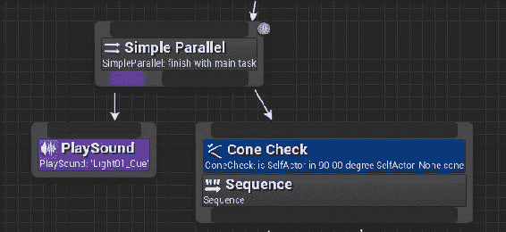

## 如何操作...

1.  首先，在 UE4 中为您的近战单位创建一个蓝图。您可以通过从`Character`派生一个自定义蓝图来实现。要这样做，请转到**类查看器**，输入`Character`，然后右键单击。从出现的上下文菜单中选择**创建蓝图...**，并将您的蓝图类命名为`BP_MeleeCharacter`。

1.  要使用行为树，我们需要首先为我们的`Character`类派生类设置一个自定义 AI 控制器。转到**内容浏览器**，从`AIController`类派生一个蓝图，确保首先关闭**过滤器** | **仅限角色**！

### 注意

非 actor 类的派生类默认情况下不显示在**类查看器**中！要显示`AIController`类，您需要转到**过滤器**菜单并取消选中**仅限角色**菜单选项。

1.  通过在**内容浏览器**中右键单击并选择**人工智能** | **行为树**和**人工智能** | **黑板**来创建您的行为树和黑板对象。

1.  打开**行为树**对象，在**详细信息**面板的**黑板资产**下，选择您创建的黑板。黑板包含用于行为树的键和值（命名变量）。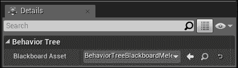

1.  打开您的`BP_AIMeleeController`类派生类并转到事件图。在**事件 BeginPlay**下，选择并添加一个**运行行为树**节点到图表中。在`BTAsset`下，确保选择您的`BehaviorTree_FFA_MeleeAttacker`资源。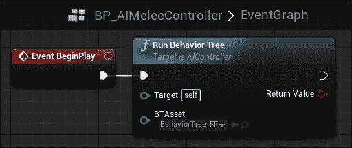

## 工作原理...

行为树连接到 AI 控制器，而 AI 控制器连接到角色的蓝图。我们将通过在图表中输入任务和服务节点来通过行为树控制`Character`的行为。

# 构建任务节点

任务节点类似于函数块。您构建的每个任务节点都将允许您将一些蓝图代码捆绑在一起，以在行为树中满足某些条件时执行。

任务有三个不同的事件：接收 Tick（带有 AI 版本），接收执行（AI）和接收中止（AI）。您可以在任务的蓝图中响应这三个事件中的任何一个。通常，您应该响应任务的接收执行（AI 版本）。

## 准备工作

要创建一个任务节点，您应该已经准备好一个行为树，并将其附加到适当的 AI 控制器和蓝图角色上（参见前面的示例）。

## 操作步骤...

1.  要在任务节点中构建可执行的蓝图代码，您必须从我们的行为树蓝图编辑器的菜单栏中选择**新任务**。从出现的下拉菜单中，选择以`BTTask_BlueprintBase`为基础的**新任务**。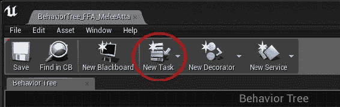

### 提示

与行为树或黑板创建不同，没有直接从**内容浏览器**创建**新任务**的方法。

1.  双击打开刚刚创建的行为树任务以进行编辑。覆盖任何可用事件（在**我的蓝图**选项卡下的**函数**子标题中列出）：

1.  **接收 Tick AI**：行为树任务的`Tick`事件的 AI 版本。当您需要任务与包含它的角色一起进行`Tick`时，应该覆盖此函数。如果您只希望任务在行为树调用它时执行（而不是在游戏引擎进行 Tick 时执行），请不要覆盖此函数。

1.  **接收执行 AI**：您要覆盖的主要函数。接收执行 AI 允许您在从行为树图表中调用任务节点时运行一些蓝图代码。

1.  **接收中止 AI**：当任务被中止时调用的行为树任务中止。当蓝图图表中的`FinishAbort()`节点调用时，应该覆盖此函数。

### 提示

前面的函数还有非 AI 版本，它们只是参数有所不同：在`*AI`版本中，所有者对象被强制转换为`Pawn`，并且有一个所有者控制器传递给事件调用。

# 使用装饰器进行条件判断

**装饰器**是一种允许您在评估另一个节点时输入条件表达式的节点。它们的命名相当奇怪，但它们被称为装饰器，因为它们倾向于为执行节点添加执行条件。例如，在下面的图表中，只有在满足装饰器条件时才会执行`MoveTo`函数：

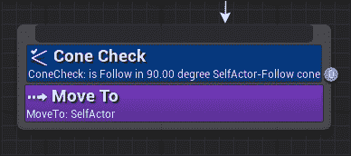

UE4 附带了几个预打包的装饰器，包括黑板（变量检查），**比较黑板条目**，**锥体检查**，**冷却时间**，**路径是否存在**等等。在本示例中，我们将探索使用其中一些条件来控制行为树的不同分支的执行。

## 准备工作

只有在现有**行为树**的菜单栏中才能创建装饰器。

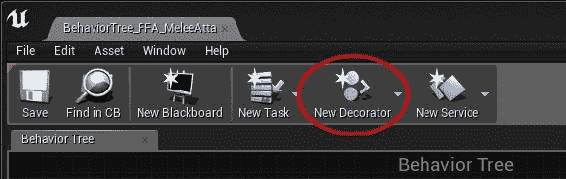

### 注意

**新装饰器**按钮位于现有**行为树**的菜单栏中，因此要找到它，您必须打开现有的**行为树**。

## 操作步骤...

1.  在现有**行为树**的菜单栏中，选择**新装饰器**。以现有蓝图`BTDecorator_BlueprintBase`为基础。

1.  组装您的蓝图图表，确定装饰器的条件在`PerformConditionCheck`函数覆盖下是否成功。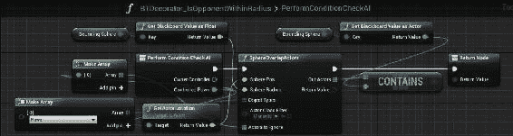

1.  装饰器的内部检查是否跟随黑板中的目标是否在某个半径的边界球内。如果装饰器的条件满足（并且依赖于装饰器的块执行），则返回`true`，否则返回`false`（并且依赖于装饰器的块不执行）。

## 工作原理...

装饰器就像`if`语句一样；唯一的区别是它们在行为树中直接在它们下面放置一个条件来执行节点。

# 使用周期性服务

**服务**是包含要定期执行的蓝图代码的节点。服务与任务非常相似，但它们没有`FinishExecute()`的调用。

## 准备工作

将服务添加到行为树中对于周期性检查非常重要，例如检查是否有任何新的敌方单位在范围内，或者当前目标是否离开焦点。您可以创建自己的服务。在本教程中，我们将组装一个服务，该服务将检查您正在跟随的对手是否仍然是可见锥体内最近的对手。如果不是，则对手将更改。

服务节点有四个主要事件（除了 Tick）：

1.  **接收激活 AI**：当行为树启动并且节点首次激活时触发。

1.  **接收搜索开始 AI**：当行为树进入底层分支时触发。

1.  **接收 Tick AI**：在调用服务的每一帧触发。大部分工作在这里完成。

1.  **接收停用 AI**：当行为树关闭并且节点停用时触发。

## 如何操作...

1.  首先，通过**行为树**菜单栏中的**新服务**按钮将**新服务**添加到**行为树**中：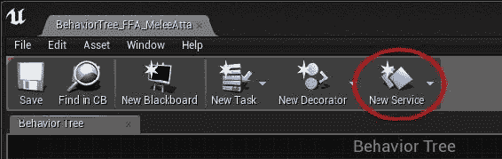

1.  将您的服务命名为描述其功能的名称，例如`BehaviorTree_Service_CheckTargetStillClosest`。

1.  双击服务以开始编辑其蓝图。

1.  在编辑器中，添加一个接收 Tick AI 节点，并对您需要的黑板进行任何更新。

## 工作原理...

服务节点在一些规律的时间间隔（可以有偏差选项）执行一些蓝图代码。在服务节点内部，通常会更新您的黑板。

# 使用复合节点 - 选择器、序列和简单并行

复合节点形成行为树中的树节点，并包含多个要在其中执行的内容。有三种类型的复合节点：

+   **选择器**：从左到右遍历子节点，寻找成功的节点。如果一个节点失败，它会尝试下一个节点。当成功时，节点完成，我们可以返回树。

+   **序列**：从左到右执行，直到节点失败。如果节点成功，则执行下一个节点。如果节点失败，则返回树。

+   **简单并行**：将单个任务（紫色）与某个子树（灰色）并行执行。

## 准备工作

使用复合节点非常简单。您只需要一个行为树就可以开始使用它们。

## 如何操作...

1.  在行为树图中的空白处右键单击。

1.  选择**复合** | **选择器或复合** | **序列**。

+   **选择器**：按顺序执行所有任务，直到成功执行一个任务。

+   **序列**：按顺序执行所有任务，直到一个任务失败。

1.  根据需要将一系列任务或其他复合节点附加到节点上。

# 近战攻击者的 AI

我们可以使用行为树构建具有近战攻击行为的 NPC。近战攻击者将具有以下行为：

1.  每 10 秒搜索最佳对手进行攻击。最佳对手是范围内最近的对手。我们将使用一个服务来实现这一点。将我们正在攻击的对手记录在近战攻击者的行为树黑板中。

1.  朝着我们正在攻击的对手移动（由黑板指示）。

1.  如果我们与对手的距离小于`AttackRadius`单位，则每隔`AttackCooldown`秒对正在攻击的对手造成伤害。

### 提示

这只是使用`BehaviorTree`攻击对手的一种方式。你会发现你也可以在近战攻击者的攻击动画中进行攻击，在这种情况下，你只需在接近对手的`AttackRadius`范围内指示播放动画。

## 准备工作

准备一个近战攻击者角色的蓝图。我称之为`BP_Melee`。准备`BP_Melee`角色的 AI 控制器，以使用我们接下来将创建的新行为树。

## 如何操作...

1.  从根节点开始，如果失败则立即返回。在其中创建一个名为`BehaviorTree_Service_FindOpponent`的新序列节点。将节点的间隔设置为 10 秒。

1.  按照以下步骤构建`BehaviorTree_Service_FindOpponent`节点：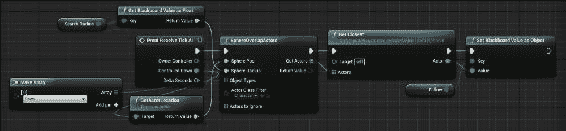

1.  在另一个行为树节点中，指示每帧朝着跟随目标移动：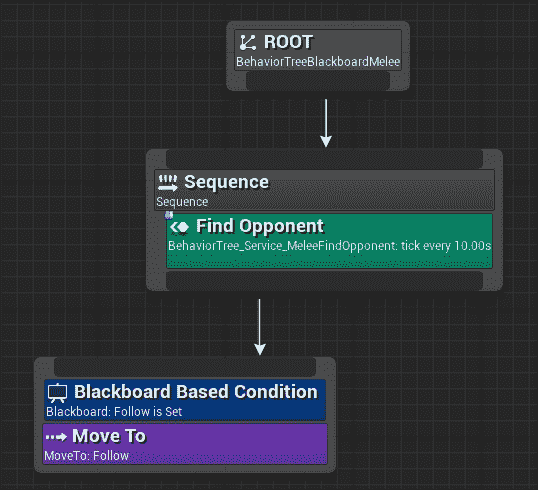

1.  最后，当玩家在对手的`AttackRadius`范围内时，我们希望对对手造成伤害。当玩家在`AttackRadius`范围内时，你可以开始播放攻击动画（这可能会触发对对手的伤害事件），运行一个伤害服务（每隔`AttackCooldown`秒），或者如下截图所示简单地进行**冷却**和**对对手造成伤害**：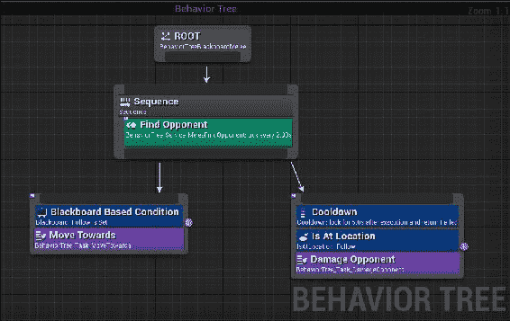
