# 第十一章：自定义材质和着色器

UE4 中的材质定义和创建工具非常出色，更不用说其实时渲染性能了。当您看到您的第一个闪闪发光的金色着色器时，您会对 UE4 的材质着色能力感到惊讶，这是通过一些数学计算实现的。我们将通过以下教程向您展示如何使用这些工具：

+   使用基本材质修改颜色

+   使用材质修改位置

+   通过自定义节点的着色器代码

+   材质函数

+   着色器参数和材质实例

+   闪烁

+   叶子和风

+   与观察角度有关的反射

+   随机性-柏林噪声

+   给景观着色

# 介绍

在计算机图形学中，**着色器**用于给某物上色。传统上，着色器之所以被称为着色器，是因为它们根据原始颜色和光源位置定义了物体的阴影。

现在，着色器不再被认为是为对象提供阴影，而是提供纹理和最终颜色。

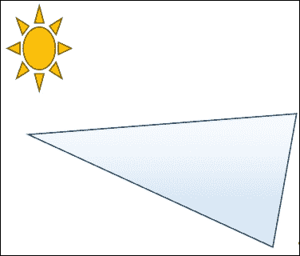

### 注意

着色器是关于确定物体的最终颜色的，给定光源、几何位置和初始颜色（包括纹理，以及更昂贵的材质属性）。

着色器有两种类型：顶点着色器和像素着色器。

+   **顶点着色器**：顶点（网格中的点）的颜色，并且从一个三维点平滑着色到另一个三维点。

+   **像素着色器**：像素（屏幕上的点）的颜色。使用一些简单的数学计算来计算像素（也称为片段）的三维物理位置。

在 UE4 中，我们将着色器称为材质。材质将顶点和片段处理管线抽象为可编程块函数，因此您无需考虑 GPU 或编码即可获得所需的图形输出。您只需以块和图片的形式思考。您可以构建材质并构建 GPU 着色功能，而无需编写一行**高级着色语言**（**HLSL**）、**OpenGL 着色语言**（**GLSL**）或 Cg（用于图形）代码！

### 提示

您通常会听到三种主要的 GPU 编程语言：HLSL、GLSL 和 Cg。GLSL 是 OpenGL 的 GPU 编程语言，而 HLSL 是微软的产品。在 90 年代和 21 世纪的第一个十年中，Cg 诞生了，试图将所有 GPU 编程统一起来。Cg 仍然很受欢迎，但 GLSL 和 HLSL 也仍然广泛使用。

# 使用基本材质修改颜色

材质的主要用途是使表面呈现您想要的颜色。在您的场景中，您将拥有光源和表面。表面上涂有反射和折射光线的材质，您可以通过相机的眼睛看到。材质的基本操作是修改表面的颜色。

### 提示

不要忽视调整光源以使材质看起来符合您的期望的重要性！

熟悉材质编辑器需要一些练习，但一旦您熟悉了它，您可以用它做出令人惊叹的事情。在本教程中，我们将只使用一些非常基本的功能来构建一个木质纹理材质。

### 提示

纹理与材质的区别：请记住，纹理和材质这两个术语之间有很大的区别。纹理只是一个图像文件（例如一张名为`wood.png`的照片）；而材质则是一组纹理、颜色和数学公式的组合，用于描述表面在光线下的外观。材质将考虑表面的属性，如颜色吸收、反射和光泽度，而纹理只是一组有色像素（或者 GPU 称之为纹素）。

着色器的编程方式与普通的 C++代码相同，只是限制更多。有几种参数类型可供选择。其中大多数将是浮点数或以向量格式排列的浮点数包（`float`，`float2`，`float3`，`float4`）。对于位置和颜色等内容，您将使用`float3`或`float4`；对于纹理坐标等内容，您将使用`float2`。

## 准备工作

您需要一个干净的 UE4 项目，将其中放置您的新材质。在 UE4 项目中安装来自 UE4 市场（Epic Games Launcher 应用程序）的**GameTexture Materials**包。它包含我们在本教程中需要的一些必需纹理。您还需要一个简单的几何体来显示着色器的结果。

## 如何操作...

1.  要创建一个基本材质，在**内容浏览器**中右键单击，并创建一个**材质**（在前四个基本资产元素中可用）。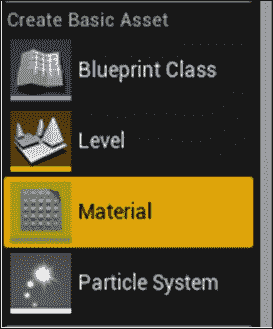

1.  为您的材质命名（例如`GoldenMaterial`），然后双击它进行编辑。

1.  欢迎来到材质编辑器：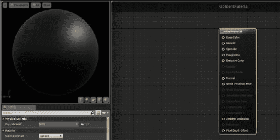

1.  您可以通过右侧的材质输出节点来判断它是材质编辑器。左侧是一个 3D 渲染的球体，展示了您的材质的外观。材质最初是一种类似煤炭的黑色半光泽材质。我们可以调整所有材质参数，从像太阳一样发光的材质，到水，或者到单位装甲的纹理。让我们从调整材质的输出颜色开始，创建一个金色的金属材质。

1.  通过右键单击材质编辑器窗口中的任何空白处，并选择**Constant3Vector**（表示 RGB 颜色）将**基础颜色**更改为黄色。通过双击节点并拖动颜色样本的值来调整颜色。将 Constant3Vector 的输出连接到**基础颜色**，等待左侧的 3D 图片重新加载以显示您的新材质外观。将 Constant3Vector 的输出连接到**基础颜色**，使材质呈现黄色，如下图所示：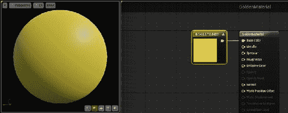

1.  通过将一个常量值附加到**金属**输入并将其设置为 1，为所有通道选择一个金属度级别。1 表示非常金属，0 表示完全不金属（因此看起来像下一个截图中显示的材质一样塑料）。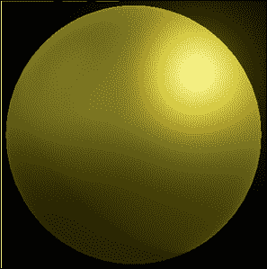

1.  为材质选择一个**高光**值，同样在 0 到 1 之间。**高光**材质是有光泽的，而非高光材质则没有。

1.  为材质选择一个**粗糙度**值。**粗糙度**指的是镜面高光的扩散程度。如果**粗糙度**很高（接近 1.0），则表面类似于黏土，几乎没有镜面高光。镜面高光在 0.7 或 0.8 附近的值附近呈现出较宽的形状。当粗糙度接近 0 时，镜面高光非常锐利而细小（极其光亮/镜面般的表面）。

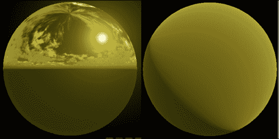

### 注意

左侧的材质的粗糙度为 0，右侧的材质的粗糙度为 1。

1.  通过单击并拖动材质到您想要应用材质的模型网格上，将材质应用于场景中的对象。或者，通过名称在**详细信息**面板中选择一个模型网格组件和您创建的新材质。

1.  最后，在场景中创建一个光源以进一步检查材质的响应属性。没有光源，每个材质都会显示为黑色（除非它是自发光材质）。通过**模式** | **灯光**添加一个光源。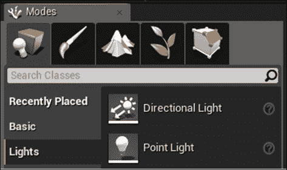

# 使用材质修改位置

不常见的是使用材质来修改对象的位置。这通常在水着色器等方面使用。我们使用材质输出中的**世界位置偏移**节点来实现这一点。

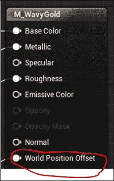

我们可以使用一些 GPU 数学来调制顶点的输出位置。这样做可以显著减轻 CPU 渲染逼真水体的负担。

## 准备工作

在你的世界中创建一个几何体。构建一个名为`Bob`的新着色器，我们将编辑它以产生一个简单的上下浮动的运动效果，用于渲染使用该材质的对象。

## 操作步骤...

1.  在你的新材质（名为`Bob`）中，右键单击并添加**Texcoord**和**Time Input**节点。

1.  通过对`sin()`函数调用级联**Texcoord**（用于空间）和**Time Input**节点的总和，创建一些波浪位移。将`sin()`函数的输出乘以并作为 Z 输入传递给**World Displacement**。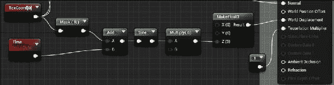

### 注意

给出在`Chapter11`代码中的简单水体着色器的一部分，它产生位移。

1.  在**Tessellation** | **D3D11Tessellation Mode**下选择**PN Triangles**，并将材质中的**Tessellation Multiplier**设置为 1.0。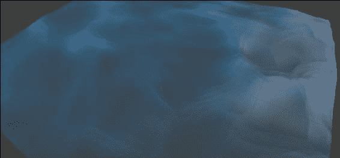

### 提示

通常情况下，UE4 着色器中无法同时使用高光和半透明效果。然而，表面每像素（实验性，功能有限）光照模式允许你同时启用两者。除了选择这种光照模式外，你还必须记住确保按下`` ` `` 并在状态控制台窗口中输入`r.ForwardLighting 1`。

# Shader code via Custom node

If you prefer code to diagrammatic blocks, you're in luck. You can write your own HLSL code to deploy to the GPU for the shading of some vertices in your project. We can construct **Custom** nodes that simply contain math code working on named variables to perform some generic computation. In this recipe, we'll write a custom math function to work with.

## Getting ready

You need a material shader, and a general mathematical function to implement. As an example, we'll write a **Custom** node that returns the square of all inputs.

## How to do it...

1.  In order to create a custom material expression, simply right-click anywhere on the canvas, and select **Custom**.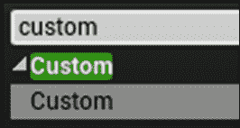
2.  With your new **Custom** block selected, go to the **Details** panel on the left side of your Material Editor window (choose **Window** | **Details** if your **Details** panel is not displayed).
3.  Under **Description**, name your **Custom** block. For example, `Square3`, because we plan to square three float inputs and return a `float3`.
4.  Click the **+** icon as many times you need to generate as many inputs as you need to serve. In this case, we're going to serve three float inputs.
5.  Name each input. We've named ours *x*, *y,* and *z* in the diagram that follows. To use each input in the calculation, you must name it.
6.  Select the output type. Here we chose to output a `float3`.
7.  Enter the computation in the **Code** section at the top using the named variables you have created. The code we return here is as follows:

```

return float3( x*x, y*y, z*z );

```

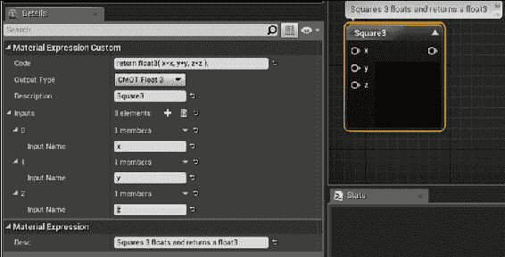

### 提示

这样做的作用是构建一个 3 个浮点数的向量，并将*X*的平方返回到`x`值中，将*Y*的平方返回到`y`值中，将*Z*的平方返回到`z`值中。

为了返回向量类型的*X*、*Y*、*Z*分量的不同值，我们必须返回对`float3`或`float4`构造函数的调用。如果你不返回向量类型，你可以只使用一个`return`语句（不调用`float`构造函数）。

## 工作原理...

自定义节点实际上只是一段 HLSL 代码。任何有效的 HLSL 代码都可以在代码文本字段中使用。顶点或像素着色器程序中有几个标准输入。这些标准输入已经定义了很长时间，它们是你可以用来改变几何体渲染方式的参数。

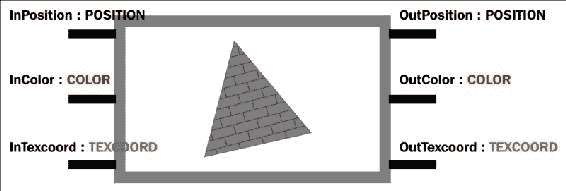

HLSL 和 Cg 有一个称为语义的概念，它将一种具体的类型与一个浮点数关联起来。这样做是为了外部调用着色器的程序在调用顶点或像素着色程序时知道在哪里放置哪个输入。

在下面的 Cg 函数签名中，除了是一个`float`变量之外，`inPosition`在语义上是一个`POSITION`类型的变量，`inTexcoord`是一个`TEXCOORD`类型的变量，`inColor`是一个`COLOR`类型的变量。在着色器内部，你可以将这些变量用于任何你想要的目的，语义只是为了将正确的输入路由到正确的变量（以确保颜色通过`COLOR`类型的变量输入，否则我们将不得不跟踪参数的指定顺序或其他操作！）

函数的输出参数指定了如何解释着色器的输出。解释仅适用于程序的输出数据的接收者（渲染管线中的下一步）。在着色器程序内部，你知道你只是将一堆浮点数写入着色器管线。没有什么禁止你在着色器内部混合不同类型的语义。一个`COLOR`语义变量可以乘以一个`POSITION`语义输入，并作为`TEXCOORD`语义输出发送出去，如果你愿意的话。

# 材质函数

一如既往，**模块化**是编程中的最佳实践之一。材质着色器也不例外：如果你的着色器块是模块化的，并且可以被封装并标识为命名函数，那将更好。这样，不仅你的着色器块更清晰，而且它们还可以在多个材质着色器中重复使用，甚至可以导出到本地 UE4 库中以供将来在其他项目中使用。

## 准备工作

可以将可重用的着色器功能块从自定义材质着色器程序中分离出来。在本示例中，我们将编写一个简单的函数系列——`Square`、`Square2`、`Square3`和`Square4`——来对输入值进行平方。通过打开 UE4 项目并导航到**内容浏览器**，准备好在本教程中执行工作。

## 如何操作...

1.  在**内容浏览器**中右键单击，然后选择**Materials & Textures** | **Material Function**。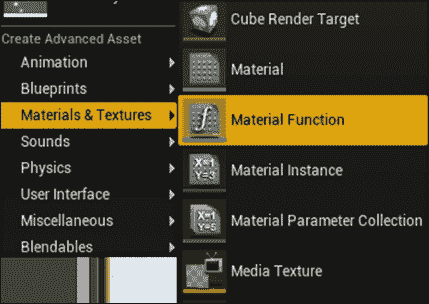

1.  将您的**材质函数**命名为`Square`。

1.  双击**材质函数**。

1.  一旦打开**材质函数**，通过在材质编辑器的空白画布空间中的任何位置左键单击，取消选择**输出结果**节点。查看**详细信息**面板，并注意函数对 UE4 库的暴露是可选的：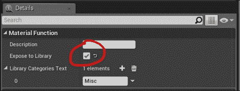

1.  当在**材质函数**编辑器屏幕中没有选择节点时，**详细信息**面板中会出现**暴露到库**复选框。

1.  在**材质函数**编辑器的空白处右键单击，然后选择**输入**。为您的输入命名。请注意，**输入**节点仅在**材质函数**编辑器中可用，而不在普通的材质编辑视图中可用。

1.  从任何常规材质中，通过以下方式之一调用您的函数：

1.  在空白处右键单击，然后选择`MaterialFunction`，然后从下拉菜单中选择您的`MaterialFunction`。

1.  右键单击并输入您的**材质函数**的名称（这要求您先前已经暴露了您的**材质函数**）。

1.  如果您不想将您的**材质函数**暴露给 UE4 库，则必须使用`MaterialFunction`块来调用您的自定义函数。

1.  在**材质函数**编辑器的任何位置右键单击，然后选择**输出**。

## 它是如何工作的...

**材质函数**是您可以创建的最有用的块之一。通过使用它们，您可以将着色器代码模块化，使其更整洁、紧凑和可重用。

## 还有更多...

将功能迁移到着色器库是一个好主意。通过在着色器的根部选择**暴露到库**，您可以使自定义函数出现在函数库中（前提是在材质编辑器窗口中没有选择任何内容）。

在开发**材质函数**时，有时将材质预览节点更改为输出节点以外的节点会很有帮助。通过右键单击任何节点的输出插孔并选择**开始预览节点**来预览特定节点的输出。

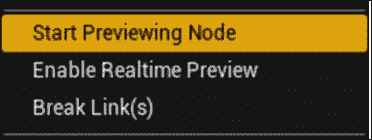

材质编辑器左上角的窗口现在将显示您正在预览的节点的输出。此外，如果您正在预览的节点不是最终输出节点，则会在您正在预览的节点上添加文本**正在预览**。确保在材质编辑器顶部的菜单栏中启用了**实时预览**。通常，您希望预览最终输出。

# 着色器参数和材质实例

着色器的参数将成为该着色器的变量输入。您可以配置标量或矢量作为您的着色器的输入参数。UE4 中的某些材质预先编程了暴露的材质参数。

## 准备工作

为了设置着色器的参数，您首先需要一个带有您想要使用变量修改的内容的着色器。一个好的用变量修改的东西是角色的服装颜色。我们可以将服装的颜色作为着色器参数暴露出来，然后将其与服装颜色相乘。

## 如何操作...

1.  构建一个新的材质。

1.  在材质中创建一个`VectorParameter`。给参数一个名称，例如`Color`。给它一个默认值，例如蓝色或黑色。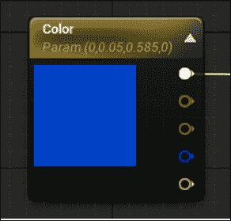

1.  关闭材质。

1.  在**内容浏览器**中，右键单击具有参数的材质，并选择**创建材质实例**。

1.  双击您的材质实例。勾选您的`VectorParameter`名称旁边的复选框，完成！您的`VectorParameter`可以自定义，而不会进一步影响材质的基本功能。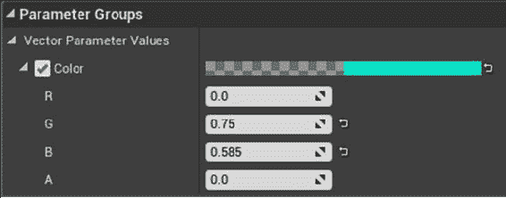

1.  此外，如果您更改了材质的基本功能，材质实例将继承这些更改，而无需进行任何进一步的配置。

## 工作原理...

材质参数允许您编辑发送到材质的变量的值，而无需编辑材质本身。此外，您还可以轻松地从 C++代码更改材质实例的值。这对于诸如团队颜色之类的事物非常有用。

# 闪烁

通过在 UE4 材质编辑器中使用标准节点，可以轻松访问一些着色器功能。您可以构建一些漂亮的斑点效果，例如我们在下一个示例中展示的闪闪发光的金色着色器。这个示例的目的是让您熟悉材质编辑器的基本功能，以便您可以学会构建自己的材质着色器。

## 准备工作

创建一个您想要发光的资产（例如一个宝箱），或者打开`Chapter11`的源代码包以找到`treasureChest.fbx`模型。

我们要做的是在物体上移动一个厚度为*W*的平面。当平面经过几何体时，发射颜色通道被激活，从而在宝藏上创建出闪烁效果。

我们公开了几个参数来控制闪烁，包括**速度**，**周期**（闪烁之间的时间），**宽度**，**增益**，**平面方向**，最后是**颜色**。

## 如何操作...

1.  通过在**内容浏览器**中右键单击并选择**材质**来创建一个新的材质。

1.  按照以下图像所示添加输入参数，引入一个`Time`输入，并通过使用时间周期调用`Fmod`使其成为周期性的：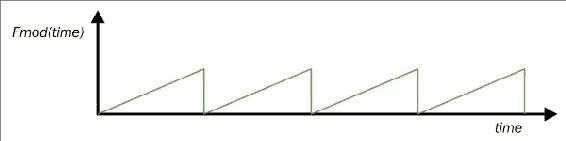

1.  使用周期的`Fmod`将使时间遵循锯齿形模式。读取的时间值不会超过**周期**，因为我们将使用`fmod`操作将其保持为 0。

1.  在一个单独的文件中提供`OnPlane`函数。`OnPlane`函数使用平面方程*Ax + By + Cz + D = 0*来确定输入点是否在平面上。将`LocalPosition`坐标传递到`OnPlane`函数中，以确定在给定帧中，是否应该在几何体中用发光突出显示此部分。

## 工作原理...

一个想象中的光平面以指定的速度通过几何体。光平面每隔**周期**秒从一个边界框的角落开始，沿着**平面方向**指定的方向移动。当平面随时间向前移动时，它总是从盒子的角落开始，当平面通过整个体积时，它将通过整个体积。

# 树叶和风

在这个示例中，我们将编写一个简单的粒子着色器，演示如何在风中创建树叶。我们可以使用一个**粒子发射器**结合一个材质着色器来实现这一点，通过"着色"我们的树叶，使它们看起来像在风中飘动。

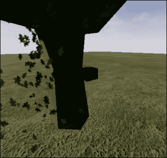

## 准备工作

首先，您需要一个树叶纹理以及一个放置落叶的场景。在`Chapter11`代码包中，您会找到一个名为`LeavesAndTree`的场景，其中包含一个落叶树，您可以使用它。

## 如何操作...

1.  通过在**内容浏览器**中右键单击并选择**粒子系统**来创建一个新的粒子发射器。

1.  通过在**内容浏览器**中右键单击并选择**材质**来构建一个新的材质着色器。您的叶子材质应该包含一个叶子的纹理在`BaseColor`组件中。我们将在后面的步骤中编辑叶子的**世界位置**，以表示由风引起的运动中的抖动。

1.  添加一些参数来修改树叶粒子发射器：

1.  **生成**应该有一个很高的速率，大约为 100。

1.  **初始位置**可以在每边 100 个单位的立方体中分布。

1.  **生命周期**可以是 4-5 秒。

1.  **初始速度**应该是从(-50,-50,-100)到(25,25,-10)之间的某个值。

1.  **初始颜色**可以是一个分布向量，其值为绿色、黄色和红色。

1.  **加速度**可以是(0,0,-20)。

1.  **初始旋转速率**可以是 0.25（最大值）。

1.  可以添加一个带有分布（0,0,0）到（0,10,10）的**轨道**参数。

1.  **风**：通过在**内容浏览器**的空白处右键单击，然后选择**新建材质参数集合**，创建一个**材质参数集合**（**MPC**）。

1.  双击编辑您的新材质参数集合，并输入一个新的参数`TheWind`。给它初始值`(1, 1, 1)`。

1.  在您的关卡蓝图（**蓝图** | **关卡蓝图**）中，创建一个名为`TheWind`的客户端变量。在事件`BeginPlay`中将`TheWind`变量初始化为`(1, 1, 1)`，然后在每帧将此变量发送到 GPU。

1.  在事件`Tick`中，根据自己的喜好修改风力。在我的版本中，我将每帧的风力乘以一个三维随机向量，其值在[-1,1]之间。这样可以使风力每帧都有一个不错的颤动效果。

1.  通过在修改风向量后立即选择一个**设置矢量参数值**节点，将风变量更新发送到 GPU。**设置矢量参数值**必须引用材质参数集合内的变量，因此引用在*步骤 4*中创建的材质参数集合内的`TheWind`变量。

1.  通过每帧修改`WorldPositionOffset`的`TheWind`的某个倍数。由于`TheWind`变量变化缓慢，每帧呈现的修改将是上一帧呈现的修改的轻微变化，从而产生平滑的叶子运动。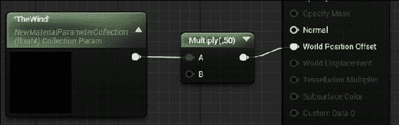

## 它是如何工作的...

叶子以大致恒定的速率下落，但受到着色器内部不断变化的风向量的牵引。

# 反射率取决于观察角度

材质的反射率依赖于观察角度的倾向被称为**Fresnel**效应。材质在接近水平角度时可能比在正对角度时更具镜面反射性。

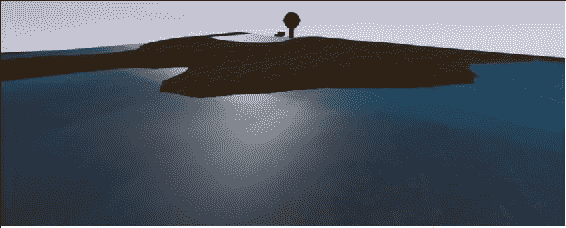

### 注意

Fresnel 效果在接近水平角度时具有较大的幅度。由于使用了 Fresnel 效果，前面截图中的水材质在接近水平角度时具有较高的镜面反射和不透明度。

UE4 具有专门的内置功能来处理这个问题。我们将构建一个水材质，其中透明度具有视角依赖性，以便实际演示如何使用 Fresnel 效果。

## 准备工作

您需要一个要添加 Fresnel 效果的新材质。最好选择一个在观察角度不同的情况下看起来有些不同的材质。

## 如何操作...

1.  在材质内部，通过 Fresnel 节点的输出来驱动一个通道（不透明度、镜面反射或漫反射颜色）。

1.  Fresnel 节点的参数指数和基础反射分数可以调整如下：

1.  **指数**：描述材质的 Fresnel 程度。较高的值会夸大 Fresnel 效果。

1.  **基础反射分数**：较低的数值会夸大 Fresnel 效果。对于值为 1.0，Fresnel 效果不会显现。

## 它是如何工作的...

实现 Fresnel 效果背后有很多数学知识，但在材质中使用它来驱动组件相对较简单，并且可以帮助您创建一些非常漂亮的材质。

# 随机性 - 柏林噪声

一些着色器可以从使用随机值中受益。每个材质都有一些节点可以帮助给着色器添加随机性。可以使用**Perlin**噪声纹理的随机性来生成看起来有趣的材质，比如大理石材质。这种噪声还可以用于驱动凹凸贴图、高度贴图和位移场，产生一些炫酷的效果。

## 准备工作

选择一个你想要添加一些随机性的材质。在材质编辑器中打开该材质，并按照以下步骤进行操作。

## 如何操作...

1.  将一个**Noise**节点插入到你的材质编辑器窗口中。

1.  对你要添加噪声的对象的坐标进行归一化。你可以使用以下数学公式来实现：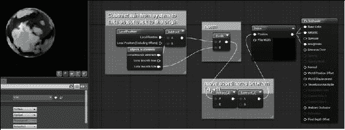

1.  从系统中的每个处理过的顶点中减去最小值，使对象位于原点。

1.  将顶点除以对象的大小，将对象放入一个单位盒子中。

1.  将顶点值乘以 2，将单位盒子从 1x1 扩展到 2x2。

1.  将顶点值减去 1，将单位移动到以原点为中心，值从*[-1,-1,-1]*到*[+1,+1,+1]*。

1.  选择一个值来绘制噪声。请记住，噪声在输入值在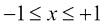之间时效果非常好。在这个范围之外，Perlin 噪声在缩小时会出现雪花状的外观（因为输出值在输入*x*上的变化太大）。

## 工作原理...

Perlin 噪声可以帮助你产生一些美丽的大理石纹理和图案。除了在图形中使用它，你还可以使用 Perlin 噪声以一种自然的方式驱动运动和其他现象。

# 给景观着色

构建景观着色器相对较容易。它们允许你为一个非常大的自定义几何体（称为景观）指定多重纹理。

## 准备工作

景观对象非常适合用作游戏世界级别的地面平面。你可以使用景观选项卡在同一级别中构建多个景观。通过点击**模式**面板中的山的图片，访问**景观**调色板，如下图所示：

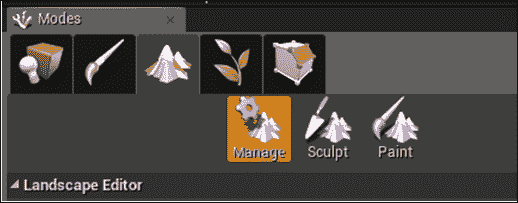

## 如何操作...

1.  通过点击**模式** | **景观**来构建一个新的景观对象。在**新景观**标题下，选择**创建新的**单选按钮。你将看到一个绿色的线框覆盖层，提供了新的景观。你可以使用**区块大小**和**每个组件的区块数**设置来调整其大小。

### 提示

当我们最终进行纹理贴图时，景观将以**区块大小** * **每个组件的区块数** * **组件的数量**的倍数平铺所选的纹理。如果你想让景观纹理平铺次数更少，可以记下这个数字，然后将馈送给纹理的 UV 坐标除以前一行计算出的数字。

1.  暂时不要点击对话框中的其他任何内容，因为我们还需要构建我们的景观材质。这在以下步骤中进行了概述。

1.  导航到**内容浏览器**，为你的景观创建一个新的材质。将其命名为`LandscapeMaterial`。

1.  通过双击编辑你的`LandscapeMaterial`。在空白处右键单击，选择一个`LandscapeCoordinate`节点，将 UV 坐标传递到我们即将应用的纹理中。

+   为了减少景观上的平铺效果，你需要将`LandscapeCoordinate`节点的输出除以景观的总大小（**区块大小** * **每个组件的区块数** * **组件的数量**）（如*步骤 1*中的提示所述）。

1.  在画布上添加一个`LandscapeLayerBlend`节点。将节点的输出导向**基本颜色**图层。

1.  点击`LandscapeLayerBlend`节点，在**详细信息**选项卡中为元素添加几个图层。这将允许你使用**纹理绘制**来在纹理之间进行混合。为每个图层命名，并从以下选项中选择混合方法：

+   通过绘制权重（LB 权重混合）。

+   通过纹理内的 alpha 值（LB Alpha 混合）。

+   按高度（LB 高度混合）。

1.  根据需要设置每个添加的`LandscapeLayer`的其他参数。

1.  为每个景观混合层提供纹理。

1.  通过将恒定的 0 输入添加到镜面输入中，将景观的高光减少到 0。

1.  保存并关闭您的材质。

1.  现在，转到**模式** | 景观选项卡，并在下拉菜单中选择您新创建的`LandscapeMaterial`。

1.  在**图层**部分，点击每个可用的景观图层旁边的**+**图标。为每个景观图层创建并保存一个目标图层对象。

1.  最后，向下滚动到景观选项卡，点击**创建**按钮。

1.  点击绘画选项卡，选择画笔大小和纹理，开始绘制景观纹理。

## 工作原理…

景观材质可以通过高度或手工艺进行混合，如本教程所示。
