# 第十二章：使用 UE4 API

应用程序编程接口（API）是您作为程序员指示引擎和 PC 要执行的操作的方式。UE4 的所有功能都封装在模块中，包括非常基本和核心的功能。每个模块都有一个 API。要使用 API，有一个非常重要的链接步骤，在其中必须在`ProjectName.Build.cs`文件中列出您将在构建中使用的所有 API，该文件位于**Solution Explorer**窗口中。

### 提示

不要将任何 UE4 项目命名为与 UE4 API 名称完全相同的名称！

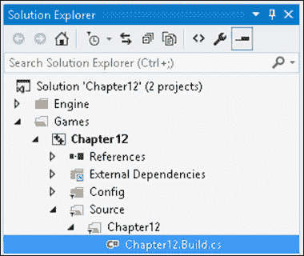

UE4 引擎中有各种 API，可以向其各个重要部分公开功能。本章中我们将探索一些有趣的 API，包括以下内容：

+   Core/Logging API – 定义自定义日志类别

+   Core/Logging API – 使用`FMessageLog`将消息写入**Message Log**

+   Core/Math API – 使用`FRotator`进行旋转

+   Core/Math API – 使用`FQuat`进行旋转

+   Core/Math API – 使用`FRotationMatrix`进行旋转，使一个对象面向另一个对象

+   Landscape API – 使用 Perlin 噪声生成地形

+   Foliage API – 在您的关卡中以程序化方式添加树木

+   Landscape and Foliage APIs – 使用 Landscape 和 Foliage APIs 生成地图

+   GameplayAbilities API – 使用游戏控制触发角色的游戏能力

+   GameplayAbilities API – 使用`AttributeSet`实现统计数据

+   GameplayAbilities API – 使用`GameplayEffect`实现增益效果

+   GameplayTags API – 将`GameplayTags`附加到角色

+   GameplayTasks API – 使用`GameplayTasks`实现游戏任务

+   HTTP API – 网络请求

+   HTTP API – 进度条

# 介绍

UE4 引擎在编辑器中提供的基本功能非常广泛。C++代码的功能实际上被分组到称为 API 的小节中。UE4 代码库中的每个重要功能都有一个单独的 API 模块。这样做是为了保持代码库高度组织和模块化。

### 提示

使用不同的 API 可能需要在您的`Build.cs`文件中进行特殊链接！如果出现构建错误，请确保检查与正确的 API 的链接是否存在！

完整的 API 列表位于以下文档中：[`docs.unrealengine.com/latest/INT/API/`](https://docs.unrealengine.com/latest/INT/API/)。

# Core/Logging API – 定义自定义日志类别

UE4 本身定义了几个日志类别，包括`LogActor`等类别，其中包含与`Actor`类相关的任何日志消息，以及`LogAnimation`，用于记录有关动画的消息。一般来说，UE4 为每个模块定义了一个单独的日志类别。这允许开发人员将其日志消息输出到不同的日志流中。每个日志流的名称作为前缀添加到输出的消息中，如引擎中的以下示例日志消息所示：

```cpp
LogContentBrowser: Native class hierarchy updated for 'HierarchicalLODOutliner' in 0.0011 seconds. Added 1 classes and 2 folders.
LogLoad: Full Startup: 8.88 seconds (BP compile: 0.07 seconds)
LogStreaming:Warning: Failed to read file '../../../Engine/Content/Editor/Slate/Common/Selection_16x.png' error.
LogExternalProfiler: Found external profiler: VSPerf
```

以上是引擎中的示例日志消息，每个消息前都有其日志类别的前缀。警告消息以黄色显示，并在前面添加了**Warning**。

您在互联网上找到的示例代码往往使用`LogTemp`作为 UE4 项目自己的消息，如下所示：

```cpp
UE_LOG( LogTemp, Warning, TEXT( "Message %d" ), 1 );
```

我们实际上可以通过定义自己的自定义`LogCategory`来改进这个公式。

## 准备工作

准备一个 UE4 项目，您想要定义一个自定义日志。打开一个将在几乎所有使用此日志的文件中包含的头文件。

## 操作步骤...

1.  打开您的项目的主头文件；例如，如果您的项目名称是`Pong`，则打开`Pong.h`。在`#include Engine.h`之后添加以下代码行：

```cpp
DECLARE_LOG_CATEGORY_EXTERN( LogPong, Log, All ); // Pong.h
```

在`AssertionMacros.h`中定义了此声明的三个参数，如下所示：

+   `CategoryName`：这是正在定义的日志类别名称（这里是`LogPong`）

+   `DefaultVerbosity`：这是要在日志消息上使用的默认详细程度

+   `CompileTimeVerbosity`：这是编译代码中的详细程度

1.  在项目的主`.cpp`文件中，包含以下代码行：

```cpp
DEFINE_LOG_CATEGORY( LogPong ); // Pong.cpp
```

1.  使用各种显示类别的日志，如下所示：

```cpp
UE_LOG( LogPong, Display, TEXT( "A display message, log is working" ) ); // shows in gray
UE_LOG( LogPong, Warning, TEXT( "A warning message" ) );
UE_LOG( LogPong, Error, TEXT( "An error message " ) );
```

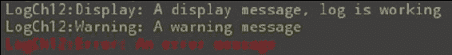

## 工作原理

日志通过将消息输出到“输出日志”（“窗口”|“开发者工具”|“输出日志”）以及文件中来工作。所有输出到“输出日志”的信息也会复制到项目的`/Saved/Logs`文件夹中的一个简单文本文件中。日志文件的扩展名为`.log`，其中最新的一个被命名为`YourProjectName.log`。

## 还有更多...

您可以使用以下控制台命令在编辑器中启用或禁止特定日志通道的日志消息：

```cpp
Log LogName off // Stop LogName from displaying at the output
Log LogName Log // Turn LogName's output on again
```

如果您想编辑一些内置日志类型的输出级别的初始值，可以使用 C++类来对`Engine.ini`配置文件进行更改。您可以在`engine.ini`配置文件中更改初始值。有关更多详细信息，请参见[`wiki.unrealengine.com/Logs,_Printing_Messages_To_Yourself_During_Runtime`](https://wiki.unrealengine.com/Logs,_Printing_Messages_To_Yourself_During_Runtime)。

## 另请参阅

+   `UE_LOG`将其输出发送到“输出窗口”。如果您还想使用更专门的“消息日志”窗口，您可以使用`FMessageLog`对象来编写输出消息。`FMessageLog`同时写入“消息日志”和“输出窗口”。有关详细信息，请参见下一个教程。

# 核心/日志 API - 使用 FMessageLog 将消息写入消息日志

`FMessageLog`是一个对象，允许您将输出消息同时写入“消息日志”（“窗口”|“开发者工具”|“消息日志”）和“输出日志”（“窗口”|“开发者工具”|“输出日志”）。

## 准备工作

准备好您的项目和一些要记录到“消息日志”的信息。在 UE4 编辑器中显示“消息日志”。以下屏幕截图是“消息日志”的样子：

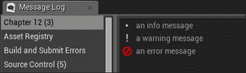

## 操作步骤

1.  在您的主头文件（`ProjectName.h`）中添加`#define`，将`LOCTEXT_NAMESPACE`定义为您的代码库中的某个唯一值：

```cpp
#define LOCTEXT_NAMESPACE "Chapter12Namespace"
```

这个`#define`被`LOCTEXT()`宏使用，我们用它来生成`FText`对象，但在输出消息中看不到它。

1.  通过在非常全局的位置构建您的`FMessageLog`来声明它。您可以在`ProjectName.h`文件中使用`extern`。考虑以下代码片段作为示例：

```cpp
extern FName LoggerName;
extern FMessageLog Logger;
```

1.  然后，在`.cpp`文件中定义并使用`MessageLogModule`注册您的`FMessageLog`。在构建时，请确保为您的记录器提供一个清晰且唯一的名称。它是您的日志类别将出现在“输出日志”中的日志消息左侧的位置。例如，`ProjectName.cpp`：

```cpp
#define FTEXT(x) LOCTEXT(x, x)
FName LoggerName( "Chapter12Log" );
FMessageLog CreateLog( FName name )
{
  FMessageLogModule& MessageLogModule = 
  FModuleManager::LoadModuleChecked<FMessageLogModule>
  ("MessageLog");
  FMessageLogInitializationOptions InitOptions;
  InitOptions.bShowPages = true;// Don't forget this!
  InitOptions.bShowFilters = true;
  FText LogListingName = FTEXT( "Chapter 12's Log Listing" );
  MessageLogModule.RegisterLogListing( LoggerName, LogListingName, InitOptions );
}
// Somewhere early in your program startup
// (eg in your GameMode constructor)
AChapter12GameMode::AChapter12GameMode()
{
  CreateLogger( LoggerName );
  // Retrieve the Log by using the LoggerName.
  FMessageLog logger( LoggerName );
  logger.Warning(
  FTEXT( "A warning message from gamemode ctor" ) );
}
```

### 提示

`KEY`到`LOCTEXT`（第一个参数）必须是唯一的，否则您将得到一个先前散列的字符串。如果您愿意，您可以包含一个`#define`，将参数重复两次传递给`LOCTEXT`，就像我们之前做的那样。

```cpp
#define FTEXT(x) LOCTEXT(x, x)
```

1.  使用以下代码记录您的消息：

```cpp
Logger.Info( FTEXT( "Info to log" ) );
Logger.Warning( FTEXT( "Warning text to log" ) );
Logger.Error( FTEXT( "Error text to log" ) );
```

此代码利用了之前定义的`FTEXT()`宏。请确保它在您的代码库中。

### 提示

在初始化后重新构建消息日志可以检索到原始消息日志的副本。例如，在代码的任何位置，您可以编写以下代码：

```cpp
FMessageLog( LoggerName ).Info( FTEXT( "An info message" ) );
```

# 核心/数学 API - 使用 FRotator 进行旋转

在 UE4 中，旋转有着完整的实现，因此很难选择如何旋转您的对象。有三种主要方法——`FRotator`、`FQuat`和`FRotationMatrix`。本教程概述了这三种不同方法之一——`FRotator`的构建和使用。使用这个方法和下面的两个教程，您可以一目了然地选择一个用于旋转对象的方法。

## 准备工作

有一个 UE4 项目，其中有一个你可以使用 C++接口的对象。例如，你可以构造一个从`Actor`派生的 C++类 Coin 来测试旋转。重写`Coin::Tick()`方法来应用你的旋转代码。或者，你可以在蓝图中的`Tick`事件中调用这些旋转函数。

在这个例子中，我们将以每秒一度的速度旋转一个物体。实际的旋转将是物体创建后累积的时间。为了获得这个值，我们只需调用`GetWorld()->TimeSeconds`。

## 如何做到这一点...

1.  创建一个名为`Coin`的自定义 C++派生类，继承自`Actor`类。

1.  在 C++代码中，重写`Coin`派生类的`::Tick()`函数。这将允许你在每一帧中对角色进行更改。

1.  构造你的`FRotator`。`FRotators`可以使用标准的俯仰、偏航和滚转构造函数来构造，如下例所示：

```cpp
FRotator( float InPitch, float InYaw, float InRoll );
```

1.  你的`FRotator`将按以下方式构造：

```cpp
FRotator rotator( 0, GetWorld()->TimeSeconds, 0 );
```

1.  在 UE4 中，对象的标准方向是前方朝下的*+X*轴。右侧是*+Y*轴，上方是*+Z*轴。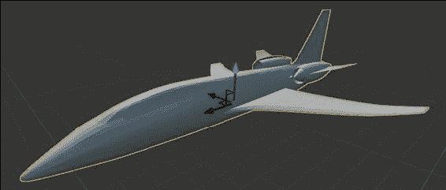

1.  俯仰是绕*Y*轴（横向）旋转，偏航是绕*Z*轴（上下）旋转，滚转是绕*X*轴旋转。这在以下三点中最容易理解：

+   **俯仰**：如果你想象一个 UE4 标准坐标系中的飞机，*Y*轴沿着翼展（俯仰将其向前和向后倾斜）

+   **偏航**：*Z*轴直上直下（偏航将其左右旋转）

+   **滚转**：*X*轴沿着飞机机身直线（滚转进行卷筒翻滚）

### 提示

你应该注意，在其他约定中，*X*轴是俯仰，*Y*轴是偏航，*Z*轴是滚转。

1.  使用`SetActorRotation`成员函数将你的`FRotator`应用到你的角色上，如下所示：

```cpp
FRotator rotator( 0, GetWorld()->TimeSeconds, 0 );
SetActorRotation( rotation );
```

# 核心/数学 API - 使用 FQuat 进行旋转

四元数听起来很吓人，但它们非常容易使用。你可能想通过以下视频来了解它们背后的理论数学：

+   Numberphile 的《奇妙的四元数》- [`www.youtube.com/watch?v=3BR8tK-LuB0`](https://www.youtube.com/watch?v=3BR8tK-LuB0)

+   Jim Van Verth 的《理解四元数》- [`gdcvault.com/play/1017653/Math-for-Game-Programmers-Understanding`](http://gdcvault.com/play/1017653/Math-for-Game-Programmers-Understanding)

然而，在这里我们不会涉及数学背景！实际上，你不需要对四元数的数学背景有太多的了解就能极其有效地使用它们。

## 准备工作

准备一个项目和一个具有重写`::Tick()`函数的`Actor`，我们可以在其中输入 C++代码。

## 如何做到这一点...

1.  构造四元数时，最好使用以下构造函数：

```cpp
FQuat( FVector Axis, float AngleRad );
```

### 注意

**例如，定义一个扭曲旋转**：

四元数还定义了四元数加法、四元数减法、乘以标量和除以标量等运算，以及其他函数。它们非常有用，可以将物体以任意角度旋转，并将物体指向彼此。

## 它是如何工作的...

四元数有点奇怪，但使用它们非常简单。如果*v*是旋转的轴，是旋转角度的大小，那么我们可以得到以下四元数分量的方程：

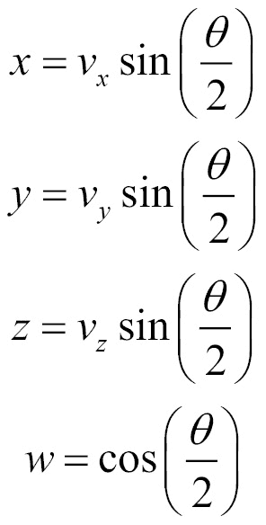

因此，例如，绕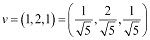旋转角度将具有以下四元数分量：

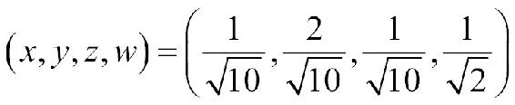

四元数的四个分量中的三个分量（*x*、*y*和*z*）定义了旋转的轴（乘以旋转角度一半的正弦值），而第四个分量（*w*）只有旋转角度一半的余弦值。

## 还有更多...

四元数本身是向量，可以进行旋转。只需提取四元数的(*x*, *y*, *z*)分量，进行归一化，然后旋转该向量。使用所需旋转角度构造一个新的四元数，该四元数由该新单位向量构成。

将四元数相乘表示一系列连续发生的旋转。例如，绕*X*轴旋转 45º，然后绕*Y*轴旋转 45º将由以下组成：

```cpp
FQuat( FVector( 1, 0, 0 ), PI/4.f ) *
FQuat( FVector( 0, 1, 0 ), PI/4.f );
```

# 核心/数学 API-使用 FRotationMatrix 进行旋转，使一个对象面向另一个对象

`FRotationMatrix`提供了使用一系列`::Make*`例程进行矩阵构造的功能。它们易于使用，对于使一个对象面向另一个对象非常有用。假设您有两个对象，其中一个对象跟随另一个对象。我们希望跟随者的旋转始终面向其所跟随的对象。`FRotationMatrix`的构造方法使这一点变得容易。

## 准备好了

在场景中有两个演员，其中一个应该面向另一个演员。

## 如何做到这一点...

1.  在跟随者的`Tick()`方法中，查看`FRotationMatrix`类下可用的构造函数。提供了一系列构造函数，可以通过重新定位一个或多个*X*、*Y*、*Z*轴来指定对象的旋转，命名为`FRotationMatrix::Make*()`模式。

1.  假设您的演员具有默认的初始方向（前进沿着*+X*轴向下，向上沿着*+Z*轴向上），请找到从跟随者到他所跟随的对象的向量，如下所示：

```cpp
FVector toFollow = target->GetActorLocation() - GetActorLocation();
FMatrix rotationMatrix = FRotationMatrix::MakeFromXZ( toTarget, GetActorUpVector() );
SetActorRotation( rotationMatrix.Rotator() );
```

## 它是如何工作的...

使一个对象看向另一个对象，并具有所需的上向量，可以通过调用正确的函数来完成，具体取决于对象的默认方向。通常，您希望重新定位*X*轴（前进），同时指定*Y*轴（右）或*Z*轴（上）向量（`FRotationMatrix::MakeFromXY()`）。例如，要使一个演员沿着`lookAlong`向量朝向，其右侧面向右侧，我们可以构造并设置其`FRotationMatrix`如下：

```cpp
FRotationMatrix rotationMatrix = FRotationMatrix::MakeFromXY( lookAlong, right );
actor->SetActorRotation( rotationMatrix.Rotator() );
```

# 景观 API-使用 Perlin 噪声生成景观

如果您在场景中使用`ALandscape`，您可能希望使用代码而不是手动刷入来编程设置其高度。要在代码中访问`ALandscape`对象及其函数，您必须编译和链接`Landscape`和`LandscapeEditor`API。


## 准备好了

生成景观并不是非常具有挑战性。您需要链接`Landscape`和`LandscapeEditor`API，并且还需要以编程方式设置地图上的高度值。在本示例中，我们将展示如何使用 Perlin 噪声来实现这一点。

以前，您可能已经看到过 Perlin 噪声用于着色，但这并不是它的全部用途。它也非常适用于地形高度。您可以将多个 Perlin 噪声值相加，以获得美丽的分形噪声。值得简要研究 Perlin 噪声，以了解如何获得良好的输出。

## 如何做到这一点...

1.  从[`webstaff.itn.liu.se/~stegu/aqsis/aqsis-newnoise/`](http://webstaff.itn.liu.se/~stegu/aqsis/aqsis-newnoise/)检索 Perlin 噪声模块。您需要的两个文件是`noise1234.h`和`noise1234.cpp`（或者您可以从此存储库中选择另一对噪声生成文件）。将这些文件链接到您的项目中，并确保在`noise1234.cpp`中`#include YourPrecompiledHeader.h`。

1.  在您的`Project.Build.cs`文件中链接`Landscape`和`LandscapeEditor`API。

1.  使用 UMG 构建一个界面，允许您点击一个**生成**按钮来调用一个 C++函数，最终用 Perlin 噪声值填充当前景观。您可以按照以下步骤进行操作：

+   右键单击**内容浏览器**，选择**用户界面** | **小部件蓝图**。

+   使用一个单独的按钮填充**Widget Blueprint**，该按钮启动一个单独的`Gen()`函数。`Gen()`函数可以附加到你的`Chapter12GameMode`派生类对象上，因为从引擎中检索它很容易。`Gen()`函数必须是`BlueprintCallable UFUNCTION()`。（有关如何执行此操作的详细信息，请参见第二章中的*创建 UFUNCTION*部分，*创建类*。）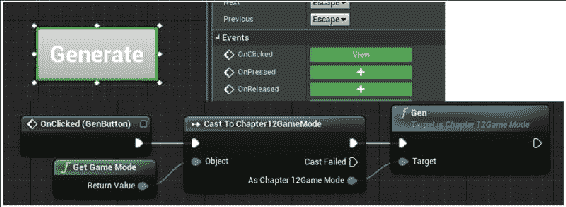

+   确保通过在其中一个启动蓝图中创建并将其添加到视口来显示你的 UI；例如，在你的 HUD 的`BeginPlay`事件中。

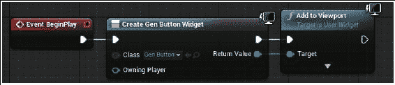

1.  使用 UE4 编辑器创建一个景观。假设景观将保持在屏幕上。我们只会使用代码修改它的值。

1.  在你的地图生成例程中，使用以下代码修改你的`ALandscape`对象：

+   通过搜索`Level`中的所有对象来找到级别中的`Landscape`对象。我们使用一个返回级别中所有`Landscape`实例的`TArray`的 C++函数来实现这一点：

```cpp
TArray<ALandscape*> AChapter12GameMode::GetLandscapes()
{
  TArray<ALandscape*> landscapes;
  ULevel *level = GetLevel();
  for( int i = 0; i < level->Actors.Num(); i++ )
  if( ALandscape* land = Cast<ALandscape>(level->Actors[i]) )
  landscapes.Push( land );
  return landscapes;
}
```

+   使用以下非常重要的行初始化世界的`ULandscapeInfo`对象，如下所示：

```cpp
ULandscapeInfo::RecreateLandscapeInfo( GetWorld(), 1 );
```

### 注意

上一行代码非常重要。如果没有它，`ULandscapeInfo`对象将不会被初始化，你的代码将无法工作。令人惊讶的是，这是`ULandscapeInfo`类的静态成员函数，因此它会初始化级别中的所有`ULandscapeInfo`对象。

+   获取你的`ALandscape`对象的范围，以便我们可以计算需要生成的高度值的数量。

+   创建一组高度值来替换原始值。

+   调用`LandscapeEditorUtils::SetHeightmapData( landscape, data );`将新的地形高度值放入你的`ALandscape`对象中。

例如，使用以下代码：

```cpp
// a) REQUIRED STEP: Call static function
// ULandscapeInfo::RecreateLandscapeInfo().
// What this does is populate the Landscape object with
// data values so you don't get nulls for your 
// ULandscapeInfo objects on retrieval.
ULandscapeInfo::RecreateLandscapeInfo( GetWorld(), 1 );

// b) Assuming landscape is your landscape object pointer,
// get extents of landscape, to compute # height values
FIntRect landscapeBounds = landscape->GetBoundingRect();

// c) Create height values.
// LandscapeEditorUtils::SetHeightmapData() adds one to 
// each dimension because the boundary edges may be used.
int32 numHeights = (rect.Width()+1)*(rect.Height()+1);
TArray<uint16> Data;
Data.Init( 0, numHeights );
for( int i = 0; i < Data.Num(); i++ ) {
  float nx = (i % cols) / cols; // normalized x value
  float ny = (i / cols) / rows; // normalized y value
  Data[i] = PerlinNoise2D( nx, ny, 16, 4, 4 );
}

// d) Set values in with call:
LandscapeEditorUtils::SetHeightmapData( landscape, Data );
```

### 提示

当地图完全平坦时，`heightmap`的初始值将全部为`32768`（`SHRT_MAX`（或`USHRT_MAX/2+1`））。这是因为地图使用无符号短整数（`uint16`）作为其值，使其无法取负值。为了使地图低于`z=0`，程序员将默认值设为`heightmap`的最大值的一半。

## 它是如何工作的…

Perlin 噪声函数用于为（*x*，*y*）坐标对生成高度值。使用 2D 版本的 Perlin 噪声，以便我们可以根据 2D 空间坐标获取 Perlin 噪声值。

## 还有更多内容…

你可以使用地图的空间坐标来玩弄 Perlin 噪声函数，并将地图的高度分配给 Perlin 噪声函数的不同组合。你将希望使用多个 Octave 的 Perlin 噪声函数的总和来获得更多的地形细节。

`PerlinNoise2D`生成函数如下所示：

```cpp
uint16 AChapter12GameMode::PerlinNoise2D( float x, float y,
  float amp, int32 octaves, int32 px, int32 py )
{
  float noise = 0.f;
  for( int octave = 1; octave < octaves; octave *= 2 )
  {
    // Add in fractions of faster varying noise at lower 
    // amplitudes for higher octaves. Assuming x is normalized, 
    // WHEN octave==px  you get full period. Higher frequencies 
    // will go out and also meet period.
    noise += Noise1234::pnoise( x*px*octave, y*py*octave, px, py ) / octave;
  }
  return USHRT_MAX/2.f + amp*noise;
}
```

`PerlinNoise2D`函数考虑到函数的中间值（海平面或平地）应该具有`SHRT_MAX`（`32768`）的值。

# Foliage API - 使用代码将树木程序化地添加到你的级别中

**Foliage** API 是使用代码填充级别中的树木的好方法。如果你这样做，那么你可以获得一些不错的结果，而不必手动产生自然的随机性。

我们将根据 Perlin 噪声值与植被的放置位置相关联，以便在 Perlin 噪声值较高时在给定位置放置树木的机会更大。

## 准备工作

在使用 Foliage API 的代码接口之前，你应该尝试使用编辑器中的功能来熟悉该功能。之后，我们将讨论使用代码接口在级别中放置植被。

### 提示

重要！请记住，`FoliageType`对象的材质必须在其面板中选中**Used with Instanced Static Meshes**复选框。如果不这样做，那么该材质将无法用于着色植被材质。

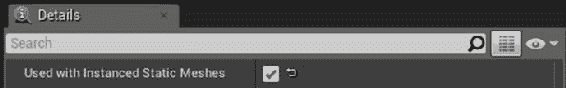

确保为您在`FoliageType`上使用的材质勾选**与实例化静态网格一起使用**复选框，否则您的植被将显示为灰色。

## 操作步骤如下：

### 手动

1.  从**模式**面板中，选择带有叶子的小型植物的图片。

1.  单击**+ 添加植被类型**下拉菜单，并选择构建一个新的`Foliage`对象。

1.  按您希望的名称保存`Foliage`对象。

1.  双击以编辑您的新`Foliage`对象。从项目中选择网格，最好是树形状的对象，以在景观中绘制植被。

1.  调整画笔大小和绘画密度以适合您的喜好。左键单击开始在植被中绘画。

1.  *Shift* + 单击以擦除您放置的植被。擦除密度值告诉您在擦除时要留下多少植被。

### 程序化

如果您希望引擎为您在关卡中分布植被，您需要完成以下几个步骤：

1.  转到**内容浏览器**，右键单击创建一些`FoliageType`对象以在关卡中进行程序化分布。

1.  点击**编辑** | **编辑器首选项**。

1.  点击**实验**选项卡。

1.  启用**程序化植被**复选框。这允许您从编辑器中访问**程序化植被**类。

1.  返回**内容浏览器**，右键单击并创建**杂项** | **程序化植被生成器**。

1.  双击打开您的**程序化植被生成器**，并选择在步骤 1 中创建的`FoliageTypes`。

1.  将您的**程序化植被生成器**拖放到关卡中，并调整大小，使其包含您想要布置程序化植被的区域。

1.  从画笔菜单中，拖动几个程序化植被阻挡体积。将其中几个放置在**程序化植被生成器**体积内，以阻止植被出现在这些区域。

1.  向下打开菜单，点击**模拟**。**程序化植被生成器**应该会填充植被。

1.  尝试不同的设置以获得您喜欢的植被分布。

## 另请参阅

+   前面的示例在游戏开始前生成植被。如果您对运行时程序化植被生成感兴趣，请参阅下一个示例，*Landscape and Foliage API - 使用 Landscape 和 Foliage API 进行地图生成*。

# Landscape and Foliage API - 使用 Landscape 和 Foliage API 进行地图生成

我们可以使用前面提到的地形生成代码创建一个地形，并使用程序化植被功能在其上随机分布一些植被。

结合 Landscape API 和 Foliage API 的功能，您可以程序化生成完整的地图。在本示例中，我们将概述如何实现这一点。

我们将使用代码编程创建一个地形，并使用代码填充植被。

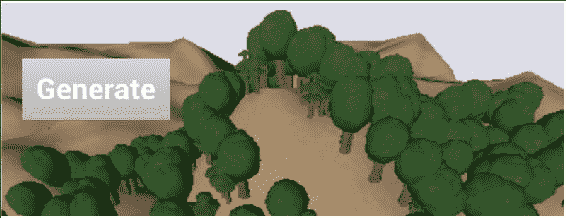

## 准备工作

为了准备执行此示例，我们需要一个 UE4 项目，其中包含一个`Generate`按钮来启动生成。您可以参考*Landscape API - 使用 Perlin 噪声生成地形*示例来了解如何做到这一点。您只需要创建一个小的 UMG UI 小部件，其中包含一个`Generate`按钮。将您的`Generate`按钮的`OnClick`事件连接到 C++全局对象中的一个 C++ `UFUNCTION()`，例如您的`Chapter12GameMode`对象，该对象将用于生成地形。

## 操作步骤如下：

1.  进入一个循环，尝试放置*N*棵树，其中*N*是要随机放置的树木数量，由`Chapter12GameMode`对象的`UPROPERTY()`指定。

1.  从包围地形对象的 2D 框中获取随机 XY 坐标。

1.  获取 Perlin 噪声值`@(x, y)`。您可以使用与用于确定植被放置的地形高度的 Perlin 噪声公式不同的 Perlin 噪声公式。

1.  生成一个随机数。如果生成的数字在 Perlin 噪声函数的单位范围内，则使用`SpawnFoliageInstance`函数放置一棵树。否则，不要在那里放置一棵树。

### 提示

您应该注意到，我们使用所选择的位置的底层随机性来覆盖位置的随机性。在那里放置一棵树的实际机会取决于那里的 Perlin 噪声值，以及它是否在`PerlinTreeValue`的单位范围内。

非常密集的树分布将看起来像地图上的等值线。等值线的宽度是单位的范围。

## 它是如何工作的...

Perlin 噪声通过生成平滑的噪声来工作。对于区间中的每个位置（比如[-1, 1]），都有一个平滑变化的 Perlin 噪声值。


Perlin 噪声值在 2D 纹理上进行采样。在每个像素（甚至在像素之间），我们可以得到一个非常平滑变化的噪声值。

在跨越 Perlin 噪声函数的距离上添加八度（或整数倍）到某个变量中，可以得到锯齿状的效果；例如，云朵中的小丛和山脉中的岩壁是通过更宽间隔的样本获得的，这些样本给出了更快变化的噪声。

为了获得漂亮的 Perlin 噪声输出，我们只需对采样的 Perlin 噪声值应用数学函数；例如，sin 和 cos 函数可以为您生成一些很酷的大理石效果。

### 提示

通过此处链接的实现提供的 Perlin 噪声函数，Perlin 噪声变得周期性，即可平铺。默认情况下，Perlin 噪声不是周期性的。如果您需要 Perlin 噪声是周期性的，请注意调用哪个库函数。

基本的 Perlin 噪声函数是一个确定性函数，每次调用它时都会返回相同的值。

## 还有更多...

您还可以在`Chapter12GameMode`对象派生类中设置滑块，以影响植被和地形的生成，包括以下参数：

+   地形的振幅

+   植被密度

+   植被的等值线水平

+   植被高度或比例的方差

# GameplayAbilities API - 使用游戏控制触发角色的游戏能力

**GameplayAbilities** API 可用于将 C++函数附加到特定按钮推送上，在游戏单位在游戏中对按键事件的响应中展示其能力。在本教程中，我们将向您展示如何做到这一点。

## 准备工作

枚举并描述游戏角色的能力。您需要知道您的角色对按键事件的响应以编码此处的代码。

这里有几个我们需要使用的对象，它们如下：

+   `UGameplayAbility`类 - 这是为了派生 C++类的`UGameplayAbility`类实例，每个能力都有一个派生类。

+   通过重写可用函数（如`UGameplayAbility::ActivateAbility`、`UGameplayAbility::InputPressed`、`UGameplayAbility::CheckCost`、`UGameplayAbility::ApplyCost`、`UGameplayAbility::ApplyCooldown`等）在`.h`和`.cpp`中定义每个能力的功能。

+   `GameplayAbilitiesSet` - 这是一个`DataAsset`派生对象，包含一系列枚举的命令值，以及定义该特定输入命令行为的`UGameplayAbility`派生类的蓝图。每个 GameplayAbility 都由按键或鼠标点击触发，这在`DefaultInput.ini`中设置。

## 操作步骤...

在接下来的内容中，我们将为`Warrior`类对象实现一个名为`UGameplayAbility_Attack`的`UGameplayAbility`派生类。我们将把这个游戏功能附加到输入命令字符串`Ability1`上，然后在鼠标左键点击时激活它。

1.  在`ProjectName.Build.cs`文件中链接`GameplayAbilities` API。

1.  从`UGameplayAbility`派生一个 C++类。例如，编写一个 C++ `UCLASS UGameplayAbility_Attack`。

1.  至少，您需要重写以下内容：

+   使用`UGameplayAbility_Attack::CanActivateAbility`成员函数来指示角色何时可以调用该能力。

+   使用`UGameplayAbility_Attack::CheckCost`函数来指示玩家是否能够负担得起使用能力。这非常重要，因为如果返回 false，能力调用应该失败。

+   使用`UGameplayAbility_Attack::ActivateAbility`成员函数，并编写当`Warrior`激活他的`Attack`能力时要执行的代码。

+   使用`UGameplayAbility_Attack::InputPressed`成员函数，并响应分配给该能力的按键输入事件。

1.  在 UE4 编辑器中从您的`UGameplayAbility_Attack`对象派生一个蓝图类。

1.  在编辑器中，导航到**内容浏览器**并创建一个`GameplayAbilitiesSet`对象：

+   右键单击**内容浏览器**，选择**杂项** | **数据资产**

+   在随后的对话框中，选择`GameplayAbilitySet`作为数据资产类

### 提示

实际上，`GameplayAbilitySet`对象是一个`UDataAsset`派生类。它位于`GameplayAbilitySet.h`中，并包含一个单一的成员函数`GameplayAbilitySet::GiveAbilities()`，我强烈建议您不要使用，原因将在后面的步骤中列出。

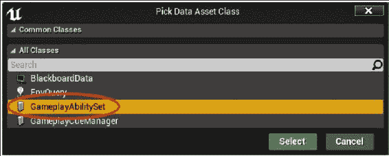

1.  将您的`GameplayAbilitySet`数据资产命名为与`Warrior`对象相关的名称，以便我们知道要将其选择到`Warrior`类中（例如，`WarriorGameplayAbilitySet`）。

1.  双击打开并编辑新的`WarriorAbilitySet`数据资产。通过在其中的`TArray`对象上点击**+**，将一系列`GameplayAbility`类派生蓝图堆叠在其中。您的`UGameplayAbility_Attack`对象必须出现在下拉列表中。

1.  将`UPROPERTY UGameplayAbilitySet* gameplayAbilitySet`成员添加到您的`Warrior`类中。编译、运行，并在**内容浏览器**中选择`WarriorAbilitySet`（在步骤 5 到 7 中创建）作为此`Warrior`能够使用的能力。

1.  确保您的`Actor`类派生类也派生自`UAbilitySystemInterface`接口。这非常重要，以便对`(Cast<IAbilitySystemInterface>(yourActor))->GetAbilitySystemComponent()`的调用成功。

1.  在构建角色之后的某个时候，调用`gameplayAbilitySet->GiveAbilities(abilitySystemComponent);`或进入一个循环，如下一步所示，在其中为您的`gameplayAbilitySet`中列出的每个能力调用`abilitySystemComponent->GiveAbility()`。

1.  为`AWarrior::SetupPlayerInputComponent(UInputComponent* Input)`编写一个重写，将输入控制器连接到 Warrior 的 GameplayAbility 激活。这样做后，迭代每个在您的 GameplayAbilitySet 的**Abilities**组中列出的 GameplayAbility。

### 提示

不要使用`GameplayAbilitySet::GiveAbilities()`成员函数，因为它不会给您访问实际上需要绑定和调用能力到输入组件的一组`FGameplayAbilitySpecHandle`对象。

```cpp
void AWarrior::SetupPlayerInputComponent( UInputComponent* Input )
{
  Super::SetupPlayerInputComponent( Input );
  // Connect the class's AbilitySystemComponent
  // to the actor's input component
  AbilitySystemComponent->BindToInputComponent( Input );

  // Go thru each BindInfo in the gameplayAbilitySet.
  // Give & try and activate each on the AbilitySystemComponent.
  for( const FGameplayAbilityBindInfo& BindInfo : 
  gameplayAbilitySet->Abilities )
  {
    // BindInfo has 2 members:
    //   .Command (enum value)
    //   .GameplayAbilityClass (UClass of a UGameplayAbility)
    if( !BindInfo.GameplayAbilityClass )
    {
      Error( FS( "GameplayAbilityClass %d not set",
      (int32)BindInfo.Command ) );
      continue;
    }

    FGameplayAbilitySpec spec(
    // Gets you an instance of the UClass
    BindInfo.GameplayAbilityClass->
    GetDefaultObject<UGameplayAbility>(),
    1, (int32)BindInfo.Command ) ;

 // STORE THE ABILITY HANDLE FOR LATER INVOKATION
 // OF THE ABILITY
    FGameplayAbilitySpecHandle abilityHandle = 
    AbilitySystemComponent->GiveAbility( spec );

    // The integer id that invokes the ability 
    // (ith value in enum listing)
    int32 AbilityID = (int32)BindInfo.Command;

    // CONSTRUCT the inputBinds object, which will
    // allow us to wire-up an input event to the
    // InputPressed() / InputReleased() events of
    // the GameplayAbility.
    FGameplayAbiliyInputBinds inputBinds(
      // These are supposed to be unique strings that define
      // what kicks off the ability for the actor instance.
      // Using strings of the format 
      // "ConfirmTargetting_Player0_AbilityClass"
      FS( "ConfirmTargetting_%s_%s", *GetName(), 
        *BindInfo.GameplayAbilityClass->GetName() ),
      FS( "CancelTargetting_%s_%s", *GetName(), 
        *BindInfo.GameplayAbilityClass->GetName() ),
      "EGameplayAbilityInputBinds", // The name of the ENUM that 
      // has the abilities listing (GameplayAbilitySet.h).
      AbilityID, AbilityID
    );
 // MUST BIND EACH ABILITY TO THE INPUTCOMPONENT, OTHERWISE
 // THE ABILITY CANNOT "HEAR" INPUT EVENTS.
    // Enables triggering of InputPressed() / InputReleased() 
    // events, which you can in-turn use to call 
    // TryActivateAbility() if you so choose.
    AbilitySystemComponent->BindAbilityActivationToInputComponent(
      Input, inputBinds
    );

    // Test-kicks the ability to active state.
    // You can try invoking this manually via your
    // own hookups to keypresses in this Warrior class
    // TryActivateAbility() calls ActivateAbility() if
    // the ability is indeed invokable at this time according
    // to rules internal to the Ability's class (such as cooldown
    // is ready and cost is met)
    AbilitySystemComponent->TryActivateAbility( 
      abilityHandle, 1 );
  }
}
```

## 它是如何工作的...

您必须通过一系列对`UAbilitySystemComponent::GiveAbility(spec)`的调用，将一组`UGameplayAbility`对象子类化并链接到您的角色的`UAbilitySystemComponent`对象中，其中包括适当构造的`FGameplayAbilitySpec`对象。这样做的目的是为您的角色装备这一组`GameplayAbilities`。每个`UGameplayAbility`的功能、成本、冷却和激活都被整洁地包含在您将构建的`UGameplayAbility`类派生类中。

## 还有更多...

您将需要仔细编写一堆其他可在`GameplayAbility.h`头文件中使用的函数，包括以下实现：

+   `SendGameplayEvent`：这是一个通知 GameplayAbility 发生了一些常规游戏事件的函数。

+   `CancelAbility`：这是一个函数，用于在使用能力过程中停止能力，并给予能力中断状态。

+   请记住，在`UGameplayAbility`类声明的底部附近有一堆现有的`UPROPERTY`，它们在添加或删除某些`GameplayTags`时激活或取消能力。有关详细信息，请参阅以下*GameplayTags API - 将 GameplayTags 附加到 Actor*的示例。

+   还有更多！探索 API 并在代码中实现那些您认为有用的功能。

## 另请参阅

+   `GameplayAbilities` API 是一系列丰富且巧妙交织的对象和函数。真正探索`GameplayEffects`，`GameplayTags`和`GameplayTasks`以及它们如何与`UGameplayAbility`类集成，以充分探索库所提供的功能。

# GameplayAbilities API - 使用 UAttributeSet 实现统计信息

`GameplayAbilities` API 允许您将一组属性（即`UAttributeSet`）与 Actor 关联起来。`UAttributeSet`描述了适用于该 Actor 的游戏属性的属性，例如`Hp`，`Mana`，`Speed`，`Armor`，`AttackDamage`等等。您可以定义一个适用于所有 Actor 的单个全局游戏属性集，或者适用于不同类别的 Actor 的几个不同的属性集。

## 准备就绪

`AbilitySystemComponent`是您需要添加到 Actor 中的第一件事，以使其能够使用*GameAbilities API*和`UAttributeSet`。要定义自定义的`UAttributeSet`，您只需从`UAttributeSet`基类派生，并使用自己的一系列`UPROPERTY`成员扩展基类。之后，您必须将自定义的`AttributeSet`注册到`Actor`类的`AbilitySystemComponent`中。

## 如何做...

1.  在`ProjectName.Build.cs`文件中链接到`GameplayAbilities` API。

1.  在自己的文件中，从`UAttributeSet`类派生，并使用一组`UPROPERTY`装饰该类，这些属性将在每个 Actor 的属性集中使用。例如，您可能希望声明类似于以下代码片段的`UAttributeSet`派生类：

```cpp
#include "Runtime/GameplayAbilities/Public/AttributeSet.h"
#include "GameUnitAttributeSet.generated.h"

UCLASS(Blueprintable, BlueprintType)
class CHAPTER12_API UGameUnitAttributeSet : public UAttributeSet
{
  GENERATED_BODY()
  public:
  UGameUnitAttributeSet( const FObjectInitializer& PCIP );
  UPROPERTY( EditAnywhere, BlueprintReadWrite, Category = GameUnitAttributes )  float Hp;
  UPROPERTY( EditAnywhere, BlueprintReadWrite, Category = GameUnitAttributes )  float Mana;
  UPROPERTY( EditAnywhere, BlueprintReadWrite, Category = GameUnitAttributes )  float Speed;
};
```

### 提示

如果您的代码是网络化的，您可能希望在`UPROPERTY`的每个副本声明中启用复制。

1.  通过调用以下代码将`GameUnitAttributeSet`与`Actor`类中的`AbilitySystemComponent`连接起来：

```cpp
AbilitySystemComponent->InitStats( 
  UGameUnitAttributeSet::StaticClass(), NULL );
```

您可以将此调用放在`PostInitializeComponents()`的某个位置，或者在稍后调用的代码中。

1.  一旦您注册了`UAttributeSet`，您可以继续下一个步骤，并将`GameplayEffect`应用于属性集中的某些元素。

1.  确保您的`Actor`类对象通过从其派生来实现`IAbilitySystemInterface`。这非常重要，因为`UAbilitySet`对象将尝试将其转换为`IAbilitySystemInterface`，以在代码的各个位置调用`GetAbilitySystemComponent()`。

## 工作原理...

`UAttributeSets`只是允许您枚举和定义不同 Actor 的属性。`GameplayEffects`将是您对特定 Actor 的属性进行更改的手段。

## 还有更多...

您可以编写`GameplayEffects`的定义，这些定义将对 AbilitySystemComponent 的`AttributeSet`集合产生影响。您还可以编写`GameplayTasks`，用于在特定时间或事件运行的通用函数，甚至是响应标签添加（`GameplayTagResponseTable.cpp`）。您可以定义`GameplayTags`来修改 GameplayAbility 的行为，并在游戏过程中选择和匹配游戏单位。

# GameplayAbilities API - 使用 GameplayEffect 实现增益效果

A buff is just an effect that introduces a temporary, permanent, or recurring change to a game unit's attributes from its `AttributeSet`. Buffs can either be good or bad, supplying either bonuses or penalties. For example, you might have a hex buff that slows a unit to half speed, an angel wing buff that increases unit speed by 2x, or a cherub buff that recovers `5 hp` every five seconds for three minutes. A `GameplayEffect` affects an individual gameplay attributes in the `UAttributeSet` attached to an `AbilitySystemComponent` of an Actor.

## Getting ready

Brainstorm your game units' effects that happen during the game. Be sure that you've created an `AttributeSet`, shown in the previous recipe, with gameplay attributes that you'd like to affect. Select an effect to implement and follow the succeeding steps with your example.

### Tip

You may want to turn `LogAbilitySystem` to a `VeryVerbose` setting by going to the **Output Log** and typing ```cpp, and then `Log LogAbilitySystem` `All`.

This will display much more information from `AbilitySystem` in the **Output Log**, making it easier to see what's going on within the system.

## How to do it…

In the following steps, we'll construct a quick `GameplayEffect` that heals `50 hp` to the selected unit's `AttributeSet`:

1.  Construct your `UGameplayEffect` class object using the `CONSTRUCT_CLASS` macro with the following line of code:

    ```

// Create GameplayEffect recovering 50 hp one time only to unit

CONSTRUCT_CLASS( UGameplayEffect, RecoverHP );

```cpp

2.  Use the `AddModifier` function to change the `Hp` field of `GameUnitAttributeSet`, as follows:

```

AddModifier( RecoverHP,

GET_FIELD_CHECKED( UGameUnitAttributeSet, Hp ),

EGameplayModOp::Additive, FScalableFloat( 50.f ) );

```cpp

3.  Fill in the other properties of `GameplayEffect`, including fields such as `DurationPolicy` and `ChanceToApplyToTarget` or any other fields that you'd like to modify, as follows:

```

RecoverHP->DurationPolicy = EGameplayEffectDurationType::HasDuration;

RecoverHP->DurationMagnitude = FScalableFloat( 10.f );

RecoverHP->ChanceToApplyToTarget = 1.f;

RecoverHP->Period = .5f;

```cpp

4.  Apply the effect to an `AbilitySystemComponent` of your choice. The underlying `UAttributeSet` will be affected and modified by your call, as shown in the following piece of code:

```

FActiveGameplayEffectHandle recoverHpEffectHandle =

AbilitySystemComponent->ApplyGameplayEffectToTarget( RecoverHP,

AbilitySystemComponent, 1.f );

```cpp

## How it works…

`GameplayEffects` are simply little objects that effect changes to an actor's `AttributeSet`. `GameplayEffects` can occur once, or repeatedly, in intervals over a `Period`. You can program-in effects pretty quickly and the `GameplayEffect` class creation is intended to be inline.

## There's more…

Once the `GameplayEffect` is active, you will receive an `FActiveGameplayEffectHandle`. You can use this handle to attach a function delegate to run when the effect is over using the `OnRemovedDelegate` member of the `FActiveGameplayEffectHandle`. For example, you might call:

```

FActiveGameplayEffectHandle recoverHpEffectHandle =

AbilitySystemComponent->ApplyGameplayEffectToTarget( RecoverHP,

AbilitySystemComponent, 1.f );

if( recoverHpEffectHandle ) {

recoverHpEffectHandle->AddLambda( []() {

Info( "RecoverHp Effect has been removed." );

} );

}

```cpp

# GameplayTags API – Attaching GameplayTags to an Actor

`GameplayTags` are just small bits of text that describes states (or buffs) for the player or attributes that can attach to things such as `GameplayAbilities` and also to describe `GameplayEffects`, as well as states that clear those effects. So, we can have `GameplayTags`, such as `Healing` or `Stimmed`, that trigger various `GameplayAbilities` or `GameplayEffects` to our liking. We can also search for things via `GameplayTags` and attach them to our `AbilitySystemComponents` if we choose.

## How to do it…

There are several steps to getting `GameplayTags` to work correctly inside your engine build; they are as follows:

1.  First, we will need to create a Data Table asset to carry all of our game's tag names. Right-click on **Content Browser** and select **Miscellaneous** | **Data Table**. Select a table class structure deriving from `GameplayTagTableRow`.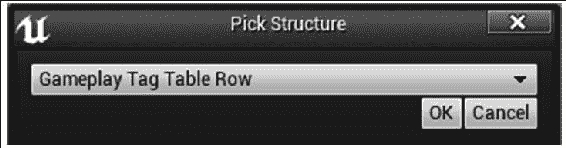

List all tags available inside your game under that data structure.

2.  Add `UPROPERTY() TArray<FString>` to your `GameMode` object to list the names of the `TagTableNames` that you want to load into the `GameplayTags` module manager:

```

UPROPERTY( EditAnywhere, BlueprintReadWrite, Category = GameplayTags )

TArray<FString> GameplayTagTableNames;

```cpp

3.  In your GameMode's `PostInitializeComponents` function, or later, load the tags in the tables of your choice using `GetGameplayTagsManager`:

```

IGameplayTagsModule::Get().GetGameplayTagsManager().

LoadGameplayTagTable( GameplayTagTableNames );

```cpp

4.  Use your `GameplayTags`. Inside each of your GameplayAbility objects, you can modify the blockedness, cancelability, and activation requirements for each GameplayAbility using tag attachment or removal.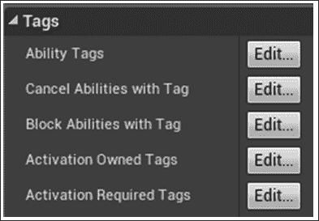

You do have to rebuild your engine in order to get your tags to load within the editor. The patch to the engine source that is proposed allows you to hook in a call to `IGameplayTagsModule::Get().GetGameplayTagsManager().LoadGameplayTagTable( GameplayTagTableNames )`.

To get this call embedded into the editor's startup, you will need to edit the engine's source.

# GameplayTasks API – Making things happen with GameplayTasks

`GameplayTasks` are used to wrap up some gameplay functionality in a reusable object. All you have to do to use them is derive from the `UGameplayTask` base class and override some of the member functions that you prefer to implement.

## Getting ready

Go in the UE4 Editor and navigate to **Class Viewer**. Ensure that you have linked in the `GameplayTasks` API into your `ProjectName.Build.cs` file and search with **Actors Only** tickbox off for the `GameplayTask` object type.

## How to do it…

1.  Ensure that you have linked `GameplayTasks` API into your `ProjectName.Build.cs` file.
2.  Click on **File** | **Add C++ Class…** Choose to derive from `GameplayTask`. To do so, you must first tick **Show All Classes**, and then type `gameplaytask` into the filter box. Click on **Next**, name your C++ class (something like `GameplayTask_TaskName` is the convention) then add the class to your project. The example spawns a particle emitter and is called `GameplayTask_CreateParticles`.
3.  Once your `GameplayTask_CreateParticles.h` and `.cpp` pair are created, navigate to the `.h` file and declare a static constructor that creates a `GameplayTask_CreateParticles` object for you:

```

// Like a constructor.

UGameplayTask_CreateParticles* UGameplayTask_CreateParticles::ConstructTask(

TScriptInterface<IGameplayTaskOwnerInterface> TaskOwner,

UParticleSystem* particleSystem,

FVector location )

{

UGameplayTask_CreateParticles* task =

NewTask<UGameplayTask_CreateParticles>( TaskOwner );

// Fill fields

if( task )

{

task->ParticleSystem = particleSystem;

task->Location = location;

}

return task;

}

```cpp

4.  Override the `UGameplayTask_CreateEmitter::Activate()` function, which contains code that runs when `GameplayTask` is effected, as follows:

```

void UGameplayTask_CreateEmitter::Activate()

{

Super::Activate();

UGameplayStatics::SpawnEmitterAtLocation( GetWorld(),

ParticleSystem->GetDefaultObject<UParticleSystem>(),

Location );

}

```cpp

5.  Add `GameplayTasksComponent` to your `Actor` class derivative, which is available in the **Components** dropdown of the **Components** tab in the Blueprint editor.
6.  Create and add an instance of your `GameplayTask` inside your `Actor` derivative instance using the following code:

```

UGameplayTask_CreateParticles* task =

UGameplayTask_CreateParticles::ConstructTask( this,

particleSystem, FVector( 0.f, 0.f, 200.f ) );

if( GameplayTasksComponent )

{

GameplayTasksComponent->AddTaskReadyForActivation( *task );

}

```cpp

7.  This code runs anywhere in your `Actor` class derivative, any time after `GameplayTasksComponent` is initialized (any time after `PostInitializeComponents()`).

## How it works…

`GameplayTasks` simply register with the `GameplayTasksComponent` situated inside an `Actor` class derivative of your choice. You can activate any number of `GameplayTasks` at any time during gameplay to trigger their effects.

`GameplayTasks` can also kick off `GameplayEffects` to change attributes of `AbilitySystemsComponents` if you wish.

## There's more…

You can derive `GameplayTasks` for any number of events in your game. What's more is that you can override a few more virtual functions to hook into additional functionality.

# HTTP API – Web request

When you're maintaining scoreboards or other such things that require regular HTTP request access to servers, you can use the HTTP API to perform such web request tasks.

## Getting ready

Have a server to which you're allowed to request data via HTTP. You can use a public server of any type to try out HTTP requests if you'd like.

## How to do it…

1.  Link to the HTTP API in your `ProjectName.Build.cs` file.
2.  In the file in which you will send your web request, include the `HttpModule.h` header file, the `HttpManager.h` header file, and the `HttpRetrySystem.h` file, as shown in the following code snippet:

```

#include "Runtime/Online/HTTP/Public/HttpManager.h"

#include "Runtime/Online/HTTP/Public/HttpModule.h"

#include "Runtime/Online/HTTP/Public/HttpRetrySystem.h"

```cpp

3.  Construct an `IHttpRequest` object from `FHttpModule` using the following code:

```

TSharedRef<IHttpRequest> http=FHttpModule::Get().CreateRequest();

```cpp

### Tip

`FHttpModule` is a singleton object. One copy of it exists for the entire program that you are meant to use for all interactions with the `FHttpModule` class.

4.  Attach your function to run to the `IHttpRequest` object's `FHttpRequestCompleteDelegate`, which has a signature as follows:

```

void HttpRequestComplete( FHttpRequestPtr request,

FHttpResponsePtr response, bool success );

```cpp

5.  The delegate is found inside of the `IHttpRequest` object as `http->OnProcessRequestComplete()`:

```

FHttpRequestCompleteDelegate& delegate = http->OnProcessRequestComplete();

```cpp

    There are a few ways to attach a callback function to the delegate. You can use the following:

    *   A lambda using `delegate.BindLambda()`:

```

委托.BindLambda(

// Anonymous, inlined code function (aka lambda)

[]( FHttpRequestPtr request, FHttpResponsePtr response, bool success ) -> void

{

UE_LOG( LogTemp, Warning, TEXT( "Http Response: %d, %s" ),

request->GetResponse()->GetResponseCode(),

*request->GetResponse()->GetContentAsString() );

});

```cpp

    *   Any UObject's member function:

```

delegate.BindUObject( this, &AChapter12GameMode::HttpRequestComplete );

```cpp

### Tip

You cannot attach to `UFunction` directly here as the `.BindUFunction()` command requests arguments that are all `UCLASS`, `USTRUCT` or `UENUM`.

    *   Any plain old C++ object's member function using `.BindRaw`:

```

PlainObject* plainObject = new PlainObject();

delegate.BindRaw( plainObject, &PlainObject::httpHandler );

// plainObject cannot be DELETED Until httpHandler gets called..

```cpp

### Tip

You have to ensure that your `plainObject` refers to a valid object in memory at the time the HTTP request completes. This means that you cannot use `TAutoPtr` on `plainObject`, because that will deallocate `plainObject` at the end of the block in which it is declared, but that may be before the HTTP request completes.

    *   A global C-style static function:

```

// C-style function for handling the HTTP response:

void httpHandler( FHttpRequestPtr request,

FHttpResponsePtr response, bool success )

{

Info( "static: Http req handled" );

}

delegate.BindStatic( &httpHandler );

```cpp

### Note

When using a delegate callback with an object, be sure that the object instance that you're calling back on lives on at least until the point at which the `HttpResponse` arrives back from the server. Processing the `HttpRequest` takes real time to run. It is a web request after all—think of waiting for a web page to load.

You have to be sure that the object instance on which you're calling the callback function has not deallocated on you between the time of the initial call and the invocation of your `HttpHandler` function. The object must still be in memory when the callback returns after the HTTP request completes.

You cannot simply expect that the `HttpResponse` function happens immediately after you attach the callback function and call `ProcessRequest()`! Using a reference counted `UObject` instance to attach the `HttpHandler` member function is a good idea to ensure that the object stays in memory until the HTTP request completes.

6.  Specify the URL of the site you'd like to hit:

```

http->SetURL( TEXT( "http://unrealengine.com" ) );

```cpp

7.  Process the request by calling `ProcessRequest`:

```

http->ProcessRequest();

```cpp

## How it works…

The HTTP object is all you need to send off HTTP requests to a server and get HTTP responses. You can use the HTTP request/response for anything that you wish; for example, submitting scores to a high scores table or to retrieve text to display in-game from a server.

They are decked out with a URL to visit and a function callback to run when the request is complete. Finally, they are sent off via `FManager`. When the web server responds, your callback is called and the results of your HTTP response can be shown.

## There's more…

You can set additional HTTP request parameters via the following member functions:

*   `SetVerb()` to change whether you are using the `GET` or `POST` method in your HTTP request
*   `SetHeaders()` to modify any general header settings you would like

# HTTP API – Progress bars

The `IHttpRequest` object from HTTP API will report HTTP download progress via a callback on a `FHttpRequestProgressDelegate` accessible via `OnRequestProgress()`. The signature of the function we can attach to the `OnRequestProgress()` delegate is as follows:

```

HandleRequestProgress( FHttpRequestPtr request, int32 sentBytes, int32 receivedBytes )

```cpp

The three parameters of the function you may write include: the original `IHttpRequest` object, the bytes sent, and the bytes received so far. This function gets called back periodically until the `IHttpRequest` object completes, which is when the function you attach to `OnProcessRequestComplete()` gets called. You can use the values passed to your `HandleRequestProgress` function to advance a progress bar that you will create in UMG.

## Getting ready

You will need an internet connection to use this recipe. We will be requesting a file from a public server. You can use a public server or your own private server for your HTTP request if you'd like.

In this recipe, we will bind a callback function to just the `OnRequestProgress()` delegate to display the download progress of a file from a server. Have a project ready where we can write a piece of code that will perform `IHttpRequest,` and a nice interface on which to display percentage progress.

## How to do it…

1.  Link to the `UMG` and `HTTP` APIs in your `ProjectName.Build.cs` file.
2.  Build a small UMG UI with `ProgressBar` to display your HTTP request's progress.
3.  Construct an `IHttpRequest` object using the following code:

```

TSharedRef<IHttpRequest> http = HttpModule::Get().CreateRequest();

```cpp

4.  Provide a callback function to call when the request progresses, which updates a visual GUI element:

```

http->OnRequestProgress().BindLambda( []( FHttpRequestPtr request, int32 sentBytes, int32 receivedBytes ) -> void

{

int32 totalLen = request->GetResponse()->GetContentLength();

float perc = (float)receivedBytes/totalLen;

如果（HttpProgressBar）

HttpProgressBar->SetPercent( perc );

} );

```

1.  使用`http->ProcessRequest()`处理您的请求。

## 它是如何工作的...

`OnRequestProgress()`回调会定期触发，显示已发送和已接收的字节的 HTTP 进度。我们将通过计算`(float)receivedBytes/totalLen`来计算下载完成的总百分比，其中`totalLen`是 HTTP 响应的总字节长度。使用我们附加到`OnRequestProgress()`委托回调的 lambda 函数，我们可以调用 UMG 小部件的`.SetPercent()`成员函数来反映下载的进度。
