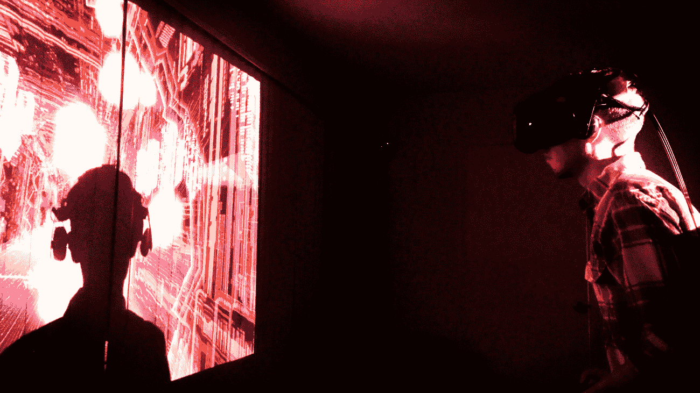
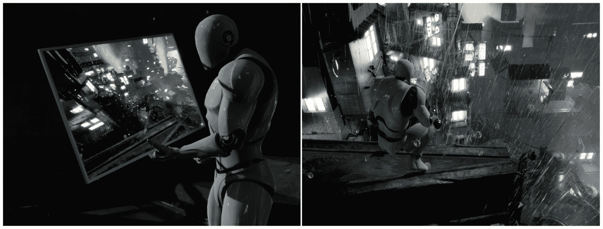
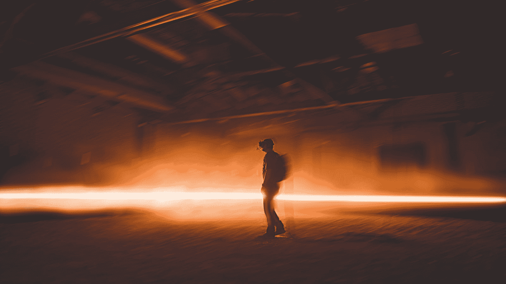

# 第一章：在虚拟现实中思考

“所有的现实都是虚拟的。”

这是一个强有力的陈述，如果你以前没有考虑过，那么它并不明显，所以我会再说一遍——我们所经历的现实是我们头脑中的一种构造，基于高度不完整的数据。从进化的角度来看，它通常与现实世界很匹配，这并不奇怪，但它并不是对现实的字面反映——它只是对世界最可能状态的推断，根据我们在任何时候所知道的。

- Michael Abrash，Oculus 首席科学家

“关于一项技术最重要的事情是它如何改变人们。”

- Jaron Lanier，VPL 研究创始人，虚拟现实先驱，微软研究跨学科科学家

欢迎来到虚拟世界。（它在内部更大。）

在本书中，我们将探索使用虚幻引擎 4 创建虚拟现实应用程序、游戏和体验的过程。我们将花一些时间来研究虚拟现实是什么，以及我们可以如何有效地为这种媒介进行设计，然后，从那里开始，我们将使用虚幻引擎深入地演示这些概念，以制作展示和探索这些技术和思想的虚拟现实项目。

每一章都将围绕一个实践项目展开，从基础开始，如设置开发环境和创建第一个虚拟现实测试应用程序，然后深入探讨在虚拟现实中可以做什么以及如何使用虚幻引擎 4 来实现。在每个项目中，我们将引导您完成构建一个展示虚拟现实特定主题的项目的过程，并解释所使用的方法，并在某些情况下演示一些替代方法。对我们来说，重要的是，当您构建这些项目时，您不仅要知道如何做我们描述的事情，还要知道为什么要以这种方式做，这样您就可以将所学到的知识用作计划和执行自己工作的起点。

在本章中，我们将介绍虚拟现实是什么，以及它目前在各个领域中的许多用途。我们将讨论虚拟现实中最重要的两个概念：沉浸感和存在感，以及了解这些概念以及它们的工作原理将如何帮助您为用户提供更好的体验。我们将提出一系列开发沉浸式和引人入胜的虚拟现实体验的最佳实践，并讨论虚拟现实开发所面临的一些独特挑战。最后，我们将整合这些知识，并深入探讨规划和执行虚拟现实项目设计的方法。

简而言之，本章将带领我们了解以下主题：

+   什么是虚拟现实？

+   在虚拟现实中我们可以做什么？

+   沉浸感和存在感

+   虚拟现实的最佳实践

+   规划您的虚拟现实项目

# 什么是虚拟现实？

让我们从头开始，谈谈虚拟现实本身。在最基本的层面上，虚拟现实是一种将用户沉浸到模拟世界中的媒介，使他们能够看到、听到并与环境以及环境中的事物进行交互，而这些事物在现实世界中并不存在。用户完全沉浸在这种体验中，这种效果被虚拟现实开发者称为“沉浸感”。沉浸在一个空间中的用户可以四处看看，通常可以移动和互动，而不会破坏他们实际存在的幻觉。沉浸感，正如我们很快将看到的，是虚拟现实工作的基础。

Rob Ruud 使用 HTC Vive 头戴式显示器测试 Ludicrous Speed 的早期版本

虚拟现实中的沉浸感是用来描述虚拟现实系统将用户置于模拟世界中的能力。他们可以四处看看，并且在许多情况下，可以像真的在那里一样移动和互动，因为头戴式显示器屏蔽了实际环境，所以他们很少有冲突的线索来提醒他们他们并不在那里。

# 虚拟现实硬件

沉浸用户的最常见方式，也是本书将要讨论的方式，是通过使用**头戴式显示器**（**HMD**），通常简称为**头戴式显示器**。 （当然还有其他的 VR 方式，比如在墙上投影图像，但在本书中，我们专注于头戴式 VR。）用户的头戴式显示器显示虚拟世界，并跟踪他们的头部运动来旋转和移动视角，以营造他们实际上正在环顾四周和在物理空间中移动的错觉。一些头戴式显示器，尽管不是所有的都包括耳机，通过启用称为**空间化音频**的过程，使环境中的声音听起来好像来自虚拟世界中的源头。

在本书和其他关于 VR 的写作中，你会看到**HMD**和**头戴式显示器**这两个术语互换使用。它们都指的是同一样东西。

有些头戴式显示器只能跟踪用户的视线方向，而其他一些还可以跟踪用户的位置变化。如果你使用的是只能跟踪旋转而不能跟踪位置的头戴式显示器，并且你向前倾斜以便更仔细地观察一个物体，什么都不会发生。当你试图靠近物体时，物体看起来好像离你越来越远。如果你在一个能够跟踪位置的头戴式显示器上这样做，你的虚拟头部会靠近物体。我们使用术语**自由度**（**DoF**）来描述物体在空间中的运动方式。（是的，发音为*doff*是可以的，所有开发者都这样发音。）请看以下几点：

+   **3DoF**：只跟踪旋转而不跟踪位置的设备通常被称为 3DoF 设备，因为它只跟踪描述旋转的三个自由度：设备向一侧倾斜的程度（**横滚**），向前倾斜（**俯仰**）或向一侧转动（**偏航**）。直到最近，所有移动 VR 头戴式显示器都是 3DoF 设备，因为它们使用类似于手机中的**惯性测量单元**（**IMUs**）来检测旋转，但无法知道它们在空间中的位置。Oculus Go 和三星 Gear 头戴式显示器就是 3DoF 设备的例子。

+   **6DoF**：既可以跟踪位置也可以跟踪旋转的设备是 6DoF 设备，因为它跟踪了全部六个自由度——横滚、俯仰和偏航，还有上下、左右和前后运动。在空间中跟踪物体的位置需要你有一个固定的参考点，从这个参考点可以描述物体的运动。大多数第一代系统需要额外的硬件来实现这一点。HTC Vive 的 Lighthouse 基站或 Oculus Rift 的 Constellation 摄像头为桌面系统提供了这种位置跟踪。Windows 混合现实头戴式显示器和独立头戴式显示器，如 Oculus Quest 和 Vive Focus，使用头戴式显示器上的摄像头阵列来跟踪头戴式显示器在房间中的位置（我们称之为**内部跟踪**），因此它们不需要外部摄像头或基站。HTC Vive、Oculus Rift、HTC Vive Focus、Oculus Quest 和 Windows 混合现实头戴式显示器都是 6DoF 设备。

3DoF 设备只能跟踪旋转，所以用户只能环顾四周或指向某个方向，但不能从一侧移动到另一侧。6DoF 设备不仅可以跟踪旋转，还可以跟踪位置，所以用户不仅可以环顾四周，还可以移动。

头戴式显示器可以连接到计算机上，如 Oculus Rift 和 HTC Vive，这样可以利用连接的计算机的全部计算能力来驱动视觉效果；或者它们可以是独立设备，如三星 Gear、Oculus Go、Oculus Quest 和 HTC Vive Focus。在撰写本文时，无线连接 PC 和 VR 头戴式显示器开始进入市场。

大多数头盔还配备了输入设备，允许用户与虚拟世界进行交互，可以充当指针或手。手持设备和头盔一样，可以在三个或六个自由度上进行跟踪。3DoF 设备（如 Oculus Go 的控制器）本质上是指针，用户可以瞄准它们，但无法伸手抓取物体。6DoF 设备更像是虚拟手，允许用户以更多种方式与世界进行交互。

# 虚拟现实不仅仅是硬件

当新开发者首次接触虚拟现实时，他们经常犯的一个重大错误是试图将他们在 2D 空间中习惯创建的传统设计应用到虚拟现实空间中，但在大多数情况下，这是行不通的。虚拟现实是一种独立的媒介，它不遵循之前的媒体所遵循的相同规则。值得花一点时间来看看这意味着什么。

当大多数人第一次考虑虚拟现实时，他们看到头盔并认为它主要是一种视觉体验——传统的平面媒体以立体方式展示。这样看起来是可以理解的，但他们的感知忽略了重点。是的，虚拟现实头盔（取决于是否包含集成音频）主要或完全是一种显示设备，但它为用户创造的体验与传统平面屏幕创造的体验非常不同。

让我们想象一下，你正在看一张照片或一个俯瞰高楼边缘的 2D 视频。你看到远处的街道，但它们并没有真正让你感觉到它们离你很远。它们只是图像中的小部分。现在拿同样的图像，通过虚拟现实头盔以立体方式呈现，你可能会感到眩晕。为什么会这样呢？看一下下面的截图：

非沉浸式媒体，无论多么庞大或详细，仍然让观众感到周围有提醒他们场景并不真实的东西。而沉浸式媒体则似乎完全包围用户。（场景：Epic Games 的 Soul:City 环境包）

首先，正如我们刚才提到的，你被沉浸在体验中。周围的世界没有任何其他东西提醒你这不是真实的。让我们回到之前的例子——你电视上的建筑边缘——转过身来看看你身后。哦。你只是在你的客厅里。即使你直接看着它，你可能购买到的最大的电视仍然会让你有很多周围视野来提醒你你在那里看到的不是真实的。平面屏幕上的一切，即使是 3D 屏幕，都发生在窗户的另一边。你在观看，但你并不真正在那里。在虚拟现实中，窗户消失了。当你向右看时，世界仍然在那里。向后看，你仍然在其中。你的感知完全被一个成为环境而不仅仅是你所看到的画面的体验所占据。

其次，立体图像创造了真实深度的感觉。你可以看到下面的陡峭有多深。街道上的汽车不仅仅是小，它们也很远。在允许运动跟踪的 6DoF 头盔中，你在现实世界中的动作在虚拟世界中得到了反映。你可以倾斜到边缘上或者后退。这种沉浸感、真实深度感知和对你动作的自然反应结合在一起，使你的身体相信你所感知的是真实的。我们称之为“存在感”，这是一种主要通过身体感受到的感觉。

虚拟现实中的“存在感”指的是用户感觉自己实际上身处于虚拟世界中，对环境作出反应，就像他们真的在那里并经历这些事情一样。创造存在感的体验是虚拟现实的全部意义——这是它能做到而其他媒体无法做到的主要事情。

沉浸的机制和由此产生的体验是虚拟现实独有的。其他媒体无法做到这一点。

在阅读有关虚拟现实的文章时，有时会看到“存在感”和“沉浸感”这两个术语被互换使用，但通常更清楚的是将“存在感”视为目标-即您试图在用户中创造的感觉，而将“沉浸感”视为实现这一目标的机制。

# 实现存在感是困难的

在谈到存在感时，值得指出的是，它是一种脆弱的现象，当前虚拟现实技术仍面临一些挑战，无法完全可靠地创造出存在感。其中一些问题源于硬件，随着技术的进步，这些问题几乎肯定会消失。例如，用户可以感觉到头戴式设备压在脸上，对于有线头戴式设备，他们可以感觉到从头戴式设备延伸出来的电缆。当前一代头戴式设备的视野太窄，无法提供外围视觉（桌面设备的视野为 110°，而你的眼睛可以感知到两倍宽的视野）。显示分辨率还不够高，用户仍然能够看到单个像素（虚拟现实用户称之为“屏门效应”），而且棘手的光学系统如果没有完美对准，会使用户的视野模糊。这意味着在实践中，很难在虚拟现实头盔上阅读小字，而且当用户不得不调整头盔以重新进入镜片的“甜蜜区域”时，他们有时会想起硬件的存在。

然而，从事物的现状来看，很明显这些硬件挑战不会持续太久。自包含和无线头戴式设备正在迅速进入市场，具有越来越可靠的跟踪技术，不再依赖外部设备。显示屏变得更宽，分辨率变得更高，光学波导显示技术显示出更轻、更广的焦点区域的巨大潜力。虚拟现实已经非常出色，很容易看出它将继续改进。

还有一些其他事情可能会破坏存在感，我们对此无能为力-例如意外用控制器撞到桌子，或者撞到家具，失去跟踪，或者听到来自体验之外的声音。当我们能够控制用户的空间时，我们可以处理这些问题，但在我们无法控制的情况下，我们无能为力。

尽管存在这些限制，但想象一下当前一代虚拟现实技术能够给用户带来多么强烈的存在感，并意识到它只会变得更好。用户在虚拟现实中所经历的体验，相信程度远远超过其他媒体。他们以一种其他方式无法实现的方式进行探索和学习。他们比以任何其他方式更深入地与人和地方产生共鸣和联系，除了亲身在那里，其他方式都无法达到这种程度。没有其他东西能够达到这种深度。而我们只是刚刚开始。

# 我们可以用虚拟现实做什么？

那么，我们可以用虚拟现实做什么呢？让我们来探索一下，但在开始之前，值得指出的是，这种媒介仍处于起步阶段。在撰写本文时，我们正处于消费者虚拟现实硬件的第一代，绝大多数人甚至还没有见过虚拟现实头盔，更不用说体验过了。试试这个：下次你在餐厅或公共场所时，问问自己周围的人中有多少人可能见过虚拟现实头盔-最多只有几个人。现在，他们中有多少人看过电影（一个有百年历史的媒介），看过电视（有三分之二世纪的历史），或者玩过电子游戏（接近半个世纪）？虚拟现实就是这么新。我们还远远没有发现我们可以用它做什么。

因此，请将这些想法作为当前事物状态的指南和一些创意的素材，但请意识到我们还有很多很多尚未想到的东西。为什么不让自己成为发现新事物的人呢？

# 虚拟现实游戏

正如我们刚才讨论的，VR 的核心是创造一种存在感的体验。如果你正在开发一款 VR 游戏，这意味着专注于给玩家一种“身临其境”的设计是中等候选者。《上古卷轴 VR》和《辐射 4 VR》非常成功地让玩家感觉自己真的身处于这些广阔的世界中。类似《迷失之境》的游戏将玩家置身于一个可以探索和操纵的空间中，也能很好地发挥作用。

模拟手部动作的运动控制器的加入，例如 HTC Vive、Oculus Rift 和 Oculus Quest 提供的控制器，使开发人员能够创建具有复杂交互的模拟，例如《职业模拟器》和《Vinyl Reality》，这是使用传统游戏控制器无法实现的。而 Tender Claws 的《虚拟虚拟现实》则是一个很好的例子，它使用 Oculus Go 的 3DoF 控制器实现了类似 6DoF 的控制。

VR 的沉浸感意味着将你包围在体验中的游戏，如《太空海盗训练师》，效果很好，因为玩家可以与周围的角色互动，而不仅仅是面前的东西。这种需要四面八方观察的设计可以成为你的设计重点。

VR 中引起玩家运动感的感觉将快节奏的游戏，如《Thumper》和《Ludicrous Speed》，转变为身体参与的体验，而《节奏光剑》等游戏则利用玩家的身体动作将游戏变成了健身工具。

然而，VR 中的游戏也面临一些挑战。这种存在感和身体运动的体验使得体验非常吸引人，但并不意味着每种游戏设计都适合 VR。简单地将 2D 游戏移植到 VR 中可能行不通。在 VR 中，放置在 2D 空间中的 HUD（通常缩写为 HUD）不起作用，因为没有 2D 平面可以放置它。在 2D 中可能完全正常的快速移动在 VR 中可能会让玩家晕动。选择为 VR 制作游戏需要是一个有意识的选择，并且你需要考虑到这种媒介的优势和挑战进行设计。

当考虑将游戏或游戏设计从 2D 转移到 VR 时，需要考虑几个特定的方面：移动方案在 VR 中是否有效？如何设计 UI 以适应 VR 中的世界？游戏是否符合 VR 的性能限制？将这个游戏放入 VR 中是否提高了游戏体验？我们将在后面的章节中讨论所有这些考虑因素——移动、UI 和性能。

# 交互式 VR

交互式 VR 体验不仅仅局限于游戏。例如《Tilt Brush》这样的 3D 绘画应用程序允许用户在房间尺度的 3D 空间中雕刻和绘画，并与其他用户分享他们的作品。《Google Earth VR》允许用户探索地球，其中大部分是以 3D 形式呈现的。交互式叙事体验，如《Colosse》、《Allumette》、《Coco VR》等，将用户沉浸在一个故事中，并允许他们与世界和角色进行互动。交互式 VR 应用程序和体验可以用于生产力或娱乐，并且可以采用几乎任何想象得到的形式。

在考虑创建交互式 VR 应用程序时，有几个考虑因素值得记住。在 VR 中，鼠标和键盘通常不可用-用户无法看到这些设备以使用它们，因此交互通常最好围绕 VR 系统提供的控制器进行设计。在 VR 中阅读文本可能会很困难-显示分辨率正在提高，但仍然很低，小字体可能无法阅读。缺乏 2D HUD 意味着传统菜单不容易使用-通常，这些菜单需要构建到世界中或附加到玩家的虚拟手上（参见《Tilt Brush》的一个很好的例子）。

输入和输出是交互式虚拟现实的主要考虑因素-用户如何将输入信息传达给系统，以及他们如何从系统中获取信息？在这两种情况下，您必须根据系统的优势和劣势进行设计。您没有 2D 的 HUD 或鼠标，但您可以在空间中移动和操作物体。虚拟现实显示器的分辨率还无法接近桌面显示器，因此阅读大量文本可能行不通。在虚拟现实中成功的设计将这些因素考虑在内，并将其转化为有意识的设计选择。

交互式虚拟现实为全新的探索和互动方式提供了令人难以置信的可能性，我们可能还没有看到全部的可能性范围。

# 虚拟现实电影 - 电影、纪录片和新闻报道

虚拟现实之所以非常适合某些类型的游戏，是因为它能够创造出存在感，这也使其成为纪录片和新闻报道应用的强大媒介。虚拟现实能够将用户沉浸在一种情境或环境中，并通过让观众共享深刻的体验来唤起共鸣。虚拟现实先驱电影制片人 Chris Milk 将虚拟现实称为“终极共鸣机器”，我们认为这是一个公正的描述。Alejandro Iñárritu 的《CARNE y ARENA》在 2017 年获得了奥斯卡特别奖，以表彰它对这种媒介的强大运用，以深入讲述故事。虚拟现实通过沉浸创造存在感的能力使得一些在平面屏幕上无法实现的事情成为可能。

玩家在洛杉矶县艺术博物馆体验 Alejandro Iñárritu 的《CARNE y ARENA》

虚拟现实中的电影和视频可以以几种方式呈现，这些方式通常归结为图像呈现的虚拟屏幕的形状以及这些图像是以单眼 2D 还是立体 3D 呈现的。平面或弯曲的表面通常用于呈现传统电影或电视中的媒体，而圆顶、全景或球体可以用于将观众包围在更沉浸式的 2D 或 3D 体验中。

单声道 360°视频环绕着观众，但缺乏深度-它只是映射到玩家周围的一个球体上。这样做的优点是更容易制作，需要更少的存储空间和更便宜的设备，并且对于许多场景来说，这与真正的立体声之间的区别可能很难察觉。大多数早期的虚拟现实视频都是以这种方式制作的。立体声 360°视频同样映射到玩家周围的球体上（我们将在后面的章节中学习如何做到这一点），但对每只眼睛显示不同的图像以实现真正的立体声深度（我们也将学习如何做到这一点）。使用光场、光探测与测距（LIDAR）和摄影测量法将真实环境映射到真正的 3D 虚拟环境中的体积视频的新方法开始出现，并且随着技术的成熟和处理能力的增加，这些方法可能会变得更加普遍。截至目前，它们仍然相对较新，通常昂贵，并且仍然主要局限于高端专业人员和学术界。

纪录片和新闻报道通常以单声道或立体声的 360°摄像机或设备拍摄的实景视频形式呈现，使观众能够环顾四周并沉浸在一个无缝的感官环境中。360°电影通常旨在提供直接、沉浸和引人入胜的体验，但通常不具有互动性。观众通常不能自由地在场景中移动，除非触发切换到新场景，并且通常不能影响场景中发生的事件。

在规划一个电影式虚拟现实体验时，需要做出两个主要选择：体验是以单声道还是立体声呈现，以及虚拟屏幕的形状是什么？

在电影制作中，VR 是另一个领域，仅仅将平面屏幕的语言移植过来是不够的。360°电影中没有帧的概念，也没有特写或远景的概念。VR 电影制作者必须非常小心地移动摄像机，因为移动或抖动的摄像机很容易让观众感到恶心。VR 电影制作仍处于起步阶段，我们开始了解这种语言与传统电影或电视的语法之间的差异，但在完全理解这种新媒体的语言之前，我们还有很长的路要走。

这并没有阻止像 Alejandro Innaritu、Nonny de la Pena、Chris Milk 和 Felix and Paul 这样的电影制作者在 VR 中创造令人惊叹和有力的电影体验，这凸显了参与创造和发现一种强大而全新的艺术形式的时代是多么令人兴奋。

VR 电影的变体包括以下内容：

+   叙事故事

+   纪录片

+   新闻报道

+   音乐会和活动

+   体育

+   虚拟旅游

# 建筑、工程和建筑（AEC）以及房地产

VR 非常适合建筑、工程和建筑规划，因为它允许设计师快速探索和迭代设计，并且它是设计师和客户之间的优秀沟通工具。VR 提供了一种沉浸式体验，使用户能够以真实世界的比例探索和审查空间，这是通过其他任何媒介都无法实现的。

建筑、工程和建筑行业通常被统称为 AEC。

出于与 AEC 相同的原因，VR 对于房地产应用同样有用，为潜在买家提供了远程参观房屋的机会，或者在建造之前体验空间。没有任何媒介比 VR 更好地代表空间和比例。

正如我们将看到的，虚幻引擎特别适用于建筑应用，因为它基于物理的材料和光照工作流使得可以创建看起来真实并对光线做出响应的表面，就像它们的真实世界对应物一样。

除了提供逼真的光照和阴影模型，非常适合实现空间的逼真表现外，Epic Games（虚幻引擎的制作商）还提供了一套专为非游戏用途设计的工具，如建筑可视化。其中最重要的是一个名为“Datasmith”的工具包，它允许将高细节场景从建筑计算机辅助设计（CAD）和 3D 软件包导入到虚幻引擎中，几乎不需要修改就可以重现原始来源的对象放置、光照和阴影。

建筑可视化通常缩写为 archvis 或 archviz。

在实际工作流程方面，用于 VR 的工程和建筑环境通常从 CAD 或 3D 数字内容创建（DCC）工具开始，然后通过手动或使用 Datasmith 工作流程将其引入虚幻引擎，从而可以将其制作成可以在 VR 中探索的环境。

对于房地产应用，环境可以完全建模为 3D，也可以拍摄为 360°球体或全景图，这样提供的互动性较少，但制作起来更容易、更便宜。尽管它限制了用户的移动，但 360°摄影仍然可以提供一种沉浸式的空间感，用户在其他情况下无法体验到。

# 工程和设计

与建筑规划一样，VR 可以成为工程和其他设计应用的非常有效的工具。设计可以在虚拟环境中进行深入测试和迭代，无需建造物理原型，并可以放置在允许在上下文中进行评估的虚拟环境中。设计师可以使用 VR 来探索设计，看看零件如何拼装在一起，并与利益相关者进行沟通，这种体验与实际处理和互动对象的体验非常相似。

# 教育和培训

可以说，VR 在教育领域开始其生命，早在 1929 年，埃德温·林克（Edwin Link）就使用早期的沉浸式模拟器创建了林克训练器（Link Trainer）来培训飞行员。沉浸和互动的结合使得 VR 成为教育、学习和探索的强大工具。从本质上讲，VR 能够提供比其他媒体更具体和体验性的对主题的理解。大多数其他媒体传达的是思想，而 VR 传达的是直接的体验。

传统教育通常侧重向学生传达事实，但如果学生还没有足够的背景知识来了解他们首先需要这些事实，那么孤立的事实可能会让他们感到无聊或不知所措。相比之下，VR 可以让学生通过直接使用材料和概念的表达来发现和学习概念，实践真实的技能，将抽象的想法转化为经验。沉浸式学习自然而然地带来了上下文，而 VR 唤起存在感的能力可以在学习的主题中创造出物理、社交或情感框架。这可能使学生以其他方式无法实现的方式使其有意义或可理解，并允许学生探索复杂系统的各个部分如何相互配合。

VR 还可以帮助集中注意力，因为它将学生的感官与不相关的干扰隔离开来，并且可以有效地创建虚拟社交学习环境，如虚拟教室。

教育性的 VR 可以（也应该）易于使用、沉浸式和引人入胜，并对学生有意义，可以让学生按照自己的节奏学习，并利用其互动来推动自己的探索和发现。

# 商业、广告和零售

在商业领域中（有时使用“虚拟商务”这个昵称来描述），VR 为顾客提供了一系列体验产品的新方式，并可以创造机会将顾客与他们可能不会遇到的产品联系起来。例如，汽车买家可以在虚拟汽车配置器中探索颜色选择和选项，以体验他们选择的选项在他们周围的外观和感觉。这种体验也可以在将理想购买从想象转化为真实感的过程中起到重要作用。

对于零售商来说，虚拟现实（VR）提供了一种能够接触到无法亲自到店的顾客的方式，增加了可访问性和销售的可能性。顾客可以更清楚地在上下文中看到产品，减少困惑和退货。即使产品可能太大、太远或太复杂以至于无法通过其他方式有效展示，VR 也可以让顾客有机会在购买前试用。例如，虚拟展厅可以让顾客将家具放在虚拟环境中，看到这些家具如何搭配以及它们在自己的空间中如何适应。

VR 还可以用于促进与品牌的情感联系，将顾客置于支持品牌情感空间的虚拟环境或体验中，例如山顶或时装秀。

# 医学和心理健康

VR 在心理学、医学、神经科学以及物理和职业治疗方面也提供了有希望的机会。例如，VR 可以通过“减慢时间”在物理疗法中使用，让患者缓慢而重复地执行动作，并且在疼痛管理方面取得了成功。VR 还可以为医学和紧急情况培训提供模拟的虚拟患者。

在心理和行为健康领域，VR 在评估、培训和治疗与压力相关的疾病方面具有强大的应用。患者可以接触到复杂的刺激，以帮助评估和康复中风、创伤性脑损伤和类似的神经系统疾病的认知功能。

# 还有很多其他的东西

所描述的虚拟现实（VR）的所有用途都有一个共同点，那就是 VR 在传达背景和通过存在感创造意义方面特别有效，并且可以让人们与物体进行复杂的物理互动，这是平面屏幕无法实现的。毫无疑问，还有更多有价值的 VR 用途尚未被发现或考虑到。唯一的限制就是我们的想象力。

# 沉浸感和存在感

现在我们已经对 VR 是什么以及我们可以用它做什么有了一些背景了。让我们开始动手学习以下内容：

+   VR 的工作原理

+   可能会破坏沉浸感的因素

+   作为开发人员，我们需要做的是确保我们构建的 VR 体验能够成功地运行

为此，让我们先列出一些 VR 的最佳实践，然后我们将深入讨论它们。

我们将首先讨论我们试图创造的体验。

# 沉浸感

正如我们之前讨论过的，当 VR 起作用时，它通过我们称之为“沉浸”的过程起作用，我们之前将其描述为在虚拟世界中感觉到身体存在的体验。要实现沉浸式体验，需要满足一些条件。

# 利用所有感官

首先，它必须涵盖用户感官的足够范围，以防止来自 VR 体验之外的竞争感官将用户拉回到虚拟空间之外。实际上，这就是为什么 VR 头戴设备被设计成阻挡所有其他光线的原因，以及为什么它们通常包括耳机或内置音频的原因。我们看到或听到的任何与 VR 体验无关的东西都可能破坏沉浸感。

虽然视觉和声音很容易通过眼睛和耳朵传达，但物理感觉更难以产生。在 VR 中，我们将物理感觉称为“触觉”。几十年的研究已经致力于找出如何重现物理感觉，但实际上，这是一个难题。在当前一代 VR 硬件中，触觉以玩家手柄中的震动装置的形式存在，它会在适当的时候震动手柄。虽然它仅限于握持手柄的手部，但即使在设计中使用这种基本的触觉反馈，仍然可以令人惊讶地有效地在虚拟空间中创造出一种物理感。当用户的虚拟手接触到物体时，稍微震动一下可以大大增强物体的存在感，并让用户感知其边界并知道何时与之接触。

记住要利用所有感官来创造沉浸式体验，不仅仅是视觉。使用声音让耳朵参与体验，并使用控制器上的触觉反馈来创造物理线索。

# 确保感官输入相互匹配并符合用户的期望

感官需要符合用户的期望，并且它们需要相互匹配，以使沉浸式体验感觉真实。当用户转动头部时，他们所看的物体应该在他们的视野中移动，就像它们在物理世界中的位置一样。这部分工作在 Unreal 引擎和 VR 硬件中已经很好地为您处理了，但接下来的声音部分通常被开发人员忽视。

产生声音的物体应使用**空间化音频**，以确保声音似乎来自物体所在的位置。正如我们刚才提到的，当用户似乎触摸到物体时，物理物体应使用触觉反馈产生触觉反应。

HMD 和虚幻引擎已经为您处理了视觉对象的行为，但请确保使用空间化音频将声音定位到其表面源，并尝试使用触觉反馈使物理动作更加真实。

# 尽量降低延迟

视觉和音频体验的质量对于沉浸感非常重要，而推动这种质量的最重要因素是体验的流畅性和响应性。对于开发人员来说，这意味着在 VR 中，帧率比其他任何考虑因素都更重要。VR 开发人员使用术语**延迟**来描述 VR 应用的响应性，即用户执行动作（例如转动头部）和看到视觉结果（在本例中，世界似乎围绕他们旋转）之间的时间。开发人员称之为**运动到光子**时间，这很重要。如果用户转动头部而世界滞后，它将不会感觉真实，甚至更糟，可能会让他们感到恶心。当前的 VR 头显在硬件和软件方面已经做了很多工作来最小化和掩盖延迟，但作为开发人员，您也必须尽力降低延迟。

*延迟*是指 VR 应用对用户的视觉反应速度，对于沉浸式体验至关重要。研究表明，您可以容忍的最高延迟是 20 毫秒，但您应该争取更低的延迟。

实际上，这意味着当您必须在场景细节和帧率之间进行选择时（作为开发人员，您将经常面临这个选择），请选择速度。用户更容易原谅较低分辨率的纹理，而不是丢失帧率。在 VR 开发中，您的大部分工作将集中在使场景以可接受的帧率运行上，我们将在虚幻引擎中详细讨论如何做到这一点。现在，请确保记住：保持低延迟对于沉浸式 VR 至关重要，您在设计和开发 VR 应用时必须考虑到这一点。

当面临图像质量和帧率之间的选择时，请始终选择帧率。如果帧率下降，精美的纹理、高多边形模型和动态阴影都无法给用户带来令人信服的体验。与此同时，用户在体验流畅时会在自己的思维中填充大量细节，而如果延迟过高，他们将完全不相信，甚至会感到恶心。

# 确保与世界的互动合理

与物体的互动应保持一致，并且应合乎常理。由于 VR 的沉浸性特性，用户对物体的期望会增加，他们希望物体的行为与现实生活中的行为相同。在传统媒体中，用户通过平面屏幕观看并受限于画面，他们的眼睛和大脑会不断提醒他们正在看一个不真实的平面图像，他们会原谅很多。但在 VR 中，世界已经包围着他们，似乎是真实的，他们期望它的行为也像真实一样。

在现实世界中不按照预期行为或响应的事物会打破用户的体验和沉浸感。在实践中有一个限制：当然，您不能使世界中的每个物体都可以互动，但在可能的程度上，您应该关注用户的期望，并尽量满足它们。如果您在场景中放置一个看起来可以拿起来的物体，那么请期望用户会试图拿起它，并且要明白如果它的行为与他们的期望不符，那么您将会破坏沉浸感。尽量使场景中的物体看起来互动，并且如果它们不能互动，考虑将它们移出游戏区域或改变它们的外观以管理用户的期望。这是另一个需要判断的领域-并非所有事物都可以互动，而且根据您尝试创建的体验类型，您可能并不总是希望它们互动。在决定您的世界中的物体应该如何行为时，您应该有意识地选择以沉浸感为重点，并且这些选择在世界空间内应该感觉一致而不是随意的。

用户会试图触摸看起来可以触摸的物体，并试图移动它们。在您能够满足他们期望的地方，请尽量满足他们的期望，或者设计场景以使这些互动不被期望。

探索 VR（尤其是带手柄的 6DoF VR）为互动提供的独特机会。在以前的媒体中，用户主要使用鼠标、按钮和操纵杆进行互动，但在 VR 中，用户的手与世界直接互动，这使得一系列全新的互动变得可能。在传统游戏中，浇水壶可能通过按下按钮来使用，但在 VR 中，用户可以挤压控制器握把来拿起它并翻转手掌来使用它。思考在您的世界中什么是合理的，以及当用户的手进入画面时会发生什么，并设计以利用这些机会。界面不再只是由按钮组成。

用户对互动的期望会因您所创建的体验类型而异。如果您正在制作一个模拟身临其境的游戏，沉浸感非常重要。另一方面，如果您正在制作一个电影观众，用户可能并不在乎附近桌子上的虚拟咖啡杯是否可以拿起来，因为这不是他们的目的。您需要了解对用户来说什么是重要的，什么不重要，并满足这些期望。

您如何呈现用户的手也会影响他们的行为期望。如果它们被建模为手，用户可能自然地期望他们可以拿起物体并移动它们。如果您显示的是控制器、调色板、武器或其他工具的模型，那么您就在暗示一种不同类型的互动。用户会试图做他们看起来可以做的事情。

# 构建一个一致的世界

正如我们之前在关于互动的讨论中提到的，整个体验应该在逻辑上合理。用户应该能够根据您在世界中给予他们的东西构建一个现实模型，即使它是一个抽象的或完全是幻想的。您正在构建的地方应该感觉像一个地方，有自己的语言和规则。

你在虚拟世界中投入的细节会对此产生影响。体验越沉浸，沉浸感就越脆弱。增加细节和沉浸元素会产生对其他世界中的一切都能达到同样标准的期望，并且如果某些事物与世界表面规则不一致，会使用户退出沉浸状态。在许多情况下，你可能希望以更加风格化的方式呈现你的世界，以管理用户的期望。沉浸并不要求虚拟现实体验与现实世界完全相同，而是要求体验在自身内部保持一致。

# 小心不要与用户对自身身体的感知相矛盾。

小心添加与玩家对自身身体的感知相矛盾的沉浸元素。我们都对自己的身体在哪里以及在做什么有一种自然的感知。这被称为“本体感”，它是一种即使你不看它们也能告诉你手臂和腿在哪里的感觉。以不符合这种感觉的方式呈现用户的身体会破坏沉浸感。

通常渲染用户的手部效果很好，因为动作控制器可以准确告诉我们手的位置，但渲染其他部位可能不是一个好主意，因为我们无法得知其他部位的真实动作。如果你猜测并且猜错了，用户会感觉不对劲，打破沉浸感。最好的方法往往是不要猜测，只渲染手到手腕的部分，让手臂、腿和身体保持想象。有趣的是，用户似乎更喜欢这样。他们往往不会注意到身体是看不见的，直到有人指出来，而渲染错误的身体会引起注意。

出于类似的原因，如果逼真的肉质手部与用户的真实手部不匹配，用户可能会感到不舒服。如果手部被风格化为半透明、卡通或机器人样式，用户会感觉更好，因为他们不会觉得自己在试图模拟现实并且做错了。

动画师通常提到一个称为“诡异山谷”的现象，当模拟接近人类外貌时，会触发观众对其所有不正确之处的本能意识。为了使模拟工作，它要么需要足够风格化以使观众不期望真实感，要么需要完美地实现真实感。介于两者之间的任何东西都会让人感到毛骨悚然。同样的原则也适用于虚拟现实中对用户自身身体的呈现。不要几乎做对，要么完美，要么风格化。

# 决定你的应用的沉浸程度，并相应地进行设计。

最后，并不是每个虚拟现实的使用都需要同样的沉浸感。你在这方面的选择取决于你的应用的目的。如果它是一个用于可视化工程模型的工具，你可能最感兴趣的是虚拟现实的能力，让用户轻松操作模型，而他们是否真的相信自己身处另一个地方可能并不重要。另一方面，如果你正在创建一个沉浸式的游戏或电影体验，这些选择将至关重要。你需要弄清楚对于你的特定应用来说，哪些规则最重要。

# 身临其境

沉浸在虚拟现实中的目标是创造用户身临其境的体验。身临其境，正如我们之前所定义的，是一种身处某个地方的感觉，这在很大程度上是一种身体上感知到的现象。很多时候，用户会对世界中的事物，比如高度或飞向他们的物体，做出身体上的反应。身体在很大程度上相信在虚拟现实中所感知到的，并做出相应的反应。如果你主要从生理学角度来考虑身临其境，你会更容易理解用户的体验。这种体验会让用户感受到什么？

理解沉浸感的关键是要理解，虚拟现实并不是通过试图准确模拟环境来工作，而是通过触发和欺骗我们用来感知世界的一系列系统。这就是为什么如果我们正确地移动世界并保持延迟低，我们可以在纹理上获得低细节，而我们的感知系统对运动比对细节更敏感的原因之一。虚拟现实不需要欺骗所有感官，只需要以正确的方式欺骗正确的感官。

# 模拟器晕动病

在虚拟现实中，你将经常遇到的一个重要因素是**模拟器晕动病**。这是一种常见于虚拟现实中的由视觉引起的晕动病，你将经常处理这种情况。

作为人类，我们大部分时间都是直立行走，这需要极其复杂的协调才能实现，然而我们却可以毫不费力地做到。我们通过内耳中的一个结构，称为**前庭系统**，来协调运动和保持平衡。这个系统非常敏感，它与我们的视觉和我们对身体的感知（**本体感觉**）一起工作，以理解我们的运动方式。

你会听到虚拟现实开发者经常谈论**前庭系统**或**内耳**。对于我们来说，由于前庭系统位于内耳中，我们在使用这些术语时指的是同一件事。这是告诉我们是否在移动以及如何保持平衡的三个系统之一。另外两个是我们的**视觉系统**和我们的**本体感觉**（我们对身体位置的自然感知）。当这三个系统的信号不一致时，问题就会出现。

当视觉信息告诉身体它在移动，但内耳无法感受到这种运动时，就会产生问题。（研究人员称之为**感觉冲突理论**。）晕船和晕车也是出于同样的原因。当来自内耳前庭系统的视觉运动线索和运动线索不匹配时，身体可能会触发恶心、出汗和其他反应。（研究人员尚未就此达成一致意见，但有一种理论认为，当感觉不匹配时，身体可能会认为自己中毒了。）

虚拟现实的挑战在于它非常成功地模拟了运动。用户的大脑自然地接受他们看到的运动是真实发生的，并在内耳的信号无法证实这一点时出现问题。开发者需要意识到这个挑战并处理它。我们将在下一节讨论如何做到这一点。（请注意，相反的情况也是如此——如果用户转头，始终在头戴设备中显示运动。）

**模拟器晕动病**，有时缩写为**晕动病**，是一种可能在虚拟现实中发生的晕动病。（有时也会缩写为**VIMS**，代表**视觉引起的晕动病**。）模拟器晕动病最常见的原因是设计不良的运动方式。第二个最常见的原因是延迟高。用户在世界中移动的方式，以及世界对他们的运动如何平稳和一致地响应，是解决模拟器晕动病的关键因素。

# 安全

另一个重要的考虑因素是**安全**。由于虚拟现实完全压倒用户的感官，有可能使用户陷入不安全的情况中，作为开发者，你需要尽量避免这种情况发生。例如，如果你倾斜地平线，很有可能你的用户会失去平衡。如果你设计了一个需要大幅度身体动作的体验，比如挥动剑或棒球棒，要注意用户无法看到周围环境，很容易撞到现实世界中的物体。同时，还要注意可能导致眼部疲劳的因素，比如强迫用户专注于离摄像头太近的用户界面元素，以及可能由闪光灯引发的光敏性癫痫发作。

在考虑这些因素的基础上，让我们具体介绍一些最佳实践，以帮助保持用户的舒适和安全。

# VR 最佳实践

现在我们已经谈了一些关于沉浸感和存在感的内容，让我们来看一些具体的实践方法，以保持用户的舒适并避免破坏沉浸感。不要认为这些都是铁板钉钉的（除了保持帧率和不要控制用户的头部之外）- VR 仍然是一种非常新的媒介，还有很多可以尝试和发现新的有效方法的空间。仅仅因为有人说某件事做不到并不意味着它真的做不到。话虽如此，以下建议通常代表了我们目前对 VR 中有效方法的最佳理解，遵循它们通常是个好主意。

# 保持帧率

你是否察觉到了一个模式？你必须维持帧率。高延迟会让用户完全脱离沉浸感，这是引发模拟器晕眩的主要原因之一。考虑一下在 VR 中渲染器需要做的工作，你会发现这是一个相当大的挑战。HTC Vive Pro 显示 2,880 x 1,600 的图像（每眼 1,400 x 1,600），而原版 Vive 和 Oculus Rift 显示 2,160 x 1,200 的图像（每眼 1,080 x 1,200），它们都要求每秒发生 90 次这样的渲染，给渲染器留下 11 毫秒的时间来准备每一帧。Oculus Go 每秒显示 2,560 x 1,440 像素（每眼 1,280 x 1,440），意味着渲染器大约有 13 毫秒的时间来呈现每一帧。虚幻引擎的渲染速度非常快，但即便如此，这仍然是一个很大的渲染量，而且时间非常有限。你需要做出一些妥协来达到你的目标。我们将在本书中讨论如何做到这一点。

以下是目前市场上的头戴设备及其渲染需求的列表。

# 有线头戴设备

| **HMD 设备** | **分辨率** | **目标帧率** |
| --- | --- | --- |
| Oculus Rift | 2,160 x 1,200 (每眼 1,080 x 1,200) | 90 FPS (11 毫秒) |
| HTC Vive | 2,160 x 1,200 (每眼 1,080 x 1,200) | 90 FPS (11 毫秒) |
| HTC Vive Pro | 2,880 x 1,600 (每眼 1,400 x 1,600) | 90 FPS (11 毫秒) |
| Windows Mixed Reality | 不同的设备有所不同，大多数显示 2,880 x 1,440 (每眼 1,440 x 1,440) | 90 FPS (11 毫秒) |

# 独立式头戴设备

| **HMD 设备** | **分辨率** | **目标帧率** |
| --- | --- | --- |
| Gear VR | 根据使用的手机而有所不同。 | 60 FPS (16 毫秒) |
| Oculus Go | 2,560 x 1,440 (每眼 1,280 x 1,440) | 72 FPS (13 毫秒) |
| Oculus Quest | 3,200 x 1,440 (每眼 1,600 x 1,440) | 72 FPS (13 毫秒) |

还要记住，你应该以稍高于这些目标的帧率为目标，这样即使出现卡顿也不会造成严重的不适。

如果帧率下降，新的帧无法在头戴设备需要显示时进行渲染，VR 硬件会做一些工作来减少感知延迟，但这是通过一些技巧来实现的。在这些情况下，硬件会重新渲染上一帧并调整它以适应用户当前的头部运动，所以用户看到的不是完全正确的帧，而是比完全丢帧要好一些。（Oculus 称此过程为**异步时间扭曲**（**ATW**），在 Vive 上称为**异步重投影**。）不过，不要将时间扭曲或重投影作为救命稻草，它们的作用是在应用程序出现卡顿时让用户感到舒适，但对用户来说仍然是一种降级的体验。不要让你的应用程序长时间错过目标帧率。

还要确保在你打算支持的最低规格硬件上测试你的应用程序，并为用户提供调整渲染需求的方法，以便他们能够在他们所使用的硬件上达到帧率目标。

# 绝对不能控制用户的头部

除了丢帧之外，模拟器晕动病的另一个最常见原因是我们之前提到的感官冲突——视觉上感知到的运动与内耳感受到的运动不匹配。在 VR 中，你需要适应两种主要类型的运动：

+   玩家角色的移动（四处走动、传送或驾驶车辆）

+   玩家头部相对于他们的角色的移动

玩家角色的移动由你为体验实现的运动系统来处理。在这里你真的没有选择——你将不得不创建在现实生活中不存在的移动，但有一些事情你可以做，以减少这个问题，我们很快会讨论它们。

单词“avatar”起源于梵语，指的是神在人类形式中的具体化。在当前的用法中，它将这个隐喻扩展到指代一个虚拟世界中由人类玩家控制的角色。它的伴随术语“agent”指的是由 AI 程序控制的角色。

然而，你不应该干涉玩家头部的移动。

在实践中，这意味着：永远不要以用户自己的行为之外的方式移动摄像机。如果你正在制作一个游戏，用户的角色死亡时，不要让摄像机固定在头部上，而身体却掉落下来。如果你这样做，几乎肯定会让用户感到不适。相反，考虑切换到第三人称视角或以其他方式处理动作。永远不要移动摄像机来强迫用户在电影中四处观看，也不要应用“行走晃动”或摄像机抖动。用户应该始终控制他们的头部。

永远不要将摄像机与用户的头部分开移动，也永远不要在用户的头部移动时不移动摄像机。你应该始终保持头部移动与相对于用户角色的摄像机移动之间的 1:1 关系。

这个原则适用于双向。如果玩家移动头部，摄像机必须移动，即使游戏暂停或加载。永远不要停止跟踪。

如果你需要将用户传送到一个新的位置或出于任何原因改变摄像机，考虑使用快速的黑色或白色淡入淡出来覆盖过渡。人们在快速转动头部时本能地眨眼，模仿这种行为是一个好主意。

在游戏中的剧情场景在 VR 中需要与传统平面屏幕上的处理方式不同，原因也是相同的。通常，在制作剧情场景时，你会控制摄像机，移动和切换不同的镜头，但在 VR 中你无法做到这一点。你无法控制用户会看向哪里，而且你需要小心地移动他们。这给你留下了几个选择。首先，如果你的场景是预渲染的，那么你真的没有选择，只能将它们映射到虚拟环境中的屏幕上。这会破坏沉浸感，但对用户来说并不比在现实生活中观看电影更困难。如果你在引擎中进行剧情场景制作，你需要考虑如何处理玩家的视角。

对于第一人称视角，最好的方式是将电影场景设置在用户周围，并允许他们自由地观看和移动。在这种情况下，你不能切换到另一个镜头，也不能保证用户在关键时刻看向你想要他们看的地方，但这是最沉浸式的方法。

剧情场景也可以以第三人称的方式处理，即将用户的视角从他们的身体中拉出来，让他们观看场景的展开，但你需要小心处理——超脱体验可能会让玩家感到迷失方向，削弱沉浸感和玩家对角色的认同。

在虚拟现实中制作电影时，非常小的移动可能会引起恶心。用户更容易容忍前进的运动，而不是左右或旋转的运动，如果运动是由可见的车辆或其他解释方式来解释的，用户似乎更容易容忍运动。

在虚拟现实中考虑如何使用相机不仅仅是为了管理用户的不适感。这是一个新的领域，你从电影和游戏中学到的规则在这里不同。你设计的是重现用户的眼睛，而不是相机，这对你的构图有深远的影响。用户如何移动？他们知道你希望他们看什么吗？当他们看自己的手时会看到什么？镜子呢？将用户置于一个世界中（而不是让他们通过窗户观看）会如何改变他们与之的关系？在开发工作时，所有这些因素都需要有意识地进行选择。

# 不要在相机上加速或减速。

根据你正在创建的应用程序的类型，你可能需要为用户提供一种改变位置的方式，无论是通过传送还是平滑移动。（我们将在后面的章节中深入探讨这个问题。）然而，如果你选择实现平滑的移动方法，请不要在玩家开始和停止移动时加速或减速。以最高速度开始移动，或者如果你选择平滑你的开始和停止，保持它们非常短暂。（当然，永远不要做一个控制用户相机的开始移动或停止移动的动画。）

# 不要覆盖视野，操纵景深或使用动态模糊。

我们刚才提到，虚拟现实模拟的是用户的眼睛，而不是相机。因此，在模拟中不要做眼睛在现实生活中不会做的事情。不要改变相机镜头的焦距或景深。眼睛的焦距不会像电影变焦镜头那样改变，如果你改变这个，很可能会让用户感到恶心。

在当前一代虚拟现实中，操纵景深不是一个好主意，因为我们还没有一种可靠的方法来知道用户实际上在视野中看什么。在未来，随着眼动追踪的改进，这可能会发生变化，但目前不要为用户做出这个选择。

运动模糊不应该应用于相机或场景中的物体。这是电影在固定时间内拍摄静止画面时产生的一种伪像，模糊了该画面内的运动，但这不是眼睛的工作方式，在虚拟现实中看起来不自然。

顺便说一下，避免使用其他模拟相机效果，如镜头光晕和胶片颗粒。同样，这些效果模仿的是电影的行为，而不是眼睛，我们不是在虚拟现实中模仿电影。这些胶片效果也可能导致用户产生不良的身体反应，如果效果在眼睛之间不一致，还会导致模拟器晕动症，并且会消耗宝贵的帧时间来渲染。不要使用它们。

# 最小化视觉错觉。

你是否曾经坐在静止的汽车窗前，看着一辆大货车或公共汽车移动，感觉自己实际上是朝相反方向移动的？这种现象被称为**视觉错觉**，它指的是由光流模式产生的自我运动的错觉。如果你的视野中有大部分区域在移动，这可能会在你的身体中产生运动感觉，正如我们之前讨论的，与内耳信号不匹配的运动感觉可能会引发模拟器晕动症。

*视觉错觉*是当你的视野中的大部分区域移动时产生的运动错觉。**光流**是指视野中内容的运动模式，正是这些运动模式引起了视觉错觉。

实际上，这意味着如果用户的视野中有大块移动，就有可能引发模拟器晕动症。我们已经讨论过关于移动用户头部的问题（不要这样做），并且我们已经提到了一些处理这个问题的方法，但你还需要注意其他可能引起视觉错觉的情况。

要注意填满画面大部分区域的移动模式-无论它们是否是你的运动系统的一部分，它们仍然可以产生运动错觉，这可能对用户造成问题。

一些游戏和应用程序尝试使用“隧道视觉”效果来减少在用户需要快速移动环境时的视觉错觉-当玩家的角色奔跑时，视野边缘会逐渐闭合，减少外围视觉。

用户似乎对前进运动比对侧向运动更容忍。这可能部分是因为在现实生活中，我们前进的次数远远超过侧向移动的次数，但也可能是因为用户在前进时所看到的光流仍然具有相对固定的中心点，而在侧向移动中，视野中的一切都在移动。

当你试图确定 VR 中的特定移动是否可能引起模拟器晕动时，思考该移动将产生的视觉流动类型可能会有所帮助。相对固定参考点的视觉流动，比如向前奔跑时的地平线，可能没问题，而移动视野中的一切，比如侧向移动，可能不行。

旋转玩家的视角尤其有问题。它会使视野中的几乎所有东西都移动，而前庭系统特别适应检测旋转。在这里要非常小心。平滑的旋转通常不是一个好主意，但开发者发现将用户快速转向一个新的角度可以重新定位用户而不会让他们晕动。事实证明，大脑非常擅长填补感知中的中断，因此在大幅度移动期间快速转向或“眨眼”视野可以非常有效地干扰运动感知而不会分散用户注意力。

许多开发者还发现，给用户一个可见的随着他们移动的交通工具，比如飞机座舱，可以减轻旋转时的视觉错觉。这是否适合你取决于你所创建的体验类型，但重点是用户似乎在视野中给予固定参考点时更不容易出现模拟器晕动症。在适当的情况下，考虑将其纳入设计中；在不适当的情况下，考虑其他方式来打破视觉流动，比如眨眼或快速移动。

# 避免使用楼梯

如果你允许用户在环境中平稳移动，要注意当用户在其中导航时，环境的某些特征可能引发模拟器晕动症。楼梯尤其糟糕。为每一步提供碰撞的楼梯会在用户导航时使视野弹跳，更糟糕。这些在穿越时会产生垂直运动感的环境特征可能很困难，因为内耳对高度变化非常敏感。

如果可以的话，尽量避免使用楼梯。如果无法避免，要注意楼梯的陡峭程度以及用户在其上移动的速度。你需要进行一些测试来找到合适的方法。

# 使用比通常更暗淡的灯光和颜色

在场景中使用明亮的灯光和强烈的对比要小心。明亮的灯光会导致一些用户出现模拟器晕动症，而强烈的对比会增加用户在世界移动时的运动感。此外，使用当前硬件，明亮的灯光通常会在头盔的菲涅耳透镜上产生光晕，这会提醒用户他们正在佩戴硬件，从而破坏沉浸感。一般来说，建议您使用比平常更冷的色调和更暗的灯光。

# 保持世界的尺度准确

**VR**以一种平面屏幕无法做到的方式传达了世界中物体的尺度。我们每个人通过一对距离固定的眼睛以立体视觉看世界。这个距离被称为**瞳孔间距**（**IPD**），它影响了我们对世界中物体大小的感知。大多数 VR 头盔可以调整到与用户的瞳孔间距相匹配，并且应该正确调整以减少眼部疲劳。

用户眼睛瞳孔之间的距离被称为*瞳孔间距*，它是用户对世界中物体大小感知的主要因素。

作为开发者，这意味着您的世界中物体的尺度很重要。在平面屏幕上，用户只能通过将一个物体的大小与另一个物体进行比较来确定其大小，但在 VR 中，用户的瞳孔间距决定了绝对的尺度感。在平面屏幕上，一个物体如果独自出现，无论它是太大还是太小，看起来都是正常的。但是在 VR 中，即使没有其他物体可以进行比较，同样的物体在立体 3D 中看起来会让观众感到不对劲。

如果世界的尺度感觉不对，一些用户可能容易出现模拟器晕动症，即使那些没有出现这种情况的用户也可能会觉得世界感觉“不对”，而不一定知道原因。

确保您的世界中的物体尺度正确。在虚幻引擎中，默认情况下，一个**虚幻单位**（**UU**）等于一厘米。

# 注意身体动作

在 VR 中，您的用户在现实世界中四处移动，戴着电动眼罩。尊重这一点，并小心在 VR 中要求他们做什么。当要求用户挥动手臂、奔跑或横移时要小心，因为他们很容易在现实世界中撞到障碍物或墙壁。对于带有电缆的头盔，不要要求用户反复向同一方向转动并缠住电缆。还要注意要求用户够到地板上或超出他们正常够到范围之外的物体-这在他们的真实物理环境中可能并不容易或可能。正如前面提到的，避免以可能导致用户失去平衡的方式改变地平线。记住，当用户在 VR 中时，他们对世界的几乎所有信息都来自于 VR 模拟-要意识到这些信息如何与周围的无形物理世界相吻合或相矛盾。

# 管理眼部疲劳

眼睛使用肌肉来对焦物体和定位眼睛，这些肌肉和其他肌肉一样会疲劳。我们称之为**眼部疲劳**。眼部疲劳的症状包括头痛、疲劳、模糊或重影。作为设计师，您可以采取一些措施来减少用户的眼部疲劳，了解一些导致眼部疲劳的原因将有助于您做到这一点。

首先，眼部疲劳可能是由闪烁引起的。我们已经谈论了保持低延迟的重要性-这是保持低延迟优先级的另一个原因。不要创造故意闪烁的内容，因为这可能导致眼部疲劳，还可能引发光敏性癫痫发作。

高延迟引起的闪烁会导致眼部疲劳。保持低延迟。

其次，眼睛需要在 3D 空间中对物体进行一些物理工作。它们必须调整其透镜的形状以对物体进行聚焦（这称为**调节**），并且它们需要将自己对准，使其视线在物体上汇聚（这称为**汇聚**）。我们自然地有一种将这两个动作相互关联的反射，因此眼睛自然地希望汇聚到与其透镜聚焦的深度平面相匹配的深度，并且透镜自然地希望以与眼睛汇聚的深度相匹配的方式进行聚焦。问题出现在虚拟现实中，眼睛实际上看到的图像是固定距离的，但这些图像的内容存在于各种虚拟深度平面上，因此眼睛仍然必须旋转，使其汇聚在它们正在观察的物体上。这会产生冲突，因为透镜正在适应的焦距与眼睛汇聚的深度不匹配，这可能导致眼部疲劳。

在虚拟现实中，*眼部疲劳*可能由两个因素引起：*闪烁*，可以通过保持低延迟来管理，以及眼睛的透镜需要聚焦以看到头戴式显示屏的固定距离，以及它们需要汇聚以看到立体深度中的物体的距离的变化之间的冲突。这通常被称为**汇聚-调节冲突**，您可以通过将重要物体放在虚拟世界中约 1 米远的位置来管理，以使汇聚和调节的需求基本上保持一致。

在设计世界时，您可以通过牢记这两个要求来管理这个问题。HMD 上的菲涅耳透镜使头戴式显示屏看起来离眼睛约 1 米远，使透镜能够适应约 1 米远的焦平面。然后，用户的眼睛自然会更容易集中注意力于虚拟世界中看起来大约在那个距离的物体上。实际上，物体在 0.75 米到 3.5 米的范围内最容易被观察到，其中 1 米似乎是理想的距离。避免让用户长时间盯着离眼睛不到半米的物体。

将您知道用户将长时间注视的物体至少放在离相机半米远的地方，最好在 1 米左右，以减少眼部疲劳。

不要强迫用户成为一个眼球扭曲者来查看您的用户界面。通常将 GUI 附加到用户的脸上是一个坏主意-当他们转动头部查看 UI 元素时，它会“逃离”，因为它附着在试图查看它的同一个头部上，所以用户必须单独转动眼球来专注于它。不要这样对待他们。这对用户来说是令人恼火的、令人疲劳的，并且在现实世界中没有类似的情况。将您的用户界面放在世界中，以便用户可以从舒适的视角和舒适的距离专注于它。将用户界面元素附加到用户的身体上，例如手腕，可以很好地工作，因为它允许用户在想要与之交互时将其带入视野。将 GUI 元素放入驾驶舱或车辆中也可以很好地工作。当用户看向它们时，可以将用户界面元素放置在世界各地并显示出来。

如果您确实将其附加到用户的头部，请将 GUI 元素保持在我们讨论的理想范围内，并以允许无需努力阅读的角度放置。

尽量避免创建迫使用户频繁改变焦距的情况。例如，如果您正在制作一款射击游戏，将关键信息放在附近的用户界面元素上，而敌人则在远处，那么您可能正在创建一种迫使用户频繁改变焦点以检查用户界面并专注于战场上的敌人的情况。在平面游戏中，这不是问题，但在虚拟现实中，这会使他们感到疲劳。设计您的用户界面，使用户可以在不专注于它的情况下获取关键信息，例如易于阅读的图形元素，或者考虑将用户界面元素放在敌人头顶上。

GUI 元素可能会被世界中比 UI 元素更接近相机的物体遮挡。不要试图使用 2D 游戏空间的技巧来改变这一点。在 2D 游戏设计中，通常会在 3D 元素上绘制 UI 元素，即使该元素实际上会阻挡玩家对其的视野。然而，在 VR 中这样做会创建一个令人困惑的立体图像，看起来一点也不舒服。接受这样一个事实，即你的 UI 存在于世界中，遵循与其他物体相同的规则。

# 有意识地选择体验的内容和强度

当 VR 实现存在感时，会产生强烈的反应。这是一种亲密的体验，一种直观的体验，有时也是一种引起恐惧的体验。在制作体验时要意识到自己在做什么——你可以很容易地引发某些用户的战斗或逃跑反应。这可能正是你的意图，我们并不建议你回避你试图创造的任何东西。但要意识到你在这里玩强大的东西，并做出有意识的选择。与其平面屏幕的前辈相比，VR 更有可能引发恐惧症，因为用户沉浸在空间中，而不是被他们的外围视觉不断提醒他们所看到的不是真实的。要注意可能引发眩晕、幽闭恐惧症、黑暗恐惧症、蛇、蜘蛛或其他恐惧症的情况。还要记住，用户对其个人空间内的威胁会有更强烈的反应。

对于那些故意在 VR 中制造恐惧、制作恐怖体验或治疗创伤后应激障碍的体验的人来说，电影和 VR 之间存在着有意义的区别——用户始终存在于 VR 中，而在电影中并非如此。他们对个人空间有一种本能的感知，你可以利用这一点产生巨大的效果。电影也没有这个。在电影中，一个看起来很近的物体只是在屏幕上很大，但它离用户的距离仍然是屏幕实际距离。在 VR 中，这个空间是真实存在的。在 VR 中，“它就在你身后”真的意味着它就在你身后。

# 让玩家自行管理他们的会话持续时间

VR 对用户的身体、眼睛和思维提出了其他媒体所没有的要求。他们戴着头戴设备，通常是站立或移动的。设计你的体验，让他们可以随时退出或需要时稍后继续。让他们根据需要休息。

# 保持加载时间短

与平面屏幕上的游戏和应用程序不同，VR 中的用户在等待应用程序加载时无法做其他事情。优化以保持加载时间短。同时要记住，即使在加载过程中，你的应用程序也必须对用户的头部跟踪做出响应。

# 质疑我们刚才告诉你的一切

VR 作为一种媒介和艺术形式还处于初级阶段。现在假装我们知道它的规则将会变成什么样还为时过早。在电影的早期，演员总是被全景拍摄，因为当时的常识是观众不会为了看到“半个演员”而付费。同样，你也应该愿意质疑在 VR 设计中收到的指导和建议。这些代表了目前对似乎有效的最佳理解，但这并不意味着没有其他未经尝试的方法来做事情。对它们持开放态度。这也是为什么这些指南每个都附有关于它们存在的原因的信息——这样你就可以理解它们的来龙去脉，做出自己的选择并尝试自己的实验。你是 VR 的开拓者，是全新沟通方式的创造者的一部分。不要害怕探索。

# 规划你的 VR 项目

我们已经在抽象层面上讨论了很多关于虚拟现实的内容-我们可以用它做什么，以及我们目前对它的工作原理和在其中有效的方法的了解。从现在开始，这本书将变得非常实际和实践，并且我们希望，当我们通过这些项目并学习如何在虚幻引擎中构建虚拟现实体验时，我们刚刚讨论的原则能够留在您的脑海中并指导您的选择。

在我们开始动手之前，还有一个主题需要探讨，那就是如何将一个想法变成您实际可以制作的东西。

# 明确您想要做什么

在开发设计时，首先要做的是决定它的用途。这听起来很明显，但开发人员往往会直接开始项目的构建，而没有先退后一步，弄清楚他们真正想要做什么以及为谁做。结果往往是要么体验不集中，无法真正实现预期目标，因为各个部分没有共同支持一个共同目标，要么项目需要很长时间才能完成。这浪费了很多工作，因为开发人员发现需要更改的事物，并不得不放弃现有的工作来进行更改。在开始构建软件之前，花一些时间进行计划，可以节省很多努力，并增加项目成功的可能性。

设计中要记住的第一件事是，您建造的越多，更改就越困难和昂贵，因此尽量在过程的早期做出这些决策。您可以制作的最便宜的原型是在您自己的头脑中。第二便宜的是在纸上。一旦开始构建软件，从您需要使项目运行所需的最低限度开始-一个灰色盒子环境或简单的原型，并进行测试以查看它需要如何更改。您几乎可以保证会发现一些您没有预料到的事情，而这正是发现这些事情并进行必要更改的时候。一旦您经历了这个过程，发现了真正有效和无效的内容，并根据您所学到的内容调整了设计，现在您可以开始将昂贵的艺术和修饰品加入到工作中。太多的开发人员倒过来努力，试图一开始就制作出最终产品，他们会被困在本来可以更容易改变的决策中，如果他们首先做了这些准备工作。

在这个基础上，首先要考虑的是项目是为谁以及为什么而制作。这是一个游戏还是娱乐体验？您希望用户有什么感受？他们在玩游戏或参与体验时会做什么？同样的问题也适用于电影式虚拟现实-这个体验是关于什么的？您想要讲述什么故事？花一点时间写下来。

如果您正在制作一个学习体验，用户需要学到什么？最好的教学方法是什么？

如果您正在制作建筑或设计可视化应用程序，对最终用户来说什么最重要？建筑师或工程师可能希望能够查看墙壁和结构内部，以查看电气和管道设计，而房地产买家可能更关心空间中的光线质量。

弄清楚您的用户是谁，对他们来说什么最重要，并明确您想要创造什么以及对您来说什么最重要。这应该在纸上完成。模糊的设计元素很容易隐藏在您的心智模型中，只有在您开始将它们写下来时才会暴露出漏洞或意外的问题。

# 这适合虚拟现实吗？为什么？

一旦您明确了 VR 项目的设计意图，几乎下一件事就是考虑它在 VR 中的适应性。

从 VR 所能提供的功能角度来思考你的项目。它是否依赖于沉浸感和强烈的存在感来运作？它是利用 VR 模拟身体或为信息提供背景的能力吗？为什么你的项目在 VR 中比在平面屏幕上更好？你的用户可以做什么或体验到什么，而在传统媒体中无法实现？

同时也要考虑 VR 带来的挑战。正如我们在最佳实践中所提到的，VR 带来的挑战与传统媒体有很大不同。模拟器晕动症是一个主要问题 - 你的项目是否要求你以对用户来说不舒服的方式移动摄像机？它是否依赖于用户以在 VR 中可能困难或不可能的方式移动？你是否要求用户阅读大量可能在当前头戴式显示器上不可读的小字体？思考我们概述的最佳实践，并评估其中是否有任何挑战与你的设计相冲突。这并不一定意味着你的设计不能在 VR 中工作，但这意味着你需要进行一些额外的设计思考来解决这些挑战。

你选择将你的项目放入 VR 中应该是经过深思熟虑的。你应该能够描述为什么你的项目在 VR 中比在传统媒体中更好，并且你计划如何应对 VR 带来的挑战。这也应该以书面形式进行。你可能会发现一些之前没有意识到的机会，以及一些你需要克服的挑战。将它们写下来将帮助你理解你的项目的重要性和成功所需的步骤。

# 对于项目的工作来说，什么是重要的 - 什么是必须存在的？（MVP）

现在，你已经明确了你的项目面向的用户，你打算做什么，以及为什么在 VR 中进行这个项目是有意义的，你准备开始弄清楚构建它所需的真正步骤。以**最小可行产品**（MVP）的方式来弄清楚这一点是有帮助的。简单来说，MVP 是产品的一个版本，它只包含满足其意图所需的内容。例如，一个建筑可视化项目需要将观众放入正确比例的建筑物中，并给用户一些移动和从不同角度观看的方式。你作为设计师可以选择 MVP 的内容，但你应该清楚你所说的东西是你需要的还是你想要的。如果项目如果不能包含某个特定功能而就不值得做，那么它就是一个必需的功能，应该包含在你的 MVP 中。如果它可以提高体验，但用户仍然可以在没有它的情况下得到他们所需的，那么它不是 MVP 的一部分。

MVP 是指项目的一个版本，它只包含满足其目标所需的内容，几乎没有其他内容。明确你的 MVP 可以帮助你理解你的项目的核心是什么，告诉你应该优先考虑什么，并为你评估你的项目是否成功地实现了它的目标提供一个基准。

不同类型的项目的 MVP 内容会有很大的不同 - 电影式 VR 体验的需求与工程可视化应用的需求大不相同，但作为设计师，你应该知道它们是什么，并将它们写下来。你不需要在这里写一本书或一篇文章 - 一个项目要点的列表应该足够了，但对于列表上的每一项，问问自己，如果没有它，项目是否仍然能够实现它的目标，并明确你的答案。想要，即使是强烈的想要，也不是需求。这里的重点是知道你的底线在哪里。

同时也要留意你可能错过的事情。想象一下你的用户在使用你的项目时，从一刻到另一刻，从他们启动应用程序的那一刻到关闭它的那一刻，他们想要做什么？利用这个练习来发现你可能错过的项目，并确定它们是想要还是需要的，并将它们加入到清单中。

# 拆解它

如果你已经完成了前面的练习，你应该清楚你的项目是为了什么，为什么它在 VR 中有效，以及为了使其有效而需要什么。现在你可以开始思考如何实现它了。

对于你的 MVP 中的项目，你需要什么来使它们存在？你需要一个 UI 元素来向用户显示信息吗？你需要一种让用户移动的方式吗？用户需要能够加载或保存信息，或者连接到服务器吗？

对于清单中的每一项，弄清楚那项实际上需要你构建什么，并将其写下来。通过这个练习，你应该能够清楚地拆解出你需要做的事情。

**拆解**是一个列出你需要做或构建的事情的清单，以便完成你的项目。将其作为一个工具，以确保你没有错过必需的元素，或低估了风险，并查看你尝试构建的项目是否在你拥有的时间和资源内实际可行。这是一个早期发现问题的工具，当你还有机会修复它们时，然后在构建过程中跟踪你的进展。

浏览一下这个清单——哪些是重要的任务，哪些是重大风险？你能够在你拥有的时间和资源内完成所有这些吗？如果范围开始看起来太大，你需要重新评估吗？请记住，做好少数事情通常比试图做所有事情并且做得不好要好得多。在这个阶段，发现项目范围超出你实际能够做好的范围是很常见的，这是一件好事。现在发现这一点的时机是最好的，因为它还只是纸上的计划，你可以重新组织工作，将项目从 MVP 中移除，或者改变你的进度或资源。如果你在开始阶段发现这些问题，你有机会解决它们，而如果你在软件开发进行了几个月后才发现这些问题，你可能会发现自己陷入了困境。在你还有灵活性的时候，通过纸上的计划为自己的成功做好准备。

# 按正确的顺序解决问题

拆解清单中的一些项目会比其他项目更容易完成，也会更有趣。当你确定应该按照什么顺序做事情时，要根据自己的判断。一般来说，先解决风险较高的事情是个好主意。如果某个事情足够重要，存在着可能会延期或根本无法完成的风险，通常最好是尽早解决它。这样做可以让你有时间在处理其他事情的同时迭代一个风险项目，或者在最坏的情况下，如果你发现一个你依赖的事情无法完成，你仍然处于项目的早期阶段，你可能能够退回到另一个计划。不要把高风险、高优先级的事情留到最后，如果出现问题，你会陷入困境。

寻找项目之间的依赖关系。如果某件事在另一件事之前无法完成——例如，一个角色在构建和装配之前无法进行动画，那么确保这些依赖关系纳入你的计划中。计划按照一定的顺序进行事情是没有好处的，如果发现某个事情所依赖的东西还没有准备好，你就无法按照计划进行。

在计划如何完成你的分解时，寻找涉及风险或不确定性的事项，需要很长时间的事项以及依赖于其他事项的事项。将这些因素纳入你的计划中。一般来说，如果可能的话，尽早在项目中处理重要性高、风险高的工作，这样如果出现问题，你就有时间处理。

关于项目管理的一点说明——关于规划和跟踪项目的文献很多，深入讨论超出了本书的范围。广义上来说，这些可以分为两个主要的思维流派：瀑布式和敏捷式。瀑布式项目管理方法按照一定的顺序列出任务，假设一项任务完成后，下一项任务就可以开始。这在做事情明确定义且风险不大的情况下效果很好，比如粉刷房子，但 VR 设计和开发很少能按照这种方式进行。你可能根本不知道一个功能是否完成，直到你看到它与其他系统一起运行，然后你可能需要回头改变或完全重做一些东西。敏捷方法，比如 Scrum，考虑到了这一现实，并适用于设计和开发项目，因为在项目发展过程中会需要重新审视并获得新的信息。总的来说，敏捷方法在软件开发方面比瀑布计划更有效。

根据项目的范围，你可能不需要应用正式的项目管理方法，但即使你的计划不太具体，仍然应该有一个计划，并确保计划适应你需要回头迭代功能和设计的现实，有些事项会依赖于其他事项，有些事情会比你想象的时间更长。

# 尽早、经常进行测试。

尽早测试你的设计。尤其是 VR 是一种非常新的媒介，人们对它的反应各不相同。尽早测试，尽可能多地测试不同类型的受试者，这样你就可以在相对容易更改的时候发现需要改变的事物。

还要记住，VR 开发者不适合作为测试对象。我们比其他用户更频繁地使用 VR，并且对 VR 界面更加熟悉，对模拟器晕动症的抵抗力也更强。与对这种媒介不熟悉的用户以及对这种媒介感到舒适的用户一起进行 VR 测试。

尽可能多地测试不同类型的人群。VR 以前的媒介无法像 VR 那样将用户融入其中，这对你的用户很重要。对你来说看起来很好的手可能对手型不同的用户来说感觉很陌生。确保你的测试人群不仅限于和你相似的人。

尽早在流程中寻找测试机会。即使在达到 MVP 之前，也要测试可能需要设计迭代的元素，比如运动系统。将用户置于一个灰盒环境中，并让他们在其中导航，观察他们的行为和困惑的地方。你做的测试越多，你的项目就会越好，而且你越早测试，就越容易根据你所学到的知识采取行动。

# 设计是迭代的。

很多人认为成品是由天才设计师或开发者的头脑中完整形成的。事实并非如此。任何值得制作的东西都需要经过迭代才能完成。

现在要为你的设计的第一次迭代做好准备，它不会完全符合你的期望，这就是重点。任何事物的第一稿的目的是展示你正在构建的事物中真正重要的内容以及它们如何相互配合。要为此做好计划。设计是一个过程，时间和迭代是这个过程的关键元素。

这就是为什么我们强烈建议首先在纸上进行设计，并尽早在软件中测试原型。每次您给自己一个有形的东西来回应，您都会发现一些关于它的东西，并可能发现一种改进的方法。

# 总结

在本章中，我们探讨了 VR 是什么以及它在现实世界中的一些应用方式。我们对沉浸感和存在感进行了相当多的讨论。让我们在这里简要回顾一下。

我们说过，*存在感*是一种生理上的感觉，即*存在于某个地方*，这实际上是 VR 的目的。我们创造 VR 是为了创造存在感。沉浸感是实现存在感的手段，它涉及完全占据用户的感官，以至于他们开始相信周围的虚拟世界。

我们讨论了一些当前被广泛认可的创建优质 VR 的最佳实践。其中最重要的是尽可能降低延迟，并且需要非常小心地处理用户视角的移动。模拟器晕动病主要是由于视觉感知的运动与内耳感觉的缺乏之间的冲突。为了让用户在体验中感到舒适，我们需要分解运动并了解最容易引发模拟器晕动的运动类型。我们还谈到了安全性，需要注意您要求用户执行的运动类型，避免眼部疲劳，并小心触发光敏性癫痫。

最后，我们概述了一个规划 VR 项目并在设计上进行迭代的过程，以使项目达到您的预期并确保其成功。

在下一章中，我们将深入研究并开始使用虚幻引擎，从此以后，本书的其余部分将是实践操作。我们希望本章中概述的思想能够伴随您的发展，并帮助您成功，不仅仅是制作运行的 VR 应用程序，而是制作出优秀的应用程序。

现在，让我们开始工作吧。
