# 第二章：设置开发环境

本章的目标是让您准备好在虚幻引擎中进行开发。即使您已经安装并开始在引擎中工作，您可能仍然会发现浏览本章是有价值的，因为安装过程中有一些细节可能对您有用。

我们还将研究 Epic Games 启动器。习惯上，我们只将其视为更新引擎和启动项目的方式，但那里还有大量有用的学习和开发资源。忽视它将是一个错误。

对于计划在 Oculus Go 或三星 Gear 上开发移动 VR 的人，我们将为您介绍设置 Android SDK 和设置项目以部署到设备的过程，对于那些对 C++开发感兴趣的人，我们将向您展示如何设置 Visual Studio 2017 以与虚幻引擎一起使用，对于那些对最前沿技术感兴趣的人，我们将向您展示如何下载虚幻引擎源代码并自行构建。

在本章的过程中，我们将学习以下主题：

+   使用 Epic Games 启动器安装虚幻引擎

+   设置开发环境以构建移动 VR 项目

+   了解更多关于虚幻引擎的信息，以及获取帮助的途径

+   设置开发环境以构建 C++项目

+   从源代码下载和构建虚幻引擎

# 先决条件-VR 硬件

如果您计划开发桌面 VR 硬件，例如 Oculus Rift 或 HTC Vive，我们假设您已经设置好了头显并确保其正常工作。如果还没有，请现在进行设置。前往[`www.vive.com/eu/setup/`](https://www.vive.com/eu/setup/)或[`www.oculus.com/setup/`](https://www.oculus.com/setup/)，并按照指导进行安装和设置操作。

请记住，使用头显时，您的 VR 头显驱动程序软件（Oculus Home 或 Steam VR）需要运行。

如果您计划开发独立的移动 VR 应用程序，您的设置过程将涉及一些其他步骤，我们将在安装虚幻引擎后为您介绍。我们建议即使对于那些开发移动 VR 的人，您也应该准备一个桌面 VR 头显。能够直接将软件启动到头显中，而无需每次都进行烹饪和部署，可以大大加快调试速度。这不是必需的，但您会发现它很有帮助。

无论如何，测试一下您的头显，确保它正常工作，然后让我们准备好开发环境。

# 设置虚幻引擎

如果您要使用虚幻引擎开发 VR 应用程序，首先需要的当然是引擎。让我们一起来设置它。

# 费用

在考虑虚幻引擎时，一个自然的问题是费用。好消息是，虚幻引擎可以免费下载和使用，如果您在商业上使用它，条款也是合理的。

当您下载引擎时，将要求您同意两个许可协议之一，具体取决于您将用它做什么。如果您是游戏开发者，并使用虚幻引擎制作游戏或应用程序并出售，您将按照每个日历季度超过 3,000 美元的总销售额支付 5%的版税。如果您不出售游戏或应用程序，或者每个季度的收入低于该金额，可以免费使用虚幻引擎。

如果您使用 Unreal 进行的工作不打算向公众销售（培训模拟、建筑可视化或其他任何内容），根据企业许可协议的条款，Unreal 完全免费。对于大多数企业来说，标准的企业最终用户许可协议（EULA）就足够了，但如果您确实需要进行更改，您可以联系 Epic 在此处设置具有不同条款的企业许可证：[`www.unrealengine.com/en-US/enterprise/contact-us`](https://www.unrealengine.com/en-US/enterprise/contact-us)。 Epic 将与您合作。

目前的情况是，您可以免费下载 Unreal 并使用它，如果您开始用它赚钱，条款是合理和清晰的。

顺便提一下，值得一提的是，当您下载引擎时，您获得的 Unreal 版本与专业开发人员使用的版本相同，包括 Epic 的开发人员。没有“专业”版本和其他版本之间的分割：一切都包含在内，一切都开启。

# 创建 Epic Games 帐户

那么，让我们开始吧。我们将首先前往[`www.unrealengine.com`](https://www.unrealengine.com)并点击下载链接。如果您已经在 Epic 创建了一个帐户，请在此处登录。如果没有，请现在创建一个。

注册或登录后，您将被要求同意您需要同意的许可证-游戏开发者许可证或企业许可证。选择适合您情况的许可证。接下来，选择您要下载的 Windows 或 Mac 版本，下载适当的 Epic 安装程序并运行它。

这将安装 Epic Games 启动器，您将使用它作为管理引擎版本、插件、库内容和学习资源的中心。这里有一些有用的东西。

# Epic Games 启动器

下载并安装启动器后，打开它。它会要求您使用刚刚用于登录 Epic 网站的相同帐户进行登录。（启动器也可以离线使用，所以即使没有互联网连接，您仍然可以运行引擎，但是如果您在线上，当然会有更多有用的东西可供您使用。）

登录后，查看启动器左侧边缘的选项卡集。有一个用于 Unreal Engine 的选项卡，然后是一系列用于 Epic 商店、游戏库和好友的选项卡。选择 UNREAL ENGINE 选项卡。我们将在这里花费所有的时间：

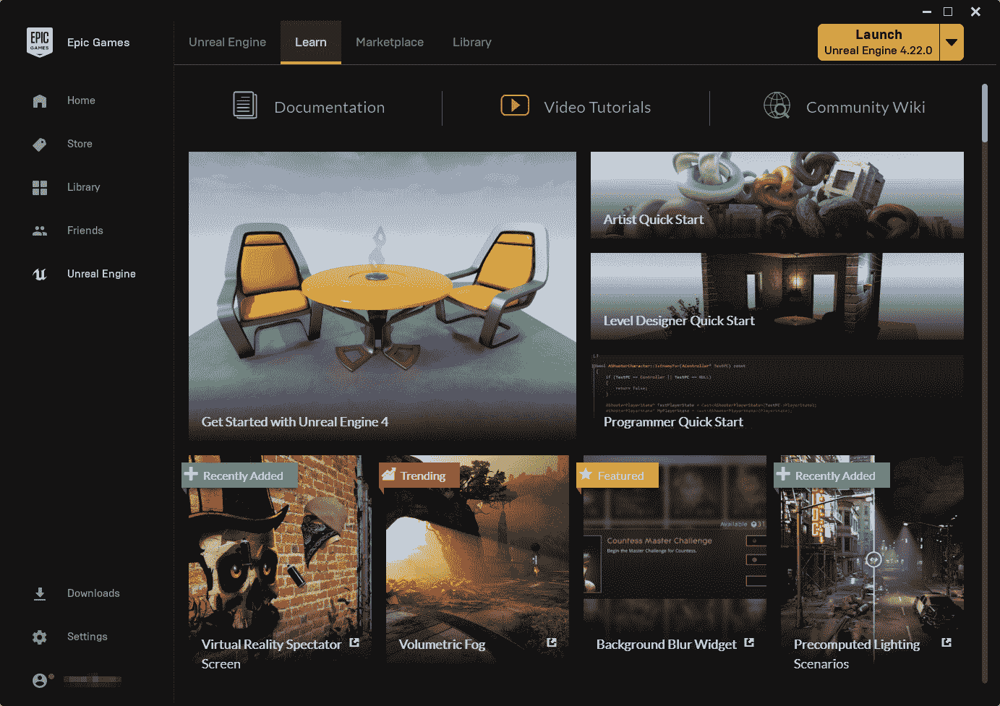

Epic Games 启动器的版本为 4.22；其布局经常变化，但原则保持不变。

在 Unreal Engine 选项卡的顶部，您会找到四个额外的选项卡：

+   虚幻引擎

+   学习

+   市场

+   库

我们将在一会儿查看这些选项卡，但首先，请找到它们右侧的 Install Engine 按钮。默认情况下，此按钮会安装引擎的最新稳定版本。让我们这样做。

# 安装引擎

当您点击安装按钮时，如果尚未选择 Library 选项卡，启动器将切换到 Library 选项卡，并要求您选择安装位置。默认位置通常是一个不错的选择，但如果您想在其他位置安装引擎，可以浏览到新位置。

此页面还有一个选项按钮，我们应该花点时间讨论一下它提供的选择：

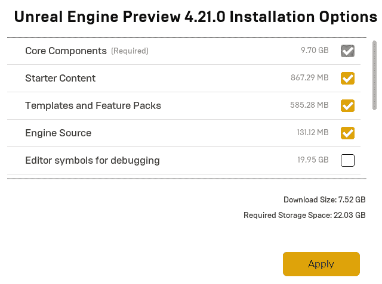

安装选项允许您确定在您的计算机上设置哪些 Unreal Engine 组件。

+   核心组件必须安装-这是运行编辑器所需的最低要求。

+   入门内容包括一些有用的资产，供您开始使用，包括一些材料和模型以及高级照明贴图。我们将在本书的项目中使用这些资产，所以您应该安装它。

+   模板和功能包为你提供了一系列优秀的项目，可以作为你的游戏项目的起点，包括 VR 模板，在本书中我们将在几个项目中使用它。你也应该安装这个。

+   引擎源码是使虚幻引擎与其他引擎不同的一点：虚幻引擎为引擎提供了完整的 C++源代码。这是学习 C++的好方法，当你真正需要了解某个功能的工作原理或者需要弄清楚为什么某个功能的行为出乎意料时，它可以帮你解救。你不需要安装引擎源码，是否安装取决于你自己，但它不会占用很多空间，所以没有理由不安装。如果你预计要进行任何 C++开发，你应该安装它。一旦安装完成，你会在安装引擎版本的目录下的`\Engine\Source`文件夹中找到源代码。

+   调试时需要编辑器符号，如果你计划在 C++中进行调试。如果没有它，你将无法在引擎源代码中设置断点或跟踪执行过程。不过，这些编辑器符号占用了很多空间，所以如果你不打算使用 Visual Studio 进行 C++开发或调试，你可以跳过它，如果你意识到需要它，随时可以安装它。

这些选项在安装引擎版本后可以更改，所以如果你改变主意是否要安装某个选项，这不是个问题。你可以随时添加或删除任何选项。此外，如果你保留了旧版本的引擎，开发人员通常会这样做，如果他们在维护一个遗留项目，使用选项卸载除了核心组件以外的所有内容可以节省空间。

对于本书中的项目，默认选项是可以的——核心组件、起始内容、模板和引擎源码。如果你预计要进行 C++开发或调试，请安装编辑器符号。

在设置完选项后，点击应用并安装引擎。这需要一些时间。（如果你想在等待期间跳到*了解虚幻*部分，你可以在安装完成后回到这里。）

# 编辑 Vault 缓存位置

根据你的系统设置，你可能想要更改虚幻存储 Vault 缓存的位置。Vault 缓存存储了你从市场下载的资产，如项目和资产包。默认情况下，它位于`C:\Program Files (x86)\Epic Games\Launcher\VaultCache`。你应该知道它可能会变得非常大，所以如果你的系统驱动器空间不足，你可能想把它放在其他地方。

如果你想这样做，从 Epic Games 启动器中，选择设置|编辑 Vault 缓存位置，选择一个新位置，然后点击应用。然后，退出设置并退出 Epic Games 启动器（在系统托盘中找到其图标，右键单击它，选择退出——仅仅关闭启动器窗口会将其最小化而不是退出）。当你重新启动启动器时，它将在新位置创建缓存。记得删除旧位置的`VaultCache`目录。（虽然你可以将缓存复制到新位置，但通常最好强制系统创建一个新的缓存，因为这样可以消除你可能不再使用的很多残留文件。）

# 设置派生数据缓存（DDC）

还有一个额外的设置我们建议你做。当你使用编辑器时，虚幻会将资产编译成适用于本地机器硬件的形式。与其每次都强制引擎这样做，不如给它一个地方来存放这些已编译的资产，这样在第一次构建之后，所有东西加载得更快。

你不一定要这样做，但这是个好主意。特别是材质，如果你这样做，编译速度会快得多。如果你看到以下消息，你肯定要设置一个 DDC：

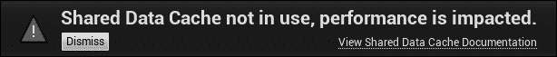

如果您看到此警告，请确保按照此处的指示设置您的 DDC。这将产生很大的影响。

虚幻称此功能为**共享数据缓存**（**SDC**）或**派生数据缓存**（**DDC**）。（这是一个与刚才提到的保险库缓存不同的缓存。）DDC 中的所有内容都是生成的，这意味着随时可以清除其内容。新数据将生成在其位置上。如果更改了您的显卡，最好清空您的 DDC，因为它将包含为旧卡编译的大量资源。

在设置 DDC 时，您有两个选项：如果您在工作室环境中工作，可以在网络可访问的位置设置一个共享 DDC。要做到这一点，请按照此处的说明操作：[`docs.unrealengine.com/en-us/Engine/Basics/DerivedDataCache`](https://docs.unrealengine.com/en-us/Engine/Basics/DerivedDataCache)。

我们要讨论的是另一种选择：为独立开发设置本地 DDC。如果您所在的工作室已经设置了共享 DDC，您可以跳过本地设置。

# 设置本地 DDC

打开 Windows 控制面板 | 系统和安全 | 系统，然后点击高级系统设置链接：

您还可以通过在任何 Windows 资源管理器窗格上右键单击“此电脑”，然后选择“属性”来到这里。

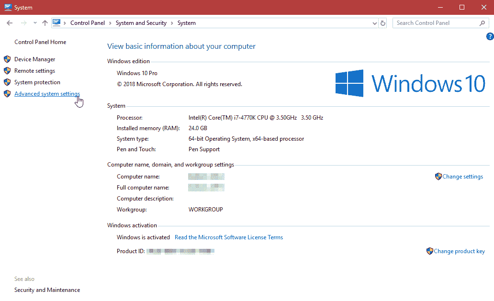

在系统控制面板的左侧找到高级系统设置链接

在高级系统设置窗格中，点击环境变量按钮：

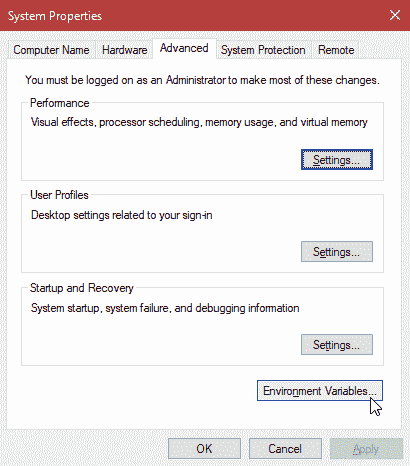

环境变量按钮位于系统属性 | 高级中。您需要管理员权限才能进行编辑。

在出现的编辑环境变量对话框中，点击新建以在用户变量或系统变量部分创建一个新的系统变量。（如果使用前者，DDC 将适用于您的登录，但不适用于其他登录到同一台机器的用户。如果将变量放在系统变量中，它将适用于所有用户。）

将 UE-SharedDataCachePath 输入为变量名，并为其值浏览到您想要存储派生数据的目录。如果您正在构建具有大量艺术内容的项目，您的 DDC 可能会占用超过 10 GB 的空间，因此请将其放在有足够空间的驱动器上：

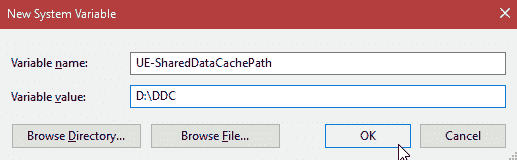

创建一个名为 UE-SharedDataCachePath 的变量，并将其设置为您想要存储 DDC 的位置。

点击确定保存。*在此生效之前，您需要重新启动计算机*。

如果您的 DDC 开始积累许多您不再使用的项目的杂散资源，或者如果您更改了视频硬件，可以安全地清除其内容；编辑器将重新生成缓存。

# 启动引擎

引擎安装完成后，让我们启动它以验证一切是否正常工作。

在 Epic Games 启动器的左侧点击启动按钮，或在库选项卡的 ENGINE VERSIONS 中点击启动按钮：

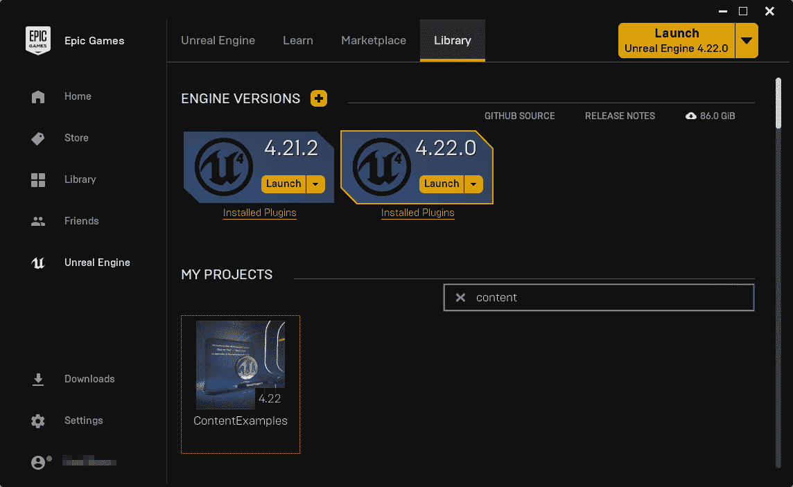

库选项卡显示已安装的引擎版本、项目、插件和资产包。

如果您以前从未在计算机上启动过虚幻引擎，它可能会要求您允许安装一些先决条件。请允许。引擎还可能要求获得通过 Windows 防火墙进行通信的权限。也请允许。

如果一切正常运行，您应该会看到一个类似于这样的窗口：

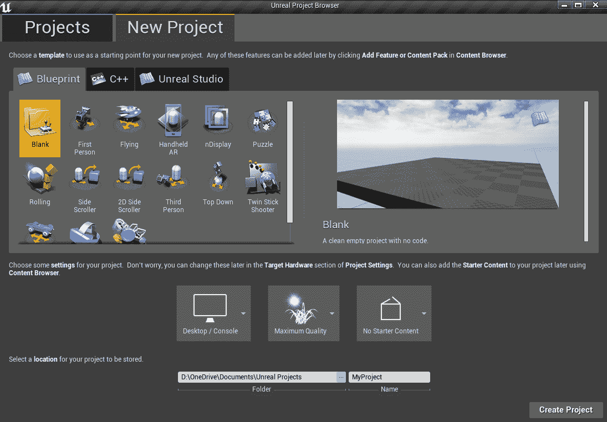

未指定要加载的项目时，每次启动引擎时都会出现虚幻项目浏览器。

让我们创建一个空的蓝图项目，只是为了确保一切正常工作。（我们将在下一章中深入讨论创建项目的内容，但现在我们只是想测试一切。）

选择新项目选项卡。在蓝图选项卡下，选择空白，并将所有选项保持默认。选择一个合理的位置，然后点击创建项目。

编辑器应该打开您的新项目，您应该准备好了。

如果您正在为桌面 VR 开发（而不是移动设备），让我们进行一个快速测试以确保一切正常。如果您正在为移动 VR 开发，我们将在下一节中介绍。

在编辑器工具栏中，找到播放按钮右侧的下拉菜单。将其拉下并选择 VR 预览：

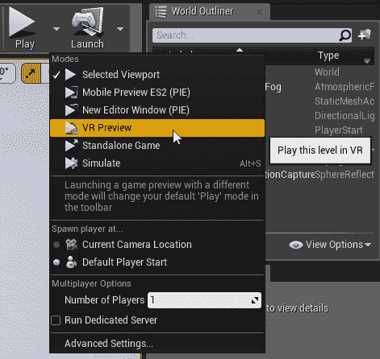

一旦您选择了播放模式，这将成为播放按钮的默认行为，直到您更改它。

如果 VR 预览被禁用，请检查您的头显是否正确连接，并且 Oculus 或 Steam VR 软件是否正在运行且没有显示任何警告或错误。

一旦您在 VR 中启动，您应该在头显中看到您的场景。它可能不是世界上最令人兴奋的场景，而且您会意外地漂浮在地板上方（我们将在下一章中学习如何正确设置 VR 场景），但您应该在其中。恭喜！一切正常！

# 为移动 VR 做准备

移动 VR 头显（如三星 Gear 和 Oculus Go）是与您的 PC 分开的设备，因此您不能像使用桌面头显那样简单地进入 VR 预览。相反，您需要打包项目并将其部署到设备上，以便直接在头显上运行。您需要设置一些东西才能实现这一点。

# 创建或加入 Oculus 开发者组织

首先，如果您要开发基于 Oculus 的移动 VR 平台，您需要在 Oculus 上注册为开发者。我们假设您已经创建了一个 Oculus 账户，因为您必须这样做才能使用头显。如果您还没有这样做，请先注册并登录。

现在，导航到[`dashboard.oculus.com/organizations/create/`](https://dashboard.oculus.com/organizations/create/)并按照注册开发者的步骤进行操作。如果您加入的是现有组织而不是创建自己的组织，请联系管理员将您添加到注册开发者列表中。

# 在 Oculus Go 上将您的 VR 头显设置为开发者模式

一旦您注册为开发者，您将能够使用 Oculus 移动应用程序将您的头显设置为开发者模式。在将自己的项目部署到设备之前，您需要这样做。

在应用程序中，导航到设置 | [您的头显] | 更多设置 | 开发者模式，并打开开发者模式。

如果您无法执行此操作，请确认您的 Oculus 账户是否与开发者组织相关联。

# 安装 Android 调试桥（ADB）

三星 Gear 和 Oculus Go 都运行在谷歌的 Android 操作系统上。您需要安装驱动程序才能让您的 PC 与 Android 设备通信。为此，我们将安装 Android 调试桥（ADB）驱动程序。

导航到 ADB 2.0 下载页面，网址为[`developer.oculus.com/downloads/package/oculus-go-adb-drivers/`](https://developer.oculus.com/downloads/package/oculus-go-adb-drivers/)，下载并解压`.zip`文件，然后右键单击`android_winusb.inf`并选择安装。

有关 ADB 以及如何使用它与 Oculus Go 和三星 Gear 头显进行通信的更多信息，请参阅：[`developer.oculus.com/documentation/mobilesdk/latest/concepts/mobile-adb/#mobile-android-debug-intro`](https://developer.oculus.com/documentation/mobilesdk/latest/concepts/mobile-adb/#mobile-android-debug-intro)。

让安装完成，然后我们将安装 Android SDK。

# 设置 NVIDIA CodeWorks for Android

为了开发 Android 软件，您需要安装一些**软件开发工具包**（**SDK**）和其他资源，并将它们配置为相互配合。幸运的是，使用 NVIDIA 的**CodeWorks for Android**安装程序可以轻松完成此操作。

Epic 在您的引擎安装中包含了所需的安装程序。导航到您安装 Unreal Engine 的目录，找到`Engine\Extras\AndroidWorks\Win64`。运行找到的 CodeWorksforAndroid 安装程序：

```cpp
C:\Program Files\Epic Games\UE_4.21\Engine\Extras\AndroidWorks\Win64\CodeWorksforAndroid-1R6u1-windows.exe
```

接受默认选项，并在完成后*重新启动*计算机。

# 验证 HMD 是否能与您的 PC 通信

在计算机重新启动后返回，我们要检查您的 PC 是否能与 Android 头戴设备通信。

导航到刚刚安装 Android SDK 的位置。默认情况下，这将是`C:\NVPACK\android-sdk-windows`。查找`platform-tools`目录。

在此目录中，*Shift* *+右键单击*以打开包含`Open PowerShell 窗口`命令的上下文菜单。如果您在不按住*Shift*的情况下右键单击，则上下文菜单不会包含 PowerShell。如果您使用的是较旧版本的 Windows 10，或者已禁用 PowerShell，则*Shift* +右键单击将打开一个命令行。

在 PowerShell 中，键入`./adb devices`。

如果您使用的是 PowerShell，则必须在启动程序之前加上`./`。 （在 Unix 系统上，要求在可执行调用之前加上`./`是一项安全功能，以防止您意外启动可执行文件。Windows 现在也遵循此约定。）如果您使用的是传统命令提示符，则只需键入可执行文件的名称：`adb devices`。最好养成使用 PowerShell 而不是传统命令提示符的习惯。它更安全，而且功能更强大。

看一下下面的屏幕截图：

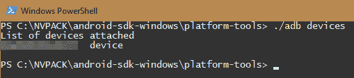

adb devices 命令列出当前连接的 Android 设备。

如果 Go 或 Gear 显示为*未经授权*，这意味着您的 PC 能够看到它，但头戴设备尚未允许 PC 与其通信。戴上头戴设备并接受应该出现的确认对话框。再次运行`adb devices`并确认头戴设备现在显示为设备。

# 为三星 Gear 生成签名文件

您无需创建签名文件即可部署到 Oculus Go 或 Quest。

对于三星 Gear 设备，您需要创建一个**Oculus 签名文件**（**osig**）。

按照[`dashboard.oculus.com/tools/osig-generator/`](https://dashboard.oculus.com/tools/osig-generator/)上的说明，将生成的文件放置在 Unreal 安装目录下的`\Engine\Build\Android\Java\assets`目录下。如果 assets 目录尚不存在，请创建它。

有关签名文件的更多信息，请查看此处：[`developer.oculus.com/documentation/mobilesdk/latest/concepts/mobile-submission-sig-file/`](https://developer.oculus.com/documentation/mobilesdk/latest/concepts/mobile-submission-sig-file/)。

# 将测试项目部署到设备

现在，我们已经安装了所有必需的软件并验证了我们的 PC 能够看到我们的 Android 头戴设备，让我们创建一个项目并将其部署到设备上，以确保一切正常工作。

# 设置一个测试项目

从 Epic 启动器中启动 Unreal Engine，在项目浏览器中选择新项目。选择蓝图选项卡，空白模板，并将项目设置为 Mobile/Tablet，可扩展的 3D 或 2D，无起始内容。选择项目的位置并创建它：

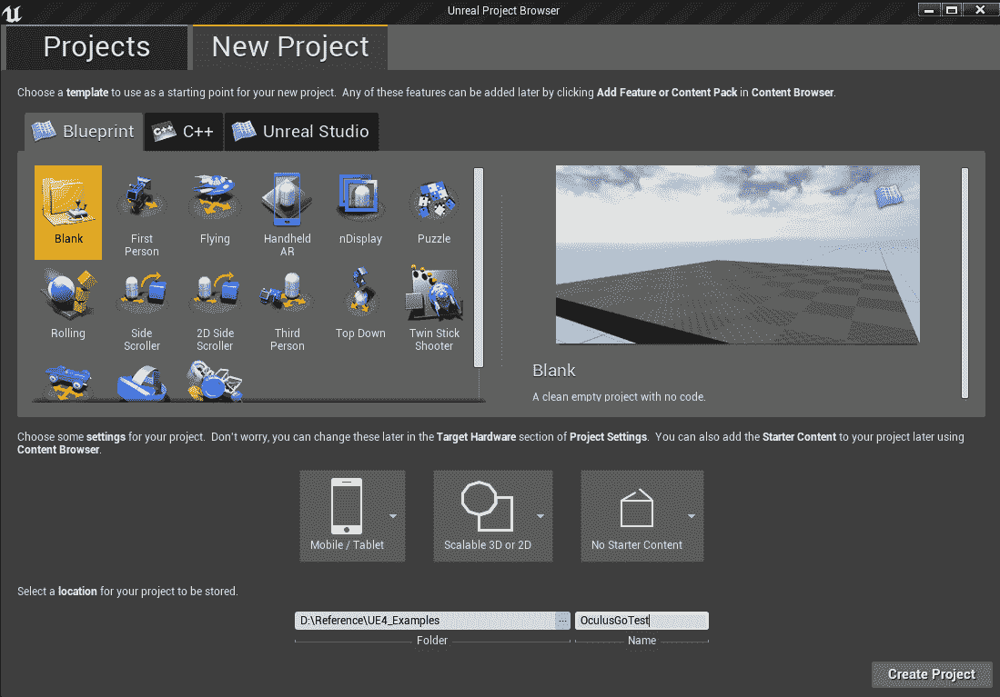

您在此处设置的选项将确定项目的起始设置，但您可以稍后更改它们。

# 检查您的 OculusVR 插件是否已启用

项目启动后，选择“设置”|“插件”|“虚拟现实”，并验证“OculusVR”插件是否已启用。（它应该已经启用了。）

# 设置默认地图

由于我们将在 Gear 或 Go 上作为独立可执行文件运行此项目，我们需要告诉它在启动时打开哪个地图。保存编辑器启动时创建的“空地图”，并给它任何你想要的名字。

选择“设置”|“项目设置”|“项目”|“地图和模式”，并将刚保存的地图设置为“编辑器启动地图”和“游戏默认地图”。

# 清除默认的移动触摸界面

通常，移动应用程序假设您将触摸屏幕来操作它们，但当然在您的头盔中不会发生这种情况，所以我们需要从项目中清除这个默认设置。

从“项目设置”中，选择“引擎”|“输入”|“移动”，并从“默认触摸界面”下拉菜单中选择“清除”，将其设置为“无”。

# 设置 Android SDK 项目设置

现在，我们需要为我们的 Android 头盔配置项目。

在“平台”|“Android”|“APK 打包”下，点击“立即配置”，并接受 SDK 许可证（您只需要接受一次许可证）：

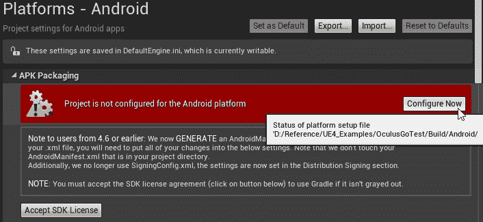

点击“立即配置”按钮将在项目的 Build/Android 目录下写入一个 project.properties 文件。

我们还需要在这个类别下设置一些设置：

+   最低 SDK 版本：21

+   目标 SDK 版本：21

+   在 KitKat 及以上设备上启用全屏沉浸模式：True

您会看到一些旧的文档告诉您将最低和目标 SDK 版本设置为 19。这对于三星 Gear 是正确的，但对于 Oculus Go，您必须选择版本 21。

向下滚动到“高级 APK 打包”部分，并设置以下内容：

+   将 AndroidManifest 配置为部署到 Oculus Mobile：True

旧的步骤将把这个设置称为“配置 Android 清单以部署到 Gear VR”。它的名称已经改变了。

# 设置 Android SDK 位置

现在，选择“平台”|“Android SDK”，并设置以下内容（根据您安装 SDK 的位置进行调整）：

+   Android SDK 的位置：`C:/NVPACK/android-sdk-windows`

+   Android NDK 的位置：`C:/NVPACK/android-ndk-r12b`

+   ANT 的位置：`C:/NVPACK/apache-ant-1.8.2`

+   JAVA 的位置：`C:/NVPACK/jdk1.8.0_77`

+   SDK API 级别：`latest`

+   NDK API 级别：`android-21`

参考以下截图：

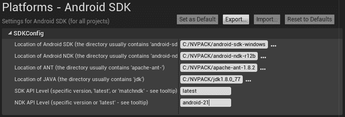

确保你在这里指定的目录是你驱动器上实际存在的位置。

请注意，当您更新 Android SDK（每次更新引擎版本时都必须记住这样做）时，这些目录名称将会改变。在更新后确保您为每个目录指定了正确的目录，否则您将遇到一些令人难以理解的错误。

# 启动测试项目

关闭项目设置，并找到“启动”按钮旁边的下拉菜单。打开它，您应该能够看到您移动 VR 头盔的序列号：

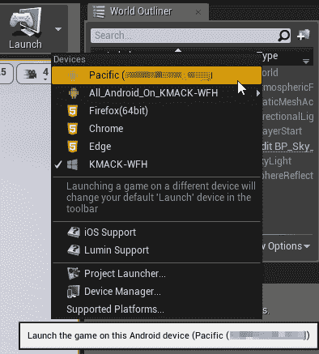

这里列出的设备将根据您的项目支持的平台和找到的设备而有所不同。

选择要启动的头戴设备。编辑器在准备好之前短时间内变得无响应是完全正常的。请耐心等待。一旦编辑器再次响应，您应该会看到类似以下的内容：

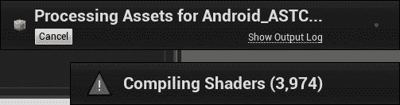

Android 资源处理进度指示器

选择“窗口”|“开发者工具”|“输出日志”不是一个坏主意，这样你就可以看到它在做什么，但这不是必需的。点击“显示输出日志”链接将会做同样的事情。

养成观察输出日志的习惯。很多开发者忽视了这一点，但你不应该。通过观察日志，你可以了解引擎正在做什么。

第一次运行时需要一些时间，因为需要编译很多着色器。后续运行将更快。

资产编译完成后，虚幻将把它们复制到您的设备上：

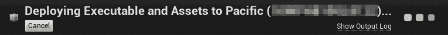

部署时间可能会因需要传输的数据量而有所不同。

部署完成后，场景应该在您的设备上运行：

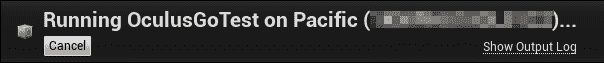

一旦此对话框指示项目在设备上运行，您就可以准备测试它了。

戴上头盔，您应该能够进入场景。恭喜！您刚刚将项目部署到了移动 VR 头盔上！

# 使用 Epic Games 启动器

在我们继续之前，让我们先看一下 Epic Games 启动器-这里有很多有用的材料，这应该是您学习的起点。花些时间四处看看，看看有哪些资源可用。很容易忽视这些资源，但如果您习惯了了解在需要时可以学习和找到信息的地方，您将能更快地取得进展。

启动器的虚幻引擎选项卡分为四个主要部分：

+   虚幻引擎

+   学习

+   市场

+   库

让我们逐个查看它们。

# 虚幻引擎选项卡

虚幻引擎选项卡显示了特色内容和项目，这些内容在您使用引擎的时间越长，对您来说就越有意义。作为新用户，特别注意主横幅下面的一排图标。这些是宝贵的资源：

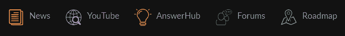

虚幻引擎选项卡截至虚幻 4.22 版本

+   新闻链接是了解最新情况的好方法；它主要关注新功能、事件和引擎的有趣用途。随着您在引擎中花费的时间越来越多，这个链接对您来说会变得更有意义。

+   YouTube 链接将带您进入虚幻引擎的 YouTube 频道。这是寻找深入教程、功能亮点和项目重点的最佳地方之一。特别是在功能亮点视频中，有很多信息是您在其他地方找不到的。

+   AnswerHub 是开发者提问和回答问题的重要资源。几乎任何时候您有问题，都应该首先在这里搜索答案。您很有可能会找到您要找的内容。在提问之前，不要害羞，但请尽量搜索现有的问题和答案，以免重复提问。同时，尽量回答您知道答案的问题，这就是社区的运作方式。

+   论坛是讨论与引擎相关的所有主题的地方，也是了解最新情况的好地方。大多数插件开发者也在论坛上与用户保持联系。这里有一个专门讨论 VR 和 AR 开发的论坛：[`forums.unrealengine.com/development-discussion/vr-ar-development`](https://forums.unrealengine.com/development-discussion/vr-ar-development)。

+   路线图链接将带您进入一个 Trello 页面，描述即将发布的内容以及更远的未来计划。在您的虚幻开发生涯早期，这可能对您来说并不那么有意义，但随着您深入了解引擎，即将到来的变化将变得重要起来。

# 学习

这是启动器上最重要的资源之一。您不会后悔在这里花费的时间。

让我们首先看一下顶部栏：

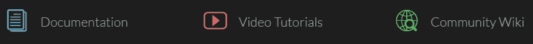

学习选项卡截至虚幻 4.22 版本

+   文档链接将带您进入虚幻引擎的文档主页[`docs.unrealengine.com/en-us`](https://docs.unrealengine.com/en-us)。文档页面上的“开始使用 UE4”链接是学习艺术、关卡设计和编程流程基础知识的好地方。如果您是虚幻引擎的新手，我们建议您先学习这些基础知识，以便熟悉编辑器。如果您已经掌握了这些基础知识，那么在构建本书中的项目时，您将会更好地完成，并且能够更好地利用它们。在掌握了基础知识之后，您可以将这个文档页面视为您在引擎中使用新工具或系统时的标准参考。

+   视频教程链接将带您进入[`academy.unrealengine.com/`](https://academy.unrealengine.com/)，这是一个在线学习网站，提供大量关于特定行业、角色、工作流程和概念的详细视频教程。这些课程非常有价值，是了解引擎不同部分如何相互配合以满足您需求的好方法。

+   社区维基页面比其他页面更少用。正如我们之前提到的，该页面上的内容不能保证是最新的，甚至是正确的。了解它的存在是值得的，但通常在论坛和文档中搜索信息比在维基上搜索更好，因为论坛上的错误信息通常会被其他用户迅速纠正，而在维基上则可能滋生。

# 内容示例项目

在这个栏下面，我们有一些特色链接，可以快速开始指南和博客文章，以及一些引擎功能示例。其中最重要的是内容示例项目。这里的所有项目都值得查看特定主题，但内容示例应该是您的常规参考。现在让我们安装它。

点击内容示例项目以打开其详细页面，并点击页面上的“创建项目”链接：

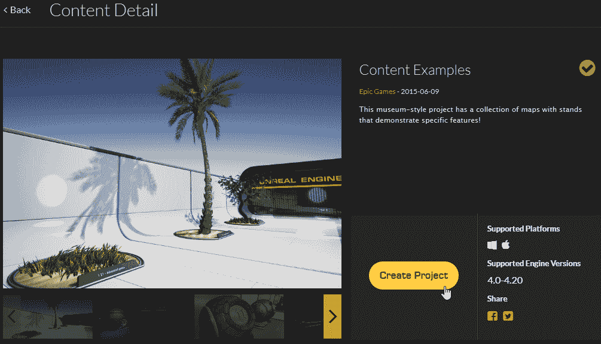

内容示例项目详细页面

系统会询问您想要将项目放在哪里，以及您想要使用哪个引擎版本来创建它。将其放在一个合理的位置（维护一个专门用于虚幻参考项目的目录是个不错的主意），并选择最新的引擎版本。点击“创建”来创建项目。项目创建后会自动启动，以后您可以从库选项卡的“我的项目”部分访问它。让我们允许项目启动，或者在创建后从库选项卡中特定地启动它：

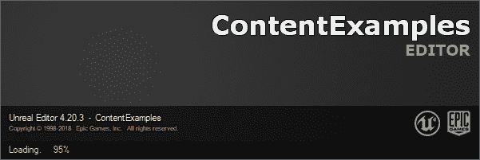

启动项目时，请注意虚幻编辑器的版本号和加载进度。

项目第一次启动时，初始化可能需要一些时间。虚幻引擎正在为您的计算机构建资源。如果在 45%或 95%处卡住了几分钟，不要担心，它并没有崩溃。它正在构建动画、着色器和其他资源。后续启动将会快得多。

项目打开后，点击“文件”|“打开关卡”（或按下 Ctrl + O）打开其中一个演示地图。点击播放按钮，并使用标准的 WASD 键盘控制来移动和查看示例：

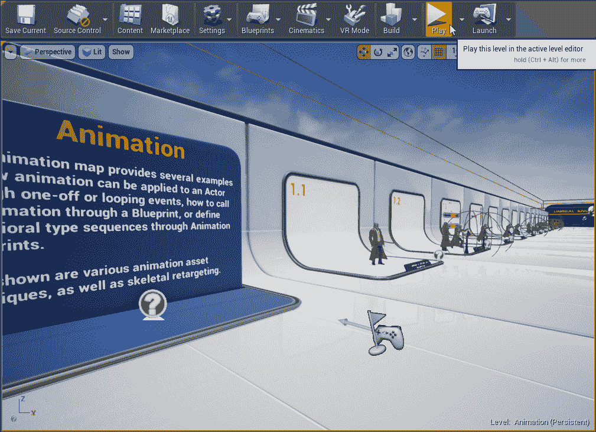

其中一个演示关卡包含在内容示例项目中

花些时间浏览这个项目，熟悉编辑器，并了解虚幻引擎的功能。以后，当您想在项目中添加某些内容时，习惯性地检查一下“内容示例”中是否有示例可以帮助您弄清楚如何完成。

说真的，这是您可以使用的最有用但经常被忽视的资源之一。在“内容示例”项目中有很多好东西。

# 游戏概念和示例游戏

在学习页面的底部，有一系列展示特定游戏玩法概念和示例游戏的项目。这些是学习更高级主题和了解虚幻引擎中完成项目的宝贵资源。这些项目的内容往往更加高级，因为它们大多代表了可发布的完成游戏。在下载并开始探索之前，您可能需要在引擎中花些时间。现在，您应该知道它们的存在。如果您感到好奇并且想要提前了解，可以随意浏览。

# 市场

在本书中，我们将使用市场中的免费资源，所以您应该花些时间查看这个选项卡：

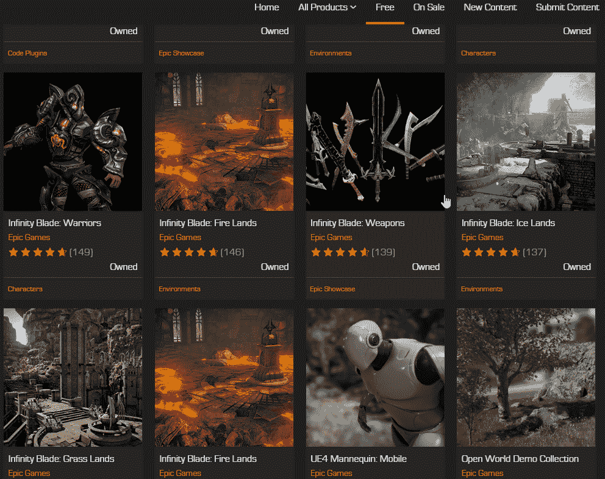

截至 Unreal 4.20 的市场内容

Epic 在市场中提供了大量高质量的免费素材。通常，如果 Epic 取消了其内部开发的游戏，它会将游戏素材免费提供给市场。在构建学习项目时，要充分利用这些资源。*无尽之剑*的素材对于 VR 项目尤其有用，因为它们最初是为移动游戏设计的，所以对于 VR 的严格要求进行了合理的优化。在接下来的章节中，我们将看到如何将市场内容添加到现有项目中。同时，也不要忽视市场上的付费素材。其中很多素材都非常优秀，可以极大地帮助您构建项目，无论是用于原型还是发布的作品。

# 库

库选项卡是您维护已安装的引擎版本、打开项目以及访问从学习选项卡和市场下载的插件和内容包的地方：

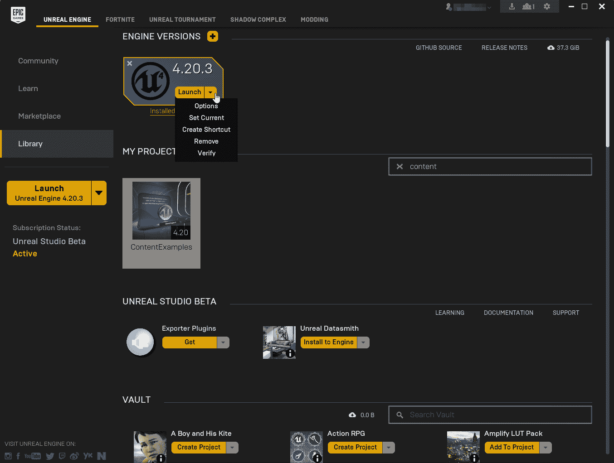

截至 Unreal 4.20 的库面板

使用“ENGINE VERSIONS”部分来更新已安装的引擎版本、安装新的引擎版本以及修改其选项。

关于引擎版本的一点说明：如果您看到已安装的引擎版本上出现指示器，表示可以进行更新，那么您应该进行更新。引擎版本的更新，例如从 4.20.2 到 4.20.3，通常是安全的，因为它们涉及错误修复，不会以可能破坏项目的方式改变任何工作方式。

除了更新当前安装的引擎版本外，您还可以使用“ENGINE VERSIONS”标签旁边的“+”号来添加其他已安装的版本。这样可以安装旧版本，以便打开尚未更新到当前版本的旧内容，或者安装预览版本，以便测试即将发布的内容。

在使用预览版本时要小心。它们旨在让您提前了解，但不能保证稳定性。不要在预览版本上进行关键任务。请在发布版本上工作，并使用预览版本来查看即将到来的内容，或者了解在切换到新版本时可能需要更新项目的方式。

My Projects 部分允许你启动你的项目。项目缩略图上标有当前设置的引擎版本号。你可以通过启动新版本并将该项目打开到新版本中来更新项目的引擎版本。在这样做时，会弹出一个对话框询问你是否要复制项目或在原地转换。在原地转换是危险的；建议你在复制的副本上进行更新，以确保项目中没有任何冲突。（这就是为什么原地转换选项被隐藏在“更多选项...”链接下的原因。）如果你有一个非常旧的项目，落后几个版本，通常最好一次转换一个版本，而不是尝试跳过几个版本。这样做可能会成功，但结果完全取决于你尝试跳过的版本数量和项目中的内容：

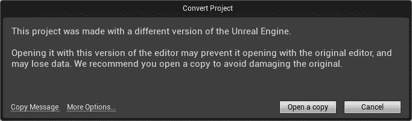

转换项目对话框提供了几个选项，以确定你希望如何处理引擎更新。

你不必使用 Epic Games Launcher 来启动你的项目；你可以直接导航到保存项目的位置，双击`.uproject`文件来启动与其关联的引擎版本。

Vault 部分包含了你拥有的所有内容，包括学习项目、插件和内容包。你可以在现有项目中添加插件或内容，也可以在这里创建新项目。

大多数情况下，库选项卡将是默认选项卡，因为你将使用它来启动项目，但正如我们刚才提到的，不要忘记其他选项卡。

# 为 C++开发进行设置

这部分是完全可选的。本书中的项目都不需要你使用 C++进行开发，但是我们偶尔会强调一些原生代码的内容，以供那些对深入了解感兴趣的人参考。如果你不打算进行编码工作，或者如果代码页让你感到非常困惑，完全可以跳过这一部分和接下来的部分。

在开发虚幻引擎时，绝对不需要使用 C++。蓝图可视化脚本语言非常强大，几乎可以实现任何功能。大多数应用程序，包括相当高级的项目，都可以完全使用蓝图构建。许多新手虚幻引擎用户看到 C++支持后会担心必须学习这门语言才能使用引擎。其实不需要。（如果你有兴趣学习 C++，这也是一个很好的方式。）

还在这里吗？太好了。如果你计划使用 C++进行开发，首先需要一个编辑器和编译器来构建你的代码。这种应用程序被称为**集成开发环境**（**IDE**）。在 Windows 上开发虚幻引擎 4.20 及更高版本时，应该使用微软的**Visual Studio 2017**（**VS2017**）。Visual Studio 有几个版本，但是对于虚幻引擎的开发，你不需要任何专业版或企业版的功能。免费的社区版已经包含了你所需要的一切。

# 安装 Microsoft Visual Studio Community

前往**Microsoft Visual Studio Community**页面，[`visualstudio.microsoft.com/vs/community/`](https://visualstudio.microsoft.com/vs/community/)，下载安装程序。运行安装程序时，你将看到几个选项：

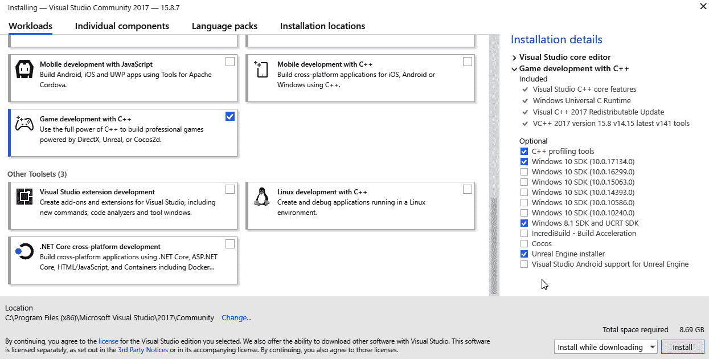

Visual Studio Community 2017 设置对话框确定你的安装将配置为处理哪些语言和开发任务。

在工作负载选项卡下，选择使用 C++进行游戏开发，然后在右侧的摘要侧边栏上确保你已经选中了以下内容：

+   虚幻引擎安装程序（必需）

+   Windows 10 SDK（必需，应该已经默认选中）

+   Windows 8.1 SDK（在 VS 2017 上是必需的，应该已经默认选中）

+   C++性能分析工具（可选但有用）

如果您要为三星 Gear 或 Oculus Go 开发，请确保还包括以下内容：

+   Unreal Engine 的 Android 支持（Gear 或 Go 开发所需）

这将安装 Java 开发工具包和您需要与 Gear 和 Go 通信的 Android 工具：

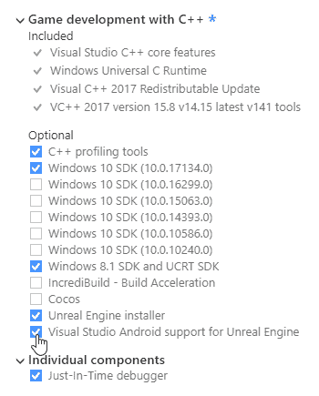

Visual Studio 2017 安装详细信息面板允许您确定已安装的选项。

通过设置这些选项，您已经告诉 Visual Studio 包括 C++语言支持，并包括运行和开发 Unreal 所需的支持文件。

这些设置很重要。Visual Studio 2017 不再自动假设您将进行 C++开发，因此在安装时需要选择要支持的语言。如果您后来意识到错过了某些内容，请使用添加和删除程序控制面板修改您的 VS2017 安装选项。

# 推荐设置

在开始工作之前，您可能需要在 Visual Studio 中进行一些更改。这些不是必需的，但可以使其与 Unreal 更好地配合。详细文档在此处：[`docs.unrealengine.com/en-us/Programming/Development/VisualStudioSetup`](https://docs.unrealengine.com/en-us/Programming/Development/VisualStudioSetup)。请按照此页面进行操作并进行推荐的更改。

以下是页面要求您进行的更改的快速概述：

+   增加标准工具栏上的解决方案配置控件的宽度，因为 Unreal 解决方案配置名称可能太长而无法阅读。

+   确保在标准工具栏上显示解决方案平台控件。默认情况下应该已经显示。

+   确保在工具|选项|项目和解决方案|构建完成后始终显示错误列表已关闭。

+   设置工具|选项|文本编辑器|C/C++|视图|显示非活动块为 False。

+   确保在工具|选项|文本编辑器|C/C++|高级下，您的 Intellisense 选项未被禁用。旧的说明会告诉您禁用 Intellisense，因为它在处理 Unreal 的源代码时效果不佳。现在情况已经不同了，告诉您关闭它的说明已经过时。如果您过去关闭了 Intellisense，请现在重新打开它。

# UnrealVS 插件

现在您已经安装了 Unreal Engine 并设置了 Visual Studio，我们将要安装 UnrealVS 插件到 Visual Studio，以简化您在使用 Unreal 时在 Visual Studio 中执行的一些常见任务。

# 安装 UnrealVS 插件

确保关闭 Visual Studio，并导航到您安装当前 Unreal Engine 版本的位置，在`Engine\Extras`下找到`UnrealVS`目录。打开与您的 Visual Studio 版本对应的目录（在我们的情况下是 VS2017），运行`UnrealVS.vsix`安装程序来安装插件。

对于 Unreal 4.20，将其安装在标准位置。例如，您可以在这里找到插件：

`C:\Program Files\Epic Games\UE_4.20\Engine\Extras\UnrealVS\VS2017`。

# 打开 UnrealVS 工具栏

完成插件安装后，打开 Visual Studio，并在工具栏的空白区域右键单击以设置活动工具栏。打开`UnrealVS`工具栏：

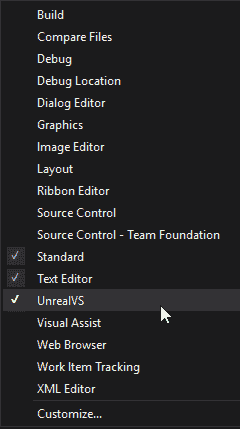

在 Visual Studio 2017 中右键单击空白工具栏区域，可以选择可见的工具栏。

有关配置和使用 UnrealVS 的其他文档，请参阅此处：[`docs.unrealengine.com/en-us/Programming/Development/VisualStudioSetup/UnrealVS`](https://docs.unrealengine.com/en-us/Programming/Development/VisualStudioSetup/UnrealVS)。通过安装并打开工具栏，您已经完成了一切所需的操作，但是浏览一下此页面可以了解 UnrealVS 为您提供了什么以及如何使用它。

# Unreal 调试支持

在我们准备好之前，还有一件事情要做，那就是在 Visual Studio 中为 Unreal 安装一个调试支持文件。

导航到您的引擎安装目录，找到`Engine\Extras\VisualStudioDebugging`。在那里找到`UE4.natvis`文件并复制它。

将其粘贴到以下两个位置之一。

您可以将其安装到 Visual Studio 的安装位置，即以下路径（您需要在计算机上具有管理员权限才能执行此操作）：

+   `[VisualStudioInstallPath]\Common7\Packages\Debugger\Visualizers\UE4.natvis`

+   示例：`C:\Program Files (x86)\Microsoft Visual Studio\2017\Community\Common7\Packages\Debugger\Visualizers`

或者，您可以将其安装到个人的“文档”目录中。如果您在用户配置文件的“文档”目录中检查，应该会找到一个在安装 IDE 时自动创建的 Visual Studio 2017 目录。如果该目录中已经存在一个 visualizers 子目录，请将`UE4.natvis`粘贴到其中。如果没有，请创建该目录并将 natvis 文件放在其中。

+   `[UserProfile]\Documents\Visual Studio 2017/Visualizers/UE4.natvis`

+   示例：`D:\OneDrive\Documents\Visual Studio 2017\Visualizers`

`.natvis`文件包含了帮助 Visual Studio 显示特定解决方案中定义的本地数据类型内容的指令。Unreal 定义了自己的自定义字符串类型（`FString`）、自定义数组类型（`TArray`）和其他许多类型。`UE4.natvis`告诉 Visual Studio 在调试时如何以可读的方式显示这些类型中包含的数据。

# 测试一切是否正常

现在，我们准备验证是否已正确设置所有内容。从 Epic Games 启动器中启动当前的引擎版本。在新项目选项卡下，选择 C++。

如果您看到以下警告，请确保您已安装 Visual Studio 2017，并且已选择使用 C++进行游戏开发，并选择了推荐的设置：


如果您看到这个警告，要么您还没有安装 Visual Studio，要么您还没有设置所需的安装选项。

如果您已经安装了 VS2017 并且看到警告，这意味着您缺少我们刚刚提到的所需选项之一。使用“添加或删除程序”控制面板修改您的 VS2017 安装，并添加这些选项。

如果您没有看到任何警告，那么您可以准备创建一个快速测试项目。让我们在 C++选项卡下选择一个基本代码模板，使用默认选项，并选择一个位置和名称：

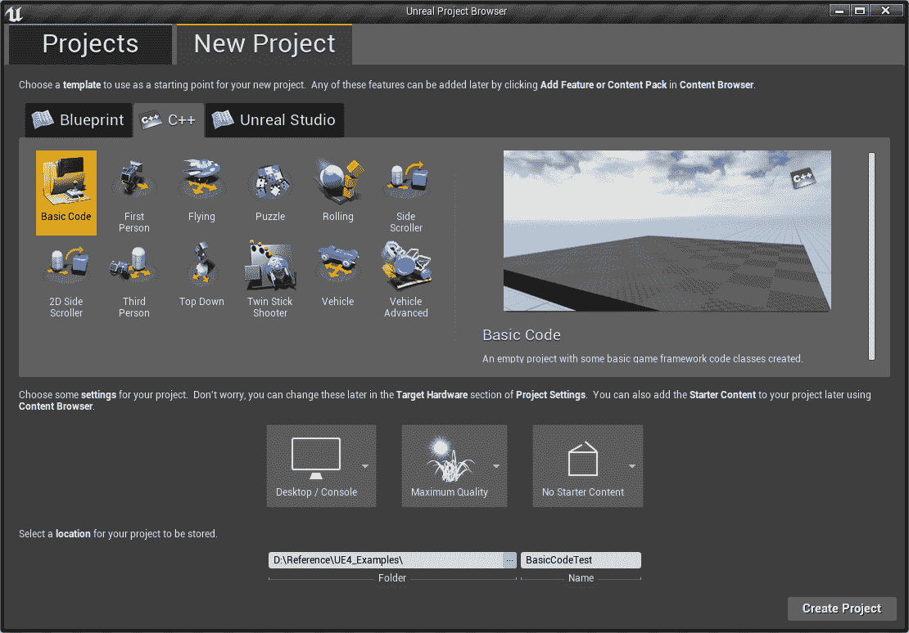

创建 C++项目的方式与创建蓝图项目类似。

点击创建项目，并允许工具为您创建一个新项目。稍等片刻。如果您已经正确设置了所有内容，Unreal 编辑器应该会打开您新创建的项目，而 Visual Studio 2017 应该会打开新创建的项目解决方案文件。现在让我们关闭 Unreal 编辑器，然后从 VS2017 中构建和启动新项目，看看如何操作。

在 Visual Studio 的解决方案资源管理器选项卡中，找到游戏树下的新项目解决方案。右键单击它并选择设置为启动项目：

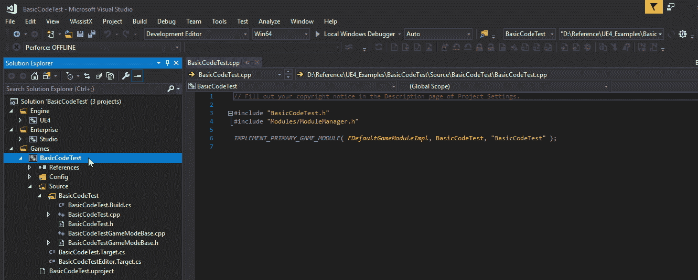

左侧的解决方案资源管理器显示了项目中包含的文件。右侧的工作区显示了当前加载文件的内容。

再次右键单击它，选择 UnrealVS Quick Build | Win64 | DebugGame Editor。您的项目应该开始构建。

在使用 C++开发虚幻时，您通常会使用两个解决方案配置：**DebugGame Editor**和**Development Editor**。Visual Studio 是所谓的**优化编译器**，这意味着它在编译代码时会对代码进行一些修改，以使其运行更快。这有一个优点，即您可以编写易于阅读的代码，而在编译后仍然可以快速运行，但实际上这意味着如果您调试开发构建，不是每个数据位都可见，因为某些变量已经被优化掉了。

调试构建会保留您编写的所有内容，因此运行速度会稍慢一些，但您可以看到每个变量包含的确切内容。大多数情况下，您将希望使用 Development Editor 配置。

您会发现，除了 DebugGame Editor 和 Development Editor 之外，还有 DebugGame 和 Development 配置可用。在编辑器中工作时，您不会使用这些配置；它们不包括编辑器，并且需要将您的内容烹饪成发布就绪的格式。（我们稍后会讨论烹饪。）

对于这个示例，我们选择了一个 DebugGame Editor 配置，这样您就有机会看到编译器构建了一个尚未构建的配置。

一旦您的项目构建完成，请检查输出。如果看起来像这样，您就可以开始了：

```cpp
1>Deploying BasicCodeTestEditor Win64 DebugGame...
1>Total build time: 45.92 seconds (Parallel executor: 27.81 seconds)
1>Done building project "BasicCodeTest.vcxproj".
========== Build: 1 succeeded, 0 failed, 0 up-to-date, 0 skipped ==========
```

现在，在标准工具栏上，使用解决方案配置控件选择刚刚构建的调试编辑器配置：

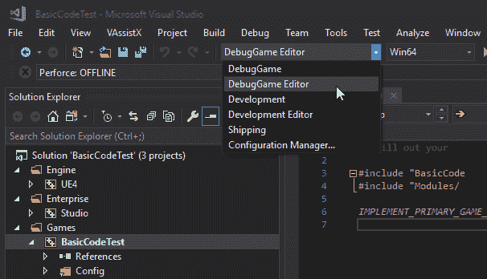

解决方案配置控件确定要创建的构建类型。

按下*F5*，或选择调试 | 启动调试，从 Visual Studio 启动编辑器。如果一切设置正确，您的项目应该启动，并且您的 Visual Studio 窗口应该看起来像这样：

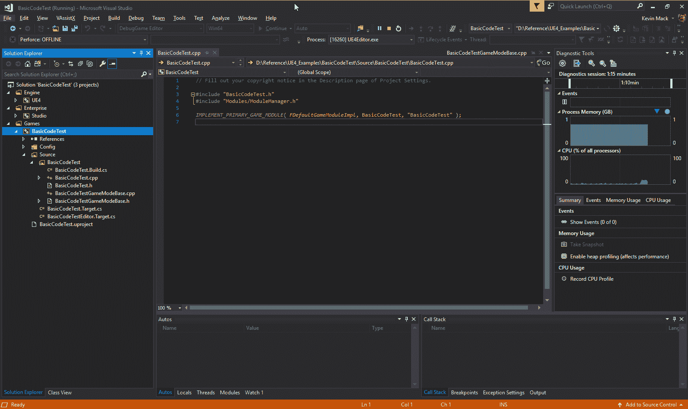

在 Visual Studio Community 2017 中加载的虚幻 C++项目。底部的橙色条表示项目正在运行，并且 Visual Studio 的调试器已连接到它。

恭喜！您现在已经设置好了使用 C++进行开发。

让我们来看一个快速示例，说明为什么这样非常有用。在您的虚幻编辑器中自动创建的默认场景中，从世界大纲中选择 Floor。右键单击它：

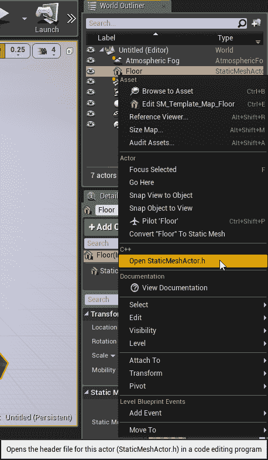

您可以直接从虚幻编辑器中打开 C++文件。

地板是一个静态网格演员。选择打开`StaticMeshActor.h`的选项。您将自动切换到 Visual Studio，并打开`StaticMeshActor`头文件：

如果您无法打开`StaticMeshActor.h`，请检查是否为您的引擎版本安装了引擎源代码。转到库选项卡，在引擎版本下找到您正在运行的版本，并从启动按钮右侧的下拉菜单中选择选项。如果您还没有添加引擎源代码，请添加。

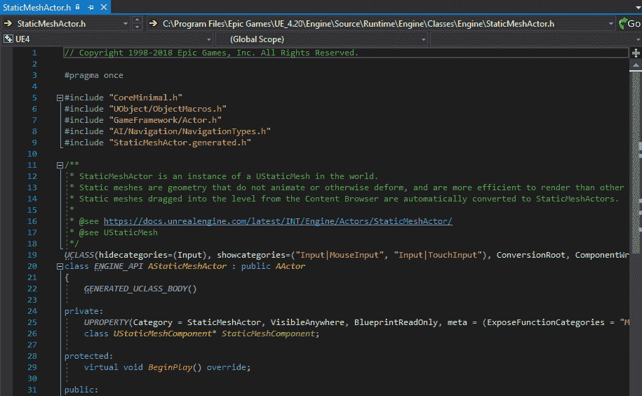

StaticMeshActor 类的 C++头文件描述了该类并声明了其函数。

这是虚幻引擎的许多令人惊奇的事情之一 - Epic 为您提供了源代码 - 所有的源代码。对于编辑器中的任何对象、任何蓝图节点，您都可以查看其下面的源代码。没有黑盒子。再次强调，这绝不是您在虚幻中必须做的事情 - 文档非常好，但如果您面临一个谜团并且真的需要弄清楚发生了什么，能够阅读源代码可能会拯救您的生命。

# 从源代码构建虚幻

您绝对不需要下载源代码并从头构建引擎，几乎您在实际使用中需要做的任何事情都不需要。这一部分包含在这里，以便您有自由进行引擎更改，如果您有需要的话，但您可以安全地跳过这一部分。即使对于专业开发人员来说，从最新的源代码中工作也是罕见的。

下一部分比前面的部分更加可选。只有在您打算修改引擎本身的行为，或者想要使用尚未捆绑到任何发布版本中的新功能时，才需要执行此操作。这也是这个引擎的另一个美妙之处——如果您确实需要它执行某些尚未执行的操作，您可以自行进行更改。此外，如果您进行了改进引擎或可能对其他开发人员有用的更改，您可以使用 GitHub 将您的更改贡献给 Epic。许多开发人员都这样做，其结果是这个引擎以惊人的速度增长和改进。

如果您不需要它，您可以跳过这一部分。我们将在这里深入一点。

# 设置 GitHub 帐户并安装 Git

Unreal 引擎的源代码是通过一个名为 GitHub 的网站进行分发的。Git 是一个版本控制系统（用于管理代码修订并将其分发给用户的系统），而 GitHub 是一个集中存放和共享 Git 存储库的地方。要下载允许您自行构建引擎的 Unreal Engine 源代码，您将需要 Git 和 GitHub。

很多人将 Git 和 GitHub 混淆。它们并不是同一回事。Git 是一个版本控制系统，允许用户跟踪代码的变化、分发这些变化并以许多其他方式进行管理。GitHub 是一个允许用户存储和共享 Git 数据的网站。还有其他网站也可以做到这一点，尽管 GitHub 是最大的，或者您可以完全自己设置一个 Git 存储库。

# 设置或登录您的 GitHub 帐户

如果您计划深入研究 Unreal 开发的最前沿，您首先需要一个 GitHub 帐户。前往[`github.com/`](https://github.com/)并登录，或者如果您还没有帐户，请注册一个。

# 安装 Windows 版 Git

前往[`git-scm.com/`](https://git-scm.com/)，下载适用于 Windows 的 Git。Git 是一个软件配置管理工具，允许您将本地的 Unreal 源代码仓库与 Epic 提供的源代码同步。

使用默认选项进行安装，只有一个例外：当安装程序询问您希望将什么作为 Git 的默认编辑器时，当前选择的选项将是 Vim。对于那些已经习惯使用 Vim 的人来说，Vim 非常好用，但对于其他人来说，它可能非常反直觉，因为它遵循与您使用过的几乎任何其他应用程序完全不同的一套约定。如果您还不是那些使用和喜欢 Vim 的人之一，您几乎肯定会想选择另一个文本编辑器：

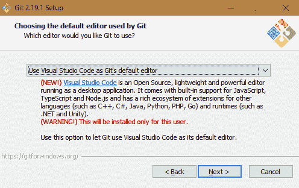

在设置 Git 时，您可以选择首选的文本编辑器作为 Git 的默认编辑器。

无论如何，拥有一个强大的文本编辑器对于您的系统来说都是一个好主意，因为它可以用于编辑配置文件和大量其他任务。常见的选择有 Visual Studio Code、Sublime Text、Notepad++或 Atom。如果您有喜欢的，请随意使用。如果没有，Visual Studio Code 是一个不错的选择，因为它是免费的，并且遵循与 Visual Studio 相同的约定。如果需要，可以在这里获取：[`code.visualstudio.com/`](https://code.visualstudio.com/)。

# 安装 Git 大文件存储

接下来，您需要安装 Git 大文件存储（Git-LFS）。这允许 Git 管理 Unreal 生成的大型二进制文件等文件。

前往[`git-lfs.github.com/`](https://git-lfs.github.com/)，下载 Git-LFS 并安装它。

现在，您需要配置 Git 以使用 Git-LFS。为此，请执行以下操作：

1.  打开 Git Bash——一个用于管理 Git 的命令行工具，它在您刚刚安装 Git for Windows 时已经安装了。在 Git Bash 中，输入`git lfs install`并按 Enter 键：

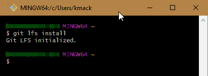

Git Bash 是一个专门用于与 Git 通信的终端窗口。

一旦看到 Git LFS 已初始化，你可以关闭 Git Bash。

# 安装 Git GUI

并不是必须使用 GUI 来操作 Git。许多开发者直接从命令行操作 Git。某些 Git 操作通过这种方式更容易执行。如果你想使用 GUI，以下说明适用。

前往[`desktop.github.com/`](https://desktop.github.com/)下载**GitHub Desktop**。还有许多其他的 Git GUI 应用程序；另一个流行的选择是**Atlassian's SourceTree**，你可以在[`www.sourcetreeapp.com/`](https://www.sourcetreeapp.com/)找到它，但为了简单起见，我们现在将继续使用 GitHub Desktop。在安装过程中，安装程序会要求你输入刚刚创建的 GitHub 账户的凭据。在这里输入它们。

安装完成后，GitHub Desktop 应该会启动，并且你应该看到一个类似于这样的窗口：

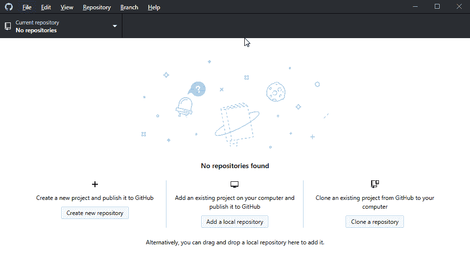

像 GitHub Desktop 这样的 Git GUI 并不是与 Git 通信所必需的，但在刚开始时可能会有所帮助。

# 将你的 GitHub 账户连接到你的 Epic Games 账户

导航到[`www.unrealengine.com`](https://www.unrealengine.com)，如果你还没有登录，请现在登录。在页面的左下角找到你的用户名，将鼠标悬停在上面以显示下拉菜单。选择“管理账户”选项：

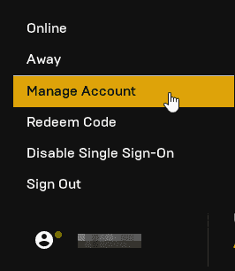

Unreal 4.22 版本的账户管理链接。这将在浏览器窗口中打开[`www.unrealengine.com/account/personal`](https://www.unrealengine.com/account/personal)。

请注意，Epic Games 启动器中的菜单经常变化。你也可以通过导航到[`www.unrealengine.com/account/personal`](https://www.unrealengine.com/account/personal)来完成此步骤。打开“Connected Accounts”选项卡，找到 GitHub 图标，点击“Connect”将你的 Epic 账户连接到 GitHub。如果需要，同意用户许可协议，并在需要时登录 GitHub。最后，如果授权工具询问，请点击“Authorize Epic Games”按钮。你应该会收到一封确认邮件。如果需要进一步帮助或遇到问题，请查阅[`www.unrealengine.com/en-US/ue4-on-github`](https://www.unrealengine.com/en-US/ue4-on-github)上的文档。

通过导航到[`github.com/EpicGames/UnrealEngine`](https://github.com/EpicGames/UnrealEngine)来确认一切设置正确。如果你能看到页面，说明你已经正确连接。如果没有，请确保你已经正确连接了你的账户并被授权查看 UnrealEngine 存储库。

关于 Git 的一点说明：Git 是一个非常有用的工具，但它所做的工作一开始可能看起来相当复杂。详细介绍 Git 的所有知识超出了本书的范围，但我们强烈建议你花些时间了解 Git 是什么以及它的工作原理，如果你打算使用它的话。这是一个很好的起点：[`git-scm.com/book/en/v2/Getting-Started-Git-Basics`](https://git-scm.com/book/en/v2/Getting-Started-Git-Basics)。要了解 GitHub 如何与 Git 配合工作，请从这里开始：[`guides.github.com/activities/hello-world/`](https://guides.github.com/activities/hello-world/)。

# 下载 Unreal Engine 源代码

现在，你可以开始拉取源代码了。让我们看看如何操作。导航到[`github.com/EpicGames/UnrealEngine`](https://github.com/EpicGames/UnrealEngine)，并浏览一下页面。这个页面上也有一个`ReadMe`文件。强烈建议你阅读一下。

# 选择你的源分支

请注意，Epic 维护了多个 Unreal Engine 存储库的分支：

+   发布分支包含经过测试的源代码，与使用 Epic Games 启动器下载引擎得到的源代码相同。

+   推广分支包含经过较少测试的代码，由 Epic 的设计师和艺术家在内部使用。它相当稳定，并且将包含比发布分支上的更新但也不太稳定的代码。

+   主分支是绝对的最新版本，包含 Epic 工程师提交的几乎即时更改。但是，不能保证这些更改是稳定的，甚至可以编译。如果您计划为引擎做出贡献，您应该使用此分支：

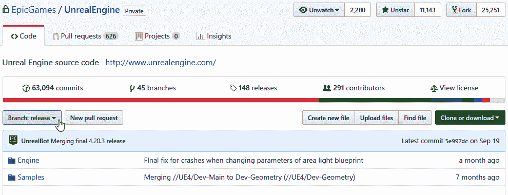

Epic Games / UnrealEngine GitHub 存储库的此视图允许您选择当前分支并下载其内容。

暂时使用发布分支。在左上角附近的 Branch 下拉菜单中选择它。

# 分叉存储库

我们将对此存储库进行分叉。分叉 Git 存储库会创建一个副本，允许您在不影响主存储库的情况下进行自己的更改。点击右上方的 Fork 按钮。这将为您创建一个包含刚刚分叉的源代码的个人存储库。

# 将存储库克隆到本地计算机

现在，您需要将其放在桌面上。点击页面右侧的绿色 Clone or download 按钮：

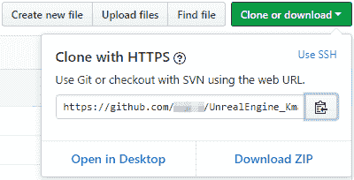

在克隆存储库时，您可以选择身份验证方法以及希望如何交付内容。

您在这里有几个选项。

# 选项 1 - 使用 GitHub Desktop 进行克隆

如果您使用 GitHub Desktop 作为 GUI，请选择 Open in Desktop 并允许页面启动 GitHub Desktop。GitHub Desktop 将询问您要将新存储库存储在何处。告诉它放在哪里并点击 Clone：

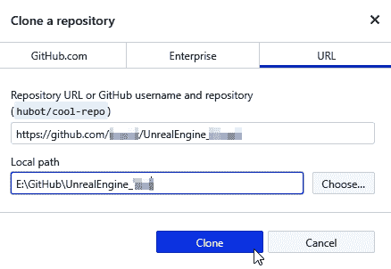

确保您选择的本地路径位置有足够的空间来容纳引擎及其内容。

# 选项 2 - 使用命令行进行克隆

如果您使用命令行，请点击存储库 URL 右侧的 Copy to Clipboard 按钮，然后打开 Windows 命令提示符并导航到您想要存储本地存储库的目录。到达目录后，键入`git clone`，然后粘贴刚刚复制的 URL：

```cpp
git clone https://github.com/yourusername/UnrealEngine_YourFork.git
```

源代码现在将下载到您指定的位置。

# 下载引擎二进制内容

导航到刚刚下载虚幻引擎源代码的位置，并在那里查找`Setup.bat`文件。运行它：

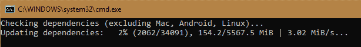

虚幻引擎内容与源代码分开提供。在引擎工作之前，您必须运行此.bat 文件。

此批处理文件现在将检查缺失或需要更新的引擎二进制内容，并进行更新。第一次运行可能需要一些时间。

# 生成项目文件

接下来，在相同目录中找到`GenerateProjectFiles.bat`并运行它。这将为 Visual Studio 创建`UE4.sln`解决方案文件和 Unreal Engine 的每个子项目所需的项目文件。这应该运行得相当快。

# 打开并构建解决方案

在 Visual Studio 中打开新生成的`UE4.sln`文件。确保设置为开发编辑器解决方案配置，并在解决方案资源管理器中右键单击`Engine/UE4`项目。选择 UnrealVS Quick Build | Win64 | Development Editor：

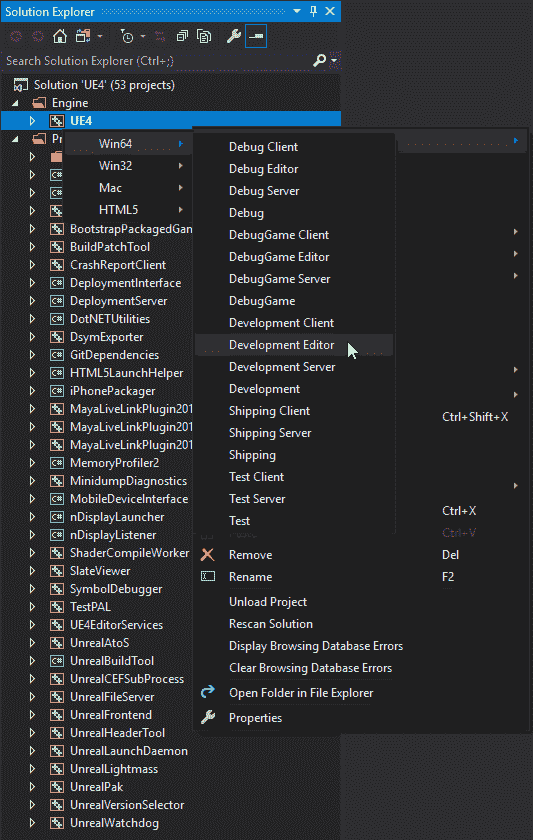

快速构建命令允许您选择要构建的构建配置。大多数情况下，您只对开发编辑器或调试编辑器配置感兴趣。

此构建将比之前运行的构建时间长得多，因为我们现在正在构建整个引擎，而不仅仅是一个游戏。

构建完成后，请确保将 UE4 设置为启动项目（默认情况下应该是），然后按*F5*以在调试器中启动它。

恭喜！您现在已经完全从源代码下载并构建了虚幻引擎。

# 使用新更改更新您的分叉

Epic 将很快发布尚未在您的分支中出现的新更改。具体时间取决于您所在的分支。如果您在发布分支上，新更改将每隔几周出现一次。在推广分支上，它们将每天或每两天出现一次。在主分支上，它们将每隔几分钟出现一次。在所有这些情况下，您都需要更新您的分支以获取新的更改。

您可以通过查看分支选择器下方的条来了解需要合并的新更改。它显示自上次更新分支以来发生了多少次提交：

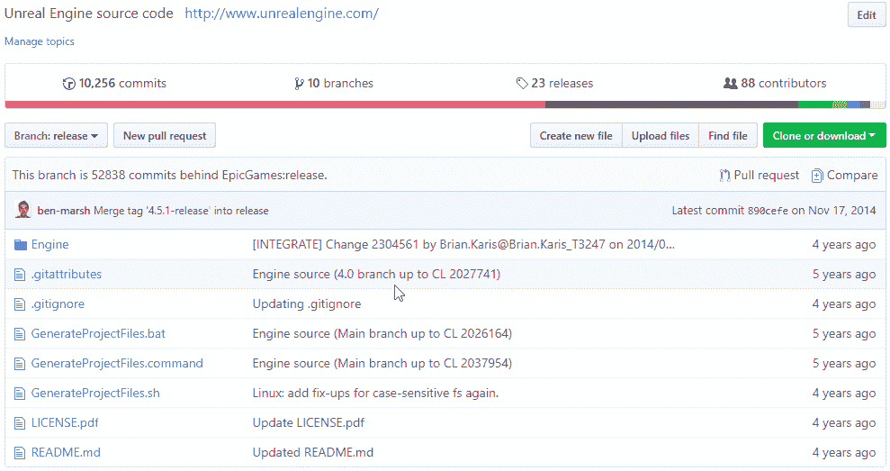

这是一个古老分支的示例，远远落后于当前版本。我们可以看到它落后了 52000 多个更改。那很旧了。恐龙在这段代码最后更新时还在地球上漫游。我们需要修复它。

# 选项 - 使用命令行同步更改

保持分支与上游分支的同步是那些更容易通过命令行完成的操作之一。我们建议您以这种方式进行操作。让我们为您介绍这个过程。

# 设置上游存储库

我们已经从虚幻引擎源存储库中分叉了自己的存储库，并将其克隆到了本地机器上。现在，我们需要告诉我们的分支如何从原始项目（我们将其称为**上游**存储库）中拉取更改。您只需要执行一次此操作。在 GitHub 上，打开原始的虚幻引擎存储库页面：[`github.com/EpicGames/UnrealEngine`](https://github.com/EpicGames/UnrealEngine)，点击绿色的 Clone or download 按钮，然后点击 URL 右侧的 Copy to Clipboard 按钮。不要在桌面上打开它或下载 ZIP 文件。您只需要 URL。

打开 Windows 命令提示符（请注意，如果您熟悉 UNIX 命令，也可以使用 Git Bash 进行此操作，并且如果您将大量使用 Git，建议您这样做），并导航到您克隆存储库的目录。键入`git remote -v`并按*Enter*。您应该在此处看到您的源存储库，但没有上游存储库。这就是我们接下来要设置的内容：

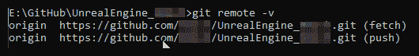

添加上游存储库之前的 git remote -v 命令的结果

现在，键入`git remote add upstream`并粘贴您刚才复制的 URL：

```cpp
git remote add upstream https://github.com/EpicGames/UnrealEngine.git
```

让我们通过再次键入`git remote -v`来验证上游存储库是否已正确设置：

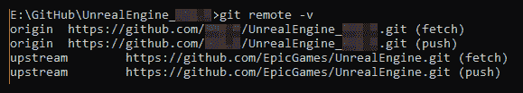

添加上游存储库后的 git remote -v 命令的结果

一切看起来都很好 - 我们的上游存储库已经设置好了。

有关分叉存储库并准备从上游仓库拉取更改的更多信息，请查看 GitHub 的文档：[`help.github.com/articles/fork-a-repo/`](https://help.github.com/articles/fork-a-repo/)。

# 同步分支

从命令提示符或 Git Bash 中的存储库目录中，键入`git fetch upstream`：

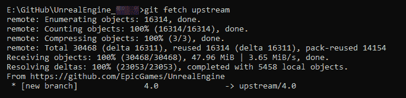

git fetch upstream 操作的输出

现在，通过键入`git checkout`和分支名称来*checkout*您正在工作的任何分支。例如，对于发布分支，键入`git checkout release`，对于推广分支，键入`git checkout promoted`，对于主分支，键入`git checkout master`。

接下来，通过键入`git merge upstream/`，然后是您的分支名称，将上游分支的更改合并到本地分支中。同样，如果您在发布分支上，这将是`git merge upstream/release`。

最后，您需要将本地机器上的更改推送回您的分支存储库在线。键入`git push origin master`来执行此操作。

# 回顾我们刚刚使用的 Git 命令

回顾一下：每当您需要将分支与上游分支保持同步时，请使用以下命令：

+   `git fetch upstream`

+   `git checkout [branch]`

+   `git merge upstream/[branch]`

+   `git push origin [branch]`

请参考以下截图：

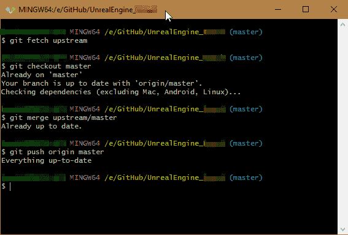

Git Bash 中的命令输出。

# 选项-使用 Web GUI 同步更改

如果您更喜欢在线同步您的分支而不是使用命令行，请按照以下步骤操作。

如果您使用命令行程序来同步您的分支，您可以跳过此部分，因为它执行相同的工作。

导航到 GitHub 上您的分支页面，并点击栏右侧的比较按钮。如果您在本地进行了更改，它们将显示在随后的比较窗口中。（为简单起见，假设我们没有进行更改，只是尝试从 Epic 获取新代码。）为此，首先点击比较页面上的切换基础链接。这将反转比较，所以我们不再寻找尚未传递到 Epic 的本地分支上的更改，而是寻找其他开发人员进行的尚未出现在我们的分支上的更改：

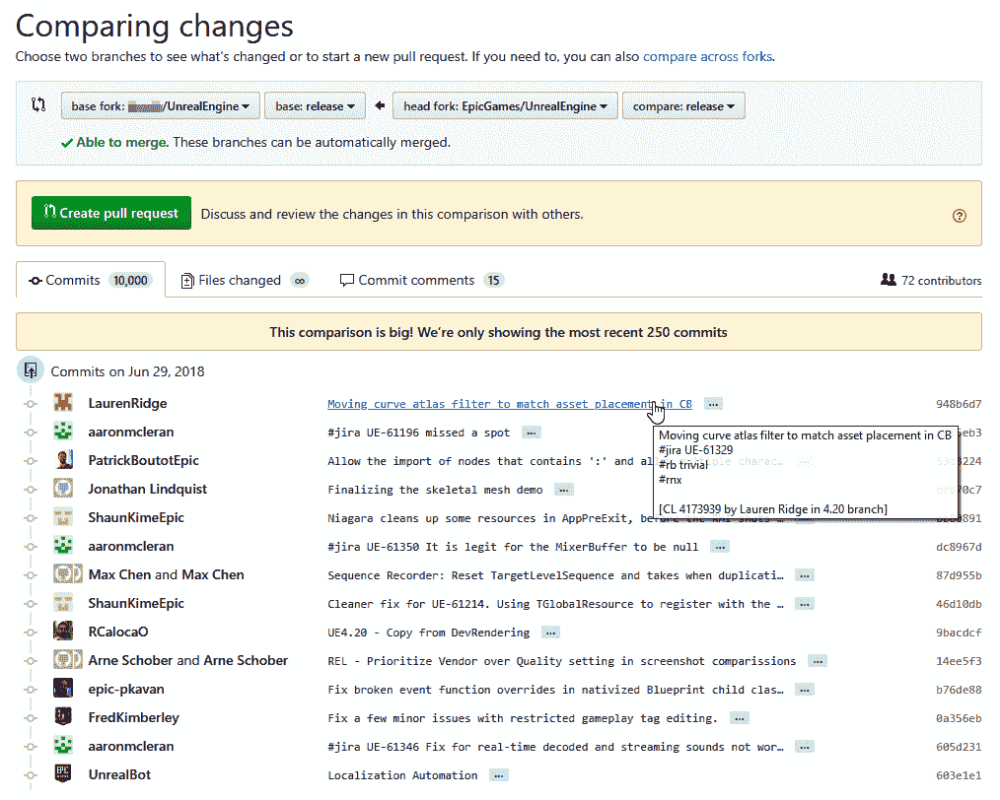

GitHub 上尚未合并到您的分支的更改列表

在这里，我们可以看到新的更改可以自动合并。这是预期的，因为我们没有进行任何引擎更改。（管理您自己的虚幻引擎分支和 Epic 分支之间合并的更改超出了本书的范围。）在我们的情况下，我们只想保持最新状态。

# 创建一个拉取请求

点击创建拉取请求按钮：

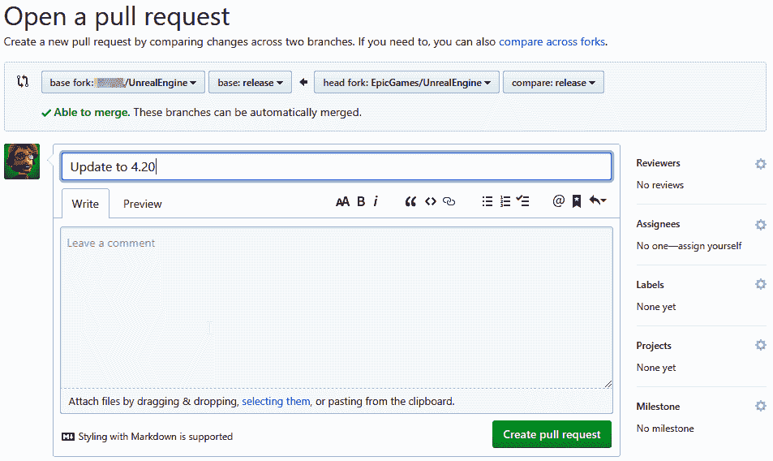

从上游分支合并更改的新拉取请求

给您的拉取请求命名，并再次点击创建拉取请求来创建它。

您的拉取请求现在已准备好进行审查。在这种情况下，由于您发起了请求，您可以直接接受它：

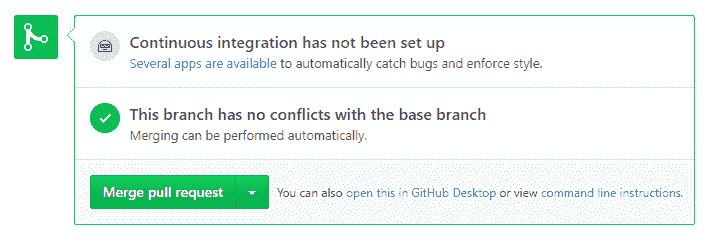

拉取请求确认对话框

# 合并拉取请求

点击合并拉取请求来执行合并，然后点击确认合并来实现它。

合并完成后，返回到您的分支，您将不再落后：

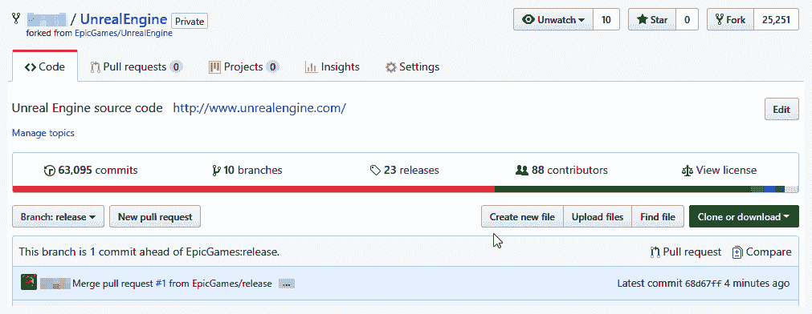

我们的分支与上游分支之间的比较。我们可以看到我们现在是同步的。

# 将原始版本拉到本地机器

现在，您需要更新您机器上的本地副本。

返回 GitHub Desktop，在您的虚幻引擎仓库中，寻找 Fetch origin 按钮。点击此按钮，指示 GitHub Desktop 查找您尚未在本地复制的远程仓库中的更改：

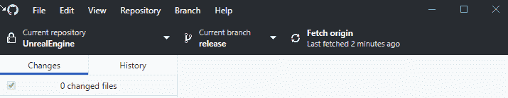

在我们从仓库中获取新的更改之前的 GitHub Desktop

在我们的情况下，我们有一些：

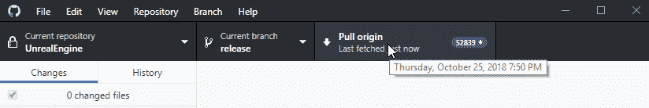

GitHub Desktop 准备将更改拉到我们的本地机器

现在是将这 52,000 个更改下载到我们的本地机器的时候了。点击 Pull origin 来执行此操作。GitHub Desktop 将*检出*这些更改，并将它们复制到本地机器。完成后，我们应该看到点击 Fetch origin 不再导致任何新文件需要拉取-我们是最新的。

# 重新同步您的引擎内容并重新生成项目文件

无论您是使用命令行还是 GUI 来更新您的分支，现在都需要更新您的解决方案文件和项目文件以反映您下载的新源代码。

如果您确定没有添加或删除源文件或资源，您可以跳过此部分。如果有疑问，请运行这些操作以确保您的资源是最新的，并且 Visual Studio 知道有关已更改的文件。

关闭 Visual Studio，从引擎目录中重新运行`Setup.bat`文件以更新二进制内容，然后重新运行`GenerateProjectFiles.bat`以更新 Visual Studio 文件。这些操作将比第一次运行快得多，因为它们只更新了已更改的内容。

打开解决方案，构建并运行。您应该回到当前代码的状态。

很多时候，当您重新生成项目文件时，您的启动项目会发生变化。如果发生变化，请右键单击您想要启动的项目，然后选择“设置为启动项目”进行重置。

# 在 GitHub 上进一步使用源代码

关于修改和构建引擎源代码，我们还可以谈论很多，但这超出了本书的范围。不过，您在这里学到的知识将使您能够下载 Epic 最新的 Unreal Engine 代码并构建引擎，如果您需要比当前版本更新的代码，或者需要修改引擎。

如果您计划从 GitHub 使用 Unreal 源代码，那么花时间了解它是值得的。它是一个强大的工具，但如果您不清楚它在做什么，可能会让人困惑。这里提供帮助：[`help.github.com/`](https://help.github.com/)。

再次强调，大多数用户不需要这样做，但有时候支持新的 VR 设备的代码会在推广或主分支上出现，而在发布分支和通过启动器的二进制发布渠道上出现之前很长一段时间。现在您应该已经了解足够的知识，以便在需要时使用最新和最好的工具。

# 其他有用的工具

在我们离开本章之前，让我们花点时间谈谈您可能想要设置的其他与 Unreal 一起工作的工具。这些工具不是本书项目所必需的，但了解它们是值得的，这样您需要时就知道去哪里找。

# 一个好的强大的文本编辑器

当您需要编辑大型文本文件或替换文件中的大量文本时，记事本就不够用了。我们建议您为此目的设置一个专用的文本编辑器。以下是几个选择：

+   **Visual Studio Code** ([`code.visualstudio.com/`](https://code.visualstudio.com/)) 是一个功能强大、轻量级的文本编辑器，支持多种语言，并包含许多有用的文本编辑工具。它是免费的。

+   **Sublime Text** ([`www.sublimetext.com/`](https://www.sublimetext.com/)) 是一个高度可定制的编辑器，具有各种语言的自定义集成。它售价 80 美元，有免费试用版。

+   **Atom** ([`atom.io/`](https://atom.io/)) 是由 GitHub 开发的一个相对较新的编辑器，支持大量的附加包安装程序，可以对文本页面进行几乎任何操作。由于它是由 GitHub 开发的，它的 Git 集成非常好。而且它是免费的。

+   **Notepad++** ([`notepad-plus-plus.org/`](https://notepad-plus-plus.org/)) 是一个快速轻巧的编辑器，比大多数其他编辑器更老，因此有一批忠实的用户。它也是免费的。

+   **Vim** ([`www.vim.org/download.php`](https://www.vim.org/download.php)) 是一个独立的编辑器。它的用户界面约定与 Windows 中的任何其他东西都不相似，因此需要一些努力来学习它们。它的优点是一旦用户学会了操作它的按键，他们就可以以惊人的速度在文本文档中导航，而无需使用鼠标。它几乎可以在任何计算设备上运行。我们只建议您在已经使用并喜欢它，或者特别有兴趣学习它的情况下使用它。

这些或其他您熟悉和喜爱的文本编辑器都可以很好地工作。选择一个适合您的并坚持使用它。

# 3D 建模软件

Unreal 场景由 3D 模型组成，您需要在开发过程中的各个阶段修改、清理或从头开始创建它们。（您需要做多少取决于您正在创建什么、与谁合作以及您在多大程度上依赖市场或其他来源的现有艺术品。）无论如何，最好在系统上安装一个可以编辑 3D 网格的工具。

在行业中，您通常会听到将 3D 建模工具称为**数字内容创建**工具，通常缩写为**DCC**。如果您听到有人提到 DCC，他们通常是在谈论 Blender、Maya 或 3ds Max 等 3D 建模工具。

以下是几个选择：

+   **Blender**（[`www.blender.org/`](https://www.blender.org/)）是一款免费且开源的 3D 建模程序，广泛用于独立开发社区。有很多教程可以教您如何在 Blender 中创建资产并将其导入虚幻引擎。它是免费的。

+   **Autodesk Maya**（[`www.autodesk.com/products/maya/overview`](https://www.autodesk.com/products/maya/overview)）是一款专业工具，专注于创建媒体和娱乐内容。过去十年中，您在任何电影或游戏中看到的几乎所有生物都可能是在 Maya 中建模和动画制作的。Maya 的订阅费用约为每年 1500 美元，但学生可以免费使用三年。

+   **Autodesk 3ds Max**（[`www.autodesk.com/products/3ds-max/overview`](https://www.autodesk.com/products/3ds-max/overview)）是一款专业的建模工具，专注于创建**建筑、工程和建筑**（**AEC**）以及产品设计的内容。它在媒体和娱乐领域也常被使用，但其动画工具比 Maya 的工具要有限得多。3ds Max 的定价与 Maya 相同，约为每年 1500 美元，并提供免费的学生许可证。

+   **Modo**（[`www.foundry.com/products/modo#`](https://www.foundry.com/products/modo#)）是一个较新的专业市场参与者，并且正在获得追随者。值得一看。Modo 的订阅费用为每年 600 美元。

您选择的 DCC 将取决于您的预算和计划使用它做什么。一般来说，如果您正在为娱乐而制作虚拟现实，Maya 将包含更多您所需的内容，但这绝不是绝对的。对于建筑和产品设计，3ds Max 可能是您所需要的。对于独立游戏开发，您也可以考虑使用 Blender。进行一些研究，找出最适合您特定需求的工具。

您在专业领域中还会看到其他一些工具。您通常不会看到初学者使用它们，但它们是强大的工具，您应该知道它们的存在，以便考虑它们是否可能是您尝试做某事的好解决方案：

+   **ZBrush**（[`pixologic.com/`](http://pixologic.com/)）是一款数字雕刻工具，用于创建高度详细的模型和表面。

+   **Mudbox**（[`www.autodesk.com/products/mudbox/overview`](https://www.autodesk.com/products/mudbox/overview)）与 ZBrush 类似，是一款用于为模型添加细节的雕刻工具。

+   **Houdini**（[`www.sidefx.com/`](https://www.sidefx.com/)）是一款用于 3D 几何和特效的程序化创建工具。如果您需要创建一个充满建筑物的城市、一个充满藤蔓的森林或一个翻滚的火球，Houdini 可能是您正在寻找的工具。

+   **Substance Painter**（[`www.allegorithmic.com/products/substance-painter`](https://www.allegorithmic.com/products/substance-painter)）是一款纹理绘制工具，允许艺术家直接在 3D 模型上绘制纹理。

+   **Substance Designer**（[`www.allegorithmic.com/products/substance-designer`](https://www.allegorithmic.com/products/substance-designer)）是一款功能强大的材质创作工具，用于创建高度多样和逼真的基于物理的材质。

这些通常是专家和专业人士使用的工具，但了解它们的存在和功能是值得的。

# 图像编辑软件

您通常还需要编辑纹理和 2D 艺术。您需要一个工具来完成这个任务，实际上您有两个可以认真考虑的选择：

+   **Adobe Photoshop**（[`www.adobe.com/products/photoshop.html`](https://www.adobe.com/products/photoshop.html)）是 2D 图像编辑的标准。它值得购买。关于 Photoshop 的定价有一个秘密：如果你订阅它作为独立应用程序，每月费用为 20.99 美元，但如果你订阅摄影套餐，你只需支付每月 9.99 美元。

+   **GIMP**（[`www.gimp.org/`](https://www.gimp.org/)）是一个免费的开源图像编辑应用程序。它缺少很多 Photoshop 的功能，但如果你只是偶尔修改纹理，它可能就足够了。

你在 Photoshop 和 GIMP 之间的选择将取决于你的需求和预算。如果你是专业工作者，最好还是坚持使用 Photoshop，但如果你不需要 Photoshop 的所有功能，GIMP 可能就足够了。

# 音频编辑软件

你偶尔需要编辑游戏和应用程序的声音和音乐。在这里，你也有几个选择：

+   **Audacity**（[`www.audacityteam.org/`](https://www.audacityteam.org/)）是一个免费的开源音频编辑解决方案，质量出奇的好。对于大部分你需要做的音频编辑工作，Audacity 可能就足够了。

+   **Adobe Audition**（[`www.adobe.com/products/audition.html`](https://www.adobe.com/products/audition.html)）是一款专业的音频编辑工具。它相比 Audacity 的优势在于更高质量的效果和非破坏性的编辑工作流程，这意味着如果你对声音应用了滤镜或效果，然后想在以后进行更改，你仍然可以做到。Audition 可以按月订阅，或者可以作为 Adobe All Apps 订阅的一部分捆绑购买。

+   **Avid Pro Tools**（[`www.avid.com/pro-tools`](https://www.avid.com/pro-tools)）是专业人士中最常用的音频编辑软件，有一个免费的 Pro Tools | First 版本，包含所有专业版本的功能，但限制了你可以使用的输入和音轨数量。这是否适合你取决于你预计要进行多少音频编辑以及你计划做什么。

我们提到的所有选项都涵盖了声音编辑，但对于声音创作，有很多工具和音频库可供选择。对它们进行分类超出了本书的范围，因为声音设计是一门独立的艺术，充满了深度。对于大多数在虚幻引擎中开发 VR 应用程序的用户来说，从 Audacity 开始，并在需要做特定工作时再进行其他选择是个不错的主意。

# 总结

在本章中，我们安装了虚幻引擎，并了解了在设置它时可用的各种选项。我们创建并启动了一个简单的测试项目来验证一切是否正常工作。此外，对于那些为移动 VR 开发的人来说，我们学会了如何设置所需的驱动程序和软件开发工具包，并设置了一个移动测试项目，将其部署到我们的设备上。

在这个过程中，我们学会了如何使用 Epic Games 启动器，不仅可以保持引擎版本的更新和启动项目，还可以作为重要的学习和支持资源。通过探索启动器，我们学会了如何从社区选项卡获取问题的答案，以及在学习选项卡中找到文档和视频教程。我们探索了非常有用的内容示例项目，并查看了其他项目，可以用来探索引擎中的特定主题。我们看到市场提供了大量免费和付费内容，可以加速我们的项目，并学会了如何使用库选项卡来维护我们的项目和引擎版本。

对于那些计划使用 C++进行开发的人，我们学习了如何设置我们的 Visual Studio 2017 开发环境，并配置它与虚幻引擎一起工作，然后我们创建了一个简单的测试项目，以确保我们能够在虚幻引擎中构建和运行我们自己的 C++代码。对于那些更加冒险的人，我们学习了如何从 GitHub 下载虚幻引擎源代码，并完全从头构建引擎。

最后，我们简要介绍了一些其他工具，这些工具对于构建虚幻引擎内容的开发人员可能会有用，包括各种免费和付费的解决方案，以满足不同的需求。

在下一章中，我们将为 VR 构建我们的第一个项目。（在本章中，我们设置的快速而简单的项目只是为了测试我们的开发环境是否正确设置，而不是专门为 VR 设计的。）现在，我们将学习如何正确设置 VR 项目。让我们开始吧！
