# 第三章：你好世界 - 你的第一个 VR 项目

是时候开始构建了！在第一章中，我们学习了什么是 VR 以及它能做什么，我们还学习了一些关于 VR 设计的最佳实践。然后，在第二章中，我们设置了开发环境。现在我们准备好开始构建了。

在本章中，我们将从头开始在虚幻中构建一个 VR 项目。然而，我们将采取与大多数教程不同的方法。我们不仅仅给你一系列要遵循的步骤，对于我们所做的每一件事，我们都会谈一谈在幕后发生了什么，以及为什么我们要以这种方式做。这才是真正重要的。如果你对这些系统的工作原理有一些了解，你在构建自己的项目时将更加有能力知道该做什么。

在构建我们的第一个 VR 项目时，我们将了解一些关于其结构的知识，并了解适用于 VR 开发的特定项目设置。我们还将查看那些特别影响移动 VR 的设置和选择，并向您展示在这方面需要了解的内容。从这里开始，我们将在项目中引入一个详细的场景，并学习如何在项目之间安全地移动资产以及如何管理项目的内容。最后，我们将设置游戏模式和角色蓝图，以便运行 VR 项目。

本章将涵盖以下内容：

+   从零开始创建一个 VR 项目

+   了解在开始项目时需要做出的重要设置和选择

+   为移动 VR 设置项目

+   在项目之间安全地移动内容和管理项目内的内容

+   在虚幻中设置你在 VR 开发中所需的基本蓝图

# 创建一个新项目

好的，让我们开始创建！

我们需要做的第一件事是创建一个新项目。在上一章中，我们创建了一些快速的临时项目，只是为了确保一切正常工作，但现在我们准备好开始真正的构建了。

如果你的**Epic Games Launcher**还没有打开，请打开它，转到“库”选项卡，在“引擎版本”下找到你最新的引擎版本，点击“启动”。（你也可以从启动器左侧的启动按钮进行操作。）

虚幻项目浏览器将出现。选择“新项目”选项卡，让我们选择“蓝图”选项卡和“空白”模板来创建一个空的蓝图项目。

**模板**是虚幻引擎项目的非常有用的起点。它们包含了许多游戏类型的简单和有用的工作基础，当你开始一个新项目时，你通常会想要使用它们。我们从一个空白项目开始，这样你就可以看到每个元素的添加过程。对于大多数项目，你可能最常用的是第一人称、第三人称和 VR 模板作为起点。

在这个对话框上我们还有一些选择要做，并且我们应该了解它们的含义：

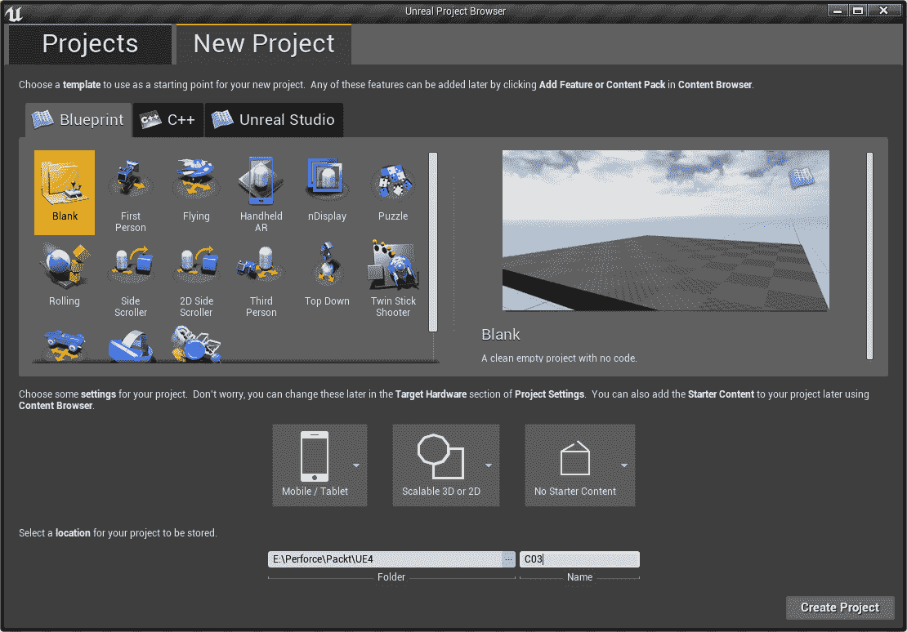

# 设置硬件目标

硬件目标选择器提供了两个选项：

+   桌面/主机

+   移动/平板

通常情况下，你应该选择适合目标平台的正确选项，但是在开发 VR 时，即使你是为桌面开发，选择移动/平板选项也是一个好主意，因为该选项会关闭一些在 VR 中可能很昂贵的渲染选项。

具体而言，选择移动目标而不是桌面目标将关闭以下渲染选项：

+   分离半透明度

+   泛光

+   环境遮蔽

# 设置图形目标

你需要做出的下一个选择是你的**图形目标**。同样，在这里你有两个选择：

+   最高质量

+   可扩展的 3D 或 2D

选择最高质量将打开 Unreal Engine 提供的所有默认高端渲染选项。然而，如前所述，在 VR 中，达到目标帧率比在场景中包含细节更重要。对于 VR 开发，选择可扩展选项总是一个好主意。

最好的做法是从关闭所有内容开始，根据需要逐渐打开它们。如果你从一开始就打开了所有内容，很难弄清楚是什么导致了帧率下降，并找出需要关闭的内容。最好的做法是从项目以合理的速度运行开始，并保持快速运行，而不是构建一个运行效果差的项目，并希望以后能够更快地运行。

# 设置摘要

对于我们的项目，我们将选择以下内容：

+   项目模板：蓝图-空白

+   硬件目标：移动设备/平板电脑

+   图形目标：可扩展的 2D 或 3D

+   没有起始内容

我们现在可以将 Starter Content 关闭，因为我们可以在需要时轻松添加这些内容。

选择你想保存项目的位置，然后点击创建项目来设置它。

# 快速查看项目的结构

我们现在创建了一个空项目。让我们花点时间来看看这实际上意味着什么。

如果你在 Windows 资源管理器中导航到保存项目的位置，你会看到 Unreal 在那里创建了一个带有项目名称和`.uproject`扩展名的文件，以及四个目录：

+   **Config**：配置文件，如`DefaultEngine.ini`和`DefaultGame.ini`，存放在这里，保存了引擎和项目的设置。

+   **Content**：这是你的项目的资产所在的地方，如模型、纹理、材质和蓝图。这是你项目的主要部分。

+   **Intermediate**：当编译项目资产时创建的临时文件存放在这里。这里的所有内容都是临时的，如果你删除它，它们将被重新生成。

+   **Saved**：日志文件、截图和保存的游戏存档保存在这个目录中。

如果你生成了一个 C++项目，你会看到另外三个目录：

+   **Binaries**：项目的构建可执行文件和支持文件存放在这里。当你在 Visual Studio 中构建项目时，生成的可执行文件就保存在这里。

+   **Build**：与特定目标构建相关的文件，如 Windows 64 或 Android，存放在这里。这些包括在构建过程中生成的日志，以及某些支持资源，如应用程序图标。你很少会接触到这个目录的内容。

+   **Source**：C++文件和管理构建它们的 C#脚本存放在这里。

# 内容目录

在大多数情况下，当你使用 Unreal 项目时，你将使用`Content`目录和`Config`目录中的内容。通常情况下，你应该在 Unreal Editor 中管理 Content 目录的所有内容，因为否则很容易破坏对象之间的引用关系。我们将很快讨论如何做到这一点。

# 配置目录

然而，我们应该花点时间来看一下`Config`目录。

在这个目录中，包含了包含项目设置的配置文件。所有与引擎相关的项目设置，如渲染质量选择，都写入到`DefaultEngine.ini`文件中。当你在创建项目对话框中选择硬件和图形目标时，实际上只是选择将默认选项写入该文件。同样，当你从编辑器中更改项目设置时，这些设置也会写入`DefaultEngine.ini`（或`DefaultGame.ini`用于某些与游戏相关的设置）。

你的`Config`目录将始终包含以下两个文件：

+   `DefaultEngine.ini`：这个文件包含了你的渲染设置、启动地图设置、物理设置和其他控制引擎运行方式的选项。

+   `DefaultGame.ini`：大部分包含有关游戏和版权信息的内容，但也包含了关于应用程序在不同平台上发布时如何打包的信息

当您在编辑器中更改项目设置时，您主要是将更改写入这两个文件。

根据您在构建项目时更改的设置，可能会创建其他`Config`文件：

+   `DefaultInput.ini`：这包含与使用输入设备相关的输入映射和设置。

+   `DefaultEditor.ini`：这包含了控制编辑器行为的设置。

+   `DefaultDeviceProfiles.ini`：这包含了您可能发布应用程序的不同平台的特定设置。

您不必了解这些内容就可以使用引擎。完全可以在编辑器内部管理设置，但这也是虚幻引擎的另一个伟大之处之一-它不会将重要信息散布在奇怪的地方。如果您在某个时刻需要弄清楚您在哪里设置了什么，您知道该去哪里找。它将在这些文件中的一个中。

如果在 Windows 资源管理器中看不到`.ini`等文件扩展名，请打开文件资源管理器选项控制面板，并关闭隐藏已知文件类型的扩展名。在 Windows 中，默认情况下是打开的，但在开发时会隐藏有用的信息。

# 源目录

如果您创建了一个 C++项目，您的项目目录还将包含一个`Source`子目录。您的 C++源文件存放在这里。

# 项目文件

我们还应该快速查看一下项目的`.uproject`文件。实际上，它只是一个包含有关项目的一些信息的简单文本文件，但如果您在资源管理器中右键单击它，您将获得三个有用的选项：

+   **启动游戏**：这只是在虚幻编辑器中打开您的项目。双击`.uproject`文件也可以做到这一点。

+   **生成 Visual Studio 项目文件**：仅适用于创建了 C++项目的情况。通常情况下，只有在清除了保存 VS 项目文件的 Intermediates 目录，或者从编辑器外部添加了新的源代码文件时，才需要执行此操作。

+   **切换虚幻引擎版本**：这会更改与您的项目关联的引擎版本。通常情况下，当您要切换到新的引擎版本时，最安全和最可取的方法是在启动器中复制并更新您的项目，但如果您已经知道可以安全执行此操作，您可以在此处切换。

# 一个虚幻项目结构的概述

现在我们已经快速了解了虚幻项目的结构，我们应该在工作时将其牢记在心。

同样，一个虚幻项目的最基本结构包括以下内容：

+   `Project`目录：

+   `Project`文件

+   `Content`目录

+   `Config`目录

+   （仅限 C++）`Source`目录

如果您需要与他人共享基于蓝图的虚幻项目，您只需要共享`.uproject`文件、`Content`目录和`Config`目录。其余的内容都是在项目运行时动态生成的。

根据您对项目的操作，可能会自动创建其他目录。

这就是我们在这里想要做的一切-只是快速查看一下并了解一下我们开始向项目中添加大量内容之前的情况。知道东西在哪里可以在以后让您的生活更轻松。

# 设置项目的 VR 设置

让我们回到编辑器中，继续设置我们的项目。在做其他任何事情之前，我们应该查看一下一些设置。

我们即将讨论的所有这些设置都会影响场景的*渲染*方式：

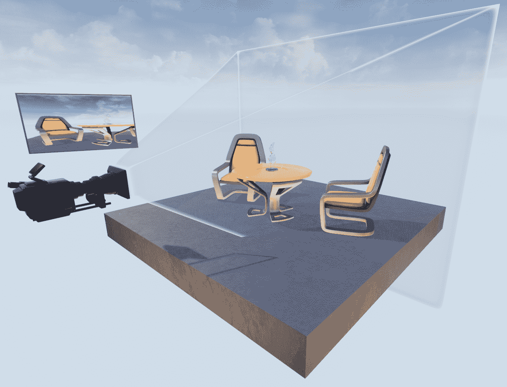

渲染是将场景中的 3D 几何图形通过虚拟摄像机观察并将该几何图形转换为可以在屏幕或头戴式显示器上显示的图像的过程。

正如我们在第一章中提到的，*在 VR 中思考*，与传统的平面屏幕渲染相比，VR 对渲染管线提出了更高的要求。即使是当前市场上分辨率最低的头戴设备也显示了相当多的像素，并且需要非常快速地更新。如果这还不够具有挑战性，我们还需要考虑到两只眼睛，它们看到的视图并不完全相同。这意味着我们要渲染两个独立的视图。这是一项相当繁重的任务，而时间却不多。

因此，对于 VR 开发人员来说，了解 Unreal 提供的渲染选项是很重要的。在这里做出良好的选择可以让您在实现既好看又快速的目标方面走得更远。

# Instanced Stereo

还记得我们刚才提到过需要同时渲染两个独立视图吗？在不好的旧日子里（在 Unreal 4.11 之前），这是真的。引擎只是简单地运行整个渲染过程两次 - 每次为一个眼睛。这是非常浪费的，因为两个视图之间唯一的真正区别是眼睛位置的微小偏移。第二次渲染的全部成本都被用来绘制几乎与刚刚绘制的相同的东西。

**Instanced Stereo**渲染通过允许在单个传递中渲染场景来改进这一点。然后，渲染的视图与视频硬件一起传递，以及每个眼睛调整视图所需的信息。它比运行整个传递两次要快得多，您需要确保打开它。现在让我们来做这个。

如果您使用 VR 模板创建项目，Instanced Stereo 将已经为您打开，但如果您从头开始创建项目，或者修改现有项目以适应 VR，您需要记住自己执行此操作。

从编辑器中打开项目设置，可以通过点击编辑器工具栏上的设置按钮并选择项目设置...，或者选择编辑 | 项目设置来打开：

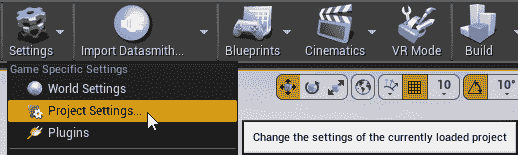

在项目设置中，找到引擎部分的渲染项。在渲染页面中，找到 VR 部分的 Instanced Stereo 选项并打开它：

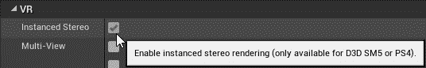

在执行此操作后，将要求您重新启动引擎。这将需要一些时间，因为您的着色器将需要重新编译。

# 轮询遮挡

因为我们没有太多时间将帧传输到头戴设备上，所以我们不想浪费任何时间来绘制我们不需要绘制的东西。引擎通过一个称为**剔除**的过程选择要绘制的对象。它使用四种主要方法来进行剔除，按顺序从最快和最简单到最复杂：

+   **距离剔除**只是忽略相机距离一定距离之外的任何对象。这是廉价的。

+   **视锥剔除**会忽略不在相机当前视图中的对象。这比距离剔除更昂贵，但仍然相对便宜。

+   **预计算可见性**允许设计师设置体积，明确告诉引擎从某些位置可以看到什么，不能看到什么。例如，如果您知道房间内的玩家不可能看到外面的任何东西，您可以使用预计算可见性体积告诉引擎甚至不需要检查。

+   **动态遮挡**实时测试场景中的一个角色是否遮挡了另一个角色。这相对昂贵，因此只对那些没有被更便宜的方法剔除的对象进行测试。

对于 VR 项目，虚幻引擎提供了一种名为**Round Robin Occlusion**的优化动态遮挡剔除方法，每帧只测试一个眼睛的遮挡，而不是两个眼睛。这在有很多对象的场景中节省了大量时间，并且由于每只眼睛的视图几乎相同，所以效果很好。系统在每帧切换测试的眼睛，这就是名称的由来。

让我们打开它：

1.  在项目设置 | 引擎 | 渲染 | VR 中，勾选 Round Robin Occlusion Queries：

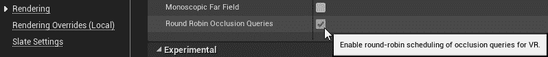

# 前向渲染和延迟渲染

现在我们需要对我们项目中要使用的渲染方法做出重要选择。

广义上讲，绘制场景有两种方式，它们之间的区别主要取决于场景中的物体如何受光照。这两种方法被称为**前向渲染**和**延迟渲染**。

你有时会看到这些称为**前向渲染**和**延迟渲染**，或者你会听到人们谈论**前向渲染器**或**延迟渲染器**。Epic 在其文档中可互换使用这些术语，但它们都指的是同样的东西。在这里，我们将坚持使用术语**前向渲染**，因为这是编辑器中的选项名称，并且最准确地描述了这两种方法之间的真正区别。

**着色**是将光应用于几何体的过程。这包括高光、表面反射、阴影和光线击中材质时产生的各种效果：

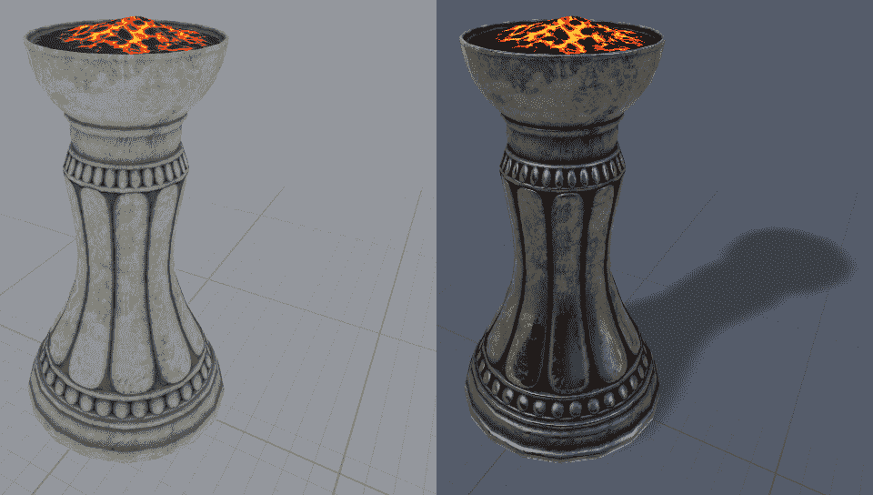

前面的截图显示了相同的网格，没有应用着色，然后应用了着色。在左侧的图像中，你可以看到物体的形状和基本颜色（通常称为**反射率**），但没有阴影、反射或高光。右侧的图像已经着色，所以可以看到高光、阴影和反射。

在接下来的描述中，我们稍微简化了一些事情，但对于我们的目的来说，这是可以的。你真的不需要了解渲染管线的每个细节，以便做出关于如何使用它的正确选择。只需要了解足够的信息，以便为你需要做的事情做出正确的选择即可。

**前向渲染**是实时 3D 渲染历史上绘制 3D 场景的最初方式。在前向渲染中，场景中的每个几何对象在渲染时进行着色，并检查场景中的每个光源对其的影响。如果场景中有很多对象和很多光源，这将导致大量的操作。这就是为什么大多数光照倾向于嵌入到静态光照贴图中，而动态光照在 20 世纪 90 年代和 21 世纪初的游戏中很少见的原因。每个动态光源都会大大增加场景的成本。

另一方面，**延迟渲染**绘制视图中的每个对象，但不是立即进行光照和着色，而是写出一系列包含场景中材质信息、每个像素的深度以及其他影响场景光照的因素的图像。只有在所有这些信息被组装完毕后，才进行着色。这就是名称的由来——着色通道被推迟到基础通道完成之后。

这些缓冲区的集合被称为**几何缓冲区**，或者**G 缓冲区**，构建它们的过程被称为**基础通道**。如果你在虚幻引擎中使用延迟渲染（这是新项目的默认设置），你可以通过选择视图模式 | 缓冲区可视化 | 概览来查看 G 缓冲区的内容。

看一下下面的截图：

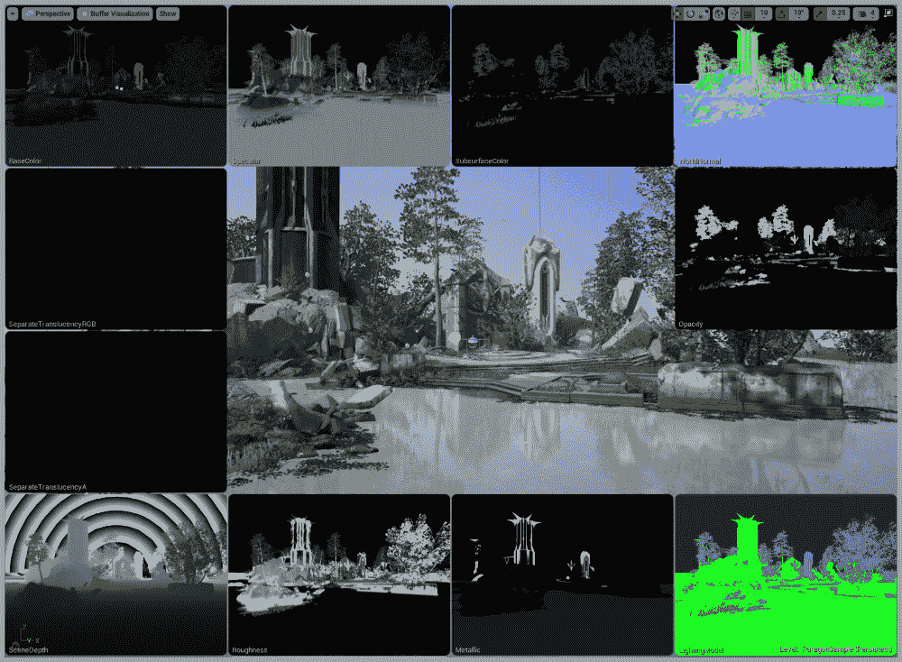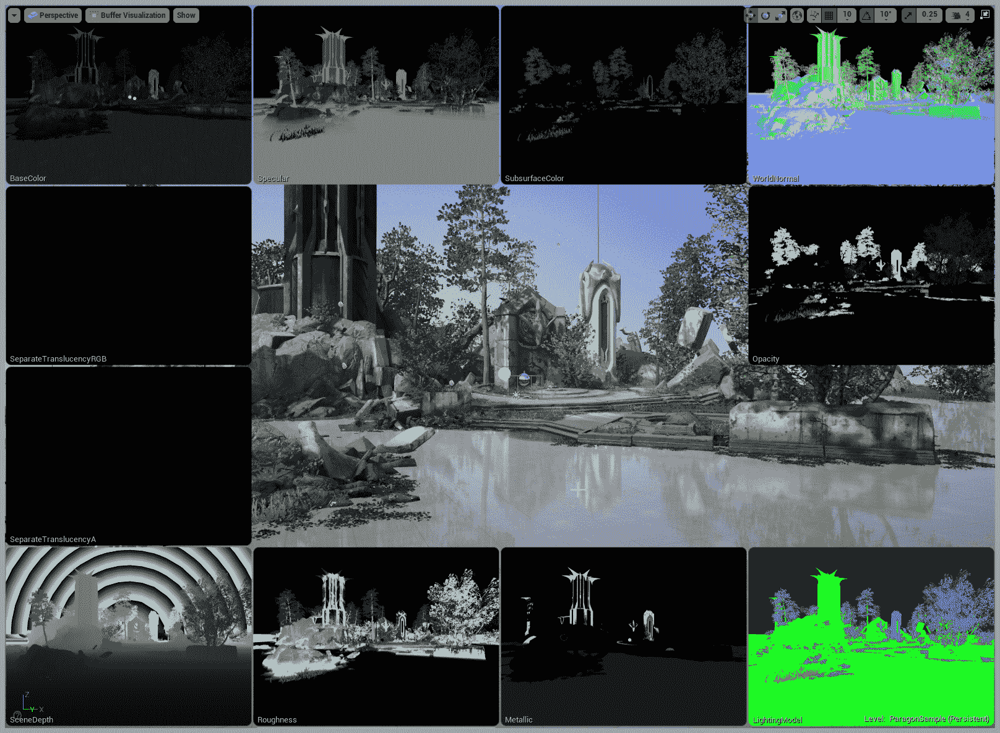

由于光照通道只发生一次，所以对于有很多动态光的场景来说，这比使用延迟渲染要快得多，而且还可以高效地处理屏幕空间效果，如环境遮蔽。然而，对于部分透明的物体来说，它的效果不如前向渲染好。

# 选择适合你项目的渲染方法

所以，听起来很简单，对吧？延迟渲染似乎提供了很多优势。对于非 VR 渲染来说，这基本上是正确的，在 2000 年代后期，延迟渲染成为了包括虚幻引擎在内的几乎所有游戏引擎的默认选择。

然而，在 VR 中情况就不同了。延迟渲染的问题在于，由于它处理信息的方式，很难关闭渲染过程的各个方面。在很大程度上，它是全有或全无的。这在平面屏幕上通常不是问题——开发者几乎总是希望使用延迟渲染器所提供的一切。然而，其中一些过程在 VR 中运行效率太低，或者在屏幕空间计算时看起来不匹配。在 VR 中，你通常会希望有自由关闭它们的能力。

当你听到术语“屏幕空间”时，这意味着计算不是在 3D 空间中的对象上进行，而是在包含该对象的场景的 2D 图像上进行（这个过程称为**光栅化**），然后在 2D 图像上执行计算。这在 VR 中可能会产生问题，因为许多屏幕空间计算在两只眼睛之间不匹配。你通常会希望避免在 VR 中使用屏幕空间效果。

在虚幻 4.14 中，Epic 添加了前向渲染作为专门为 VR 项目设计的选项。他们还引入了一种聚类系统，降低了基本通道中处理灯光的成本，所以它的成本不再像以前那样高昂。对于大多数 VR 项目来说，使用前向渲染是个好主意。

在某些情况下，如果你的场景需要支持大量可移动的灯光，或者你知道你将需要非常复杂的反射，你可能仍然希望坚持使用延迟渲染，但你应该认真考虑在大多数 VR 项目中使用前向渲染。

你几乎总是希望在 VR 项目中使用前向渲染。它可以让你更好地控制渲染过程中你想要做的部分和你想要跳过的部分；它更容易处理透明度，并支持更好的抗锯齿选项。

让我们在我们的项目中打开它。

从项目设置 | 引擎 | 渲染中，找到前向渲染器部分，打开前向渲染。你需要在这样做后重新启动编辑器：

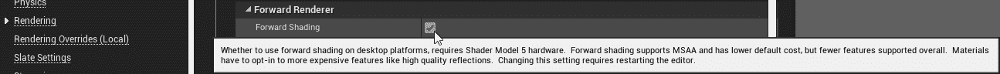

当使用前向渲染时，许多昂贵的材质特性通常需要显式地打开。在 VR 中，这是一件好事，因为它让你可以自由地在只有在需要时使用昂贵的特性。我们稍后会讨论在为 VR 创建和修改材质时如何做到这一点。

虽然在项目开发的后期可以随时打开或关闭前向渲染，但你通常会希望做出一个选择并坚持下去，因为两种方法在项目的光照、材质和反射方面可能会有很大的差异。你不希望在开发的后期花费大量精力来开发你的外观，然后做出这样的改变。你最终会不得不重新做很多工作。

# 选择你的抗锯齿方法

使用前向渲染的一个主要优势是**抗锯齿**比使用延迟渲染要容易得多。让我们谈谈这意味着什么，以及为什么这对我们在 VR 中很重要。

当渲染器将场景绘制到平面屏幕上（无论是显示器还是 VR 头显）时，该显示实际上由一组称为**像素**（照片元素）的小方块组成，渲染器必须决定每个像素的颜色。当 3D 场景中的对象只部分填充 2D 空间中的像素时，这就成为一个问题。然后，渲染器必须决定像素应该填充对象的颜色还是背景的颜色。没有中间状态-它必须选择其中之一。实际上，这意味着对象可能会出现锯齿状边缘，特别是沿着跨越许多像素边界的对角线。我们称之为**走样**问题：

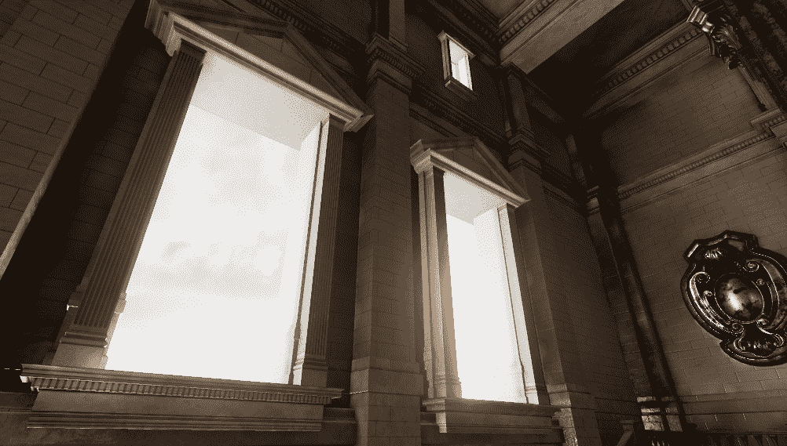

没有抗锯齿渲染的场景

请注意，没有抗锯齿渲染的场景中窗户周围的**锯齿**。它们在这里看起来很糟糕，在 VR 中看起来会更糟糕。

我们通过一个不出所料被称为**抗锯齿**的过程来解决这个问题。不同的抗锯齿方法使用各种技术来找到像素的正确颜色，以使其在前景色和背景色之间呈现混合效果，从而软化锯齿边缘。这样可以平滑锯齿边缘并消除对角线上的阶梯状线条：

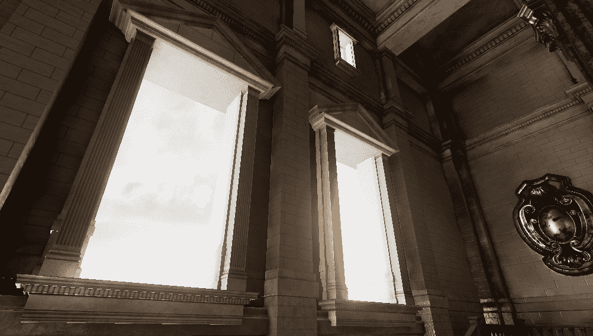

使用多重采样抗锯齿（MSAA）渲染的场景

看看使用多重采样抗锯齿渲染时窗户看起来更加平滑的效果？

这在 VR 中尤为重要，因为头显的分辨率仍然相对有限，所以用户通常可以看到单个像素。在平面屏幕上可以接受的走样在 VR 中可能看起来很糟糕，因为用户在场景中观察时，锯齿状边缘会爬行和闪烁。您应该避免这种情况。

幸运的是，虚幻引擎提供了三种**抗锯齿方法**来解决这个问题：

+   **FXAA**代表**快速近似抗锯齿**。它寻找场景中的边缘并混合这些边缘的颜色，并且足够智能以避免处理没有对比较边缘的区域，因此看起来很棒并且运行速度相对较快。如果您在 VR 中使用延迟渲染，这应该是您的默认选择。

+   **时域抗锯齿**（**TAA**）通过查看前几帧来决定如何对当前帧进行抗锯齿处理。这通常使其在 VR 中成为一个糟糕的选择，因为用户的视图往往会移动很多，时域抗锯齿可能会在快速移动时产生“模糊”效果。即使在没有模糊的情况下，它在 VR 头显上可能看起来太模糊而无法接受。时域抗锯齿通常在平面屏幕上表现出色，但对于 VR 来说并不是一个很好的选择。

+   **MSAA**代表**多重采样抗锯齿**。此方法仅在使用正向渲染时可用，并且会比 FXAA 提供更清晰、更好的结果。如果您在项目中使用正向渲染（通常应该使用），这是您应该使用的抗锯齿方法。

让我们在项目中处理这个问题：

从项目设置 | 引擎 | 渲染中，找到默认设置部分，并将抗锯齿方法设置为 MSAA：

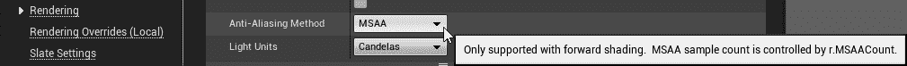

大多数情况下，您不需要改变抗锯齿方法的任何设置，但如果需要，继续阅读。

# 修改 MSAA 设置

这部分是可选的。调整抗锯齿设置是一个高级主题，对于大多数项目来说，您不需要这样做。如果您确实需要调整 MSAA 设置，以下是一个很好的方法：

选择窗口 | 开发者工具 | 设备配置文件以打开设备配置文件窗口：

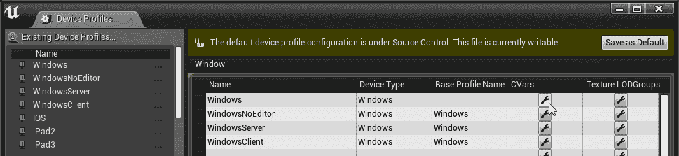

从此面板中，点击 Windows 行中的 CVars 按钮。

在生成的对话框中，打开控制台变量|渲染。从这里，您可以看到您当前指定的所有与渲染相关的控制台变量。如果您点击 Rendering 旁边的+号，您可以在出现的搜索窗口中键入`msaa`，并为 r.MSAACount 添加一个值。默认情况下，此值设置为 4。将其减少到 3 或 2 将降低抗锯齿的质量，但会加快速度。将其设置为 1 将关闭抗锯齿。将其设置为 0 将关闭抗锯齿并回退到时间抗锯齿：

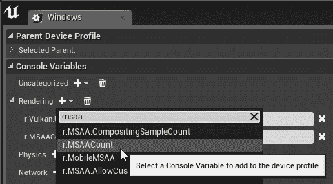

如果您在这里进行了更改，请在设备配置窗口上点击“保存为默认值”以保存这些设置。它们将被写入项目的`Configs`目录中的一个名为`DefaultDeviceProfiles.ini`的新配置文件中。

再次更改这些值是一个高级主题。我们建议您在确保理解其功能之前不要修改这些值。

# 在 VR 中开始

告诉我们的项目在运行时启动 VR 也很重要。如果您想构建一个既可以在 VR 中运行又可以在平面屏幕上运行的项目，您可以选择关闭此选项，并在启动时使用`-vr`命令行参数。但是，我们的项目只能在 VR 中运行，所以我们想打开它。

转到项目设置|项目|描述|设置，并将“在 VR 中启动”设置为 True**。**

# 关闭其他不需要的杂项设置

在您的渲染|默认设置中，关闭环境遮挡静态分数。环境遮挡是一种用于创建物体接触处出现的微妙阴影的方法，但是计算它们的成本很高，并且在 VR 中可能看起来很糟糕，因为它们是在屏幕空间中计算的。我们不会在这里深入讨论这个主题。当您将项目设置为移动、可扩展的 2D/3D 时，您已经关闭了环境遮挡，所以这只是一个您应该清除的杂项设置。

# 关闭默认触摸界面（Oculus Go/Samsung Gear）

如果您正在开发 Oculus Go 或 Samsung Gear 的应用程序，您需要关闭默认的触摸界面。移动应用程序通常假设您将通过触摸屏幕来操作它们，但是在头戴式显示器中当然不会发生这种情况。

导航到项目设置|引擎|输入，并从移动部分中获取 Default Touch Interface 旁边的下拉菜单并清除它：

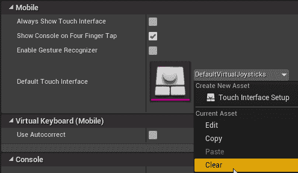

# 为 Android 配置您的项目（Oculus Go/Samsung Gear）

现在，我们需要配置项目使用 Android SDK。我们在上一章中已经完成了这个过程，我们只需要为这个项目设置相同的设置。这里是我们需要做的事情的快速提醒。

从项目设置|平台|Android 中，找到 APK 打包部分，然后点击“立即配置”。如果您在上一章中已经接受了 SDK 许可证，那么该按钮将被禁用-您只需要接受一次：

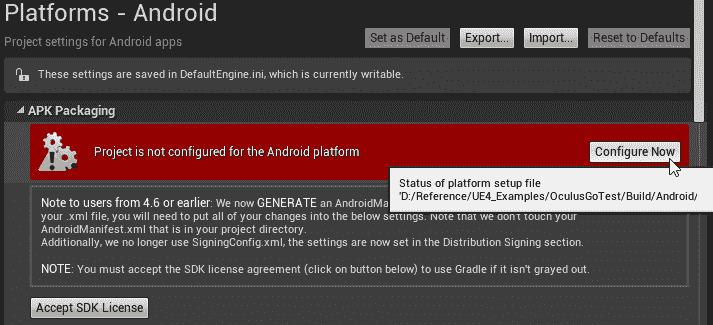

然后设置这些设置（正如我们在上一章中提到的，大多数指南会告诉您将 SDK 版本 19 作为最低版本。这对于 Samsung Gear 来说是可以的，但对于 Go，请使用版本 21）

+   最低 SDK 版本：21

+   目标 SDK 版本：21

+   在 KitKat 及以上设备上启用全屏沉浸式：True

向下滚动到高级 APK 打包部分，并设置如下：

+   将 AndroidManifest 配置为部署到 Oculus Mobile 的 True。

# 验证您的 SDK 位置

选择项目设置|平台|Android SDK，并确保正确设置 SDK 位置。如果您按照上一章的说明进行操作，它们应该已经设置好了。如果没有，请返回那里并进行设置。

# 确保关闭移动 HDR（Oculus Go/Samsung Gear）

检查您的项目设置|引擎|渲染|移动，并确保关闭移动 HDR。

# 移动多视图（Oculus Go/Samsung Gear）

还记得在关于实例化立体渲染的部分中，我们讨论了为每只眼睛渲染整个场景是多么浪费吗？移动头戴设备也有一个解决方案，称为**移动多视图**。移动多视图的工作原理与实例化立体渲染基本相同-先为左眼渲染场景，然后将图像移动和调整为右眼。我们想要打开它。

在项目设置 | 引擎 | 渲染 | VR 中，将移动多视图设置为 true，并同时打开移动多视图直接选项。Oculus 不建议或支持在没有直接选项的情况下使用移动多视图。将它们都打开：

！

# 单眼远场渲染（Oculus Go / Samsung Gear）

关于立体深度感知的问题是，我们只能在一定距离内看到它。超过这个距离，立体图像和平面图像之间没有可见的区别。它们对我们来说看起来是一样的。我们可以利用这一点。

如果我们将项目设置 | 引擎 | 渲染 | VR | 单眼远场设置为 true，引擎将只渲染指定距离之外的任何物体一次，这可以在适当的场景中节省大量时间：

！

默认情况下，单眼和立体渲染之间的分割发生在 7.5 米处，但这在每个地图上都是单独设置的。（这个分割的位置称为**裁剪平面**。）这个裁剪平面与摄像机的距离在每个地图上都是单独设置的。要进行调整，请打开窗口 | 世界设置，并在出现的设置面板上查找 VR 部分。调整单眼裁剪距离将改变裁剪平面的位置。

对于场景中的某些对象，特别是大型对象，如果它们的边界靠近摄像机，即使它们实际上只出现在远处，您可能需要强制它们以单眼模式渲染。在这些情况下，打开对象的详细信息，并将渲染 | 渲染为单眼设置为 true。（此选项在渲染部分的高级选项中隐藏。）

# 项目设置备忘单

我们刚刚介绍了一些在为 VR 设置项目时应该修改的设置，以及每个设置的一些背景知识。为了回顾一下，这是我们所更改的备忘单：

+   项目设置 | 引擎 | 渲染 | VR | 实例化立体：True

+   项目设置 | 引擎 | 渲染 | VR | 轮询遮挡查询：True

+   项目设置 | 引擎 | 渲染 | 正向渲染器 | 正向着色：True

+   项目设置 | 引擎 | 渲染 | 默认设置 | 抗锯齿方法：MSAA

+   项目设置 | 引擎 | 渲染 | 默认设置 | 环境遮蔽静态分数：False

+   项目设置 | 项目 | 描述 | 设置 | 启动 VR：True

这是移动 VR 版本：

+   项目设置 | 引擎 | 输入 | 移动 | 默认触摸界面：无

+   项目设置 | 平台 | Android | APK 打包：配置和设置所提到的设置

+   项目设置 | 平台 | Android SDK：验证您的 SDK 位置是否设置正确。

+   项目设置 | 引擎 | 渲染 | 移动 | 移动 HDR：False

+   项目设置 | 引擎 | 渲染 | VR | 移动多视图：True

+   项目设置 | 引擎 | 渲染 | VR | 移动多视图直接：True

+   项目设置 | 引擎 | 渲染 | VR | 单眼远场：True

再次强调，不要盲目地遵循这些设置。对于大多数 VR 项目，这些是您想要的设置，但这并不意味着它们适用于您所做的每个项目。

# 装饰我们的项目

现在我们已经设置了项目的基本设置，让我们添加一些环境艺术，这样我们在工作时就有一些有趣的东西可以看。

# 将内容迁移到项目中

从您的**Epic Games Launcher**中打开 Learn 选项卡，并搜索`Sun Temple`示例环境。点击创建项目按钮，并选择一个您想保存的位置：

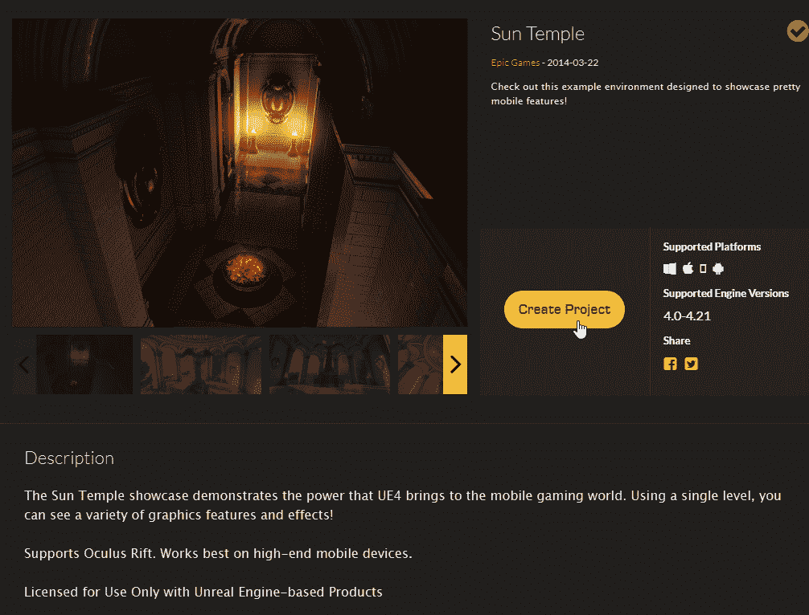

让它下载。项目下载完成后，打开它。它应该打开到太阳神庙地图。现在我们要将这个地图迁移到我们现有的项目中。

我们也可以下载太阳神庙项目，然后设置它以在 VR 中运行。我们这样做是为了给您一个学习“迁移...”工具的机会。当您需要将资产从一个项目迁移到另一个项目时，“迁移”工具是最好的方法。

在内容浏览器中，选择“内容”|“地图”|“太阳神庙”。右键单击它，然后选择“资产操作”|“迁移...”：

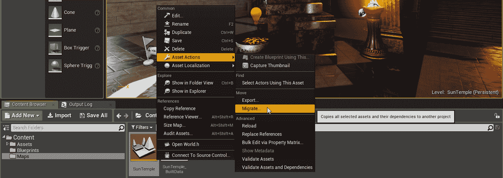

现在，您将看到一个列表，其中列出了如果迁移此地图将被复制的所有内容。这就是“迁移...”工具的强大之处，也是为什么您应该使用它的原因。当您将资产迁移到另一个项目时，虚幻会检查该资产工作所需的其他所有内容，并将其包含在要复制的资产列表中。因此，例如，如果您迁移一个网格，该网格使用的材质和纹理也将被自动找到并迁移。在我们的例子中，我们正在迁移一个地图，所以虚幻将把地图所依赖的所有内容带入新项目中：

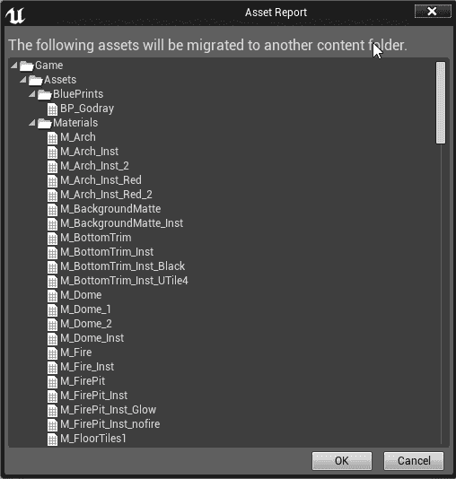

现在你需要选择你要放置迁移内容的位置。迁移操作的目标始终必须是目标项目的`Content`目录。导航到该位置并选择它。（这就是为什么我们在本章开始时提到了了解虚幻项目目录结构的重要性。您偶尔需要知道其中的内容存放位置。）

迁移完成后，让我们关闭这个项目，重新打开刚刚添加了这个地图的项目。

现在你应该在内容浏览器的“Maps”目录中看到一个太阳神庙地图。让我们打开它。

如果这是您第一次打开此地图，虚幻可能需要编译大量着色器。（这是为什么我们在第二章中设置了派生数据缓存的原因之一——一旦编译了着色器，它们将存储在此缓存中，因此当您打开其他项目时，无需重新编译它们。）

在迁移此地图时，还有一些额外的内容。我们现在要摆脱它，以便我们可以专注于我们正在创建的新资产。顺便说一下，我们还将利用这个机会向您展示一些关于管理内容浏览器中的资产的重要内容，这对您的继续开发非常重要。

# 清理迁移内容

打开太阳神庙地图，打开“窗口”|“世界设置”，找到“游戏模式覆盖”。（我们将很快讨论游戏模式。）通过点击属性旁边的黄色“重置为默认”箭头来清除它：

每当您看到一个黄色的“重置为默认”箭头时，点击它将恢复属性的标准设置。

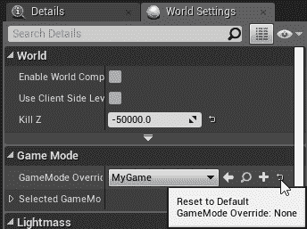

保存地图。

# 安全删除资产

现在在内容浏览器中选择“蓝图”文件夹。我们马上要创建自己的蓝图，所以我们不需要这些。删除此文件夹，但要注意出现的确认对话框。

如果您看到一个带有警告的“强制删除”按钮，这意味着您要删除的内容仍然在某个地方使用中。您几乎永远不应该删除仍然被引用的内容。（我们在这里说“几乎”是因为一旦您真正了解引擎在做什么，就有某些情况可以稍微推动它，但在您确切知道底层发生了什么之前，请不要这样做。）相反，找出资产仍在使用的位置，并将引用更改为指向其他内容，或者删除引用它的对象，或者保持不变：

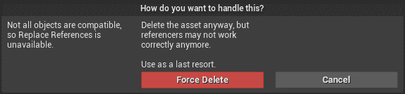

如果可以安全删除对象，对话框将只显示一个删除按钮。这意味着删除它不会破坏其他内容：

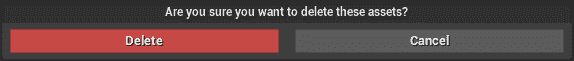

在这种情况下，如果出现强制删除警告，意味着您可能没有清除地图的世界设置中的 GameMode Override，或者您在此之后没有保存地图。如果只有一个简单的删除按钮，点击它以删除文件夹及其内容。

# 移动资产并修复重定向器

现在让我们整理剩下的内容。在内容浏览器中，为您的项目创建一个新文件夹。我们可以将此文件夹命名为`HelloVR`。

在内容浏览器中为您的项目创建一个文件夹是一个好主意。这样，当您从其他来源迁移更多内容到项目中，或者从市场添加资产时，您将永远不会困惑于哪些资产属于您的项目，哪些是外部来源的。同样，如果将资产迁移到其他位置，它们将全部出现在新项目的内容浏览器中。大多数开发者不这样做，但每个人都应该这样做。当您第一次迁移插件并让其将资产散落在现有文件夹中时，您就会明白为什么。通过保持自己的项目有组织，您可以避免很多混乱。

由于我们已经删除了`Blueprints`文件夹，我们仍然有另外两个从迁移内容中遗留在内容根目录的文件夹。让我们将它们移动到我们的项目文件夹中。

将`Maps`文件夹拖动到`HelloVR`文件夹中。当询问是否移动或复制时，选择移动。现在将`Assets`文件夹也进行同样的操作。

但这是什么？我们已经移动了文件夹，但旧位置的文件夹并没有消失。为什么？原因是虚幻引擎留下了一组**重定向器**。您应该了解这些。让我们将它们显示出来。

在搜索栏旁边的筛选器下拉菜单中，选择筛选器 | 其他筛选器 | 显示重定向器：

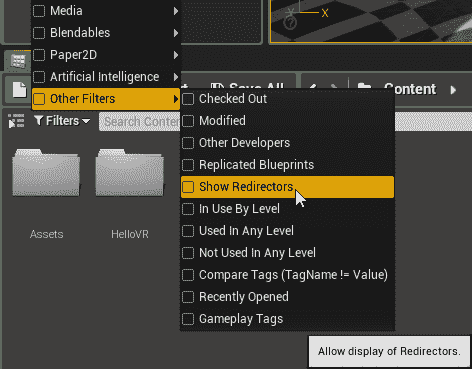

现在让我们进入那个被遗留的`Assets`文件夹，并进入其中的`Blueprints`文件夹。里面有一个名为 BP_Godray 的**重定向器**，我们将其移动到了新位置。双击此重定向器，它将带您到资源的新位置。这就是重定向器的作用。当您在虚幻引擎中移动资源时，很可能项目中的其他内容正在使用该资源并指向它。虚幻引擎允许您在不更改引用的情况下移动资源，当其他对象尝试在旧位置找到它时，重定向器将把它们指向新位置，您可以稍后更改引用指向的位置。这是一个很好的系统，可以在大型项目中节省很多麻烦。

然而，如果您不需要重定向器，您不希望将其留在那里。要清理重定向器，请右键单击它，并选择“修复”：

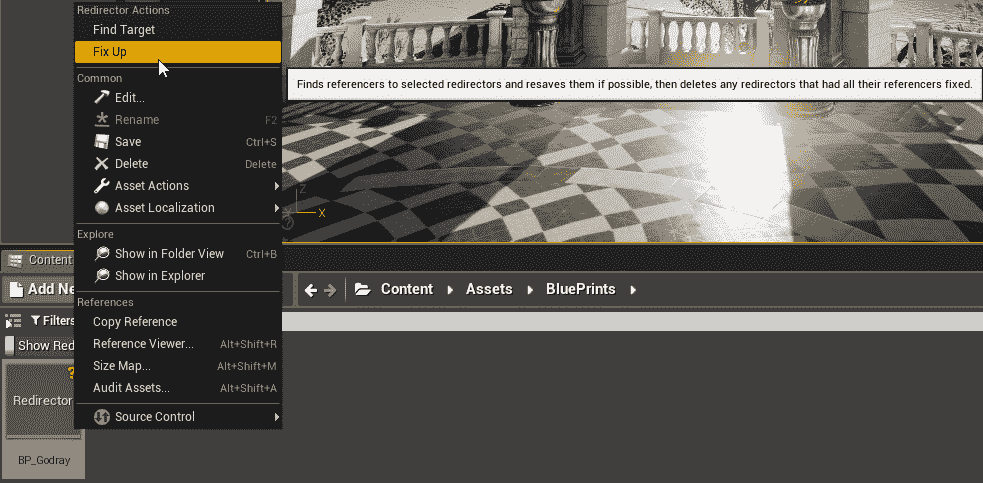

这将找到所有引用该资源的资源，并将引用指向新位置。完成后，删除重定向器，因为它不再需要。

这也可以同时对文件夹中的每个重定向器执行。接下来我们来做这个。

首先，我们将使内容浏览器的文件夹结构更易于查看。点击筛选器下拉菜单旁边的“Sources Panel”按钮，打开“Sources panel”：

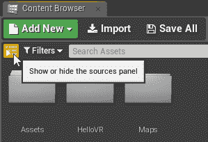

这将切换到项目内容目录的树状视图，可以更方便地浏览和移动资源：

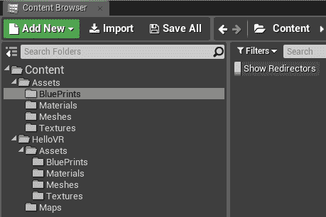

现在我们可以看到我们正在做什么了，让我们选择包含所有重定向器的旧的`Assets`文件夹，右键单击它，然后选择“修复文件夹中的重定向器”：

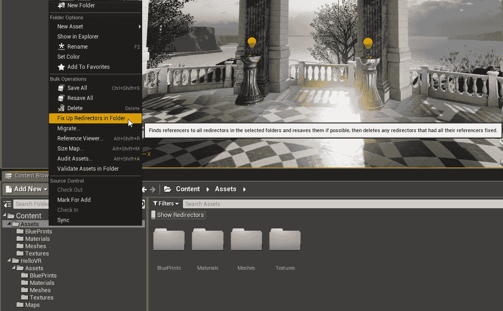

操作完成后，您可以删除旧的`Assets`文件夹，因为它现在是空的。

在删除文件夹之前，验证文件夹是否为空的一个好方法是在内容浏览器中右键单击文件夹，选择在资源管理器中显示，并在资源管理器中选择文件夹，按下*Alt* + *Enter*以显示其属性。如果显示为 0 个文件，则为空。如果有任何内容，您可以深入了解其中的内容以及是否需要保留。

我们的`Content`目录现在应该非常有条理，我们使用的所有内容都集中在我们的`HelloVR`文件夹下。如果您在项目较小的时候就养成了保持`Content`目录整洁的习惯，那么一旦项目变得庞大，您将会更容易处理。

# 设置默认地图

现在我们已经导入了地图并清理了附带的额外蓝图，让我们设置项目以将 Sun Temple 作为默认地图加载。

在项目设置|项目|地图和模式|默认地图下，使用下拉菜单将 Sun Temple 设置为您的编辑器启动地图和游戏默认地图：

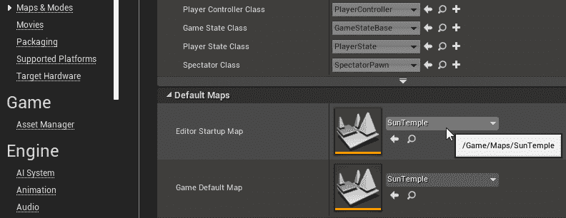

这样，当您启动编辑器或启动游戏作为独立可执行文件时，它将直接加载到这个地图中。

# 在桌面上测试我们的地图

让我们来看看我们目前所拥有的。如果我们正在开发桌面 VR，我们可以在 VR 中启动地图并四处查看。在编辑器工具栏上，选择播放按钮右侧的下拉菜单。选择 VR 预览（如果 VR 预览变暗，请确保您的 VR 头显已连接并且其软件正在运行）：

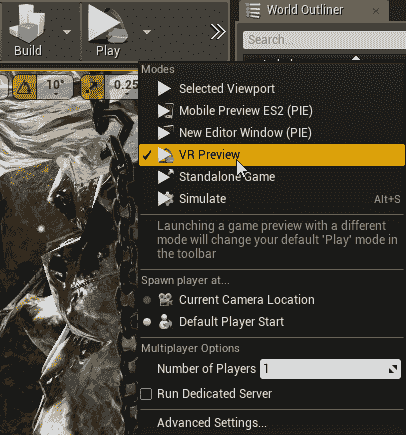

这里感觉还不错，对吧？

我们还不能做太多事情，而且相对于地板来说我们的高度也不正确，但它正在运行，我们准备开始设置事物。

# 在移动设备上测试我们的地图（Oculus Go/Samsung Gear）

如果我们想在移动设备上测试地图，我们还需要做一些其他的事情。

假设我们已经按照说明设置好了在移动设备上运行项目，让我们首先检查我们的移动设备是否已连接并可见。

重要提示：如果您更新了 Unreal Engine 版本，请确保在`<Engine Install Location>\Engine\Extras\AndroidWorks\Win64`下重新运行**CodeWorks for Android**安装程序。使用更新的 Unreal 代码和过时的 Android SDK 代码构建可能会在尝试在移动 VR 中运行时创建难以调试的错误。记得保持您的 CodeWorks 更新。

打开 Windows PowerShell 并导航到 Android SDK 目录中的`platform-tools`目录。默认情况下，这将是`C:\NVPACK\android-sdk-windows\platform-tools`。从这里，键入`./adb devices`。您应该在这里看到您连接的设备的序列号，并在旁边带有`device`一词。如果显示为“unauthorized”，则需要在头显内部接受与 PC 的连接。如果显示为“offline”，则可能需要重新启动您的`adb`服务器。键入`./adb kill-server`，然后再次运行`./adb devices`：

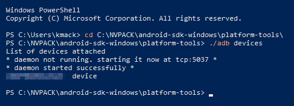

如果您正在使用移动设备进行开发，无论如何，您都将花费大量时间在 PowerShell 中与设备进行通信。花时间学习 ADB 尤为重要。当出现问题时，您将使用 ADB 来找出问题所在。在此处了解更多信息：[`developer.android.com/studio/command-line/adb`](https://developer.android.com/studio/command-line/adb)。

如果您的`./adb`设备看起来不错，您应该准备好将项目发布到设备上了。

在编辑器工具栏上的启动下拉菜单中，选择与您设备的序列号匹配的 Android 条目。

启动过程应该开始了。正如我们在第二章中提到的*设置开发环境*，第一次执行可能需要一些时间。

# 设置游戏模式和玩家角色

现在我们已经设置了一个基本场景并验证了它在平台上运行，让我们开始构建一些功能。

# 创建一个 VR 角色

我们首先需要做的是创建一个代表玩家的**角色**。角色是一种可以由玩家或 AI 控制的演员类型。在我们的情况下，我们将创建一个玩家可以控制的角色。

虚幻引擎是一个**面向对象**的系统。这意味着引擎是围绕称为**对象**的离散项组织的。一个对象由**属性**组成，你可以通过查看地图中选择的项目的详细面板来看到这些属性，以及**函数**，你通常可以在蓝图编辑器中看到这些函数。对象经常从彼此**继承**，因此一个新的对象类可能使用另一个类作为其父类来创建。这意味着新类将继承其父类的属性和行为，但可以更改这些属性和行为或添加新的属性和行为。因此，一个演员是对象类的子类，它添加了在世界中放置的能力。角色是一种可以由玩家或 AI 控制的演员类型。当我们使用角色作为父类创建自己的类时，我们正在设置该类来承担角色的所有功能，然后更改其行为或添加我们自己的功能。

让我们在内容浏览器中导航到我们的`Content/HelloVR/Assets/Blueprints`文件夹，在文件夹中的任何空白处右键单击，然后选择创建基本资产 | 蓝图类：

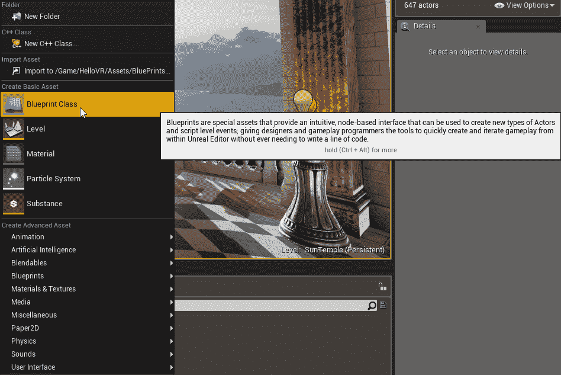

在随后的对话框中，我们将被要求选择我们新蓝图的父类。选择 Pawn：

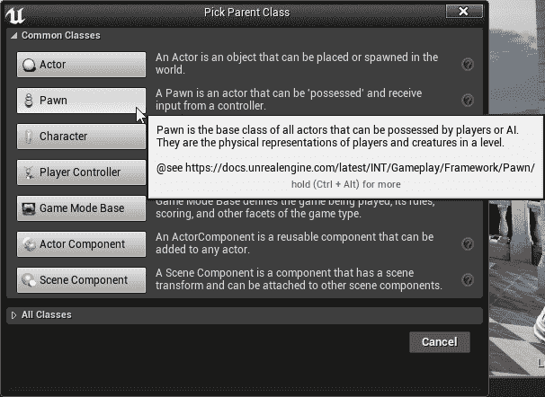

在我们的`Blueprints`目录中将创建一个新的蓝图资产。让我们将其命名为`BP_VRPawn`。

当你给你的资产命名时，遵循一个**命名约定**是一个好习惯。命名约定是在你思考为你正在创建的新事物命名时遵循的一组规则。通过在命名对象时遵循规则，你可以更容易地看到一个对象是什么，或者记住你给它起的名字。在这种情况下，我们使用`BP_ 前缀`作为提醒，我们的角色是一个蓝图类。一个特别全面和深思熟虑的命名约定在这里：[`github.com/Allar/ue4-style-guide`](https://github.com/Allar/ue4-style-guide)。

一会儿，我们将开始修改我们的角色，但是首先，我们需要告诉地图使用它。

# 创建一个游戏模式

每当虚幻加载一个地图时，它首先检查规定地图行为的规则。这些规则可以指定许多事情，但我们现在关心的是从`Player Start`对象生成什么样的角色。这些规则的集合存在于一个称为**游戏模式**的类中。

让我们创建一个游戏模式。在空白处右键单击，创建一个蓝图类，并选择 Game Mode Base 作为其父类。我们将其命名为`BP_VRGameMode`。

双击我们的新游戏模式以打开它，在其详细信息部分，选择 Classes | Default Pawn Class 下拉菜单，并选择我们刚刚创建的`BP_VRPawn`类：

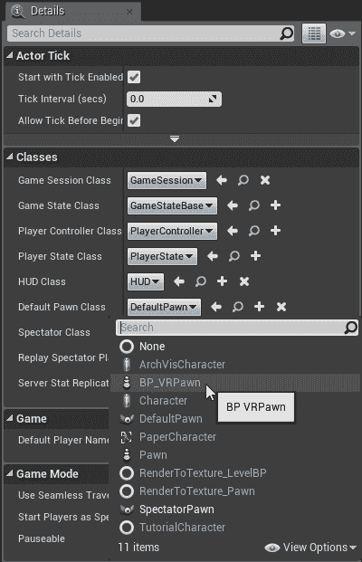

对于我们现在的目的，这就是我们需要做的关于游戏模式的一切。我们只是使用它来指定我们想要加载的角色类。编译并保存它。

蓝图是一种**编译**语言。在您编写的代码可以由 CPU 运行之前，需要将其转换为 CPU 可以理解的语言。这可以通过两种主要方式实现。**解释**语言在运行时即时翻译。然而，这样做会带来一些成本，因为解释器需要在您的代码旁边运行并尝试在运行时进行翻译。将所有内容离线翻译为准备好在 CPU 需要运行时运行的单独进程中，这样处理速度更快。这是编译语言处理事物的方式，当您编译蓝图时，这就是您所做的事情。

默认情况下，当蓝图被编译时，它们被编译为一种格式，然后由虚拟机使用该蓝图代码托管您的应用程序运行时。这个系统运行速度很快，但如果您想从中挤出更多的速度，您可以选择将它们转换为本机 C++，然后允许它们编译为机器代码。此时，它们可以像直接在 C++中编写的代码一样快速运行。

# 分配游戏模式

现在，我们需要告诉我们的项目使用这个游戏模式作为默认模式。

打开项目设置，并在项目|地图和模式|默认模式下，将我们的默认游戏模式设置为我们新创建的游戏模式：

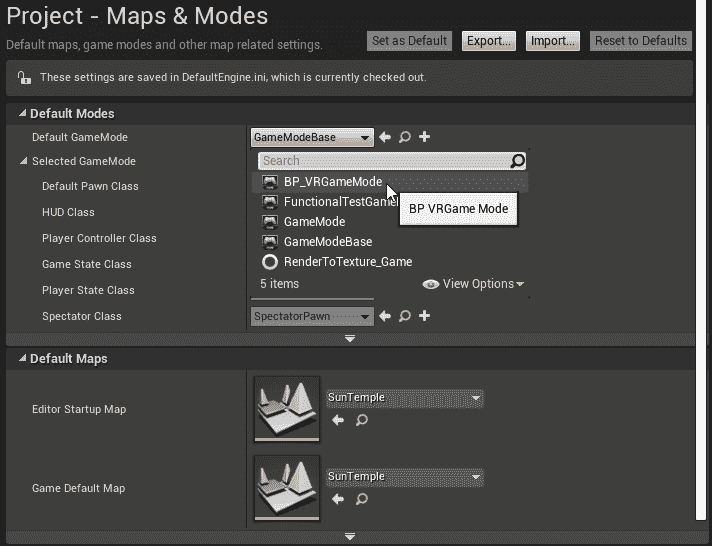

现在，我们项目中加载的任何关卡都将使用此游戏模式来决定生成什么以及运行场景时遵循什么规则。

# 为特定地图覆盖游戏模式

如果我们想要其中一个地图使用不同的游戏模式怎么办？例如，如果我们设置了一个入口菜单场景，我们可能希望生成一个专门用于与菜单交互的棋子，以替代默认的玩家棋子。幸运的是，这很容易实现。

如果尚未可见，请选择窗口|世界设置以打开我们的世界设置选项卡。在世界设置中，在游戏模式下，将游戏模式覆盖设置为我们刚刚创建的新 BP_VRGameMode：

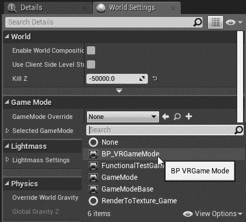

我们刚刚告诉引擎在加载此地图时使用我们的新游戏模式，而不管项目设置中指定了什么游戏模式。

有四个地方可以指定要使用的游戏模式：

+   您可以在项目设置|地图和模式|默认模式|默认游戏模式中设置它。在项目中，除非有其他覆盖，否则此处指定的游戏模式将默认加载。

+   您可以在单个地图中设置游戏模式覆盖，就像我们在这里所做的那样。如果设置了全局默认游戏模式，它将覆盖项目设置中的全局默认游戏模式。

+   当启动可执行文件时，您可以使用命令行参数`?game=MyGameMode`来指定游戏模式。这将覆盖默认游戏模式以及地图中设置的任何覆盖。

+   在`DefaultEngine.ini`中，您可以指定在加载具有特定前缀的地图时要加载的特定游戏模式。如果设置了此项，它将覆盖任何其他规定。

# 将一个棋子直接放在世界中

虽然通常最好使用游戏模式和玩家起始对象将玩家棋子放入世界中，但您不必这样做，有时您会遇到一些现有项目，例如默认的 VR 模板项目，不使用游戏模式来设置玩家棋子。

在这些情况下，不要在您希望玩家生成的场景中放置玩家起始对象，而是直接将您的棋子蓝图拖放到场景中。如果场景中已经有一个现有的玩家起始点，请将其删除。

记住我们说过棋子可以由玩家或 AI 控制吗？由于没有游戏模式来完成这项工作，您需要将您的棋子置于玩家控制之下。选择刚刚放置在关卡中的棋子，在其详细信息中找到 Pawn | Auto Possess Player，并将值设置为 Player 0。这将在生成到世界中时将棋子置于玩家控制之下：

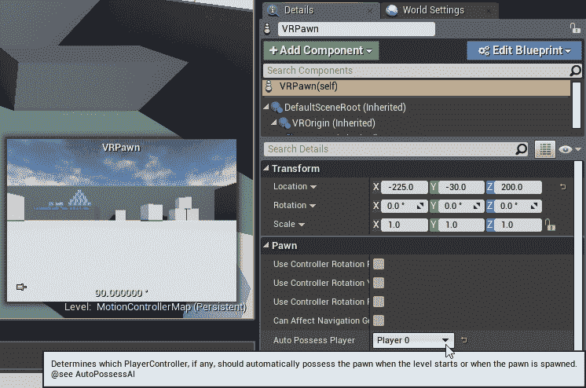

一般来说，最好使用 GameMode 来指定玩家角色类，但你应该知道这种方法的存在，因为你会看到一些项目使用它。

# 设置 VR 角色

现在，我们已经创建了一个 VR 角色并设置了游戏模式来使用它，让我们修改这个角色以适当地在 VR 中使用。我们将从头开始做这个。通常情况下，当你创建一个简单的 VR 应用程序时，你会使用 VR 模板提供的角色类，但我们不希望你把它当作一个支撑。更好的做法是了解如何为 VR 构建角色，这样你就可以根据需要适当地构建它。

我们要做的第一件事是打开我们的角色。

# 添加相机

在蓝图编辑器视图的左上角，你应该看到一个组件选项卡。点击绿色的+Add Component 按钮，在下拉菜单中选择 Scene 创建一个场景组件。将其命名为`Camera Root`：

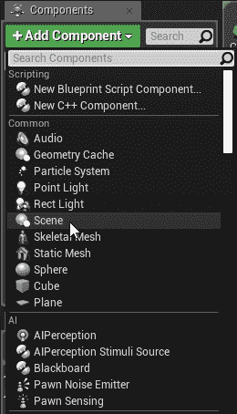

**组件**是可以添加到蓝图对象中的附加元素。有各种各样的组件可供选择，它们都有不同的功能。组件按层次结构组织，允许你将组件附加到其他组件上。你可以通过这种方式做很多事情。

现在，创建一个新的相机组件。如果在创建相机组件时仍然选择了 Camera Root 场景组件，则相机组件将作为 Camera Root 的子组件创建。如果没有选择，将其拖动到 Camera Root 上，将 Camera Root 设置为其父组件。

通常情况下，像我们在这里做的这样设置一个单独的根组件是一个好主意。这样可以更灵活地更改角色的结构，或者更改组件（如相机）的旋转或位置，而无需调整对象的位置。

# 添加运动控制器

接下来，选择`DefaultSceneRoot`组件，并创建一个`Motion Controller`组件。对于这个组件，在添加组件菜单的顶部使用搜索组件栏，输入`mot`以缩小搜索范围到运动控制器组件。使用这个搜索栏可以节省很多时间。将这个新组件命名为`MotionController_L`，确保它是`DefaultSceneRoot`的子组件，而不是 CameraRoot 或 Camera 的子组件。

选择`DefaultSceneRoot`，再次执行上述步骤创建第二个运动控制器组件。将其命名为`MotionController_R`，并确保它是`DefaultSceneRoot`的子组件，而不是任何其他组件：

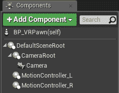

现在，你的组件层次结构应该看起来像上面的截图。

在继续之前，我们需要设置一些运动控制器组件的属性。选择`MotionController_R`组件，在其详细面板中找到 Motion Controller | Motion Source 条目。将其设置为 Right，以允许右手的 Oculus 或 Vive 控制器移动控制器。顺便说一下，确保`MotionController_L`仍然设置为使用 Left 作为其运动源。默认情况下应该是这样的：

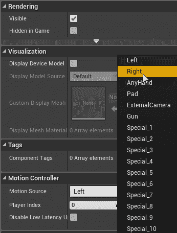

让我们也将这两个控制器设置为可见，以便我们可以验证它们是否正常工作。从每个运动控制器组件的详细面板中，选择可视化|显示设备模型。打开此选项，并验证显示模型源是否仍设置为默认值，这将简单地显示你正在使用的运动控制器硬件的模型。我们稍后会替换我们的运动控制器显示，但现在，我们只是想看到它们，以便我们可以验证我们已经正确设置它们：

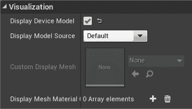

# 设置我们的跟踪原点。

现在，我们需要告诉我们的角色如何解释追踪空间中头戴设备的位置。在您的角色的组件选项卡下方寻找“我的蓝图”选项卡，如果您的事件图面板在主编辑窗口中尚不可见，请在“我的蓝图”选项卡中双击“图表|事件图”以显示它：

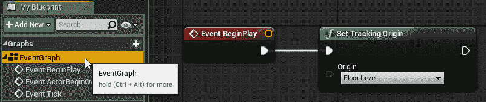

一旦进入事件图，找到 BeginPlay 事件，或者在图形编辑器中右键单击任意位置并在出现的搜索对话框中键入`beginplay`以查找或创建 BeginPlay 事件。从 BeginPlay 事件拖动执行线并右键单击以创建一个新节点。找到输入|头戴显示器|设置跟踪原点，或者开始在搜索框中键入以找到它。创建一个“设置跟踪原点”节点，并将其原点设置为地板高度，如果您使用的是房间规模的 VR 系统，如 HTC Vive 或带有触摸控制器的 Oculus Rift，或者将其原点设置为眼睛高度，如果您使用的是非房间规模的系统，如 Oculus Go 或较旧的单摄像头 Oculus Rift。

# 调整我们的玩家起始位置到地图中。

最后，我们需要调整地图中的玩家起始位置。在您的世界大纲中找到它（您可以使用搜索栏更快地找到它，然后选择它并将其拖动到场景中，直到其中心与地板相交（这是一种不太正式的对齐角色的方法，我们稍后会更好地完成这个工作，但现在它可以工作）：

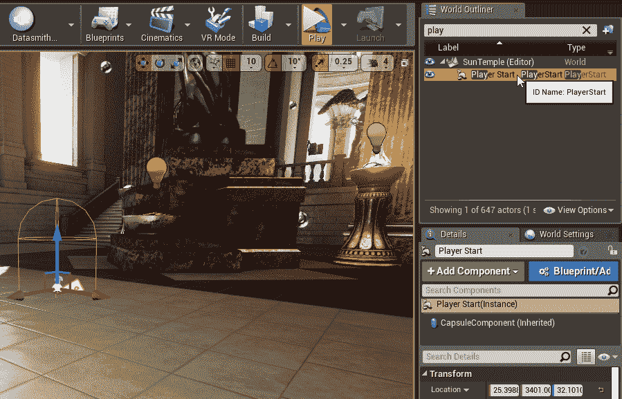

# 在头戴设备中进行测试。

我们现在拥有了在虚幻中创建 VR 体验所需的基本组件。我们有一个已经正确设置为在 VR 中高效运行的项目，以及一个可能还没有太多功能的角色，但已经准备好作为我们真正想要做的事情的基础。

让我们进行测试。使用 VR 预览启动地图，并验证您的视图是否位于正确的高度，并且在移动手时是否可以看到您的动作控制器。帧率也应该是可以接受的。

# 打包独立构建

当我们将虚幻应用程序分发给其他用户时，通常不会给他们编辑器的源文件。相反，我们将项目打包成一个可以在目标平台上运行的独立可执行文件。

让我们创建一个 Windows 独立可执行文件。

选择文件|打包项目|Windows|Windows（64 位）以启动打包过程。将被问到放置的位置。选择一个有意义的位置。（通常，在项目目录中创建一个“打包”目录是合理的。您可以将打包的构建放在任何您想要的地方。）当构建状态对话框出现时，点击“显示输出日志”以查看它正在做什么：

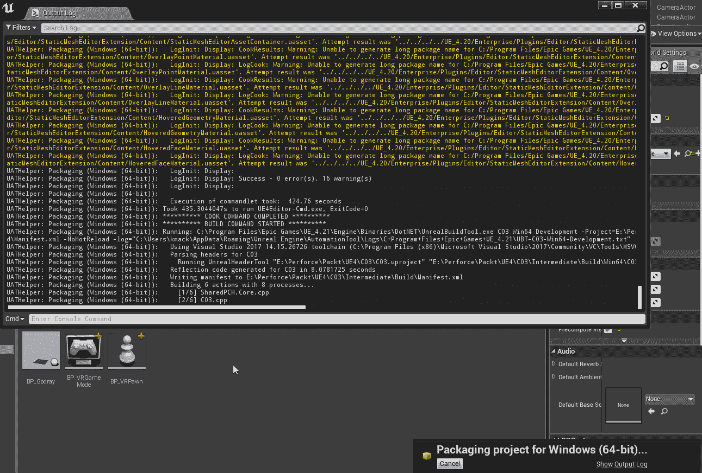

预计这个过程会花费一些时间。

一旦进程完成，关闭编辑器并检查您告诉系统构建可执行文件的位置。您应该在其中看到一个`WindowsNoEditor`文件夹。在其中，您应该看到一个带有项目名称的可执行文件。启动可执行文件。如果在项目设置中设置了在 VR 中启动标志，它应该直接启动到您的头戴设备。

# 总结

恭喜！我们涵盖了很多内容。在本章中，我们经历了创建起始 VR 项目并正确设置其在目标硬件上运行的过程。我们学会了在设置新的 VR 项目时如何决定使用哪些设置，以及如何在虚幻项目目录中找到我们的方式。我们还了解了在 VR 开发中使用的一些重要虚幻引擎功能：

+   实例化立体

+   循环轮询遮挡

+   前向渲染

+   多重采样抗锯齿（MSAA）

+   [移动]移动多视图

+   [移动]单眼远场渲染

我们学会了如何从一个项目迁移内容到另一个项目，并在其到达后如何清理我们的“内容”目录。

最后，我们设置了一个基本的 VR 棋子，并设置了一个游戏模式来指示地图加载它。在使用棋子时，我们了解了如何使用组件来将简单的部件组装成复杂的对象，添加了相机和跟踪运动控制器。最后，我们设置了我们棋子蓝图的第一个元素，以适应我们的 VR 硬件的跟踪原点，并测试了我们的地图。

在下一章中，我们将使在本章中创建的棋子能够在世界中移动。我们将使用蓝图来创建一个传送移动方案，并学习如何设置环境来支持它，然后我们将继续实现一系列沉浸式移动方案。
