# 第四章：在虚拟世界中移动

在本章中，我们将使用前一章中构建的角色，使其在世界中移动。我们将从常用的传送移动方案开始，涵盖一系列设置任务。我们将了解环境中的导航网格，如何在项目中设置输入事件并在蓝图中使用它们，以及如何构建一个玩家角色蓝图并使其在世界中移动。最后，我们还将探讨一种沉浸式的无缝定位方案，您可以使用它让玩家在世界中移动而无需传送。

在本章的过程中，我们将讨论以下主题：

+   导航网格-它们是什么，如何在级别中设置它们，以及如何优化它们

+   如何为玩家角色设置蓝图，以及如何创建角色可以使用的输入事件

+   如何使用直线和曲线进行追踪，以在环境中找到合法的目标位置

+   如何创建简单的游戏内指示器，向玩家展示正在发生的事情

+   如何实现无缝的定位方案，为那些不适合传送的项目提供沉浸式移动

这将涉及很多内容，但应该很有趣，您将获得一个良好的基础，帮助您弄清楚如何开发您想要的东西，以及在看到其他开发人员的蓝图时如何理解他们在做什么。在本章中，我们将以与大多数教程不同的方式进行。作为一名有效的开发人员，学习如何思考问题比仅仅记住一系列可能不适用于您面临的下一个问题的步骤更重要得多。在本章中，我们将逐步介绍构建元素的过程，然后在某些情况下发现其中的错误。之后，我们需要更改这些内容以修复这些错误。这种方法的真正价值在于，您将开始逐渐了解如何通过迭代开发软件，这才是真正的开发方式。这里的目标不是让您擅长构建这些教程，而是帮助您成为一个可以独立实现自己想法的开发人员。

说了这么多，让我们开始建设吧！

# 传送定位

正如我们在第一章中讨论的那样，VR 中面临的最大挑战之一是当用户尝试移动时引发的晕动病。其中最常用的解决方案之一是将用户从一个地方传送到另一个地方，而不是让他们在空间中平滑移动。这会破坏沉浸感，但完全避免了晕动病的问题，因为它根本不会产生运动感。对于沉浸式移动不是优先考虑的应用，比如建筑可视化，这可能是一种理想的方案。

# 创建导航网格

实现基于传送的定位方案所需的第一件事是告诉引擎玩家可以移动的位置和不允许移动的位置。我们可以使用导航网格来完成这个任务。

导航网格，通常缩写为 navmesh，是在虚幻级别中自动生成的一组表明可行走地板的表面。AI 控制的角色使用导航网格在世界中找到自己的路，但它也可以用作识别玩家角色安全着陆目的地的方式，就像我们在这里的传送系统中所做的那样。

在虚幻引擎中创建导航网格相当简单。从模式面板中选择体积选项卡，找到导航网格边界体积。将其拖入场景中，如下图所示：

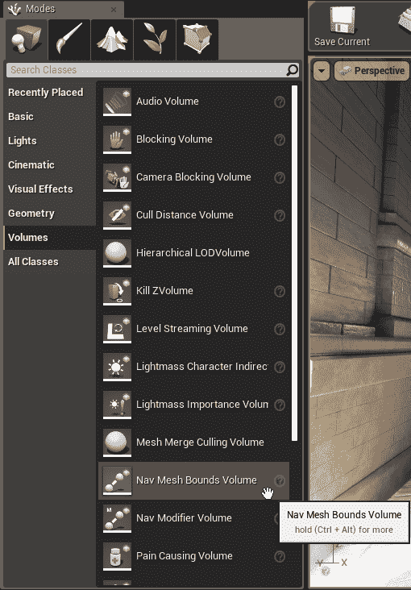

从模式 | 体积中选择导航网格边界体积

# 移动和缩放导航网格边界体积

NavMesh 边界体积需要围绕任何您希望玩家能够传送的地板。让我们使我们的导航网格可见，以便我们可以看到可行走的地板正在设置的位置：

1.  按下*P*键切换导航可见性，或者从视口菜单中选择显示|导航：

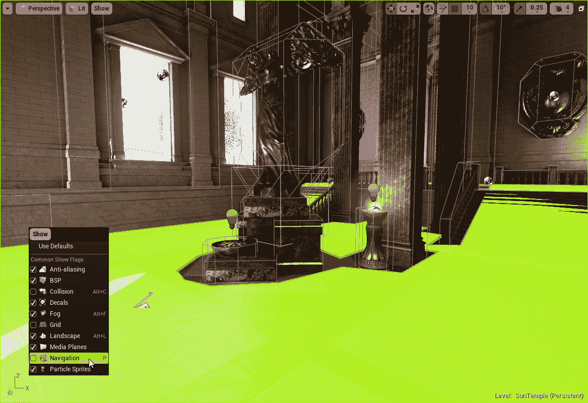

使用 P 键或者选择显示|导航来在环境中显示生成的导航网格。

如果在放置 NavMesh 边界体积后看不到任何可导航空间，请确保它与可行走的地板相交。该体积设置了导航网格生成的边界，因此如果它在地板上方，它将不会生成任何东西。

当然，我们刚刚放置的 NavMesh 边界体积太小了。让我们将其扩展以覆盖我们想要移动的空间。我们将通过缩放体积来实现这一点。

1.  按下*R*键切换到缩放模式，或者只需轻按*空格键*直到缩放工具出现。

我们可以从透视视图缩放体积，但对于这种操作，通常最好切换到正交视图，以便我们真正看到我们在做什么。

1.  按下*Alt* + *J*键或使用视口的视图选择器切换到俯视图：

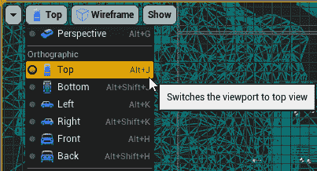

使用菜单或相关的快捷键切换到正交俯视图。

1.  将导航网格缩放以覆盖建筑物的可行走区域。

通过可见的导航，您可以看到它正在生成导航网格表面以及它是否在合理的范围内工作：

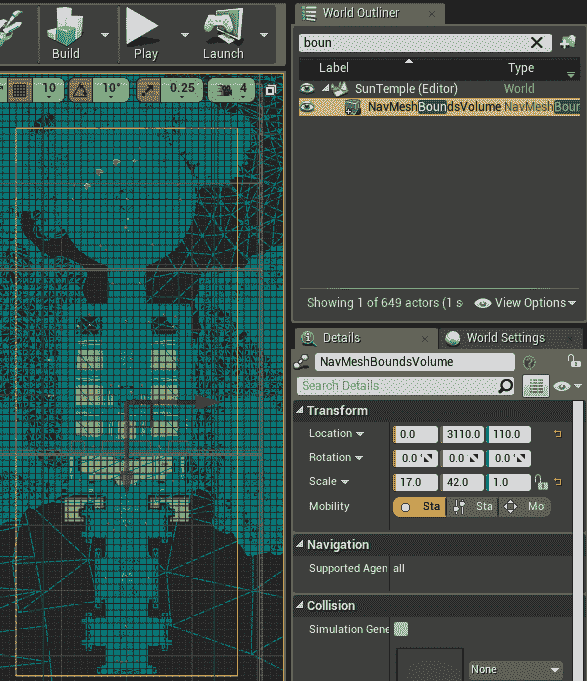

我们的关卡的俯视图显示了 NavMesh 边界体积的范围。

在我们的情况下，我们期望可行走的建筑物部分尚未覆盖。这是因为我们尚未对边界体积的高度进行任何处理，而这些区域的高度太高或太低，无法适应其中。让我们跳转到侧视图来修复这个问题。

1.  按下*Alt* + *K*键跳转到左视图，或者从视口视图选择中选择左视图。

1.  将边界体积缩放到合理覆盖地板的比例：

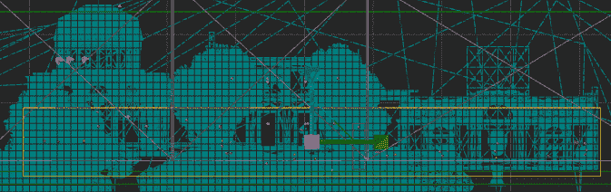

关卡的侧视图。您可以在这里看到我们正在缩放 NavMesh 边界体积以包围地板

1.  按下*Alt* + *G*键跳回透视视图并查看我们的进展。或者，您可以从视图选择器中选择透视视图。

值得记住这些改变视图的按键。您会经常使用它们，而且能够快速切换非常方便。*Alt* + *J*、*K*和*H*切换视角。*Alt* + *2*切换到线框视图，*Alt* + *4*切换回实体视图。还有很多其他快捷键，但您会经常使用这些。

如果我们飞到寺庙的后面，我们会发现这里有一个问题。我们的导航网格在后面的走廊中没有按预期生成。让我们弄清楚这里发生了什么：

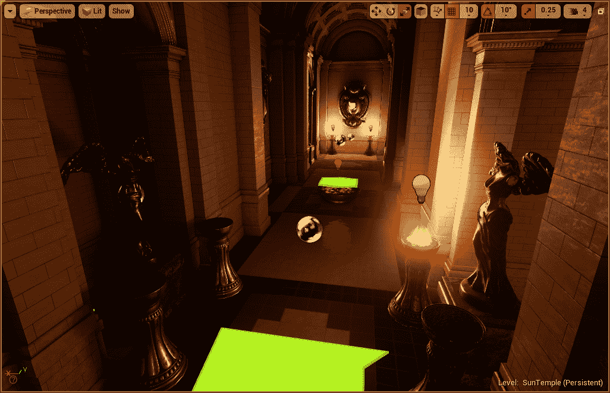

在这里我们可以看到我们的关卡的一部分没有被导航网格正确覆盖。

# 修复碰撞问题

导航网格没有生成在您期望的位置通常有两个原因。要么您的体积没有围绕您尝试生成网格的区域，要么该区域的碰撞有问题。让我们来看一下：

1.  按下*Alt* + *C*键查看后厅的碰撞，或者按下显示|碰撞。

看起来没有任何杂散的碰撞侵入到走廊中，所以可能是地板上缺少碰撞。

1.  选择问题区域的地板。

1.  在其详细信息中，找到其静态网格并双击打开它：

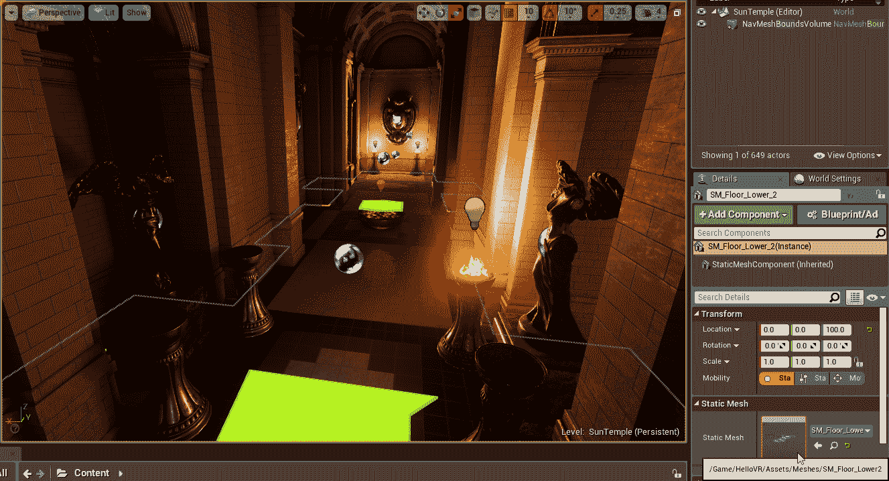

使用详细面板找到问题地板区域的静态网格。

1.  在静态网格编辑器中，选择碰撞工具栏项，并确保勾选了“简单碰撞”：

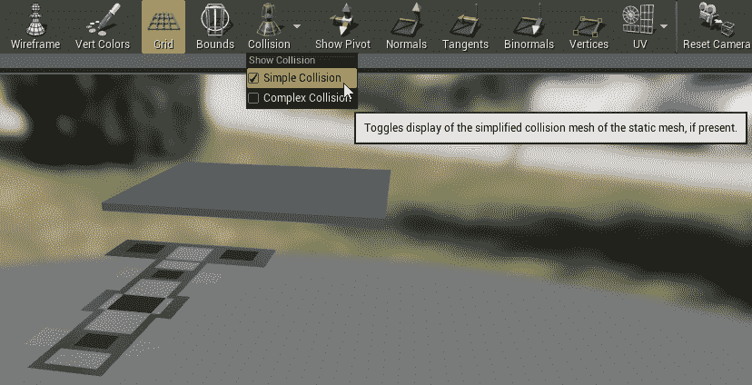

查看静态网格的简单碰撞

确实，我们的简单碰撞丢失了。让我们修复这个问题。

1.  选择碰撞|添加简化碰撞盒，为我们的地板添加一个简单的碰撞平面。

好多了。现在我们应该看到我们期望的 navmesh 已经在我们的主要层级中生成：

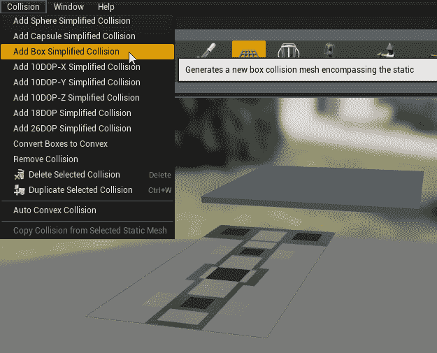

为我们的地板网格创建简化碰撞

在继续之前，让我们花一点时间来谈谈这里发生的情况。在实时软件中，我们经常需要做的一件事是确定一个对象何时碰撞到另一个对象。Unreal 使用*碰撞网格*来实现这一点。碰撞网格是简化的几何体，用于检查与世界中其他碰撞网格的相交。

演员有两个：

+   一个**复杂碰撞**网格。这只是模型的可见网格。

+   一个**简单碰撞**网格。这是一个较少详细的凸网格，围绕着物体。这些通常在导入对象时生成，或者可以在创建模型的 DCC 中显式创建。如果缺少它，您可以在编辑器中创建一个简单的碰撞，就像我们在这里所做的一样。作为最后的手段，您可以将详细信息|碰撞|碰撞复杂性设置为使用复杂碰撞作为简单碰撞，以将对象的可见网格用于所有碰撞计算。不过，对于具有大量多边形的网格，请不要这样做。这是昂贵的。

碰撞检测和处理是一个相当深入的主题，超出了本书的范围，但对于我们在 VR 开发中的目的，我们将非常关心对象的简单碰撞网格，因为我们将使用它们作为可行走的表面来检测另一个对象何时碰撞到它们，以及是否可以抓取它们，以及其他许多用途。

# 从 navmesh 中排除区域

在查看我们的地图时，我们还有一些问题需要解决。我们的 Navmesh Bounds Volume 在一些我们不希望玩家传送的区域生成了 navmesh。让我们也修复这个问题：

1.  按下*Alt* + *2*切换到线框视图，或使用视口的视图模式选择器切换到线框视图。

我们可能有一些问题可以通过调整 NavMesh Bounds 体积的比例来解决。如果我们的 navmesh 在屋顶或窗台上生成，让我们将 Bounds 体积的垂直比例减小，以排除这些区域。这是一个可以通过按下*Alt* + *K*跳转到侧视图来帮助的地方。

如果我们的 NavMesh Bounds 体积扩展到建筑物外部的范围超出了需要的范围，我们可以使用*Alt* + *J*跳转到顶视图，并调整它以更好地适应。

我们仍然会有一些剩余的杂散区域需要排除，而这些区域不能简单地通过调整体积来修复。对于这些区域，我们将使用 Nav Modifier Volumes。请参考以下步骤：

1.  从 Modes 面板中获取一个 Nav Modifier Volume，并将其拖入场景中。

1.  移动和缩放它，直到它围绕着生成不需要的 navmesh 的区域。

当 nav 修改器体积围绕它时，您将看到该区域的 navmesh 消失。查看详细面板中的 nav 修改器体积属性。您是否看到默认|区域类别设置为 NavArea_Null？这告诉 navmesh 生成器在此区域中不生成 navmesh。您可以从下拉菜单中看到它还可以用于标记障碍物和爬行空间，但对于我们在这里要做的事情，我们不关心这些。我们只关心使用它来清除不需要的导航。

1.  将这些拖到场景中，根据需要清理杂散的部分。您可以在拖动修改器体积时按住*Alt*键进行复制，或按下*Ctrl* + *W*进行复制：

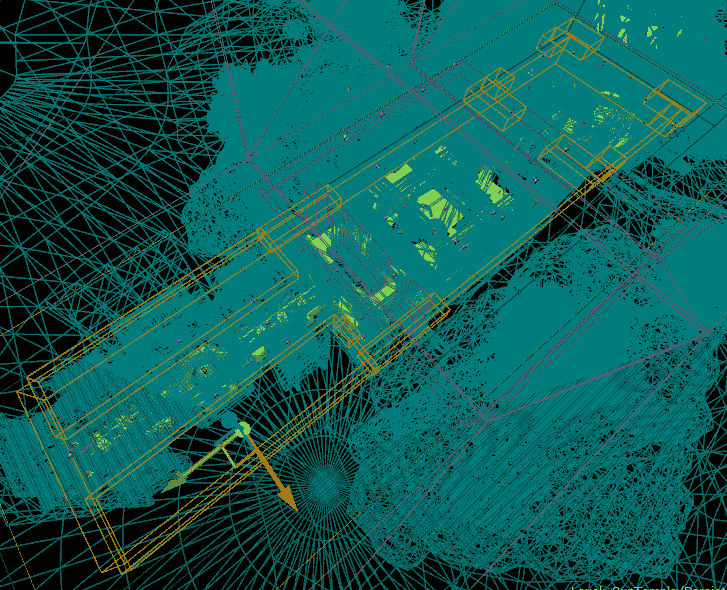

透视线框视图对于查找导航覆盖问题非常有用。

在移动物体时，记住熟记变换热键会很有帮助。按下 W 键激活“平移”工具，可以让你滑动物体。按下 E 键激活“旋转”工具，按下 R 键激活“缩放”工具。按下空格键也可以循环使用这些工具。按住 Ctrl 键+W 键可以复制一个物体，拖动物体时按住 Alt 键也可以复制它。

完成后，你应该有一系列阻挡玩家站立的导航修改体积。

在你不希望出现奇怪的导航网格的地方飞行，确保没有问题。在发现问题时，通过缩放导航网格边界体积或添加导航修改体积来修复问题。

# 修改导航网格属性

在我们继续之前，还有一件事情你应该知道，那就是如何调整刚刚生成的导航网格的属性。

如果你需要改变它的行为，选择`RecastNavMesh`对象，它将在你的关卡中创建。在其详细面板中，你可以看到控制其生成、查询和运行时行为的属性。

我们不会在这里详细介绍它们，只是提醒你其中一个属性：如果你想调整一个玩家可以适应的区域的大小，你可以调整代理半径来实现。将其缩小将使玩家适应更狭窄的空间。同样，你可以调整代理高度和最大高度来确定导航应该生成的可接受天花板高度。通常，在你疯狂微调导航修改体积之前，你会想要对这些值进行更改，因为这里的更改会改变导航网格的生成位置。对于我们的目的，我们将保持这些值不变。

# 设置兵棋蓝图

现在我们已经在场景中构建和调整了导航，我们可以通过按下 P 键关闭导航可视化，并开始处理我们的运动行为。

为了实现传送运动方案，我们需要做三个工作：

+   弄清楚玩家想要移动到哪里

+   弄清楚玩家实际上被允许移动到哪里

+   将玩家移动到新位置

让我们开始工作吧。

# 迭代开发

我们将以迭代的方式开发这种方法，就像你从头开始开发一样。大多数教程只是带你完成构建完成方法的步骤，但这种方法的问题在于它不教你为什么要做你正在做的事情。一旦你想做类似的事情，但又不完全相同，你就又回到了原点。

相反，我们将分阶段进行工作。

杰出的软件开发者肯特·贝克给开发者提出了这样的建议：“让它工作，让它正确，让它快。”

重要的是你做事情的顺序。一开始似乎几乎是显而易见的，但很少有开发者在刚开始时就做对。如果按照这个顺序工作，你将节省很多痛苦。

# 让它工作

构建一个大致的组装，测试早期和频繁。使其易于测试和易于更改。不断更改，直到你满意它正在做正确的工作。

# 让它正确

现在你知道你的代码需要做什么了，弄清楚你应该如何真正组织它。有没有更好或更清晰的方法来做你试图做的事情？有没有可以重复使用的部分？这段代码是否需要在其他地方使用？如果需要，你能调试它吗？以“让它工作”的阶段为起点，但现在你明白你真正需要做什么了，正确地编写它。在第一阶段制造混乱是可以的（事实上，如果你没有制造混乱，那么你可能做错了），但在这个阶段清理这个混乱。

# 让它快

一旦您有了合理干净的代码，能够正常工作，寻找可以使其运行更快的方法。是否有一个结果，您可以将其缓存到变量中并重复使用？您是否反复检查条件，即使您知道它们只会在某些事件发生时改变？您是否复制了可以直接从其原始位置读取的数据？找出您可以更高效地做什么，并在可以的地方加快速度。但要小心，在这里有些优化可能对运行应用程序没有明显的影响。选择大的优化，并使用性能分析工具了解您真正的问题所在。您要确保优化的是真正会产生差异的东西。此外，在优化代码时要小心不要使其更难以阅读或调试。将帧时间减少一点但使类难以更新或维护的更改可能不值得。在优化时要谨慎使用判断。

# 按顺序进行操作

许多新开发者会在优化代码之前就开始尝试优化代码，而没有确保自己正在做正确的事情。这只会浪费时间，因为很可能会丢弃其中的一些代码。其他开发者跳过了“让它正确”的阶段，并在似乎工作正常时认为他们的工作已经完成。这也是一个错误，因为代码的 80%的生命周期都用于维护和调试。如果您的代码能够工作但是一团糟，您将花费大量额外的时间来保持其运行。

在开发初期匆忙或粗心的工作所造成的问题通常被称为“技术债务”。这些是你以后需要修复的东西，因为即使它能运行，但可能不够灵活、健壮，或者只是一团难以理解的混乱。清理技术债务的时间是在完成“让它工作”阶段之后，而在继续其他工作并在需要更改的基础上构建更多代码之前。

按照这个顺序并将其视为离散阶段来进行工作将使您成为一个更有效的开发者。

# 从右手控制器设置一条射线追踪

让我们从获取玩家想要去的位置开始设置我们的传送功能：

1.  打开 BP_VRPawn 蓝图，并打开我的蓝图|图表|事件图，如果尚未打开。

我们应该在事件图中仍然看到`BeginPlay`事件，其中我们设置了跟踪原点。现在，我们将在事件 Tick 中添加一些代码。

每次引擎更新帧时都会调用 Tick 事件。在 Tick 事件中不要放太多工作，因为它们会影响性能。

1.  如果在事件图中还没有看到 Event Tick 节点，请在图中的任何位置右键单击，输入`tick`在搜索框中，然后选择添加事件|事件 Tick。如果已经定义了一个 Tick 事件，这不会添加一个新的事件，而只会将您带到事件图中的该节点。如果没有，现在将创建一个。

1.  在 Event Tick 的右侧单击，添加一个按通道进行线性追踪。

当执行线性追踪时，您提供一个“起点”和一个“终点”，并告诉它您要查找的“碰撞通道”。如果一个具有设置为提供的碰撞通道的碰撞的 actor 与起点和终点之间的线相交，追踪将返回`true`，并返回有关它所击中的信息。我们将利用这种行为来找到我们的传送目的地。

让我们从右手控制器的位置开始追踪：

1.  从组件列表中获取 MotionController_R，并将其拖动到事件图中。

1.  我们希望从运动控制器的位置开始追踪，所以让我们从 MotionController_R 的返回值中拖出一个连接器并释放。

1.  在弹出的对话框中，输入`getworld`并选择 GetWorldLocation：

！

蓝图节点的创建默认是上下文敏感的。这意味着如果你从另一个对象拖动连接，你只会看到适用于该对象的操作。

1.  将`GetWorldLocation`的结果拖入 Line Trace 节点的 Start 输入引脚。

现在，让我们设置追踪的终点。我们将在距离起始位置 10,000 个单位的点结束追踪，朝向控制器的方向。让我们进行一些简单的数学计算，找出那个点在哪里。

1.  从`MotionController_R`的输出中创建一个`Get Forward Vector`节点。

这将返回一个长度为 1 的向量，指向控制器所面向的方向。我们说过我们希望终点距离起点为 10,000 个单位，所以让我们将我们的 Forward 向量乘以该值。

1.  将`Get Forward Vector`的返回值拖出并在搜索栏中输入`*`。选择向量*浮点数。

现在，从浮点输入拖出一个连接器到乘法操作，并选择 Promote to Variable：

！

这是在蓝图中快速创建变量的方法。你可以简单地从输入中拖出，选择 Promote to variable，

并且将创建一个具有正确类型的变量以供输入使用

1.  将新变量命名为`TeleportTraceLength`，编译蓝图，并将变量的值设置为`10000`。

你可以直接在乘法操作的浮点输入中键入`10000`，但这样做是不好的实践。如果你在蓝图中随处隐藏数值，当你需要更改它们时，你将很难找到它们。此外，键入到输入中的数字并不能解释它是什么。相反，变量可以被赋予一个描述其值改变时实际发生的事情的名称。在你的代码中没有解释的数字被开发人员称为*魔法数字*，它们是*技术债务*的一个例子。当你需要维护或调试代码时，它们只会给你带来麻烦。除非一个值在其上下文中绝对明显，否则请使用一个变量，并给它一个有意义的名称。

现在，我们有了一个长度为 10,000 个单位的向量，指向控制器的前方，但现在它将从世界的中心运行 10,000 个单位，而不是从控制器开始，这不是我们的意图。让我们将控制器的位置添加到这个向量中以修正这个问题：

1.  从控制器的`GetWorldLocation`调用中拖出另一个连接器，并在搜索栏中输入`+`。选择向量+向量。

1.  将我们的前向量乘法的输出拖入另一个输入。

1.  将此加法的输出连接到`LineTraceByChannel`的 End 参数：

！

在继续之前，让我们设置一些调试绘图，以查看到目前为止是否一切都按我们的预期运行。

1.  按住*B*键并点击`Line Trace`节点右侧的空白处，创建一个`Branch`节点。（你也可以右键单击并像通常那样创建一个 Branch 节点，但这是一个有用的快捷方式。）

1.  从`Line Trace`节点的布尔返回值拖出一个连接器到这个分支的条件。

如果追踪操作命中了某个物体，它将返回`True`，如果没有命中，则返回`False`。我们只对命中物体进行调试绘图，所以我们只使用分支的`True`输出。

如果我们确实命中了某个物体，我们需要知道命中发生的位置。

1.  从 Out Hit 拖出一个连接器，并选择 Break Hit Result 以查看命中结果结构的成员。

**结构体**是一组捆绑在一起的变量，可以被赋予一个名称并作为一个单独的单元传递。`Hit Result`结构体是一个常用的结构体，描述了检测到的碰撞的属性，告诉你发生碰撞的位置、被击中的演员和许多其他细节。在结构体上调用**break**可以查看其内容。

现在，让我们画一条表示我们的跟踪的调试线：

1.  从我们的`Branch`节点的`True`输出拖动一个执行线，并创建一个`Draw Debug Line`动作。

1.  将`Hit Result`结构体中的位置拖动到`Debug Line`调用的 Line End 输入中。

1.  将击中结果的跟踪起点拖动到线的起点。

1.  将线的粗细设置为`2`，并将其颜色设置为你喜欢的任何颜色。

顺便说一下，让我们在击中位置处画一个调试球体：

1.  创建一个`Draw Debug Sphere`节点。

1.  将其执行输入连接到调试线的输出。

1.  将其中心设置为击中结果的位置：

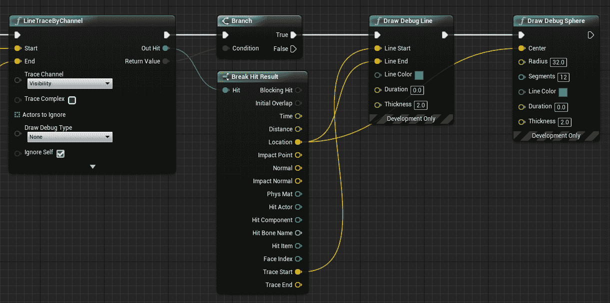

请注意，`Draw Debug`调用仅在开发版本中起作用。它们对于理解正在发生的事情很有用，但它们只是调试工具，需要用实际软件的真实可视化替换。我们很快就会做到这一点。

1.  让我们来测试一下。你的结果应该看起来像这样：

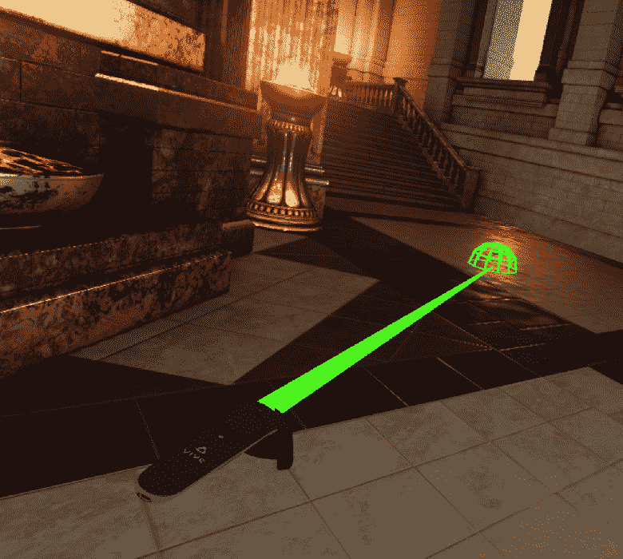

很好。到目前为止，它正在按我们的预期进行——从控制器发射一条射线，并显示它击中表面的位置。然而，问题是它同样可以击中墙壁和地板。我们需要将其限制在有效的传送目的地上。让我们来做这个。

# 改进我们的跟踪击中结果

我们首先要做的是设置一个简单的测试，只接受朝上的表面。我们将使用一个称为*点积*的向量运算来将表面法线与世界的上向量进行比较。按照以下步骤开始：

1.  在我们的击中结果拆分的右侧某处右键单击，创建一个点积节点。

1.  将击中结果的法线拖动到第一个输入中，并将第二个输入的*Z*值设置为 1.0。

*法线*是垂直于其延伸表面的向量。*点积*是一种数学运算符，返回两个向量之间夹角的余弦值。如果两个向量完全平行，它们的点积将为 1.0。如果它们完全相反，它们的点积将为-1.0。如果它们完全垂直，点积为 0。

由于向量(0,0,1)是世界的上向量，通过测试表面法线与该向量的点积，我们可以通过检查点积是否大于 0 来判断法线是否朝上。

1.  从点积的结果中拖动一个连接器，并选择`>`运算符。

1.  使用此结果作为条件创建另一个分支运算符。

1.  按住*Alt*并单击 Draw Debug Line 节点的执行输入以断开连接。

1.  从返回值的分支中拖动一个新的执行线到这个新的分支。

1.  将点积的分支的 True 输出与我们的 Draw Debug Line 节点连接起来：

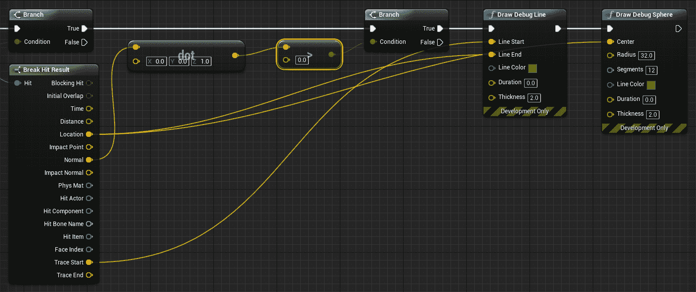

让我们来测试一下。我们会发现当射线击中地板时，我们现在看到了调试球体的绘制，但当它击中墙壁或天花板时却没有。正如我们刚才提到的，这是因为墙壁的法线与世界的上向量的点积将为 0，而天花板与世界上的点积为-1。

这样做更好了，但是我们决定不让玩家去的地方怎么办？我们花了那么多时间设置我们的导航网格边界和导航网格修改器，但我们还没有使用它们。我们应该修复这个问题。

# 使用导航网格数据

现在，我们要进一步测试，寻找离我们指针指向的位置最近的导航网格点：

1.  在图表中右键单击，创建一个 Project Point to Navigation 节点。

1.  将击中结果的位置输出连接到这个新节点的点输入

1.  将节点的 Projected Location 输出与 debug line 的 Line End 和 Debug Sphere 的 Center 连接起来，替换之前在那里使用的位置输入：

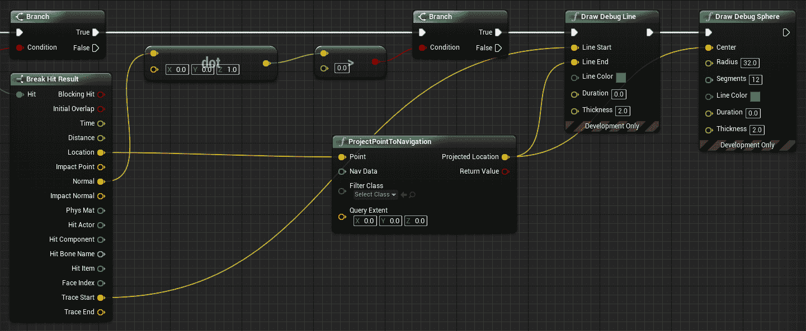

我们在这里做的是查询我们创建的导航网格，找到离我们提供的位置最近的网格上的点。这将防止选择我们从网格中排除的位置。

然而，当我们环顾四周时，我们会发现我们将会遇到一个问题。直接从控制器发射射线将无法让我们传送到比我们当前站立位置更高的位置，因为射线无法击中更高的地板。这是我们系统的一个缺陷，我们需要重新考虑这个问题。

这就是为什么在我们投入大量工作之前坚持做一个“让它工作”的阶段非常重要的原因。通常情况下，你的第一个运行原型会揭示出你需要重新考虑的事情，最好在你付出大量努力之前尽早发现这些问题。

# 从线追踪切换到抛物线追踪

经过思考，我们清楚地意识到，为了到达比我们当前视点更高的点，我们需要一个曲线路径。让我们修改我们的追踪方法以实现这一点。这是我们将得到的结果：

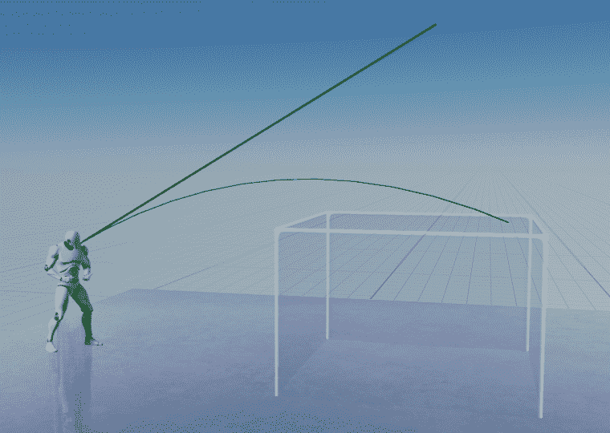

用于计算抛物线的数学方法实际上相当简单，但我们还有一个更简单的选择。`Predict Projectile Path By TraceChannel`方法已经为我们处理了数学计算，并且可以节省我们一些时间。让我们现在使用它：

1.  断开我们的 Event Tick 与旧的 Line Trace By Channel 节点的连接。

1.  在图表中右键单击，创建一个 Predict Projectile Path by TraceChannel 节点。

1.  将其连接到我们的 Tick。

1.  将其 Trace Channel 设置为 Visibility。

1.  接下来，将 MotionController_R 的 GetWorldLocation 的输出连接到 Start Pos 输入。

为了获得我们的发射速度，我们将使用 MotionController_R 的 Forward Vector，并将其乘以一个任意值：

+   断开旧的`TeleportTraceLength`变量与 Multiply 节点的连接。

+   从 Multiply 节点的 float 输入处拖出一个新的连接器，并将其提升为一个变量。让我们将其命名为`TeleportLaunchVelocity`。

+   编译我们的蓝图，并给它一个值为 900。

+   将结果连接到 Launch Velocity 输入：

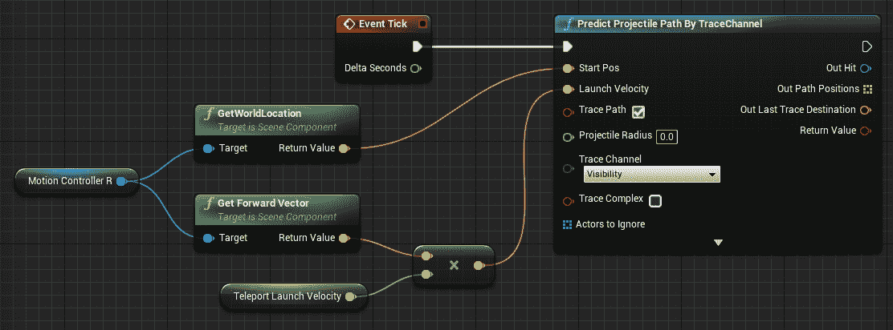

现在，让我们绘制结果路径，以便验证它是否按照我们的预期进行。

# 绘制曲线路径

`Predict Projectile Path By TraceChannel`方法将返回一个描述抛物线路径的点的数组。我们可以使用这些点来绘制我们的目标指示器。让我们开始吧：

1.  就像我们之前做的那样，将一个 Branch 连接到我们的 Return Value。我们只对得到一个好结果时才感兴趣。

现在，为了绘制曲线路径，我们实际上需要绘制一系列的 debug line，而不仅仅是一个。

1.  让我们从 Out Path Positions 拖出一个连接器并创建一个 ForEachLoop 节点：

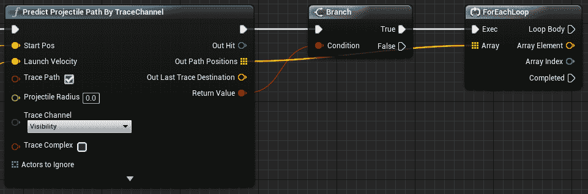

我们应该花点时间来讨论我们在这里做什么，因为这是一个你将经常使用的概念。

到目前为止，在我们的 pawn 蓝图中处理的所有变量都只包含单个值-一个数字，一个 true 或 false 值和一个向量。然而，Out Path Positions 的连接器看起来不同。它不是一个圆圈，而是一个 3 x 3 的网格。这个图标表示这是一个**数组**。数组不同于单个值，它包含一个值列表。在这种情况下，这些值是构成我们要绘制的曲线路径的点的列表。

*For Each Loop*是一种称为**迭代器**的编程结构。迭代器循环遍历值的集合，并允许您对集合中的每个元素执行操作。

让我们快速查看一下 ForEach Loop 的输出：

+   循环体将为数组中的每个项目执行一次。

+   数组元素是它找到的项目。

+   数组索引是它找到的位置。数组总是从零开始编号，所以第一个项目的索引为 0，第二个项目的索引为 1，依此类推。

+   当它到达列表的末尾时，将调用 Completed 执行引脚。

我们将使用这个循环来绘制曲线的线段，但是每个线段需要两个点，这意味着在数组中达到第二个点之前我们不能绘制任何东西：

1.  从数组索引输出拖动连接器，并将其连接到一个整数|整数节点上。将第二个值保留为 0。

1.  将其输出连接到一个分支，并将循环体连接到分支输入。这将允许我们跳过数组中的第一个值。

1.  创建一个 Draw Debug Line 节点，并将数组元素连接到线段结束输入。由于我们从数组的第二个值开始，该位置上的点是我们线段的结束点。我们将通过获取它之前的点来获取线段的起点：

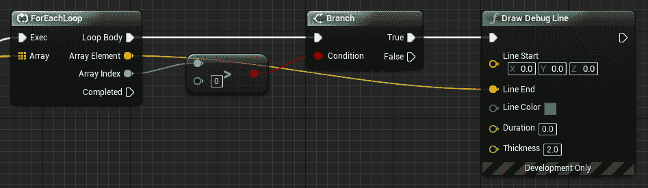

1.  要找到我们的线段起点，从数组索引再拖动一个连接器，并从中减去 1。

1.  现在，从 Out Path Positions 再拖动一个连接器，并在搜索框中输入`Get`。选择 Get（复制）：

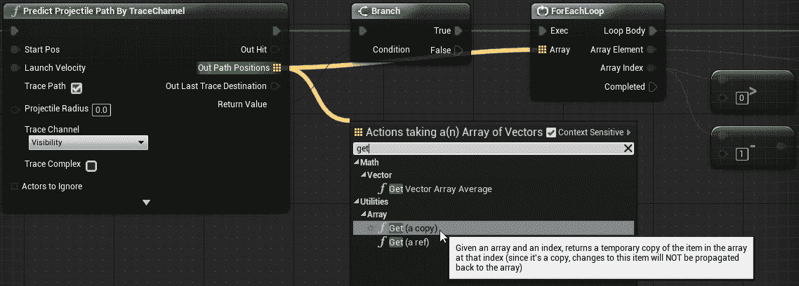

这将获取存储在数组中与给定索引对应位置的元素。

1.  将我们的数组索引减 1 的结果连接到 Get 节点的整数输入上。这将检索当前迭代的前一个值。

1.  将此 Get 节点的输出连接到 Draw Debug Line 的 Line Start：

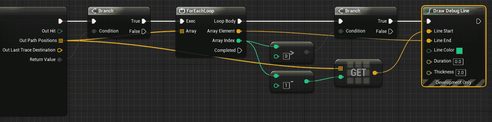

完成后，绘图例程应该看起来像前面截图中显示的样子。

我们刚刚做的是遍历 Out Path Positions 中的每个路径位置向量，并且对于第一个之后的每个位置，我们从其前一个位置绘制一条线到当前位置，直到达到列表的末尾。

# 在绘制完所有线段后绘制终点

最后，让我们在追踪终点处绘制一个调试球体。我们可以重复使用之前用于绘制直线追踪末端的节点：

1.  就像之前一样，从 Out Hit 中**break**出**Hit Result**结构。

1.  将其位置输入到 ProjectPointToNavigation 节点中。

1.  将一个分支连接到其返回值，并将 True 分支的执行连接到一个 Draw Debug Sphere 节点。

1.  将投影位置用作调试球体的中心。

然而，不要在绘制调试线节点之后立即调用它，而是从 ForEachLoop 的 Completed 输出中调用它，因为我们只需要在绘制完所有线段后绘制一次球体。

您的图表现在应该如下所示：

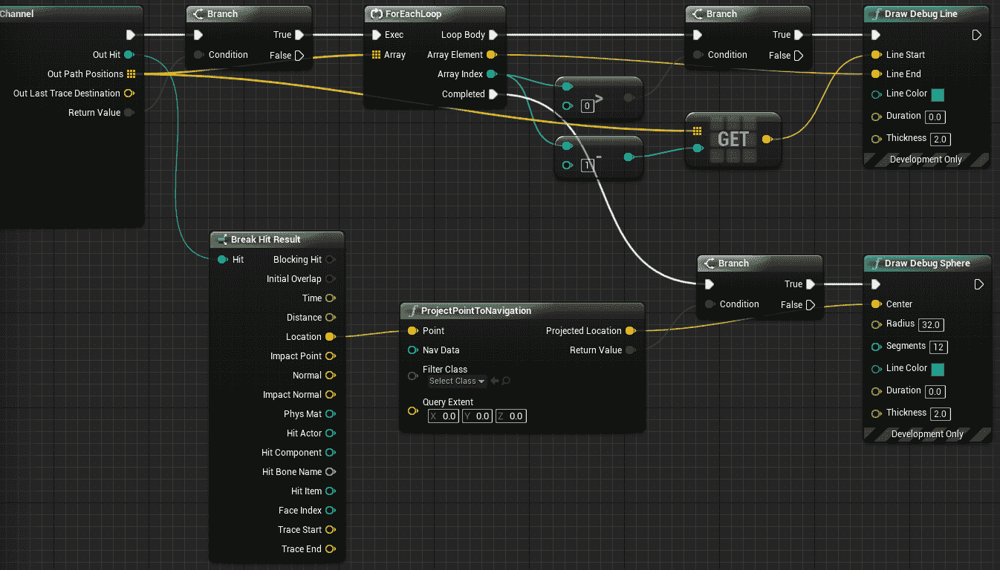

让我们测试一下，看看运行时会发生什么：

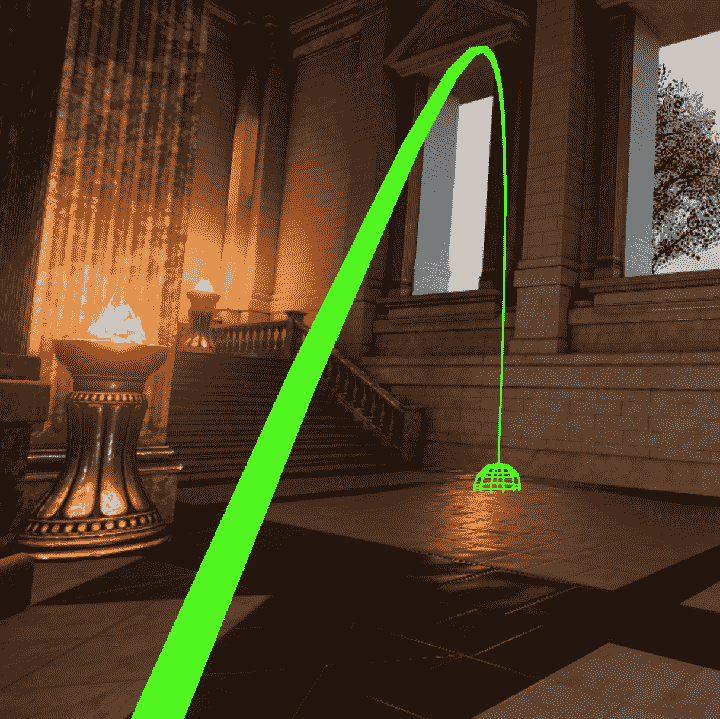

太棒了！我们现在正在投射一条曲线路径，这将使我们更容易在地图上移动，并且我们使用调试绘制来验证它给我们带来了良好的结果。

我们在这里使用的 Draw Debug 方法只适用于调试和开发版本。它们不包含在发布版本中。绘制这条路径的正确方法是使用 Out Path Positions 中的点集合来改变样条网格的形状，但是这超出了本书的范围。然而，在 VR 模板中有一个很好的例子，我们在这里所做的工作是理解他们在该项目的蓝图中所做的工作的良好起点。

接下来，让我们处理下一个任务，允许玩家传送到他们选择的目的地。

# 传送玩家

在这种情况下，我们首先需要做的是给玩家一种告诉系统他们打算传送的方式。

# 创建输入映射

我们将使用引擎输入映射来设置一个新的命名输入。让我们开始吧：

1.  打开项目设置并导航到 Engine | Input。

1.  点击 Bindings | Action Mappings 旁边的+号创建一个新的动作映射：

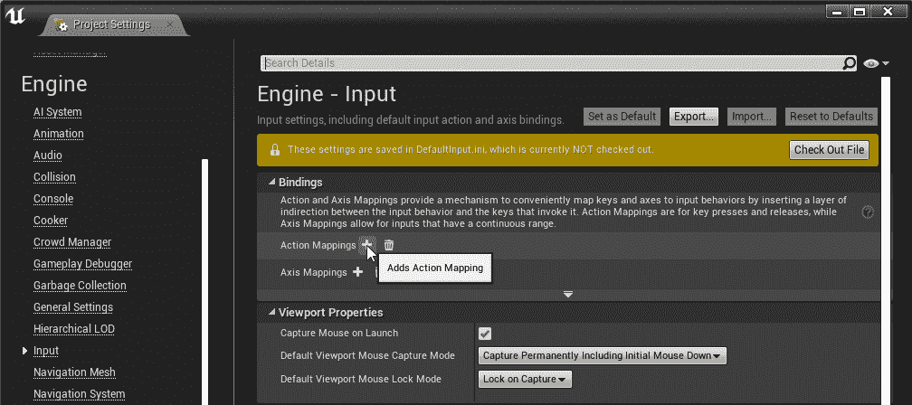

1.  我们将把它命名为`TeleportRight`。

这将创建一个名为 TeleportRight 的输入事件，我们可以在事件图中对其进行响应。

您可能已经发现，您可以直接在事件图中设置事件来监听控制器输入和按键。然而，对于大多数项目来说，将输入映射到这里是一个更好的主意，因为它为您提供了一个集中管理它们的位置。

现在，让我们指示哪些输入应触发此传送动作。在新的动作映射下方出现了一个下拉菜单，显示了 None 指示器。（如果下拉菜单不可见，请点击动作映射旁边的展开箭头。）让我们继续：

1.  在 TeleportRight 下方，使用下拉菜单选择 MotionController (R) Thumbstick。

这将处理我们的 Oculus Touch 控制器映射，但对于不使用拇指杆的 HTC Vive 来说并没有帮助。

1.  点击 TeleportRight 动作旁边的+号，添加另一个映射到该组。

1.  为此选择 MotionController (R) FaceButton1：

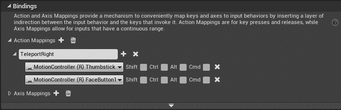

您的绑定现在应该看起来像前面的截图所示。

现在，我们已经告诉输入系统发送一个名为 TeleportRight 的输入事件，无论玩家是否使用带有拇指杆或带有面部按钮的动作控制器。

这些绑定存储在`DefaultInput.ini`中，并可以在那里进行编辑，但通常在项目设置 UI 中设置它们更方便。然而，如果您需要将一堆输入绑定从一个项目复制到另一个项目，将`DefaultInput.ini`的内容从一个项目复制到另一个项目可能更方便。并非每个项目都有`DefaultInput.ini`。如果您的项目没有，您可以简单地添加它，引擎将使用它。

让我们关闭项目设置并返回到我们的 VRPawn 的事件图。您会发现，您现在可以在这里创建一个 TeleportRight 事件，因为我们在输入设置中定义了它。让我们这样做，如下所示：

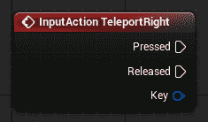

# 缓存我们的传送目的地

现在，在我们处理此事件之前，我们需要存储我们之前在跟踪方法中找到的位置，以便在玩家尝试传送时可以在此处使用它：

1.  在 My Blueprint | Variables 下，点击+号创建一个新变量。

1.  将其类型设置为布尔型，并将其命名为`bHasValidTeleportDest`。

变量名很重要。它们告诉读者（可能是另一个开发人员维护您的代码，也可能是将来的自己）变量代表什么。您的变量名应准确反映它们所包含的内容。对于 True/False 布尔变量，确保您的名称描述了它实际回答的问题。因此，在这种情况下，*Teleport*将是一个不好的选择，因为它并没有说明变量的值是否意味着玩家可以传送，正在传送，最近传送，还是只是喜欢幻想传送。对这些事情要清楚明确。`bHasValidTeleportDest`清楚地指示了它的含义。

在 C++中，将布尔变量的名称前缀为*b*是 Epic 编码风格指南的规定，但在 Blueprint 开发中也是一个好主意。（如果您计划在 C++中进行开发，您应该了解并遵循 Unreal 风格指南，可以在[`docs.unrealengine.com/en-us/Programming/Development/CodingStandard`](https://docs.unrealengine.com/en-us/Programming/Development/CodingStandard)找到。）

1.  创建另一个变量并将其命名为`TeleportDest`。

1.  将其类型设置为矢量。

让我们填充这些变量。我们关心的位置是我们在命中位置调用的 Project Point to Navigation 方法找到的 Projected Location。让我们存储我们是否找到了有效的位置。由于我们即将在调用之前添加一些节点，您可能希望将 Draw Debug Sphere 节点向右移动一点以腾出一些空间：

1.  将您的`bHasValidTeleportDest`变量拖放到事件图上，并在询问时选择设置。

您是否看到 ForEach 循环的 Completed 输出与我们的 Project Point to Navigation 方法输出的 Branch 语句相连？

1.  按下*Ctrl* +拖动执行输入到该 Branch 节点，将其移动到`CanTeleport`设置器上。（注意，当变量在图表中使用时，布尔变量上的*b*前缀会自动隐藏。）

1.  将 Project Point 的返回值馈送到 Navigation 方法中的此变量中。您可以按下*Ctrl* +拖动以将其移动。

1.  从 Set bHasValidTeleportDest 拖动一个执行线到 Branch 输入，并使用设置器的输出来驱动该分支。

如果 Project Point to Navigation 方法返回 true，则将 TeleportDest 设置为其投影位置：

1.  将我们的`TeleportDest`变量拖放到事件图上并选择设置。

1.  将从 Branch 节点到 Draw Debug Sphere 节点的执行线拖动，并按下*Ctrl* +拖动它以将其移动到 Set Teleport Dest 输入中。

1.  将 Projected Location 输出馈送到`TeleportDest`变量中。

1.  现在，只是因为它更干净，让我们将`TeleportDest`设置器的输出馈送到我们的 DrawDebugSphere 节点的 Center 输入上。

值得学习蓝图快捷键。按下*Alt* +点击连接可以断开连接。按下*Ctrl* +拖动连接可以将其移动到其他位置。

1.  从 Branch 的 False 执行引脚中，让我们将 TeleportDest 设置为(`0.0, 0.0, 0.0`)。

您的图现在应该是这样的：

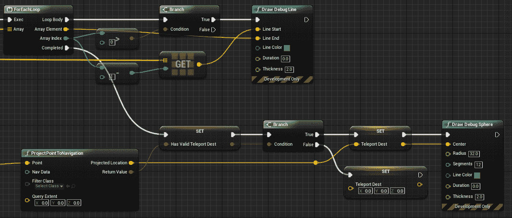

您是否看到 Projected Location 和 Set Teleport Dest 之间连接上的额外引脚？那是一个**Reroute Node**。您可以通过拖动连接并选择从创建对话框中添加 Reroute Node 来创建一个，或者通过*双击*现有连接器来创建一个。这些对于组织连接非常有用，以便您可以轻松地看到图表中发生的情况。一般来说，尽量避免允许连接器在未连接到的节点下交叉，因为这可能会误导阅读您的蓝图的人。您还可以将多个输入馈送到 reroute 节点，或从 reroute 节点分支多个输出。

现在，每次 tick，我们在`bHasValidTeleportDest`中都有一个 true 或 false 的值，如果为 true，则有一个我们可以传送到的位置。

# 执行传送

让我们使用刚刚存储在`bHasValidTeleportDest`标志中的值来查看我们是否有有效的目标，并在有时将玩家角色传送到`TeleportDest`：

1.  从我们刚刚创建的`TeleportRight`输入操作中，我们将从其 Pressed 输出连接一个执行线到一个 Branch 节点。

请记住，您可以按住*B*并单击以创建一个 Branch 节点。在这里查看 Epic 的蓝图编辑器 Cheat Sheet 中找到的其他快捷键：[`docs.unrealengine.com/en-us/Engine/Blueprints/UserGuide/CheatSheet`](https://docs.unrealengine.com/en-us/Engine/Blueprints/UserGuide/CheatSheet)。它们将为您节省很多时间。

1.  拖动您的`bHasValidTeleportDest`变量并将其拖放到 Branch 节点的 Condition 输入上。

1.  从 True 执行输出中创建一个 SetActorLocation 动作，并将您的`TeleportDest`变量拖放到其 New Location 输入上：

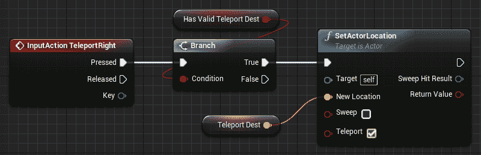

将其启动到 VR 预览中并试一试。现在您应该能够在地图上进行传送。能够探索是很好的，对吧？

现在我们已经让一切正常工作，让我们做一些工作来改进事情。

当我们开始在地图上跳来跳去时，我们会注意到一个问题，那就是我们没有任何方法来改变玩家在着陆位置的朝向。我们肯定可以改进这一点。

# 允许玩家选择着陆方向

如果我们希望玩家能够在着陆时指定他们的面朝方向，我们首先需要做的是给他们一种告诉系统他们想要朝向何处的方法。

# 映射轴输入

让我们添加一个输入，为玩家提供一种改变朝向的方式：

1.  打开“项目设置”|“引擎”|“输入”。

在“绑定”|“动作映射”中的部分中，您是否看到我们设置 TeleportRight 输入的部分？它的下方是一个**轴映射**列表。

1.  点击轴映射旁边的+按钮添加一个新映射。

1.  使用展开箭头打开它，并将其命名为`MotionControllerThumbRight_Y`。

1.  将其映射到 MotionController（R）的拇指杆 Y。

1.  将其比例设置为-1.0。

1.  创建第二个映射，命名为`MotionControllerThumbRight_X`。

1.  将其映射到`MotionController (R) Thumbstick X`，并将其比例保留为 1.0。

Unreal 的输入系统处理两种映射：**动作映射**和**轴映射**。动作映射是离散事件，例如按钮或键的按下和释放。轴映射为您提供有关模拟输入（例如操纵杆或触控板）的连续信息。

您可能已经注意到，我们通过-1.0 缩放了来自运动控制器拇指杆的 Y 输入。这是因为该设备的 Y 输入是反向的，所以我们需要翻转它。将其乘以-1 只是反转输入：

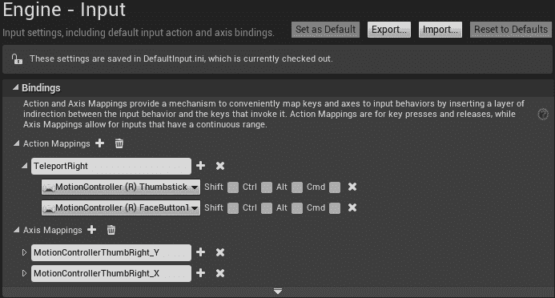

您的输入映射现在应该看起来像前面的截图所示。

现在我们已经添加了新的输入映射，我们可以关闭项目设置。

# 清理我们的 Tick 事件

让我们回到角色的事件图。

由于我们希望在设置传送时持续检查玩家的拇指杆位置，因此我们需要将其放在事件 Tick 上。不过，我们的 Tick 事件有点拥挤。在开始添加更多内容之前，让我们先整理一下：

1.  在当前 Tick 事件的内容上拖动一个选框：

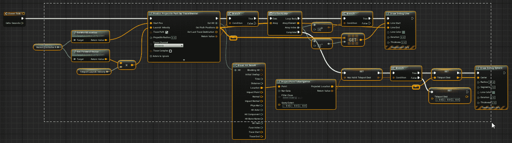

选择与事件 Tick 连接的所有节点。

1.  右键单击所选节点上的任意位置，并从上下文菜单中选择“折叠到函数”：

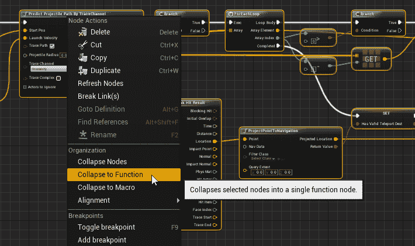

右键单击所选节点中的任意一个，并选择“折叠到函数”。

1.  将新函数命名为`SetTeleportDestination`。

这样干净多了，不是吗？看一下下面的截图：

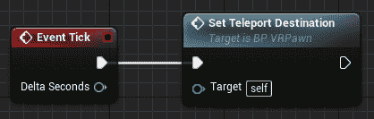

一般来说，使用函数作为组织和重用代码的一种方式是一个好主意，而不是将代码散布在整个事件图中。记住，任何代码的 80%生命周期都将花在调试和维护上，因此早期组织代码可以节省很多工作量。

您给函数起的名称应该是描述性的，准确的。将它们视为对读者的承诺，函数的内容确实做了名称所暗示的事情。这个读者可能是您将来调试或更新代码的人，也可能是完全不同的另一个开发人员。如果您清晰地命名了函数，每个人都将更容易理解您的代码在做什么。如果您以改变函数的方式修改函数，也要更改其名称。不要让传统名称误导读者。

# 使用拇指杆输入来定位玩家

让我们创建一个新函数来处理我们的传送定位：

1.  点击“我的蓝图”|“函数”中的+按钮创建一个新函数。

1.  将其命名为`SetTeleportOrientation`。

一个新的选项卡将自动打开，显示函数的内容。现在，它只包含一个带有执行引脚的入口点。

1.  在函数的图表中的任何位置右键单击，然后在上下文菜单的搜索框中键入`thumbright`。您将看到您在输入设置中创建的两个轴映射现在在这里显示为函数。

1.  在这里添加 Get MotionControllerThumbRight_Y 和 Get MotionControllerthumbRight_X 节点：

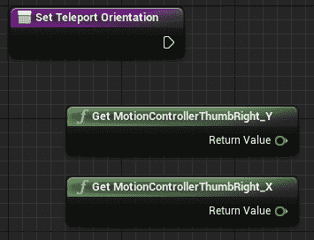

1.  创建一个 Make Vector 节点。

1.  将 Get MotionControllerThumbRight_Y 的返回值输入到 Make Vector 节点的 X 输入中。（这可能看起来有些奇怪，但是是正确的——我们需要转换这个输入以用于驱动我们的旋转。）

1.  将 Get MotionControllerThumbRight_X 输入到新向量的 Y 输入中。

1.  通过在 Make Vector 的返回值上添加一个 Normalize 节点来归一化新向量：

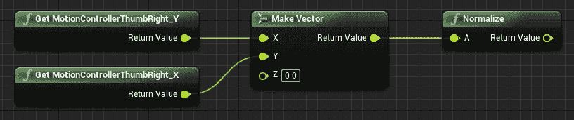

**归一化**一个向量将其缩放为长度为 1。长度为 1 的向量称为**单位向量**。如果对任意长度的向量进行数学运算，很多情况下会得到错误的结果。一个经验法则是，如果你正在进行向量运算以确定旋转或角度，请确保使用单位向量。

现在我们已经将输入向量归一化，我们需要将其旋转，使其指向玩家的意图方向。

关于为 VR 设计运动系统的问题是：当你向玩家展示一个旋转时，你必须决定它的基础是什么。当玩家向前推杆或触摸触控板向前时，我们如何将其转化为真实世界的旋转？如果你操作过遥控车或者玩游戏的时间足够长以记得*Resident Evil*和*Fear Effect*中的旧式*坦克式*控制，你对我们在这里描述的有一些概念。在这些系统中，“前进”意味着汽车或角色所面对的方向，如果角色此时面对摄像机，那么这些控制将会感觉反向。

在过去的二十年里，传统的第一人称设计中，我们没有必须解决这个问题。角色面对的方向和玩家所看的方向没有区别，所以使用摄像机的观察方向作为前进方向是一个明显的选择。

在 VR 中，另一方面，我们有几个选择：

+   我们可以基于*角色的旋转*进行旋转，但在房间尺度的 VR 中，这不是一个好主意，因为玩家可以在跟踪范围内转身而不一定旋转角色。你不希望基于玩家可能看不到的东西来定位控制。

+   我们可以基于玩家的*观察方向*进行旋转，这是一个更好的选择，因为从玩家的角度来看，它是一致的，但在玩家四处观察时会产生奇怪的行为：

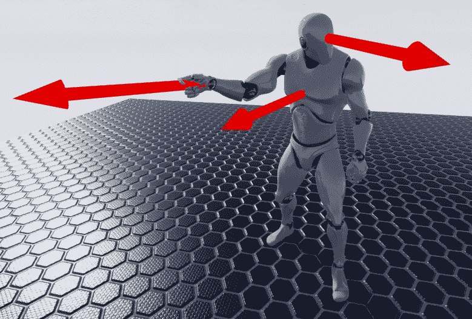

在 VR 中，一个角色可以同时具有多个变换——头部、身体和手部。

在 VR 中，玩家的头部、手部和身体可以独立于彼此旋转，所以前进方向不再总是明显的。

然而，最好的选择（并且当我们处理无缝运动时，我们将在后面发现）是基于*运动控制器的方向*，因为玩家已经在使用它提供输入，意识到它的方向，并且可以轻松改变它的方向。

让我们按照以下方式设置我们的系统：

1.  在我们的 Normalize 节点的返回值中添加一个 RotateVector 节点。

1.  在图表中拖动对 MotionController_R 的引用。

1.  从 MotionController_R 中拖动一个 GetWorldRotation 节点：

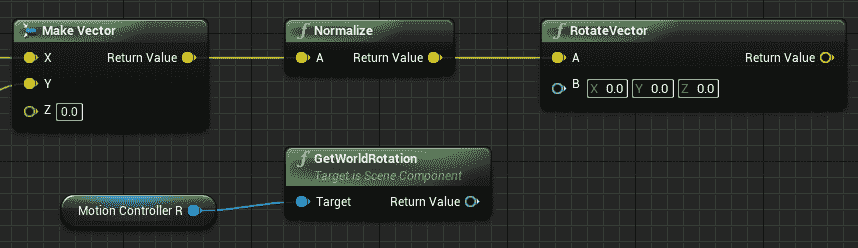

这将得到我们在世界中正确的控制器方向，但我们只对左右旋转（偏航）感兴趣。我们不需要任何俯仰或滚转信息。

1.  右键单击 GetWorldRotation 的返回值，并选择 Split Struct Pin：

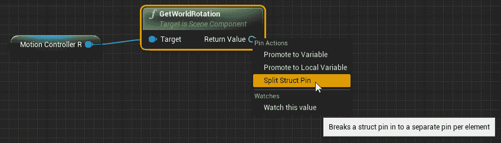

1.  对于 RotateVector 节点的 B 输入也做同样的操作。

1.  将 GetWorldRotation 的 Yaw 输出连接到 RotateVector 的 Yaw 输入上。将 Roll 和 Pitch 保持未连接状态：

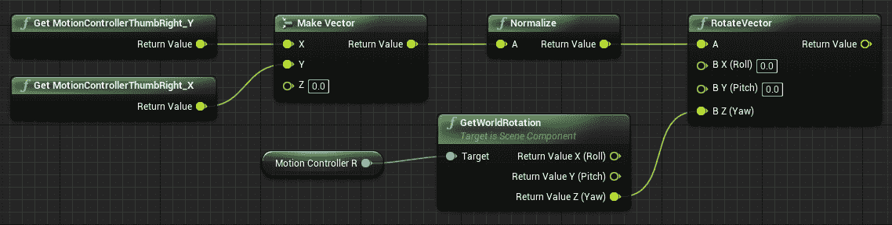

在蓝图中，拆分结构引脚通常比使用 Break 和 Make 节点来拆分和重构它们更清晰。它们做的是同样的事情。这只是一个关于如何使你的蓝图更易读的问题。

现在，我们需要将旋转后的向量转换为可用的旋转器。

1.  将一个 RotationFromXVector 节点添加到 RotateVector 的返回值中。

最后，我们需要存储这个向量，以便以后使用。

1.  将 RotationFromXVector 节点的返回值拖出来，并选择 Promote to variable。

1.  将新变量命名为`TeleportOrientation`。

1.  这将自动为新变量创建一个 Set 节点。从函数的入口点拖动一个执行线到这个 setter 上。

1.  从你的 setter 拖动一个执行线，并选择添加 Return Node 来添加一个函数的退出点。

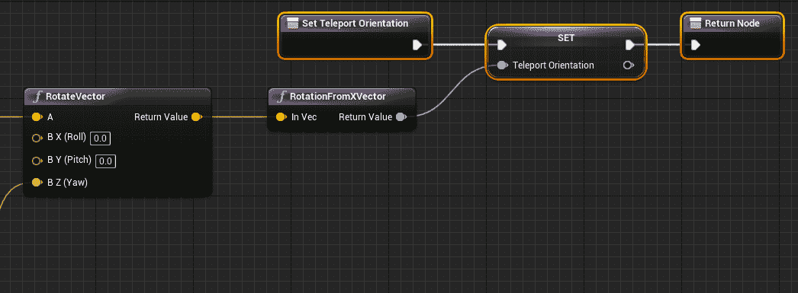

现在，我们将 RotateVector 节点的返回值转换为一个旋转器，并用它来填充 TeleportOrientation。

对于不返回值的函数添加返回节点并不是必需的，但这是一个好的实践，因为它清楚地告诉维护或调试代码的人代码的退出点在哪里。如果不这样做，不会出现任何问题，但如果这样做，你的代码将更容易阅读。我们不会在本书中的每个方法中都这样做，只是为了避免添加额外的步骤，但这是一个好习惯。

1.  返回到事件图的 Event Tick，将 SetTeleportOrientation 函数拖动到 SetTeleportDestination 的执行输出引脚上：

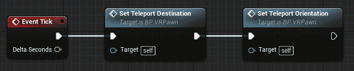

在 SetTeleportDestination 完成后，SetTeleportOrientation 现在将在每一帧上被调用。

让我们使用这个新信息：

1.  在事件图中，找到我们设置角色位置的 InputAction TeleportRight 事件。

1.  首先，我们也将把它折叠成一个函数。在事件图中留下它是不规范的。选择输入动作右侧的节点，右键单击，将它们*折叠*成一个新函数。

1.  将新函数命名为`ExecuteTeleport`：

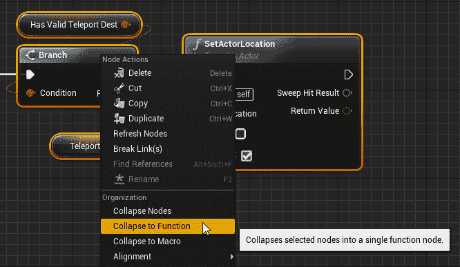

由于我们现在有了一个传送朝向值需要适应，SetActorLocation 对我们来说已经不够了，因为它只设置位置而不设置旋转。我们可以在它之后立即调用一个`Set Actor Rotation`方法，使用存储在 TeleportOrientation 变量中的值，但我们有一个更简洁的方法可用。

1.  选择这里的 Set Actor Location 节点并**删除**它。

1.  在图表中右键单击，创建一个 Teleport 节点。

1.  将分支语句的 True 分支连接到其执行输入上。

1.  将 TeleportDest 变量连接到其 Dest Location 输入。

1.  从变量列表中获取 TeleportOrientation 变量，并将其拖动到 Dest Rotation 输入引脚上：

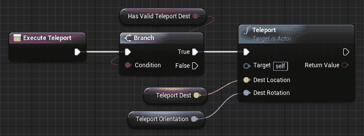

让我们试试看。好多了。现在，我们在轨迹板上的拇指位置或拇指杆的方向都会影响我们的传送方向。我们可以更容易地四处看看。

但还有一件事情我们需要修复。如果玩家的朝向与角色的旋转相同，我们的传送朝向就可以正常工作，但如果不同，它就会变得令人困惑和不准确。让我们适应一下。

我们要做的是找出玩家相对于角色朝向的朝向，然后将这个旋转差与我们选择的传送朝向结合起来，这样当玩家降落时，他们会朝向他们选择的方向。

1.  右键单击并创建一个 GetActorRotation 节点。

1.  我们只需要从这个旋转中获取 Yaw 值，所以右键单击节点的返回值，选择 Split Struct Pin 来分解旋转器的组件。

1.  从组件列表中，将对相机组件的引用拖动到图表中。

1.  拖动其输出并对其调用 GetWorldRotation。

1.  右键单击其返回值并选择拆分结构引脚。

1.  右键单击图表中并创建一个 Delta（Rotator）节点。拆分其 A 和 B 输入结构引脚。

1.  将 GetActorRotation 节点的返回值 Z（偏航）输出连接到 Delta（Rotator）节点的 A Z（偏航）输入。

1.  将相机的 GetWorldRotation 节点的返回值 Z（偏航）输出连接到 Delta（Rotator）节点的 B Z（偏航）输入。

1.  在图表中右键单击并创建一个 CombineRotators 节点。

1.  将传送方向变量的值输入到 CombineRotators 节点的 A 输入中。

1.  将 Delta（Rotator）节点的返回值输入到 CombineRotator 节点的 B 输入中。

1.  将 CombineRotators 节点的返回值输入到 Teleport 节点的 Dest Rotation 输入中。

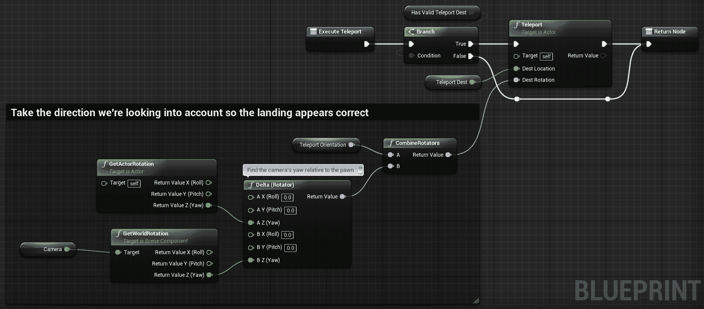

现在，当玩家降落在选定的传送点时，他们将朝着他们期望的方向看。如果您来自传统的平面游戏开发，这是您作为 VR 开发人员需要适应的一件事情：角色的旋转与视线方向不同。在 VR 中，玩家可以四处看，而不会影响角色的方向，因此在处理 VR 中的旋转时，您始终需要记住这两个方向。

问题是我们无法看到它将指向我们降落的位置。让我们改进一下目标指示。

# 创建一个传送目标指示器

我们将创建一个简单的蓝图角色作为我们的传送目标指示器：

1.  在项目的蓝图目录中，右键单击并创建一个以`Actor`为父类的新蓝图类。

1.  将其命名为`BP_TeleportDestIndicator`。

1.  打开它。

1.  在其组件选项卡中，点击添加组件，并添加一个圆柱体组件。

1.  将圆柱体的比例设置为（`0.9, 0.9, 0.1`）。 （记得解锁比例输入右侧的统一比例锁定。）

1.  在圆柱体的碰撞属性下，将 Can Character Step Up On 设置为 No，并将其碰撞预设设置为 NoCollision。（这很重要-如果有碰撞，此指示器将干扰角色。）

1.  添加一个立方体组件。

1.  将其位置设置为（`60.0, 0.0, 0.0`）。

1.  将其比例设置为（0.3, 0.1, 0.1）：

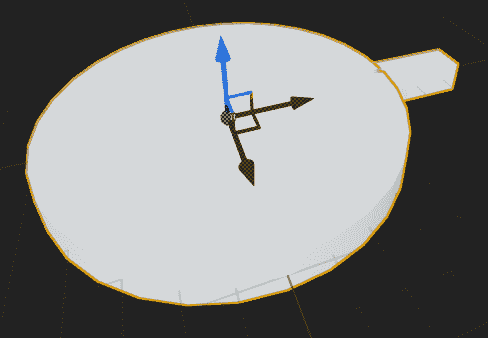

我们的指示器应该看起来像这样。

1.  编译它，保存它，然后关闭它。

# 给它一个材质

如果白色材质对您来说不够好，我们可以创建一些更好看的东西。我们不会在这个上面花太多时间，但是我们可以通过一些快速的工作来改善它的外观：

1.  从内容浏览器中的项目目录中，创建一个名为`MaterialLibrary`的新目录。

1.  在其中右键单击并选择创建基本资产|材质。

1.  将新材质命名为**M_TeleportIndicator**。

1.  打开它。

1.  在详细信息|材质部分，将其混合模式设置为 Additive。

1.  将其着色模型设置为未照明。

1.  按住*3*键，然后在图表中的任意位置单击以创建一个 Constant 3 Vector 节点。这是材质中颜色的表示方式。

1.  双击节点，选择主要的绿色：R=0.0，G=1.0，B=0.0。

1.  将颜色节点的输出拖动到发射颜色输入中。

1.  在图表中的任意位置右键单击并创建一个线性渐变节点。

1.  将 VGradient 输出拖动到材质的不透明度输入中：

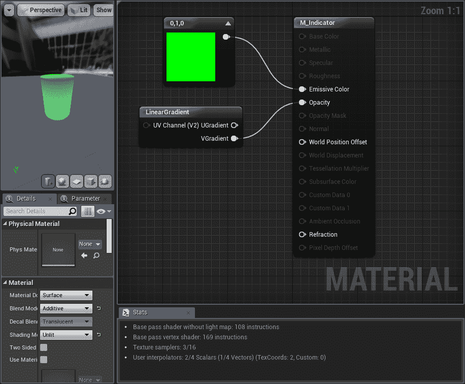

1.  保存并关闭材质。

1.  打开 BP_TeleportDestIndicator 蓝图并选择 Cylider 组件。在其详细信息|材料中，将其元素 0 材料设置为刚刚创建的材料。

1.  对于立方体组件也是一样：

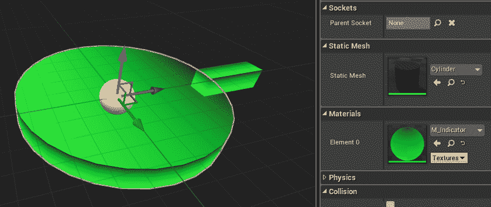

很好！这是一个非常简单的材质，如果我们真的想要的话，我们可以花很多时间设计出一些精彩的东西，但是对于我们现在要做的事情来说，这完全可以。

# 将传送指示器添加到角色

现在，让我们将这个新的指示器添加到我们的角色中：

1.  在我们的 VRPawn 的 Components 选项卡中，添加一个 Child Actor 组件。

1.  在其详细信息| Child Actor Component | Child Actor Class 中，选择我们刚刚创建的新 BP_TeleportDestIndicator actor。

1.  将 ChildActor 重命名为`TeleportDestIndicator`。（您可以使用*F2*键重命名对象。）

让我们创建一个新的函数来设置其位置和方向：

1.  在 pawn 的函数集合中创建一个新的函数，并将其命名为`UpdateTeleportIndicator`。

1.  将 TeleportDestIndicator 拖入函数的图表中。

1.  从 TeleportDestIndicator 拖动输出并创建一个 SetWorldLocationAndRotation 节点，将其用作目标。

1.  将 TeleportDest 变量拖到 New Location 输入上。

1.  将 TeleportOrientation 变量拖到 New Rotation 输入上。

1.  给它一个返回节点：

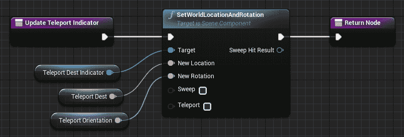

1.  返回事件图表，然后在 Set Teleport Orientation 之后，将 UpdateTeleportIndicator 函数的一个实例拖到 Event Tick 上：

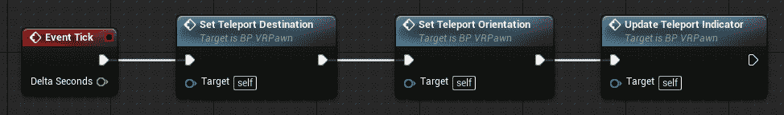

让我们试试看。好多了！现在，我们可以看到我们降落时将面对的方向。顺便说一句，让我们摆脱之前作为临时解决方案使用的 Debug Sphere。

1.  在 Set Teleport Destination 函数中，找到 Draw Debug Sphere 调用并**删除**它。

# 优化和完善我们的传送

让我们用一些细化来完成这些事情，因为我们仍然看到一些粗糙的边缘。

# 只有在按下传送输入时显示 UI

首先，我们一直在运行传送指示器，无论用户是否真正尝试传送。让我们只在用户按下传送输入时激活这些接口：

1.  向我们的玩家 pawn 添加一个新变量。将其类型设置为布尔型，并将其命名为`bTeleportPressed`。

1.  按下*Alt* +单击从 InputAction TeleportRight 到 ExecuteTeleport 函数调用的执行线以断开连接。

1.  将`bTeleportPressed`变量拖到 InputAction TeleportRight 的 Pressed 执行引脚上以创建一个 setter。在这里将其设置为 True。

1.  将另一个`bTeleportPressed`的实例拖到 Released 执行引脚上。将其设置为 False。

1.  将 ExecuteTeleport 连接到清除 TeleportPressed 的 setter，以便在用户释放输入时进行传送：

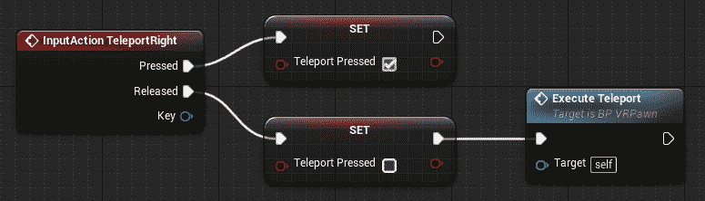

现在我们有一个变量，当传送输入被按住时为 true，当没有按住时为 false，我们可以使用它来管理 Tick 事件上发生的事情。

1.  断开 Event Tick 与 SetTeleportDestination 的连接。

1.  在这里添加一个 Branch 节点，并使用`bTeleportPressed`作为其条件。

1.  将 Event Tick 的执行线连接到 Branch 输入，并将其 True 分支连接到 SetTeleportDestination。这样，只有在用户按下传送输入时，传送 UI 才会更新或显示：

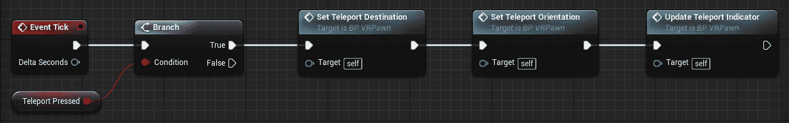

让我们试试看。这样更好，但是我们的目标指示器在输入未按下时仍然可见，并且它没有更新。我们需要在不使用它时隐藏它：

1.  从 pawn 的 Components 选项卡中选择 TeleportDestIndicator 组件。

1.  在其详细信息中，将 Rendering | Hidden in Game 设置为 True。

1.  将 TeleportDestIndicator 组件拖到图表中。

1.  从中拖出一个连接器，并在其上调用 Set Hidden in Game。

1.  将**bTeleportPressed**的一个实例拖到图表上并**获取**其值。

1.  从中拖出一个连接器，并在搜索栏中键入`not`。选择 NOT Boolean。

1.  将这个值插入到“Set Hidden in Game”动作中的新隐藏输入中。

这将导致指示器在未按下传送时隐藏，在按下传送时不隐藏：

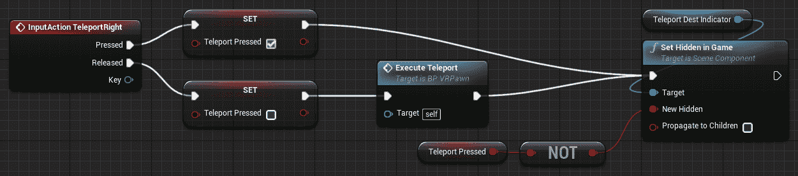

让我们再试一次。好多了。只有在需要时才显示 UI。

在我们可以发布之前，我们仍然需要用调试方法替换当前绘制的传送弧线。然而，我们不会在这里详细介绍这个过程，因为它对本章的范围来说有点太复杂了。基本上，你在这里要做的是在角色上创建一个样条线组件，并将一个网格附加到它上面。我们不再使用`SetTeleportDestination`中的 ForEach 循环来绘制一系列的调试线，而是将路径位置保存到一个变量中。在`UpdateTeleportIndicator`中，我们将使用这些位置来设置样条线上的点。如果你想尝试一下，VR 模板中有一个很好的例子。

# 为我们的输入创建一个死区

当我们在地图上跳跃时，也变得清楚，我们没有给玩家一个简单的方法来在不改变方向的情况下传送。当他们想要四处看看时，我们的系统运作良好，但是没有给他们一个选择退出的方式。

让我们打开`SetTeleportOrientation`并修复这个问题：

1.  在 BP_VRPawn 中创建一个新的变量。将其类型设置为 Float，并将其命名为`TeleportDeadzone`。

1.  编译蓝图并将其值设置为 0.7。这将接受 70%的触摸板或拇指杆半径的输入。

1.  从将两个 Get MotionControllerThumbRight 输入值组合的 Make Vector 节点中拖动第二个输出，并从中创建一个 VectorLengthSquared 节点。

1.  将`TeleportDeadzone`变量拖动到图表上并获取其值。

1.  对 Teleport Deadzone 的值进行平方。

1.  拖动 VectorLengthSquared 的输出并创建一个>=节点。

1.  将平方的 Teleport Deadzone 值拖动到其另一个输入中：

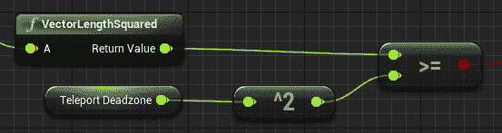

这里发生了什么？我们想知道用户的输入是否超过了其范围的 70%。我们可以通过获取向量长度并将其与 Teleport Deadzone 进行比较来找到这个答案，这将给我们一个正确的答案，但是找到向量的实际长度涉及到一个平方根，这是昂贵的。另一方面，平方一个值只涉及将其乘以自身，这是廉价的。在我们的情况下，由于我们不关心实际的向量长度，只关心它与死区的比较。我们可以跳过向量长度的平方根，只将其与平方的目标长度进行比较。这是一种常见的优化向量长度比较的方法。你会经常看到它。

使用平方向量长度来测试输入死区将为您提供一个正确的圆形测试区域，因此您将在任何输入角度下获得一致的结果。

现在，让我们使用这个比较的结果来选择我们将使用哪个旋转值：

1.  在图表中放置一个选择节点，并将>=测试的输出连接到其 Index 输入。

1.  将 RotationFromXVector 节点的输出从设置传送定向节点中断连接。

1.  将 RotationFromXVector 节点的输出连接到选择节点的 True 输入。

1.  创建一个 GetActorRotation 节点，并将其输出连接到选择节点的 False 输入。

1.  将选择节点的返回值连接到设置传送定向节点的输入：

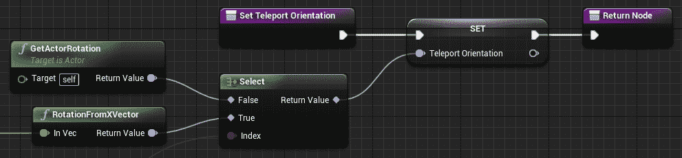

我们在这里做的是使用死区检查的结果来决定我们是否应该使用拇指杆输入的旋转值，还是保持角色的现有旋转。如果输入在 70%的范围或更大，我们将使用输入。如果不是，我们就使用角色的旋转。

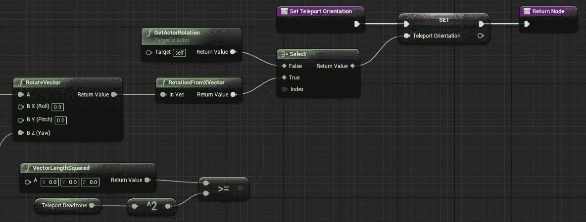

让我们运行一下。现在，如果你触碰到触摸板的边缘或者推动拇指杆到相当远的距离，你的方向会改变，但如果它们离中心更近，你传送时将保持当前的方向。

# 在传送时淡出和淡入

我们的系统开始运作得相当好了，但是传送可能会感觉有点突兀。让我们淡出并重新淡入，以实现更愉快的过渡：

1.  打开我们角色的事件图。

1.  在 InputAction Teleport Right 事件附近，创建一个`Get Player Camera Manager`节点。

1.  从该节点的返回值创建一个`Start Camera Fade`动作。

1.  将其 To Alpha 值设置为 1.0。

1.  拖动其持续时间输入并提升为变量。编译并将其值设置为**0.1**。

这将使场景相机在十分之一秒的时间内变黑。

1.  断开与`Execute Teleport`函数调用的输入的连接。

1.  将 Teleport Pressed = False 节点的执行输出连接到新的 Start Camera Fade 动作。

1.  您可能需要将一些节点拖到右侧以腾出空间。

现在，当用户释放传送输入时，我们将调用 Start Camera Fade，因为我们已经清除了`bTeleportPressed`标志：

1.  从 Start Camera Fade 节点的执行输出拖出一个执行线，并放置一个延迟。

1.  将延迟持续时间设置为您的 Fade Duration 变量。

1.  从延迟的**完成**输出中拖出并放入您的`Execute Teleport`函数调用，以便在淡出和延迟发生后调用该函数。

当用户释放传送输入时，我们会在十分之一秒内淡出，等待另外十分之一秒，然后执行传送。现在，传送完成后我们需要淡入。

1.  创建另一个 Start Camera Fade 节点，并将 Execute Teleport 的输出连接到其执行输入。

1.  将 Get Player Camera Manager 的输出连接到该节点的目标输入。

1.  将其持续时间设置为您的`Fade Duration`变量。

1.  将其 From Alpha 值设置为 1.0，将其 To Alpha 值设置为 0.0。

1.  将此节点的输出连接到 Teleport Dest Indicator 的 Set Hidden in Game 节点的输入：

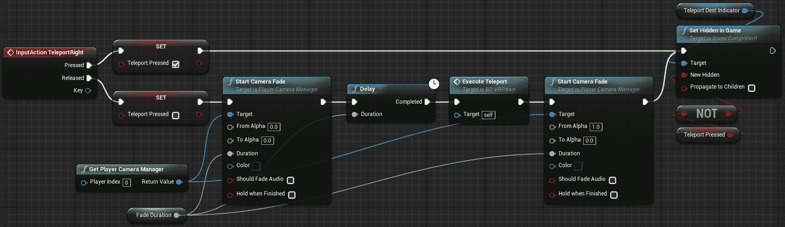

您的图表现在应该是这样的。

让我们在游戏中进行测试。这样做更好。当传送动作发生时，我们现在有一个快速的淡出和淡入。这虽然微妙，但为应用程序增添了一些亮点，使传送不那么令人震惊。

然而，由于这个动作需要时间，我们应该确保玩家在一个传送正在进行时不能触发第二个传送：

1.  创建一个新的布尔变量，并将其命名为`bIsTeleporting`。

1.  将其拖到图表上并获取其值。

1.  在 InputAction TeleportRight 和 set Teleport Pressed to True 之间插入一个新的 Branch 节点。

1.  使用`bIsTeleporting`作为分支节点的条件。

1.  将其 False 输出连接到设置 Teleport Pressed 为 True 节点，并将其 True 输出保持未连接。

1.  对于输入动作的 Released 执行，也做同样的操作：

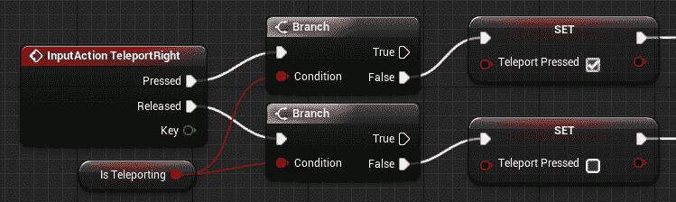

这样，只有在`bIsTeleporting`为 False 时，才会处理传送按下或释放事件。

现在，当我们开始传送动作时，我们需要将`bIsTeleporting`设置为 True，然后在动作完成时再次将其设置为 False：

1.  在从输入动作的 Released 输出出来的 Set Teleport Pressed = False 节点之后，插入一个 setter 将`bIsTeleporting`设置为 True。

1.  将其输出连接到 Start Camera Fade 节点。

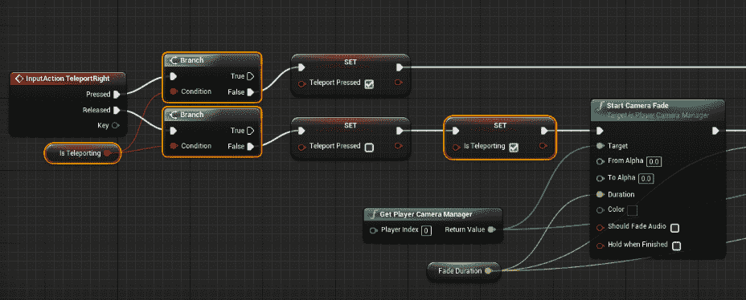

1.  在第二个 Start Camera Fade 节点之后，添加另一个 setter 将`bIsTeleporting`设置为 False。

1.  将该节点的输出连接到 Teleport Dest Indicator 的 Set Hidden in Game 输入。

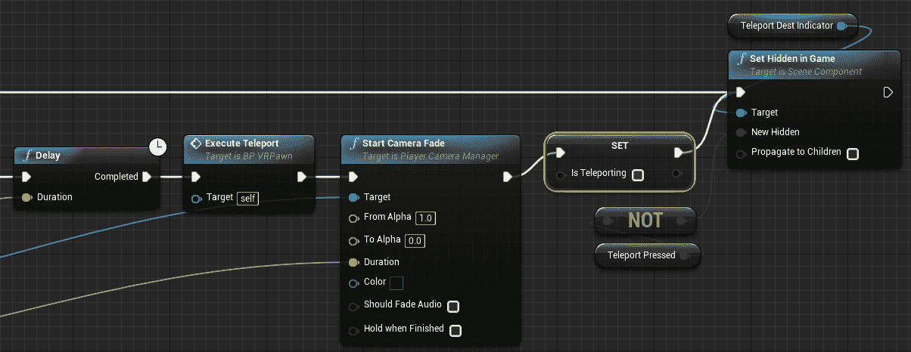

现在，当我们释放输入执行传送时，`bIsTeleporting`将被设置为 true，直到传送动作完成，新的传送动作将不会被接受。

# 传送运动总结

我们在这里涵盖了很多内容，并创建了一个相当全面的传送运动方案。让我们回顾一下这个方案：

+   它绑定到导航网格，因此不允许玩家传送到非法位置

+   它使用抛物线追踪，以便玩家可以传送到比当前位置更高的目的地

+   它允许玩家在传送时选择目标方向

+   它在指示玩家将要去的地方和他们将面对的地方方面做得相当好

+   它包括一些细节处理，如输入死区和相机淡入淡出

我们还可以做更多的事情，但这已经是一个相当完整的解决方案了。如果我们进一步改进它，可能希望允许它与任何一只手一起使用，并且肯定需要用适用于发布版本的其他内容替换我们绘制的调试传送路径。如果您选择从这里进一步探索，引擎附带的 VR 模板是一个很好的下一步。我们刚刚在这里编写的许多方法与该模板中使用的方法类似，因此您应该会发现，当您开始深入研究时，您站在了一个很好的基础上，可以理解您看到的内容。

传送是在虚拟现实中四处移动的有效解决方案，因为正如我们之前提到的，它不会尝试表示移动，所以通常不会引发用户晕动病。对于那些不依赖于玩家在世界中移动的高度沉浸式的应用程序来说，它效果非常好。

对于希望保持更高程度沉浸感的游戏和应用程序来说，传送可能不是您想要的，因为它的行为方式与现实世界中的移动不同：它会创建一种不连续的空间感，并引入明显不存在于世界中的界面元素。无论如何，它都会破坏沉浸感。

接下来，我们将介绍一种沉浸式移动方案，允许玩家在世界中平稳移动。非常敏感的玩家或者对虚拟现实不熟悉的玩家可能不会觉得沉浸式移动舒适，因此在某些情况下，可以在应用程序中提供传送移动作为可选项。

让我们看看它是如何工作的。

# 无缝移动

如果您正在制作一款沉浸式游戏或体验，那么如果玩家周围的空间感不断被传送动作打断，那么这种体验对玩家来说会更加令人信服。让我们来看一下如何处理空间中的无缝移动。

# 设置无缝移动的输入

通常情况下，我们可能会允许用户在选项菜单中选择他们熟悉的移动方案，但由于我们当前的角色除了移动以外什么都不做，而且我们还没有对左手控制器做任何处理，所以我们可以使用它来驱动我们的无缝移动方案。

让我们为左手控制器的拇指杆添加一对输入轴映射：

1.  打开项目设置 | 引擎 | 输入。

1.  点击 Bindings | Axis Mappings 旁边的+按钮两次，添加两个新的轴映射。

1.  将它们命名为`MoveForward`和`MoveRight`。

1.  将 MoveForward 绑定到 MotionController (L) Thumbstick Y。

1.  将其缩放设置为-1.0。

1.  将 MoveRight 绑定到 MotionController (L) Thumbstick X，并将其缩放设置为 1.0：

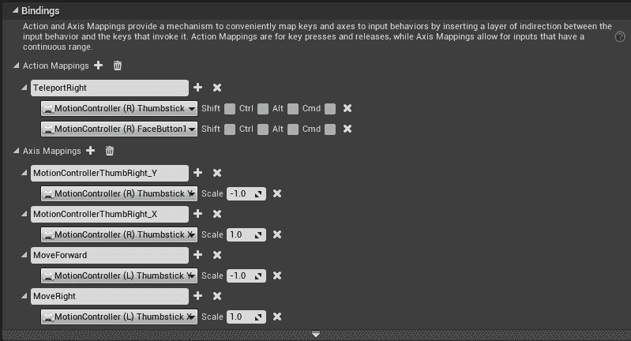

我们暂时完成了输入绑定，所以可以关闭项目设置。

# 更改角色的父类

为了使我们的角色平稳移动，我们需要为其提供处理移动输入的方法。我们有两种方法可以做到这一点。我们可以在 Tick 事件上编写自己的输入处理程序，但这是一个相当复杂的过程，如果我们只是想实现一个简单的移动方案，这是不必要的。

更简单的方法是为我们的角色添加一个 Movement Component。然而，在蓝图中，没有办法添加一个移动组件（在 C++中是可以的），所以我们需要将我们的角色的父类更改为一个包含我们需要的组件以及其他几个我们也想要的组件的类。让我们开始吧：

1.  打开 BP_VRPawn 的蓝图，并在工具栏上点击 Class Settings：

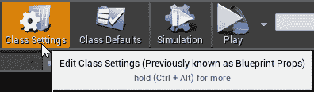

我们之前提到过虚幻引擎是一个面向对象的系统。一个对象是一个类的实例，类从其他类继承，继承了它们的能力和特征。这就是为什么这一点很重要。我们将通过将 BP_VRPawn 的父类更改为 Pawn 类的子类来改变它的功能，该子类包含我们需要的组件。

1.  在详细信息 | 类选项下，将父类从 Pawn 更改为 Character：

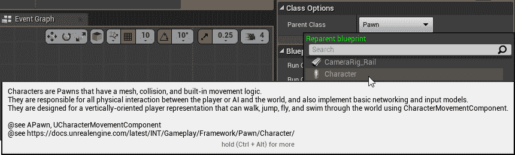

如果你查看组件选项卡，你会发现出现了一些新的组件：

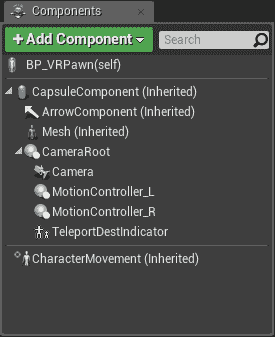

除了之前创建的组件，我们现在还有以下组件：

+   一个胶囊组件

+   一个箭头组件

+   一个网格组件

+   一个角色移动组件

这些都是从 `Character` 类继承的。

这很有用。我们需要移动组件来让我们移动，我们需要胶囊组件来防止我们穿过墙壁。我们不真正需要网格组件，因为我们不渲染玩家角色的身体，但在这种情况下将其放在这里并且将其 Skeletal Mesh 属性留空也不会对我们造成伤害。

当更改对象的父类时要小心。如果你要更改的类是前一个父类的子类，那通常是安全的，因为它会添加新的元素，但父类的属性和函数仍然存在。从子类更改为父类可能更加危险，因为你可能依赖于子类上存在但父类上不存在的属性或函数。更改为与当前类非常不同的类可能会导致问题。如果你知道你在做什么，引擎不会阻止你，但你可能最终需要清理很多无效的函数调用或变量引用。

# 修复碰撞组件

如果现在运行游戏，你会发现我们离地面比之前高一点。这是因为我们的胶囊组件与地面碰撞并将我们推向上方。为了修复这个问题，打开你的角色蓝图的视口选项卡。（如果你关闭了它，可以通过双击组件选项卡上的 BP_VRPawn(self) 条目来重新打开它。）让我们开始吧：

+   按 *Alt* + *K* 切换视口到侧视图。

+   抓住你的相机根组件，将其向下拖动，直到它位于胶囊组件的底部。它的位置现在应该是 (0.0, 0.0, -90.0)：

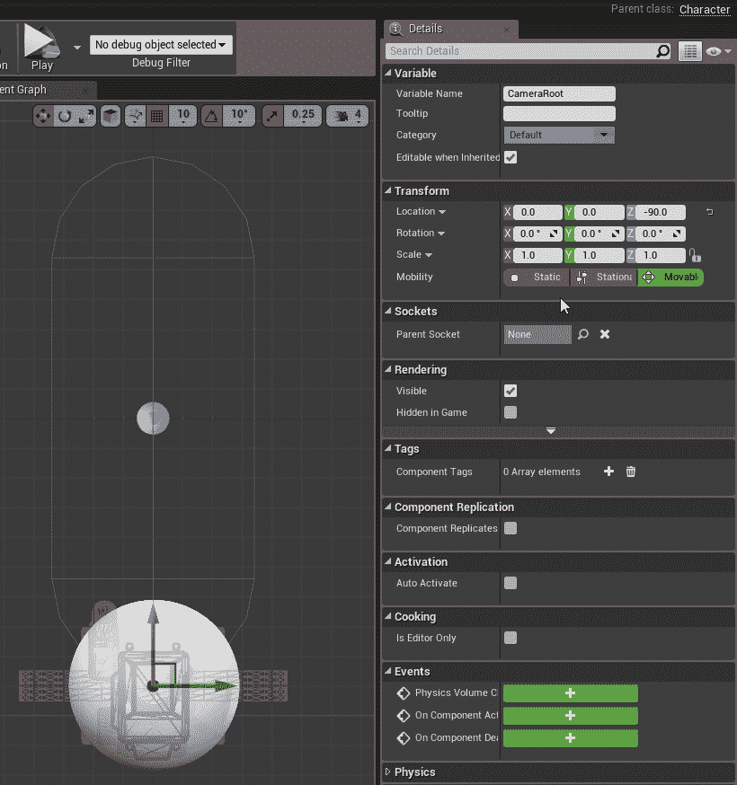

如果再次运行游戏，你会发现你已经正确地站在地板上了。

# 处理移动输入

现在我们给角色添加了一个移动组件，让我们使用之前映射的输入绑定来让我们移动：

1.  在你的角色蓝图的事件图中右键单击，创建一个输入 | 轴事件 | 前进事件：

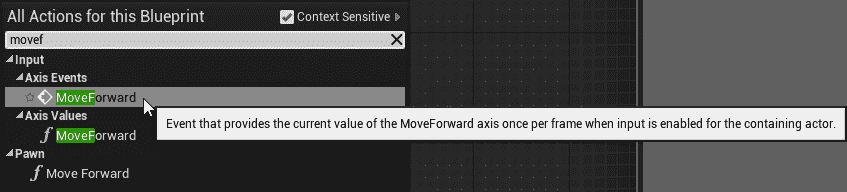

1.  对于我们在轴绑定中创建的 MoveRight 事件也做同样的操作。

现在我们有了两个每帧运行的事件，可以向我们的移动组件提供移动输入。

1.  创建一个 Add Movement Input 节点，并将其执行输入连接到 InputAxis MoveForward 的输出。

1.  将 MoveForward 的轴值输入到移动输入的缩放值中。

1.  对于 InputAxis MoveRight 也重复这个步骤：

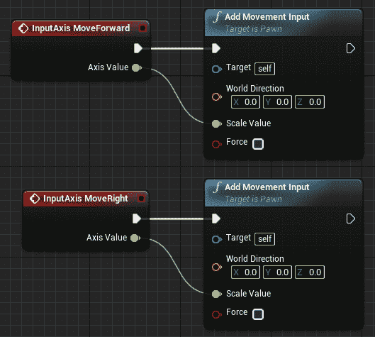

现在，我们需要告诉它我们想要移动的方向：

1.  从组件列表中获取你的相机组件，并将其拖动到事件图中。

1.  从它的输出中创建一个 GetWorldRotation 节点。

1.  右键单击 GetWorldRotation 的输出并拆分结构引脚。

1.  在图表中右键单击，创建一个 Get Forward Vector 节点。

1.  拆分它的输入引脚。

1.  将 GetWorldRotation 的 Yaw 输出连接到 Get Forward Vector 的 In Rot Z (Yaw) 输入。

1.  右键单击创建一个 Get Right Vector 节点。

1.  拆分其输入，并将 GetWorldRotation 的 Yaw 输出连接到其 In Rot Z（Yaw）输入。

1.  将 Get Forward Vector 的输出连接到 InputAxis MoveForward 节点的 World Direction 输入的 Add Movement Input。

1.  将 Get Right Vector 的输出连接到 MoveRight Add Movement Input：

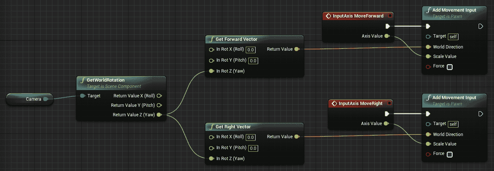

让我们在游戏中试试看。

我们仍然可以使用右侧的触摸板或拇指杆进行传送，但如果我们使用左侧的输入，它会平滑地将我们滑过世界，使用我们相机的观察方向作为前进方向。

习惯于第一人称射击游戏的玩家习惯于将相机方向视为前进方向。在 VR 中，这不一定是这样-角色可以向右看而向左移动是完全合理的。我们的角色有一个*控制旋转*的概念，它是其在空间中的实际方向，与相机面对的方向不同。实际上，如果您要从角色的控制旋转而不是相机旋转驱动移动，您需要提供视觉提示，以清楚地向玩家说明他们的前进方向是什么，否则您的移动方案将使他们困惑。为了保持清晰，在这种情况下，我们使我们的移动相对于观察方向。

这样做效果还不错，但存在一些问题。

# 修正移动速度

首先，我们移动得太快了。让我们修复一下：

1.  选择您的角色的 CharacterMovement 组件，并在详细信息|角色移动中将其最大行走速度设置为 240.0

这是一个更合理的步行速度。

# 让玩家在不断转向的情况下观察周围

让我们面对现实吧。使用相机前向矢量作为我们转向的基础感觉有点不稳定。每次你转动头部看东西时，你都必须转向纠正自己。世界不是这样运作的。让我们改为使用左侧控制器的方向作为我们移动的基础：

1.  抓住 MotionController_L 组件并将其拖动到事件图表中，靠近我们当前获取相机世界旋转的位置。

1.  将 MotionController_L 组件的输出连接到 GetWorldRotation 节点，替换 Camera 的连接：

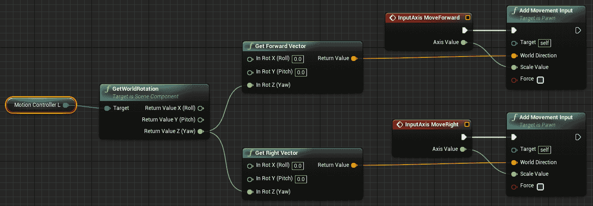

现在，我们不再使用 Camera 的偏航作为我们前进和右侧世界方向的基础，而是使用控制器，这是很直观的。前进方向是您指向控制器的方向，同时，玩家可以使用触摸板或摇杆进行精细移动。他们可以通过指向他们想要去的方向来转向，并且可以在不影响移动的情况下四处看看。

# 实现快速转向

我们需要给玩家提供一种改变方向的方法，而不必在现实世界中转动椅子。

虽然让玩家像我们刚才做的那样平滑地在世界中移动效果很好，但我们不希望他们平滑地转向。我们在第一章中讨论了这个原因，即在 VR 中，当玩家看到他们没有感觉到的运动时，会引起视觉诱发的晕动病。我们对看起来像旋转的运动特别敏感。这可能是由于多种原因：

+   从中毒引起的前庭系统干扰会产生旋转的感觉。在狂欢之夜后是否曾经有过床旋转的感觉？接下来会发生什么？对，不要让你的玩家经历这种感觉。

+   当图像中有大量视觉流动时，前庭系统的断开感最强烈。当玩家旋转时，几乎画面中的所有物体都向侧面移动。这是很多运动。

+   在现实世界中，当我们转动头部时，我们自然会眨眼，或者我们首先将目光对准我们想要看的东西（这种运动称为**扫视**），然后转动头部跟随。在现实世界中，我们在转身时不会保持眼睛稳定。

通过快速转向玩家而不是让他们平滑转向不仅可以避免创建一个可能让用户感到恶心的巨大视觉流动，而且实际上比平滑转向更好地复制了我们在现实世界中感知转向的方式。

让我们设置一个快速转向。

# 设置快速转向的输入

让我们添加一对动作绑定来进行快速向右和向左转：

1.  打开项目设置 | 引擎 | 输入。

1.  在引擎 | 输入 | 绑定中添加两个新的动作映射。将它们命名为`SnapTurnRight`和`SnapTurnLeft`。

1.  将 SnapTurnRight 绑定到 MotionController（L）FaceButton2。

1.  将 SnapTurnLeft 绑定到 MotionController（L）FaceButton4 和 MotionController（L）FaceButton1。

我们将两个输入绑定到 SnapTurnLeft 以适应 Oculus 和 Vive 输入。在 Oculus Touch 控制器上，左控制器上的 FaceButton1 是 X 按钮，而 FaceButton2 是 Y 按钮。在 HTC Vive 上，FaceButton2 是触摸板的左侧，而 FaceButton4 是触摸板的右侧：

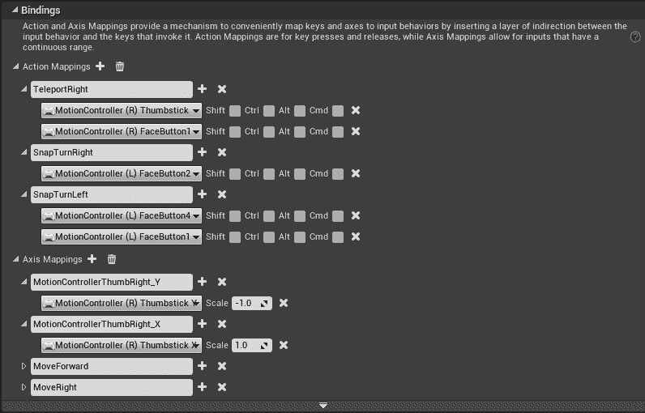

现在您的输入绑定应该如下所示。

现在我们可以关闭项目设置了。

# 执行快速转向

现在，让我们在按下这些按钮时执行快速转向：

1.  在角色的事件图中，为 SnapTurnLeft 和 SnapTurnRight 动作添加输入事件：

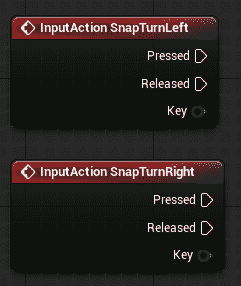

1.  创建一个 GetActorRotation 节点并拆分其输出。

1.  从返回值 Z（偏航）输出处拖动并创建一个 float - float 节点。

1.  从减法节点的第二个输入处拖出并将其提升为变量。将变量命名为`SnapTurnIncrement`。

1.  编译蓝图并将 SnapTurnIncrement 值设置为 30.0。

1.  创建一个 SetActorRotation 节点，并将 GetActorRotation 节点的 Roll 和 Pitch 输出直接连接到相应的输入。

1.  将减法的结果连接到偏航输入。

1.  将 InputAction SnapTurnLeft 的按下执行输出连接到 SetActorRotation 节点的输入。

1.  选择这些节点，按下 Ctrl + W 进行复制。

1.  将复制集中的减法替换为加法。

1.  将复制的节点连接到 InputAction SnapTurnRight 的执行输出：

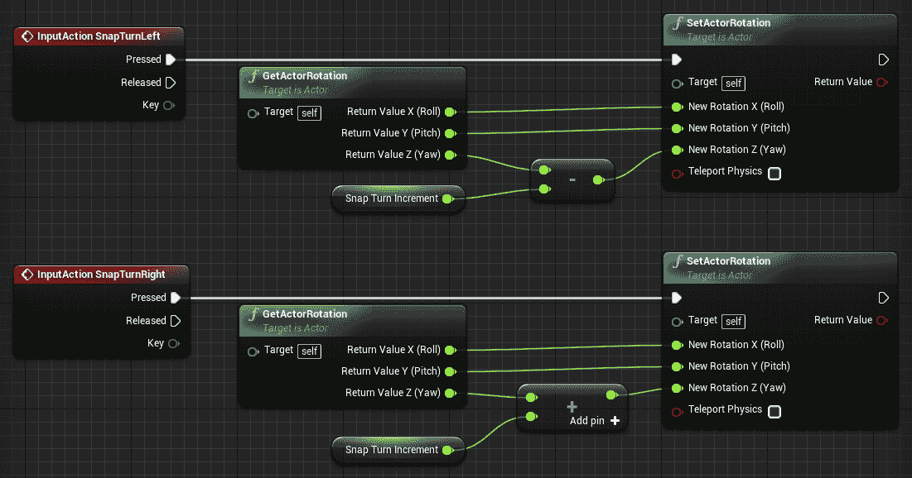

在游戏中试一试。效果还不错。我们肯定可以进一步改进它 - 目前，快速转向也会触发移动，但这是一个相当可用的解决方案。如果对我们的游戏有意义，我们还可以将 Vive 触摸板上的按下或左侧 Oculus Touch 上的摇杆按下映射为 180°的转向。

# 进一步进行

我们可以通过几种方式来改进我们在这里所做的工作，但是完全实施它们将超出本章的范围。让我们简要地谈谈在进一步进行时如何改进这个类。

# 使用模拟输入进行快速转向

我们目前的快速转向实现在 Vive 手柄上效果还不错，但在 Oculus Touch 控制器上感觉不太好。对于我们的玩家来说，如果能听取其中一个摇杆的模拟输入并在超过一定阈值时触发快速转向可能会更好。这样，玩家可以将摇杆翻转到一侧来执行快速转向，或者只需触摸 Vive 触摸板的边缘而无需按下它。

您可以通过在运动控制器的拇指杆上设置输入轴绑定，并测试输入是否大于阈值（对于此测试，我们使用了 0.8）来执行此操作，以进行右转，或者小于负阈值进行左转。

您需要记住对快速转向进行冷却，以防止它在单次按下时重复触发。在我们的案例中，我们使用了 0.2 秒的冷却时间。

如果您想将其构建到您的角色中，请按照以下步骤进行：

1.  为 MotionControllerThumbRight_X 输入轴创建一个输入事件处理程序。

1.  创建一个分支，只有当`bTeleportPressed`为 False 时才继续。我们不希望在传送时处理快速转向。

1.  创建一个名为`bSnapTurnCooldownActive`的新布尔变量。

1.  创建一个分支，只有当`bSnapTurnCooldownActive`为 False 时才继续。

1.  创建一个名为`SnapTurnAnalogDeadzone`的新浮点变量，编译并将其值设置为 0.8。

1.  添加一个>=测试，以查看来自拇指杆输入的输入轴值是否大于或等于`SnapTurnAnalogDeadzone`。

1.  从此处创建一个分支，并在其 False 输出上创建另一个分支。

1.  对于这个第二个分支，测试一下传入的轴值是否小于或等于负的 SnapTurnAnalogDeadzone（将其乘以-1.0）。

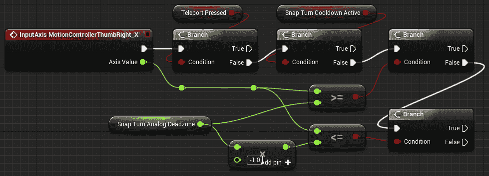

1.  创建一个名为 ExecuteSnapTurnLeft 的新自定义事件，并将其输入到从 InputAction SnapTurnLeft 调用的 SetActorRotation 中。

1.  创建另一个名为 ExecuteSnapTurnRight 的自定义事件，并将其输入到处理 InputAction SnapTurnRight 的位置：

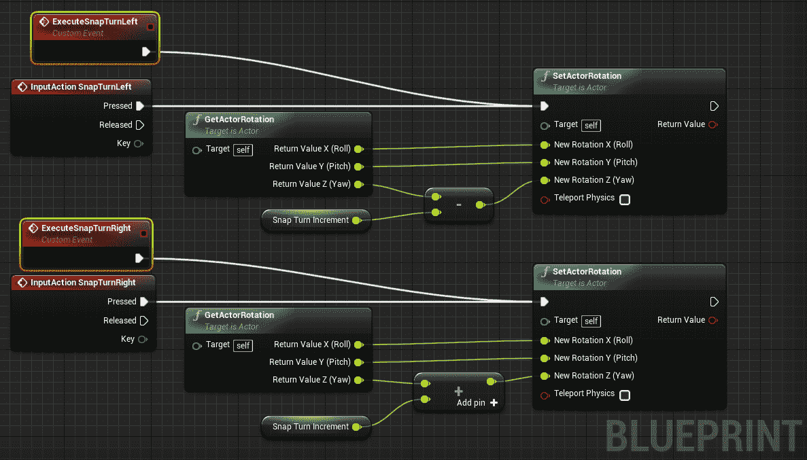

1.  现在，在 ThumbstickRight 处理程序中，如果输入轴大于等于 SnapTurnAnalogDeadzone，请调用 ExecuteSnapTurnRight。

1.  如果输入轴小于等于-SnapTurnAnalogDeadzone，请调用 ExecuteSnapTurnLeft。

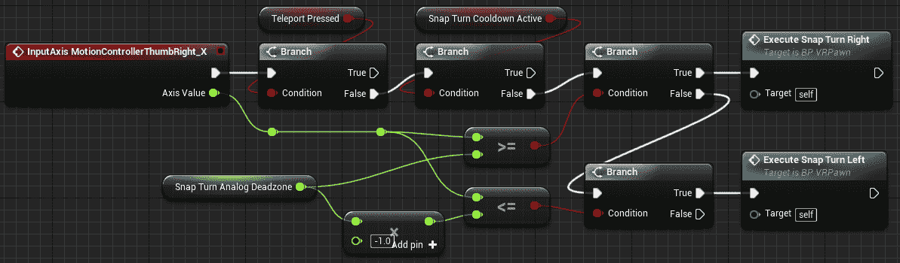

现在，我们需要设置一个冷却时间，以防止用户在移动摇杆时连续进行快速的快速转身：

1.  添加一个 setter 来将 bSnapTurnCooldownActive 设置为 true，并在 ExecuteSnapTurnRight 和 ExecuteSnapTurnLeft 之后调用它。

1.  添加一个延迟。默认值 0.2 在这里很好，但如果您想调整冷却时间，将此值提升为变量。

1.  延迟后，再次将 bSnapTurnCooldownActive 设置为 False。

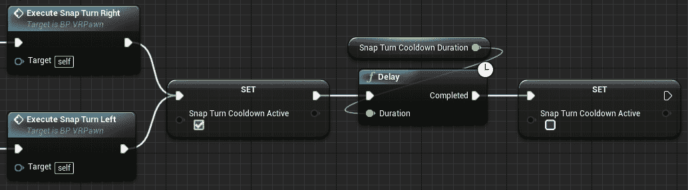

通过这个布尔标志和延迟，我们只是设置了一个门，使得在最后一次处理后的 0.2 秒内快速转身输入将被忽略，这给了用户释放摇杆的时间，一旦他们朝向他们想要的方向。

这个实现使得玩家在右摇杆上有一个很好的自然感觉的快速转身，同时将左摇杆用于模拟无缝移动。

# 总结

在本章中我们做了很多事情。

我们学习了如何在场景中设置和优化导航网格，以及如何查找和修复场景中对象的碰撞问题。我们学习了如何设置输入动作并使用它们来移动我们的玩家角色，也许最重要的是，我们学习了肯特·贝克的软件开发口号：“让它工作，让它正确，让它快”，并学习了在迭代开发中遵循它的含义。我们将经常回顾这一点。这是有效软件开发的秘诀。

这是一项很大的工作。本章的练习涵盖了很多内容，但应该让您对设置玩家角色和运动系统的各个部分如何配合有一个不错的理解。

现在我们给了我们的角色脚，下一章，我们将给它手。我们将学习如何使用动作控制器来指向、抓取和与世界中的对象交互。我们还将在设置导航网格方面进一步学习，并将一些 AI 放入世界中以使用它们。现在我们可以在世界中四处走动了，我们将开始让它生动起来。
