# 第五章：与虚拟世界互动-第一部分

在前一章中，我们学习了如何使用传送定位和添加更沉浸式的无缝定位方案来使玩家角色移动。我们给了我们的用户脚。现在，在本章中，我们将给他们双手。

我们将通过使用市场上的资产创建一个新项目，探索另一种启动 VR 项目的方式，然后将我们在前一章中构建的 VRPawn 迁移到这个新项目中。一旦我们设置好了，我们将首先为 VRPawn 添加手部，并探索与世界中的物体互动的方式。

这很重要。作为与世界互动的人类，我们最关注的是我们环顾四周时事物的外观，但我们对我们的手和它们的动作也有很高的意识。VR 开发者称之为“手的存在感”，当它做得好时，它可以显著提高沉浸感。请稍微思考一下。你的手是你身体的一部分，你可能大部分时间都对它们最有意识。我们在 VR 中如何很好地代表它们对我们在体验中的“具身感”有着有意义的影响。

在本章中，我们将学习以下主题：

+   如何为玩家创建基于蓝图的虚拟手

+   如何在创建世界中的对象时使用构造脚本进行自定义

+   如何使用动画混合空间和动画蓝图来为我们的手添加动画

+   如何设置新的输入来驱动我们的手

让我们开始吧！

# 从现有工作开始一个新项目

让我们从创建一个新项目开始。我们将把我们在前一章中制作的 Pawn 和游戏模式迁移到这个项目中，并从市场上添加一些景观。当您开始开发自己开发的元素库或通过市场获得元素时，这将成为启动新项目的常见方式。

# 将蓝图迁移到新项目

启动当前版本的引擎，并在 Unreal 项目浏览器中使用以下参数创建一个新项目：

+   空白蓝图模板

+   硬件目标设置为移动/平板电脑

+   图形目标设置为可扩展的 3D 或 2D

+   没有初始内容

将其放在您喜欢的任何位置。

现在，让我们将在前一个项目中创建的 Pawn 添加到这个项目中。为了做到这一点，我们将不得不跳回到我们之前的项目中，以获取我们想要迁移的资产：

1.  选择文件 | 打开项目，并浏览到您之前项目的`.uproject`文件。打开它。这样做时，您当前的项目将关闭。

1.  一旦进入您之前的项目，找到我们创建的`BP_VRGameMode`蓝图。

1.  右键单击它，选择 Asset Actions | Migrate...，如下图所示：

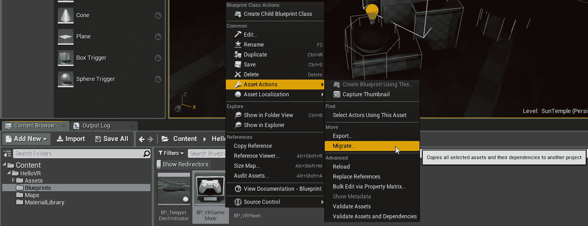

除了您选择的对象之外，Migrate...实用程序还会收集您选择的对象所依赖的任何其他对象。因为我们的游戏模式使用 VRPawn 作为默认 Pawn，所以 Migrate...实用程序将收集 Pawn 以及我们为其创建的传送指示器：

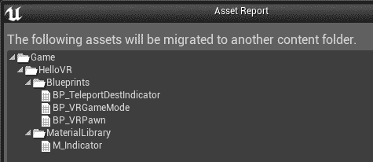

1.  点击确定，当被问到要将新内容放在哪里时，选择你的新项目的 Content 目录。

太棒了！你的游戏模式和 Pawn 的副本现在已经添加到你的新项目中。

我们还映射了一些输入，我们也需要它们。

# 复制输入绑定

还记得我们提到过输入映射只是`DefaultInput.ini`中的文本条目吗？由于我们在新项目中没有映射任何输入，我们可以通过复制`DefaultInput.ini`文件来重新创建旧项目的输入绑定。您也可以使用项目设置菜单重新创建输入，但是如果可以这样做，这种方式更快：

1.  导航到旧项目的 Config 目录。

1.  选择`DefaultInput.ini`并将其复制到您的新项目的`Config`目录中。

如果你打开它，你会看到它包含了我们创建的输入绑定，如下面的截图所示：

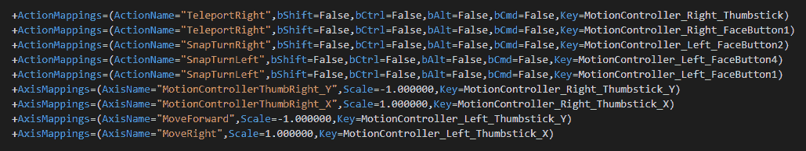

# 设置新项目使用迁移的游戏模式

现在我们已经复制了我们的游戏模式和 Pawn，并且我们的输入绑定已经设置好，我们可以返回到我们的新项目：

+   如果你点击文件 | 最近的项目，它应该在列表中，但如果没有，使用文件 | 打开项目导航到它

现在，让我们设置我们的项目使用刚刚带过来的游戏模式：

+   打开项目设置 | 项目 | 地图和模式，并在默认模式下，将默认游戏模式设置为`BP_VRGameMode`

这将导致该游戏模式在我们项目中的任何地图上使用，除非我们覆盖它。正如你记得的那样，这个游戏模式告诉项目加载我们的 VRPawn。

# VR 相关的其他项目设置

还要记得设置我们在第三章中描述的其他与 VR 相关的设置，例如：

+   项目设置 | 引擎 | 渲染 | VR | 实例化立体声：True

+   项目设置 | 引擎 | 渲染 | VR | 环形轮询遮蔽查询：True

+   项目设置 | 引擎 | 渲染 | 正向渲染器 | 正向着色：True

+   项目设置 | 引擎 | 渲染 | 默认设置 | 抗锯齿方法：MSAA

+   项目设置 | 引擎 | 渲染 | 默认设置 | 环境遮蔽静态分数：False

+   项目设置 | 项目 | 描述 | 设置 | 在 VR 中启动：True

还要记住，你不应该盲目地遵循这些步骤。对于许多 VR 项目，正向渲染将是最佳选择，但你应该对你正在做的特定事物是否适合延迟渲染模型进行一些思考。（如果你要进行大量的动态照明和反射表面，这可能是适用的情况。）对于抗锯齿方法也是一样。如果你使用正向渲染，通常会选择 MSAA，但在某些情况下，时域抗锯齿或 FXAA 会更好看。实例化立体声几乎总是你想要的，环形轮询遮蔽查询也是一样。

# 测试我们迁移的游戏模式和 Pawn

在做任何其他操作之前，让我们先测试一下：

1.  将一个导航网格边界体拖到我们项目中默认打开的地图上，并将其缩放到覆盖整个地板。（记住你可以按下 P 键查看它。）

1.  启动 VR 预览，验证你可以在地图上进行传送并使用无缝移动。

很好。这个快速测试可以让我们验证从其他项目中带过来的游戏模式已加载，并在玩家起始点生成了我们的 VR Pawn 的实例。

在构建时逐步测试事物。在进行了一些更改之后，找到错误的源头要比进行了很多更改之后容易得多。

# 添加景观

现在，让我们引入一些景观，以便我们有一个玩耍的地方：

1.  打开你的 Epic Games Launcher，在市场中搜索 Soul: City。（它是免费的。）

1.  点击添加到项目，并将其添加到你现在正在工作的项目中。

1.  完成后，如果你关闭了项目，请重新打开它，并打开内容 | Soul City | 地图 | LV_Soul_Slum_Mobile。

在编译着色器时喝杯咖啡。现在，我们应该设置我们的项目自动打开这个地图。

1.  在项目设置 | 项目 | 地图和模式中，将编辑器启动地图和游戏默认地图设置为`LV_Soul_Slum_Mobile`。

# 添加一个导航网格

我们还需要在这个场景中添加一个导航网格边界体，以便我们可以通过它进行传送。

正如你在前一章中学到的，如果你想做得正确，设置边界体积可能是一个复杂的过程。对于我们在这里的目的，我们将稍微作弊，只是大致覆盖场景的大部分区域。如果你想进一步调整体积，你可以缩放它并更仔细地放置它，并使用导航修改器来排除你不想要的区域。如果你想保持简单，以下设置对我们在这里关注的内容已经足够好了：

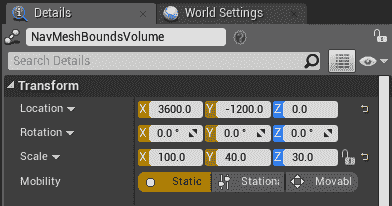

+   位置：X=3600，Y=-1200，Z=0

+   比例：X=100，Y=40，Z=30

我们得到以下输出：

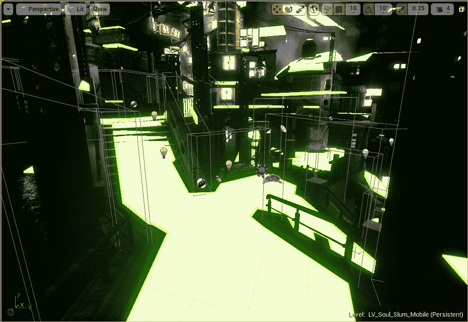

我们的导航网格在这个地图上有点混乱。如果你想清理一下，可以随意应用我们在前一章中讨论过的方法。

# 测试地图

启动 VR 预览并探索一下场景。嗯。有些问题。我们的输入没有正常工作。因为我们在前一步验证了我们的 Pawn 工作正常，输入映射也没问题，所以我们知道那不是问题。让我们确保我们加载了正确的 Pawn：

1.  打开你的世界设置，查看游戏模式|游戏模式覆盖。

1.  果然，还有另一个正在加载的游戏模式。使用重置箭头清除被覆盖的游戏模式。

让我们再次测试。好多了。现在，我们能够在环境中导航了。

当我们在这里并且能够四处走动时，让我们指出一些关于这个环境的事情。这不是一个完美的虚拟现实项目环境，在这种情况下，这给了我们一些有用的东西可以谈论：

+   **在 VR 中比例很重要**：首先，当我们四处走动时，我们可以看到某些物体的比例不一致。有些楼梯看起来大小合适，而其他的则很大。我们在这里不打算对此做任何处理，但这是一个重要的要点：你世界中物体的比例在 VR 中非常重要。人们对物体的大小有一种本能的感觉，而 VR 给他们提供了比平面屏幕更强烈的关于物体大小的线索。如果你的比例不正确，他们会在 VR 中注意到。

+   **灯光可能会在 VR 中产生镜头光晕**：另一个潜在的问题是明亮的霓虹灯。它们使环境看起来很棒，但你可能会注意到它们有时会从某些角度使你的头戴设备的菲涅耳透镜产生光晕。我们并不是说你需要避免在场景中使用明亮的灯光或对比度，但要注意它们有时会引起对硬件的注意。这里的要点是你总是希望在 VR 头戴设备和平面屏幕上检查你的艺术作品。

# 创建手部

现在我们有了一个场景可以使用，让我们进入本章的核心并开始设置一些交互。

在我们做其他事情之前，让我们改进一下场景中运动控制器的表示方式。目前，我们正在使用调试网格，如果我们的用户使用的是与我们在创建场景时使用的不同的头戴设备，它们将无法正确渲染。这足够让我们开始，但现在我们需要用更持久的东西来替换它。

为了获得可用的手部网格，我们将从 VR 模板中获取。对于你的许多 VR 项目来说，你可能只是从 VR 模板开始创建一个项目，或者将整个 MotionController Pawn 蓝图迁移到你创建的项目中，但对于我们在这里的目的，我们希望自己构建 Pawn，以便我们了解其中的内容。

# 从 VR 模板项目迁移手部网格和动画

如果你已经创建了一个 VR 模板项目的示例，请使用文件>打开项目来打开它。如果你还没有一个，关闭当前项目，然后从 Epic Launcher 中启动引擎，并使用 VR 模板创建一个新项目。对于这个项目，你使用的其他设置并不重要——我们只是为了获取网格而在这里：

1.  在 VR 模板项目的内容浏览器中，导航到 Content | VirtualReality | Mannequin | Animations。

1.  选择这三个动画资产，右键点击它们，选择 Asset Actions | Migrate。暂时忽略混合空间和动画蓝图，我们将学习如何自己制作它们：

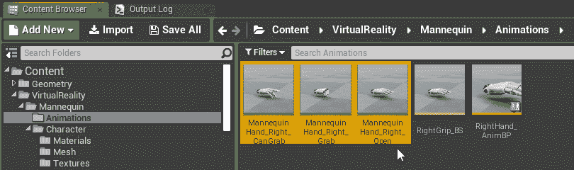

您会看到迁移实用程序不仅收集了您选择的动画，还找到了网格、物理资产和骨骼，以及其材质和输入到其中的纹理：

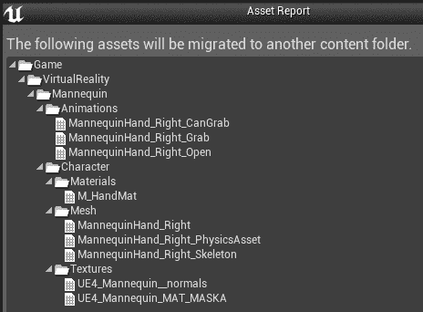

1.  将当前项目的 Content 目录选为目标。

现在我们已经收集了一些可以使用的资产，我们准备返回我们的项目。

1.  点击文件 | 最近的项目，打开您之前的项目。（如果这里没有出现，请使用文件 | 打开项目。）

# 将手部网格添加到我们的运动控制器上

回到我们当前的项目，我们现在应该在内容浏览器中有一个`VirtualReality`目录，其中包含一个`Mannequin`子目录，其中包含`Animations`和`Character`文件夹。

让我们将这些手部网格应用到我们的角色的运动控制器上。

# 创建一个新的蓝图 Actor 类

我们首先要做的是创建一个蓝图来表示它们，因为我们希望动画手部以响应玩家的动作：

1.  在项目的蓝图目录中右键点击，选择创建基本资产 | 蓝图类。

1.  将其父类设置为 Actor。

1.  让我们将其命名为`BP_VRHand`。

1.  打开它。

我们在本书中早些时候提到，面向对象开发的核心原则之一是将属于一起的东西放入自包含的对象中，这些对象可以处理自己的行为。由于我们即将将动画手部网格与运动控制器连接起来，这是一个很好的机会来做到这一点。我们完全可以只向我们的角色添加一对骨骼网格组件，并将它们附加到我们的运动控制器组件上，但如果我们能更好地设计一下，事情会更加清晰，最终也更容易管理。

# 添加运动控制器和网格组件

让我们添加我们需要的组件：

1.  将 MotionController 组件添加到您的组件列表中。

1.  选择新的 MotionController 组件后，添加一个骨骼网格组件，使其成为运动控制器的子组件：

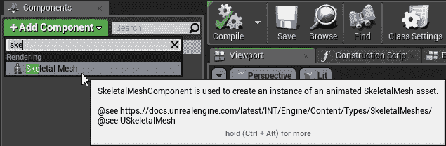

1.  让我们将其命名为`HandMesh`。

1.  在骨骼网格组件的详细面板中，将其 Mesh | Skeletal Mesh 属性设置为`MannequinHand_Right`：

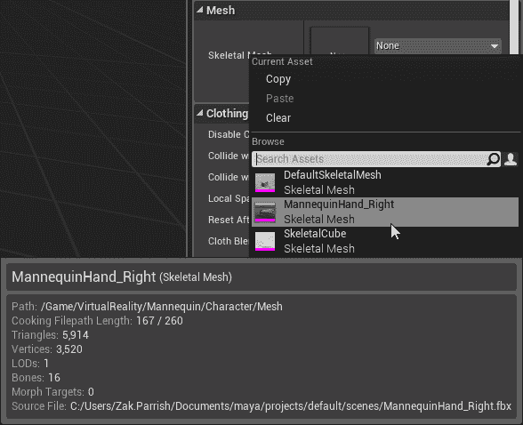

# 添加一个 Hand 变量

由于我们将在右手和左手都重用这个 VRHand，我们需要设置一种方式让对象知道它代表的是哪只手：

1.  在`BP_VRHand`的变量列表中添加一个变量，并将其命名为`Hand`。

1.  将其变量类型设置为`EController Hand`。

1.  将其 Instance Editable 属性设置为`true`：

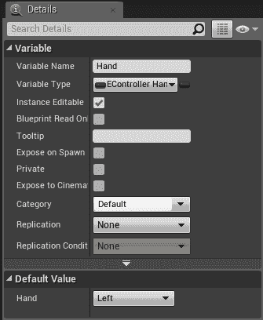

您会注意到，当您将 Instance Editable 设置为 true 时，变量名称旁边的眼睛图标是打开的。这表示该变量允许为世界中的每个单独实例设置不同的值。由于我们需要将其中一个对象设置为右手，另一个设置为左手，这正是我们想要的：

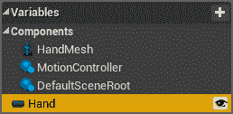

现在我们有了一个实例可编辑的 Hand 变量，指示这个对象将代表哪只手，我们还需要告诉我们的 MotionController 组件。

# 使用构造脚本处理对 Hand 变量的更新

如果你查看`BP_VRHand`类的函数列表，你会发现一个 Construction Script 已经自动为你创建了。这是一个在对象创建或更新之前在游戏开始之前运行的函数。Construction Scripts 非常有用，可以在软件运行之前同步需要对齐的值。在我们的情况下，这正是我们想要的。如果我们改变这个 Hand 变量的值，我们希望动作控制器的运动源自动改变以与之匹配。让我们实现这个目标：

1.  打开你的 BP_VRHand 的 Construction Script。

1.  将对 Motion Controller 组件的引用拖入 Construction Script 中。

1.  拖出它的输出并调用`Set Motion Source`：

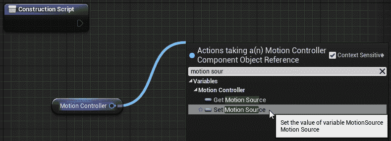

1.  将一个对`Hand`变量的引用拖入你的 Construction Script 中。

1.  将其输出拖到`Motion Source`输入上。你会看到一个`Convert EControllerHand Enum to Name`节点自动出现：

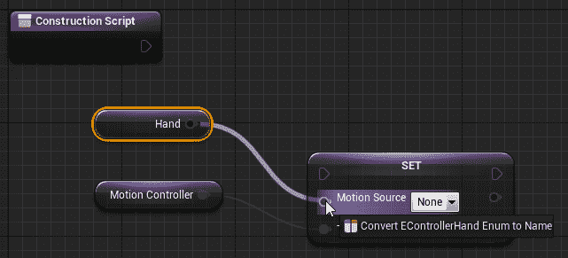

某些数据类型可以很容易地转换为其他类型。在这种情况下，我们将一个枚举转换为一个名称。**Enum**是**enumerator**的缩写。枚举是一种特殊的数据类型，允许我们创建一个预定义的值列表，然后将该值集合用作数据类型。如果你对数据类型有一个已知的可能值集合，最好使用枚举来列出它们，而不是使用名称或字符串。这样可以防止拼写错误导致值失败，并且与字符串比较相比，比较速度要快得多。当我们需要时，在蓝图中将枚举值转换为可读的值通常非常容易，就像我们在这里所做的一样。

1.  最后，将你的 Construction Script 的执行输出连接到`Set Motion Source`输入，这样你的整个 Construction Script 看起来就像这样：

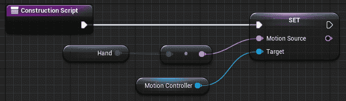

# 将 BP_VRHand 子 Actor 组件添加到你的 pawn 中

现在让我们返回到我们的`BP_VRPawn`蓝图中：

1.  在其组件列表中，选择你的 Camera Root 组件，并添加一个 Child Actor 组件作为子组件。

1.  将其命名为`Hand_L`。

1.  在其详细信息中，将 Child Actor Component 的 Child Actor Class 设置为`BP_VRHand`。

1.  再次选择 Camera Root，以便它成为我们接下来创建的组件的父级，并添加另一个 Child Actor 组件。

1.  将其类设置为`BP_VRHand`，并将其命名为`Hand_R`。

1.  这次，在 Child Actor Class 属性下方，展开 Child Actor Template 属性。

1.  将 Child Actor Template | Default | Hand 设置为`Right`。（我们能够这样做是因为在前面的步骤中我们使这个变量实例可编辑。）

现在我们需要确保由这些组件生成的 BP_VRHand actors 知道这个 pawn 是它们的所有者。这对于动作控制器正确注册是必需的。

1.  在`BP_VRPawn`中，在事件图中找到事件 BeginPlay。

1.  将刚刚创建的`Hand_L`组件的引用拖到图表中。

1.  拖动它的输出并选择 Get Child Actor 以获取对其中包含的`BP_VRHand`对象的引用。

1.  拖动 Child Actor 的输出并调用 Set Owner。

1.  在图表中右键单击并选择 Get a Reference to Self 以创建一个 Self 节点。

1.  将 Self 拖入 Set Owner 节点的 New Owner 输入。

1.  将 Set Tracking Origin 的执行输出拖到 Set Owner 节点的执行输入中。

1.  对于`Hand_R`组件也重复这个步骤。

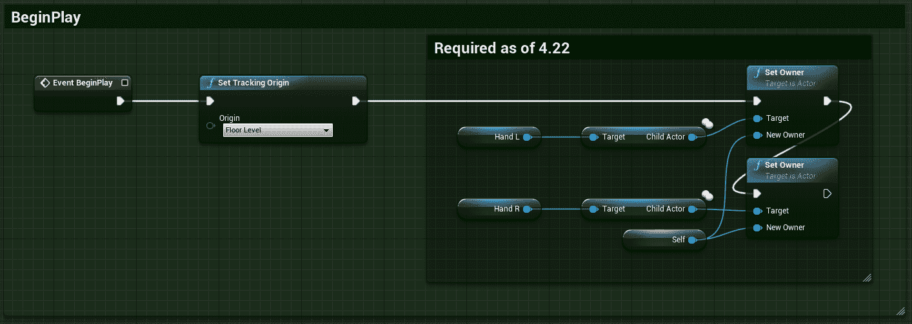

在做其他任何事情之前，让我们进行测试。

我们应该仍然能看到我们旧的动作控制器渲染出来，因为我们还没有摆脱它们，但是我们现在应该也能看到一双手，并且它们应该能正确地随着我们的动作控制器移动。

我们的手部还有一些问题需要解决。

# 修复手部模型的问题

如果我们观察手部随着动作控制器移动的情况，我们会发现它们显示的角度是意外的：

1.  让我们通过将`HandMesh`组件的 Transform | Rotation 设置为绕*X*轴旋转 90°来修复这个问题：

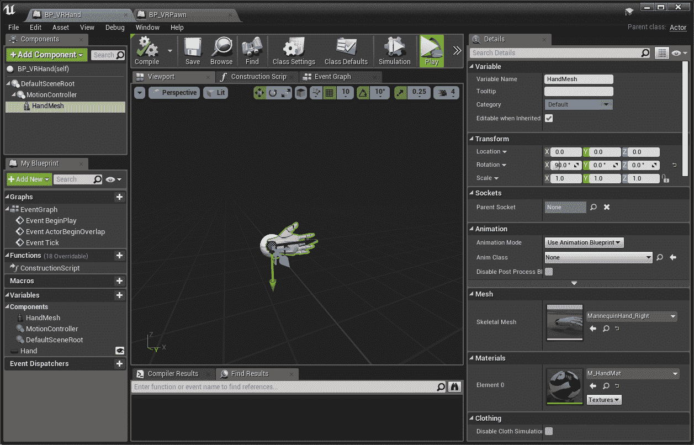

其次，它们都显示为右手网格，即使其中一个绑定到了左手。我们也可以在构造脚本中修复这个问题。

1.  从我们的 Hand 变量的输出中拖出一个`==`运算符。测试它是否等于 Left。

1.  使用此测试结果作为条件添加一个分支节点。

1.  将对`Hand Mesh`的引用拖入构造脚本图中。

1.  如果 Hand `==` Left，则在你的`Hand Mesh`上调用`Set World Scale 3D`，将其设置为 X=1.0，Y=1.0 和 Z=-1.0：

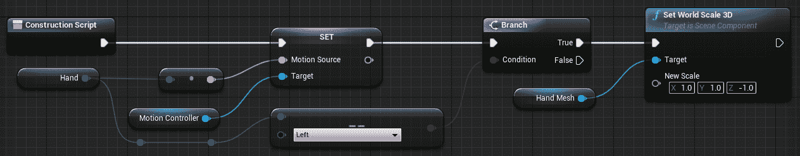

将手的网格缩放设置为-1，即在其*Z*轴上进行镜像，这是一种聪明的方法，可以从右手创建一个左手的网格，而无需创建第二个网格。

再试一次。现在手应该更好地倾斜，你应该有一个左手和一个右手。不过，还不完美。手的网格位置还不太对，因此它们不太像我们自己的手：

1.  从组件列表中选择`HandMesh`组件，并将其详细信息|转换|位置设置为 X=-13.0，Y=0.0，Z=-1.8。

1.  微调这些值，直到它们对你感觉合适。

在 VR 中，正确设置手的角度非常重要。正如我们在第一章中讨论的那样，我们对手的位置的感知能力非常强，如果它们看起来有一点点不对劲，它们就不会感觉真实。花时间找到在这里感觉自然的方式。这是一个微妙的细节，但它很重要。

# 在蓝图中替换对旧的运动控制器组件的引用

现在我们已经将手放在了正确的位置，我们需要从角色中删除旧的、多余的运动控制器组件，并将引用它们的地方替换为对我们新手的引用。让我们开始吧：

1.  打开你的角色蓝图，并选择其`MotionController_L`组件。

1.  右键单击它，选择查找引用（按下*Alt* + *Shift* + *F*也可以）：

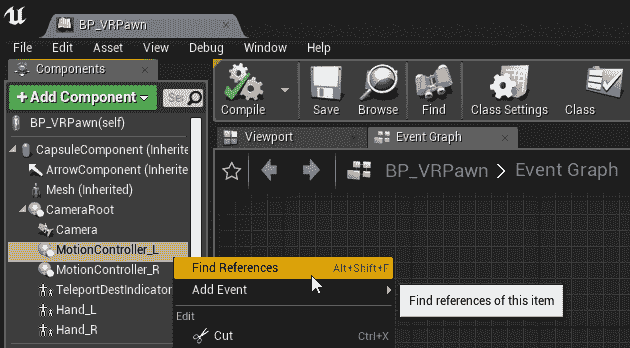

一个查找结果面板将打开，并显示此组件在蓝图中的使用位置。从这个列表中我们可以看到，`MotionController_L`在我们的图表中被使用了一次。

1.  双击它跳转到在事件图中使用它的位置：

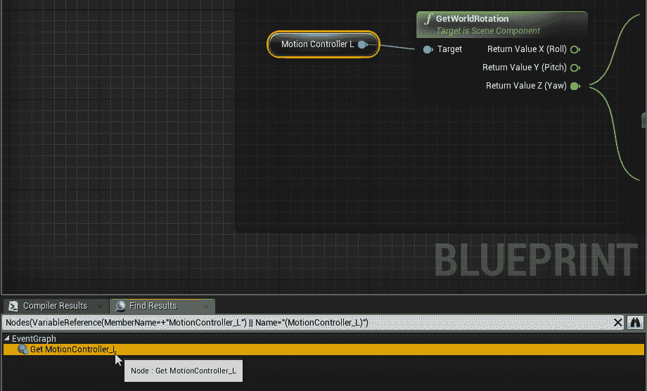

我们想要用对新创建的`Hand_L`的引用替换对`MotionController_L`的引用。

1.  将对`Hand_L`的引用拖入你的图表中。

我们不能简单地将对`MotionController_L`的引用替换为对我们的`Hand_L`对象的引用，因为该对象本身并不随控制器移动。它包含一个运动控制器组件，可见的手网格是该运动控制器的子级。我们需要获取对该运动控制器的引用，或者更好的是，因为玩家可以看到它，获取对手的网格的引用。

# 创建一个函数来获取我们的手的网格

要访问我们的`VRHand`对象的内部组件，我们首先需要获取对包含在我们的子级角色组件中的子级角色的引用。让我们开始吧：

1.  从`Hand_L`中拖出一个连接器，并选择“获取子级角色”：

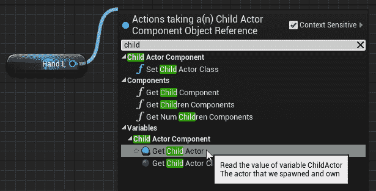

还记得我们提到过虚幻引擎是一个面向对象的环境吗？我们一直回到这一点，因为这很重要。我们刚刚从 Child Actor 组件中提取的 Child Actor 引用是对 Actor 类的引用。正如我们在前几章中提到的，Actor 是可以放置在世界中的任何对象的父类。然而，Actor 类本身没有 Hand Mesh 组件。它只有将任何对象放置在世界中所需的基本内容。而 BP_VRHand 对象，它是 Actor 类的子类，包含了这个组件。我们需要告诉虚幻引擎，我们在这种情况下正在处理的 Actor 是一个 BP_VRHand。我们使用一个 Cast 运算符来实现这个目的。

1.  从`Child Actor`拖动一个连接器，并选择`Cast to BP_VRHand`：

！

这将创建一个 Cast 节点。Cast 节点需要一个执行输入，因为它们不能保证成功。如果你尝试将一些随机的 actor 转换为 BP_VRHand，它将失败，因为你给它的 actor 不是 VRHand。Cast 节点不会将对象转换为该类型的 actor-它只是告诉系统，如果实际上是该类型的实例，则将引用视为指定的类型。

我们将在一会儿处理这个执行线，但首先，让我们从对象中获取手部网格。

1.  从 Cast 节点的 As BP_VRHand 输出拖动一个连接器，并选择 Get HandMesh：

！

现在，我们可以将其输入到当前正在从 MotionController_L 读取的 GetWorldRotation 节点中。

1.  将 HandMesh 输出拖入 GetWorldRotation 中，替换旧的 MotionController_L 引用：

！

然而，这还不起作用，因为我们还没有将执行线连接到我们的 Cast 节点。如果你现在尝试编译这个，你会看到 Cast 节点上有一个警告，Get HandMesh 上有一个错误，因为这个原因。

我们有两种方法可以解决这个问题。我们可以将 Cast 节点插入到输入的主执行线中，并且只有在成功时才进行 Add Movement Input 调用，但在我们的情况下，有一种更简洁的方法。我们可以创建一个*纯函数*来执行转换。

**纯函数**是一个不改变包含它的对象状态的函数，因此它不需要放置在执行线中。在我们的情况下，我们只是获取手部网格的引用-这并不重要我们何时这样做，因为我们没有改变任何东西。我们只是读取一个值，只要在我们需要使用它之前发生这种情况，那就没问题。

1.  选择 Hand_L 节点，它的 Child Actor，Cast 和 Get Hand Mesh 节点。

1.  右键单击并选择折叠到函数：

！

1.  将函数命名为 GetHandMeshForHand。

1.  将其 Pure 属性设置为 true：

！

你会注意到，当你这样做时，执行引脚消失了。现在，我们有一个简单、干净的节点，可以用来获取我们的手部网格。

让我们改进一下。我们知道我们将需要为右手执行相同的操作，但是制作一个几乎相同的函数来完成这个工作是浪费的。让我们设置这个函数，使其可以获取任何一只手。

1.  选择函数后，找到其详细信息|输入列表，并点击+按钮创建一个新的参数。

1.  将参数的类型设置为 EControllerHand，并将其命名为 Hand：

！

你会看到你的纯函数节点现在有一个输入选择器，因为我们使用的输入是一个枚举器，它已经知道可用的值。很有用，对吧？

这是另一个枚举器优于字符串作为数据类型的原因。请不要使用字符串作为数据类型，除非有非常少的例外情况。它们速度慢，并且极易出错。

现在，我们需要更新我们的函数以使用这个新的输入。

1.  打开`Get Hand Mesh for Hand`函数。

现在，无论用户选择`Hand`输入什么，我们都会得到对 Hand_L 的引用。是时候修复这个问题了。

1.  从你的`Hand`输入拖出一个连接器并创建一个 Select 节点。

1.  将 Select 节点的返回值拖入 Child Actor 的 Target 输入中，替换`Hand_L`的输入。

1.  取 Hand_L 引用并将其输出输入到选择器的 Left 输入中。

1.  拖出一个 Hand_R 的实例到图表中，并将其输入到选择器的 Right 输入中。

1.  我们可以将其余的输入设为 Null，因为我们在这里不使用它们：

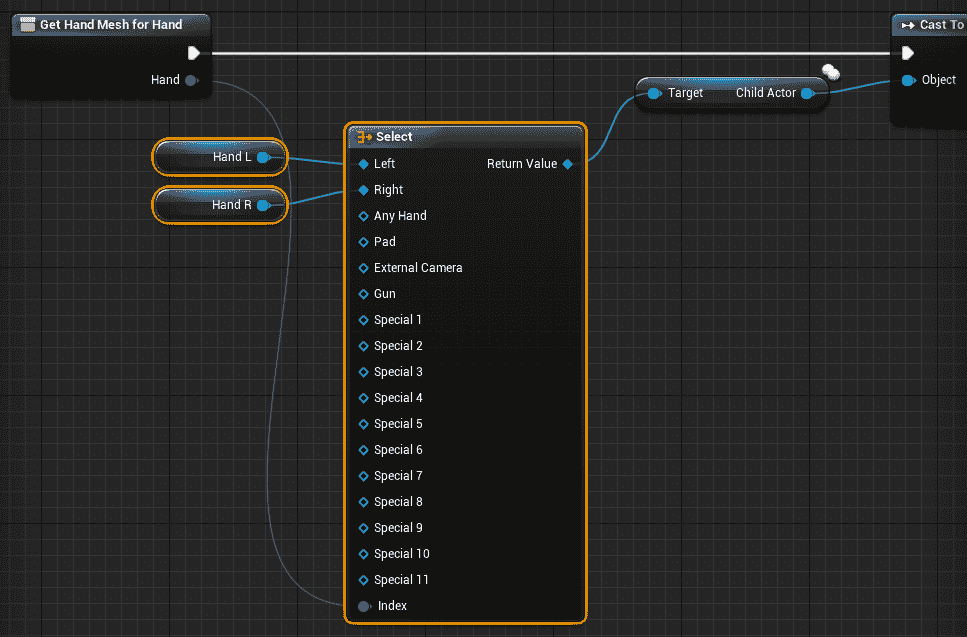

现在，如果用户将 Left 传递给`Hand`参数，将使用`Hand_L`引用，如果他们传递 Right，将从`Hand_R`读取。我们在这里没有安全处理用户传入任何其他值的情况，所以如果用户选择了 Gun 或其他输入，函数将抛出一个错误。从技术上讲，在这种情况下，这可能是可以的，因为我们知道我们计划给它什么输入，但为了良好的实践，让我们使它更安全一些。

如果我们传入一个既不是 Left 也不是 Right 的值给 Select 节点，它将返回一个 Null（空）引用。尝试从空引用中读取值是一件不好的事情。在 C++中，它会导致应用程序崩溃。在蓝图中，它只会抛出一个错误，但是让它发生仍然不是一个好的做法。

1.  从 Select 节点拖出一个输出，并创建一个 IsValid 节点。你有两个版本可以选择。使用宏版本（带有问号的版本），因为这将为你提供方便的执行引脚：

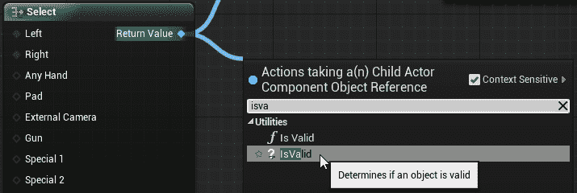

1.  将函数输入的执行引脚拖动到`IsValid`节点的 Exec 引脚上。

1.  将 IsValid 输出拖入 Cast 节点的输入中，以便在尝试转换之前进行 IsValid 检查。

1.  从 Is Not Valid 输出中拖出并选择 Add Return Node。在这里不要连接任何东西到 Hand Mesh 输出。如果用户将一个错误的输入传递给`Hand`变量，这将返回一个 Null（空）值。

1.  在我们进行这些操作的同时，我们还应该将`Cast`节点的 Cast Failed 输出连接到这个空的返回节点，这样如果转换失败，它就不会尝试从一个错误的对象中获取 HandMesh。

完成的函数应该是这样的：

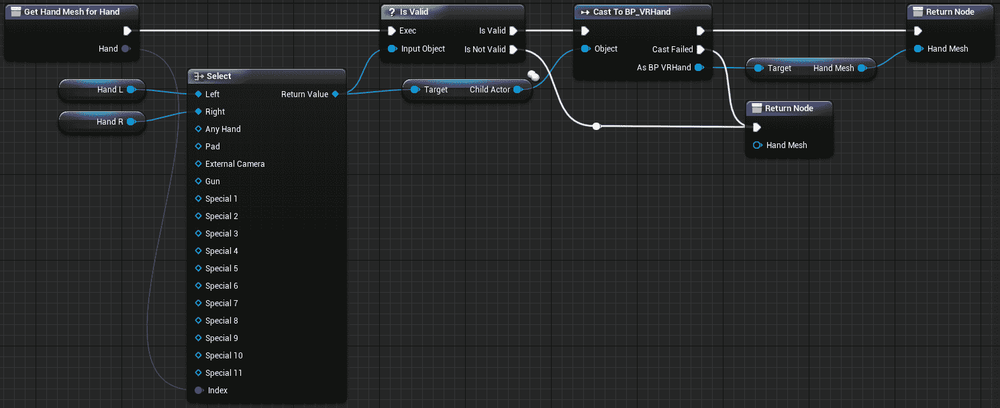

我们现在创建了一个纯函数，它返回所提供手的子 actor 组件中包含的 HandMesh。下面是它的使用方法：

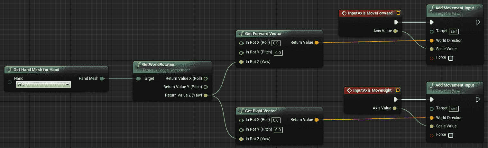

现在，我们已经创建了一个干净、易于使用的函数来获取我们的 Hand 模型，让我们用它来替换我们的`MotionController_R`引用。

1.  从你的组件列表中，右键点击`MotionController_R`并选择 Find References。你会看到我们在两个地方使用它。

1.  双击第一个使用，跳转到图表的那部分。

1.  将`GetHandMeshForHand`函数的一个实例拖到当前正在使用`MotionController_R`的图表上。

1.  从 Hand 下拉菜单中选择 Right。

1.  按住 Ctrl 键并将`MotionController_R`的输出连接从`GetHandMeshForHand`的输出连接上拖动：

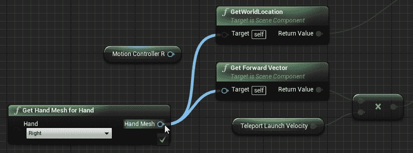

按住 Ctrl 键并拖动是一种快速将所有连接从一个引脚移动到另一个引脚的方法。

你的图表现在应该是这样的：

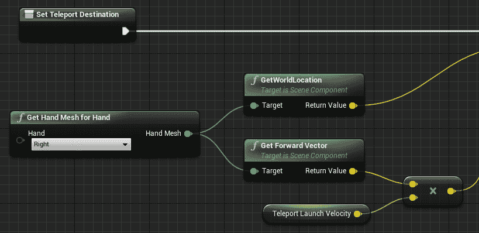

1.  对另一个对`MotionController_R`的引用也做同样的操作。

1.  从组件列表中删除 MotionController_L 和 MotionController_R 组件。

测试一下。你的动作控制器应该像以前一样工作，但是手的模型现在替换了旧的控制器模型。

# 给我们的手添加动画

现在，让我们根据玩家的输入来改变手的姿势。

我们首先需要告诉手部玩家何时想要对其进行操作。让我们通过在`BP_VRHand`上创建一对可以从外部调用的函数来实现这一点：

1.  打开`BP_VRHand`蓝图。

1.  在函数列表中创建一个新函数。将其命名为`Grab Actor`。

1.  创建另一个名为`Release Actor`的函数。

1.  在这些函数的内部，创建一个带有函数名称的 Print String 节点。由于我们暂时不打算让这些函数做任何事情，我们希望能够看到它们被调用的时候：

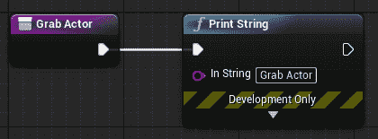

让我们更好地组织我们的函数和变量。虽然我们还没有这样做，但这是一个好的实践。

1.  对于这两个函数，将它们的 Details | Graph | Category 设置为`Grabbing`。在使用过一次类别名称后，它将出现在其他函数和变量的下拉列表中。

# 关于访问限定符的一点说明

在这里，我们要注意这些函数的访问限定符属性。默认情况下，它设置为 Public。在这种情况下，这是我们想要的，但让我们花点时间来讨论一下这些访问限定符的含义：

+   **Public**函数可以从类外部调用。因此，如果我创建了一个名为`Foo`的类，并在其中创建了一个名为`Bar`的公共函数，我可以从其他蓝图中获取`Foo`的实例并调用其`Bar`函数。

+   **Private**函数不能从类外部调用。假设`Bar`函数是`Foo`类作为某个其他操作的一部分使用的内部操作，并且不应该从外部调用。在这种情况下，应将函数设置为私有，以便其他人不会尝试从外部调用它，并且它不会在其他上下文中混淆类的可用操作列表。

+   **Protected**函数不能从类外部调用，但可以从类的子对象中调用。如果`FooChild`类继承自`Foo`类，并且`Foo`类中的`Bar`函数是私有的，那么`FooChild`将无法调用它。如果它是受保护的，那么`FooChild`可以调用它，但它仍然不能从对象外部调用。

你的一般准则应该是将每个函数都设置为私有，除非你打算从类外部调用它。虚幻默认将函数设置为公共，因为这对于可能不了解访问限定符的开发人员来说很容易，但是现在你已经了解了，除非有理由不这样做，否则应该将所有函数都设置为私有。在开发的早期阶段，当应用程序还很小的时候，这不会有太大的影响，但是一旦应用程序变得庞大，它将会有所不同。能够查看一个函数并知道可以安全地更改它是一个大的时间节省和调试辅助，因为你可以确信没有其他人在使用它。

对于我们刚刚创建的这两个函数，默认的`Public`访问限定符是正确的，因为我们打算从 pawn 中调用它们。

# 从 pawn 调用我们的抓取函数

现在，我们可以关闭`BP_VRHand`并打开`BP_VRPawn`。然而，在我们对 pawn 进行任何操作之前，我们需要向项目的输入中添加一些其他的动作映射。

# 创建新的输入动作映射

我们将像以前一样使用项目设置中的输入 UI 来完成这个任务。同时，还要记住这些设置只是读取和写入你的`DefaultInput.ini`。在这里做工作几乎总是一个好主意，但了解在更改此界面时实际发生的情况也是值得的。让我们开始吧：

1.  打开项目设置 | 引擎 | 输入，并展开动作映射列表。

1.  添加一个名为`GrabLeft`的新动作映射，并将其绑定到`MotionController (L) Trigger`。

1.  添加另一个名为`GrabRight`的新动作，并将其绑定到`MotionController (R) Trigger`：

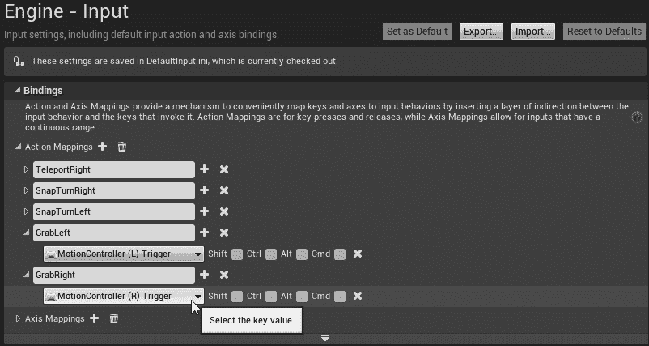

1.  关闭项目设置，返回到`BP_VRPawn`蓝图。

# 添加新的动作映射处理程序

现在我们已经在项目设置中创建了新的输入动作，让我们让我们的角色监听它们：

1.  在你的角色的事件图表中，添加一个 InputAction GrabLeft。

1.  将对 Hand_L 子级角色组件的引用拖动到图表中。

1.  调用`Get Child Actor`。

1.  将子级角色的输出转换为`BP_VRHand`。

1.  从`Cast`节点的 As BP_VRHand 输出拖动一个连接器，并调用`Grab Actor`。你可以在这里调用这个函数，因为我们将它设置为公共的。

1.  从输入动作的 Pressed 输出调用`Cast`节点。

1.  如果转换成功，则调用`Grab Actor`。蓝图编辑器可能会自动为你连接这个：

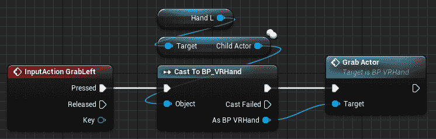

你可以看到我们将输入堆叠在 Cast 节点的顶部。这只是一种视觉组织策略。这通常是一种方便的方式来组织你的节点，以便清楚地表明整个集群实际上只是指一个单一的对象。

1.  拖动一个选框覆盖`Hand_L`节点，它的`Get Child Actor`调用和`Cast`，以选择这三个节点。

1.  右键单击它们，选择折叠为宏。

1.  将新宏命名为`GetHand_L`。

新的宏将自动插入到这些节点最初所在的位置。

1.  按下*Ctrl* + *W*复制宏。

1.  将输入动作的 Released 输出连接到新宏的输入。

1.  在宏的 As BP_VRHand 输出上调用`Release Actor`。

如果我们打开`GetHand_L`宏，我们会看到它包含了我们之前在图表中散落的节点：

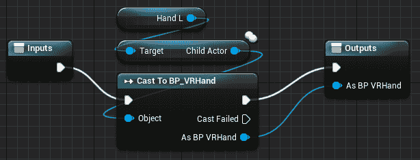

我们可以看到如果转换失败，我们什么都不做，而在这种情况下，这正是我们想要的。如果由于某种原因，`Hand_L`类的子级角色发生了变化或未设置，我们不希望尝试进行任何调用。

重要的是要区分*宏不是函数*。它们看起来像函数，通常可以用来做类似的工作，但宏实际上只是一条指令，告诉蓝图编译器将其内容粘贴到宏出现的图表中。它没有像函数那样存储局部变量的能力。宏非常简单，只是自动复制和粘贴。一些开发人员会建议你完全避免使用宏。如果你对宏与函数的区别不清楚，这绝对是一个好建议，但如果你了解它们的工作原理，它们可以非常有用。作为一个好的经验法则，保持你的宏非常小。如果你在宏中做了很多工作，你实际上是在告诉编译器将大量的节点粘贴到你的图表中，这种情况下它应该是一个函数。将宏视为一种创建可重用节点的简单任务的方式。使用它们可以提高可读性，并使你的代码更容易修改。

现在，让我们为右控制器输入重复这个过程：

1.  从宏列表中选择你的`GetHand_L`宏，并按下*Ctrl* + *W*进行复制。

1.  将新宏命名为`GetHand_R`。

1.  在其中，将`Hand_L`引用替换为对`Hand_R`的引用。

1.  在图表中拖动两个`GetHand_R`实例。

1.  将它们连接到 InputAction GrabRight 节点的 Pressed 和 Released 引脚。

1.  在它们的输出上调用`GrabActor`和`ReleaseActor`，就像之前做的那样。

你的完成的图表应该是这样的：

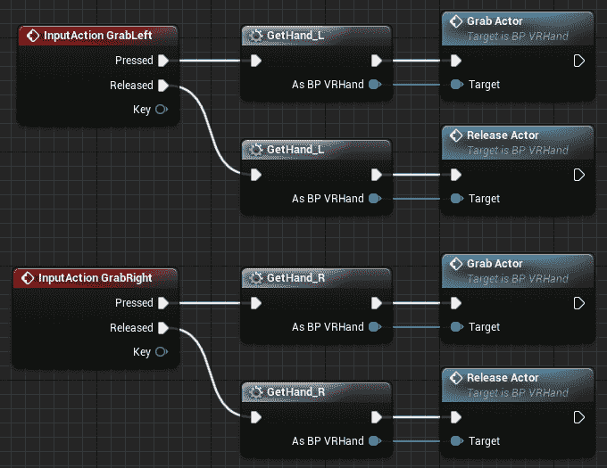

如果你认为我们可以复制我们的 GetMeshForHand 函数并修改它以直接返回`BP_VRHand`引用，那么你是对的。我们也可以直接修改该函数，并将我们在传送函数中进行的 Get HandMesh 调用移出来。通常有很多正确的方法来完成同样的工作。在这种情况下，我们只是做了一个简单的转换，一对宏是保持我们的蓝图可读性的好方法。

让我们进行测试。如果我们做得没错，当我们挤压和释放扳机时，我们现在应该在视图中看到`Grab Actor`和`Release Actor`消息出现。

# 在手部蓝图中实现抓取动画

现在，我们已经设置好了输入并设置好了`VRPawn`以将它们传递给各自的运动控制器，让我们在接收到这些输入时使这些运动控制器进行动画化。

让我们回到我们的`BP_VRHand`蓝图中：

1.  在`BP_VRHand`的变量列表中，添加一个名为`bWantsToGrip`的新布尔变量。

1.  按下*Alt*+拖动`bWantsToGrip`的 setter 到`Grab Actor`函数图中。当调用`Grab Actor`时将其设置为 true。

1.  按下*Alt*+拖动`bWantsToGrip`的 setter 到`Release Actor`中。在这里将其设置为 false：

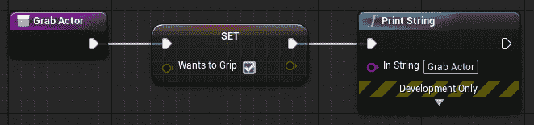

按下*Ctrl*+拖动一个变量会自动创建该变量的 getter。按下*Alt*+拖动一个变量会创建一个 setter。

# 为手部创建一个动画蓝图

虚幻使用动画蓝图来控制骨骼网格上的动画。我们需要一个手部的动画蓝图：

1.  在内容浏览器中，在项目的`Blueprints`目录中右键单击，选择创建高级资产|动画|动画蓝图：

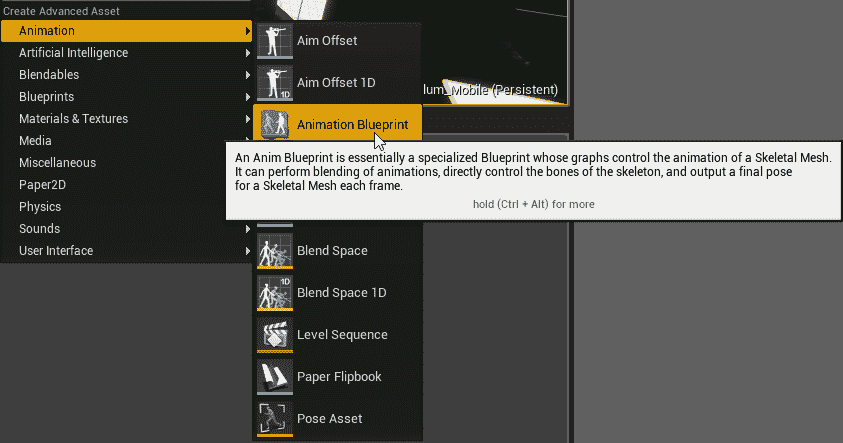

一个对话框将出现，询问动画蓝图的父类和它要控制的目标骨骼：

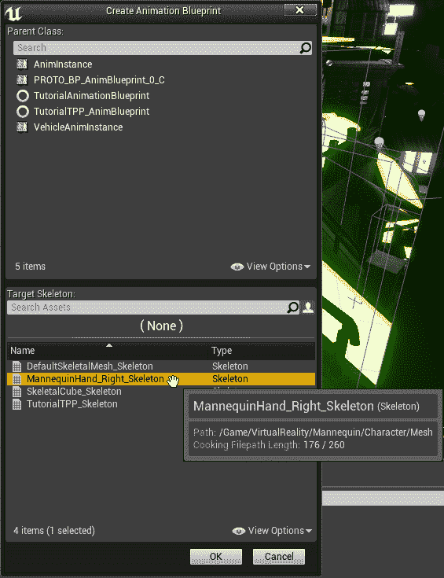

1.  将父类留空，并选择`MannequinHand_Right_Skeleton`作为目标骨骼。

1.  将其命名为`ABP_MannequinHand_Right`。

# 为我们的手部动画创建一个混合空间

现在，我们希望我们的手部动画对这个值做出响应。由于我们希望能够在不同的动画姿势之间平滑混合，我们最好的工具是*混合空间*。

您有两种可用的混合空间类型。有标准的混合空间，可以混合两个不同的轴（这通常用于射击游戏中的瞄准姿势），还有一个更简单的只沿一个轴混合的混合空间。这是我们想要的那个。让我们开始吧：

1.  在`Blueprints`目录中右键单击，选择创建高级资产|动画|1D 混合空间。

1.  一个对话框将出现，询问这个混合空间将应用于哪个骨骼。选择`MannequinHand_Right_Skeleton`。

1.  将其命名为`BS_HandGrip`：

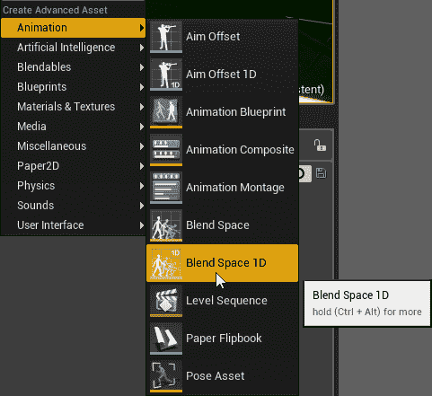

1.  打开我们刚刚创建的混合空间：

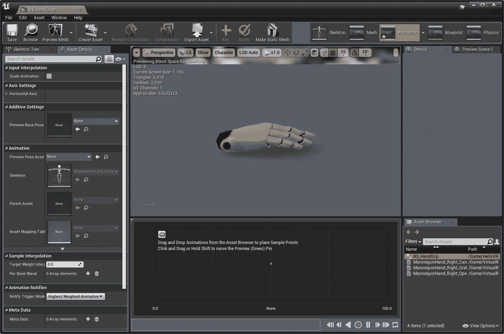

混合空间编辑器由左侧的资产详细信息面板、预览窗口、底部的示例点工作区组成，

和右下角的动画资产浏览器。

在右下角，您可以看到我们从 VR 模板迁移的手部动画列表。它只是显示与手部网格的骨骼映射的任何位于`Content`目录中的动画。

在预览下方的中心位置，我们可以看到我们将构建混合的工作区。

我们需要做的第一件事是设置我们要用于混合的轴。让我们开始吧：

1.  在左上角找到资产详细信息|轴设置，并展开水平轴块。

1.  将其名称设置为`Grip`。

1.  将其最大轴值设置为 1.0。

现在，我们有一个放置动画姿势的地方。

1.  从资源浏览器中，将`MannequinHand_Right_Open`拖放到工作区，直到它与 0.0 网格线对齐。

1.  将`MannequinHand_Right_Grab`拖放到 1.0 线上。

1.  将`MannequinHand_Right_CanGrab`拖放到中间位置，即 0.5。

通过按住*Shift*键并在工作区上拖动来测试它。我们可以通过改变其值在三个动画姿势之间无缝混合，这些姿势应用于 Grip 轴：

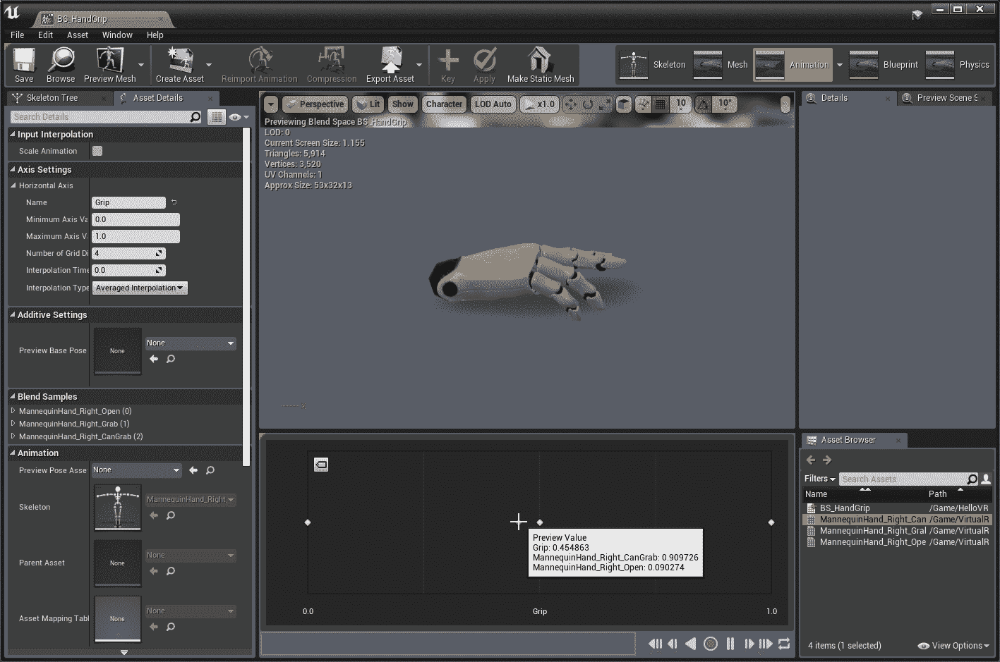

让我们在我们的动画蓝图中使其工作。

# 将混合空间连接到动画蓝图

现在我们可以将刚刚创建的混合空间作为资产在其动画蓝图中使用。动画蓝图是一种强大的工具，可以控制骨骼网格上播放动画的方式。它分为两个主要部分：

+   动画图表接收动画输入并处理它们以计算每帧上的网格姿势

+   事件图表类似于您已经创建的蓝图，并用于处理动画蓝图将用于决定播放哪些动画的数据

让我们学习一下它的工作原理：

1.  打开我们刚刚创建的动画蓝图。

查看其我的蓝图|图表块，您可以看到除了我们所有蓝图资产中都有的熟悉的 EventGraph 之外，还有一个名为 AnimGraph 的第二个图表。

1.  双击我的蓝图|图表|AnimGraph 打开它：

！

**Anim Graph**负责确定每个刻度上其控制的骨骼网格的动画姿势。我们可以看到这里有一个蓝图图表，但它与我们熟悉的事件图表不同。动画图表中的所有内容都导致最终的动画姿势，并用于决定它将是什么。我们不会在这里深入研究动画蓝图，因为它们的设置是一个深入的主题，超出了本书的范围，但它们值得学习。我们的手部动画图表将非常简单。

1.  从内容浏览器中获取我们刚刚创建的`BS_HandGrip`混合空间，并将其拖放到动画图中。

1.  将其动画姿势输出拖动到最终动画姿势节点上的结果动画姿势输入。

1.  从`BS_HandGrip`节点的 Grip 输入拖出一个连接器，并将其提升为变量。将变量命名为`Grip`：

！

1.  将`Grip`变量的滑块范围和值范围的最小值设置为 0，最大值设置为 1。

1.  编译蓝图：

！

在窗口的右下角，您将看到一个 Anim Preview Editor 选项卡。您在动画蓝图中创建的变量将显示在此处，您可以实时更改它们的值以查看它们如何影响动画。（您实际上并没有更改变量的默认值-您只是使用不同的值预览系统的行为。）试试看。将鼠标移到`Grip`值上并拖动它，以在 0.0 和 1.0 之间滑动。您会看到它驱动了我们创建的混合空间，进而驱动了最终的动画姿势。通过改变`Grip`浮点数的值，您可以关闭和打开手。

让我们使其响应用户的输入。

# 将动画蓝图连接到我们的手部蓝图

我们需要告诉`BP_VRHand`角色，`HandMesh`组件应该使用我们的新动画蓝图来驱动其动画状态：

1.  打开`BP_VRHand`并从组件列表中选择`HandMesh`骨骼网格组件。

1.  在其详细信息|动画中，验证其动画模式是否设置为使用动画蓝图。（默认情况下应该是这样。）

1.  使用 Anim Class 下拉菜单选择您的新动画蓝图：

！

现在，让我们驱动刚刚连接的动画蓝图上的 Grip 值。

1.  在`BP_VRHand`的事件图中找到事件 Tick，如果需要的话创建它。

1.  将对`Hand Mesh`的引用拖放到图表中。

1.  从`Hand Mesh`拖动一个连接器，并在其上调用`Get Anim Instance`。

对于由动画蓝图控制的骨骼网格，Anim Instance 将是对该动画蓝图的引用。现在，由于我们需要访问该蓝图的特定成员，我们需要将动画实例转换为我们正在使用的特定动画蓝图类。

1.  从`Get Anim Instance`返回值拖动一个连接器，并将其转换为我们的新动画蓝图类（`ABP_MannequinHand_Right`）。

1.  从 As ABP_Mannequin Hand Right 输出中调用`Set Grip`。

1.  按下*Ctrl* +拖动`bWantsToGrip`到图中以获取其值。

1.  从`bWantsToGrip`拖出一个连接器并创建一个`Select`节点。

1.  将选择节点的返回值连接到 Set Grip 的 Grip 输入。

1.  将选择节点上的 True 值设置为 1.0。

您的图现在应该是这样的：

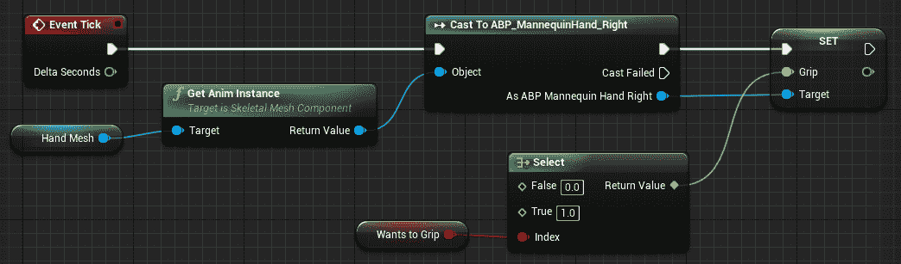

让我们运行并测试一下。好的，很好。我们的手对我们的输入做出了响应。它们看起来还不太好，但我们可以看到基本功能正在工作。当我们在运动控制器上按下扳机时，该输入将`bWantsToGrip`设置为`true`，并且在 VRHand 的 Tick 事件上，我们根据`bWantsToGrip`的当前值将 Grip 变量的值设置为 0.0 或 1.0。

现在，让我们稍微改进一下，并设置系统更加灵活。

# 为我们的抓握创建一个新的枚举器

现在，我们只是直接驱动手的动画蓝图上的`Grip`值，但更合理的做法是让动画蓝图处理这个，并告诉它发生了什么。毕竟，处理动画的系统应该负责决定如何处理它。

让我们为动画蓝图提供一种简单的方式来传达我们的抓握状态。**枚举**非常适合这个：

1.  在蓝图目录中右键单击，选择“创建高级资产|蓝图|枚举”。将其命名为`EGripState`：

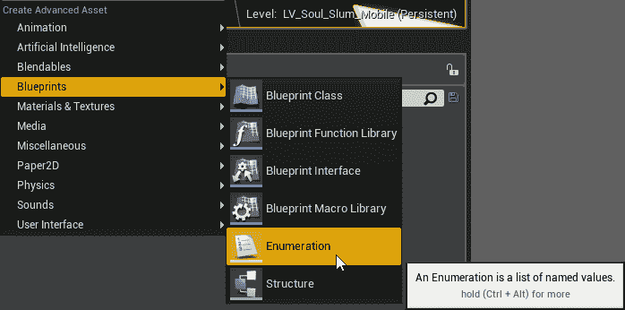

1.  打开新的枚举器。

1.  在枚举器列表中，点击“新建”创建一个新条目。

1.  将新条目的显示名称设置为`Open`。可以将其描述留空：

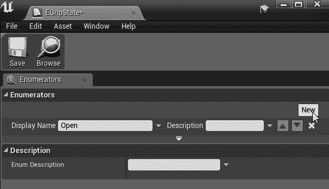

1.  创建另一个枚举器条目，并将其命名为`Gripping`。

1.  关闭枚举器。

现在，我们已经创建了一个新的数据类型，可以用来存储信息并在对象之间传递。让我们将其添加到我们的动画蓝图中。

1.  打开您的动画蓝图并将一个新变量添加到其变量列表中。

1.  将其变量类型设置为`EGripState`，并将其命名为`GripState`。

还记得刚才我们注意到动画蓝图包含两个图表-**动画图**和**事件图**吗？现在，我们将开始使用事件图。这是一个强大的系统。它允许我们将游戏逻辑放在游戏对象中，将动画逻辑放在动画蓝图中。我们可以将一个值传递到动画蓝图中，然后在其事件图中确定我们希望它如何处理该输入。

1.  在动画蓝图的事件图中，找到事件蓝图更新动画节点，如果不存在则创建一个。这相当于动画蓝图中的 tick 事件。

1.  按下*Ctrl* +拖动对新的`Grip State`变量的引用到事件图中。

1.  从其输出拖出一个连接器并创建一个选择节点。

您会注意到，当您从枚举创建选择节点时，它会自动填充该枚举的可用值：

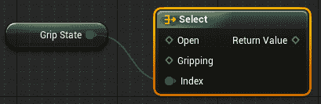

1.  按下*Alt* +拖动对`Grip`变量的引用到图中以创建一个设置器。

1.  将选择节点的输出拖入 Grip 设置器中。

1.  将其 Gripping 值设置为 1.0。

1.  编译蓝图。

1.  在动画预览编辑器中，验证将 Grip State 从 Open 更改为 Gripping 会关闭手：

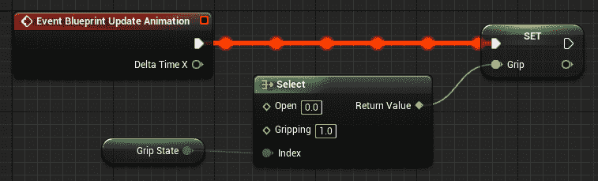

现在，让我们更新`BP_VRHand`，以发送枚举值而不是抓握值：

1.  在 BP_VRHand 的`Event Tick`中，删除`Grip`设置器和馈送它的选择节点。

1.  从`Cast`输出中拖出一个连接器，并选择`Set Grip State`。

1.  从`bWantsToGrip`获取器中拖出一个新的选择节点。

1.  将选择节点的输出拖入`GripState`设置器的输入中。

1.  将选择节点的 True 值设置为`Gripping`。

您的图现在应该是这样的：

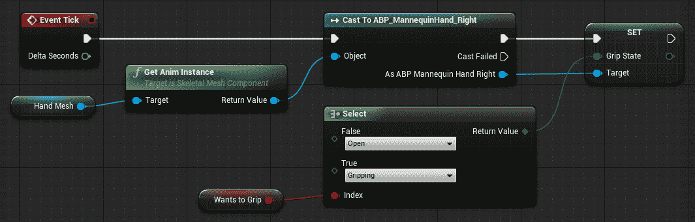

测试一下。没有明显的变化，对吧？我们在这里做的是设置我们的图表，以便我们现在可以更容易地修改它们。既然我们已经验证了新的设置与旧的设置的工作方式相同，让我们回到动画蓝图中，改进我们处理其输入的方式。

# 平滑我们的握持动画

在打开和关闭动画姿势之间的切换看起来很糟糕。让我们通过随时间过渡值之间的变化来平滑处理这个问题：

1.  跳转回动画蓝图的事件图。

1.  右键单击并添加一个`FInterp to Constant`节点。

1.  将您的`Grip`变量拖放到其当前输入上。

1.  将 Grip State Select 节点的输出拖放到其目标输入上。

1.  将`Event Blueprint Update Animation`中的 Delta Time X 值拖放到其 Delta Time 输入上。

1.  从其`Interp Speed`输入中拖出一个连接器，并将其提升为名为`Interp Speed`的变量。

1.  编译蓝图并将`Interp Speed`设置为 7.0。

1.  将`FInterpToConstant`的输出连接到`Grip`设置器的输入：

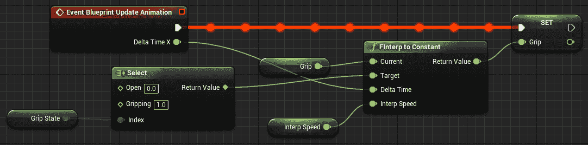

测试一下。好多了。现在，我们的手部在姿势之间进行插值，而不仅仅是跳到该值。这里发生的是 Interp to Constant 节点通过 InterpSpeed 指定的持续时间平滑地过渡到由 Grip State 选择的新目标值。如果我们希望过渡发生得更快，只需减小 Interp Speed。如果我们希望过渡时间更长，只需增大 Interp Speed。

尽管这个例子很简单，但它开始展示了动画蓝图提供的强大和灵活性。我们可以轻松地从 VRHand 蓝图中传递状态信息，告诉动画蓝图我们想要做什么，然后在动画蓝图中以任何我们想要的方式来展示该状态。

# 总结

这是另一个复杂的章节。我们在这里做了很多工作。我们首先创建了一个新项目，并将我们的 VRPawn 蓝图以及所需的对象迁移到新项目中。我们学会了通过将`DefaultInput.ini`的内容复制到新项目中来重新创建输入绑定的快速方法。然后，我们将 Soul:City 资源和地图添加到我们的项目中，并设置了一个导航网格，以便我们可以探索它。

然后，我们进入了本章的重点。我们从 VR 模板项目中回收了一个手部网格，并创建了一个“蓝图”类来驱动它们的行为。我们学会了如何使用构造脚本在编辑器和游戏中创建对象时改变它们。我们学会了如何在我们的角色中创建子级角色组件以及如何在蓝图中使用它们。我们学会了如何创建动画混合空间和动画蓝图来为我们的手部网格添加动画，并学会了如何使用枚举器将状态信息传递到动画蓝图中。

在下一章中，我们将学习如何使用这些手来拾取物体。我们将学习如何使用蓝图接口来启用对各种对象进行函数调用，并学习如何检测我们可以拾取的角色。我们还将学习一些关于使用触觉反馈效果来指示玩家何时与可以拾取的物体接触的知识。
