# 第六章：与虚拟世界交互-第二部分

在上一章中，我们设置了我们的手并学习了如何对它们进行动画。正如我们之前提到的，仅仅这一点就可以代表我们的应用程序建立存在感的重要一步。现在，让我们迈出下一步，开始使用它们。

在本章中，我们将学习以下主题：

+   如何使用蓝图接口为各种蓝图添加功能

+   如何使用附件来拾取和放下物理角色

+   如何指示玩家何时可以与物体交互

+   如何创建触觉反馈效果以提供更多触觉反馈给用户

# 创建一个可以拾取的物体

我们将首先制作一些可以拾取的物体。让我们从一个简单的立方体开始：

1.  在内容浏览器中右键单击项目的`Blueprints`目录，然后选择“Create Basic Asset | Blueprint Class”。

1.  这次，不要选择其中一个常见类作为其父类，而是展开“Pick Parent Class”对话框底部的“All Classes”条目。

1.  选择“Static Mesh Actor”：

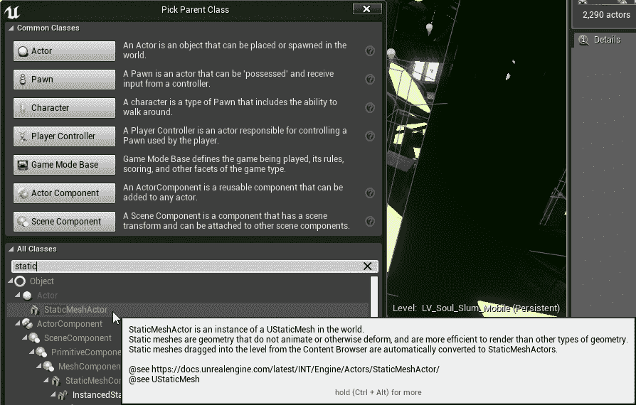

1.  将其命名为`BP_PickupCube`。

1.  打开`BP_PickupCube`。

您可以看到它继承了一个`Static Mesh Component`。

我们也可以创建一个`Actor`蓝图并添加一个`Static Mesh`组件，但是当您构建新资产时，选择适当的父类是一个好习惯。如果不必要，不要重新发明轮子。

1.  将`Static Mesh Component`的“Static Mesh”属性设置为`Engine Content/Basic Shapes/Cube1`。

1.  将其“Scale”设置为`0.2, 0.2, 0.2`。

1.  将其“Materials | Element 0”设置为`Content/SoulCity/Environment/Materials/Props/MI_Glow`。（或者您喜欢的其他任何东西，但这个在地图中很容易看到。）

现在，我们希望立方体模拟物理效果，所以让我们设置一些值来实现这一点：

1.  将其“Physics | Simulate Physics”标志设置为`True`。

1.  将其“Collision | Simulation Generates Hit Events”设置为`True`。

1.  将其“Collision | Generate Overlap Events”设置为`True`。

1.  确保其“Collision | Collision Presets”设置为`PhysicsActor`。（当您将“Simulate Physics”设置为 true 时，这应该会自动设置。）

1.  将其“Collision | Can Ever Affect Navigation”设置为`False`。（这将在“Collision”部分的高级属性中隐藏。）

我们现在创建了一个小的发光立方体，它会自然地对物理作出反应，但在移动世界时不会阻碍我们的导航网格。

现在，我们需要让它具备被拾取的能力。我们可以通过几种方式来实现这一点。我们可以直接在`BP_PickupCube`的蓝图中编写`Pickup`和`Drop`方法，但我们需要能够从外部调用这些函数。

正如我们之前所见，如果您想从蓝图外部调用一个函数，您必须确保您正在与包含该函数的类进行交流，我们通过将引用转换为该类来实现这一点。如果我们只预期拾取立方体，那么这样做就可以了，但是如果我们希望能够轻松拾取其他对象呢？我们不希望每次添加一个新类型的可拾取物体时都要重写我们的`BP_VRHand`蓝图，所以这不是一个很好的解决方案。

我们可以从一个实现了`Pickup`和`Drop`方法的共同父类派生出`BP_PickupCube`，然后将我们的引用转换为该父类。这样做更好，但仍然不完美。`BP_PickupCube`继承自`StaticMeshActor`，但如果我们想让从`SkeletalMeshActor`继承的物体也能被拾取怎么办？在这种情况下，我们没有简单的方法来创建一个共同的父类。

解决这个困境的答案是*蓝图接口*。接口是一个蓝图对象，允许我们定义可以在实现接口的任何对象上调用的函数，无论该对象从哪个类派生。它是一个可以附加到任何对象的类，并且它作为一个承诺，附加到它的对象将实现接口中包含的每个函数。例如，如果我创建一个声明了`Pickup`和`Drop`函数的接口，并将该接口应用于我的`BP_PickupCube`，我可以在不必先转换对象的情况下调用`Pickup`和`Drop`方法。这是一个强大的模式。通过巧妙地使用接口，您可以使您的代码非常灵活和易于扩展。

如果这还不完全清楚，不要担心。一旦我们构建它，它会变得更加清晰。

# 为拾取对象创建一个蓝图接口

要创建一个蓝图接口，请按照给定的步骤进行操作：

1.  在项目的“蓝图”目录中右键单击，选择“创建高级资产|蓝图|蓝图接口”：

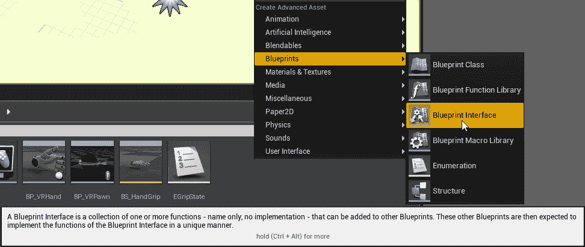

1.  将其命名为`BPI_PickupActor`。

当你打开它时，你会看到它包含一个函数列表，除此之外什么都没有。你会注意到图表无法编辑。这是因为接口只是一个函数列表，附加对象必须实现这些函数，但这些函数不会在接口中编写。

1.  默认情况下，它为您创建了一个新的函数声明。将其命名为`Pickup`。

1.  在函数的详细信息|输入下，添加一个新的输入。将其类型设置为场景组件|对象引用，并将其命名为`AttachTo`：

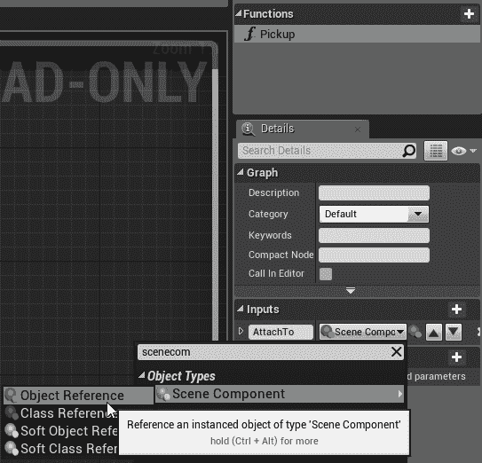

1.  添加另一个函数，并将其命名为`Drop`。这个函数不需要任何输入。

1.  编译、保存并关闭接口。

现在，让我们将这个新接口应用到`BP_PickupCube`上：

1.  打开`BP_PickupCube`，并点击工具栏上的“类设置”项。

1.  在详细信息|接口下，点击“已实现的接口”下的添加按钮。

1.  选择`BPI_PickupActor`。

# 实现拾取和放下函数

现在，我们已经将这个接口添加到`BP_PickupCube`类中，我们可以在事件图中实现我们在该接口中声明的函数。让我们开始吧：

1.  在事件图中，右键单击并选择“事件拾取”来创建一个拾取事件。现在，这个蓝图类上存在这个事件，因为我们附加了一个声明它的接口。你会看到这个事件表明它是来自`BPI_PickupActor`的接口事件。

1.  以相同的方式创建一个`Drop`事件。

现在，我们已经为来自接口的两个事件创建了处理程序，让我们让它们起作用。

当拾取这个物体时，我们希望关闭它的物理模拟，这样它就不会从我们的手中掉下来，并且我们希望将它附加到拾取它的手上的一个场景组件上。

1.  将对“静态网格组件”的引用拖动到事件图中。

1.  调用`Set Simulate Physics`并将 Simulate 设置为`False`。

1.  在图表中右键单击并选择“获取根组件”。

1.  从根组件引用拖动一个连接器，并选择“附加到组件”。你会看到有两个选项。将鼠标悬停在上面并选择那个工具提示为“目标是场景组件”的选项，因为我们将要附加到一个场景组件上：

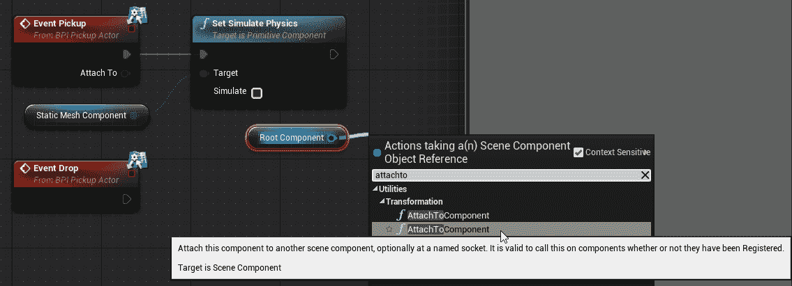

1.  将“事件拾取”的“附加到”输出拖动到“附加到组件”节点上的父级输入。

1.  在“附加到组件”节点上，将位置、旋转和缩放规则设置为“保持世界”，并将焊接模拟体设置为`False`。

您完成的拾取实现应该如下所示：

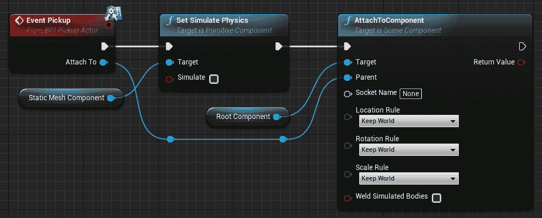

当我们放下这个物体时，我们希望将其物理重新打开并将其从我们拾取时附加的场景组件上分离出来。

1.  选择您的“静态网格组件”引用和`Set Simulate Physics`调用，并按下*Ctrl* + *W*进行复制。

1.  将事件 Drop 引脚的执行连接到复制的`Set Simulate Physics`调用。

1.  将模拟设置为 True，以便我们重新开启物理效果。

1.  右键单击并创建一个`Detach From Actor`节点。

1.  将位置、旋转和缩放规则设置为`Keep World`，就像我们在 Attach 节点上所做的那样。

您完成的 Drop 实现应该如下所示：

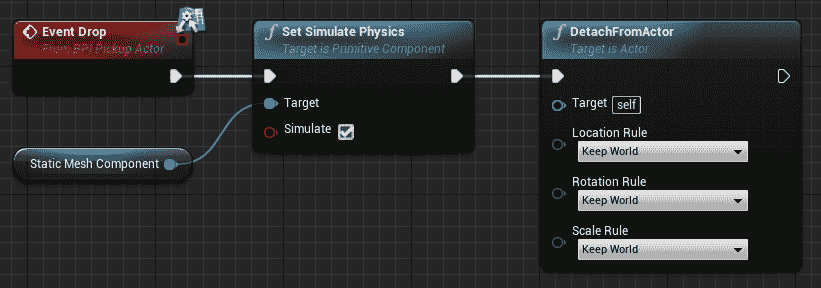

这就是我们的`Pickup Cube`角色的全部内容。我们可以关闭蓝图了。

# 设置 VRHand 以拾取物体

现在，我们准备好抓取这些物体了。

# 创建一个函数来查找最近的可拾取对象

我们需要做的下一件事是找出哪些物体离我们的手足够近，可以被拾取。让我们创建一个函数来完成这个任务：

1.  在`BP_VRHand`中，创建一个名为`FindNearestPickupObject`的新函数。

1.  将其类别设置为`Grabbing`，将其访问限定符设置为`Private`。

1.  在其实现图中，右键单击创建一个`Get All Actors with Interface`节点，并将其接口值设置为`BPI_PickupActor`。

这将为我们提供场景中实现`BPI_PickupActor`接口的每个演员的数组。

1.  从 Out Actors 输出拖出一个连接器并创建一个`For Each Loop`节点：

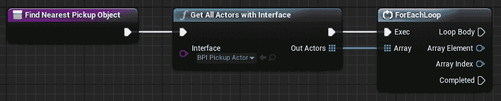

我们将遍历可能被拾取的演员，忽略任何距离太远而无法考虑的演员，然后返回最接近的剩余合格演员。

1.  从`For Each Loop`的 Array Element 输出中拖出一个连接器并调用`Get Actor Location`。

1.  将`Hand Mesh`的引用拖到图表上并调用`Get World Location`。

1.  从数组元素的角色位置中减去手部网格的世界位置：

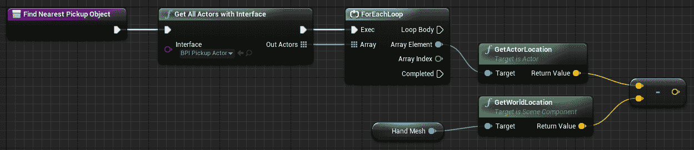

1.  获取结果向量的`Vector Length Squared`。

1.  拖出其结果并选择提升为本地变量。将新变量命名为`LocalCurrentActorDistSquared`：

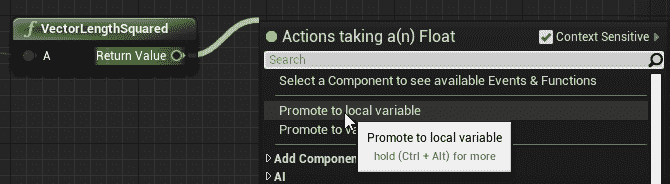

1.  将 Loop Body 执行线连接到本地变量的设置器。

1.  拖动本地变量设置器的输出并创建一个`<=`测试，以查看它是否等于或短于我们要给它的值。

我们在这里创建一个本地变量的原因是，如果在我们的测试半径内有多个可抓取的角色，我们将需要再次使用此值，并且我们不希望浪费时间重新计算距离，因此我们将其存储在这里以便以后使用。

1.  创建一个浮点变量并将其命名为`GrabRadius`。编译蓝图并将其值设置为 32.0。 （稍后，您可以根据自己的感觉调整此值。）

1.  按住 Ctrl 键并将`GrabRadius`拖到图表上。

1.  从其输出拖出一个连接器并对其进行`Square`操作。

1.  将平方的结果连接到`<=`测试的第二个输入：

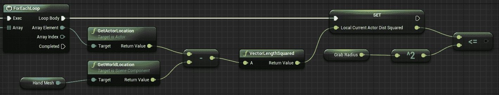

记住，当我们提到实际距离检查很昂贵时？这是一个重要的地方，因为我们将在`Tick`事件上调用此函数。由于我们只想看看演员是否在提供的半径内，但我们不关心它实际上有多远，所以在平方值上进行此测试更便宜。

1.  从我们的`<=`测试的输出创建一个`Branch`节点。

如果我们的演员通过了`<=`测试，我们就知道它在抓取范围内。现在，我们需要看看它是否是该范围内最近的对象。

1.  在本地变量列表中，创建一个名为`ClosestRange`的新的本地变量，并将其变量类型设置为`Float`。将其默认值设置为`10000.0`。

局部变量是仅存在于声明它们的函数中的变量。它们不能从函数外部读取。在函数中使用局部变量来存储仅由该函数使用的值是一个好主意，这样它们不会混乱周围的对象。局部变量在每次运行函数时都会重置为其默认值，因此您不必担心来自先前函数调用的奇怪值。

1.  按住 Ctrl 键并将`LocalCurrentActorDistSquared`拖动到图表上以获取其值。

1.  从其输出处拖动一个连接器，并从中创建一个`<`测试。

1.  将`Closest Range`局部变量拖动到测试的第二个输入中。

1.  使用`<`测试结果创建一个 Branch：

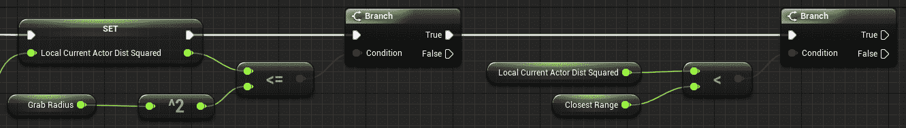

如果此测试返回 true，则表示我们找到了一个新的最近演员。我们想保存对它的引用并将其距离记录为新的最近距离。

1.  按住 Alt 键并将`Closest Range`拖动到图表上，并将`LocalCurrentActorDistSquared`拖动到其输入中。

1.  从分支的 True 输出中设置此值。

1.  创建一个名为`NearestPickupActor`的新的局部变量，并将其类型设置为 Actor | Object Reference。

1.  按住 Alt 键并将其拖动到图表上以设置其值。

1.  将其值设置为`For Each Loop`的 Array Element。（这将是一个很长的连接。考虑创建一些重定向节点以使其更易读。）

1.  将其连接到`Set Closest Range`节点的输出：

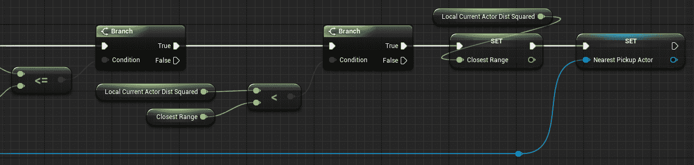

最后，一旦我们遍历了所有可能的对象并找到了最佳的可拾取候选对象（如果存在），我们希望保存该值，以便我们的拾取方法可以使用它。

1.  创建一个新的变量（这次不是局部变量 - 我们希望在外部读取此值），命名为`AvailablePickupActor`，并将其类型设置为`Actor > Object Reference`。

1.  按住 Alt 键并将其拖动到`For Each Loop`的 Completed 输出附近的事件图上。

1.  将`For Each Loop`的 Completed 输出连接到`Available Pickup Actor`的 Set 输入。

1.  将`Nearest Pickup Actor`局部变量拖动到 setter 的输入中：

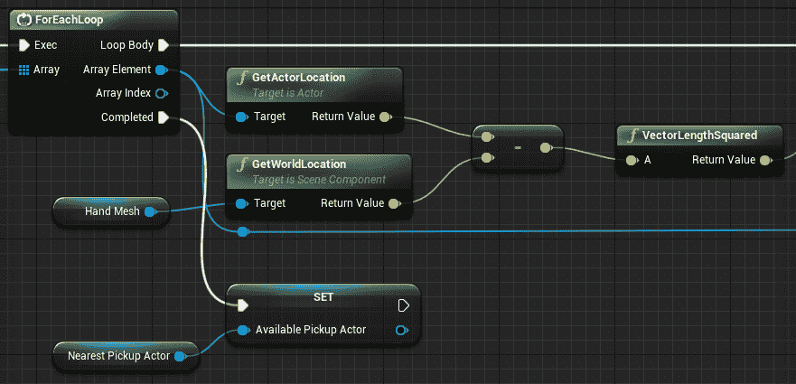

这样做的目的是将一个可外部读取的`Available Pickup Actor`变量设置为我们在遍历可能的演员列表时找到的演员（如果有的话）。如果我们没有找到任何演员，那么`Nearest Pickup Actor`将为`Null`。

# 在 Tick 事件上调用 Find Nearest Pickup Object

现在，是时候调用我们的新函数了，以便我们知道何时能够拾取一个对象。然而，如果我们已经拿着一个对象，我们不希望这样做，所以我们应该存储对任何我们已经拿着的对象的引用。让我们开始吧：

1.  返回到`BP_VRHand`的事件图中，找到`Event Tick`。

1.  在`Event Tick`附近创建一个`Sequence`节点。

1.  我们希望在查找可以抓取的对象之后才更新手部动画，因此按住 Ctrl 键并将来自“Event Tick”的执行引脚的输出拖动到 Sequence 节点的 Then 1 输出上。

1.  将“Event Tick”的执行引脚连接到 Sequence 节点的输入。

1.  选择与 Sequence 节点的 Then 1 输出连接的节点网络，并将它们拖动到下方，以便有足够的空间进行操作：

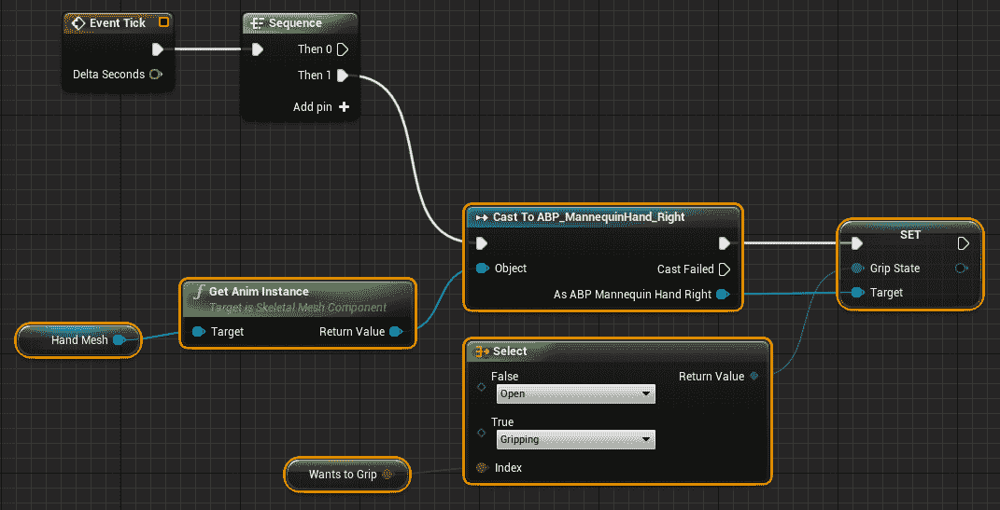

1.  创建一个新的变量，命名为`HeldActor`，并将其变量类型设置为`Actor > Object Reference`。

1.  按住 Ctrl 键并将`HeldActor`拖动到事件图中以获取其值。

1.  右键单击它并选择`Convert to Validated Get`。

1.  将一个调用 Find Nearest Pickup Object 的节点拖动到图表上，并从 Held Actor getter 的 Is Not Valid 输出中调用它：

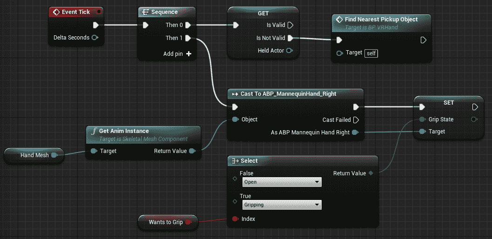

这样，只有在我们还没有拿起一个对象时，我们才会检查可拾取的演员。

# 拾取一个演员

现在我们正在寻找可以拾取的演员，让我们在尝试抓取它们时实现这一点。让我们开始吧：

1.  打开`BP_VRHand`中的`Grab Actor`函数。

1.  我们不再需要这里的`Print String`节点，所以我们可以将其删除。

1.  按住*Ctrl*并将`HeldActor`的 getter 拖动到图表上，右键单击它，并将其转换为已验证的获取。

1.  将`bWantsToGrip`setter 的执行输出连接到`HeldActor`getter 的输入。

1.  按住*Ctrl*并将`AvailablePickupActor`的 getter 拖动到图表上，并将其也设置为已验证的获取。

1.  将`Held Actor`获取的 Is Not Valid 输出连接到此 getter 的输入，因为我们只对如果我们还没有拿着物体感兴趣。

1.  从`Available Pickup Actor`拖出一个连接器并调用`Pickup (Message)`：

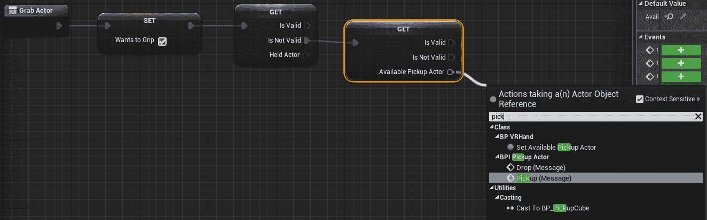

这就是为什么蓝图接口如此有用。我们不需要将拾取角色强制转换为任何特定的类来调用接口方法。我们只需进行调用，如果对象实现了接口并知道如何处理它，调用将起作用。如果对象没有实现接口，它将什么也不做。

如果您需要找出给定的角色是否实现了一个接口，请在其上调用`Does Implement Interface`。如果在对象上找到接口，它将返回 true。在这种特殊情况下，进行此调用将是多余的，因为我们知道`Available Pickup Actor`将始终实现 BPI_PickupActor 接口。当我们在`Find Nearest Pickup Object`函数中查找对象时，我们使用该接口作为过滤器。

1.  将 Motion Controller 组件拖动到您的 Pickup 节点的 Attach To 输入上。

1.  将`Held Actor`变量拖动到`Available Pickup Actor`的输出上，将其设置为该值。

1.  将“返回节点”添加到您的退出点。(您不必这样做，但是如果您养成这个习惯，您的代码在长期运行中将更易读。)

您完成的`Grab Actor`图应如下所示：

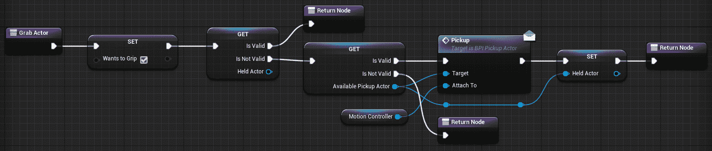

总结一下这里发生的情况，当调用`Grab Actor`时，将`bWantsToGrip`设置为 true，然后我们检查是否已经拿着一个物体。如果是，我们不做任何其他操作。如果不是，我们检查是否在`Event Tick`上找到了一个我们可以拾取的对象。如果没有，就没有其他事情要做。如果找到了，我们通过其接口向其发送`Pickup`消息，其中包含对我们的`Motion Controller`组件的引用作为它应该附加到的对象，并将其存储为我们的`Held Actor`。

# 释放一个角色

由于我们现在可以拾取一个角色，我们也希望能够再次放下它。现在让我们来做这个：

1.  打开`Release Actor`函数。

1.  从中删除`Print String`节点-我们已经完成了它。

1.  按住*Ctrl*并将`Held Actor`拖动到图表上，右键单击它，并将其转换为已验证的获取。

1.  在设置`bWantsToGrip`之后调用已验证的获取。

1.  将返回节点连接到其 Is Not Valid 输出：

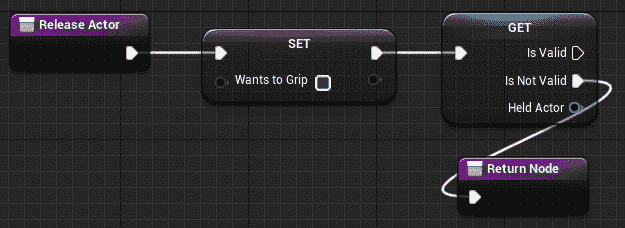

如果我们没有拿着任何东西，我们不需要做任何其他操作。如果我们拿着东西，我们应该确保演员仍然认为我们是拿着它的人(因为我们可能用另一只手抓住它)，如果它仍然是我们的对象，就将其放下。

1.  从`Held Actor`拖出一个连接器并获取其`Root Component`。

1.  在根组件上调用`Get Attach Parent`。

1.  从`Get Attach Parent`的“Return Value”拖出一个连接器并创建一个`==`测试。

1.  将`Motion Controller`组件拖动到测试的另一个输入上。

1.  使用此测试的结果创建一个`Branch`作为其条件：

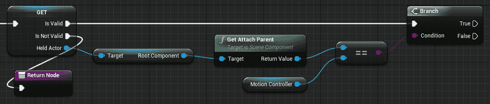

1.  从分支的 True 输出中，调用`Drop`在`Held Actor`上。

1.  按住*Alt*并将`Held Actor`拖动到图表上以创建一个 setter。

1.  将其连接到`Drop`调用的执行输出和`Branch`节点的 False 输出，以便在任何情况下都清除该值：

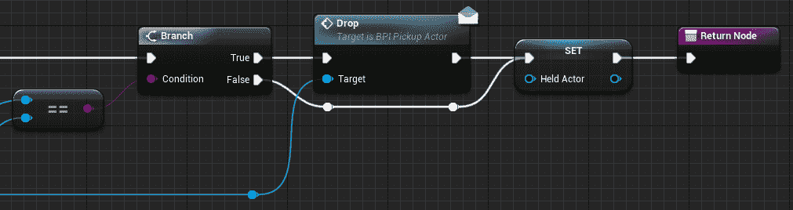

您完成的图应如下所示：

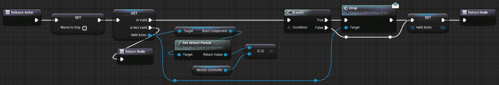

简要回顾一下这里发生的情况，当调用`Release Actor`时，我们首先将`bWantsToGrip`设置为 false。然后，我们检查是否正在拿着任何东西。如果没有，就没有其他事情要做了。如果我们认为我们正在拿着某个东西，我们检查一下我们认为我们正在拿着的物体是否仍然将我们的动作控制器视为其父级，因为我们可能用另一只手抓住它。如果我们真的拿着这个物体，我们就放下它并清除`Held Actor`变量。如果事实证明我们不再拿着这个物体，我们清除`Held Actor`变量，这样我们就不再认为我们在拿着它了。

# 测试抓取和释放

让我们在地图中测试一下：

1.  从编辑器的模式面板中，选择“放置|基本|立方体”，并将其拖入场景中。将其位置设置为 X=-2580，Y=310，Z=40，以便它位于玩家起始点附近。

1.  从内容浏览器中选择`BP_PickupCube`，并将其放置在刚刚放置的立方体上。您可以使用*End*键将其放到下面的表面上。（`X=-2600，Y=340，Z=100`可能是一个不错的位置。）

1.  按住 Alt 键并拖动更多的`BP_PickupCubes`并将它们堆叠在立方体上：

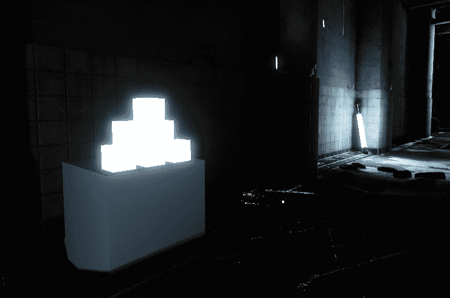

启动 VR 预览。走到立方体上的物体旁边，使用扳机来拾取、放下、扔掉和手到手移动它们。

还不错，但是这里有几个问题需要修复。

# 修复立方体碰撞

首先，最重要的是，它们与 VRPawn 的碰撞胶囊发生碰撞并将我们推开。我们最好修复一下：

1.  打开`BP_PickupCube`蓝图并选择其`Static Mesh Component`。

1.  在其详细信息|碰撞下，将其碰撞预设从`PhysicsActor`更改为`Custom`。

1.  这个对象的个别碰撞响应通道现在可以编辑了。将 Pawn 的碰撞响应设置为`Overlap`而不是`Block`：

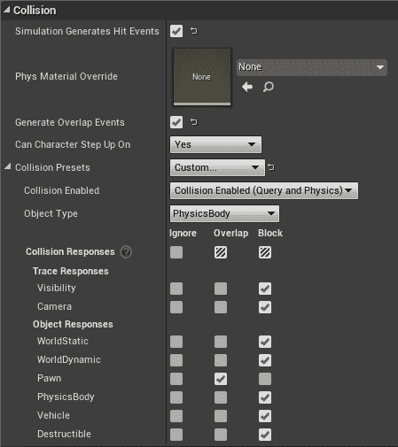

这样，我们仍然可以检测到与 Pawn 的碰撞，如果我们对它们感兴趣的话，但它们不会阻止玩家四处移动。

# 让玩家知道何时可以拾取物品

其次，我们没有给玩家任何视觉提示，告诉他们他们可以拾取物品。让我们改进一下。

首先，让我们向我们的`EGripState`枚举器添加另一个状态：

1.  打开项目的“蓝图”目录中的`EGripState`。

1.  在其枚举器列表下，点击“新建”以添加另一个条目。将其命名为`CanGrab`。

1.  关闭并保存它。

现在，我们需要告诉我们的动画蓝图该怎么做。

1.  打开`ABP_MannequinHand_Right`动画蓝图并打开其“事件图表”。

1.  在“事件蓝图更新动画”下，您会看到`Grip State``Select`节点已自动更新以反映我们添加的新的`Can Grab`枚举器。将其值设置为`0.5`：

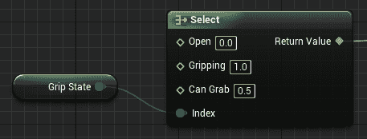

通过编译并在动画预览编辑器中更改 Grip State 来尝试一下。当 Grip State 设置为`Can Grab`时，手应该处于半开状态。

1.  保存并关闭动画蓝图。

接下来，我们需要让`BP_VRHand`蓝图在检测到玩家可以抓取物体时将`Grip State`设置为`Can Grab`。让我们创建一个纯函数来确定我们的`Grip State`应该是什么。

1.  打开`BP_VRHand`的“事件图表”并找到“事件 Tick”。

1.  选择`bWantsToGrip`引用和与其连接的`Select`节点，并将它们折叠成一个函数。

1.  将函数命名为`DetermineGripState`，将其类别设置为“Grabbing”，将其访问限定符设置为“Private”，将纯度设置为“True”：

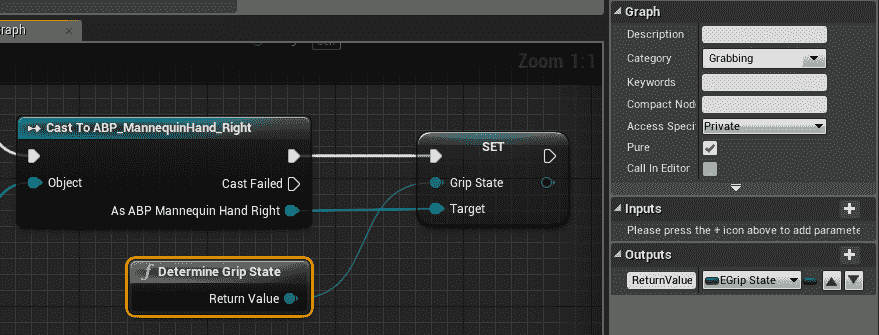

1.  打开`DetermineGripState`。

1.  按住 Ctrl 键并将`Held Actor`拖到图表中，并将其转换为已验证的获取。

1.  将其连接到函数输入并从其 IsValid 输出添加一个新的`Return Node`。

1.  将此节点的返回值设置为`Gripping`：

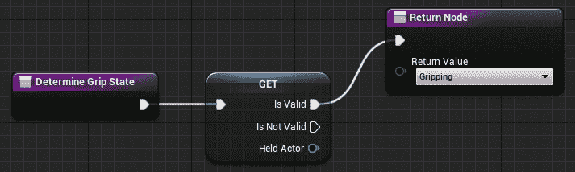

如果我们拿着一个物体，我们不会关心其他任何事情-我们只需要将其动画化到抓握状态。

1.  在图表中添加一个“分支”节点。

1.  将`bWantsToGrip`的值拖动到其条件中。

1.  将其 True 分支连接到我们刚刚创建的`Gripping`“返回节点”。

1.  按住 Ctrl 键并将`AvailablePickupActor`拖动到图表中，并将其转换为已验证的获取。

1.  在其“合法”输出上添加另一个连接到“返回节点”，并将其返回值设置为`Can Grab`。

1.  在其“不合法”输出中添加另一个“返回节点”，其值为 Open：

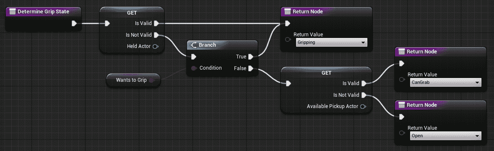

让我们来测试一下。现在，当检测到可以抓取的物体时，您应该看到手的姿势发生变化。

# 添加触觉反馈

还有一件事情我们应该做的是，在玩家与物体接触时为手部添加一些反馈。这可能看起来像是一件小事，但实际上对于唤起存在感的过程非常重要。目前我们没有太多的方法来模拟物理感觉，但是任何与事件或动作配对的感觉都可以在很大程度上使虚拟世界感觉不那么“虚幻”而更加真实。

让我们学习如何为我们的控制器添加一点震动。

# 创建触觉反馈效果曲线

首先，我们需要创建要播放的触觉效果：

1.  在项目的“蓝图”目录中右键单击，选择“创建高级资产”|“杂项”|“触觉反馈效果曲线”：

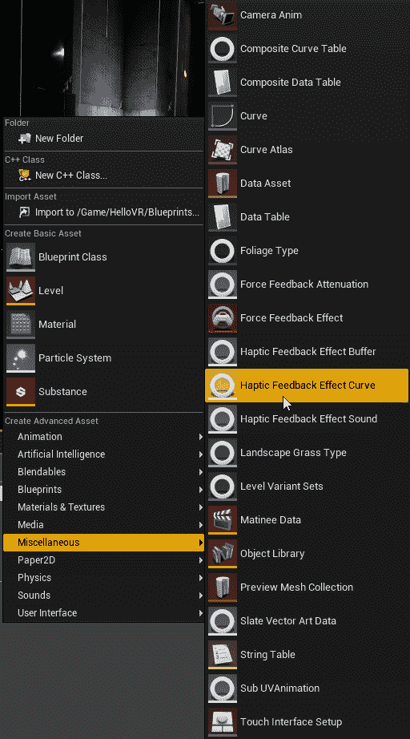

1.  将其命名为`FX_ControllerRumble`。

1.  打开刚刚创建的触觉反馈效果曲线。

您会看到在触觉反馈效果|触觉详情下有两个曲线：频率和振幅。我们将在这里创建一个非常简单的效果，但是通过尝试这些曲线并找出如何创建令人信服的反馈效果是非常值得的。

1.  右键单击频率曲线的时间轴附近的 0.0 时间，并选择“添加关键帧到无”。

1.  将其时间和值设置修正为每个都为`0.0`：

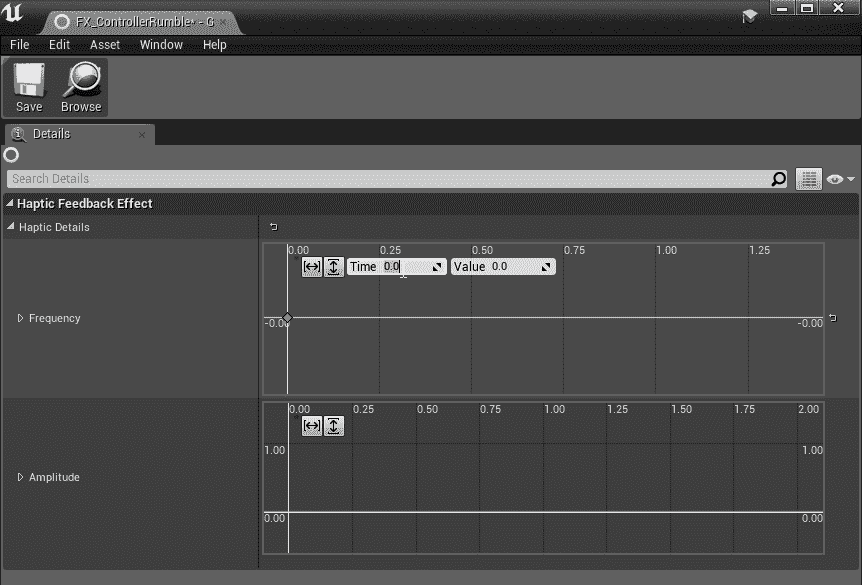

1.  再次右键单击时间轴，添加另一个关键帧。将此关键帧的时间设置为`0.5`，值设置为`1.0`。

1.  在曲线上创建第三个关键帧，时间为`1.0`，值为`0.0`。

1.  为振幅曲线创建相同的三个关键帧：

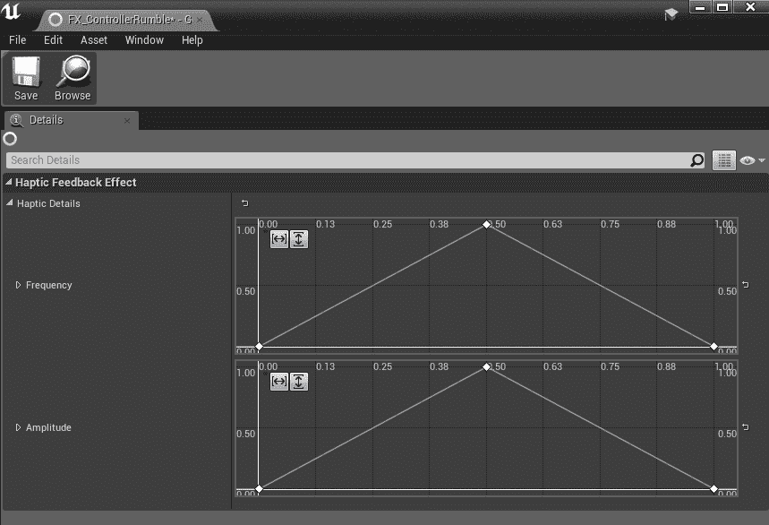

您完成的曲线应该看起来像前面的截图所示。

1.  保存并关闭新的触觉效果曲线。

# 按命令播放触觉效果

现在我们已经创建了一个触觉反馈效果曲线，让我们设置一个播放它的方法：

1.  打开`BP_VRHand`的事件图表，右键单击。选择“添加事件”|“添加自定义事件”。将新事件命名为`RumbleController`。

1.  为此事件创建一个输入。将其命名为`Intensity`，并将其类型设置为`Float`。

1.  右键单击并创建一个“获取玩家控制器”节点。

1.  从`GetPlayerController`拖动连接器并创建一个“播放触觉效果”节点。

1.  选择刚刚创建的触觉效果。

1.  将`Hand`变量拖动到 Hand 输入中。

1.  将事件的强度输出拖动到比例输入中：

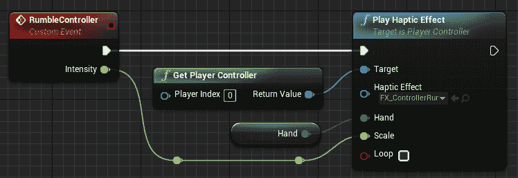

现在，每当我们接触到一个新的可拾取物体时，让我们调用这个触觉效果。

1.  打开`BP_VRHand`的“查找最近的拾取物体”函数。

看到我们在`Available Pickup Actor`中设置为`Nearest Pickup Actor`中找到的值吗？让我们在放入新值时检测到，并在发生时触发效果。

1.  右键单击`Nearest Pickup Actor`获取器，并将其转换为已验证的获取。

1.  按住 Ctrl 键并将执行输入拖动到`Set Available Pickup Actor`上，然后将其放在`Get Nearest Pickup Actor`获取器的执行输入上。

1.  从“最近的拾取物体”获取器的值拖动连接器，并创建一个“！=”（不等于）节点。

1.  从变量列表中将对`Available Pickup Actor`的引用拖动到“不等于”节点的另一个输入中。

1.  从其输出创建一个“分支”。

1.  将`Nearest Pickup Actor`的 Is Valid 执行引脚拖动到`Branch`输入中。

1.  从其 True 输出调用`Rumble Controller`并将其强度设置为`0.8`。

1.  将`Rumble Controller`的输出拖动到`Available Pickup Actor`的输入中。

1.  将`Nearest Pickup Actor`的 Is Not Valid 输出拖动到`Available Pickup Actor`的 setter 中。

1.  在`Set Available Pickup Actor`之后和`Not Equal`测试的`False`分支之后添加返回节点：

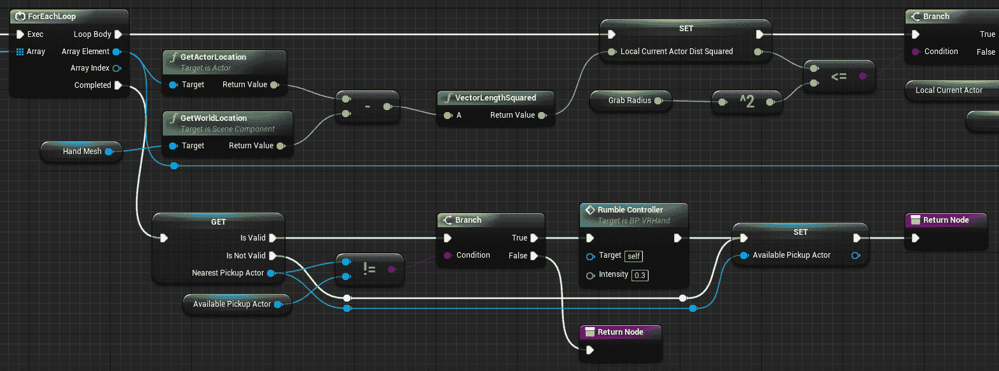

简要回顾一下这里发生的情况，一旦我们完成了对可能拾取的对象的迭代，我们需要检查是否找到了一个对象。如果没有找到，我们只需将`Available Pickup Actor`设置为 null 值，以便在先前包含值的情况下清除它。如果我们找到了一个可以拾取的对象，我们检查它是否与当前的`Available Pickup Actor`不同。如果是，我们在设置`Available Pickup Actor`为新值之前会使控制器震动。

# 进一步

我们可以进一步改进我们在这里所做的几种方法：

+   首先，通过距离检测可抓取对象会给我们带来模糊的结果。它没有考虑到对象的大小。使用一个球体来代表我们的抓取手，并针对该球体进行重叠测试将给我们更准确的结果。如果您想重构此代码以使用该方法，VR 模板项目中包含一个很好的示例。

+   其次，我们的触觉反馈效果感觉不够明显。它均匀地淡入淡出，并没有提供太多的物理感觉。通过编辑这些曲线以提供更锐利的攻击可以使效果更加令人信服。

# 总结

本章继续上一章的内容，让我们有机会开始拾取物体。我们学会了如何使用蓝图接口来使各种对象能够进行函数调用，以及如何检测我们可以拾取的演员并使用附件来拾取和放下它们。最后，我们还学会了如何创建触觉反馈效果，以指示玩家何时与可以拾取的对象接触。

正如我们在上一章的开头提到的，手的存在是 VR 中产生整体存在感的重要因素。在现实生活中，我们始终意识到自己的手，将它们带入虚拟世界也会让我们在空间中感到存在。此外，直接使用手来操纵物体的能力是我们在 VR 中可以做的关键事情之一，而在其他任何媒介中都无法做到。 （要了解这一点的一个例子，请查看**EntroPi Games**的*Vinyl Reality*（[`vinyl-reality.com/`](https://vinyl-reality.com/)），然后想象一下尝试使用游戏手柄或键盘做同样的事情。）手在 VR 中非常重要，它们是 VR 的独特之处。在您的应用程序中花时间将它们处理正确。

在下一章中，我们将学习如何在 VR 中创建用户界面以显示信息，并使用户能够在 3D 空间中进行交互。
