# 第八章：构建世界并针对 VR 进行优化

在本书迄今为止的工作过程中，我们大部分时间都专注于玩家角色。这是有道理的-虚拟现实极大地改变了玩家与世界互动的方式。我们需要学习新的方法来让玩家四处移动，使用手来与世界互动，以及构建用户界面的新方法。

这是一项不小的成就，所以恭喜你走到了这一步！

现在，我们要稍微改变一下焦点，开始关注我们周围的环境。到目前为止，我们一直在使用现有的环境，但现在是时候开始建立我们自己的环境了。在这个过程中，我们将会发现 VR 环境带来了一些需要解决的挑战。光照、物体比例和视线都比平面屏幕更重要，并且性能是一个重要考虑因素。

在本章中，我们将学习如何利用我们手头的工具和技术来解决这些挑战。我们将学习如何使用 VR 编辑器在头戴式显示器中布置环境，并在构建过程中实际查看其在 VR 中的外观，还将学习如何对这些环境进行性能分析和优化，以确保我们能够满足帧率要求。

在本章中，我们将探讨以下主题：

+   使用 VR 编辑器构建和照明场景

+   对场景进行性能分析以识别瓶颈

+   使用静态网格实例化、LOD、网格组合和光照更改来优化场景

+   优化的项目设置

+   移动 VR 的特殊考虑和技术要求

让我们开始吧，给自己一个玩耍的地方。

# 设置项目并收集资产

对于本章的工作，让我们使用以下模板选项创建一个新项目：

+   一个空白的蓝图模板

+   针对移动/平板硬件进行优化

+   可扩展的 2D 或 3D

+   没有起始内容

创建项目后，打开其项目设置并设置以下菜单选项：

+   项目 | 描述 | 设置 | 在 VR 中启动：True

+   引擎 | 渲染 | 正向渲染器 | 正向着色：True

+   引擎 | 渲染 | 默认设置 | 环境遮蔽静态分数：False

+   引擎 | 渲染 | 默认设置 | 抗锯齿方法：MSAA

+   引擎 | 渲染 | VR | 实例化立体声：True

+   引擎 | 渲染 | VR | 循环轮询遮挡查询：True

在设置完所有这些设置后，允许项目重新启动。

项目重新启动后，打开文件菜单并使用它加载上一章的项目。就像上次一样，我们将使用迁移工具获取之前创建的元素并将它们带入新项目中。

# 将蓝图迁移到新项目中

从之前的项目中，选择内容资源管理器中的 BP_VRGameMode，右键点击它，选择资源操作 | 迁移。将你的新项目的`Content`目录作为目标内容文件夹。因为 GameMode 引用了 BP_VRPawn，而 BP_VRPawn 引用了 BP_CompanionCharacter，所有这些对象及其所需的支持资产都应该被迁移过来。

迁移完成后，还有一件事情需要做。我们在之前的项目中设置了一些自定义输入，我们在新项目中也需要它们。导航到上一章的项目目录，并将`Config/DefaultInput.ini`文件复制到新项目的配置目录中。

# 验证迁移的内容

重新打开新项目。这里我们要做的第一件事是验证我们带入的所有内容是否正常工作：

1.  选择文件 | 新建关卡 | VR 基础，创建一个起始的 VR 地图。

1.  将一个导航网格边界体放置在地图上，并确保它围绕着地板。将其位置设置为(X=0.0，Y=0.0，Z=0.0)，将其缩放设置为(X=10.0，Y=10.0，Z=2.0)即可。记得按下“P”键来可视化你的导航网格，并确保它正常生成。

1.  保存这个关卡（我们将其命名为 VRModePractice，并放置在`Content/C07/Maps`中）。

1.  打开设置|项目设置|地图和模式|默认模式，并将默认游戏模式设置为我们从其他项目迁移的 BP_VRGameMode。将编辑器启动地图和游戏默认地图也设置为这个地图。

1.  在关卡上放置一个 BP_CompanionCharacter 的实例。

在 VR 预览中测试地图。你应该能够移动和传送，你的伴侣角色应该跟随你：

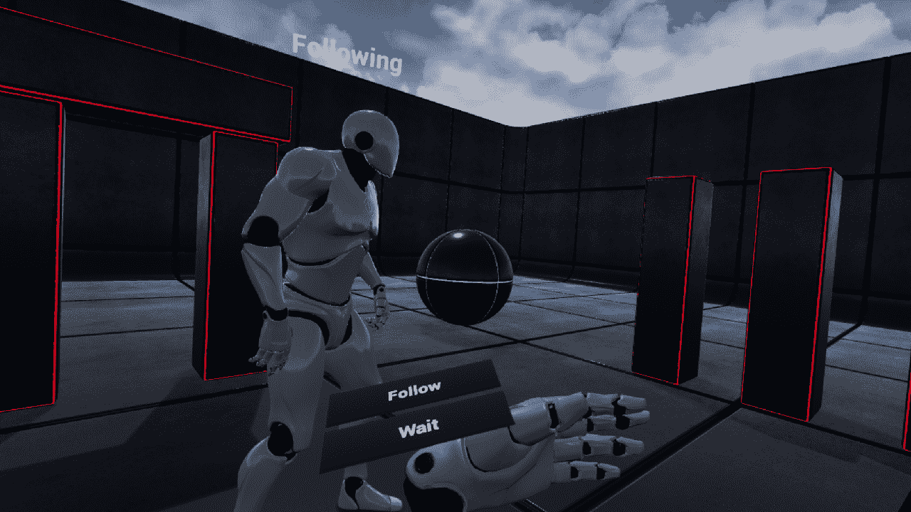

这张地图非常适合用于学习虚幻编辑器的 VR 模式-它易于操作，并且提供了许多我们可以在界面上练习时操作的部件。让我们充分利用它。

# 使用 VR 编辑器

虚幻引擎配备了一个非常强大的虚拟现实编辑器，可以让你完全在虚拟环境中构建场景。几乎任何你可能需要执行的编辑操作都可以在不离开 VR 的情况下完成。

然而，当你第一次遇到 VR 模式编辑器时，可能会认为它只是一个花招。毕竟，现有的编辑器有什么问题呢？没有问题，但是这里有一点需要注意：虚拟现实不是一个平面屏幕。深度是存在的。视线是不同的。颜色的渲染也不同。通过使用平面屏幕进行虚拟现实开发会给你的设计过程增加一层抽象。当你能够直接在目标媒介中工作时，你会更加了解并获得更好的结果。

在实践中，你可能会发现两种编辑模式都很有用。就像在平面屏幕编辑器视图中很难看清楚一个场景在 VR 中的真实样子一样，在 VR 模式下放置物体时很难达到精确。当你熟悉工具时，你会发现自己的工作流程，并发现你更喜欢在哪个领域进行哪些操作。然而，这里的重点是，将 VR 模式视为 VR 场景布局工作流程的重要组成部分是值得的。花时间熟悉它，这样当需要时就可以依赖它。

VR 编辑的一个好的实践是在 VR 中进行初始的块状布局。以一种能够传达你想要表达的空间感的方式放置物体，然后转到传统的平面编辑来进一步完善你的布局并填充它。最后，返回到 VR 编辑中进行最后的调整，这样你就可以清楚地看到你将要得到的结果。

让我们激活 VR 编辑器，看看我们可以用它做些什么。由于你在戴头盔时无法阅读这本书，我们将介绍一些基本原则，让你尝试一下，然后再回到这里探索更多内容。

首先要知道的是如何进入和退出 VR 编辑器。

# 进入和退出 VR 模式

你可以通过使用 VR 模式工具栏按钮来激活 VR 编辑器。要退出 VR 模式，请激活径向菜单（稍后会详细介绍）并选择“系统|退出”。不过，最简单的方法是习惯使用*Alt* + *V*来进入和退出 VR 模式：

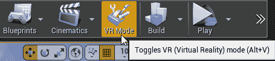

还可以将 VR 模式配置为在编辑器运行时自动进入头戴式显示器时自动进入。要做到这一点，选择“编辑|编辑器首选项|常规|VR 模式”，并将“启用 VR 模式自动进入”设置为 True。是否这样做取决于你的选择，但是在实践中，它往往很难确定何时关闭自身，因此使用*Alt* + *V*进入和退出通常是一个更好的主意。

如果你更喜欢使用左手进行交互，你可以在 VR 模式首选项中选择此选项：

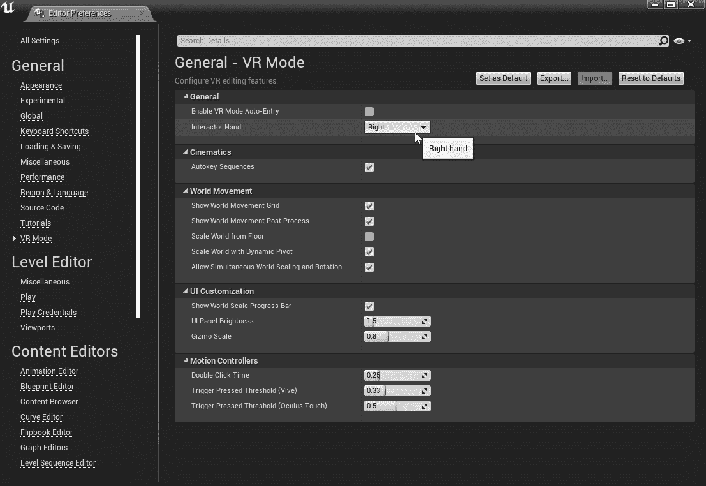

VR 模式的设置可以在“编辑”|“编辑器首选项”|“常规”|“VR 模式”下找到。

如果你愿意，可以设置其中任何一个选项。我们将保留这些选项的默认设置。

我们还需要解决的另一件事是如何移动和观察周围。

# 在 VR 模式下导航

在 VR 编辑器中，通过挤压握持按钮来激活移动模式。当移动模式激活时，移动网格将出现，交互光束将变为绿色。

VR 编辑器中的交互光束会改变颜色以指示其所处的模式。红色表示标准交互模式，绿色表示移动模式，黄色表示你当前选择了一个角色，蓝色表示你处于 UI 交互模式。

在 VR 编辑器中，移动的隐喻是**推动**和**拉动**世界。这是相当直观的。在大多数情况下，当你的移动模式处于活动状态时，世界会按照你的手的移动方式移动。

# 在世界中移动

如果你在握持按钮的同时移动控制器，世界会移动，就像你在拉动它，或者在其中游泳一样：

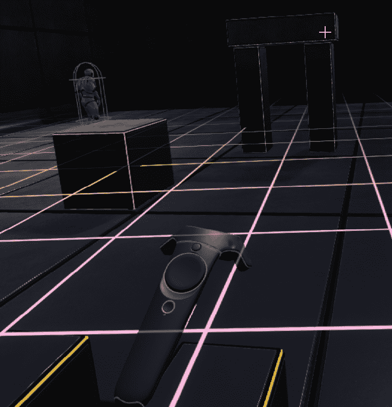

如果你在移动控制器时松开握持按钮，移动会继续一段时间，就像你从一个物体上推开并且现在漂离它一样。这需要一些练习，但一旦你掌握了它，它就会变得相当直观。再次挤压握持按钮会停止你的移动。

移动网格显示了你真实世界跟踪体积中地板的位置。将其与场景中的地板对齐，以查看从站在地板上的人的视角看物体的真实样子。

# 通过世界传送

要通过世界传送，挤压你主手控制器上的握持按钮并按下扳机。将控制器对准一个物体或目的地，释放时你将传送到那里：

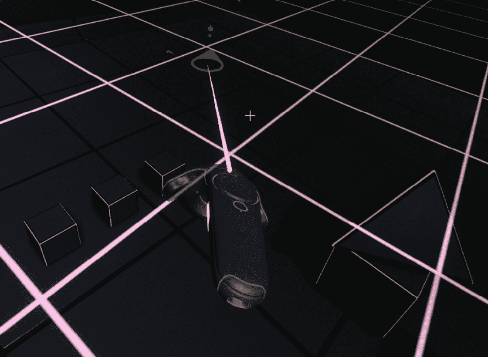

通过传送和拖动的组合，你可以很好地在世界中移动。

# 旋转世界

当你需要旋转视角时，握住两个手柄的握持按钮，将手柄彼此旋转，就像你试图旋转世界一样：

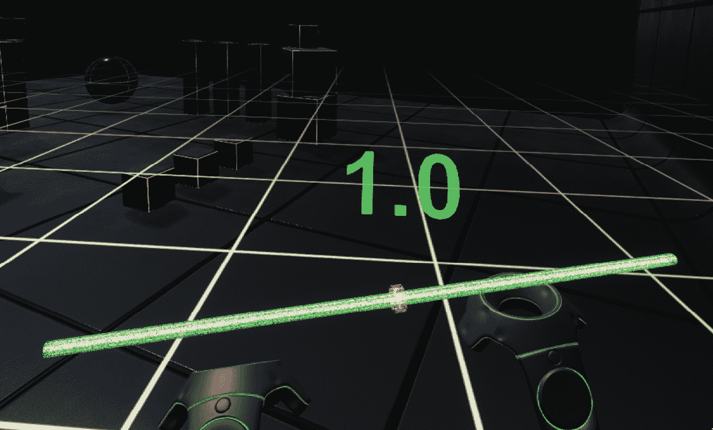

你在旋转轴上看到的数字是世界当前的比例。我们也可以操纵它。

# 缩放世界

要缩放世界，挤压握持按钮并将控制器向彼此移动以缩小世界，或将其远离彼此以扩大世界：

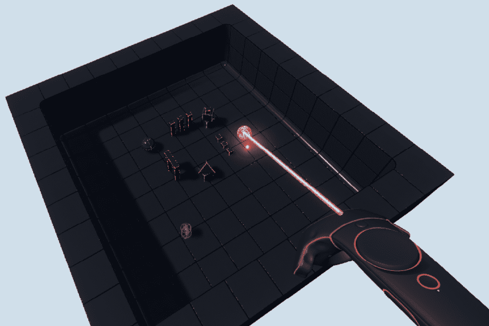

将场景缩小到看起来像桌子上的微型场景真是一种奇妙的满足感。

将控制器彼此靠近会缩小世界。将它们远离彼此会扩大世界。这对于布局很有用，因为你可以将世界组装成微型，然后传送回地面并恢复其正常比例，以查看你所做的事情。

在 VR 模式下，最快的方法之一是缩小世界，然后使用传送动作（握住+扳机）在地图上传送到新的位置。当你传送时，世界会恢复到默认大小。

# 练习移动

现在花点时间用你的控制器练习在世界中导航。使用*Alt* + *V*进入 VR 模式，当你想退出时再次按下*Alt* + *V*。使用握持按钮在世界中移动、传送、旋转和改变其比例。玩弄它直到感觉自然。这需要一些细微的技巧，但一旦你熟悉了，它就是一个非常有用的工具。

# 修改 VR 模式下的世界

现在你已经练习了一下在世界中移动，让我们开始学习一些在 VR 中进行场景构图所需的技巧。

# 移动、旋转和缩放对象

要选择一个对象，只需将光束对准它并拉动触发器。您的交互光束将变为黄色，表示您已进入选择模式。将出现一个 Gizmo，允许您移动对象。默认情况下，这将是一个平移 Gizmo，允许您在选定的对象周围移动（我们将在一会儿看到如何切换到其他类型的 Gizmo）：

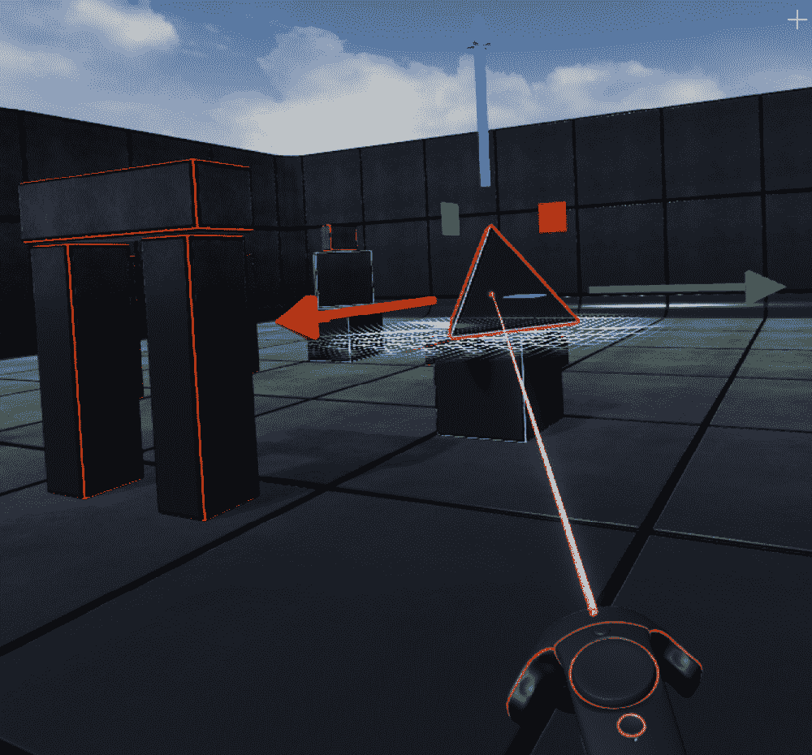

如果您想移动所选对象，请释放触发器，然后再次拉动触发器，同时指向对象或变换 Gizmo。您可以使用变换 Gizmo 的箭头和平面来限制移动，或者直接与对象交互以自由移动它。当使用交互光束直接移动对象时，您可以使用触摸板将其靠近或远离您。

请注意，带有碰撞的隐藏对象有时会干扰 VR 模式下的选择。如果您的选择光束似乎穿过您想要选择的对象，请移动到不同的视角点来选择它。

通常最好使用 Gizmo 来移动对象，因为使用任何精度将对象在深度上移动是相当困难的。

可以使用径向菜单界面将默认的变换 Gizmo 切换到其他模式。要激活径向菜单，请触摸非交互手上的触摸板或拇指杆，并指向您想要选择的菜单选项。使用触发器进行选择。您的控制器菜单按钮将带您退出子菜单，或者如果您已经在顶级菜单，则关闭径向菜单：

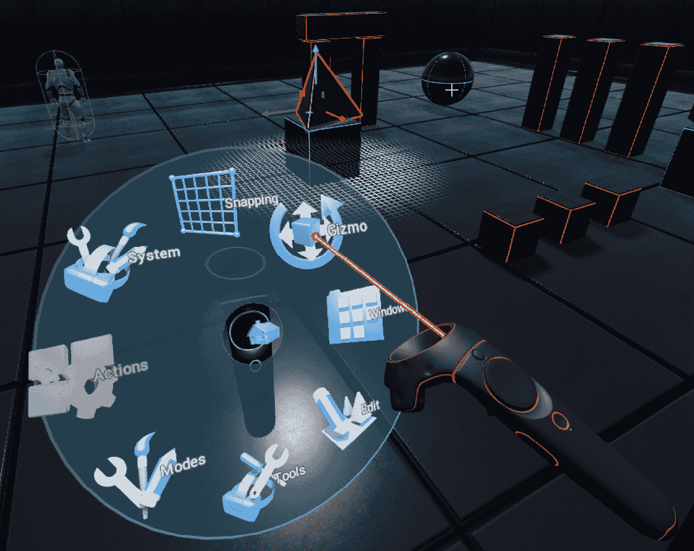

选择 Gizmo 子菜单可以在变换 Gizmo 选项之间切换：

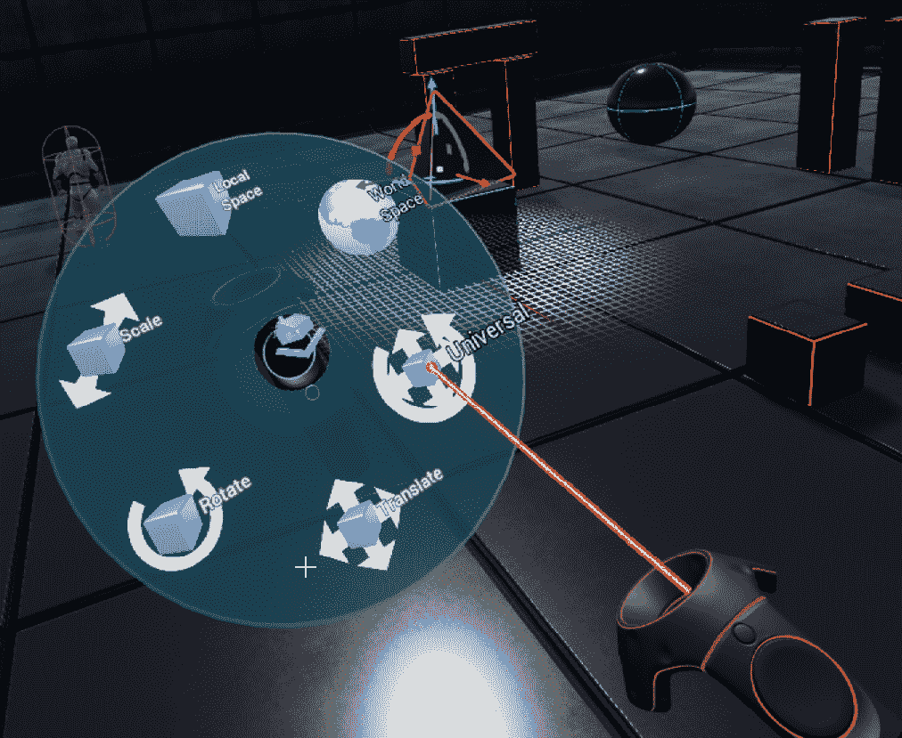

通用 Gizmo 提供了一个单一的 Gizmo 上的平移、旋转和缩放控制。平移、旋转和缩放 Gizmo 为这些操作提供了单独的工具。将变换模式切换为局部空间时，对象沿着自己的轴旋转、缩放和移动，而世界空间模式则沿着世界轴变换对象。

# 使用两个控制器旋转和缩放对象

您可能还注意到，每当您选择一个对象并将触发器放在对象本身上（而不是 Gizmo 手柄上）时，您的非主手控制器上会出现第二个交互光束。如果您将第二个交互光束对准对象并按下触发器，您可以同时使用它们来翻转和拉伸对象：

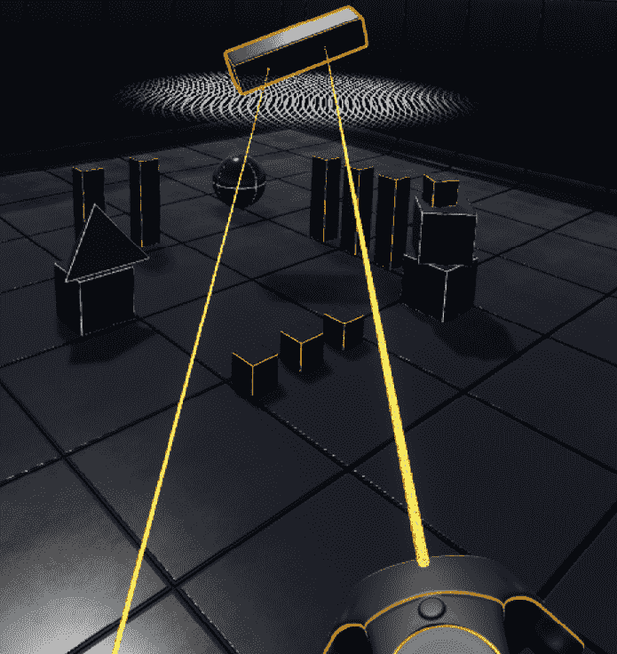

这是一个探索即兴布局的好工具。它直观并邀请您与环境中的对象进行自然互动。这是一个用于探索和即兴布局的好工具。您可能会发现将物体放在您想要的位置可能会很困难，但如果您使用此工具进行粗略布局，然后在平面编辑器中进行清理，您可以获得良好的结果。

# 练习移动对象

现在试试吧。按下*Alt* + *V*进入 VR 模式，并且除了练习在世界中移动之外，还要练习使用变换 Gizmo 和自由移动来移动世界中的对象。记得使用径向菜单来改变移动模式，并使用菜单按钮返回到主菜单。花些时间练习一下。一开始控制可能会感到陌生，但一旦掌握了它们，用 VR 进行世界构建将是一种有益的体验。

完成后，按下*Alt* + *V*再次退出 VR 模式，如果需要，在平面编辑中清理对象对齐。

现在我们准备开始组合一个场景，为此，我们将使用 VR 模式菜单。

# 在 VR 模式中组合新场景

现在我们已经学会了 VR 模式编辑器的基本操作，让我们深入了解一下如何将其用作场景组合工具。首先，我们需要一些要使用的资产。免费的无尽之剑：草地包将为我们提供一些可以玩耍的东西。

打开您的 Epic Games Launcher（在此过程中可以保留您现有的项目打开），导航到 Unreal Engine | Marketplace | Free 选项卡，并搜索 Infinity Blade: Grass Lands。点击“添加到项目”并选择您的新项目作为目标项目：

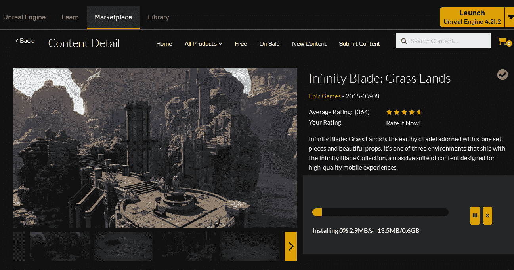

一旦资产下载和安装完成，让我们强制编译新的着色器。打开`Content/InfinityBladeGrassLands/Maps/Overview`，并让着色器编译。在这些着色器编译时，可以使用*Alt* + *V*进入 VR 模式，并在概览地图中导航，看看我们可以使用的资产。

在构建了您的着色器之后，我们可以使用这些资产来组合一个场景。对于这个练习，我们将从一个现有的地图开始并进行修改。

首先，我们需要学习如何在 VR 中导航编辑器菜单。

# 导航径向菜单

VR 编辑器中的菜单交互主要是通过附加到控制器的一系列径向菜单来处理的。实际上，这些菜单使用起来相当直观，因为它们清晰地映射到手柄上的触摸板或拇指杆输入。让我们看看它们是如何工作的：

1.  选择`Content/InfinityBladeGrassLands/Maps/ElvenRuins`并打开它。

1.  如果您愿意，您还可以更改您的项目设置|地图和模式|默认地图以自动打开此地图。

1.  使用*Alt* + *V*进入 VR 模式，当您处于此模式时，触摸左侧的触摸板或拇指杆以激活径向菜单。

1.  要进入菜单，请将交互光束对准它并按下扳机或使用菜单手柄的触控板选择选项。

1.  要退出子菜单，请使用非主导手的菜单按钮：

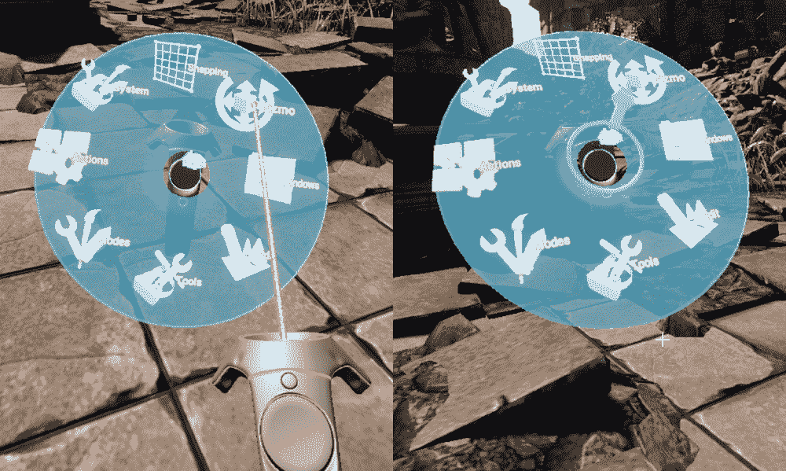

您可以使用交互光束或菜单手柄的触控板在 VR 模式下导航菜单

让我们进入 VR 模式并探索菜单。您可以从主菜单中选择八个主要菜单类别。

# Gizmo

我们已经探索了 Gizmo 菜单，所以我们不会在这里详细介绍。请记住，它用于在编辑器中切换移动工具的行为。

# 对齐

对齐菜单是 Gizmo 菜单的紧密伙伴。其中大多数的行为与平面编辑器中的行为相同，但智能对齐选项特别值得了解：

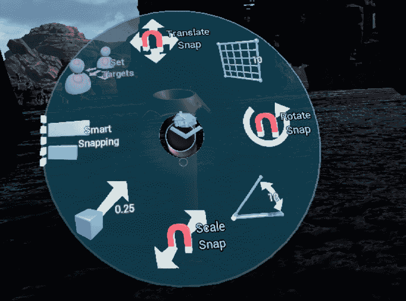

启用智能对齐后，您在场景中移动的对象将尝试在移动时与其他对象对齐。由于在 VR 模式下很难实现精确的定位，这是一个很大的帮助。

使用“设置目标”选项选择一个特定的对象，您希望其他对象对齐到该对象，并使用“重置目标”选项清除它。

# 窗口

Windows 子菜单提供了访问您在组合场景时将使用的各个调色板和菜单：

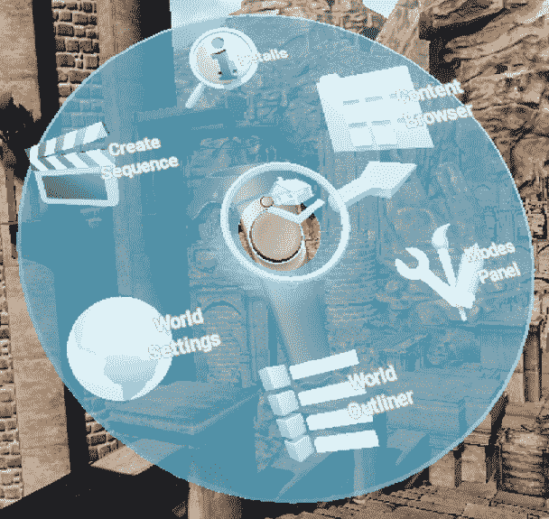

每个按钮都会打开其关联的面板。这些面板与平面编辑器中的面板相同：

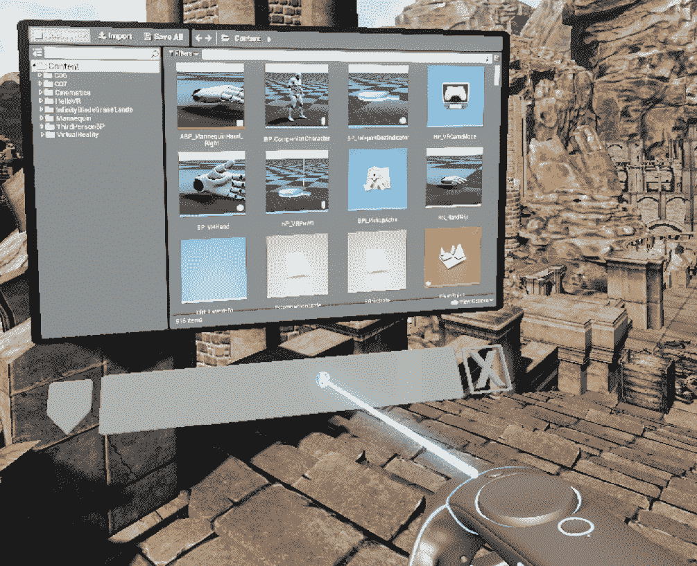

在编辑器的 VR 模式中看到的内容浏览器

要移动一个窗口，将交互光束对准其下方的大条。您可以将其放置和角度调整为任何您想要的方式。移动条左侧的朝下箭头将窗口固定在原位。当它被激活时，窗口将保持在您放置的位置，无论您如何在世界中移动。当它未固定时，窗口将随您的移动而移动。条右侧的 X 形按钮关闭窗口：

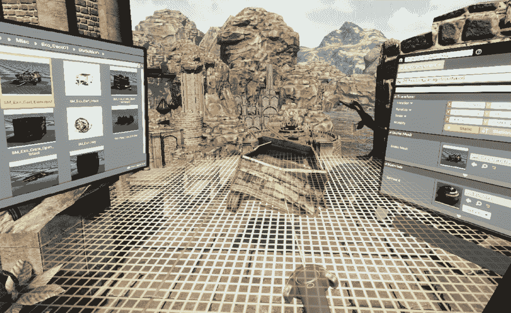

您可以移动活动窗口以创建一个虚拟工作空间来进行工作

这些窗口的工作方式与平面编辑器中的窗口相同。在使用它们时，一个有效的做法是只打开您需要的窗口，并将它们排列在您周围的虚拟工作空间中以完成您正在进行的任务。

在实践中，很多时候，将内容浏览器和详细信息窗格保持打开状态会很有用。

# 编辑

编辑菜单允许您在场景中复制、删除和对齐对象：

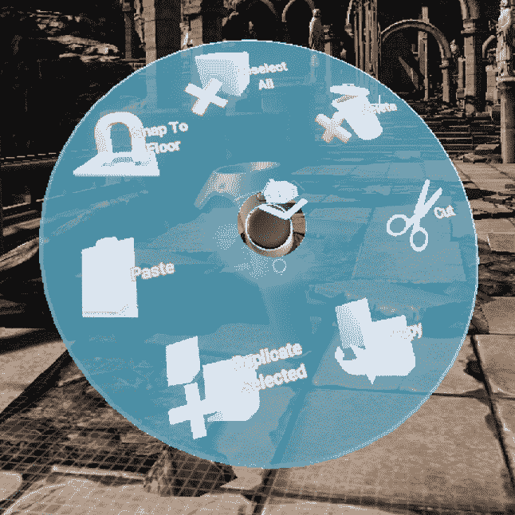

大多数选项应该都很容易理解，并且符合您对编辑菜单的期望。对齐到地板是一个例外，所以值得记住它在这里。您会经常使用它。

# 工具

工具菜单主要用于管理编辑器中的模拟。在这里，您可以启动、暂停和恢复模拟，并将其结果保存回编辑器：

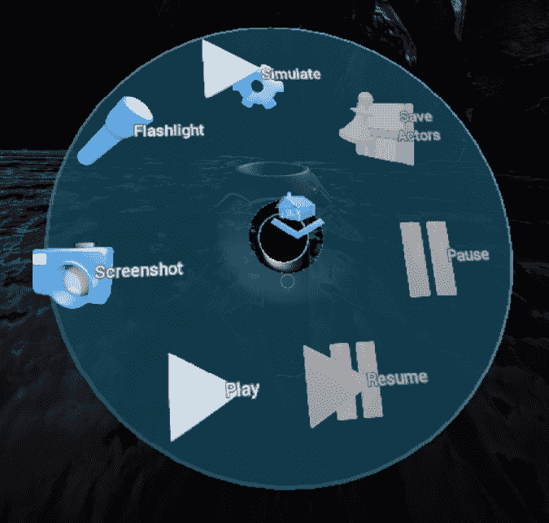

这里还包含了两个与模拟无关的选项。截图工具可以捕捉标准分辨率的截图，但请注意，截图将包括菜单，所以如果您想要一个干净的截图，请将其移出视线。手电筒工具对于在黑暗场景中找到方向非常有用，特别是如果您正在进行场景照明的中途。

# 模式

模式面板允许您放置诸如灯光、体积和基元等演员；管理植被；进入地形雕刻模式；以及绘制纹理和顶点颜色，就像在平面编辑器中一样：

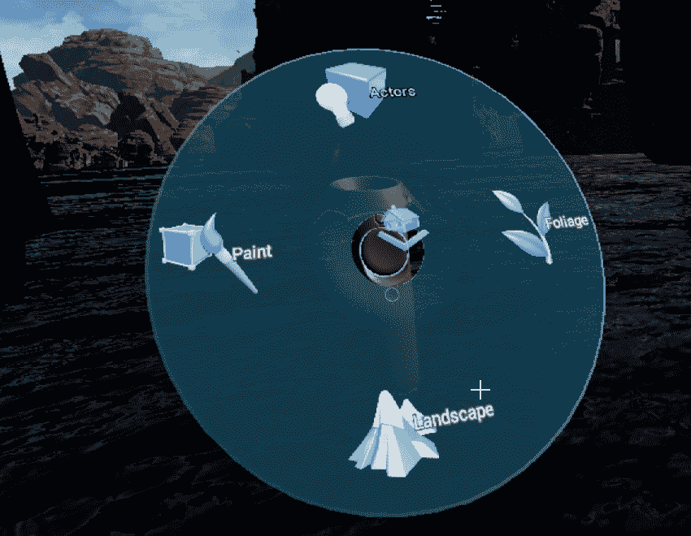

选择其中一个选项将带出一个模式面板，然后可以将其放置在世界中，并以与 Windows 菜单中提供的其他面板相同的方式使用。

# 操作和系统

目前，系统菜单只提供了退出 VR 模式的方法。在撰写本文时，它没有其他功能。操作菜单的行为取决于上下文。

# 对场景进行更改

现在我们已经学会了如何在 VR 模式下操作，让我们将这些学习应用到实践中。我们将在 VR 模式下修改 Elven Ruins 地图。

我们要做的第一件事是改变白天的时间。让我们看看这些废墟在黎明时会是什么样子。

使用*Alt* + *V*进入 VR 模式，用非交互手的触摸板或拇指杆触摸来呼出径向菜单。使用菜单按钮导航返回主页，如果当前处于子菜单中，请选择 Windows 菜单，然后激活 World Outliner。

使用交互光束拖动菜单底部的移动框。将其放在您的侧面稍微下方。

我们要找到在这个场景中充当太阳的定向光。要找到它，点击类型列的标题，按类型对演员列表进行排序，然后使用触摸板滚动列表，找到名为 Light Source 的定向光：

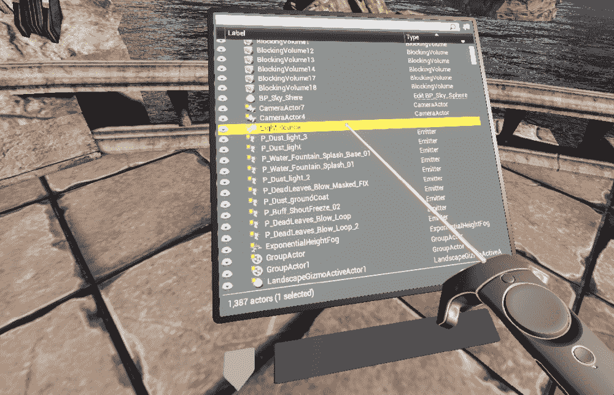

不幸的是，在 VR 模式下没有简单的方法输入文本。径向菜单提供了一个数字键盘，您可以在设置值时使用，但如果您想搜索光源，您必须使用传统键盘进行输入。对于这种类型的工作，排序、滚动和选择功能非常好用。

选择定向光后，使用径向菜单激活详细信息面板。使用面板下方的条形图将其拖动到一个可以阅读和交互的位置，但仍然可以看到天空：

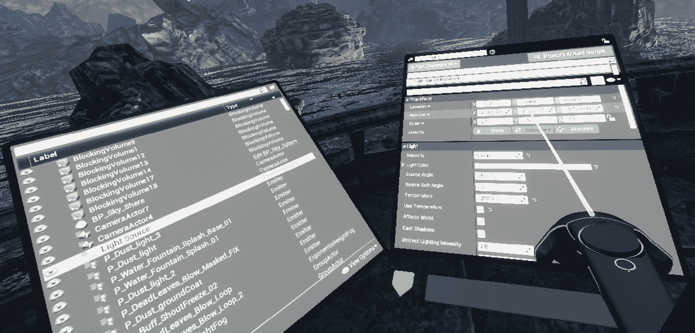

在这张从 VR 头盔中拍摄的照片中，你可以看到我们通过在 3D 空间中操作面板来创建了一个虚拟工作空间。

将交互光束对准光源的 Rotation Y 值，并在盒子上来回拖动以改变其值。你会看到太阳在头顶上变化。它的初始值大约为-48。将其拖动到大约 210（或者你喜欢的任何位置），可以创建一些漂亮的戏剧性阴影。

现在，选择 BP_SkySphere。在其详细信息面板中，打开 Colors Determined by Sun Position，并勾选 Refresh Material 复选框以改变天空的颜色：

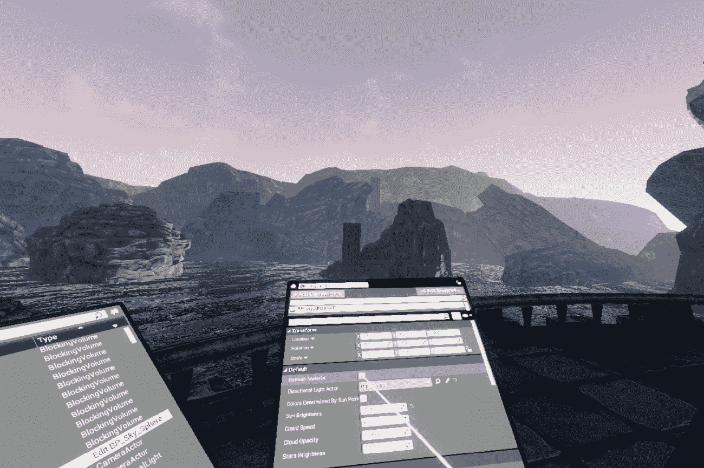

这样很好，对吧？像这样的光照变化通常最好在 VR 模式编辑器中进行，因为头戴式显示器中的光照和颜色与平面屏幕上的显示非常不同。

通常最好在平面屏幕编辑器中构建地图中的新元素。VR 模式非常适合检查视线和调整物体位置，但在实践中，它仍然存在一些问题，这可能会使物体选择变得困难：

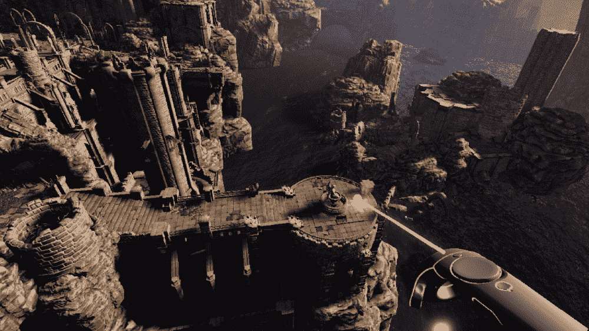

以下是在 VR 模式下工作的几种有效方法，以发挥其优势并解决其弱点：

+   通过缩小世界规模来移动，然后使用传送来到达目的地

+   在 VR 模式中进行粗略的光照调整，以便您可以看到它们对世界的真实影响

+   在传统编辑器中构建几何体，但使用 VR 模式来尝试其位置

养成经常使用*Alt* + *V*来在 VR 中检查环境的习惯，以便在构建时了解哪些调整在 VR 模式下是有意义的，哪些在传统编辑器中效果最好。

最重要的是，我们在本节中想要传达的是，VR 模式绝非奢侈品或花招，而应被视为 VR 场景构建工作流程中的必备工具。

# 为 VR 优化场景

现在我们已经谈了很多关于使用 VR 模式编辑场景的内容，让我们谈谈 VR 开发中一个非常关键的主题-保持可接受的帧率。

我们之前已经多次讨论了在虚拟现实中保持帧率的至关重要性。这是至关重要的，也是具有挑战性的。在本章的剩余部分，我们将讨论一些可以加快场景速度并找出导致速度变慢的原因的方法。

# 测试当前性能

在评估场景性能时，您需要做的第一件事是找出当前运行速度有多快。我们将看一些可以用于此的命令。

从编辑器中，点击**`**（反引号）键。它位于键盘上 1 键的左边，Tab 键的上方。将出现一个控制台输入框：

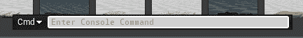

可以在此处输入各种控制台命令。我们将讨论您在优化场景时最有可能使用的命令。

# Stat FPS

在控制台命令行中输入`stat fps`。编辑器窗口中将出现一个帧率计数器，显示两个值：

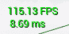

第一个是每秒帧数（FPS）。第二个值告诉您绘制帧所花费的毫秒数，这是您应该训练自己关注的值。帧率是玩家所感知到的，但在开发和尝试解决影响帧率的问题时，如果您训练自己以毫秒为单位思考，那么您在思考所做更改如何影响性能时会更容易。帧率描述了您期望的结果，但您在渲染帧的每个部分上花费的毫秒数是原因。在修复场景时，您需要查看每个操作的单独成本，这些成本以毫秒为单位表示。

# 确定您的帧时间预算

如果我们要以毫秒为单位思考，首先要做的是确定我们可以花多少毫秒来绘制帧并仍然达到目标帧率。这很简单。

要找到应用程序的帧时间预算，将 1,000 除以目标帧率。

这给出了您必须绘制帧的毫秒数以实现此帧率。例如，如果您的目标是刷新率为 90 FPS 的头戴式显示器（大多数头戴式显示器都是如此），我们可以这样找到我们的帧预算：

*1000 / 90 = 11.11*

这给我们一个大约 11 毫秒的帧预算。如果你在 11 毫秒或更短的时间内交付帧，你的 VR 应用程序将以 90 FPS 刷新。这不是很多时间，所以我们需要在大多数场景中做一些工作来实现这一点。

# 关于性能分析的警告

在我们深入性能优化的兔子洞之前，让我们记住几个重要的事情。

首先，平面屏幕上报告的帧时间对于 VR 来说不准确。它是一个可以用来大致了解你的情况的基准值，但当你激活 VR 时，你的帧率会下降。

如果你在平面屏幕值和 VR 值之间看到了明显的帧率下降，请检查你的项目设置，确保已经打开了实例化立体。如果关闭了（这是默认设置），你将支付渲染整个场景两次的全部成本，这绝对是你不想做的。

确保你不仅仅在平面屏幕上检查数值。经常在 VR 中进行测试。一种快速检查 VR 性能的方法是从 VR 模式中读取 stat fps 的值。

+   在可见的 stat fps 下激活 VR 模式。从头戴式显示器中可能无法读取文本，但你可以从平面屏幕输出中读取。

使用这种方法来检查你的环境。在地图中移动并使用 VR 模式检查问题区域。

另一个重要的事情要考虑的是，因为我们是在编辑器中进行测试，所以我们的数字受到编辑器本身的影响。我们需要支付渲染编辑器显示的所有窗口以及游戏场景的成本。为了获得准确的值，我们必须在独立会话中运行游戏。在编辑器中检查你的数字是一个好的实践，可以看到你所做的更改是好还是坏，但你应该记住它们并不能准确描述你打包的应用程序会做什么。

我们还需要记住，当我们在编辑器中测试帧时间时，我们实际上只是在看渲染性能，但我们没有得到关于应用程序的其他部分成本的任何信息。这在大多数情况下都没问题，因为你的问题很可能在渲染方面，但你仍然应该确保测试正在运行的应用程序，以确保你没有一个失控的蓝图或太多的动画角色拖累你。

最后，我们应该谈一下系统规格。不同的硬件配置会有不同的性能表现。如果你计划向公众发布一个应用程序，你应该确保你在最低规格的硬件上进行测试，以及在开发机器上进行测试。仅仅因为你的应用程序在一台配备全新高端显卡的怪物上运行良好，并不意味着它在旧硬件上也会运行得很好。如果你可以在最低规格的目标上进行测试，那就这样做。如果不能，要意识到你的开发机器与最低规格相差多远，并确保在帧时间预算中留出足够的余地来适应这一点。

现在我们已经谈了一些可能影响我们测量结果的因素，让我们深入了解如何获得比仅仅使用 stat fps 更好的信息。

# Stat unit

检查我们的帧率是有用的，也是一个重要的频繁操作，但仅仅这样并不能告诉我们太多信息。它可能告诉我们有问题，但它不会给我们提供找出问题所在或如何修复问题的指导。为此，我们还有一些更有用的命令可以使用。

stat unit 命令以毫秒为单位分解了帧的成本，并显示了我们渲染场景所花费的成本和应用程序中其他活动（如动画和 AI）所花费的成本。

现在试试。点击**`**(反引号)键以打开控制台命令窗口，然后输入 stat unit 以在帧率信息下添加此额外信息：

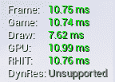

stat unit 命令显示四个主要信息：

+   帧：这是绘制帧所花费的总时间。这与我们在 stat fps 结果中看到的值相同。

+   Game：这告诉您游戏线程在 CPU 上花费了多长时间。这包括动画更新、AI 和 CPU 必须解决的其他任何事情，以更新帧。如果蓝图在 Tick 事件上执行效率低下的操作，这将增加该值。

+   Draw：这告诉您 CPU 花费了多长时间来准备渲染场景。这里的高值可能意味着您进行了过多的遮挡剔除或在光照或阴影上花费了太多时间。

+   GPU：这个值告诉您 GPU 绘制帧所花费的时间。这里的高值可能意味着您绘制了太多的多边形，使用了太多的材质，或者您的材质过于复杂。大多数情况下，您的问题将出现在这里。

这些值不是累加的。您的游戏线程将等待渲染线程完成，因此，如果游戏时间与 GPU 时间匹配，那么实际上告诉您的是您的 CPU 没有拖慢您的速度，并且您的帧时间是由渲染驱动的。

除了这四个基本值之外，我们还有两个高级信息，您现在不需要担心：

+   RHIT：这是您的渲染硬件接口线程。实际上，除非您使用高级渲染硬件或视频游戏主机，并且在专用线程上运行渲染硬件接口调用，否则您不会在这里看到与 GPU 值差异很大的值。除非您正在进行一个带有专门的工程团队的高级项目，否则这可能不适用于您。

+   DynRes：这表示您的应用程序是否支持或正在使用动态分辨率。实际上，这仅在视频游戏主机上支持，所以您不需要在这里担心它。如果您感兴趣，可以在[`docs.unrealengine.com/en-us/Engine/Rendering/DynamicResolution`](https://docs.unrealengine.com/en-us/Engine/Rendering/DynamicResolution)找到更多信息。

我们从 stat unit 信息中感兴趣的是我们是否在 Game CPU、Game 渲染操作或 GPU 上花费了大部分时间。我们寻找最大的数字，因为这将告诉我们需要修复的问题。

在开发过程中，您应该养成几乎一直保持 stat fps 和 stat unit 的习惯。如果您引入了新的场景，会导致帧率下降，那么发现问题的最佳时间就是在放入场景时。如果您很长时间才发现问题，那么您将需要做更多的工作来找出问题的原因。

查看统计单位值随时间变化的情况通常是值得的，无论是在应用程序中发生的事情（这对于找到卡顿很有用）还是在场景中移动时。要获取这些信息，请使用 stat unitgraph 来显示场景性能指标随时间变化的图表：

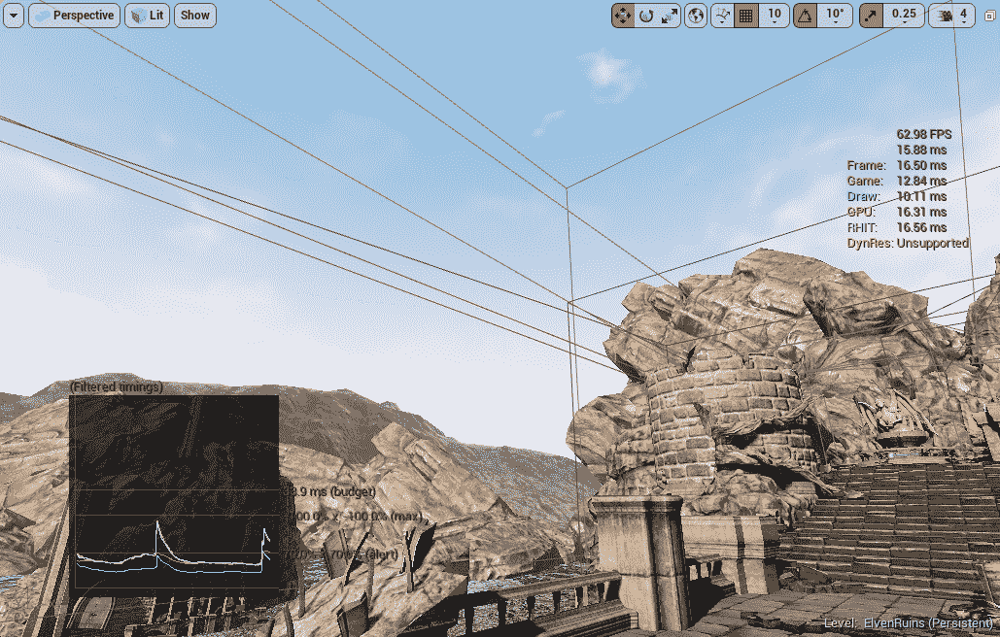

您将看到您的 stat unit 值现在已经被彩色编码以对应图表上的线条。

如前所述，大多数情况下，您的问题将与 GPU 艺术品有关，这些艺术品太重而无法适应您的场景。

当然，如果您在 Tick 上做了荒谬的事情，您的 CPU 可能会被杀死，这种情况下，您将希望寻找可以重构以响应事件或数据变化而不是使用 Tick 的蓝图。但是，大多数情况下，您可能会遇到 GPU 的问题。

# 对 GPU 进行分析

优化场景时，您应该学会使用的第一个工具是 GPU 分析器。您可以在控制台中输入 profilegpu 来激活它，但由于您将经常使用它，最好记住快捷键：Ctrl + Shift + ,（逗号）。现在按下它，让我们看看数字：

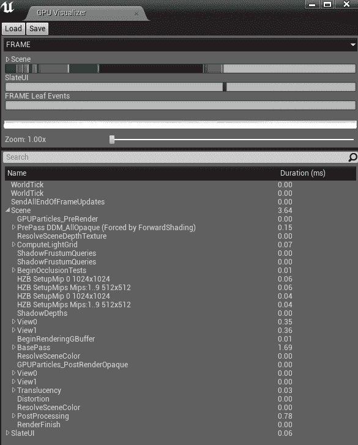

此配置文件报告的最重要部分是场景标题下的图表。将鼠标悬停在图表上，您将看到工具提示告诉您每个块代表什么。最大的两个块通常是您的 BasePass 和 PostProcessing pass。基本传递表示绘制场景中的所有内容的行为。后处理处理在场景绘制完成后处理的任何内容，例如屏幕空间环境遮挡、颜色校正和其他效果。

点击场景标题左侧的展开器，以获取更多关于场景渲染的详细信息：

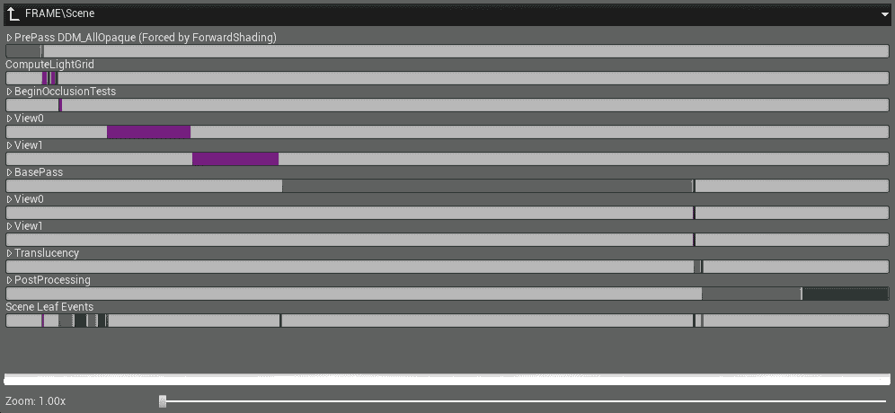

在这里，我们可以看到更详细的细分，了解绘制帧所花费的时间。光照看起来很好，透明度也很好。我们的 BasePass 相当大，但这是可以预料的。

通过深入研究 BasePass，您不会获得太多更多的信息，但是通过深入研究 PostProcessing 操作，您可以学到一些有用的东西。使用 PostProcessing 标题旁边的三角形进行深入研究，然后单击 PostProcessing 操作中的大块以查看它们是什么：

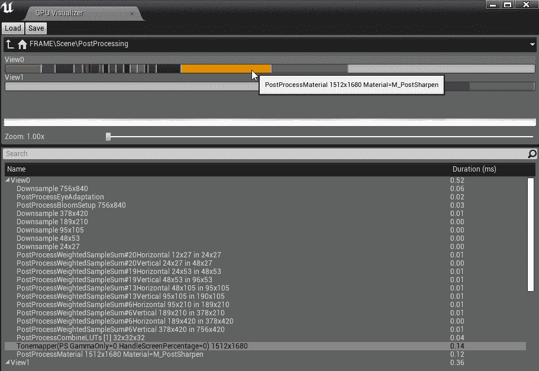

在这种情况下，这些后续数字看起来相当不错。我们没有任何一个持续时间过长的问题。

确保在游戏运行时进行分析，否则您将看到许多来自编辑器的操作。

我们在这里没有足够的空间来深入研究渲染过程和其含义的所有内容，但总的来说，您要寻找的是可能不必要地影响帧率的大型项目。当您发现看起来可疑的东西时，在虚幻论坛上搜索它，您可能会找到关于它的讨论以及如何处理它的方法。

随着您越来越多地使用这个工具，您会逐渐对健康的外观和问题区域的外观有所了解。经常使用它来清楚地了解您的应用程序正在做什么。

现在，让我们看一些其他有用的命令，我们可以用来调试我们的场景。

# Stat scenerendering

在 GPU 分析器之后，您下一个最有用的命令可能是 stat scenerendering。该命令会详细列出系统在渲染场景时所采取的步骤及其相关的时间：

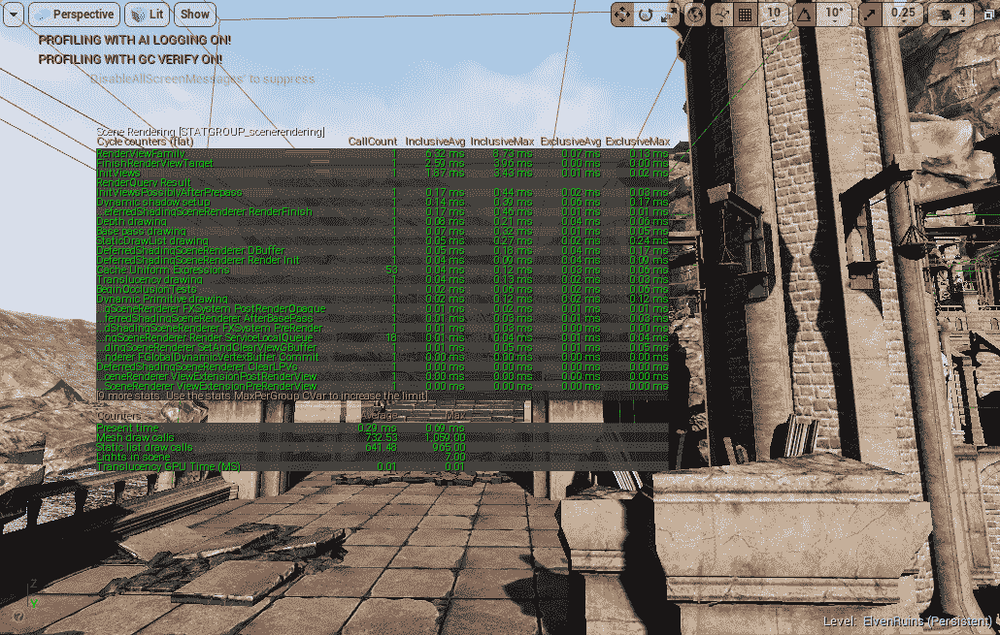

在这里特别值得一看的是您的动态阴影设置和透明度绘制。

如果您在阴影设置中看到较高的值，请查看是否有一个或多个灯光正在执行过多的阴影级联或具有过长的阴影距离。您可以在此主题的[`docs.unrealengine.com/en-us/Platforms/Mobile/Lighting/HowTo/CascadedShadow`](https://docs.unrealengine.com/en-us/Platforms/Mobile/Lighting/HowTo/CascadedShadow)上找到更多信息。

如果您的透明度绘制很高，请激活编辑器的 Quad Overdraw 优化视图模式，并查找互相堆叠的透明对象。如果您在这里有问题，您可以尝试使用遮罩材质而不是透明材质，或者注意它们在视图中的重叠情况：

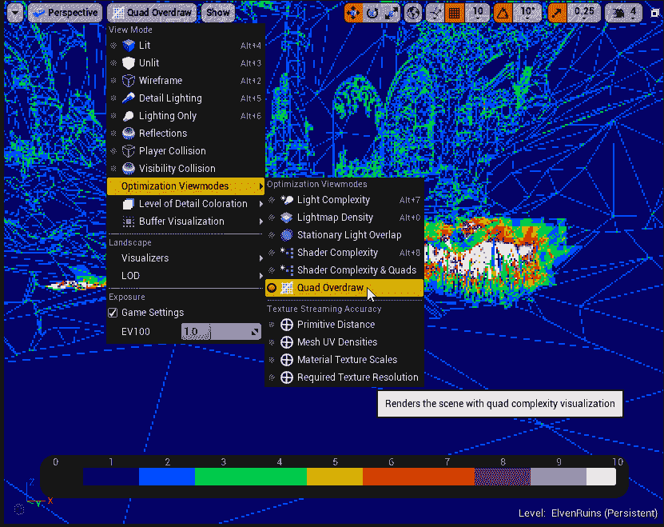

在此列表的底部有一些非常重要的数字：网格绘制调用和静态列表绘制调用。我们应该谈谈这些。

# 绘制调用

影响场景性能的最大因素之一是将信息传输到 GPU 所需的绘制调用次数。我们在这里讨论什么？情况如下：你希望显卡绘制的所有内容都必须复制到该显卡的内存中。向显卡发送一组指令的行为称为绘制调用，或称为绘制原语调用（有时缩写为 DPC）。假设你的场景中出现了一个静态网格，上面有三个材质。这将需要四个绘制调用来设置它在显卡上的绘制：一个用于网格，每个材质一个。你应该尽量减少场景中的绘制调用次数。实际上，对于 VR 场景，2000 个绘制调用可能是你的限制。在移动 VR 中，如 Oculus Go 或 Quest，这个数字更低。

这对你意味着什么？首先，尽量少地在物体上使用材质；理想情况下，每个物体只使用一个材质。只需添加一个额外的材质槽，你就增加了加载该物体到视频硬件的成本的三分之一，如果该物体在场景中频繁出现，这个成本会迅速累积。

我们很快会讨论如何处理高绘制调用次数的方法，但现在你需要知道的是，如果这些数字很高，说明你向显卡发送了太多的单独指令，这会减慢速度。也许你的物体上有太多的材质槽，或者有太多单独发送的物体，但在所有情况下，这都是你需要解决的问题。

# Stat RHI

另一个与之密切相关的经常使用的命令是 stat rhi。RHI 代表渲染硬件接口，它告诉你具体影响渲染性能的是什么：

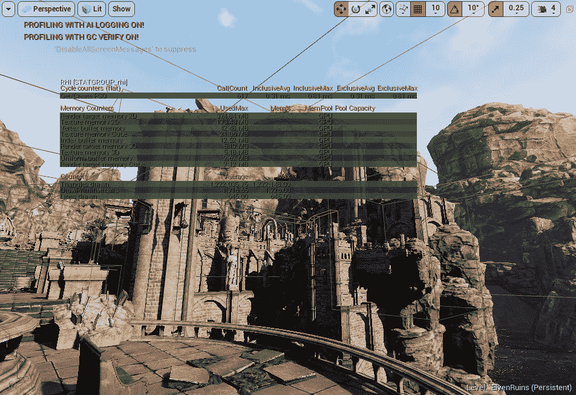

在这里你最关心的两个值是绘制的三角形数量和绘制原语调用次数。养成查看这些值的习惯，并寻找三角形数量或绘制调用次数过高的视图。对于桌面 VR 头显上的 VR 场景，你希望将绘制的三角形数量保持在 200 万以下，并且将绘制调用次数保持在 2000 以下。

在这里你还应该关注的另一个值是内存消耗。在实时场景中，使用过大的纹理也会导致场景运行非常缓慢。不要将 4K 纹理放在小石子上。我们见过这种情况发生。

`Stat rhi`是获取场景在预算内的整体感觉最有用的命令之一。

# 统计内存

当你需要更多关于内存预算超支的信息时，可以使用 stat memory：

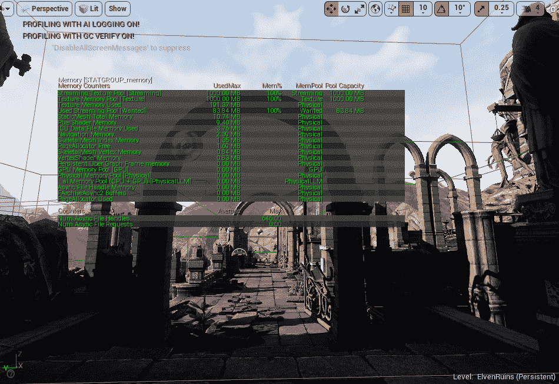

大多数情况下，如果你的内存消耗过高，罪魁祸首往往是纹理。要注意使用过大的纹理。一个巨大的物体或主角角色可能需要一个 2048x2048 的纹理。其他任何东西都应该是 1024x1024 或更小。在 VR 中，使用 4K 纹理可能在任何情况下都不合理。在考虑如何减少纹理时，看看场景中的物体。它有多大？玩家能走多近？玩家真的在意看它吗？很容易在玩家几乎看不到的物体上花费太多。开始考虑在重要的地方使用纹理和多边形预算，并在可以节省的地方节约。

# 优化视图模式

除了统计命令之外，我们还有一些优化视图模式，可以用来找出场景中的问题。这些模式可以从编辑器视口的视图模式菜单中访问。我们这里只讨论其中的两个。

着色器复杂度视图显示了可能导致性能下降的材质位置。当您找到一个可疑的对象时，选择它，并查看其材质中发生了什么。您的材质是否过于复杂或进行了昂贵的计算？考虑以下截图：

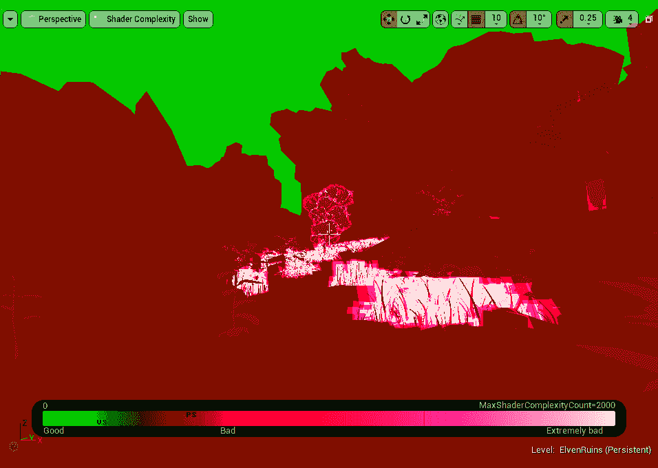

在上面的截图中，草和树被识别为昂贵的材质。当我们选择它们的对象并查看这些材质时，我们可以看到推高成本的原因是它们使用了世界位置偏移输入来模拟风。这是昂贵的，但是这是一个很好的效果，如果我们关闭它，玩家会注意到，所以我们可以不管它，因为我们场景的其余部分运行得相当高效。

使用此视图搜索可能会消耗大量资源但对场景没有太多价值的材质。

如果您在延迟渲染模型下使用动态光源，那么光照复杂度视图就会起作用。因为我们在这里使用的是正向渲染和静态光源，所以在这个场景中不会显示任何内容。当您使用动态光源和延迟渲染时，这个视图可以显示您的光源引起的问题所在。

# CPU 分析

如果您的 CPU 时间有问题，您可以使用 CPU 分析来找出问题所在，就像我们之前使用 GPU 分析器一样。

要激活 CPU 分析，在游戏运行时，打开控制台命令并键入`stat startfile`开始分析。分析会生成大量数据，所以您不希望在整个会话中运行分析器-只捕获您感兴趣的内容，比如“为什么当角色警报敌人时游戏会变得如此缓慢？”

在捕获到您要查找的内容后，键入`stat stopfile`以关闭分析。分析器将把捕获的数据保存到项目的`\Saved\Profiling\UnrealStats\`目录下的`.ue4stats`文件中。

现在，打开您的虚幻引擎安装目录，在其中的`Binaries\Win64`文件夹中找到`UnrealFrontend.exe`应用程序。启动它并使用选项卡选择 Session | Frontend | Profiler。使用分析器的加载按钮打开刚刚生成的`.ue4stats`文件：

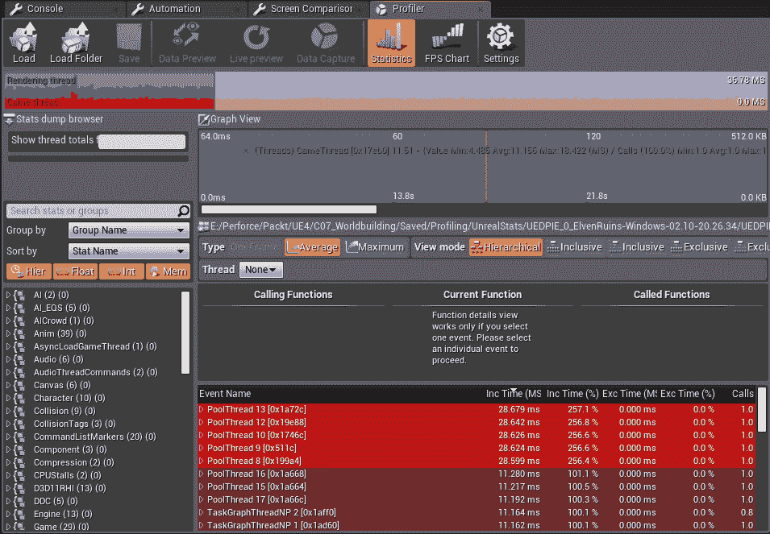

CPU 分析器显示了每个帧调用的操作所花费的时间。

就像我们在 GPU 分析器中所做的那样，您可以使用此工具来查看昂贵的函数调用并了解发生了什么。在这本书的范围之外，我们无法深入介绍如何在此处使用 CPU 分析器-它是一个非常有用和强大的工具，但需要一些时间来学习如何从中获取有用的信息。我们建议您探索有关此主题的详细信息，可以在[`www.unrealengine.com/en-US/blog/how-to-improve-game-thread-cpu-performance`](https://www.unrealengine.com/en-US/blog/how-to-improve-game-thread-cpu-performance)找到。

# 打开和关闭功能

尽管听起来很原始，但是找出导致帧率下降的原因最有效的方法之一就是打开和关闭相关统计信息显示的功能（通常，`stat unit`是您想要的）。使用视口的显示菜单打开和关闭单个元素，特别是如果您通过 GPU 分析或统计信息确定该元素可能会引起问题。如果从您的关卡中删除对象（只要您有备份或它在源代码控制下），并查看是否有特定对象会产生很大的变化，这也可能会有所帮助。

# 解决帧率问题

现在我们已经学会了如何找到场景中的问题，让我们谈谈如何处理这些问题。

# 清理蓝图的 Tick 事件

如果你在 CPU 上看到很高的数字，你要寻找的第一个罪魁祸首之一就是在 Tick 事件上执行操作的蓝图。这是一个非常常见的问题。请记住，Tick 事件在每一帧都会发生，所以如果你在 Tick 上做了很多工作，你就会影响到每一帧的绘制。寻找将这个工作分散到多个帧上的方法，或者避免使用 Tick，只在发生变化时使用事件来改变对象的状态。

# 管理骨骼动画

如果你有很多骨骼网格在进行动画，确保它们的骨架中没有荒谬的骨骼数量，并确保它们没有使用大量的混合空间动画。最好的做法是使用骨骼网格的细节层次（LOD），只在玩家能看到时包含细节，或者在电影中使用单独的骨骼网格，其中高度详细的面部动画很重要，并且在游戏中使用骨骼数量较低的骨骼网格。有关设置骨骼网格 LOD 的更多信息，请从以下链接开始查看：[`docs.unrealengine.com/en-US/Engine/Content/ImportingContent/ImportingSkeletalLODs`](https://docs.unrealengine.com/en-US/Engine/Content/ImportingContent/ImportingSkeletalLODs)。

# 合并演员

这是一个重要的问题。还记得不久前我们提到过绘制调用数量对帧率有很大影响吗？将多个网格合并成一个单一的网格是降低绘制调用数量的最便宜和最简单的方法之一。这不仅会将你选择的多个单独网格创建为一个单一网格，还会为该网格创建一个合并的材质，其中包含每个子网格的材质。这是一个重要的事情。

假设你在房间的一个角落里有一堆碎片；大约有 25 个物体，每个物体使用一个材质槽。这样一来，你就会有 50 个绘制调用，而你整个场景可用的绘制调用总数可能是 2000 个。这是一个很大的负担。通过将它们合并成一个单一的物体，你可以将 50 个绘制调用减少到两个。这是你可以减少绘制调用数量的最快和最有效的方法之一。

不过，这里有一个需要注意的地方：还记得在本书前面我们提到过 Kent Beck 的建议“让它工作，让它正确，让它快”吗？这是其中一个适用的领域。一旦你将所有这些物体合并成一个单一的物体，你就不再有重新排列各个组件的自由，所以先让场景看起来符合你的要求，然后合并你的演员以控制事物。

以下是如何操作：

选择窗口 | 开发者工具 | 合并演员。合并演员窗口将出现。选择要合并的演员。一般来说，合并那些靠近并且可能在同一视图中的演员是一个好主意。一旦它们被合并，即使只有其中一个在镜头中，所有它们都将被绘制，所以合并那些大部分时间都会同时出现在镜头中的物体：

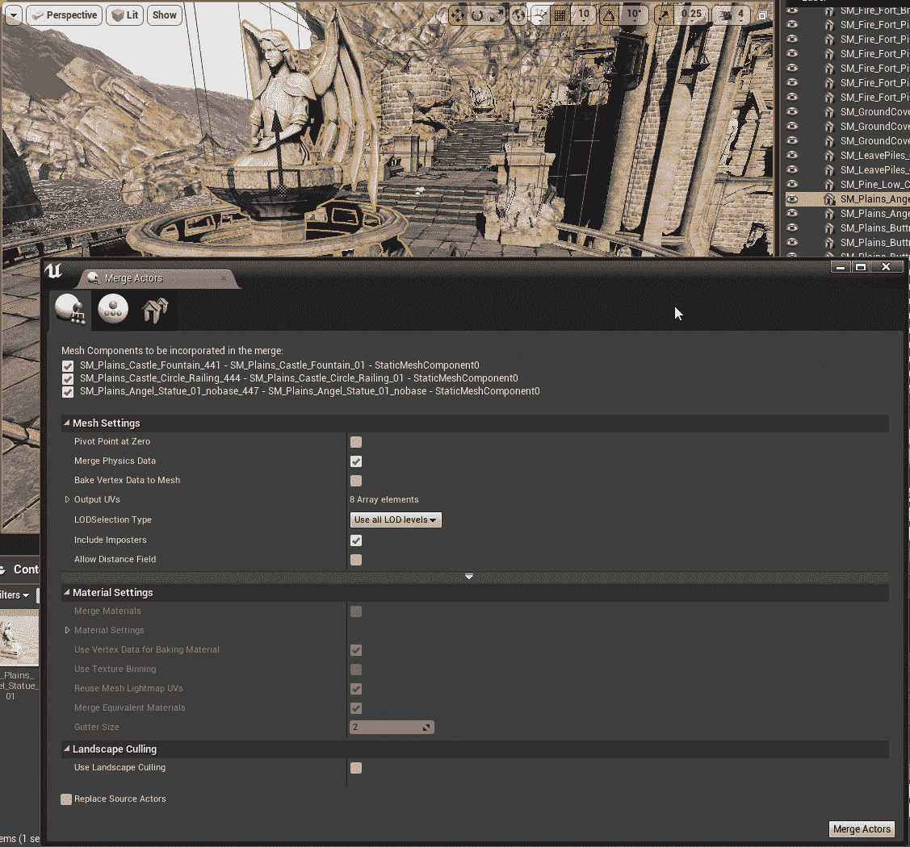

在视口后面看到多个选定演员的合并演员对话框

如果选择替换源演员，则在场景中选择的演员将被合并模型替换。有关合并演员的更多信息，请从以下链接开始：[`docs.unrealengine.com/en-us/Engine/Actors/Merging`](https://docs.unrealengine.com/en-us/Engine/Actors/Merging)。

# 使用网格 LOD

在场景中绘制的三角形数量（通常称为多边形数量）是决定场景渲染速度的另一个重要因素。

当然，对抗高面数的第一道防线是建模。使用像 Pixologic 的 ZBrush 这样的应用程序，从高细节模型中烘焙法线贴图，并将其应用于导入游戏引擎的低细节网格。大部分时间，你的玩家都不会注意到区别。虚拟现实对使用法线贴图模拟几何细节的宽屏显示器不太宽容，因为玩家有时会看到深度不是真实的，但你仍然应该在任何可以使用这种技术的地方使用它。

然而，一旦你在游戏中有了一个网格，你就有一个强大的 LOD 工具可用于管理你绘制的三角形数量。LOD 的工作原理如下：它们存储了同一模型的几个版本，其面数逐渐减小。随着模型在屏幕上变小，系统会将高细节网格替换为低细节网格，因为玩家无法看到远离的细节。

以下是如何设置 LOD：

1.  选择一个静态网格，并从内容浏览器中打开静态网格编辑器。

1.  在其详细信息下，找到 LOD 设置部分。

1.  找到 LOD 数量条目，并将其设置为大于 1 的值。（对于此测试，只需将其设置为 2 以创建 2 个 LOD。）

1.  点击“应用更改”。现在将创建一个或多个额外的 LOD 模型，并将其添加到静态网格资源中。

1.  在 LOD 选择器部分，找到 LOD 条目，并使用它选择一个新的 LOD。

LOD 0 是原始模型。大部分时间你会保持不变。LOD 1 是 LOD 0 之后的第一个 LOD。

1.  选择一个新的 LOD，比如 LOD 1，打开其 LOD 详细部分的减少设置条目并进行修改。

这里有很多选项，但大部分时间，你将管理三角形百分比值。如果在这里进行更改，请点击“应用更改”以查看结果：

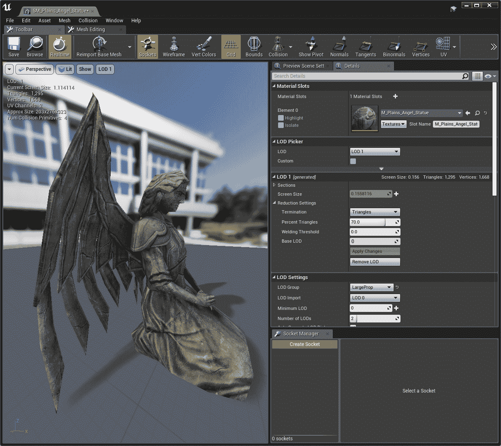

你会在视口中看到修改后的网格。为了看到它在真实视距下的样子，将 LOD 选择器切换回 LOD 自动，并移动视图以查看对象在 LOD 之间切换时的变化。LOD 生成器非常出色。

有关创建和使用 LOD 的更多信息，请首先查看[`docs.unrealengine.com/en-us/Engine/Content/Types/StaticMeshes/HowTo/LODs`](https://docs.unrealengine.com/en-us/Engine/Content/Types/StaticMeshes/HowTo/LODs)。

# 静态网格实例化

还记得我们刚才关注的绘制调用吗？还有另一种强大的方法可以减少它们的数量并大大加快渲染速度。

假设你有一个大的集合，其中大部分是相同的资产，比如一个重复使用相同树木网格数百次的森林。如果你只是单独将这些网格放置在环境中，每一个都会生成至少两个绘制调用，如果使用更多材质则会更多。这是一个幻灯片的制作方法。相反，你想要做的是**实例化**这个几何体。实例化是一种告诉你的 GPU 的方法，即使它即将绘制几百个网格，它们实际上都是相同的网格，只是具有不同的变换。因此，系统不是为每棵树都进行单独的绘制调用，而是进行一组绘制调用，并向视频硬件提供一个位置、方向和缩放的列表来绘制它们。这比将每个项目作为单独的项目传递要快得多。

在虚幻中，默认情况下实例化对象的最简单方法是使用植被工具。虽然它通常用于植被，但正如其名称所示，您也可以在许多其他情境中使用它来重复使用对象，比如城市街道上的路灯。您可以在[`docs.unrealengine.com/en-us/Engine/Foliage`](https://docs.unrealengine.com/en-us/Engine/Foliage)上找到有关植被实例化的更多信息。

在场景之外实例化静态网格是一个稍微复杂的话题，但是可以做到，并且如果您正在以程序化方式生成包含大量单独静态网格的角色，这可能是一个好主意。然而，大多数情况下，当您在场景中实例化对象时，请使用植被工具来完成。

# 本地化蓝图

蓝图已经以惊人的速度进行解释，但通过自动将它们转换为 C++，然后允许系统编译它们，可以使它们变得更快。

要打开此选项，请打开“项目设置 | 项目 | 打包 | 蓝图”，并使用“蓝图本地化方法”选择器选择**包含**或**独占**本地化。

+   **包含**本地化将在编译时将所有蓝图转换为 C++。

+   **独占**本地化只会转换那些您设置了本地化标志的蓝图。

如果您使用独占本地化，请通过打开它们的“类设置”来选择要本地化的蓝图，并在其“详细信息 | 打包”面板中打开“本地化”选项。如果您使用包含本地化，则不需要这样做。在这种情况下，每个蓝图都会被本地化：

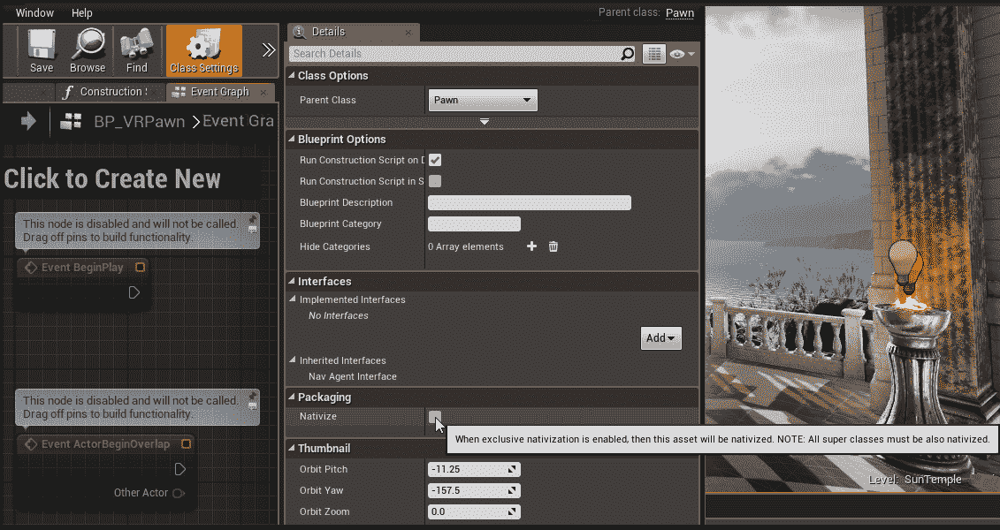

如果您计划在桌面 VR 上发布应用程序，包含本地化可能是可以的，但如果您计划部署到移动 VR，比如 Oculus Go 或 Quest，最好使用独占本地化来选择要本地化的蓝图，因为包含所有蓝图可能会增加可执行文件的大小。

这是一个比较高级的话题。一般来说，如果您的蓝图在 Tick 事件上做了很多工作，或者总体上做了很多工作，您将会看到一些好处。如果您的蓝图相当简单，无论如何都不会看到差异。由于速度对于 VR 开发非常关键，所以了解这个选项是很好的。

如果您计划这样做，请在项目开发的早期打开本地化，并经常在烹饪的构建上进行测试。本地化非常好，但有时仍可能导致意外的副作用。

# 总结

在本章中，我们学到了如何使用虚幻的 VR 模式编辑器在 VR 中组合环境，并学习了如何分析和优化场景以查看性能瓶颈所在。

在下一章中，我们将暂时离开在 VR 中构建实时 3D 世界的内容，转而看另一个常见的应用程序——电影和沉浸式摄影。
