# 第九章：在 VR 中显示媒体

在之前的章节中，我们专注于为 VR 创建实时 3D 媒体，并花了很多时间研究玩家角色、界面元素和构建世界。现在，我们要稍微转变一下，探索 VR 的另一个重要应用——在平面屏幕和沉浸式环境中显示电影。

VR 在这方面非常出色。因为在头戴式显示器中可以创建一个几乎无限的空间，用户可以在巨大的虚拟屏幕上体验电影和媒体，没有任何干扰会让他们脱离体验。这些屏幕也可以采用任何形状。除了平面和弯曲屏幕外，还可以在球体中呈现整个环境的照片和电影，使玩家完全沉浸在其中。在本章中，我们将学习如何创建这些内容。

具体而言，我们将涵盖以下主题：

+   在虚拟屏幕上显示视频

+   从侧面到侧面和上下视频源显示具有立体深度的视频

+   在 360 度球形环境中显示媒体

+   在立体声中显示 360 度媒体

+   创建交互控件，允许玩家启动、停止和倒回媒体

让我们开始学习如何播放电影吧！

# 设置项目

对于本章的项目，我们不需要从之前的工作中获取任何内容，所以我们将简单地创建一个具有以下设置的新项目：

+   空白蓝图模板

+   移动/平板硬件目标

+   可扩展的 3D 或 2D 图形目标

+   使用起始内容（我们将在其中使用一些起始内容）

我们仍然需要适当地设置 VR 的设置，就像我们对每个项目都这样做一样。这是一个备忘单：

+   项目 | 描述 | 设置 | 在 VR 中启动：是

+   引擎 | 渲染 | 正向渲染器 | 正向着色：是

+   引擎 | 渲染 | 默认设置 | 环境遮蔽静态分数：否

+   引擎 | 渲染 | 默认设置 | 抗锯齿方法：MSAA

+   引擎 | 渲染 | VR | 实例化立体声：是

+   引擎 | 渲染 | VR | 轮询遮蔽查询：是

在设置完所有这些设置后，允许项目重新启动。一旦你的项目重新打开，你就可以开始学习虚幻引擎中媒体的工作原理了。

# 在虚幻引擎中播放电影

我们将从学习如何在虚幻引擎中播放电影和其他媒体开始。当然，要开始，我们需要一个要播放的电影。

视频文件以令人困惑的方式呈现，你应该了解其中的一些事情。

# 理解容器和编解码器

当人们开始学习视频文件时，最常遇到的困惑是不理解视频文件所包含的容器并不能告诉你它是如何编码的。让我们花点时间来谈谈这个问题。

视频文件包含大量信息，全部打包到一个文件中。有代表视频轨道的图像流。通常还有音频，有时还有字幕，有时还有其他附加信息。所有这些信息都被捆绑在一个称为“容器”的封装格式中。你肯定见过扩展名为`.mp4`的视频文件。那是 MPEG-4 容器格式使用的扩展名。AVI 是微软的标准容器格式，还有许多其他格式。

但要记住的是，容器格式规定了文件中这些不同信息部分如何组合在一起，但它并不告诉我们视频和音频流实际是如何制作的。仅仅因为你在文件上看到了`.mp4`扩展名，并不意味着它一定适用于你想要使用它的用途。还有另一个因素需要考虑：编解码器。

单词**编解码器**是**压缩器**和**解压缩器**两个词的缩写组合。原始状态的视频文件可能会变得非常庞大。有多大呢？让我们来算一下。假设我们有一个 1080p 的视频文件。它的尺寸是 1920 x 1080 像素。每帧有 2073600 个像素。假设我们以 24 位色（每通道 8 位）显示这个视频文件，这允许我们显示超过 1600 万种颜色，大约每帧 50MB。如果我们以每秒 30 帧的速度运行，那么每秒将消耗约 1.49GB 的空间。这样做你会很快就用完空间。

当我们存储视频文件时，我们通过对其进行大量压缩，然后在实时流传输到屏幕时进行解压缩来处理这个问题。这项工作由编解码器来处理。它的压缩组件负责将原始源视频打包成适合存储在光盘上的格式，而解压缩组件则负责解包以便显示。关于视频编解码器的工作原理的讨论可以填满整整一本书，所以我们不会深入探讨这个问题，但你需要知道的是，虽然存在许多编解码器，但并不是所有的编解码器都适用于所有的软件解决方案，也不是所有的编解码器都适用于所有的硬件配置。最常用的编解码器，也是最广泛兼容的，被称为**H.264**，但还有许多其他编解码器。有些编解码器被设计为广泛使用，而有些则是专门为某些应用程序（如视频编辑）而制作的。值得花一点时间了解这些编解码器。

所以，现在你知道了关于视频文件的一个秘密。容器并不一定告诉你编解码器的信息，你需要了解两者才能知道文件是否能正常工作。（所以下次当你问别人给你什么类型的视频文件时，他们回答给了你一个`.mp4`时，你会知道他们并没有真正回答你的问题。）一些容器格式只能在特定的操作系统或硬件上工作，而其他一些格式，比如`.mp4`，几乎可以在任何地方工作。

对于你打算在虚幻引擎中使用的视频文件，通常应选择将它们封装在`.mp4`容器中，并使用**H.264**编解码器进行压缩。有关支持的编解码器的更多信息，请查看以下链接：[`docs.unrealengine.com/en-US/Engine/MediaFramework/TechReference`](https://docs.unrealengine.com/en-US/Engine/MediaFramework/TechReference)。

我们不会在本书中涵盖有关压缩自己的视频文件的内容 - 关于这方面有很多要说的，也有很多关于如何做的信息可以在网上找到。如果你可以访问 Adobe Creative Suite，其中包含的 Adobe Media Encoder 应用程序是一个将视频转换为几乎任何所需格式的优秀工具。如果你需要一个免费的视频编码器，AVC Free 是一个很好且常用的选择。你可以在以下链接找到它：[`www.any-video-converter.com/products/for_video_free/`](https://www.any-video-converter.com/products/for_video_free/)。

# 寻找用于测试的视频文件

让我们找一个符合这些标准的文件。如果我们导航到“Video For Everybody”测试页面，我们可以找到一个适合测试的视频。转到[`camendesign.com/code/video_for_everybody/test.html`](http://camendesign.com/code/video_for_everybody/test.html)，找到`.mp4`容器格式的下载视频链接。右键点击链接，选择“另存为...”将`big_buck_bunny.mp4`视频文件保存到硬盘上。

如果你的系统上还没有安装 VLC 媒体播放器，请从以下链接下载并安装：[`www.videolan.org/vlc/index.html`](https://www.videolan.org/vlc/index.html)。实际上，你可以使用任何视频播放器来检查你的文件，但 VLC 是一个很好的工具。它几乎可以播放任何格式的视频，并提供有关正在播放的文件的良好信息。请参考以下步骤：

1.  在 VLC 中打开刚刚下载的视频文件并播放。

1.  暂停视频并按*Ctrl* + *J*打开其编解码器信息：

！

您可以在此处看到，该文件使用 H.264 进行编码，并且从其文件扩展名可以看出它使用了`.mp4`容器。这个文件应该在虚幻的任何平台上都能正常工作。

# 将视频文件添加到虚幻项目

让我们将此文件添加到我们的虚幻项目中。

对于其他资产类型，您可以使用虚幻编辑器中的“导入”方法将它们添加到项目中，但视频文件不同。要将视频文件添加到虚幻项目中，您必须手动将其放置在名为`Movies`的`Content`文件夹的子目录中。

名称和位置很重要。引擎默认会在`Content/Movies`中查找电影，如果将它们放在其他位置，可能无法正确打包。

1.  从内容浏览器中，确保您在根`Content`文件夹中，右键单击创建一个新文件夹。

1.  如下截图所示，将其命名为`Movies`：

！

1.  从 Windows 资源管理器中找到您下载的`.mp4`文件，并将其移动到项目的“Content/Movies”目录中。（您可以右键单击内容浏览器中的此目录，然后选择“在资源管理器中显示”以导航到该目录。）

# 创建文件媒体源资产

现在，返回虚幻编辑器，在您的`Content/Movies`目录中，右键单击并选择创建高级资产 | 媒体 | 文件媒体源以创建一个新的文件媒体源资产。通常更容易使用与其源资产相同的名称命名文件媒体源，因此将其命名为`big_buck_bunny`是有意义的，因为这是我们即将附加的文件的名称：

！

打开它并使用省略号(...)按钮选择您放置在`Content/Movies`目录中的视频文件作为其文件路径：

！

文件媒体源资产只是一个解析器，允许媒体播放器在磁盘上找到电影。媒体播放器指向文件媒体源，而文件媒体源指向`Movies`目录中的实际文件。

文件媒体源还提供了一些其他选项：

+   高级“预缓存文件”选项可用于将整个媒体文件强制加载到内存中并从那里播放。

+   “Player Overrides”列表允许您强制特定播放器在特定平台上解码媒体。除非您确定需要覆盖自动选择，否则请将其保持不变。

还有其他三种媒体源类型，虽然我们不会在这里深入研究它们，但您应该了解它们：

+   **Img**媒体源用于显示图像序列-作为电影连续播放的单个图像。有关播放图像序列的详细信息，请查看以下链接：[`api.unrealengine.com/INT/Engine/MediaFramework/HowTo/ImgMediaSource/index.html`](https://api.unrealengine.com/INT/Engine/MediaFramework/HowTo/ImgMediaSource/index.html)。

+   **流**媒体源允许您指定托管在特定 URL 上的视频文件进行播放。有关更多信息，请查看以下链接：[`api.unrealengine.com/INT/Engine/MediaFramework/HowTo/StreamMediaSource/index.html`](https://api.unrealengine.com/INT/Engine/MediaFramework/HowTo/StreamMediaSource/index.html)。

+   **平台**媒体源允许您指定在不同的硬件平台上播放不同的媒体。请查看以下链接以获取详细信息：[`api.unrealengine.com/INT/Engine/MediaFramework/HowTo/PlatformMedia/index.html`](https://api.unrealengine.com/INT/Engine/MediaFramework/HowTo/PlatformMedia/index.html)。

# 创建媒体播放器

现在我们已经设置好媒体源，让我们创建一个媒体播放器来播放它：

1.  在`Content/Movies`目录中右键单击，选择“创建高级资产 | 媒体 | 媒体播放器”。我们将为所有媒体源使用相同的媒体播放器，因此通用名称如`MediaPlayer`就可以了。参考以下截图：

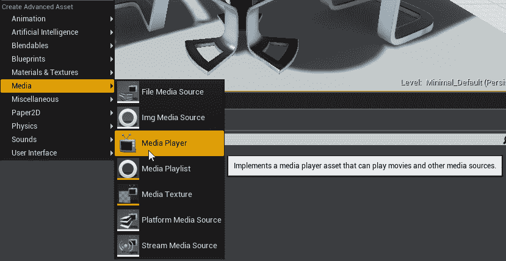

创建时，会出现一个新的对话框，询问您是否要创建一个媒体纹理资产来处理视频输出。让它这样做，如下图所示：

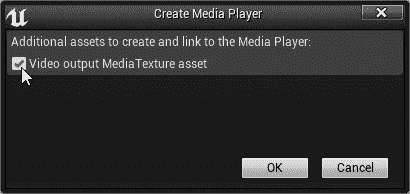

我们也可以通过从内容浏览器创建一个媒体/媒体纹理资产来创建它，但这样可以节省一步。

# 使用媒体纹理

媒体纹理资产显示其绑定的媒体播放器资产中的流媒体视频或图像。如果您打开刚刚创建的媒体纹理，您会看到它绑定到我们刚刚创建的媒体播放器：

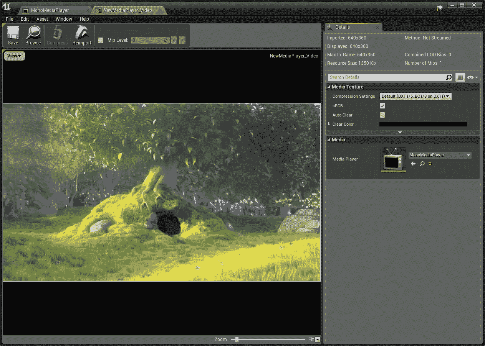

如果您的媒体纹理看起来是空白的，不要担心。在关联的媒体播放器上播放了一些内容之前，它不会显示任何内容。

一般来说，您应该保持媒体纹理的属性不变。确保它绑定到您的媒体播放器，但您不太可能需要更改其其他属性。

# 测试您的媒体播放器

打开刚刚创建的新媒体播放器资产。您应该在可用媒体源列表中看到我们刚刚设置的媒体源文件。选择它并播放以验证它在虚幻引擎中可以播放：

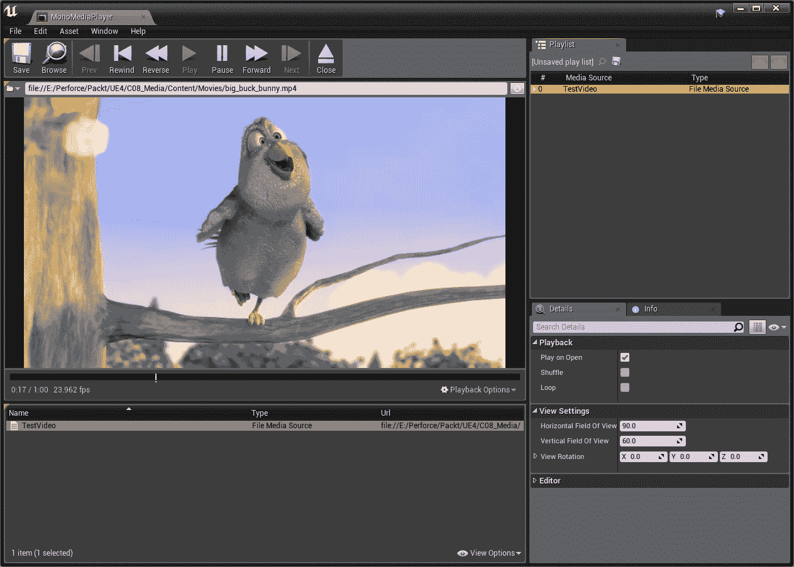

确保为此文件源选择了“打开时播放”选项，并同时打开“循环”选项。

一旦我们验证了视频文件在媒体播放器中播放，让我们将其添加到世界中的一个对象中。

# 将视频添加到世界中的对象

由于我们在这个项目中包含了起始内容，所以我们的项目启动时不会启动一个空白地图，而是默认启动一个名为“Minimal Default”的简单地图，其中包含一对椅子和一张桌子。我们可以将其作为我们电影播放地图的起点。选择“文件 | 另存为当前...”保存地图，保存为`Content/Chapter08/Maps/MoviePlayback2D`。（记住，将您的工作放入项目的`Content`目录的子目录中是个好主意。否则，当您迁移其他内容时，会变得一团糟。）

如果您愿意，可以使用起始内容来布置一个更舒适的剧院或观影室。我们不会在这里涵盖这个内容，但如果您愿意，可以创建一个客厅或电影院场景，或者任何激发您想象力的场景。

我们场景中需要一个屏幕来显示我们的媒体。按照以下步骤创建一个：

1.  从模式面板中选择“放置 | 基本 | 平面”，并将一个平面拖动到场景中。

1.  将其位置设置为`(X=-730.0, Y=0.0, Z=210.0)`（或适合您构建的环境的位置）。

1.  将其旋转设置为`(Pitch=0.0, Yaw=-90, Roll=90)`（在编辑器中，这读作`X=90.0, Y=0.0, Z=-90.0`）。

1.  将其缩放设置为`(X=8.0, Y=4.5, Z=1.0)`。通过这样做，我们将屏幕的形状与我们打算播放的 16:9 宽高比的视频相匹配。

现在，我们将把我们的媒体纹理分配给这个平面：

1.  将我们为媒体播放器创建的媒体纹理拖动到平面上。

1.  将自动创建一个材质来显示纹理。

这就是将媒体添加到 3D 场景中的方法。分配一个使用媒体纹理作为源的材质或材质实例，并确保媒体纹理指向一个媒体播放器。

# 使用媒体播放材质

让我们稍微看一下这个材质。打开它。如果您查看其材质属性，您会发现它是一个使用默认光照模型的普通表面材质。这里没有什么特别的。

另一方面，纹理样本很有趣：

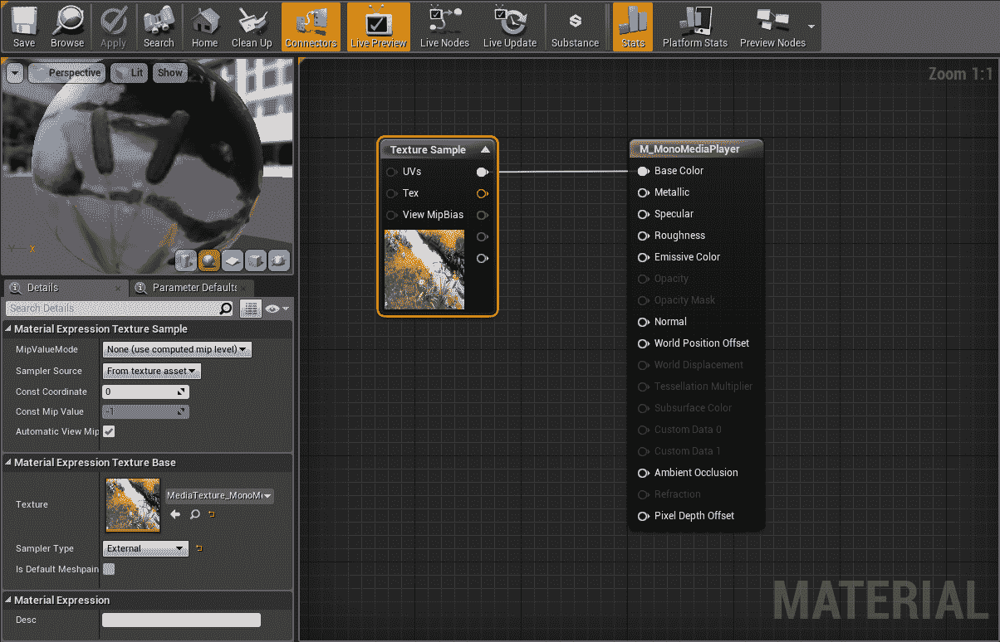

这里的重要细节是它的纹理源已设置为我们的媒体纹理，其采样器类型已设置为`External`。这将允许它实时显示我们的媒体。我们将很快对这个材质进行更多的工作，但现在你可以关闭它。

# 向我们的媒体播放添加声音

我们还希望能在场景中播放声音。按照以下步骤进行操作：

1.  选择我们的屏幕演员，点击其详细面板中的“添加组件”按钮。

1.  添加一个媒体声音组件，并将其媒体播放器属性设置为我们的媒体播放器：

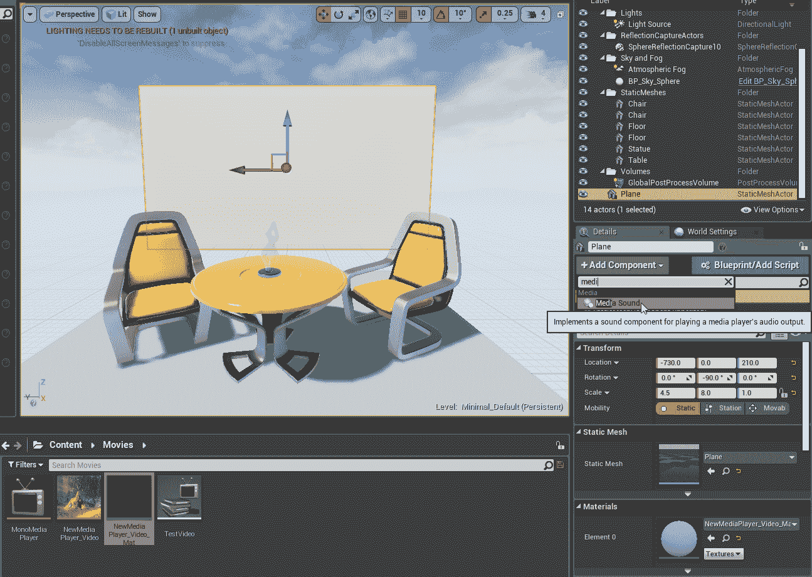

这个媒体声音组件将播放与关联的媒体播放器流式传输的任何音频。默认情况下，它处理立体声音频，但也可以用于单声道或环绕声音源。

现在，我们已经设置好了一切，并在世界中放置了一个带有视频材质和声音组件的对象，让我们让我们的媒体播放器播放测试视频。

# 播放媒体

我们要从简单的开始，只是在关卡开始时播放电影。稍后，我们将做更多的工作来控制我们的媒体播放器。按照以下步骤开始：

1.  点击“打开关卡蓝图”，如下图所示：

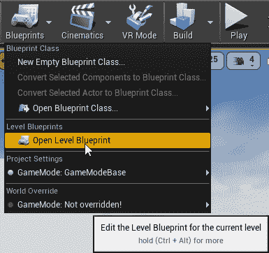

1.  创建一个新变量，并将其类型设置为媒体播放器 | 对象引用：

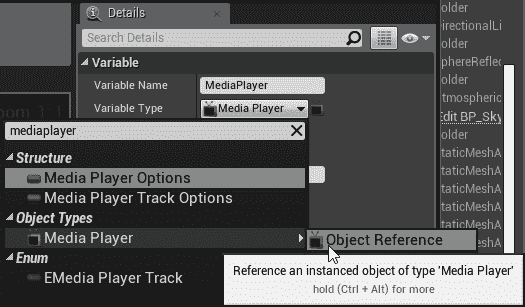

1.  编译蓝图，并将变量的默认值从`None`更改为我们刚刚创建的媒体播放器。

1.  *Ctrl* + 拖动媒体播放器变量到事件图表中。

1.  找到或创建“事件开始播放”节点。

1.  从媒体播放器变量中拖动连接器，并调用“打开源”。

1.  将调用的媒体源设置为我们从电影中创建的文件媒体源：

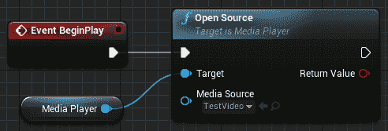

在 VR 预览中启动它，让我们看看会发生什么：

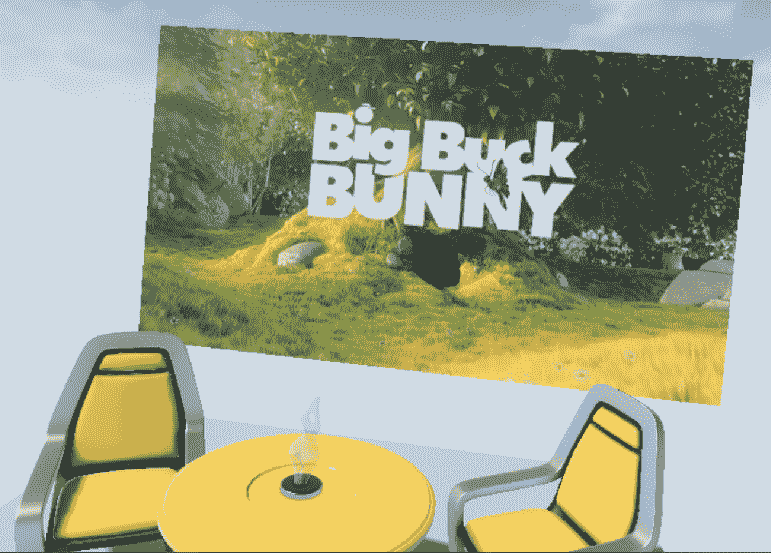

很好。视频正在播放。让我们花点时间回顾一下我们设置这个的步骤，然后我们将看看如何改进它。请参考以下截图：

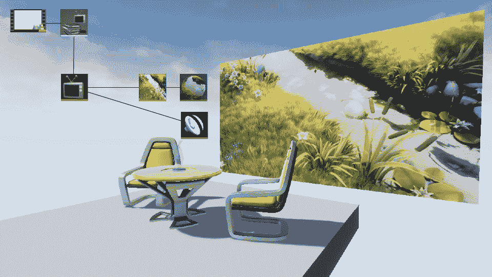

媒体播放工作如下：

1.  您想在引擎中播放的任何媒体都始于`Content/Movies`中的文件。源电影不会被导入到引擎中，也不会出现在内容浏览器中。

1.  要在引擎中访问它，您需要创建一个指向磁盘上媒体文件的文件媒体源资产。

1.  媒体是通过可以通过蓝图调用来控制的媒体播放器对象播放的。

1.  媒体纹理资源从其关联的媒体播放器中采样视频。这些包含在材料中。

1.  对象上的 MediaSound 组件会播放与其关联的媒体播放器的音频。这些通常添加到场景中充当屏幕的对象上。

# 深入了解播放材质

让我们看看我们可以用媒体播放材料做些什么。在这里做出正确的选择完全取决于你想要创建的效果，所以我们将讨论一些你可能想要做的事情，但你需要自己决定它们是否符合你的要求。

我们需要讨论的第一件事是屏幕对光的响应方式。我们为媒体纹理创建的材质使用了默认光照模型。这意味着环境中的光线会像通常一样影响到这个材质。如果你想要的美学效果是这是一个物理屏幕在空间中，那么这可能正是你想要的，但如果你的应用程序的目的是展示媒体本身，你可能不希望有任何杂散光线落在屏幕上并改变其颜色对观众的呈现方式。

让我们看看我们在谈论什么。从模式面板中，将一个点光源拖到场景中，并将其放在屏幕前面：

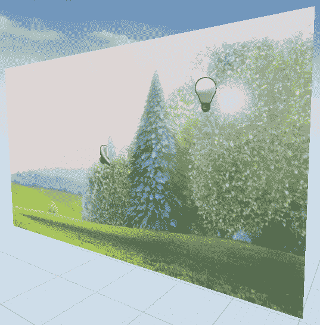

你会发现光线在屏幕上产生了镜面高光，就像在场景中的其他表面上一样。如果我们关闭场景中的其他灯光，情况会变得更糟。现在，我们屏幕的某些部分变暗了，而其他部分则被剩余灯光的高光遮挡。

如果这就是我们想要的，那就没问题，但如果不是，我们可以通过将材质更改为使用无光照模型，并将视频信号输入到其自发光通道中来进行修正。让我们试试看：

1.  打开你的媒体材质。

1.  选择输出节点后，将材质的详细信息 | 材质 | 着色模型从默认光照改为无光照：

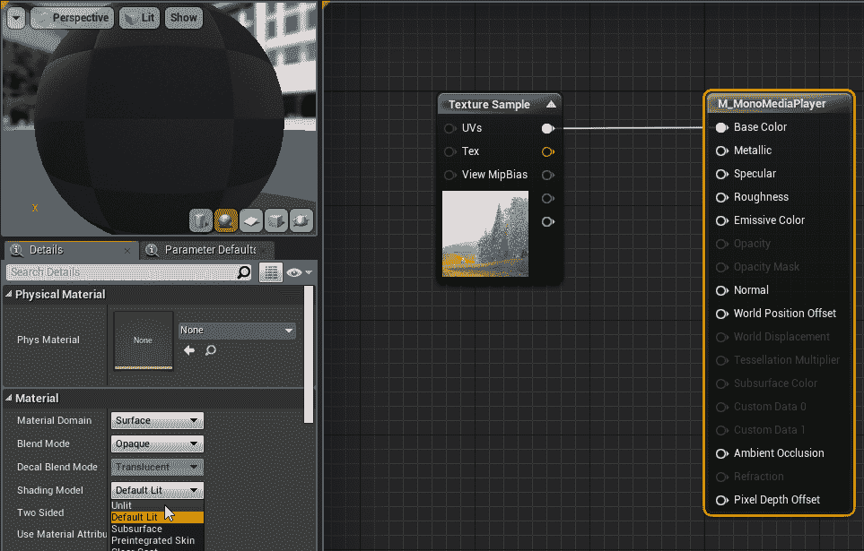

1.  你会发现它的基础颜色输入变为禁用状态。*Alt* + 单击该输入以断开与纹理采样的连接。

1.  将纹理采样的结果输入到材质的自发光颜色输入中。

保存材质并返回到场景。现在，因为你的材质使用了无光照模型，它不再受世界中的灯光影响。媒体的显示与其源文件完全一致：

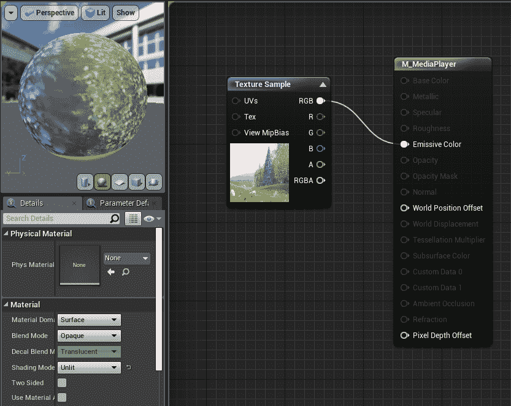

# 添加额外的控制来调整视频外观

我们还可以使用材质图表来对视频信号的显示进行更多的控制。让我们来看看这个：

1.  返回到你的材质。

1.  按住*S*键并在工作区中单击以创建一个标量参数。将其命名为`Brightness`并将其默认值设置为`1.0`。

1.  按住*M*键并单击以创建一个乘法节点。

1.  将你的纹理采样的输出乘以刚刚创建的`Brightness`参数。

1.  按住*S*键并单击以创建另一个标量参数。将其命名为`Contrast`，并将其默认值设置为`0.0`。

1.  在图表中右键单击并创建一个`CheapContrast_RGB`节点。

1.  将乘法节点的结果连接到其 In (V3)输入，并将你的`Contrast`参数输入到其对比度输入。

1.  将结果输入到材质的自发光颜色输入中：

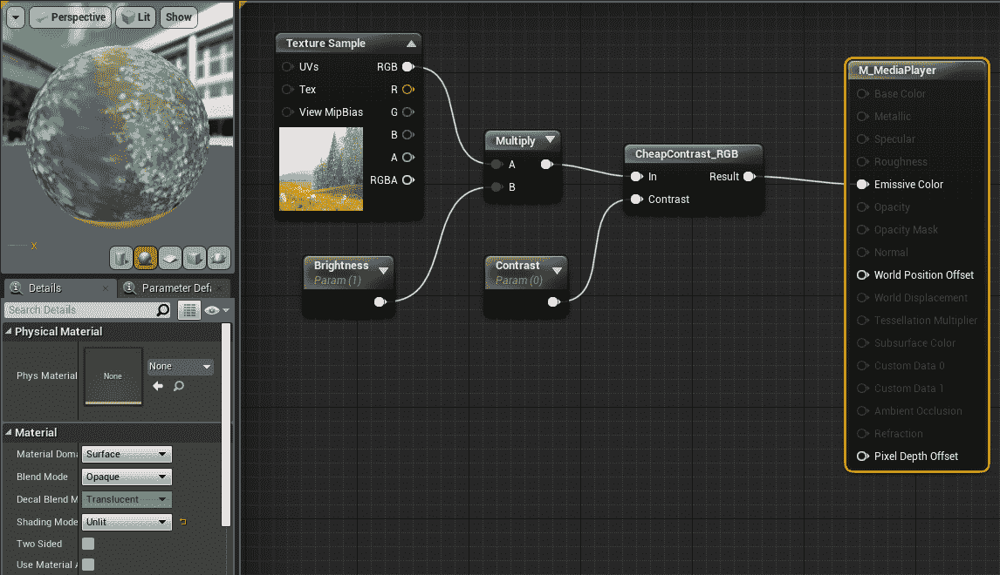

正如你所看到的，我们现在创建了一个简单的材质，使用两个标量参数来允许用户控制图像的亮度和对比度。

让我们从这个材质创建一个材质实例，以便我们可以实时看到这些参数的效果：

1.  在内容浏览器中右键单击你的材质，选择材质实例操作 | 创建材质实例。

1.  将材质实例拖动到屏幕上以将其分配给对象。

1.  打开材质实例并尝试更改刚刚创建的`Brightness`和`Contrast`值。（记住，你需要勾选参数旁边的复选框才能启用修改。）

1.  将材质的预览网格切换为立方体原语，以便更容易看到你正在做的事情：

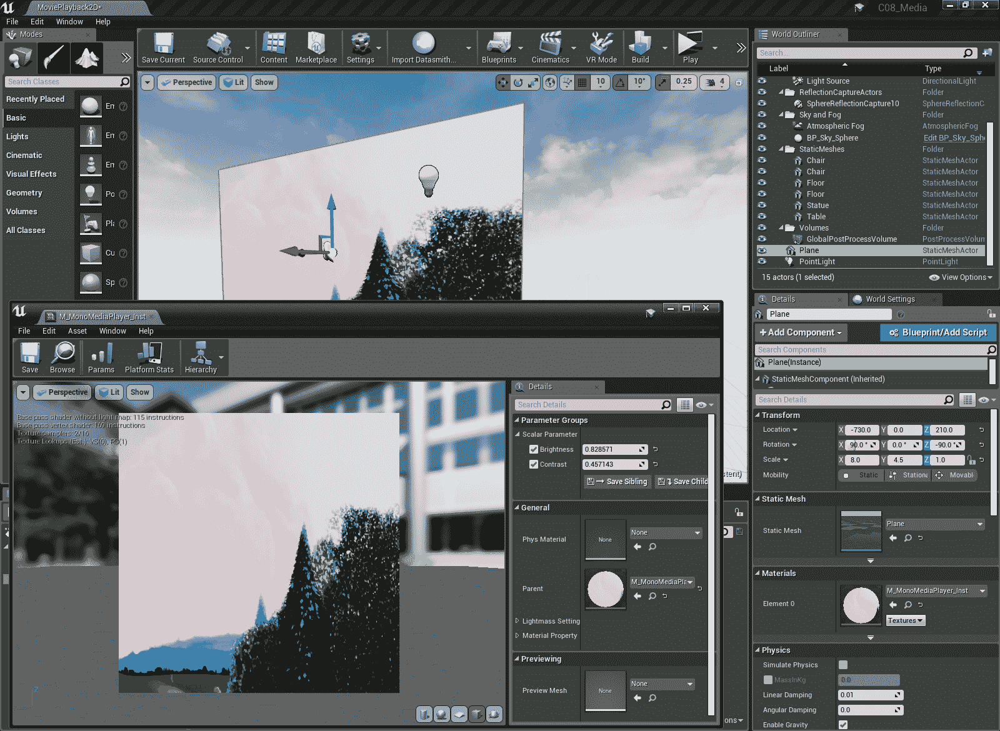

这里有很多我们可以做的事情，我们鼓励你去探索和学习更多关于你可以做什么的内容。

现在你已经了解了在虚幻引擎中播放视频的基础知识，让我们开始深入一些针对虚拟现实的工作，并学习如何以立体 3D 的方式显示视频。

# 显示立体视频

让我们首先创建另一个地图来容纳我们的立体视频屏幕。在你的`MoviePlayback2D`场景中，点击文件 | 另存为...，将地图保存为`MoviePlayback3D`。

现在，我们需要找到一个立体视频文件进行测试。它们可以在网上找到，但由于我们需要下载自己的文件，所以可能会有些困难。stereomaker.net 在这里有一些示例文件：[`stereomaker.net/sample/`](http://stereomaker.net/sample/)。让我们从这里下载 Hibaya Park 的 Cycling 视频。我们还可以在这里找到更多的示例文件：[`photocreations.ca/3D/index.html`](http://photocreations.ca/3D/index.html)。下载 Bellagio Fountains，Las Vegas，Nevada 3D 2048 x 2048 剪辑。这将为我们提供一个并排立体剪辑和一个上下立体剪辑，我们可以用来进行实验。Hibaya 剪辑包含在一个`.AVI`容器中，但只要我们在 Windows 上运行剪辑，那就可以工作。要在另一个平台上运行它，我们必须使用诸如 Adobe Media Encoder 或 AVC 之类的应用程序进行转换：

1.  将这些文件放在你的`Content/Movies`目录中。

1.  为每个新的视频文件创建一个文件媒体源资产。同样，通常更容易使用与磁盘上的电影剪辑匹配的文件媒体源名称。

现在，打开你的媒体播放器。你应该在其可用文件列表中看到这些新的剪辑，并且你应该能够播放它们。你应该看到两个并排的帧，代表左右立体图像（确保你首先使用一个并排立体视频进行这个测试-我们稍后会处理上下立体）：

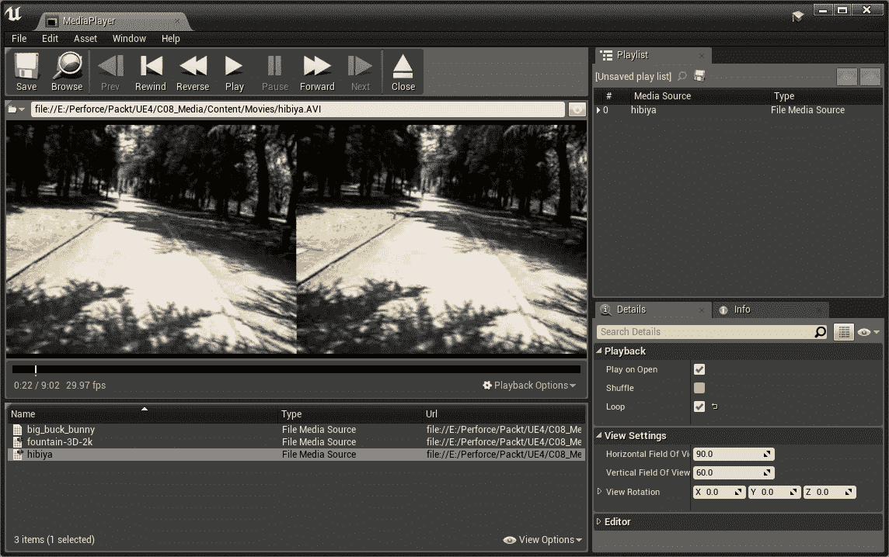

现在的关键是将并排或上下的图像解释为立体图像，并将一个帧输入到左眼，另一个帧输入到右眼。

我们将在材质中处理这个。具体来说，我们想要做的是修改我们提供给纹理的 UV 映射的纹理坐标。

UV 映射确定纹理在 3D 空间中如何在网格上对齐。通过操纵我们在材质中应用纹理的纹理坐标，我们可以选择一次只显示纹理的部分。

打开你的媒体播放器材质。

由于我们希望这个材质能够处理单声道视频源，我们将使用一个静态开关参数来在单声道和立体声模式之间切换。这将允许我们将这个材质作为主材质，但设置单独的材质实例来处理我们想要的特定设置。

静态开关参数是有价值的工具，您可以使用它们在主材质中构建很多行为，并从中派生处理特定情况的材质实例。作为额外的好处，当这些材质被编译时，通过静态开关关闭的任何内容甚至不会编译到材质实例中，所以你基本上是免费的。这意味着您可以制作相当复杂的主材质，并且只需通过使用静态开关关闭您不使用的功能来支付您使用的部分。

让我们在材质中添加一个开关，这样我们就可以创建一个立体声路径，而不会弄乱我们的单声道显示：

1.  在材质编辑图中右键单击并创建一个静态开关参数。将其命名为`SplitStereoMedia`。

1.  右键单击并创建一个纹理坐标节点，并将其输出连接到开关参数的 False 输入。这将在图中显示为一个 TexCoord 节点。

现在，是时候分割图像了。当图像被渲染到 VR 头盔时，它们会分别渲染两次，并且我们可以利用这个信息来确定显示图像的哪一侧。

# 显示视频的一半

要分割图像，我们首先需要访问纹理坐标的两个独立轴，以便我们可以单独操作它们：

1.  拖动纹理坐标输入的输出并从中创建一个 BreakOutFloat2Components 节点。

1.  按住*M*键并单击以创建一个 Multiply 节点。

1.  将 Break 节点的 R 输出连接到 Multiply 节点的 A 输入，并将其 Const B 参数设置为 0.5。

1.  创建一个附加向量节点，并将乘法器的输出连接到 A 输入，将 Break 节点的 G 输出连接到其 B 输入。

1.  将附加节点的结果馈入 Split Stereo Media 开关的 True 输入。

1.  将 Switch 节点的结果馈入 Texture Sample 的 UVs 输入：

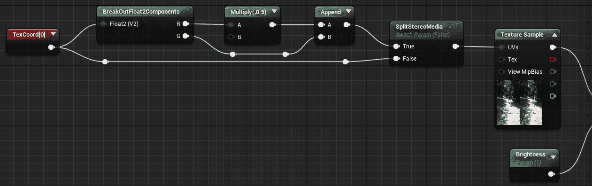

我们刚刚做的是将纹理坐标分成两个通道，标记为 R 和 G。然后我们将 R 通道分成一半，同时保持 G 通道不变，然后重新组装向量，并告诉我们的纹理采样器使用结果将图像映射到应用于的对象上。

让我们测试一下看看它的效果：

1.  打开你场景的级别蓝图。它应该仍然包含对媒体播放器的开源调用。

1.  将其媒体源切换为你的并排视频。由于我们需要一个地方来设置我们的静态开关参数，我们需要一个新的材质实例来显示我们的并排图像。

1.  复制我们刚刚调整对比度和亮度时创建的材质实例。

1.  将其命名为`MI_MediaPlayer_SBS`或类似的名称，以提醒我们它的用途是显示并排立体媒体。

1.  打开它并将其 SplitStereoMedia 开关参数设置为 true。

1.  将其分配给你的屏幕对象。

测试一下。现在你应该只能看到视频的左帧显示在屏幕上。由于我们仍然向每只眼睛显示相同的图像，所以你不会看到任何立体深度。

# 显示不同的视频半边给每只眼睛

现在，让我们在右眼中显示正确的帧：

1.  返回到你的材质。

1.  在材质图中右键单击并创建一个自定义节点。

1.  在其代码属性中，输入以下内容：`return ResolvedView.StereoPassIndex;`。

1.  将其输出类型设置为 CMOT Float 1。

1.  将其描述设置为 StereoPassIndex。

这将创建一个材质表达式自定义节点，当我们渲染左眼时返回 0，当我们渲染右眼时返回 1。我们可以使用这个信息来选择我们为每只眼睛显示的帧的哪一半。

1.  按住*M*键并单击以创建一个乘法节点。

1.  将 StereoPassIndex 的输出传递到其 A 输入，并将其 Const B 参数设置为 0.5：

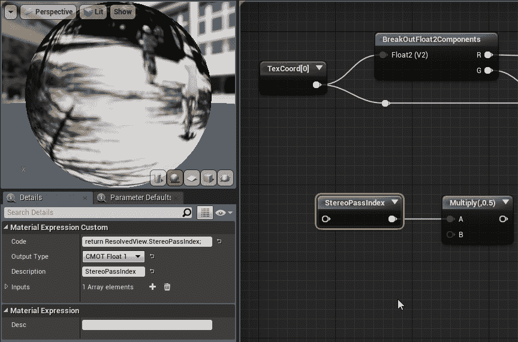

1.  现在，按住*A*键并单击以创建一个加法节点。

1.  将纹理坐标的乘以 R 通道的结果馈入其 A 输入。

1.  将乘法立体通道索引的结果馈入其 B 输入。

1.  将 Add 节点的结果馈入 Append 节点的 A 输入：

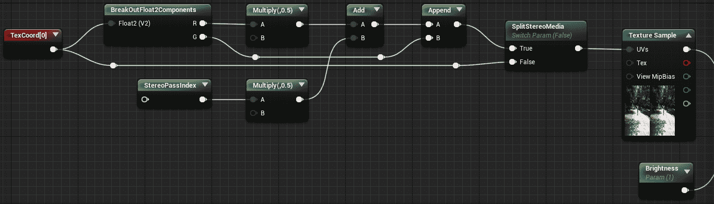

再次测试一下。现在，当你在 VR 头盔中查看视频时，你应该能看到图像中的立体深度。

让我们花点时间来理解我们刚刚创建的内容。

当我们分解纹理坐标并修改 R 值时，我们正在修改纹理映射的水平轴。通过将其乘以 0.5，我们将纹理的一半涂抹在网格的整个表面上。我们制作的 Stereo Pass Index 节点返回左眼的值为 0，右眼的值为 1，因此当我们将此值乘以 0.5 时，我们得到左眼的 0 或右眼的 0.5。然后，当我们将此值添加到纹理坐标的 R 分量时，我们将其偏移了一半的宽度。因此，当渲染左眼时，它只是将纹理空间分成一半，而当渲染右眼时，它将其分成一半并偏移一半，显示正确的帧。这就是我们得到立体图像的方式。

# 显示上下立体视频

修改我们的材质以处理上下立体视频非常简单。我们只需要在 G 通道上进行操作，而不是 R 通道。按照以下步骤开始操作：

1.  重新打开你的媒体播放器材质。

1.  创建一个新的静态开关参数节点。将其命名为`OverUnderStereo`。

1.  *Ctrl* + 拖动 SplitStereoMedia 开关的 True 输入，将其移动到 OverUnderStereo 开关的 False 输入。

1.  将 OverUnderStereo 开关的输出连接到 SplitStereoMedia 开关的 True 输入：

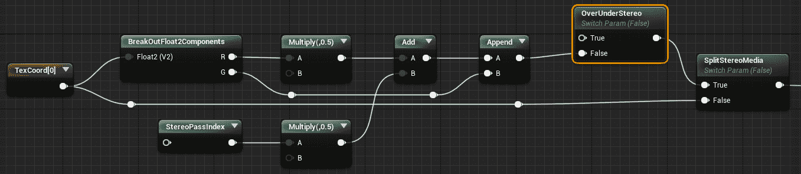

如果 OverUnderStereo 设置为 False，我们的材质将继续使用我们刚刚设置的并排分割。现在，让我们设置它在设置为 True 时的行为。

1.  选择包括 BreakOutFloat2Components 节点在内的节点链，一直到 Append 节点，并按下 Ctrl + W 进行复制。

1.  将 BreakOut 节点的 R 输出直接连接到 Append 节点的 A 输入中。

1.  将 BreakOut 节点的 G 输出连接到 Multiply 节点的 A 输入。

1.  将 Add 节点的输出连接到 Append 节点的 B 输入。

我们刚刚交换了一些东西，所以我们现在在垂直轴上执行与之前在水平轴上执行的相同操作。

1.  将立体通道索引的 Multiply 节点的输出输入到新的 Add 节点的 B 输入中。

1.  将纹理坐标输入到 BreakOut 节点的输入中。

1.  将 Append 节点的输出输入到 OverUnderStereo 开关的 True 输入中：

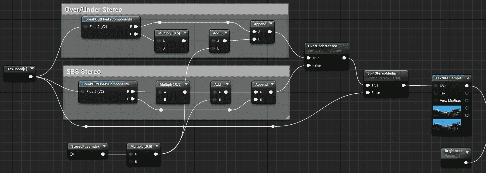

现在，这个材质可以处理单眼、并排立体和上下立体的源。

现在，让我们来测试一下：

1.  关闭您的材质，并在内容浏览器中复制其中一个已经创建的材质实例。

1.  确保其 SplitStereoMedia 参数设置为 True，并将其 OverUnderStereo 参数设置为 True。

1.  将其分配给场景中的屏幕对象。

1.  打开场景的 Level Blueprint，并将 Open Source 节点上的 Media Source 切换为您的上下立体视频。

进入 VR 预览模式。现在我们应该能够正确播放我们的上下立体视频。

# 在 VR 中显示 360 度球形媒体

到目前为止，我们在 VR 中已经相当好地复制了 2D 和 3D 传统屏幕，但让我们进一步迈出一步，做一些在现实世界中不容易做到的事情。VR 最引人注目和常见的用途之一是显示环绕观众的沉浸式 360 度视频。即使是单眼，这也可以在用户中产生相当深的存在感，并且可以使用普通相机和拼接软件或专用相机相对容易地制作出球形图像。

显示球形媒体，在大多数情况下，与在平面屏幕上的显示方式完全相同，但当然我们需要新的几何形状来显示屏幕。

# 寻找 360 度视频

首先，让我们找一个要播放的视频。这里有几个不错的选择：[`www.mettle.com/360vr-master-series-free-360-downloads-page/`](https://www.mettle.com/360vr-master-series-free-360-downloads-page/)。

Crystal Shower Falls 链接带我们到一个 Vimeo 页面，允许我们下载视频。对于我们的测试，1080p 版本应该没问题：

1.  下载视频并将其放置在`Content/Movies`目录中。

1.  为您的视频创建一个文件媒体源。

1.  在媒体播放器中检查它以确保它可以播放。

现在，我们需要一个环境来显示它。

1.  创建一个新的空级别并将其命名为`MoviePlayback2DSpherical`（或者任何您喜欢的名称 - 这是您的地图）。

# 创建一个球形电影屏幕

现在，我们将采取一个普通的球体并修改它，使其法线向内翻转，这样我们就可以在球体内部看到我们的材质：

1.  从 Modes 面板中，选择 Basic | Sphere 角色并将其放置在场景中。

1.  查看其详细信息面板，在 Static Mesh 下，点击浏览资源按钮（放大镜）以导航到内容浏览器中的球体静态网格。我们要创建一个副本。

1.  将 Sphere 静态网格从`Engine Content/BasicShapes`拖动到项目的`Content`目录中（`Content/Chapter08/Environments`是一个不错的选择）。选择“复制到此处”以创建球体的副本。

1.  将其重命名为`MovieSphere`。

1.  打开它。

1.  从您的静态网格编辑器中，选择 Mesh Editing 选项卡。

1.  通过点击工具栏按钮激活编辑模式。

1.  拖动以选择所有网格面。

1.  点击翻转按钮以翻转它们的法线：

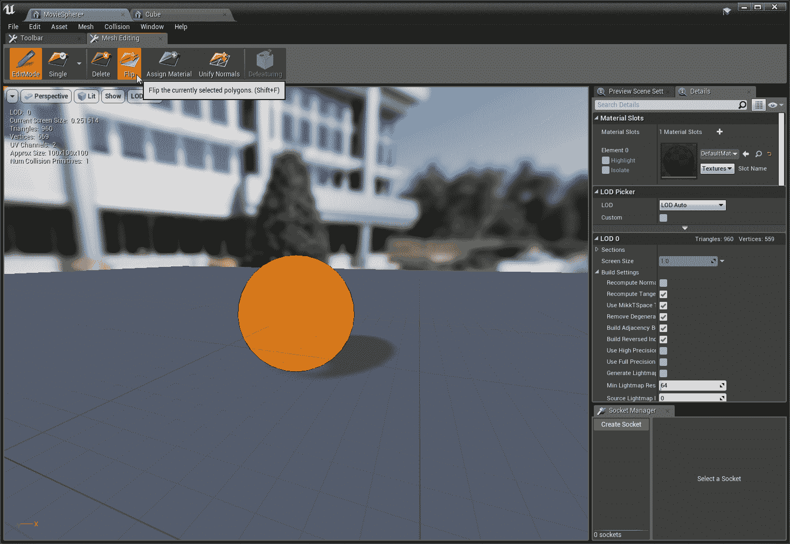

1.  保存并关闭静态网格编辑器。

1.  在你的关卡中放置一个 MovieSphere 网格的实例，并删除旧的球体。

1.  将其位置设置为（X=0.0，Y=0.0，Z=0.0），并将其比例设置为（X=200.0，Y=200.0，Z=200.0）。

1.  选择 MovieSphere，将其 Materials_Element 0 设置为你的 MI_MediaPlayer_Mono 材料实例。

1.  点击添加组件，添加一个 MediaSound 组件，并将其关联的媒体播放器设置为你的媒体播放器。

现在，就像我们之前的场景一样，我们需要告诉媒体播放器加载我们的媒体。

1.  在地图的 Level Blueprint 中，创建一个名为`MediaPlayer`的变量，将其类型设置为 Media Player | Object Reference，编译它，并将其默认值设置为你的媒体播放器。

1.  使用新的 360 度视频作为其媒体源，通过 Open Source 调用你的媒体播放器变量。

1.  从你的 Event BeginPlay 中执行此调用。

测试你的场景。现在你应该能够看到电影在你周围播放。

# 播放立体 360 度视频

现在，我们要为立体 360 度视频做同样的事情。在撰写本文时，立体 360 度视频比其 2D 对应物要少得多，部分原因是它占用了更多的磁盘空间，而且制作起来更加困难，但可以合理地期望事情将继续发展。

与此同时，我们可以在这里找到一个可行的测试文件：[`www.dareful.com/products/free-virtual-reality-video-sequoia-national-park-vr-360-stereoscopic`](https://www.dareful.com/products/free-virtual-reality-video-sequoia-national-park-vr-360-stereoscopic)。

像往常一样，下载文件，将其放在 Content/Movies 目录中，创建一个指向它的 File Media Source 资产，并在媒体播放器中测试以确保它在你的系统上播放。

接下来，让我们复制一份我们的 2D 球形测试地图，用于我们的 3D 测试：

1.  将 MoviePlayback2DSpherical 地图另存为 MoviePlayback3DSpherical。

1.  选择 MovieSphere 资产，并将其分配的材料更改为你的 OverUnder 材料实例。

1.  打开级别蓝图，并将 Open Source 节点更改为指向我们的新文件。

让我们来测试一下。我们有球形的 3D 效果，但是我们的立体声是反转的（至少在这个文件中是这样）。所有应该靠近的东西看起来都很远。我们可以通过向主材料添加另一个选项来纠正这个问题：

1.  打开你的媒体主材料。

1.  添加一个新的静态开关参数，并将其命名为 FlipStereo。

1.  将 StereoPassIndex 节点的输出拖动到 FlipStereo 开关的 False 输入中。

1.  创建一个 OneMinus 节点，将 StereoPassIndex 的输出拖动到其输入中，并将其输出连接到 FlipStereo 开关的 True 输入。

1.  将 FlipStereo 开关的输出连接到 Multiply 节点：

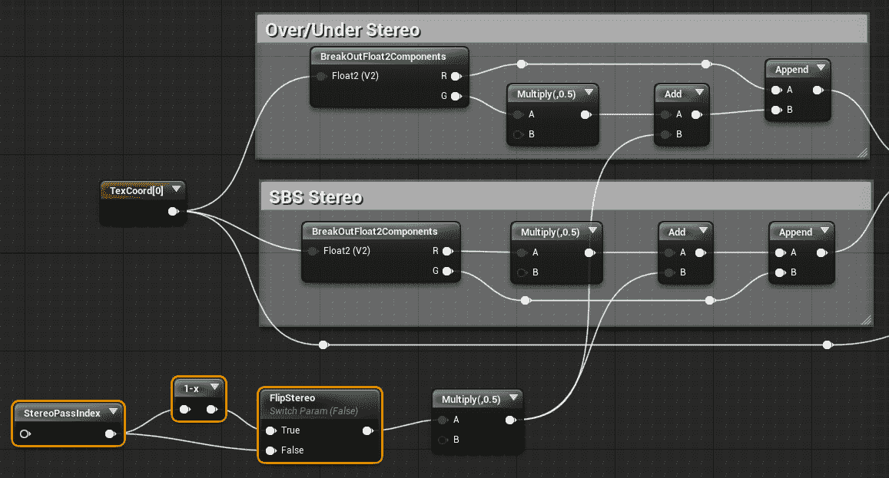

我们在这里所做的只是设置了一个选项，如果 FlipStereo 为 true，我们将接收到左眼为 1，右眼为 0，而不是相反。

现在，让我们创建另一个材料实例来保存这个选项设置，并将其应用到我们的球体上：

1.  复制你的 OverUnder 材料实例，并将其命名为 MI_MediaPlayer_OverUnderFlipped 之类的名称。

1.  打开新的材料实例，并将其 FlipStereo 参数设置为 True。

1.  将其应用到你的电影球体上：

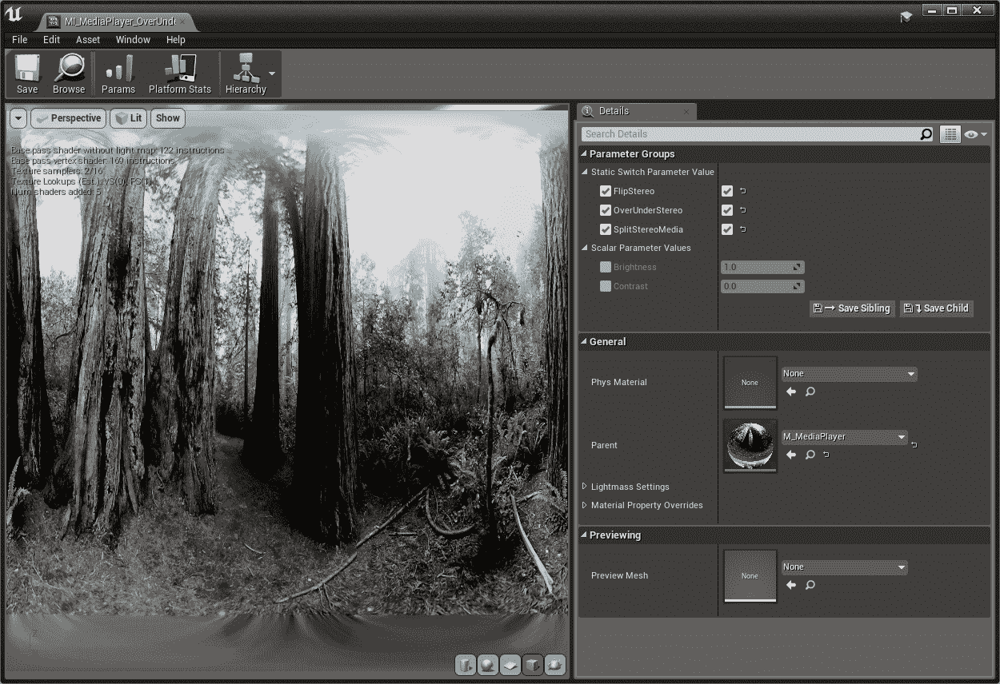

测试地图-现在你应该能够正确地看到立体图像。

花些时间四处看看。这个视频的比特率相当高，所以你可能会偶尔遇到帧率下降的情况，还有一些透视错误，但立体效果非常引人注目。很明显，随着这项技术的发展，我们将能够做出一些令人惊叹的工作。

# 控制你的媒体播放器

在结束本章之前，让我们给玩家一些控制媒体播放器的方法。

我们可以在关卡蓝图中完成这项工作，这是我们迄今为止所做的，但如果我们的项目中有多个地图，这不是一个理想的解决方案。我们将不得不将蓝图代码从一个关卡复制粘贴到另一个关卡，并且如果我们更新其中一个，我们必须记住更新其他关卡。这是不好的做法。

一个更好的主意是创建一个包含所有管理媒体播放器所需代码的管理器角色，并将其放入任何需要支持它的关卡中。这样，我们只需编写一次代码，随着更新，效果将在所有地方都可见。让我们这样做。

# 创建一个 Media Manager

让我们在项目的内容目录中创建一个新的蓝图子目录：

1.  在其中右键单击，选择创建基本资产 | 蓝图类。

1.  对于其父类，选择 Actor。

1.  将其命名为`BP_MediaManager`。

到目前为止，我们一直在使用我们的关卡蓝图来打开媒体播放器上的媒体。我们将首先将该功能移入我们的媒体管理器中：

1.  打开 BP_MediaManager。

1.  创建一个名为`MediaPlayer`的新变量，并将其类型设置为 Media Player | Object Reference。

1.  编译它并将其默认值设置为您的媒体播放器。

1.  创建另一个名为`FileMediaSource`的新变量，并将其类型设置为 File Media Source | Object Reference。

1.  将 Instance Editable 设置为 True，因为我们需要为每个地图上的它设置不同的值。

1.  将其类别设置为 Config，以便用户清楚地知道他们必须编辑此值。

现在，我们已经设置好了变量，让我们使用这个角色的 BeginPlay 来加载我们的媒体。首先，我们将重新创建我们在关卡蓝图中已经做过的事情：

1.  打开 BP_MediaManager 的事件图。

1.  *Ctrl* + 拖动 MediaPlayer 变量到图表中。

1.  调用 Open Source。

1.  *Ctrl* + 拖动您的 File Media Source 变量到图表中。

1.  右键单击它，选择转换为验证的获取。（如果我们尚未设置文件媒体源，我们不想尝试打开它。）

1.  将 Event BeginPlay 的执行线拖动到 File Media Source Get 中。

1.  将 getter 的 Is Valid 执行线拖动到 Open Source 调用的执行输入中。

1.  将 GET 的输出拖动到 Open Source 调用的 Media Source 输入中。

1.  右键单击并创建一个 Print String 节点。

1.  将其 In String 值设置为 Media Manager 的文件媒体源未设置！。

1.  将 GET 的 Is Not Valid 执行线拖动到我们刚创建的 Print String 上：

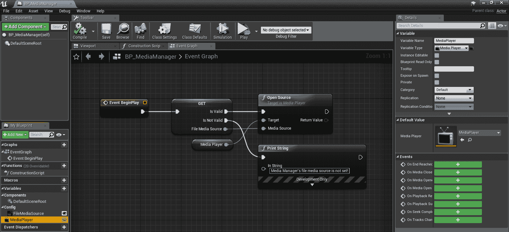

现在，如果我们将此角色放置在任何关卡中并设置其文件媒体源，它将开始在项目的媒体播放器上播放该源。如果该关卡中有一个使用指向此媒体播放器的媒体纹理的材质的对象，我们正在播放的内容将显示在那里。

每当您设置一个系统，如果开发人员或用户未能执行某些操作，可能会失败，就像我们的文件媒体源变量一样，在使用验证的获取并打印警告的习惯。如果您训练自己编写能够自行告知错误的代码，您将节省大量的调试时间。

现在，让我们在当前关卡中放置一个 Media Manager，并替换我们在关卡蓝图中所做的工作：

1.  将 BP_MediaManager 的一个实例拖动到场景中，并将其位置归零。

1.  将其 Config | File Media Source 设置为之前在场景中播放的任何媒体源。

1.  打开场景的关卡蓝图，并删除之前放置在 BeginPlay 中的代码。

1.  测试场景。媒体应该仍然播放，但现在媒体管理器正在处理打开源。

对其他测试关卡重复此操作，以便它们都使用 Media Manager 蓝图。

现在，每个关卡都使用我们的 Media Manager 类的一个实例来操作 Media Player，我们可以更容易地添加适用于所有地方的功能。

现在让我们来做这个。

# 添加暂停和恢复功能

让我们给用户提供暂停和播放视频的方法：

1.  打开 BP_MediaManager。

1.  在其详细面板中，将输入|自动接收输入设置为 Player 0，并将阻止输入设置为 True。

1.  在其事件图中右键单击，选择输入|键盘事件|空格键创建一个新的键盘事件。

1.  再次右键单击，选择输入|游戏手柄事件|MotionController（R）触发器创建另一个输入事件。

1.  *Ctrl* +将媒体播放器变量拖动到图表上。

1.  拖动其输出并创建一个正在播放节点。

1.  将一个分支节点连接到正在播放节点的结果。

1.  将 Space Bar 的 Pressed 执行线连接到分支节点的执行输入。对于触发器输入也是如此。

1.  从媒体播放器变量中拖动另一个连接器，并为其创建一个暂停节点。

1.  将分支节点的 True 执行线连接到暂停节点的执行输入。

1.  从媒体播放器变量拖动另一个连接器（或创建一个重定向节点并从中分支出）并创建一个播放调用。

1.  将分支节点的 False 执行线连接到播放节点：

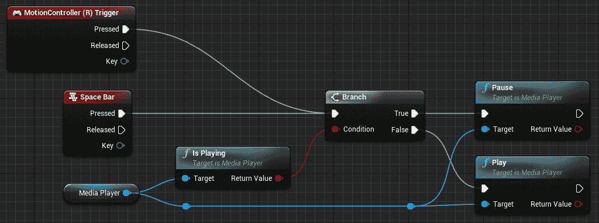

我们在这里做了一些值得讨论的事情。

首先，我们使用了与之前不同的捕获键盘和动作控制器输入的方法。到目前为止，我们所做的一切都依赖于项目设置和`DefaultInput.ini`文件来捕获来自硬件设备的输入并将其重新映射到命名的输入事件。事实上，这仍然是一种更好的方法，但我们想向您展示另一种可能的方法。很多时候，使用直接在蓝图中映射的输入事件原型化系统是有意义的，一旦您的系统工作正常，将它们移入项目设置中，这样更容易为不同的控制器重新映射它们。

还要注意的是，只有因为我们设置了其自动接收输入，这个对象才能够接收输入。否则，默认情况下它不会监听其他设备的输入。

我们在这里做的是查询媒体播放器，看它是否正在播放任何内容，如果是，则暂停它，如果不是，则播放它。

虽然我们不会在这里涵盖它，因为它将成为一个独立的项目，但如果您想创建基于按钮的用户界面并使用小部件交互组件允许用户与控件进行交互，您可以通过使此媒体管理器对象拥有界面并使用按钮事件来管理媒体播放器的行为来实现。

这是一个相当简单的示例，但它演示了您可以与媒体播放器交互的几种方式。您可以查询其状态，控制播放，打开新媒体，甚至为其分配事件，以便在加载媒体完成时响应。

# 为媒体播放器分配事件

让我们演示一种使用媒体播放器上的事件的方法。我们将关闭媒体播放器的“打开时播放”设置，并改为在打开后让媒体管理器播放文件。这是一个重要的模式，因为大型媒体文件在调用 Open Source 后不会立即准备好播放。根据它们的大小和存储它们的硬盘的速度，它们将需要一段时间来打开，因此在打开文件后，指示媒体播放器监听文件加载完成并开始播放是一个好的做法。

实际上，“打开时播放”设置已经实现了这一点，但对于您来说，了解这种模式是很有价值的，这样您就可以在需要对媒体播放器进行更复杂操作时使用它。

让我们设置它：

1.  打开您的媒体播放器资源并关闭其“打开时播放”设置。

如果现在测试您的地图之一，您会发现媒体不再播放，直到您点击空格键或拉动触发器才会开始播放。

1.  打开 BP_MediaManager 并找到在事件 BeginPlay 上进行的 Open Source 调用。

1.  将一个分支节点连接到其返回值。

如果 Open Source 调用找到要打开的文件并将其打开，则返回 True，否则返回 False。我们只希望我们的媒体播放器在我们知道它实际上正在打开文件时等待文件打开。

1.  从媒体播放器变量中拖出一个连接器，并选择 Media | Media Player | Bind Event to OnMediaOpened。

1.  从绑定节点的事件输入中拖出一个连接器，并选择 Add Event | Add Custom Event。

1.  将其命名为`MediaOpened`。

1.  从媒体播放器变量中拖出一个连接器，并调用 Play。

1.  将自定义事件的执行输出连接到 Play 调用的输入：

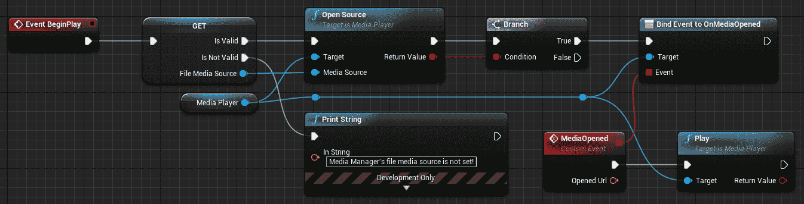

测试一下。当媒体打开完成后，它应该能够播放。实际上，它的行为与 Play on Open 为 true 时完全相同，但这里有一些重要的事情需要讨论。

大多数函数调用只有在完成它们应该完成的工作后才会继续执行。Open Source 有点不同。这就是所谓的**异步任务**。当您调用 Open Source 时，执行将立即继续，但任务本身将花费不确定的时间来完成。当打开大文件、访问网络上的 URL 或执行任何其他任务时，您经常会遇到这种情况，您在开始时真的不知道需要多长时间。**异步**（**Async**）任务在您调用它时启动，然后在将来的某个时间点结束。您调用异步任务的对象几乎总是会在任务完成时抛出某种事件，以便在完成时执行您需要执行的操作。

在媒体播放器对象的 Open Source 任务中，当源完成打开时，将调用 OnMediaOpened 事件。通过将自定义事件绑定到此事件，我们告诉它在媒体完成打开时在蓝图中触发该事件，并在此发生时调用媒体播放器的“播放”方法。

在创建绑定的自定义事件时，最好通过拖出事件连接器并从那里创建自定义事件，就像我们在这个例子中所做的那样。这是因为许多绑定要求它们的绑定事件包含某些输入（这称为签名），如果您只创建一个不匹配所需签名的基本自定义事件，它将不允许您绑定它。如果您直接从事件连接器创建自定义事件，它将自动为您设置正确的签名。在这种情况下，OnMediaOpened 的绑定事件需要传递一个 Opened URL 参数。

这是一个重要的模式，值得学习。视频文件很大，有时对它们进行操作需要时间。了解可以绑定到媒体播放器对象的事件，并确保在任务完成并成功后执行您要执行的操作。

在您的旅行中，您可能会遇到一些开发人员，他们通过在蓝图中添加延迟来处理异步任务。他们会通过试错发现，如果他们延迟调用，那么他们尝试进行的调用将会成功，如果他们立即尝试进行调用，那么调用将会失败，所以他们只是随机设置一个延迟并称之为修复了错误。然而，您不会这样做。这是业余小时的东西，如果他们尝试打开一个更大的文件或其他事情发生变化，它将在以后失败。处理异步任务的正确方法始终是找出任务完成时调用的事件，然后将您需要执行的其他操作绑定到该事件。除非您能够以积极的方式描述为什么延迟是正确的解决方案，否则不要使用延迟来解决问题。正确的解决方案几乎总是一个绑定事件，无论任务需要多长时间都可以正常工作。

您现在已经看到了与媒体播放器对象交互的各种方式的示例。我们已经查询了它的状态，对它进行了调用，并将额外的代码绑定到它的事件上，以便在媒体播放器告诉我们发生了什么时做出响应。媒体播放器还有更多功能，我们鼓励您进行尝试。尝试将事件绑定到其 OnEndReached 上，或者其他可绑定的事件上。尝试使用媒体播放器的 Get Time 和 Duration 调用来创建进度条。您可以做很多事情。

# 总结

在本章中，我们学到了很多关于在虚幻引擎中播放视频文件的知识。我们了解了一些容器和编解码器的知识，以及如何理解视频文件的内容，然后我们学习了各种播放它们的方式，包括在平面屏幕和球体上播放。我们学习了如何创建材质来显示 3D 视频和 2D 视频，并学习了如何创建媒体管理器类来管理它们的播放。

在下一章中，我们将学习虚幻引擎中多人网络游戏的工作原理。
