# 第十章：在虚拟现实中创建多人游戏体验

在本章中，我们将进入一些更高级的领域。与单人应用程序相比，多人游戏软件的编写要复杂得多。无论如何，要编写成功的多人游戏代码，您必须建立一个清晰的心智模型，了解数据是如何从一台计算机传输到另一台计算机的。好消息是，这正是我们在这里要做的。在本章中，我们将会介绍更多的理论知识，因为如果我们只是简单地引导您完成设置网络应用程序的步骤，那是不会对您有所帮助的。您必须了解网络是如何工作的，才能了解您需要如何构建应用程序。但是不要担心，我们将尝试在理论和实际示例之间进行交替，以便您可以建立对这些内容如何工作的实际理解。

我们还需要明确的是，网络是一个庞大而相当高级的主题。在本章中，我们没有足够的空间来讨论艺术的每一个黑暗角落，但如果您在本章结束时对网络应用程序的组成方式、主要部分以及信息如何最常见地传递有一个良好的理解，那就算是成功了。如果您能以一个相对清晰的状态理解这一点，那么当您进一步了解这个主题时，您将能够很好地理解您所看到的内容。

在本章中，我们将学习以下内容：

+   与虚幻的客户端-服务器模型一起工作，确保重要的游戏事件发生在服务器上

+   将角色从服务器复制到连接的客户端

+   当变量的值发生变化时，自动复制变量并调用函数

+   创建一个对拥有者玩家而言与其他玩家不同的角色

+   使用远程过程调用在远程机器上调用事件

让我们开始吧！

# 测试多人游戏会话

在我们深入讨论网络工作原理之前，让我们先学习如何启动一个多人游戏会话。有多种方法可以做到这一点。最简单的方法是直接从编辑器中启动多人游戏会话，在测试网络复制时，大多数情况下这样做就可以了。对于更全面的测试，或者如果您需要其中一个会话在虚拟现实中运行，您可以启动两个独立的游戏会话并将它们连接在一起。稍后我们将展示如何做到这一点，当我们讨论会话类型时。

# 从编辑器中测试多人游戏

幸运的是，虚幻编辑器使得在单台机器上从编辑器中设置多人游戏会相当容易。为了进行这个测试，我们将使用“内容示例”项目：

如果您还没有下载“内容示例”项目，请在 Epic Games Launcher 中选择“虚幻引擎”标签下的“内容示例 | 创建项目”来下载。您应该养成始终在系统上安装当前版本的“内容示例”并将其用作参考的习惯。

1.  打开“内容示例”项目并打开“网络功能”关卡。

1.  在工具栏的“播放”按钮旁边选择下拉菜单，将“多人游戏选项 | 玩家数量”设置为 2。请参考以下截图：

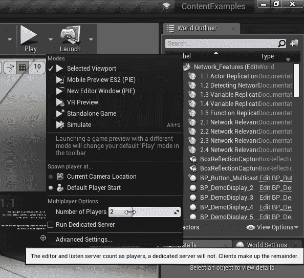

1.  选择“新建编辑器窗口（PIE）”以启动一个多人游戏会话，如下图所示（不幸的是，我们不能使用多人游戏选项在单台机器上支持多人虚拟现实会话）：

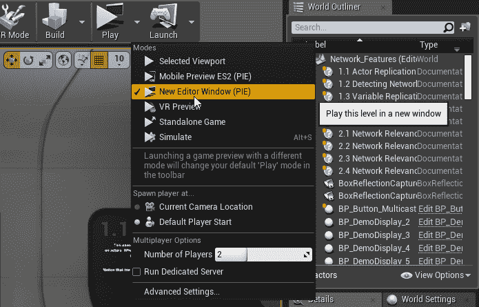

以服务器和客户端身份进行场景探索。注意服务器和客户端之间的差异。我们将在不久的将来更深入地研究这些内容：

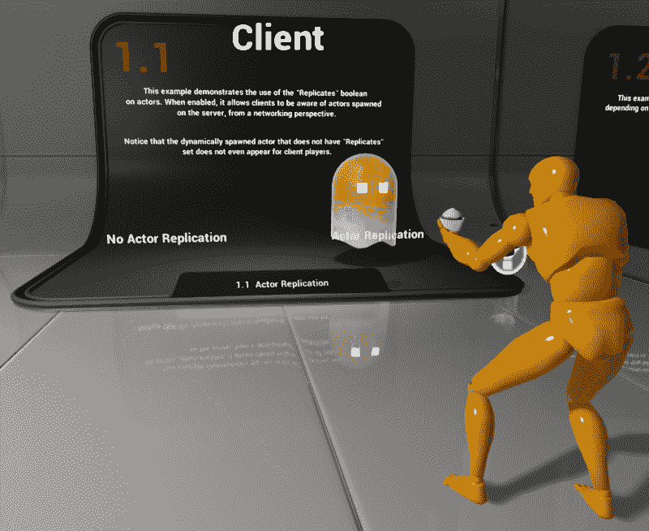

在这个例子中，左边的幽灵在服务器上可见，但在客户端上不可见，因为它没有被设置为复制到客户端。

花些时间理解到目前为止我们所描述的每个显示内容在什么情况下告诉你什么，但如果有些东西还不清楚，不要担心——我们将在接下来的练习中更多地利用这些概念。

有关编辑器中多人游戏测试选项的更多信息，请参阅此处的文档：[`docs.unrealengine.com/en-us/Gameplay/HowTo/Networking/TestMultiplayer`](https://docs.unrealengine.com/en-us/Gameplay/HowTo/Networking/TestMultiplayer)。

# 理解客户端-服务器模型

现在我们有一个正在运行的测试，我们可以在谈论下一个概念时进行一些实践。最好保持这个测试关卡打开，并在我们讨论下一个概念时进行探索。

要理解虚幻引擎中的多人游戏玩法是如何工作的，首先需要了解信息如何在连接的游戏会话之间传递，以及对游戏环境进行的更改。没有捷径可走。要成功编写多人游戏代码，必须建立一个清晰的心智模型，了解正在发生的事情，否则你将遇到很多困难。多人游戏很难调试——如果某些东西不起作用，你不能简单地在蓝图中设置断点并跟踪以查看发生了什么。很多时候，你只会知道你认为应该传递到另一台机器的一些信息从未到达那里。如果你花时间了解网络工作原理，当某些事情不像你预期的那样工作时，你会更容易找出问题所在。多人游戏绝对不是你可以靠胡乱尝试来调试的东西。

所以，让我们学习一下虚幻引擎中的网络工作原理。

为了开始思考这个问题，让我们想象一个场景。假设你创建了一个多人射击游戏，有两个玩家加入了一个会话并且都在玩。其中一个玩家瞄准并开火，现在我们需要向两个玩家展示发生了什么。

起初听起来很简单，但实际上并不是这样。

A 玩家正在瞄准，但这是在 A 玩家的游戏实例中发生的。B 玩家的游戏实例如何知道 A 玩家在哪里，更不用说他们在瞄准什么了？A 玩家开火了。B 玩家的游戏实例如何得知这一点？现在，有人需要确定 A 玩家的射击是否击中了 B 玩家的角色。谁来决定射击是否命中？如果 B 玩家的网络连接较慢，关于 A 玩家瞄准位置的信息还没有到达，怎么办？如果两个游戏实例都被允许决定射击是否命中，它们不会达成一致。谁的意见会占上风？

第一个问题的答案——B 玩家的游戏实例如何知道 A 玩家的移动和动作——是通过一种称为**复制**的过程来处理的。当 A 玩家移动时，他们的角色移动会被**复制**到 B 玩家的游戏实例中，当 B 玩家移动时，他们的移动会被复制到 A 玩家的游戏实例中。

最后一个问题——谁决定射击是否命中——由**服务器**处理，值得花些时间来理解这一点。

虚幻引擎使用**客户端-服务器**模型进行网络管理。这意味着只有一个连接到游戏会话的游戏实例被允许对实际发生的事情做出重要决策。服务器是**权威**的，而客户端不是。如果服务器和客户端对刚刚发生的事情得出了两个不同的结论，那么服务器的意见将被采用。

在点对点模型中，每个人都是平等的。点对点网络架构相对容易设置，但代价很高：当其中一个连接的对等方与其他对等方不同步时，没有人知道哪个状态实际上是真实的。这对于演示或课堂项目可能没问题，但在玩家真正关心结果的环境中是绝对不可接受的。我们需要毫无疑问地知道游戏及其所有玩家的实际状态，而客户端-服务器模型为我们提供了一种可靠的方法来实现这一点。

以下是实际发生的情况：

1.  玩家 A 移动，他们的移动被复制到服务器，服务器将他们的移动复制到所有其他连接的游戏实例。

1.  玩家 B 和其他连接的玩家在他们的游戏会话中看到一个代理，它显示了服务器说玩家 A 的角色所在的位置。

1.  当玩家 A 瞄准并开火时，玩家 A 的客户端实际上会向服务器发送请求，告诉服务器它想要开火，服务器会进行实际决定是否可以开火。

1.  如果服务器确定玩家 A 有弹药，处于正确状态，或者符合游戏规则的要求，它会开火并告诉所有连接的游戏实例。

1.  服务器还收到了玩家 B 的复制移动，因此它具有确定玩家 A 的射击是否命中的所需信息。

1.  如果服务器确定它确实发生了，它会减少玩家 B 的生命值或执行其他必要的操作来响应此事件，并告诉所有连接的客户端玩家 B 被击中。

1.  然后，每个客户端更新其本地状态信息，播放击中动画和效果，并更新其用户界面：

！[](img/39627582-40b9-4801-8485-947381232269.png)

顶部面板表示服务器的视图，而底部面板表示客户端的视图。添加了线条以指示状态可能发生变化并需要复制到客户端的对象。

虚幻引擎的网络架构非常高效，这就是为什么像《堡垒之夜》这样的游戏可以在大量玩家同时连接时实时运行的原因。这其中有很多原因，其中许多是作为开发人员在您的控制之下的。我们将在本章后面深入介绍其中一些重要原因。

现在，让我们仔细看一下几个重要的概念。

# 服务器

术语“服务器”指的是多人环境中的“网络授权”。您会听到这些术语互换使用。技术文档往往会使用术语“网络授权”，因为这更准确地描述了它的实际含义，而您阅读的其他大部分材料将称其为“服务器”。两者指的是同一件事。

当您的网络应用程序出现问题时，很大一部分时间是因为您允许客户端尝试更改游戏状态，而实际上它需要请求网络授权来进行更改。

架构的工作方式如下：服务器托管游戏，并允许多个客户端连接并相互通信数据。通信发生在客户端和服务器之间，客户端几乎不直接与其他客户端通信：

！[](img/2a690e3a-07d6-4d3b-9273-c4012a39b1bf.png)

当玩家执行操作时，关于玩家正在做什么或想要做什么的信息从该玩家的客户端发送到服务器。服务器验证此信息并做出响应，告诉连接的客户端它的决定。

例如，如果您在多人游戏中移动您的玩家角色，实际上您根本没有在本地移动您的角色。相反，您的客户端将告诉服务器您想要移动，然后服务器将确定您的移动方式，并将您的新位置复制回您的客户端和其他连接的客户端。

对于看似直接的客户端之间的消息也是如此。如果你向另一个客户端发送聊天消息，实际上是将它发送到服务器，然后服务器决定哪个客户端或一组客户端应该接收它。

正如我们之前提到的，服务器是负责维护多人游戏会话的实际权威状态的网络授权机构。这个“权威”的概念是关于网络的最重要的概念之一，当我们到达实际的例子时，你会看到我们几乎在做任何事情时都会检查权限。如果你清楚地知道谁应该被允许做出改变，并检查确保任何改变确实是由被允许的实体进行的，你就会领先一步。

一个好的经验法则是：如果其他玩家关心这个变化，它就属于服务器。如果没有其他人关心，就在本地进行。所以，如果你正在播放一个对游戏无关紧要的视觉效果，就不要在服务器上运行它，但如果你正在改变玩家的生命值或移动他们，就在服务器上进行，因为其他人都需要同意这个改变。

除了确保游戏中的任何重要事物一次只有一个描述之外，还有另一个重要原因要维护一个单一的网络授权，那就是确保玩家不能轻易通过修改客户端来作弊。当重要决策留给服务器时，服务器可以相对容易地覆盖黑客客户端上的结果。如果玩家想要开火，确保他们的客户端告诉服务器，让服务器决定他们是否有足够的弹药并且被允许开枪。不要直接在客户端上处理重要的游戏事件。只有在服务器允许的情况下才让它们发生。不要相信客户端。

# 监听服务器、专用服务器和客户端

在虚幻网络环境中，有三种基本类型的游戏会话：两种类型的服务器和一种客户端类型。

# 监听服务器

当你运行一个**监听服务器**时，你的机器充当游戏会话的主机和该游戏会话的授权机构，但它也在运行一个客户端。如果你曾经在虚幻中设置过一个网络游戏，可能看起来好像你正在运行一个点对点会话，但实际上是这样的。监听服务器对于本地玩家来说几乎是看不见的-它看起来不像是一个单独的运行进程，但实际上它与本地客户端是分开的，就像它在另一台机器上一样。

以下命令行参数将使用未烹饪的编辑器数据启动一个监听服务器：

```cpp
UE4Editor.exe ProjectName MapName?Listen -game
```

通常，使用这些命令的最简单方法是创建包含参数的快捷方式，或者编写一个简单的.bat 文件。

以下的.bat 文件将使用 Content Examples 项目的 Network_Features 地图启动一个监听服务器：

```cpp
set editor_executable="C:\Program Files\Epic Games\UE_4.21\Engine\Binaries\Win64\UE4Editor.exe"
set project_path="D:\Reference\UE4_Examples\ContentExamples\ContentExamples.uproject"
set map_name="Network_Features"

%editor_executable% %project_path% %map_name%?listen -game -log -WINDOWED -ResX=1280 -ResY=720 -WinX=32 -WinY=32 -ConsoleX=32 -ConsoleY=752
```

在这个例子中，我们设置了可执行文件位置、项目路径和地图名称的变量，只是为了使文件更容易阅读和编辑。我们还打开了日志，并明确设置了窗口大小和位置，以便更容易看到正在发生的事情，并在屏幕上适应其他会话。

# 专用服务器

**专用服务器**在同一会话中没有运行客户端。它不接受输入或渲染输出，因此可以进行优化，以比监听服务器更便宜地运行。由于专用服务器比完整的游戏客户端要小得多，因为它们不需要包含任何将呈现给玩家的内容，所以可以在单台机器上容纳许多个专用服务器进行托管。现有的游戏可执行文件可以被告知将自己作为专用服务器运行，或者开发人员可以选择编译一个专用服务器的单独可执行文件，这可以进一步防止作弊，并且可以使可执行文件在磁盘上的占用空间更小。

这个命令将使用编辑器数据启动一个专用服务器：

```cpp
UE4Editor.exe ProjectName MapName -server -game -log
```

请注意，我们选择为此会话打开日志。这是因为专用服务器不会打开渲染窗口，所以一个可见的日志对于了解它在做什么是至关重要的。

我们可以修改前面的.bat 文件来启动一个专用服务器：

```cpp
set editor_executable="C:\Program Files\Epic Games\UE_4.21\Engine\Binaries\Win64\UE4Editor.exe"
set project_path="D:\Reference\UE4_Examples\ContentExamples\ContentExamples.uproject"
set map_name="Network_Features"

%editor_executable% %project_path% %map_name% -server -game -log

```

在这个例子中，我们用-server 参数替换了?listen 指令，当然我们也不需要任何窗口放置规格，因为专用服务器不会打开游戏窗口。

# 客户端

**客户端**是网络应用程序和玩家之间的联系点。如果我们使用监听服务器，客户端可能在与服务器相同的系统上运行，或者如果连接到远程主机或专用服务器，则完全独立于服务器。客户端负责接受玩家的输入，通过**远程过程调用**（**RPC**）将输入传递给服务器，并通过复制从服务器接收有关游戏状态的新信息。

以下命令将启动一个客户端：

```cpp
UE4Editor.exe ProjectName ServerIP -game
```

请注意，在上面的示例中，`ServerIP`是您要连接的服务器的 IP 地址。如果您连接到在您自己的机器上运行的服务器进行测试，则默认的主机地址`127.0.0.1`将连接到在本地机器上运行的服务器。

这个.bat 文件将启动一个连接到同一台机器上运行的服务器的客户端：

```cpp
set editor_executable="C:\Program Files\Epic Games\UE_4.21\Engine\Binaries\Win64\UE4Editor.exe"
set project_path="D:\Reference\UE4_Examples\ContentExamples\ContentExamples.uproject"

%editor_executable% %project_path% -game 127.0.0.1 -log -WINDOWED -ResX=1280 -ResY=720 -WinX=1632 -WinY=32 -ConsoleX=1632 -ConsoleY=752
```

同样，-log 和窗口大小参数完全是可选的-如果您设置快捷方式以使窗口在启动时互不干扰，那么测试多人会话将更加容易。

现在我们已经进行了一些初步的实验并讨论了一些基本的想法，让我们设置我们自己的测试项目，这样我们就可以进行自己的实验了。

# 测试多人虚拟现实

要在虚拟现实中测试多人游戏，通常需要在网络上有两台单独的 PC。有时可以在单台机器上测试多人虚拟现实，但是某些虚拟现实头戴设备驱动程序会在第二个应用程序启动时自动发送退出信号给正在运行的 3D 应用程序。

从 Unreal 4.21 开始，HTC Vive 插件会在第二个插件启动时自动关闭现有的 Unreal 会话。（执行此操作的代码位于`FSteamVRHMD::OnStartGameFrame()`中，但不幸的是，已安装的二进制文件的用户无法轻松更改此行为。）Oculus HMD 插件不会自动退出现有会话，因此如果您使用 Oculus Rift，则可能能够在单台机器上测试多人游戏，但如果您使用 Vive，则需要两台 PC。

如果你想试一试，只需在任何启动字符串中添加`-vr`关键字。

一个服务器启动字符串看起来会像这样：

```cpp
%editor_executable% %project_path% %map_name%?listen -game -vr -log -WINDOWED -ResX=1280 -ResY=720 -WinX=32 -WinY=32 -ConsoleX=32 -ConsoleY=752
```

而且，客户端启动字符串看起来会像这样：

```cpp
%editor_executable% %project_path% -game -vr 127.0.0.1 -log -WINDOWED -ResX=1280 -ResY=720 -WinX=1632 -WinY=32 -ConsoleX=1632 -ConsoleY=752
```

当然，如果你想在单台机器上进行测试，只需设置一个会话一次使用 VR。

因为对许多用户来说，使用单台机器测试多人虚拟现实是不切实际的，所以我们将在大部分时间内以 2D 方式运行我们的多人示例，以便您可以在一个可以合理支持测试的环境中学习这些概念。然而，我们仍然会讨论一些特定的事情，您需要做一些特定的事情，以使玩家角色的动画对头戴式显示器和动作控制器的移动做出适当的响应，这样您就可以在多人虚拟现实中有一个良好的起点。

# 设置我们自己的测试项目

与上一章一样，我们将从创建一个带有以下设置的干净项目开始：

1.  空白的蓝图模板

1.  移动/平板硬件目标

1.  可扩展的 3D 或 2D 图形目标

1.  没有起始内容

像往常一样，这是我们的项目设置备忘单：

1.  引擎|渲染|前向渲染器|前向着色：True

1.  引擎|渲染|默认设置|环境光遮蔽静态分数：False

1.  引擎 | 渲染 | 默认设置 | 抗锯齿方法：MSAA

1.  引擎 | 渲染 | VR | 实例化立体声：True

1.  引擎 | 渲染 | VR | 循环 Robin 遮挡查询：True

然而，为了简化学习这个具有挑战性的主题，我们将以不同的方式设置一个值：

+   项目 | 描述 | 设置 | 在 VR 中启动：False

在设置完所有这些设置后，允许项目重新启动。

# 添加一个环境

让我们给自己一些环境资产来玩，这样我们就不会一直看着一个空的关卡了。

打开你的 Epic Games 启动器，找到 Infinity Blade: Ice Lands 包。将其添加到你的项目中。

如果你无法向项目添加内容包，因为它说它与你当前的项目版本不兼容，你通常可以通过将内容包添加到一个使用内容包允许的最高版本构建的项目中，然后将其资产迁移到你的新项目中来解决这个问题。所以，例如，如果我想将 Ice Lands 添加到一个 4.21 项目中，而启动器告诉我不能这样做，因为 Ice Lands 只与 4.20 兼容，我可以将内容添加到一个 4.20 项目中，然后将其迁移到 4.21 项目中。大多数情况下，这样做是有效的。

这可能需要一些时间。一旦这些资产被添加，打开你的项目。我们将通过创建一个新的游戏模式来为多人游戏会话做好准备。

# 创建一个网络游戏模式

还记得我们很久以前提到过游戏模式负责游戏规则吗？在多人游戏中，这变得更加重要，因为如我们所提到的，重要的游戏事件只应该发生在服务器上。如果你将这两个考虑因素结合起来，那么当多人游戏进行时，只会有一个游戏模式，并且它存在于服务器上。

对于开发者来说，这意味着如果你编写直接与游戏模式交互的代码，在单人游戏会话中测试时会运行良好，但在多人游戏中测试时会失败，因为客户端上没有游戏模式。这让许多新的多人游戏开发者感到困惑，所以现在是一个好时机来快速了解虚幻的网络框架，并理解不同对象的位置。

# 网络上的对象

在思考多人游戏框架中的对象时，你可以将它们看作占据四个不同的领域：

+   仅服务器：对象仅存在于服务器上。

+   服务器和客户端：对象存在于服务器和每个客户端上。

+   服务器和拥有客户端：对象存在于服务器和拥有它们的客户端上，但在其他客户端上不存在。

+   仅拥有客户端：对象仅存在于拥有它们的客户端上。

请参考以下截图：

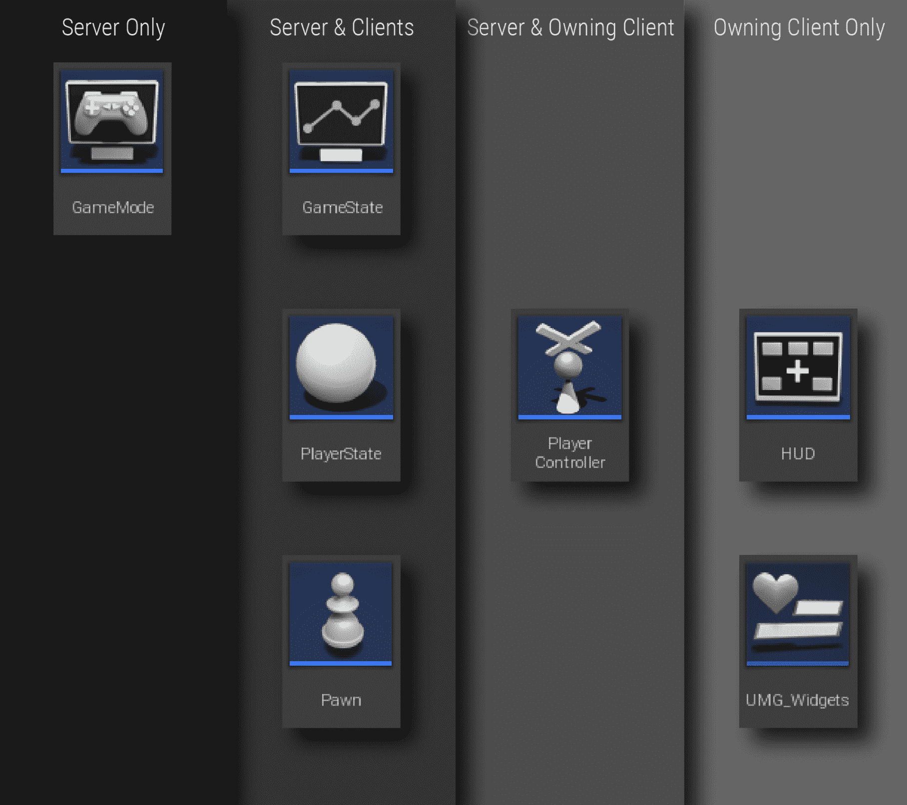

虽然这一点乍一看可能像是一个学术问题，但你真的需要理解这一点。在你早期的网络职业生涯中，你会尝试与一个你认为它存在的对象进行通信，但实际上它并不在你认为的位置，因为在单人游戏中你从来不需要考虑这个问题。在多人游戏中，它们并不在同一个空间中，你需要学会它们在哪里。

让我们换个角度来看：

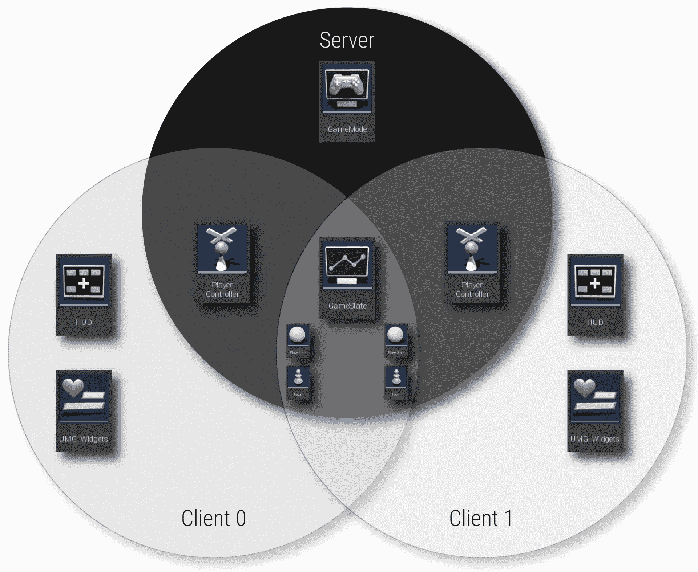

基于 Cedric Neukirchen 出色的多人网络手册的图表，可以在这里找到：http://cedric-neukirchen.net/2017/02/14/multiplayer-network-compendium/

在上面的图表中，你可以看到以下内容：

+   服务器拥有游戏模式，没有客户端可以访问它。

+   服务器和每个连接的客户端都可以看到游戏状态。只有一个这样的状态。

+   服务器和每个连接的客户端可以看到每个客户端的玩家状态。

+   服务器和每个连接的客户端可以看到每个客户端的角色。

+   服务器可以看到每个连接的客户端的玩家控制器，但客户端无法看到其他客户端的玩家控制器。

+   HUD 和 UI 元素仅存在于客户端上，其他人都不知道它们。

让我们简要地讨论一下每个对象在多人游戏中的作用。

# 仅服务器拥有的对象

正如我们刚才提到的，游戏模式仅存在于服务器上。它运行游戏并是正在进行的游戏的唯一权威。按设计，客户端无法直接访问游戏模式。我们已经看到游戏模式负责决定为游戏创建哪些对象类。在多人游戏中，游戏模式通常承担额外的责任，例如选择玩家生成到哪个队伍，他们的角色出现在哪里，以及比赛是否准备好开始或结束。

游戏模式还适用并执行游戏规则。假设我们的游戏地图被分成了几个区域，这些区域可以变成危险区，如果玩家留在其中，就会受到伤害。游戏模式将负责确定哪个区域变得危险，以及何时发生。

然而，这引发了一个问题。如果游戏模式仅存在于服务器上，客户端无法看到它，那么客户端如何知道哪些区域是危险的，哪些不是呢？

这就是下一层对象的作用-它们在客户端和服务器上都存在。

# 服务器和客户端对象

当客户端需要获取游戏状态的信息时，它们从**游戏状态**中获取，该状态由服务器拥有但复制给客户端。我们还没有真正讨论过复制，所以现在你可以将其视为从服务器发送到连接的客户端的对象副本。游戏模式从游戏状态中读取信息并写入信息，服务器通过复制将更新后的游戏状态的副本发送给所有连接的客户端。

回到我们之前的例子，如果游戏模式仅在自身的变量中存储有关哪些区域是危险的信息，那么没有人会知道它。如果游戏模式将此信息存储在复制给客户端的游戏状态上，客户端可以从游戏状态中读取此信息并做出响应。

如果我们的游戏模式还要更新每个玩家的分数，我们应该把这些信息放在哪里？当然，我们知道它不应该放在游戏模式中，因为在那里没有人能看到它。我们可以将其放在游戏状态中，并为每个玩家维护一个分数数组，但有一个更好的地方可以存放这些信息。游戏状态为每个连接的客户端维护了一个**玩家状态**对象的数组。这是一个理想的位置，可以存放适用于单个玩家但其他玩家需要了解的信息，比如玩家的分数。

我们已经熟悉了角色扮演的工作-这些是玩家在虚拟世界中的化身。它们在服务器上维护并复制到客户端，因此其他玩家可以看到它们的移动和其他状态信息。

# 服务器和拥有客户端的对象

我们之前已经看到，玩家控制器负责管理来自玩家的输入和显示给玩家的输出。它拥有摄像机和 HUD，并处理输入事件。多人游戏中的每个连接的客户端都有一个与之关联的玩家控制器，并且可以像在单人游戏会话中一样访问它。服务器也知道每个客户端的玩家控制器的情况，但客户端无法看到其他客户端的玩家控制器的任何信息。

# 仅拥有客户端的对象

最后，UI 显示小部件等对象仅存在于适用于它们的客户端上。服务器不知道也不关心它们，其他客户端也一样。这些是纯粹的本地对象。

我们知道，我们给你提供了很多理论知识，但正如我们所提到的，这很重要。如果你花一点时间来理解所描述的结构，编写多人应用程序时就会少些困惑。

话虽如此，让我们回到一些实际操作。

# 创建我们的网络游戏模式

我们将使用此登录来在不同的生成点生成不同的玩家。在继续之前，让我们进入地图并添加第二个玩家起始对象：

1.  从模式面板中，选择“基本 | 玩家起始点”，将其拖放到地图的某个位置，并保存地图：

记得使用*P*键来验证你的生成点是否在一个具有有效导航网格的区域上。（我们现在实际上不需要导航网格，但这是验证你选择的位置的地板碰撞是否良好以及是否在游戏区域内的好方法。）

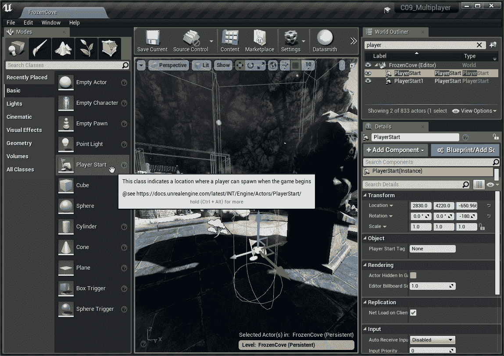

在地图的另一端添加了第二个玩家起始点。

现在，让我们创建一个游戏模式来管理我们的网络游戏：

1.  打开你的新项目后，在内容浏览器中创建一个目录。将其命名为`Multiplayer`（或者你喜欢的其他名称）。

1.  在此目录中创建一个蓝图子目录。

1.  右键单击创建基本资产 | 蓝图类 | 游戏模式基类。将其命名为`BP_MultiplayerGameMode`。

如果你查看 Content Examples 项目的 BP_GameMode_Network，你会看到它在事件 OnPostLogin 中实现了自己的玩家起始点选择。你不需要这样做。原生的 GameModeBase 类已经为你做了这个。如果你确实想要为选择玩家起始点创建特殊规则（例如按团队选择），正确的方法是重写 ChoosePlayerStart 函数。要做到这一点，选择“函数 | 覆盖 | 选择玩家起始点”，并在生成的图表中放入任何你想要的逻辑。

1.  打开设置 | 项目设置 | 项目 | 地图和模式，并将默认游戏模式设置为我们的新游戏模式。

让我们来测试一下：

1.  选择工具栏“播放”按钮旁边的下拉菜单，将“Multiplayer Options | Number of Players”设置为 2。

1.  从播放按钮中选择“在新窗口中播放此级别”，以启动一个双人测试。

你应该看到一个玩家生成在原始生成点，另一个玩家生成在你刚刚创建的新生成点。

# 创建一个网络客户端 HUD

让我们为客户端添加一个简单的 HUD，以便向用户显示有关游戏的信息。同样，如果我们计划此游戏仅在 VR 中运行，我们将不使用 HUD 对象，而是将其构建为附加小部件的 3D 形式。我们之所以这样做，是因为在本章中我们有很多内容要涵盖，我们希望将其集中在网络上。

虽然我们将专注于为本章创建 2D HUD，但我们可以借此机会添加一些安全性，以确保我们不会尝试在 3D 空间中显示 2D 元素。

让我们创建一个新的 HUD 来使用：

1.  从项目的蓝图目录中，右键单击“创建基本资产 | 蓝图类”，展开“所有类”扩展器，并选择 HUD 作为您的类。请参考以下截图：

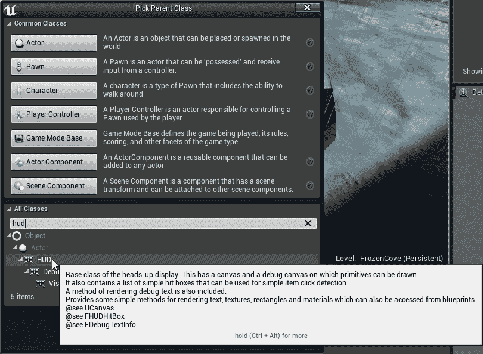

1.  点击“选择”按钮来创建它。

1.  将其命名为`BP_MultiplayerHUD`。

1.  打开我们的新游戏模式，并将此 HUD 设置为其 HUD 类。

# 为我们的 HUD 创建一个小部件

现在，让我们创建一个小部件来显示在我们的 HUD 上：

1.  右键单击或选择“添加新建 | 用户界面 | 小部件蓝图”，并将生成的小部件命名为`WBP_NetworkStatus`。

1.  打开其设计面板，并将一个文本块拖放到面板的左下角。

请注意，因为我们在这种情况下创建了一个 2D 界面，我们没有指定显式的屏幕大小；相反，我们允许它填充整个屏幕。正如你在之前的 UI 工作中所记得的，当你构建一个用于 3D 使用的小部件时，你会想要指定其大小。

1.  将文本块的锚点设置为左下角。

1.  将其 Position X 设置为 64.0，将其 Position Y 设置为-64.0。

1.  将其对齐设置为 X=0.0，Y=1.0。

1.  将其命名为`txt_ClientOrServer`。

1.  点击其 Content | Text 条目旁边的 Bind 按钮以创建一个绑定，并选择 Create Binding：

！[](img/3e28d546-8396-489a-a8ec-ff27bfdb8617.png)

在生成的函数图中，我们将检查此小部件的拥有玩家控制器是客户端还是服务器，并相应地设置此小部件的文本：

1.  创建一个 Get Owning Player 节点。

1.  从其返回值中拖出生成的玩家控制器引用并调用 Has Authority。

1.  从 Has Authority 调用的结果创建一个 Select 节点。

1.  将 Select 节点的返回值拖入函数的返回值中。

1.  在 Select 节点的 False 输入中输入`Client`，在 True 输入中输入“Server”：

！[](img/0ced092c-d829-4de8-87d1-602b24347b3d.png)

让我们在这里谈论一些事情。

还记得我们将服务器描述为“网络权限”吗？现在，Has Authority 检查正在测试所拥有的玩家控制器是否驻留在服务器上。在编写网络代码时，您经常需要测试权限，因为您经常需要根据代码是在客户端还是服务器上运行而采取不同的操作。将此作为一个非常重要的概念记在心中。检查权限是您指定哪些行为发生在服务器上，哪些行为发生在客户端上的方式。

还要注意 Get Owning Player 节点上的闪电和屏幕图标。在单人游戏应用程序中，我们不关心这个图标，但在多人游戏中很重要。该图标表示所调用的函数仅在客户端上发生，不能在服务器上使用。在这种情况下，这是可以的。如果您回想一下之前的图表，HUD 及其拥有的小部件仅存在于客户端上，因此这个仅限客户端的调用将起作用。它返回的玩家控制器引用可以存在于客户端或服务器上，这就是为什么我们将从 Has Authority 检查中获得有效结果的原因。

在思考时，请参考网络框架图。

# 将一个小部件添加到我们的 HUD 中

现在，我们将把这个小部件添加到我们的 HUD 中：

1.  打开 HUD 的事件图，并找到或创建一个 Event BeginPlay 节点。

1.  创建一个 Is Head Mounted Display Enabled 节点。

1.  使用其结果创建一个分支。

1.  从分支节点的 False 输出中拖出并创建一个 Create Widget 调用。

1.  将其类设置为刚刚创建的小部件蓝图。

1.  创建一个 Get Owning Player Controller 节点，并将其结果馈入 Create Widget 节点的 Owning Player 输入。

1.  拖出 Create Widget 节点的返回值并调用 Add to Viewport：

！[](img/addde112-e480-4238-9cb4-6de7c08ab536.png)

我们刚刚做的是检查我们是否在 VR 中，如果不是，则创建一个网络状态小部件的实例并将其添加到 HUD 中。

如果您想要在 VR 中实现一个 3D 小部件，这将是一个合理的地方。您可以以与之前相同的方式创建一个 3D 小部件，并使用 Get Owning Pawn 调用来获取玩家 Pawn 并将小部件的包含的 actor 附加到它上面。同样合理的是，我们可以像之前一样在 Pawn 上创建一个 3D 小部件，并在 Is Head Mounted Display Enabled 检查返回 false 时隐藏或销毁它。

让我们来测试一下。您应该会看到一个标记为“服务器”的会话，另一个标记为“客户端”的会话。

现在，尝试在播放菜单上选中“运行专用服务器”复选框并再次运行它：

！[](img/0dccb107-47a5-45e3-bdb8-36cdebbbfb36.png)

这次，您会看到两个会话都标记为客户端。这里发生的情况是，一个专用服务器以不可见的方式生成，并且两个玩家都作为客户端连接到它。在运行此测试之后，再次取消选中“运行专用服务器”。我们将需要一个可见的服务器和客户端来进行下一部分的操作。

# 网络复制

现在我们已经谈了一些关于服务器和客户端的内容，让我们更多地了解信息是如何在它们之间传递的。

首先，也是最重要的概念是**复制**。复制是一个过程，通过该过程，一个存在于一个系统上的角色或变量值被传递到另一个连接的系统，以便在那里也可以使用。

这带来了一个重要的观点：只有你选择复制的那些项目才会被传递给其他连接的系统，这是有意的。虚幻引擎的网络基础设施被设计为高效，而保持这种效率的一个主要方法，特别是如果你有很多玩家，就是只发送你绝对需要通过网络发送的信息，并且只发送给那些实际上需要接收它的人。想想像《堡垒之夜》这样的大规模游戏。如果每个连接的玩家的每个数据都被发送给其他玩家，它根本无法运行。虚幻引擎可以处理非常庞大的玩家人数，它通过让你作为开发者完全控制什么被复制以及复制给谁来实现这一点。然而，这种权力也带来了责任。如果你不告诉一个角色或变量进行复制，它就不会复制，你在连接的机器上也看不到它。

让我们从一个简单的例子开始，看看这是如何工作的。

# 创建一个复制的角色

假设我们想使用旗帜来标记游戏中的某个东西，并且所有玩家都能看到它的位置很重要。

我们可以从创建一个角色开始，所以让我们首先这样做：

1.  在你的`Blueprints`文件夹中，右键选择创建基本资产 | 蓝图类 | 角色。我们可以将我们的角色命名为`BP_ReplicatedFlag`。打开它。

1.  选择添加组件 | 静态网格。

1.  将组件的静态网格属性设置为`/Game/InfinityBladeIceLands/Environments/Ice/Env_Ice_Deco2/StaticMesh/SM_Env_Ice_Deco2_flag2`。

1.  选择静态网格组件后，选择添加组件 | 骨骼网格，以创建附加到旗杆静态网格的子骨骼网格。

1.  将组件的骨骼网格属性设置为`/Game/InfinityBladeIceLands/Environments/Ice/EX_EnvAssets/Meshes/SK_Env_Ice_Deco2_BlowingFlag3`。

1.  将骨骼网格组件的位置设置为（X=40.0，Y=0.0，Z=270.0），并将其缩放设置为（X=1.8，Y=1.8，Z=1.8）。

1.  将静态网格组件拖到根组件上，并将其设置为新的根。

1.  添加一个点光源组件，并将其位置设置为（X=40.0，Y=0.0，Z=270.0），这样我们的旗帜就会显眼起来。

# 仅在服务器上生成一个角色

现在，让我们将旗帜生成到关卡中，但只在服务器上生成：

1.  从你的模式面板上，拖动一个目标点到地图上的某个位置。将其命名为`FlagSpawnPoint`。

1.  打开你的关卡蓝图，在 FlagSpawnPoint 仍然被选中的情况下，右键单击事件图表以创建对它的引用。

1.  找到或创建一个事件 BeginPlay 节点。

1.  从这个节点拖动执行线，并创建一个 Switch Has Authority 节点。

1.  从 Switch Has Authority 节点的 Authority 输出中拖动执行线，并创建一个 Spawn Actor from Class 节点。

1.  将其类设置为我们刚刚创建的 BP_ReplicatedFlag 角色。

1.  从引用中拖动一个输出到你在关卡中的旗帜生成点，并调用 Get Actor Transform。

1.  将变换输入到生成节点的生成变换中：

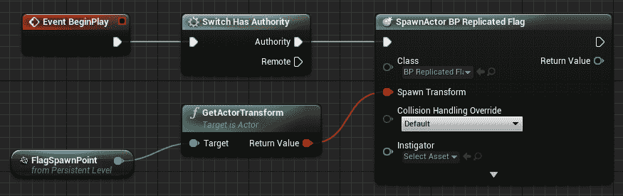

运行它。你会看到旗帜在服务器上生成，但你在客户端上看不到它。让我们通过讨论来看看为什么会这样。

在上面的截图中，我们在`BeginPlay`上做的第一件事是检查我们是否有权限。再次强调，*网络权限*只是服务器的另一个术语。如果我们有权限，意味着我们在服务器上运行，我们会在我们提供的位置生成旗帜。如果我们不在服务器上，我们就不会生成它，这就是为什么我们在客户端视图中没有看到它的原因。

这是一个重要的模式要记住。当我们谈论确保重要的游戏事件仅在服务器上发生时，这就是您要做的。检查是否具有权限，并仅在具有权限时执行操作。

# 将角色复制到客户端

当然，在这种情况下，我们也希望在客户端上看到这个角色，但目前我们不能，因为它只存在于服务器上。让我们通过将其变成一个*复制*角色来改变这一点：

1.  打开我们的旗帜角色蓝图，在其详细信息|复制部分中，将 Replicates 设置为 true：

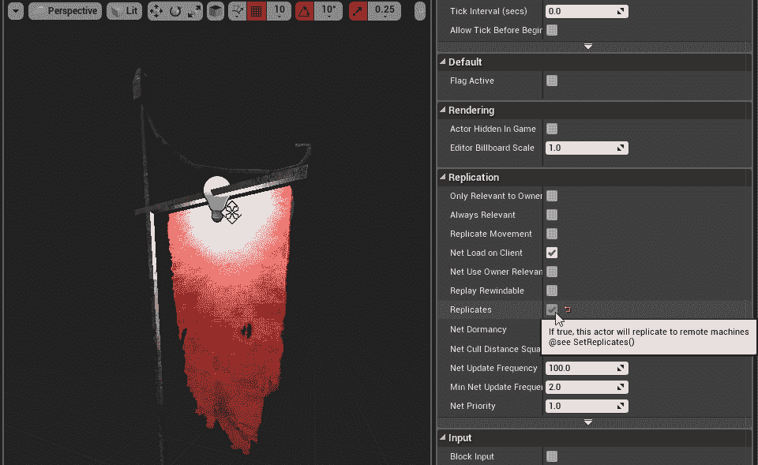

再次进行测试。现在，我们也在客户端上看到了标志。

通过指示该角色应该复制，我们现在告诉服务器将生成的对象发送给所有连接的客户端。您可能已经注意到，在测试时，您可以看到其他玩家的位置表示为一个灰色的球体漂浮在空间中。这是因为我们当前使用的默认 pawn 类也设置为复制。（如果您有兴趣在源代码中看到这一点，请打开`<您的引擎安装位置|\Engine\Source\Runtime\Engine\Private\DefaultPawn.cpp`，您将看到构造函数中的`bReplicates`设置为 true。）

# 复制一个变量

让我们进一步思考一下，假设我们在旗帜上放置的这个点光源对我们的游戏很重要。如果是这样的话，我们需要确保只有服务器改变其值，并且所有客户端都可以看到该值。这意味着我们需要在改变之前确保我们有权限，然后将该更改复制到连接的客户端。

1.  打开旗帜的蓝图，在变量部分添加一个名为`bFlagActive`的布尔变量。

1.  编译并保存蓝图。

1.  在事件图中，在事件 BeginPlay 上，添加一个 Switch Has Authority 节点。

1.  从 Authority 执行行中，*Alt* +拖动`bFlagActive`的 setter 并将其设置为 False。

1.  创建一个 Set Timer by Event 节点，并将其连接到您的`bFlagActive` setter。

1.  将其时间设置为 3.0，并将其循环属性设置为 True。

1.  创建一个自定义事件，并将其命名为`ToggleFlagState`。

1.  将计时器的红色连接器（顺便说一下，这被称为**事件委托**）连接到自定义事件。

1.  *Alt* +拖动另一个`bFlagActive`的 setter 到图表上，并将其连接到 ToggleFlagState 事件。

1.  *Ctrl* +拖动`bFlagActive`的 getter 到图表上。

1.  从其输出创建一个 Not Boolean 节点，并将其结果连接到 setter 的输入：

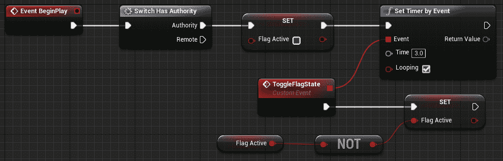

我们刚刚做的是，如果我们在服务器上，初始化`bFlagActive`变量，然后设置一个循环计时器，每三秒翻转其值。

您有两种可用的 Set Timer 事件类型。您可以设置定时器在触发时调用函数的名称，或者调用事件。如果您在事件图中工作，直接将事件连接到定时器的委托连接器通常更可读。如果您在函数内部工作，其中事件对您不可用，请改为按名称调用函数。

现在，我们需要找到一种方法来查看标志的状态变化：

1.  找到或创建事件 Tick 节点。

1.  将对点光源的引用拖动到图表上。

1.  创建一个 Set Intensity 节点，并在点光源上调用它。

1.  *Ctrl* +拖动`bFlagActive`变量的 getter 到图表上。

1.  拖出其结果并创建一个 Select 节点。

1.  将 Select 节点的返回值连接到 Set Intensity 节点的 New Intensity 输入。

1.  将选择节点的 False 值设置为 0.0，将 True 值设置为 5000.0：

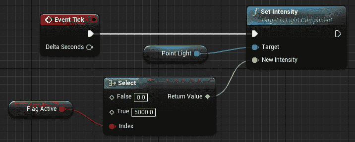

正如您可能记得的那样，我们不喜欢在 tick 事件上轮询值。这是一种浪费和通常不规范的技术。别担心，我们马上就会设置一种更好的方法来做到这一点。

与此同时，让我们进行测试。

我们可以在服务器上看到我们的灯开关，但在客户端上看不到。现在你可能能猜到为什么了。由于我们的权限检查，我们只在服务器上改变了`bFlagActive`的值，而没有告诉任何客户端这个改变。修复这个问题相当简单：

1.  选择`bFlagActive`变量，并在其详细信息部分将变量 | 复制设置为复制：

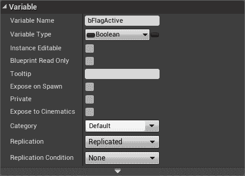

再次运行测试。现在，你应该在客户端上看到标志的状态也在改变。

这提出了一个重要的问题。只因为一个 actor 被复制并不意味着它的任何属性（除了它们的初始状态）都会被复制。再次强调，这是有意的。你不希望发送任何你不需要发送的东西到网络上。每一点流量都增加了带宽负载，并增加了添加额外玩家的成本。Unreal 默认只复制你告诉它要复制的内容。

# 使用 RepNotify 通知客户端值已更改

刚才我们提到，轮询 tick 上的值是浪费的，因为它会在每次更新时执行一次操作，即使没有必要执行。响应事件几乎总是一个更好的主意。

事实证明，使用复制变量很容易做到这一点：

1.  选择你的`bFlagActive`变量，并在其详细信息 | 变量块中，将其复制属性设置为 RepNotify，而不是复制。

1.  查看你的函数列表。刚刚自动添加了一个新函数，名为`OnRep_bFlagActive`。

1.  将你在 Event Tick 上的所有内容选中，然后按*Ctrl* + *X*剪切出来。

1.  打开你的新的`OnRep_bFlagActive`函数，并将所有内容粘贴到其中，将函数的执行线连接到你的 Set Intensity 节点：

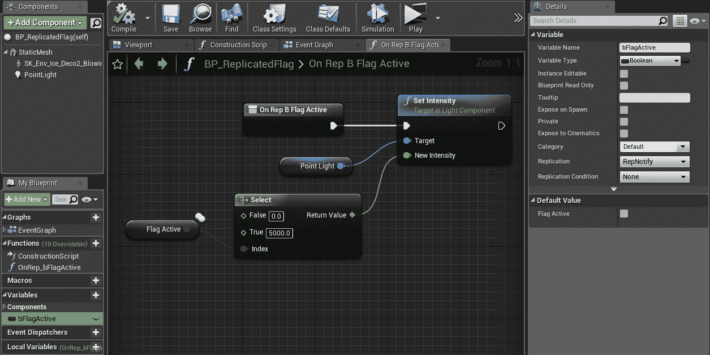

这是一种更高效的响应值变化的方式。具有复制设置为 RepNotify 的变量的`OnRep`函数将在该变量每次从服务器接收到新值时自动调用。这使得响应这些变化变得简单高效，如果我们想在通过复制接收到新值时触发一个效果，比如粒子系统或执行其他操作，我们现在有了一个自然的地方来做这个。

如果你需要在客户端通过复制收到新值时发生某些事情，可以使用 RepNotify 创建一个 OnRep 函数，并在那里执行操作。

到目前为止，我们构建的示例非常简单，但实际上它展示了一些非常重要的点。我们已经谈到了对象在网络框架中的位置，如何确定一个动作是在网络权限（服务器）上执行还是在远程（客户端）会话上执行，如何确定一个 Actor 是否从服务器复制到客户端，以及如何将新值复制到客户端并响应其变化。现在，让我们进一步构建一些看起来更像游戏的东西。

# 为多人游戏创建网络感知 pawn

现在我们已经看到了信息如何从服务器传递到客户端，让我们探索一下玩家操作如何从客户端传递回服务器。为了做好准备，我们将采取捷径，添加一个可以执行一些基本操作的 pawn，并立即开始使这些操作在多人游戏中起作用。

# 添加第一人称 Pawn

我们将通过添加来自第一人称模板的 pawn 来设置自己：

1.  创建或打开一个使用蓝图 | 第一人称模板创建的项目。

1.  选择 Content | FirstPersonBP | Blueprints | FirstPersonCharacter，并将这个角色迁移到我们的工作项目中。

现在，我们需要告诉我们的游戏模式使用它。

1.  打开 BP_MultiplayerGameMode，并将其默认的 Pawn Class 设置为我们刚刚迁移进来的 FirstPersonCharacter。

让我们来测试一下。我们应该会看到一些问题。我们的抛射物会从看不见的墙壁上弹开。当玩家开火时，我们无法从另一台机器上看到发生的情况。另一个玩家的表示只会出现为第一人称武器。我们将修复所有这些问题。

# 设置碰撞响应预设

首先，让我们修复碰撞问题。虽然它与网络直接相关，但它会分散注意力，而且不难修正：

1.  选择一个阻挡我们抛射物的阻挡体：

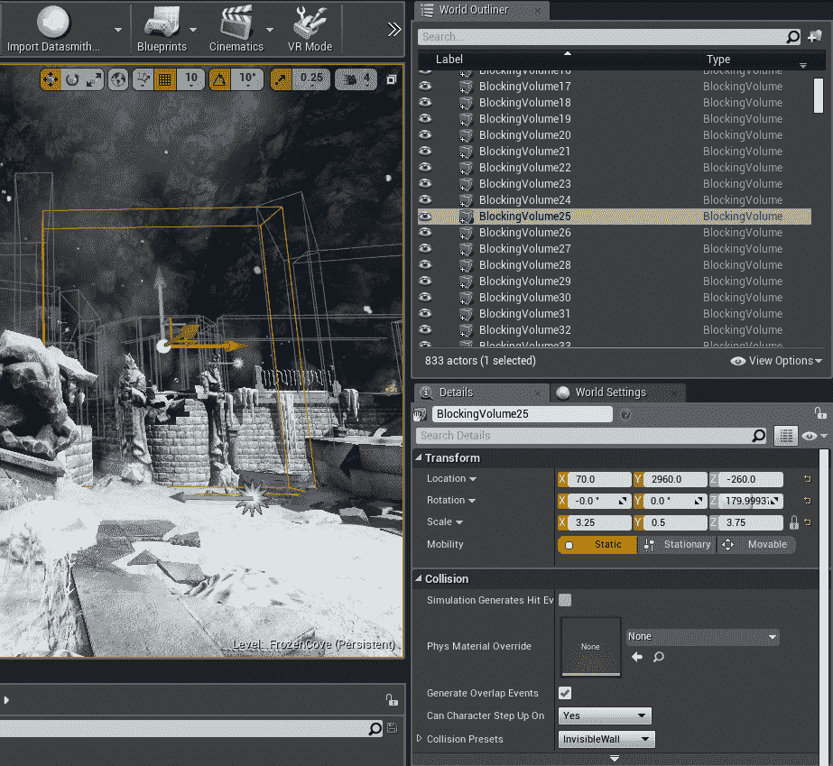

1.  查看其详细信息|碰撞|碰撞预设，以查看它使用的碰撞预设。

我们可以看到它使用了 Invisible Wall 预设。很可能，这个预设正在阻挡我们不想阻挡的很多东西。对于我们的游戏，我们只想停止 Pawn。

1.  打开设置|项目设置|碰撞，并展开预设部分。

1.  找到 Invisible Wall 预设，并点击编辑按钮：

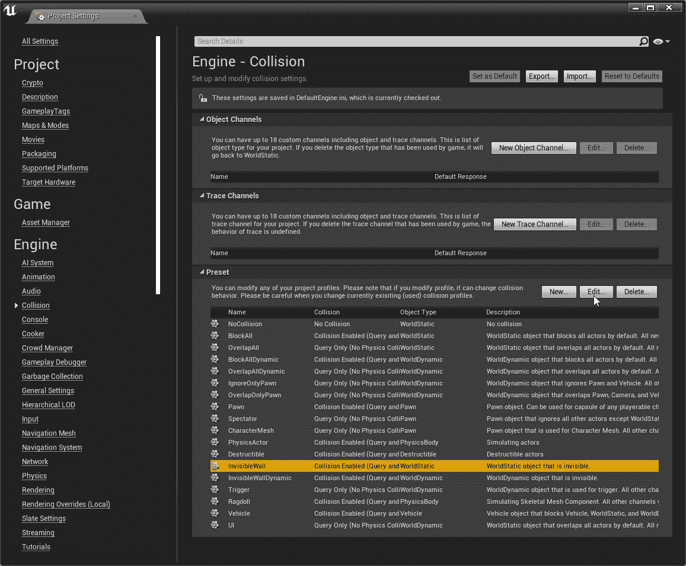

在这里，我们找到并选择了引擎|碰撞|预设列表中的 InvisibleWall 碰撞预设。

确实，我们可以看到它阻挡了除了可见性之外的一切。让我们进行更改。将其设置为除了 Pawn 之外的一切都忽略的 Trace Type：

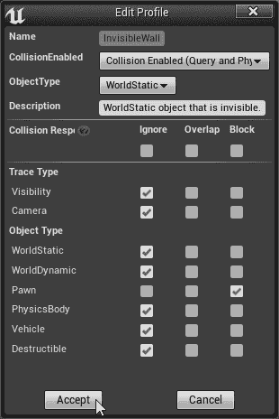

我们还需要对我们的抛射物进行一些更改：

1.  打开`Content/FirstPersonBP/Blueprints/FirstPersonProjectile`，并选择其`CollisionComponent`。

1.  在详细信息|碰撞下，将其碰撞预设属性设置为 OverlapAllDynamic。

现在这已经足够好了。墙壁不再阻挡除了 Pawn 之外的任何东西，抛射物也不再试图从世界中的物体上弹开。

完成这一步后，让我们回到设置我们的网络。

# 设置第三人称角色模型

我们首先要做的是使用适当的第三人称模型获取我们的远程角色。让我们添加我们需要的内容：

1.  从内容浏览器中，点击添加新内容|添加功能或内容包...，然后选择蓝图功能|第三人称：

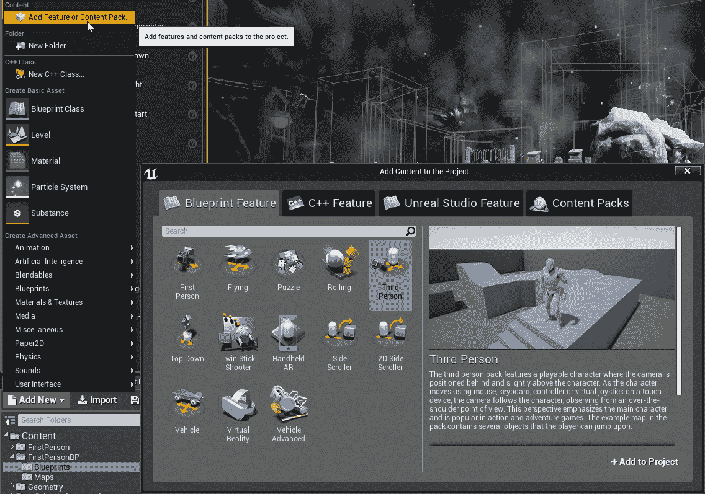

在这里，我们正在将第三人称内容包添加到我们的项目中。

1.  将其添加到你的项目中。

现在，我们要修改我们的角色以使用第三人称模型：

1.  打开你的 FirstPersonCharacter 蓝图，并点击添加组件|骨骼网格。确保选择了角色或其 CapsuleComponent，以便将此新组件创建为 CapsuleComponent 的子组件。

1.  将新组件命名为`ThirdPerson`。

1.  将其详细信息|网格|骨骼网格设置为刚刚与我们的第三人称内容一起到达的 SK_Mannequin 网格。

1.  将其详细信息|动画|动画类设置为使用 ThirdPerson_AnimBP_C 动画蓝图。

1.  调整其位置，使其与胶囊对齐（将其位置 Z 值设置为-90.0，将其旋转 Z（偏航）值设置为-90.0 即可）：

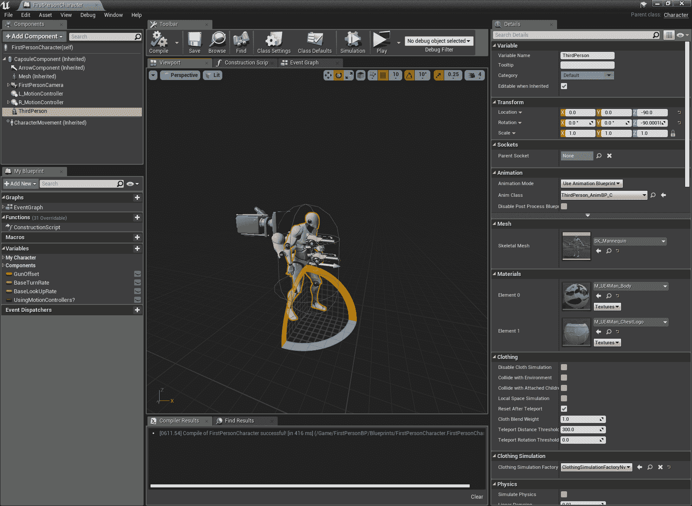

如果我们现在运行它，我们会看到第三人称模型阻挡了我们的摄像机视图。我们希望为其他玩家显示此模型，但对于自己来说隐藏它：

1.  跳转到 FirstPersonCharacter 的事件图表，并找到其 Event BeginPlay 节点。

1.  将 Event BeginPlay 节点拖动出一点，以便有足够的空间进行操作。

1.  右键单击并添加一个 Is Locally Controlled 节点到图表中。

1.  从你的 Is Locally Controlled 节点创建一个分支，并将 Begin Play 的执行输出连接到它。

1.  将对`ThirdPerson`组件的引用拖动到你的图表中。

1.  在其中调用 Set Hidden in Game，将 New Hidden 设置为 true。

1.  从分支节点的 True 输出执行此 Set Hidden in Game 调用。

1.  将 Set Hidden in Game 的执行输出连接到 Event BeginPlay 用于输入的分支节点。

1.  将你的 Is Locally Controlled 分支的`False`输出连接到 Is Head Mounted Display Enabled 分支的输入。

在这种情况下，双击执行线以创建重定向节点是一个好主意，以避免在其他节点下交叉，并清楚地标明执行的条件部分的开始和结束。这对蓝图的行为没有影响，但可以提高其可读性。

您的图表现在应该类似于此屏幕截图：

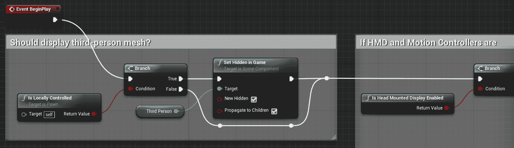

在网络开发中，经常需要检查一个 actor 是否是本地控制的。在单人游戏环境中，当然不需要考虑这个问题，因为一切都是本地控制的，但一旦涉及到通过复制到达的对象，如果它们属于其他人，通常情况下您可能希望对它们进行不同的处理。

您还可以通过将 ThirdPerson 组件的详细信息|渲染|Owner No See 设置为 True 来实现这一点。这个标志及其伴侣 Only Owner See 也可以用于使某些东西只对所有者可见或对其不可见。您必须展开渲染选项的高级区域才能看到它。对于这个例子，我们选择使用 Is Locally Controlled 检查，因为有很多其他情况会使用它，但了解这些快捷方式是值得的。

让我们再次运行它，现在您将看到远程角色的第三人称模型和本地控制角色的第一人称模型。

# 调整第三人称武器

对于第三人称角色来说，武器的位置很奇怪。让我们来修复一下：

1.  打开`Content/Mannequin/Character/Mesh/UE4_Mannequin_Skeleton`，在骨骼树中找到 hand_r 骨骼。

1.  右键单击骨骼并选择添加插座：

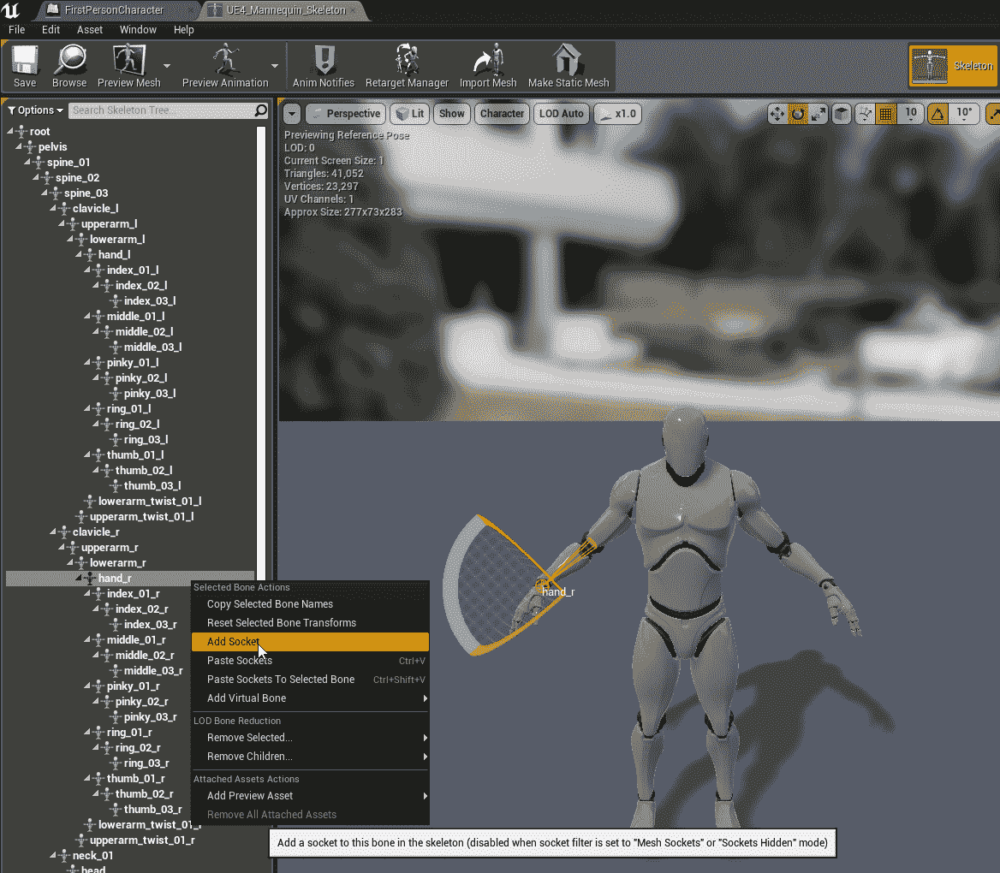

右键单击 hand_r 骨骼并选择在此处添加插座。

1.  将新插座命名为`Weapon`。

1.  右键单击插座，选择添加预览资产，并选择 SK_FPGun 作为预览。

1.  移动插座，直到武器与手部正确对齐。（将相对位置设置为 X=-12.5，Y=5.8，Z=0.2，并将相对旋转 Z（偏航）值设置为 80.0 似乎效果不错。）

现在，我们需要将武器附加到刚刚创建的插座上，但仅适用于远程玩家：

1.  跳回到 FirstPersonCharacter 的事件图，并找到 Event BeginPlay 节点。

1.  从 Is Locally Controlled 分支的 False 输出中，连接一个 AttachToComponent（FP_Gun）节点。

我们之前见过这个，但再次提醒一下，AttachToComponent 有两个版本，一个适用于 actors，另一个适用于 components。选择与您的 FP_Gun 组件绑定的版本。

1.  将您的第三人称组件拖动到 AttachToComponent 节点的父级输入中。

1.  在插座名称中输入您在骨骼上创建的插座的名称（Weapon）：

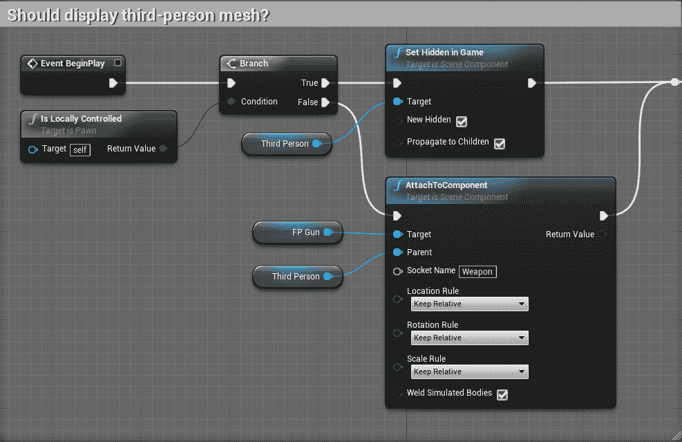

再次运行。现在武器应该放置得更合理。它没有瞄准其他玩家瞄准的位置，因为我们还没有在第三人称动画蓝图中添加任何内容来处理这个问题。添加这个功能超出了本章的范围，因为它真的让我们脱离了网络，所以对于我们这里的游戏目的，我们将保持现状。

接下来，我们需要确保当玩家开火时，服务器处理射击并将其复制到其他客户端。

# 复制玩家的动作

正如我们之前看到的，在当前版本中，其他玩家开火时玩家看不到它。我们将从简单的开始，确保当生成时，从服务器到客户端复制弹丸：

+   打开 FirstPersonProjectile 蓝图，在其详细信息|复制部分中，将 Replicates 设置为 true。

现在运行它，您会发现如果在服务器上开火，客户端可以看到弹丸，但如果在客户端上开火，服务器看不到它。

花一点时间形成一个清晰的心理图像，为什么会这样。复制是单向的：从服务器到客户端。当我们在之前的示例中在服务器上生成旗帜时，我们在客户端上看到了它，因为我们告诉服务器要复制它。现在，同样的事情也发生在投射物上。那么，问题是，客户端如何告诉服务器它需要生成一个投射物呢？

# 使用远程过程调用与服务器通信

答案通过一种称为**远程过程**（**RPC**）的过程传递。远程过程调用是从一个系统发出的，旨在在另一个系统上运行的调用。在我们的例子中，当我们想要开火时，我们将让客户端向服务器发出一个 RPC，告诉它我们想要开火，服务器将处理实际的开火操作。

让我们将我们的角色的开火方法更改为使用 RPC：

1.  打开你的 FirstPersonCharacter 蓝图的事件图，找到 InputAction Fire。

1.  在附近创建一个自定义事件。将其命名为`ServerFire`。

1.  在自定义事件的详细信息中，将其 Graph | Replicates 值设置为 Run on Server：

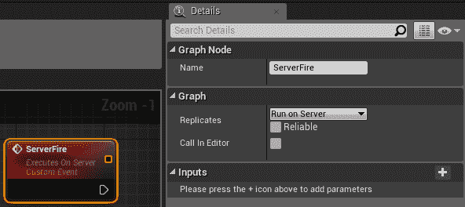

现在，让我们准备使用这个调用。我们首先要做的是将武器开火的那些与游戏相关且应在服务器上运行的部分与纯粹的用于装饰的部分分开。

让我们创建一个额外的自定义事件来处理非必要的客户端内容。

1.  创建一个自定义事件并将其命名为`SimulateWeaponFire`。

虚幻引擎开发者通常遵循一种命名约定，即将网络操作的非必要装饰性方面命名为前缀*simulate*。这向读者表明该函数可以安全地在客户端上运行，并且只包含非状态更改的操作（声音、动画、粒子等）。它还向读者表明该函数在专用服务器上可以安全地跳过。

1.  找到 Play Sound at Location 调用和 GetActorLocation 调用，将它们从 SpawnActor FirstPersonProjectile 节点断开连接，并将它们连接到新的 SimulateWeaponFire 事件。

1.  摆脱从 InputTouch 节点的 FingerIndex 分支出来的分支。它没有任何执行线进入它，这意味着它没有起作用。这只是一种杂乱无章的情况；有人没有清理图表。

部分更新的图应该看起来像这样：

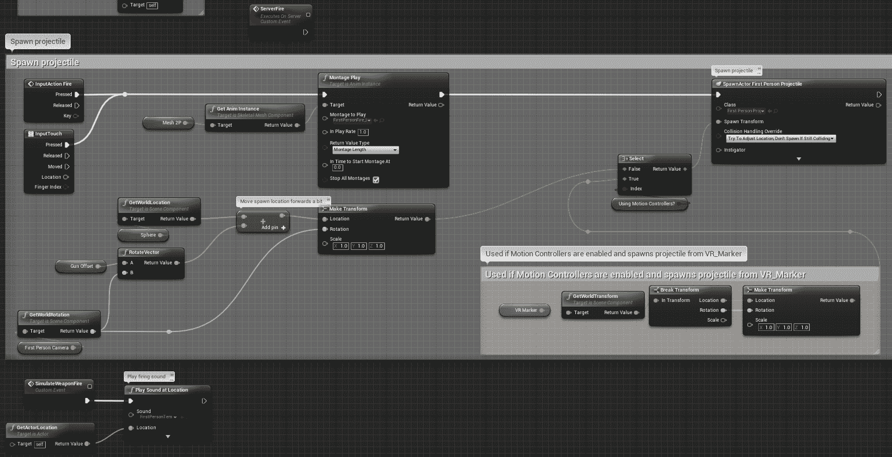

从第三人称内容包中迁移到我们项目中的生成投射物的方法

1.  现在，获取那个 Montage Play 调用，将其从当前所在的执行线断开连接，并将其放到 SimulateWeaponFire 的执行线上。

我们现在所做的是将所有纯装饰性的东西移到一个可以单独调用的事件中。

即使在开发单人应用程序时，遵循这个约定也是一个好习惯，因为它可以很容易地看出哪些代码块实际上正在改变事物，哪些是装饰性的。将它们分开是一个值得养成的好习惯。

现在我们已经创建了`SimulateWeaponFire`事件并填充了它，我们将确保在接收输入的任何系统上调用它：

1.  现在，在 Montage Play 节点曾经所在的位置上调用 SimulateWeaponFire，这样它将在每次听到此输入事件时被调用。

1.  在 Simulate Weapon Fire 调用之后添加一个 Switch Has Authority 节点。

1.  将 Switch 节点的 Authority 输出连接到 SpawnActor First Person Projectile 调用。

1.  从其 Remote 分支，调用我们之前创建的 ServerFire 节点。

1.  将 ServerFire 节点的执行输出连接到 SpawnActor First Person Projectile 节点的输入。

现在，你的 SpawnProjectile 图应该看起来像这样：

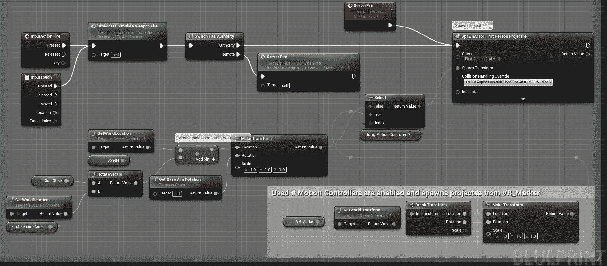

SimulateWeaponFire 图应该如下所示：

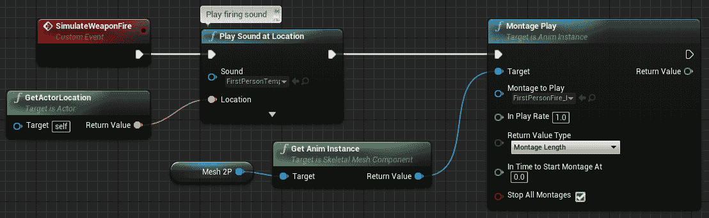

试一试。对于客户端来说，瞄准会不准确，因为我们没有做任何事情来将客户端的武器瞄准发送到服务器，但是现在你应该能看到抛射物生成并且听到火焰声音。

让我们改进一下。

目前，抛射物的生成旋转来自第一人称相机。当从客户端向服务器通信时，这种方法行不通，因为服务器对相机一无所知。让我们用服务器知道的一个值来替换它：

+   在图表中右键单击创建一个“Get Base Aim Rotation”节点，并将其输入连接到“Make Transform”节点，替换相机的“GetWorldRotation”输入：

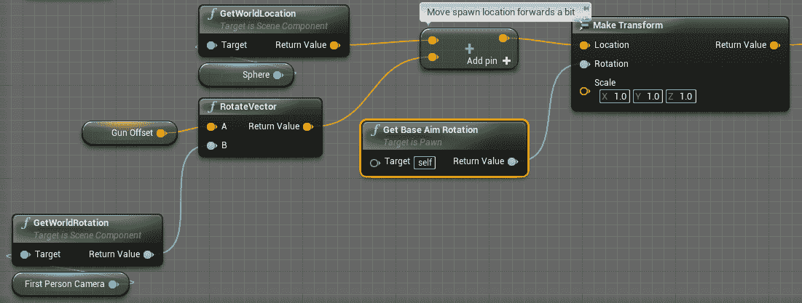

再次测试。当在服务器上看到客户端的抛射物时，其起点仍然不正确，但是瞄准旋转现在是正确的。（修复起点实际上需要我们构建一个适当的第三人称动画蓝图，这超出了本章的范围。）

让我们来讨论一下目前的工作原理。这里有一个重要的模式值得内化。

当火焰输入事件到达时，我们检查是否有权限生成粒子。如果有，我们就直接生成它。然而，如果没有权限，我们会向服务器发起远程过程调用，告诉它生成粒子。它生成了粒子，然后我们在本地客户端看到了它，因为它已经被复制了。

大多数多人游戏中的游戏事件都会按照这个模式编写。以下是一个简化的示例，以便更清楚地理解：

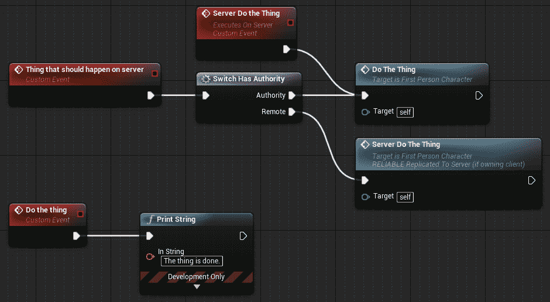

在上面的截图中，执行“Do the thing”调用的只会在服务器上运行。如果触发它的事件发生在服务器上，它就会直接运行；如果事件发生在客户端上，客户端会调用“Server Do the Thing”RPC，然后处理调用“Do the Thing”。这种模式值得记住。你会经常使用它。

在虚幻开发者中有一个常见的约定，即我们将在服务器上运行的 RPC 的名称前缀为“Server”。你不一定要这样做，但这是一个好主意，如果你不这样做，虚幻开发者会不满地看着你。这样做可以更容易地看到哪些函数是 RPC，哪些函数是本地运行的。

# 使用多播 RPC 与客户端通信

我们所编写的代码还存在另一个问题，如果你在单台机器上进行测试，很难发现：模拟的声音和动画只会在拥有者客户端上播放。如果我们在两台独立的机器上进行游戏，并且另一个玩家在我们附近开火，我们是听不到的。

为什么不呢？

在上一个截图中，当本地客户端接收到输入事件时，它调用`Simulate`方法播放声音和动画，然后检查是否有权限决定自己生成抛射物还是请求服务器处理。但是，如果附近还有另一个玩家呢？

玩家 A 的客户端将发送 RPC 到服务器以生成抛射物，所以每个人都会看到，但是触发开火事件的调用只会在玩家 A 的机器上发生。在玩家 B 的机器上，玩家 A 的角色（我们称之为*远程代理*）没有被告知播放动画，所以它不会播放。

我们可以使用另一种类型的 RPC 来解决这个问题，称为**多播事件**。

你经常会听到开发者将多播事件称为**网络多播**事件，或者称为**广播**事件。这些术语指的是同一件事。按照惯例，就像服务器 RPC 事件名称以“server”为前缀一样，多播事件通常以“broadcast”作为前缀命名。这个约定不如“server”前缀常见，你不一定要这样做，但是如果你养成这个习惯，以后在蓝图中会更容易跟踪。

由于我们已经将模拟方法抽象到了它们自己的事件中，所以这并不难做到：

+   选择你的 SimulateWeaponFire 事件，在其详细信息|图表中，将其复制属性设置为 Multicast：

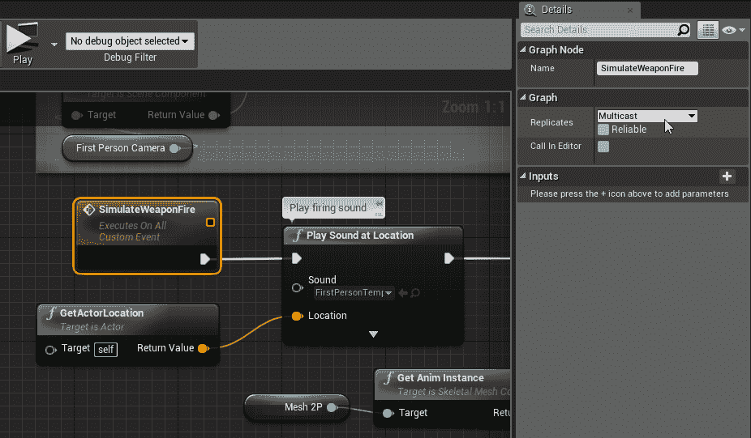

这将把这个事件发送到服务器，并指示服务器将其发送给所有连接的客户端。

现在，当玩家 A 开火时，生成抛射物的调用只会在服务器上发生，但播放开火声音和动画的调用会在网络上的玩家 A 的所有表示中发生。

如果你愿意，你可以将你的`SimulateWeaponFire`事件重命名为`BroadcastSimulateWeaponFire`。一些开发者遵循这个约定，而其他人则不遵循。总的来说，你给自己和其他开发者提供的关于你正在做什么的信息越多，你或他们在调试或维护代码时就会更容易。

# 客户端 RPC

还有一种 RPC 类型，我们在这里不打算演示，但为了完整起见，我们应该讨论一下。假设你在服务器上运行一个操作，并且你需要专门向拥有该对象的客户端发出调用。你可以通过将事件设置为在拥有客户端上运行来实现这一点。

# 可靠的 RPC

当我们决定如何复制函数调用时，还有一个最终的决定要做，那就是是否使调用可靠。

为了理解这个标志的含义，我们需要了解一些关于网络的关键知识。互联网是不可靠的。仅仅因为你向地球另一边的某人发送了一个远程过程调用（RPC），并不能保证它一定会到达。数据包经常会丢失。这不是虚幻的事情，而是现实世界的事情。作为开发者，你需要做出的选择是如何处理这个问题。

如果一个 RPC 对游戏很重要，比如开火，那就让它可靠。这将指示网络接口在收到来自其他系统的调用确认之前，重新发送它。然而，这会增加网络流量，所以只对你关心的那些调用进行可靠处理。如果你只是广播一个装饰性的调用，比如武器声音，那就让它不可靠，因为如果它没有到达，你的游戏不会出错。然而，开火的调用应该是可靠的，因为它对玩家和游戏的发展都很重要。

现在让我们进行这个更改：

1.  找到你的 ServerFire 自定义事件，在其详细信息|图表中，将其可靠属性设置为 true。

1.  将你的 BroadcastSimulateWeaponFire 事件设置为不可靠，因为它只是播放不重要的装饰性事件，不值得堵塞网络。

# 进一步了解

网络是一个重要的主题，老实说，我们在这里只是浅尝辄止。我们写这篇文章的目的是为了给你一个坚实的思维模型，让你能够理解虚幻的网络框架是什么样的，以及你需要理解哪些方面才能在其中工作。

这是一项复杂的工作，对于新开发者来说可能会相当困惑。网络开发的诀窍是创建一个清晰的思维模型来理解正在发生的事情。花些时间来理解这些概念，你会更容易上手。

这里有一些我们没有涵盖到的话题，比如主持会话和让其他人加入会话，以及网络工作的一些细节，比如相关性。这些都是值得了解的，而且有一些很好的资源可以帮助你进一步理解。

首先，查看你的 Content Examples 项目中的 Network Examples 地图，并花些时间理解它们展示的内容。接下来，Cedric Neukirchen 的《多人网络手册》[`cedric-neukirchen.net/2017/02/14/multiplayer-network-compendium/`](http://cedric-neukirchen.net/2017/02/14/multiplayer-network-compendium/) 是一个学习虚幻网络框架工作原理的杰出资源。虚幻的文档在这里：[`docs.unrealengine.com/en-us/Gameplay/Networking`](https://docs.unrealengine.com/en-us/Gameplay/Networking)，根据你在这里学到的知识，花些时间研究它的 Multiplayer Shootout 项目是非常值得的。

# 总结

这一章涉及的理论比其他章节多一些，如果其中的大部分内容仍然需要时间消化，那完全没关系。

在本章中，我们谈到了虚幻的客户端-服务器架构，以及哪些对象存在于哪些域中。了解这个结构是非常重要的。我们还学习了一些关于信息和事件如何通过复制和远程过程调用在机器之间传递的知识。

我们希望这一章为你提供了一个良好的基础，让你在网络方面深入研究并真正探索它的工作原理。对自己有耐心，花时间去实验。

我们现在已经达到了一个点，我们已经涵盖了许多你需要了解的内容，以使用虚幻引擎开发 VR。接下来，我们将看一些工具和插件，可以大大加快你在 VR 中的工作。通过你在本书中学到的知识，你应该已经准备好去研究它们，并理解它们如何帮助你开发并节省大量时间。
