# 第十一章：进一步发展 VR - 扩展虚幻引擎

区分专业开发者和新手开发者的一个重要因素是他们如何利用现有的工具和库来加速工作。很多时候，新手开发者尝试自己做所有的事情，要么是因为他们不知道有哪些资源可以帮助他们，要么是因为他们认为依赖现有的库是一种“作弊”。其实不是这样的。如果你是一名摄影师，在你的车库里没有自己建造相机并不是作弊——你只是专注于你真正关心的艺术部分。不要害怕利用可以加速你开发的工具和库。

然而，要有效地利用其他开发者的工作，你需要付出努力去理解他们在做什么。不要只是简单地粘贴别人的代码而不真正理解它为什么有效——如果你这样做，你只会引发难以找到的错误。做好功课，找到你可以依赖的代码，但同时也要把它作为你的功课的一部分，去理解它是如何构建的，这样你才能在使用它时做出明智的选择。

在你的开发生涯中，迟早会遇到“模仿神秘”的编程术语。这个术语通常被归功于物理学家理查德·费曼，它指的是二战后南太平洋一些岛屿上观察到的土著宗教习俗，他们建造了复制的机场，试图吸引战争期间供应岛屿的神秘货机回来。他们只是复制了形式，但他们不理解这些形式是如何工作的，也不理解为什么它们现在不起作用。不要让这描述你开发软件的方式。对于你在项目中包含的任何内容，当另一个工程师指着其中的任何部分问“这是做什么的？”时，你应该能够给出一个清晰的答案。当然，并非所有情况下都可能做到这一点，但总的来说，要考虑到你的工作在你花时间去理解库或插件是如何工作的之前是不完整的。

在本章中，我们将主要关注一款对 VR 开发者非常有用的插件：Joshua (MordenTral) Statzer 的**VRExpansion**插件。它采用 MIT 许可证（我们马上会谈到许可证——它们很重要），这意味着它可以在非商业和商业软件中自由使用。它不需要任何费用，但它代表了非常出色的专业工作，所以如果你使用它，认真考虑支持他的 Patreon，以便项目能够继续进行。

在本章中，我们将学习如何有效地使用高级插件，如 VR 扩展插件，并使用其示例项目中的蓝图示例来学习它的预期使用方式。我们将学习探索和理解陌生代码的策略，以及使用调试工具来展示代码的运行方式。

具体来说，我们将学习以下内容：

+   安装和构建插件以扩展引擎的功能

+   使用文档和示例项目来了解插件的功能和预期使用方式

+   利用插件提供的新的本地类

+   使用策略来阅读复杂的蓝图并理解它们的结构

+   使用调试工具来帮助我们探索陌生的蓝图并了解它们的执行流程

本章将涉及的直接蓝图构建比之前的章节要少，这是有意为之的。真正的重点在于帮助您开发学习如何使用陌生代码的策略，以便您可以利用它进行自己的开发并学习高级技术。这是作为开发人员可以培养的最重要的技能之一。对于基本主题，很容易找到教程，但一旦进入更高级的领域，您主要需要通过查看其他高级工作来学习。一开始可能看起来有些令人生畏，但我们将学习一些有效的策略来做到这一点。

有了这个，让我们为引擎添加一些功能，并学习如何使其做以前无法做到的事情。

# 创建一个用于存放插件的项目

让我们从创建一个新的空白项目开始：

1.  使用空白模板创建一个新的蓝图项目，并将其硬件目标设置为移动/平板电脑，图形目标设置为可扩展的 3D 或 2D，没有起始内容。

# 安装 VRExpansion 插件

一旦我们创建了项目，我们将把 VRExpansion 插件添加到其中。

在我们可以安装任何插件到项目之前，我们需要做的第一件事是创建一个放置插件的位置。插件必须位于项目目录或`Engine`目录中名为`Plugins`的目录中：

1.  打开包含您的新项目文件的目录。您应该在这里看到您的`.uproject`文件，以及您的`Config`和`Content`目录。

1.  在这里创建一个名为`Plugins`的新目录：

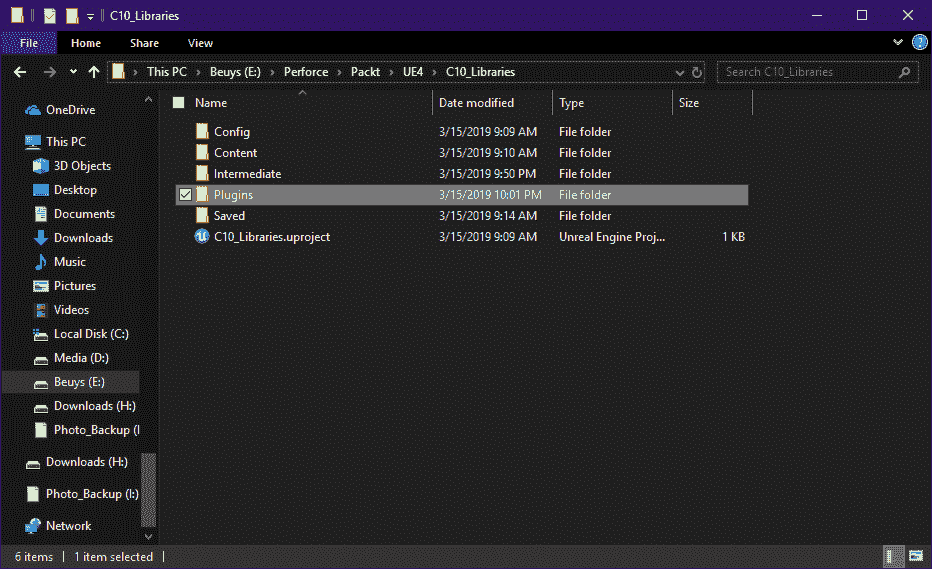

现在我们已经为项目创建了一个`Plugins`目录，让我们将 VRExpansion 插件添加到其中。我们有几种方法可以做到这一点。

# 使用预编译的二进制文件进行安装

获取插件的最简单方法是导航到其论坛讨论页面，[`forums.unrealengine.com/development-discussion/vr-ar-development/89050-vr-expansion-plugin`](https://forums.unrealengine.com/development-discussion/vr-ar-development/89050-vr-expansion-plugin)，并使用适用于您的引擎版本的插件预构建下载链接：

1.  点击完整的二进制和源代码包链接，下载压缩的插件

1.  下载完成后，打开`.zip`文件，并将其中包含的`VRExpansionPlugin`目录拖到您的`Plugins`目录中

就是这样。只要安装了适用于您的引擎版本构建的插件版本，您就可以开始并打开您的项目。

# 编译自己的插件二进制文件

如果您需要插件的更新代码，而预构建的二进制文件中没有包含（如果您正在运行引擎的预览版本，则需要），您需要单独构建插件的二进制文件。这并不难：

1.  在这里导航到 VRExpansionPlugin 存储库的 BitBucket：[`bitbucket.org/mordentral/vrexpansionplugin`](https://bitbucket.org/mordentral/vrexpansionplugin)

1.  点击下载链接，然后点击下载存储库链接，下载一个压缩版本的存储库

也可以直接将插件的 Git 存储库克隆到项目的插件目录中，但除非你正在进行最新的工作并且需要绝对最新的代码，否则你不需要这样做。如果你计划对插件进行自己的更改，你将需要这样做。然而，对于大多数用户来说，下载压缩的存储库更容易。

1.  现在打开刚刚下载的`.zip`文件。

1.  你会看到一个文件夹，里面的名字类似于`mordentral-vrexpansionplugin-9c1737a17bef`（末尾的哈希值会不同）-将其拖到你的新`Plugins`目录中。

1.  将刚刚解压的目录的名称更改为`VRExpansionPlugin`：

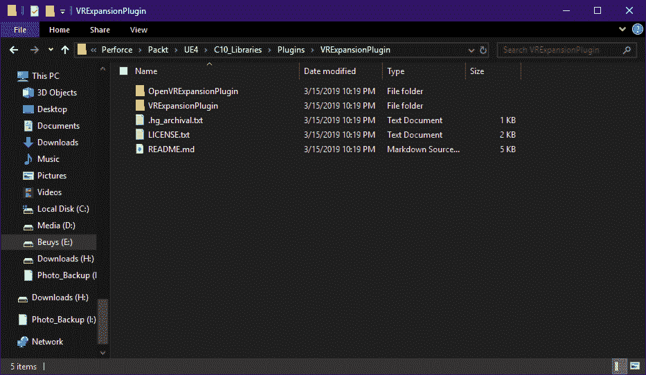

现在启动您的项目，或者如果它已经打开，请关闭并重新打开它。

现在应该会出现一个对话框，指示您需要构建插件的二进制文件：

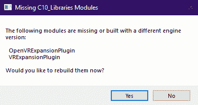

如果您按照第二章中的指示设置了 Visual Studio Community 2017，那么这不是一个问题。（如果您没有，请立即返回那里并按照说明进行设置。在您的系统上设置一个工作的编译器总是值得的，因为有时您会需要它。）点击“是”并让 Visual Studio 为您构建新的二进制文件。

您的插件应该能够成功构建，但如果不能，请转到插件的主页[`bitbucket.org/mordentral/vrexpansionplugin`](https://bitbucket.org/mordentral/vrexpansionplugin)并按照“基本安装步骤”下的说明进行操作，这将引导您完成手动构建过程。正如之前提到的，您还可以选择从这里下载预构建的二进制文件：[`forums.unrealengine.com/development-discussion/vr-ar-development/89050-vr-expansion-plugin`](https://forums.unrealengine.com/development-discussion/vr-ar-development/89050-vr-expansion-plugin)。

如果您在构建对话框上点击“显示日志”，您应该能够看到构建进度。预计需要几分钟：

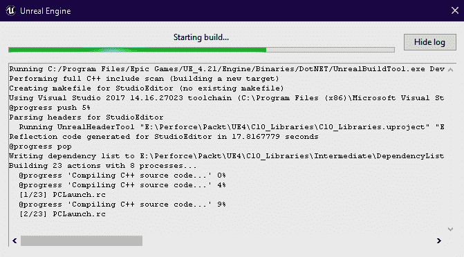

构建完成后，您的项目将打开。

# 验证项目中的插件

无论您是如何下载和安装插件的，一旦您打开项目，它现在应该可用。

打开项目时，您应该在右下角看到两个指示，表示您有新的插件可用，并询问您是否要更新项目：

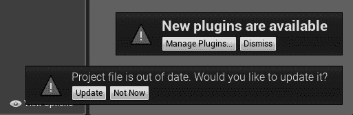

点击“管理插件...”打开插件列表。

您应该看到两个 VRExpansion 插件条目，并且它们都应该已启用：

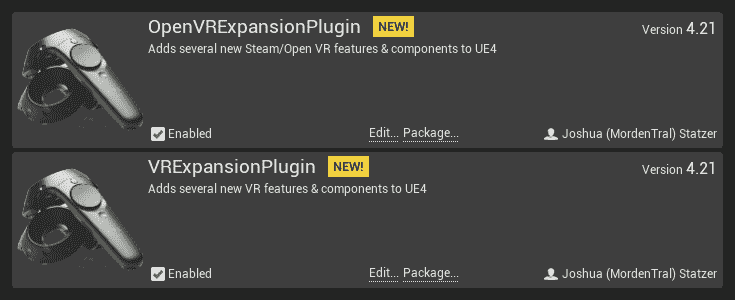

这是应该的，所以我们可以关闭这个窗口。

现在，让我们通过点击“更新”按钮来更新我们的项目文件。

请记住，您的`.uproject`文件实际上只是一个文本文件，向虚幻引擎提供有关项目的一些基本信息。如果您在文本编辑器中打开它，您会看到添加了新条目，指示该项目现在依赖于 VRExpansion 插件及其伴生的 OpenVRExpansion 插件：

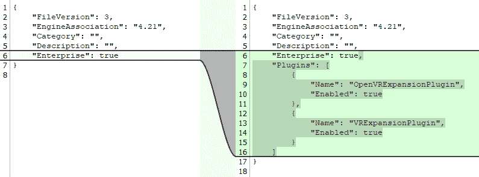

这是在添加 VRExpansion 插件之前和之后的.uproject 文件的文本比较

就是这样。我们已经准备好使用插件进行开发了，但在开始之前，让我们稍微谈一下我们刚刚做了什么。

# 理解插件

插件是虚幻生态系统的重要组成部分。它们可以包含内容、蓝图、本地代码和任何其他影响虚幻引擎能够做什么以及如何做的东西。它们可以节省大量时间，并几乎无限地扩展引擎的功能。

在大多数情况下，您实际上不需要了解虚幻引擎如何处理插件才能使用它们-它们基本上只是工作的，但如果您想要能够在出现问题时修复问题，或者如果您需要更新插件以适应新的引擎版本，了解一些关于插件存放位置和组成方式的知识是有帮助的。我们不会在这里深入探讨，但有一些快速要点可以帮助您进行未来的开发。（如果您确实需要深入了解插件的开发，请从这里开始阅读文档：[`docs.unrealengine.com/en-us/Programming/Plugin`](https://docs.unrealengine.com/en-us/Programming/Plugins)）

# 插件的位置

首先，重要的是要知道将要安装到项目或引擎的新插件放在哪里，并知道从 Epic Games 启动器下载的插件将被放置在哪里。

您安装的任何插件都将位于两个位置之一：对于仅安装到特定项目的插件，它们将位于项目的`Plugins`目录中，对于安装到引擎并适用于所有项目的插件，它们将位于`Engine\Plugins`目录中。

请花点时间查看以下步骤中给出的当前安装的引擎插件：

1.  打开您安装虚幻引擎的目录（默认情况下，这将位于`C:\Program Files\Epic Games`），然后打开`Engine\Plugins`子目录：

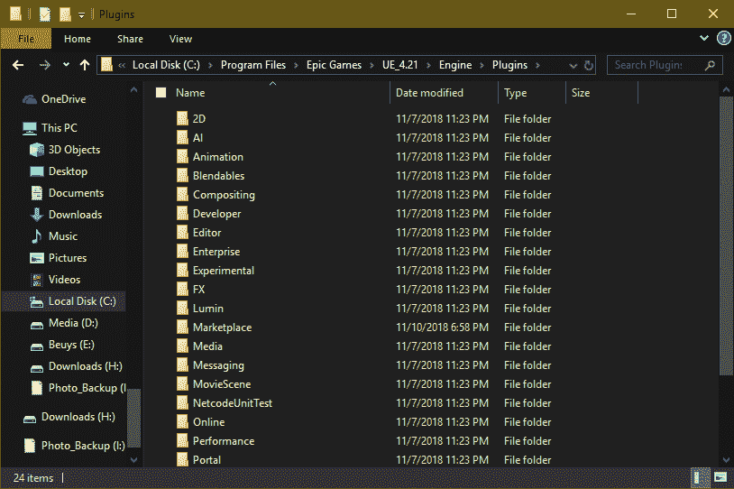

在这里，您会注意到一些有趣的事情：引擎的许多功能，甚至我们认为是核心引擎功能的东西，例如特效编辑器，实际上都是作为插件存在于虚幻框架中。这值得记住。在虚幻引擎中，插件并不是二等公民。通过插件将某些东西添加到引擎中与直接将其编写到引擎代码中并没有实质性的区别，只是如果以这种方式设置，更容易替换、打开或关闭它。

通过 Epic Games 启动器下载的插件将出现在`Engine\Plugins`目录的“市场”子目录中。通常情况下，Epic Games 启动器会在您从启动器安装的插件有可用更新时提醒您，并且您可以直接从启动器中更新它。您很少需要打开`Engine\Plugins`目录，但了解它的存在是值得的。

# 从市场安装插件

使用 Epic Games 启动器安装插件，从“市场”或“库”中选择您想要的插件，然后点击“安装到引擎”按钮，或者如果插件已配置为资源包，则点击“添加到项目”按钮。将插件安装到引擎将把它放在引擎安装的`Engine\Plugins\Marketplace`目录中，而将其放在项目的`Plugins`目录中则点击“添加到项目”按钮：

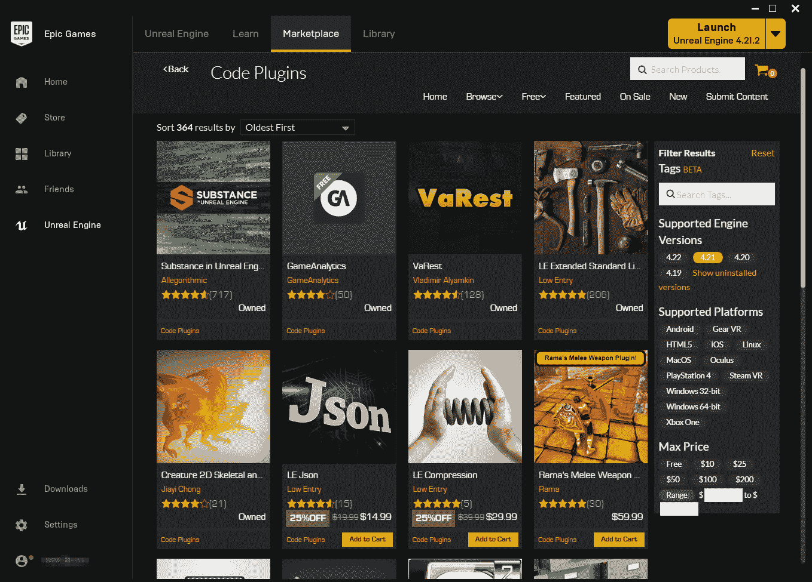

如果您使用该工具安装的插件有可用的更新，Epic Games 启动器将自动提醒您。

# 插件的内部是什么？

现在我们已经了解了虚幻引擎中插件的存放位置，让我们来看看它们由什么组成。

为了做到这一点，我们将快速探索一下我们安装到项目的`Plugins`目录中的 VRExpansion 插件：

1.  打开项目的`Plugins`目录，然后打开其中的`VRExpansionPlugin`目录

您会看到 VRExpansion 实际上由此目录中的两个单独的插件组成：`VRExpansionPlugin`和`OpenVRExpansionPlugin`。后者存在是为了支持 Valve Software 的 OpenVR SDK。在这里，我们不需要担心它，我们只关注 VRExpansion。

这里有两个文件，我们应该花点时间提及一下。

第一个是`README.md`文件。请花点时间打开它。这是一个包含有关插件的一些基本信息的 markdown 文件。

如果您的系统上安装了 Visual Studio Code，您可以使用 VSCode 打开 markdown 文件。打开文件后，您可以右键单击查看区域中的选项卡，然后选择“打开预览”，或者只需按下*Ctrl* + *Shift* + *V*以带格式查看 markdown。

您会看到这个`readme`文件基本上重新创建了主 BitBucket 页面上的文本：[`bitbucket.org/mordentral/vrexpansionplugin`](https://bitbucket.org/mordentral/vrexpansionplugin)，并链接到指令和信息页面。许多插件都附带有文档或`readme`文件，告诉您如何找到文档。值得一看。

# 关于许可证

这里我们还应该看一下`LICENSE.txt`文件。如果您要在项目中包含插件，了解如何使用它是很重要的。

如果你通过市场下载了一个插件，你不需要担心它。通过 Epic 的市场分发的所有插件都可以用于非商业或商业用途，并且不会对它们的使用方式施加任何额外的限制。

如果你需要更多关于市场上插件许可证的信息，详细信息在这里：[`www.unrealengine.com/en-US/marketplace-distribution-agreement`](https://www.unrealengine.com/en-US/marketplace-distribution-agreement)。

如果你从网络上直接下载插件，就像我们之前做的那样，你需要检查许可证并确保作者允许你按照你想要的方式使用插件。大多数插件作者不会对你使用软件的方式施加限制，但总是阅读许可证并确保。你不想在构建一个以插件为基础的项目时，发现在销售软件时你实际上是不被允许这样做的。先阅读许可证。

特别要小心使用 GNU**通用公共许可证**（**GPL**）许可的软件，这个许可证对软件的使用施加了重要的限制，并且与虚幻引擎的许可条款不兼容。然而，更宽松的**MIT**和**Apache**许可证是可以的，你会遇到很多使用它们的虚幻插件。

在我们的情况下，VRExpansion 插件的许可证允许你几乎做任何你想做的事情（除了删除许可证文件并试图假装这是你自己的作品），包括修改插件的代码。它对你使用它的项目的内容或商业与非商业使用没有任何限制。这是理想的。无论我们是将项目作为商业游戏出售，还是用于现场演出，只是作为一种爱好建设，或者其他任何情况，都没有问题。

# 在插件目录中

如果我们现在打开外部`VRExpansionPlugin`目录中的`VRExpansionPlugin`目录，我们会看到一个非常类似于虚幻项目结构的目录结构。这并非偶然。你可以将插件几乎看作是被插入到项目中的迷你项目。它们可以包含代码、蓝图或资产和其他内容，就像一个项目一样。

我们不会关心这个目录的内容，只是看一下其中的一个东西：

1.  在文本编辑器中打开`VRExpansionPlugin.uplugin`文件

你会发现这个文件，就像你的`.uproject`文件一样，只是一个包含有关插件信息的文本文件。你很少需要打开这个文件，但就像你的`.uproject`文件一样，如果你需要手动调试或更改某些内容，你应该知道它：

```cpp
{
    "FileVersion": 3,
    "Version": 4.21,
    "VersionName": "4.21",
    "FriendlyName": "VRExpansionPlugin",
    "Description": "Adds several new VR features & components to UE4",
    "Category": "VRExpansion",
    "CreatedBy": "Joshua (MordenTral) Statzer",
    "CreatedByURL": "",
    "DocsURL": "",
    "MarketplaceURL": "",
    "SupportURL": "",
    "EnabledByDefault": true,
    "CanContainContent": false,
    "IsBetaVersion": false,
    "Installed": true,
    "Modules": [
        {
            "Name": "VRExpansionPlugin",
            "Type": "RunTime",
            "LoadingPhase": "Default"
        }
    ],
    "Plugins": [
        {
            "Name": "PhysXVehicles",
            "Enabled": true
        }
    ]
}
```

这里的大部分信息只是描述性的，但有一个重要的细节：`Plugins`块用于指定插件与其他插件之间的依赖关系。在这种情况下，我们可以看到`VRExpansion`插件需要启用`PhysXVehicles`插件。这不应该是个问题，因为它默认是启用的，但如果你遇到插件无法工作的情况，看看它依赖于什么，并确保这些插件也存在。

还有一个你可能会遇到的属性。一些插件会指定它们可以使用的引擎版本，使用一个看起来像这样的`EngineVersion`条目：

```cpp
"EngineVersion" : "4.21.0",
```

如果一个插件包含这个条目，虚幻将只允许它与指定的引擎版本一起加载。（你可以通过手动修改`.uplugin`文件中的这个值来绕过这个限制，但插件是否能编译和工作将完全取决于其中的内容以及你尝试编译的引擎版本中发生了什么变化。）

# 结束我们的简短之旅

这是一个快速了解虚幻插件安装和内部内容的过程。正如我们之前提到的，在大部分开发过程中，你不需要去处理这些内容，但当你需要弄清楚软件的情况时，知道从哪里开始查找是非常有价值的。

有了这个，让我们继续在 VR 中工作吧。

# 探索 VRExpansion 示例项目

在我们回到自己的项目之前，我们将再次进行一次绕道，看看与 VRExpansion 插件一起维护的示例项目，这样我们就可以看到这个插件能让我们做什么样的事情。我们还将通过使用这个项目中的蓝图来加速本章的一些开发，所以不要跳过这一步。

让我们从这里开始下载它：[`bitbucket.org/mordentral/vrexppluginexample/downloads/`](https://bitbucket.org/mordentral/vrexppluginexample/downloads/)。按照给定的步骤进行：

1.  点击下载存储库链接以下载项目的压缩版本

1.  将下载的项目解压到你保存虚幻示例项目的任何位置

1.  打开项目目录，右键点击`VRExpPluginExample.uproject`，从上下文菜单中选择切换虚幻引擎版本...

1.  将其设置为你当前的虚幻引擎版本

由于这个项目是作为一个 C++项目创建的，当你设置一个新的引擎版本关联时，Visual Studio 也会为你创建一个解决方案文件。你不需要使用 C++来使用这个插件。项目本身中的所有内容都是在插件之上使用蓝图创建的，这也是我们将要构建项目的方式，但如果你对 C++类有兴趣并想看看插件是如何构建的，这个解决方案文件提供了一个很好的方法。

尝试启动项目。它可能会要求你构建其中包含的插件。让它去做吧。（再次确保你按照第二章中的指示安装和设置了 Visual Studio，*设置开发环境*。）

项目启动后，让它编译着色器，然后探索一下看看它提供了什么。很快就会明显，VRExpansion 为 VR 开发者提供了巨大的帮助。它是一个宝库，里面有专业编写的代码和蓝图示例，展示了你可以在 VR 中做的各种事情，许多专业制作和发布的游戏都在开发中使用了这个插件或其中的部分内容：

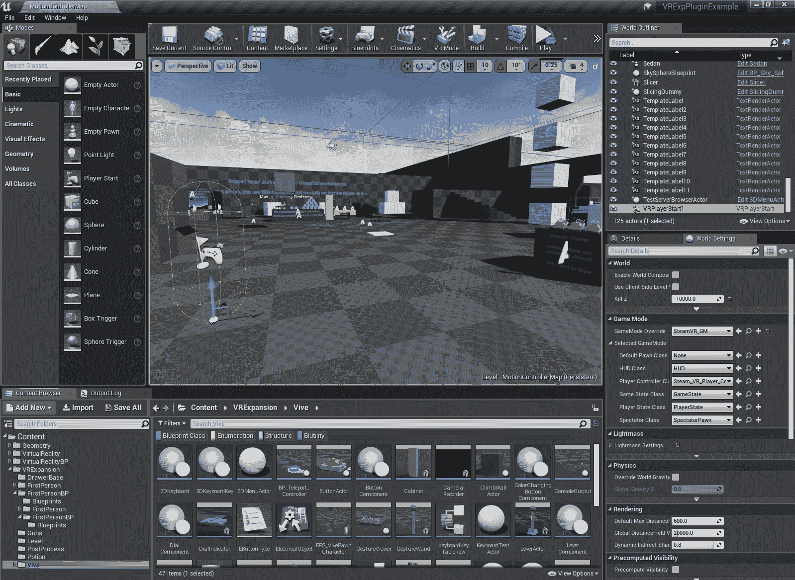

VR 扩展插件测试项目的视图。你会在这里找到大量有用的 VR 开发示例。

在这里玩一下。我们不会覆盖这个示例项目中的所有内容，因为我们即将开始构建我们自己的项目，但是探索一下足够让你对其中包含的内容有一个很好的了解，并且你可以为自己的应用程序重新定制一些东西。

以下是一些建议，帮助你开始：

+   你的控制器的 D-Pad 或拇指杆触发传送移动，就像我们自己的示例中一样。

+   当你手中没有物体时，挤压控制器抓握会改变你的移动模式

我们强烈建议你现在花些时间尝试每种移动模式。传送和 DPadPress-ControllerOrient 模式对你来说应该很熟悉，因为我们之前构建的定位项目中有这些模式。其他模式对你来说可能是新的。尝试一下并得到一些想法：

+   许多物体可以被抓住和使用。使用扳机进行抓握。

+   白色物体可以被抓住和攀爬。

+   玩家角色在处理玩家将头伸进墙壁的情况时做得很好。试试看。

+   呕吐平台名副其实。（如果你还记得我们在第一章中的讨论，*在 VR 中思考*，你就会明白为什么。）

将此示例项目视为一个重要的资源，因为您将了解到此插件允许您做什么。由于您在本书中所做的工作，您应该能够很好地理解蓝图中所看到的内容，并将其用作进一步开发的起点。

现在，让我们使用这个插件作为我们自己工作的基础，来构建我们自己的项目。

# 完成项目设置

现在我们已经设置好了我们的项目，安装了 VRExpansion 插件，并对插件有了基本的了解，让我们回到构建内容的过程中。

当然，我们首先需要适当地设置我们的项目设置以用于 VR：

+   项目 | 描述 | 设置 | 在 VR 中启动：False

+   引擎 | 渲染 | 正向渲染器 | 正向着色：True

+   引擎 | 渲染 | 默认设置 | 环境光遮蔽静态分数：False

+   引擎 | 渲染 | 默认设置 | 抗锯齿方法：MSAA

+   引擎 | 渲染 | VR | 实例化立体声：True

+   引擎 | 渲染 | VR | 轮询遮挡查询：True

现在让我们给自己一个可以玩耍的环境：

1.  在市场中找到灵魂：洞穴环境包，并将其添加到您的新项目中。（在项目打开时这样做是可以的。）

1.  一旦环境包下载完成，如果项目还没有打开，请打开您的项目。

1.  在`Content/SoulCave/Maps`下，找到 LV_Soul_Cave_Mobile 级别并打开它。让您的着色器编译。

在此过程中，让我们将其设置为您项目的默认级别：

1.  打开设置 | 项目设置 | 项目 | 地图和模式，并将编辑器启动地图和游戏默认地图设置为 LV_Soul_Cave_Mobile

一旦你的着色器编译完成，我们就可以开始工作了。

# 使用 VRExpansion 类

我们将使用这个项目作为回顾我们在为 VR 设置场景时需要做的事情，并作为 VRExpansion 类的介绍。

# 添加导航

当然，现在我们已经有了我们的环境，我们首先要做的事情是设置一个导航网格，这样我们就可以选择使用传送定位和让 AI 角色在其中导航。

首先检查你的碰撞环境：

1.  按下*Alt* + *C*（或从视口中选择 Show | Collision）来可视化你的碰撞环境，并确保它看起来合理。

这里的碰撞看起来不错，所以让我们在场景中添加一个导航网格边界体。

1.  将一个导航网格边界体拖入场景并缩放它以包含您希望玩家能够导航的区域。

1.  以下数值效果较好：位置（X= -11420.0，Y= -3790.0，Z= -490.0），缩放（X= 100.0，Y= 160.0，Z= 20.0）。

记住，在设置体积时，您可以使用视口的顶部和侧面视图来理解您正在做的事情，从而使您的工作更加轻松。

由于生成的导航网格将覆盖许多您不希望玩家导航的地方，因此请记住使用导航修改器体积来阻止不希望的传送目的地。

# 添加一个游戏模式

与往常一样，我们将为我们的项目设置一个游戏模式，以指定要加载的类并处理我们想要应用于游戏的任何规则：

1.  在`Content`目录中为您的项目创建一个目录，然后在其中创建一个蓝图目录。

1.  在此目录中创建一个新的蓝图类，并将其父类设置为 Game Mode Base。将其命名为`BP_VRExpansionGameMode`。

1.  打开设置 | 项目设置 | 项目 | 地图和模式，并将默认游戏模式设置为您刚刚创建的新游戏模式。

1.  打开您地图的世界设置，并重置游戏模式 | 游戏模式覆盖以清除它。

随着我们基于 VRExpansion 类添加新类，我们将多次回顾我们的新游戏模式。

# 更新 PlayerStart 类

VRExpansion 插件提供了一个新的玩家起始类，它更准确地缩放了我们要生成的`VRCharacter`，因此更准确地表示了玩家可以适应的位置。我们将在这里使用它：

1.  将一个 VRPlayerStart 拖动到场景中现有的`PlayerStart`演员附近。

1.  从旧的`PlayerStart`详细信息中，右键单击其 Transform | Location，并复制该值。

1.  删除旧的`PlayerStart`。

1.  选择 VRPlayerStart，在其详细信息中，右键单击其 Transform | Location，并粘贴从旧位置复制的值。

1.  将其向下移动一点以放置在地板上。（X= -20220.0，Y= -13080.0，Z= -2118.0）效果还不错。

# 添加一个 VR 角色

现在是时候向我们的项目添加一个 VR 启用的角色了。VRExpansion 插件为我们提供了两个新的类，我们可以从中派生出一个用于 VR 的角色：

+   `VRSimpleCharacter`是一个为 VR 启用的角色提供基础功能的基类，它自动设置了两个`GripControllers`，一个网络复制的 VR 摄像机，并实现了专为 VR 使用的移动组件。

+   `VRCharacter`包括`VRSimpleCharacter`中的所有内容，但还添加了一些额外的方法来通过颈部位置偏移碰撞，并支持角色碰撞胶囊的更大缩放。

一般来说，除非您确定需要使用颈部碰撞偏移或者您将大幅改变碰撞胶囊的大小，否则请使用`VRSimpleCharacter`。

现在让我们来做这个：

1.  在放置 GameMode 的蓝图目录中，右键单击创建一个新的蓝图类。

1.  展开所有类扩展器，在搜索框中键入`vr char`。

1.  您将看到列出了`VRCharacter`和“VRSimpleCharacter”类。选择“VRSimpleCharacter”。将新的蓝图命名为`BP_VRCharacter`：

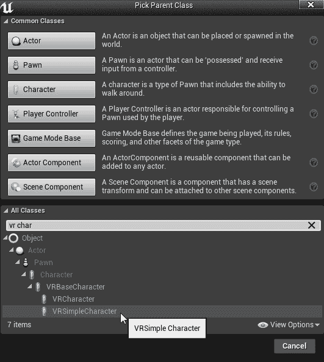

1.  现在，打开您的游戏模式并将`BP_VRCharacter`设置为其默认的 Pawn 类。

运行地图。您现在还无法移动，但应该已经正确注册到地板上。

# 设置输入

现在，我们的角色已经就位，游戏模式已被告知生成它，让我们允许玩家控制它。

首先，我们需要映射一些输入。如果我们想手动完成这个过程，我们可以通过设置 | 项目设置 | 引擎 | 输入来完成，但为了节省一些时间，让我们将`DefaultInput.ini`文件从 VRExpansion 示例项目复制到我们的项目中：

1.  打开解压 VRExpansion 示例项目的目录，并从其`Config`目录中复制`DefaultInput.ini`文件。

1.  打开当前项目目录并将`DefaultInput.ini`粘贴到其中

重新打开您的工作项目。当然，如果我们正在构建自己的游戏，我们会为其设计自己的输入方案，但这样可以让我们快速地有一些已经映射好并准备好进行测试的输入。

# 使用示例资产设置您的 VR 角色

现在，通常情况下，我们会逐步介绍如何从头开始构建这个角色，但是在这里我们有很多材料要介绍，所以我们将通过将 VRExpansion 示例项目中的示例角色迁移到我们自己的项目中，然后深入研究它的工作原理来节省一些时间。

# 有效使用示例资产

这提醒我们一个值得一提的关于使用插件和示例资产和代码的问题。很多时候，库和插件会附带已经设计好与它们配合使用的示例资产。熟悉这些资产总是一个好主意，因为它们向您展示了作者对代码使用的期望。通常情况下，这些资产也会非常接近您所需要的，尽管它们很少会完全符合您的需求。

在使用他人的示例资产或代码时，有两种方法可以采取：您可以整体使用示例，然后修改或删除与您想要的方式不同的任何内容，或者您可以从头开始构建自己的资产，使用示例作为指导，了解作者建议您如何使用他们的代码。每种方法都有其优点和缺点。第一种方法往往可以让您更早地开始工作，但通常会得到许多不需要的额外内容，然后需要清理掉这些内容。（请记住，我们不相信这里的模仿编程——您不会简单地将这些代码倾倒到您的项目中并离开而不理解它。）第二种方法可能需要更多的时间，但可以为您提供一个干净的类，它只做您需要的事情，并且您对它的理解相当好，因为您自己编写了它。

还有一种中间道路，这是我们推荐的路径。记住肯特·贝克的建议：“让它工作；让它正确；让它快”？考虑在“让它工作”阶段使用现有的示例资产或类作为您的一部分。在这个阶段，您正在尝试使用作者编写的类，并学习它的工作原理和使用方法。然后，一旦您掌握了这些知识，开始删除您现在知道不需要的东西，并更改需要以不同方式工作的东西，直到您拥有一个能够满足您需求的版本。现在，进入“让它正确”的阶段。它现在可以吗？是否可以轻松维护？另一个工程师或未来的您一年后能否阅读这个蓝图并理解其中的内容？考虑到这些问题，您是否想要编写一个新的、并行的类版本，现在您已经有了一个可行的模板来构建它。

# 迁移示例角色

考虑到这种方法，让我们将示例项目的 VR 角色蓝图迁移到我们的项目中，以便我们可以开始尝试并了解它是如何构建的：

1.  从`VRExpPluginExample`项目中，在`Content/VRExpansion/Vive`中找到`Vive_PawnCharacter`蓝图，并将其迁移到您的新项目的`Content`文件夹中

不要担心 Vive 中心化的名称。这个角色也可以与 Oculus Rift 和 Windows Mixed Reality 头戴式显示器一起使用。当这个插件首次编写时，只有 Vive 支持房间规模的 VR。一旦 Oculus 添加了这个支持，插件就会更新以适应它，但示例名称从未更改过。

1.  返回到您的新项目，并将您的游戏模式的默认角色类切换为我们刚刚迁移的`Vive_PawnCharacter`。

我们想创建另一个 VR 角色作为示例，以证明插件中引入的新类可以像任何其他引擎类一样使用，但对于我们实际要做的工作，我们将使用迁移的角色。

测试一下。现在，您应该能够使用传送来浏览环境，并且应该能够使用抓握按钮来更改移动模式：

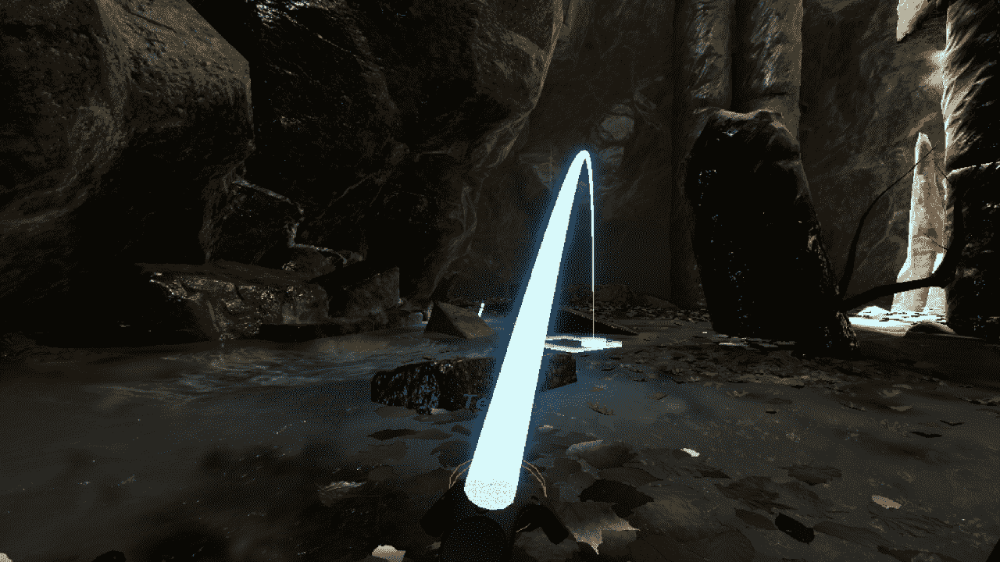

稍微试验一下，然后我们将来看看内部情况。

# 理解复杂的蓝图

现在我们已经有了基本的工作原理，让我们深入了解一下这个类是如何构建的。当我们这样做时，您会发现，在本书中迄今为止所做的工作，将使您更好地理解这个蓝图中的许多技术。

我们要探索的技术是有价值的。如果您在软件开发中从事专业工作，或者即使您是业余爱好者，迟早都会遇到现有的代码，并且您需要弄清楚它是如何工作的。我们将指导您通过一些策略，使这个任务比起初看起来要容易得多。

让我们开始吧：

1.  打开`Content/VRExpansion/Vive`，找到`Vive_PawnCharacter`蓝图。打开它。

1.  打开它的事件图。

天啊！这里有很多东西。

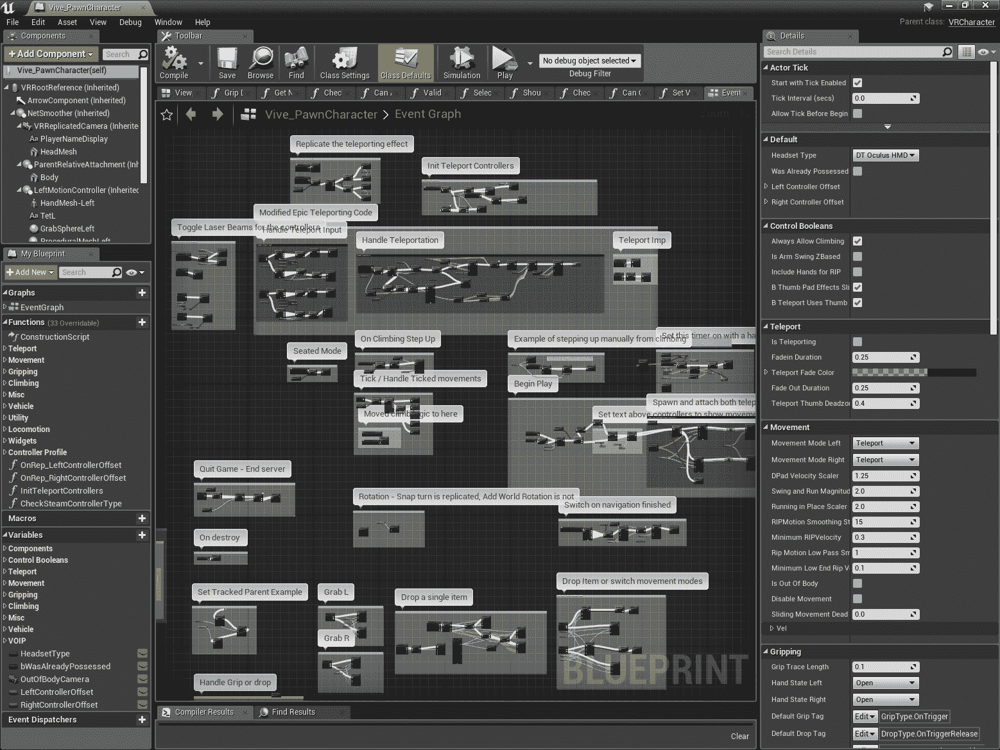

示例项目的`Vive_PawnCharacter`蓝图包含了很多蓝图代码。一开始挖掘它可能看起来令人生畏，但实际上并不是那么困难。

尽管这一开始可能看起来令人生畏，但你很快就会欣赏到它的价值。这门课程是一个令人难以置信的有用技术汇编，用于开发虚拟现实角色。单独来看，这已经是一件美妙的事情了，但更令人惊叹的是，这里编写的蓝图和底层 C++代码都考虑了网络复制，因此如果你计划编写一个网络虚拟现实体验，这门课程将会对你有所帮助。

然而，要使用它，你需要知道从哪里开始。让我们学习如何处理一个新的类并弄清楚它。

# 首先检查父类

每当你查看一个新的蓝图时，你首先要做的是检查界面右上角的父类是什么。

在我们的例子中，我们可以看到这个蓝图派生自`VRCharacter`。`VRCharacter`是一个用 C++编写的本地类。如果你按照父类指示器提供的链接，它将打开 Visual Studio 到这个类，你可以探索它的本地实现以了解更多信息。对于我们在这里的目的，我们将继续使用蓝图，但值得知道你也可以这样做。

（如果我们在其本地实现中深入研究这个类，我们会发现它派生自一个`VRBaseCharacter`类，而这个类又派生自`Character`。因此，这个类本质上是一个虚幻角色，如此处所述：[`docs.unrealengine.com/en-US/Gameplay/Framework/Pawn/Character`](https://docs.unrealengine.com/en-US/Gameplay/Framework/Pawn/Character)。但它还有额外的针对 VR 的修改，以复制相机和手柄控制器的位置，并以适合 VR 的方式处理移动。）

# 查看组件以了解它们是由什么组成的

探索任何你正在研究的新类时，下一步要看的是它的组件列表：

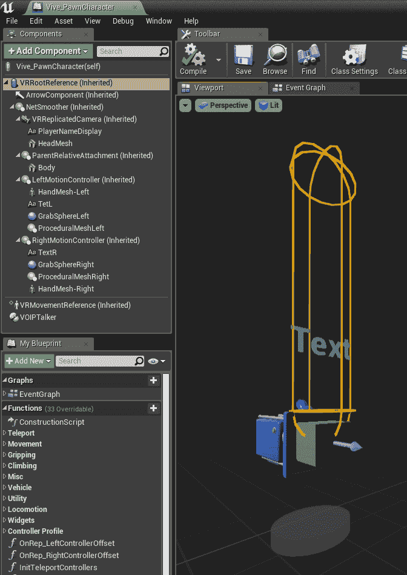

查看这个组件列表可以告诉我们很多关于这个角色类以及它能做什么的信息。最好在视口处于活动状态时进行查看，这样你就可以看到哪些组件具有可见表示。将鼠标悬停在每个组件上，查看它是什么类型的组件，并让这些信息在你的脑海中建立起整个类的整体感觉。

我们可以看到`VRCharacter`支持一个用于头部的静态网格，一个用于身体的静态网格，以及两个带有文本渲染器、抓取检测球和骨骼网格的运动控制器。（这个运动控制器的设置应该对我们在抓握交互方面的工作感到有些熟悉。）我们还可以看到它提供了一个角色移动组件和一些用于 VOIP 通信的支持。

当你这样做时，你不需要为每个细节而苦恼。在这个过程的这个阶段，重点是建立一个关于类的整体思维模型，以及各个部分如何组合在一起。

# 寻找已知事件并查看它们运行时发生了什么。

获取关于蓝图信息的另一个有用的起点是从我们知道可能已经实现的事件开始，并查看它们的功能。

大多数类在事件 BeginPlay 上会进行一些设置工作，并且大多数类在事件 Tick 上也会进行一些工作，所以这些通常是明智的起点：

1.  按下*Ctrl* + *F*激活查找结果面板，然后在搜索栏中输入`beginplay`。

1.  按下*Enter*，因为我们只对在这个蓝图内部进行搜索感兴趣：

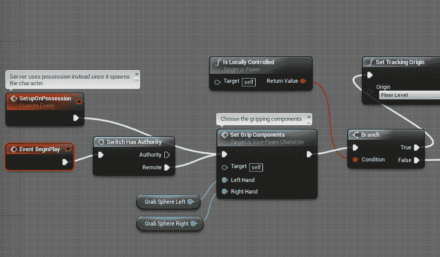

在查找结果列表中出现了事件 BeginPlay。我们可以双击它跳转到蓝图中的该事件。

观察 BeginPlay，我们可以看到它只在服务器上处理此事件；它使用了一个名为 SetupOnPossession 的自定义事件。我们可以看到它为本地控制的玩家设置了抓取组件；它调整了跟踪原点和观众屏幕，然后对于每个物体，它将生成并设置一对`BP_Teleport_Controller`角色，这些角色会附加到运动控制器上。

也许我们还不完全了解这个角色，但仅仅从观察它的 BeginPlay，我们已经学到了一些东西：

+   这个角色已经设置为在网络游戏中使用-它根据是否具有权限执行不同的路径

+   根据本地运行还是由其他玩家控制，角色会以不同的方式处理一些事情。

+   传送处理由一个与角色不同的类管理。我们将要查看这个类。

现在让我们对 Event Tick 做同样的事情：

+   搜索`Tick`，并双击结果中出现的 Event Tick 条目：

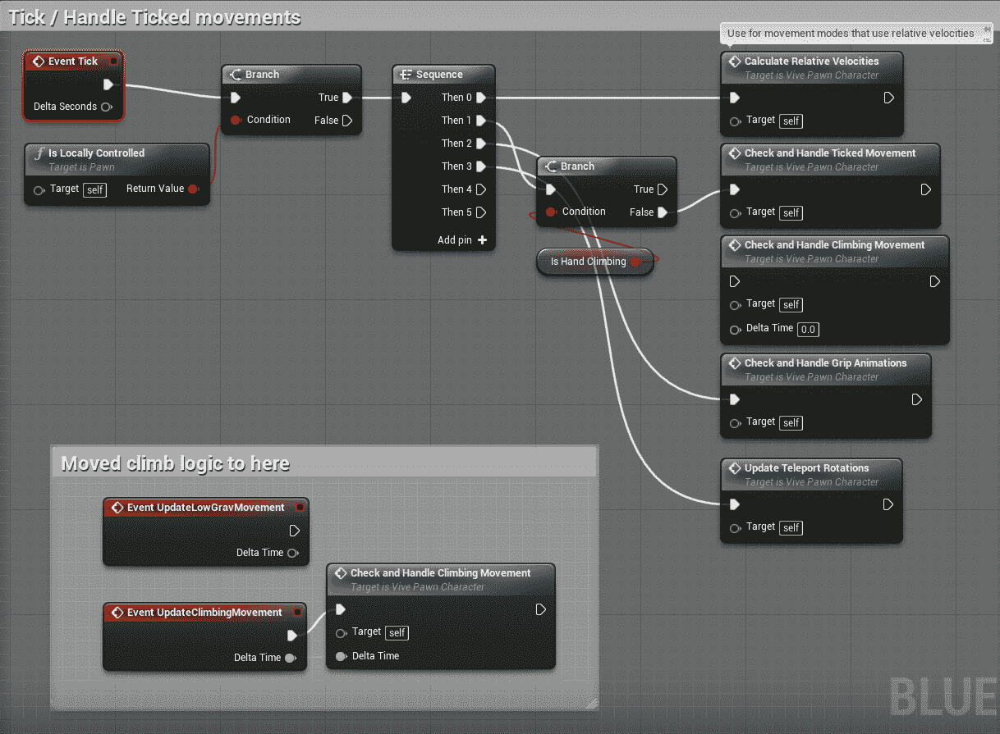

同样，这些信息可以立即告诉我们一些事情：

+   远程角色在 tick 中不执行任何操作。这很好。

+   tick 主要处理移动，但攀爬移动被移到了一个单独的事件中。

+   抓取动画和传送旋转也在 tick 中处理。

在这个阶段还不需要进行深入挖掘。你的目的是给自己一个广泛的视角，了解这个类包含的部分以及它们何时以及如何工作。这样，当你稍后寻找细节时，你就会知道在哪里寻找。

到目前为止，这个过程已经给我们提供了一些信息。仅凭知道父类、它包含的组件和两个已知事件，我们就可以对这个类的功能有一定的直觉。现在是时候更具体地开始，从一个简单的问题开始-当玩家尝试传送时会发生什么？

# 使用输入作为蓝图中的起点

我们可以通过查看这个庞大的事件图并尝试找到我们要找的内容来回答这个问题（在这种情况下，这对我们来说可能会相当顺利，因为图表组织得很好，作者在文档中做得很好），但有一种更简单的方法。

从你所知道的东西开始，然后从那里开始执行，看看会发生什么。

在我们的情况下，我们知道玩家通过按下 Dpads 或拇指杆之一来执行传送，具体取决于他们是使用 Vive、Oculus 还是其他设备。这将被映射为一个输入。让我们找到它：

1.  打开设置 | 项目设置 | 引擎 | 输入，并展开动作映射扩展器。

这里有一个名为 TeleportRight 的输入听起来很有希望。如果我们展开它，我们可以看到它被映射到右拇指杆或 FaceButton 1（在 Vive 上是 Dpad 的顶部象限）。就是这个：

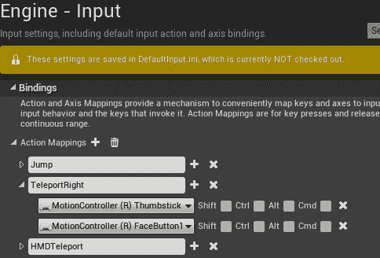

现在我们有一个要查找的输入名称，我们将在蓝图中搜索 TeleportRight，我们可能会找到一些东西。（有些项目在本机 C++环境中处理输入，但在蓝图中处理输入更为常见。）

1.  跳转回你的事件图并按下 Ctrl + F 来打开查找结果面板。

1.  在搜索框中输入`TeleportRight`，然后点击框右侧的放大镜符号以在所有蓝图中运行搜索：

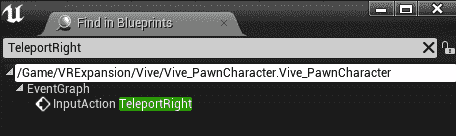

就是这样。我们的角色正在处理这个输入：

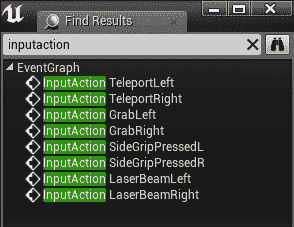

当你在寻找输入时，另一个有用的策略是在搜索框中直接输入 inputaction。任何使用项目的输入设置（写入 DefaultInput.ini）映射的输入都会以这个前缀开头。

1.  双击 InputAction TeleportRight 的条目，你将进入事件图中的事件处理程序：

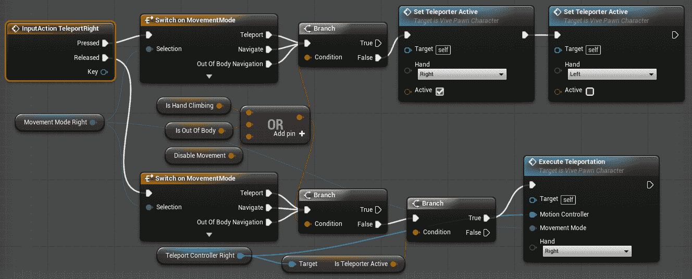

现在我们有东西可以看了。我们可以使用断点来确认我们正在查看正确的内容。

# 设置断点和跟踪执行

我们将使用断点来验证当我们触发输入时，我们认为将执行的代码是否真的执行。这是一种理解他人代码的常用技术。当你对其执行路径不确定时，在你预期会被触发的位置设置断点，然后看看哪些断点真正被触发。这将为你开始探索软件提供一个起点：

1.  选择 InputAction TeleportRight 节点，按下*F9*在其上设置一个断点，或者右键点击并从上下文菜单中选择切换断点：

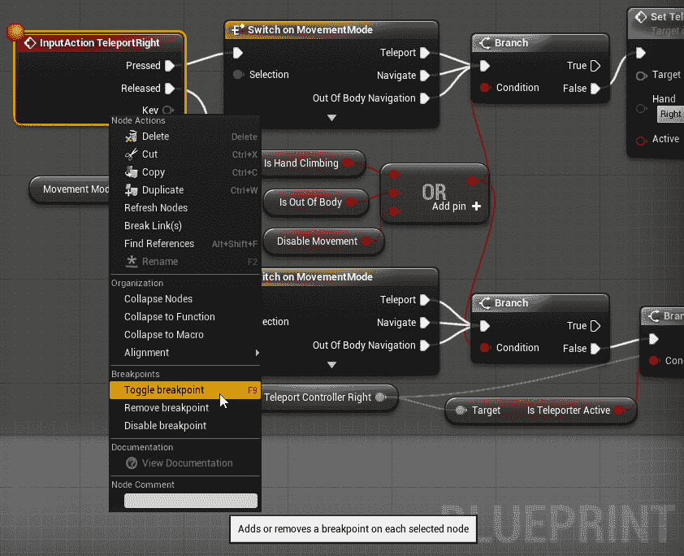

当蓝图节点上有断点时，它会指示编辑器在达到包含断点的节点时暂停蓝图的执行。然后，你可以逐步执行每个动作并查看蓝图正在做什么。现在让我们来测试一下。

1.  在 InputAction TeleportRight 上仍然设置断点的情况下，启动 VR 预览会话（你不需要真的戴上头盔，我们将在一秒钟内退出它），并激活右侧传送输入。

游戏应该会看起来冻结在那里，你的 VR 头戴式显示器将停止显示环境。

1.  现在看一下 InputAction TeleportRight 节点。你会看到一个红色箭头，表示蓝图模拟已在此节点处暂停：

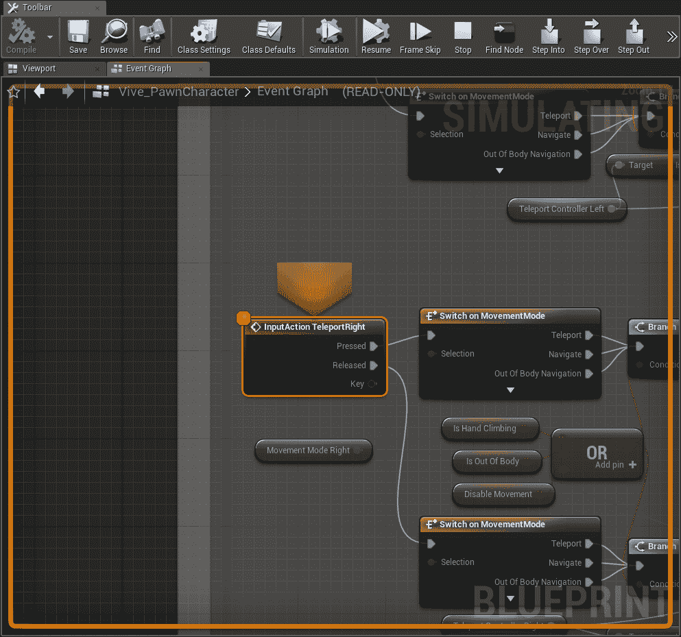

让我们也注意一下这里的其他一些事情。你可以看到蓝图显示被黄色指示器环绕，表示它当前正在模拟，并且从标题行可以看出，图表当前处于只读状态。在模拟蓝图时，你不允许更改蓝图：


让我们也来看一下出现在工具栏上的执行控制：

+   恢复按钮将恢复正常执行。（在运行 VR 时这是有风险的——你的头戴式显示器可能无法从暂停状态正确唤醒。）

+   帧跳过按钮允许执行一帧并返回到暂停状态。

+   停止按钮将关闭你的**编辑器中播放**（**PIE**）会话并返回到编辑器。

+   查找节点按钮将带你回到当前停止执行的节点。

这三个节点是用于逐步执行代码的重要节点，你应该记住它们的快捷键，因为你会经常使用它们：

+   Step Into（*F11*）步进到下一个执行的节点，并且如果该节点表示蓝图函数调用或宏，则跳转到函数的实现。

在我们继续之前，让我们看一下它的运行情况。

现在按下*F11*。看看我们现在跳转到了 Switch on MovementMode 节点：

1.  将鼠标悬停在 Switch on MovementMode 节点的选择输入上。悬停提示显示输入的类型和当前值：

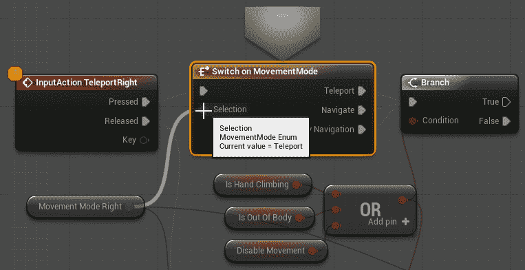

我们可以看到 Movement Mode Right 当前设置为 Teleport，所以 switch 语句的第一个分支将执行。

1.  再次按下*F11*，执行步进到`Branch`语句。

悬停在其输入值上，我们可以看到，因为我们没有手爬行、离开身体或处于禁止移动状态，所以这个值为 false，将执行 false 分支。

1.  再次按下*F11*，我们如预期地跳转到了 SetTeleporterActive 节点。

1.  再次按下*F11*，这次发生了一些有趣的事情。我们没有跳转到事件图中的下一个节点，而是跳转到了`Set Teleporter Active`函数内部。

这是 Step Into（*F11*）和 Step Over（*F10*）之间的区别。*Step into*会带你到执行的任何地方，甚至是函数调用或宏，而*F10*会跳过函数调用而不进入其中。

1.  继续按下*F11*，直到我们进入“Is Valid”宏的内部。

我们实际上对这个宏的内容不感兴趣，所以我们想要跳出来，这样我们就可以继续查看我们的`SetTeleporterActive`函数。

1.  按下*Alt* + *Shift* + *F11*，或者点击“步出”按钮返回到`SetTeleporterActive`图中。

现在你已经看到了这三个导航操作的实际效果。练习它们并熟悉使用它们的快捷键。像这样逐步查看蓝图是看到复杂蓝图运行方式最快、最有效的方法之一。

记住以下内容：

+   *F11*（步入）跳转到下一个执行的节点，即使它在另一个函数或宏内部。

+   *F10*（步过）在当前上下文中跳转到下一个执行的节点，但不会进入从该上下文调用的函数或宏中。

+   *Alt* + *Shift* + *F11*（步出）从函数或宏中退出到调用它的上下文。

记住这些快捷键。你会为此感到高兴的。

这些快捷键——*F9*切换断点，*F10*步过，*F11*步入，在 Visual Studio 中跟踪 C++代码时也基本上以相同的方式工作，相同的一般技巧——找到代码中的已知点，设置断点，然后逐步查看它的工作方式，并在那里应用它。在 Visual Studio 中使用*Shift* + *F11*从一个方法中步出。

1.  按下*F11*，直到执行跳转到`Activate Teleporter`方法中。

看一下你的标签栏，你会发现你现在已经跳转到了一个完全不同的类中。VRExpansion 插件的示例项目使用一个名为`BP_TeleportController`的独立蓝图角色来处理绘制传送光束和目标指示器。这是有用的信息。

这也是设计这个系统的聪明方式。将这样的系统捆绑到自己的对象中，可以更容易地在长期运行中进行替换，将其添加到新的角色类中，或者在需要调试时找到你要找的东西。你在这里看到的是一种更高级的组织原则，但学会用这些术语思考是值得的。

# 查看执行跟踪

假设我们正在逐步查看蓝图，并意识到我们需要跳回几个步骤来查看是什么值驱动了一个分支或一个开关。为了做到这一点，我们可以利用调试面板的执行跟踪：

1.  选择“窗口”|“调试”以打开调试面板。

1.  展开面板的执行跟踪部分。

1.  继续逐步查看你的蓝图，并观察这里发生了什么：

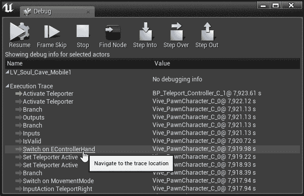

执行跟踪将构建一个面包屑列表，显示我们在执行过程中已经经过的部分。每当你需要重新访问以前的执行步骤时，你可以点击它，然后你将被带到图表的那个部分，你可以看到驱动它的输入和它产生的输出。

这是学习新蓝图的最有效的方法之一：设置断点并查看它的运行方式。通过这种方式，你将对类的构建方式有一个非常清晰的认识。

随着你在开发职业中的进步，并且擅长于解决和利用现有代码，你可能会惊讶地发现有多少开发人员因为未能有效地学会这样做而束缚了自己，并最终以困难的方式完成任务，如果他们真的能完成的话。你会发现，其中一些是开发人员所谓的“非自创”综合症（通常是一种将工作视为自我而掩盖的恐惧），而另一些则是简单的缺乏知识。你花在研究和学习已经解决的关于你要解决的问题的内容上的时间永远不会浪费。

# 使用调试窗口管理断点

我们马上要进行另一次探索，但首先，我们要清除 Vive_PawnCharacter 蓝图中的断点：

1.  点击停止按钮结束模拟并返回编辑器。

1.  切换回 Vive_PawnCharacter 蓝图，如果它还没有打开，请选择窗口 | 调试。

这一次，我们对此面板上显示的断点列表感兴趣：

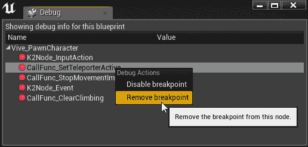

在此屏幕截图中，我添加了一些额外的断点以使示例更清晰。

您可以单击列表中的任何断点以跳转到蓝图中的位置，并可以右键单击禁用或删除断点。

禁用断点会关闭断点而不删除它。如果您想暂时省略断点但仍然希望能够稍后重新启用它以进行进一步调试，这将非常有用。

您还可以通过选择蓝图节点并按下*F9*来切换任何断点的开启或关闭状态。

现在让我们将它们全部清除出我们的类：

+   点击调试 | 删除所有断点（或使用*Ctrl* + *Shift* + *F9*）。

这将删除我们之前在输入动作上设置的断点，以及在此蓝图中设置的任何其他断点。此菜单还提供了禁用和启用类中所有断点的选项。

# 使用调用堆栈

现在让我们进行另一个实验。我们已经看到了如何在输入事件上开始逐步执行以查看调用事件时会发生什么，但是如果我们对特定函数感兴趣，并且想要查看它何时被调用以及由谁调用呢？我们有一些强大的工具可以帮助我们。

假设我们在游戏中看到了一个相机淡入的情况，并且我们想找出是谁在调用它。也许我们甚至不确定调用的名称是什么，但我们猜测它可能包含单词*fade*：

1.  按下*Ctrl* + *F*激活查找结果窗口，然后在搜索栏中键入`fade`。

1.  使用望远镜在所有蓝图中查找：

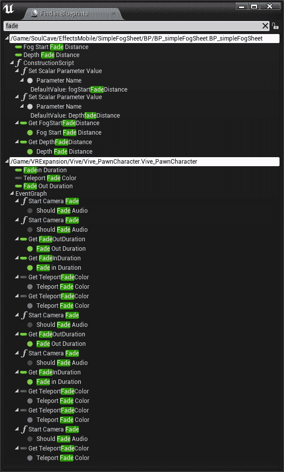

我们可以看到这里有很多条目，但大多数都是变量。显然，迷雾表中的东西不是我们要找的，但是 Vive_PawnCharacter 中的这些 Start Camera Fade 调用看起来很有希望。

1.  双击第一个“Start Camera Fade”条目，跳转到图表中的位置，并按下*F9*在其上设置断点。

1.  对其他三个重复此操作。

1.  启动 VR 预览会话并激活传送。

执行将停在一个“Start Camera Fade”节点上。不过，这一次，我们不想逐步执行代码以查看接下来会发生什么，而是想看看我们是如何到达这里的。

1.  点击窗口 | 开发人员工具 | 蓝图调试器以打开蓝图调试器。

您将看到显示的三个选项卡中的第一个标签为调用堆栈：

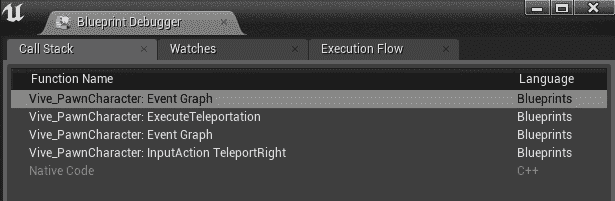

调用堆栈是一个列出了导致当前执行暂停的所有事件和函数的列表。这为您提供了大量的信息。调用堆栈的顶部表示当前执行暂停的位置，其下方的条目是调用它的函数或事件。再下方的条目是调用该函数的内容，依此类推。

查看此堆栈，我们可以看到一个 C++例程检测到按钮按下并触发了 InputAction TeleportRight。然后，从事件图表中进行了调用。让我们双击调用堆栈中的此条目以查看它：

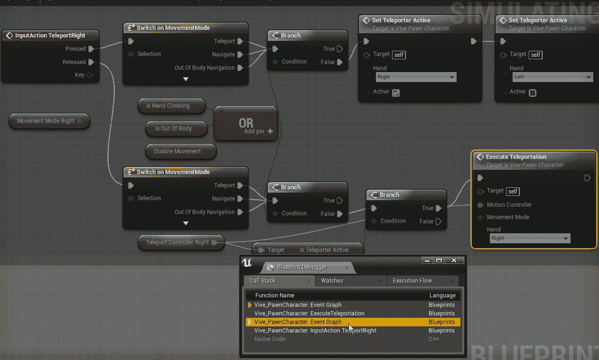

这是由输入动作的 Released 事件触发的 Execute Teleportation 调用。

我们可以双击下一个调用——`ExecuteTeleportation`事件，并查看导致我们寻找的相机淡入的图表。

这是一种强大的技术，您应该养成使用它的习惯。

有关使用虚幻蓝图调试工具的更多信息，请查看这里：[`docs.unrealengine.com/en-us/Engine/Blueprints/UserGuide/Debugging`](https://docs.unrealengine.com/en-us/Engine/Blueprints/UserGuide/Debugging)。

使用此工具在蓝图中进行一些探索，然后点击停止返回编辑器。

# 查找变量引用

回到我们的传送示例，如果我们想知道是什么改变了驱动`switch`语句的`Movement Mode`变量，那么怎么办呢？

这很容易做到：

1.  选择 Movement Mode Right 变量。

1.  右键点击它并选择 Find References，或者按下*Alt* + *Shift* + *F*：

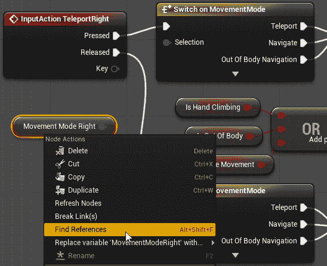

我们可以看到这个变量在很多地方被使用，但只在两个位置被设置。这就是我们感兴趣的：

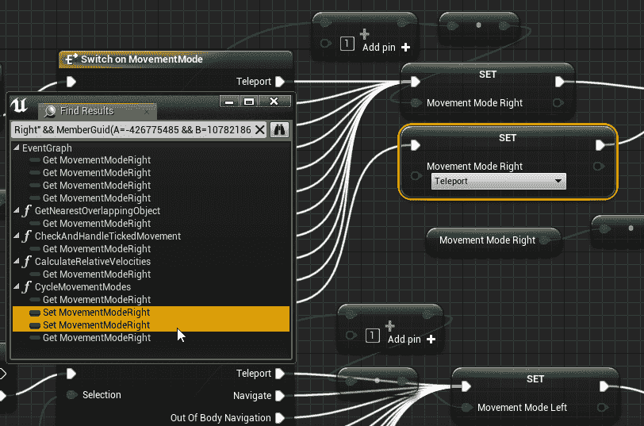

1.  双击 Find Results 中的 Set MovementModeRight 条目之一。

这将带我们到设置这个变量的位置，我们可以看到这是在一个名为`Cycle Movement Modes`的函数中进行的。然后我们可以使用我们学到的策略来查看这个函数何时以及如何被调用，以及与之相关的其他事情。

你可以使用*Alt* + Shift + *F*来查找函数和变量。练习一下。

理解别人的代码就像解开一个复杂的结。如果你试图一次理解所有内容，你会让自己感到沮丧。相反，你找到一根单独的线，开始跟随它并解开它，随着你的进行，它的结构就会变得清晰起来。这些工具可以帮助你做到这一点。

# 使用更多的 VRExpansion 插件

**VRExpansion**是一个庞大的插件，为 VR 开发者提供了很多功能。现在你已经有了一些探索它、弄清楚它的工作原理以及如何使用它的策略，你将能够释放巨大的潜力。

除了我们刚刚探索的角色之外，这个插件还提供了一个支持 VR 的玩家控制器、一个 AI 控制器、立体小部件、按钮、杠杆等等。

如果你想更好地了解这个插件包含了什么（这远远超出了本章的范围），在内容浏览器中点击 View Options 弹出菜单，打开 Show Plugin Content，并确保 Show C++ Classes 可见：

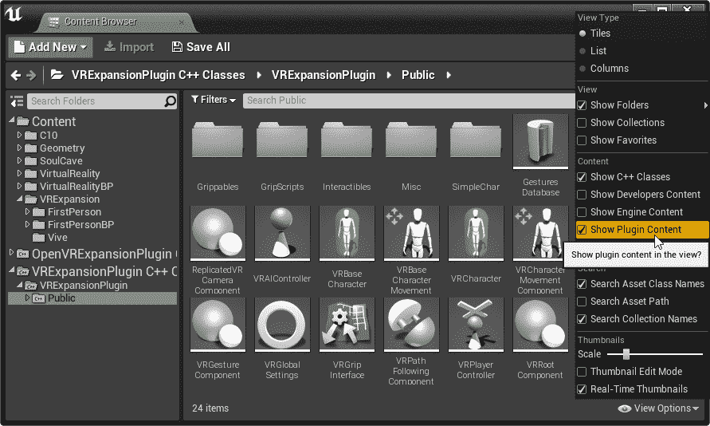

浏览类目录，看看里面有什么。如果你双击其中任何一个类，它的原始源代码将在 Visual Studio 中打开。

你最好的资源之一是 UnrealEngine.com 上的 VR Expansion Plugin 论坛，网址在这里：[`forums.unrealengine.com/development-discussion/vr-ar-development/89050-vr-expansion-plugin`](https://forums.unrealengine.com/development-discussion/vr-ar-development/89050-vr-expansion-plugin)。

插件的作者 Joshua Statzer（mordentral）在论坛上非常活跃，并且周围有一群乐于助人的开发者社区，他们非常愿意帮助新开发者入门。

# 总结

这一章与我们到目前为止所做的教程有些不同，因为它的目的实际上是帮助你达到一个能够探索 Unreal 生态系统中的众多插件、模板、示例和其他项目，并学习如何使用它们来加速你的工作和学习新技术的能力。这是你作为开发者可以自学的最有价值的技能之一。如果你能够熟练地探索在外部找到的代码，你将能够在更短的时间内开发出更强大的软件，并通过看到经验丰富的开发者如何解决你正在尝试解决的问题来学习更高级的技术。这将使你成为一个更好的开发者。
