# 第五章：4 添加用户交互和生产工具

## 加入我们的 Discord 书籍社区


[`packt.link/unitydev`](https://packt.link/unitydev)

在本章中，我们将学习如何实现基本的辅助工具，以极大地简化图形应用程序的调试。这些示例使用 Vulkan 实现，并使用了前三个章节的所有材料。在 *第三章*，*与 Vulkan 对象一起工作* 中，我们展示了如何包装原始 Vulkan 代码的各种实例，以创建和维护基本的 Vulkan 状态和对象。在本章中，我们将展示如何以易于扩展和适应不同应用程序的方式开始实现 Vulkan 渲染代码。从 2D 用户界面渲染开始是最好的学习方法，因为它使事情变得简单，并允许我们专注于渲染代码，而不会被复杂的 3D 图形算法所淹没。

我们将涵盖以下食谱：

+   渲染 ImGui 用户界面

+   将 Tracy 集成到 C++ 应用程序中

+   添加每秒帧数计数器

+   在 Vulkan 中使用立方体贴图纹理

+   使用 3D 相机和基本用户交互一起工作

+   添加相机动画和运动

+   实现即时模式 3D 绘图画布

+   使用 ImGui 和 ImPlot 在屏幕上渲染图表

+   将所有内容整合到 Vulkan 应用程序中

## 技术要求

要在您的 Linux 或 Windows PC 上运行本章的代码，您需要一个支持 Vulkan 1.3 的最新驱动程序的 GPU。本章使用的源代码可以从 [`github.com/PacktPublishing/3D-Graphics-Rendering-Cookbook`](https://github.com/PacktPublishing/3D-Graphics-Rendering-Cookbook) 下载。

## 渲染 ImGui 用户界面

ImGui 是一个流行的无冗余图形用户界面库，用于 C++，对于图形应用程序的交互式调试至关重要。ImGui 集成是 *LightweightVK* 库的一部分。在本食谱中，我们将逐步通过代码，展示如何创建一个带有 ImGui 渲染的示例应用程序。

### 准备工作

建议重新查看 *第三章，与 Vulkan 对象一起工作* 中的 *使用 Vulkan 描述符索引* 食谱，并回忆该章节其他食谱中描述的 Vulkan 基础知识。

本食谱涵盖了 `lightweight/lvk/HelpersImGui.cpp` 的源代码。本食谱的示例代码位于 `Chapter04/01_ImGui`。

### 如何做到这一点...

让我们从最简单的 ImGui 示例应用程序开始，看看如何使用由 *LightweightVK* 提供的 ImGui Vulkan 包装器：

首先，我们创建一个 `lvk::ImGuiRenderer` 对象。它接受一个指向我们的 `lvk::IContext` 的指针，默认字体的名称以及像素中的默认字体大小。`ImGuiRenderer` 将负责所有低级 ImGui 初始化和代码：

```cpp
std::unique_ptr<lvk::ImGuiRenderer> imgui =
  std::make_unique<lvk::ImGuiRenderer>(
    *ctx, “data/OpenSans-Light.ttf”, 30.0f);
```

让我们创建一些 GLFW 回调，将鼠标移动和按钮按下传递到 ImGui 中。应将 GLFW 鼠标按钮 ID 转换为 ImGui 的 ID：

```cpp
glfwSetCursorPosCallback(window,
  [](auto* window, double x, double y) {
    ImGui::GetIO().MousePos = ImVec2(x, y);
  });
glfwSetMouseButtonCallback(window,
  [](auto* window, int button, int action, int mods) {
    double xpos, ypos;
    glfwGetCursorPos(window, &xpos, &ypos);
    const ImGuiMouseButton_ imguiButton =
     (button==GLFW_MOUSE_BUTTON_LEFT) ?
       ImGuiMouseButton_Left:(button == GLFW_MOUSE_BUTTON_RIGHT ?
       ImGuiMouseButton_Right : ImGuiMouseButton_Middle);
    ImGuiIO& io               = ImGui::GetIO();
    io.MousePos               = ImVec2((float)xpos, (float)ypos);
    io.MouseDown[imguiButton] = action == GLFW_PRESS;
  });
```

在我们的典型渲染循环中，我们可以按照以下方式调用 ImGui 渲染命令。`ImGuiRenderer::beginFrame()` 方法接受一个 `lvk::Framebuffer` 对象，以便它可以正确设置渲染管线：

```cpp
lvk::ICommandBuffer& buf = ctx->acquireCommandBuffer();
const lvk::Framebuffer framebuffer = {
  .color = {{ .texture = ctx->getCurrentSwapchainTexture() }}};
buf.cmdBeginRendering({ .color = { {
  .loadOp = lvk::LoadOp_Clear,
  .clearColor = {1.0f, 1.0f, 1.0f, 1.0f} } } }, framebuffer);
imgui->beginFrame(framebuffer);
```

让我们绘制一个带有纹理的 ImGui 窗口。一个纹理索引作为 `ImTextureID` 值传递给 ImGui，以便它可以与我们在上一章的 *使用 Vulkan 描述符集* 菜单中讨论的无绑定渲染方案一起使用：

```cpp
ImGui::Begin(“Texture Viewer”, nullptr,
  ImGuiWindowFlags_AlwaysAutoResize);
ImGui::Image(ImTextureID(texture.indexAsVoid()),
  ImVec2(512, 512));
ImGui::ShowDemoWindow();
ImGui::End();
```

`ImGuiRenderer::endFrame()` 方法是一个包含实际 Vulkan 命令的命令缓冲区，然后我们可以调用 `cmdEndRendering()` 并提交我们的命令缓冲区：

```cpp
imgui->endFrame(buf);
buf.cmdEndRendering();
ctx->submit(buf, ctx->getCurrentSwapchainTexture());
```

这个演示应用程序应该渲染一个类似于以下截图所示的简单 ImGui 界面：

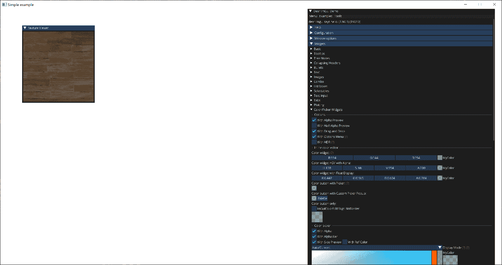

图 4.1：ImGui 渲染

现在让我们看看 LightweightVK 内部低级实现，它负责渲染 ImGui 数据。

### 它是如何工作的…

`lvk::ImGuiRenderer` 辅助类在 `lvk\HelpersImGui.h` 中声明。以下是它的声明。

1.  构造函数接受对 `lvk::IContext` 的引用、默认 `.ttf` 字体文件的名称以及默认字体大小（以像素为单位）。`updateFont()` 方法可以在稍后阶段调用以覆盖之前使用的字体。此方法从构造函数中调用，以设置默认字体：

```cpp
class ImGuiRenderer {
 public:
  explicit ImGuiRenderer(lvk::IContext& ctx,
    const char* defaultFontTTF = nullptr,
    float fontSizePixels = 24.0f);
  ~ImGuiRenderer();
  void updateFont(const char* defaultFontTTF, float fontSizePixels);
```

1.  `beginFrame()` 和 `endFrame()` 方法是必要的，用于准备 ImGui 以进行渲染并从 ImGui 绘制数据生成 Vulkan 命令。`setDisplayScale()` 方法可以用来覆盖 ImGui 的 `DisplayFramebufferScale` 因子：

```cpp
 void beginFrame(const lvk::Framebuffer& desc);
  void endFrame(lvk::ICommandBuffer& cmdBuffer);
  void setDisplayScale(float displayScale);
```

1.  `lvk::ImGuiRenderer` 类的私有部分包含一个创建新渲染管线和渲染所需的一组数据的函数。有一个单独的顶点和片段着色器集、一个渲染管线以及从我们在构造时提供的 `.ttf` 字体文件创建的纹理：

```cpp
 private:
  lvk::Holder<lvk::RenderPipelineHandle> createNewPipelineState(
    const lvk::Framebuffer& desc);
 private:
  lvk::IContext& ctx_;
  lvk::Holder<lvk::ShaderModuleHandle> vert_;
  lvk::Holder<lvk::ShaderModuleHandle> frag_;
  lvk::Holder<lvk::RenderPipelineHandle> pipeline_;
  lvk::Holder<lvk::TextureHandle> fontTexture_;
  float displayScale_ = 1.0f;
  uint32_t nonLinearColorSpace_ = 0;
  uint32_t frameIndex_ = 0;
```

1.  为了确保无停滞操作，*LightweightVK* 使用多个缓冲区将 ImGui 顶点和索引数据传递到 Vulkan（以下代码中的 `vb` 和 `ib` 分别代表顶点缓冲区和索引缓冲区）：

```cpp
 struct DrawableData {
    lvk::Holder<BufferHandle> vb_;
    lvk::Holder<BufferHandle> ib_;
    uint32_t numAllocatedIndices_ = 0;
    uint32_t numAllocatedVerteices_ = 0;
  };
  static constexpr uint32_t kNumSwapchainImages = 3;
  DrawableData drawables_[kNumSwapchainImages] = {};
};
```

现在我们可以深入到实现部分，这部分位于 `lvk/HelpersImGui.cpp`。

1.  顶点着色器使用可编程顶点提取，我们在上一章的 *处理 Vulkan 中的缓冲区* 菜单中简要提到了它。让我们更详细地看看它。

1.  ImGui 为每个顶点提供二维屏幕坐标、二维纹理坐标以及一个 RGBA 颜色。我们声明一个 `Vertex` 结构来存储每个顶点的数据，并将所有顶点存储在 `VertexBuffer` 内部的 `vertices[]` 数组中。`buffer_reference` GLSL 布局限定符声明了一个类型，而不是缓冲区的实例，这样可以在稍后阶段将对该缓冲区的引用传递到着色器中：

```cpp
layout (location = 0) out vec4 out_color;
layout (location = 1) out vec2 out_uv;
layout (location = 2) out flat uint out_textureId;
struct Vertex {
  float x, y;
  float u, v;
  uint rgba;
};
layout(std430, buffer_reference) readonly buffer VertexBuffer {
  Vertex vertices[];
};
```

1.  通过 Vulkan 推送常量传递对包含我们每个顶点数据的`VertexBuffer`的引用。除此之外，我们传递一个纹理 ID 和一些表示为`vec4 LRTB`内部左、右、上、下平面的 2D 视口参数：

```cpp
layout(push_constant) uniform PushConstants {
  vec4 LRTB;
  VertexBuffer vb;
  uint textureId;
} pc;
void main() {
  float L = pc.LRTB.x;
  float R = pc.LRTB.y;
  float T = pc.LRTB.z;
  float B = pc.LRTB.w;
```

一旦我们有了视口参数，我们可以按照以下方式构造一个正交投影矩阵，这与`glm::ortho()`创建投影矩阵的方式相似：

```cpp
 mat4 proj = mat4(
    2.0 / (R-L),              0.0,  0.0,  0.0,
    0.0,              2.0 / (T-B),  0.0,  0.0,
    0.0,                      0.0, -1.0,  0.0,
    (R+L) / (L-R),  (T+B) / (B-T),  0.0,  1.0);
```

1.  使用内置的 GLSL 变量`gl_VertexIndex`从`VertexBuffer::vertices`数组中提取当前顶点。RGBA 顶点颜色`v.rgba`打包成一个 32 位无符号整数，可以使用`unpackUnorm4x8()` GLSL 内置函数解包到`vec4`：

```cpp
 Vertex v = pc.vb.vertices[gl_VertexIndex];
  out_color = unpackUnorm4x8(v.rgba);
```

1.  纹理坐标和纹理 ID 未经更改地传递到片段着色器。投影矩阵通过将`0`作为`Z`分量添加到`vec4`中，与顶点位置相乘：

```cpp
 out_uv = vec2(v.u, v.v);
  out_textureId = pc.textureId;
  gl_Position = proj * vec4(v.x, v.y, 0, 1);
}
```

相应的 GLSL 片段着色器要简单得多，如下所示：

输入位置应与顶点着色器中的相应输出位置匹配：

```cpp
layout (location = 0) in vec4 in_color;
layout (location = 1) in vec2 in_uv;
layout (location = 2) in flat uint in_textureId;
layout (location = 0) out vec4 out_color;
```

*LightweightVK*支持一些基本的 sRGB 帧缓冲区渲染。此着色器常量用于启用一些基本的色调映射。纹理 ID 用于访问所需的免绑定纹理。采样器始终是索引`0`的默认采样器。`constant_id` GLSL 修饰符用于指定 Vulkan 的专用常量：

```cpp
layout (constant_id = 0) const bool kNonLinearColorSpace = false;
void main() {
  vec4 c = in_color * texture(sampler2D(
    kTextures2D[in_textureId], kSamplers[0]), in_uv);
```

在这里，我们可以将我们的 UI 以线性颜色空间渲染到 sRGB 帧缓冲区中：

```cpp
 out_color = kNonLinearColorSpace ?
    vec4(pow(c.rgb, vec3(2.2)), c.a) : c;
}
```

现在让我们看看`lvk::ImGuiRender`实现中的 C++代码。那里有一个私有的`ImGuiRenderer::createNewPipelineState()`辅助函数，它负责为 ImGui 渲染创建一个新的渲染管线。由于 Vulkan 1.3 中所有相关 Vulkan 状态都可以是动态的，因此一个不可变的管线就足够了。

1.  创建管线需要帧缓冲区描述，因为我们需要有关颜色和深度附加格式的信息：

```cpp
Holder<RenderPipelineHandle> ImGuiRenderer::createNewPipelineState(
  const lvk::Framebuffer& desc)
{
  nonLinearColorSpace_ =
    ctx_.getSwapChainColorSpace() == ColorSpace_SRGB_NONLINEAR ? 1:0;
  return ctx_.createRenderPipeline({
    .smVert = vert_,
    .smFrag = frag_,
```

1.  根据 swapchain 颜色空间启用 sRGB 模式，并将其作为 Vulkan 专用常量传递到着色器中：

```cpp
 .specInfo = { .entries = {{.constantId = 0,
                  .size = sizeof(nonLinearColorSpace_)}},
                  .data = &nonLinearColorSpace_,
                  .dataSize = sizeof(nonLinearColorSpace_) },
```

1.  所有 ImGui 元素都需要启用 alpha 混合。如果存在深度缓冲区，它将保持不变，但渲染管线应该知道这一点：

```cpp
 .color = {{
      .format = ctx_.getFormat(desc.color[0].texture),
      .blendEnabled = true,
      .srcRGBBlendFactor = lvk::BlendFactor_SrcAlpha,
      .dstRGBBlendFactor = lvk::BlendFactor_OneMinusSrcAlpha,
    }},
    .depthFormat = desc.depthStencil.texture ?
      ctx_.getFormat(desc.depthStencil.texture) :
      lvk::Format_Invalid,
    .cullMode = lvk::CullMode_None},
    nullptr);
}
```

从构造函数中调用另一个辅助函数`ImGuiRenderer::updateFont()`。以下是它的实现方式。

首先，它使用提供的字体大小设置 ImGui 字体配置参数：

```cpp
void ImGuiRenderer::updateFont(
  const char* defaultFontTTF, float fontSizePixels)
{
  ImGuiIO& io = ImGui::GetIO();
  ImFontConfig cfg = ImFontConfig();
  cfg.FontDataOwnedByAtlas = false;
  cfg.RasterizerMultiply = 1.5f;
  cfg.SizePixels = ceilf(fontSizePixels);
  cfg.PixelSnapH = true;
  cfg.OversampleH = 4;
  cfg.OversampleV = 4;
  ImFont* font = nullptr;
```

然后它从`.ttf`文件加载默认字体：

```cpp
 if (defaultFontTTF) {
    font = io.Fonts->AddFontFromFileTTF(
      defaultFontTTF, cfg.SizePixels, &cfg);
  }
  io.Fonts->Flags |= ImFontAtlasFlags_NoPowerOfTwoHeight;
```

最后但同样重要的是，从 ImGui 检索光栅化的 TrueType 字体数据并将其作为*LightweightVK*纹理存储。这个字体纹理稍后通过其索引 ID 用于渲染：

```cpp
 unsigned char* pixels;
  int width, height;
  io.Fonts->GetTexDataAsRGBA32(&pixels, &width, &height);
  fontTexture_ = ctx_.createTexture({
    .type = lvk::TextureType_2D,
    .format = lvk::Format_RGBA_UN8,
    .dimensions = {(uint32_t)width, (uint32_t)height},
    .usage = lvk::TextureUsageBits_Sampled,
    .data = pixels }, nullptr);
  io.Fonts->TexID = ImTextureID(fontTexture_.indexAsVoid());
  io.FontDefault = font;
}
```

所有准备工作都完成了，我们现在可以看看`ImGuiRenderer`的构造函数和析构函数。这两个成员函数都非常简短。

构造函数初始化 ImGui 和 ImPlot 上下文，以防*LightweightVK*编译了可选的 ImPlot 支持。目前，*LightweightVK*只支持单个 ImGui 上下文：

```cpp
ImGuiRenderer::ImGuiRenderer(lvk::IContext& device, const char* defaultFontTTF, float fontSizePixels) : ctx_(device) {
  ImGui::CreateContext();
#if defined(LVK_WITH_IMPLOT)
  ImPlot::CreateContext();
#endif // LVK_WITH_IMPLOT
```

在这里，我们设置`ImGuiBackendFlags_RendererHasVtxOffset`标志，告诉 ImGui 我们的渲染器支持顶点偏移。它启用了使用 16 位索引输出大型网格的功能，使 UI 渲染更高效：

```cpp
 ImGuiIO& io = ImGui::GetIO();
  io.BackendRendererName = “imgui-lvk”;
  io.BackendFlags |= ImGuiBackendFlags_RendererHasVtxOffset;
```

所有创建默认字体和着色器的工作都委托给了我们刚才讨论的内容：

```cpp
 updateFont(defaultFontTTF, fontSizePixels);
  vert_ = ctx_.createShaderModule(
    {codeVS, Stage_Vert, “Shader Module: imgui (vert)”});
  frag_ = ctx_.createShaderModule(
    {codeFS, Stage_Frag, “Shader Module: imgui (frag)”});
}
```

析构函数很简单，它会清理 ImGui 和可选的 ImPlot：

```cpp
ImGuiRenderer::~ImGuiRenderer() {
  ImGuiIO& io = ImGui::GetIO();
  io.Fonts->TexID = nullptr;
#if defined(LVK_WITH_IMPLOT)
  ImPlot::DestroyContext();
#endif // LVK_WITH_IMPLOT
  ImGui::DestroyContext();
}
```

在继续渲染之前，我们还想看看一个简单的函数：`ImGuiRenderer::beginFrame()`。它使用提供的帧缓冲区开始一个新的 ImGui 帧。在这里，基于实际的帧缓冲区参数懒惰地创建了一个图形管线，因为我们构造函数中没有提供任何帧缓冲区：

```cpp
void ImGuiRenderer::beginFrame(const lvk::Framebuffer& desc) {
  const lvk::Dimensions dim =
    ctx_.getDimensions(desc.color[0].texture);
  ImGuiIO& io = ImGui::GetIO();
  io.DisplaySize = ImVec2(dim.width / displayScale_,
                          dim.height / displayScale_);
  io.DisplayFramebufferScale = ImVec2(displayScale_, displayScale_);
  io.IniFilename = nullptr;
  if (pipeline_.empty()) {
    pipeline_ = createNewPipelineState(desc);
  }
  ImGui::NewFrame();
}
```

现在，我们已经准备好在`ImGuiRenderer::endFrame()`函数中处理 UI 渲染。这个函数每帧运行一次，并填充一个 Vulkan 命令缓冲区。它稍微复杂一些，所以让我们一步一步地了解它是如何工作的。为了简洁起见，以下代码片段省略了错误检查。

首先，我们应该最终完成 ImGui 帧渲染并检索帧绘制数据：

```cpp
void ImGuiRenderer::endFrame(lvk::ICommandBuffer& cmdBuffer) {
  ImGui::EndFrame();
  ImGui::Render();
  ImDrawData* dd = ImGui::GetDrawData();
  int fb_width  = (int)(dd->DisplaySize.x * dd->FramebufferScale.x);
  int fb_height = (int)(dd->DisplaySize.y * dd->FramebufferScale.y);
```

让我们准备渲染状态。我们禁用了深度测试和深度缓冲区写入。基于 ImGui 帧缓冲区大小构建了一个视口，我们之前在`beginFrame()`中设置，使其等于我们的*LightweightVK*帧缓冲区大小：

```cpp
 cmdBuffer.cmdBindDepthState({});
  cmdBuffer.cmdBindViewport({
    .x = 0.0f,
    .y = 0.0f,
    .width = (dd->DisplaySize.x * dd->FramebufferScale.x),
    .height = (dd->DisplaySize.y * dd->FramebufferScale.y),
  });
```

正交投影矩阵的参数在这里准备。它们将通过渲染循环中的 Vulkan 推送常数传递给着色器，与其他参数一起。裁剪参数也在这里准备，以便在渲染循环中使用：

```cpp
 const float L = dd->DisplayPos.x;
  const float R = dd->DisplayPos.x + dd->DisplaySize.x;
  const float T = dd->DisplayPos.y;
  const float B = dd->DisplayPos.y + dd->DisplaySize.y;
  const ImVec2 clipOff = dd->DisplayPos;
  const ImVec2 clipScale = dd->FramebufferScale;
```

每个帧都有一个单独的 LVK 缓冲区。这些缓冲区存储整个帧的 ImGui 顶点和索引数据：

```cpp
 DrawableData& drawableData = drawables_[frameIndex_];
  frameIndex_ =
   (frameIndex_ + 1) % LVK_ARRAY_NUM_ELEMENTS(drawables_);
```

如果存在来自前一帧的缓冲区，并且这些缓冲区的大小不足以容纳新的顶点或索引数据，则将使用新大小重新创建缓冲区。索引缓冲区通过`BufferUsageBits_Index`创建：

```cpp
 if (drawableData.numAllocatedIndices_ < dd->TotalIdxCount) {
    drawableData.ib_ = ctx_.createBuffer({
        .usage = lvk::BufferUsageBits_Index,
        .storage = lvk::StorageType_HostVisible,
        .size = dd->TotalIdxCount * sizeof(ImDrawIdx),
        .debugName = “ImGui: drawableData.ib_”,
    });
    drawableData.numAllocatedIndices_ = dd->TotalIdxCount;
  }
```

存储顶点的缓冲区实际上是一个`BufferUsageBits_Storage`存储缓冲区，因为我们的 GLSL 着色器使用可编程顶点提取来加载顶点：

```cpp
 if (drawableData.numAllocatedVerteices_ < dd->TotalVtxCount) {
    drawableData.vb_ = ctx_.createBuffer({
        .usage = lvk::BufferUsageBits_Storage,
        .storage = lvk::StorageType_HostVisible,
        .size = dd->TotalVtxCount * sizeof(ImDrawVert),
        .debugName = “ImGui: drawableData.vb_”,
    });
    drawableData.numAllocatedVerteices_ = dd->TotalVtxCount;
  }
```

让我们将一些数据上传到顶点和索引缓冲区。整个 ImGui 帧数据都上传到这里。偏移量被仔细保留，这样我们就能知道每个 ImGui 绘制命令数据存储的位置：

```cpp
 ImDrawVert* vtx = (ImDrawVert*)ctx_.getMappedPtr(drawableData.vb_);
  uint16_t* idx = (uint16_t*)ctx_.getMappedPtr(drawableData.ib_);
  for (int n = 0; n < dd->CmdListsCount; n++) {
    const ImDrawList* cmdList = dd->CmdLists[n];
    memcpy(vtx, cmdList->VtxBuffer.Data,
      cmdList->VtxBuffer.Size * sizeof(ImDrawVert));
    memcpy(idx, cmdList->IdxBuffer.Data,
      cmdList->IdxBuffer.Size * sizeof(ImDrawIdx));
    vtx += cmdList->VtxBuffer.Size;
    idx += cmdList->IdxBuffer.Size;
  }
```

需要刷新可见于主机的内存。这将允许*LightweightVK*在内存不是主机对齐的情况下发出相应的 Vulkan `vkFlushMappedMemoryRanges()`命令：

```cpp
 ctx_.flushMappedMemory(
    drawableData.vb_, 0, dd->TotalVtxCount * sizeof(ImDrawVert));
  ctx_.flushMappedMemory(
    drawableData.ib_, 0, dd->TotalIdxCount * sizeof(ImDrawIdx));
  }
```

让我们将索引缓冲区和渲染管线绑定到命令缓冲区，并进入渲染循环，该循环遍历所有 ImGui 渲染命令：

```cpp
 uint32_t idxOffset = 0;
  uint32_t vtxOffset = 0;
  cmdBuffer.cmdBindIndexBuffer(
    drawableData.ib_, lvk::IndexFormat_UI16);
  cmdBuffer.cmdBindRenderPipeline(pipeline_);
  for (int n = 0; n < dd->CmdListsCount; n++) {
    const ImDrawList* cmdList = dd->CmdLists[n];
    for (int cmd_i = 0; cmd_i < cmdList->CmdBuffer.Size; cmd_i++) {
      const ImDrawCmd& cmd = cmdList->CmdBuffer[cmd_i];
```

视口裁剪是在 CPU 端完成的。如果 ImGui 绘制命令完全被裁剪，我们应该跳过它：

```cpp
 ImVec2 clipMin((cmd.ClipRect.x - clipOff.x) * clipScale.x,
                     (cmd.ClipRect.y - clipOff.y) * clipScale.y);
      ImVec2 clipMax((cmd.ClipRect.z - clipOff.x) * clipScale.x,
                     (cmd.ClipRect.w - clipOff.y) * clipScale.y);
      if (clipMin.x < 0.0f) clipMin.x = 0.0f;
      if (clipMin.y < 0.0f) clipMin.y = 0.0f;
      if (clipMax.x > fb_width ) clipMax.x = (float)fb_width;
      if (clipMax.y > fb_height) clipMax.y = (float)fb_height;
      if (clipMax.x <= clipMin.x || clipMax.y <= clipMin.y)
         continue;
```

所有必要的渲染数据都通过 Vulkan 推送常数传递到 GLSL 着色器中。它包括正交投影数据，即左、右、上、下平面，对顶点缓冲区的引用以及用于无绑定渲染的纹理 ID：

```cpp
 struct VulkanImguiBindData {
        float LRTB[4];
        uint64_t vb = 0;
        uint32_t textureId = 0;
      } bindData = {
          .LRTB = {L, R, T, B},
          .vb = ctx_.gpuAddress(drawableData.vb_),
          .textureId = static_cast<uint32_t>(
            reinterpret_cast<ptrdiff_t>(cmd.TextureId)),
      };
      cmdBuffer.cmdPushConstants(bindData);
```

设置裁剪测试，以便它可以对 ImGui 元素进行精确裁剪：

```cpp
 cmdBuffer.cmdBindScissorRect({
        uint32_t(clipMin.x),
        uint32_t(clipMin.y),
        uint32_t(clipMax.x - clipMin.x),
        uint32_t(clipMax.y - clipMin.y)});
```

实际的渲染是通过 `cmdDrawIndexed()` 完成的。在这里，我们使用索引偏移量和顶点偏移量参数来访问我们大型的每帧顶点和索引缓冲区中的正确数据：

```cpp
 cmdBuffer.cmdDrawIndexed(cmd.ElemCount, 1u,
        idxOffset + cmd.IdxOffset,
        int32_t(vtxOffset + cmd.VtxOffset));
    }
    idxOffset += cmdList->IdxBuffer.Size;
    vtxOffset += cmdList->VtxBuffer.Size;
  }
}
```

现在我们已经完成了所有的 ImGui 渲染，并且可以使用 Vulkan 渲染整个 ImGui 用户界面。让我们跳到下一个菜谱，学习其他生产力和调试工具，例如性能分析、3D 摄像机控制、每秒帧数计数器和绘图画布。

## 将 Tracy 集成到 C++ 应用程序中

在上一章 *使用 Vulkan 对象* 中，我们学习了如何使用 Vulkan 和 LightweightVK 编写小型图形应用程序。在实际应用程序中，通常需要在运行时能够快速获取性能分析信息。在本菜谱中，我们将展示如何在使用 3D 应用程序中利用 Tracy 性能分析器。

### 准备工作

本菜谱的演示应用程序的完整源代码位于 `Chapter04/02_TracyProfiler`。

请确保从 [`github.com/wolfpld/tracy`](https://github.com/wolfpld/tracy) 下载适用于您平台的预编译 Tracy 客户端应用程序。在我们的书中，我们使用的是可以从 [`github.com/wolfpld/tracy/releases/tag/v0.10`](https://github.com/wolfpld/tracy/releases/tag/v0.10) 下载的 Tracy 版本 0.10。

### 如何操作...

Tracy 性能分析器本身集成在 *LightweightVK* 库中。我们的演示应用程序以及 *LightweightVK* 渲染代码的许多部分都增加了对性能分析函数的调用。这些调用被封装在一组宏中，以便不直接调用 Tracy。这允许在需要时打开和关闭分析器，甚至切换到其他分析器。让我们看一下演示应用程序，然后探索其底层低级实现：

首先，让我们看一下根 LightweightVK CMake 配置文件 `deps/src/lightweightvk/CMakeLists.txt`，看看 Tracy 库是如何添加到项目中的。一开始，我们应该看到一个默认启用的选项：

```cpp
option(LVK_WITH_TRACY  “Enable Tracy profiler”  ON)
```

1.  在同一文件的几行之后，CMake 选项被转换为 `TRACY_ENABLE` C++ 编译器宏定义，并将 Tracy 库添加到项目中。请注意，这是 *LightweightVK* Git 仓库的 `third-party/deps/src/` 文件夹，它本身位于书籍仓库的 `deps/src/` 文件夹中：

```cpp
if(LVK_WITH_TRACY)
  add_definitions(“-DTRACY_ENABLE=1”)
  add_subdirectory(third-party/deps/src/tracy)
  lvk_set_folder(TracyClient “third-party”)
endif()
```

1.  让我们继续滚动相同的文件，`deps/src/lightweightvk/CMakeLists.txt`，再翻几页。根据之前启用的`LVK_WITH_TRACY` CMake 选项，我们将`LVK_WITH_TRACY` C++宏定义导出到*LightweightVK*的所有用户。Tracy 库与`LVKLibrary`目标链接，这样每个使用*LightweightVK*的应用程序都可以访问 Tracy 函数：

```cpp
if(LVK_WITH_TRACY)
  target_compile_definitions(
    LVKLibrary PUBLIC “LVK_WITH_TRACY=1”)
  target_link_libraries(LVKLibrary PUBLIC TracyClient)
endif()
```

1.  现在，让我们查看`lightweightvk/lvk/LVK.h`并检查一些宏定义。`LVK_WITH_TRACY`宏用于启用或禁用 Tracy 的使用。一些预定义的 RGB 颜色被声明为宏，用于标记重要的兴趣点操作：

```cpp
#if defined(LVK_WITH_TRACY)
  #include “tracy/Tracy.hpp”
  #define LVK_PROFILER_COLOR_WAIT    0xff0000
  #define LVK_PROFILER_COLOR_SUBMIT  0x0000ff
  #define LVK_PROFILER_COLOR_PRESENT 0x00ff00
  #define LVK_PROFILER_COLOR_CREATE  0xff6600
  #define LVK_PROFILER_COLOR_DESTROY 0xffa500
  #define LVK_PROFILER_COLOR_BARRIER 0xffffff
```

1.  其他宏直接映射到 Tracy 函数，这样我们就可以以非侵入的方式使用 Tracy 区域：

```cpp
 #define LVK_PROFILER_FUNCTION() ZoneScoped
  #define LVK_PROFILER_FUNCTION_COLOR(color) ZoneScopedC(color)
  #define LVK_PROFILER_ZONE(name, color) { \
      ZoneScopedC(color);                  \
      ZoneName(name, strlen(name))
  #define LVK_PROFILER_ZONE_END() }
```

1.  `LVK_PROFILER_THREAD`宏可以用来设置 C++线程的名称。`LVK_PROFILER_FRAME`宏用于在渲染期间标记下一帧的开始。它在`lvk::VulkanSwapchain::present()`中由*LightweightVK*使用，如果您想实现自己的交换链管理代码，例如在 Android 上使用 OpenXR，这可能很有帮助：

```cpp
 #define LVK_PROFILER_THREAD(name) tracy::SetThreadName(name)
  #define LVK_PROFILER_FRAME(name) FrameMarkNamed(name)
```

1.  一旦禁用 Tracy，所有宏都定义为无操作，区域被定义为空的 C++作用域：

```cpp
#else
  #define LVK_PROFILER_FUNCTION()
  #define LVK_PROFILER_FUNCTION_COLOR(color)
  #define LVK_PROFILER_ZONE(name, color) {
  #define LVK_PROFILER_ZONE_END() }
  #define LVK_PROFILER_THREAD(name)
  #define LVK_PROFILER_FRAME(name)
#endif // LVK_WITH_TRACY
```

`LVK_PROFILER_FUNCTION`和`LVK_PROFILER_FUNCTION_COLOR`宏在*LightweightVK*代码中广泛使用，以提供良好的分析覆盖率。让我们看看如何在我们的应用程序中使用它们。

### 它是如何工作的...

示例应用程序位于`Chapter04/02_TracyProfiler/src.main.cpp`。Tracy 与*LightweightVK*一起自动初始化。我们现在需要做的是在我们的代码中放置相应的宏。让我们看看它是如何工作的。

在我们创建`lvk::IContext`的初始化部分，我们使用`LVK_PROFILER_ZONE`和`LVK_PROFILER_ZONE_END`来标记初始化代码中的有趣片段：

```cpp
 GLFWwindow* window = nullptr;
  std::unique_ptr<lvk::IContext> ctx;
  {
    LVK_PROFILER_ZONE(“Initialization”, LVK_PROFILER_COLOR_CREATE);
    int width  = -95;
    int height = -90;
    window = lvk::initWindow(“Simple example”, width, height);
    ctx    = lvk::createVulkanContextWithSwapchain(
      window, width, height, {});
    LVK_PROFILER_ZONE_END();
  }
```

在渲染循环内部，我们可以以相同的方式标记不同的兴趣点代码块。十六进制值是 Tracy 在分析窗口中用于突出显示此分析区域的 RGB 颜色。在本文档中之前提到了一些预定义的颜色：

```cpp
 lvk::ICommandBuffer& buf = ctx->acquireCommandBuffer();
  LVK_PROFILER_ZONE(“Fill command buffer”, 0xffffff);
  …
  LVK_PROFILER_ZONE_END();
```

如果我们需要标记整个函数并希望为其自动分配一个名称，我们应该使用以下代码片段中的`LVK_PROFILER_FUNCTION`宏。此宏不需要关闭：

```cpp
lvk::Result lvk::compileShader(VkDevice device,
  VkShaderStageFlagBits stage, const char* code,
  VkShaderModule* outShaderModule,
  const glslang_resource_t* glslLangResource) {
  LVK_PROFILER_FUNCTION();
  …
  return Result();
}
```

让我们看看在运行此演示应用程序时分析器的输出。要检索分析数据，您必须运行一个 Tracy 客户端并将其连接到您的图形应用程序。我们使用的是 Tracy 版本 0.10，可以从 GitHub 下载[`github.com/wolfpld/tracy/releases/tag/v0.10`](https://github.com/wolfpld/tracy/releases/tag/v0.10)。以下是连接的 Tracy 客户端的屏幕截图，显示了我们的应用程序的火焰图。

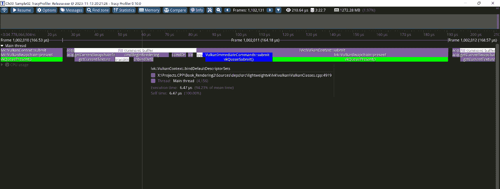

图 4.2：Tracy 用户界面

这种方法允许在构建时完全透明地启用和禁用 Tracy 性能分析器。添加其他性能分析器，如提供类似 API 的 EasyProfiler 和 Optick，主要是微不足道的，并且可以很容易地作为练习自行实现。

在返回 Vulkan 渲染之前，让我们探索另一个小而实用的性能分析技巧，并学习如何实现一个简单但良好的每秒帧数计数器。

## 添加每秒帧数计数器

**每秒帧数**（**FPS**）计数器是所有图形应用程序性能分析和测量的基石。在本教程中，我们将学习如何实现一个简单的 FPS 计数器类，并使用它来大致测量我们应用程序的性能。

### 准备工作

本教程的源代码位于`Chapter04/03_FPS`。`FramesPerSecondCounter`类位于`shared/UtilsFPS.h`。

### 如何实现...

让我们实现包含计算给定时间间隔平均 FPS 所需所有机制的`FramesPerSecondCounter`类：

1.  首先，我们需要一些成员字段来存储滑动窗口的持续时间、当前间隔内渲染的帧数以及该间隔的累积时间。`printFPS_ Boolean` 字段可以用来启用或禁用将帧率（FPS）打印到控制台：

```cpp
class FramesPerSecondCounter {
public:
  float avgInterval_ = 0.5f;
  unsigned int numFrames_  = 0;
  double accumulatedTime_  = 0;
  float currentFPS_        = 0.0f;
  bool printFPS_ = true;
```

1.  单一显式构造函数可以覆盖平均间隔的默认持续时间：

```cpp
public:
  explicit FramesPerSecondCounter(float avgInterval = 0.5f)
  : avgInterval_(avgInterval)
  { assert(avgInterval > 0.0f); }
```

1.  `tick()`方法应该从主循环中调用。它接受自上次调用以来经过的时间持续时间和一个布尔标志，如果在此迭代期间渲染了新帧，则该标志应设置为`true`。这个标志是一个便利功能，用于处理在主循环中由于各种原因（如模拟暂停）跳过帧渲染的情况。时间累积直到达到`avgInterval_`的值：

```cpp
 bool tick(float deltaSeconds, bool frameRendered = true) {
    if (frameRendered) numFrames_++;
    accumulatedTime_ += deltaSeconds;
```

1.  一旦累积了足够的时间，我们就可以进行平均，更新当前的 FPS 值，并将调试信息打印到控制台。此时，我们应该重置帧数和累积时间：

```cpp
 if (accumulatedTime_ > avgInterval_) {
      currentFPS_ = static_cast<float>(
        numFrames_ / accumulatedTime_);
      if (printFPS_) printf(“FPS: %.1f\n”, currentFPS_);
      numFrames_       = 0;
      accumulatedTime_ = 0;
      return true;
    }
    return false;
  }
```

1.  让我们添加一个辅助方法来获取当前的帧率值：

```cpp
 inline float getFPS() const { return currentFPS_; }
};
```

现在，让我们看看如何在主循环中使用这个类。让我们增强我们的演示应用程序的主循环，以在控制台显示 FPS 计数器：

1.  首先，让我们定义一个`FramesPerSecondCounter`对象和几个变量来存储当前时间戳和自上次渲染帧以来的时间差。我们选择使用一个临时的 0.5 秒平均间隔；请随意尝试不同的值：

```cpp
 double timeStamp   = glfwGetTime();
  float deltaSeconds = 0.0f;
  FramesPerSecondCounter fpsCounter(0.5f);
```

1.  在主循环中，更新当前时间戳，通过找到两个连续时间戳之间的差值来计算帧持续时间。然后，将这个计算出的差值传递给`tick()`方法：

```cpp
 while (!glfwWindowShouldClose(window)) {
    fpsCounter.tick(deltaSeconds);
    const double newTimeStamp = glfwGetTime();
    deltaSeconds = static_cast<float>(newTimeStamp - timeStamp);
    timeStamp    = newTimeStamp;
    // ...do the rest of your rendering here...
  }
```

运行应用程序的控制台输出应类似于以下内容。垂直同步已关闭：

```cpp
FPS: 3924.7
FPS: 4322.4
FPS: 4458.9
FPS: 4445.1
FPS: 4581.4
```

应用程序窗口应该看起来像以下截图所示，帧率计数器渲染在右上角：

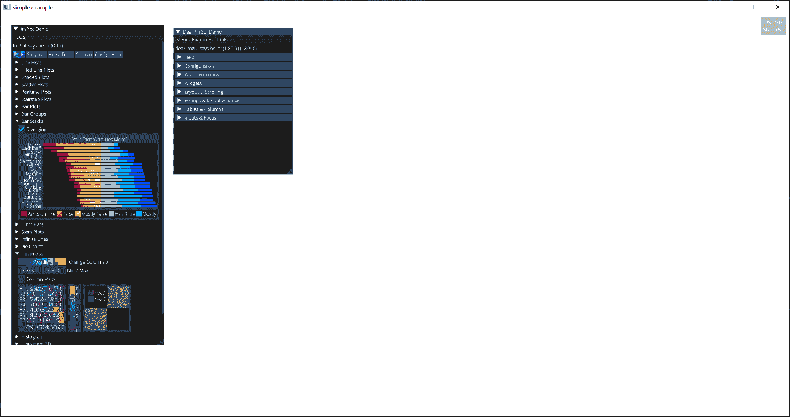

图 4.3：带有 FPS 计数的 ImGui 和 ImPlot 用户界面

让我们检查源代码，了解如何将这个 ImGui FPS 小部件添加到你的应用中。以下是一个填充命令缓冲区的片段：

1.  我们设置了帧缓冲区参数并开始渲染。与我们在*渲染 ImGui 用户界面*菜谱中学到的相同，ImGui 渲染从`imgui->beginFrame()`开始：

```cpp
lvk::ICommandBuffer& buf = ctx->acquireCommandBuffer();
const lvk::Framebuffer framebuffer =
  { .color = { { .texture = ctx->getCurrentSwapchainTexture() } } };
buf.cmdBeginRendering(
  { .color = { { .loadOp = lvk::LoadOp_Clear,
    .clearColor = { 1.0f, 1.0f, 1.0f, 1.0f } } } }, framebuffer);
imgui->beginFrame(framebuffer);
```

1.  我们从 ImGui 获取当前视口参数，并将下一个 ImGui 窗口的位置设置为与视口工作区域的右上角对齐。大小被硬编码为应用窗口的像素。`ImGuiCond_Always`标志告诉 ImGui 在每一帧都设置这个位置：

```cpp
if (const ImGuiViewport* v = ImGui::GetMainViewport()) {
  ImGui::SetNextWindowPos({
    v->WorkPos.x + v->WorkSize.x - 15.0f,
    v->WorkPos.y + 15.0f }, ImGuiCond_Always, { 1.0f, 0.0f });
}
```

1.  将下一个窗口设置为透明。我们使用`SetNextWindowSize()`为窗口分配一个固定的大小值。宽度是通过`CalcTextSize()`计算的。注意这里如何使用`“FPS : _______”`占位符字符串作为参数，以确保窗口的宽度不会根据数字 FPS 值的位数而波动：

```cpp
ImGui::SetNextWindowBgAlpha(0.30f);
ImGui::SetNextWindowSize(
  ImVec2(ImGui::CalcTextSize(“FPS : _______”).x, 0));
```

1.  一个包含 FPS 计数的 ImGui 窗口使用各种 ImGui 标志进行渲染，以便禁用所有不必要的窗口装饰，并且无法与窗口进行用户交互：

```cpp
if (ImGui::Begin(“##FPS”, nullptr, 
                 ImGuiWindowFlags_NoDecoration |
                 ImGuiWindowFlags_AlwaysAutoResize |
                 ImGuiWindowFlags_NoSavedSettings |
                 ImGuiWindowFlags_NoFocusOnAppearing |
                 ImGuiWindowFlags_NoNav |
                 ImGuiWindowFlags_NoMove))
{
  ImGui::Text(“FPS : %i”, (int)fpsCounter.getFPS());
  ImGui::Text(“ms  : %.1f”, 1000.0 / fpsCounter.getFPS());
}
ImGui::End();
```

1.  在我们渲染了 FPS 窗口之后，让我们绘制 ImPlot 和 ImGui 演示窗口，以便你可以探索它们。ImPlot 库将在后续菜谱中进一步介绍：

```cpp
ImPlot::ShowDemoWindow();
ImGui::ShowDemoWindow();
imgui->endFrame(buf);
buf.cmdEndRendering();
```

现在你已经知道了如何在你的应用中显示包含一个漂亮的 FPS 计数的窗口。尽管这个功能很简单，但反复在每一个应用中包含这段代码可能会很麻烦。在接下来的菜谱中，我们将介绍一个`VulkanApp`辅助类，它将处理各种类似这样的实用功能。但就目前而言，让我们回到渲染，探索如何使用立方图纹理。

### 还有更多...

`float tick(float deltaSeconds, bool frameRendered = true)`中的`frameRendered`参数将在后续菜谱中使用，以允许 Vulkan 应用程序在交换链图像不可用时跳过帧。

## 在 Vulkan 中使用立方图纹理

立方图是一种包含 6 个独立的 2D 纹理的纹理，这些纹理共同构成了立方体的 6 个面。立方图的一个有用特性是它们可以使用方向向量进行采样。这在表示从不同方向进入场景的光线时非常有用。例如，我们可以将基于物理的照明方程中的漫反射部分存储在辐照度立方图中，我们将在*第六章*中讨论这一点。

将立方体贴图的 6 个面加载到*LightweightVK*中是一个相当直接的操作。然而，立方体贴图通常存储为**等经线投影**或垂直或水平交叉。等经线投影是一种将经度和纬度（垂直和水平线）映射为直线、均匀线的投影，这使得它成为存储光探针图像的一种非常简单且流行的存储方式，如图 4.4 中所示。

在本食谱中，我们将学习如何将此立方体贴图表示转换为 6 个面，并使用 Vulkan 进行渲染。

### 准备工作

有许多网站提供各种许可下的高动态范围环境纹理。请查看[`polyhaven.com`](https://polyhaven.com)和[`hdrmaps.com`](https://hdrmaps.com)以获取有用内容。

本食谱的完整源代码可以在源代码包中找到，名称为`Chapter04/04_CubeMap`。

在我们开始使用立方体贴图之前，让我们介绍一个简单的`Bitmap`辅助类，用于处理 8 位和 32 位浮点格式的位图图像。您可以在`shared/Bitmap.h`中找到它：

1.  让我们声明`Bitmap`类的接口部分如下：

```cpp
class Bitmap {
public:
  Bitmap() = default;
  Bitmap(int w, int h, int comp, eBitmapFormat fmt);
  Bitmap(int w, int h, int d, int comp, eBitmapFormat fmt);
  Bitmap(int w, int h, int comp, eBitmapFormat fmt, const void* ptr);
```

1.  让我们设置宽度、高度、深度以及每像素的组件数量：

```cpp
 int w_ = 0;
  int h_ = 0;
  int d_ = 1;
  int comp_ = 3;
```

1.  单个组件的类型可以是无符号字节或浮点数。此位图的类型可以是 2D 纹理或立方体贴图。为了简化，我们将此位图的实际像素数据存储在`std::vector`容器中：

```cpp
 eBitmapFormat fmt_ = eBitmapFormat_UnsignedByte;
  eBitmapType type_  = eBitmapType_2D;
  std::vector<uint8_t> data_;
```

1.  接下来我们需要一个辅助函数来获取存储指定格式的一个组件所需的字节数。这也需要一个二维图像的获取器和设置器。我们稍后会回到这个问题：

```cpp
 static int getBytesPerComponent(eBitmapFormat fmt);
  void setPixel(int x, int y, const glm::vec4& c);
  glm::vec4 getPixel(int x, int y) const;
};
```

实现也位于`shared/Bitmap.h`中。现在让我们使用这个类来构建更高级的立方体贴图转换函数。

### 如何操作...

我们有一个位于`data/piazza_bologni_1k.hdr`的立方体贴图，它可在 CC0 许可下使用，最初是从[`hdrihaven.com/hdri/?h=piazza_bologni`](https://hdrihaven.com/hdri/?h=piazza_bologni)下载的。环境贴图图像以等经线投影形式呈现，如下所示：

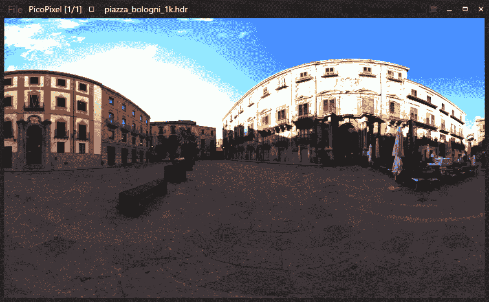

图 4.4：等经线投影

让我们将它转换为垂直交叉。在垂直交叉格式中，每个立方体贴图面在整幅图像中代表为一个正方形，如下所示：

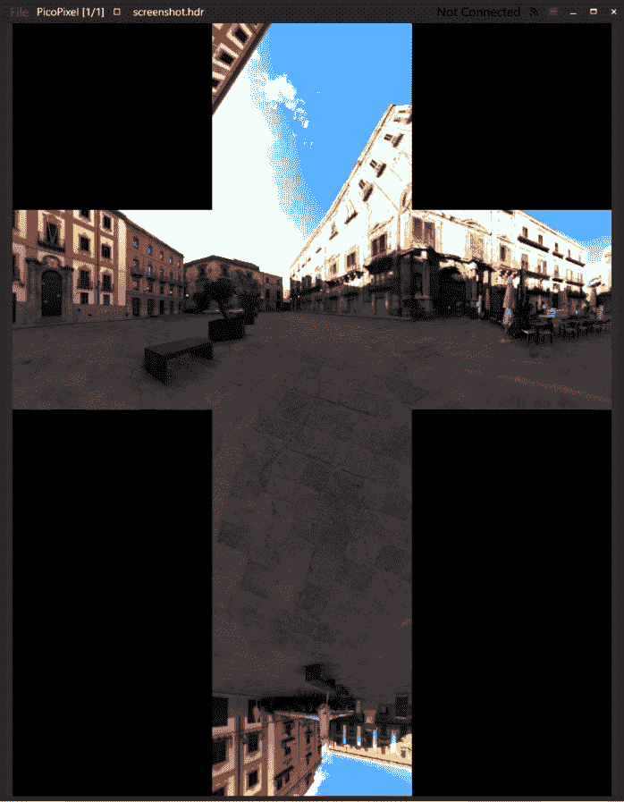

图 4.5：垂直交叉

如果我们通过迭代其像素、计算每个像素的笛卡尔坐标并将像素保存到立方体贴图面中来将等经圆投影转换为立方体贴图面，由于结果立方体贴图采样不足，最终会得到一个严重受损的纹理，上面有摩尔纹。更好的方法是反过来操作。这意味着迭代结果立方体贴图面的每个像素，计算对应每个像素的源浮点等经圆坐标，并使用双线性插值采样等经圆纹理。这样最终的立方体贴图将没有伪影：

1.  第一步是引入一个辅助函数，该函数将指定立方体贴图面内的整数坐标映射到浮点归一化坐标。这个辅助函数很方便，因为垂直交叉立方体贴图的各个面都有不同的垂直方向：

```cpp
vec3 faceCoordsToXYZ(int i, int j, int faceID, int faceSize) {
  const float A = 2.0f * float(i) / faceSize;
  const float B = 2.0f * float(j) / faceSize;
  if (faceID == 0) return vec3(   -1.0f, A - 1.0f,  B - 1.0f);
  if (faceID == 1) return vec3(A - 1.0f,    -1.0f,  1.0f - B);
  if (faceID == 2) return vec3(    1.0f, A - 1.0f,  1.0f - B);
  if (faceID == 3) return vec3(1.0f - A,     1.0f,  1.0f - B);
  if (faceID == 4) return vec3(B - 1.0f, A - 1.0f,  1.0f);
  if (faceID == 5) return vec3(1.0f - B, A - 1.0f, -1.0f);
  return vec3();
}
```

1.  转换函数开始如下，并计算结果位图的面积、宽度和高度。它位于 `shared/UtilsCubemap.cpp`：

```cpp
Bitmap convertEquirectangularMapToVerticalCross(const Bitmap& b) {
  if (b.type_ != eBitmapType_2D) return Bitmap();
  const int faceSize = b.w_ / 4;
  const int w = faceSize * 3;
  const int h = faceSize * 4;
  Bitmap result(w, h, 3);
```

1.  这些点定义了交叉中各个面的位置：

```cpp
 const ivec2 kFaceOffsets[] = {
    ivec2(faceSize, faceSize * 3),
    ivec2(0, faceSize),
    ivec2(faceSize, faceSize),
    ivec2(faceSize * 2, faceSize),
    ivec2(faceSize, 0),
    ivec2(faceSize, faceSize * 2)
  };
```

1.  需要两个常量来限制纹理查找：

```cpp
 const int clampW = b.w_ - 1;
  const int clampH = b.h_ - 1;
```

1.  现在，我们可以开始迭代 6 个立方体贴图面以及每个面内的每个像素：

```cpp
 for (int face = 0; face != 6; face++) {
    for (int i = 0; i != faceSize; i++) {
      for (int j = 0; j != faceSize; j++) {
```

1.  我们使用三角函数从笛卡尔立方体贴图坐标计算纬度和经度坐标。

```cpp
 const vec3  P = faceCoordsToXYZ(i, j, face, faceSize);
        const float R = hypot(P.x, P.y);
        const float theta = atan2(P.y, P.x);
        const float phi   = atan2(P.z, R); 
```

1.  要了解更多关于球坐标系统，请点击此链接：[`en.wikipedia.org/wiki/Spherical_coordinate_system`](https://en.wikipedia.org/wiki/Spherical_coordinate_system)。

1.  现在，我们可以将纬度和经度映射到等经圆图像内的浮点坐标：

```cpp
 const float Uf =
          float(2.0f * faceSize * (theta + M_PI) / M_PI);
        const float Vf =
          float(2.0f * faceSize * (M_PI / 2.0f - phi) / M_PI);
```

1.  基于这些浮点坐标，我们得到两对整数 UV 坐标，我们将使用这些坐标来采样 4 个 texels 以进行双线性插值：

```cpp
 const int U1 = clamp(int(floor(Uf)), 0, clampW);
        const int V1 = clamp(int(floor(Vf)), 0, clampH);
        const int U2 = clamp(U1 + 1, 0, clampW);
        const int V2 = clamp(V1 + 1, 0, clampH);
```

1.  获取双线性插值的分数部分，并从等经圆图中获取 4 个样本，`A`、`B`、`C` 和 `D`：

```cpp
 const float s = Uf - U1;
        const float t = Vf - V1;
        const vec4 A = b.getPixel(U1, V1);
        const vec4 B = b.getPixel(U2, V1);
        const vec4 C = b.getPixel(U1, V2);
        const vec4 D = b.getPixel(U2, V2);
```

1.  进行双线性插值，并将结果像素值设置在垂直交叉立方体贴图中：

```cpp
 const vec4 color = A * (1 - s) * (1 - t) + B * (s) * (1 - t) +
          C * (1 - s) * t + D * (s) * (t);
        result.setPixel(
          i + kFaceOffsets[face].x, j + kFaceOffsets[face].y, color);
      }
    }
  }
  return result;
}
```

`Bitmap` 类负责处理图像数据中的像素格式。

现在，我们可以编写代码来将垂直交叉切割成紧密排列的矩形立方体贴图面。以下是操作方法：

1.  首先，让我们回顾一下与 Vulkan 立方体贴图面布局相对应的垂直交叉图像布局。

    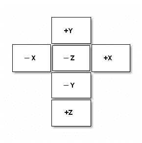

    图 4.6：垂直交叉图像布局

1.  布局是 `3` 行 `4` 列的面，这使得我们可以如下计算结果立方体贴图的尺寸。代码来自 `shared/UtilsCubemap.cpp`：

```cpp
Bitmap convertVerticalCrossToCubeMapFaces(const Bitmap& b) {
  const int faceWidth  = b.w_ / 3;
  const int faceHeight = b.h_ / 4;
  Bitmap cubemap(faceWidth, faceHeight, 6, b.comp_, b.fmt_);
```

1.  让我们设置指针来读取数据和写入数据。这个函数与像素格式无关，因此它需要知道每个像素的字节数，以便能够使用 `memcpy()` 移动像素：

```cpp
 const uint8_t* src = b.data_.data();
  uint8_t* dst = cubemap.data_.data();
  const int pixelSize = cubemap.comp_ *
    Bitmap::getBytesPerComponent(cubemap.fmt_);
```

1.  遍历面和每个面的每个像素。这里立方体贴图面的顺序对应于在*Vulkan 规范 16.5.4*中描述的 Vulkan 立方体贴图面的顺序：*立方体贴图面选择*：

```cpp
 for (int face = 0; face != 6; ++face) {
    for (int j = 0; j != faceHeight; ++j) {
      for (int i = 0; i != faceWidth; ++i) {
        int x = 0;
        int y = 0;
```

1.  根据目标立方体贴图面索引计算垂直交叉布局中的源像素位置：

```cpp
 switch (face) {
        case 0: // +X
          x = i;
          y = faceHeight + j;
          break;
        case 1: // -X
          x = 2 * faceWidth + i;
          y = 1 * faceHeight + j;
          break;
        case 2: // +Y
          x = 2 * faceWidth - (i + 1);
          y = 1 * faceHeight - (j + 1);
          break;
        case 3: // -Y
          x = 2 * faceWidth - (i + 1);
          y = 3 * faceHeight - (j + 1);
          break;
        case 4: // +Z
          x = 2 * faceWidth - (i + 1);
          y = b.h_ - (j + 1);
          break;
        case 5: // -Z
          x = faceWidth + i;
          y = faceHeight + j;
          break;
        }
```

1.  复制像素并移动到下一个像素：

```cpp
 memcpy(dst, src + (y * b.w_ + x) * pixelSize, pixelSize);
        dst += pixelSize;
      }
    }
  }
  return cubemap;
}
```

生成的立方体贴图包含一个包含 6 个 2D 图像的数组。让我们编写一些更多的 C++代码来加载和转换实际的纹理数据，并将其上传到*LightweightVK*。源代码位于`Chapter04/04_CubeMap/src/main.cpp`：

1.  使用`STB_image`浮点 API 从`.hdr`文件中加载高动态范围图像：

```cpp
int w, h;
const float* img = stbi_loadf(
  “data/piazza_bologni_1k.hdr”, &w, &h, nullptr, 4);
Bitmap in(w, h, 4, eBitmapFormat_Float, img);
```

1.  将等经线地图转换为垂直交叉并保存结果图像到`.hdr`文件以供进一步检查：

```cpp
Bitmap out = convertEquirectangularMapToVerticalCross(in);
stbi_image_free((void*)img);
stbi_write_hdr(“.cache/screenshot.hdr”, out.w_, out.h_, out.comp_,
  (const float*)out.data_.data());
```

1.  将加载的垂直交叉图像转换为实际的立方体贴图面：

```cpp
Bitmap cubemap = convertVerticalCrossToCubeMapFaces(out);
```

1.  现在，将纹理数据上传到 LightweightVK 是直接的。我们调用`IContext::createTexture()`成员函数来创建一个纹理，并提供由`cubemap.data_.data()`返回的立方体贴图数据的指针：

```cpp
lvk::Holder<lvk::TextureHandle> cubemapTex = ctx->createTexture({
    .type       = lvk::TextureType_Cube,
    .format     = lvk::Format_RGBA_F32,
    .dimensions = {(uint32_t)cubemap.w_, (uint32_t)cubemap.h_},
    .usage      = lvk::TextureUsageBits_Sampled,
    .data       = cubemap.data_.data(),
    .debugName  = “data/piazza_bologni_1k.hdr”,
});
```

现在我们应该看看如何编写这个示例的 GLSL 着色器：

1.  让我们创建一个顶点着色器`Chapter04/04_CubeMap/src/main.vert`，它将模型、视图和投影矩阵作为输入。我们还需要相机位置以及用于网格纹理和立方体贴图的免绑定纹理 ID：

```cpp
layout(std430, buffer_reference) readonly buffer PerFrameData {
  mat4 model;
  mat4 view;
  mat4 proj;
  vec4 cameraPos;
  uint tex;
  uint texCube;
};
```

1.  使用 Vulkan **推送常量**（以下代码中的`pc`）将`PerFrameData`的缓冲区引用传递到着色器中：

```cpp
layout(push_constant) uniform PushConstants {
  PerFrameData pc;
};
```

1.  每个顶点的属性被提供给顶点着色器。`PerVertex`结构用于将参数传递给片段着色器。法向量使用模型矩阵的逆转置矩阵进行变换：

```cpp
struct PerVertex {
  vec2 uv;
  vec3 worldNormal;
  vec3 worldPos;
};
layout (location = 0) in vec3 pos;
layout (location = 1) in vec3 normal;
layout (location = 2) in vec2 uv;
layout (location=0) out PerVertex vtx;
void main() {
  gl_Position = pc.proj * pc.view * pc.model * vec4(pos, 1.0);
  mat4 model = pc.model;
  mat3 normalMatrix = transpose( inverse(mat3(pc.model)) );
  vtx.uv = uv;
  vtx.worldNormal = normal * normalMatrix;
  vtx.worldPos = (model * vec4(pos, 1.0)).xyz;
}
```

现在让我们看看位于`Chapter04/04_CubeMap/src/main.frag`的片段着色器：

1.  它与上面提到的顶点着色器中`PerVertex`结构的声明共享。声明位于文件`Chapter04/04_CubeMap/src/common.sp`中。为了简洁起见，这里省略了它。片段着色器使用`textureBindlessCube()`辅助函数通过计算出的反射向量采样立方体贴图。这个函数在*第三章，使用 Vulkan 对象*中的*使用纹理数据在 Vulkan*配方中进行了详细讨论。反射方向向量使用`reflect()` GLSL 内置函数计算：

```cpp
layout (location=0) in PerVertex vtx;
layout (location=0) out vec4 out_FragColor;
void main() {
  vec3 n = normalize(vtx.worldNormal);
  vec3 v = normalize(pc.cameraPos.xyz - vtx.worldPos);
  vec3 reflection = -normalize(reflect(v, n));
  vec4 colorRefl = textureBindlessCube(pc.texCube, 0, reflection);
```

1.  为了增加更发达的视觉效果，我们使用硬编码的光方向`(0, 0.1, -1)`对我们的 3D 模型添加一些漫反射光照：

```cpp
 vec4 Ka = colorRefl * 0.3;
  float NdotL = clamp(dot(n, normalize(vec3(0,0,-1))), 0.1, 1.0);
  vec4 Kd = textureBindless2D(pc.tex, 0, vtx.uv) * NdotL;
  out_FragColor = Ka + Kd;
};
```

应用程序生成的输出如下所示。注意，由于高动态范围图像直接显示在低动态范围帧缓冲区上，反射中天空的白色区域被过度曝光。我们将在*第十章，基于图像的技术*中回到这个问题，并实现一个简单的 HDR 色调映射算子。

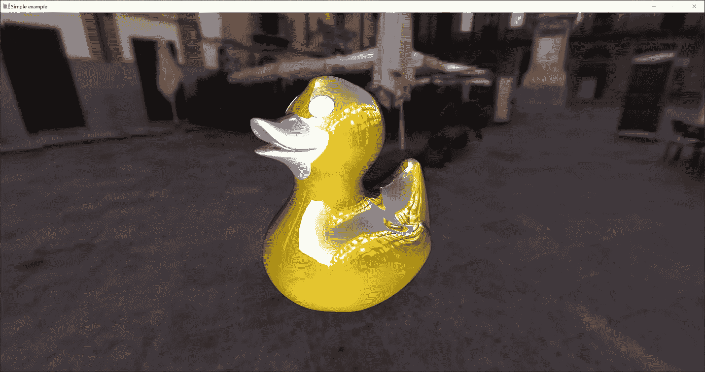

图 4.7：反光橡皮鸭

现在，让我们回到提高用户交互能力，学习如何实现一个简单的相机类来移动和调试我们的 3D 场景。

### 还有更多...

在 OpenGL 中，开发者必须启用一个特殊的立方体贴图采样模式，以确保所有立方体贴图面的无缝过滤。在 Vulkan 中，所有立方体贴图纹理提取都是无缝的（如 Vulkan 规范中*立方体贴图边缘处理*部分所述），除了那些带有`VK_FILTER_NEAREST`的，它们被夹在面边缘。

## 使用 3D 相机和基本用户交互

要调试一个图形应用程序，能够使用键盘或鼠标在 3D 场景中导航和移动是非常有帮助的。图形 API 本身并不熟悉相机和用户交互的概念，因此我们必须实现一个相机模型，该模型将用户输入转换为 Vulkan 可用的视图矩阵。在这个菜谱中，我们将学习如何创建一个简单但可扩展的 3D 相机实现，并使用它来增强我们的 Vulkan 示例的功能。

### 准备工作

本菜谱的源代码可以在`Chapter04/05_Camera`中找到。相机类在文件`shared/Camera.h`中声明和实现。

### 如何做到这一点...

我们的相机实现将根据所选的动态模型计算视图矩阵和 3D 位置点。让我们看看步骤：

1.  首先，让我们实现`Camera`类，它将代表我们与 3D 相机工作的主要 API。该类存储对`CameraPositionerInterface`类实例的引用，这是一个底层相机模型的泛型实现，允许在运行时切换相机行为：

```cpp
class Camera final {
public:
  explicit Camera(CameraPositionerInterface& positioner)
    : positioner_(&positioner)  {}
  Camera(const Camera&) = default;
  Camera& operator = (const Camera&) = default;
  mat4 getViewMatrix() const {
    return positioner_->getViewMatrix();
  }
  vec3 getPosition() const {
    return positioner_->getPosition();
  }
private:
      const CameraPositionerInterface* positioner_;
};
```

`CameraPositionerInterface`的接口只包含纯虚方法和一个默认的虚析构函数：

```cpp
class CameraPositionerInterface {
public:
  virtual ~CameraPositionerInterface() = default;
  virtual mat4 getViewMatrix() const = 0;
  virtual vec3 getPosition() const = 0;
};
```

1.  现在我们可以实现实际的相机模型。我们将从一个基于四元数的第一人称相机开始，该相机可以在空间中自由地向任何方向移动。让我们看看`CameraPositioner_FirstPerson`类。内部`Movement`结构包含布尔标志，用于定义我们相机的当前运动状态。这对于将键盘和鼠标输入与相机控制逻辑解耦非常有用：

```cpp
class CameraPositioner_FirstPerson final:
  public CameraPositionerInterface
{
public:
  struct Movement {
    bool forward_   = false;
    bool backward_  = false;
    bool left_      = false;
    bool right_     = false;
    bool up_        = false;
    bool down_      = false;
    bool fastSpeed_ = false;
  } movement_;
```

1.  不同的数值参数定义了相机对加速度和阻尼的响应程度。这些参数可以根据您的需要进行调整：

```cpp
 float mouseSpeed_   = 4.0f;
  float acceleration_ = 150.0f;
  float damping_      = 0.2f;
  float maxSpeed_     = 10.0f;
  float fastCoef_     = 10.0f;
```

1.  我们需要某些私有数据成员来控制相机状态，例如前一个鼠标位置、当前相机位置和方向、当前移动速度以及表示“向上”方向的向量：

```cpp
private:
  vec2 mousePos_          = vec2(0);
  vec3 cameraPosition_    = vec3(0.0f, 10.0f, 10.0f);
  quat cameraOrientation_ = quat(vec3(0));
  vec3 moveSpeed_         = vec3(0.0f);
  vec3 up_                = vec3(0.0f, 0.0f, 1.0f);
```

1.  非默认构造函数接受相机的初始位置、目标位置以及指向向上的向量。这个输入类似于人们通常用来构造查看矩阵的输入。实际上，我们使用`glm::lookAt()`函数来初始化相机：

```cpp
public:
  CameraPositioner_FirstPerson() = default;
  CameraPositioner_FirstPerson(const vec3& pos,
    const vec3& target, const vec3& up)
  : cameraPosition_(pos)
  , cameraOrientation_(glm::lookAt(pos, target, up))
  , up_(up)
  {}
```

1.  现在，我们可以给我们的摄像机模型添加一些动态效果。`update()` 方法应该在每一帧调用，并获取自上一帧以来经过的时间，以及鼠标位置和鼠标按钮按下标志：

```cpp
 void update(double deltaSeconds,
    const glm::vec2& mousePos, bool mousePressed)
  {
    if (mousePressed) {
      const glm::vec2 delta = mousePos - mousePos_;
      const glm::quat deltaQuat =
        glm::quat(glm::vec3(
        mouseSpeed_ * delta.y, mouseSpeed_ * delta.x, 0.0f));
      cameraOrientation_ =
        glm::normalize(deltaQuat * cameraOrientation_);
      setUpVector(up_);
    }
    mousePos_ = mousePos;
```

现在，当鼠标按钮被按下时，我们计算一个与之前鼠标位置的增量向量，并使用它来构造一个旋转四元数。这个四元数用于旋转摄像机。一旦摄像机旋转被应用，我们应该更新鼠标位置状态。

1.  现在我们应该建立摄像机的坐标系以计算摄像机移动。让我们从 `mat4` 视图矩阵中提取前向、右向和上向量：

```cpp
 const mat4 v = glm::mat4_cast(cameraOrientation_);
    const vec3 forward = -vec3(v[0][2], v[1][2], v[2][2]);
    const vec3 right   =  vec3(v[0][0], v[1][0], v[2][0]);
    const vec3 up = cross(right, forward);
```

`forward` 向量对应于摄像机的方向，即摄像机指向的方向。`right` 向量对应于摄像机空间的正 X 轴。`up` 向量是摄像机空间的正 Y 轴，它与前两个向量垂直，可以通过它们的叉积来计算。

1.  摄像机坐标系已经建立。现在我们可以将来自 `Movement` 结构的输入状态应用到我们的摄像机上以控制其移动：

```cpp
 vec3 accel(0.0f);
    if (movement_.forward_) accel += forward;
    if (movement_.backward_) accel -= forward;
    if (movement_.left_) accel -= right;
    if (movement_.right_) accel += right;
    if (movement_.up_) accel += up;
    if (movement_.down_) accel -= up;
    if (movement_.fastSpeed_) accel *= fastCoef_;
```

我们不是直接控制摄像机速度或位置，而是让用户输入直接控制加速度向量。这样，摄像机的行为会更加平滑、自然，不会出现突然的运动。

1.  如果根据输入状态，计算出的摄像机加速度为零，我们应该根据 `damping_` 参数逐渐减速摄像机的运动。否则，我们应该使用简单的欧拉积分来积分摄像机运动。最大可能的速度值根据 `maxSpeed_` 参数进行限制：

```cpp
 if (accel == vec3(0)) {
      moveSpeed_ -= moveSpeed_ * std::min((1.0f / damping_) *
        static_cast<float>(deltaSeconds), 1.0f);
    }
    else {
      moveSpeed_ += accel * acceleration_ *
        static_cast<float>(deltaSeconds);
      const float maxSpeed =
        movement_.fastSpeed_ ? maxSpeed_ * fastCoef_ : maxSpeed_;
      if (glm::length(moveSpeed_) > maxSpeed)
        moveSpeed_ = glm::normalize(moveSpeed_) * maxSpeed;
    }
    cameraPosition_ += moveSpeed_ *
      static_cast<float>(deltaSeconds);
  }
```

1.  视图矩阵可以通过以下方式从摄像机方向四元数和摄像机位置计算得出：

```cpp
 virtual mat4 getViewMatrix() const override {
    const mat4 t = glm::translate(mat4(1.0f), -cameraPosition_);
    const mat4 r = glm::mat4_cast(cameraOrientation_);
    return r * t;
  }
```

平移部分是从 `cameraPosition_` 向量推断出来的，旋转部分直接从方向四元数计算得出。

1.  有用的获取器和设置器很简单，除了 `setUpVector()` 方法，它必须使用现有的摄像机位置和方向重新计算摄像机方向，如下所示：

```cpp
 virtual vec3 getPosition() const override {
    return cameraPosition_;
  }
  void setPosition(const vec3& pos) {
    cameraPosition_ = pos;
  }
  void setUpVector(const vec3& up) {
    const mat4 view = getViewMatrix();
    const vec3 dir  = -vec3(view[0][2], view[1][2], view[2][2]);
    cameraOrientation_ =
      glm::lookAt(cameraPosition_, cameraPosition_ + dir, up);
  }
```

1.  需要一个额外的辅助函数来重置之前的鼠标位置，以防止例如鼠标光标离开窗口时出现突然的旋转运动：

```cpp
 void resetMousePosition(const vec2& p) { mousePos_ = p; };
};
```

上述类可以在 3D 应用中使用，以移动观众。让我们看看它是如何工作的。

### 它是如何工作的...

演示应用程序基于之前 *在 Vulkan 中使用立方体贴图纹理* 菜单中的立方体贴图示例。更新的代码位于 `Chapter04/05_Camera/src/main.cpp`。

我们添加一个鼠标状态并定义 `CameraPositioner` 和 `Camera`。让它们成为全局变量：

```cpp
struct MouseState {
  vec2 pos         = vec2(0.0f);
  bool pressedLeft = false;
} mouseState;
const vec3 kInitialCameraPos    = vec3(0.0f, 1.0f, -1.5f);
const vec3 kInitialCameraTarget = vec3(0.0f, 0.5f,  0.0f);
CameraPositioner_FirstPerson positioner(
  kInitialCameraPos,
  kInitialCameraTarget,
  vec3(0.0f, 1.0f, 0.0f));
Camera camera(positioner);
```

GLFW 光标位置回调应该按照以下方式更新 `mouseState`：

```cpp
glfwSetCursorPosCallback(
  window, [](auto* window, double x, double y) {
    int width, height;
    glfwGetFramebufferSize(window, &width, &height);
    mouseState.pos.x = static_cast<float>(x / width);
    mouseState.pos.y = 1.0f - static_cast<float>(y / height);
  }
);
```

在这里，我们将窗口像素坐标转换为归一化的 `0...1` 坐标，并适应反转的 Y 轴。

GLFW 鼠标按钮回调将 GLFW 鼠标事件传递给 ImGui，并在左鼠标按钮被按下时设置`pressedLeft`标志：

```cpp
glfwSetMouseButtonCallback(
  window, [](auto* window, int button, int action, int mods) {
    if (button == GLFW_MOUSE_BUTTON_LEFT)
      mouseState.pressedLeft = action == GLFW_PRESS;
    double xpos, ypos;
    glfwGetCursorPos(window, &xpos, &ypos);
    const ImGuiMouseButton_ imguiButton =
     (button == GLFW_MOUSE_BUTTON_LEFT) ?
       ImGuiMouseButton_Left :
         (button == GLFW_MOUSE_BUTTON_RIGHT ?
           ImGuiMouseButton_Right :
           ImGuiMouseButton_Middle);
    ImGuiIO& io = ImGui::GetIO();
    io.MousePos = ImVec2((float)xpos, (float)ypos);
    io.MouseDown[imguiButton] = action == GLFW_PRESS;
  });
```

为了处理相机移动的键盘输入，让我们编写以下 GLFW 键盘回调函数：

```cpp
glfwSetKeyCallback(window,
  [](GLFWwindow* window, int key, int, int action, int mods) {
    const bool press = action != GLFW_RELEASE;
    if (key == GLFW_KEY_ESCAPE)
      glfwSetWindowShouldClose(window, GLFW_TRUE);
    if (key == GLFW_KEY_W) positioner.movement_.forward_ = press;
    if (key == GLFW_KEY_S) positioner.movement_.backward_= press;
    if (key == GLFW_KEY_A) positioner.movement_.left_  = press;
    if (key == GLFW_KEY_D) positioner.movement_.right_ = press;
    if (key == GLFW_KEY_1) positioner.movement_.up_   = press;
    if (key == GLFW_KEY_2) positioner.movement_.down_ = press;
    if (mods & GLFW_MOD_SHIFT)
      positioner.movement_.fastSpeed_ = press;
    if (key == GLFW_KEY_SPACE) {
      positioner.lookAt(kInitialCameraPos,
        kInitialCameraTarget, vec3(0.0f, 1.0f, 0.0f));
      positioner.setSpeed(vec3(0));
    }
  });
```

*WSAD*键用于移动相机，*空格键*用于将相机向上向量重新定向到世界`(0, 1, 0)`向量，并将相机位置重置到初始位置。Shift 键用于加快相机移动速度。

我们可以使用以下语句从主循环中更新相机定位器：

```cpp
positioner.update(
  deltaSeconds, mouseState.pos, mouseState.pressedLeft);
```

这里有一个代码片段，用于将矩阵上传到 Vulkan 每帧均匀缓冲区，类似于在前面章节中使用固定值时的操作：

```cpp
const vec4 cameraPos = vec4(camera.getPosition(), 1.0f);
const mat4 p  = glm::perspective(
  glm::radians(60.0f), ratio, 0.1f, 1000.0f);
const mat4 m1 = glm::rotate(
  mat4(1.0f), glm::radians(-90.0f), vec3(1, 0, 0));
const mat4 m2 = glm::rotate(
  mat4(1.0f), (float)glfwGetTime(), vec3(0.0f, 1.0f, 0.0f));
const mat4 v  = glm::translate(mat4(1.0f), vec3(cameraPos));
const PerFrameData pc = {
  .model     = m2 * m1,
  .view      = camera.getViewMatrix(),
  .proj      = p,
  .cameraPos = cameraPos,
  .tex       = texture.index(),
  .texCube   = cubemapTex.index(),
};
ctx->upload(bufferPerFrame, &pc, sizeof(pc));
```

从`Chapter04/05_Camera`运行演示，以使用键盘和鼠标进行操作：

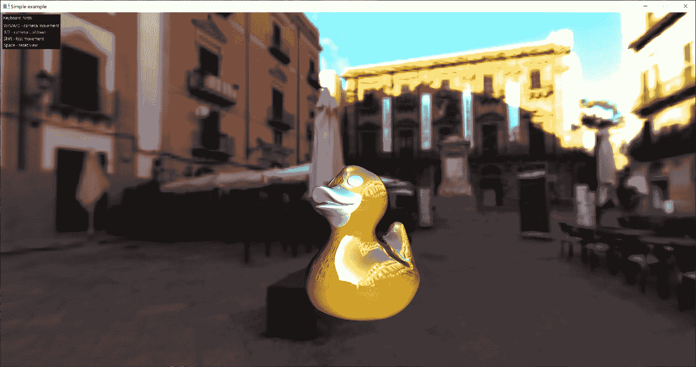

图 4.8：相机

### 还有更多...

这种相机设计方法可以扩展以适应不同的运动行为。在下一个菜谱中，我们将学习如何实现一些其他有用的相机定位器。

本菜谱中引入的 3D 相机功能对我们这本书来说非常有价值。为了减少代码重复，我们创建了一个名为`VulkanApp`的辅助类。这个类封装了第一人称相机定位器以及其他功能，如每秒帧数计数器、`ImGuiRenderer`等。`VulkanApp`类将在本书的所有后续菜谱中用到。你可以在`shared/VulkanApp.h`和`shared/VulkanApp.cpp`文件中找到它。

## 添加相机动画和运动

除了拥有用户控制的第一个人称相机外，能够在 3D 场景中编程地定位和移动相机也很方便——这在需要组织带有相机移动的自动截图测试时进行调试时很有帮助。在这个菜谱中，我们将展示如何做到这一点，并扩展前面菜谱中的最小化 3D 相机框架。我们将使用 ImGui 绘制一个组合框，以在两个相机模式之间进行选择：一个第一人称自由相机和一个移动到用户从 UI 设置的指定点的固定相机。

### 准备工作

这个菜谱的完整源代码是本章最终演示应用程序的一部分，你可以在`Chapter04/06_DemoApp`中找到它。所有新的相机相关功能实现都位于`shared/Camera.h`文件中。

### 如何做到这一点...

让我们看看如何使用基于 ImGui 的简单用户界面来编程控制我们的 3D 相机：

1.  首先，我们需要添加一个新的`CameraPosition_MoveTo`相机定位器，该定位器能够自动将相机移动到指定的`vec3`点。为此，我们必须声明一系列全局常量和变量：

```cpp
const vec3 kInitialCameraPos    = vec3(0.0f, 1.0f, -1.5f);
const vec3 kInitialCameraAngles = vec3(-18.5f, 180.0f, 0.0f);
CameraPositioner_MoveTo positionerMoveTo(
  kInitialCameraPos, kInitialCameraAngles);
```

1.  在主循环内部，我们应该更新我们新的相机定位器。第一人称相机定位器在前面菜谱中提到的`VulkanApp`类内部自动更新：

```cpp
positioner_moveTo.update(
  deltaSeconds, mouseState.pos, mouseState.pressedLeft);
```

现在，让我们绘制一个 ImGui 组合框来选择应该使用哪个相机定位器来控制相机运动：

1.  首先，一些额外的全局变量将很有用，用于存储当前相机类型、组合框 UI 的项以及组合框中选中的新值：

```cpp
const char* cameraType = “FirstPerson”;
const char* comboBoxItems[] = { “FirstPerson”, “MoveTo” };
const char* currentComboBoxItem = cameraType;
```

1.  要使用组合框渲染相机控制 UI，让我们编写以下代码。一个新的 ImGui 窗口通过调用`ImGui::Begin()`开始：

```cpp
ImGui::Begin(“Camera Controls”, nullptr,
  ImGuiWindowFlags_AlwaysAutoResize);
{
```

1.  组合框本身是通过`ImGui::BeginCombo()`渲染的。第二个参数是在打开组合框之前显示的预览标签名称。如果用户点击了标签，此函数将返回 true：

```cpp
 if (ImGui::BeginCombo(“##combo”, currentComboBoxItem)) {
    for (int n = 0; n < IM_ARRAYSIZE(comboBoxItems); n++) {
      const bool isSelected =
        currentComboBoxItem == comboBoxItems[n];
```

1.  您可以在打开组合框时设置初始焦点。如果您想在组合框内支持滚动或键盘导航，这很有用：

```cpp
 if (ImGui::Selectable(comboBoxItems[n], isSelected))
        currentComboBoxItem = comboBoxItems[n];
      if (isSelected)
        ImGui::SetItemDefaultFocus();
    }
```

1.  完成 ImGui 组合框的渲染：

```cpp
 ImGui::EndCombo();
  }
```

1.  如果选择`MoveTo`相机类型，则渲染`vec3`输入滑块以从用户获取相机位置和欧拉角：

```cpp
 if (!strcmp(cameraType, “MoveTo”)) {
    if (ImGui::SliderFloat3(“Position”,
      glm::value_ptr(cameraPos), -10.0f, +10.0f)) {
      positionerMoveTo.setDesiredPosition(cameraPos);
    }
    if (ImGui::SliderFloat3(“Pitch/Pan/Roll”,
      glm::value_ptr(cameraAngles), -180.0f, +180.0f)) {
      positionerMoveTo.setDesiredAngles(cameraAngles);
    }
  }
```

1.  如果新选中的组合框项与当前相机类型不同，则打印调试消息并更改活动相机模式：

```cpp
 if (currentComboBoxItem &&
      strcmp(currentComboBoxItem, cameraType)) {
    printf(“Selected new camera type: %s\n”,
             currentComboBoxItem);
    cameraType = currentComboBoxItem;
    reinitCamera(app);
  }
```

生成的组合框应该看起来如下截图所示：

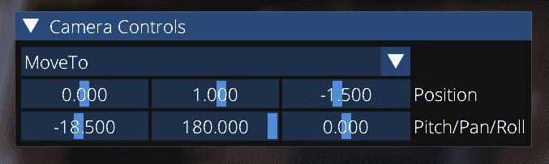

图 4.9：相机控制

上述代码在每帧的主循环中被调用以绘制 ImGui。查看`Chapter04/06_DemoApp/src/main.cpp`文件以获取完整的源代码。

### 它是如何工作的...

让我们看看我们之前在*步骤 1*和*步骤 2*中提到的`shared/Camera.h`中`CameraPositioner_MoveTo`类的实现。与之前菜谱中引入的第一人称相机定位器不同，它依赖于四元数，这个新的定位器采用简单的欧拉角方法来存储相机方向。这种方法对用户来说更友好，也更直观，用于控制相机。以下是一些步骤，帮助我们理解这个相机定位器是如何工作的：

1.  首先，我们希望有一些用户可配置的参数，用于线性阻尼系数和角阻尼系数：

```cpp
class CameraPositioner_MoveTo final :
  public CameraPositionerInterface
{
public:
  float dampingLinear_ = 10.0f;
  vec3 dampingEulerAngles_ = vec3(5.0f, 5.0f, 5.0f);
```

1.  我们将当前和期望的相机位置以及两套俯仰、偏航和翻滚欧拉角存储在`vec3`成员字段中。当前相机变换每帧更新并保存在`mat4`字段中：

```cpp
private:
  vec3 positionCurrent_ = vec3(0.0f);
  vec3 positionDesired_ = vec3(0.0f);
  vec3 anglesCurrent_ = vec3(0.0f); // pitch, pan, roll
  vec3 anglesDesired_ = vec3(0.0f);
  mat4 currentTransform_ = mat4(1.0f);
```

1.  构造函数初始化相机的当前和期望数据集：

```cpp
public:
  CameraPositioner_MoveTo(const vec3& pos, const vec3& angles)
  : positionCurrent_(pos)
  , positionDesired_(pos)
  , anglesCurrent_(angles)
  , anglesDesired_(angles)
  {}
```

1.  最有趣的部分发生在`update()`函数中。当前相机位置会改变，以移动到所需的相机位置。移动速度与这两个位置之间的距离成正比，并使用线性阻尼系数进行缩放：

```cpp
 void update(
    float deltaSeconds, const vec2& mousePos, bool mousePressed)
  {
    positionCurrent_ += dampingLinear_ *
      deltaSeconds * (positionDesired_ - positionCurrent_);
```

1.  现在，让我们处理欧拉角。我们应该相应地剪辑它们，以确保它们保持在`0…360`度的范围内。这是防止我们的相机围绕对象旋转`2*Pi`次所必需的：

```cpp
 anglesCurrent_ = clipAngles(anglesCurrent_);
    anglesDesired_ = clipAngles(anglesDesired_);
```

1.  类似于我们处理相机位置的方式，欧拉角是根据期望和当前角度集合之间的距离进行更新的。在计算相机变换矩阵之前，再次剪辑更新的角度并将值从度转换为弧度。注意在转发到 `glm::yawPitchRoll()` 之前，俯仰、偏航和翻滚角度是如何进行置换的：

```cpp
 anglesCurrent_ -= angleDelta(anglesCurrent_, anglesDesired_)
      * dampingEulerAngles_ * deltaSeconds;
    anglesCurrent_ = clipAngles(anglesCurrent_);
    const vec3 ang = glm::radians(anglesCurrent_);
    currentTransform_ = glm::translate(
      glm::yawPitchRoll(ang.y, ang.x, ang.z), -positionCurrent_);
  }
```

1.  角度剪辑的函数很简单，如下所示：

```cpp
private:
  static inline float clipAngle(float d) {
    if (d < -180.0f) return d + 360.0f;
    if (d > +180.0f) return d - 360.f;
    return d;
  }
  static inline vec3 clipAngles(const vec3& angles) {
    return vec3( std::fmod(angles.x, 360.0f),
                 std::fmod(angles.y, 360.0f),
                 std::fmod(angles.z, 360.0f) );
  }
```

1.  两组角度之间的差值可以按以下方式计算：

```cpp
 static inline vec3 angleDelta( const vec3& anglesCurrent,
                                 const vec3& anglesDesired )
  {
    const vec3 d =
      clipAngles(anglesCurrent) - clipAngles(anglesDesired);
    return vec3(
      clipAngle(d.x), clipAngle(d.y), clipAngle(d.z));
  }
};
```

尝试运行演示应用程序，`Chapter04/06_DemoApp`。切换到 `MoveTo` 相机，并从 ImGui 用户界面更改位置和方向。

### 还有更多...

可以在这个示例实现的基础上构建更多的相机功能。另一个有用的扩展可能是一个跟随使用一组关键点定义的位置和目标的样条曲线的相机。我们将把这个留给你作为练习。

## 实现即时模式 3D 绘图画布

《第二章，Vulkan 入门》中的*设置 Vulkan 调试功能*配方只是触及了图形应用程序调试的表面。Vulkan API 提供的验证层非常有价值，但它们不允许你调试逻辑和计算相关的错误。为了看到我们虚拟世界中的情况，我们需要能够渲染辅助图形信息，例如对象的边界框和绘制不同值的时变图表或普通直线。Vulkan API 不提供任何即时模式渲染设施。它所能做的就是向计划稍后提交的命令缓冲区添加命令。为了克服这个困难并向我们的应用程序添加即时模式渲染画布，我们必须编写一些额外的代码。让我们在本配方中学习如何做到这一点。

### 准备工作

确保你精通《第三章，与 Vulkan 对象一起工作》中所有的渲染配方。检查 `shared/LineCanvas.h` 和 `shared/LineCanvas.cpp` 文件以获取此配方的有效实现。一个如何使用新的 `LineCanvas3D` 3D 线条绘制类的示例是演示应用程序 `Chapter04/06_DemoApp` 的一部分。

### 如何操作...

`LineCanvas3D` 类包含一个由两个点和颜色定义的 3D 线条的 CPU 可访问列表。在每一帧中，用户可以调用 `line()` 方法来绘制一个新的 3D 线条，该线条应在当前帧中渲染。为了将这些线条渲染到帧缓冲区中，我们维护一个 Vulkan 缓冲区集合来存储线条几何数据，我们将每帧更新这些数据。让我们看看这个类的接口：

1.  `LineCanvas3D` 类将其内部 3D 线条表示为每条线的顶点对，而每个顶点由一个 `vec4` 位置和一个颜色组成。每个 `linesBuffer` 缓冲区包含 `lines_` 容器的 GPU 可见副本。我们为每个 swapchain 图像有一个缓冲区，以避免任何额外的 Vulkan 同步：

```cpp
struct LineCanvas3D {
  mat4 mvp_ = mat4(1.0f);
  struct LineData {
    vec4 pos;
    vec4 color;
  };
  std::vector<LineData> lines_;
```

```cpp
 lvk::Holder<lvk::ShaderModuleHandle> vert_;
  lvk::Holder<lvk::ShaderModuleHandle> frag_;
  lvk::Holder<lvk::RenderPipelineHandle> pipeline_;
```

```cpp
 constexpr uint32_t kNumImages = 3;
  lvk::Holder<lvk::BufferHandle> linesBuffer_[kNumImages] = {};
  uint32_t currentBufferSize_[kNumImages] = {};
  uint32_t currentFrame_ = 0;
  void setMatrix(const mat4& mvp) { mvp_ = mvp; }
```

1.  实际的绘图功能由一系列函数组成。我们希望能够清除画布，渲染一条线，以及渲染一些有用的原语，例如 3D 平面、盒子和视锥体。可以在 `line()` 成员函数提供的功能之上轻松构建更多实用函数：

```cpp
 void clear() { lines_.clear(); }
  void line(const vec3& p1, const vec3& p2, const vec4& c);
  void plane(vec3& orig, const vec3& v1, const vec3& v2,
    int n1, int n2, float s1, float s2,
    const vec4& color, const vec4& outlineColor);
  void box(const mat4& m, const BoundingBox& box,
    const vec4& color);
  void box(const mat4& m, const vec3& size, const vec4& color);
  void frustum(const mat4& camView, const mat4& camProj,
    const vec4& color);
```

1.  这个类中最长的方法是 `render()`，它将 Vulkan 命令生成到提供的命令缓冲区中，以渲染 `LineCanvas3D` 的当前内容。我们将在稍后查看其实现：

```cpp
 void render(lvk::IContext& ctx, const lvk::Framebuffer& desc,
    lvk::ICommandBuffer& buf, uint32_t width, uint32_t height);
};
```

现在，让我们处理代码的非 Vulkan 部分：

1.  `line()` 成员函数本身只是将两个彩色的 `vec3` 点添加到容器中：

```cpp
void LineCanvas3D::line(
  const vec3& p1, const vec3& p2, const vec4& c) {
  lines_.push_back({ .pos = vec4(p1, 1.0f), .color = c });
  lines_.push_back({ .pos = vec4(p2, 1.0f), .color = c });
}
```

1.  `plane()` 方法内部使用 `line()` 函数来创建由 `v1` 和 `v2` 向量以及半尺寸 `s1` 和 `s2` 以及原点 `o` 张成的三维平面的可视化表示。`n1` 和 `n2` 参数指定了我们想要在每个坐标方向上渲染多少条线：

```cpp
void LineCanvas3D::plane(
  const vec3& o, const vec3& v1, const vec3& v2, int n1, int n2,
  float s1, float s2,
  const vec4& color, const vec4& outlineColor)
```

1.  绘制代表平面段的 4 条外线：

```cpp
 line(o - s1 / 2.0f * v1 - s2 / 2.0f * v2,
       o - s1 / 2.0f * v1 + s2 / 2.0f * v2, outlineColor);
  line(o + s1 / 2.0f * v1 - s2 / 2.0f * v2,
       o + s1 / 2.0f * v1 + s2 / 2.0f * v2, outlineColor);
  line(o - s1 / 2.0f * v1 + s2 / 2.0f * v2,
       o + s1 / 2.0f * v1 + s2 / 2.0f * v2, outlineColor);
  line(o - s1 / 2.0f * v1 - s2 / 2.0f * v2,
       o + s1 / 2.0f * v1 - s2 / 2.0f * v2, outlineColor);
```

1.  在平面上绘制 `n1` 条水平线和 `n2` 条垂直线：

```cpp
 for (int i = 1; i < n1; i++) {
    float t = ((float)i - (float)n1 / 2.0f) * s1/(float)n1;
    const vec3 o1 = o + t * v1;
    line(o1 - s2 / 2.0f * v2, o1 + s2 / 2.0f * v2, color);
  }
  for (int i = 1; i < n2; i++) {
    const float t = ((float)i - (float)n2 / 2.0f) * s2/(float)n2;
    const vec3 o2 = o + t * v2;
    line(o2 - s1 / 2.0f * v1, o2 + s1 / 2.0f * v1, color);
  }
```

1.  `box()` 成员函数使用提供的 `m` 模型矩阵和沿 `X`、`Y` 和 `Z` 轴的半尺寸 `size` 绘制一个彩色盒子。其想法是创建盒子的 8 个角点，并使用 `m` 矩阵变换它们：

```cpp
void LineCanvas3D::box(
  const mat4& m, const vec3& size, const vec4& color)
{
  vec3 pts[8] = { vec3(+size.x, +size.y, +size.z),
                  vec3(+size.x, +size.y, -size.z),
                  vec3(+size.x, -size.y, +size.z),
                  vec3(+size.x, -size.y, -size.z),
                  vec3(-size.x, +size.y, +size.z),
                  vec3(-size.x, +size.y, -size.z),
                  vec3(-size.x, -size.y, +size.z),
                  vec3(-size.x, -size.y, -size.z) };
  for (auto& p : pts) p = vec3(m * vec4(p, 1.f));
```

1.  然后使用 `line()` 函数渲染盒子的所有 12 条边：

```cpp
 line(pts[0], pts[1], color);
  line(pts[2], pts[3], color);
  line(pts[4], pts[5], color);
  line(pts[6], pts[7], color);
  line(pts[0], pts[2], color);
  line(pts[1], pts[3], color);
  line(pts[4], pts[6], color);
  line(pts[5], pts[7], color);
  line(pts[0], pts[4], color);
  line(pts[1], pts[5], color);
  line(pts[2], pts[6], color);
  line(pts[3], pts[7], color);
}
```

1.  `box()` 函数还有一个重载版本，它接受在 `shared/UtilsMath.h` 中声明的 `BoundingBox` 类。它只是对这个函数之前版本的简单包装：

```cpp
void LineCanvas3D::box(const mat4& m,
  const BoundingBox& box, const vec4& color)
{
  this->box(m * glm::translate(mat4(1.f),
    0.5f * (box.min_ + box.max_)),
    0.5f * vec3(box.max_ - box.min_), color);
}
```

1.  最有趣的绘图函数是 `frustum()`，它使用 `camProj` 视矩阵在世界上渲染一个由 `camView` 矩阵定位的 3D 视锥体。简而言之，如果你在你的世界中有一个 3D 摄像机，并且它的视图和投影矩阵分别是 `camView` 和 `camProj`，你可以使用这个函数来可视化该摄像机的视锥体：

这段代码在调试诸如阴影图或视锥体裁剪等问题时非常有价值。我们将在本书的最后一章中大量使用它。

```cpp
void LineCanvas3D::frustum(
   const mat4& camView,
   const mat4& camProj, const vec4& color)
{
```

1.  这个想法与上面提到的 `box()` 函数有些相似。我们在一个立方体上创建一组角点，对应于摄像机视锥体的 8 个角（在以下代码中，这些点被称为 `pp`）。然后，我们使用提供的视图-投影矩阵的逆变换每个这些点，本质上是将一个盒子变形为视锥体形状。然后我们使用 `line()` 函数连接这些点：

```cpp
 const vec3 corners[] = { vec3(-1, -1, -1),
                           vec3(+1, -1, -1),
                           vec3(+1, +1, -1),
                           vec3(-1, +1, -1),
                           vec3(-1, -1, +1),
                           vec3(+1, -1, +1),
                           vec3(+1, +1, +1),
                           vec3(-1, +1, +1) };
  vec3 pp[8];
  for (int i = 0; i < 8; i++) {
    glm::vec4 q = glm::inverse(camView) * glm::inverse(camProj) *
      glm::vec4(corners[i], 1.0f);
    pp[i] = glm::vec3(q.x / q.w, q.y / q.w, q.z / q.w);
  }
```

1.  这四条线代表摄像机视锥体的侧面边缘：

```cpp
 line(pp[0], pp[4], color);
  line(pp[1], pp[5], color);
  line(pp[2], pp[6], color);
  line(pp[3], pp[7], color);
```

1.  侧面边缘绘制完成后，我们需要绘制近平面。我们使用额外的两条线在近平面内画一个十字：

```cpp
 line(pp[0], pp[1], color);
  line(pp[1], pp[2], color);
  line(pp[2], pp[3], color);
  line(pp[3], pp[0], color);
  line(pp[0], pp[2], color);
  line(pp[1], pp[3], color);
```

1.  接下来，我们处理远平面。在这里，我们再次使用额外的两条线来画一个十字，以提供更好的视觉提示：

```cpp
 line(pp[4], pp[5], color);
  line(pp[5], pp[6], color);
  line(pp[6], pp[7], color);
  line(pp[7], pp[4], color);
  line(pp[4], pp[6], color);
  line(pp[5], pp[7], color);
```

1.  现在，让我们绘制视锥体的侧面，以获得良好的体积感。我们使用较暗的颜色和每侧 `100` 条线：

```cpp
 const vec4 gridColor = color * 0.7f;
  const int gridLines  = 100;
```

1.  这里是底部和顶部两侧：

```cpp
 { vec3 p1       = pp[0];
    vec3 p2       = pp[1];
    const vec3 s1 = (pp[4] - pp[0]) / float(gridLines);
    const vec3 s2 = (pp[5] - pp[1]) / float(gridLines);
    for (int i = 0; i != gridLines; i++, p1 += s1, p2 += s2)
      line(p1, p2, gridColor); }
  { vec3 p1       = pp[2];
    vec3 p2       = pp[3];
    const vec3 s1 = (pp[6] - pp[2]) / float(gridLines);
    const vec3 s2 = (pp[7] - pp[3]) / float(gridLines);
    for (int i = 0; i != gridLines; i++, p1 += s1, p2 += s2)
      line(p1, p2, gridColor); }
```

1.  我们应该对截锥体的左右两侧做同样的处理：

```cpp
 { vec3 p1       = pp[0];
    vec3 p2       = pp[3];
    const vec3 s1 = (pp[4] - pp[0]) / float(gridLines);
    const vec3 s2 = (pp[7] - pp[3]) / float(gridLines);
    for (int i = 0; i != gridLines; i++, p1 += s1, p2 += s2)
      line(p1, p2, gridColor); }
  { vec3 p1       = pp[1];
    vec3 p2       = pp[2];
    const vec3 s1 = (pp[5] - pp[1]) / float(gridLines);
    const vec3 s2 = (pp[6] - pp[2]) / float(gridLines);
    for (int i = 0; i != gridLines; i++, p1 += s1, p2 += s2)
      line(p1, p2, gridColor); }
}
```

这就涵盖了我们的线条绘制 API 的用户界面部分。让我们看看实际的渲染代码，了解它在应用程序中的工作方式。

### 它是如何工作的…

所有渲染和图形管线创建都是在单个 `render()` 函数中完成的。

该函数接受一个 *LightweightVK* 上下文、一个帧缓冲区和命令缓冲区：

```cpp
void LineCanvas3D::render(lvk::IContext& ctx,
  const lvk::Framebuffer& desc,
  lvk::ICommandBuffer& buf, uint32_t width, uint32_t height)
{
```

所需的 GPU 缓冲区大小是根据当前行数计算的。如果当前缓冲区容量不足，则重新分配缓冲区：

```cpp
 const uint32_t requiredSize = lines_.size() * sizeof(LineData);
  if (currentBufferSize_[currentFrame_] < requiredSize) {
    linesBuffer_[currentFrame_] = ctx.createBuffer({
      .usage = lvk::BufferUsageBits_Storage,
      .storage = lvk::StorageType_HostVisible,
      .size = requiredSize, .data = lines_.data() });
    currentBufferSize_[currentFrame_] = requiredSize;
  } else {
    ctx.upload(
      linesBuffer_[currentFrame_], lines_.data(), requiredSize);
  }
```

如果没有可用的渲染管线，我们应该创建一个新的。我们使用 `lvk::Topology_Line`，它与 `VK_PRIMITIVE_TOPOLOGY_LINE_LIST` 匹配。使用简单的 alpha 混合来渲染所有线条：

```cpp
 if (pipeline_.empty()) {
    vert_ = ctx.createShaderModule({
      codeVS, lvk::Stage_Vert, “Shader Module: imgui (vert)” });
    frag_ = ctx.createShaderModule({
      codeFS, lvk::Stage_Frag, “Shader Module: imgui (frag)” });
    pipeline_ = ctx.createRenderPipeline({
      .topology = lvk::Topology_Line,
      .smVert   = vert_,
      .smFrag   = frag_,
      .color    = { {
         .format = ctx.getFormat(desc.color[0].texture),
         .blendEnabled      = true,
         .srcRGBBlendFactor = lvk::BlendFactor_SrcAlpha,
         .dstRGBBlendFactor = lvk::BlendFactor_OneMinusSrcAlpha,
      } },
      .depthFormat = desc.depthStencil.texture ?
        ctx.getFormat(desc.depthStencil.texture) :
        lvk::Format_Invalid,
      .cullMode = lvk::CullMode_None,
    }, nullptr);
  }
```

我们线条绘制的顶点着色器接受当前组合的模型视图投影矩阵 `mvp` 和包含线条数据的 GPU 缓冲区引用。所有内容都使用 Vulkan 推送常数进行更新：

```cpp
 struct {
    mat4 mvp;
    uint64_t addr;
  } pc {
    .mvp  = mvp_,
    .addr = ctx.gpuAddress(linesBuffer_[currentFrame_]),
  };
  buf.cmdBindRenderPipeline(pipeline_);
  buf.cmdPushConstants(pc);
```

一旦准备好的 Vulkan 渲染状态，我们就可以绘制线条并切换到下一帧以使用可用的缓冲区之一：

```cpp
 buf.cmdDraw(lines_.size());
  currentFrame_ =
    (currentFrame_ + 1) % LVK_ARRAY_NUM_ELEMENTS(linesBuffer_);
}
```

值得快速查看一下线绘制 GLSL 着色器。

顶点着色器如下。使用可编程顶点提取从提供的缓冲区中提取线条数据：

```cpp
layout (location = 0) out vec4 out_color;
layout (location = 1) out vec2 out_uv;
struct Vertex {
  vec4 pos;
  vec4 rgba;
};
layout(std430, buffer_reference) readonly buffer VertexBuffer {
  Vertex vertices[];
};
layout(push_constant) uniform PushConstants {
  mat4 mvp;
  VertexBuffer vb;
};
void main() {
  Vertex v = vb.vertices[gl_VertexIndex];
  out_color = v.rgba;
  gl_Position = mvp * v.pos;
}
```

片段着色器很简单，只是输出提供的颜色：

```cpp
layout (location = 0) in vec4 in_color;
layout (location = 0) out vec4 out_color;
void main() {
  out_color = in_color;
}
```

这就是关于绘制 3D 线条的所有内容。要查看如何使用此 3D 绘图画布的综合示例，请查看本章末尾的 *将所有内容组合到 Vulkan 应用程序中* 配方。

下一个配方将通过展示如何使用 ImGui 和 ImPlot 库绘制 2D 线条和图表来总结 Vulkan 辅助渲染。

## 使用 ImGui 和 ImPlot 在屏幕上渲染图表

在上一个配方中，我们学习了如何在 Vulkan 中使用基本绘图功能创建即时模式绘图功能。那个 3D 画布是在与它共享视图投影矩阵的 3D 场景之上渲染的。在这个配方中，我们将继续向我们的框架添加有用的调试功能，并学习如何实现纯 2D 线条绘制功能。可以以类似于 `LineCanvas3D` 的方式实现此类。然而，正如在 *渲染 ImGui 用户界面* 配方中所描述的，我们已经在我们的应用程序中使用了 ImGui 库。让我们将其用于渲染我们的 2D 线条。

### 准备工作

我们建议重新查看 *渲染 ImGui 用户界面* 和 *实现即时模式 3D 绘图画布* 配方，以更好地了解如何实现简单的 Vulkan 绘图画布。

### 如何实现...

在这一点上，我们本质上需要将 2D 图表或图形分解成一系列线条并使用 ImGui 进行渲染。让我们通过代码看看如何实现：

1.  我们引入一个 `LineCanvas2D` 类来渲染 2D 线条。它存储了一组 2D 线条：

```cpp
class LineCanvas2D {
public:
  void clear() { lines_.clear(); }
  void line(const vec2& p1, const vec2& p2, const vec4& c) {
    lines_.push_back({ .p1 = p1, .p2 = p2, .color = c }); }
  void render(const char* name, uint32_t width, uint32_t height);
private:
  struct LineData {
    vec2 p1, p2;
    vec4 color;
  };
  std::vector<LineData> lines_;
};
```

1.  `render()`方法相当简单。我们创建一个新全屏 ImGui 窗口，移除所有装饰并禁用用户输入：

```cpp
void LineCanvas2D::render(const char* nameImGuiWindow) {
  ImGui::SetNextWindowPos(ImVec2(0, 0));
  ImGui::SetNextWindowSize(ImGui::GetMainViewport()->Size);
  ImGui::Begin(nameImGuiWindow, nullptr,
    ImGuiWindowFlags_NoDecoration |
    ImGuiWindowFlags_AlwaysAutoResize | 
    ImGuiWindowFlags_NoSavedSettings |
    ImGuiWindowFlags_NoFocusOnAppearing |
    ImGuiWindowFlags_NoNav |
    ImGuiWindowFlags_NoBackground |
    ImGuiWindowFlags_NoInputs);
```

1.  然后我们获取 ImGui 的背景绘制列表，并将所有我们的彩色线条逐一添加到其中。其余的渲染将作为 ImGui 用户界面渲染的一部分来处理，如*渲染 ImGui 用户界面*菜谱中所述：

```cpp
 ImDrawList* drawList = ImGui::GetBackgroundDrawList();
  for (const LineData& l : lines_) {
    drawList->AddLine(
      ImVec2(l.p1.x, l.p1.y),
      ImVec2(l.p2.x, l.p2.y),
      ImColor(l.color.r, l.color.g, l.color.b, l.color.a));
  }
  ImGui::End();
}
```

1.  在`Chapter04/06_DemoApp/src/main.cpp`演示应用程序内部，我们可以以下这种方式与`LineCanvas2D`的实例一起工作：

```cpp
canvas2d.clear();
canvas2d.line({ 100, 300 }, { 100, 400 }, vec4(1, 0, 0, 1));
canvas2d.line({ 100, 400 }, { 200, 400 }, vec4(0, 1, 0, 1));
canvas2d.line({ 200, 400 }, { 200, 300 }, vec4(0, 0, 1, 1));
canvas2d.line({ 200, 300 }, { 100, 300 }, vec4(1, 1, 0, 1));
canvas2d.render(“##plane”);
```

这种功能足以渲染用于各种调试目的的 2D 线条。然而，还有另一种使用 ImPlot 库进行渲染的方法。让我们用它来渲染 FPS 图表。辅助代码在`shared/Graph.h`中：

1.  我们声明另一个小的`LinearGraph`辅助类来绘制变化值的图表，例如每秒渲染的帧数：

```cpp
class LinearGraph {
  const char* name_ = nullptr;
  const size_t maxPoints_ = 0;
  std::deque<float> graph_;
public:
  explicit LinearGraph(const char* name,
                       size_t maxGraphPoints = 256)
  : name_(name)
  , maxPoints_(maxGraphPoints)
  {}
```

1.  随着我们向图表添加更多点，旧点被弹出，使图表看起来像在屏幕上从右到左滚动。这对于观察诸如每秒帧数计数器等值的局部波动很有帮助：

```cpp
 void addPoint(float value) {
    graph_.push_back(value);
    if (graph_.size() > maxPoints_) graph_.erase(graph_.begin());
  }
```

1.  策略是找到最小值和最大值，并将图表归一化到`0...1`的范围：

```cpp
 void renderGraph(uint32_t x, uint32_t y,
    uint32_t width, uint32_t height,
    const vec4& color = vec4(1.0)) const {
    float minVal = std::numeric_limits<float>::max();
    float maxVal = std::numeric_limits<float>::min();
    for (float f : graph_) {
      if (f < minVal) minVal = f;
      if (f > maxVal) maxVal = f;
    }
    const float range = maxVal - minVal;
    float valX = 0.0;
    std::vector<float> dataX_;
    std::vector<float> dataY_;
    dataX_.reserve(graph_.size());
    dataY_.reserve(graph_.size());
    for (float f : graph_) {
      const float valY = (f - minVal) / range;
      valX += 1.0f / maxPoints_;
      dataX_.push_back(valX);
      dataY_.push_back(valY);
    }
```

1.  然后我们需要创建一个*ImGui*窗口来容纳我们的图表。*ImPlot*绘制只能在*ImGui*窗口内部进行。所有装饰和用户交互都被禁用：

```cpp
 ImGui::SetNextWindowPos(ImVec2(x, y));
    ImGui::SetNextWindowSize(ImVec2(width, height));
    ImGui::Begin(_, nullptr,
      ImGuiWindowFlags_NoDecoration |
      ImGuiWindowFlags_AlwaysAutoResize |
      ImGuiWindowFlags_NoSavedSettings |
      ImGuiWindowFlags_NoFocusOnAppearing |
      ImGuiWindowFlags_NoNav |
      ImGuiWindowFlags_NoBackground |
      ImGuiWindowFlags_NoInputs);
```

1.  可以以类似的方式启动一个新的*ImPlot*图表。我们禁用*ImPlot*轴的装饰，并设置线条绘制的颜色：

```cpp
 if (ImPlot::BeginPlot(name_, ImVec2(width, height),
      ImPlotFlags_CanvasOnly |
      ImPlotFlags_NoFrame | ImPlotFlags_NoInputs)) {
      ImPlot::SetupAxes(nullptr, nullptr,
        ImPlotAxisFlags_NoDecorations,
        ImPlotAxisFlags_NoDecorations);
      ImPlot::PushStyleColor(ImPlotCol_Line,
        ImVec4(color.r, color.g, color.b, color.a));
      ImPlot::PushStyleColor(ImPlotCol_PlotBg,
        ImVec4(0, 0, 0, 0));
```

1.  `ImPlot::PlotLine()`函数使用我们收集的点的`X`和`Y`值来渲染图表：

```cpp
 ImPlot::PlotLine(“#line”, dataX_.data(), dataY_.data(),
        (int)graph_.size(), ImPlotLineFlags_None);
      ImPlot::PopStyleColor(2);
      ImPlot::EndPlot();
    }
    ImGui::End();
  }
```

这是整个底层实现代码。

现在我们来看一下`Chapter04/06_DemoApp/src/main.cpp`，学习 2D 图表渲染是如何工作的。

### 工作原理...

`Chapter04/06_DemoApp`应用程序使用`LinearGraph`来渲染 FPS 图表，以及一个简单的正弦图作为参考。以下是它是如何工作的：

1.  两个图表都声明为全局变量。它们可以渲染多达`2048`个点：

```cpp
LinearGraph fpsGraph(“##fpsGraph”, 2048);
LinearGraph sinGraph(“##sinGraph”, 2048);
```

1.  在主循环内部，我们像这样向两个图表添加点：

```cpp
fpsGraph.addPoint(app.fpsCounter_.getFPS());
sinGraph.addPoint(sinf(glfwGetTime() * 20.0f));
```

1.  然后我们按照以下方式渲染两个图表：

```cpp
sinGraph.renderGraph(0, height * 0.7f, width, height * 0.2f,
  vec4(0.0f, 1.0f, 0.0f, 1.0f));
fpsGraph.renderGraph(0, height * 0.8f, width, height * 0.2f);
```

结果图表看起来如下截图所示。

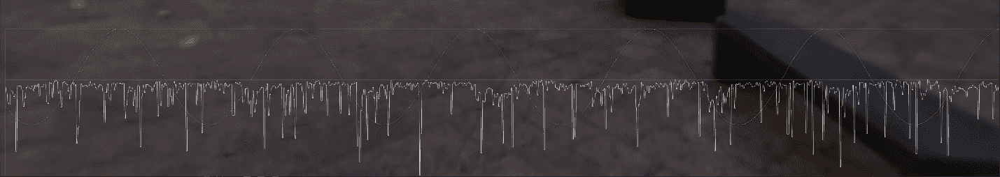

图 4.10：每秒帧数和正弦波图表

## 将所有内容整合到一个 Vulkan 应用程序中

在这个菜谱中，我们使用本章之前所有菜谱中的所有材料来构建一个结合 3D 场景渲染和 2D 及 3D 调试线绘制功能的 Vulkan 演示应用程序。

### 准备工作

这个菜谱是将本章中所有材料整合到一个最终演示应用程序中。回顾所有之前的菜谱可能会有助于掌握本章中描述的不同用户交互和调试技术。

本菜谱的完整源代码可以在`Chapter04/06_DemoApp`中找到。本菜谱中使用的`VulkanApp`类在`shared/VulkanApp.h`中声明。

### 如何操作...

让我们快速浏览源代码，看看我们如何将所有配方中的功能集成到一个单一的应用程序中。我们将所有源代码放在这里，以便在后续章节中必要时进行引用。为了简洁起见，再次跳过所有错误检查：

1.  `shared/VulkanApp.h`头文件提供了*LightweightVK*上下文创建和 GLFW 窗口生命周期管理的包装器。有关更多详细信息，请查看*第二章*中的*初始化 Vulkan 实例和图形设备*和*初始化 Vulkan 交换链*配方：

```cpp
#include “shared/VulkanApp.h”
#include <assimp/cimport.h>
#include <assimp/postprocess.h>
#include <assimp/scene.h>
#include “shared/LineCanvas.h”
```

1.  在这里，我们演示了一个用于*添加相机动画和运动*配方的相机定位器：

```cpp
const vec3 kInitialCameraPos    = vec3(0.0f, 1.0f, -1.5f);
const vec3 kInitialCameraTarget = vec3(0.0f, 0.5f,  0.0f);
const vec3 kInitialCameraAngles = vec3(-18.5f, 180.0f, 0.0f);
CameraPositioner_MoveTo positionerMoveTo(
  kInitialCameraPos, kInitialCameraAngles);
vec3 cameraPos    = kInitialCameraPos;
vec3 cameraAngles = kInitialCameraAngles;
const char* cameraType          = “FirstPerson”;
const char* comboBoxItems[]     = { “FirstPerson”, “MoveTo” };
const char* currentComboBoxItem = cameraType;
```

1.  以下是为之前*使用 ImGui 和 ImPlot 在屏幕上渲染图形*配方中描述的 FPS 图表：

```cpp
LinearGraph fpsGraph(“##fpsGraph”, 2048);
LinearGraph sinGraph(“##sinGraph”, 2048);
```

1.  `VulkanApp`类如*使用 3D 相机和基本用户交互*配方中所述内置了第一人称相机。我们提供了一个初始相机位置和目标，以及为了绘制漂亮的快速移动图形而减少 FPS 平均间隔：

```cpp
int main()
{
  VulkanApp app({
    .initialCameraPos = kInitialCameraPos,
    .initialCameraTarget = kInitialCameraTarget });
  app.fpsCounter_.avgInterval_ = 0.002f;
  app.fpsCounter_.printFPS_    = false;
  LineCanvas2D canvas2d;
  LineCanvas3D canvas3d;
```

1.  让我们创建一个局部变量，以便更方便地访问存储在`VulkanApp`中的`lvk::IContext`。我们稍后显式调用`ctx.release()`：

```cpp
 std::unique_ptr<lvk::IContext> ctx(app.ctx_.get());
```

1.  所有着色器都是从文件中加载的。立方体贴图渲染已在*在 Vulkan 中使用立方体贴图纹理*配方中描述：

```cpp
 lvk::Holder<lvk::ShaderModuleHandle> vert =
    loadShaderModule(
      ctx, “Chapter04/04_CubeMap/src/main.vert”);
  lvk::Holder<lvk::ShaderModuleHandle> frag =
    loadShaderModule(
      ctx, “Chapter04/04_CubeMap/src/main.frag”);
  lvk::Holder<lvk::ShaderModuleHandle> vertSkybox =
    loadShaderModule(
      ctx, “Chapter04/04_CubeMap/src/skybox.vert”);
  lvk::Holder<lvk::ShaderModuleHandle> fragSkybox =
    loadShaderModule(
      ctx, “Chapter04/04_CubeMap/src/skybox.frag”);
```

1.  橡皮鸭网格渲染管线创建如下：

```cpp
 struct VertexData {
    vec3 pos;
    vec3 n;
    vec2 tc;
  };
  const lvk::VertexInput vdesc = {
    .attributes   = {{ .location = 0,
                       .format = lvk::VertexFormat::Float3,
                       .offset = offsetof(VertexData, pos) },
                     { .location = 1,
                       .format = lvk::VertexFormat::Float3,
                       .offset = offsetof(VertexData, n) },
                     { .location = 2,
                       .format = lvk::VertexFormat::Float2,
                       .offset = offsetof(VertexData, tc) }, },
    .inputBindings = { { .stride = sizeof(VertexData) } },
  };
  lvk::Holder<lvk::RenderPipelineHandle> pipeline =
    ctx->createRenderPipeline({
      .vertexInput = vdesc,
      .smVert      = vert,
      .smFrag      = frag,
      .color       = { {.format = ctx->getSwapchainFormat()} },
      .depthFormat = app.getDepthFormat(),
      .cullMode    = lvk::CullMode_Back,
  });
```

1.  天空盒渲染管线使用可编程顶点提取，并且没有顶点输入状态。有关详细信息，请参阅*在 Vulkan 中使用立方体贴图纹理*配方：

```cpp
 lvk::Holder<lvk::RenderPipelineHandle> pipelineSkybox =
    ctx->createRenderPipeline({
      .smVert      = vertSkybox,
      .smFrag      = fragSkybox,
      .color       = { {.format = ctx->getSwapchainFormat()} },
      .depthFormat = app.getDepthFormat(),
  });
  const lvk::DepthState dState = {
    .compareOp = lvk::CompareOp_Less,
    .isDepthWriteEnabled = true };
```

1.  让我们从`.gltf`文件中加载橡皮鸭并将其打包到`vertices`和`indices`数组中：

```cpp
 const aiScene* scene = aiImportFile(
    “data/rubber_duck/scene.gltf”, aiProcess_Triangulate);
  const aiMesh* mesh = scene->mMeshes[0];
  std::vector<VertexData> vertices;
  for (uint32_t i = 0; i != mesh->mNumVertices; i++) {
    const aiVector3D v = mesh->mVertices[i];
    const aiVector3D n = mesh->mNormals[i];
    const aiVector3D t = mesh->mTextureCoords[0][i];
    vertices.push_back({ .pos = vec3(v.x, v.y, v.z),
                         .n   = vec3(n.x, n.y, n.z),
                         .tc  = vec2(t.x, t.y) });
  }
  std::vector<uint32_t> indices;
  for (uint32_t i = 0; i != mesh->mNumFaces; i++)
    for (uint32_t j = 0; j != 3; j++)
      indices.push_back(mesh->mFaces[i].mIndices[j]);
  aiReleaseImport(scene);
```

1.  创建两个 GPU 缓冲区来存储`indices`和`vertices`：

```cpp
 size_t kSizeIndices  = sizeof(uint32_t) * indices.size();
  size_t kSizeVertices = sizeof(VertexData) * vertices.size();
  lvk::Holder<lvk::BufferHandle> bufferIndices =
    ctx->createBuffer({
      .usage     = lvk::BufferUsageBits_Index,
      .storage   = lvk::StorageType_Device,
      .size      = kSizeIndices,
      .data      = indices.data(),
      .debugName = “Buffer: indices” }, nullptr);
  lvk::Holder<lvk::BufferHandle> bufferVertices =
    ctx->createBuffer({
      .usage     = lvk::BufferUsageBits_Vertex,
      .storage   = lvk::StorageType_Device,
      .size      = kSizeVertices,
      .data      = vertices.data(),
      .debugName = “Buffer: vertices” }, nullptr);
```

1.  使用统一缓冲区来存储每帧数据，例如模型视图投影矩阵、相机位置以及两个纹理的无绑定 ID：

```cpp
 struct PerFrameData {
    mat4 model;
    mat4 view;
    mat4 proj;
    vec4 cameraPos;
    uint32_t tex     = 0;
    uint32_t texCube = 0;
  };
  lvk::Holder<lvk::BufferHandle> bufferPerFrame =
    ctx->createBuffer({
      .usage     = lvk::BufferUsageBits_Uniform,
      .storage   = lvk::StorageType_Device,
      .size      = sizeof(PerFrameData),
      .debugName = “Buffer: per-frame” }, nullptr);
```

1.  现在让我们引入一个 2D 纹理用于橡皮鸭模型，以及一个立方体贴图纹理用于我们的天空盒，如*在 Vulkan 中使用立方体贴图纹理*配方中所述：

```cpp
 lvk::Holder<lvk::TextureHandle> texture = loadTexture(
    ctx, “data/rubber_duck/textures/Duck_baseColor.png”);
  lvk::Holder<lvk::TextureHandle> cubemapTex;
  int w, h;
  const float* img = stbi_loadf(
    “data/piazza_bologni_1k.hdr”, &w, &h, nullptr, 4);
  Bitmap in(w, h, 4, eBitmapFormat_Float, img);
  Bitmap out = convertEquirectangularMapToVerticalCross(in);
  stbi_image_free((void*)img);
  stbi_write_hdr(“.cache/screenshot.hdr”, out.w_, out.h_,
    out.comp_, (const float*)out.data_.data());
  Bitmap cubemap = convertVerticalCrossToCubeMapFaces(out);
  cubemapTex = ctx->createTexture({
    .type       = lvk::TextureType_Cube,
    .format     = lvk::Format_RGBA_F32,
    .dimensions = {(uint32_t)cubemap.w_, (uint32_t)cubemap.h_},
    .usage      = lvk::TextureUsageBits_Sampled,
    .data       = cubemap.data_.data(),
    .debugName  = “data/piazza_bologni_1k.hdr” });
```

1.  使用`VulkanApp::run()`方法提供的 lambda 表达式运行主循环。相机定位器如*添加相机动画和运动*配方中所述进行更新：

```cpp
 app.run(& {
    positionerMoveTo.update(deltaSeconds, app.mouseState_.pos,
      ImGui::GetIO().WantCaptureMouse ?
        false : app.mouseState_.pressedLeft);
    const mat4 p  = glm::perspective(glm::radians(60.0f),
      aspectRatio, 0.1f, 1000.0f);
    const mat4 m1 = glm::rotate(mat4(1.0f),
      glm::radians(-90.0f), vec3(1, 0, 0));
    const mat4 m2 = glm::rotate(mat4(1.0f),
      (float)glfwGetTime(), vec3(0.0f, 1.0f, 0.0f));
    const mat4 v  = glm::translate(mat4(1.0f),
      app.camera_.getPosition());
    const PerFrameData pc = {
      .model     = m2 * m1,
      .view      = app.camera_.getViewMatrix(),
      .proj      = p,
      .cameraPos = vec4(app.camera_.getPosition(), 1.0f),
      .tex       = texture.index(),
      .texCube   = cubemapTex.index(),
    };
    ctx->upload(bufferPerFrame, &pc, sizeof(pc));
```

1.  要回顾渲染通道和帧缓冲区的详细信息，请查看*第三章*中的*在 Vulkan 中处理缓冲区*配方：

```cpp
 const lvk::RenderPass renderPass = {
      .color = { { .loadOp = lvk::LoadOp_Clear,
                   .clearColor = {1.0f, 1.0f, 1.0f, 1.0f} } },
      .depth = { .loadOp = lvk::LoadOp_Clear,
                 .clearDepth = 1.0f } };
    const lvk::Framebuffer framebuffer = {
      .color = {
        { .texture = ctx->getCurrentSwapchainTexture() } },
      .depthStencil = { .texture = app.getDepthTexture() } };
    lvk::ICommandBuffer& buf = ctx->acquireCommandBuffer();
    buf.cmdBeginRendering(renderPass, framebuffer);
```

1.  我们按照*在 Vulkan 中使用立方体贴图纹理*配方中的描述渲染天空盒。请注意，使用了 36 个顶点来绘制天空盒：

```cpp
 buf.cmdPushConstants(ctx->gpuAddress(bufferPerFrame));
    buf.cmdPushDebugGroupLabel(“Skybox”, 0xff0000ff);
    buf.cmdBindRenderPipeline(pipelineSkybox);
    buf.cmdDraw(36);
    buf.cmdPopDebugGroupLabel();
```

1.  橡皮鸭网格的渲染过程如下：

```cpp
 buf.cmdPushDebugGroupLabel(“Mesh”, 0xff0000ff);
    buf.cmdBindVertexBuffer(0, bufferVertices);
    buf.cmdBindRenderPipeline(pipeline);
    buf.cmdBindDepthState(dState);
    buf.cmdBindIndexBuffer(bufferIndices, lvk::IndexFormat_UI32);
    buf.cmdDrawIndexed(indices.size());
    buf.cmdPopDebugGroupLabel();
```

1.  以备忘录形式渲染 ImGui 窗口以提供键盘提示的操作如下：

```cpp
 app.imgui_->beginFrame(framebuffer);
    ImGui::SetNextWindowPos(ImVec2(10, 10));
    ImGui::Begin(“Keyboard hints:”, nullptr,
        ImGuiWindowFlags_AlwaysAutoResize |
        ImGuiWindowFlags_NoFocusOnAppearing |
        ImGuiWindowFlags_NoInputs |
        ImGuiWindowFlags_NoCollapse);
    ImGui::Text(“W/S/A/D - camera movement”);
    ImGui::Text(“1/2 - camera up/down”);
    ImGui::Text(“Shift - fast movement”);
    ImGui::Text(“Space - reset view”);
    ImGui::End();
```

1.  我们按照*添加帧率计数器*配方中的描述渲染帧率计数器：

```cpp
 if (const ImGuiViewport* v = ImGui::GetMainViewport()) {
      ImGui::SetNextWindowPos({
        v->WorkPos.x + v->WorkSize.x - 15.0f,
        v->WorkPos.y + 15.0f }, ImGuiCond_Always,
        { 1.0f, 0.0f });
    }
    ImGui::SetNextWindowBgAlpha(0.30f);
    ImGui::SetNextWindowSize(
      ImVec2(ImGui::CalcTextSize(“FPS : _______”).x, 0));
    if (ImGui::Begin(“##FPS”, nullptr,
          ImGuiWindowFlags_NoDecoration |
          ImGuiWindowFlags_AlwaysAutoResize | 
          ImGuiWindowFlags_NoSavedSettings |
          ImGuiWindowFlags_NoFocusOnAppearing | 
          ImGuiWindowFlags_NoNav | ImGuiWindowFlags_NoMove)) {
      ImGui::Text(“FPS : %i”, (int)app.fpsCounter_.getFPS());
      ImGui::Text(
        “Ms  : %.1f”, 1000.0 / app.fpsCounter_.getFPS());
    }
    ImGui::End();
```

1.  我们按照*使用 ImGui 和 ImPlot 在屏幕上渲染图形*配方中的描述处理屏幕上的图形和 2D 绘图画布：

```cpp
 sinGraph.renderGraph(0, height * 0.7f, width,
      height * 0.2f, vec4(0.0f, 1.0f, 0.0f, 1.0f));
    fpsGraph.renderGraph(0, height * 0.8f, width, height * 0.2f);
    canvas2d.clear();
    canvas2d.line({ 100, 300 }, { 100, 400 }, vec4(1, 0, 0, 1));
    canvas2d.line({ 100, 400 }, { 200, 400 }, vec4(0, 1, 0, 1));
    canvas2d.line({ 200, 400 }, { 200, 300 }, vec4(0, 0, 1, 1));
    canvas2d.line({ 200, 300 }, { 100, 300 }, vec4(1, 1, 0, 1));
    canvas2d.render(“##plane”);
```

1.  以下代码处理 3D 绘图画布，如*实现即时模式 3D 绘图画布*配方中所述。为了演示`frustum()`函数，我们通过`lookAt()`和`perspective()`GLM 函数渲染了一个临时旋转的棱台：

```cpp
 canvas3d.clear();
    canvas3d.setMatrix(pc.proj * pc.view);
    canvas3d.plane(vec3(0, 0, 0), vec3(1, 0, 0), vec3(0, 0, 1),
      40, 40, 10.0f, 10.0f, vec4(1, 0, 0, 1), vec4(0, 1, 0, 1));
    canvas3d.box(mat4(1.0f), BoundingBox(vec3(-2), vec3(+2)),
      vec4(1, 1, 0, 1));
    canvas3d.frustum(
      glm::lookAt(vec3(cos(glfwGetTime()),
                  kInitialCameraPos.y, sin(glfwGetTime())),
                  kInitialCameraTarget, vec3(0.0f, 1.0f, 0.0f)),
      glm::perspective(glm::radians(60.0f), aspectRatio, 0.1f,
        30.0f), vec4(1, 1, 1, 1));
    canvas3d.render(*ctx.get(), framebuffer, buf, width, height);
```

1.  最后，完成渲染，将命令缓冲区提交给 GPU，并更新图表：

```cpp
 app.imgui_->endFrame(buf);
    buf.cmdEndRendering();
    ctx->submit(buf, ctx->getCurrentSwapchainTexture());
    fpsGraph.addPoint(app.fpsCounter_.getFPS());
    sinGraph.addPoint(sinf(glfwGetTime() * 20.0f));
  });
  ctx.release();
  return 0;
}
```

以下是从运行中的应用程序中截取的屏幕截图。白色图表显示平均 FPS 值，旋转的白色棱台可用于调试阴影映射，正如我们在后续章节中所做的那样：

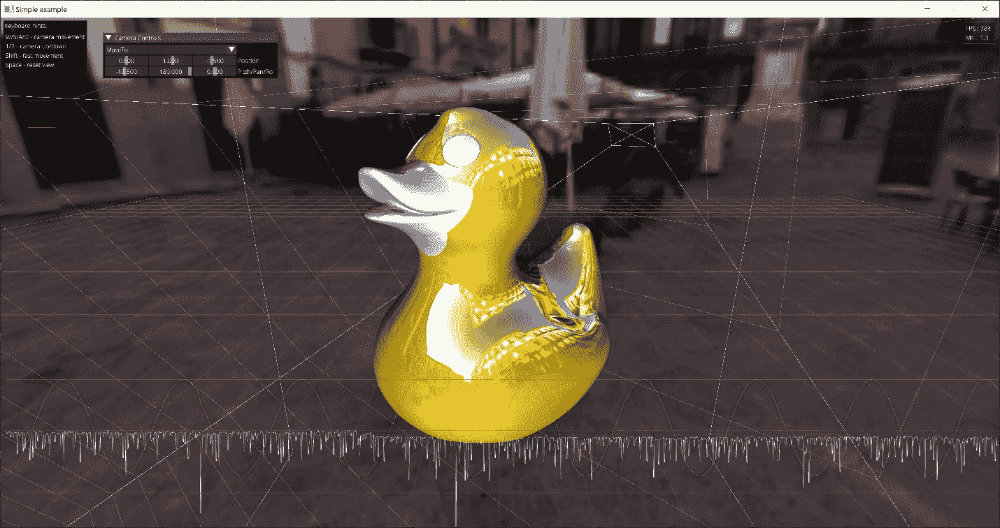

图 4.11：演示应用程序

本章重点介绍了将多个渲染方面结合到一个工作 Vulkan 应用程序中。图形方面仍缺少一些基本功能，例如高级光照和材质，但我们几乎已经准备好开始渲染更复杂的场景。接下来的几章将涵盖更复杂的网格渲染技术以及基于 glTF2 格式的基于物理的光照计算。
