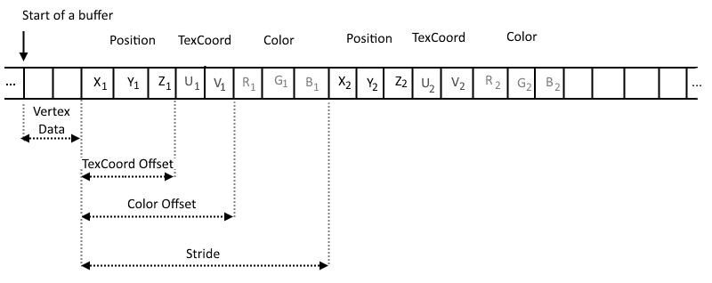
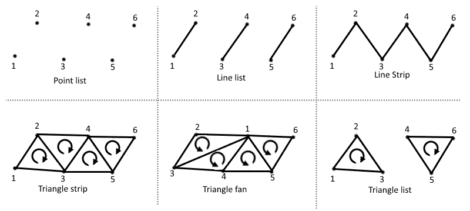
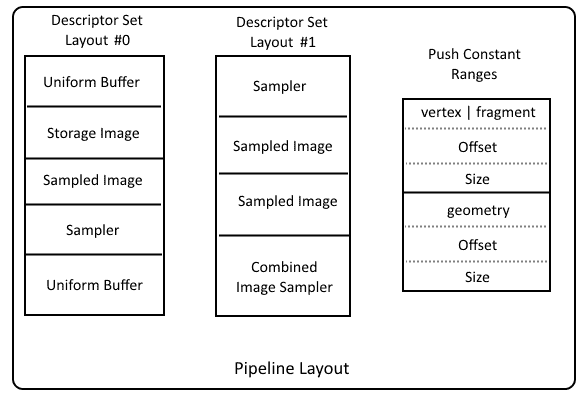
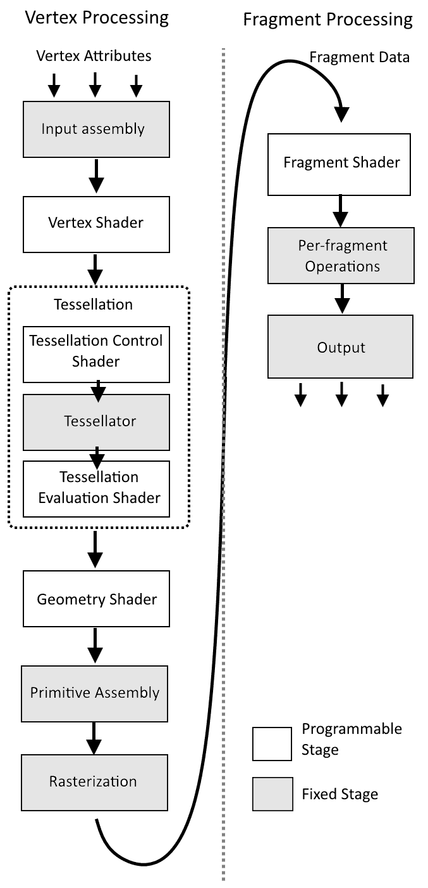

# 第八章：图形和计算管道

在本章中，我们将介绍以下食谱：

+   创建着色器模块

+   指定管道着色器阶段

+   指定管道顶点绑定描述、属性描述和输入状态

+   指定管道输入装配状态

+   指定管道细分状态

+   指定管道视口和剪裁测试状态

+   指定管道光栅化状态

+   指定管道多重采样状态

+   指定管道深度和模板状态

+   指定管道混合状态

+   指定管道动态状态

+   创建管道布局

+   指定图形管道创建参数

+   创建管道缓存对象

+   从管道缓存中检索数据

+   合并多个管道缓存对象

+   创建图形管道

+   创建计算管道

+   绑定管道对象

+   创建一个包含组合图像采样器、缓冲区和推送常量范围的管道布局

+   创建一个具有顶点和片段着色器、启用深度测试以及具有动态视口和剪裁测试的图形管道

+   在多个线程上创建多个图形管道

+   销毁管道

+   销毁管道缓存

+   销毁管道布局

+   销毁着色器模块

# 简介

记录在命令缓冲区中并提交到队列中的操作由硬件处理。处理是通过一系列步骤进行的，这些步骤形成一个管道。当我们想要执行数学计算时，我们使用计算管道。如果我们想要绘制任何东西，我们需要一个图形管道。

管道对象控制几何图形的绘制方式或计算执行。它们管理应用程序执行的硬件的行为。它们是 Vulkan 和 OpenGL 之间最大的、最明显的差异之一。OpenGL 使用状态机。它允许我们在任何时候更改许多渲染或计算参数。我们可以设置状态，激活着色器程序，绘制几何图形，然后激活另一个着色器程序并绘制另一个几何图形。在 Vulkan 中，这是不可能的，因为整个渲染或计算状态都存储在单个、统一的对象中。当我们想要使用不同的着色器集时，我们需要准备并使用一个单独的管道。我们无法简单地切换着色器。

这可能一开始会让人感到害怕，因为许多着色器变体（不包括管道状态的其他部分）导致我们创建多个管道对象。但这服务于两个重要的目标。第一个是性能。知道整个状态的驱动程序可能会优化后续操作的执行。第二个目标是性能的稳定性。随时更改状态可能会导致驱动程序在意外和不可预测的时刻执行额外的操作，例如着色器重新编译。在 Vulkan 中，所有必要的准备，包括着色器编译，都是在管道创建期间完成的。

在本章中，我们将了解如何设置所有图形或计算管道参数以成功创建它们。我们将了解如何准备着色器模块并定义哪些着色器阶段是活动的，如何设置深度或模板测试以及如何启用混合。我们还将指定在绘制操作期间使用的顶点属性以及它们是如何提供的。最后，我们将了解如何创建多个管道以及如何提高它们创建的速度。

# 创建着色器模块

创建管道对象的第一步是准备着色器模块。它们代表着色器并包含用 SPIR-V 汇编编写的代码。单个模块可能包含多个着色器阶段的代码。当我们编写着色器程序并将它们转换为 SPIR-V 形式时，在我们可以在我们应用程序中使用着色器之前，我们需要创建一个着色器模块（或多个模块）。

# 如何操作...

1.  取名为`logical_device`的`VkDevice`类型变量的逻辑设备的句柄。

1.  加载一个选定的着色器的二进制 SPIR-V 汇编并将其存储在一个名为`source_code`的类型为`std::vector<unsigned char>`的变量中。

1.  创建一个名为`shader_module_create_info`的`VkShaderModuleCreateInfo`类型的变量。使用以下值初始化其成员：

    +   `VK_STRUCTURE_TYPE_SHADER_MODULE_CREATE_INFO`值用于`sType`。

    +   `pNext`的`nullptr`值

    +   `flags`的`0`值

    +   `source_code`向量中元素的数量（以字节为单位）用于`codeSize`

    +   指向`source_code`变量第一个元素的指针用于`pCode`

1.  创建一个名为`shader_module`的`VkShaderModule`类型的变量，其中将存储创建的着色器模块的句柄。

1.  进行`vkCreateShaderModule(logical_device, &shader_module_create_info, nullptr, &shader_module)`函数调用，其中提供`logical_device`变量、指向`shader_module_create_info`的指针、`nullptr`值和指向`shader_module`变量的指针。

1.  确保调用`vkCreateShaderModule()`函数返回了`VK_SUCCESS`值，这表示着色器模块已正确创建。

# 它是如何工作的...

着色器模块包含选定的着色器程序的源代码——一个单独的 SPIR-V 汇编。它可能代表多个着色器阶段，但每个阶段必须关联一个单独的入口点。这个入口点随后作为创建管道对象时的一个参数提供（参考*指定管道着色器阶段*配方）。

当我们想要创建一个着色器模块时，我们需要加载一个包含二进制 SPIR-V 代码的文件或以任何其他方式获取它。然后我们像这样将其提供给一个类型为`VkShaderModuleCreateInfo`的变量：

```cpp
VkShaderModuleCreateInfo shader_module_create_info = { 
  VK_STRUCTURE_TYPE_SHADER_MODULE_CREATE_INFO, 
  nullptr, 
  0, 
  source_code.size(), 
reinterpret_cast<uint32_t const *>(source_code.data()) 
};

```

接下来，将此类变量的指针提供给`vkCreateShaderModule()`函数，该函数创建一个模块：

```cpp
VkResult result = vkCreateShaderModule( logical_device, &shader_module_create_info, nullptr, &shader_module ); 
if( VK_SUCCESS != result ) { 
  std::cout << "Could not create a shader module." << std::endl; 
  return false; 
} 
return true;

```

我们只需记住，当我们创建着色器模块时，着色器不会被编译；这是在创建管道对象时完成的。

着色器编译和链接是在创建管道对象期间执行的。

# 参见

本章中的以下配方：

+   *指定管线着色阶段*

+   *创建图形管线*

+   *创建计算管线*

+   *销毁着色器模块*

# 指定管线着色阶段

在计算管线中，我们只能使用计算着色器。但图形管线可能包含多个着色阶段--顶点（这是必需的）、几何、细分控制与评估以及片段。因此，为了正确创建管线，我们需要指定在给定的管线绑定到命令缓冲区时将激活哪些可编程着色阶段。我们还需要提供所有启用着色器的源代码。

# 准备工作

为了简化配方并减少准备所有启用着色阶段描述所需的参数数量，引入了一个自定义的 `ShaderStageParameters` 类型。它具有以下定义：

```cpp
structShaderStageParameters { 
  VkShaderStageFlagBits        ShaderStage; 
  VkShaderModule               ShaderModule; 
  char const                 * EntryPointName; 
  VkSpecializationInfo const * SpecializationInfo; 
};

```

在前面的结构中，`ShaderStage` 定义了一个单独的管线阶段，其余参数在此指定。`ShaderModule` 是一个模块，可以从其中获取给定阶段的 SPIR-V 源代码，与在 `EntryPointName` 成员中提供的名称关联的函数相关。`SpecializationInfo` 参数是指向类型为 `VkSpecializationInfo` 的变量的指针。它允许在管线创建期间运行时修改在着色器源代码中定义的常量变量的值。但如果我们不想指定常量值，我们可以提供一个 `nullptr` 值。

# 如何操作...

1.  创建一个或多个着色器模块，其中包含将在给定管线中激活的每个着色阶段的源代码（参考 *创建着色器模块* 配方）。

1.  创建一个名为 `shader_stage_create_infos` 的 `std::vector` 变量，其元素类型为 `VkPipelineShaderStageCreateInfo`。

1.  对于在给定管线中应启用的每个着色阶段，向 `shader_stage_create_infos` 向量中添加一个元素，并使用以下值初始化其成员：

    +   `VK_STRUCTURE_TYPE_PIPELINE_SHADER_STAGE_CREATE_INFO` 的 `sType` 值

    +   `pNext` 的 `nullptr` 值

    +   `flags` 的 `0` 值

    +   为 `stage` 选定的着色阶段

    +   对于 `module`，包含给定着色阶段源代码的着色器模块

    +   在着色器模块中实现给定着色器的函数名称（通常是 `main`）对于 `pName`

    +   一个指向类型为 `VkSpecializationInfo` 的变量的指针，具有常量值特殊化或如果不需要 `pSpecializationInfo` 的特殊化，则为 `nullptr` 值

# 它是如何工作的...

定义在给定管线中激活的一组着色器阶段需要我们准备一个包含类型为`VkPipelineShaderStageCreateInfo`的元素数组（或向量）。每个着色器阶段需要一个单独的条目，在其中我们需要指定一个着色器模块和实现给定模块中着色器行为的入口点的名称。我们还可以提供一个指向特殊化信息的指针，这允许我们在管线创建期间（在运行时）修改着色器常量变量的值。这允许我们多次使用相同的着色器代码，并略有变化。

指定管线着色器阶段信息对于图形和计算管线都是强制性的。

让我们假设我们只想使用顶点和片段着色器。我们可以准备一个包含自定义`ShaderStageParameters`类型元素的向量，如下所示：

```cpp
std::vector<ShaderStageParameters>shader_stage_params = { 
  { 
    VK_SHADER_STAGE_VERTEX_BIT, 
    *vertex_shader_module, 
    "main", 
     nullptr 
  }, 
  { 
    VK_SHADER_STAGE_FRAGMENT_BIT, 
    *fragment_shader_module, 
    "main", 
    nullptr 
  } 
};

```

上述食谱的实现，它使用上述向量中的数据，可能看起来像这样：

```cpp
shader_stage_create_infos.clear(); 
for( auto & shader_stage : shader_stage_params ) { 
  shader_stage_create_infos.push_back( { 
    VK_STRUCTURE_TYPE_PIPELINE_SHADER_STAGE_CREATE_INFO, 
    nullptr, 
    0, 
    shader_stage.ShaderStage, 
    shader_stage.ShaderModule, 
    shader_stage.EntryPointName, 
    shader_stage.SpecializationInfo 
  } ); 
}

```

数组中提供的每个着色器阶段必须是唯一的。

# 参见

本章中的以下食谱：

+   *创建着色器模块*

+   *创建图形管线*

+   *创建计算管线*

# 指定管线顶点绑定描述、属性描述和输入状态

当我们想要绘制几何图形时，我们准备顶点以及它们额外的属性，如法向量、颜色或纹理坐标。这样的顶点数据是我们任意选择的，因此为了硬件能够正确使用它们，我们需要指定有多少属性，它们在内存中的布局方式，或者它们从哪里获取。这些信息通过创建图形管线所需的顶点绑定描述和属性描述提供。

# 如何操作...

1.  创建一个名为`binding_descriptions`的`std::vector`变量，其元素类型为`VkVertexInputBindingDescription`。

1.  在给定的管线中使用每个顶点绑定（作为顶点缓冲区绑定到命令缓冲区的缓冲区的一部分）为`binding_descriptions`向量添加一个单独的条目。使用以下值来初始化其成员：

    +   用于`binding`的绑定索引（它所代表的数字）

    +   缓冲区中连续元素之间的字节数用于`stride`

    +   表示从给定绑定读取的属性值是否应按顶点（`VK_VERTEX_INPUT_RATE_VERTEX`）或按实例（`VK_VERTEX_INPUT_RATE_INSTANCE`）递增的参数用于`inputRate`

1.  创建一个名为`attribute_descriptions`的`std::vector`变量，其元素类型为`VkVertexInputAttributeDescription`。

1.  在给定的图形管线中，为每个提供给顶点着色器的属性在`attribute_descriptions`向量变量中添加一个单独的条目。使用以下值来初始化其成员：

    +   用于在顶点着色器中读取给定属性的着色器位置用于`location`

    +   将包含此属性数据源的顶点缓冲区绑定到绑定索引的绑定用于`binding`

    +   `format` 中属性数据的格式

    +   从绑定开始到给定元素的内存偏移量用于 `offset`

1.  创建一个名为 `vertex_input_state_create_info` 的 `VkPipelineVertexInputStateCreateInfo` 类型的变量。使用以下值初始化其成员：

    +   `sType` 的 `VK_STRUCTURE_TYPE_PIPELINE_VERTEX_INPUT_STATE_CREATE_INFO` 值

    +   `pNext` 的 `nullptr` 值

    +   `flags` 的 `0` 值

    +   `binding_descriptions` 向量的元素数量用于 `vertexBindingDescriptionCount`

    +   `binding_descriptions` 向量第一个元素的指针用于 `pVertexBindingDescriptions`

    +   `vertexAttributeDescriptionCount` 中 `attribute_descriptions` 向量的元素数量

    +   `attribute_descriptions` 向量第一个元素的指针用于 `pVertexAttributeDescriptions`

# 它是如何工作的...

顶点绑定定义了一个从绑定到选定索引的顶点缓冲区中取出的数据集合。此绑定用作顶点属性的编号数据源。我们可以使用至少 16 个独立的绑定，将单独的顶点缓冲区或同一缓冲区的不同部分绑定到这些绑定上。

顶点输入状态对于创建图形管线是必需的。

通过绑定描述，我们指定数据是从哪里取出的（从哪个绑定），如何布局（缓冲区中连续元素之间的步长是什么），以及如何读取这些数据（是否应该按顶点或按实例读取）。

例如，当我们想要使用三个属性——三个元素的顶点位置、两个元素的纹理坐标和三个元素的颜色值，这些值从 `0`^(th) 绑定中按顶点读取时，我们可以使用以下代码：

```cpp
std::vector<VkVertexInputBindingDescription> binding_descriptions = { 
  { 
    0, 
    8 * sizeof( float ), 
    VK_VERTEX_INPUT_RATE_VERTEX 
  } 
};

```

通过顶点输入描述，我们定义从给定绑定中取出的属性。对于每个属性，我们需要提供一个着色器位置（与通过 `layout( location = <number> )` 限定符定义的着色器源代码中的位置相同），用于给定属性的数据格式，以及给定属性开始的内存偏移量（相对于给定元素的开始数据）。输入描述条目数指定了渲染过程中使用的属性总数。



在前一种情况下——具有三个分量的顶点位置、两个分量的纹理坐标和三个分量的颜色——我们可以使用以下代码来指定顶点输入描述：

```cpp
std::vector<VkVertexInputAttributeDescription> attribute_descriptions = { 
  { 
    0, 
    0, 
    VK_FORMAT_R32G32B32_SFLOAT, 
    0 
  }, 
  { 
    1, 
    0, 
    VK_FORMAT_R32G32_SFLOAT, 
    3 * sizeof( float ) 
  }, 
  { 
    2, 
    0, 
    VK_FORMAT_R32G32B32_SFLOAT, 
    5 * sizeof( float ) 
  } 
};

```

所有三个属性都来自`0`^(th)绑定。位置在`0`^(th)位置提供给顶点着色器，通过第一个位置提供 texcoords，通过第二个位置提供颜色值。位置和颜色是三维向量，texcoords 有两个组件。它们都使用有符号的浮点值。位置是第一个，因此没有偏移。纹理坐标接下来，因此它有三个浮点值的偏移。颜色在纹理坐标之后开始，因此它的偏移等于五个浮点值。

此配方的实现如下所示：

```cpp
vertex_input_state_create_info = { 
  VK_STRUCTURE_TYPE_PIPELINE_VERTEX_INPUT_STATE_CREATE_INFO, 
  nullptr, 
  0, 
  static_cast<uint32_t>(binding_descriptions.size()), 
  binding_descriptions.data(), 
  static_cast<uint32_t>(attribute_descriptions.size()), 
  attribute_descriptions.data() 
};

```

# 参见

+   在第七章，*着色器*中，查看以下配方：

    +   *编写顶点着色器*

+   在第九章，*命令记录和绘制*中，查看以下配方：

    +   *绑定顶点缓冲区*

+   本章中创建图形**管道**的配方

# 指定管道输入装配状态

绘制几何图形（3D 模型）涉及指定从提供的顶点形成的原语类型。这是通过输入装配状态完成的。

# 如何操作...

1.  创建一个名为`input_assembly_state_create_info`的`VkPipelineInputAssemblyStateCreateInfo`类型的变量。使用以下值初始化其成员：

    +   `VK_STRUCTURE_TYPE_PIPELINE_INPUT_ASSEMBLY_STATE_CREATE_INFO`的值为`sType`

    +   `nullptr`的值为`pNext`

    +   `flags`的值为`0`

    +   为`topology`选择从顶点形成的原语类型（点列表、线列表、线带、三角形列表、三角形带、三角形扇、带相邻关系的线列表、带相邻关系的线带、带相邻关系的三角形列表、带相邻关系的三角形带或补丁列表）

    +   对于`primitiveRestartEnable`成员，在绘制使用顶点索引的命令的情况下，指定是否应该使用特殊索引值来重启原语（`VK_TRUE`，不能用于列表原语）或者是否应该禁用原语重启（`VK_FALSE`）

# 它是如何工作的...

通过输入装配状态，我们定义从绘制的顶点形成的多边形类型。最常用的原语是三角形带或列表，但使用的拓扑结构取决于我们想要达到的结果。

创建图形管道需要输入装配状态。



当选择如何装配顶点时，我们只需牢记一些要求：

+   我们不能使用具有原语重启选项的列表原语。

+   只有与相邻关系相关的原语才能与几何着色器一起使用。为了正确工作，必须在创建逻辑设备时启用`geometryShader`功能。

+   当我们想要使用细分着色器时，我们只能使用补丁原语。此外，我们还需要记住，在创建逻辑设备时必须启用`tessellationShader`功能。

这里是一个初始化类型为 `VkPipelineInputAssemblyStateCreateInfo` 的变量的源代码示例：

```cpp
input_assembly_state_create_info = { 
  VK_STRUCTURE_TYPE_PIPELINE_INPUT_ASSEMBLY_STATE_CREATE_INFO, 
  nullptr, 
  0, 
  topology, 
  primitive_restart_enable 
};

```

# 参见

+   本章中的以下食谱：

    +   *指定管线光栅化状态*

    +   *创建图形管线*

# 指定管线细分状态

细分着色器是可选的附加可编程着色器阶段之一，可以在图形管线中启用。但当我们想要激活它们时，我们还需要准备一个管线细分状态。

# 如何做到这一点...

1.  创建一个名为 `tessellation_state_create_info` 的类型为 `VkPipelineTessellationStateCreateInfo` 的变量。使用以下内容初始化其成员：

    +   `VK_STRUCTURE_TYPE_PIPELINE_TESSELLATION_STATE_CREATE_INFO` 的 `sType` 值

    +   `pNext` 的 `nullptr` 值

    +   `flags` 的 `0` 值

    +   形成 `patchControlPoints` 补丁的控制点（顶点）数

# 它是如何工作的...

要在我们的应用程序中使用细分着色器，我们需要在创建逻辑设备期间启用 `tessellationShader` 功能，我们需要为细分控制和评估着色器编写源代码，我们需要为它们创建着色器模块（或两个），并且我们还需要准备一个由类型为 `VkPipelineTessellationStateCreateInfo` 的变量表示的管线细分状态。

细分状态是可选的——我们只需要在想要在图形管线中使用细分着色器时指定它。

在细分状态中，我们只提供有关形成补丁的控制点（顶点）数量的信息。规范指出，补丁可以有至少 32 个顶点。

在补丁中支持的最大控制点（顶点）数至少为 32。

补丁只是一个由点（顶点）组成的集合，这些点被细分阶段用来生成典型的点、线或多边形，如三角形。它可以与通常的多边形完全相同。例如，我们可以取形成三角形的顶点并将它们作为补丁绘制。这种操作的成果是正确的。但对于补丁，我们可以使用任何其他不寻常的顺序和顶点数量。这使我们能够以更多的方式控制细分引擎创建新顶点的方式。

要填充类型为 `VkPipelineTessellationStateCreateInfo` 的变量，我们可以准备以下代码：

```cpp
tessellation_state_create_info = { 
  VK_STRUCTURE_TYPE_PIPELINE_TESSELLATION_STATE_CREATE_INFO, 
  nullptr, 
  0, 
  patch_control_points_count 
};

```

# 参见

+   在第七章 *着色器* 中，查看以下食谱：

    +   *编写细分控制着色器*

    +   *编写细分评估着色器*

+   本章中的食谱 *创建图形管线*

# 指定管线视口和剪裁测试状态

在屏幕上绘制对象需要我们指定屏幕参数。创建一个交换链是不够的——我们并不总是需要绘制到整个可用图像区域。有些情况下，我们只想在整幅图像中绘制一个较小的图像，例如汽车后视镜中的反射或分屏多人游戏中的图像的一半。我们通过管道视口和裁剪测试状态定义我们想要绘制的图像区域。

# 准备中

指定视口和裁剪状态的参数需要我们为视口和裁剪测试提供一组单独的参数，但两组中的元素数量必须相等。为了将这两个状态的参数放在一起，本菜谱中引入了一个自定义的 `ViewportInfo` 类型。它具有以下定义：

```cpp
struct ViewportInfo { 
  std::vector<VkViewport>   Viewports; 
  std::vector<VkRect2D>     Scissors; 
};

```

第一成员，正如其名所示，包含一组视口的参数。第二个用于定义与每个视口对应的裁剪测试的参数。

# 如何操作...

1.  如果要向多个视口进行渲染，请创建一个启用了 `multiViewport` 功能的逻辑设备。

1.  创建一个名为 `viewports` 的 `std::vector<VkViewport>` 类型的变量。对于每个将要进行渲染的视口，向 `viewports` 向量中添加一个新元素。使用以下值初始化其成员：

    +   渲染区域左侧的位置（以像素为单位）对于 `x`

    +   渲染区域顶部的位置（以像素为单位）对于 `y`

    +   渲染区域宽度（以像素为单位）对于 `width`

    +   `height` 的渲染区域高度（以像素为单位）

    +   视口的最小深度值，介于 `0.0` 和 `1.0` 之间对于 `minDepth`

    +   视口的最大深度值，介于 `0.0` 和 `1.0` 之间对于 `maxDepth`

1.  创建一个名为 `scissors` 的 `std::vector<VkRect2D>` 类型的变量。对于每个将要进行渲染的视口，向 `scissors` 向量变量中添加一个新元素（`scissors` 向量必须与 `viewports` 向量具有相同数量的元素）。使用以下值初始化其成员：

    +   裁剪矩形左上角的位置对于 `offset` 的 `x` 和 `y` 成员

    +   裁剪矩形的宽度和高度对于 `extent` 的 `width` 和 `height` 成员

1.  创建一个名为 `viewport_state_create_info` 的 `VkPipelineViewportStateCreateInfo` 类型的变量。使用以下值初始化其成员：

    +   `VK_STRUCTURE_TYPE_PIPELINE_VIEWPORT_STATE_CREATE_INFO` 的值对于 `sType`

    +   `nullptr` 值对于 `pNext`

    +   `0` 值对于 `flags`

    +   `viewports` 向量中的元素数量对于 `viewportCount`

    +   `viewports` 向量第一个元素的指针对于 `pViewports`

    +   `scissors` 向量中的元素数量对于 `scissorCount`

    +   `scissors` 向量第一个元素的指针对于 `pScissors`

# 它是如何工作的...

顶点位置（通常在顶点着色器内部）从局部空间转换到裁剪空间。然后硬件执行透视除法，生成归一化设备坐标。接下来，多边形被组装并光栅化——这个过程生成片段。每个片段在其自己的帧缓冲区坐标中定义了位置。此外，为了正确计算此位置，还需要视口变换。该变换的参数在视口状态中指定。

视口和剪裁测试状态是可选的，尽管常用——当光栅化被禁用时，我们不需要提供它。

通过视口状态，我们定义在帧缓冲区坐标中渲染区域的左上角、宽度和高度（屏幕上的像素）。我们还定义了视口的最小和最大深度值（介于 `0.0` 和 `1.0` 之间的浮点值，包括）。指定最大深度值小于最小深度值是有效的。

剪裁测试允许我们进一步将生成的片段裁剪到剪裁参数中指定的矩形。当我们不想裁剪片段时，我们需要指定一个与视口大小相等的区域。

在 Vulkan 中，剪裁测试始终启用。

视口和剪裁测试的参数集数量必须相等。因此，定义一个自定义类型来保持这两个属性元素数量相等可能是个好主意。以下是一个示例代码，它通过自定义 `ViewportInfo` 类型的变量指定一个视口和一个剪裁测试的参数：

```cpp
ViewportInfo viewport_infos = { 
  { 
    { 
      0.0f, 
      0.0f, 
      512.0f, 
      512.0f, 
      0.0f, 
      1.0f 
    }, 
  }, 
  { 
    { 
      { 
        0, 
        0 
      }, 
      { 
        512, 
        512 
      } 
    } 
  } 
};

```

之前定义的变量可以用来创建本食谱中定义的视口和剪裁测试。该食谱的实现可能如下所示：

```cpp
uint32_t viewport_count = static_cast<uint32_t>(viewport_infos.Viewports.size()); 
uint32_t scissor_count = static_cast<uint32_t>(viewport_infos.Scissors.size()); 
viewport_state_create_info = { 
  VK_STRUCTURE_TYPE_PIPELINE_VIEWPORT_STATE_CREATE_INFO, 
  nullptr, 
  0, 
  viewport_count, 
  viewport_infos.Viewports.data(), 
  scissor_count, 
  viewport_infos.Scissors.data() 
};

```

如果我们要更改视口或剪裁测试的一些参数，我们需要重新创建一个管线。但在管线创建过程中，我们可以指定视口和剪裁测试参数是动态的。这样，我们就不需要重新创建管线来更改这些参数——我们可以在命令缓冲区记录期间指定它们。但我们需要记住，视口（和剪裁测试）的数量始终在管线创建期间指定。我们无法在之后更改它。

可以将视口和剪裁测试定义为动态状态，并在命令缓冲区记录期间指定它们的参数。视口（和剪裁测试）的数量始终在图形管线创建期间指定。

我们也不能提供超过一个视口和剪裁测试，除非为逻辑设备启用了 `multiViewport` 功能。用于光栅化的视口变换的索引只能在几何着色器内部更改。

更改用于光栅化的视口变换索引需要我们使用几何着色器。

# 参见

+   在第一章 *实例与设备* 中，查看以下食谱：

    +   *获取物理设备的特性和属性*

    +   *创建逻辑设备*

+   在第七章，*着色器*中，查看以下配方：

    +   *编写几何着色器*

+   本章中的配方*创建图形管道*，

# 指定管道光栅化状态

光栅化过程从组装的多边形生成片段（像素）。视口状态用于指定片段将在帧缓冲区坐标中的何处生成。为了指定（如果有的话）如何生成片段，我们需要准备一个光栅化状态。

# 如何做到...

1.  创建一个名为`rasterization_state_create_info`的`VkPipelineRasterizationStateCreateInfo`类型的变量。使用以下值初始化其成员：

    +   `VK_STRUCTURE_TYPE_PIPELINE_RASTERIZATION_STATE_CREATE_INFO`的值用于`sType`。

    +   `pNext`的值为`nullptr`。

    +   `flags`的值为`0`。

    +   对于`depthClampEnable`，如果需要将深度值超出视口状态中指定的最小/最大范围的片段的深度值限制在此范围内，请使用`true`值；如果需要将超出此范围的片段裁剪（丢弃），请使用`false`值；当`depthClampEnable`功能未启用时，只能指定`false`值。

    +   对于`rasterizerDiscardEnable`，如果应该正常生成片段，请使用`false`值；如果要禁用光栅化，请使用`true`。

    +   对于`polygonMode`，指定组装的多边形应该如何渲染——完全填充或是否渲染线条或点（线条和点模式只能在启用`fillModeNonSolid`功能时使用）。

    +   多边形的侧面——前侧、后侧、两侧或无——在`cullMode`中应该被剔除。

    +   多边形的侧面——在屏幕上按顺时针或逆时针顶点顺序绘制——应被视为`frontFace`的前侧面。

    +   对于`depthBiasEnable`，如果需要为片段计算深度值添加额外的偏移，请指定`true`值；如果不需要进行此类修改，请指定`false`值。

    +   当为`depthBiasConstantFactor`启用深度偏移时，应添加到片段计算深度值中的常数值。

    +   当为`depthBiasClamp`启用深度偏移时，可以添加到片段深度中的最大（或最小）深度偏移值。

    +   当为`depthBiasSlopeFactor`启用深度偏移时，添加到片段斜率中的值。

    +   指定渲染线条宽度的值用于`lineWidth`；如果未启用`wideLines`功能，则只能指定`1.0`值；否则，也可以提供大于`1.0`的值。

# 它是如何工作的...

光栅化状态控制光栅化的参数。首先，它定义了光栅化是否启用或禁用。通过它，我们可以指定多边形的哪一侧是前面——如果它是屏幕上顶点按顺时针顺序出现的那一侧，或者是否是按逆时针顺序。接下来，我们需要控制是否为前面、后面、两侧启用剔除，或者是否禁用剔除。在 OpenGL 中，默认情况下，逆时针面的被认为是前面，并且剔除是禁用的。在 Vulkan 中，没有默认状态，因此如何定义这些参数取决于我们。

在创建图形管线时始终需要设置光栅化状态。

光栅化状态还控制多边形的绘制方式。通常我们希望它们被完全渲染（填充）。但我们可以指定是否只绘制它们的边缘（线条）或点（顶点）。线条或点模式只能在创建逻辑设备时启用 `fillModeNonSolid` 功能时使用。

对于光栅化状态，我们还需要定义如何计算生成的片段的深度值。我们可以启用深度偏移——这是一个通过一个常数值和一个额外的斜率因子偏移生成深度值的过程。我们还可以指定在启用深度偏移时可以应用于深度值的最大（或最小）偏移值。

之后，我们还需要定义对于深度值超出视口状态中指定范围的片段应该做什么。当启用深度钳位时，此类片段的深度值被钳位到定义的范围内，并且片段会被进一步处理。如果禁用深度钳位，此类片段将被丢弃。

最后一件事情是要定义渲染线条的宽度。通常我们只能指定 `1.0` 的值。但如果我们启用 `wideLines` 功能，我们可以提供大于 `1.0` 的值。

光栅化状态是通过一个 `VkPipelineRasterizationStateCreateInfo` 类型的变量定义的。以下是一个示例代码，展示了如何通过其他变量提供的值填充此类变量：

```cpp
VkPipelineRasterizationStateCreateInfo rasterization_state_create_info = { 
  VK_STRUCTURE_TYPE_PIPELINE_RASTERIZATION_STATE_CREATE_INFO, 
  nullptr, 
  0, 
  depth_clamp_enable, 
  rasterizer_discard_enable, 
  polygon_mode, 
  culling_mode, 
  front_face, 
  depth_bias_enable, 
  depth_bias_constant_factor, 
  depth_bias_clamp, 
  depth_bias_slope_factor, 
  line_width 
};

```

# 参见

+   本章中的以下食谱：

    +   *指定管线视口和裁剪测试状态*

    +   *创建图形管线*

# 指定管线多采样状态

多采样是一种消除绘制原语锯齿边缘的过程。换句话说，它允许我们对多边形、线条和点进行抗锯齿处理。我们通过多采样状态定义如何进行多采样（以及是否进行）。

# 如何实现...

1.  创建一个名为 `multisample_state_create_info` 的 `VkPipelineMultisampleStateCreateInfo` 类型的变量。使用以下值来初始化其成员：

    +   `sType` 的值为 `VK_STRUCTURE_TYPE_PIPELINE_MULTISAMPLE_STATE_CREATE_INFO`

    +   `pNext` 的值为 `nullptr`

    +   `flags` 的值为 `0`

    +   每像素生成的样本数用于 `rasterizationSamples`

    +   如果应该启用每个样本着色（仅当启用`sampleRateShading`功能时）或否则为`false`，则对于`sampleShadingEnable`的`true`值

    +   当启用样本着色时，`minSampleShading`所需的最小独特着色样本分数

    +   指向一个位掩码数组的指针，该数组控制片段的静态覆盖，或一个`nullptr`值以指示从片段中不删除覆盖（掩码中的所有位都启用）对于`pSampleMask`

    +   如果片段的覆盖应该基于片段的 alpha 值生成或否则为`false`，对于`alphaToCoverageEnable`的`true`值

    +   如果片段的颜色应该用`1.0`值替换片段的 alpha 分量，对于浮点格式，或者用给定格式的最大可用值替换固定点格式（仅当启用`alphaToOne`功能时）或否则的值，对于`alphaToOneEnable`

# 它是如何工作的...

多样本状态允许我们启用绘制的原语的抗锯齿。通过它，我们可以定义每个片段生成的样本数，启用每个样本着色，指定唯一着色样本的最小数量，并定义片段的覆盖参数——样本覆盖掩码，是否应该从片段颜色的 alpha 分量生成覆盖。我们还可以指定是否应该用`1.0`值替换 alpha 分量。

只有当启用光栅化时，才需要多样本状态。

为了准备一个多样本状态，我们需要创建一个`VkPipelineMultisampleStateCreateInfo`类型的变量，如下所示：

```cpp
multisample_state_create_info = { 
  VK_STRUCTURE_TYPE_PIPELINE_MULTISAMPLE_STATE_CREATE_INFO, 
  nullptr, 
  0, 
  sample_count, 
  per_sample_shading_enable, 
  min_sample_shading, 
  sample_masks, 
  alpha_to_coverage_enable, 
  alpha_to_one_enable 
};

```

在前面的代码中，函数的参数用于初始化`multisample_state_create_info`变量的成员。

# 参见

本章中的以下食谱：

+   *指定管线光栅化状态*

+   *创建图形管线*

# 指定管线深度和模板状态

通常，当我们渲染几何体时，我们想要模仿我们看到世界的方式——远离我们的物体更小，靠近我们的物体更大，并且它们覆盖了后面的物体（遮挡我们的视线）。在现代 3D 图形中，这种最后的效果（远离的物体被靠近的物体遮挡）是通过深度测试实现的。深度测试的执行方式是通过图形管线的深度和模板状态来指定的。

# 如何做到...

1.  创建一个名为`depth_and_stencil_state_create_info`的`VkPipelineDepthStencilStateCreateInfo`类型的变量。使用以下值来初始化其成员：

    +   `VK_STRUCTURE_TYPE_PIPELINE_DEPTH_STENCIL_STATE_CREATE_INFO`的`sType`值

    +   `pNext`的`nullptr`值

    +   `flags`的`0`值

    +   如果我们想要启用深度测试或否则为`false`，对于`depthTestEnable`的`true`值

    +   如果我们想要将深度值存储在深度缓冲区中，否则对于`depthWriteEnable`为`false`的`true`值

    +   选择一个比较运算符（`never`，`less`，`less and equal`，`equal`，`greater and equal`，`greater`，`not equal`，`always`），用于控制`depthCompareOp`的深度测试执行方式。

    +   如果我们想启用额外的深度边界测试（只有当`depthBounds`功能启用时）或否则为`false`，则`depthBoundsTestEnable`的值为`true`。

    +   如果我们想使用模板测试，则`stencilTestEnable`的值为`true`，如果我们要禁用它，则值为`false`。

    +   使用以下值通过`front`字段初始化成员，通过该字段我们设置用于正面多边形的模板测试参数：

        +   当样本未通过模板测试时执行的功能，对应于`failOp`。

        +   当样本通过模板测试时执行的操作，对应于`passOp`。

        +   当样本通过模板测试但未通过深度测试时采取的操作，对应于`depthFailOp`。

        +   用于执行模板测试的运算符（`never`，`less`，`less and equal`，`equal`，`greater and equal`，`greater`，`not equal`，`always`），对应于`compareOp`。

        +   选择参与模板测试的模板值的位的掩码，对应于`compareMask`。

        +   选择掩码，用于选择在帧缓冲区中应更新的模板值的哪些位，对应于`writeMask`。

        +   用于模板测试比较的参考值。

    +   对于`back`成员，设置模板测试参数，如之前所述用于正面多边形，但这次是针对背面多边形。

    +   描述`minDepthBounds`的深度边界测试的最小值的`0.0`到`1.0`（包含）之间的值。

    +   描述`maxDepthBounds`的深度边界测试的最大值的`0.0`到`1.0`（包含）之间的值。

# 它是如何工作的...

深度和模板状态指定是否应执行深度和/或模板测试。如果其中任何一个被启用，我们还为每个这些测试定义参数。

当光栅化禁用或渲染通道中的给定子通道未使用任何深度/模板附加时，不需要深度和模板状态。

我们需要指定如何执行深度测试（如何比较深度值）以及当片段通过测试时，处理片段的深度值是否应写入深度附加。

当`depthBounds`功能启用时，我们还可以激活一个额外的深度边界测试。此测试检查处理片段的深度值是否在指定的`minDepthBounds` - `maxDepthBounds`范围内。如果不是，则处理片段被丢弃，就像它未通过深度测试一样。

模板测试允许我们对与每个片段关联的整数值执行附加测试。它可以用于各种目的。例如，我们可以定义在绘制过程中可以更新的屏幕的精确部分，但与剪裁测试不同，这个区域可以是任何形状，即使它非常复杂。这种方法在延迟着色/光照算法中用于限制给定光源可以照亮的图像区域。模板测试的另一个例子是使用它来显示被其他对象隐藏的对象的轮廓或突出显示鼠标指针选择的对象。

在启用模板测试的情况下，我们需要分别为前向和后向多边形定义其参数。这些参数包括当给定片段失败模板测试、通过模板测试但失败深度测试，以及通过模板和深度测试时执行的操作。对于每种情况，我们定义当前值在模板附加中的值应保持不变，重置为 `0`，替换为参考值，通过钳位（饱和）或通过环绕进行增加或减少，或者如果当前值应通过位运算取反。我们还通过设置比较运算符（类似于深度测试中定义的运算符）、比较和写入掩码来指定测试的执行方式，这些掩码选择应参与测试或应在模板附加中更新的模板值的位，以及一个参考值。

准备一个类型为 `VkPipelineDepthStencilStateCreateInfo` 的变量的示例源代码，通过该变量定义深度和模板测试，如下代码所示：

```cpp
VkPipelineDepthStencilStateCreateInfo depth_and_stencil_state_create_info = { 
  VK_STRUCTURE_TYPE_PIPELINE_DEPTH_STENCIL_STATE_CREATE_INFO, 
  nullptr, 
  0, 
  depth_test_enable, 
  depth_write_enable, 
  depth_compare_op, 
  depth_bounds_test_enable, 
  stencil_test_enable, 
  front_stencil_test_parameters, 
  back_stencil_test_parameters, 
  min_depth_bounds, 
  max_depth_bounds 
};

```

# 参见

+   在第六章 *渲染通道和帧缓冲区* 中，查看以下食谱：

    +   *指定子通道描述*

    +   *创建帧缓冲区*

+   本章中的以下食谱：

    +   *指定管线光栅化状态*

    +   *创建图形管线*

# 指定管线混合状态

透明物体在我们每天看到的周围环境中非常常见。这类物体在 3D 应用程序中也同样常见。为了模拟透明材料并简化硬件需要执行以渲染透明物体的操作，引入了混合。它将处理片段的颜色与已存储在帧缓冲区中的颜色混合。为此操作准备参数是通过图形管线中的混合状态完成的。

# 如何做到...

1.  创建一个名为 `attachment_blend_states` 的类型为 `VkPipelineColorBlendAttachmentState` 的变量。

1.  对于在绑定给定图形管线的子通道中使用的每个颜色附件，向 `attachment_blend_states` 向量添加一个新元素。如果 `independentBlend` 功能未启用，添加到 `attachment_blend_states` 向量中的所有元素必须完全相同。如果此功能已启用，元素可能不同。无论如何，使用以下值初始化每个添加的元素的成员：

    +   是否启用混合的 `true` 值，否则 `blendEnable` 为 `false`

    +   为 `srcColorBlendFactor` 选择处理（源）片段的颜色混合因子

    +   为 `dstColorBlendFactor` 选择已存储在（目标）附件中的颜色的混合因子

    +   用于在颜色分量上执行混合操作的运算符 `colorBlendOp`

    +   为 `srcAlphaBlendFactor` 选择用于传入（源）片段的 alpha 值的混合因子

    +   为 `dstAlphaBlendFactor` 选择已存储在目标附件中的 alpha 值的混合因子

    +   用于在 alpha 分量上执行混合操作的函数 `alphaBlendOp`

    +   用于选择在附件中写入哪些分量的颜色遮罩 `colorWriteMask`

1.  创建一个名为 `blend_state_create_info` 的 `VkPipelineColorBlendStateCreateInfo` 类型的变量。使用以下值初始化其成员：

    +   `VK_STRUCTURE_TYPE_PIPELINE_COLOR_BLEND_STATE_CREATE_INFO` 的 `sType` 值

    +   `nullptr` 值用于 `pNext`

    +   `0` 值用于 `flags`

    +   如果应在片段的颜色和已存储在附件中的颜色之间执行逻辑运算（这将禁用混合）或否则为 `false`，则 `logicOpEnable` 为 `true`

    +   要执行的逻辑运算的类型（如果启用了逻辑运算） `logicOp`

    +   `attachment_blend_states` 向量中的元素数量 `attachmentCount`

    +   指向 `attachment_blend_states` 向量第一个元素的指针 `pAttachments`

    +   四个浮点值定义了用于某些混合因子的混合常数的红色、绿色、蓝色和 alpha 分量 `blendConstants[4]`

# 它是如何工作的...

混合状态是可选的，如果禁用光栅化或子通道中没有颜色附件，则不需要混合状态，在这种情况下，使用给定的图形管线。

混合状态主要用于定义混合操作的参数。但它也服务于其他目的。在其中，我们指定一个颜色遮罩，该遮罩选择在渲染过程中哪些颜色分量被更新（写入）。它还控制逻辑运算的状态。当启用时，在片段的颜色和已经写入帧缓冲区的颜色之间执行一个指定的逻辑运算。

仅对具有整数和归一化整数格式的附件执行逻辑运算。

支持的逻辑运算包括：

+   `CLEAR`：将颜色设置为零

+   `AND`: 源颜色（片段颜色）和目标颜色（已存储在附件中）之间的位运算“与”

+   `AND_REVERSE`: 源颜色和反转目标颜色之间的位运算“与”

+   `COPY`: 无修改地复制源颜色

+   `AND_INVERTED`: 目标颜色和反转源颜色之间的位运算“与”

+   `NO_OP`: 保持已存储的颜色不变

+   `XOR`: 源颜色和目标颜色之间的位运算“异或”

+   `OR`: 源颜色和目标颜色之间的位运算“或”

+   `NOR`: 反转位运算“或”

+   `EQUIVALENT`: 反转的`XOR`

+   `INVERT`: 反转目标颜色

+   `OR_REVERSE`: 源颜色和反转目标颜色之间的位运算“或”

+   `COPY_INVERTED`: 复制位运算反转的源颜色

+   `OR_INVERTED`: 目标颜色和反转源颜色之间的位运算“或”

+   `NAND`: 反转位运算“与”

+   `SET`: 将所有颜色位设置为 1

在渲染过程中，每个颜色附件的混合操作都是独立控制的，这发生在绑定特定图形管道的子通道中。这意味着我们需要为渲染中使用的每个颜色附件指定混合参数。但我们需要记住，如果未启用`independentBlend`功能，每个附件的混合参数必须完全相同。

对于混合，我们分别指定颜色组件和 alpha 组件的源和目标因子。支持的混合因子包括：

+   `ZERO`: `0`

+   `ONE`: `1`

+   `SRC_COLOR`: `<source component>`

+   `ONE_MINUS_SRC_COLOR`: 1 - `<source component>`

+   `DST_COLOR`: `<destination component>`

+   `ONE_MINUS_DST_COLOR`: 1 - `<destination component>`

+   `SRC_ALPHA`: `<source alpha>`

+   `ONE_MINUS_SRC_ALPHA`: 1 - `<source alpha>`

+   `DST_ALPHA`: `<destination alpha>`

+   `ONE_MINUS_DST_ALPHA`: 1 - `<destination alpha>`

+   `CONSTANT_COLOR`: `<constant color component>`

+   `ONE_MINUS_CONSTANT_COLOR`: 1 - `<constant color component>`

+   `CONSTANT_ALPHA`: `<alpha value of a constant color>`

+   `ONE_MINUS_CONSTANT_ALPHA`: 1 - `<alpha value of a constant color>`

+   `SRC_ALPHA_SATURATE`: `min( <source alpha>, 1 - <destination alpha> )`

+   `SRC1_COLOR`: `<component of a second color>` (used in dual source blending)

+   `ONE_MINUS_SRC1_COLOR`: 1 - `<component of a second color>` (from dual source blending)

+   `SRC1_ALPHA`: `<alpha component of a second color>` (in dual source blending)

+   `ONE_MINUS_SRC1_ALPHA`: 1 - `<source alpha component of a second color>` (from dual source blending)

一些混合因子使用常量颜色而不是片段（源）颜色或已存储在附件中的颜色（目标）。此常量颜色可以在管道创建期间静态指定，也可以在命令缓冲区记录期间通过`vkCmdSetBlendConstants()`函数调用动态指定（作为动态管道状态之一）。

使用源的第二颜色（SRC1）的混合因子只能在启用`dualSrcBlend`功能时使用。

控制混合如何执行的反混函数也分别针对颜色和 alpha 分量单独指定。混合运算符包括：

+   `ADD`: `<src component> * <src factor> + <dst component> * <dst factor>`

+   `SUBTRACT`: `<src component> * <src factor> - <dst component> * <dst factor>`

+   `REVERSE_SUBTRACT`: `<dst component> * <dst factor> - <src component> * <src factor>`

+   `MIN`: `min( <src component>, <dst component> )`

+   `MAX`: `max( <src component>, <dst component> )`

启用逻辑操作将禁用混合。

以下是一个设置带有禁用逻辑操作和混合的反混状态的示例：

```cpp
std::vector<VkPipelineColorBlendAttachmentState> attachment_blend_states = { 
  { 
    false, 
    VK_BLEND_FACTOR_ONE, 
    VK_BLEND_FACTOR_ONE, 
    VK_BLEND_OP_ADD, 
    VK_BLEND_FACTOR_ONE, 
    VK_BLEND_FACTOR_ONE, 
    VK_BLEND_OP_ADD, 
    VK_COLOR_COMPONENT_R_BIT | 
    VK_COLOR_COMPONENT_G_BIT | 
    VK_COLOR_COMPONENT_B_BIT | 
    VK_COLOR_COMPONENT_A_BIT 
  } 
}; 
VkPipelineColorBlendStateCreateInfo blend_state_create_info; 
SpecifyPipelineBlendState( false, VK_LOGIC_OP_COPY, attachment_blend_states, { 1.0f, 1.0f, 1.0f, 1.0f }, blend_state_create_info );

```

实现此配方的代码，填充`VkPipelineColorBlendStateCreateInfo`类型的变量可能如下所示：

```cpp
blend_state_create_info = { 
  VK_STRUCTURE_TYPE_PIPELINE_COLOR_BLEND_STATE_CREATE_INFO, 
  nullptr, 
  0, 
  logic_op_enable, 
  logic_op, 
  static_cast<uint32_t>(attachment_blend_states.size()), 
  attachment_blend_states.data(), 
  { 
    blend_constants[0], 
    blend_constants[1], 
    blend_constants[2], 
    blend_constants[3] 
  } 
};

```

# 参见

+   在第六章的*渲染通道和帧缓冲区*中，查看以下配方：

    +   *指定子通道描述*

    +   *创建帧缓冲区*

+   在第九章的*命令记录和绘制*中，查看以下配方

    +   *动态设置混合常数状态*

+   本章中的以下配方：

    +   *指定管线光栅化状态*

    +   *创建图形管线*

# 指定管线动态状态

创建图形管线需要我们提供大量的参数。更重要的是，一旦设置，这些参数就不能更改。这种做法是为了提高我们应用程序的性能，并为驱动程序提供一个稳定且可预测的环境。但是，不幸的是，这对开发者来说也很不方便，因为他们可能需要创建许多几乎完全相同但只有细微差别的管线对象。

为了绕过这个问题，引入了动态状态。它们允许我们通过在命令缓冲区中记录特定函数来动态地控制管线的一些参数。为了做到这一点，我们需要指定管线中哪些部分是动态的。这是通过指定管线动态状态来完成的。

# 如何做到这一点...

1.  创建一个名为`dynamic_states`的`std::vector<VkDynamicState>`类型的变量。对于每个应该动态设置的（唯一）管线状态，向`dynamic_states`向量中添加一个新元素。以下值可以使用：

    +   `VK_DYNAMIC_STATE_VIEWPORT`

    +   `VK_DYNAMIC_STATE_SCISSOR`

    +   `VK_DYNAMIC_STATE_LINE_WIDTH`

    +   `VK_DYNAMIC_STATE_DEPTH_BIAS`

    +   `VK_DYNAMIC_STATE_BLEND_CONSTANTS`

    +   `VK_DYNAMIC_STATE_DEPTH_BOUNDS`

    +   `VK_DYNAMIC_STATE_STENCIL_COMPARE_MASK`

    +   `VK_DYNAMIC_STATE_STENCIL_WRITE_MASK`

    +   `VK_DYNAMIC_STATE_STENCIL_REFERENCE`

1.  创建一个名为`dynamic_state_creat_info`的`VkPipelineDynamicStateCreateInfo`类型的变量。使用以下值初始化其成员：

    +   `VK_STRUCTURE_TYPE_PIPELINE_DYNAMIC_STATE_CREATE_INFO`值用于`sType`

    +   `nullptr`值用于`pNext`

    +   `flags`的`0`值

    +   `dynamicStateCount`的`dynamic_states`向量中的元素数量

    +   `dynamic_states`向量的第一个元素的指针用于`pDynamicStates`

# 它是如何工作的...

动态管道状态被引入，以允许在设置管道对象的状态时具有一定的灵活性。在命令缓冲区记录期间可能没有太多不同的管道部分可以设置，但选择是在性能、驱动程序的简单性、现代硬件的能力和 API 易用性之间的一种折衷。

动态状态是可选的。如果我们不想动态设置管道的任何部分，我们不需要这样做。

以下图形管道的部分可以动态设置：

+   **视口**：所有视口的参数通过`vkCmdSetViewport()`函数调用设置，但视口数量仍在管道创建期间定义（参考*指定管道视口和剪裁测试状态*配方）

+   **剪裁**：控制剪裁测试的参数通过`vkCmdSetScissor()`函数调用设置，尽管用于剪裁测试的矩形数量在管道创建期间静态定义，并且必须与视口数量相同（参考*指定管道视口和剪裁测试状态*配方）

+   **线宽**：绘制线的宽度不是在图形管道的状态中指定，而是通过`vkCmdSetLineWidth()`函数（参考*指定管道光栅化状态*配方）

+   **深度偏差**：当启用时，片段计算深度值所应用的深度偏差常数因子、斜率因子和最大（或最小）偏差通过记录`vkCmdSetDepthBias()`函数定义（参考*指定管道深度和模板状态*配方）

+   **深度范围**：当启用深度范围测试时，测试期间使用的最小和最大值通过`vkCmdSetDepthBounds()`函数指定（参考*指定管道深度和模板状态*配方）

+   **模板比较掩码**：在模板测试期间使用的模板值的特定位通过`vkCmdSetStencilCompareMask()`函数调用定义（参考*指定管道深度和模板状态*配方）

+   **模板写入掩码**：通过`vkCmdSetStencilWriteMask()`函数指定在模板附加中可以更新的位（参考*指定管道深度和模板状态*配方）

+   **模板参考值**：通过`vkCmdSetStencilReference()`函数调用执行在模板测试期间使用的参考值的设置（参考*指定管道深度和模板状态*配方）

+   **混合常数**：通过记录`vkCmdSetBlendConstants()`函数指定混合常数的红色、绿色、蓝色和 alpha 分量的四个浮点值（参考*指定管道混合状态*配方）

通过创建一个`VkDynamicState`枚举值的数组（或向量），其中包含对应于所选状态的值，并将该数组（在以下代码中命名为`dynamic_states`）提供给`VkPipelineDynamicStateCreateInfo`类型的变量来指定给定状态是动态设置的：

```cpp
VkPipelineDynamicStateCreateInfo dynamic_state_creat_info = { 
  VK_STRUCTURE_TYPE_PIPELINE_DYNAMIC_STATE_CREATE_INFO, 
  nullptr, 
  0, 
  static_cast<uint32_t>(dynamic_states.size()), 
dynamic_states.data() 
};

```

# 参见

+   本章中的以下食谱：

    +   *指定管线视口和剪裁测试状态*

    +   *指定管线光栅化状态*

    +   *指定管线深度和模板状态*

    +   *指定管线混合状态*

    +   *创建图形管线*

+   在第九章，“命令录制与绘制”中，查看以下食谱：

    +   *动态设置视口状态*

    +   *动态设置剪裁状态*

    +   *动态设置深度偏移状态*

    +   *动态设置混合常数状态*

# 创建管道布局

管道布局类似于描述符集布局。描述符集布局用于定义构成给定描述符集的资源类型。管道布局定义了给定管道可以访问的资源类型。它们从描述符集布局创建，并且还包含推送常量范围。

管道布局在管道创建时是必需的，因为它们通过一组、绑定、数组元素地址指定了着色器阶段和着色器资源之间的接口。相同的地址需要在着色器中（通过布局限定符）使用，以便它们可以成功访问给定的资源。即使给定的管道不使用任何描述符资源，我们也需要创建一个管道布局来通知驱动程序不需要此类接口。

# 如何做到这一点...

1.  获取存储在名为`logical_device`的`VkDevice`类型变量中的逻辑设备的句柄。

1.  创建一个名为`descriptor_set_layouts`的`std::vector`变量，其元素类型为`VkDescriptorSetLayout`。对于每个描述符集，通过它将从给定管道中的着色器访问资源，将描述符集布局添加到`descriptor_set_layouts`向量中。

1.  创建一个名为`push_constant_ranges`的`std::vector<VkPushConstantRange>`变量。为每个单独的范围（不同着色器阶段使用的唯一推送常量集）添加新元素到这个向量，并使用以下值来初始化其成员：

    +   所有访问给定`stageFlags`的推送常量的着色器阶段的逻辑`OR`

    +   对于`offset`，给定推送常量在内存中开始的偏移量是 4 的倍数的值

    +   对于`size`，给定推送常量在内存中大小的 4 的倍数的值

1.  创建一个名为`pipeline_layout_create_info`的`VkPipelineLayoutCreateInfo`类型的变量。使用以下值来初始化其成员：

    +   `VK_STRUCTURE_TYPE_PIPELINE_LAYOUT_CREATE_INFO`值用于`sType`

    +   `pNext`的`nullptr`值

    +   `flags`的`0`值

    +   `descriptor_set_layouts`向量中`setLayoutCount`的元素数量

    +   `pSetLayouts` 的 `descriptor_set_layouts` 向量首个元素的指针

    +   `push_constant_ranges` 向量中 `pushConstantRangeCount` 的元素数量

    +   `pPushConstantRanges` 的 `push_constant_ranges` 首个元素的指针

1.  创建一个名为 `pipeline_layout` 的 `VkPipelineLayout` 类型的变量，其中将存储创建的管道布局的句柄。

1.  进行以下调用：`vkCreatePipelineLayout( logical_device, &pipeline_layout_create_info, nullptr, &pipeline_layout )`，其中提供 `logical_device` 变量，`pipeline_layout_create_info` 变量的指针，一个 `nullptr` 值，以及 `pipeline_layout` 变量的指针。

1.  通过检查它是否返回了 `VK_SUCCESS` 值来确保调用成功。

# 它是如何工作的...

管道布局定义了可以从给定管道的着色器访问的资源集合。当我们记录命令缓冲区时，我们将描述符集绑定到选定的索引（参考 *绑定描述符集* 菜谱）。此索引对应于在管道布局创建期间使用的数组中相同索引的描述符集布局（本菜谱中的 `descriptor_set_layouts` 向量）。相同的索引需要在着色器内部通过 `layout( set = <index>, binding = <number> )` 限定符指定，以便正确访问给定的资源。



通常，多个管道会访问不同的资源。在命令缓冲区记录期间，我们绑定一个给定的管道和描述符集。只有在此之后，我们才能发出绘图命令。当我们从一个管道切换到另一个管道时，我们需要根据管道的需求绑定新的描述符集。但频繁地绑定不同的描述符集可能会影响我们应用程序的性能。这就是为什么创建具有相似（或兼容）布局的管道，并将不经常更改（对许多管道来说是共有的）的描述符集绑定到接近 0（或布局的起始部分）的索引是很好的。这样，当我们切换管道时，管道布局起始部分的描述符集（从索引 0 到某个索引 N）仍然可以使用，并且不需要更新。只需要绑定不同的描述符集——那些放置在更高索引（在给定索引 N 之后）的描述符集。但必须满足一个额外条件——为了相似（或兼容），管道布局必须使用相同的推送常量范围。

我们应该在管道布局的起始部分（接近 `0`^(th) 索引）绑定许多管道共有的描述符集。

管线布局还定义了推送常量的范围。它们允许我们向着色器提供一组小的常量值。它们比更新描述符集要快得多，但可以被推送常量消耗的内存也小得多——对于管线布局中定义的所有范围，至少是 128 字节。不同的硬件可能为推送常量提供更多的内存，但我们不能依赖于它，如果我们针对来自不同供应商的硬件。

例如，当我们想要为图形管线中的每个阶段定义不同的范围时，每个阶段大约有 128 / 5 = 26 字节的推送常量。当然，我们可以定义适用于多个着色器阶段的公共范围。但每个着色器阶段可能只能访问一个推送常量范围。

上述示例是最坏的情况。通常，不是所有阶段都会使用不同的推送常量范围。相当常见的是，阶段可能根本不需要访问推送常量范围。因此，应该有足够的内存来存储几个 4 分量向量或一个矩阵或两个。

每个管线阶段只能访问一个推送常量范围。

我们还需要记住，推送常量范围的尺寸和偏移量必须是 4 的倍数。

在以下代码中，我们可以看到一个实现此食谱的源代码。描述符集布局和推送常量范围分别通过`descriptor_set_layouts`和`push_constant_ranges`变量提供：

```cpp
VkPipelineLayoutCreateInfo pipeline_layout_create_info = { 
  VK_STRUCTURE_TYPE_PIPELINE_LAYOUT_CREATE_INFO, 
  nullptr, 
  0, 
  static_cast<uint32_t>(descriptor_set_layouts.size()), 
  descriptor_set_layouts.data(), 
  static_cast<uint32_t>(push_constant_ranges.size()), 
  push_constant_ranges.data() 
}; 

VkResult result = vkCreatePipelineLayout( logical_device, &pipeline_layout_create_info, nullptr, &pipeline_layout ); 

if( VK_SUCCESS != result ) { 
  std::cout << "Could not create pipeline layout." << std::endl; 
  return false; 
} 
return true;

```

# 参见

+   在第五章，*描述符集*，查看以下食谱：

    +   *绑定描述符集*

+   在第七章，*着色器*，查看以下食谱：

    +   *编写一个乘以投影矩阵的顶点着色器*

    +   *在着色器中使用推送常量*

+   本章中的以下食谱：

    +   *创建图形管线*

    +   *创建计算管线*

    +   *使用推送常量、采样图像和缓冲区创建管线布局*

    +   *销毁管线布局*

+   在第九章，*命令记录和绘制*，查看以下食谱：

    +   *通过推送常量向着色器提供数据*

# 指定图形管线创建参数

创建图形管线需要我们准备许多控制其许多不同方面的参数。所有这些参数都被组合到一个类型为`VkGraphicsPipelineCreateInfo`的变量中，在我们可以使用它来创建管线之前，需要正确初始化它。

# 如何做...

1.  通过名为`additional_options`的`VkPipelineCreateFlags`位字段类型变量创建一个变量，通过它提供额外的管线创建选项：

    +   **禁用优化**：指定创建的管线不会被优化，但创建过程可能会更快

    +   **允许派生**：指定其他管线可以从它创建

    +   **导数**：指定此管线将基于另一个已创建的管线创建

1.  创建一个名为 `shader_stage_create_infos` 的 `std::vector<VkPipelineShaderStageCreateInfo>` 类型的变量。对于在给定的管线中启用的每个着色器阶段，向 `shader_stage_create_infos` 向量中添加一个新元素，指定该阶段的参数。至少顶点着色器阶段必须在 `shader_stage_create_infos` 向量中（参考 *指定管线着色器阶段* 菜谱）。

1.  通过创建一个名为 `vertex_input_state_create_info` 的 `VkPipelineVertexInputStateCreateInfo` 类型的变量来指定顶点绑定、属性和输入状态（参考 *指定管线顶点绑定描述、属性描述和输入状态* 菜谱）。

1.  创建一个名为 `input_assembly_state_create_info` 的 `VkPipelineInputAssemblyStateCreateInfo` 类型的变量。使用它来定义如何将绘制的顶点组装成多边形（参考 *指定管线输入组装状态* 菜谱）。

1.  如果在给定的管线中应该启用细分，则创建一个名为 `tessellation_state_create_info` 的 `VkPipelineTessellationStateCreateInfo` 类型的变量，在其中定义构成补丁的控制点的数量（参考 *指定管线细分状态* 菜谱）。

1.  如果在给定的管线中不会禁用光栅化过程，则创建一个名为 `viewport_state_create_info` 的 `VkPipelineViewportStateCreateInfo` 类型的变量。在该变量中，指定视口和裁剪测试参数（参考 *指定管线视口和裁剪测试状态* 菜谱）。

1.  创建一个名为 `rasterization_state_create_info` 的 `VkPipelineRasterizationStateCreateInfo` 类型的变量，该变量定义了光栅化的属性（参考 *指定管线光栅化状态* 菜谱）。

1.  如果在给定的管线中启用了光栅化，则创建一个名为 `multisample_state_create_info` 的 `VkPipelineMultisampleStateCreateInfo` 类型的变量，该变量定义了多采样（抗锯齿）参数（参考 *指定管线多采样状态* 菜谱）。

1.  如果在给定的管线中绘制时启用了光栅化并且使用了深度和/或模板附件，则创建一个名为 `depth_and_stencil_state_create_info` 的 `VkPipelineDepthStencilStateCreateInfo` 类型的变量。使用它来定义深度和模板测试的参数（参考 *指定管线深度和模板状态* 菜谱）。

1.  如果没有禁用光栅化，则创建一个名为 `blend_state_create_info` 的 `VkPipelineColorBlendStateCreateInfo` 类型的变量，通过它来指定对片段执行操作时的参数（参考 *指定管线混合状态* 菜谱）。

1.  如果管线中有一部分应该动态设置，则创建一个名为 `dynamic_state_creat_info` 的 `VkPipelineDynamicStateCreateInfo` 类型的变量，该变量定义了那些动态设置的部件（参考 *指定管线动态状态* 菜谱）。

1.  创建一个管线布局并将它的句柄存储在一个名为 `pipeline_layout` 的 `VkPipelineLayout` 类型的变量中。

1.  在一个渲染通道中获取句柄，该通道将使用给定的管线绑定进行绘制。使用渲染通道句柄初始化一个名为 `render_pass` 的 `VkRenderPass` 类型的变量（参考第六章 *创建渲染通道* 的配方，*渲染通道和帧缓冲区*）。

1.  创建一个名为 `subpass` 的 `uint32_t` 类型的变量。存储在绘制操作期间将使用给定管线的渲染通道的子通道索引（参考第六章 *指定子通道描述* 的配方，*渲染通道和帧缓冲区*）。

1.  创建一个名为 `graphics_pipeline_create_info` 的 `VkGraphicsPipelineCreateInfo` 类型的变量。使用以下值初始化其成员：

    +   对于 `sType`，提供一个 `VK_STRUCTURE_TYPE_GRAPHICS_PIPELINE_CREATE_INFO` 值。

    +   对于 `pNext`，提供一个 `nullptr` 值。

    +   对于 `flags`，提供一个 `additional_options` 变量。

    +   对于 `stageCount`，提供 `shader_stage_create_infos` 向量中元素的数量。

    +   对于 `pStages`，提供一个指向 `shader_stage_create_infos` 向量第一个元素的指针。

    +   对于 `pVertexInputState`，提供一个指向 `vertex_input_state_create_info` 变量的指针。

    +   对于 `pInputAssemblyState`，提供一个指向 `input_assembly_state_create_info` 变量的指针。

    +   如果需要激活细分，则提供一个指向 `tessellation_state_create_info` 变量的指针，否则如果需要禁用细分，则对于 `pTessellationState` 提供一个 `nullptr` 值。

    +   如果光栅化是激活的，则提供一个指向 `viewport_state_create_info` 变量的指针，或者如果光栅化被禁用，则对于 `pViewportState` 提供一个 `nullptr` 值。

    +   对于 `pRasterizationState`，提供一个指向 `rasterization_state_create_info` 变量的指针。

    +   如果光栅化被启用，则提供一个指向 `multisample_state_create_info` 变量的指针，否则对于 `pMultisampleState` 提供一个 `nullptr` 值。

    +   如果光栅化被启用并且 `subpass` 中使用了深度和/或模板附件，则提供一个指向 `depth_and_stencil_state_create_info` 变量的指针，否则对于 `pDepthStencilState` 提供一个 `nullptr` 值。

    +   如果光栅化被启用并且 `subpass` 中使用了颜色附件，则提供一个指向 `blend_state_create_info` 变量的指针，否则对于 `pColorBlendState` 提供一个 `nullptr` 值。

    +   如果管线中有一部分需要动态设置，则提供一个指向 `dynamic_state_creat_info` 变量的指针，或者对于 `pDynamicState`，如果整个管线都是静态准备的，则提供一个 `nullptr` 值。

    +   对于 `layout`，提供一个 `pipeline_layout` 变量。

    +   对于 `renderPass`，提供一个 `render_pass` 变量。

    +   对于 `subpass`，提供一个 `subpass` 变量。

    +   如果管线应该从另一个已创建的管线派生，则提供父管线的句柄，否则对于 `basePipelineHandle` 提供一个 `VK_NULL_HANDLE`。

    +   如果管线应该从同一批管线中创建的另一个管线派生，则提供父管线的索引，否则对于 `basePipelineIndex` 提供一个 `-1` 值。

# 它是如何工作的...

为创建图形管道准备数据是分多个步骤进行的，每个步骤指定图形管道的不同部分。所有这些参数都汇总在一个类型为 `VkGraphicsPipelineCreateInfo` 的变量中。

在管道创建过程中，我们可以提供许多类型为 `VkGraphicsPipelineCreateInfo` 的参数，每个参数指定将要创建的单个管道的属性。

当创建图形管道时，我们可以在记录绘图命令之前将其绑定到命令缓冲区来用于绘图。图形管道只能在渲染通道内（在记录渲染通道的开始之后）绑定到命令缓冲区。在管道创建过程中，我们指定给定管道将在哪个渲染通道中使用。然而，我们不仅限于提供的渲染通道。如果它们与指定的渲染通道兼容，我们还可以使用相同的管道。请参阅第六章（2de4339d-8912-440a-89a6-fd1f84961448.xhtml）中的“创建渲染通道”菜谱，*渲染通道和帧缓冲区*。

每个创建的管道与其他管道没有任何共同状态的情况是很少见的。这就是为什么，为了加快管道创建速度，可以指定一个管道可以作为其他管道的父级（允许派生）或者该管道将成为另一个管道的子级（从另一个管道派生）。为了使用此功能并缩短创建管道所需的时间，我们可以使用 `VkGraphicsPipelineCreateInfo` 变量的 `basePipelineHandle` 或 `basePipelineIndex` 成员（在这个菜谱中的 `graphics_pipeline_create_info` 变量）。

`basePipelineHandle` 成员允许我们指定一个已创建管道的句柄，该句柄应该是新创建管道的父级。

`basePipelineIndex` 成员在同时创建多个管道时使用。通过它，我们指定 `vkCreateGraphicsPipelines()` 函数提供的 `VkGraphicsPipelineCreateInfo` 类型元素数组的索引。此索引指向将在同一函数调用中与子管道一起创建的父级管道。由于它们是同时创建的，我们不能提供句柄，这就是为什么有一个单独的索引字段。一个要求是父级管道的索引必须小于子级管道的索引（它必须在 `VkGraphicsPipelineCreateInfo` 元素列表中先出现，在描述派生管道的元素之前）。

我们不能同时使用 `basePipelineHandle` 和 `basePipelineIndex` 成员；我们只能提供一个值。如果我们想指定句柄，我们必须为 `basePipelineIndex` 字段提供一个 `-1` 值。如果我们想指定索引，我们需要为 `basePipelineHandle` 成员提供一个 `VK_NULL_HANDLE` 值。

本章前面的食谱中描述了其余的参数。以下是如何使用它们来初始化 `VkGraphicsPipelineCreateInfo` 类型变量的成员的示例：

```cpp
VkGraphicsPipelineCreateInfo graphics_pipeline_create_info = { 
  VK_STRUCTURE_TYPE_GRAPHICS_PIPELINE_CREATE_INFO, 
  nullptr, 
  additional_options, 
  static_cast<uint32_t>(shader_stage_create_infos.size()), 
  shader_stage_create_infos.data(), 
  &vertex_input_state_create_info, 
  &input_assembly_state_create_info, 
  &tessellation_state_create_info, 
  &viewport_state_create_info, 
  &rasterization_state_create_info, 
  &multisample_state_create_info, 
  &depth_and_stencil_state_create_info, 
  &blend_state_create_info, 
  &dynamic_state_creat_info, 
  pipeline_layout, 
  render_pass, 
  subpass, 
  base_pipeline_handle, 
  base_pipeline_index 
};

```

# 参见

本章中的以下食谱：

+   *指定管线着色器阶段*

+   *指定管线顶点绑定描述、属性描述和输入状态*

+   *指定管线输入装配状态*

+   *指定管线细分状态*

+   *指定管线视口和剪裁测试状态*

+   *指定管线光栅化状态*

+   *指定管线多采样状态*

+   *指定管线深度和模板状态*

+   *指定管线混合状态*

+   *指定管线动态状态*

+   *创建管线布局*

# 创建管线缓存对象

从驱动程序的角度来看，创建管线对象是一个复杂且耗时的过程。管线对象不是创建期间设置的参数的简单包装器。它涉及到准备所有可编程和固定管线阶段的态，设置着色器和描述符资源之间的接口，编译和链接着色器程序，以及执行错误检查（即检查着色器是否正确链接）。这些操作的结果可以存储在缓存中。然后，可以使用此缓存来加速具有相似属性的管线对象的创建。要使用管线缓存对象，我们首先需要创建它。

# 如何操作...

1.  获取逻辑设备的句柄并将其存储在名为 `logical_device` 的 `VkDevice` 类型的变量中。

1.  如果可用（即从其他缓存中检索），准备数据以初始化一个新创建的缓存对象。将数据存储在名为 `cache_data` 的 `std::vector<unsigned char>` 类型的变量中。

1.  创建一个名为 `pipeline_cache_create_info` 的 `VkPipelineCacheCreateInfo` 类型的变量。使用以下值初始化其成员：

    +   `VK_STRUCTURE_TYPE_PIPELINE_CACHE_CREATE_INFO` 值为 `sType`。

    +   `pNext` 的 `nullptr` 值。

    +   `flags` 的 `0` 值。

    +   `cache_data` 向量中的元素数量（初始化数据的字节大小）为 `initialDataSize`。

    +   `cache_data` 向量第一个元素的指针为 `pInitialData`。

1.  创建一个名为 `pipeline_cache` 的 `VkPipelineCache` 类型的变量，其中将存储创建的缓存对象的句柄。

1.  执行以下函数调用：`vkCreatePipelineCache(logical_device, &pipeline_cache_create_info, nullptr, &pipeline_cache)`。对于调用，提供 `logical_device` 变量、`pipeline_cache_create_info` 变量的指针、`nullptr` 值和 `pipeline_cache` 变量的指针。

1.  通过检查它是否返回了 `VK_SUCCESS` 值来确保调用成功。

# 它是如何工作的...

如其名所示，管线缓存存储了管线准备过程的结果。它是可选的，可以省略，但使用时可以显著加快管线对象的创建。

在管道创建期间使用缓存，我们只需创建一个缓存对象并将其提供给管道创建函数。驱动程序会自动在提供的对象中缓存结果。此外，如果缓存包含任何数据，驱动程序会自动尝试将其用于管道创建。

使用管道缓存对象最常见的场景是将其内容存储在文件中，以便在相同应用程序的不同执行之间重用。第一次运行我们的应用程序时，我们创建一个空缓存和所有需要的管道。接下来，我们检索缓存数据并将其保存到文件中。下次应用程序执行时，我们也会创建缓存，但这次我们使用从先前创建的文件中读取的内容来初始化它。从现在开始，每次我们运行应用程序时，创建管道的过程应该会短得多。当然，当我们只创建少量管道时，我们可能不会注意到任何改进。但现代 3D 应用程序，尤其是游戏，可能有数十、数百，有时甚至数千种不同的管道（由于着色器变化）。在这种情况下，缓存可以显著提高创建所有这些管道的过程。

假设缓存数据存储在一个名为`cache_data`的向量变量中。它可能是空的，或者初始化为从先前管道创建中检索的内容。使用此数据的管道缓存创建过程在以下代码中展示：

```cpp
VkPipelineCacheCreateInfo pipeline_cache_create_info = { 
  VK_STRUCTURE_TYPE_PIPELINE_CACHE_CREATE_INFO, 
  nullptr, 
  0, 
  static_cast<uint32_t>(cache_data.size()), 
  cache_data.data() 
}; 

VkResult result = vkCreatePipelineCache( logical_device, &pipeline_cache_create_info, nullptr, &pipeline_cache ); 
if( VK_SUCCESS != result ) { 
  std::cout << "Could not create pipeline cache." << std::endl; 
  return false; 
} 
return true;

```

# 参见

本章中的以下食谱：

+   *从管道缓存检索数据*

+   *合并多个管道缓存对象*

+   *创建图形管道*

+   *创建计算管道*

+   *在多个线程上创建多个图形管道*

+   *销毁管道缓存*

# 从管道缓存检索数据

缓存使我们能够提高创建多个管道对象的速度。但为了每次执行我们的应用程序时都能使用缓存，我们需要一种方法来存储缓存的全部内容，并在我们想要的时候重用它。为此，我们可以检索缓存中收集的数据。

# 如何做到这一点...

1.  获取逻辑设备的句柄，并使用它来初始化一个名为`logical_device`的`VkDevice`类型的变量。

1.  将从其中检索数据的管道缓存句柄存储在一个名为`pipeline_cache`的`VkPipelineCache`类型的变量中。

1.  准备一个名为`data_size`的`size_t`类型的变量。

1.  调用`vkGetPipelineCacheData(logical_device, pipeline_cache, &data_size, nullptr)`，提供`logical_device`和`pipeline_cache`变量，`data_size`变量的指针和一个`nullptr`值。

1.  如果函数调用成功（返回了`VK_SUCCESS`值），可以存储缓存内容的内存大小将存储在`data_size`变量中。

1.  准备缓存内容的存储空间。创建一个名为`pipeline_cache_data`的`std::vector<unsigned char>`类型的变量。

1.  将`pipeline_cache_data`向量的大小调整为至少可以容纳`data_size`个元素。

1.  调用`vkGetPipelineCacheData( logical_device, pipeline_cache, &data_size, pipeline_cache_data.data() )`，但这次除了之前使用的参数外，还提供一个指向`pipeline_cache_data`向量第一个元素的指针作为最后一个参数。

1.  如果函数成功返回，缓存内容将存储在`pipeline_cache_data`向量中。

# 它是如何工作的...

从管道缓存中检索内容是在典型的 Vulkan 双调用中执行单个函数。`vkGetPipelineCacheData()`函数的第一个调用，存储了存储从管道缓存中检索到的整个数据所需的字节数。这使我们能够为数据准备足够的存储空间：

```cpp
size_t data_size = 0; 
VkResult result = VK_SUCCESS; 

result = vkGetPipelineCacheData( logical_device, pipeline_cache, &data_size, nullptr ); 
if( (VK_SUCCESS != result) || 
    (0 == data_size) ) { 
  std::cout << "Could not get the size of the pipeline cache." << 
  std::endl; 
  return false; 
} 
pipeline_cache_data.resize( data_size );

```

现在，当我们准备好获取缓存内容时，我们可以再次调用`vkGetPipelineCacheData()`函数。这次最后一个参数必须指向已准备的存储的开始。成功的调用将提供的字节数写入指定的内存：

```cpp
result = vkGetPipelineCacheData( logical_device, pipeline_cache, &data_size, pipeline_cache_data.data()); 
if( (VK_SUCCESS != result) || 
    (0 == data_size) ) { 
  std::cout << "Could not acquire pipeline cache data." << std::endl; 
  return false; 
} 

return true;

```

以这种方式检索的数据可以直接用于初始化任何其他新创建的缓存对象的内容。

# 参见

本章中的以下食谱：

+   *创建管道缓存对象*

+   *合并多个管道缓存对象*

+   *创建图形管道*

+   *创建计算管道*

+   *销毁管道缓存*

# 合并多个管道缓存对象

可能是一个常见的场景，我们将在我们的应用程序中创建多个管道。为了缩短创建所有这些管道所需的时间，将创建过程分成多个同时执行的线程可能是一个好主意。每个这样的线程应使用单独的管道缓存。所有线程完成后，我们希望在下一次应用程序执行时重用缓存。为此，最好将多个缓存对象合并成一个。

# 如何做到这一点...

1.  将逻辑设备的句柄存储在一个名为`logical_device`的类型为`VkDevice`的变量中。

1.  将其他缓存将合并到的缓存对象取出来。使用其句柄，初始化一个名为`target_pipeline_cache`的类型为`VkPipelineCache`的变量。

1.  创建一个名为`source_pipeline_caches`的类型为`std::vector<VkPipelineCache>`的变量。将所有应合并到`source_pipeline_caches`向量中的管道缓存句柄存储在该变量中（确保没有缓存对象与`target_pipeline_cache`缓存相同）。

1.  执行以下调用：`vkMergePipelineCaches( logical_device, target_pipeline_cache, static_cast<uint32_t>(source_pipeline_caches.size()), source_pipeline_caches.data() )`。对于调用，提供`logical_device`和`target_pipeline_cache`变量，`source_pipeline_caches`向量中的元素数量，以及指向`source_pipeline_caches`向量第一个元素的指针。

1.  确保调用成功，并返回了`VK_SUCCESS`值。

# 它是如何工作的...

合并管线缓存允许我们将单独的缓存对象合并成一个。这样，就可以在多个线程中使用多个单独的缓存进行多个管线创建，然后将结果合并成一个公共的缓存对象。单独的线程也可以使用相同的管线缓存对象，但缓存访问可能由驱动程序中的互斥锁保护，因此将任务分割成多个线程相当无用。将一个缓存数据保存到文件中比管理多个缓存简单。而且，在合并操作期间，驱动程序应删除重复条目，从而为我们节省一些额外的空间和内存。

合并多个管线缓存对象的操作如下：

```cpp
VkResult result = vkMergePipelineCaches( logical_device, target_pipeline_cache, static_cast<uint32_t>(source_pipeline_caches.size()), source_pipeline_caches.data() ); 
if( VK_SUCCESS != result ) { 
  std::cout << "Could not merge pipeline cache objects." << std::endl; 
  return false; 
} 
return true;

```

我们需要记住，我们合并其他缓存对象的缓存不能出现在要合并的（源）缓存列表中。

# 参见

本章中的以下食谱：

+   *创建管线缓存对象*

+   *从管线缓存中检索数据*

+   *创建图形管线*

+   *创建计算管线*

+   *在多个线程上创建多个图形管线*

+   *销毁管线缓存*

# 创建图形管线

图形管线是允许我们在屏幕上绘制任何内容的对象。它控制图形硬件执行所有与绘图相关的操作，将应用程序提供的顶点转换为屏幕上出现的片段。通过它，我们指定绘图期间使用的着色器程序，深度和模板等测试的状态和参数，或者最终颜色是如何计算并写入任何子通道附件的。它是我们应用程序中使用的重要对象之一。在我们能够绘制任何内容之前，我们需要创建一个图形管线。如果我们愿意，我们可以一次创建多个管线。

# 如何操作...

1.  获取逻辑设备的句柄并将其存储在名为 `logical_device` 的 `VkDevice` 类型的变量中。

1.  创建一个名为 `graphics_pipeline_create_infos` 的 `std::vector<VkGraphicsPipelineCreateInfo>` 类型的变量。对于应该创建的每个管线，向 `graphics_pipeline_create_infos` 向量中添加一个元素，描述该管线的参数（参考 *指定图形管线创建参数* 食谱）。

1.  如果在创建过程中应使用管线缓存，将其句柄存储在名为 `pipeline_cache` 的 `VkPipelineCache` 类型的变量中。

1.  创建一个名为 `graphics_pipelines` 的 `std::vector<VkPipeline>` 类型的变量，其中将存储创建的 `pipeline` 的句柄。将向量的大小调整为与 `graphics_pipeline_create_infos` 向量中的元素数量相同。

1.  调用 `vkCreateGraphicsPipelines(logical_device, pipeline_cache, static_cast<uint32_t>(graphics_pipeline_create_infos.size()), graphics_pipeline_create_infos.data(), nullptr, graphics_pipelines.data())` 并提供 `logical_device` 变量、`pipeline_cache` 变量或 `nullptr` 值（如果管线创建期间没有使用缓存），`graphics_pipeline_create_infos` 向量中的元素数量，指向 `graphics_pipeline_create_info` 向量第一个元素的指针，一个 `nullptr` 值，以及指向 `graphics_pipeline` 向量第一个元素的指针。

1.  确保所有管线都成功创建，通过检查调用是否返回了 `VK_SUCCESS` 值。如果任何管线没有成功创建，将返回其他值。

# 它是如何工作的...

图形管线允许我们在屏幕上绘制任何东西。它控制由图形硬件实现的管线所有可编程和固定阶段的参数。以下图像展示了图形管线的一个简化图。白色块代表可编程阶段，灰色块是管线的固定部分：



可编程阶段包括顶点、曲面控制与评估、几何和片段着色器，其中只有顶点阶段是必需的。其余的都是可选的，是否启用取决于在管线创建期间指定的参数。例如，如果禁用了光栅化，则没有片段着色器阶段。如果我们启用了曲面阶段，我们需要提供曲面控制和评估着色器。

使用 `vkCreateGraphicsPipelines()` 函数创建一个图形管线。它允许我们一次性创建多个管线。我们需要提供一个类型为 `VkGraphicsPipelineCreateInfo` 的变量数组，数组中的元素数量，以及一个指向类型为 `VkPipeline` 的数组元素的指针。此数组必须足够大，可以容纳与类型为 `VkGraphicsPipelineCreateInfo` 的输入数组相同数量的元素（即 `graphics_pipeline_create_infos` 向量）。当我们准备 `graphics_pipeline_create_infos` 向量中的元素并想要使用其 `basePipelineIndex` 成员来指定在同一个函数调用内创建的父管线时，我们提供 `graphics_pipeline_create_infos` 向量中的索引。

本配方实现如下代码所示：

```cpp
graphics_pipelines.resize( graphics_pipeline_create_infos.size() ); 
VkResult result = vkCreateGraphicsPipelines( logical_device, pipeline_cache, static_cast<uint32_t>(graphics_pipeline_create_infos.size()), graphics_pipeline_create_infos.data(), nullptr, graphics_pipelines.data() ); 
if( VK_SUCCESS != result ) { 
  std::cout << "Could not create a graphics pipeline." << std::endl; 
  return false; 
} 
return true;

```

# 参见

本章中的以下配方：

+   *指定图形管线创建参数*

+   *创建管线缓存对象*

+   *绑定管线对象*

+   *使用顶点和片段着色器创建图形管线，启用深度测试，并具有动态视口和裁剪测试*

+   *在多个线程上创建多个图形管线*

+   *销毁管线*

# 创建计算管线

计算管道是 Vulkan API 中可用的第二种管道类型。它用于调度计算着色器，可以执行任何数学运算。由于计算管道比图形管道简单得多，我们通过提供更少的参数来创建它。

# 如何做到...

1.  拿到逻辑设备的句柄，并用它初始化一个名为 `logical_device` 的 `VkDevice` 类型的变量。

1.  创建一个名为 `additional_options` 的 `VkPipelineCreateFlags` 类型的变量。用以下这些额外的管道创建选项的任意组合来初始化它：

    +   **禁用优化**：指定创建的管道不会被优化，但创建过程可能会更快

    +   **允许派生**：指定可以从它创建其他管道

    +   **派生**：指定此管道将基于另一个已创建的管道创建

1.  通过 `compute_shader_stage` 变量创建一个名为 `VkPipelineShaderStageCreateInfo` 的变量，通过它指定单个计算着色器阶段（参考 *指定管道着色器阶段* 菜谱）。

1.  创建一个管道布局并将它的句柄存储在名为 `pipeline_layout` 的 `VkPipelineLayout` 类型的变量中。

1.  如果在管道创建期间应使用管道缓存，将创建的缓存对象的句柄存储在名为 `pipeline_cache` 的 `VkPipelineCache` 类型的变量中。

1.  创建一个名为 `compute_pipeline_create_info` 的 `VkComputePipelineCreateInfo` 类型的变量。使用以下值来初始化其成员：

    +   `VK_STRUCTURE_TYPE_COMPUTE_PIPELINE_CREATE_INFO` 值用于 `sType`

    +   `pNext` 的值为 `nullptr`

    +   `additional_options` 变量用于 `flags`

    +   `compute_shader_stage` 变量用于 `stage`

    +   `pipeline_layout` 变量用于 `layout`

    +   如果管道应该是另一个管道的子管道，提供父管道的句柄或为 `basePipelineHandle` 提供一个 `VK_NULL_HANDLE` 值。

    +   `basePipelineIndex` 的值为 `-1`

1.  创建一个名为 `compute_pipeline` 的 `VkPipeline` 类型的变量，用于存储创建的计算管道的句柄。

1.  调用 `vkCreateComputePipelines(logical_device, pipeline_cache, 1, &compute_pipeline_create_info, nullptr, &compute_pipeline)` 并提供 `logical_device` 变量，如果需要启用缓存则提供 `pipeline_cache` 变量或 `VK_NULL_HANDLE` 值，`1` 值，指向 `compute_pipeline_create_info` 变量的指针，`nullptr` 值，以及指向 `compute_pipeline` 变量的指针。

1.  通过检查它是否返回了 `VK_SUCCESS` 值来确保调用成功。

# 它是如何工作的...

当我们想要调度计算着色器时，我们使用计算管道。计算管道仅由单个计算着色器阶段组成（尽管如果需要，硬件可能实现额外的阶段）。

计算管道不能在渲染通道内使用。

计算着色器除了某些内置值外没有任何输入或输出变量。对于输入和输出数据，只能使用统一变量（缓冲区或图像）（参考第七章的*编写计算着色器*配方，*着色器*）。这就是尽管计算管道更简单，但计算着色器更通用，可以用于执行数学运算或对图像进行操作的运算。

计算管道，类似于图形管道，可以批量创建，只需要向计算管道创建函数提供多个 `VkComputePipelineCreateInfo` 类型的变量。此外，计算管道可以是其他计算管道的父级，并且可以从其他父级管道继承。所有这些都加快了创建过程。要使用此功能，我们需要为 `VkComputePipelineCreateInfo` 变量的 `basePipelineHandle` 或 `basePipelineIndex` 成员提供适当的值（参考*创建图形管道*配方）。

以下代码展示了创建单个计算管道的简化过程：

```cpp
VkComputePipelineCreateInfo compute_pipeline_create_info = { 
  VK_STRUCTURE_TYPE_COMPUTE_PIPELINE_CREATE_INFO, 
  nullptr, 
  additional_options, 
  compute_shader_stage, 
  pipeline_layout, 
  base_pipeline_handle, 
  -1 
}; 

VkResult result = vkCreateComputePipelines( logical_device, pipeline_cache, 1, &compute_pipeline_create_info, nullptr, &compute_pipeline ); 
if( VK_SUCCESS != result ) { 
  std::cout << "Could not create compute pipeline." << std::endl; 
  return false; 
} 
return true;

```

# 参见

+   在第七章，*着色器*中，查看以下配方：

    +   *编写计算着色器*

+   本章中的以下配方：

    +   *指定管道着色器阶段*

    +   *创建管道布局*

    +   *创建管道缓存对象*

    +   *销毁管道*

# 绑定管道对象

在我们可以发出绘制命令或调度计算工作之前，我们需要设置所有必要的命令以成功执行的状态。其中之一是绑定管道对象到命令缓冲区--如果我们想在屏幕上绘制对象，则为图形管道；如果我们想执行计算工作，则为计算管道。

# 如何操作...

1.  获取命令缓冲区的句柄并将其存储在名为 `command_buffer` 的 `VkCommandBuffer` 类型变量中。确保命令缓冲区处于录制状态。

1.  如果需要绑定图形管道，请确保渲染通道的开始已经在 `command_buffer` 中被记录。如果需要绑定计算管道，请确保没有开始渲染通道或在 `command_buffer` 中完成任何渲染通道。

1.  获取管道对象的句柄。使用它来初始化一个名为 `pipeline` 的 `VkPipeline` 类型的变量。

1.  调用 `vkCmdBindPipeline(command_buffer, pipeline_type, pipeline)`。提供 `command_buffer` 变量、被绑定到命令缓冲区的管道类型（图形或计算）以及 `pipeline` 变量。

# 它是如何工作的...

在我们可以在命令缓冲区中绘制或调度计算工作之前，需要绑定管道。图形管道只能在渲染通道内绑定--在管道创建期间指定的或兼容的通道。计算管道不能在渲染通道内使用。如果我们想使用它们，任何已经开始的渲染通道都需要完成。

使用单个函数调用，如以下示例，绑定管道对象：

```cpp
vkCmdBindPipeline( command_buffer, pipeline_type, pipeline );

```

# 参见

+   在 第三章，*命令缓冲区和同步*，查看以下配方：

    +   *开始命令缓冲区记录操作*

+   在 第六章，*渲染通道和帧缓冲区*，查看以下配方：

    +   *开始渲染通道*

    +   *结束渲染通道*

+   本章中的以下配方：

    +   *创建图形管道*

    +   *创建计算管道*

# 创建具有组合图像采样器、缓冲区和推送常量范围的管道布局

我们知道如何创建描述符集布局并使用它们来创建管道布局。在这里，在这个示例配方中，我们将查看如何创建特定的管道布局——允许管道访问组合图像采样器、统一缓冲区和选定的推送常量范围。

# 如何做到这一点...

1.  获取逻辑设备的句柄并将其存储在类型为 `VkDevice` 的变量 `logical_device` 中。

1.  创建一个类型为 `std::vector<VkDescriptorSetLayoutBinding>` 的变量，命名为 `descriptor_set_layout_bindings`.

1.  向 `descriptor_set_layout_bindings` 向量添加新元素，并使用以下值初始化其成员：

    +   `0` 的值用于 `binding`.

    +   `VK_DESCRIPTOR_TYPE_SAMPLED_IMAGE` 的值用于 `descriptorType`.

    +   `1` 的值用于 `descriptorCount`.

    +   `VK_SHADER_STAGE_FRAGMENT_BIT` 的值用于 `stageFlags`.

    +   `nullptr` 的值用于 `pImmutableSamplers`.

1.  向 `descriptor_set_layout_bindings` 向量添加第二个成员，并使用以下值初始化其成员：

    +   `1` 的值用于 `binding`.

    +   `VK_DESCRIPTOR_TYPE_UNIFORM_BUFFER` 的值用于 `descriptorType`.

    +   `1` 的值用于 `descriptorCount`.

    +   `VK_SHADER_STAGE_VERTEX_BIT` 的值用于 `stageFlags`.

    +   `nullptr` 值用于 `pImmutableSamplers`.

1.  使用 `logical_device` 和 `descriptor_set_layout_bindings` 变量创建描述符集布局，并将其存储在类型为 `VkDescriptorSetLayout` 的变量 `descriptor_set_layout` 中（参考 第五章，*描述符集* 中的 *创建描述符集布局* 配方）。

1.  创建一个类型为 `std::vector<VkPushConstantRange>` 的变量，命名为 `push_constant_ranges`，并用所需的推送常量范围数量初始化它，每个范围具有所需的值（参考 *创建管道布局* 配方）。

1.  创建一个类型为 `VkPipelineLayout` 的变量，命名为 `pipeline_layout`，其中将存储创建的渲染通道句柄。

1.  使用 `logical_device`、`descriptor_set_layout` 和 `push_constant_ranges` 变量创建管道布局。将创建的句柄存储在 `pipeline_layout` 变量中（参考 *创建管道布局* 配方）。

# 它是如何工作的...

在这个菜谱中，我们假设我们想要创建一个需要访问统一缓冲区和合成图像采样器的图形管线。这是一个常见的情况--我们在顶点着色器中使用统一缓冲区将顶点从局部空间转换到裁剪空间。片段着色器用于纹理，因此它需要访问合成图像采样器描述符。

我们需要创建一个包含这两种类型资源的描述符集。为此，我们为它创建一个布局，该布局定义了一个在顶点着色器中使用的统一缓冲区和在片段着色器中访问的合成图像采样器：

```cpp
std::vector<VkDescriptorSetLayoutBinding> descriptor_set_layout_bindings = { 
  { 
    0, 
    VK_DESCRIPTOR_TYPE_SAMPLED_IMAGE, 
    1, 
    VK_SHADER_STAGE_FRAGMENT_BIT, 
    nullptr 
  }, 
  { 
    1, 
    VK_DESCRIPTOR_TYPE_UNIFORM_BUFFER, 
    1, 
    VK_SHADER_STAGE_VERTEX_BIT, 
    nullptr 
  } 
}; 

if( !CreateDescriptorSetLayout( logical_device, descriptor_set_layout_bindings, descriptor_set_layout ) ) { 
  return false; 
}

```

使用这样的描述符集布局，我们可以使用一个包含推送常量范围的额外向量的信息来创建一个管线布局：

```cpp
if( !CreatePipelineLayout( logical_device, { descriptor_set_layout }, push_constant_ranges, pipeline_layout ) ) { 
  return false; 
} 
return true;

```

现在，当我们使用这种布局创建管线时，我们可以将一个描述符集绑定到索引 `0`。这个描述符集必须有两个描述符资源--绑定 `0` 的合成图像采样器和绑定 `1` 的统一缓冲区。

# 参见

+   在 第五章，*描述符集* 中，查看以下菜谱：

    +   *创建描述符集布局*

+   *创建管线布局*，在本章中。

# 创建具有顶点和片段着色器、启用深度测试以及具有动态视口和裁剪测试的图形管线

在这个菜谱中，我们将看到如何创建一个常用的图形管线，其中顶点和片段着色器是活动的，并且启用了深度测试。我们还将指定视口和裁剪测试是动态设置的。

# 如何做到这一点...

1.  拿到一个逻辑设备的把手。使用它来初始化一个名为 `logical_device` 的 `VkDevice` 类型的变量。

1.  拿到一个顶点着色器的 SPIR-V 汇编，并使用它以及 `logical_device` 变量来创建一个着色器模块。将其存储在一个名为 `vertex_shader_module` 的 `VkShaderModule` 类型的变量中（参考 *创建着色器模块* 菜谱）。

1.  拿到一个片段着色器的 SPIR-V 汇编，并使用它以及 `logical_device` 变量创建第二个着色器模块。将其句柄存储在一个名为 `fragment_shader_module` 的 `VkShaderModule` 类型的变量中（参考 *创建着色器模块* 菜谱）。

1.  创建一个名为 `shader_stage_params` 的 `std::vector` 类型的变量，其元素为自定义的 `ShaderStageParameters` 类型（参考 *指定管线着色器阶段* 菜谱）。

1.  向 `shader_stage_params` 向量中添加一个元素，并使用以下值来初始化其成员：

    +   `VK_SHADER_STAGE_VERTEX_BIT` 值用于 `ShaderStage`。

    +   `ShaderModule` 的 `vertex_shader_module` 变量。

    +   `EntryPointName` 的 `main` 字符串。

    +   `SpecializationInfo` 的 `nullptr` 值。

1.  向 `shader_stage_params` 向量中添加第二个元素，并使用以下值来初始化其成员：

    +   `VK_SHADER_STAGE_FRAGMENT_BIT` 值用于 `ShaderStage`。

    +   `ShaderModule` 的 `fragment_shader_module` 变量。

    +   `EntryPointName` 的 `main` 字符串。

    +   `SpecializationInfo` 的 `nullptr` 值。

1.  创建一个名为 `shader_stage_create_infos` 的类型为 `std::vector<VkPipelineShaderStageCreateInfo>` 的变量，并使用 `shader_stage_params` 向量的成员对其进行初始化（参考 *指定管道着色器阶段* 菜谱）。

1.  创建一个名为 `vertex_input_state_create_info` 的类型为 `VkPipelineVertexInputStateCreateInfo` 的变量。使用所需的顶点输入绑定和顶点属性参数对其进行初始化（参考 *指定管道顶点绑定描述、属性描述和输入状态* 菜谱）。

1.  创建一个名为 `input_assembly_state_create_info` 的类型为 `VkPipelineInputAssemblyStateCreateInfo` 的变量，并使用所需的原始拓扑（三角形列表或三角形带，或线列表等）对其进行初始化，并决定是否启用原始重启（参考 *指定管道输入装配状态* 菜谱）。

1.  创建一个名为 `viewport_state_create_info` 的类型为 `VkPipelineViewportStateCreateInfo` 的变量。使用 `ViewportInfo` 类型的变量对其进行初始化，其中视口和剪裁测试向量的元素均为一个。存储在这些向量中的值无关紧要，因为视口和模板参数将在命令缓冲区记录期间动态定义。但是，由于视口（和剪裁测试状态）的数量是静态定义的，因此这两个向量都需要有一个元素（参考 *指定管道视口和剪裁测试状态* 菜谱）。

1.  创建一个名为 `rasterization_state_create_info` 的类型为 `VkPipelineRasterizationStateCreateInfo` 的变量，并使用所选值对其进行初始化。记得为 `rasterizerDiscardEnable` 成员提供一个假值（参考 *指定管道光栅化状态* 菜谱）。

1.  创建一个名为 `multisample_state_create_info` 的类型为 `VkPipelineMultisampleStateCreateInfo` 的变量。指定多采样所需的参数（参考 *指定管道多采样状态* 菜谱）。

1.  创建一个名为 `depth_and_stencil_state_create_info` 的类型为 `VkPipelineDepthStencilStateCreateInfo` 的变量。记得启用深度写入和深度测试，并为深度测试指定一个 `VK_COMPARE_OP_LESS_OR_EQUAL` 操作符。根据需要定义其余的深度和模板参数（参考 *指定管道深度和模板状态* 菜谱）。

1.  创建一个名为 `blend_state_create_info` 的类型为 `VkPipelineColorBlendStateCreateInfo` 的变量，并使用所需的值集对其进行初始化（参考 *指定管道混合状态* 菜谱）。

1.  创建一个名为 `dynamic_states` 的类型为 `std::vector<VkDynamicState>` 的变量。向该向量添加两个元素，一个具有 `VK_DYNAMIC_STATE_VIEWPORT` 值，另一个具有 `VK_DYNAMIC_STATE_SCISSOR` 值。

1.  创建一个名为 `dynamic_state_create_info` 的类型为 `VkPipelineDynamicStateCreateInfo` 的变量。使用 `dynamic_states` 向量准备其内容（参考 *指定管道动态状态* 菜谱）。

1.  创建一个名为`graphics_pipeline_create_info`的`VkGraphicsPipelineCreateInfo`类型的变量。使用`shader_stage_create_infos`、`vertex_input_state_create_info`、`input_assembly_state_create_info`、`viewport_state_create_info`、`rasterization_state_create_info`、`multisample_state_create_info`、`depth_and_stencil_state_create_info`、`blend_state_create_info`和`dynamic_state_create_info`变量初始化它。提供创建的管道布局、选定的渲染通道及其子通道。使用父管道的句柄或索引。为细分状态信息提供`nullptr`值。

1.  使用`logical_device`和`graphics_pipeline_create_info`变量创建图形管道。如果需要，提供管道缓存句柄。将创建的管道句柄存储在名为`graphics_pipeline`的`std::vector<VkPipeline>`类型的一个元素向量变量中。

# 它是如何工作的...

最常用的管道之一是只有顶点和片段着色器的管道。为了准备顶点和片段着色器阶段的参数，我们可以使用以下代码：

```cpp
std::vector<unsigned char> vertex_shader_spirv; 
if( !GetBinaryFileContents( vertex_shader_filename, vertex_shader_spirv ) ) { 
  return false; 
} 

VkDestroyer<VkShaderModule> vertex_shader_module( logical_device ); 
if( !CreateShaderModule( logical_device, vertex_shader_spirv, *vertex_shader_module ) ) { 
  return false; 
} 

std::vector<unsigned char> fragment_shader_spirv; 
if( !GetBinaryFileContents( fragment_shader_filename, fragment_shader_spirv ) ) { 
  return false; 
} 
VkDestroyer<VkShaderModule> fragment_shader_module( logical_device ); 
if( !CreateShaderModule( logical_device, fragment_shader_spirv, *fragment_shader_module ) ) { 
  return false; 
} 

std::vector<ShaderStageParameters> shader_stage_params = { 
  { 
    VK_SHADER_STAGE_VERTEX_BIT, 
    *vertex_shader_module, 
    "main", 
    nullptr 
  }, 
  { 
    VK_SHADER_STAGE_FRAGMENT_BIT, 
    *fragment_shader_module, 
    "main", 
    nullptr 
  } 
}; 

std::vector<VkPipelineShaderStageCreateInfo> shader_stage_create_infos; 
SpecifyPipelineShaderStages( shader_stage_params, shader_stage_create_infos );

```

在前面的代码中，我们加载了顶点和片段着色器的源代码，为它们创建了着色器模块，并指定了着色器阶段的参数。

接下来我们需要选择我们想要的顶点绑定和顶点属性参数：

```cpp
VkPipelineVertexInputStateCreateInfo vertex_input_state_create_info; 
SpecifyPipelineVertexInputState( vertex_input_binding_descriptions, vertex_attribute_descriptions, vertex_input_state_create_info ); 

VkPipelineInputAssemblyStateCreateInfo input_assembly_state_create_info; 
SpecifyPipelineInputAssemblyState( primitive_topology, primitive_restart_enable, input_assembly_state_create_info );

```

视口和剪裁测试参数很重要。但因为我们想动态定义它们，所以在管道创建期间只关心视口的数量。这就是为什么在这里我们可以指定我们想要的任何值：

```cpp
ViewportInfo viewport_infos = { 
  { 
    { 
      0.0f, 
      0.0f, 
      500.0f, 
      500.0f, 
      0.0f, 
      1.0f 
    } 
  }, 
  { 
    { 
      { 
        0, 
        0 
      }, 
      { 
        500, 
        500 
      } 
    } 
  } 
}; 
VkPipelineViewportStateCreateInfo viewport_state_create_info; 
SpecifyPipelineViewportAndScissorTestState( viewport_infos, viewport_state_create_info );

```

接下来我们需要为光栅化和多采样状态准备参数（如果我们要使用片段着色器，则必须启用光栅化）：

```cpp
VkPipelineRasterizationStateCreateInfo rasterization_state_create_info; 
SpecifyPipelineRasterizationState( false, false, polygon_mode, culling_mode, front_face, false, 0.0f, 1.0f, 0.0f, 1.0f, rasterization_state_create_info ); 

VkPipelineMultisampleStateCreateInfo multisample_state_create_info; 
SpecifyPipelineMultisampleState( VK_SAMPLE_COUNT_1_BIT, false, 0.0f, nullptr, false, false, multisample_state_create_info );

```

我们还希望启用深度测试（以及深度写入）。通常我们想要模拟人们或相机观察世界的方式，其中靠近观察者的对象阻挡了视线，并遮挡了更远处的对象。这就是为什么对于深度测试，我们指定一个`VK_COMPARE_OP_LESS_OR_EQUAL`运算符，它定义了具有较低或等于深度值的样本通过，而具有较高深度值的样本则深度测试失败。其他与深度相关的参数和模板测试的参数可以按我们的意愿设置，但在这里我们假设模板测试是禁用的（因此模板测试参数的值在这里不重要）：

```cpp
VkStencilOpState stencil_test_parameters = { 
  VK_STENCIL_OP_KEEP, 
  VK_STENCIL_OP_KEEP, 
  VK_STENCIL_OP_KEEP, 
  VK_COMPARE_OP_ALWAYS, 
  0, 
  0, 
  0 
}; 
VkPipelineDepthStencilStateCreateInfo depth_and_stencil_state_create_info; 
SpecifyPipelineDepthAndStencilState( true, true, VK_COMPARE_OP_LESS_OR_EQUAL, false, 0.0f, 1.0f, false, stencil_test_parameters, stencil_test_parameters, depth_and_stencil_state_create_info );

```

混合参数可以设置为我们想要的：

```cpp
VkPipelineColorBlendStateCreateInfo blend_state_create_info; 
SpecifyPipelineBlendState( logic_op_enable, logic_op, attachment_blend_states, blend_constants, blend_state_create_info );

```

最后一件事情是准备动态状态列表：

```cpp
std::vector<VkDynamicState> dynamic_states = { 
  VK_DYNAMIC_STATE_VIEWPORT, 
  VK_DYNAMIC_STATE_SCISSOR 
}; 
VkPipelineDynamicStateCreateInfo dynamic_state_create_info; 
SpecifyPipelineDynamicStates( dynamic_states, dynamic_state_create_info );

```

现在我们可以创建一个管道：

```cpp
VkGraphicsPipelineCreateInfo graphics_pipeline_create_info; 
SpecifyGraphicsPipelineCreationParameters( additional_options, shader_stage_create_infos, vertex_input_state_create_info, input_assembly_state_create_info, nullptr, &viewport_state_create_info, 
rasterization_state_create_info, &multisample_state_create_info, &depth_and_stencil_state_create_info, &blend_state_create_info, &dynamic_state_create_info, pipeline_layout, render_pass, 
subpass, base_pipeline_handle, -1, graphics_pipeline_create_info ); 

if( !CreateGraphicsPipelines( logical_device, { graphics_pipeline_create_info }, pipeline_cache, graphics_pipeline ) ) { 
  return false; 
} 
return true;

```

# 参见

本章中的以下配方：

+   *指定管道着色器阶段*

+   *指定管道顶点绑定描述、属性描述和输入状态*

+   *指定管道输入装配状态*

+   *指定管道视口和剪裁测试状态*

+   *指定管道光栅化状态*

+   *指定管道多采样状态*

+   *指定管道深度和模板状态*

+   *指定管道混合状态*

+   *指定管道动态状态*

+   *创建管道布局*

+   *指定图形管道创建参数*

+   *创建管道缓存对象*

+   *创建图形管道*

# 在多个线程上创建多个图形管道

创建图形管道的过程可能需要（相对）较长时间。着色器编译发生在管道创建过程中，驱动程序检查编译的着色器是否可以正确链接，以及是否为着色器指定了正确状态以便它们可以正确工作。这就是为什么，特别是当我们有很多管道需要创建时，将此过程拆分为多个线程是很好的。

但是当我们有很多管道需要创建时，我们应该使用缓存来进一步加快创建速度。在这里，我们将看到如何为多个并发管道创建使用缓存，以及如何在之后合并缓存。

# 准备工作

在这个配方中，我们使用一个自定义模板包装类，它是`VkDestroyer<>`类的包装。它用于自动销毁未使用的资源。

# 如何操作...

1.  将从其中读取缓存内容的文件名和写入缓存内容的文件名存储在一个名为`pipeline_cache_filename`的`std::string`类型变量中。

1.  创建一个名为`cache_data`的`std::vector<unsigned char>`类型的变量。如果名为`pipeline_cache_filename`的文件存在，则将其内容加载到`cache_data`向量中。

1.  获取逻辑设备的句柄并将其存储在一个名为`logical_device`的`VkDevice`类型的变量中。

1.  创建一个名为`pipeline_caches`的`std::vector<VkPipelineCache>`类型的变量。对于每个单独的线程，创建一个管道缓存对象并将其句柄存储在`pipeline_caches`向量中（参考*创建管道缓存对象*配方）。

1.  创建一个名为`threads`的`std::vector<std::thread>`类型的变量。调整其大小以存储所需数量的线程。

1.  创建一个名为`graphics_pipelines_create_infos`的`std::vector<std::vector<VkGraphicsPipelineCreateInfo>>`类型的变量。对于每个线程，向`graphics_pipelines_create_infos`变量中添加新的向量，包含类型为`VkGraphicsPipelineCreateInfo`的变量，其中这些变量的数量应等于在给定线程上应创建的管道数量。

1.  创建一个名为`graphics_pipelines`的`std::vector<std::vector<VkPipeline>>`类型的变量。调整每个成员向量的大小，以存储在给定线程上创建的相同数量的管道。

1.  创建所需数量的线程，其中每个线程使用`logical_device`变量、对应于此线程的缓存（`pipeline_caches[<线程编号>]`）以及相应类型为`VkGraphicsPipelineCreateInfo`的元素向量（`graphics_pipelines_create_infos[<线程编号>]`向量变量）创建选定的数量管道。

1.  等待所有线程完成。

1.  在一个名为`target_cache`的`VkPipelineCache`类型的变量中创建新的缓存。

1.  将存储在`pipeline_caches`向量中的管道缓存合并到`target_cache`变量中（参考*合并多个管道缓存对象*食谱）。

1.  从`target_cache`变量中检索缓存内容并将其存储在`cache_data`向量中。

1.  将`cache_data`向量的内容保存到名为`pipeline_cache_filename`的文件中（用新数据替换文件的内容）。

# 它是如何工作的...

创建多个图形管道需要我们为许多不同的管道提供大量参数。但是，使用单独的线程，其中每个线程创建多个管道，应该可以减少创建所有管道所需的时间。

为了更快地完成任务，使用管道缓存是个好主意。首先，我们需要从文件中读取之前存储的缓存内容，如果它已经被创建的话。接下来，我们需要为每个单独的线程创建缓存。每个缓存都应该用从文件中加载的缓存内容（如果找到了）来初始化：

```cpp
std::vector<unsigned char> cache_data; 
GetBinaryFileContents( pipeline_cache_filename, cache_data ); 

std::vector<VkDestroyer<VkPipelineCache>> pipeline_caches( graphics_pipelines_create_infos.size() ); 
for( size_t i = 0; i < graphics_pipelines_create_infos.size(); ++i ) { 
  pipeline_caches[i] = VkDestroyer< VkPipelineCache >( logical_device ); 
  if( !CreatePipelineCacheObject( logical_device, cache_data, *pipeline_caches[i] ) ) { 
    return false; 
  } 
}

```

下一步是为每个线程上创建的管道句柄准备存储空间。我们还使用相应的缓存对象启动创建多个管道的所有线程：

```cpp
std::vector<std::thread>threads( graphics_pipelines_create_infos.size() ); 
for( size_t i = 0; i < graphics_pipelines_create_infos.size(); ++i ) { 
  graphics_pipelines[i].resize( graphics_pipelines_create_infos[i].size() ); 
  threads[i] = std::thread::thread( CreateGraphicsPipelines, logical_device, graphics_pipelines_create_infos[i], *pipeline_caches[i], graphics_pipelines[i] ); 
}

```

现在，我们需要等待直到所有线程都完成。之后，我们可以将不同缓存对象（来自每个线程）合并成一个，从中检索内容。这些新内容我们可以存储在最初加载内容的同一文件中（我们应该替换内容）：

```cpp
for( size_t i = 0; i < graphics_pipelines_create_infos.size(); ++i ) { 
  threads[i].join(); 
} 

VkPipelineCache target_cache = *pipeline_caches.back(); 
std::vector<VkPipelineCache> source_caches( pipeline_caches.size() - 1); 
for( size_t i = 0; i < pipeline_caches.size() - 1; ++i ) { 
  source_caches[i] = *pipeline_caches[i]; 
} 

if( !MergeMultiplePipelineCacheObjects( logical_device, target_cache, source_caches ) ) { 
  return false; 
} 

if( !RetrieveDataFromPipelineCache( logical_device, target_cache, cache_data ) ) { 
  return false; 
} 

if( !SaveBinaryFile( pipeline_cache_filename, cache_data ) ) { 
  return false; 
} 

return true;

```

# 参见

本章中的以下食谱：

+   *指定图形管道创建参数*

+   *创建管道缓存对象*

+   *从管道缓存中检索数据*

+   *合并多个管道缓存对象*

+   *创建图形管道*

+   *销毁管道缓存*

# 销毁管道

当管道对象不再需要，并且我们确信它没有被任何提交的命令缓冲区中的硬件使用时，我们可以安全地销毁它。

# 如何操作...

1.  获取逻辑设备的句柄。使用它来初始化一个名为`logical_device`的`VkDevice`类型变量。

1.  获取应该被销毁的管道对象的句柄。将其存储在名为`pipeline`的`VkPipeline`类型变量中。确保它没有被任何提交到任何可用队列的命令引用。

1.  调用`vkDestroyPipeline(logical_device, pipeline, nullptr)`，其中提供`logical_device`和`pipeline`变量以及一个`nullptr`值。

1.  为了安全起见，将`VK_NULL_HANDLE`值分配给`pipeline`变量。

# 它是如何工作的...

当管道不再需要时，我们可以通过调用`vkDestroyPipeline()`函数来销毁它，如下所示：

```cpp
if( VK_NULL_HANDLE != pipeline ) { 
  vkDestroyPipeline( logical_device, pipeline, nullptr ); 
  pipeline = VK_NULL_HANDLE; 
}

```

管线对象在渲染过程中被使用。因此，在我们能够销毁它们之前，我们必须确保所有使用它们的渲染命令都已经完成。这最好通过将栅栏对象与给定命令缓冲区的提交关联起来来完成。之后，我们需要等待栅栏，然后才能销毁在命令缓冲区中引用的管线对象（参考 *等待栅栏* 食谱）。然而，其他同步方法也是有效的。

# 参见

+   在 第三章，*命令缓冲区和同步* 中，查看以下食谱：

    +   *等待栅栏*

    +   *等待所有提交的命令完成*

+   本章中的以下食谱：

    +   *创建图形管线*

    +   *创建计算管线*

# 销毁管线缓存

管线缓存不在任何记录在命令缓冲区中的命令中使用。这就是为什么，当我们创建了所有想要的管线、合并了缓存数据或检索了其内容后，我们可以销毁缓存。

# 如何做...

1.  将逻辑设备的句柄存储在名为 `logical_device` 的 `VkDevice` 类型变量中。

1.  拿到应该被销毁的管线缓存对象句柄。使用句柄来初始化一个名为 `pipeline_cache` 的 `VkPipelineCache` 类型变量。

1.  调用 `vkDestroyPipelineCache( logical_device, pipeline_cache, nullptr )` 并提供 `logical_device` 和 `pipeline_cache` 变量，以及一个 `nullptr` 值。

1.  为了安全起见，将 `VK_NULL_HANDLE` 值存储在 `pipeline_cache` 变量中。

# 它是如何工作的...

管线缓存对象只能在创建管线、从其中检索数据以及将多个缓存合并为一个时使用。这些操作都不会记录在命令缓冲区中，因此，一旦执行上述任何操作的函数完成，我们就可以像这样销毁缓存：

```cpp
if( VK_NULL_HANDLE != pipeline_cache ) { 
  vkDestroyPipelineCache( logical_device, pipeline_cache, nullptr ); 
  pipeline_cache = VK_NULL_HANDLE; 
}

```

# 参见

本章中的以下食谱：

+   *创建管线缓存对象*

+   *从管线缓存中检索数据*

+   *合并多个管线缓存对象*

+   *创建图形管线*

+   *创建计算管线*

# 销毁管线布局

当我们不再需要管线布局，并且不打算用它创建更多管线，绑定使用该布局的描述符集或更新推送常量，并且所有使用管线布局的操作都已经完成时，我们可以销毁布局。

# 如何做...

1.  拿到逻辑设备的句柄。使用它来初始化一个名为 `logical_device` 的 `VkDevice` 类型的变量。

1.  拿到一个存储在名为 `pipeline_layout` 的 `VkPipelineLayout` 类型变量中的管线布局句柄。

1.  调用 `vkDestroyPipelineLayout( logical_device, pipeline_layout, nullptr )`。对于这个调用，提供 `logical_device` 和 `pipeline_layout` 变量以及一个 `nullptr` 值。

1.  为了安全起见，将 `VK_NULL_HANDLE` 赋值给 `pipeline_layout` 变量。

# 它是如何工作的...

管线布局仅在三种情况下使用--创建管线、绑定描述符集和更新推送常量。当给定的管线布局仅用于创建管线时，它可以在管线创建后立即销毁。如果我们使用它来绑定描述符集或更新推送常量，我们需要等待硬件停止处理记录了这些操作的命令缓冲区。然后，我们可以安全地使用以下代码销毁管线布局：

```cpp
if( VK_NULL_HANDLE != pipeline_layout ) { 
  vkDestroyPipelineLayout( logical_device, pipeline_layout, nullptr ); 
  pipeline_layout = VK_NULL_HANDLE; 
}

```

# 参见

+   在第三章的*命令缓冲区和同步*部分，见以下食谱：

    +   *等待栅栏*

    +   *等待所有提交的命令完成*

+   在第五章的*描述符集*部分，见以下食谱：

    +   *绑定描述符集*

+   本章中的以下食谱：

    +   *创建管线布局*

    +   *创建图形管线*

    +   *创建计算管线*

    +   *通过推送常量向着色器提供数据*

# 销毁着色器模块

着色器模块仅用于创建管线对象。在创建后，如果我们不再打算使用它们，我们可以立即销毁它们。

# 如何操作...

1.  使用逻辑设备的句柄初始化一个名为`logical_device`的`VkDevice`类型变量。

1.  取出存储在名为`shader_module`的`VkShaderModule`类型变量中的着色器模块句柄。

1.  调用`vkDestroyShaderModule( logical_device, shader_module, nullptr )`，提供`logical_device`变量、`shader_module`变量和一个`nullptr`值。

1.  为了安全起见，将`shader_module`变量的值设置为`VK_NULL_HANDLE`。

# 它是如何工作的...

着色器模块仅在管线创建期间使用。它们作为着色器阶段状态的一部分提供。当使用给定模块的管线已经创建时，我们可以在管线创建函数完成后立即销毁这些模块（因为它们对于驱动程序正确使用管线对象不再需要）。

创建的管线不再需要着色器模块即可成功使用。

要销毁着色器模块，请使用以下代码：

```cpp
if( VK_NULL_HANDLE != shader_module ) { 
  vkDestroyShaderModule( logical_device, shader_module, nullptr ); 
  shader_module = VK_NULL_HANDLE; 
}

```

# 参见

本章中的以下食谱：

+   *创建着色器模块*

+   *指定管线着色器阶段*

+   *创建图形管线*

+   *创建计算管线*
