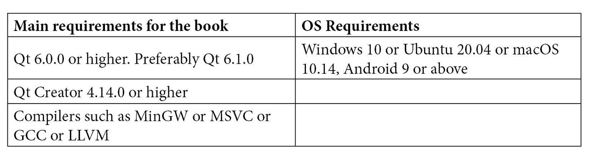

# 前言

Qt 是一个跨平台应用程序开发框架，旨在为桌面、嵌入式和移动平台创建出色的软件应用程序和令人惊叹的用户界面。它为开发人员提供了一套出色的工具，用于设计和构建出色的应用程序，而无需担心平台依赖性。

在本书中，我们将专注于 Qt 6，这是 Qt 框架的最新版本。本书将帮助您创建用户友好且功能性的图形用户界面。您还将通过提供外观和感觉在不同平台上保持一致的更美观的应用程序，获得与竞争对手的优势。

想要构建跨平台应用程序并拥有交互式 GUI 的开发人员将能够通过这本实用指南将他们的知识付诸实践。本书提供了一种实践方法来实现概念和相关机制，让您的应用程序可以立即投入运行。您还将获得关键概念的解释，并通过示例获得完整的学习体验。

您将首先探索不同平台上的 Qt 框架。您将学习如何在不同平台上配置 Qt，了解不同的 Qt 模块，学习核心概念，以及了解它们如何用于构建高效的 GUI 应用程序。您将能够在不同平台上构建、运行、测试和部署应用程序。您还将学习如何自定义应用程序的外观和感觉，并开发一个支持翻译的应用程序。除了学习完整的应用程序过程，本书还将帮助您识别瓶颈，并了解如何解决这些问题以增强应用程序的性能。

通过本书的学习，您将能够在不同平台上构建和部署自己的 Qt 应用程序。

# 这本书适合谁

本书旨在面向希望构建基于 GUI 的应用程序的开发人员和程序员。它也适用于之前使用过 C++编码的软件工程师。入门门槛并不高，所以如果你了解基本的 C++和面向对象编程的概念，那么你就可以踏上这段旅程。

此外，本书还可以帮助中级 Qt 开发人员，他们希望在其他平台上构建和部署应用程序。希望开始学习 Qt 编程的工作专业人士或学生，以及对 Qt 新手程序员，都会发现本书很有用。

# 本书涵盖内容

*第一章*，*介绍 Qt 6*，将向您介绍 Qt，并描述如何在计算机上设置 Qt。通过本章的学习，读者将能够从源代码构建 Qt，并在他们选择的平台上开始学习。

*第二章*，*介绍 Qt Creator*，向您介绍了 Qt Creator 集成开发环境及其用户界面。本章还将教您如何在 Qt Creator 中创建和管理项目。您将学习如何使用 Qt Creator 开发一个简单的“Hello World”应用程序，并了解不同的快捷键和实用技巧。

*第三章*，*使用 Qt Widgets 进行 GUI 设计*，探讨了 Qt Widgets 模块。在这里，您将学习创建 GUI 所需的各种小部件。您还将了解布局、Qt Designer，并学习如何创建自定义控件。本章将帮助您使用 Qt 开发您的第一个 GUI 应用程序。

*第四章*，*Qt Quick 和 QML*，介绍了 Qt Quick 和 QML 的基础知识，Qt Quick Controls，Qt Quick Designer，Qt Quick Layouts 和基本的 QML 脚本。在本章中，您将学习如何使用 Qt Quick 控件以及如何将 C++代码与 QML 集成。通过本章的学习，您将能够使用 QML 创建具有流畅用户界面的现代应用程序。

*第五章*, *跨平台开发*，探讨了使用 Qt 进行跨平台开发。您将了解 Qt Creator 中的不同设置。在本章中，您将能够在您喜爱的桌面和移动平台上运行示例应用程序。

*第六章*, *信号和槽*，深入介绍了信号和槽机制。您将能够在不同的 C++类之间以及在 C++和 QML 之间进行通信。您还将了解事件、事件过滤器和事件循环。

*第七章*, *模型视图编程*，介绍了 Qt 中的模型/视图架构及其核心概念。在这里，您将能够编写自定义模型和委托。您可以使用这些内容在基于 Qt Widget 或 Qt Quick 的 GUI 应用程序上显示所需的信息。

*第八章*, *图形和动画*，介绍了 2D 图形和动画的概念。您将学习如何使用绘图 API 在屏幕上绘制不同的形状。我们还将讨论使用 Qt 的图形视图框架和场景图表示图形数据的可能性。本章将指导您创建引人注目的用户界面动画。本章还涉及状态机框架。

*第九章*, *测试和调试*，探讨了 Qt 应用程序的不同调试技术。您将在本章中了解单元测试和 Qt 测试框架。我们还将讨论如何在 Qt 测试中使用 Google 测试框架，并了解可用的 Qt 工具和 GUI 特定的测试技术。

*第十章*, *部署 Qt 应用程序*，讨论了软件部署的重要性。您将学习如何在各种平台上部署 Qt 应用程序，包括桌面和移动平台。您将了解可用的部署工具和创建安装程序包的步骤。

*第十一章*, *国际化*，介绍了国际化。Qt 提供了优秀的支持，可以将 Qt Widgets 和 Qt Quick 应用程序翻译成本地语言。在本章中，您将学习如何制作支持多语言的应用程序。您还将了解内置工具和制作翻译感知应用程序的各种考虑因素。

*第十二章*, *性能考虑*，介绍了性能优化技术以及如何在 Qt 编程环境中应用这些技术。在这里，我们将讨论不同的性能分析工具，以诊断性能问题，特别集中在 Windows 上可用的工具。在本章中，您将学习如何使用 QML Profiler 对性能进行分析并对代码进行基准测试。本章还将帮助您编写高性能优化的 QML 代码。

# 为了充分利用本书

我们将只使用开源软件，因此您不需要购买任何许可证。随着我们逐渐进行每一章，我们将介绍安装程序和详细信息。要安装所需的软件，您需要一个功能齐全的互联网连接和台式电脑或笔记本电脑。除此之外，在开始本书之前，没有特定的软件要求。



**重要提示**

对于 Android 设置，您将需要以下内容：

OpenJDK 8 (JDK-8.0.275.1)

Android SDK 4.0

NDK r21 (21.3.6528147)

Clang 工具链

Android OpenSSL

如果您使用本书的数字版本，我们建议您自己输入代码或通过 GitHub 存储库访问代码（链接在下一节中提供）。这样做将有助于避免与复制和粘贴代码相关的潜在错误。

所有代码示例都是在 Windows 平台上使用 Qt 6 进行测试的。如果您使用 Qt 5，可能会出现失败。但是，它们也应该适用于将来的版本发布。请确保您安装到计算机上的版本至少是 Qt 6.0.0 或更高版本，以便代码与本书兼容。

# 下载示例代码文件

您可以从 GitHub 上下载本书的示例代码文件，网址为[`github.com/PacktPublishing/Cross-Platform-Development-with-Qt-6-and-Modern-Cpp`](https://github.com/PacktPublishing/Cross-Platform-Development-with-Qt-6-and-Modern-Cpp)。此外，您还可以在上述 GitHub 链接中找到一些具有 C++17 特性的额外示例。如果代码有更新，将在现有的 GitHub 存储库上进行更新。

我们还提供了来自我们丰富书籍和视频目录的其他代码包，可在[`github.com/PacktPublishing/`](https://github.com/PacktPublishing/)上找到！

# 下载彩色图片

我们还提供了一个 PDF 文件，其中包含本书中使用的屏幕截图/图表的彩色图片。您可以在此处下载：`static.packt-cdn.com/downloads/9781800204584_ColorImages.pdf`。

# 使用的约定

本书中使用了许多文本约定。

`文本中的代码`：表示文本中的代码词、数据库表名、文件夹名、文件名、文件扩展名、路径名、虚拟 URL、用户输入和 Twitter 用户名。例如："通常，`exec()` 方法用于显示对话框。"

代码块设置如下：

```cpp

    QMessageBox messageBox;
    messageBox.setText("This is a simple QMessageBox.");
    messageBox.exec(); 
```

当我们希望引起您对代码块的特定部分的注意时，相关行或项目将以粗体显示：

```cpp

    QMessageBox messageBox;
    messageBox.setText("This is a simple QMessageBox.");
    messageBox.exec(); 
```

任何命令行输入或输出都以以下形式书写：

```cpp
> lrelease *.ts
```

**粗体**：表示新术语、重要单词或屏幕上看到的单词。例如，菜单中的单词或对话框中的单词会以此形式出现在文本中。例如："最后一步是构建并运行应用程序。在 Qt Creator 中点击**运行**按钮。"

提示或重要说明

会显示为这样。
