# 第一章：介绍 Qt 6

**Qt**（发音为*cute*，而不是*que-tee*）是一个跨平台应用程序开发框架，旨在为桌面、嵌入式和移动平台创建具有统一**用户界面**（**UI**）的优秀软件应用程序。它为开发人员提供了一套强大的工具，设计和构建出色的应用程序，而无需担心平台依赖性。在本章中，您将学习有关该框架的基础知识、其历史以及如何在不同平台上安装 Qt。您将了解 Qt 是什么，以及为什么使用它是有益的。在本章结束时，您将能够安装 Qt 并在您选择的平台上开始使用。

在本章中，我们将涵盖以下主要主题：

+   介绍 Qt

+   使用 Qt 的原因

+   下载和安装 Qt

+   从源代码构建 Qt 6

# 技术要求

要开始使用，您应该有一台运行 Windows、Linux 或 macOS 的台式机或笔记本电脑。请使用更新的 Windows 10 或 Ubuntu 20.04 **长期支持**（**LTS**）。或者，使用最新版本的 macOS（高于 macOS 10.14），如 macOS Catalina。

为了使您的**集成开发环境**（**IDE**）运行顺畅，您的系统应至少配备英特尔酷睿 i5 处理器，以及至少 4**GB**的**随机存取存储器**（**RAM**）。

您需要有一个活动的互联网连接来下载和安装 Qt。作为先决条件，您还应该熟悉 C++，因为 Qt 需要 C++编程知识。

# 介绍 Qt

Qt 是一个用于桌面、嵌入式和移动平台的跨平台软件开发框架。它遵循*少写代码，创造更多，随处部署*的理念。它支持 Windows、Linux、macOS、VxWorks、QNX、Android、iOS 等平台。该软件还支持来自 NXP、Renesas 和 STMicroelectronics 的多个**微控制器单元**（**MCUs**），这些单元在裸机或 FreeRTOS 上运行。

Qt 诞生的初衷是为了提供统一的**图形用户界面**（**GUI**），在不同平台上具有相同的外观、感觉和功能。Qt 通过提供一个框架来编写代码一次，并确保它在其他平台上以最少或没有修改的方式运行来实现这一目标。它不是一种编程语言，而是用 C++编写的框架。Qt 框架和工具在开源和商业许可下都有双重许可。

Qt 使用模块化方法将相关功能组合在一起。Qt Essentials 是所有平台上 Qt 的基础。这些模块是通用的，对大多数基于 Qt 的应用程序都很有用。基本模块可供开源使用。Qt Essentials 模块的示例包括 Qt Core、Qt GUI、Qt QML、Qt Widgets 等。还有一些特定用途的附加模块，提供特定功能并带有特定的许可义务。附加模块的示例包括 Qt 3D、Qt Bluetooth、Qt Charts、Qt Data Visualization 等。此外，还有增值模块，如 Qt Automotive Suite、Qt for Device Creation 和 Qt for MCUs 等，可在商业许可下使用。

要了解更多关于不同 Qt 模块的信息，请访问[`doc.qt.io/qt-6/qtmodules.html`](https://doc.qt.io/qt-6/qtmodules.html)。

Qt 于 1995 年发布供公众使用。自那时以来，有许多改进和重大变化。Qt 6 是 Qt 的新主要版本。它的主要目标是为 2020 年及以后的要求做好准备，删除过时的模块，并更易于维护。基于这一重点，Qt 6 中存在着一些架构变化，可能会破坏与早期版本的某些程度的向后兼容性。

Qt 6 中的一些基本修改如下：

+   引入强类型

+   JavaScript 作为**Qt 建模语言**（**QML**）的可选功能

+   删除 QML 版本

+   在 QObject 和 QML 之间删除重复的数据结构

+   避免创建运行时数据结构

+   将 QML 编译成高效的 C++和本机代码

+   支持隐藏实现细节

+   更好地集成工具

既然我们已经介绍了基础知识，让我们来看看使用 Qt 的主要原因…

# 使用 Qt 的原因

Qt 是一个模块化的跨平台应用程序开发框架。关于 Qt 最大的误解是很多人认为它是一个 GUI 框架。然而，Qt 远不止是一个 GUI 框架。它不仅包括一个 GUI 模块，还包括一组模块，使应用程序开发更快速、更容易在各种平台上扩展。使用 Qt 的最大好处是它能够为各种平台提供可移植性。以下是使用 Qt 的一些优势：

+   您可以为您的客户创建令人难以置信的用户体验，并通过 Qt 提升您的公司品牌。

+   跨平台开发既节省时间又节省金钱。您可以使用相同的代码库针对多个平台进行开发。

+   Qt 以使 C++易于使用和访问而闻名。使用 Qt，开发人员可以轻松创建具有流畅 UI 的高性能、可扩展的应用程序。

+   由于开源模型，该框架是未来的保障，同时拥有一个伟大的生态系统。

+   它进一步支持不同的编程语言，是一个非常灵活和可靠的框架。因此，有很多大公司如 Adobe、微软、三星、AMD、惠普、飞利浦和 MathWorks 都在他们的应用程序中使用 Qt。许多开源项目如 VLC（以前称为 VideoLAN 客户端）、Open Broadcaster Software（OBS）和 WPS Office（其中 WPS 代表 Writer、Presentation 和 Spreadsheets）也是基于 Qt 构建的。

Qt 的核心价值如下所述：

+   跨平台性质

+   高度可扩展

+   非常易于使用

+   内置世界一流的应用程序编程接口（API）、工具和文档

+   可维护、稳定和兼容

+   庞大的用户社区

无论您是业余爱好者、学生还是为公司工作，Qt 都提供了很大的灵活性，可以根据您的需求使用其模块。许多大学正在将 Qt 作为他们的课程科目之一。因此，Qt 是程序员开始构建具有现成功能的新应用程序的绝佳选择。让我们从在您的计算机上下载并安装 Qt 6 开始。

# 下载和安装 Qt

有多种方式可以在您的系统上安装 Qt 框架和工具。您可以从 Qt 网站下载在线或离线安装程序，也可以自己构建源代码包。Qt 建议首次安装使用在线安装程序，以及使用 Qt Maintenance Tool 进行后续安装的修改。

安装程序允许您下载和安装以下组件：

+   Qt 库

+   Qt Creator IDE

+   文档和示例

+   Qt 源代码

+   附加模块

在线安装程序允许您根据所选择的许可证选择 Qt 的开源或商业版本、工具和附加模块进行安装。在线安装程序不包含 Qt 组件，但它是一个下载客户端，用于下载所有相关文件。下载完成后，您可以进行安装。您需要一个 Qt 帐户来下载和安装 Qt。商业 Qt 的评估版本为您提供免费试用期访问权限，包括所有商业套餐和官方 Qt 支持。安装程序要求您使用 Qt 帐户登录。如果您没有 Qt 帐户，可以在安装过程中注册。安装程序从 Qt 服务器获取附加到帐户的许可证，并根据您的许可证列出模块。如果您是 Qt 的新手，我们建议您从开源版本开始。

离线安装程序是一个特定于平台的软件包，其中包含了平台相关的所有 Qt 模块和附加组件。由于官方政策的变化，自 Qt 5.15 起不再提供开源离线安装程序。如果您有商业许可证，那么您可以在安装过程中提供凭据。您可以在您的**Qt 帐户**Web 门户中找到您的许可密钥。

您可以从以下链接下载：

+   **开源**：[`www.qt.io/download-open-source`](https://www.qt.io/download-open-source)

+   **商业**：[`www.qt.io/download`](https://www.qt.io/download)

+   **离线**：[`www.qt.io/offline-installers`](https://www.qt.io/offline-installers)

重要提示

Qt 公司为用户提供了双重许可选项。作为初学者，您可以从开源许可证开始探索 Qt。如果您为公司工作，那么请与您的经理或**信息技术**（**IT**）或法律团队讨论获取商业许可证或了解法律义务。您可以在[`www.qt.io/licensing/`](https://www.qt.io/licensing/)了解有关 Qt 许可的更多信息。

## 下载 Qt

让我们开始将 Qt 下载到您的计算机上，步骤如下：

1.  首先，访问[`www.qt.io/download`](https://www.qt.io/download)下载页面。

1.  单击右上角的“下载。尝试。购买。”按钮。您将在此处看到不同的下载选项。

1.  如果您想尝试商业版本，请单击“尝试 Qt”部分。如果您已经有 Qt 帐户，那么您可以在“现有客户”部分登录帐户。

1.  考虑到您是 Qt 的新手，我们将从开源版本开始。单击“转到开源”按钮，如下截图所示：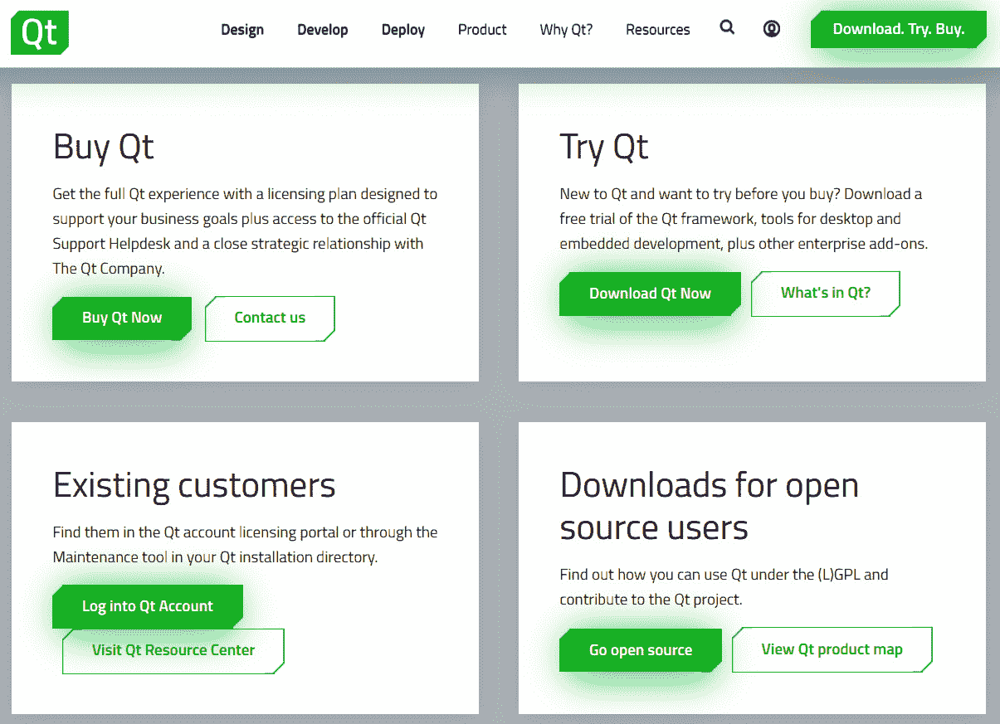

图 1.1 - Qt 网站下载选项

1.  在下一个屏幕上，您将找到“下载 Qt 在线安装程序”按钮。单击它以继续到下载链接。

1.  网页将自动从浏览器中检测到底层平台详细信息，并向您显示“下载”文件夹。

接下来，让我们从 Windows 平台上的安装过程开始。

## 在 Windows 上安装 Qt

现在，让我们在 Windows 上开始安装过程！请按照以下步骤进行：

1.  您将在下载文件夹中找到一个名为`qt-unified-windows-x86-%VERSION%-online.exe`的文件。双击可执行文件，您将看到一个“欢迎”屏幕。

1.  单击“下一步”按钮，将出现凭据屏幕，要求您使用 Qt 帐户登录。如果您没有帐户，那么您可以在同一页上注册，如下截图所示：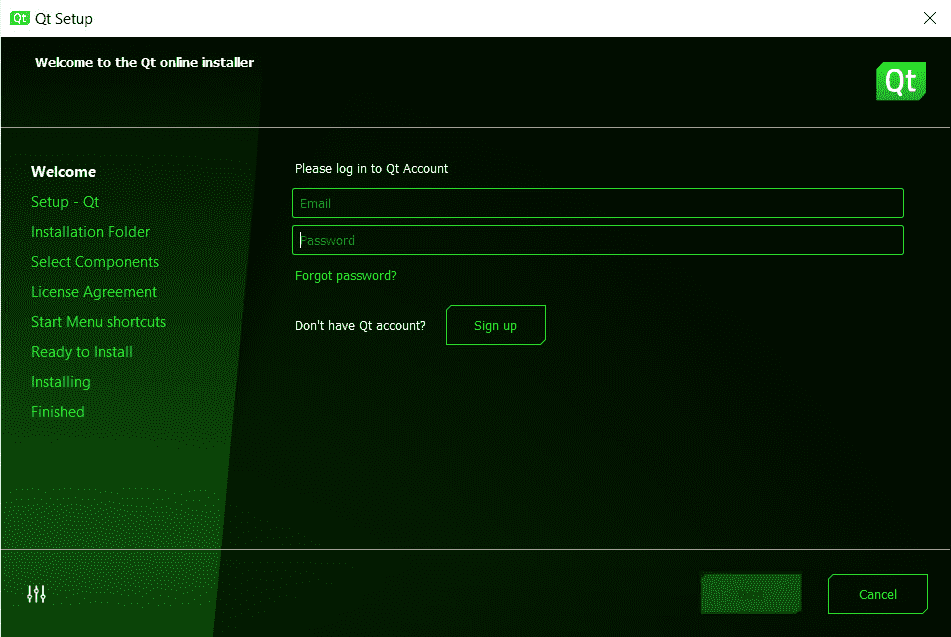

图 1.2 - 安装程序的登录屏幕

1.  在下一个屏幕上，您将看到与开源使用义务协议相关的选项。如果您使用商业许可证进行安装，您将不会看到此屏幕。单击第一个复选框，表示**我已阅读并批准使用开源 Qt 的义务**，并承认您不会将 Qt 用于商业目的。确保您阅读了协议中提到的条款和条件！然后，单击“下一步”按钮。

1.  下一个屏幕将为您提供与在 Qt Creator 中跟踪和共享匿名数据相关的选项。您可以根据自己的喜好允许或禁用这些选项。然后，单击“下一步”按钮，以继续到下一个屏幕。

1.  在下一个屏幕上，您可以指定安装路径。您可以继续使用默认路径，或者如果默认驱动器上没有足够的空间，可以更改为任何其他路径。您还可以选择是否要通过选择底部的复选框选项将常见文件类型与 Qt Creator 关联起来。单击“下一步”按钮。

1.  接下来，您将看到一个列表，您可以在其中选择要在系统上安装的 Qt 版本。您可以简单地使用默认选项。如果您不需要某些组件，则可以取消选择它们以减小下载的大小。您随时可以使用**维护工具**更新 Qt 组件。要完成安装过程，请点击**下一步**按钮。组件选择屏幕如下所示：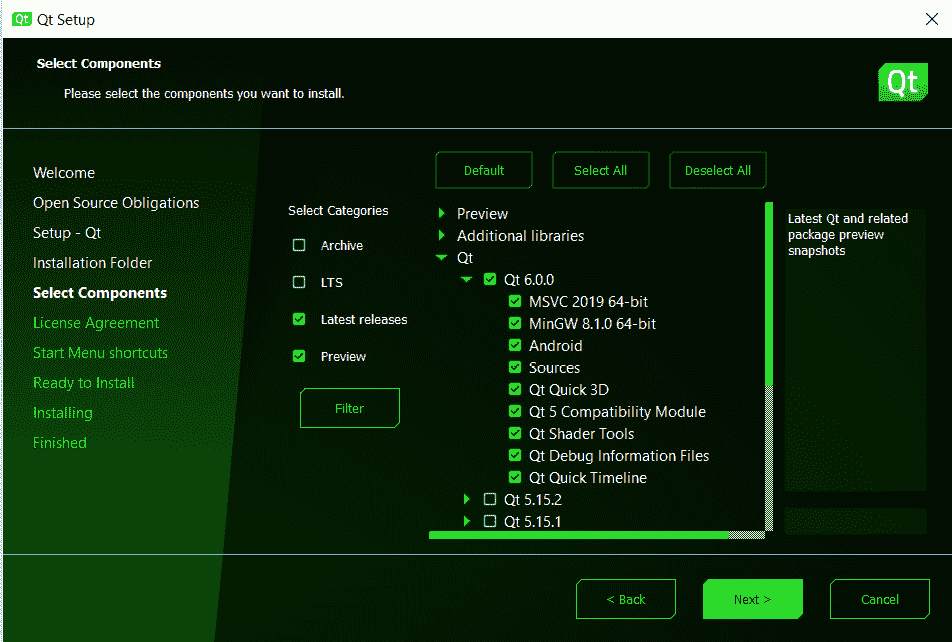

图 1.3 - 安装程序的组件选择屏幕

1.  在下一个屏幕上，您将看到许可协议。点击第一个单选按钮，上面写着**我已阅读并同意许可协议中包含的条款**。再次确保您阅读了许可协议中提到的条款和条件，然后点击**下一步**按钮。

1.  在下一个屏幕上，您可以在 Windows 上创建**开始**菜单快捷方式。此屏幕将不适用于其他平台。完成后，点击**下一步**按钮。

1.  现在，Qt 已经准备好在您的系统中安装。确保您有可用的互联网连接和数据余额。点击**安装**按钮开始安装。下载过程将根据您的互联网速度而花费时间。一旦所需文件下载完成，安装程序将自动将它们安装在先前选择的路径中。

1.  安装完成后，安装程序将为**维护工具**创建一个条目，以后将帮助您对库进行更改。点击**下一步**按钮进入安装程序的最后一个屏幕。

1.  为了完成安装过程，点击**完成**按钮。如果您留下了**启动 Qt Creator**复选框选中，则 Qt Creator 将被启动。我们将在下一章中更详细地讨论这个问题。现在，Qt 已经准备好在您的 Windows 机器上使用。点击**完成**按钮退出向导。

## 在 Linux 上安装 Qt

现在，让我们在最新的**LTS 版本 Linux**上安装 Qt 框架，例如 Ubuntu 20.04、CentOS 8.1 或 openSUSE 15.1。我们将专注于最受欢迎的 Linux 发行版 Ubuntu。您可以按照之前提到的相同步骤从 Qt 网站下载在线安装程序。

在 Ubuntu 上，您将获得一个安装程序文件，例如`qt-unified-linux-x64-%VERSION%-online.run`，其中`%VERSION%`是最新版本，例如：`qt-unified-linux-x86-4.0.1-1-online.run`。

1.  在执行下载的文件之前，您可能需要给予写入权限。要做到这一点，打开终端并运行以下命令：

```cpp
$ chmod +x qt-unified-linux-x64-%VERSION%-online.run
```

1.  您可以通过双击下载的安装程序文件来开始安装过程。安装需要超级用户访问权限。在安装过程中，您可能需要在授权对话框中输入密码。您也可以从终端运行安装程序，如下所示：

```cpp
$ ./qt-unified-linux-x64-%VERSION%-online.run
```

1.  您将看到与 Windows 平台相似的屏幕。除了**操作系统**（**OS**）特定的标题栏更改外，所有屏幕在 Ubuntu 或类似的 Linux 版本中的安装过程中保持不变。

在撰写本书时，由于各自的维护者已经退出，Qt 6 在 Ubuntu 或 Debian 上没有可用的软件包。因此，您可能无法从终端获取 Qt 6 软件包。

## 在 macOS 上安装 Qt

如果您是 macOS 用户，您也可以按照之前讨论的方式进行安装。您可以按照之前提到的相同步骤从 Qt 网站下载在线安装程序。

您将获得一个安装程序文件，例如`qt-unified-mac-x64-%VERSION%-online.dmg`，其中`%VERSION%`是最新版本（例如`qt-unified-mac-x64-4.0.1-1-online.dmg`）。

Qt 依赖于 Xcode。要在 Mac 上安装 Qt，您需要在计算机上安装 Xcode，否则它将拒绝安装。如果您是苹果开发人员，则您的 Mac 可能已安装 Xcode。如果您的计算机上没有安装 Xcode，则可以继续安装 Xcode 的**命令行工具**而不是 Xcode。这将节省计算机上的时间和存储空间。

1.  首先，在终端上键入以下命令：

```cpp
$ xcode-select --install    
```

1.  如果终端显示以下输出，则您的系统已准备好进行下一步操作：

```cpp
xcode-select: error: command line tools are already installed, use
"Software Update" to install updates
```

1.  下一步是安装 Qt 框架。双击安装程序文件以启动安装界面。

1.  如果安装程序仍然抱怨 Xcode 未安装，则继续单击**确定**直到消息永久消失。记住安装路径。安装完成后，您就可以在计算机上使用 Qt 了。

在 macOS 上有关 Qt 的进一步说明可以在以下链接找到：

[`doc.qt.io/qt-6/macos.html`](https://doc.qt.io/qt-6/macos.html)

## 更新或删除 Qt

安装 Qt 后，您可以使用安装目录下的**维护工具**修改组件，包括更新、添加和删除组件。对于所有桌面平台，目录结构保持不变。安装目录包含文件夹和文件，如下屏幕截图所示（在 Windows 上）：

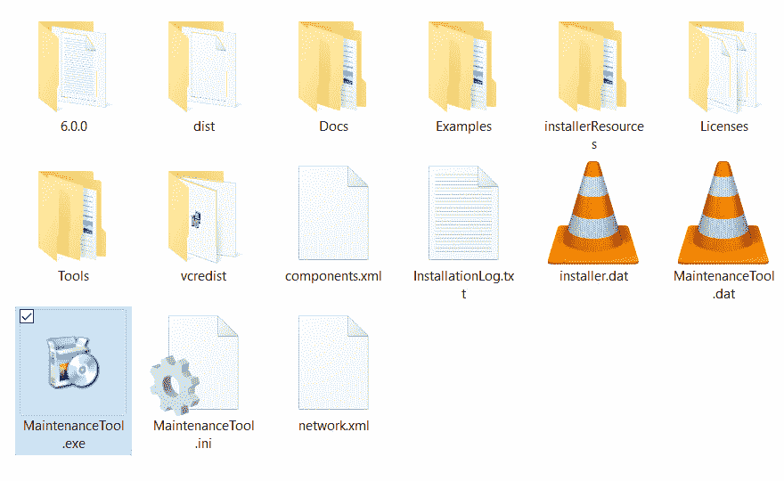

图 1.4 - 安装文件夹中的维护工具

让我们开始维护过程！您可以使用**维护工具**添加、删除和更新模块。请按照以下步骤进行：

1.  单击`MaintenanceTool.exe`可执行文件以启动维护界面。单击**下一步**按钮，将出现凭据屏幕，要求您使用 Qt 帐户登录。登录详细信息将从上次登录会话中预填。您可以单击**下一步**以添加或更新组件，或选择**仅卸载**复选框以从系统中删除 Qt。以下屏幕截图显示了凭据屏幕的外观：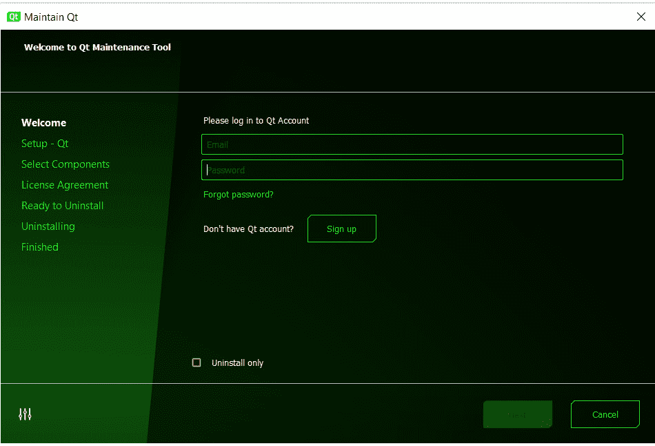

图 1.5 - 维护工具的欢迎屏幕

1.  登录后，工具将向您提供添加、删除或更新组件的选项，如下屏幕截图所示。单击**下一步**按钮继续：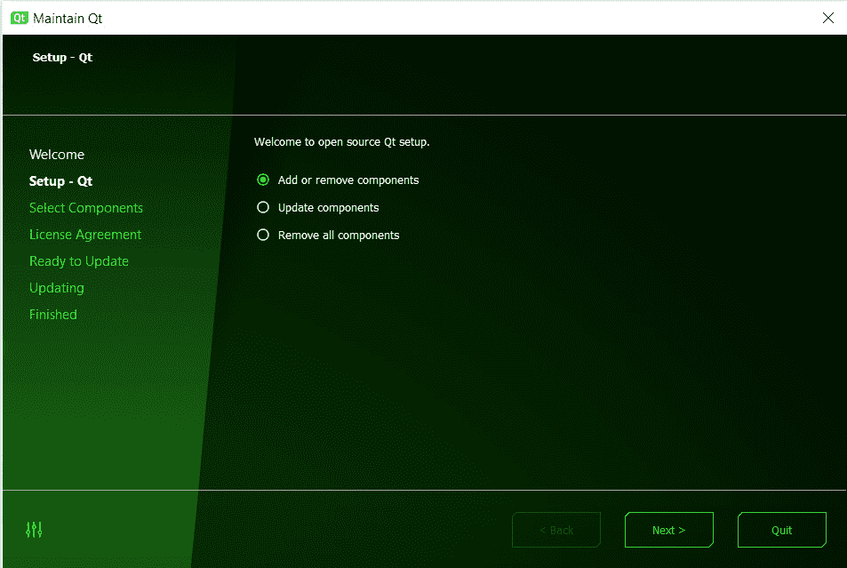

图 1.6 - 维护工具的设置屏幕

1.  在下一个屏幕上，您可以从最新版本或存档版本中选择新组件。您可以单击**筛选器**按钮根据需要筛选版本。您还可以从组件列表中添加新的特定于平台的组件，例如 Android。如果组件已存在并取消选中它，则在更新期间将从桌面中删除它。选择组件后，单击**下一步**按钮。以下屏幕截图显示了组件选择屏幕的外观：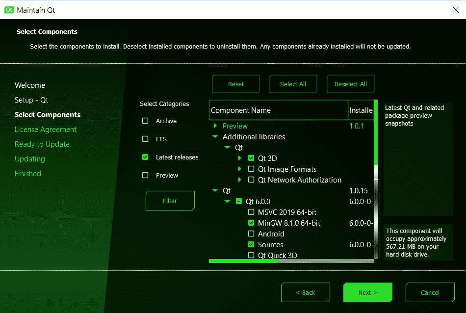

图 1.7 - 组件选择屏幕

1.  然后您将遇到更新屏幕。此屏幕将告诉您安装需要多少存储空间。如果存储空间不足，则可以返回并删除一些现有组件。单击**更新**按钮开始该过程，如下屏幕截图所示：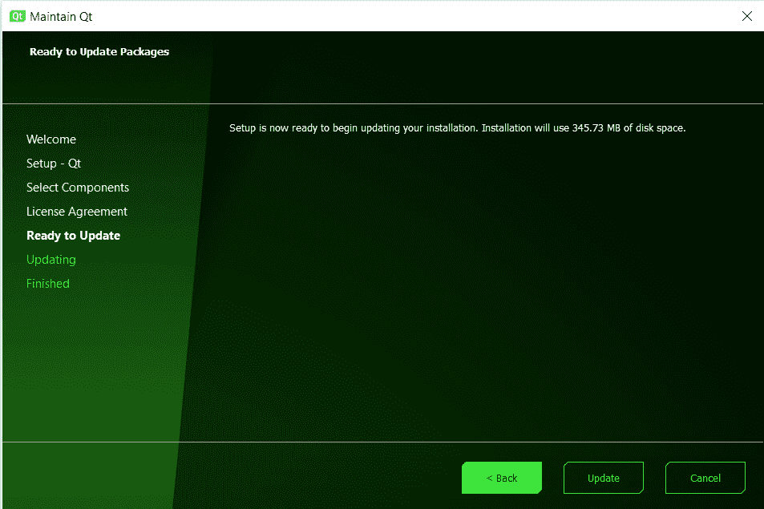

图 1.8 - 维护工具的准备更新屏幕

1.  您可以通过单击**取消**按钮中止更新安装过程。Qt 会在中止安装过程之前警告您并要求确认，如下截图所示。一旦过程中止，单击**下一步**按钮退出向导：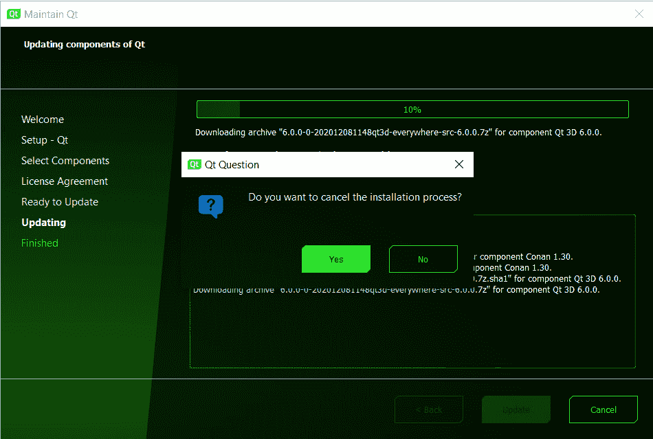

图 1.9 – 取消对话框

1.  再次启动**维护工具**，以从最新版本更新现有组件。您可以单击**退出**按钮退出**维护工具**。请等待安装程序从远程存储库获取元信息。单击**下一步**按钮查看可用组件。更新选项如下截图所示：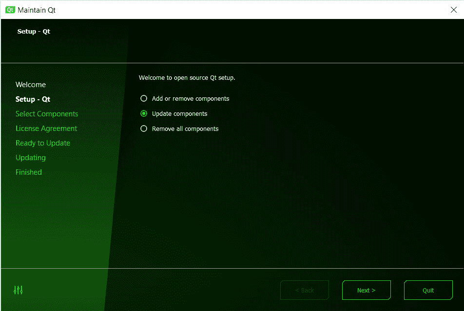

图 1.10 – 维护工具中的更新选项

1.  接下来，您可以从复选框中选择要更新的组件。您可以选择全部更新，也可以选择性更新。安装程序将显示更新所需的存储空间，如下截图所示。单击**下一步**进入更新屏幕并开始更新。然后，在下一个屏幕上，单击**更新**按钮下载更新包：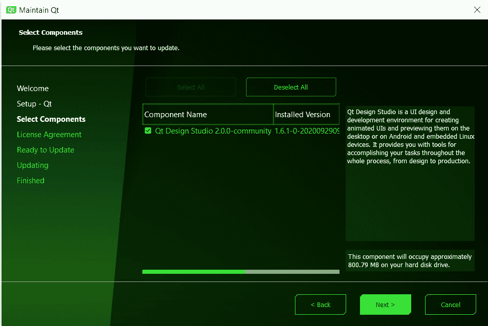

图 1.11 – 可用于更新的组件

1.  安装完成后，安装程序会为维护工具创建条目，以帮助您稍后对库进行更改。如下截图所示。单击**下一步**按钮进入安装程序的最后一个屏幕：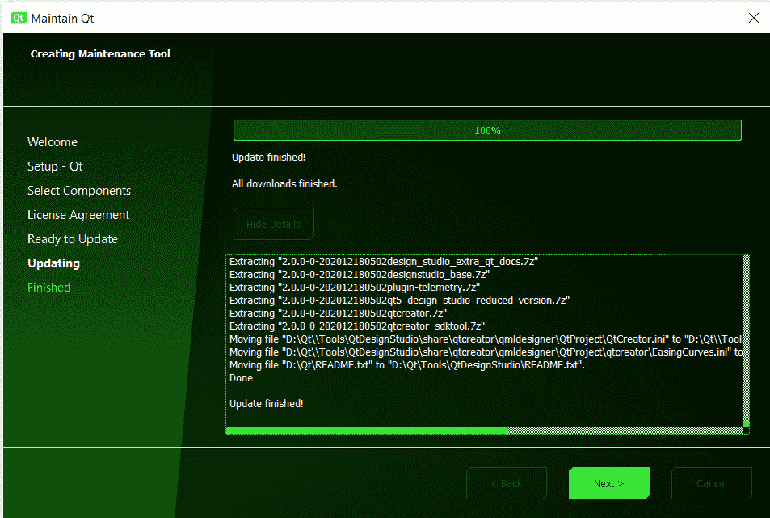

图 1.12 – 维护工具中的更新完成屏幕

1.  在最后一个屏幕上，您将看到**重新启动**和**完成**按钮。单击**完成**按钮退出 Qt 向导。

1.  同样，您可以重新启动或启动**维护工具**，并选择**删除所有组件**单选按钮。单击**下一步**按钮开始卸载过程，如下截图所示：

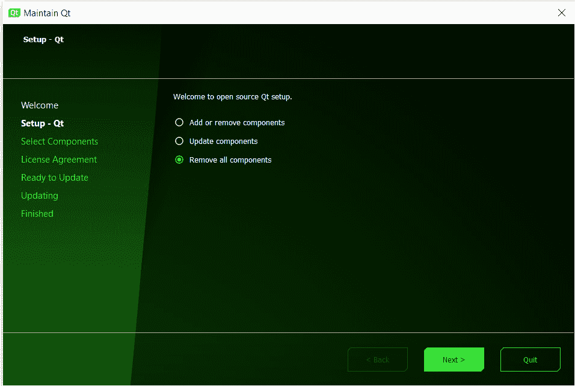

图 1.13 – 维护工具中的删除选项

请注意，单击**卸载**按钮后，所有 Qt 组件将从系统中删除；如果您想再次使用它们，您将需要重新安装 Qt。如果您不打算从系统中删除 Qt 组件，请单击**取消**，如下截图所示。如果您打算删除现有版本并使用更新版本的 Qt，则选择**添加或删除组件**选项，如前所述。这将删除旧的 Qt 模块并释放磁盘空间：

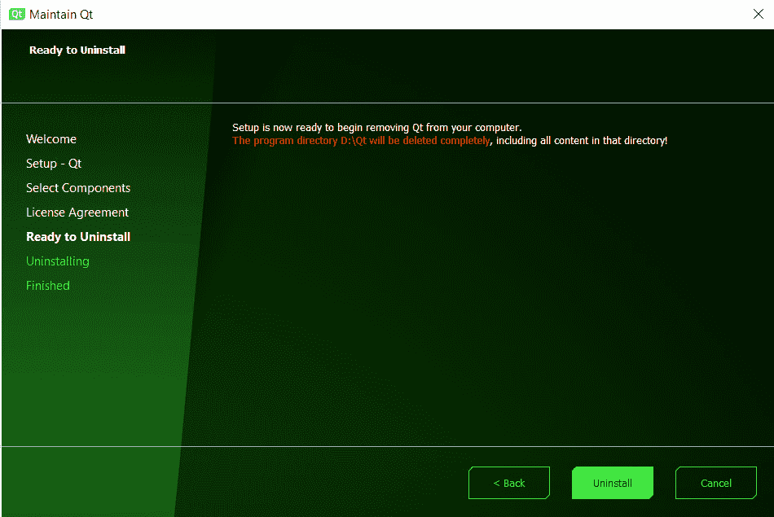

图 1.14 – 维护工具中的卸载屏幕

在本节中，我们了解了通过维护工具修改现有的 Qt 安装。现在，让我们学习如何从源代码构建和安装 Qt。

# 从源代码构建 Qt 6

如果您想自己构建框架和工具，或者尝试最新的未发布代码，那么您可以**从源代码构建 Qt**。如果您要从源代码开发特定的 Qt 版本，那么可以从官方发布链接下载 Qt 6 源代码，如下所示：[`download.qt.io/official_releases/qt/6.0/`](https://download.qt.io/official_releases/qt/6.0/).

如果您是商业客户，那么可以从 Qt 帐户门户下载**源代码包**。平台特定的构建说明将在接下来的小节中讨论。

您还可以从 GitHub 存储库克隆，并检出所需的分支。在撰写本书时，Qt 6 分支仍位于 Qt 5 超级模块内。您可以从以下链接克隆存储库：`git://code.qt.io/qt/qt5.git`。

`qt5.git`存储库可能会在未来更名为`qt.git`以便维护。请参考`QTQAINFRA-4200` Qt 票。有关如何从 Git 构建 Qt 的详细说明，请访问以下链接：[`wiki.qt.io/Building_Qt_6_from_Git`](https://wiki.qt.io/Building_Qt_6_from_Git)。

确保在您的机器上安装最新版本的 Git、Perl 和 Python。在进入下一节的特定于平台的说明之前，请确保有一个可用的 C++编译器。

## 在 Windows 上从源代码安装 Qt

要在 Windows 上从源代码安装 Qt 6，请按照以下步骤进行：

1.  首先，从 Git 或之前提到的开源下载链接下载源代码。您将得到一个压缩文件，名称为`qt-everywhere-src--%VERSION%.zip`，其中`%VERSION%`是最新版本（例如`qt-everywhere-src-6.0.3.zip`）。请注意，后缀如`-everywhere-src-`可能会在未来被移除。

1.  下载源代码存档后，将其解压缩到所需的目录，例如`C:\Qt6\src`。

1.  在下一步中，使用支持的编译器和所需的构建工具配置构建环境。

1.  然后，将`CMake`、`ninja`、`Perl`和`Python`的相应安装目录添加到您的`PATH`环境变量中。

1.  下一步是构建 Qt 库。要为您的机器配置 Qt 库，请在源目录中运行`configure.bat`脚本。

1.  在此步骤中，通过在命令提示符中输入以下命令来构建 Qt：

```cpp
>cmake --build . –parallel
```

1.  接下来，在命令提示符中输入以下命令以在您的机器上安装 Qt：

```cpp
>cmake --install .
```

您的 Windows 机器现在已经准备好使用 Qt。

要了解更多关于配置选项的信息，请访问以下链接：

[`doc.qt.io/qt-6/configure-options.html`](https://doc.qt.io/qt-6/configure-options.html)

详细的构建说明可以在以下链接找到：

[`doc.qt.io/qt-6/windows-building.html`](https://doc.qt.io/qt-6/windows-building.html)

## 在 Linux 上从源代码安装 Qt

要在 Linux 发行版上构建源包，请在终端上运行以下一组指令：

1.  首先，从 Git 或之前提到的开源下载链接下载源代码。您将得到一个压缩文件，名称为`qt-everywhere-src--%VERSION%.tar.xz`，其中`%VERSION%`是最新版本（例如`qt-everywhere-src-6.0.3.tar.xz`）。请注意，后缀如`-everywhere-src-`可能会在未来被移除。

1.  下载源代码存档后，解压缩存档并解压到所需的目录，例如`/qt6`，如下面的代码片段所示：

```cpp
$ cd /qt6
$ tar xvf qt-everywhere-opensource-src-%VERSION%.tar.xz 
$ cd /qt6/qt-everywhere-opensource-src-%VERSION%
```

1.  要为您的机器配置 Qt 库，请在源目录中运行`./configure`脚本，如下面的代码片段所示：

```cpp
$ ./configure
```

1.  要创建库并编译所有示例、工具和教程，请输入以下命令：

```cpp
$ cmake --build . --parallel
$ cmake --install .
```

1.  下一步是设置环境变量。在`.profile`（如果您的 shell 是`bash`、`ksh`、`zsh`或`sh`），添加以下代码行：

```cpp
PATH=/usr/local/Qt-%VERSION%/bin:$PATH
export PATH
```

在`.login`（如果您的 shell 是`csh`或`tcsh`），添加以下代码行：

```cpp
setenv PATH /usr/local/Qt-%VERSION%/bin:$PATH
```

如果您使用不同的 shell，请相应修改您的环境变量。Qt 现在已经准备好在您的 Linux 机器上使用。

Linux/X11 的详细构建说明可以在以下链接找到：

[`doc.qt.io/qt-6/linux-building.html`](https://doc.qt.io/qt-6/linux-building.html)

## 在 macOS 上从源代码安装 Qt

Qt 依赖于**Xcode**。要在 Mac 上安装 Qt，您需要在您的机器上安装 Xcode。如果您的机器上没有安装 Xcode，则可以继续安装 Xcode 的**命令行工具**：

1.  首先，在终端上输入以下命令：

```cpp
$ xcode-select --install    
```

1.  如果终端显示以下输出，则您的系统已准备好进行下一步：

```cpp
xcode-select: error: command line tools are already installed, use
"Software Update" to install updates
```

1.  要构建源包，请在终端上运行以下一组指令：

```cpp
$ cd /qt6
$ tar xvf qt-everywhere-opensource-src-%VERSION%.tar          
$ cd /qt6/qt-everywhere-opensource-src-%VERSION%
```

1.  要为您的 Mac 配置 Qt 库，请在源目录中运行`./configure`脚本，如下面的代码片段所示：

```cpp
$ ./configure  
```

1.  创建库，请运行`make`命令，如下所示：

```cpp
$ make
```

1.  如果`-prefix`在构建目录之外，则输入以下行以安装库：

```cpp
$ sudo make -j1 install
```

1.  下一步是设置环境变量。在`.profile`（如果您的 shell 是`bash`），添加以下代码行：

```cpp
PATH=/usr/local/Qt-%VERSION%/bin:$PATH
export PATH
```

在`.login`（如果您的 shell 是`csh`或`tcsh`），添加以下代码行：

```cpp
setenv PATH /usr/local/Qt-%VERSION%/bin:$PATH
```

您的计算机现在已准备好进行 Qt 编程。

macOS 的详细构建说明可以在这里找到：

[`doc.qt.io/qt-6/macos-building.html`](https://doc.qt.io/qt-6/macos-building.html)

在本节中，我们学习了如何在您喜爱的平台上从源代码安装 Qt。现在，让我们总结一下我们的学习。

# 摘要

本章介绍了 Qt 框架的基础知识以及它的用途。在这里，我们讨论了 Qt 的历史、不同的模块以及使用 Qt 的优势。我们还了解了不同的安装方法和许可义务，为不同的桌面平台上的 Qt 提供了逐步安装过程。现在，您的计算机已准备好探索 Qt。

在下一章中，我们将讨论 Qt Creator IDE。您将了解 IDE 的用户界面、不同的配置以及如何将其用于 Qt 项目。
