# 第二章：Qt Creator 简介

**Qt Creator**是 Qt 自己的**集成开发环境**（**IDE**），用于跨平台应用程序开发。在本章中，您将学习 Qt Creator IDE 的基础知识，以及 IDE 的**用户界面**（**UI**）。我们还将看看如何在 Qt Creator 中创建和管理项目。Qt 的这个模块涵盖了使用 Qt Creator 开发简单 Qt 应用程序的内容，包括开发人员的快捷方式和实用技巧。

更具体地说，我们将涵盖以下主要主题：

+   Qt Creator 基础知识

+   配置 IDE 和管理项目

+   用户界面

+   编写一个示例应用程序

+   高级选项

Qt Creator 可以通过许多有用的工具和示例使您更轻松地学习 Qt。您只需要最少的 IDE 知识即可开始。在本章结束时，您将熟悉 Qt Creator 的使用。您还将能够在您喜爱的桌面平台上构建和运行您的第一个 Qt 应用程序，并了解 IDE 中可用的高级选项，您将能够根据自己的喜好进行自定义。

# 技术要求

本章的技术要求与*第一章**，Qt 6 简介*相同。您将需要最新的 Qt 版本，即 Qt 6.0.0 MinGW 64 位，Qt Creator 4.13.0 或更高版本，以及 Windows 10、Ubuntu 20.04 LTS 或最新版本的 macOS（至少高于 macOS 10.13），如 macOS Catalina。Qt 支持较早版本的操作系统，如 Windows 8.1 或 Ubuntu 18.04。但是，我们建议您升级到首选操作系统的最新版本，以确保顺畅运行。在本章中，我们使用了来自 Windows 10 平台的屏幕截图。

# 探索 Qt Creator UI

Qt Creator 是由 Qt 公司生产的 IDE。它集成了多个工具，包括代码编辑器、**图形用户界面**（**GUI**）设计器、编译器、调试器、Qt Designer、Qt Quick Designer 和 Qt Assistant 等。

Qt Designer 帮助设计基于小部件的 GUI，而 Qt Quick Designer 提供了一个 UI，可以在设计模式下创建和编辑基于 QML 的 GUI。Qt Assistant 是一个集成的文档查看器，可以通过按下*F1*键打开与给定 Qt 类或函数相关的内容。

让我们开始启动 Qt Creator。二进制文件可以在`Qt\Tools\QtCreator\bin`中找到。您将看到一个类似于*图 2.1*所示的屏幕：

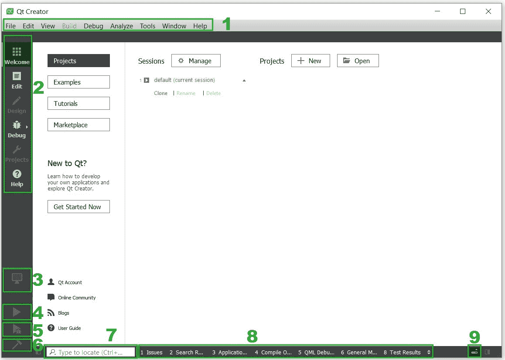

图 2.1 – Qt Creator 界面

您可以在 UI 中看到以下 GUI 部分：

1.  **IDE 菜单栏**：为用户提供了一个标准的窗口位置，以找到大多数应用程序特定功能。这些功能包括创建项目、打开和关闭文件、开发工具、分析选项、帮助内容以及退出程序的方法。

1.  **模式选择器**：此部分根据活动任务提供不同的模式。**欢迎**按钮提供打开示例、教程、最近的会话和项目的选项。**编辑**按钮打开代码窗口，并帮助导航项目。**设计**按钮根据 UI 文件的类型打开 Qt Designer 或 Qt Quick Designer。**调试**提供分析应用程序的选项。**项目**按钮帮助管理项目设置，**帮助**按钮用于浏览帮助内容。

1.  **套件选择器**：这有助于选择活动项目配置并更改套件设置。

1.  运行按钮：构建完成后，此按钮运行活动项目。

1.  **调试按钮**：这有助于使用调试器调试活动项目。

1.  构建按钮：用于构建活动项目。

1.  **定位器**：用于从任何打开的项目中打开文件。

1.  **输出窗格**：包括几个窗口，用于显示项目信息，如编译和应用程序输出。它还显示构建问题、控制台消息以及测试和搜索结果。

1.  **进度指示器**：此控件显示与运行任务相关的进度。

当您第一次启动 Qt Creator 时，您还可以从菜单栏中的**帮助** | **UI Tour**选项启动交互式 UI 导览，如*图 2.2*所示：

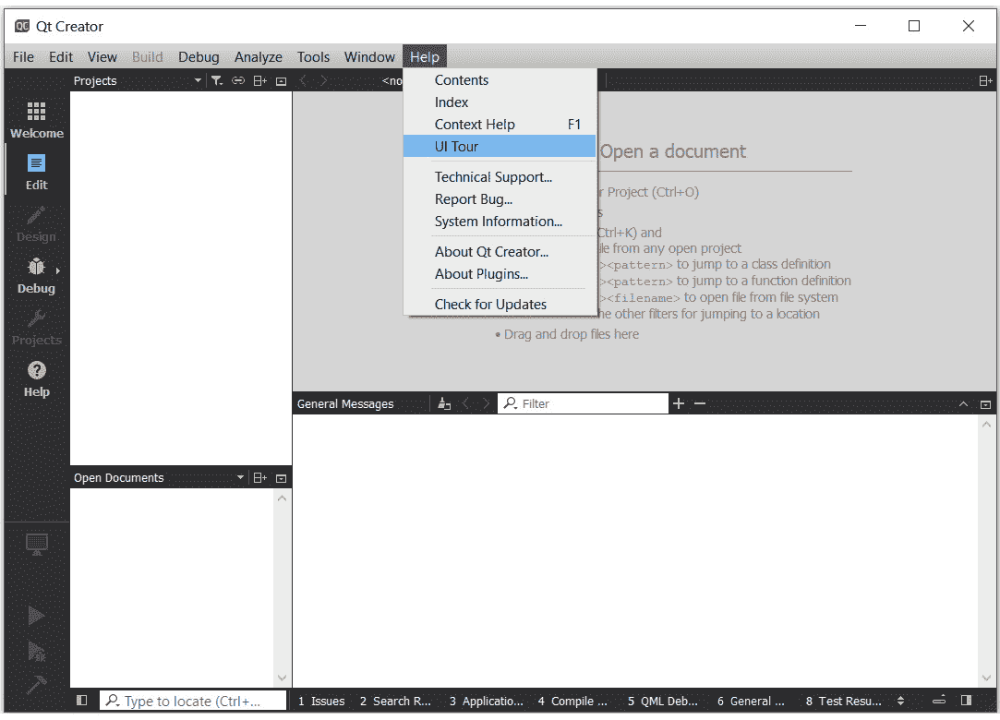

图 2.2 – Qt Creator UI 导览菜单选择

注意

如果按下*Alt*键，您将看到菜单标题中的下划线助记符字母。按下相应的键打开相应的上下文菜单。

在本节中，我们学习了 IDE 中的各个部分。在下一节中，我们将使用 Qt Creator IDE 构建一个简单的 Qt 应用程序。

# 构建一个简单的 Qt 应用程序

让我们从一个简单的*Hello World*项目开始。*Hello World*程序是一个非常简单的程序，显示**Hello World!**并检查 SDK 配置是否没有错误。这些项目使用最基本、非常简洁的代码。对于这个项目，我们将使用 Qt Creator 创建的项目骨架。

按照以下步骤构建您的第一个 Qt 应用程序：

1.  要在 Qt 中创建一个新项目，请单击菜单栏上的**文件**菜单选项，或按下*Ctrl* + *N*。或者，您也可以单击欢迎屏幕上的**+ 新建**按钮来创建一个新项目，如*图 2.3*所示：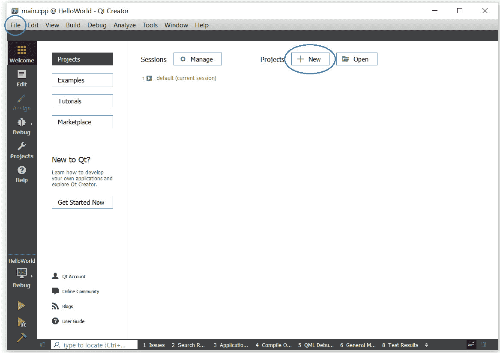

图 2.3 – 新项目界面

1.  接下来，您可以选择项目的模板。您可以创建不同类型的应用程序，包括控制台应用程序或 GUI 应用程序。您还可以创建非 Qt 项目以及库项目。在右上角的部分，您将看到一个下拉菜单，用于过滤特定于所需目标平台的模板。选择**Qt Widgets 应用程序**模板，然后单击**选择...**按钮：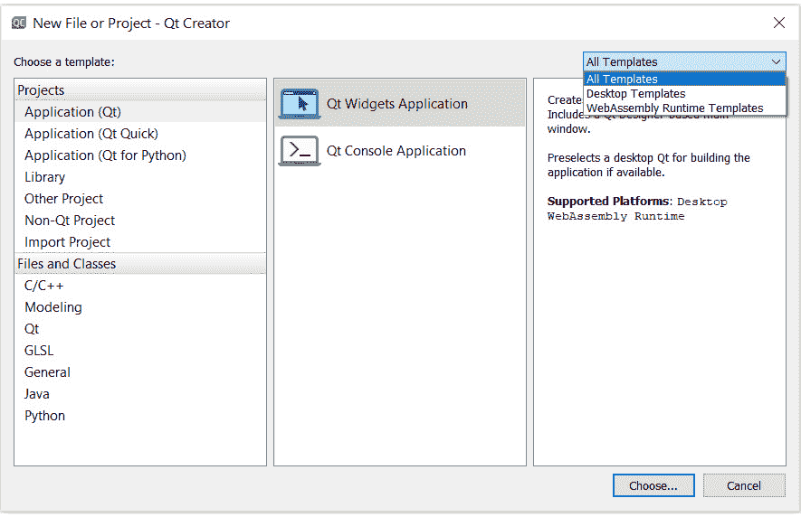

图 2.4 – 项目模板界面

1.  在下一步中，您将被要求选择项目名称和项目位置。您可以通过单击**浏览...**按钮导航到所需的项目位置。然后单击**下一步**按钮，进入下一个屏幕：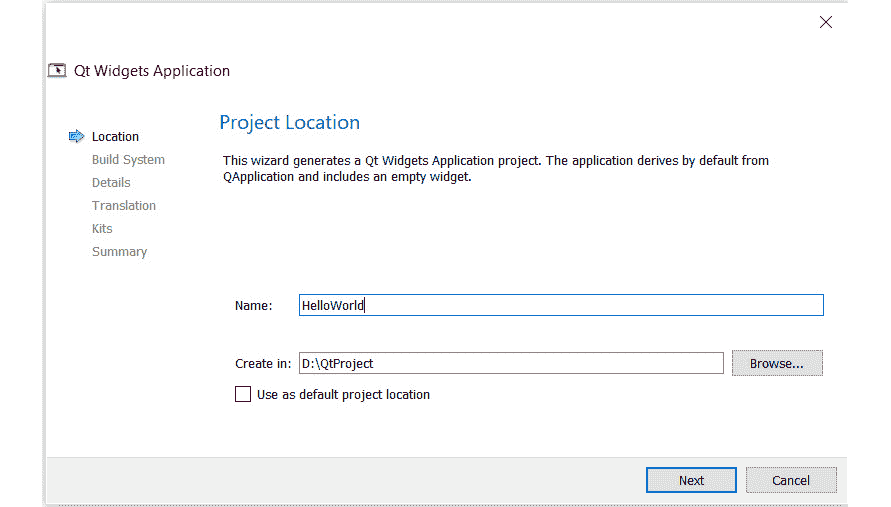

图 2.5 – 新项目位置屏幕

1.  您现在可以选择构建系统。默认情况下，将选择 Qt 自己的构建系统**qmake**。我们将在*第六章*中更多地讨论 qmake，*信号和槽*。点击**下一步**按钮，进入下一个屏幕：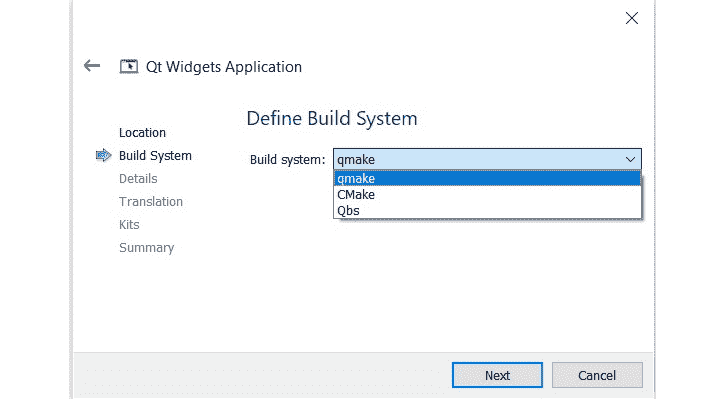

图 2.6 – 构建系统选择屏幕

1.  接下来，您可以指定类信息和要自动生成项目骨架的基类。如果您需要一个带有`MainWindow`功能的桌面应用程序，比如`menubar`、`toolbar`和`statusbar`，那么在*第三章**,* *使用 Qt Widgets 进行 GUI 设计*中选择`QMainWindow`。点击**下一步**按钮，进入下一个屏幕：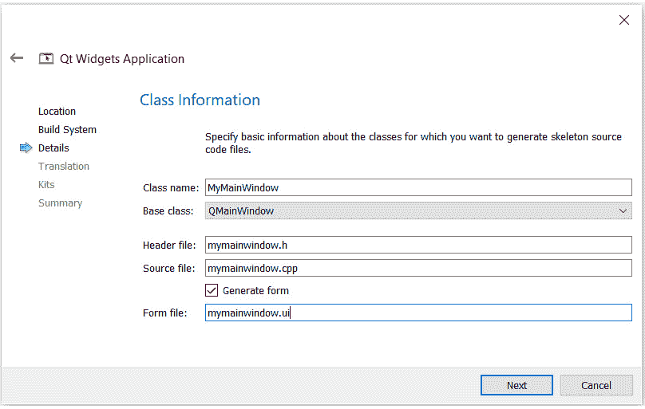

图 2.7 – 源代码骨架生成屏幕

1.  在下一步中，您可以指定翻译的语言。Qt Creator 带有*Qt Linguist*工具，允许您将应用程序翻译成不同的语言。您现在可以跳过这一步。我们将在*第十一章*中讨论**国际化**（**i18n**），*国际化*。点击**下一步**按钮，进入下一个屏幕：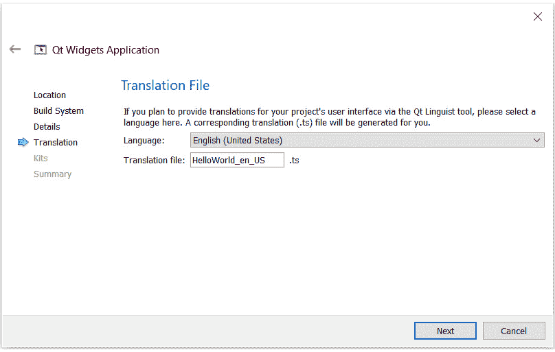

图 2.8 - 创建翻译文件屏幕

1.  在下一步中，您可以选择一个套件来构建和运行您的项目。要构建和运行项目，至少必须激活并可选择一个套件。如果您期望的套件显示为灰色，则可能存在一些套件配置问题。当您为目标平台安装 Qt 时，通常会自动配置开发目标的构建和运行设置。单击复选框以选择其中一个桌面套件，例如**Desktop Qt 6.0.0 MinGW 64 位**。单击**下一步**按钮以继续到下一个屏幕：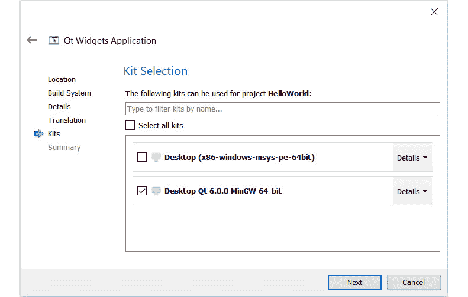

图 2.9 - 套件选择屏幕

1.  版本控制允许您或您的团队将代码更改提交到集中系统，以便每个团队成员都可以获取相同的代码，而无需手动传递文件。您可以将项目添加到安装在您的计算机上的版本控制系统中。Qt 在 Qt Creator IDE 中支持多个版本控制系统。您可以通过选择**<None>**来跳过此项目的版本控制。单击**完成**按钮以完成项目创建：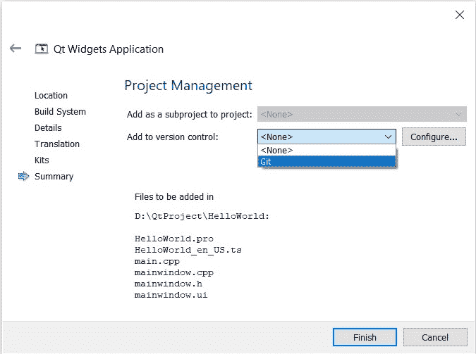

图 2.10 - 项目管理屏幕

1.  现在您将在编辑器窗口的左侧看到生成的文件。单击任何文件以在编码窗口中打开它，这是 Qt Creator 中最常用的组件。代码编辑器用于**编辑**模式。您可以在此窗口中编写、编辑、重构和美化代码。您还可以修改字体、字体大小、颜色和缩进。我们将在本章后面的*理解* *高级选项*部分中了解更多信息：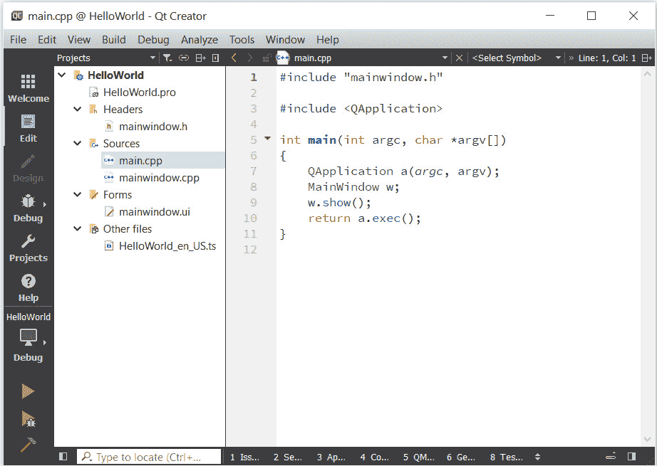

图 2.11 - 生成的文件和代码编辑器窗口

1.  现在您可以在项目文件夹中看到一个`.pro`文件。在当前项目中，`HelloWorld.pro`文件是项目文件。这包含了 qmake 构建应用程序所需的所有信息。此文件在项目创建期间自动生成，并以结构化方式包含相关详细信息。您可以在此文件中指定文件、资源和目标平台。如果对`.pro`文件内容进行任何修改，则需要再次运行 qmake，如*图 2.12*所示。让我们跳过修改此项目的内容：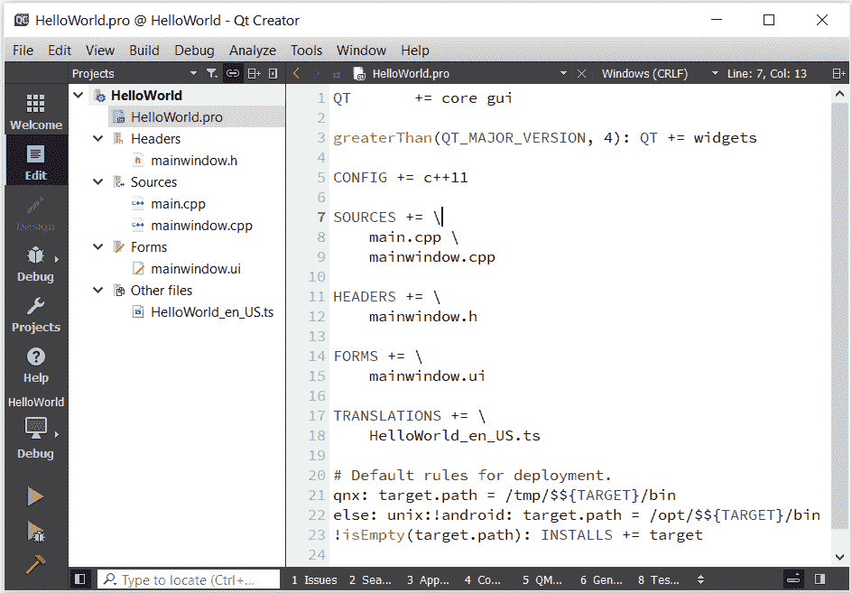

图 2.12 - 项目文件的内容

1.  您可以在编辑器窗口的左侧找到一个带有`.ui`扩展名的表单文件。双击打开`mainwindow.ui`文件。在这里，您可以看到文件在不同的界面下打开：Qt Designer。您可以看到模式选择面板已切换到**设计**模式。我们将在下一章中更多地讨论 Qt Designer。

1.  现在，将**Label**控件从**显示小部件**类别下拖动到右侧表单的中心，如*图 2.13*所示。

1.  接下来，双击您拖动的项目，并键入`Hello World!`。按下键盘上的*Enter*键或单击控件外的任何位置以保存文本：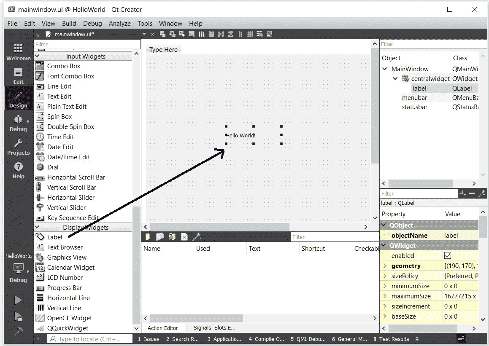

图 2.13 - 设计师屏幕

1.  最后一步是按下套件选择按钮下方的**运行**按钮。读者点击**运行**按钮后，项目将自动构建。Qt Creator 足够智能，可以确定需要先构建项目。您可以分别构建和运行应用程序。编译几秒钟后，您将看到一个带有文本“Hello World!”的窗口：

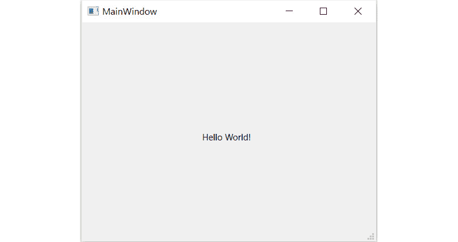

图 2.14 - 示例 GUI 应用程序的显示输出

恭喜，您已经创建了您的第一个基于 Qt 的 GUI 应用程序！现在让我们探索 Qt Creator 中提供的不同高级选项。

# 理解高级选项

安装 Qt Creator 时，它会以默认配置安装。您可以自定义 IDE 并配置其外观或设置您喜欢的编码风格。

转到顶部菜单栏，单击**工具**选项，然后选择**选项...**。您将看到左侧边栏上可用类别的列表。每个类别都提供一组选项来自定义 Qt Creator。作为初学者，您可能根本不需要更改设置，但让我们熟悉一下可用的不同选项。我们将从管理工具包开始。

## 管理工具包

Qt Creator 可以自动检测已安装的 Qt 版本和可用的编译器。它将用于构建和运行项目的配置分组，以使它们跨平台兼容。这组配置被存储为一个工具包。每个工具包包含一组描述环境的参数，例如目标平台、编译器和 Qt 版本。

首先点击左侧边栏中的**Kits**选项。这将自动检测并列出可用的工具包，如*图 2.15*所示。如果任何工具包显示为黄色或红色警告标记，则表示配置中存在故障。在这种情况下，您可能需要选择正确的编译器和 Qt 版本。您还可以通过单击**添加**按钮来创建自定义工具包。如果要使用新工具包，则不要忘记单击**应用**按钮。我们将继续使用默认的桌面配置，如下所示：

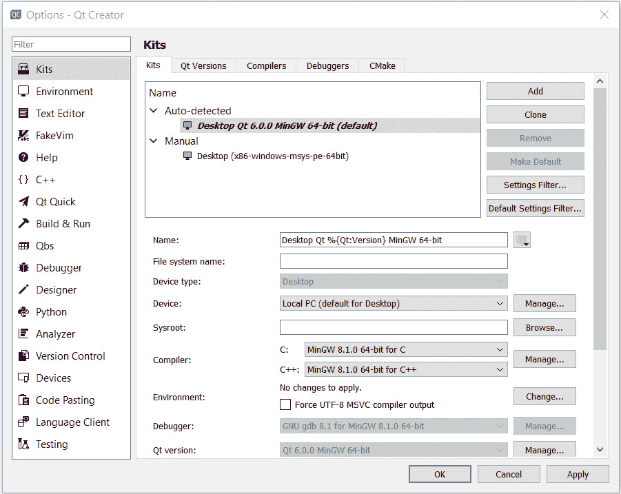

图 2.15 - Kits 配置屏幕

现在让我们继续到**Kits**部分下的**Qt 版本**选项卡。

## Qt 版本

在此选项卡中，您可以看到系统上可用的 Qt 版本。理想情况下，版本会自动检测到。如果没有检测到，然后单击**添加...**按钮并浏览到 qmake 的路径以添加所需的 Qt 版本。Qt 使用其发布的定义编号方案。例如，Qt 6.0.0 表示 Qt 6.0 的第一个补丁版本，6 表示主要 Qt 版本。每个版本都对可接受的更改量有限制，以确保稳定的 API。Qt 试图在版本之间保持兼容性。但是，由于主要版本中的代码清理和架构更改，这并不总是可能：

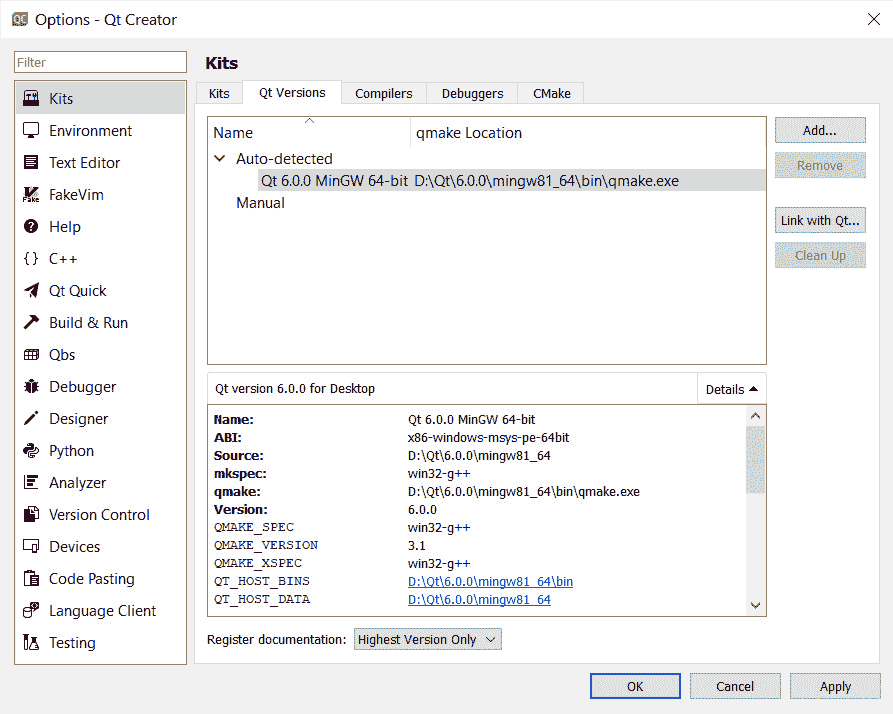

图 2.16 - 可用的 Qt 版本

重要提示

Qt 软件版本使用`主要.次要.补丁`的版本格式。主要版本可能会破坏二进制和源代码的向后兼容性，尽管可能会保持源代码兼容性。次要版本具有二进制和源代码的向后兼容性。补丁版本对二进制和源代码都具有向后和向前兼容性。

我们不会讨论**Kits**部分下的所有选项卡，因为其他选项卡需要对编译器、调试器和构建系统有所了解。如果您是一名经验丰富的开发人员，可以探索选项卡并根据需要进行更改。让我们继续到左侧边栏中的**环境**类别。

## 环境

此选项允许用户选择他们喜欢的语言和主题。默认情况下，Qt Creator 使用系统语言。它不支持许多语言，但大多数流行的语言都可用。如果您切换到不同的语言，然后单击**应用**按钮并重新启动 Qt Creator 以查看更改。请注意，这些**环境**选项与构建环境不同。您将看到一个类似于*图 2.17*的界面，如下所示：

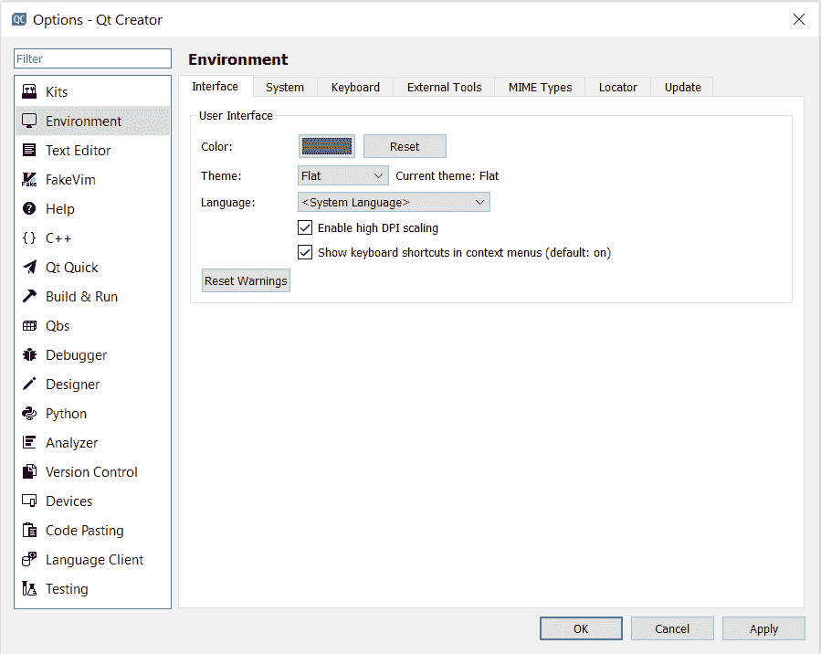

图 2.17 - 环境设置选项

你还会看到一个复选框，上面写着**启用高 DPI 缩放**。Qt Creator 在不同的操作系统上处理高**每英寸点数**（**DPI**）缩放的方式不同，具体如下：

+   在 Windows 上，Qt Creator 会检测默认的缩放因子并相应地使用它。

+   在 Linux 上，Qt Creator 将是否启用高 DPI 缩放的决定留给用户。这是因为有许多 Linux 发行版和窗口系统。

+   在 macOS 上，Qt Creator 强制 Qt 使用系统缩放因子进行 Qt Creator 缩放。

要覆盖默认方法，你可以切换复选框选项并点击**应用**按钮。更改将在重新启动 IDE 后生效。现在让我们来看看**键盘**选项卡。

## 键盘快捷键

**键盘**部分允许用户探索现有的键盘快捷键并创建新的快捷键。Qt Creator 有许多内置的键盘快捷键，对开发人员非常有用。如果你喜欢的快捷键缺失，你也可以创建自己的快捷键。你还可以为在列表中不出现的功能指定自己的键盘快捷键，比如在文本编辑器中选择单词或行。

一些日常开发中常用的快捷键列举如下：

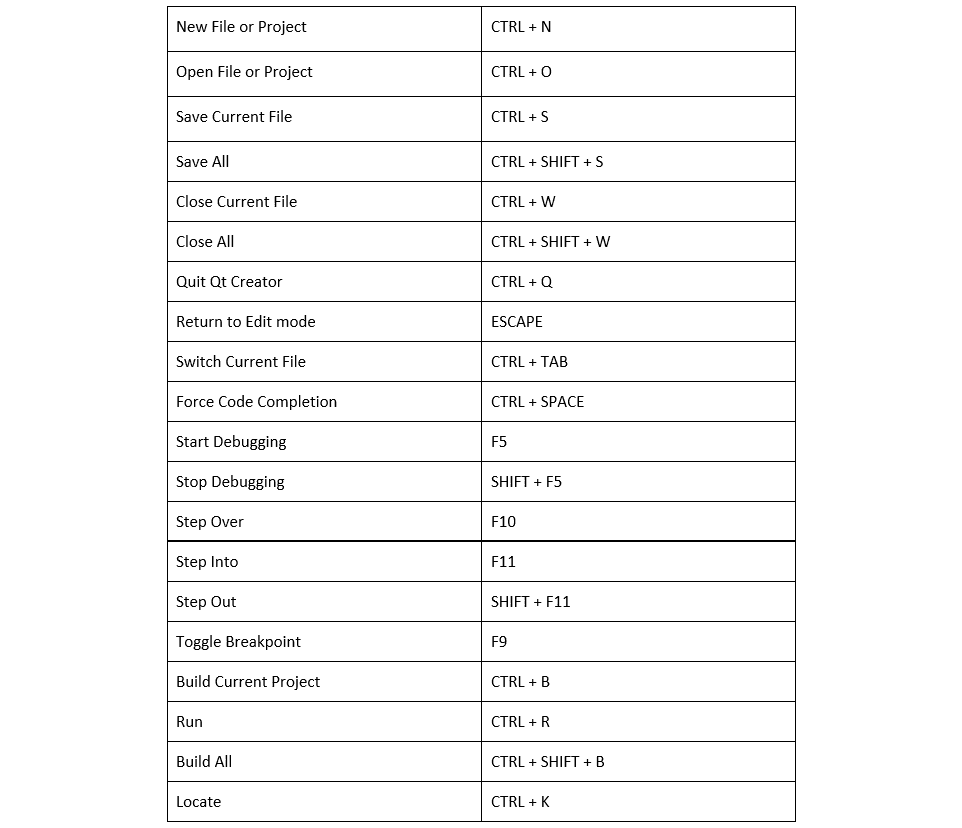

图 2.18 - 一些常用的键盘快捷键

快捷键按类别分组。要在列表中找到一个键盘快捷键，输入一个函数名或快捷键在`new`中：

图 2.19 - 键盘快捷选项

](img/Figure_2.19_B16231.jpg)

图 2.19 - 键盘快捷选项

前面的屏幕截图显示了关键字`new`的可用快捷键列表。你可以看到*Ctrl* + *N*用于创建新文件或项目。你也可以导入或导出`.kms`格式的键盘映射方案文件。

重要提示

内置的 Qt 快捷键比我们在这里讨论的要多得多。你可以在以下文章中了解更多关于快捷键的信息：

[`doc.qt.io/qtcreator/creator-keyboard-shortcuts.html`](https://doc.qt.io/qtcreator/creator-keyboard-shortcuts.html)

[`wiki.qt.io/Qt_Creator_Keyboard_Shortcuts`](https://wiki.qt.io/Qt_Creator_Keyboard_Shortcuts)

[`shortcutworld.com/Qt-Creator/win/Qt-Creator_Shortcuts`](https://shortcutworld.com/Qt-Creator/win/Qt-Creator_Shortcuts)

Qt Creator 的键盘快捷键和窗口管理器快捷键之间可能会发生冲突。在这种情况下，窗口管理器快捷键将覆盖 Qt Creator 快捷键。你也可以在窗口管理器中配置键盘快捷键。如果这受到限制，那么你可以改变 Qt Creator 的快捷键。现在，让我们继续下一个侧边栏类别。

## 文本编辑器

左侧边栏中的下一个类别是**文本编辑器**。在这里，你可以在第一个选项卡中选择颜色方案、字体和字体大小。下一个选项卡列出了**文本编辑器**中的不同行为。正如你在*图 2.20*中所看到的，Qt 在键盘上使用空格缩进来代替*Tab*键：

图 2.20 - 文本编辑器行为选项卡

](img/Figure_2.20_B16231.jpg)

图 2.20 - 文本编辑器行为选项卡

一些开发人员更喜欢制表符缩进而不是空格缩进。你可以在**C++**和**Qt Quick**设置中更改缩进行为。由于有专门的设置作为不同的侧边栏类别，所以**文本编辑器**中的这一部分在未来的版本中可能会被弃用。

你可以在**文件编码**组中找到当前文件的文件编码。要修改文件编码，从下拉菜单中选择**新编码**。要用新编码查看文件，点击**应用**按钮。

我们不会讨论所有侧边栏类别，因为那些都是非常高级的选项。一旦你学会了基础知识，你可以在以后探索它们。在下一节中，我们将讨论管理编码窗口。

## 分割编码窗口

您可以将编码窗口拆分并在同一屏幕或外部屏幕上查看多个文件。您可以以多种不同的方式同时查看多个文件（这些选项在菜单栏的**窗口**选项下可用）：

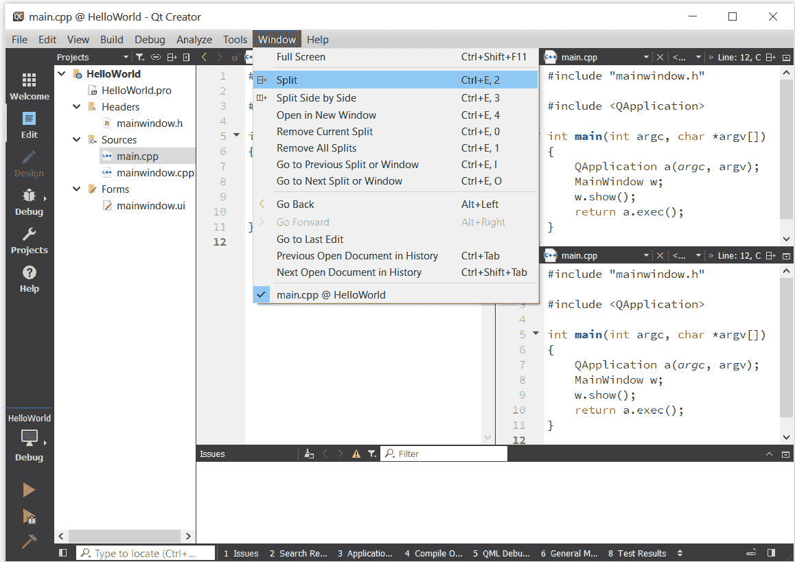

图 2.21– 展示拆分屏幕选项的截图

现在让我们讨论拆分编码窗口和删除拆分窗口的各种方法：

+   要将编码窗口分割为上下视图，请按*Ctrl* + *E*，然后按*2*，或在菜单栏中选择**窗口**选项，然后单击**拆分**选项。这将在当前活动窗口下方创建一个额外的编码窗口。

+   要将编码窗口分割为相邻视图，请选择**并排拆分**或按*Ctrl* + *E*，然后按*3*。并排拆分会在当前活动编码窗口的右侧创建视图。

+   要在独立窗口中打开编码窗口，请按*Ctrl* + *E*，然后按*4*，或选择**在新窗口中打开**。您可以将窗口拖到外部监视器上以方便使用。

+   要在拆分视图和独立编辑器窗口之间移动，请选择**下一个拆分**或按*Ctrl* + *E*，然后按*O*。

+   要删除拆分视图，请单击要删除的窗口，然后选择**删除当前拆分**，或按*Ctrl* + *E*，然后按*0*。

+   要删除所有拆分编码窗口，请选择**删除所有拆分**或按*Ctrl* + *E*，然后按*1*。

在本节中，您了解了如何拆分编码编辑器窗口。这在编码时同时引用多个代码文件时非常有用。在下一节中，我们将讨论 IDE 菜单栏中的**构建**菜单。

## 构建选项

在菜单栏中，您可以看到**构建**选项。如果单击该选项，那么您将看到各种构建选项，如*图 2.22*所示。在这里，您可以构建、重新构建或清理您的项目。在复杂的项目中，您可能有多个子项目。您可以单独构建子项目以减少总体构建时间：

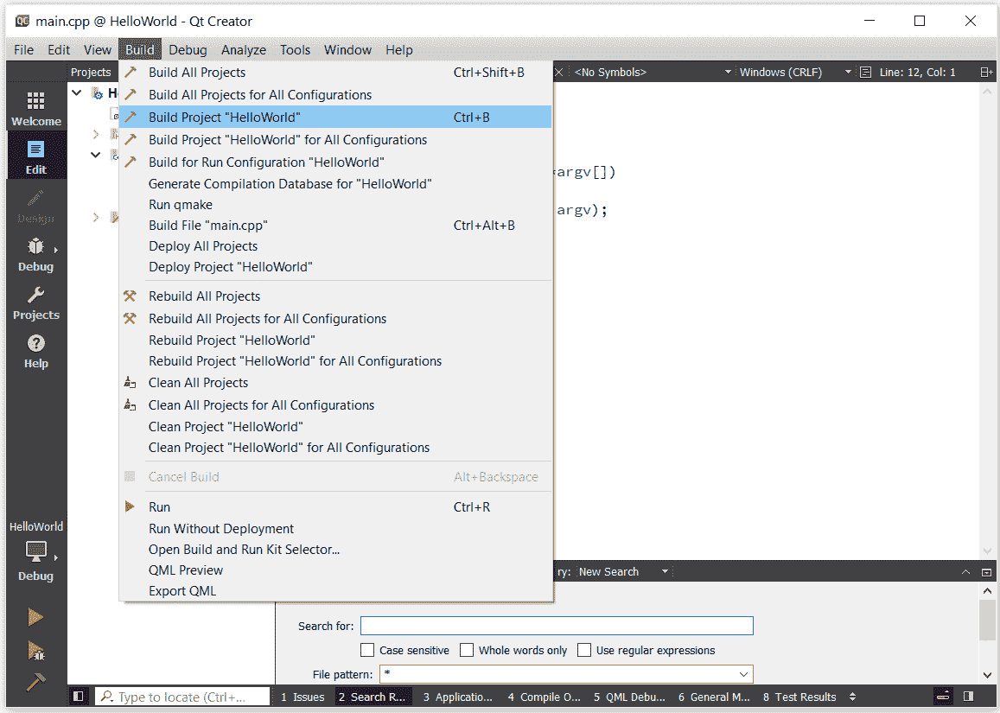

图 2.22 – 构建菜单选项

Qt Creator 项目向导允许您在创建新项目时选择构建系统，包括 qmake、CMake 和 Qbs。它使开发人员可以自由地将 Qt Creator 用作代码编辑器，并控制构建项目时使用的步骤或命令。默认情况下，qmake 已安装并配置为您的新项目。您可以在以下链接了解有关使用其他构建系统的更多信息：[`doc.qt.io/qtcreator/creator-project-other.html`](https://doc.qt.io/qtcreator/creator-project-other.html)。

现在让我们讨论在哪里以及如何查找框架的文档。

## Qt Assistant

Qt Creator 还包括一个名为 Qt Assistant 的内置文档查看器。这真的很方便，因为你可以通过简单地将鼠标悬停在源代码中的类名上并按下*F1*键来查找某个 Qt 类或函数的解释。然后 Qt Assistant 将被打开，并显示与该 Qt 类或函数相关的文档。

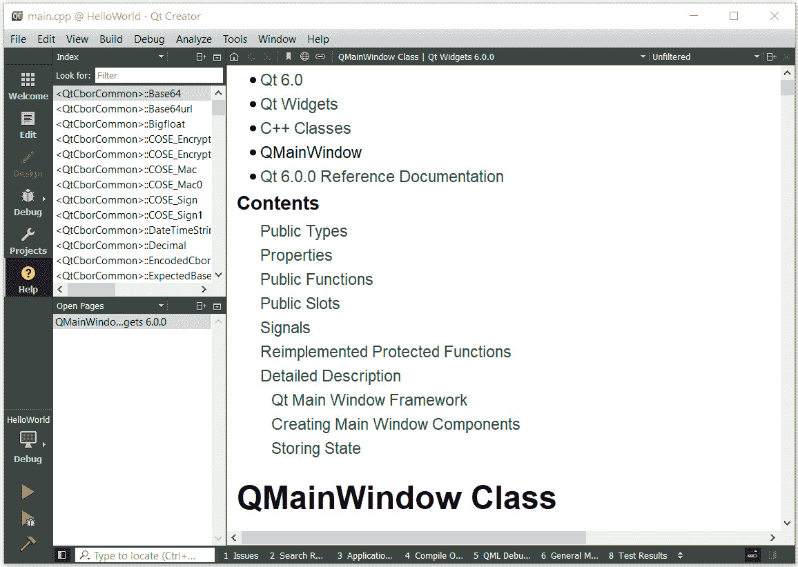

图 2.23 – 集成帮助界面

Qt Assistant 还支持交互式帮助，并使您能够为 Qt 应用程序创建帮助文档。

注意

在 Windows 平台上，Qt Assistant 作为 Qt Creator 菜单栏上的一个菜单选项。在 Linux 发行版上，您可以打开终端，输入`assistant`，然后按*Enter*。在 macOS 上，它安装在`/Developer/Applications/Qt`目录中。

在本节中，我们了解了 Qt Assistant 和帮助文档。现在，让我们总结一下本章的要点。

# 总结

本章介绍了 Qt Creator IDE 的基本原理以及它可以用于什么。Qt Creator 是一个带有一套强大工具的集成开发环境。它帮助您轻松地为多个平台创建出色的 GUI 应用程序。开发人员不需要编写冗长的代码来创建一个简单的按钮，也不需要改变大量的代码来对齐文本标签 - 当我们设计 GUI 时，Qt Designer 会自动生成代码。我们只需点击几下就创建了一个 GUI 应用程序，并且还学习了 IDE 中各种高级选项，包括如何管理工具包和快捷键。内置的 Qt 助手提供了有用的示例，并可以帮助我们编写自己的文档。

在下一章中，我们将讨论使用 Qt 小部件进行 GUI 设计。在这里，您将学习不同的小部件，如何创建自己的 GUI 元素，以及如何创建自定义的 GUI 应用程序。
