# 第四章：Qt Quick 和 QML

Qt 由两个不同的模块组成，用于开发**图形用户界面**（**GUI**）应用程序。第一种方法是使用 Qt Widgets 和 C++，我们在上一章中学习过。第二种方法是使用 Qt Quick Controls 和**Qt 建模语言**（**QML**），我们将在本章中介绍。

在本章中，您将学习如何使用 Qt Quick Controls 和 QML 脚本语言。您将学习如何使用 Qt Quick 布局和定位器，并创建一个响应式 GUI 应用程序。您将学习如何将后端 C++代码与前端 QML 集成。您将学习 Qt Quick 和 QML 的基础知识，以及如何开发触摸友好和视觉导向的 Qt 应用程序。您还将学习有关鼠标和触摸事件的知识，以及如何开发一个触摸感知的应用程序。

在本章中，我们将涵盖以下主要主题：

+   开始使用 QML 和 Qt Quick

+   理解 Qt Quick Controls

+   创建一个简单的 Qt Quick 应用程序

+   使用 Qt Quick Designer 设计**用户界面**（**UI**）

+   QML 中的定位器和布局

+   将 QML 与 C++集成

+   将 QML 与**JavaScript**（**JS**）集成

+   处理鼠标和触摸事件

在本章结束时，您将了解 QML 的基础知识，与 C++的集成，以及如何创建自己的流畅 UI。

# 技术要求

本章的技术要求包括在最新的桌面平台上安装 Qt 6.0.0 和 Qt Creator 4.14.0 的最低版本，如 Windows 10，Ubuntu 20.04 或 macOS 10.14。

本章中使用的所有代码都可以从以下 GitHub 链接下载：[`github.com/PacktPublishing/Cross-Platform-Development-with-Qt-6-and-Modern-Cpp/tree/master/Chapter04`](https://github.com/PacktPublishing/Cross-Platform-Development-with-Qt-6-and-Modern-Cpp/tree/master/Chapter04)。

重要提示

本章使用的屏幕截图来自 Windows 平台。您将在您的机器上看到基于底层平台的类似屏幕。

# 开始使用 QML 和 Qt Quick

QML 是一种 UI 标记语言。它是 Qt 框架的一部分，是一种声明性语言。它使得构建流畅且触摸友好的 UI 成为可能，并随着触摸屏移动设备的发展而出现。它被创建为高度动态的，开发人员可以轻松地使用最少的编码创建流畅的 UI。Qt QML 模块实现了 QML 架构，并提供了一个开发应用程序的框架。它定义和实现了语言和基础设施，并提供了**应用程序编程接口**（**API**）来将 QML 语言与 JS 和 C++集成。

Qt Quick 为 QML 提供了一系列类型和功能的库。它包括交互类型、可视类型、动画、模型、视图和图形效果。它用于触摸输入、流畅动画和用户体验至关重要的移动应用程序。Qt QML 模块为 QML 应用程序提供了语言和基础设施，而 Qt Quick 模块提供了许多可视元素、动画和许多其他模块，用于开发面向触摸和视觉吸引力的应用程序。您可以使用 QML 和 Qt Quick Controls 而不是 Qt Widgets 来设计 UI。Qt Quick 支持多个平台，如 Windows、Linux、Mac、iOS 和 Android。您可以在 C++中创建自定义类，并将其移植到 Qt Quick 以扩展其功能。此外，该语言与 C++和 JS 的集成非常顺畅。

## 理解 QML 类型系统

让我们熟悉**QML 类型系统**和各种 QML 类型。QML 文件中的类型可以来自各种来源。在 QML 文件中使用的不同类型在这里概述：

+   QML 本身提供的基本类型，如`int`，`bool`，`real`和`list`

+   JS 类型，如`var`，`Date`和`Array`

+   QML 对象类型，如`Item`，`Rectangle`，`Image`和`Component`

+   通过 QML 模块由 C++注册的类型，如`BackendLogic`

+   作为 QML 文件提供的类型，例如`MyPushButton`

基本类型可以包含诸如`int`或`bool`类型的简单值。除了本机基本类型外，Qt Quick 模块还提供了其他基本类型。QML 引擎还支持 JS 对象和数组。任何标准 JS 类型都可以使用通用的`var`类型创建和存储。请注意，`variant`类型已经过时，只存在于支持旧应用程序的情况下。QML 对象类型是可以创建 QML 对象的类型。可以通过创建定义类型的`.qml`文件来定义自定义 QML 对象类型。QML 对象类型可以具有属性、方法、信号等。

要在您的 QML 文件中使用基本的 QML 类型，请使用以下代码行导入`QtQml`模块：`import QtQml`

`Item`是 Qt Quick 中所有可视元素的基本类型。Qt Quick 中的所有可视项都是从`Item`继承的，它是一个可以用作容器的透明可视元素。Qt Quick 提供`Rectangle`作为绘制矩形的可视类型，并提供`Image`类型来显示图像。`Item`为可视元素提供了一组通用属性。我们将在整本书中探索这些类型的用法。

您可以在以下链接了解更多关于 QML 类型的信息：

[`doc.qt.io/qt-6/qmltypes.html`](https://doc.qt.io/qt-6/qmltypes.html)

在本节中，我们学习了 QML 和 Qt Quick 的基础知识。在下一节中，我们将讨论 Qt Quick Controls。

# 了解 Qt Quick Controls

**Qt Quick Controls**提供了一组 UI 元素，可用于使用 Qt Quick 构建流畅的 UI。为了避免与**小部件**产生歧义，我们将使用术语**控件**来表示 UI 元素。**Qt Quick Controls 1**最初设计用于支持桌面平台。随着移动设备和嵌入式系统的发展，该模块需要进行更改以满足性能期望。因此，**Qt Quick Controls 2**诞生了，并进一步增强了对移动平台的支持。自 Qt 5.11 起，Qt Quick Controls 1 已被弃用，并已从 Qt 6.0 中删除。Qt Quick Controls 2 现在简称为 Qt Quick Controls。

可以在您的`.qml`文件中使用以下`import`语句导入 QML 类型：

`import QtQuick.Controls`

重要提示

在 Qt 6 中，QML 导入和版本控制系统发生了一些变化。版本号现在是可选的。如果导入模块时没有指定版本号，则会自动导入模块的最新版本。如果只导入模块的主要版本号，则会导入指定主要版本和最新次要版本的模块。Qt 6 引入了`import <module> auto`。这确保了导入的模块和导入模块具有相同的版本号。

有关 Qt 6 中 Qt Quick Controls 的更改，请访问以下链接：

[`doc.qt.io/qt-6/qtquickcontrols-changes-qt6.html`](https://doc.qt.io/qt-6/qtquickcontrols-changes-qt6.html)

Qt Quick Controls 提供了用于创建 UI 的 QML 类型。这里提供了 Qt Quick Controls 的示例：

+   `ApplicationWindow`：带有标题和页脚支持的样式化顶层窗口

+   `BusyIndicator`：指示后台活动，例如内容正在加载时

+   `Button`：可单击以执行命令或回答问题的推按钮

+   `CheckBox`：可以切换打开或关闭的复选框

+   `ComboBox`：用于选择选项的组合按钮和弹出列表

+   `拨号`：旋转以设置值的圆形拨号

+   `对话框`：带有标准按钮和标题的弹出对话框

+   `标签`：带有继承字体的样式文本标签

+   `Popup`：类似弹出式 UI 控件的基本类型

+   `ProgressBar`：指示操作进度

+   `RadioButton`：可以切换打开或关闭的互斥单选按钮

+   滚动条：垂直或水平交互式滚动条

+   `ScrollView`：可滚动视图

+   `Slider`：用于通过沿轨道滑动手柄来选择值

+   `SpinBox`：允许用户从一组预设值中进行选择

+   `Switch`：可以切换打开或关闭的按钮

+   `TextArea`：多行文本输入区域

+   `TextField`：单行文本输入字段

+   `ToolTip`：为任何控件提供工具提示

+   `Tumbler`：可旋转的可选择项目的轮子

要为 qmake 构建配置 Qt Quick Controls 模块，请将以下行添加到项目的`.pro`文件中：

`QT += quickcontrols2`

在本节中，我们了解了 Qt Quick 提供的不同类型的 UI 元素。在下一节中，我们将讨论 Qt Quick 提供的不同样式以及如何应用它们。

## Qt Quick Controls 的样式

Qt Quick Controls 带有一套标准样式。它们在这里列出：

+   基本

+   **融合**

+   **想象**

+   **材料**

+   **通用**

在 Qt Quick Controls 中有两种应用样式的方式，如下：

+   编译时间

+   运行时

您可以通过导入相应的样式模块来应用编译时样式，如下所示：

`import QtQuick.Controls.Universal`

您可以通过以下方法之一应用运行时样式：

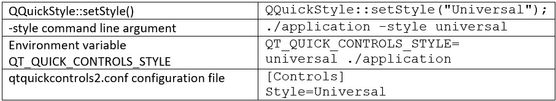

图 4.1-运行时应用样式的不同方法

在本节中，我们了解了 Qt Quick 中提供的样式。在下一节中，我们将创建我们的第一个 Qt Quick GUI 应用程序。

# 创建一个简单的 Qt Quick 应用程序

让我们使用 Qt 6 创建我们的第一个 Qt Quick 应用程序。Hello World 程序是一个非常简单的程序，显示`Hello World!`。该项目使用最少的——和最基本的——代码。对于这个项目，我们将使用 Qt Creator 创建的**项目骨架**。所以，让我们开始吧！按照以下步骤进行：

1.  要创建一个新的 Qt Quick 应用程序，请单击菜单栏上的**文件菜单**选项或按下*Ctrl* + *N*。或者，您也可以单击欢迎屏幕上的**新建项目**按钮。然后，将弹出一个窗口供您选择项目模板。选择**Qt Quick Application - Empty**并单击**选择...**按钮，如下截图所示：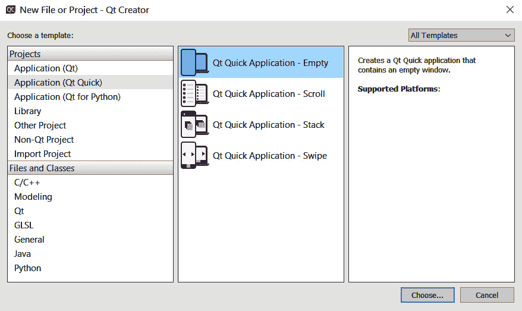

图 4.2-新的 Qt Quick 应用程序向导

1.  在下一步中，您将被要求选择项目名称和项目位置。您可以通过单击`SimpleQtQuickApp`导航到所需的项目位置。然后，单击**下一步**按钮继续到下一个屏幕，如下截图所示：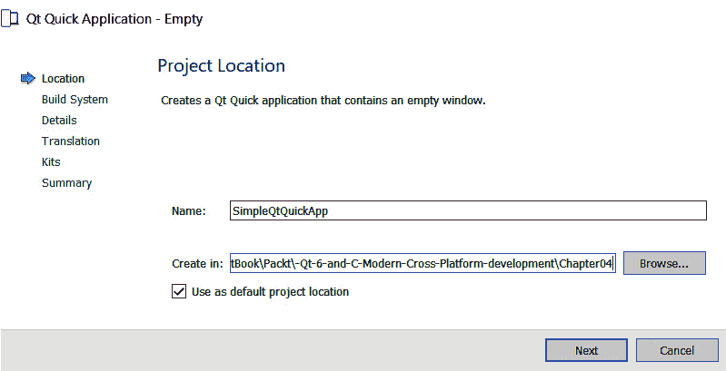

图 4.3-项目位置选择屏幕

1.  在下一步中，您可以从一组工具包中选择一个工具包来构建和运行您的项目。要构建和运行项目，至少必须激活并可选择一个工具包。选择默认的**Desktop Qt 6.0.0 MinGW 64 位**工具包。单击**下一步**按钮继续到下一个屏幕。可以在以下截图中看到：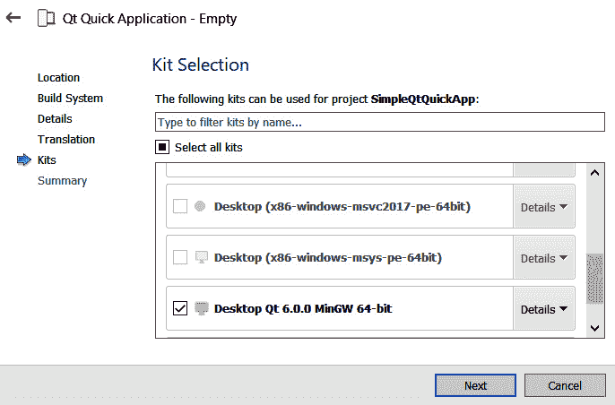

图 4.4-工具包选择屏幕

1.  下一步是将您的 Qt Quick 项目添加到已安装的**版本控制系统**（**VCS**）中。您可以跳过此项目的版本控制。单击**完成**按钮以创建带有生成文件的项目，如下截图所示：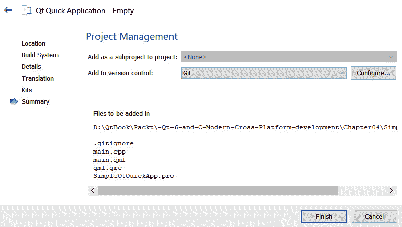

图 4.5-项目管理屏幕

1.  创建项目后，Qt Creator 将自动打开项目中的一个文件，名为`main.qml`。您将看到一种与您平常的 C/C++项目非常不同的脚本类型，如下截图所示：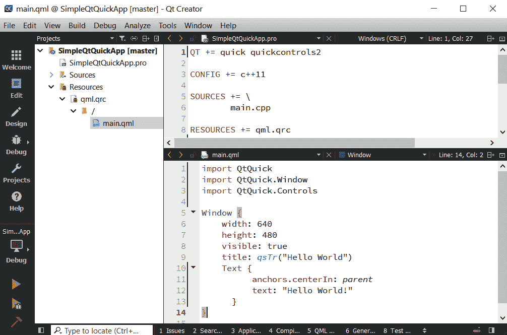

```cpp
#include <QGuiApplication>
#include <QQmlApplicationEngine>
int main(int argc, char *argv[])
{
    QGuiApplication app(argc, argv);
    QQmlApplicationEngine engine;
    const QUrl url(QStringLiteral("qrc:/main.qml"));
    engine.load(url);
    return app.exec();
}
```

您也可以使用`QQuickView`类，它提供了一个用于显示 Qt Quick UI 的窗口。这种方法有点老了。`QQmlApplicationEngine`具有方便的 QML 中央应用功能，而`QQuickView`通常是从 C++控制的。以下代码片段显示了如何使用`QQuickView`来加载`.qml`文件：

```cpp
#include <QGuiApplication>
#include <QQuickView>
int main(int argc, char *argv[])
{
    QGuiApplication app(argc, argv);
    QQuickView view;
    view.setResizeMode(
        QQuickView::SizeRootObjectToView);
    view.setSource(QUrl("qrc:/main.qml"));
    view.show();
    return app.exec();
}
```

`QQuickView`不支持将`Window`作为根项。如果您想要从 QML 创建您的根窗口，那么选择`QQmlApplicationEngine`。在使用`QQuickView`时，您可以直接使用任何 Qt Quick 元素，如下面的代码片段所示：

```cpp
import QtQuick
Item  {
    width: 400
    height: 400
    Text {
          anchors.centerIn: parent
          text: "Hello World!"
    }
}
```

1.  接下来，您可以通过点击位于**集成开发环境**（**IDE**）左下角的绿色箭头按钮来构建和运行 Qt Quick 项目，如下截图所示：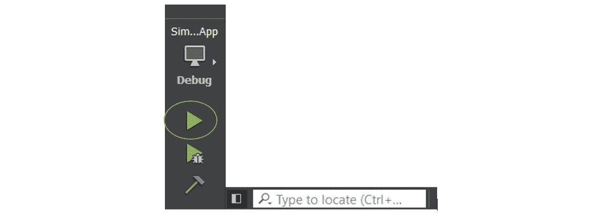

图 4.7 – Qt Creator 中的构建和运行选项

1.  现在，点击**运行**按钮来构建和运行应用程序。很快，您将会看到一个带有**Hello World!**的 UI，如下截图所示：

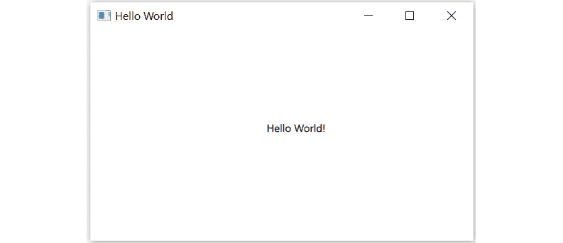

图 4.8 – Hello World UI 的输出

您可以在 Windows 的命令行中运行应用程序，如下所示：

```cpp
>SimpleQtQuickApp.exe
```

您也可以在 Linux 发行版的命令行中运行应用程序，如下所示：

```cpp
$./SimpleQtQuickApp
```

在命令行模式下，如果在应用程序路径中找不到库文件，您可能会看到一些错误对话框。您可以将 Qt 库和插件文件复制到二进制文件夹中以解决这个问题。为了避免这些问题，我们将坚持使用 Qt Creator 来构建和运行我们的示例程序。您可以通过转到项目界面并根据您的偏好选择一个工具包来在不同的工具包之间切换。请记住，在对`.pro`文件进行更改后，您需要运行`qmake`。如果您正在使用命令行，则继续执行以下命令：

```cpp
>qmake
>make
```

您还可以创建一个带有 QML 入口点的 Qt Quick 2 UI 项目，而不使用任何 C++代码。要使用它，您需要设置一个 QML 运行时环境，比如`qmlscene`。Qt Creator 使用`.qmlproject`来处理仅包含 QML 的项目：

1.  创建一个 Qt Quick 2 UI 项目，从新项目模板屏幕中选择**Qt Quick 2 UI Prototype**，如下截图所示：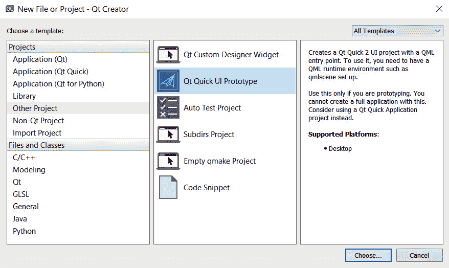

图 4.9 – Qt Quick UI Prototype 向导

1.  继续点击`QtQuickUIPrototype.qmlproject`和`QtQuickUIPrototype.qml`这两个由 Qt Creator 生成的文件。

1.  让我们修改`QtQuickUIPrototype.qml`的内容，添加一个`Text`元素并显示`Hello World!`，如下截图所示：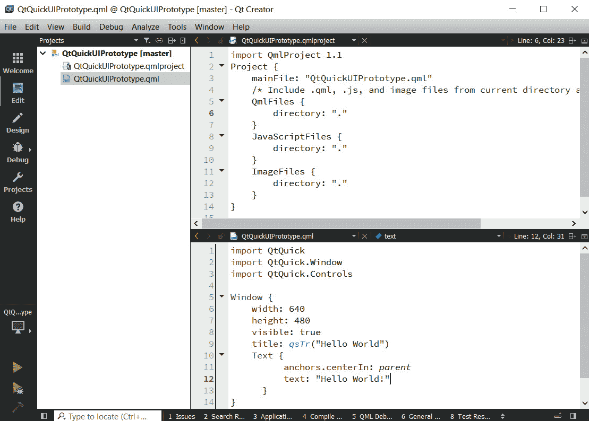

图 4.10 – Qt Quick UI Prototype 项目的示例内容

1.  现在，点击**运行**按钮来构建和运行应用程序。很快，您将会看到一个带有**Hello World!**的 UI。

您也可以在命令行中运行应用程序，如下所示：

```cpp
>qmlscene QtQuickUIPrototype.qml
```

您可能需要在命令行中提到`qmlscene`和`qml`文件路径。只有在原型设计时才使用这个。您不能用这个来创建一个完整的应用程序。考虑使用 Qt Quick 应用程序项目来创建一个完整的应用程序。

在本节中，我们学习了如何使用 Qt Quick 模块创建一个简单的 GUI。在下一节中，我们将学习如何使用 Qt Quick Designer UI 设计自定义 UI。

# 使用 Qt Quick Designer 设计 UI

在本节中，您将学习如何使用 Qt Quick Designer 设计您的 UI。与 Qt Widgets 中的`.ui`文件类似，您也可以在 QML 中创建一个 UI 文件。该文件具有`.ui.qml`文件扩展名。有两种类型的 QML 文件：一种是`.qml`扩展名，另一种是`.ui.qml`扩展名。QML 引擎将其视为标准的`.qml`文件，但禁止其中的逻辑实现。它为多个`.qml`文件创建了可重用的 UI 定义。通过分离 UI 定义和逻辑实现，增强了 QML 代码的可维护性。

在开始学习如何设计自己的 UI 之前，让我们熟悉一下 Qt Quick Designer 的界面。以下截图显示了 Qt Quick Designer 的不同部分。在设计我们的 UI 时，我们将逐渐了解这些部分：

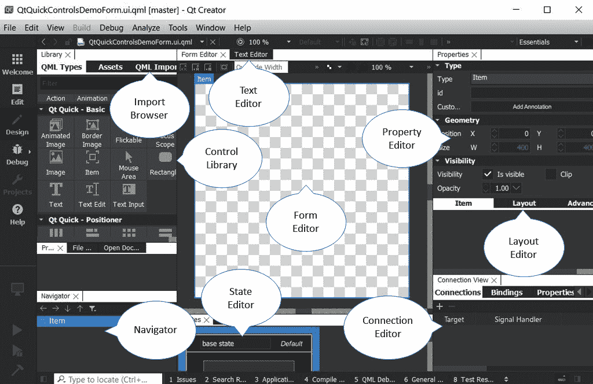

图 4.11 - Qt Quick Designer 界面的各个部分

Qt Quick Designer 的界面包括以下主要部分：

+   **导航器**：将当前 QML 文件中的项目列为树结构。这类似于我们在上一章中学习的 Qt Designer 中的**对象操作器**窗口。

+   **控件库**：此窗口显示了 QML 中所有可用的 Qt Quick 控件。您可以将控件拖放到画布窗口中，以修改您的 UI。

+   **资源**：显示了可以用于 UI 设计的所有资源的列表。

+   **导入浏览器**：**导入浏览器**便于将不同的 QML 模块导入到当前 QML 文件中，以为您的 QML 项目添加新功能。您还可以创建自己的自定义 QML 模块，并从这里导入。

+   **文本编辑器**：有六个工具按钮，每个按钮都用于特定操作，如复制和粘贴。

+   **属性编辑器**：类似于 Qt Designer 中的属性编辑器。Qt Quick Designer 中的**属性**部分显示了所选项目的属性。您还可以在**文本编辑器**中更改项目的属性。

+   **表单编辑器**：**表单编辑器**是一个画布，您可以在其中为 Qt Quick 应用程序设计 UI。

+   **状态编辑器**：此窗口列出了 QML 项目中的不同状态，并描述了它们的 UI 定义和行为。

+   **连接编辑器**：此部分类似于 Qt Designer 中的**信号/槽编辑器**。在这里，您可以为您的 QML 组件定义信号和槽机制。

您现在已经熟悉了 Qt Quick Designer UI。让我们创建一个 Qt Quick UI 文件，并探索 Qt Quick 控件，如下所示：

1.  要创建一个 Qt Quick UI，选择`ui.qml`文件扩展名。默认情况下，Qt Creator 将打开 Qt Quick Designer。您可以通过单击左侧面板上的**编辑**按钮切换到代码编辑模式：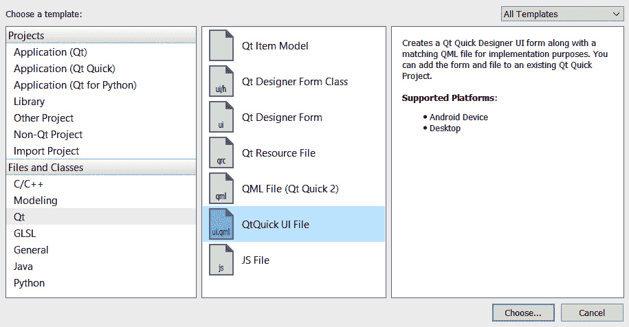

图 4.12 - QtQuick UI 文件向导

1.  让我们向`Item`、`Rectangle`、`Image`、`Text`等添加一些 QML 元素。`Item`是一个可以用作容器的透明 UI 元素：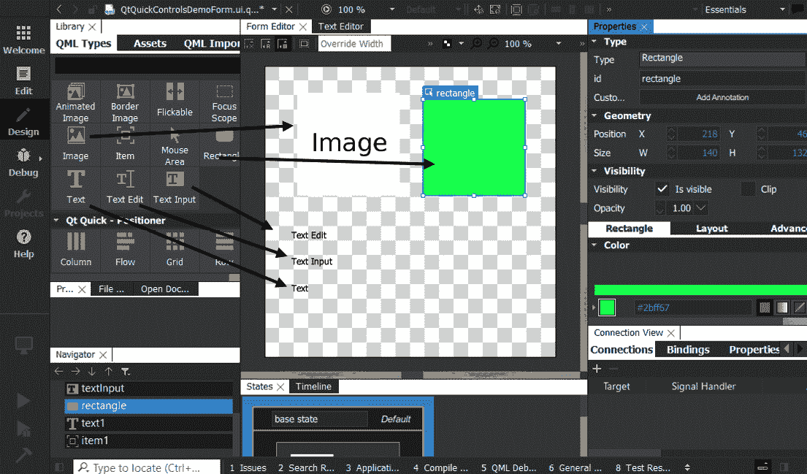

图 4.13 - Qt Quick Designer 显示基本的 QML 类型

1.  默认情况下，库只包含一些基本的 QML 类型。您可以通过 QML `QtQuick.Controls`包将 Qt Quick 模块导入到 Qt Quick Designer 中，如下一张截图所示：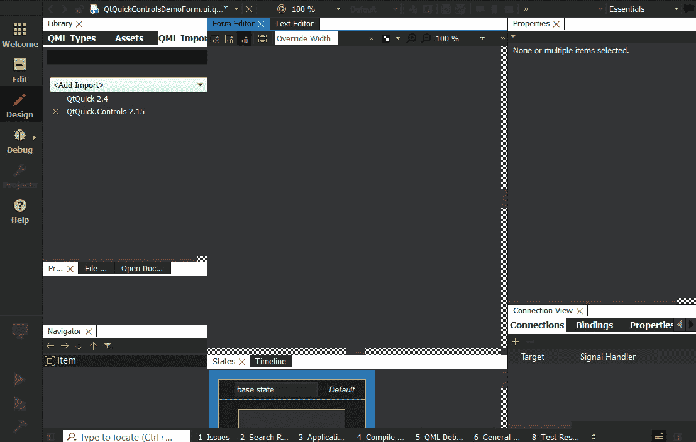

图 4.14 - Qt Quick Designer 显示了 QML 模块导入选项

1.  一旦导入模块，您就可以在库中看到一个带有**Qt Quick - Controls 2**的部分，如下一张截图所示：

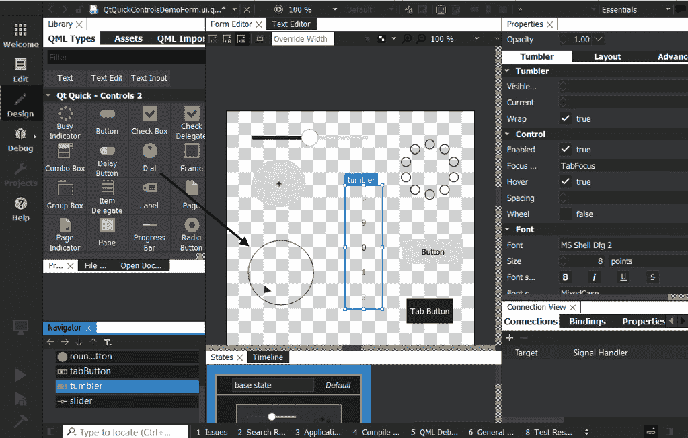

图 4.15 - Qt Quick Designer 显示 Qt Quick 控件

在本节中，我们熟悉了 Qt Quick Designer 的界面。在下一节中，您将学习不同的定位器和布局。

# QML 中的位置器和布局

在 QML 中有不同的定位项目的方法。您可以通过提及*x*和*y*坐标或使用锚点、位置器或布局手动定位控件。让我们讨论如何通过上述方法定位控件。

## 手动定位

通过设置相应的*x*和*y*属性，可以将控件定位在特定的*x*和*y*坐标上。根据视觉坐标系统规则，这将使控件相对于其父级的左上角定位。

以下代码片段显示了如何将`Rectangle`项目放置在位置(`50,50`)处：

```cpp
import QtQuick
Rectangle {
    // Manually positioned at 50,50
    x: 50 // x position
    y: 50 // y position
    width: 100; height: 80
    color: "blue"
}
```

当您运行上述代码时，您将看到一个蓝色矩形被创建在(`50,50`)位置。更改`x`和`y`值，您将看到位置相对于左上角如何改变。Qt 允许您在一行中用分号分隔写入多个属性。您可以在同一行中用分号分隔写入`x`和`y`位置。

在本节中，您学习了如何通过指定其坐标来定位可视项。在下一节中，我们将讨论锚点的使用。

## 使用锚点定位

Qt Quick 提供了一种将控件锚定到另一个控件的方法。每个项目有七条不可见的锚线：`left`、`right`、`top`、`bottom`、`baseline`、`horizontalCenter`和`verticalCenter`。您可以为每个边设置边距或不同的边距。如果特定项目有多个锚点，那么它们可以被分组。

让我们看下面的例子：

```cpp
import QtQuick
import QtQuick.Window
Window {
    width: 400; height: 400
    visible: true
    title: qsTr("Anchoring Demo")
    Rectangle {
        id: blueRect
        anchors {
            left: parent.left; leftMargin:10
            right: parent.right; rightMargin: 40
            top: parent.top; topMargin: 50
            bottom: parent.bottom; bottomMargin: 100
        }
        color: "blue"
        Rectangle {
            id: redRect
            anchors.centerIn: blueRect
            color:"red"
            width: 150; height: 100
        }
    }
}
```

如果您运行此示例，您将在输出窗口中看到一个红色矩形，它位于蓝色矩形内部，具有不同的边距，如下所示：

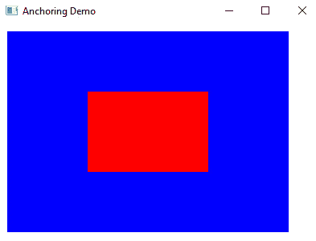

图 4.16 - 锚定在窗口内部定位控件

在本节中，您学习了如何使用锚点定位可视项。在下一节中，我们将讨论位置器的使用。

## 位置器

**Positioners**是在声明性 UI 中管理可视元素位置的容器。Positioners 的行为方式类似于**Qt widgets**中的布局管理器。

一组标准的位置器在基本的 Qt Quick 元素集中提供。它们概述如下：

+   **Column**将其子项放置在列中。

+   **Row**将其子项放置在一行中。

+   **Grid**将其子项放置在网格中。

+   **Flow**将其子项放置在页面上的单词中。

让我们看看如何在 Qt Quick Designer 中使用它们。首先，创建三个具有不同颜色的**Rectangle**项目，然后将它们放置在一个**Row**元素内，如下截图所示：

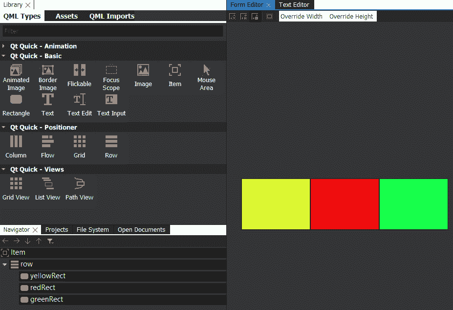

图 4.17 - 位置器内的矩形

您还可以编写代码来定位位置器内的控件。如果使用 Qt Quick Designer，Qt Creator 会自动生成代码。生成的代码可以通过**Form Editor**旁边的**Text Editor**选项卡查看和修改。代码如下所示：

```cpp
Row {
    id: row     
    Rectangle {
        id: yellowRect
        width: 150; height: 100
        color: "yellow"
        border.color: "black"
    }
    Rectangle {
        id: redRect
        width: 150; height: 100
        color: "red"
        border.color: "black"
    }
    Rectangle {
        id: greenRect
        width: 150; height: 100
        color: "green"
        border.color: "black"
    }
}
```

在本节中，我们学习了不同的位置器。在下一节中，我们将讨论重复器和模型的使用，以及位置器。

## Repeater

**Repeater**使用提供的模型创建多个可视元素，以及用于与位置器一起使用的模板元素，并使用模型中的数据。重复器放置在位置器内，并创建遵循定义的位置器排列的可视元素。当有许多类似的项目时，使用重复器的位置器在规则布局中排列时更容易维护。

让我们使用`Repeater`创建一个排列在一行中的五个矩形，如下所示：

```cpp
import QtQuick
import QtQuick.Window
Window {
    width: 400; height: 200
    visible: true
    title: qsTr("Repeater Demo")
    Row {
        anchors.centerIn: parent
        spacing: 10
        Repeater {
            model: 5
            Rectangle {
                width: 60; height: 40
                border{ width: 1; color: "black";}
                color: "green"
            }
        }
    }
}
```

当您运行上述示例时，您将看到五个矩形排列在一行中，如下所示：


图 4.18 - 位置器内的矩形

在本节中，我们了解了使用位置器和重复器。在下一节中，我们将深入了解 Qt Quick 布局。

## Qt Quick 布局

Qt Quick 布局是一组 QML 类型，可用于在 UI 中排列可视元素。Qt Quick 布局可以调整其子元素的大小，因此它们用于可调整大小的 UI。位置器和布局之间的基本区别在于布局可以在窗口调整大小时调整其子元素。

可以通过以下`import`语句将 Qt Quick 布局导入到您的 QML 文件中：

`import QtQuick.Layouts`

这里有五种不同类型的 QML 布局，如下所述：

+   `RowLayout`：按行排列元素。它类似于`GridLayout`，但只有一行。

+   `ColumnLayout`：按列排列元素。它类似于`GridLayout`，但只有一列。

+   `GridLayout`：允许在网格中动态排列元素。

+   `Layout`：为推送到`ColumnLayout`、`RowLayout`或`GridLayout`布局类型的项目提供附加属性。

+   `StackLayout`：以堆栈方式排列元素，一次只有一个元素可见。

让我们看一下以下`RowLayout`示例：

```cpp
import QtQuick
import QtQuick.Window
import QtQuick.Layouts
Window {
    width: 640; height: 480
    visible: true
    title: qsTr("Layout Demo")
    RowLayout {
        id: layout
        anchors.fill: parent
        spacing: 6
        Rectangle {
            color: 'yellow'
            Layout.fillWidth: true
            Layout.minimumWidth: 50
            Layout.preferredWidth: 150
            Layout.maximumWidth: 200
            Layout.minimumHeight: 100
            Layout.margins: 10
        }
        Rectangle {
            color: 'red'
            Layout.fillWidth: true
            Layout.minimumWidth: 50
            Layout.preferredWidth: 100
            Layout.preferredHeight: 80
            Layout.margins: 10
        }
    }
}
```

请注意，`Row`类型是位置器，而`RowLayout`类型是布局。何时使用它们主要取决于您的目标，与往常一样。让我们继续下一节，看看如何将 QML 与 C++集成。

# 将 QML 与 C++集成

QML 应用程序通常需要在 C++中处理更高级和性能密集型的任务。这样做的最常见和最快速的方法是将 C++类暴露给 QML 运行时，前提是 C++实现派生自`QObject`。

QML 可以很容易地与 C++代码集成。可以从 C++加载和操作 QML 对象。QML 与 Qt 的元对象系统集成允许从 QML 调用 C++功能。这有助于构建混合应用程序，其中混合了 C++、QML 和 JS。要将 C++数据、属性或方法暴露给 QML，它应该派生自`QObject`类。这是可能的，因为所有 QML 对象类型都是使用`QObject`派生类实现的，允许 QML 引擎通过 Qt 元对象系统加载和检查对象。

您可以以以下方式将 QML 与 C++集成：

+   使用上下文属性将 C++对象嵌入到 QML 中

+   向 QML 引擎注册类型

+   创建 QML 扩展插件

让我们在以下各节中逐一讨论每种方法。

重要提示

要快速确定哪种集成方法适合您的项目，请查看 Qt 文档中以下链接中的流程图：

[`doc.qt.io/qt-6/qtqml-cppintegration-overview.html`](https://doc.qt.io/qt-6/qtqml-cppintegration-overview.html)

## 使用上下文属性将 C++对象嵌入到 QML 中

您可以使用上下文属性将 C++对象暴露到 QML 环境中。上下文属性适用于简单的应用程序。它们将您的对象导出为全局对象。上下文在由 QML 引擎实例化后暴露给 QML 环境。

让我们看一下以下示例，在这个示例中，我们已将`radius`导出到 QML 环境。您也可以以类似的方式导出 C++模型：

```cpp
#include <QGuiApplication>
#include <QQmlApplicationEngine>
#include <QQmlContext>
int main(int argc, char *argv[])
{
    QGuiApplication app(argc, argv);
    QQmlApplicationEngine engine;
    engine.rootContext()->setContextProperty("radius", 50);
    const QUrl url(QStringLiteral("qrc:/main.qml"));
    engine.load(url);
    return app.exec();
}
```

您可以直接在 QML 文件中使用导出的值，如下所示：

```cpp
import QtQuick
import QtQuick.Window
Window {
    width: 640; height: 480
    visible: true
    title: qsTr("QML CPP integration")
    Text {
        anchors.centerIn: parent
        text: "C++ Context Property Value: "+ radius
    }
}
```

您还可以在 QML 环境中注册您的 C++类并实例化它。让我们在下一节中学习如何实现这一点。

## 使用 QML 引擎注册 C++类

注册 QML 类型允许开发人员从 QML 环境中控制 C++对象的生命周期。这不能通过上下文属性实现，也不会填充全局命名空间。不过，所有类型都需要首先注册，并且在应用程序启动时需要链接所有库，这在大多数情况下并不是真正的问题。

这些方法可以是公共槽或使用`Q_INVOKABLE`标记的公共方法。现在，让我们将 C++类导入到 QML 文件中。看一下以下 C++类：

```cpp
#ifndef BACKENDLOGIC_H
#define BACKENDLOGIC_H
#include <QObject>
class BackendLogic : public QObject
{
    Q_OBJECT
public:
    explicit BackendLogic(QObject *parent = nullptr) { 
             Q_UNUSED(parent);}
    Q_INVOKABLE int getData() {return mValue; }
private:
    int mValue = 100;
};
#endif // BACKENDLOGIC_H
```

您需要在`main.cpp`文件中使用`qmlRegisterType()`将 C++类注册为模块，如下所示：

```cpp
qmlRegisterType<BackendLogic>("backend.logic", 1, 0,"BackendLogic");
```

任何派生自`Qobject`的 C++类都可以注册为 QML 对象类型。一旦一个类被注册到 QML 类型系统中，该类就可以像任何其他 QML 类型一样使用。现在，C++类已准备好在您的`.qml`文件中实例化。您需要导入模块并创建一个对象，如下面的代码片段所示：

```cpp
import QtQuick
import QtQuick.Window
import backend.logic
Window {
    width: 640; height: 480
    visible: true
    title: qsTr("QML CPP integration")
    BackendLogic {
        id: backend
    }
    Text {
        anchors.centerIn: parent
        text: "From Backend Logic : "+ backend.getData()
    }
}
```

当您运行上述程序时，您会看到程序正在从后端 C++类中获取数据并在 UI 中显示。

您还可以使用`qmlRegisterSingletonType()`将 C++类公开为 QML 单例。通过使用 QML 单例，您可以防止全局命名空间中的重复对象。让我们跳过这部分，因为它需要对设计模式有所了解。详细的文档可以在以下链接找到：

[`doc.qt.io/qt-6/qqmlengine.html#qmlRegisterSingletonType`](https://doc.qt.io/qt-6/qqmlengine.html#qmlRegisterSingletonType%20)

在 Qt 6 中，您可以通过使用`QML_ELEMENT`宏实现 C++集成。该宏将声明封闭类型作为 QML 中可用，使用其类或命名空间名称作为 QML 元素名称。要在 C++头文件中使用此宏，您将需要包含`qml.h`头文件，如`#include <QtQml>`。

让我们看一下以下示例：

```cpp
#ifndef USINGELEMENT_H
#define USINGELEMENT_H
#include <QObject>
#include <QtQml>
class UsingElements : public QObject
{
    Q_OBJECT
    QML_ELEMENT
public:
    explicit UsingElements(QObject *parent = nullptr) { 
              Q_UNUSED(parent);}
    Q_INVOKABLE int readValue() {return mValue; }
private:
    int mValue = 500;
};
#endif // USINGELEMENT_H
```

在`.pro`文件中，您需要将`qmltypes`选项添加到`CONFIG`变量，并且需要提到`QML_IMPORT_NAME`和`QML_IMPORT_MAJOR_VERSION`，如下面的代码片段所示：

```cpp
CONFIG += qmltypes
QML_IMPORT_NAME = backend.element
QML_IMPORT_MAJOR_VERSION = 1
```

您的 C++类现在已准备好在您的`.qml`文件中实例化。您需要导入模块并创建一个对象，如下面的代码片段所示：

```cpp
import QtQuick
import QtQuick.Window
import backend.element
Window {
    width: 640; height: 480
    visible: true
    title: qsTr("QML CPP integration")
    UsingElements {
        id: backendElement
    }
    Text {
        anchors.centerIn: parent
        text: "From Backend Element : "+ 
              backendElement.readValue()
    }
}
```

在本节中，您学习了如何将您的 C++类导出到 QML 环境中，并从 QML 访问其函数。在这个例子中，数据只有在调用方法时才被检索。您还可以通过添加带有`NOTIFY`信号的`Q_PROPERTY()`宏在 C++内部更改数据时得到通知。在使用之前，您需要了解信号和槽机制。因此，我们将跳过这部分，并在*第六章*中进一步讨论*信号和槽*。在下一节中，我们将讨论如何创建一个 QML 扩展插件。

## 创建 QML 扩展插件

QML 扩展插件提供了与 C++集成的最灵活的方式。它允许您在插件中注册类型，在第一个 QML 文件调用导入标识符时加载该插件。您可以在项目之间使用插件，这在构建复杂项目时非常方便。

Qt Creator 有一个向导可以创建`QqmlExtensionPlugin`，并且应该实现`registerTypes()`函数。需要使用`Q_PLUGIN_METADATA`宏来标识插件为 QML 扩展插件：

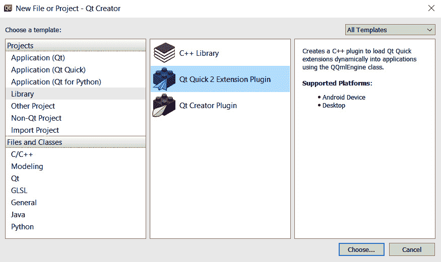

图 4.19 - Qt Quick 2 QML 扩展插件向导

这一部分是一个高级的 Qt 主题。您需要深入了解 Qt 才能创建自己的 QML 扩展插件。如果您是初学者，可以跳过本节，但您可以在以下链接的 Qt 文档中了解更多关于 QML 扩展插件的信息：

[`doc.qt.io/qt-6/qtqml-modules-cppplugins.html`](https://doc.qt.io/qt-6/qtqml-modules-cppplugins.html)

让我们继续下一节，了解如何在 C++类中调用 QML 方法。

## 在 C++类中调用 QML 方法

所有 QML 方法都暴露给元对象系统，并可以使用`QMetaObject::invokeMethod()`从 C++中调用。您可以在冒号字符后指定参数和返回值的类型，如下一个代码片段所示。当您想要将 C++中的信号连接到 QML 定义的特定签名的方法时，这可能很有用。如果省略类型，则 C++签名将使用`QVariant`。

让我们看一个调用 QML 方法的应用程序，使用`QMetaObject::invokeMethod()`。

在 QML 文件中，让我们添加一个名为`qmlMethod()`的方法，如下所示：

```cpp
import QtQuick
Item {
    function qmlMethod(msg: string) : string {
        console.log("Received message:", msg)
        return "Success"
    }
    Component.onCompleted: {
        console.log("Component created successfully.")
    }
}
```

在`main.cpp`文件中，按照以下代码片段调用`QMetaObject::invokeMethod()`：

```cpp
#include <QGuiApplication>
#include <QQmlApplicationEngine>
#include <QQmlComponent>
int main(int argc, char *argv[])
{
    QGuiApplication app(argc, argv);
    QQmlApplicationEngine engine;
    QQmlComponent component(&engine, 
                            "qrc:/CustomItem.qml");
    QObject *myObject = component.create();
    QString retValue = "";
    QString msg = "Message from C++";
    QMetaObject::invokeMethod(myObject, "qmlMethod",
                              Q_RETURN_ARG(QString, 
                              retValue),
                              Q_ARG(QString, msg));
    qDebug() << "QML method returned:" << retValue;
    delete myObject;
    return app.exec();
}
```

请注意，必须指定参数和返回类型。基本类型和对象类型都允许作为类型名称。如果类型在 QML 类型系统中未提及，则在调用`QMetaObject::invokeMethod`时，您必须使用`Q_RETURN_ARG()`和`Q_ARG()`声明`QVariant`作为类型。或者，如果您不需要任何返回值，可以只用两个参数调用`invokeMethod()`，如下所示：

`QMetaObject::invokeMethod(myObject, "qmlMethod");`

在本节中，您学会了从 QML 方法中接收数据。在下一节中，您将学习如何在 C++中访问 QML 对象指针。

## 将 QML 对象指针暴露给 C++

有时，您可能希望通过 C++修改 QML 对象的属性，例如修改控件的文本、更改控件的可见性或更改自定义属性。QML 引擎允许您将 QML 对象注册为 C++类型，从而自动公开 QML 对象的属性。

让我们看一个示例，我们将一个 QML 对象导出到 C++环境中：

```cpp
#ifndef CUSTOMOBJECT_H
#define CUSTOMOBJECT_H
#include <QObject>
#include <QVariant>
class CustomObject : public QObject
{
    Q_OBJECT
public:
    explicit CustomObject(QObject *parent = nullptr);
    Q_INVOKABLE void setObject(QObject* object)
    {
        object->setProperty("text", QVariant("Clicked!"));
    }
};
#endif // CUSTOMOBJECT_H
```

在 QML 文件中，您需要创建`C++`类的实例并调用`C++`方法。如下面的代码片段所示，在`C++`类内部操作属性：

```cpp
import QtQuick
import QtQuick.Window
import QtQuick.Controls
import MyCustomObject
Window {
    width: 640; height: 480;
    visible: true
    title: qsTr("QML Object in C++")
    CustomObject{
        id: customObject
    }
    Button {
        id: button
        anchors.centerIn: parent
        text: qsTr("Click Me!")
        onClicked: {
            customObject.setObject(button);
        }
    }
}
```

重要说明

Qt QML 模块提供了几个用于注册不可实例化类型的宏。`QML_ANONYMOUS`注册一个不可实例化且无法从 QML 引用的 C++类型。`QML_INTERFACE`注册一个现有的 Qt 接口类型。该类型无法从 QML 实例化，并且您不能使用它声明 QML 属性。`QML_UNCREATABLE`注册一个命名的不可实例化的 C++类型，但应该作为 QML 类型系统中的类型可识别。`QML_SINGLETON`注册一个可以从 QML 导入的单例类型。

恭喜！您已经学会了如何集成 QML 和 C++。在下一节中，我们将讨论如何在 QML 中使用 JS。

# 将 QML 与 JS 集成

QML 与 JS 有很好的集成，并使用类似**JavaScript 对象表示**（**JSON**）的语法，允许定义表达式和方法作为 JS 函数。它还允许开发人员导入 JS 文件并使用现有功能。QML 引擎提供了一个 JS 环境，与 Web 浏览器提供的 JS 环境相比有一些限制。Qt Quick 应用程序的逻辑可以在 JS 中定义。JS 代码可以内联编写在 QML 文件中，也可以编写在单独的 JS 文件中。

让我们看看如何在 QML 文档中使用内联 JS。下面的示例演示了`btnClicked()`内联 JS 函数。当单击`Button`控件时，将调用该方法：

```cpp
import QtQuick
import QtQuick.Window
import QtQuick.Controls
Window {
    width: 640; height: 480;
    visible: true
    title: qsTr("QML JS integration")
    function btnClicked(controlName) {
        controlName.text = "JS called!"
    }
    Column  {
        anchors.centerIn: parent
        Button {
            text:"Call JS!"
            onClicked: btnClicked(displayText)
        }
        Text {
            id: displayText
        }
    }
}
```

前面的示例展示了如何将 JS 代码与 QML 集成。我们使用了`btnClicked()`内联 JS 函数。当您运行应用程序时，将收到一条消息，上面写着**JS called!**。

如果您的逻辑非常复杂或在多个 QML 文档中使用，则使用单独的 JS 文件。您可以按如下方式导入 JS 文件：

`import "<JavaScriptFile>" as <Identifier>`

例如，您可以运行以下代码行：

`import "constants.js" as Constants`

在前面的示例中，我们将`constants.js`导入到 QML 环境中。`Constants`是我们 JS 文件的标识符。

您还可以创建一个共享的 JS 库。您只需在 JS 文件的开头包含以下代码行：

`.pragma library`

重要提示

如果脚本是单个表达式，则建议将其内联写入。如果脚本有几行长，则使用块。如果脚本超过几行长或被不同对象需要，则创建一个函数并根据需要调用它。对于长脚本，创建一个 JS 文件并在 QML 文件中导入它。避免使用`Qt.include()`，因为它已被弃用，并将在未来的 Qt 版本中删除。

要了解有关在 QML 中导入 JS 的更多信息，请阅读以下文档：

[`doc.qt.io/qt-6/qtqml-javascript-imports.html`](https://doc.qt.io/qt-6/qtqml-javascript-imports.html)

在本节中，您学习了如何将 JS 与 QML 集成。在下一节中，我们将讨论如何在 QML 中导入目录。

## 在 QML 中导入目录

您可以直接在另一个 QML 文件中导入包含 QML 文件的本地目录，而无需添加资源。您可以使用目录的绝对或相对文件系统路径来实现这一点，为 QML 类型提供了一种方便的方式，将其排列为可重用的目录在文件系统上。

目录导入的常见形式如下所示：

`import "<DirectoryPath>" [as <Qualifier>]`

例如，如果您的目录名称是`customqmlelements`，那么您可以按如下方式导入它：

`import "../customqmlelements"`

还可以将目录作为限定的本地命名空间导入，如下面的代码片段所示：

`import "../customqmlelements" as CustomQMLElements`

您还可以按以下方式从资源路径导入文件：

`import "qrc:/qml/customqmlelements"`

您还可以从远程服务器导入一个包含 QML 文件的目录。有两种不同类型的`qmldir`文件：QML 目录列表文件和 QML 模块定义文件。在这里，我们讨论的是使用`qmldir` QML 目录列表文件。可以使用`qmldir`文件导入目录。为了避免恶意代码，您必须小心处理网络文件。

以下文档提供了有关`qmldir` QML 目录列表文件的更多信息：

[`doc.qt.io/qt-6/qtqml-syntax-directoryimports.html`](https://doc.qt.io/qt-6/qtqml-syntax-directoryimports.html)

您可以在以下链接了解有关不同类型的`qmldir`文件的更多信息：

[`doc.qt.io/qt-6/qtqml-modules-qmldir.html`](https://doc.qt.io/qt-6/qtqml-modules-qmldir.html)

在本节中，您学习了如何在 QML 中导入目录。在下一节中，我们将讨论如何在 QML 中处理鼠标和触摸事件。

# 处理鼠标和触摸事件

QML 通过输入处理程序提供了对鼠标和触摸事件的出色支持，这些处理程序让 QML 应用程序处理鼠标和触摸事件。QML 类型，如`MouseArea`、`MultiPointTouchArea`和`TapHandler`用于检测鼠标和触摸事件。我们将在下一节中查看这些 QML 类型。

## MouseArea

`MouseArea`是一个不可见的项目，用于与可见项目（如`Item`或`Rectangle`）一起，以便为该项目提供鼠标和触摸处理事件。`MouseArea`在`Item`的定义区域内接收鼠标事件。您可以通过使用`anchors.fill`属性将`MouseArea`锚定到其父级区域来定义此区域。如果将 visible 属性设置为`false`，则鼠标区域对鼠标事件变得透明。

让我们看看如何在以下示例中使用`MouseArea`：

```cpp
import QtQuick
import QtQuick.Window
Window {
    width: 640; height: 480
    visible: true
    title: qsTr("Mouse Area Demo")
    Rectangle {
        anchors.centerIn: parent
        width: 100; height: 100
        color: "green"
        MouseArea {
            anchors.fill: parent
            onClicked: { parent.color = 'red' }
        }
    }
}
```

在前面的例子中，您可以看到只有`rectangle`区域收到了鼠标事件。窗口的其他部分没有收到鼠标事件。您可以根据鼠标事件执行相应的操作。`MouseArea`还提供了方便的信号，可以提供有关鼠标事件的信息，如鼠标悬停、鼠标按下、按住、鼠标退出和鼠标释放事件。编写相应的信号处理程序，并尝试使用`entered()`、`exited()`、`pressed()`和`released()`信号。您还可以检测按下了哪个鼠标按钮，并执行相应的操作。

## MultiPointTouchArea

`MultiPointTouchArea` QML 类型使多点触摸屏幕上的多个触摸点处理成为可能。与`MouseArea`一样，`MultiPointTouchArea`是一个不可见的项。您可以跟踪多个触摸点并相应地处理手势。当禁用时，触摸区域对触摸和鼠标事件都变得透明。在`MultiPointTouchArea`类型中，鼠标事件被处理为单个触摸点。您可以将`mouseEnabled`属性设置为`false`以停止处理鼠标事件。

让我们看一下以下示例，其中有两个矩形跟随我们的触摸点：

```cpp
import QtQuick
import QtQuick.Window
Window {
    width: 640; height: 480
    visible: true
    title: qsTr("Multitouch Example")
    MultiPointTouchArea {
        anchors.fill: parent
        touchPoints: [
            TouchPoint { id: tp1 },
            TouchPoint { id: tp2 }
        ]
    }
    Rectangle {
        width: 100; height: 100
        color: "blue"
        x: tp1.x; y: tp1.y
    }
    Rectangle {
        width: 100; height: 100
        color: "red"
        x: tp2.x; y: tp2.y
    }
}
```

在`MultiPointTouchArea`类型中，`TouchPoint`定义了一个触摸点。它包含有关触摸点的详细信息，如压力、当前位置和区域。现在，在您的移动设备上运行应用程序并进行验证！

在本节中，您了解了使用`MouseArea`和`MultiPointTouchArea`来处理鼠标和触摸事件。让我们在下一节中了解`TapHandler`。

## TapHandler

`TapHandler`是鼠标点击事件和触摸屏上的轻拍事件的处理程序。您可以使用`TapHandler`来对轻拍和触摸手势做出反应，并允许您同时处理多个嵌套项中的事件。有效轻拍手势的识别取决于`gesturePolicy`。`gesturePolicy`的默认值是`TapHandler.DragThreshold`，其中事件点不得显着移动。如果将`gesturePolicy`设置为`TapHandler.WithinBounds`，则`TapHandler`独占按下事件，但一旦事件点离开父项的边界，就会释放独占。同样，如果将`gesturePolicy`设置为`TapHandler.ReleaseWithinBounds`，则`TapHandler`独占按下事件，并保持独占直到释放，以便检测此手势。

让我们创建一个`TapHandler`类型，以识别不同的鼠标按钮事件和触笔轻拍，如下所示：

```cpp
import QtQuick
import QtQuick.Window
Window {
    width: 640; height: 480
    visible: true
    title: qsTr("Hello World")
    Item {
        anchors.fill:parent
        TapHandler {
            acceptedButtons: Qt.LeftButton
            onTapped: console.log("Left Button Clicked!")
        }
        TapHandler {
            acceptedButtons: Qt.MiddleButton
            onTapped: console.log("Middle Button Clicked!")
        }
        TapHandler {
            acceptedButtons: Qt.RightButton
            onTapped: console.log("Right Button Clicked!")
        }
        TapHandler {
             acceptedDevices: PointerDevice.Stylus
             onTapped: console.log("Stylus Tap!")
         }
    }
}
```

您可以使用`MouseArea`。输入处理程序使得形成复杂的触摸交互变得更简单，这是使用`MouseArea`或`TouchArea`难以实现的。

Qt 提供了一些现成的控件来处理通用手势，如捏合、轻扫和滑动。`PinchArea`是一个方便的 QML 类型，用于处理简单的捏合手势。它是一个不可见项，与另一个可见项一起使用。`Flickable`是另一个方便的 QML 类型，提供了一个用于轻扫手势的表面。探索相关文档和示例，以了解更多关于这些 QML 元素的信息。

让我们在下一节中看看`SwipeView`。

## SwipeView

`SwipeView`用于通过侧向滑动导航页面。它使用基于滑动的导航模型，并提供了一种简化的水平分页滚动方式。您可以在底部添加页面指示器以显示当前活动页面。

让我们看一个简单的例子，如下所示：

```cpp
import QtQuick
import QtQuick.Window
import QtQuick.Controls
Window {
    width: 640; height: 480
    visible: true
    title: qsTr("Swipe Demo")
    SwipeView {
        id: swipeView
        currentIndex: 0
        anchors.fill: parent
        Rectangle { id: page1; color: "red" }
        Rectangle { id: page2; color: "green"}
        Rectangle { id: page3; color: "blue" }   
    }     
    PageIndicator {
        id: pageIndicator
        count: swipeView.count
        currentIndex: swipeView.currentIndex
        anchors {
            bottom: swipeView.bottom
            horizontalCenter: parent.horizontalCenter
        }
    }
}
```

如您所见，我们只需向`SwipeView`添加子项。您可以将`SwipeView`当前索引设置为`PageIndicator`当前索引。`SwipeView`是导航模型之一，还包括`StackView`和`Drawer`。您可以探索这些 QML 类型，以在移动设备上体验手势。

在本节中，您了解了使用各种 QML 类型来处理鼠标、触摸和手势事件。接下来，我们将总结本章学到的内容。

# 总结

本章解释了 Qt Quick 模块的基础知识以及如何创建自定义 UI。您学会了如何使用 Qt Quick Designer 设计和构建 GUI，并了解了 Qt Quick Controls 以及如何构建自定义 Qt Quick 应用程序。您还学会了如何将 QML 与 C++和 JS 集成。现在您应该了解 Qt Widgets 和 Qt Quick 之间的相似之处和不同之处，并能够为您的项目选择最合适的框架。在本章中，我们学习了 Qt Quick 以及如何使用 QML 创建应用程序。您还学会了如何将 QML 与 JS 集成，并了解了鼠标和触摸事件。

在下一章中，我们将讨论使用 Qt Creator 进行跨平台开发。您将学习在 Windows、Linux、Android 和 macOS 操作系统（OSes）上配置和构建应用程序。我们将学习如何将我们的 Qt 应用程序移植到不同的平台，而不会遇到太多挑战。让我们开始吧！
