# 第五章：跨平台开发

自其最初发布以来，Qt 以其跨平台能力而闻名——这是创建该框架的主要愿景。您可以在 Windows、Linux 和 macOS 等喜爱的桌面平台上使用 Qt Creator，并使用相同的代码库或稍作修改创建流畅、现代、触摸友好的**图形用户界面**（**GUI**）和桌面、移动或嵌入式应用程序。您可以轻松修改您的代码并将其部署到目标平台上。Qt 具有几个内置工具，可分析您的应用程序及其在各种支持的平台上的性能。此外，与其他跨平台框架不同，它易于使用，并且具有直观的**用户界面**（**UI**）。

在本章中，您将学习跨平台开发的基本知识以及如何在不同平台上构建应用程序。有了这些，您将能够在您喜爱的桌面和移动平台上运行示例应用程序。

在本章中，我们将涵盖以下主要主题：

+   了解跨平台开发

+   了解编译器

+   使用`qmake`构建

+   Qt 项目（`.pro`）文件

+   了解构建设置

+   特定于平台的设置

+   在 Microsoft Visual Studio 中使用 Qt

+   在 Linux 上运行 Qt 应用程序

+   在 macOS 和 iOS 上运行 Qt 应用程序

+   其他 Qt 支持的平台

+   从 Qt 5 迁移到 Qt 6

本章结束时，您将了解 Qt 项目文件、基本设置以及如何在移动设备上运行 Qt 应用程序。让我们开始吧！

# 技术要求

本章的技术要求包括在最新的桌面平台（如 Windows 10、Ubuntu 20.04 或 macOS 10.14）上安装 Qt 6.0.0 和 Qt Creator 4.14.0 的最低版本。

本章中使用的所有代码都可以从以下 GitHub 链接下载：

[`github.com/PacktPublishing/Cross-Platform-Development-with-Qt-6-and-Modern-Cpp/tree/master/Chapter05/HelloWorld`](https://github.com/PacktPublishing/Cross-Platform-Development-with-Qt-6-and-Modern-Cpp/tree/master/Chapter05/HelloWorld)

重要说明

本章中使用的屏幕截图是在 Windows 平台上拍摄的。您将在您的机器上看到基于底层平台的类似屏幕。

# 了解跨平台开发

市场上有几种跨平台框架可供选择，但由于其成熟度和可用的社区支持，Qt 是更好的选择。对于传统的 C++开发人员来说，很容易适应 Qt 并开发高质量的应用程序。Qt 框架允许开发人员开发与多个平台兼容的应用程序，如 Windows、Linux、macOS、**QNX**（最初称为**Quick Unix** [**Qunix**]）、iOS 和 Android。它通过一次编码和随处部署的理念，促进更快的应用程序开发和更好的代码质量。Qt 在内部处理特定于平台的实现，并且还能让您在微控制器驱动的设备上构建令人印象深刻的超轻量级应用程序。

要使用 Qt 开发嵌入式平台的应用程序，您将需要商业许可证来使用**Qt for Device Creation**。Qt 还支持一些**微控制器单元**（**MCU**）平台，如瑞萨、STM32 和 NXP。在撰写本书时，Qt for MCUs 1.8 已推出，提供了具有较小内存占用的超轻量级模块。

使用 Qt 框架进行跨平台开发的一些优势列在这里：

+   降低开发成本的成本效益

+   更好的代码可重用性

+   便利性

+   更快的**上市时间**（**TTM**）

+   更广泛的市场覆盖

+   提供接近本机体验

+   性能优越

也有一些缺点，比如：

+   无法使用特定于平台的功能和访问所有平台的**应用程序编程接口**（**API**）

+   本地和非本地组件之间的通信挑战

+   特定设备功能和硬件兼容性挑战

+   延迟的平台更新

在本节中，您对 Qt 的跨平台特性有了基本了解，并了解了跨平台开发的利弊。在您可以在任何平台上运行应用程序之前，您需要一个编译器来为目标平台编译应用程序。在下一节中，我们将了解 Qt 框架支持的编译器。

# 了解编译器

在本节中，您将学习什么是编译器，以及如何在跨平台开发中使用它。编译器是一种软件，它将您的程序转换为计算机可以读取和执行的机器代码或低级指令。这些低级机器指令因平台而异。您可以使用不同的编译器（如**GNU 编译器集合**（**GCC**））编译 Qt 应用程序，或者使用供应商提供的编译器。在 Qt Creator 中，您可以在**Kits**选项卡下找到一个支持的编译器，以及在特定平台（如 Windows、Linux 或 macOS）上构建应用程序所需的其他基本工具。并非所有支持的编译器都包含在 Qt 安装程序中，但您可以在推荐的工具包中自动列出最常用的编译器。Qt 可能会停止支持某些工具包配置，或者用最新版本替换它们。

目前，Qt 支持以下编译器：

+   GCC

+   **Windows 的极简 GNU**（**MinGW**）

+   **Microsoft Visual C++**（**MSVC**）

+   **低级虚拟机**（**LLVM**）

+   **英特尔 C++编译器**（**ICC**）

+   `clang-cl`

+   Nim

+   QCC

此外，**Qt Creator 裸机设备**插件提供以下编译器的支持：

+   **IAR 嵌入式工作台**（**IAREW**）

+   KEIL

+   **小型设备 C 编译器**（**SDCC**）

除了上述编译器，Qt 在构建 Qt 项目时还使用特定的内置编译器。这些列在这里：

+   `moc`)

+   `uic`)

+   `rcc`)

您可以使用上述编译器构建目标平台的应用程序，或者添加自定义编译器配置。在下一节中，您将学习如何创建自定义编译器配置。

## 添加自定义编译器

要添加 Qt Creator 未自动检测到或不可用的编译器，请使用**自定义**选项。您可以指定编译器和工具链路径到相应的目录，并进行相应的配置。

要添加自定义编译器配置，请按照以下步骤操作：

1.  要在 Qt 中创建新的编译器配置，请单击菜单栏上的**工具**菜单，然后从左侧窗格中选择**Kits**选项卡。

1.  然后，单击**编译器**选项卡，并从**添加**下拉菜单中选择**自定义**。您将在上下文菜单中看到**C**和**C++**选项。根据您的需求选择类型。您可以在以下截图中看到这个概述：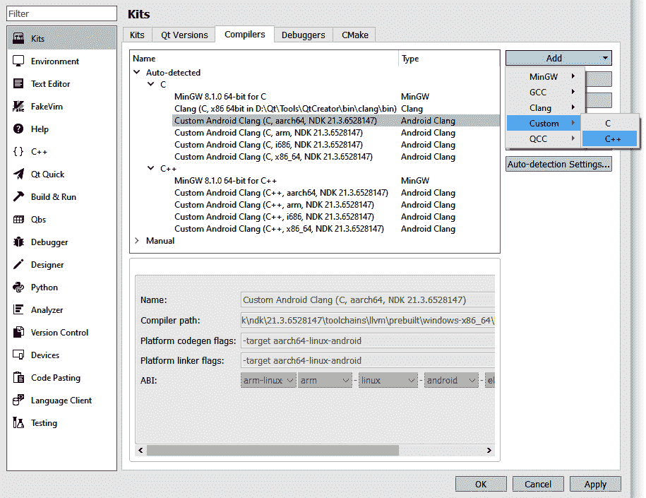

图 5.1-自定义编译器选项

1.  在下一步中，使用自定义名称填写**名称**字段。

1.  接下来，在**编译器路径**字段中，选择编译器所在目录的路径。

1.  接下来，指定`make`工具的位置。

1.  在下一步中，在**ABI**字段中指定**应用程序二进制接口**（**ABI**）版本。

您可以在以下截图中看到这个概述：

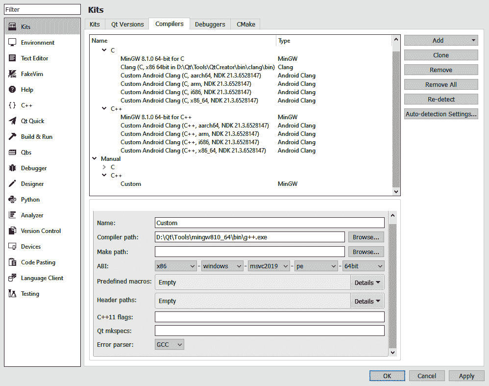

图 5.2-自定义编译器所需字段

1.  接下来，您可以在`MACRO[=value]`中指定默认所需的宏。

1.  在下一步中，在**头文件路径**字段中指定编译器检查头文件的路径。

1.  接下来，在`C++11`支持中。

1.  在下一步中，在**Qt mkspecs**字段中指定`mkspecs`（一组编译规则）的位置。

1.  接下来，在**错误解析器**字段中，选择合适的错误解析器。

1.  单击**应用**按钮以保存配置。

在本节中，您了解了支持的编译器以及如何在 Qt Creator 中创建新的编译器配置，但是要构建和运行项目，我们需要比编译器更多的工具。Qt 提供了`qmake`作为我们方便使用的内置构建工具。在下一节中，我们将讨论`qmake`是什么。

# 使用 qmake 构建

`Makefile`并构建可执行程序和库。`qmake`是 Qt 提供的一个构建工具，可简化跨多个平台的开发项目的构建过程。它将每个项目文件中的信息扩展到一个`Makefile`中，以执行必要的编译和链接命令。它也可以用于非 Qt 项目。`qmake`根据项目文件中的信息生成一个`Makefile`，并包含支持 Qt 开发的附加功能，自动包括`moc`和`uic`的构建规则。`qmake`还可以创建 Microsoft Visual Studio 项目，而无需开发人员更改项目文件。

作为一个社区驱动的框架，Qt 对开发者非常灵活，并且给予他们选择最合适的工具来进行项目开发的自由，而不是强迫他们使用自己的构建系统。Qt 支持以下类型的构建系统：

+   `qmake`

+   CMake

+   Qbs

+   Meson

+   Incredibuild

您可以从 Qt Creator UI 或命令行中运行`qmake`。每次对项目文件进行更改时，都应该运行`qmake`。以下是从命令行运行`qmake`的语法：

```cpp
>qmake [mode] [options] files
```

`qmake`提供了两种不同的操作模式。在默认模式下，`qmake`使用项目文件中的信息生成`Makefile`，但它也可以生成项目文件。模式如下所示：

+   `-makefile`

+   `-project`

在`qmake`中，将生成一个用于构建项目的`Makefile`。运行`qmake`以 Makefile 模式的语法如下所示：

```cpp
>qmake -makefile [options] files
```

在项目模式下，`qmake`将生成一个项目文件。运行`qmake`的语法如下所示：

```cpp
>qmake -project [options] files
```

如果您将 Visual Studio 作为`qmake`项目，`qmake`可以创建一个包含开发环境所需的所有基本信息的 Visual Studio 项目。它可以递归生成子目录中的`.vcproj`文件和主目录中的`.sln`文件，使用以下命令：

```cpp
>qmake -tp vc -r
```

例如，您可以通过运行以下命令为您的`HelloWorld`项目生成一个 Visual Studio 项目：

```cpp
>qmake -tp vc HelloWorld.pro
```

请注意，每次修改项目文件时，都需要运行`qmake`以生成更新的 Visual Studio 项目。

您可以在以下链接找到有关`qmake`的更多详细信息：

[`doc.qt.io/qt-6/qmake-manual.html`](https://doc.qt.io/qt-6/qmake-manual.html)

大多数`qmake`项目文件使用`name = value`和`name += value`定义的列表定义项目中使用的源文件和头文件，但`qmake`中还有其他高级功能，使用其他运算符、函数、平台范围和条件来创建跨平台应用程序。有关`qmake`语言的更多详细信息，请访问以下链接：[`doc.qt.io/qt-6/qmake-language.html`](https://doc.qt.io/qt-6/qmake-language.html)。

Qt 团队在 Qt 6 中付出了很多努力，使其具有未来的可扩展性，通过使用广泛采用的流行构建工具**CMake**。已经实施了一些变化，通过使用**Conan**作为一些附加组件的包管理器，使 Qt 更加模块化。在 Qt 6 中，一些 Qt 模块不再作为 Qt 在线安装程序中的二进制包可用，而是作为 Conan 配方可用。您可以在以下链接了解有关构建系统更改以及将 CMake 作为默认构建工具的更多信息：[`doc.qt.io/qt-6/qt6-buildsystem.html`](https://doc.qt.io/qt-6/qt6-buildsystem.html)。

重要提示

在 Qt 5 中，构建系统是基于`qmake`构建的，但在 Qt 6 中，CMake 是构建 Qt 源代码的构建系统。这种变化只影响想要从源代码构建 Qt 的开发人员。您仍然可以使用`qmake`作为 Qt 应用程序的构建工具。

在本节中，您了解了`qmake`。我们将跳过高级的`qmake`主题，以便自行探索。在下一节中，我们将讨论 Qt 项目文件，这些文件由`qmake`解析。

# Qt 项目（.pro）文件

在早期示例中由 Qt Creator 创建的`.pro`文件实际上是 Qt 项目文件。`.pro`文件包含`qmake`构建应用程序、库或插件所需的所有信息。项目文件支持简单和复杂的构建系统。简单的项目文件可以使用直接的声明，定义标准变量以指示项目中使用的源文件和头文件。复杂的项目可能使用多个流结构来优化构建过程。项目文件包含一系列声明，用于指定资源，例如指向项目所需的源文件和头文件的链接、项目所需的库、不同平台的自定义构建过程等。

Qt 项目文件有几个部分，并使用某些预定义的`qmake`变量。让我们看一下我们早期的`HelloWorld`示例`.pro`文件：

```cpp
QT       += core gui
greaterThan(QT_MAJOR_VERSION, 4): QT += widgets
CONFIG += c++17
# You can make your code fail to compile if it uses 
# deprecated APIs.
# In order to do so, uncomment the following line.
#DEFINES += QT_DISABLE_DEPRECATED_BEFORE=0x060000    
# disables all the APIs deprecated before Qt 6.0.0
SOURCES += \
    main.cpp \
    widget.cpp
HEADERS += \
    widget.h
FORMS += \
    widget.ui
# Default rules for deployment.
qnx: target.path = /tmp/$${TARGET}/bin
else: unix:!android: target.path = /opt/$${TARGET}/bin
!isEmpty(target.path): INSTALLS += target
```

项目文件只是告诉`qmake`项目中所需的 Qt 模块，以及可执行程序的名称。它还链接到需要包含在项目中的头文件、源文件、表单文件和资源文件。所有这些信息对于`qmake`创建配置文件和构建应用程序至关重要。对于更复杂的项目，您可能需要为不同的操作系统不同地配置项目文件。

以下列表描述了最常用的变量，并描述了它们的目的：

+   `QT`：项目中使用的 Qt 模块列表

+   `CONFIG`：一般项目配置选项

+   `DESTDIR`：可执行文件或二进制文件将放置在其中的目录

+   `FORMS`：要由 UI 编译器（`uic`）处理的 UI 文件列表

+   `HEADERS`：构建项目时使用的头文件（`.h`）文件名列表

+   `RESOURCES`：要包含在最终项目中的资源（`.qrc`）文件列表

+   `SOURCES`：在构建项目时要使用的源代码（`.cpp`）文件列表

+   `TEMPLATE`：用于项目的模板

您可以向项目添加不同的 Qt 模块、配置和定义。让我们看看如何做到这一点。要添加额外的模块，只需在`QT +=`之后添加模块关键字，如下所示：

`QT += core gui sql`

您还可以在前面添加条件，以确定何时向项目添加特定模块，如下所示：

`greaterThan(QT_MAJOR_VERSION, 4): QT += widgets`

您还可以向项目添加配置设置。例如，如果要在编译项目时指定`c++17`规范，则将以下行添加到您的`.pro`文件中：

`CONFIG += c++17`

您可以向项目文件添加注释，以井号（`#`）开头，构建系统将忽略相应的文本行。现在，让我们看一下`TEMPLATE`变量。这确定构建过程的输出是应用程序、库还是插件。有不同的变量可用于概述`qmake`将生成的文件类型。这些列在下面：

+   `app`用于构建应用程序。

+   `lib`用于构建库。

+   `aux`用于构建空内容。如果不需要调用编译器来创建目标（例如，因为项目是用解释语言编写的），则使用此选项。

+   `subdirs`用于使用`SUBDIRS`变量指定的子目录。每个子目录必须包含自己的项目文件。

+   `vcapp`用于创建用于构建应用程序的 Visual Studio 项目文件。

+   `vclib`用于创建一个 Visual Studio 项目文件，以构建库。

+   `vcsubdirs`用于创建一个 Visual Studio 解决方案文件，以在子目录中构建项目。

Qt 项目文件有时需要依赖于`include`功能。在 Qt 项目文件中，您还可以定义两个重要的变量：`INCLUDEPATH`和`DEPENDPATH`。您可以使用`SUBDIRS`变量来编译一组依赖库或模块。

现在，让我们讨论一下`.pri`文件是什么。

## 了解`.pro`和`.pri`文件之间的区别

您可以创建一个`.pri`文件来包含复杂项目中的项目文件。这样可以提高可读性并将不同模块分隔开。`.pri`文件通常被称为`qmake`包含文件，其格式与`.pro`文件类似。主要区别在于使用意图；`.pro`文件是我们期望直接在其上运行`qmake`的文件，而`.pri`文件是由`.pro`文件包含的。您可以将常见配置，如源文件、头文件、`.ui`文件和`.qrc`文件添加到`.pri`文件中，并根据项目需求从多个`.pro`文件中包含它们。

您可以在`.pro`文件中包含一个`.pri`文件，如下所示：

`include($$PWD/common.pri)`

在本节中，您了解了 Qt 项目文件是什么，以及其中使用的不同变量。在下一节中，我们将讨论不同的构建设置。

# 了解构建设置

在编译或构建项目之前，编译器需要某些细节，这些细节称为构建设置。这是编译过程中非常重要的一部分。在本节中，您将了解构建设置以及如何以正确的方式配置它们。您可以为同一个项目拥有多个构建配置。通常，Qt Creator 会自动创建调试、发布和配置文件构建配置。调试构建包含用于调试应用程序的额外调试符号，而发布版本是一个经过优化的版本，不包含这样的符号。通常，开发人员使用调试配置进行测试，使用发布配置创建最终的二进制文件。配置文件构建是一个经过优化的发布构建，附带单独的调试信息，最适合于分析应用程序。

构建设置可以在**项目**模式中指定。如果 IDE 中没有打开项目，则可能会发现**项目**按钮被禁用。您可以通过单击**添加**下拉按钮，然后选择要添加的配置类型来添加新的构建配置。选项可能取决于为项目选择的构建系统。您可以根据需要添加多个构建配置。您可以单击**克隆…**按钮，以基于当前构建配置添加一个构建配置，或单击**重命名…**按钮来重命名当前选定的构建配置。单击**删除**按钮来删除一个构建配置。

您可以在以下截图中看到这个概述：

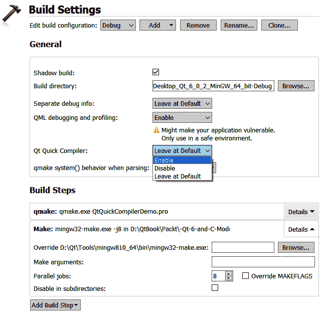

图 5.3 - 构建设置和 Qt Quick 编译器选项

通常，Qt Creator 在与源目录不同的目录中构建项目，称为影子构建。这样可以将为每个构建和运行工具生成的文件分隔开。如果您只想使用单个工具包构建和运行，则可以取消选择**影子构建**复选框。Qt Creator 项目向导创建了一个可以编译使用**Qt 资源系统**的 Qt Quick 项目。要使用默认设置，请选择**保持默认**。要编译 Qt Quick 代码，请在**Qt Quick 编译器**字段中选择**启用**，如*图 5.3*所示。

您可以在以下链接中了解有关不同构建配置的更多信息：

[`doc.qt.io/qtcreator/creator-build-settings.html`](https://doc.qt.io/qtcreator/creator-build-settings.html)

在本节中，我们讨论了构建设置。在构建跨平台应用程序时，向项目文件添加特定于平台的配置非常重要。在下一节中，我们将学习有关特定于平台的设置。

# 特定于平台的设置

您可以为不同的平台定义不同的配置，因为并非每种配置都适用于所有用例。例如，如果您想为不同的操作系统包含不同的头文件路径，您可以将以下代码行添加到您的`.pro`文件中：

```cpp
win32: INCLUDEPATH += "C:/mylibs/windows_headers"
unix:INCLUDEPATH += "/home/user/linux_headers"
```

在上述代码片段中，我们添加了一些特定于 Windows 和特定于 Linux 的头文件。您还可以像这样在 C++中放置配置，例如`if`语句：

```cpp
win32 {
    SOURCES += windows_code.cpp
}
```

上述代码仅适用于 Windows 平台，这就是为什么我们在前面加了一个`win32`关键字。如果您的目标平台是基于 Linux 的，那么您可以添加一个`unix`关键字来添加特定于 Linux 的配置。

要在 Windows 平台上为应用程序设置自定义图标，您应该将以下代码行添加到您的项目（`.pro`）文件中：

`RC_ICONS = myapplication.ico`

要在 macOS 上为应用程序设置自定义图标，您应该将以下代码行添加到您的项目（`.pro`）文件中：

`ICON = myapplication.icns`

请注意，Windows 和 macOS 的图标格式不同。对于 Linux 发行版，制作每种风格的桌面条目有不同的方法。

在本节中，我们讨论了一些特定于平台的设置。在下一节中，我们将学习如何在 Qt VS 工具中使用 Visual Studio。

# 在 Microsoft Visual Studio 中使用 Qt

一些开发人员选择 Visual Studio 作为他们首选的 IDE。因此，如果您喜欢的 IDE 是 Visual Studio，那么您可以将 Qt VS 工具与 Microsoft Visual Studio 集成。这将允许您在标准的 Windows 开发环境中使用，而无需担心与 Qt 相关的构建步骤或工具。您可以直接从 Microsoft Visual Studio 安装和更新 Qt VS 工具。

您可以从 Visual Studio Marketplace 找到相应版本的 Qt Visual Studio 工具。对于 Visual Studio 2019，您可以从以下链接下载该工具：[`marketplace.visualstudio.com/items?itemName=TheQtCompany.QtVisualStudioTools2019`](https://marketplace.visualstudio.com/items?itemName=TheQtCompany.QtVisualStudioTools2019)。您还可以从以下 Qt 下载链接下载`VS`插件：[`download.qt.io/official_releases/vsaddin/`](https://download.qt.io/official_releases/vsaddin/)。

这些是 Qt VS 工具的一些重要功能：

+   创建新项目和类的向导

+   `moc`、`uic`和`rcc`编译器的自动构建设置

+   导入和导出`.pro`和`.pri`文件

+   将 Qt VS 工具项目自动转换为`qmake`项目

+   集成 Qt 资源管理

+   能够创建 Qt 翻译文件并与**Qt Linguist**集成

+   集成**Qt Designer**

+   集成 Qt 文档

+   用于 Qt 数据类型的调试扩展

要开始在 Visual Studio 环境中使用这些功能，您必须设置 Qt 版本。从`.pro`文件中选择适当的版本与`qmake`或从 Visual Studio 中的`.vcproj`文件构建您的项目。由于 Visual Studio 用于特定于 Windows 的开发，建议将 Qt Creator 用作跨平台开发的 IDE。

如果您没有`.vcproj`文件，那么您可以通过命令行或通过 VS 工具从`.pro`文件生成一个。我们已经在*使用 qmake 构建*部分讨论了命令行指令。您还可以通过使用`.vcproj`文件将您的`.pro`文件转换为`.vcproj`文件，该文件仅包含特定于 Windows 的设置。

在本节中，我们讨论了`VS`插件。在下一节中，我们将学习如何在 Linux 上运行一个示例应用程序。我们将跳过在 Windows 上构建和运行 Qt 应用程序的讨论，因为我们已经在前几章中讨论过这个问题。

# 在 Linux 上运行 Qt 应用程序

在 Linux 上构建和运行 Qt 应用程序与在 Windows 上运行类似，但 Linux 有许多发行版，因此很难构建一个完美运行在所有 Linux 变体上的应用程序。在大多数发行版中，应用程序将会顺利运行。我们将以 Ubuntu 20.04 作为目标平台。当你在 Ubuntu 上安装 Qt 时，它会自动检测套件和配置。你也可以配置一个带有适当编译器和 Qt 版本的套件，如下截图所示：

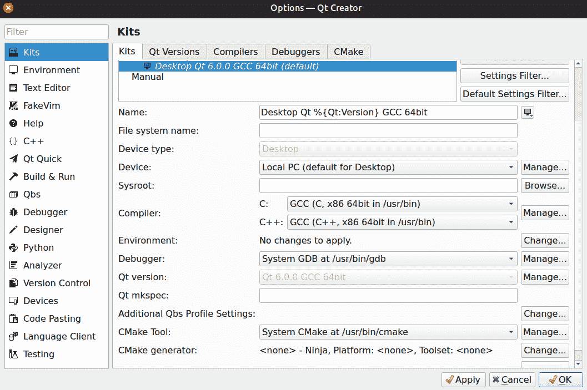

图 5.4 - Ubuntu 上的桌面套件配置

让我们在 Ubuntu 上运行我们的`HelloWorld`示例。点击左侧窗格上的**运行**按钮。一个显示**Hello World!**的 UI 将立即出现，如下截图所示：

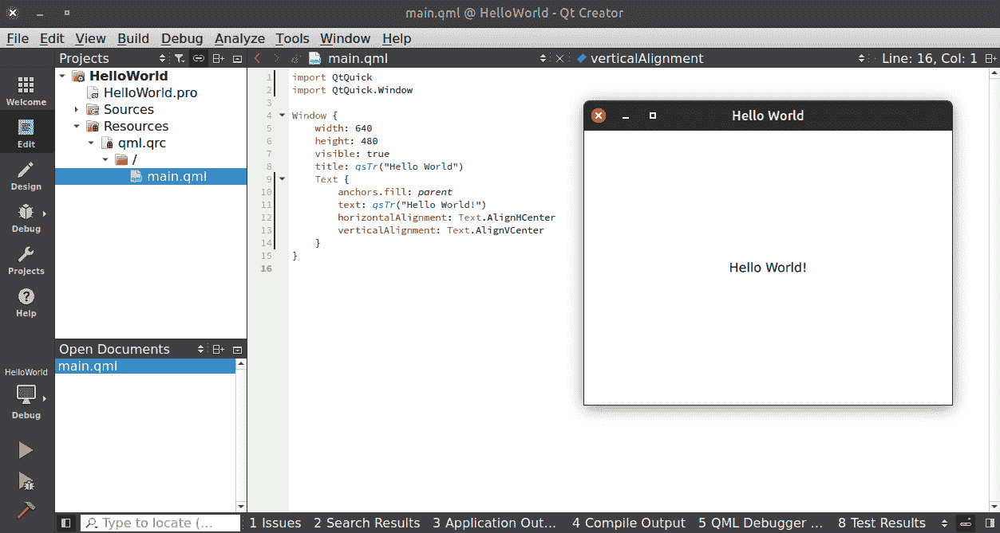

图 5.5 - Ubuntu 上运行的应用程序

你也可以从命令行运行应用程序，如下面的代码片段所示：

```cpp
$./HelloWorld
```

在本节中，我们讨论了如何在 Linux 发行版上运行我们的应用程序。在下一节中，我们将学习如何在 macOS 和 iOS 上运行 Qt 应用程序。

# 在 macOS 和 iOS 上运行 Qt 应用程序

我们已经在前几章讨论了如何在 Windows 和 Linux 平台上构建和运行应用程序。让我们继续学习如何在 macOS 和 iOS 等平台上运行我们的应用程序。要在 macOS 和 iOS 上构建 Qt 应用程序，你需要从 App Store 下载 Xcode。Xcode 是 macOS 的 IDE，包括一套用于在 macOS 和 iOS 中开发应用程序的软件开发工具。如果你已经安装了 Xcode，Qt Creator 将检测到其存在并自动检测到合适的套件。至于套件选择，Qt for macOS 支持 Android、`clang` 64 位、iOS 和 iOS 模拟器的套件。

你可以在下面的截图中看到 macOS 上的桌面套件配置示例：

图 5.6 - macOS 上的桌面套件配置

](img/Figure_5.6_B16231.jpg)

图 5.6 - macOS 上的桌面套件配置

如果你不想使用自动检测的调试器，你也可以在**调试器**选项卡中手动添加调试器，如下截图所示：

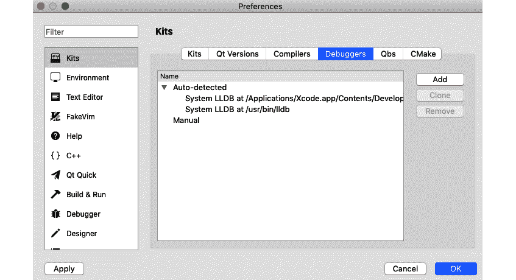

图 5.7 - macOS 上的调试器选项

在 macOS 上运行应用程序与在 Windows 上运行类似。只需点击**运行**按钮，你将立即看到应用程序运行。

移动平台与 Windows、Linux 和 macOS 等桌面平台同等重要。让我们探讨如何设置运行 iOS 应用程序的环境。

## 为 iOS 配置 Qt Creator

在 iOS 上运行 Qt 应用程序非常简单。你可以连接你的 iOS 设备，并从设备选择列表中选择合适的设备类型。你可以从**套件**选择屏幕中选择**设备类型**。你也可以在 iOS 模拟器上运行应用程序，如下截图所示：

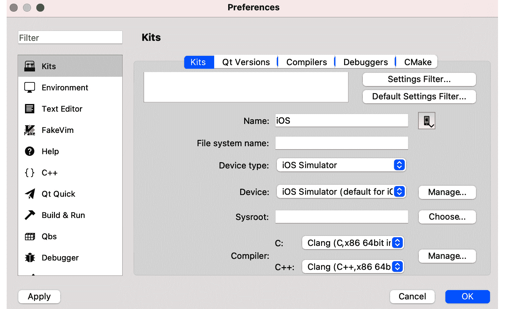

图 5.8 - macOS 上的 iOS 模拟器选项

配置好套件后，只需将 iPhone 连接上并点击**运行**按钮。你可以在下面的截图中看到一个示例输出：

图 5.9 - Qt Creator 在 iPhone 上运行应用程序

](img/Figure_5.9_B16231.jpg)

图 5.9 - Qt Creator 在 iPhone 上运行应用程序

在 iOS 平台上构建和运行应用程序相对容易。然而，分发应用程序并不容易，因为 App Store 是一个非常封闭的生态系统。你需要一个 Apple ID，并且需要在分发应用程序给用户之前登录你的 iOS 应用程序。你无法避开这些步骤，但现在让我们跳过部署部分。 

你可以在以下链接了解更多关于 App Store 提交的信息：

[`developer.apple.com/app-store/submissions`](https://developer.apple.com/app-store/submissions)

在本节中，我们学习了如何在 macOS 和 iOS 上运行应用程序。在下一节中，我们将学习如何为 Android 平台配置和构建应用程序。

## 为 Android 配置 Qt Creator

Android 是当今最流行的移动平台，因此开发人员希望为 Android 构建应用程序。尽管 Android 是基于 Linux 的操作系统，但它与其他 Linux 发行版非常不同。为了使用它，您必须配置 Qt Creator 并安装某些软件包。

为了使 Qt Creator 配置 Android 顺利运行，请使用 OpenJDK 8，带有 clang 工具链的 NDK r21。您可以从`ANDROID_SDK_ROOT\cmdline-tools\latest\bin`运行 sdkmanager，并使用必要的参数配置所需的依赖项。

您可以在以下链接中了解有关 Android 特定要求和说明的更多信息：

[`doc.qt.io/qt-6/android-getting-started.html`](https://doc.qt.io/qt-6/android-getting-started.html)

让我们开始按照以下步骤配置您的机器以用于 Android：

1.  要在 Android 上构建 Qt 应用程序，您必须在开发 PC 上安装 Android**软件开发工具包**（**SDK**），Android**本机开发工具包**（**NDK**），**Java 开发工具包**（**JDK**）和 OpenSSL，无论您的桌面平台如何。您将在每个相应字段旁边找到带有地球图标或**下载**按钮的下载选项，以从各自软件包的页面下载。

1.  安装所有必需的软件包后，重新启动 Qt Creator。Qt Creator 应该能够自动检测构建和平台工具。

1.  但是，您可能需要进一步配置以修复**Android**设置中的错误。您可能会发现 SDK 管理器、平台 SDK 和必要的软件包缺失，如下截图所示：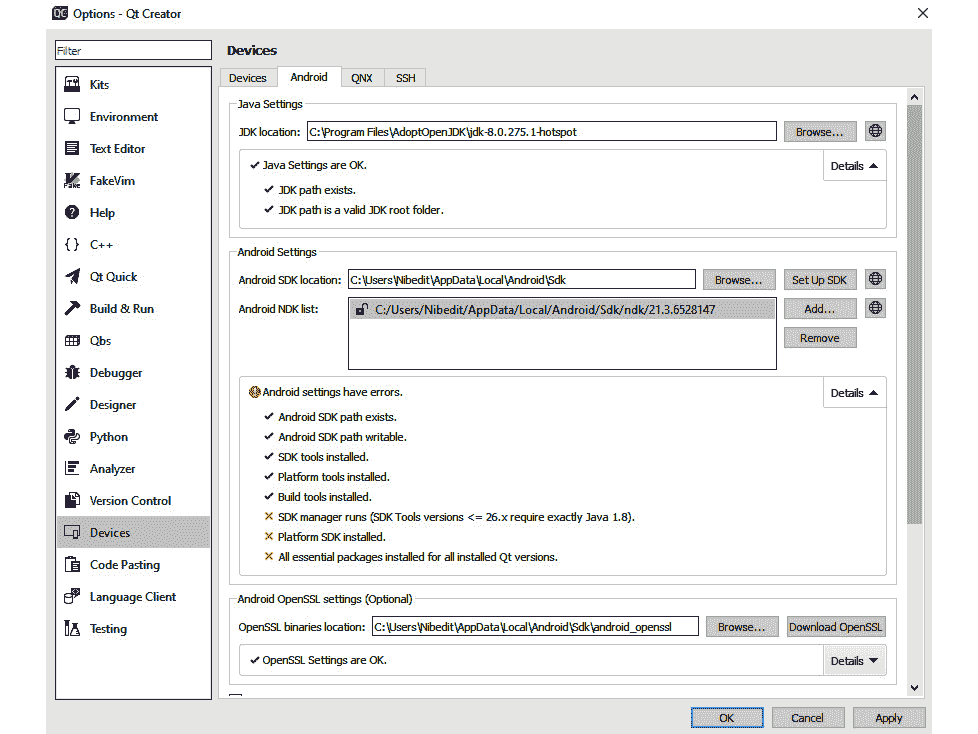

图 5.10 - Android 设置屏幕

1.  在**Android 设置**下选择正确的 SDK 和 NDK 路径。点击**应用**按钮以保存更改。

1.  点击**SDK 管理器**选项卡，然后点击**更新已安装**按钮。您可能会看到一个消息框，提示您安装缺少的软件包，如下截图所示。点击**是**按钮来安装这些软件包：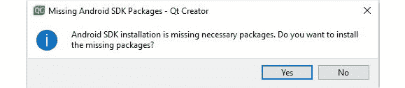

图 5.11 - 显示缺少 Android 软件包的信息消息

1.  您可能会收到另一条消息，警告 Android SDK 更改，列出缺少的基本软件包，如下截图所示。点击**确定**按钮：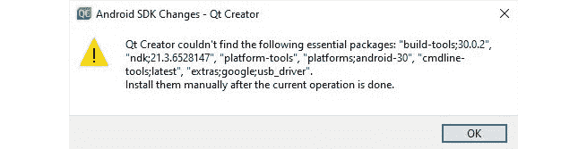

图 5.12 - 关于缺少 Android 软件包的警告

1.  点击`--verbose`，然后点击**确定**按钮。您可以在以下截图中看到概述：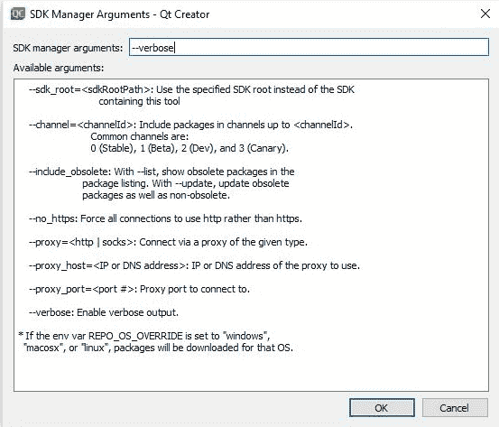

图 5.13 - Android SDK 管理器工具

1.  一旦问题解决，您将看到所有 Android 设置已经正确配置，如下截图所示：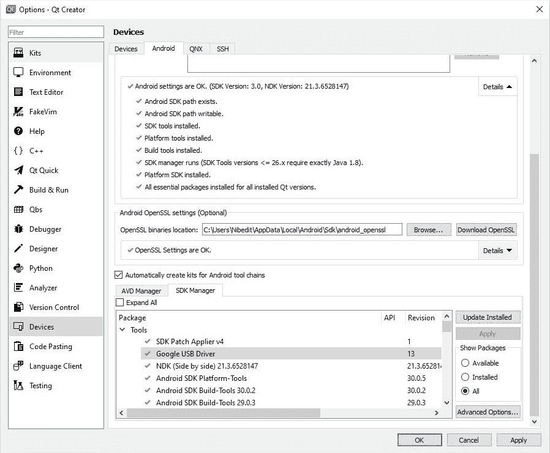

图 5.14 - 在 Qt Creator 中正确的 Android 配置

1.  如果问题仍未解决，或者您想安装特定平台，您可以输入适当的命令，如下截图所示。您还可以从命令行安装所需的软件包。Qt 将自动检测 SDK 位置中可用的构建工具和平台：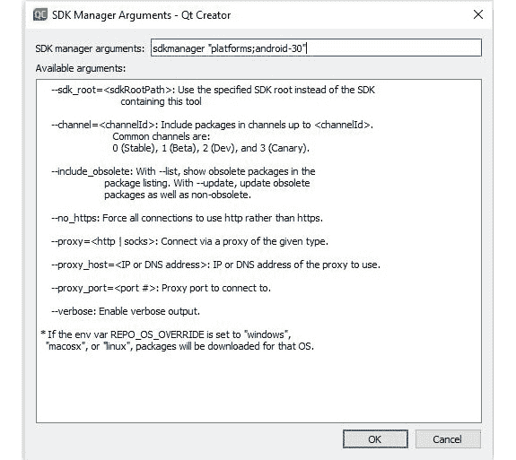

图 5.15 - Android SDK 管理器工具

1.  一旦 Android 设置正确配置，您可以看到 Android kit 已准备好进行开发，如下面的截图所示：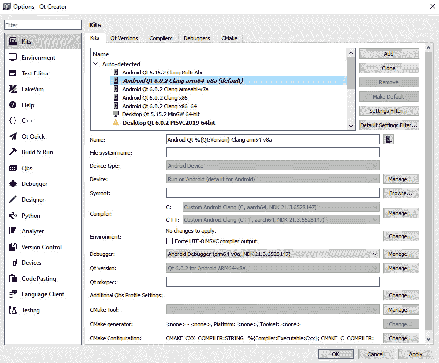

图 5.16 - 正确配置的 Android kit

1.  从**Kit**选择选项中选择一个 Android kit，如下面的截图所示：

图 5.17 - Android Kit 选择选项

1.  在这一步中，您可以选择目标 Android 版本，并通过 Qt Creator 创建`AndroidManifest.xml`文件来配置您的 Android 应用程序。您可以设置包名称、版本代码、SDK 版本、应用程序图标、权限等。设置如下截图所示：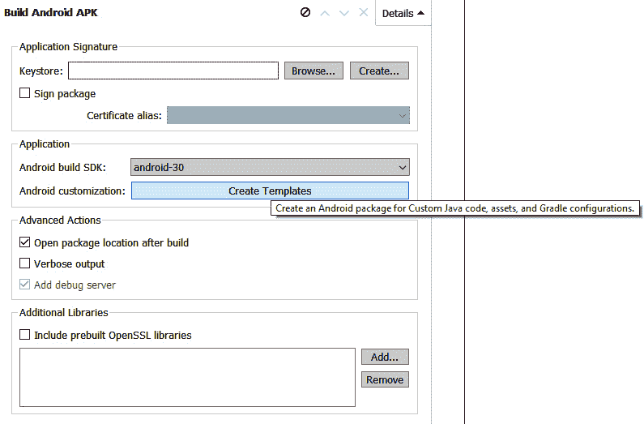

图 5.18 - 构建设置中的 Android 清单选项

1.  您的计算机现在已准备好进行 Android 开发。但是，您的 Android 硬件需要启用开发者选项，或者使用 Android 模拟器。要启用**Developer**模式，转到**Settings**，点击**System**，然后点击**About phone**。

1.  然后，点击**Software info**，找到构建号。不断点击**Builder number**，直到看到**Developer**模式已激活。可能需要点击七次才能激活**Developer**模式。现在，返回到**Settings**面板，您现在将找到**Developer**选项。

1.  您的 Android 设备已准备好运行 Android 应用程序。单击**Run**按钮，然后从**Compatible device**列表屏幕中选择设备。

1.  接下来，点击`build`文件夹中生成的`.apk`文件。

恭喜！您已成功开发了 Android 应用程序。与 iOS 不同，Android 是一个开放系统。您可以将`.apk`文件复制或分发到运行相同 Android 版本的其他 Android 设备上，然后安装它。但是，如果您想在 Google Play 商店上分发您的应用程序，那么您将需要注册为 Google Play 开发者并签署包。

在本节中，我们学习了如何配置和构建 Android 平台。在下一节中，我们将讨论在本书编写时 Qt 6 支持的其他平台。

# 其他 Qt 支持的平台

Qt 5 支持广泛的平台，从桌面和移动平台到嵌入式和 Web 平台。Qt 6 尚未支持 Qt 5 中支持的所有平台，但随着 Qt 6 的成熟，这些平台将逐渐得到支持。目前，在商业许可下，Qt 6 的最新版本仅支持嵌入式 Linux。您可能需要等一段时间才能将应用程序移植到不同的嵌入式平台上的 Qt 6。否则，如果您想立即迁移到 Qt 6 以适用于您喜爱的嵌入式平台，您必须从源代码构建并进行必要的修改。

以下链接提供了 Qt 6.2 中嵌入式 Linux 支持的快照：[`doc-snapshots.qt.io/qt6-dev/embedded-linux.html`](https://doc-snapshots.qt.io/qt6-dev/embedded-linux.html)。随着 Qt 迈向下一个版本，此链接可能会更新。

Qt 还为商业许可下的嵌入式 Linux 系统提供了**Boot to Qt**软件堆栈。这是一个轻量级的、经过 Qt 优化的完整软件堆栈，安装在目标系统上。Boot to Qt 软件堆栈使用传统的嵌入式 Linux 内核，设计有 Poky 和 Yocto 软件包。

在以下链接中了解更多关于 Boot to Qt 的信息：

[`doc.qt.io/QtForDeviceCreation/b2qt-index.html`](https://doc.qt.io/QtForDeviceCreation/b2qt-index.html)

**Qt for WebAssembly** 允许您为 Web 平台构建 Qt 应用程序。它不一定需要任何客户端安装，并节省服务器资源。它是一个平台插件，可以让您构建可以嵌入到网页中的 Qt 应用程序。在 Qt 6 中，尚未向开源开发人员提供此插件。商业许可证持有人可能会提前获得使用此插件的权限。

您可以在以下链接上了解有关 **Qt for WebAssembly** 插件的更多信息：

[`wiki.qt.io/Qt_for_WebAssembly`](https://wiki.qt.io/Qt_for_WebAssembly)

在本节中，我们了解了 Qt 6 支持的其他平台。在下一节中，我们将讨论如何将应用程序从 Qt 5 迁移到 Qt 6。

# 从 Qt 5 迁移到 Qt 6

**Qt 6** 是 Qt 框架的重大变化，因此它会破坏一些向后兼容性。因此，在升级到 Qt 6 之前，请确保您的 Qt 5 应用程序已更新到 Qt 5.15。从 Qt 5.15 迁移到 Qt 6 将更容易，需要的更改最少。但是，在 Qt 5.15 中标记为已弃用或过时的 API 在 Qt 6.0 中可能已被移除。

Qt 5 和 Qt 6 中的 CMake API 在语义上几乎是相同的。因此，Qt 5.15 引入了无版本目标和命令，允许编写完全独立于 Qt 版本的 CMake 代码。无版本导入目标对于需要同时进行 Qt 5 和 Qt 6 编译的项目非常有用。不建议默认使用它们，因为缺少目标属性。您可以在以下链接上阅读更多信息：[`doc.qt.io/qt-6/cmake-qt5-and-qt6-compatibility.html`](https://doc.qt.io/qt-6/cmake-qt5-and-qt6-compatibility.html)。

在 Qt 6 中，一些类和模块已被移除，但这些类和模块在 `Qt5Compat` 中保留以便于迁移。除了构建系统的更改之外，您可能需要修复过时类的包含指令，例如，Qt6 中的类如 `QLinkedList`、`QRegExp` 和 `QTextCodec` 都被新类替换。但为了便于迁移，您需要将 `core5compat` 添加到您的 `.pro` 文件中，如下所示：

`QT += core5compat`

关于绘图机制也有一些变化。如果您使用了 OpenGL 风格的 `qsb` 工具，您的着色器代码应该编译成 **Standard Portable Intermediate Representation-Vulkan** (**SPIR-V**) 格式。我们将在 *第八章* 中详细讨论图形和动画。更多细节可以在以下链接找到：[`doc.qt.io/qt-6/qtshadertools-index.html`](https://doc.qt.io/qt-6/qtshadertools-index.html)。

`QtGraphicalEffects` 也有一些变化，已从 Qt 6 中移除，并将以不同的许可证提供。Qt Quick MultiEffect 可在 Qt Marketplace 上获得，并提供更好的性能。您还可以考虑将 QML 中的早期信号连接更新为使用 JavaScript 函数声明，如以下代码片段所示：

```cpp
Connections {
    target: targetElement
    function onSignalName() {//Do Something}
}
```

Qt 状态机模块在很大程度上与 Qt 5 版本兼容，因此您应该能够继续在其项目上工作，而不需要或只需要进行轻微的更改。要使用状态机模块的类，请将以下代码添加到您的 Qt 项目（`.pro`）文件中：

```cpp
QT += statemachine
```

要在 QML 文件中导入状态机模块，请使用以下 `import` 语句：

`import QtQml.StateMachine`

Qt 提供了详细的迁移指南。如果您希望将 Qt 5 应用程序迁移到 Qt 6，请查看以下文档：

[`doc.qt.io/qt-6/portingguide.html`](https://doc.qt.io/qt-6/portingguide.html)

[`www.qt.io/blog/porting-from-qt-5-to-qt-6-using-qt5compat-library`](https://www.qt.io/blog/porting-from-qt-5-to-qt-6-using-qt5compat-library)

[`doc.qt.io/qt-6/porting-to-qt6-using-clazy.html`](https://doc.qt.io/qt-6/porting-to-qt6-using-clazy.html)

在本节中，您学习了如何将您的应用程序从 Qt 5 迁移到 Qt 6。在下一节中，我们将总结本章学到的内容。

# 总结

本章介绍了使用 Qt Creator 进行跨平台开发。您了解了各种编译器、构建工具以及构建和特定平台的设置。在本章中，您学会了在桌面和移动平台上配置和构建应用程序，以及如何在 iPhone 和 Android 设备上运行应用程序。我们讨论了如何在不太多的挑战下将您的 Qt 项目移植到不同的平台。

在下一章中，您将学习有关信号和槽机制、Qt 元对象系统和事件处理的知识。让我们继续吧！
