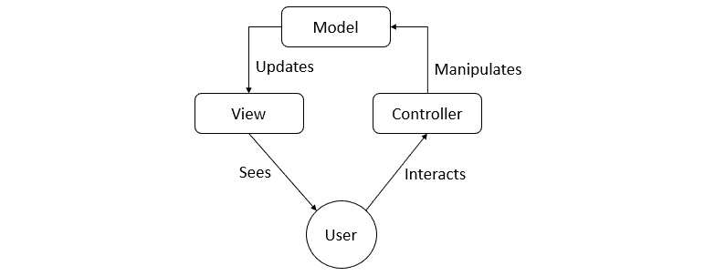
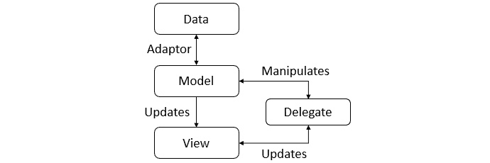
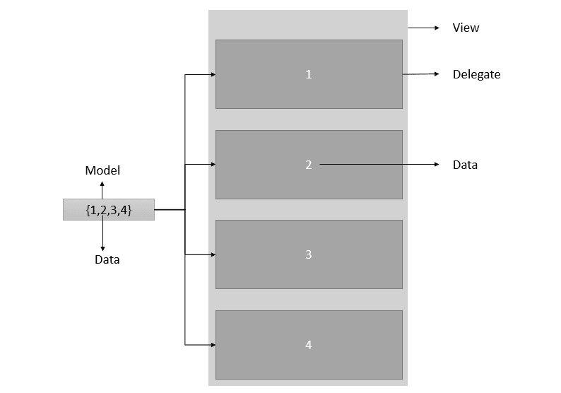
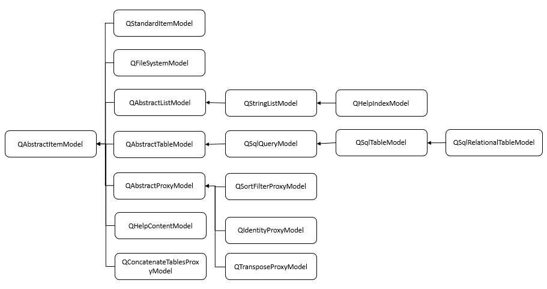
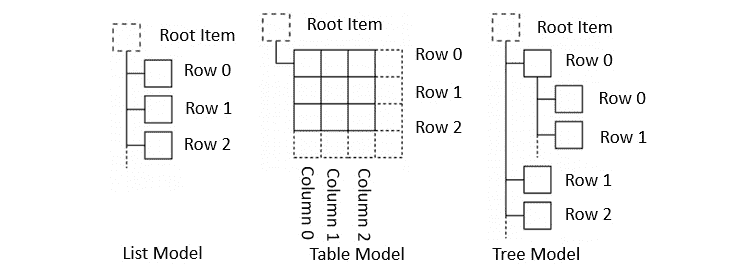
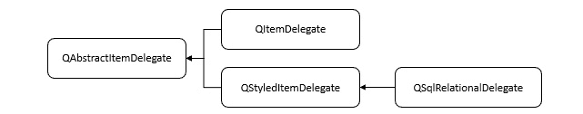
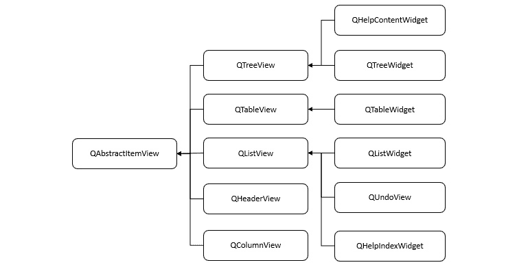
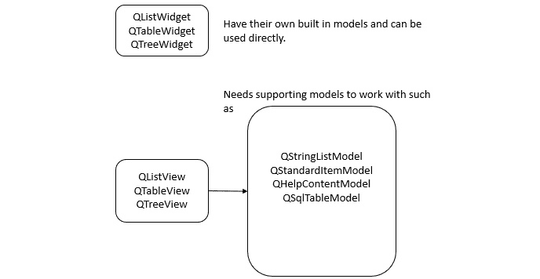
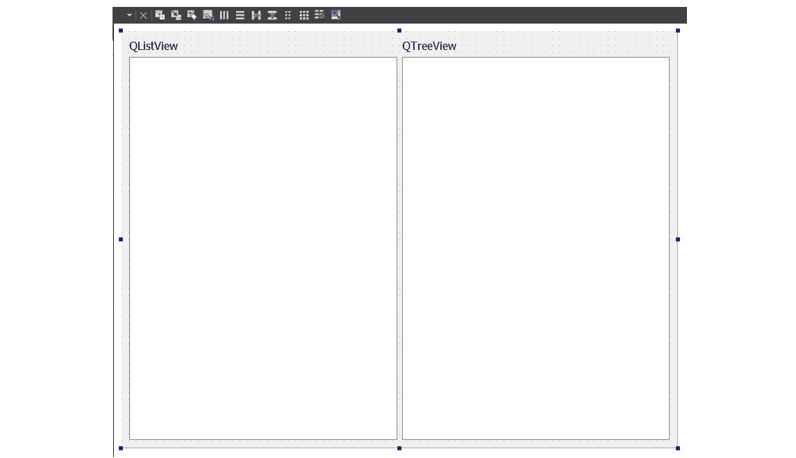
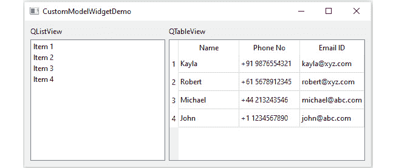

# 第七章：模型视图编程

模型/视图编程用于在 Qt 中处理数据集时将数据与视图分离。**模型/视图（M/V）**架构区分了功能，使开发人员可以以多种方式修改和呈现**用户界面（UI）**上的信息。我们将讨论架构的每个组件，Qt 提供的相关便利类，以及如何使用实际示例。在本章中，我们将讨论模型视图模式并了解基本核心概念。

在本章中，我们将讨论以下主题：

+   M/V 架构的基本原理

+   使用模型和视图

+   创建自定义模型和委托

+   在 Qt 小部件中使用 M/V 显示信息

+   在 QML 中使用 M/V 显示信息

+   使用 C++模型与 QML

在本章结束时，您将能够创建数据模型并在自定义 UI 上显示信息。您将能够编写自定义模型和委托。您还将学会通过 Qt 小部件和 QML 在 UI 中表示信息。

# 技术要求

本章的技术要求包括在最新的桌面平台之一（如 Windows 10、Ubuntu 20.04 或 macOS 10.14）上安装 Qt 6.0.0 和 Qt Creator 4.14.0 的最低版本。

本章中使用的所有代码都可以从以下 GitHub 链接下载：[`github.com/PacktPublishing/Cross-Platform-Development-with-Qt-6-and-Modern-Cpp/tree/master/Chapter07`](https://github.com/PacktPublishing/Cross-Platform-Development-with-Qt-6-and-Modern-Cpp/tree/master/Chapter07)。

重要提示

本章中使用的屏幕截图是在 Windows 平台上获取的。您将在您的机器上基于底层平台看到类似的屏幕。

# 理解 M/V 架构

传统上，在构建 UI 时经常使用**模型-视图-控制器（MVC）**设计模式。顾名思义，它由三个术语组成：模型、视图和控制器。**模型**是具有动态数据结构和逻辑的独立组件，**视图**是视觉元素，**控制器**决定 UI 如何响应用户输入。在 MVC 出现之前，开发人员通常将这些组件放在一起。虽然开发人员希望将控制器与其他组件分离，但并不总是可能。MVC 设计将组件解耦以增加灵活性和重用。以下图示了传统 MVC 模式的组件：



图 7.1 – 传统 MVC 设计模式

在 MVC 模式中，用户看到视图并与控制器交互。控制器将数据发送到模型，模型更新视图。如果视图和控制器组件合并，则会得到 M/V 架构。它提供了更灵活的架构。它基于相同的原则，但使实现变得更简单。修改后的架构允许我们在多个不同的视图中显示相同的数据。开发人员可以实现新类型的视图而不更改底层数据结构。为了将这种灵活性带入我们对用户输入的处理中，Qt 引入了**委托**的概念。视图接收通过委托更新的数据，而不是通过控制器。它有两个主要目的：

+   为了帮助视图呈现每个值

+   为了帮助视图在用户想要进行一些更改时

因此，在某种程度上，控制器已与视图合并，并且视图还通过委托执行了一些控制器的工作。拥有委托的好处在于它提供了渲染和修改数据元素的手段。

让我们通过图表了解 M/V 的实现和其组件：



图 7.2 - Qt 模型-视图-委托框架

如*图 7.2*所示，M/V 组件分为**模型**、**视图**和**委托**三个部分。**模型**与数据库交互，并作为架构其他组件的接口。通信的目的由数据源和模型的实现确定。**视图**获取称为**模型索引**的数据项的引用。视图可以通过使用这个模型索引从数据模型中检索单个数据项。在标准视图中，委托渲染数据项。当数据项被修改时，**委托**使用模型索引通知模型。

*图 7.3*说明了模型如何向视图提供数据，并在单个委托上显示：



图 7.3 - 模型-视图-委托实现示意图

Qt 框架提供了一组标准类，实现了 M/V 架构，用于管理数据与用户视图之间的关系。通过解耦功能，该架构提供了灵活性，可以定制数据的呈现方式，并允许将广泛的数据源与视图结合起来。

模型、视图和委托使用**信号和槽机制**进行通信。模型发出信号通知数据源中发生的数据更改。当用户与视图交互时，视图发出信号通知用户操作。委托发出信号通知模型和视图有关编辑状态的变化。

现在，您已经了解了 M/V 架构的基础知识。接下来的部分将解释如何在 Qt 中使用 M/V 模式。我们将从 Qt 框架提供的标准类开始，然后讨论在 Qt 部件中使用 M/V。您将学习如何根据 M/V 架构创建新组件。让我们开始吧！

## 模型

M/V 消除了标准部件可能出现的数据一致性挑战。它使得可以更容易地为相同数据使用多个视图，因为一个模型可以传递给多个视图。Qt 提供了几个 M/V 实现的抽象类，具有共同的接口和特定的功能实现。您可以对抽象类进行子类化，并添加其他组件期望的功能。在 M/V 实现中，模型提供了供视图和委托访问数据的标准接口。

Qt 提供了一些现成的模型类，如`QStandardItemModel`、`QFileSystemModel`和`QSqlTableModel`。`QAbstractItemModel`是 Qt 定义的标准接口。`QAbstractItemModel`的子类表示分层结构中的数据。*图 7.4*说明了模型类的层次结构：



图 7.4 - Qt 中模型类的层次结构

视图使用这种方法访问模型中的单个数据项，但在呈现信息给用户的方式上并没有受到限制。通过模型传递的数据可以保存在数据结构或数据库中，也可以是其他应用程序组件。所有的项模型都是基于`QAbstractItemModel`类的。

*图 7.5*显示了不同类型的模型中数据的排列方式：



图 7.5 - 不同类型的模型和数据排列方式

数据通过模型以表格形式表示，以行和列的形式表示，或者使用数据的分层表示。在 M/V 模式中，小部件不会在单元格后面存储数据。它们直接使用数据。您可能需要创建一个包装器，使您的数据与`QAbstractItemModel`接口兼容。视图使用此接口来读取和写入数据。任何从`QAbstractItemModel`派生的类都称为模型。它提供了一个处理以列表、表格和树形式表示数据的视图的接口。要为列表或类似表格的数据结构实现自定义模型，可以从`QAbstractListModel`和`QAbstractTableModel`派生以使用可用的功能。子类提供了适用于特定列表和表格的模型。

Qt 框架提供了两种标准类型的模型。它们如下：

+   `QStandardItemModel`

+   `QFileSystemModel`

`QStandardItemModel`是一个多用途模型，可以存储自定义数据。每个元素都指代一个项目。它可以用于显示列表、表格和树形视图所需的各种数据结构。它提供了一种传统的基于项目的处理模型。`QStandardItem`提供了在`QStandardItemModel`中使用的项目。

`QFileSystemModel`是一个保持目录内容信息的模型。它简单地表示本地文件系统上的文件和目录，并不保存任何数据项。它提供了一个现成的模型，用于创建一个示例应用程序，并且可以使用模型索引来操作数据。现在，让我们讨论一下委托是什么。

## 委托

委托提供对视图中显示的项目呈现的控制。M/V 模式与 MVC 模式不同，它没有一个完全不同的组件来处理用户交互。视图主要负责将模型数据显示给用户，并允许用户与其交互。为了增加用户操作的灵活性，委托处理这些交互。它赋予了某些小部件作为模型中可编辑项目的编辑器。委托用于提供交互功能并渲染视图中的单个字段。`QAbstractItemDelegate`类定义了管理委托的基本接口。Qt 提供了一些现成的委托类，可用于与内置小部件一起使用以修改特定的数据类型。

为了更好地理解，我们将看一下 Qt 框架中委托类的层次结构（见*图 7.6*）：



图 7.6 - Qt 框架中委托类的层次结构

正如我们在前面的图表中所看到的，`QAbstractItemDelegate`是委托的抽象基类。`QStyledItemDelegate`提供了默认的委托实现。Qt 的标准视图将其用作默认委托。用于在视图中绘制和创建编辑器的其他选项是`QStyledItemDelegate`和`QItemDelegate`。您可以使用`QItemDelegate`来自定义项目的显示特性和编辑器小部件。这两个类之间的区别在于，与`QItemDelegate`不同，`QStyledItemDelegate`使用当前样式来绘制其项目。`QStyledItemDelegate`可以处理最常见的数据类型，如`int`和`QString`。在创建新委托或使用 Qt 样式表时，建议从`QStyledItemDelegate`派生子类。通过编写自定义委托，您可以使用自定义数据类型或自定义渲染。

在本节中，我们讨论了不同类型的模型和委托。让我们讨论一下 Qt Widgets 提供的视图类。

## Qt Widgets 中的视图

有几个便利类是从标准 View 类派生出来实现 M/V 模式的。这些便利类的示例包括`QListWidget`、`QTableWidget`和`QTreeWidget`。根据 Qt 文档，这些类比 View 类更不灵活，不能用于随机模型。根据项目要求，您必须选择适合实现 M/V 模式的小部件类。

如果您想使用基于项目的界面并利用 M/V 模式，建议使用以下 View 类与`QStandardItemModel`一起使用：

+   `QListView`显示项目列表。

+   `QTableView`在表格中显示模型数据。

+   `QTreeView`以分层列表显示模型数据项。

Qt 框架中 View 类的层次结构如下：



图 7.7 - Qt 框架中 View 类的层次结构

`QAbstractItemView`是上述类的抽象基类。尽管这些类提供了可直接使用的实现，但这些类可以派生为具有专门视图，最适合用于`QFileSystemModel`的视图是`QListView`和`QTreeView`。每个视图都必须与模型相关联。Qt 提供了几个预定义的模型。如果现成的模型不符合您的标准，您可以添加自定义模型。

与 View 类不同（类名以`View`结尾），便利小部件（类名以`Widget`结尾）不需要由模型支持，可以直接使用。使用便利小部件的主要优势是，它们需要的工作量最少。

让我们看看 Qt Widgets 模块中的不同 View 类以及可以与它们一起使用的现成模型：



图 7.8 - 在 M/V 模式中用作 View 的不同类型的 Qt 小部件

委托用于在`QListView`、`QTableView`或`QTreeView`中显示单个字段数据。当用户开始与项目交互时，委托提供一个编辑器小部件进行编辑。

您可以在以下链接找到上述类的比较概述，并了解相应小部件的用途：

[`doc.qt.io/qt-6/modelview.html`](https://doc.qt.io/qt-6/modelview.html)

在本节中，您了解了 M/V 架构并熟悉了所使用的术语。让我们使用 Qt Widgets 创建一个简单的 GUI 应用程序来实现 M/V。

# 使用 M/V 模式创建一个简单的 Qt Widgets 应用程序

现在是时候使用*Qt Widgets*创建一个简单的示例了。本节中的示例演示了如何将预定义的`QFileSystemModel`与内置的`QListView`和`QTreeView`小部件关联使用。当双击视图时，委托会自动处理。

按照以下步骤创建一个实现 M/V 模式的简单应用程序：

1.  使用 Qt Creator 创建一个新项目，从项目创建向导中选择**Qt Widgets**模板。它将生成一个带有预定义项目骨架的项目。

1.  创建应用程序骨架后，打开`.ui`表单并将`QListView`和`QTreeView`添加到表单中。您可以添加两个标签以区分视图，如下所示：

图 7.9 - 使用 Qt Designer 创建一个带有 QListView 和 QTreeView 的 UI

1.  打开`mainwindow.cpp`文件并添加以下内容：

```cpp
#include "mainwindow.h"
#include "ui_mainwindow.h"
#include <QFileSystemModel>
MainWindow::MainWindow(QWidget *parent)
    : QMainWindow(parent)
    , ui(new Ui::MainWindow)
{
    ui->setupUi(this);
    QFileSystemModel *model = new QFileSystemModel;
    model->setRootPath(QDir::currentPath());
    ui->treeView->setModel(model);
    ui->treeView->setRootIndex(
        model->index(QDir::currentPath()));
    ui->listView->setModel(model);
    ui->listView->setRootIndex(
        model->index(QDir::currentPath()));
}
```

在前面的 C++实现中，我们使用了预定义的`QFileSystemModel`作为 View 的模型。

1.  接下来，点击左侧窗格中的**运行**按钮。一旦您点击**运行**按钮，您将看到一个窗口，如*图 7.10*所示：

](img/Figure_7.10_B16231.jpg)

图 7.10 - 显示 QListView 和 QTreeView 的示例应用程序的输出

1.  让我们修改现有的应用程序，使用从`QAbstractItemModel`派生的自定义模型。在以下示例中，我们创建了一个简单的`ContactListModel`自定义类，它是从`QAbstractItemModel`派生的：

```cpp
void ContactListModel::addContact(QAbstractItemModel *model, 
const QString &name,const QString &phoneno, const QString &emailid)
{
    model->insertRow(0);
    model->setData(model->index(0, 0), name);
    model->setData(model->index(0, 1), phoneno);
    model->setData(model->index(0, 2), emailid);
}
QAbstractItemModel* ContactListModel::
        getContactListModel()
{
    QStandardItemModel *model = new 
        QStandardItemModel(0, 3, this);
    model->setHeaderData(0,Qt::Horizontal, 
                         QObject::tr("Name"));
    model->setHeaderData(1,Qt::Horizontal, 
                         QObject::tr("Phone No"));
    model->setHeaderData(2,Qt::Horizontal, 
                         QObject::tr("Email ID"));
    addContact(model,"John","+1 
               1234567890","john@abc.com");
    addContact(model,"Michael","+44 
               213243546","michael@abc.com");
    addContact(model,"Robert","+61 
               5678912345","robert@xyz.com");
    addContact(model,"Kayla","+91 
               9876554321","kayla@xyz.com");
    return model;
}
```

1.  接下来，修改 UI 表单以实现`QTableView`，并将联系人列表模型设置为以下代码段所示：

```cpp
ContactListModel *contactModel = new ContactListModel;
ui->tableView->setModel(
               contactModel->getContactListModel());
ui->tableView->horizontalHeader()->setStretchLastSection(true);
```

1.  您可以将`QStringListModel`添加到`QListView`中以使用简单的列表模型：

```cpp
    QStringListModel *model = new QStringListModel(this);
    QStringList List;
    List << "Item 1" << "Item 2" << "Item 3" <<"Item 4";
    model->setStringList(List);
    ui->listView->setModel(model);
```

1.  接下来，点击左侧窗格中的**运行**按钮。一旦您点击**运行**按钮，您将看到一个窗口，如*图 7.11*所示：



图 7.11 - 使用自定义模型在 QListView 和 QTableView 中的应用程序输出

恭喜！您已经学会了如何在 Qt 小部件项目中使用 M/V。

重要提示

要了解更多关于方便类的实现，例如`QTableWidget`或`QtTreeWidget`，请在 Qt Creator 欢迎屏幕和本章的源代码中探索相关示例。

您还可以创建自己的自定义委托类。要创建自定义委托，您需要对`QAbstractItemDelegate`或任何方便类（如`QStyledItemDelegate`或`QItemDelegate`）进行子类化。自定义委托类可能如下面的代码片段所示：

```cpp
class CustomDelegate: public QStyledItemDelegate
{
  Q_OBJECT
public:
  CustomDelegate(QObject* parent = nullptr);
  void paint(QPainter* painter, 
             const QStylestyleOptionViewItem& styleOption,
             const QModelIndex& modelIndex) const override;
  QSize sizeHint(const QStylestyleOptionViewItem& styleOption,
                 const QModelIndex& modelIndex) const override;
  void setModelData(QWidget* editor, QAbstractItemModel* model,
                    const QModelIndex& modelIndex)                     const override;
  QWidget *createEditor(QWidget* parent, 
                  const QStylestyleOptionViewItem& styleOption,
                  const QModelIndex & modelIndex)                   const override;
  void setEditorData(QWidget* editor, 
                    const QModelIndex& modelIndex)                     const override;
  void updateEditorGeometry(QWidget* editor, 
                  const QStylestyleOptionViewItem& styleOption, 
                  const QModelIndex& modelIndex)                   const override;
};
```

您必须重写虚拟方法，并根据项目需求添加相应的逻辑。您可以在以下链接了解有关自定义委托和示例的更多信息：

[`doc.qt.io/qt-6/model-View-programming.html`](https://doc.qt.io/qt-6/model-View-programming.html)

在本节中，我们学习了如何创建使用 M/V 模式的 GUI 应用程序。在下一节中，我们将讨论它在 QML 中的实现方式。

# 了解 QML 中的模型和视图

与 Qt 小部件一样，Qt Quick 也实现了模型、视图和委托来显示数据。该实现将数据的可视化模块化，使开发人员能够管理数据。您可以通过最小的更改来将一个视图更改为另一个视图。

要可视化数据，将视图的`model`属性绑定到模型，将`delegate`属性绑定到组件或其他兼容类型。

让我们讨论在 Qt Quick 应用程序中实现 M/V 模式的可用 QML 类型。

## Qt Quick 中的视图

视图是显示数据的容器，用于项目集合。这些容器功能丰富，可以根据特定的样式或行为要求进行定制。

在 Qt Quick 图形类型的基本集中提供了一组标准视图：

+   `ListView`：以水平或垂直列表方式布置项目

+   `GridView`：以网格方式布置项目

+   `TableView`：以表格形式布置项目

+   `PathView`：在路径上布置项目

`ListView`、`GridView`和`TableView`继承自`Flickable` QML 类型。`PathView`继承自`Item`。`TreeView` QML 类型已经过时。让我们看一下这些 QML 类型的继承关系：


图 7.12 - Qt Quick 中视图类的层次结构

每种 QML 类型的属性和行为都不同。它们根据 GUI 需求使用。如果您想了解更多关于 QML 类型的信息，可以参考它们各自的文档。让我们在下一节中探索 Qt Quick 中的模型。

## Qt Quick 中的模型

Qt 提供了几种方便的 QML 类型来实现 M/V 模式。这些模块提供了非常简单的模型，而无需在 C++中创建自定义模型类。这些方便类的示例包括`ListModel`、`TableModel`和`XmlListModel`。

`QtQml.Models` 模块提供以下用于定义数据模型的 QML 类型：

+   `ListModel` 定义了一个自由形式的列表数据源。

+   `ListElement` 定义了 `ListModel` 中的数据项。

+   `DelegateModel` 封装了一个模型和委托。

+   `DelegateModelGroup` 封装了一组经过筛选的可视数据项目。

+   `ItemSelectionModel` 继承自 `QItemSelectionModel`，它跟踪视图的选定项目。

+   `ObjectModel` 定义了一组要用作模型的项目。

+   `Instantiator` 动态实例化对象。

+   `Package` 描述了一组命名的项目。

要在您的 Qt Quick 应用程序中使用上述 QML 类型，请使用以下行导入模块：

`import QtQml.Models`

让我们讨论在 Qt Quick 中可用的现成模型。`ListModel` 是包含包含数据角色的 `ListElement` 定义的简单容器。它与 `ListView` 一起使用。`Qt.labs.qmlmodels` 提供了用于模型的实验性 QML 类型。这些模型可用于快速原型设计和显示非常简单的数据。`TableModel` 类型将 JavaScript/JSON 对象作为表模型的数据进行存储，并与 `TableView` 一起使用。您可以通过以下方式导入这些实验性类型：

`import Qt.labs.qmlmodels`

如果您想从 XML 数据创建模型，那么可以使用 `XmlListModel`。它可以与 `ListView`、`PathView` 和 `GridView` 等视图一起使用作为模型。要使用此模型，您必须按照以下方式导入模块：

`import QtQuick.XmlListModel`

您可以使用 `ListModel` 和 `XmlListModel` 与 `TableView` 一起创建 `TableView` 中的一列。要处理多行和多列，您可以使用 `TableModel` 或者通过子类化 `QAbstractItemModel` 创建自定义的 C++ 模型。

您还可以使用 `Repeater` 与 Models。整数可以用作定义项目数量的模型。在这种情况下，模型没有任何数据角色。让我们创建一个简单的示例，使用 `ListView` 和 `Text` 项目作为委托组件：

```cpp
import QtQuick
import QtQuick.Window
Window {
    width: 640
    height: 480
    visible: true
    title: qsTr("Simple M/V Demo")
    ListView {
        anchors.fill: parent
        model: 10
        delegate: itemDelegate
    }
    Component {
        id: itemDelegate
        Text { text: "  Item :  " + index }
    }
} 
```

在前面的示例中，我们使用了 `Text` 作为委托，而没有使用组件。

现在，让我们探讨如何将 `ListModel` 与 `ListView` 一起使用。`ListModel` 是在 QML 中指定的一组简单的类型层次结构。可用的角色由 `ListElement` 属性指定。让我们使用 `ListModel` 与 `ListView` 创建一个简单的应用程序。

假设您想创建一个简单的通讯录应用程序。您可能需要一些用于联系人的字段。在以下代码片段中，我们使用了一个包含一些联系人的姓名、电话号码和电子邮件地址的 `ListModel`：

```cpp
ListModel {
    id: contactListModel
    ListElement {
        name: "John" ; phone: "+1 1234567890" ; 
        email: "john@abc.com"
    }
    ListElement {
        name: "Michael" ; phone: "+44 213243546" ; 
        email: "michael@abc.com"
    }
    ListElement {
        name: "Robert" ; phone: "+61 5678912345" ; 
        email: "robert@xyz.com"
    }
    ListElement {
        name: "Kayla" ; phone: "+91 9876554321" ; 
        email: "kayla@xyz.com"
    }
}
```

我们现在已经创建了模型。接下来，我们必须使用委托来显示它。因此，让我们修改之前创建的委托组件，使用三个 `Text` 元素。根据您的需求，您可以创建具有图标、文本或自定义类型的复杂委托类型。您可以添加一个突出显示的项目，并根据焦点更新背景。您需要为视图提供一个委托，以在列表中直观地表示一个项目：

```cpp
Component {
    id: contactDelegate
    Row {
        id: contact
        spacing: 20
        Text { text: " Name: " + name; }
        Text { text: " Phone no: " + phone }
        Text { text: " Email ID: " + email }
    }
}
ListView {
    anchors.fill: parent
    model: contactListModel
    delegate: contactDelegate
}
```

在前面的示例中，我们使用了 `ListElement` 与 `ListModel`。视图根据委托定义的模板显示每个项目。可以通过 `index` 属性或项目的属性访问模型中的项目。

您可以在以下链接中了解有关不同类型的模型以及如何操作模型数据的更多信息：

[`doc.qt.io/qt-6/qtquick-modelviewsdata-modelview.html`](https://doc.qt.io/qt-6/qtquick-modelviewsdata-modelview.html)

在本节中，您了解了 QML 中的 M/V。您可以尝试使用自定义模型和委托，并创建个性化的视图。看一看您手机上的电话簿或最近的通话列表，并尝试实现它。在下一节中，您将学习如何将 QML 前端与 C++ 模型集成。

# 使用 C++ 模型与 QML

到目前为止，我们已经讨论了如何在 Qt Widgets 和 QML 中使用模型和视图。但在大多数现代应用程序中，您将需要在 C++中编写模型，并在 QML 中编写前端。Qt 允许我们在 C++中定义模型，然后在 QML 中访问它们。这对于将现有的 C++数据模型或其他复杂数据集暴露给 QML 非常方便。对于复杂的逻辑操作，原生 C++始终是正确的选择。它可以优于使用 JavaScript 编写的 QML 中的逻辑。

有许多原因您应该创建一个 C++模型。C++是类型安全的，并且编译为对象代码。它增加了应用程序的稳定性并减少了错误的数量。它灵活，并且可以提供比 QML 类型更多的功能。您可以与现有代码或使用 C++编写的第三方库集成。

您可以使用以下类定义 C++模型：

+   `QStringList`

+   `QVariantList`

+   `QObjectList`

+   `QAbstractItemModel`

前三个类有助于暴露更简单的数据集。`QAbstractItemModel`提供了一个更灵活的解决方案来创建复杂的模型。`QStringList`包含`QString`实例的列表，并通过`modelData`角色提供列表的内容。类似地，`QVariantList`包含`QVariant`类型的列表，并通过`modelData`角色提供列表的内容。如果`QVariantList`发生变化，则必须重置模型。`QObjectList`嵌入了一个`QObject*`列表，该列表提供了列表中对象的属性作为角色。`QObject*`可以作为`modelData`属性访问。为了方便起见，可以直接在委托的上下文中访问对象的属性。

Qt 还提供了处理 SQL 数据模型的 C++类，例如`QSqlQueryModel`、`QSqlTableModel`和`QSqlRelationalTableModel`。`QSqlQueryModel`提供了基于 SQL 查询的只读模型。这些类减少了运行 SQL 查询以进行基本的 SQL 操作（如插入、创建或更新）的需要。这些类是从`QAbstractTableModel`派生的，使得在 View 类中轻松呈现来自数据库的数据变得容易。

您可以通过访问以下链接了解有关不同类型的 C++模型的更多信息：

[`doc.qt.io/qt-6/qtquick-modelviewsdata-cppmodels.html`](https://doc.qt.io/qt-6/qtquick-modelviewsdata-cppmodels.html)

在本节中，我们讨论了 C++模型以及为什么要使用它们。现在，您可以从 C++后端获取数据，并在 QML 中开发的 UI 中呈现它。在下一节中，我们将使用上述概念创建一个简单的 Qt Quick 应用程序，并解释如何在 QML 中使用它们。

# 使用 Qt Quick 创建一个简单的 M/V 应用程序

在前面的部分中，我们讨论了 Qt 的模型-视图-委托框架。您学会了如何创建自定义模型和委托，以及如何使用 C++模型。但您一定想知道如何与我们的 QML 前端集成。在本节中，我们将创建一个 C++模型并将其暴露给 QML 引擎。我们还将讨论如何将自定义模型注册为 QML 类型。

让我们创建一个应用程序，从 C++代码中获取模型并在基于 Qt Quick 的应用程序中显示它：

```cpp
#include <QGuiApplication>
#include <QQmlApplicationEngine>
#include <QQmlContext>
#include <QStringListModel>
int main(int argc, char *argv[])
{
    QGuiApplication app(argc, argv);
    QQmlApplicationEngine engine;
    QStringList stringList;
    stringList << "Item 1" << "Item 2" << "Item 3" 
               <<"Item 4";
    engine.rootContext()->setContextProperty("myModel", 
        QVariant::fromValue(stringList));
    const QUrl url(QStringLiteral("qrc:/main.qml"));
    engine.load(url);
    return app.exec();
}
```

在上面的代码片段中，我们创建了一个基于`QStringList`的简单模型。字符串列表包含四个不同的字符串。我们使用`setContextProperty()`将模型暴露给 QML 引擎。现在，让我们在 QML 文件中使用该模型：

```cpp
import QtQuick
import QtQuick.Window
Window {
    width: 640
    height: 480
    visible: true
    title: qsTr("QML CPP M/V Demo")
    ListView {
        id: listview
        width: 120
        height: 200
        model: myModel
        delegate: Text { text: modelData }
    }
}
```

上面的示例使用`QQmlContext::setContextProperty()`在 QML 组件中直接设置模型值。另一种方法是将 C++模型类注册为 QML 类型，如下所示：

`qmlRegisterType<MyModel>("MyModel",1,0,"MyModel");`

上述行将允许直接在 QML 文件中将模型类创建为 QML 类型。第一个字段是 C++类名，然后是所需的包名称，然后是版本号，最后一个参数是 QML 中的类型名称。您可以使用以下行将其导入到 QML 文件中：

`Import MyModel 1.0`

让我们在我们的 QML 文件中创建一个`MyModel`的实例，如下所示：

```cpp
MyModel {
    id: myModel
}
ListView {
    width: 120
    height: 200
    model: myModel
    delegate: Text { text: modelData }
} 
```

您还可以使用`setInitialProperties()`在`QQuickView`中使用模型，如下面的代码所示：

```cpp
QQuickView view;
view.setResizeMode(QQuickView::SizeRootObjectToView);
view.setInitialProperties({
                  {"myModel",QVariant::fromValue(myModel)}});
view.setSource(QUrl("qrc:/main.qml"));
view.show();
```

在前面的代码片段中，我们使用了`QQuickView`来创建一个 UI，并将自定义的 C++模型传递给了 QML 环境。

在本节中，我们学习了如何将简单的 C++模型与 QML 集成。您可以添加信号和属性来扩展自定义类的功能。接下来，让我们总结一下本章的学习成果。

# 总结

在本章中，我们深入了解了 Qt 中的 Model-View-Delegate 模式的核心概念。我们解释了它与传统 MVC 模式的不同之处。我们讨论了在 Qt 中使用 M/V 的不同方式以及 Qt 中提供的便利类。我们学习了如何在 Qt Widgets 和 Qt Quick 中应用 M/V 概念。我们讨论了如何将 C++模型集成到 QML 视图中。我们还创建了一些示例，并在我们的 Qt 应用程序中实现了这些概念。您现在可以创建自己的模型、委托和视图。我希望您已经理解了这个框架的重要性，以及使用它满足您需求的充分理由。

在*第八章*，*图形和动画*中，我们将学习关于图形框架以及如何将动画添加到您的 Qt Quick 项目。
