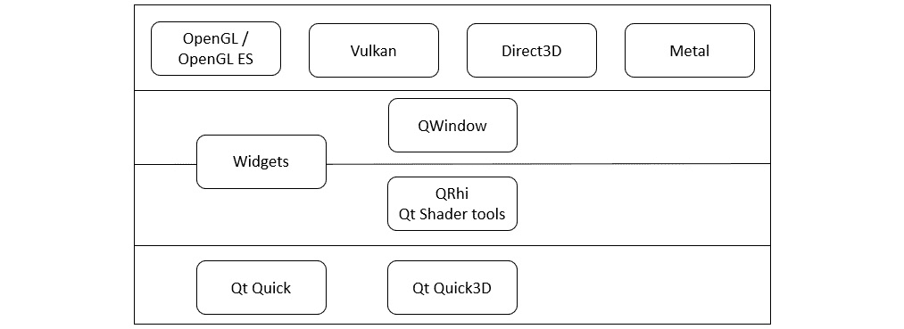
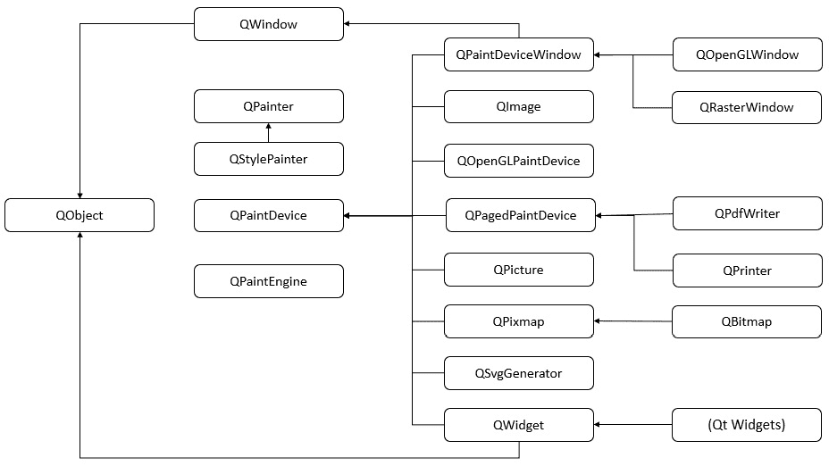
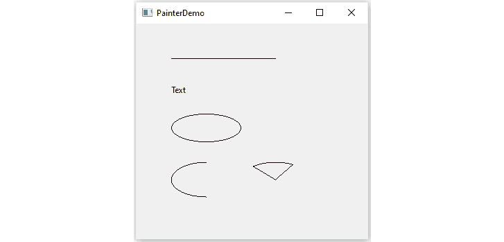
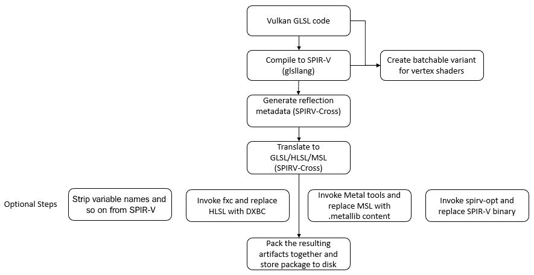
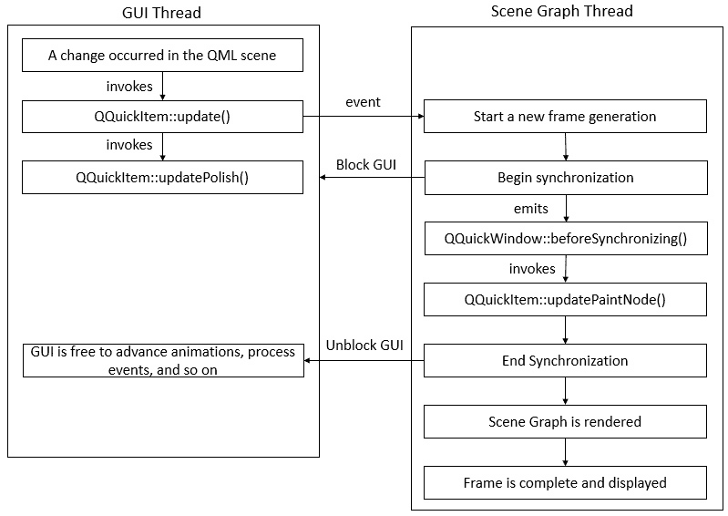
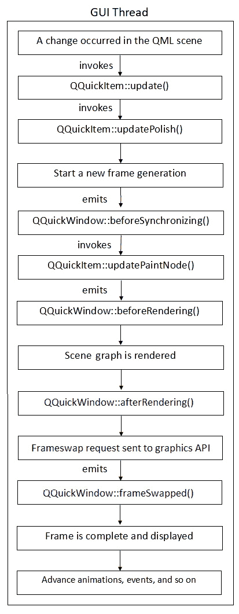
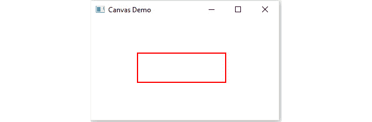
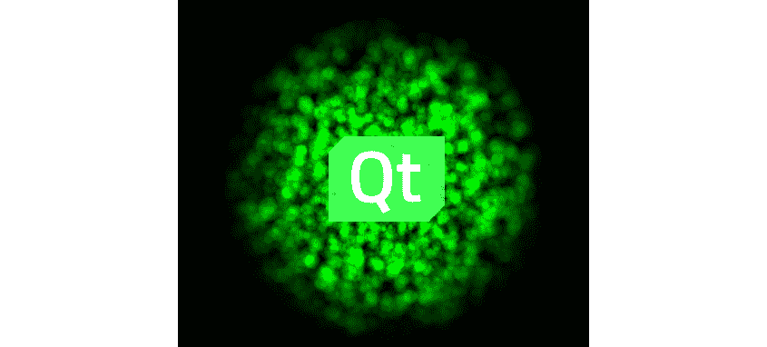
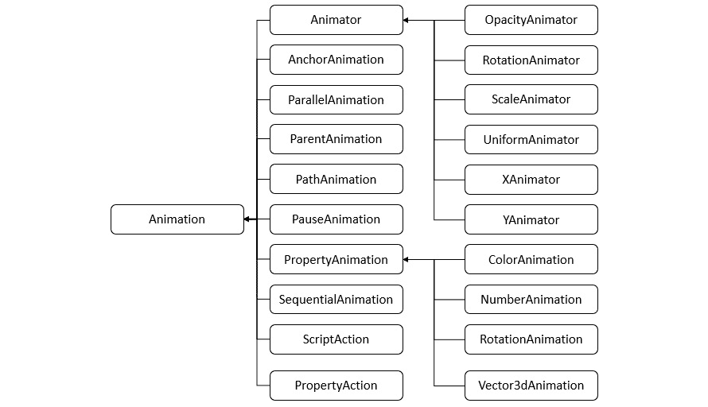
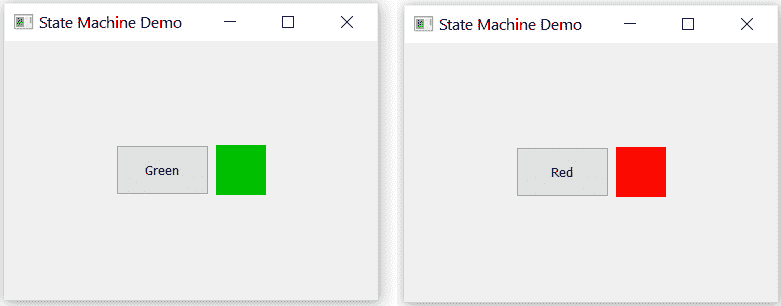

# 第八章：图形和动画

在本章中，您将学习 Qt 图形框架的基础知识以及如何在屏幕上渲染图形。您将了解 Qt 中如何进行一般绘图。我们将从讨论使用**QPainter**进行 2D 图形开始。我们将探讨如何使用绘图工具绘制不同的形状。然后，您将了解**QGraphicsView**和**QGraphicsScene**使用的图形视图架构。之后，我们将讨论 Qt Quick 使用的**场景图**机制。在本章中，您还将学习如何通过添加动画和状态使用户界面更有趣。

在本章中，我们将讨论以下内容：

+   了解 Qt 的图形框架

+   `QPainter`和 2D 图形

+   图形视图框架

+   OpenGL 实现

+   Qt Quick 场景图

+   QML 中的动画

+   Qt 中的状态机

通过本章，您将了解 Qt 使用的图形框架。您将能够在屏幕上绘制并向 UI 元素添加动画。

# 技术要求

本章的技术要求包括 Qt 6.0.0 和 Qt Creator 4.14.0 的最低版本，安装在 Windows 10、Ubuntu 20.04 或 macOS 10.14 等最新版本的桌面平台上。

本章中使用的所有代码都可以从以下 GitHub 链接下载：[`github.com/PacktPublishing/Cross-Platform-Development-with-Qt-6-and-Modern-Cpp/tree/master/Chapter08`](https://github.com/PacktPublishing/Cross-Platform-Development-with-Qt-6-and-Modern-Cpp/tree/master/Chapter08)。

重要说明

本章中使用的屏幕截图来自 Windows 平台。您将在您的机器上基于底层平台看到类似的屏幕。

# 了解 Qt 的图形框架

Qt 是最受欢迎的 GUI 应用程序框架之一。开发人员可以使用 Qt 构建出色的跨平台 GUI 应用程序，而不必担心底层图形实现。Qt **渲染硬件接口**（**RHI**）将 Qt 应用程序的图形指令解释为目标平台上可用的图形 API。

RHI 是硬件加速图形 API 的抽象接口。`rhi`模块中最重要的类是`QRhi`。`QRhi`实例由特定图形 API 的后端支持。后端的选择在运行时确定，并由创建`QRhi`实例的应用程序或库决定。您可以通过将以下行添加到项目文件中来添加模块：

```cpp
QT += rhi
```

RHI 支持的不同类型的图形 API 如下：

+   **OpenGL**

+   **OpenGL ES**

+   **Vulkan**

+   **Direct3D**

+   **金属**

*图 8.1*显示了 Qt 图形框架中的主要图层：



图 8.1 - Qt 6 图形堆栈的主要图层

让我们熟悉一下前面图中显示的图形 API。**OpenGL**是最受欢迎的图形 API，具有跨语言和跨平台应用程序支持。它用于与 GPU 交互，实现硬件加速渲染。**OpenGL ES**是 OpenGL API 的一种适用于嵌入式设备的变体。它允许在嵌入式和移动设备上渲染高级 2D 和 3D 图形。**iOS 设备上的 OpenGL ES**也称为**EAGL**。OpenGL ES 也可在 Web 平台上作为 WebGL 使用。OpenGL 和 OpenGL ES 由技术硬件和软件公司的联盟 Khronos Group 开发和维护。您可以在以下链接了解有关 OpenGL 的更多信息：

https://www.opengl.org/about/

**Vulkan**是一个新一代的图形 API，有助于为现代 GPU 创建跨平台和高性能的应用程序。它由 Khronos Group 创建。Vulkan 的显式 API 设计允许在各种桌面、嵌入式和移动平台上进行高效实现。Qt 6 提供了对 Vulkan API 的支持。要使用 Vulkan，Qt 应用程序需要 LunarG Vulkan SDK。在以下链接中探索更多关于 Vulkan 的信息：

https://www.lunarg.com/vulkan-sdk/

**Direct3D**是微软专有的图形 API，提供了利用底层 GPU 功能进行 2D 和 3D 图形渲染的函数。微软公司为 Windows 平台创建了它。它是一个低级 API，可用于使用渲染管线绘制基元或使用计算着色器执行并行操作。

Direct3D 暴露了 3D 图形硬件的高级图形能力，包括模板缓冲、W 缓冲、Z 缓冲、透视纹理映射、空间反锯齿、可编程 HLSL 着色器和特效。Direct3D 与其他 DirectX 技术的集成使其能够提供包括视频映射、硬件 2D 叠加平面中的 3D 渲染，甚至精灵，并允许在交互媒体中使用 2D 和 3D 图形的多个功能。Direct3D 旨在通常虚拟化 3D 硬件接口。相比之下，OpenGL 旨在成为可以在软件中模拟的 3D 硬件加速渲染系统。这两个 API 在设计上有根本的不同。以下链接提供了对 Direct3D 的进一步了解：

https://docs.microsoft.com/en-in/windows/win32/getting-started-with-direct3d

**Metal**是苹果的低级计算机图形 API，它提供了对**图形处理单元**（**GPU**）的几乎直接访问，使您能够优化 iOS、macOS 和 tvOS 应用程序的图形和计算能力。它还具有低开销的架构，包括预编译的 GPU 着色器、细粒度资源管理和多线程支持。在 Metal 宣布之前，苹果为 macOS 提供了 OpenGL，为 iOS 提供了 OpenGL ES，但由于高度抽象的硬件，存在性能问题。另一方面，Metal 由于其苹果特定的 API，比 OpenGL 具有更好的性能。Metal 通过支持多达 100 倍于 OpenGL 的绘制调用，实现了全新一代的专业图形输出。您可以在以下链接中了解更多关于 Metal 的信息：

https://developer.apple.com/documentation/metal

在本节中，我们熟悉了 Qt 的图形框架和 RHI。您现在对这个框架有了基本的了解。在下一节中，我们将进一步讨论使用 QPainter 进行 2D 图形。

# QPainter 和 2D 图形

Qt 具有先进的窗口、绘图和排版系统。Qt GUI 模块中最重要的类是`QWindow`和`QGuiApplication`。该模块包括用于 2D 图形、图像、字体和高级排版的类。此外，GUI 模块还包括用于集成窗口系统、OpenGL 集成、事件处理、2D 图形、基本图像、字体和文本的类。Qt 的用户界面技术在内部使用这些类，但也可以直接用于编写使用低级 OpenGL 图形 API 的应用程序。

根据平台，`QWindow`类支持使用 OpenGL 和 OpenGL ES 进行渲染。Qt 包括`QOpenGLPaintDevice`类，它允许使用 OpenGL 加速的`QPainter`渲染和几个便利类。这些便利类通过隐藏扩展处理的复杂性和 OpenGL ES 2.0 与桌面 OpenGL 之间的差异，简化了 OpenGL 中的编写代码。`QOpenGLFunctions`是一个便利类，它提供了跨平台访问桌面 OpenGL 上的 OpenGL ES 2.0 函数，而无需手动解析 OpenGL 函数指针。

要在基于 qmake 的应用程序中使用这些 API 和类，您必须在项目文件（.pro）中包含`gui`模块，如下所示：

```cpp
QT += gui 
```

如果您正在使用基于*Cmake*的构建系统，则将以下内容添加到`CMakeLists.txt`文件中：

```cpp
find_package(Qt6 COMPONENTS Gui REQUIRED)
target_link_libraries(mytarget PRIVATE Qt6::Gui)
```

`QPainter`类主要用于绘图操作，为绘制矢量图形、文本和图像到不同表面或`QPaintDevice`实例（包括`QImage`、`QOpenGLPaintDevice`、`QWidget`和`QPrinter`）提供 API。对于 Qt Widgets 用户界面，Qt 使用软件渲染器。

以下是 Qt GUI 的高级绘图 API：

+   绘制系统

+   坐标系统

+   绘制和填充

我们将在接下来的章节中探讨这些 API。

## 理解绘制系统

Qt 的绘制系统提供了几个方便的类来在屏幕上绘制。最重要的类是`QPainter`、`QPaintDevice`和`QPaintEngine`。您可以使用`QPainter`在小部件和其他绘图设备上绘制。这个类可以用来从简单的线条到复杂的形状（比如在`paintEvent()`函数内部或在`paintEvent()`调用的函数内部绘制`QPainter`）绘制东西。`QPaintDevice`是允许使用`QPainter`实例进行 2D 绘制的对象的基类。`QPaintEngine`提供了定义`QPainter`如何在指定平台上的指定设备上绘制的接口。`QPaintEngine`类是`QPainter`和`QPaintDevice`内部使用的抽象类。

让我们来看看与绘制相关的类的层次结构，以更好地了解在使用绘制系统时如何选择合适的类。



图 8.2 – Qt 中绘制类的层次结构

前面的层次结构方法说明了所有绘图方法都遵循相同的机制。因此，很容易为新功能添加规定，并为不受支持的功能提供默认实现。

让我们在下一节讨论坐标系统。

## 使用坐标系统

`QPainter`类控制坐标系统。它与`QPaintDevice`和`QPaintEngine`类一起构成了 Qt 的绘制系统的基础。绘图设备的默认坐标系统的原点在左上角。`QPainter`的主要功能是执行绘图操作。而`QPaintDevice`类是一个二维空间的抽象，可以使用`QPainter`进行绘制，`QPaintEngine`类提供了一个绘图器，用于在不同类型的设备上绘制。`QPaintDevice`类是可以进行绘制的对象的基类，它从`QWidget`、`QImage`、`QPixmap`、`QPicture`和`QOpenGLPaintDevice`类继承了其绘图能力。

您可以在以下文档中了解更多关于坐标系统的信息：

https://doc.qt.io/qt-6/coordsys.html

## 绘制和填充

`QPainter`提供了一个高度优化的绘图器，用于大多数 GUI 上的绘图需求。它可以绘制各种类型的形状，从简单的图形基元（如`QPoint`、`QLine`、`QRect`、`QRegion`和`QPolygon`类）到复杂的矢量路径。矢量路径由`QPainterPath`类表示。`QPainterPath`作为绘制操作的容器，允许构建和重复使用图形形状。它可用于填充、轮廓和裁剪。`QPainter`还可以绘制对齐的文本和像素图。要填充`QPainter`绘制的形状，可以使用`QBrush`类。它具有颜色、样式、纹理和渐变属性，并且通过颜色和样式进行定义。

在下一节中，我们将使用到目前为止讨论的 API 来使用`QPainter`进行绘制。

## 使用 QPainter 进行绘制

`QPainter`有几个便利函数来绘制大多数基本形状，例如`drawLine()`、`drawRect()`、`drawEllipse()`、`drawArc()`、`drawPie()`和`drawPolygon()`。您可以使用`fillRect()`函数填充形状。`QBrush`类描述了`QPainter`绘制的形状的填充图案。刷子可以用于定义样式、颜色、渐变和纹理。

让我们看一下下面的`paintEvent()`函数，我们在其中使用`QPainter`来绘制文本和不同的形状：

```cpp
void PaintWindow::paintEvent(QPaintEvent *event)
{
    QPainter painter;
    painter.begin(this);
    //draws a line
    painter.drawLine(QPoint(50, 50), QPoint(200, 50));
    //draws a text
    painter.drawText(QPoint(50, 100), "Text");
    //draws an ellipse
    painter.drawEllipse(QPoint(100,150),50,20);
    //draws an arc
    QRectF drawingRect(50, 200, 100, 50);
    int startAngle = 90 * 16;
    int spanAngle = 180 * 16;
    painter.drawArc(drawingRect, startAngle, spanAngle);
    //draws a pie
    QRectF drawingRectPie(150, 200, 100, 50);
    startAngle = 60 * 16;
    spanAngle = 70 * 16;
    painter.drawPie(drawingRectPie, startAngle, spanAngle);
    painter.end();
    QWidget::paintEvent(event);
}
```

在前面的示例中，我们创建了一个`QPainter`实例，并使用可用的默认绘图函数绘制了一条线、文本、椭圆、弧和扇形。当您将上述代码添加到自定义类中并运行项目时，您将看到以下输出：



图 8.3 – 使用 QPainter 绘图示例的输出

Qt 提供了几个离屏绘图类，每个类都有其自己的优缺点。`QImage`、`QBitmap`、`QPixmap`和`QPicture`是涉及的类。在大多数情况下，您必须在`QImage`和`QPixmap`之间进行选择。

Qt 中的`QImage`类允许轻松读取、写入和操作图像。如果您正在处理资源、合并多个图像并进行一些绘图，则应使用`QImage`类：

```cpp
QImage image(128, 128, QImage::Format_ARGB32); 
QPainter painter(&image);
```

第一行创建了一个 128 像素正方形的图像，每个像素编码为 32 位整数 - 每个通道的不透明度、红色、绿色和蓝色各占 8 位。第二行创建了一个可以在`QImage`实例上绘制的`QPainter`实例。接下来，我们执行了您在上一节中看到的绘图，完成后，我们将图像写入 PNG 文件，代码如下：

```cpp
image.save("image.png"); 
```

`QImage`支持多种图像格式，包括 PNG 和 JPEG。`QImage`还有一个`load`方法，可以从文件或资源加载图像。

`QBitmap`类是一个单色离屏绘图设备，提供深度为 1 位的位图。`QPixmap`类提供了一个离屏绘图设备。`QPicture`类是一个序列化`QPainter`命令的绘图设备。

您还可以使用`QImageReader`和`QImageWriter`类来更精细地控制图像的加载和保存。要添加对 Qt 提供的图像格式之外的图像格式的支持，可以使用`QImageIOHandler`和`QImageIOPlugin`创建图像格式插件。`QPainterPath`类有助于绘制可以创建和重复使用的不同图形形状。以下代码片段演示了如何使用`QPainterPath`：

```cpp
void MyWidget:: paintEvent(QPaintEvent *event)
{
    QPainter painter(this);
    QPolygon polygon;
    polygon << QPoint(100, 185) << QPoint(175, 175)
            << QPoint(200, 110) << QPoint(225, 175)
            << QPoint(300, 185) << QPoint(250, 225)
            << QPoint(260, 290) << QPoint(200, 250)
            << QPoint(140, 290) << QPoint(150, 225)
            << QPoint(100, 185);
    QBrush brush;
    brush.setColor(Qt::yellow);
    brush.setStyle(Qt::SolidPattern);
    QPen pen(Qt::black, 3, Qt::DashDotDotLine, 
             Qt::RoundCap, Qt::RoundJoin);
    painter.setPen(pen);
    QPainterPath path;
    path.addPolygon(polygon);
    painter.drawPolygon(polygon);
    painter.fillPath(path, brush);
    QWidget:: paintEvent(event);
}
```

在上述代码中，我们创建了一个自定义绘制的多边形对象，并使用所需的绘图路径。

注意

请注意，在进行绘制操作时，请确保在绘制背景和绘制内容之间没有延迟。否则，如果延迟超过 16 毫秒，您将在屏幕上看到闪烁。您可以通过将背景渲染到一个像素图中，然后在该像素图上绘制内容来避免这种情况。最后，您可以将该像素图绘制到小部件上。这种方法称为**双缓冲**。

在本节中，我们不仅学习了如何在屏幕上绘制图像，还学习了如何在屏幕外绘制图像并将其保存为图像文件。在下一节中，我们将学习图形视图框架的基础知识。

# 引入图形视图框架

Graphics View 框架是一个强大的图形引擎，允许您可视化和与大量自定义的 2D 图形项进行交互。如果您是一名经验丰富的程序员，可以使用图形视图框架手动绘制 GUI 并进行完全手动动画化。为了一次绘制数百或数千个相对轻量级的自定义项，Qt 提供了一个独立的视图框架，即 Graphics View 框架。如果您正在从头开始创建自己的小部件集，或者需要一次在屏幕上显示大量项，每个项都有自己的位置和数据，您可以利用 Graphics View 框架。这对于处理和显示大量数据的应用程序尤为重要，例如地理信息系统或计算机辅助设计软件。

Graphics View 提供了一个表面，用于管理和与大量自定义创建的 2D 图形项进行交互，并提供用于可视化这些项的视图小部件，支持缩放和旋转。该框架包括一个事件传播架构，可以为场景的项提供交互功能。这些项响应键盘事件；鼠标按下、移动、释放和双击事件；以及跟踪鼠标移动。Graphics View 使用二进制空间分区（BSP）树来提供非常快速的项发现，使其能够实时可视化大型场景，即使有数百万个项也可以。

该框架遵循基于项的模型/视图编程方法。它包括三个组件，`QGraphicsScene`、`QGraphicsView`和`QGraphicsItem`。

`QGraphicsItem`公开了一个接口，您的子类可以重写该接口以管理鼠标和键盘事件、拖放、接口层次结构和碰撞检测。每个项都有自己的本地坐标系，并且助手函数允许您快速将项的坐标转换为场景的坐标。Graphics View 框架使用一个或多个`QGraphicsView`实例来显示`QGraphicsScene`类的内容。为了查看场景的不同部分，可以将多个视图附加到同一个场景，每个视图都有自己的平移和旋转。由于`QGraphicsView`小部件是一个滚动区域，因此可以将滚动条附加到视图，并允许用户在其中滚动。视图接收键盘和鼠标输入，为场景生成场景事件，并将这些场景事件分派给场景，然后将这些相同的事件分派给场景的项。以前，该框架被用于游戏开发。

重要提示

我们将跳过关于框架用法和示例的细节，因为在 Qt Quick 2 出现后，它失去了流行度。Qt Quick 2 配备了场景图形 API，提供了以前由 Graphics View 框架提供的大部分功能。如果您仍然想了解更多关于 Graphics View 框架的信息，可以阅读以下文档：

https://doc.qt.io/qt-6/graphicsview.html

在本节中，我们讨论了 Qt 的 Graphics View 框架。在下一节中，我们将学习关于 Qt 与 OpenGL 集成。

# 了解 Qt OpenGL 模块

Qt Quick 和 Qt Widgets 是 Qt 中用户界面（UI）开发的两种主要方法。它们存在以支持各种类型的 UI，并构建在分别针对每种 UI 进行了优化的独立图形引擎上。在 Qt 中，可以将 OpenGL 图形 API 代码与这两种 UI 类型结合使用。当应用程序包含自己的 OpenGL 依赖代码或与第三方基于 OpenGL 的渲染器集成时，这将非常有用。OpenGL/OpenGL ES XML API 注册表用于生成 OpenGL 头文件。

Qt OpenGL 模块旨在与需要 OpenGL 访问的应用程序一起使用。Qt OpenGL 模块中的便利类帮助开发人员更轻松、更快地构建应用程序。这个模块负责与 Qt 5 应用程序和 Qt GUI 保持兼容。`QOpenGLWidget`是一个可以将 OpenGL 场景添加到使用`QWidget`的 UI 中的部件。

随着 Qt RHI 作为 Qt 的渲染基础的引入，在 Qt 6 中，大多数以`QOpenGL`表示的类已经移动到了 Qt OpenGL 模块中。这些类仍然可用，并且对仅依赖于 OpenGL 的应用程序提供完全支持。它们不再被认为是必不可少的，因为 Qt 已经扩展到支持其他图形 API，如 Direct3D、Metal 和 Vulkan。

现有的应用程序代码大部分仍将继续工作，但现在应该在项目文件中包含 Qt OpenGL，并且如果以前是通过 Qt GUI 间接包含的话，也应该包含头文件。

Qt 6 不再直接使用兼容 OpenGL 的 GLSL 源代码片段。着色器现在以 Vulkan 风格的 GLSL 编写，反射并转换为其他着色语言，并打包成可序列化的`QShader`对象，供`QRhi`消费。

Qt 6 中的着色器准备流水线如下：



图 8.4 - 在 Qt 博客中描述的着色器准备流水线的插图

在 Qt 6.1 中，Qt 数据可视化仅支持 OpenGL RHI 后端。它需要将环境变量`QSG_RHI_BACKEND`设置为`opengl`。您可以在系统级别进行设置，或者在`main()`中定义如下：

```cpp
qputenv("QSG_RHI_BACKEND","opengl");
```

让我们在下一节讨论框架如何与 Qt Widgets 一起使用。

## Qt OpenGL 和 Qt Widgets

Qt Widgets 通常由高度优化和准确的软件光栅化器进行渲染，最终的内容通过适合应用程序运行平台的方法显示在屏幕上。然而，Qt Widgets 和 OpenGL 可以结合使用。`QOpenGLWidget`类是这样做的主要入口点。这个类可以用于为部件树的特定部分启用 OpenGL 渲染，并且 Qt OpenGL 模块的类可以用于帮助处理任何应用程序端的 OpenGL 代码。

重要说明

基于`QWindow`或`QWidget`的 OpenGL 实现的应用程序，没有其他选择，只能在运行时直接调用 OpenGL API。对于 Qt Quick 和 Qt Quick 3D 应用程序，Qt 6 除了 OpenGL 外，还引入了对 Direct3D 11、Vulkan 和 Metal 的支持。在 Windows 上，默认选择仍然是 Direct3D，因此通过支持除 OpenGL 以外的图形 API，简化了 ANGLE 的移除。

在本节中，我们学习了如何使用 Qt 的 OpenGL 模块。让我们继续下一节，详细讨论 Qt Quick 中的图形。

# Qt Quick 中的图形

Qt Quick 旨在利用硬件加速渲染。它将默认构建在最适合目标平台的低级图形 API 上。例如，在 Windows 上，它将默认使用 Direct3D，而在 macOS 上，它将默认使用 Metal。对于渲染，Qt Quick 应用程序使用场景图。场景图渲染器可以进行更有效的图形调用，从而提高性能。场景图具有可访问的 API，允许您创建复杂但快速的图形。Qt Quick 2D 渲染器也可以用于渲染 Qt Quick。这个光栅绘图引擎允许 Qt Quick 应用程序在不支持 OpenGL 的平台上进行渲染。

Qt 默认情况下使用目标平台上最合适的图形 API。但是，可以配置 Qt 的渲染路径以使用特定的 API。在许多情况下，选择特定的 API 可以提高性能，并允许开发人员在支持特定图形 API 的平台上部署。要更改`QQuickWindow`中的渲染路径，可以使用`QRhi`接口。

在接下来的几节中，我们将看一些功能，这些功能将进一步增强您在 Qt Quick 中与图形相关的技能。让我们从讨论如何在 Qt Quick 中使用 OpenGL 开始。

## Qt OpenGL 和 Qt Quick

在支持 OpenGL 的平台上，可以手动选择它作为活动的图形 API。为了在使用 Qt Quick 时使用这个功能，应用程序应该手动将渲染后端设置为 OpenGL，同时调整项目文件并包含头文件。

在 Qt 6 中，没有直接使用 Qt Quick 进行 OpenGL 渲染的方法。基于 QRhi 的 Qt Quick 场景图的渲染路径现在是新的默认值。除了默认值之外，配置使用哪个 QRhi 后端以及因此使用哪个图形 API 的方法与 Qt 5.15 基本保持不变。Qt 6 中的一个关键区别是改进的 API 命名。现在，可以通过调用`QQuickWindow::setGraphicsApi()`函数来设置 RHI 后端，而在早期，这是通过调用`QQuickWindow::setSceneGraphBackend()`函数来实现的。

您可以在以下文章中了解更多关于这些变化的信息：

https://www.qt.io/blog/graphics-in-qt-6.0-qrhi-qt-quick-qt-quick-3d

## 使用 QPainter 自定义 Qt Quick 项

您还可以在 Qt Quick 应用程序中使用`QPainter`。这可以通过对`QQuickPaintedItem`进行子类化来实现。借助这个子类，您可以使用`QPainter`实例来渲染内容。为了渲染其内容，`QQuickPaintedItem`子类使用间接的 2D 表面，可以使用软件光栅化或使用**OpenGL 帧缓冲对象**（**FBO**）。渲染是一个两步操作。在绘制之前，绘制表面被光栅化。然而，使用场景图进行绘制比这种光栅化方法要快得多。

让我们探索 Qt Quick 使用的场景图机制。

# 了解 Qt Quick 场景图

Qt Quick 2 使用专用的场景图，使用图形 API 进行遍历和渲染，包括 OpenGL、OpenGL ES、Metal、Vulkan 或 Direct 3D。使用场景图进行图形渲染而不是传统的命令式绘图系统（`QPainter`等），允许在渲染开始之前保留场景，并且在整个原语集合渲染之前就已知。这允许各种优化，包括批处理渲染以减少状态更改和丢弃被遮挡的原语。

假设一个 GUI 包括一个包含 10 个元素的列表，每个元素都有不同的背景颜色、文本和图标。这将给我们 30 个绘制调用和相同数量的状态更改，使用传统的绘图技术。相反，场景图重新组织原语以便绘制，这样一个调用就可以绘制所有的背景、图标和文本，将绘制调用的总数减少到三个。这种批处理和状态更改的减少可以显著提高一些硬件的性能。

场景图与 Qt Quick 2 密不可分，不能独立使用。`QQuickWindow`类管理和渲染场景图，自定义`Item`类型可以通过调用`QQuickItem::updatePaintNode()`将它们的图形原语添加到场景图中。

场景图以图形方式表示一个`Item`场景，并且是一个自包含的结构，具有足够的信息来渲染所有的项。一旦配置，它可以在项的状态不管如何被操作和渲染。在一些平台上，场景图甚至在单独的渲染线程上进行渲染，而 GUI 线程则准备下一帧的状态。

在接下来的部分中，我们将深入探讨场景图结构，然后学习渲染机制。此外，在使用 Qt Quick 3D 时，我们将混合使用场景图和本机图形 API。

## Qt Quick 场景图结构

场景图由各种预定义的节点类型组成，每种类型都有特定的用途。尽管我们称之为场景图，但节点树是更精确的定义。树是从 QML 场景中的`QQuickItem`类型构建的，然后场景由渲染器在内部处理，绘制场景。节点本身没有活动的绘制代码。

尽管节点树大多是由现有的 Qt Quick QML 类型在内部构建的，用户可以添加包括代表 3D 模型的完整子树在内的自己的内容。

+   节点

+   材料

`QSGGeometryNode`对用户来说是最重要的节点。它通过指定几何图形和材料来创建定制的图形。`QSGGeometry`类描述了图形原语的形状或网格，并用于定义几何图形。它可以定义一切，无论是线条、矩形、多边形、一组不连续的矩形，还是复杂的 3D 网格。材料定义了特定形状的像素如何填充。一个节点可以有多个子节点。几何节点按照子节点顺序进行渲染，父节点可以在其子节点后面找到。

材料描述了`QSGGeometryNode`中几何图形的内部是如何填充的。它封装了用于图形管线的顶点和片段阶段的图形着色器，并提供了很大的灵活性，即使大多数 Qt Quick 项目只使用非常基本的材料，如纯色和纹理填充。

场景图 API 是低级的，优先考虑性能而不是便利性。从头开始创建最基本的自定义几何图形和材料需要大量的代码输入。因此，API 包括一些方便的类，使最常用的自定义节点易于访问。

在接下来的部分中，我们将讨论场景图中的渲染是如何进行的。

## 使用场景图进行渲染

场景图在`QQuickWindow`类中进行内部渲染，没有公共 API 可以访问它。但是，在渲染管道中有一些点，用户可以插入应用程序代码。这些点可以用于添加自定义场景图内容，或者通过直接调用场景图的图形 API（OpenGL、Vulkan、Metal 等）来插入任意的渲染命令。渲染循环确定了集成点。

场景图中有两种类型的渲染循环：

+   `basic`是单线程渲染器。

+   `threaded`是一个多线程渲染器，它在不同的线程上进行渲染。

Qt 尝试根据平台和底层图形能力选择适当的渲染循环。当这不够用时，或者在测试期间，可以使用环境变量`QSG_RENDER_LOOP`来强制使用特定类型的渲染器循环。您可以通过启用`qt.scenegraph.general`日志类别来查找正在使用的渲染循环类型。

在大多数使用场景图的应用程序中，渲染是在单独的渲染线程上进行的。这是为了提高多核处理器的并行性，并更好地利用等待阻塞交换缓冲调用等停顿时间。这提供了显著的性能改进，但它限制了与场景图的交互发生的位置和时间。

以下图表描述了如何使用线程化渲染循环和 OpenGL 渲染帧。除了 OpenGL 上下文的特定之外，其他图形 API 的步骤也是相同的：



图 8.5 - 在线程化渲染循环中遵循的渲染顺序

目前，在 Windows 上默认使用 Direct3D 11 或更高版本的线程化渲染器。您可以通过将环境中的`QSG_RENDER_LOOP`设置为`threaded`来强制使用线程化渲染器。但是，线程化渲染循环取决于图形 API 实现的节流。在 macOS 上使用 Xcode 10 或更高版本和 OpenGL 构建时，不支持线程化渲染循环。对于 Metal，没有这样的限制。

如果您的系统无法提供基于 Vsync 的节流功能，则通过将环境变量`QSG_RENDER_LOOP`设置为`basic`来使用基本渲染循环。以下步骤描述了在基本或非线程化渲染循环中如何渲染帧：



图 8.6 - 非线程化渲染循环中的渲染顺序

当平台的标准 OpenGL 库未被使用时，默认情况下在启用 OpenGL 的平台上使用非线程化渲染循环。这主要是为后者制定的预防策略，因为并未验证所有 OpenGL 驱动程序和窗口系统的组合。即使使用非线程化渲染循环，您可能需要将代码编写为使用线程化渲染器，否则您的代码将无法移植。

要了解更多有关场景图渲染器工作原理的信息，请访问以下链接：

https://doc-snapshots.qt.io/qt6-dev/qtquick-visualcanvas-scenegraph.html

在本节中，您了解了场景图背后的渲染机制。在下一节中，我们将讨论如何将场景图与原生图形 API 混合使用。

## 使用原生图形的场景图

场景图提供了两种方法来将场景图与原生图形 API 混合。第一种方法是直接向底层图形引擎发出命令，第二种方法是在场景图中生成纹理节点。应用程序可以通过连接到`QQuickWindow::beforeRendering()`和`QQuickWindow::afterRendering()`信号来直接在与场景图相同的上下文中进行 OpenGL 调用。使用 Metal 或 Vulkan 等 API 的应用程序可以通过`QSGRendererInterface`请求原生对象，例如场景图的命令缓冲区。然后用户可以在 Qt Quick 场景内部或外部渲染内容。混合两者的优势是执行渲染不需要额外的帧缓冲区或内存，并且可以避免潜在的昂贵的纹理步骤。缺点是 Qt Quick 选择何时调用信号。OpenGL 引擎只允许在那个时间绘制。

从 Qt 6.0 开始，在调用`QQuickWindow::beginExternalCommands()`和`QQuickWindow::endExternalCommands()`函数之前必须调用原生图形 API 的直接使用。这种方法与`QPainter::beginNativePainting()`相同，目的也相同。它允许场景图识别当前记录的渲染通道内的任何缓存状态或对状态的假设。如果存在任何内容，则会因为代码可能直接与原生图形 API 交互而使其无效。

重要提示

在将 OpenGL 内容与场景图渲染相结合时，应用程序不能使 OpenGL 上下文保持绑定缓冲区、启用属性或模板缓冲区中的特定值等。如果忘记了这一点，就会看到意外的行为。自定义渲染代码必须具有线程意识。

场景图还提供了几个日志类别的支持。这些对于查找性能问题和错误的根本原因非常有用。场景图除了公共 API 外还具有适配层。该层允许您实现某些特定于硬件的适配。它具有内部和专有的插件 API，允许硬件适配团队充分利用其硬件。

重要提示

如果您观察到与图形相关的问题，或者想要找出当前使用的渲染循环或图形 API 的类型，请通过将环境变量`QSG_INFO`设置为`1`或至少启用`qt.scenegraph.general`和`qt.rhi.*`来启动应用程序。在初始化期间，这将打印一些关键信息，以便调试图形问题。

## 使用 Qt Quick 3D 进行 3D 图形

**Qt Quick 3D** 是 Qt Quick 的附加组件，提供了用于创建 3D 内容和 3D 用户界面的高级 API。它扩展了 Qt Quick 场景图，允许您将 3D 内容集成到 2D Qt Quick 应用程序中。Qt Quick 3D 是用于在 Qt Quick 平台上创建 3D 内容和 3D 用户界面的高级 API。我们提供了空间内容扩展到现有的 Qt Quick 场景图，以及该扩展场景图的渲染器，而不是依赖外部引擎，这会引入同步问题和额外的抽象层。在使用空间场景图时，也可以混合使用 Qt Quick 2D 和 3D 内容。

在您的`.qml`文件中的以下`import`语句可用于将 QML 类型导入您的应用程序：

```cpp
import QtQuick3D 
```

除了基本的 Qt Quick 3D 模型外，以下模块导入还提供了其他功能：

```cpp
import QtQuick3D.Effects
import QtQuick3D.Helpers
```

Qt Quick 3D 可以在商业许可下购买。在构建源代码时，请确保首先构建`qtdeclarative`和`qtshadertools`存储库中的模块和工具，因为没有它们，Qt Quick 3D 无法使用。

让我们在下一节讨论着色器工具和着色器效果。

# 着色器效果

对于将着色器导入到 3D 场景中，Qt Quick 3D 有自己的框架。**着色器效果**使得可以通过顶点和片段着色器直接利用图形处理单元的全部原始能力。使用过多的着色器效果可能会导致增加的功耗和有时的性能下降，但是当谨慎使用时，着色器可以允许将复杂和视觉上吸引人的效果应用于视觉对象。

这两个着色器都绑定到`vertexShader`和`fragmentShader`属性。每个着色器的代码都需要一个由 GPU 执行的`main(){...}`函数。以`qt_`为前缀的变量由 Qt 提供。要了解着色器代码中的变量，请查看 OpenGL API 参考文档。

在使用 Qt Quick 的 QML 应用程序中使用`ShaderEffect`或对`QSGMaterialShader`进行子类化时，应用程序必须提供一个`.qsb`文件形式的烘焙着色器包。Qt Shader Tools 模块包括一个名为`.qsb`文件的命令行工具。特别是`ShaderEffect` QML 类型和`QSGMaterial`子类可以使用 qsb 输出。它还可以用于检查`.qsb`包的内容。输入文件扩展名用于确定着色器的类型。因此，扩展名必须是以下之一：

+   `.vert` – 顶点着色器

+   `.frag` – 片段着色器

+   `.comp` – 计算着色器

该示例假定`myeffect.vert`和`myeffect.frag`包含 Vulkan 风格的 GLSL 代码，通过`qsb`工具处理以生成`.qsb`文件。现在，通过以下命令将该 Vulkan 风格着色器用`qsb`进行转换： 

```cpp
>qsb --glsl 100es,120,150 --hlsl 50 --msl 12 -o <Output_File.qsb> <Input_File.frag>
```

您可以在以下命令中看到使用上述语法的示例：

```cpp
>C:\Qt\6.0.2\mingw81_64\bin>qsb --glsl 100es,120,150 --hlsl 50 --msl 12 -o myeffect.frag.qsb myeffect.frag
```

不需要同时指定`vertexShader`和`fragmentShader`。实际上，许多`ShaderEffect`实现只会提供片段着色器，而不是依赖内置的顶点着色器。

您可以在以下链接中了解有关着色器工具的更多信息：

https://doc.qt.io/qt-6/qtshadertools-qsb.html

让我们在一个示例中使用着色器效果：

```cpp
import QtQuick
import QtQuick.Window
Window {
    width: 512
    height: 512
    visible: true
    title: qsTr("Shader Effects Demo")
    Row {
        anchors.centerIn: parent
        width: 300
        spacing: 20
        Image {
            id: originalImage
            width: 128; height: 94
            source: "qrc:/logo.png"
        }
        ShaderEffect {
            width: 160; height: width
            property variant source: originalImage
            vertexShader: "grayeffect.vert.qsb"
            fragmentShader: "grayeffect.frag.qsb"
        }
    }
}
```

在前面的示例中，我们将两个图像排成一行。第一个是原始图像，第二个是带有着色器效果的图像。

在这一部分，您了解了 Qt Quick 中不同类型的着色器效果以及如何使用`qsb`工具创建兼容的片段文件。在下一部分，您将学习如何使用`Canvas`进行绘制。

# 使用 Canvas QML 类型

`Canvas`输出为图像。它提供了一个使用`Context2D`对象进行绘制并实现绘制信号处理程序的 2D 画布。 

让我们看一下以下示例：

```cpp
import QtQuick
import QtQuick.Window
Window {
    width: 512
    height: 512
    visible: true
    title: qsTr("Canvas Demo")
    Canvas {
        id: canvas
        anchors.fill: parent
        onPaint: {
            var context = getContext("2d")
            context.lineWidth = 2
            context.strokeStyle = "red"
            context.beginPath()
            context.moveTo(100,100)
            context.lineTo(250,100)
            context.lineTo(250,150)
            context.lineTo(100,150)
            context.closePath()
            context.stroke()
        }
    }
}
```

在前面的示例中，首先我们从`getContext("2d")`获取了上下文。然后我们用红色边框绘制了一个矩形。输出如下所示：



图 8.7 – 使用 Canvas 绘制矩形的示例应用程序的输出

在这一部分，你已经熟悉了使用`Canvas`进行绘制。在下一部分，我们将讨论 Qt Quick 中的粒子系统。

# 理解粒子模拟

使用粒子系统，您可以模拟爆炸、烟花、烟雾、雾气和风等效果。Qt Quick 包括一个粒子系统，可以实现这些复杂的 2D 模拟，包括对重力和湍流等环境效果的支持。粒子最常用于游戏中，以为当前选定的列表项或活动通知器添加微妙且视觉上吸引人的效果。

`ParticleSystem`、`Painters`、`Emitters`和`Affectors`是这个粒子系统中的四种主要 QML 类型。`ParticleSystem`系统包括 painter、emitter 和 affector 类型。`ParticleSystem`类型连接所有这些类型并管理共享的时间轴。它们必须共享相同的`ParticleSystem`才能相互交互。在此约束条件下，您可以拥有尽可能多的粒子系统，因此逻辑上的分离是为所有要交互的类型使用一个`ParticleSystem`类型，或者如果类型数量较少且易于控制，则只使用一个。

要使用`ParticleSystem`，请使用以下行导入模块：

```cpp
 import QtQuick.Particles
```

发射器产生粒子。发射器在发射后不能再改变粒子。您可以使用`affectors`类型来影响发射后的粒子。

每种`affector`类型对粒子的影响都不同：

+   `Age`：修改粒子的寿命

+   `Attractor`：将粒子吸引到特定位置

+   `摩擦`：根据粒子当前速度减慢移动

+   `重力`：设置一个角度上的加速度

+   `湍流`：基于噪声图像的液体行为

+   `Wander`：随机改变路线

+   `GroupGoal`：改变粒子组的状态

+   `SpriteGoal`：改变精灵粒子的状态

让我们通过以下示例了解`ParticleSystem`的用法：

```cpp
    ParticleSystem {
        id: particleSystem
        anchors.fill: parent
        Image {
            source: "qrc:/logo.png"
            anchors.centerIn: parent
        }
        ImageParticle {
            system: particleSystem
            source: "qrc:/particle.png"
            colorVariation: 0.5
            color: "#00000000"
        }
        Emitter {
            id: emitter
            system: particleSystem
            enabled: true
            x: parent.width/2; y: parent.height/2
            maximumEmitted: 8000; emitRate: 6000
            size: 4 ; endSize: 24
            sizeVariation: 4
            acceleration: AngleDirection {
             angleVariation: 360; magnitude: 360; 
           }
        }
    }
```

在前面的代码中，我们使用了 Qt 标志，它在周围发射粒子。我们创建了一个`ImageParticle`的实例，它创建了由`Emitter`发射的粒子。`AngleDirection`类型用于决定粒子发射的角度和方向。由于我们希望粒子在标志周围发射，所以我们为两个属性都使用了`360`。前面示例的输出如*图 8.8*所示：



图 8.8 – 上述粒子系统示例的输出

您可以在以下网站上了解更多关于这些 QML 类型的信息：

https://qmlbook.github.io/

在这一部分，我们讨论了 Qt Quick 中不同类型的绘制机制和组件。在下一部分，我们将学习如何在 Qt Widgets 中进行动画。

# Qt Widgets 中的动画

动画框架通过允许动画化 GUI 元素的属性来简化动画 GUI 元素的过程。`QPropertyAnimation`类是动画 GUI 元素的更常见的方式之一。这个类是动画框架的一部分，它使用 Qt 的定时器系统在指定的时间段内改变 GUI 元素的属性。

为了为我们的 GUI 应用程序创建动画，Qt 为我们提供了几个子系统，包括定时器、时间轴、动画框架、状态机框架和图形视图框架。

让我们讨论如何在以下代码中使用`QPushButton`的属性动画：

```cpp
QPropertyAnimation *animatateButtonA = new
QPropertyAnimation(ui->pushButtonA, "geometry");
animatateButtonA->setDuration(2000);
animatateButtonA->setStartValue(ui->pushButtonA->geometry());
animatateButtonA->setEndValue(QRect(100, 150, 200, 300));
```

在前面的代码片段中，我们将一个按钮从一个位置动画到另一个位置，并改变了按钮的大小。您可以通过在调用`start()`函数之前将缓动曲线添加到属性动画中来控制动画。您还可以尝试不同类型的缓动曲线，看哪种对您最有效。

属性动画和动画组都是从`QAbstractAnimator`类继承的。因此，您可以将一个动画组添加到另一个动画组中，创建一个更复杂的嵌套动画组。Qt 目前提供两种类型的动画组类，`QParallelAnimationGroup`和`QSequentialAnimationGroup`。

让我们使用`QSequentialAnimationGroup`组来管理其中的动画状态：

```cpp
QSequentialAnimationGroup *group = new QSequentialAnimationGroup;
group->addAnimation(animatateButtonA);
group->addAnimation(animatateButtonB);
group->addAnimation(animatateButtonC);
```

您可以在以下链接中了解更多关于 Qt 的动画框架：

https://doc.qt.io/qt-6/animation-overview.html

在本节中，我们讨论了 Qt Widgets 中的动画。在下一节中，您将学习如何在 Qt Quick 中进行动画。

# Qt Quick 中的动画和过渡

在本节中，您将学习如何在 Qt Quick 中创建动画并添加过渡效果。要创建动画，您需要为要动画化的属性类型选择适当的动画类型，然后将动画应用于所需的行为。

Qt Quick 有不同类型的动画，例如以下：

+   `Animator`：它是一种特殊类型的动画，直接作用于 Qt Quick 的场景图。

+   `AnchorAnimation`：用于动画化锚点更改。

+   `ParallelAnimation`：并行运行动画。

+   `ParentAnimation`：用于动画化父级更改。

+   `PathAnimation`：沿着路径动画化一个项目。

+   `PauseAnimation`：它允许在动画期间暂停。

+   `PropertyAnimation`：它动画化属性值的变化。

+   `SequentialAnimation`：按顺序运行动画。

+   `ScriptAction`：在动画期间，允许执行 JavaScript。

+   `PropertyAction`：它可以在动画期间立即更改属性，而无需动画化属性更改。

*图 8.9*显示了动画类的层次结构：



图 8.9 - Qt Quick 中动画类的层次结构

`PropertyAnimation`提供了一种方式来动画化属性值的变化。`PropertyAnimation`的不同子类如下：

+   `ColorAnimation`：动画化颜色值的变化

+   `NumberAnimation`：动画化`qreal`类型值的变化

+   `RotationAnimation`：动画化旋转值的变化

+   `Vector3dAnimation`：动画化`QVector3d`值的变化

可以以多种方式定义动画：

+   在`Transition`中

+   在`Behavior`中

+   作为`property`

+   在`signal`处理程序中

+   独立的

通过应用动画类型来动画化属性值。为了创建平滑的过渡效果，动画类型将插值属性值。状态转换也可以将动画分配给状态变化：

+   `SmoothedAnimation`：它是一个专门的`NumberAnimation`子类。在动画中，当目标值发生变化时，`SmoothAnimation`确保平滑变化。

+   `SpringAnimation`：具有质量、阻尼和 epsilon 等专门属性，提供弹簧式动画。

可以通过不同方式为对象设置动画：

+   直接属性动画

+   预定义的目标和属性

+   动画作为行为

+   状态变化期间的过渡

动画是通过将动画对象应用于属性值来逐渐改变属性，从而创建的。通过在属性值变化之间插值来实现平滑的动作。属性动画允许通过缓动曲线进行不同的插值和时间控制。

以下代码片段演示了使用预定义属性的两个`PropertyAnimation`对象：

```cpp
Rectangle {
    id: rect
    width: 100; height: 100
    color: "green"
    PropertyAnimation on x { to: 200 }
    PropertyAnimation on y { to: 200 }
}
```

在前面的示例中，动画将在`Rectangle`加载后立即开始，并自动应用于其`x`和`y`值。在这里，我们使用了`<AnimationType> on <Property>`语法。因此，不需要将目标和属性值设置为`x`和`y`。

动画可以按顺序或并行显示。顺序动画依次播放一组动画，而并行动画同时播放一组动画。因此，当动画被分组在`SequentialAnimation`或`ParallelAnimation`中时，它们将被顺序或并行播放。`SequentialAnimation`也可以用于播放`Transition`动画，因为过渡动画会自动并行播放。您可以将动画分组以确保组内的所有动画都应用于同一属性。

让我们在下面的示例中使用`SequentialAnimation`来对矩形的`color`进行动画处理：

```cpp
import QtQuick
import QtQuick.Window
Window {
    width: 640
    height: 480
    visible: true
    title: qsTr("Sequential Animation Demo")
    Rectangle {
        anchors.centerIn: parent
        width: 100; height: 100
        radius: 50
        color: "red"
        SequentialAnimation on color {
            ColorAnimation { to: "red"; duration: 1000 }
            ColorAnimation { to: "yellow"; duration: 1000 }
            ColorAnimation { to: "green"; duration: 1000 }
            running:true
            loops: Animation.Infinite
        }
    }
}
```

在前面的示例中，我们使用了`<AnimationType> on <Property>`语法在`color`属性上使用了`SequentialAnimation`。因此，子`ColorAnimation`对象会自动添加到此属性，不需要设置`target`或`property`动画值。

您可以使用`Behavior`动画来设置默认的属性动画。在`Behavior`类型中指定的动画将应用于属性，并使任何属性值的变化发生动画。要有意地启用或禁用行为动画，可以使用`enabled`属性。您可以使用多种方法将行为动画分配给属性。其中一种方法是`Behavior on <property>`声明。它可以方便地将行为动画分配到属性上。

`Animator`类型与普通的`Animation`类型不同。让我们创建一个简单的例子，通过使用`Animator`来旋转图像：

```cpp
import QtQuick
import QtQuick.Window
Window {
    width: 640
    height: 480
    visible: true
    title: qsTr("Animation Demo")
    Image {
        anchors.centerIn: parent
        source: "qrc:/logo.png"
        RotationAnimator on rotation {
            from: 0; to: 360;
            duration: 1000
            running:true
            loops: Animation.Infinite
        }
    }
}
```

在前面的示例中，我们使用了`RotationAnimator`类型，用于动画处理`Image`QML 类型的旋转。

在本节中，我们讨论了 Qt Quick 中不同类型的动画，并创建了几个示例。在下一节中，我们将讨论如何控制动画。

## 控制动画

`Animation`类型是所有动画类型的祖先。这种类型不允许创建`Animation`对象。它为用户提供了使用动画类型所需的属性和方法。所有动画类型都包括`start()`、`stop()`、`resume()`、`pause()`、`restart()`和`complete()`，它们控制动画的执行方式。

动画在开始和结束值之间的插值由缓动曲线定义。不同的缓动曲线可能超出定义的插值范围。缓动曲线使得更容易创建动画效果，如弹跳、加速、减速和循环动画。

在 QML 对象中，每个属性动画可能具有不同的缓动曲线。曲线可以通过各种参数进行控制，其中一些参数是特定于特定曲线的。请访问缓动文档以获取有关缓动曲线的更多信息。

在本节中，您了解了如何在 Qt Quick 中控制动画。在下一节中，您将学习如何使用状态和过渡。

# Qt Quick 中的状态、状态机和转换

Qt Quick 状态是属性配置，其中属性的值可以更改以反映不同的状态。状态更改会导致属性的突然变化；动画平滑过渡，以创建视觉上吸引人的状态更改。声明性状态机框架提供了用于在 QML 中创建和执行状态图的类型。考虑使用 QML 状态和转换来创建用户界面，其中多个视觉状态独立于应用程序的逻辑状态。

您可以通过添加以下语句将状态机模块和 QML 类型导入到您的应用程序中：

```cpp
import QtQml.StateMachine
```

请注意，在 QML 中有两种定义状态的方式。一种由`QtQuick`提供，另一种由`QtQml.StateMachine`模块提供。

重要提示

在单个 QML 文件中使用`QtQuick`和`QtQml.StateMachine`时，请确保在`QtQuick`之后导入`QtQml.StateMachine`。在这种方法中，`State`类型由声明性状态机框架提供，而不是由`QtQuick`提供。为了避免与 QtQuick 的`State`项产生任何歧义，您可以将`QtQml.StateMachine`导入到不同的命名空间中。

为了插值由状态更改引起的属性更改，`Transition`类型可以包括动画类型。将转换绑定到`transitions`属性以将其分配给对象。

按钮可以有两种状态：`pressed`和`released`。对于每个状态，我们可以分配不同的属性配置。转换将动画化从`pressed`到`released`的过渡。同样，在从`released`到`pressed`状态切换时也会有动画。

让我们看看以下示例。

使用`Rectangle` QML 类型创建一个圆形 LED，并向其添加`MouseArea`。将默认状态分配为`OFF`，颜色为`绿色`。在鼠标按下时，我们希望将 LED 颜色更改为`红色`，一旦释放鼠标，LED 再次变为`绿色`：

```cpp
Rectangle {
     id:led
     anchors.centerIn: parent
     width: 100
     height: 100
     radius: 50
     color: "green"
     state: "OFF"
     MouseArea {
        anchors.fill: parent
        onPressed: led.state = "ON"
        onReleased: led.state = "OFF"
    }
}
```

接下来，定义状态。在此示例中，我们有两个状态，`ON`和`OFF`。在这里，我们根据状态更改来操作`color`属性：

```cpp
states: [
       State {
            name: "ON"
            PropertyChanges { target: led; color: "red"}
       },
       State {
            name: "OFF"
            PropertyChanges { target: led; color: "green"}
       }
   ]
```

您可以向转换添加动画。让我们向转换添加`ColorAnimation`，使其平滑而有吸引力：

```cpp
transitions: [
    Transition {
        from: "ON"
        to: "OFF"
        ColorAnimation { target: led; duration: 100}
     },
     Transition {
         from: "OFF"
         to: "ON"
         ColorAnimation { target: led; duration: 100}
     }
]
```

在上面的示例中，我们使用了两个状态，`ON`和`OFF`。我们使用`MouseArea`根据鼠标按下和释放事件来更改状态。当状态为`ON`时，矩形颜色变为`红色`，当状态为`OFF`时，颜色变为`绿色`。在这里，我们还使用了`Transition`来在状态之间切换。

当`to`和`from`属性绑定到状态的名称时，转换将与状态更改相关联。对于简单或对称的转换，将`to`属性设置为通配符符号`"*"`意味着转换适用于任何状态更改：

```cpp
transitions: Transition {
    to: "*"
    ColorAnimation { target: led; duration: 100 }
}
```

您可以在以下链接中了解有关状态机 QML API 的更多信息：

https://doc.qt.io/qt-6/qmlstatemachine-qml-guide.html

在本节中，您了解了 Qt Quick 中的状态机。在下一节中，您将学习如何在 Qt Widgets 中使用状态机。

# Qt Widgets 中的状态机

状态机框架中的类可用于创建和执行状态图。状态机框架为在 Qt 应用程序中有效地嵌入状态图元素和语义提供了 API 和执行模型。该框架与 Qt 的元对象系统紧密集成。

在 Qt 6 中，状态机框架发生了重大变化。API 在 Qt 6.0.x 核心模块中丢失了。在 Qt 6.1 中，该模块被恢复为`statemachine`，以便在`.pro`文件中使用该框架。

如果您正在使用基于`qmake`的构建系统，则将以下行添加到您的`.pro`文件中：

```cpp
QT += statemachine
```

如果您正在使用基于*CMake*的构建系统，则将以下内容添加到`CMakeLists.txt`中：

```cpp
find_package(Qt6 COMPONENTS StateMachine REQUIRED)
target_link_libraries(mytarget PRIVATE Qt6::StateMachine)
```

您需要在 C++源文件中包含以下标头：

```cpp
#include <QStateMachine>
#include <QState>
```

让我们创建一个简单的 Qt Widgets 应用程序，实现状态机。通过添加`QLabel`和`QPushButton`修改 UI 表单：

1.  将以下代码添加到您自定义的 C++类的构造函数中：

```cpp
QState *green = new QState();
green->assignProperty(ui->pushButton, "text", "Green");
green->assignProperty(ui->led, 
"styleSheet","background-color: rgb(0, 190, 0);");
green->setObjectName("GREEN");
```

1.  在上面的代码中，我们创建了一个状态来显示绿色 LED。接下来，我们将为红色 LED 创建另一个状态：

```cpp
QState *red = new QState();
red->setObjectName("RED");
red->assignProperty(ui->pushButton, "text", "Red");
red->assignProperty(ui->led, "styleSheet", "background-color: rgb(255, 0, 0);");
```

1.  为按钮切换时的状态改变事件添加转换：

```cpp
green->addTransition(ui->pushButton,  
&QAbstractButton::clicked,red);
red->addTransition(ui->pushButton,
&QAbstractButton::clicked,green);
```

1.  现在创建一个状态机实例并向其添加状态：

```cpp
QStateMachine *machine = new QStateMachine(this);
machine->addState(green);
machine->addState(red);
machine->setInitialState(green);
```

1.  最后一步是启动状态机：

```cpp
machine->start();
```

1.  当您运行上面的示例时，您将看到一个输出窗口，如下所示：



图 8.10 - 在 Qt Widgets 中使用状态机的应用输出

前面的图表强调了在父状态机中，只能将子状态机的状态指定为转换目标。另一方面，父状态机的状态不能被指定为子状态机中的转换目标。

以下文章很好地捕捉了在使用状态机时的性能考虑：

https://www.embedded.com/how-to-ensure-the-best-qt-state-machine-performance/

在本节中，我们学习了状态机及其在 Qt Widgets 中的使用。我们讨论了如何在 Qt Widgets 和 Qt Quick 中实现状态机。让我们总结一下本章学到的内容。

# 摘要

在本章中，我们讨论了不同的图形 API，并学习了如何使用`QPainter`类在屏幕上和屏幕外绘制图形。我们还研究了图形视图框架和场景图渲染机制。我们看到了 Qt 如何在整个本章中提供`QPaintDevice`接口和`QPainter`类来执行图形操作。我们还讨论了图形视图类、OpenGL 框架和着色器工具。在本章末尾，我们探讨了 Qt Widgets 和 Qt Quick 中的动画和状态机框架。

在*第九章*，*测试和调试*中，我们将学习在 Qt 中进行调试和测试。这将帮助您找到问题的根本原因并修复缺陷。
