# 第九章：测试和调试

调试和测试是软件开发的重要部分。在本章中，您将学习如何调试 Qt 项目，不同的调试技术以及 Qt 支持的调试器。调试是发现错误或不良行为根本原因并解决它的过程。我们还将讨论使用 Qt 测试框架进行单元测试。Qt Test 是一个用于 Qt 应用程序和库的单元测试框架。它具有大多数单元测试框架提供的所有功能。此外，它还提供了对**图形用户界面**（**GUI**）的支持。该模块有助于以方便的方式为基于 Qt 的应用程序和库编写单元测试。您还将学习使用不同 GUI 测试工具测试 GUI 的技术。

具体来说，我们将讨论以下主题：

+   在 Qt 中调试

+   调试策略

+   调试 C++应用程序

+   调试 Qt Quick 应用程序

+   在 Qt 中进行测试

+   与 Google 的 C++测试框架集成

+   测试 Qt Quick 应用程序

+   GUI 测试工具

在本章结束时，您将熟悉调试和测试技术，以用于您的 Qt 应用程序。

# 技术要求

本章的技术要求包括在最新版本的桌面平台（如 Windows 10、Ubuntu 20.04 或 macOS 10.14）上安装的 Qt 6.0.0 和 Qt Creator 4.14.0 的最低版本。

本章中使用的所有代码都可以从以下 GitHub 链接下载：[`github.com/PacktPublishing/Cross-Platform-Development-with-Qt-6-and-Modern-Cpp/tree/master/Chapter09`](https://github.com/PacktPublishing/Cross-Platform-Development-with-Qt-6-and-Modern-Cpp/tree/master/Chapter09)。

重要提示

本章中使用的屏幕截图来自 Windows 平台。您将在您的机器上基于底层平台看到类似的屏幕。

# 在 Qt 中调试

在软件开发中，技术问题经常出现。为了解决这些问题，我们必须首先识别并解决所有问题，然后才能将应用程序发布到公众以保持质量和声誉。调试是一种定位这些潜在技术问题的技术。

在接下来的章节中，我们将讨论软件工程师使用的流行调试技术，以确保其软件的稳定性和质量。

## Qt 支持的调试器

Qt 支持多种不同类型的调试器。您使用的调试器可能会因项目所用的平台和编译器而有所不同。以下是与 Qt 广泛使用的调试器列表：

+   **GNU Symbolic Debugger**（**GDB**）是由 GNU 项目开发的跨平台调试器。

+   **Microsoft Console Debugger**（**CDB**）是微软为 Windows 开发的调试器。

+   **Low Level Virtual Machine Debugger**（**LLDB**）是由 LLVM 开发组开发的跨平台调试器。

+   **QML/JavaScript Debugger**是 Qt 公司提供的 QML 和 JavaScript 调试器。

如果您在 Windows 上使用 MinGW 编译器，则不需要对 GDB 进行任何手动设置，因为它通常包含在 Qt 安装中。如果您使用其他操作系统，如 Linux，在将其链接到 Qt Creator 之前，您可能需要手动安装它。Qt Creator 会自动检测 GDB 的存在并将其添加到其调试器列表中。

您还可以通过指定`--vgdb=yes`或`--vgdb=full`来使用`gdbserver`。您可以指定`--vgdb-error=number`来在显示一定数量的错误后激活`gdbserver`。如果将值设置为`0`，则`gdbserver`将在初始化时激活，允许您在应用程序启动之前设置断点。值得注意的是，`vgdb`包含在**Valgrind**发行版中。它不需要单独安装。

如果您喜欢的平台是 Windows，您可以在计算机上安装 CDB。默认情况下，Visual Studio 的内置调试器将不可用。因此，在安装 Windows SDK 时，您必须选择调试工具作为可选组件单独安装 CDB 调试器。Qt Creator 通常会识别 CDB 的存在，并将其添加到**选项**下的调试器列表中。

Android 调试比在常规桌面环境中调试要困难一些。Android 开发需要不同的软件包，如 JDK、Android SDK 和 Android NDK。在桌面平台上，您需要**Android 调试桥**（**ADB**）驱动程序来允许 USB 调试。您必须在 Android 设备上启用开发者模式并接受 USB 调试才能继续。

macOS 和 iOS 上使用的调试器是**LLDB**。它默认包含在 Xcode 中。Qt Creator 将自动检测其存在并将其链接到一个工具包。如果您熟悉调试器并知道自己在做什么，还可以将非 GDB 调试器添加到您喜爱的 IDE 中。

调试器插件根据计算机上可用的内容，为每个软件包确定合适的本地调试器。您可以通过添加新的调试器来克服这种偏好。您可以在**选项**菜单下的**Kits**设置中的**调试器**选项卡中找到可用的调试器，如*图 9.1*所示：

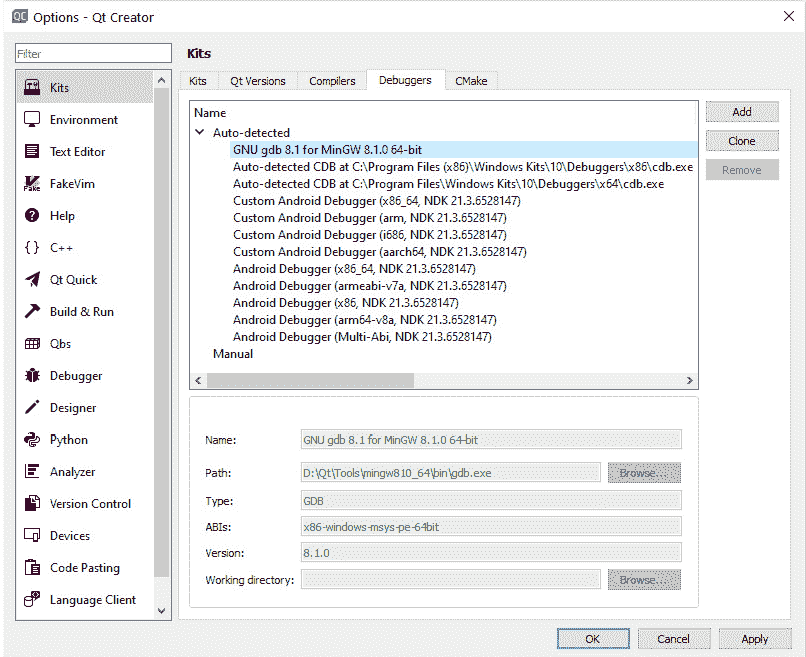

图 9.1 - 选取屏幕下的调试器选项卡显示添加按钮

在**调试器**选项卡中，您可以在右侧看到**添加**、**克隆**和**删除**按钮。您可以克隆现有的调试器配置并修改以满足您的要求。或者，如果您了解调试器的详细信息和配置，那么您可以使用**添加**按钮创建新的调试器配置。您还可以通过单击**删除**按钮删除有问题或过时的调试器配置。不要忘记单击**应用**按钮以保存更改。请注意，您无法修改自动检测到的调试器配置。

在本节中，我们了解了各种支持的调试器。在下一节中，我们将讨论如何调试应用程序。

# 调试策略

有不同的调试策略来找到问题的根本原因。在尝试定位应用程序中的错误之前，深入了解程序或库至关重要。如果您不知道自己在做什么，就无法找到错误。只有对系统及其运行方式有深入了解，才能够识别应用程序中的错误。以往的经验可以帮助检测类似类型的错误以及解决错误。个人专家的知识决定了开发人员能够多快地定位错误。您可以添加调试打印语句和断点来分析程序的流程。您可以进行前向分析或后向分析来跟踪错误的位置。

在调试时，以下步骤用于查找根本原因并解决问题：

1.  确定问题。

1.  定位问题。

1.  分析问题。

1.  解决问题。

1.  修复副作用。

无论编程语言或平台如何，调试应用程序时最重要的是知道代码的哪一部分导致了问题。您可以通过多种方式找到有问题的代码。

如果缺陷是由您的 QA 团队或用户提出的，请询问问题发生的时间。查看日志文件或任何错误消息。注释掉怀疑的代码部分，然后再次构建和运行应用程序，以查看问题是否仍然存在。如果问题是可重现的，通过打印消息和注释掉代码行来进行前向和后向分析，直到找到导致问题的代码行。

您还可以在内置调试器中设置断点，以搜索目标功能中的变量更改。如果其中一个变量已更新为意外值，或者对象指针已成为无效指针，则可以轻松识别它。检查您在安装程序中使用的所有模块，并确保您和您的用户使用的是应用程序的相同版本号。如果您使用的是不同版本或不同分支，请检出带有指定版本标签的分支，然后调试代码。

在下一节中，我们将讨论如何通过打印调试消息和添加断点来调试您的 C++代码。

# 调试 C++应用程序

`QDebug`类可用于将变量的值打印到应用程序输出窗口。`QDebug`类似于标准库中的`std::cout`，但它的好处是它是 Qt 的一部分，这意味着它支持 Qt 类，并且可以在不需要转换的情况下显示其值。

要启用调试消息，我们必须包含`QDebug`头文件，如下所示：

```cpp
#include <QDebug>
```

Qt 提供了几个用于生成不同类型调试消息的全局宏。它们可以用于不同的目的，如下所述：

+   `qDebug()`提供自定义调试消息。

+   `qInfo()`提供信息性消息。

+   `qWarning()`报告警告和可恢复错误。

+   `qCritical()`提供关键错误消息和报告系统错误。

+   `qFatal()`在退出之前提供致命错误消息。

您可以使用`qDebug()`来查看您的功能是否正常工作。在查找错误完成后，删除包含`qDebug()`的代码行，以避免不必要的控制台日志。让我们看看如何使用`qDebug()`来打印变量到输出窗格的示例。创建一个样本`QWidget`应用程序，并添加一个函数`setValue(int value)`，并在函数定义内添加以下代码：

```cpp
int value = 500;
qDebug() << "The value is : " << value;
```

上述代码将在 Qt Creator 底部的输出窗口中显示以下输出：

```cpp
The value is : 500
```

您可以通过查看函数的使用次数和在应用程序内调用的次数来确定值是否被另一个函数更改。如果调试消息多次打印，则它是从多个位置调用的。检查是否将正确的值发送到所有调用函数。在查找问题完成后，删除包含`qDebug()`的代码行，以消除输出控制台窗口中不必要的控制台日志。或者，您可以实现条件编译。

让我们进一步了解 Qt Creator 中的调试和调试选项：

1.  您可以在菜单栏中看到一个**调试**菜单。单击它时，您将看到一个上下文菜单，其中包含如*图 9.2*所示的子菜单：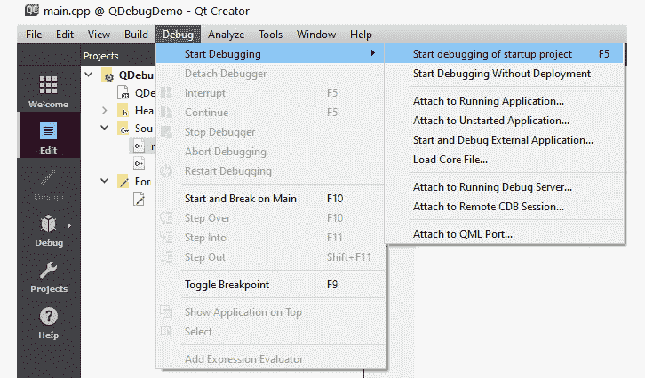

图 9.2 - Qt Creator 中的调试菜单

1.  要开始调试，请按*F5*或单击 Qt Creator 左下角的开始**调试**按钮，如下所示：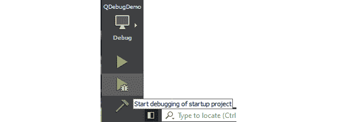

图 9.3 - Qt Creator 中的开始调试按钮

1.  如果 Qt Creator 以错误消息抱怨调试器，则检查您的项目包是否有调试器。

1.  如果错误仍然存在，请关闭 Qt Creator 并转到您的项目文件夹，您可以在那里删除`.pro.user`文件。

1.  然后在 Qt Creator 中重新加载项目。Qt Creator 将重新配置您的项目，并且调试模式现在应该可用。

调试应用程序的一个很好的方法是设置断点：

1.  当您在 Qt Creator 中右键单击脚本的行号时，将会看到一个包含三个选项的弹出菜单。

1.  您还可以单击行号添加断点。单击行号设置断点。您将在行号上看到一个红点出现。

1.  接下来，按下键盘上的*F5*键或单击**Debug**按钮。运行应用程序以调试模式，您会注意到第一个红点上方出现了一个黄色箭头：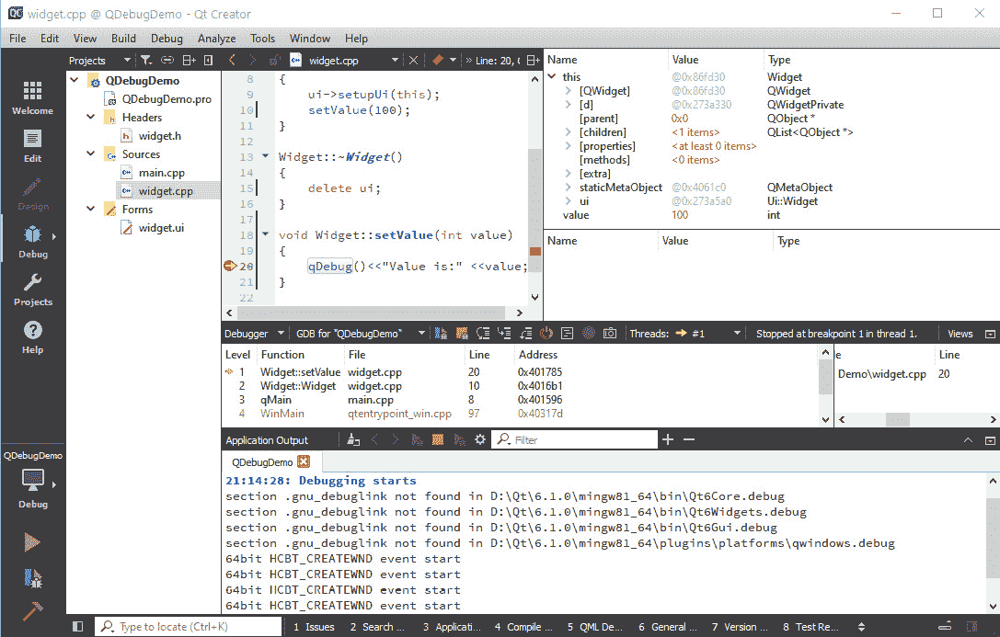

图 9.4 - Qt Creator 显示调试窗口和断点

1.  调试器已在第一个断点处停止。现在，变量及其含义和类型将显示在 Qt Creator 右侧的**Locals**和**Expression**窗口中。

1.  这种方法可以快速检查应用程序。要删除断点，只需再次单击红点图标或从右键单击上下文菜单中删除：

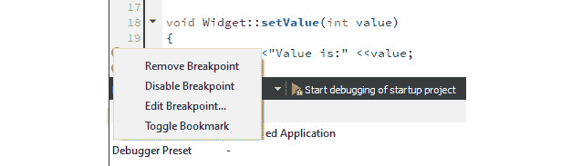

图 9.5 - 上下文菜单显示断点标记的右键单击选项

重要的是要记住，必须在调试模式下运行应用程序。这是因为在调试模式下编译时，您的应用程序或库将具有额外的调试符号，允许调试器从二进制源代码中访问信息，例如标识符、变量和函数的名称。这就是为什么在调试模式下编译的应用程序或库二进制文件在文件大小上更大的原因。

您可以在以下文档中了解更多功能及其用法：

[`doc.qt.io/qt-6/debug.html`](https://doc.qt.io/qt-6/debug.html%20)

重要提示

一些防病毒应用程序会阻止调试器检索信息。Avira 就是这样的防病毒软件。如果在生产 PC 上安装了它，调试器在 Windows 平台上可能会失败。

在下一节中，我们将讨论如何调试 Qt Quick 应用程序并定位 QML 文件中的问题。

# 调试 Qt Quick 应用程序

在上一节中，我们讨论了如何调试 C++代码。但您可能仍然想知道如何调试 QML 中编写的代码。Qt 还提供了调试 QML 代码的功能。在开发 Qt Quick 应用程序时，有很多选项可以解决问题。在本节中，我们将讨论与 QML 相关的各种调试技术以及如何使用它们。

就像`QDebug`类一样，在 QML 中有不同的控制台 API 可用于调试。它们如下：

+   `Log`：用于打印一般消息。

+   `Assert`：用于验证表达式。

+   `Timer`：用于测量调用之间花费的时间。

+   `Trace`：用于打印 JavaScript 执行的堆栈跟踪。

+   `Count`：用于查找对函数的调用次数。

+   `Profile`：用于对 QML 和 JavaScript 代码进行分析。

+   `Exception`：用于打印错误消息。

控制台 API 提供了几个方便的函数来打印不同类型的调试消息，例如`console.log()`、`console.debug()`、`console.info()`、`console.warn()`和`console.error()`。您可以按以下方式打印带有参数值的消息：

```cpp
console.log("Value is:", value)
```

您还可以通过在`Components.onCompleted:{…}`中添加消息来检查组件的创建：

```cpp
Components.onCompleted: { 
     console.log("Component created") 
}
```

要验证表达式是否为真，您可以使用`console.assert()`，例如以下示例：

```cpp
console.assert(value == 100, "Reached the maximum limit");
```

您会发现`console.time()`和`console.timeEnd()`记录了调用之间花费的时间。`console.trace()`打印了 JavaScript 执行的堆栈跟踪。堆栈跟踪详细信息包括函数名、文件名、行号和列号。

`console.count()`返回代码执行次数以及消息。当使用`console.profile()`时，QML 和 JavaScript 分析被激活，当调用`console.profileEnd()`时被停用。您可以使用`console.exception()`打印错误消息以及 JavaScript 执行的堆栈跟踪。

您可以以与前一节讨论的相同方式添加断点，如下所示：

+   进入堆栈中的代码，单击工具栏上的**Step Into**按钮或按下*F11*键。

+   要退出，请按*Shift* + *F11*。要命中断点，请在方法末尾添加断点，然后单击**Continue**。

+   打开 QML 调试器控制台输出窗格，以在当前上下文中运行 JavaScript 命令。

在运行 Qt Quick 应用程序时，您可以找到问题并观察值。这将帮助您找到导致意外行为并需要修改的代码部分。

在本节中，我们了解了在 QML 环境中进行调试。在下一节中，我们将讨论 Qt 中的测试框架。

# 在 Qt 中进行测试

**单元测试**是使用自动化工具测试简单应用程序、类或函数的一种方法。在讨论如何将其纳入我们的方法之前，我们将讨论它是什么以及为什么我们希望这样做。单元测试是将应用程序分解为最小的功能单元，然后在倡议框架内使用真实世界的情况对每个单元进行测试的过程。单元是可以测试的应用程序的最小组件。在过程式编程中，单元测试通常侧重于函数或过程。

在面向对象编程中，单元通常是接口、类或单个函数。单元测试早期识别实施过程中的问题。这涵盖了程序员实现中的缺陷，以及单元规范中的缺陷或不完整部分。在创建过程中，单元测试是由要测试的单元的开发人员开发的短代码片段。有许多单元测试工具可用于测试您的 C++代码。让我们探讨 Qt 测试框架的优势和特点。

## 在 Qt 中进行单元测试

Qt Test 是用于基于 Qt 的应用程序和库的单元测试平台。Qt Test 包括传统单元测试应用程序中的所有功能，以及用于测试图形用户界面的插件。它有助于更轻松地为基于 Qt 的程序和库编写单元测试。*图 9.6*显示了**选项**下的**测试**部分：

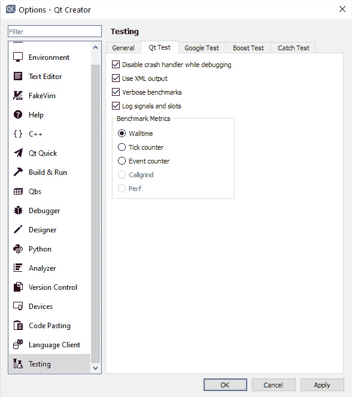

图 9.6–显示 Qt Creator 选项菜单下的 Qt Test 首选项的屏幕截图

以前，单元测试可能是手动完成的，特别是对于 GUI 测试，但现在有一个工具可以让您编写代码自动验证代码，这乍一看似乎有些违反直觉，但它确实有效。Qt Test 是一个基于 Qt 的专门单元测试框架。

您必须在项目文件（.pro）中添加`testlib`以使用 Qt 的内置单元测试模块：

```cpp
QT += core testlib
```

接下来，运行`qmake`以将模块添加到您的项目中。为了使测试系统找到并实现它，您必须使用`QTest`头文件并将测试函数声明为私有槽。`QTest`头文件包含与 Qt Test 相关的所有函数和语句。要使用`QTest`功能，只需在您的 C++文件中添加以下行：

```cpp
#include <QTest>
```

您应该为每种可能的情况编写测试用例，然后在基线代码更改时运行测试，以确保系统继续按预期行为。这是一个非常有用的工具，可以确保任何编程更新不会破坏现有功能。

让我们使用 Qt Creator 内置的向导创建一个简单的测试应用程序。从**新建项目**菜单中选择**自动测试项目**，如*图 9.7*所示：

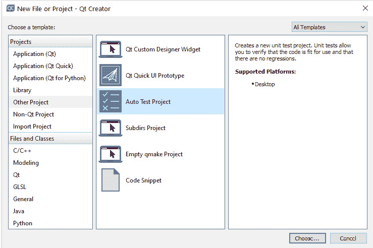

图 9.7–项目向导中的新自动测试项目选项

生成测试项目框架后，您可以修改生成的文件以满足您的需求。打开测试项目的`.pro`文件，并添加以下代码行：

```cpp
QT += testlib
QT -= gui
CONFIG += qt console warn_on depend_includepath testcase
CONFIG -= app_bundle
TEMPLATE = app
SOURCES +=  tst_testclass.cpp
```

让我们创建一个名为`TestClass`的 C++类。我们将把我们的测试函数添加到这个类中。这个类必须派生自`QObject`。让我们看一下`tst_testclass.cpp`：

```cpp
#include <QtTest>
class TestClass : public QObject
{
    Q_OBJECT
public:
    TestClass() {}
    ~TestClass(){}
private slots:
    void initTestCase(){}
    void cleanupTestCase() {}
    void test_compareStrings();
    void test_compareValues();
};
```

在前面的代码中，我们声明了两个测试函数来测试样本字符串和值。您需要为声明的测试用例实现测试函数的测试场景。让我们比较两个字符串并进行简单的算术运算。您可以使用诸如`QCOMPARE`和`QVERIFY`之类的宏来测试值：

```cpp
void TestClass::test_compareStrings()
{
    QString string1 = QLatin1String("Apple");
    QString string2 = QLatin1String("Orange");
    QCOMPARE(string1.localeAwareCompare(string2), 0);
}
void TestClass::test_compareValues()
{
    int a = 10;
    int b = 20;
    int result = a + b;
    QCOMPARE(result,30);
}
```

要执行所有测试用例，您必须在文件底部添加诸如`QTEST_MAIN()`的宏。`QTEST_MAIN()`宏扩展为一个简单的`main()`方法，用于运行所有测试函数。`QTEST_APPLESS_MAIN()`宏适用于简单的独立非 GUI 测试，其中不使用`QApplication`对象。如果不需要 GUI 但需要事件循环，则使用`QTEST_GUILESS_MAIN()`：

```cpp
QTEST_APPLESS_MAIN(TestClass)
#include "tst_testclass.moc"
```

为了使测试用例成为一个独立的可执行文件，我们添加了`QTEST_APPLESS_MAIN()`宏和类的`moc`生成文件。您可以使用许多其他宏来测试应用程序。有关更多信息，请访问以下链接：

[`doc.qt.io/qt-6/qtest.html#macros`](http://doc.qt.io/qt-6/qtest.html#macros%20)

当您运行上面的示例时，您将看到如下所示的测试结果输出：

```cpp
********* Start testing of TestClass *********
Config: Using QtTest library 6.1.0, Qt 6.1.0 (x86_64-little_endian-llp64 shared (dynamic) release build; by GCC 8.1.0), windows 10
64bit HCBT_CREATEWND event start
PASS   : TestClass::initTestCase()
FAIL!  : TestClass::test_compareStrings() Compared values are not the same
   Actual   (string1.localeAwareCompare(string2)): -1
   Expected (0)                                  : 0
..\TestProject\tst_testclass.cpp(26) : failure location
PASS   : TestClass::test_compareValues()
PASS   : TestClass::cleanupTestCase()
Totals: 3 passed, 1 failed, 0 skipped, 0 blacklisted, 7ms
********* Finished testing of TestClass *********
```

您可以看到一个测试用例失败，因为它未满足测试标准。类似地，您可以添加更多的测试用例，并从另一个类中获取参数来测试功能。您还可以使用**运行所有测试**选项从 Qt Creator 菜单栏的**测试**上下文菜单中运行所有测试，如*图 9.8*所示：

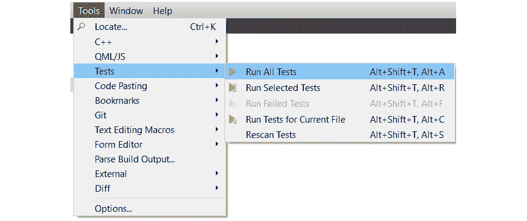

图 9.8 - 工具菜单下的测试选项

您还可以在左侧的项目资源管理器视图中查看所有测试用例。从项目资源管理器下拉菜单中选择**测试**。您可以在此窗口中启用或禁用某些测试用例。*图 9.9*显示了我们之前编写的两个测试用例。您还可以看到我们没有在这个测试项目中使用其他测试框架：

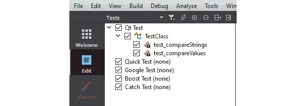

图 9.9 - 项目资源管理器下拉菜单中的测试资源管理器选项

您可以使用几个`QTest`便利函数来模拟 GUI 事件，如键盘或鼠标事件。让我们看一个简单的代码片段的用法：

```cpp
QTest::keyClicks(testLineEdit, "Enter");
QCOMPARE(testLineEdit->text(), QString("Enter"));
```

在前面的代码中，测试代码模拟了`lineedit`控件上的键盘文本`Enter`事件，然后验证了输入的文本。您还可以使用`QTest::mouseClick()`来模拟鼠标点击事件。您可以按照以下方式使用它：

```cpp
QTest::mouseClick(testPushBtn, Qt::LeftButton);
```

Qt 的测试框架在**测试驱动开发**（**TDD**）中也很有用。在 TDD 中，您首先编写一个测试，然后编写实际的逻辑代码。由于没有实现，测试最初会失败。然后，您编写必要的最少代码以通过测试，然后再进行下一个测试。这是在实现必要功能之前迭代开发功能的方法。

在本节中，我们学习了如何创建测试用例并模拟 GUI 交互事件。在下一节中，您将学习如何使用 Google 的 C++测试框架。

# 与 Google 的 C++测试框架集成

**GoogleTest**是由 Google 开发的测试和模拟框架。**GoogleMock**项目已合并到 GoogleTest 中。GoogleTest 需要支持至少 C++11 标准的编译器。它是一个跨平台的测试框架，支持 Windows、Linux 和 macOS 等主要桌面平台。它可以帮助您使用高级功能（如模拟）编写更好的 C++测试。您可以将 Qt Test 与 GoogleTest 集成，以充分利用两个框架的优势。如果您打算使用两个测试框架的功能，则应将 GoogleTest 用作主要测试框架，并在测试用例中使用 Qt Test 的功能。

Qt Creator 内置支持 GoogleTest。您可以在**选项**屏幕的**测试**部分中找到**Google 测试**选项卡，并设置全局的 GoogleTest 偏好，如*图 9.10*所示：

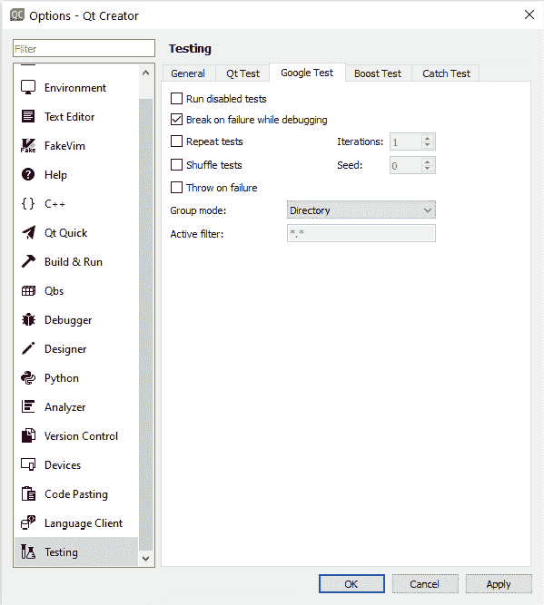

图 9.10 - 选项菜单下测试部分中的 Google 测试选项卡

您可以从以下链接下载 GoogleTest 源代码：

[`github.com/google/googletest`](https://github.com/google/googletest%20)

您可以在以下文档中了解更多关于功能及其用法的信息：

[`google.github.io/googletest/primer.html`](https://google.github.io/googletest/primer.html%20)

下载源代码后，在创建示例应用程序之前构建库。您还可以将统一的 GoogleTest 源代码与测试项目一起构建。生成库后，按照以下步骤运行您的 GoogleTest 应用程序：

1.  要使用 Qt Creator 内置的向导创建一个简单的 GoogleTest 应用程序，请从**新建项目**菜单中选择**自动测试项目**。然后按照屏幕操作直到出现**项目和测试信息**。

1.  在**项目和测试信息**屏幕上，选择**Google 测试**作为**测试框架**。然后按照*图 9.11*所示添加**测试套件名称**和**测试用例名称**字段的信息：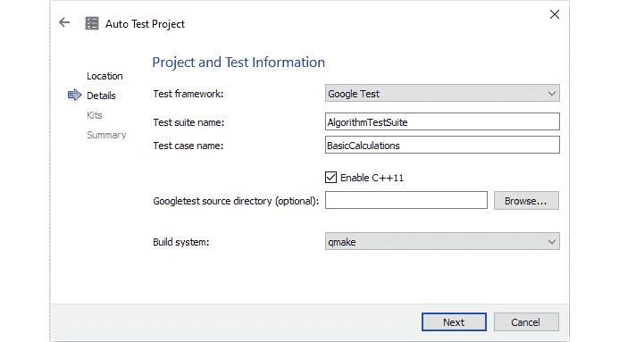

图 9.11 - 项目创建向导中的 Google 测试选项

1.  接下来，您可以填写`.pro`文件。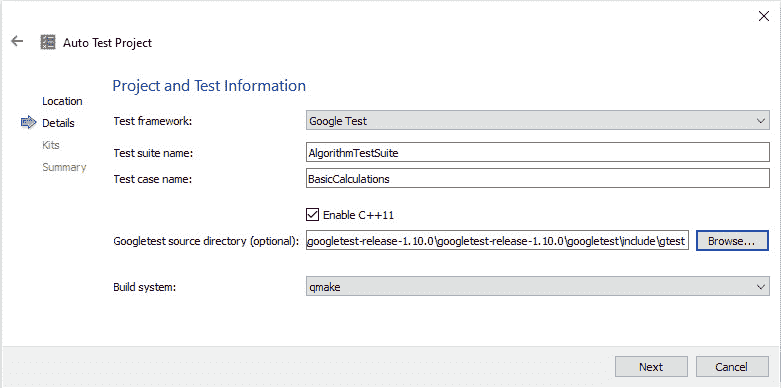

图 9.12 - 在项目创建向导中添加 GoogleTest 源目录的选项

1.  单击**下一步**，按照说明生成项目的框架。

1.  要使用 GoogleTest，您必须将头文件添加到测试项目中：

```cpp
#include "gtest/gtest.h"
```

1.  您可以看到主函数已经被向导创建：

```cpp
#include "tst_calculations.h"
#include "gtest/gtest.h"
int main(int argc,char *argv[])
{
    ::testing::InitGoogleTest(&argc,argv);
    return RUN_ALL_TESTS();
}
```

1.  您可以使用以下语法创建一个简单的测试用例：

```cpp
TEST(TestCaseName, TestName) { //test logic }
```

1.  GoogleTest 还提供了诸如`ASSERT_*`和`EXPECT_*`的宏来检查条件和值：

```cpp
ASSERT_TRUE(condition)
ASSERT_EQ(expected,actual)
ASSERT_FLOAT_EQ(expected,actual)
EXPECT_DOUBLE_EQ (expected, actual)
```

在大多数情况下，在运行多个测试之前进行一些自定义的初始化工作是标准的程序。如果您想评估测试的时间/内存占用情况，您将不得不编写一些特定于测试的代码。测试装置有助于设置特定的测试要求。`fixture`类是从`::testing::Test`类派生的。请注意，使用`TEST_F`宏而不是`TEST`。您可以在构造函数或`SetUp()`函数中分配资源和进行初始化。同样，您可以在析构函数或`TearDown()`函数中释放资源。测试装置中的测试函数定义如下：

```cpp
TEST_F(TestFixtureName, TestName) { //test logic }
```

1.  创建和使用测试装置，创建一个从`::testing::Test`类派生的类，如下所示：

```cpp
class PushButtonTests: public ::testing::Test
{
protected:
    virtual void SetUp()
    {
        pushButton = new MyPushButton(0);
        pushButton ->setText("My button");
    }
};
TEST_F(PushButtonTests, sizeConstraints)
{
    EXPECT_EQ(40, pushButton->height());
    EXPECT_EQ(200, pushButton->width());
    pushButton->resize(300,300);
    EXPECT_EQ(40, pushButton->height());
    EXPECT_EQ(200, pushButton->width());
}
TEST_F(PushButtonTests, enterKeyPressed)
{
    QSignalSpy spy(pushButton, SIGNAL(clicked()));
    QTest::keyClick(pushButton, Qt::Key_Enter);
    EXPECT_EQ(spy.count(), 1);
}
```

在上述代码中，我们在`SetUp()`函数中创建了一个自定义的按钮。然后我们测试了两个测试函数来测试大小和*Enter*键处理。

1.  当您运行上述测试时，您将在输出窗口中看到测试结果。

GoogleTest 在运行时为使用`TEST_F()`指定的每个测试构建一个新的测试装置。它通过调用`SetUp()`函数立即进行初始化并运行测试。然后调用`TearDown()`进行清理，并移除测试装置。重要的是要注意，同一测试套件中的不同测试可以具有不同的测试装置对象。在构建下一个测试装置之前，GoogleTest 始终删除先前的测试装置。它不会为多个测试重用测试装置。一个测试对测试装置所做的任何修改对其他测试没有影响。

我们讨论了如何使用简单的测试用例创建 GoogleTest 项目以及如何设计测试夹具或测试套件。现在您可以为现有的 C++应用程序创建测试用例。GoogleTest 是一个非常成熟的测试框架。它还集成了早期在 GoogleMock 下可用的模拟机制。探索不同的功能并尝试测试用例。

还有一个现成的 GUI 工具，集成了两个测试框架，用于测试您的 Qt 应用程序。**GTest Runner**是一个基于 Qt 的自动化测试运行器和 GUI，具有强大的功能，适用于 Windows 和 Linux 平台。但是，该代码目前没有得到积极维护，并且尚未升级到 Qt 6。您可以在以下链接了解有关 GTest Runner 功能和用法的更多信息：

[`github.com/nholthaus/gtest-runner`](https://github.com/nholthaus/gtest-runner%20)

在本节中，您学习了如何同时使用`QTest`和`GoogleTest`。您已经了解了两种测试框架的特点。您可以使用 GoogleTest 框架的 GoogleMock 功能创建模拟对象。现在您可以为自定义的 C++类或自定义小部件编写自己的测试夹具。在下一节中，我们将讨论 Qt Quick 中的测试。

# 测试 Qt Quick 应用程序

`TestCase` QML 类型。以`test_`开头的函数被识别为需要执行的测试用例。测试工具会递归搜索`tst_ *.qml`文件所需的源目录。您可以将所有测试`.qml`文件放在一个目录下，并定义`QUICK_TEST_SOURCE_DIR`。如果未定义，则只有当前目录中可用的`.qml`文件将在测试执行期间包含在内。Qt 不保证 Qt Quick 测试模块的二进制兼容性。您必须使用模块的适当版本。

您需要将`QUICK_TEST_MAIN()`添加到 C++文件中，以开始执行测试用例，如下所示：

```cpp
#include <QtQuickTest>
QUICK_TEST_MAIN(testqml)
```

您需要添加`qmltest`模块以启用 Qt Quick 测试。将以下代码添加到`.pro`文件中：

```cpp
QT += qmltest
TEMPLATE = app
TARGET = tst_calculations
CONFIG += qmltestcase
SOURCES += testqml.cpp
```

让我们看一个基本算术计算的演示，以了解模块的工作原理。我们将进行一些计算，如加法、减法和乘法，并故意犯一些错误，以便测试用例失败：

```cpp
import QtQuick
import QtTest
TestCase {
    name: "Logic Tests"
    function test_addition() {
        compare(4 + 4, 8, "Logic: 4 + 4 = 8")
    }
    function test_subtraction() {
        compare(9 - 5, 4, "Logic: 9 - 5 = 4")
    }
    function test_multiplication() {
        compare(3 * 3, 6, "Logic: 3 * 3 = 6")
    }
}
```

当您运行上述示例时，您将看到以下测试结果的输出：

```cpp
********* Start testing of testqml *********
Config: Using QtTest library 6.1.0, Qt 6.1.0 (x86_64-little_endian-llp64 shared (dynamic) release build; by GCC 8.1.0), windows 10
PASS   : testqml::Logic Tests::initTestCase()
PASS   : testqml::Logic Tests::test_addition()
FAIL!  : testqml::Logic Tests::test_multiplication()Logic: 3 * 3 = 6
   Actual   (): 9
   Expected (): 6
C:\Qt6Book\Chapter09\QMLTestDemo\tst_calculations.qml(15) : failure location
PASS   : testqml::Logic Tests::test_subtraction()
PASS   : testqml::Logic Tests::cleanupTestCase()
Totals: 4 passed, 1 failed, 0 skipped, 0 blacklisted, 3ms
********* Finished testing of testqml *********
```

请注意，`cleanupTestCase()`在测试执行完成后立即调用。此函数可用于在一切被销毁之前进行清理。

您还可以执行数据驱动的测试，如下所示：

```cpp
import QtQuick
import QtTest
TestCase {
    name: "DataDrivenTests"
    function test_table_data() {
        return [
            {tag: "10 + 20 = 30", a: 10, b: 20, result: 30         
},
            {tag: "30 + 60 = 90", a: 30, b: 60, result: 90  
},
            {tag: "50 + 50 = 100", a: 50, b: 50, result: 50 
},
        ]
    }
    function test_table(data) {
        compare(data.a + data.b, data.result)
    }
}
```

请注意，可以使用以`_data`结尾的函数名向测试提供表格数据。当您运行上述示例时，您将看到以下测试结果的输出：

```cpp
********* Start testing of main *********
Config: Using QtTest library 6.1.0, Qt 6.1.0 (x86_64-little_endian-llp64 shared (dynamic) release build; by GCC 8.1.0), windows 10
PASS   : main::DataDrivenTests::initTestCase()
PASS   : main::DataDrivenTests::test_table(10 + 20 = 30)
PASS   : main::DataDrivenTests::test_table(30 + 60 = 90)
FAIL!  : main::DataDrivenTests::test_table(50 + 50 = 100) Compared values are not the same
   Actual   (): 100
   Expected (): 50
C:\Qt6Book\Chapter09\QMLDataDrivenTestDemo\tst_datadriventests.qml(14) : failure location
PASS   : main::DataDrivenTests::cleanupTestCase()
Totals: 4 passed, 1 failed, 0 skipped, 0 blacklisted, 3ms
********* Finished testing of main *********
```

您还可以在 QML 中运行基准测试。Qt 基准测试框架将多次运行以`benchmark_`开头的函数，并记录运行的平均时间值。这类似于 C++版本中的`QBENCHMARK`宏，用于获得`QBENCHMARK_ONCE`宏的效果。让我们看一个基准测试的示例：

```cpp
import QtQuick
import QtTest
TestCase {
    id: testObject
    name: "BenchmarkingMyItem"
    function benchmark_once_create_component() {
        var component = Qt.createComponent("MyItem.qml")
        var testObject = component.createObject(testObject)
        testObject.destroy()
        component.destroy()
    }
}
```

在上面的示例中，我们创建了一个自定义的 QML 元素。我们想要测量创建该元素所需的时间。因此，我们编写了上述基准测试代码。普通的基准测试会多次运行并显示操作的持续时间。在这里，我们对创建进行了基准测试一次。这种技术在评估您的 QML 代码的性能时非常有用。

当您运行上述示例时，您将看到以下测试结果的输出：

```cpp
********* Start testing of testqml *********
Config: Using QtTest library 6.1.0, Qt 6.1.0 (x86_64-little_endian-llp64 shared (dynamic) release build; by GCC 8.1.0), windows 10
PASS   : testqml::BenchmarkingMyItem::initTestCase()
PASS   : testqml::BenchmarkingMyItem::benchmark_once_create_component()
PASS   : testqml::BenchmarkingMyItem::benchmark_once_create_component()
RESULT : testqml::benchmark_once_create_component:
     0 msecs per iteration (total: 0, iterations: 1)
PASS   : testqml::BenchmarkingMyItem::cleanupTestCase()
QWARN  : testqml::UnknownTestFunc() QQmlEngine::setContextForObject(): Object already has a QQmlContext
Totals: 4 passed, 0 failed, 0 skipped, 0 blacklisted, 5ms
********* Finished testing of testqml *********
```

要多次运行基准测试，可以从测试用例中删除`once`关键字，如下所示：`function benchmark_create_component() {...}`。您还可以使用`Qt.createQmlObject()`测试动态创建的对象。

还有一个名为**qmlbench**的基准测试工具，用于基准测试 Qt 应用程序的整体性能。这是一个功能丰富的基准测试工具，可在**qt-labs**下使用。该工具还有助于测量用户界面的刷新率。您可以在以下链接中了解更多关于此工具的信息：

[`github.com/qt-labs/qmlbench`](https://github.com/qt-labs/qmlbench%20)

与 C++实现一样，您还可以在 QML 中模拟键盘事件，例如`keyPress()`、`keyRelease()`和`keyClick()`。事件将传递到当前正在聚焦的 QML 对象。让我们看看以下示例：

```cpp
import QtQuick
import QtTest
MouseArea {
    width: 100; height: 100
    TestCase {
        name: "TestRightKeyPress"
        when: windowShown
        function test_key_click() {
            keyClick(Qt.Key_Right)
        }
    }
}
```

在前面的例子中，键盘事件是在显示 QML 查看窗口后传递的。在此之前尝试传递事件将不成功。为了跟踪窗口何时显示，使用了`when`和`windowShown`属性。

当您运行前面的例子时，您将看到以下测试结果的输出：

```cpp
********* Start testing of testqml *********
Config: Using QtTest library 6.1.0, Qt 6.1.0 (x86_64-little_endian-llp64 shared (dynamic) release build; by GCC 8.1.0), windows 10
PASS   : testqml::TestRightKeyPress::initTestCase()
QWARN  : testqml::TestRightKeyPress::test_key_click() QQmlEngine::setContextForObject(): Object already has a QQmlContext
PASS   : testqml::TestRightKeyPress::test_key_click()
PASS   : testqml::TestRightKeyPress::cleanupTestCase()
Totals: 3 passed, 0 failed, 0 skipped, 0 blacklisted, 25ms
********* Finished testing of testqml *********
```

您可以使用`SignalSpy`来监视信号发射。在以下示例中，我们使用`SignalSpy`来检测`Button`上的`clicked`信号。当信号被发射时，`clickSpy`计数会增加：

```cpp
import QtQuick
import QtQuick.Controls
import QtTest
Button {
    id: pushButton
    SignalSpy {
        id: clickSpy
        target: pushButton
        signalName: "clicked"
    }
    TestCase {
        name: "PushButton"
        function test_click() {
            compare(clickSpy.count, 0)
            pushButton.clicked();
            compare(clickSpy.count, 1)
        }
    }
}
```

当您运行前面的例子时，您将看到以下测试结果的输出：

```cpp
********* Start testing of testqml *********
Config: Using QtTest library 6.1.0, Qt 6.1.0 (x86_64-little_endian-llp64 shared (dynamic) release build; by GCC 8.1.0), windows 10
PASS   : testqml::PushButton::initTestCase()
PASS   : testqml::PushButton::test_click()
PASS   : testqml::PushButton::cleanupTestCase()
Totals: 3 passed, 0 failed, 0 skipped, 0 blacklisted, 5ms
********* Finished testing of testqml *********
```

`QUICK_TEST_MAIN_WITH_SETUP`宏用于在运行任何 QML 测试之前执行 C++代码。这对于在 QML 引擎上设置上下文属性非常有用。测试应用程序可以包括多个`TestCase`实例。运行所有测试用例后，应用程序将终止。您可以从**Tests**资源管理器中启用或禁用测试用例：

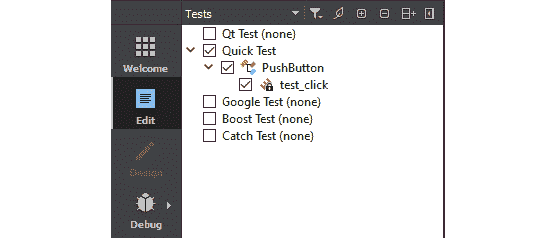

图 9.13 - 测试资源管理器显示具有可用测试用例的快速测试

在本节中，我们讨论了测试 QML 对象的不同测试方法。在下一节中，我们将熟悉 GUI 测试，并了解一些流行的工具。

# GUI 测试工具

您可以轻松地将一个或多个类评估为单元测试，但我们必须手动编写所有测试用例。GUI 测试是一项特别具有挑战性的任务。我们如何记录用户交互，例如鼠标点击，而不需要在 C++或 QML 中编写代码？这个问题困扰着开发人员。市场上有许多 GUI 测试工具可帮助我们做到这一点。其中一些价格昂贵，一些是开源的。我们将在本节中讨论一些此类工具。

但您可能不需要一个完整的 GUI 测试框架。一些问题可以通过简单的技巧解决。例如，在处理 GUI 时，您可能还需要检查不同属性，如可视元素的对齐和边界。其中最简单的方法之一是添加一个`Rectangle`来检查边界，如下面的代码所示：

```cpp
Rectangle {
    id: container
    anchors {
        left: parent.left
        leftMargin: 100
        right: parent.right
        top: parent.top
        bottom: parent.bottom
    }
    Rectangle {
        anchors.fill : parent
        color: "transparent"
        border.color: "blue"    }
    Text {
        text: " Sample text"
        anchors.centerIn: parent
        Rectangle {
            anchors.fill : parent
            color: "transparent"
            border.color: "red"
        }
    }
}
```

当您运行前面的代码片段时，您将看到 GUI 中的元素边界以颜色显示，如下一张截图所示：

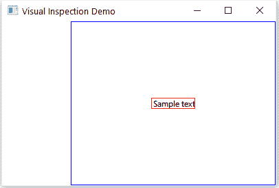

图 9.14 - 使用矩形输出 GUI 元素的视觉边界

在前面的例子中，您可以看到文本元素被放置在带有蓝色边框的矩形内部。如果没有蓝色边框，您可能会想知道为什么它没有在 GUI 中央放置。您还可以看到每个元素的边界和边距。当文本元素的宽度小于字体宽度时，您将观察到裁剪。您还可以找出用户界面元素之间是否有重叠区域。通过这种方式，您可以在不使用`SG_VISUALIZE`环境变量的情况下找到 GUI 特定元素的问题。

让我们讨论一些 GUI 测试工具。

## Linux 桌面测试项目（LDTP）

**Linux 桌面测试项目**（**LDTP**）提供了一个高质量的测试自动化基础设施和尖端工具，用于测试和改进 Linux 桌面平台。LDTP 是一个在所有平台上运行的 GUI 测试框架。它使用可访问性库在应用程序的用户界面中进行探测。该框架还包括根据用户与 GUI 交互的方式记录测试用例的工具。

要单击按钮，请使用以下语法：

```cpp
click('<window name>','<button name>')
```

要获取给定对象的当前滑块值，请使用以下代码：

```cpp
getslidervalue('<window name>','<slider name>')
```

要为您的 GUI 应用程序使用 LDTP，必须为所有 QML 对象添加可访问名称。您可以使用对象名称作为可访问名称，如下所示：

```cpp
Button {
     id: quitButton
     objectName: "quitButton"
     Accessible.name: objectName 
}
```

在上述代码中，我们为 QML 控件添加了可访问名称，以便 LDTP 工具可以找到此按钮。LDTP 需要用户界面的窗口名称来定位子控件。假设窗口名称是**Example**，那么要生成单击事件，请在 LDTP 脚本上使用以下命令：

```cpp
>click('Example','quitButton')
```

上述 LDTP 命令定位`quitButton`并生成按钮单击事件。

您可以在以下链接了解其特点和用途：

[`ldtp.freedesktop.org/user-doc/`](https://ldtp.freedesktop.org/user-doc/%20)

## GammaRay

KDAB 开发了一个名为`QObject`内省机制的软件内省工具。这个工具可以在本地机器和远程嵌入式目标上使用。它扩展了指令级调试器的功能，同时遵循底层框架的标准。这对于使用场景图、模型/视图、状态机等框架的复杂项目特别有用。有几种工具可用于检查对象及其属性。然而，它与 Qt 复杂框架的深度关联使其脱颖而出。

您可以从以下链接下载 GammaRay：

[`github.com/KDAB/GammaRay/wiki/Getting-GammaRay`](https://github.com/KDAB/GammaRay/wiki/Getting-GammaRay%20)

您可以在以下链接了解其特点和用途：

[`www.kdab.com/development-resources/qt-tools/gammaray/`](https://www.kdab.com/development-resources/qt-tools/gammaray/%20)

## Squish

**Squish**是一个用于桌面、移动、嵌入式和 Web 应用程序的跨平台 GUI 测试自动化工具。您可以使用 Squish 自动化 GUI 测试，用于使用 Qt Widgets 或 Qt Quick 编写的跨平台应用程序。Squish 被全球数千家组织用于通过功能回归测试和系统测试测试其 GUI。

您可以在以下链接了解有关该工具的更多信息：

[`www.froglogic.com/squish/`](https://www.froglogic.com/squish/%20)

在本节中，我们讨论了各种 GUI 测试工具。探索它们，并尝试在您的项目中使用它们。让我们总结一下本章的学习成果。

# 总结

在本章中，我们学习了调试是什么，以及如何使用不同的调试技术来识别 Qt 应用程序中的技术问题。除此之外，我们还看了 Qt 在各种操作系统上支持的各种调试器。最后，我们学习了如何使用单元测试来简化一些调试措施。我们讨论了单元测试，并学习了如何使用 Qt 测试框架。您看到了如何调试 Qt Quick 应用程序。我们还讨论了 Qt 支持的各种其他测试框架和工具。现在，您可以为自定义类编写单元测试。如果有人意外修改了某些特定逻辑，单元测试将失败并自动发出警报。

在*第十章*，*部署 Qt 应用程序*，您将学习如何在各种平台上部署 Qt 应用程序。这将帮助您为目标平台创建可安装的软件包。
