# 第十章：部署 Qt 应用程序

在之前的章节中，您学习了如何使用 Qt 6 开发和测试应用程序。您的应用程序已经准备就绪并在您的桌面上运行，但它并不是独立的。您必须遵循一定的步骤来发布您的应用程序，以便最终用户可以使用。这个过程被称为**部署**。一般来说，最终用户希望有一个可以双击打开以运行您的软件的单个文件。软件部署包括使软件可用于其预期用户的不同步骤和活动，这些用户可能没有任何技术知识。

在本章中，您将学习如何在不同平台上部署 Qt 项目。在整个过程中，您将了解可用的部署工具以及创建部署软件包时需要考虑的重要要点。

在本章中，我们将涵盖以下主题：

+   部署策略

+   静态与动态构建

+   在桌面平台上部署

+   Qt 安装程序框架

+   其他安装工具

+   在 Android 上部署

通过本章结束时，您将能够创建一个可部署的软件包并与他人共享。

# 技术要求

本章的技术要求包括 Qt 6.0.0 和 Qt Creator 4.14.0 的最低版本，安装在最新的桌面平台上，如 Windows 10 或 Ubuntu 20.04 或 macOS 10.14。

本章中使用的所有代码都可以从以下 GitHub 链接下载：[`github.com/PacktPublishing/Cross-Platform-Development-with-Qt-6-and-Modern-Cpp/tree/master/Chapter10/HelloWorld`](https://github.com/PacktPublishing/Cross-Platform-Development-with-Qt-6-and-Modern-Cpp/tree/master/Chapter10/HelloWorld)。

重要说明

本章使用的屏幕截图是在 Windows 平台上进行的。您将在您的设备上看到基于底层平台的类似屏幕。

# 理解部署的必要性

使软件在目标设备上运行的过程，无论是测试服务器、生产环境、用户的桌面还是移动设备，都被称为**软件部署**。通常，最终用户希望有一个可以打开以访问您的应用程序的单个文件。用户不希望经历多个过程来获取各种外来文件。通常，用户寻找可以双击或轻点启动的软件。用户不希望经历一系列步骤来获取一些未知文件。在本章中，我们将讨论在部署 Qt 应用程序时需要考虑的步骤和事项。我们将讨论在 Windows、Mac、Linux 和 Android 平台上部署应用程序。

到目前为止，我们一直在运行我们迄今为止构建的应用程序的调试版本。您应该生成发布二进制文件以生成部署软件包。这两种选择之间的区别在于调试版本包含有关您编写的代码的信息，如果遇到问题，这将使调试变得更加容易。但是，您不希望向用户发送多个文件，因为这对他们来说是没有用的。用户只想运行您的应用程序。这就是为什么您必须向他们提供您应用程序的发布版本。因此，为了发布应用程序，我们将以发布模式创建它，这将为我们提供一个发布二进制文件，我们可以交付给我们的用户。一旦您获得了二进制文件，您将需要根据您想要部署应用程序的平台创建单独的软件包。如果您想在 Windows 上部署，您将采取特定的方法，同样适用于 Linux、macOS 或 Android。

标准的 Qt 部署包包括一个单独的可执行文件，但需要其他文件的存在才能运行。除了可执行文件，还需要以下文件：

+   动态库

+   第三方库

+   附加模块

+   可分发文件

+   Qt 插件

+   翻译文件

+   帮助文件

+   许可证

当我们在 Qt Creator 中启动一个 Qt 项目时，默认情况下设置为使用动态链接。因此，我们的应用程序将需要 Qt 动态链接库。我们还需要您喜欢的编译器的 C++运行时（MinGW/MSVC/Clang/GCC）和标准库实现。这些通常作为 Windows 上的`.dll`文件、Linux 上的`.so`文件以及 macOS 上的`.so`或`.dylib`文件提供。如果您的项目是一个庞大复杂的项目，您可能有多个库。您的应用程序包还可能需要第三方库，如 opengl、libstdc++、libwinpthread 和 openssl。

如果您的应用程序基于 Qt Quick，那么您还需要标准模块，如 QtQuick、QtQml、QtStateMachine、QtCharts 和 Qt3D。它们以动态库的形式提供，还有一些额外的文件提供 QML 模块元数据，或者纯 QML 文件。不幸的是，实现 Qt 的 C++和 QML API 的动态库是不足以让我们的可执行文件运行的。Qt 还使用插件来启用扩展，以及用于相当标准的 GUI 功能，如图像文件加载和显示的插件。同样，一些插件封装了 Qt 运行的平台。

如果您正在使用 Qt 的翻译支持，那么您还需要部署翻译文件。我们将在第十一章“国际化”中更多地讨论翻译。如果您正在使用 Qt 帮助框架甚至简单的 PDF 手册，您可能还需要部署文档文件。您还可能需要部署一些图标、脚本或许可协议供您的应用程序使用。您还必须确保 Qt 库可以自行定位平台插件、文档和翻译，以及预期的可执行文件。

## 在静态和动态库之间进行选择

您可以使用静态链接或动态链接构建您的 Qt 应用程序。在构建应用程序时，链接器使用这两种方法之一将所有使用的库函数的副本复制到可执行文件中。我们假设您已经了解这两种方法。在本节中，我们将讨论何时使用静态链接和何时使用动态链接来构建您的 Qt 应用程序。

在 Linux 中是`.a`文件扩展名，在 Windows 中是`.lib`文件扩展名。

在 Linux 中是`.so`文件扩展名，在 Windows 中是`.dll`文件扩展名。

静态构建由单个可执行文件组成。但在动态构建中，您必须注意动态库。静态构建更简单，因为它们可能已经在可执行文件中包含了 Qt 插件和 QML 导入。静态构建还便于指定`-static`配置选项。这种 Qt 应用程序部署模式仅适用于商业许可。如果您是开源开发人员，应避免静态链接应用程序。由于本书中使用的是开源 Qt 版本，我们不会详细介绍静态构建。相反，我们将坚持使用常规的动态构建和部署。

您可以在以下链接了解有关使用上述方法部署 Qt 应用程序的更多信息：

[`doc.qt.io/qt-6/deployment.html`](https://doc.qt.io/qt-6/deployment.html)。

在接下来的章节中，我们将专注于主要的桌面和移动平台。我们不会讨论嵌入式平台，因为这超出了本书的范围。

# 在桌面平台上部署

您已经看到，在部署 Qt 应用程序时有很多要考虑的事情。幸运的是，Qt 提供了一个工具，可以通过扫描生成的应用程序二进制文件，识别所有依赖项，并将它们复制到部署目录中来协助我们进行这个过程。我们将在各种平台上部署我们的应用程序以实现不同的目标，但概念将保持不变。一旦我们构建好我们的二进制文件，我们需要做的第一件事就是添加依赖项，以便用户可以无困难地执行应用程序。

我们可以以两种方式加载依赖项。我们可以手动操作，也可以使用 Qt 框架或第三方提供的某些工具。在 Windows 上，我们可以使用`windeployqt`来加载我们的依赖项。在 macOS 上，我们可以使用`macdeployqt`来为我们的二进制文件加载依赖项。还有另一个工具叫做`linuxdeployqt`，您可以使用它来为您的二进制文件添加依赖项。`linuxdeployqt`非常适合我们的需求，在本章中我们将讨论它。然而，这个 Linux 部署实用工具不是官方的，也不受 Qt 支持。一旦生成了您的二进制文件，您需要找到并添加依赖项。您可以手动操作，也可以根据您所在的位置使用这些工具之一来部署您的应用程序。

在本章中，我们将使用一个简单的*HelloWorld*示例来讨论如何在不同平台上部署应用程序。我们将找到依赖项并创建一个独立的包。让我们从 Windows 部署开始。

## 在 Windows 上部署

大多数为 Windows 构建的桌面应用程序通常以两种方式交付。首先，应用程序作为一个独立的应用程序交付，无需安装。在这种方法中，应用程序通常作为一个带有所有依赖库的可执行文件（`.exe`）出现在同一目录中。这种类型的应用程序称为`.exe`或`.msi`格式。您将学习如何创建一个可安装的`.exe`文件。在本节中，我们将讨论如何使用这两种方法创建独立部署包。

按照以下步骤创建一个便携式应用程序：

1.  首先创建一个简单的 Qt 应用程序。您可以选择 Qt Widget 或 Qt Quick-based 应用程序。这里我们将讨论基于 Qt Widget 的应用程序。这两种类型的应用程序的过程是相同的。

1.  创建示例应用程序后，您可以选择通过在`main.cpp`文件中添加几行代码来添加应用程序名称、版本、组织名称和域，如下所示：

```cpp
QApplication app (argc, argv);
app.setOrganizationName("Awesome Company");
app.setOrganizationDomain("www.abc.com");
app.setApplicationName("Deployment Demo");
app.setApplicationVersion("1.0.0");
```

1.  创建应用程序后，以**发布**模式构建它。您可以在构建设置中更改**构建**模式。**发布**模式会创建一个较小的二进制文件，因为它会消除调试符号。您可以通过单击并选择**发布**选项来快速从套件选择器部分更改构建模式，如*图 10.1*所示：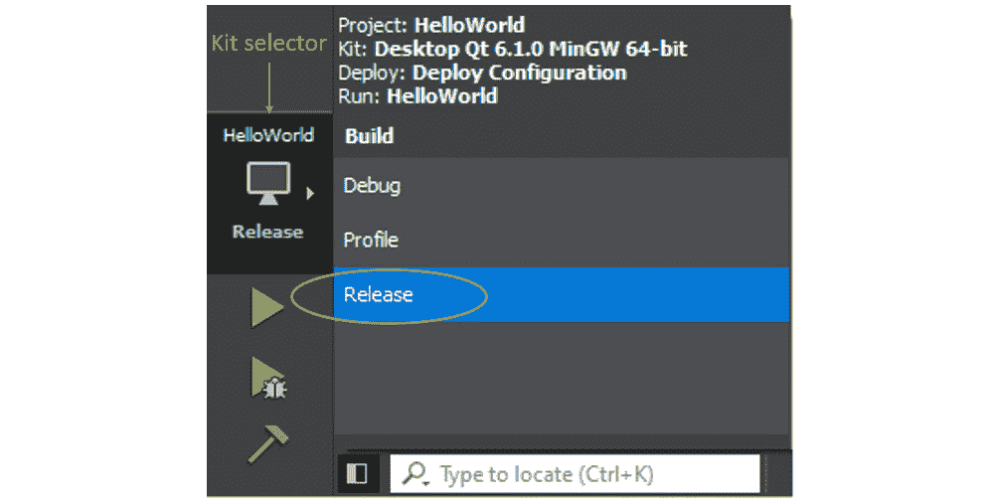

图 10.1 - Qt Creator 中的发布选项

1.  您可以看到二进制文件是在**发布**目录中创建的。在这个例子中，我们使用了*影子构建*。您还可以从**构建设置**屏幕下的**常规**部分更改发布目录：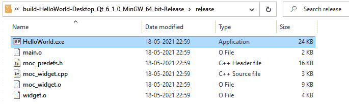

图 10.2 - 具有发布二进制文件的目录

1.  现在，创建一个部署目录，并从**发布**目录中复制可执行文件。

1.  现在，双击可执行文件。您会注意到应用程序无法启动，并出现了几个错误对话框。错误对话框会提到缺少哪个库。如果您没有看到这些错误，那么您可能已经在系统环境中添加了库路径。您可以在未安装 Qt 库的干净系统上尝试：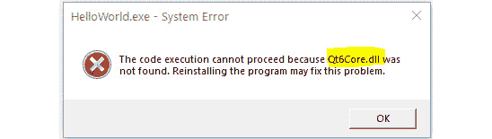

图 10.3 - 显示 Qt 库依赖的错误

1.  下一步是找到在 IDE 之外独立运行应用程序所需的缺失的 Qt 库。

1.  由于我们在这里使用的是 Qt 的开源版本和动态链接方法，您会注意到缺失的库将具有`.dll`扩展名。在这里，我们看到缺失的库是`Qt6Core.dll`。

1.  错误的数量将取决于程序中使用的模块数量。您可以从`QTDIR/6.x.x/<CompilerName>/bin`目录中找到 Qt 依赖库。在这里，`QTDIR`是 Qt 6 安装的位置。在我们的示例中，我们使用了*Qt 6.1.0*作为版本，*mingw81_64*作为编译器，因此路径是`D:/Qt/6.1.0/mingw81_64/bin`。这个路径可能会根据您的 Qt 安装路径、Qt 版本和选择的编译器而有所不同。以下截图显示了`bin`目录下动态库的存在：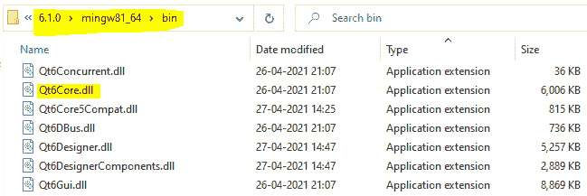

图 10.4 – bin 目录中所需的 Qt 库

1.  如*图 10.4*所示，将缺失的`.dll`文件复制到最近创建的部署目录中。

1.  重复这个过程，直到您将错误消息中提到的所有丢失的库都复制到部署目录中。您可能还需要部署特定于编译器的库以及您的应用程序。您还可以使用**Dependency Walker**（**depends.exe**）工具找到依赖库。这个工具是一个专门针对 Windows 的免费工具。它提供了一个依赖库列表。然而，在最近的版本中，这个工具并不是很有用，经常无法提供所需的信息。您还可以尝试一些其他工具，比如 PeStudio、MiTeC EXE Explorer 和 CFF Explorer。请注意，我没有探索过这些工具。

1.  一旦您复制了所有丢失的库，请尝试再次运行应用程序。这一次，您会注意到一个新的错误弹出。这次，消息与平台插件有关：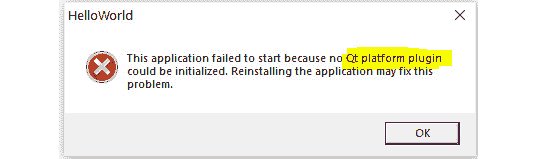

图 10.5 – 错误对话框指示缺少 Qt 平台插件

1.  在部署目录中创建一个名为`platforms`的目录：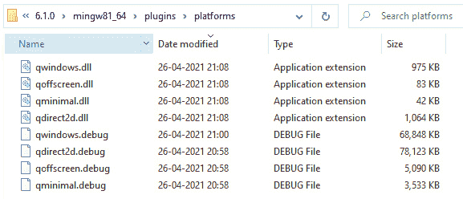

图 10.6 – 显示 Qt Windows 平台插件的目录

1.  然后，将`qwindows.dll`文件从`C:\Qt\6.x.x\<compiler_name>\plugins\platforms`复制到新的`platforms`子目录中。*图 10.7*说明了部署目录中文件的组织结构：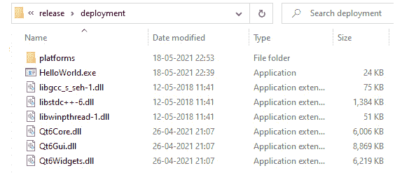

图 10.7 – 在发布目录中复制平台插件

1.  现在，双击`HelloWorld.exe`文件。您会注意到**HelloWorld!** GUI 立即出现。现在，Qt Widgets 应用程序可以在没有安装 Qt 6 的 Windows 平台上运行：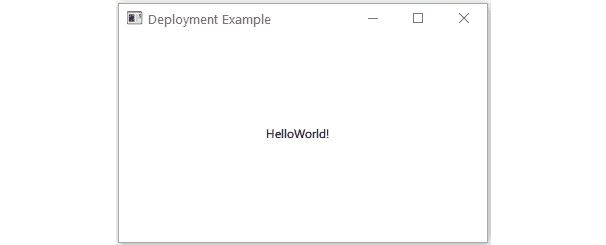

图 10.8 – 运行已解决依赖关系的独立应用程序

1.  下一步，也是最后一步，是将文件夹压缩并与您的朋友分享。

恭喜！您已成功部署了您的第一个独立应用程序。然而，这种方法对于一个有许多依赖文件的大型项目来说效果不佳。Qt 提供了几个方便的工具来处理这些挑战，并轻松创建安装包。在下一节中，我们将讨论 Windows 部署工具以及它如何帮助我们处理这些挑战。

## Windows 部署工具

Windows 部署工具随 Qt 6.x 安装包一起提供。您可以在`<QTDIR>/bin/`下找到它，命名为`windeployqt.exe`。您可以从 Qt 命令提示符中运行这个工具，并将可执行文件作为参数传递，或者使用目录作为参数。如果您正在构建一个 Qt Quick 应用程序，您还需要额外添加`.qml`文件的目录路径。

让我们看看`windeployqt`中一些重要的命令行选项。在下面的列表中探索一些有用的选项：

+   `-?`或`-h`或`--help`显示命令行选项的帮助信息。

+   `--help-all`显示包括 Qt 特定选项在内的帮助信息。

+   `--libdir <path>`将依赖库复制到路径。

+   `--plugindir <path>`将依赖插件复制到路径。

+   `--no-patchqt`指示不要修补 Qt6Core 库。

+   `--no-plugins`指示跳过插件部署。

+   `--no-libraries`指示跳过库部署。

+   `--qmldir <directory>`从源目录扫描 QML 导入。

+   `--qmlimport <directory>`将给定路径添加到 QML 模块搜索位置。

+   `--no-quick-import`指示跳过 Qt Quick 导入的部署。

+   `--no-system-d3d-compiler`指示跳过 D3D 编译器的部署。

+   `--compiler-runtime`在桌面上部署编译器运行时。

+   `--no-compiler-runtime`防止在桌面上部署编译器运行时。

+   `--no-opengl-sw`防止部署软件光栅化器库。

您可以在`bin`文件夹中找到`windeployqt`工具，如下面的屏幕截图所示：

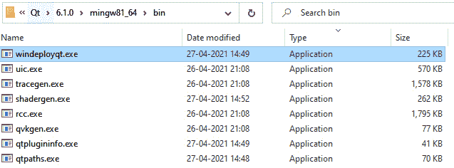

图 10.9 - bin 目录中的 windeployqt 工具

使用`windeployqt`的最简单方法是将其路径添加到**Path**变量中。要将其添加到**Path**，在 Windows 机器上打开**系统属性**，然后单击**高级系统设置**。您会发现**系统属性**窗口出现了。在**系统属性**窗口的底部，您会看到**环境变量…**按钮。单击它，然后选择**Path**变量，如下面的屏幕截图所示。然后，单击**编辑…**按钮。添加 Qt bin 目录的路径，然后单击**确定**按钮：

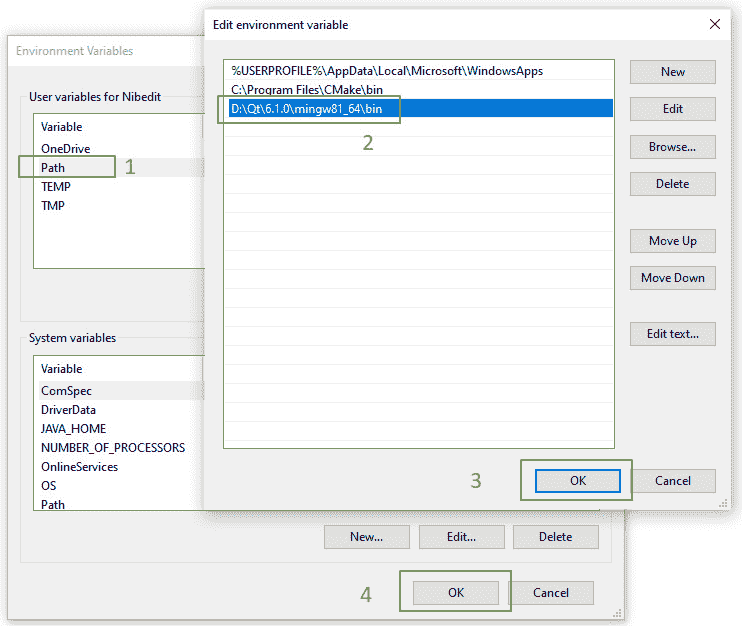

图 10.10 - 将 bin 目录添加到系统环境路径

关闭**系统属性**屏幕并启动 Qt 命令提示符。然后，您可以使用以下语法为基于 Qt Widget 的应用程序创建部署包：

```cpp
>windeployqt <your-executable-path>
```

如果您正在使用 Qt Quick，请按照下一个语法：

```cpp
>windeployqt --qmldir <qmlfiles-path> <your-executable-path>
```

之后，该工具将复制识别出的依赖项到部署目录，确保我们将所有所需的组件放在一个位置。它还将构建插件和其他 Qt 资源的子目录结构，这是您所期望的。如果 ICU 和其他文件不在 bin 目录中，则必须在运行该工具之前将它们添加到**Path**变量中。

让我们从相同的*HelloWorld*示例开始。要使用`windeployqt`创建示例的部署，请执行以下步骤：

1.  创建一个部署目录，并将`HelloWorld.exe`文件复制到部署目录。

1.  现在您可以调用部署工具，如下所示：

```cpp
D:\Chapter10\HelloWorld\deployment>windeployqt HelloWorld.exe
```

1.  输入命令后，工具将开始收集有关依赖项的信息：

```cpp
>D:\Chapter10\HelloWorld\deployment\HelloWorld.exe 64 bit, release executable
Adding Qt6Svg for qsvgicon.dll
Direct dependencies: Qt6Core Qt6Widgets
All dependencies   : Qt6Core Qt6Gui Qt6Widgets
To be deployed     : Qt6Core Qt6Gui Qt6Svg Qt6Widgets
```

1.  您会注意到该工具不仅列出了依赖项，还将所需的文件复制到目标目录。

1.  打开部署目录，您会发现已添加了多个文件和目录：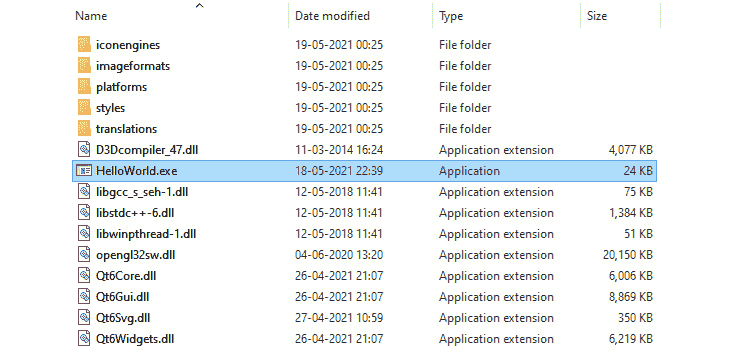

图 10.11 - windeployqt 复制了所有必需的文件到部署目录

1.  在前一节中，我们不得不自己识别和复制所有依赖项，但现在这项任务已委托给了`windeployqt`工具。

1.  如果您正在使用*Qt Quick 应用程序*，请运行以下命令：

```cpp
>D:\Chapter10\qmldeployment>windeployqt.exe --qmldir D:\Chapter10\HelloWorld D:\Chapter10\qmldeployment
```

1.  您会看到该工具已经收集了依赖项，并将所需的文件复制到部署目录：

```cpp
D:\Chapter10\qmldeployment\HelloWorld.exe 64 bit, release executable [QML]
Scanning D:\Chapter10\HelloWorld:
QML imports:
  'QtQuick' D:\Qt\6.1.0\mingw81_64\qml\QtQuick
  'QtQuick.Window' D:\Qt\6.1.0\mingw81_64\qml\QtQuick\Window
  'QtQml' D:\Qt\6.1.0\mingw81_64\qml\QtQml
  'QtQml.Models' D:\Qt\6.1.0\mingw81_64\qml\QtQml\Models
  'QtQml.WorkerScript' D:\Qt\6.1.0\mingw81_64\qml\QtQml\WorkerScript
Adding Qt6Svg for qsvgicon.dll
Direct dependencies: Qt6Core Qt6Gui Qt6Qml
All dependencies   : Qt6Core Qt6Gui Qt6Network Qt6OpenGL Qt6Qml Qt6Quick Qt6QuickParticles Qt6Sql
To be deployed     : Qt6Core Qt6Gui Qt6Network Qt6OpenGL Qt6Qml Qt6Quick Qt6QuickParticles Qt6Sql Qt6Svg
```

1.  现在，您可以双击启动独立应用程序。

1.  下一步是压缩文件夹并与朋友分享。

Windows 部署工具的命令行选项可用于微调识别和复制过程。基本说明可以在以下链接中找到：

[`doc.qt.io/qt-6/windows-deployment.html`](https://doc.qt.io/qt-6/windows-deployment.html)。

[`wiki.qt.io/Deploy_an_Application_on_Windows`](https://wiki.qt.io/Deploy_an_Application_on_Windows).

干杯！您已经学会了使用 Windows 部署工具部署 Qt 应用程序。但是，还有很多工作要做。Qt 安装程序框架提供了几个方便的工具，用于处理这些挑战并轻松创建可安装的软件包。在下一节中，我们将讨论 Linux 部署工具以及如何使用它创建独立应用程序。

## 在 Linux 上部署

在 Linux 发行版中，我们有多种选项来部署我们的应用程序。您可以使用安装程序，但也可以选择应用程序包的选项。在 Debian、Ubuntu 或 Fedora 上有一种称为 `apt` 的技术，您的应用程序可以通过这种方式使用。但是，您也可以选择一个更简单的方法，比如 app image 选项，它将为您提供一个文件。您可以将该文件提供给用户，他们只需双击即可运行应用程序。

Qt 文档提供了在 Linux 上部署的特定说明。您可以在以下链接中查看：

[`doc.qt.io/qt-6/linux-deployment.html`](https://doc.qt.io/qt-6/linux-deployment.html).

Qt 并未为 Linux 发行版提供类似于 `windeployqt` 的现成工具。这可能是由于 Linux 发行版的数量众多。但是，有一个名为 `linuxdeployqt` 的非官方开源 Linux 部署工具。它接受应用程序作为输入，并通过将项目资源复制到包中将其转换为自包含软件包。用户可以将生成的包作为 `AppDir` 或 `AppImage` 获取，或者可以将其包含在跨发行版软件包中。使用诸如 CMake、qmake 和 make 等系统，它可以作为构建过程的一部分来部署用 C、C++ 和其他编译语言编写的应用程序。它可以打包运行基于 Qt 的应用程序所需的特定库和组件。

您可以从以下链接下载 `linuxdeployqt`：

[`github.com/probonopd/linuxdeployqt/releases`](https://github.com/probonopd/linuxdeployqt/releases).

下载后，您将得到 `linuxdeployqt-x86_64.AppImage`，在运行之前执行 `chmod a+x`。

您可以在 [`github.com/probonopd/linuxdeployqt`](https://github.com/probonopd/linuxdeployqt) 上阅读完整的文档并找到源代码。

如果您想轻松地获得单个应用程序包，那么请使用 `-appimage` 标志运行 `linuxdeployqt`。

还有一些其他部署工具，如 **Snap** 和 **Flatpak**，可以打包应用程序及其依赖项，使其在多个 Linux 发行版上运行而无需进行任何修改。

您可以在以下链接中了解如何创建一个 snap：[`snapcraft.io/docs/creating-a-snap`](https://snapcraft.io/docs/creating-a-snap%20)

您可以通过访问以下链接了解更多关于 Flatpak 的信息：[`docs.flatpak.org/en/latest/qt.html`](https://docs.flatpak.org/en/latest/qt.html%20)

在下一节中，我们将讨论 macOS 部署工具以及如何使用它为您的 Mac 用户创建独立应用程序。

## 在 macOS 上部署

您可以按照前几节讨论的类似过程来为 macOS 生成安装程序文件。我们将讨论您可以遵循的步骤来生成应用程序包。您可以在 macOS 上测试该软件包并将其发送给您的 Mac 用户。该过程与在 Linux 上基本相同。毕竟，macOS 是基于 Unix 的。因此，您可以在 macOS 上创建我们称之为 bundle 的安装程序。

您可以在`QTDIR/bin/macdeployqt`中找到 macOS 部署工具。它旨在自动化创建包含 Qt 库作为私有框架的可部署应用程序包的过程。Mac 部署工具还部署 Qt 插件，除非您指定`-no-plugins`选项。默认情况下，Qt 插件（如平台、图像格式、打印支持和辅助功能）始终被部署。只有在应用程序使用时，才会部署 SQL 驱动程序和 SVG 插件。设计师插件不会被部署。如果要在应用程序包中包含第三方库，必须在构建后手动将库复制到包中。

几年前，苹果推出了一个名为`.dmg`的新文件系统。为了与 Qt 当前支持的所有 macOS 版本兼容，`macdeployqt`默认使用较旧的 HFS+文件系统。要选择不同的文件系统，请使用`-fs`选项。

您可以在以下链接找到详细的说明：[`doc.qt.io/qt-6/macos-deployment.html`](https://doc.qt.io/qt-6/macos-deployment.html)。

在下一节中，我们将讨论 Qt Installer Framework 以及如何使用它为用户创建完整的安装包。

# 使用 Qt Installer Framework

**Qt Installer Framework**（**QIFW**）是一个跨平台工具和实用程序集合，用于为支持的桌面 Qt 平台创建安装程序，包括 Linux、Windows 和 macOS。它允许您在所有支持的桌面 Qt 平台上分发应用程序，而无需重写源代码。Qt Installer Framework 工具创建包含一系列页面的安装程序，帮助用户完成安装、更新和卸载过程。您提供可安装的内容以及有关其的信息，如产品名称、安装程序和法律协议。

您可以通过向预定义页面添加小部件或添加整个页面来个性化安装程序，以提供更多选项给消费者。您可以通过编写脚本向安装程序添加操作。根据您的用例，您可以为最终用户提供离线或在线安装，或两者兼有。它在 Windows、Linux 和 Mac 上都能很好地运行。我们将使用它为我们的应用程序创建安装程序，并且将详细讨论在 Windows 上的工作原理。Linux 和 macOS 的过程与 Windows 类似。因此，我们只会讨论 Windows 平台。您可以在您喜欢的平台上尝试类似的步骤。

您可以在以下链接了解有关预定义页面的更多信息：[`doc.qt.io/qtinstallerframework/ifw-use-cases-install.html`](https://doc.qt.io/qtinstallerframework/ifw-use-cases-install.html)。

在开始之前，请确认 Qt Installer Framework 已安装在您的计算机上。如果不存在，请启动**Qt 维护工具**，并从**选择组件**页面安装，如下截图所示：

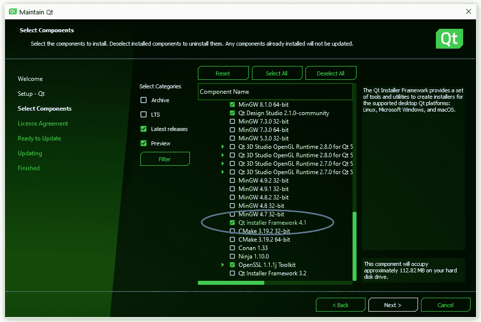

图 10.12 - Qt 维护工具中的 Qt Installer Framework 下载选项

安装应用程序成功后，您将在`QTDIR\Tools\QtInstallerFramework\`下找到安装文件：

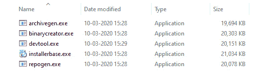

图 10.13 - Windows 上 Qt Installer Framework 目录中的工具

您可以看到在 Qt Installer Framework 目录中创建了五个可执行文件：

+   - `archivegen`工具用于将文件和目录打包成 7zip 存档。

+   - `binarycreator`工具用于创建在线和离线安装程序。

+   - `devtool`用于使用新的安装程序基础更新现有安装程序。

+   - `installerbase`工具是打包所有数据和元信息的核心安装程序。

+   - `repogen`工具用于生成在线存储库。

在本节中，我们将使用`binarycreator`工具为我们的 Qt 应用程序创建安装程序。此工具可用于生成离线和在线安装程序。某些选项具有默认值，因此您可以将它们省略。

要在 Windows 机器上创建离线安装程序，您可以在 Qt 命令提示符中输入以下命令：

```cpp
><location-of-ifw>\binarycreator.exe -t <location-of-ifw>\installerbase.exe -p <package_directory> -c <config_directory>\<config_file> <installer_name>
```

类似地，在 Linux 或 Mac 机器上创建离线安装程序，您可以在 Qt 命令提示符中输入以下命令：

```cpp
><location-of-ifw>/binarycreator -t <location-of-ifw>/installerbase -p <package_directory> -c <config_directory>/<config_file> <installer_name>
```

例如，要创建离线安装程序，请执行以下命令：

```cpp
>binarycreator.exe --offline-only -c installer-config\config.xml -p packages-directory -t installerbase.exe SDKInstaller.exe
```

上述说明将创建一个包含所有依赖项的 SDK 的离线安装程序。

要创建仅在线安装程序，可以使用`--online-only`，它定义了从 Web 服务器上的在线存储库安装的所有软件包。例如，要创建在线安装程序，请执行以下命令：

```cpp
>binarycreator.exe -c installer-config\config.xml -p packages-directory -e org.qt-project.sdk.qt,org.qt-project.qtcreator -t installerbase.exe SDKInstaller.exe
```

您可以在以下页面了解有关`binarycreator`和不同选项的更多信息：[`doc.qt.io/qtinstallerframework/ifw-tools.html#binarycreator`](https://doc.qt.io/qtinstallerframework/ifw-tools.html#binarycreator)。

使用`binarycreator`的最简单方法是将其路径添加到`QIFW` bin 目录中，然后单击**OK**按钮。以下屏幕截图说明了如何执行此操作：

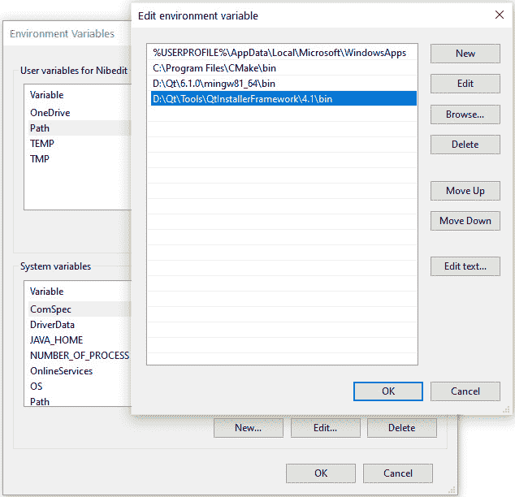

图 10.14–将 QIFW bin 目录添加到系统环境路径

关闭**系统属性**屏幕并启动 Qt 命令提示符。

让我们继续部署我们的示例* HelloWorld *应用程序。我们将为我们的用户创建一个可安装的软件包，这样他们就可以双击并安装它：

1.  创建一个与安装程序设计相匹配并允许将来扩展的目录结构。目录中必须存在`config`和`packages`子目录。QIFW 部署的目录放在哪里并不重要；重要的是它具有这种结构。

1.  创建一个包含构建安装程序二进制文件和在线存储库的说明的配置文件。在 config 目录中创建一个名为`config.xml`的文件，并添加以下内容：

```cpp
<?xml version="1.0" encoding="UTF-8"?>
<Installer>
    <Name>Deployment Example </Name>
    <Version>1.0.0</Version>
    <Title>Deployment Example</Title>
    <Publisher>Packt</Publisher>
    <StartMenuDir>Qt6 HelloWorld</StartMenuDir>
    <TargetDir>@HomeDir@/HelloWorld</TargetDir>
</Installer>
```

`Title`标签提供了安装程序在标题栏中显示的名称。应用程序名称使用`Name`标签添加到页面名称和介绍性文本中。软件版本号由`Version`标签指定。`Publisher`标签定义了软件的发布者。产品在 Windows 开始菜单中的默认程序组名称由`StartMenuDir`标签指定。向用户呈现的默认目标目录是当前用户主目录中的`InstallationDirectory`，由`TargetDir`标签指定。您可以在文档中了解更多标签。

您还可以在`config.xml`中指定应用程序包图标。在 Windows 上，它使用`.ico`进行扩展，并可用作`.exe`文件的应用程序图标。在 Linux 上，您可以使用`.png`扩展名指定图标，并将其用作窗口图标。在 macOS 上，您可以使用`.icns`指定图标，并将其用作新生成的包的图标。

1.  现在在`packages`目录内创建一个子目录。这将是您的`component`名称。您可以使用您的组织名称和应用程序名称或您的组织域作为`component`，例如`CompanyName.ApplicationName`。目录名称充当类似域的标识符，用于标识所有组件。

1.  创建一个包含有关可能安装的组件的详细信息的软件包信息文件。在这个简单的例子中，安装程序只需处理一个组件。让我们在`packages\{component}\meta`目录中创建一个名为`package.xml`的软件包信息文件。

1.  在 meta 目录中添加文件，其中包含有关组件的信息，以提供给安装程序。

让我们创建`package.xml`并将以下内容添加到其中：

```cpp
<?xml version="1.0"?>
<Package>
    <DisplayName>Hello World</DisplayName>
    <Description>This is a simple deployment example.
    </Description>
    <Version>1.0.1</Version>
    <ReleaseDate>2021-05-19</ReleaseDate>
</Package>
```

以下元素的信息将在安装过程中的组件选择页面上显示：

+   `DisplayName`标签指定了组件在组件列表中的名称。

+   `Description`标签指定了在选择组件时显示的文本。

+   `Version`标签使您能够在更新可用时向用户推广更新。

+   `Default`标签指定组件是否默认选择。值`true`将组件设置为已选择。

+   您可以向安装程序添加许可信息。指定了在许可检查页面上显示的许可协议文本的文件名由`License`标签指定。

1.  您可以将所需内容复制到`package`目录下的`data`子目录中。将之前使用`windeployqt`创建的所有文件和目录复制到`data`子目录中。以下屏幕截图显示了复制到`data`子目录中的内容：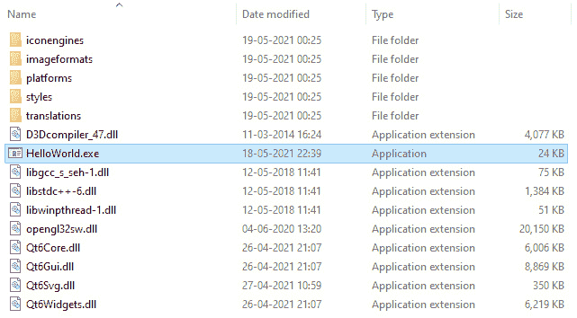

图 10.15 – windeployqt 生成的内容复制到 data 子目录中

1.  下一步是使用`binarycreator`工具创建安装程序。在 Qt 命令提示符中输入以下指令：

```cpp
>binarycreator.exe -c config/config.xml -p packages HelloWorld.exe
```

1.  您可以看到在我们的部署目录中生成了一个安装程序文件：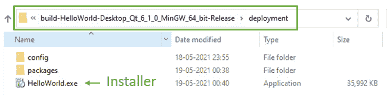

```cpp
$./binarycreator -c config/config.xml -p packages HelloWorld
```

1.  我们得到了期望的结果。现在，让我们运行安装程序，验证部署包是否已正确创建。

1.  双击安装程序文件开始安装。您将看到一个漂亮的安装向导出现在屏幕上：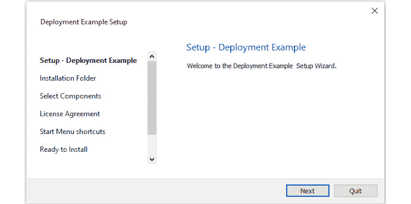

图 10.17 – 安装向导运行部署示例

1.  按照页面提示完成安装。退出安装向导。

1.  现在，从 Windows 的**开始**菜单启动应用程序。您应该很快就会看到**HelloWorld**用户界面出现。

1.  您还可以在**添加/删除程序**中找到已安装的应用程序：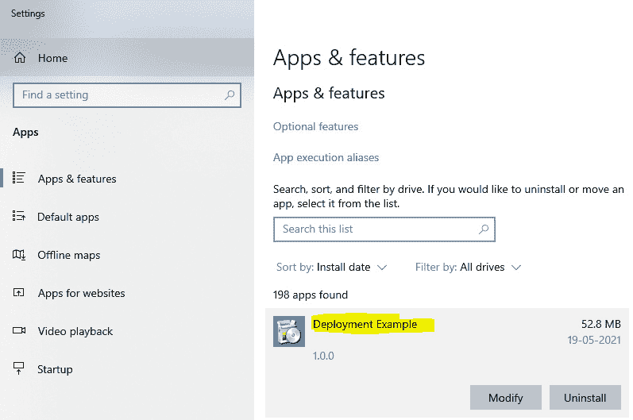

图 10.18 – Windows 程序列表中的部署示例条目

1.  您可以使用与安装包一起安装的维护工具来更新、卸载和添加应用程序组件。您可以在安装目录中找到该工具，如下面的屏幕截图所示：

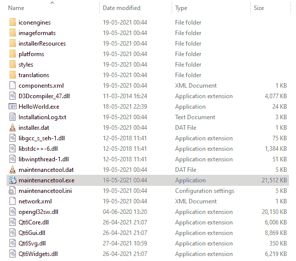

图 10.19 – 安装目录中的维护工具

恭喜！您已为示例应用程序创建了一个安装程序包。现在，您可以将开发的 Qt 应用程序发送给用户和朋友。

您还可以通过自定义设置向导页面进行进一步定制。您可以在以下链接找到可与 QIFW 一起使用的安装程序的完整模板列表：

[`doc.qt.io/qtinstallerframework/ifw-customizing-installers.html`](https://doc.qt.io/qtinstallerframework/ifw-customizing-installers.html)

[`doc.qt.io/qtinstallerframework/qtifwexamples.html`](https://doc.qt.io/qtinstallerframework/qtifwexamples.html)。

您可以在这里探索框架的更多功能：[`doc.qt.io/qtinstallerframework/ifw-overview.html`](https://doc.qt.io/qtinstallerframework/ifw-overview.html)。

在本节中，我们创建了一个可安装的软件包，以供最终用户使用。在下一节中，我们将学习在 Android 平台上部署。

# 在 Android 上部署

除了桌面平台如 Windows、Linux 和 macOS 之外，移动平台同样重要，因为用户数量庞大。许多开发人员希望将他们的应用程序提供给移动平台。让我们看看如何做到这一点。我们将简要讨论 Android 上的部署注意事项。

在*第五章*，*跨平台开发*中，您已经学会了如何创建一个`.apk`文件，这是 Android 平台的部署包。因此，我们不会再讨论这些步骤。在本节中，我们将讨论上传到 Play 商店之前的一些必要更改：

1.  使用 kit 选择屏幕从 Android Kit 创建一个简单的*HelloWorld*应用程序。

1.  将构建模式更改为**发布**模式。

1.  打开项目的构建设置。您会在屏幕上看到几个选项：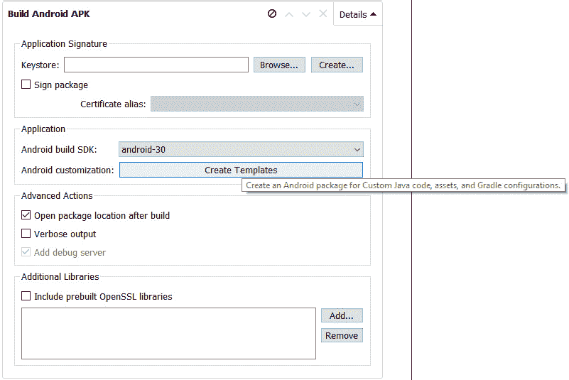

图 10.20 - 屏幕截图显示构建设置中的 Android 清单选项

1.  您可以在**应用程序签名**部分下看到**密钥库**字段。单击**浏览...**按钮选择现有的密钥库文件，或使用**创建...**按钮创建新的密钥库文件。它可以保护密钥材料免受未经授权的使用。这是一个可选步骤，只有在签署部署二进制文件时才需要。

1.  当您单击**创建...**按钮时，您将看到一个对话框，其中有几个字段。填写相关字段，然后单击**保存**按钮。*图 10.21*显示了密钥库创建对话框：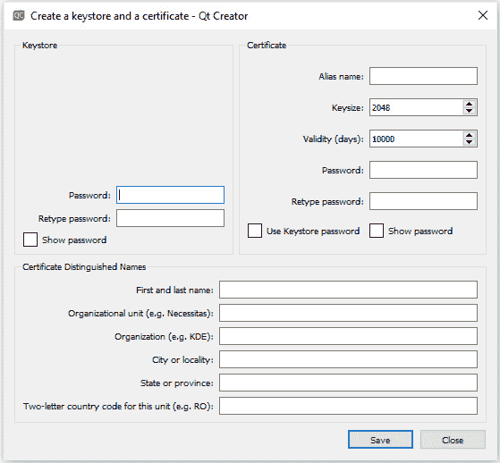

图 10.21 - 屏幕截图显示密钥库创建屏幕

1.  将密钥库文件保存在任何地方，确保文件名以`.keystore`结尾。

下一步是对应用程序包进行签名。这也是一个可选步骤，只有在发布到 Play 商店时才需要。您可以在官方文档中了解有关应用程序签名的更多信息，网址为[`developer.android.com/studio/publish/app-signing`](https://developer.android.com/studio/publish/app-signing)。

1.  您可以选择目标 Android 版本，并通过在 Qt Creator 中创建`AndroidManifect.xml`文件来配置您的 Android 应用程序。要做到这一点，单击**构建 Android APK**屏幕上的**创建** **模板**按钮。您将看到一个对话框出现，如下图所示：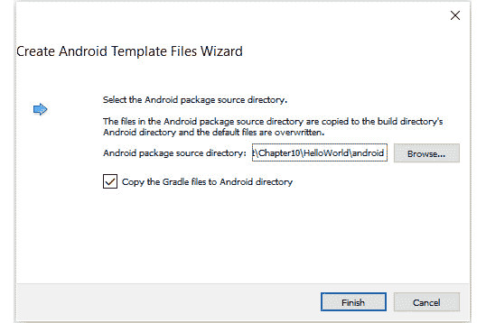

图 10.22 - 屏幕截图显示清单文件创建向导

1.  打开清单文件。您将看到 Android 应用程序的几个选项。

1.  您可以设置包名称、版本代码、SDK 版本、应用程序图标、权限等。如果添加一个独特的图标，那么您的应用程序在设备上不会显示默认的 Android 图标。这将使您的应用程序在屏幕上独特且易于发现。

1.  让我们将*HelloWorld*作为应用程序名称，并将 Qt 图标作为我们的应用程序图标，如下图所示：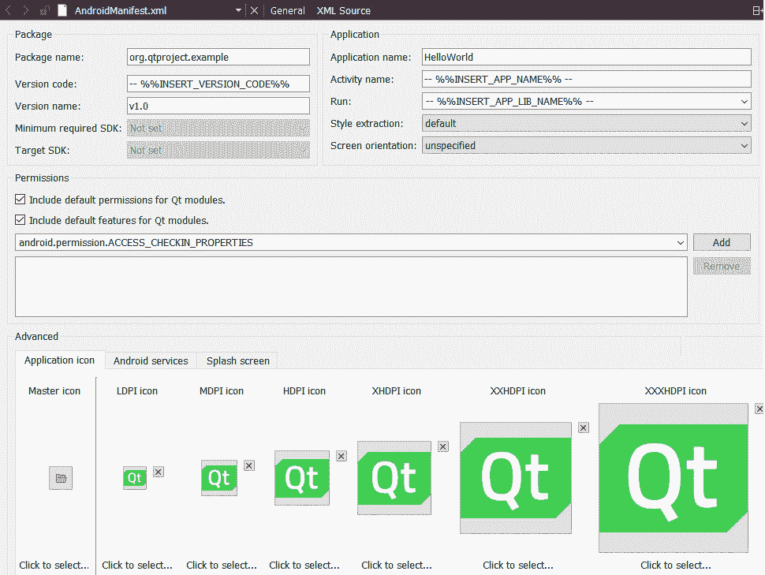

图 10.23 - Android 清单文件显示不同的可用选项

1.  如果使用任何第三方库，如 OpenSSL，则添加额外的库。

1.  单击 Qt Creator 左下角的**运行**按钮，在 Android 设备上构建和运行应用程序。您还可以单击**运行**按钮下方的**部署**按钮来创建部署二进制文件。

1.  您会看到屏幕上出现一个新的对话框。此对话框允许您选择物理 Android 硬件或软件仿真虚拟设备。

1.  连接您的 Android 设备并单击**刷新设备列表**按钮。不要忘记从 Android 设备设置中启用**开发者选项**。当您的 Android 设备提示时，请允许**USB 调试**：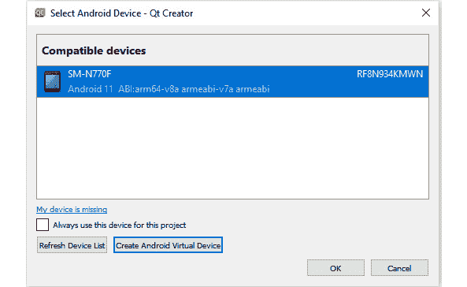

图 10.24 – Android 设备选择对话框

1.  如果您想使用虚拟设备，请单击**创建 Android 虚拟设备**按钮。您将看到以下屏幕出现：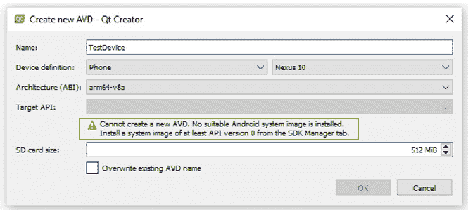

图 10.25 – Android 虚拟设备创建屏幕

1.  如果屏幕警告您无法创建新 AVD，则请从 Android SDK 管理器中更新 Android 平台工具和系统映像。您可以按照以下命令行更新这些内容：

```cpp
>sdkmanager "platform-tools" "platforms;android-30"
>sdkmanager "system-images;android-30;google_apis;x86"
>sdkmanager --licenses
```

1.  然后，运行以下命令来运行`avdmanager`：

```cpp
>avdmanager create avd -n Android30 -k "system-images;android-30;google_apis;x86"
```

1.  最后一步是单击`build`文件夹中的`.apk`扩展名：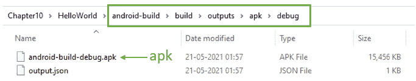

图 10.26 – 生成在 build 目录中的 Android 安装程序文件

1.  在内部，Qt 运行`androiddeployqt`实用程序。有时，该工具可能无法创建包，并显示以下错误：

```cpp
error: aidl.exe …Failed to GetFullPathName
```

在这种情况下，请将您的应用程序放在较短的文件路径中，并确保您的文件路径中没有目录包含空格。然后，构建应用程序。

1.  您可以将`.apk`文件分发给您的朋友或用户。用户必须在其 Android 手机或平板电脑上接受一个选项，即**从未知来源安装**。为了避免这种情况，您应该在 Play 商店上发布您的应用程序。

1.  但是，如果您想在 Google Play 商店上分发您的应用程序，那么您必须注册为 Google Play 开发者并对软件包进行签名。Google 会收取一笔小额费用，以允许开发者发布他们的应用程序。

1.  请注意，Qt 将 Android 应用视为闭源。因此，如果您希望保持 Android 应用代码私有，您将需要商业 Qt 许可证。

恭喜！您已成功生成了一个可部署的 Android 应用程序。与 iOS 不同，Android 是一个开放系统。您可以将`.apk`文件复制或分发到运行相同 Android 版本的其他 Android 设备上并进行安装。

在本节中，我们为我们的 Android 设备创建了一个可安装的软件包。在下一节中，我们将学习更多安装工具。

# 其他安装工具

在本节中，我们将讨论一些其他工具，您可以使用这些工具创建安装程序。请注意，我们不会详细讨论这些工具。我尚未验证这些安装框架是否与 Qt 6 兼容。您可以访问各自工具的网站并从其文档中了解更多信息。除了 Qt 提供的安装框架和工具之外，您还可以在 Windows 机器上使用以下工具：

+   **CQtDeployer**是一个应用程序，用于提取可执行文件的所有依赖库并为您的应用程序创建启动脚本。该工具声称可以更快地部署应用程序并提供灵活的基础设施。它支持 Windows 和 Linux 平台。您可以在以下链接了解更多关于该工具的信息：[`github.com/QuasarApp/CQtDeployer`](https://github.com/QuasarApp/CQtDeployer)。

+   **Nullsoft Scriptable Install System**（**NSIS**）是来自 Nullsoft 的基于脚本的安装工具，该公司也创建了 Winamp。它已成为专有商业工具（如 InstallShield）的流行替代品。NSIS 的当前版本具有现代图形用户界面、LZMA 压缩、多语言支持和简单的插件系统。您可以在[`nsis.sourceforge.io/Main_Page`](https://nsis.sourceforge.io/Main_Page)了解更多有关该工具的信息。

+   **InstallShield**是一款专有软件应用程序，允许您创建安装程序和软件捆绑包。InstallShield 通常用于在 Windows 平台桌面和服务器系统上安装软件，但也可以用于管理各种便携式和移动设备上的软件应用程序和软件包。查看其功能并试用试用版。您可以在以下链接下载试用版并了解更多信息：[`www.revenera.com/install/products/installshield.html`](https://www.revenera.com/install/products/installshield.html)。

+   **Inno Setup**是一个由 Delphi 创建的免费软件脚本驱动安装系统。它于 1997 年首次发布，但仍然凭借其出色的功能集和稳定性与许多商业安装程序竞争。在以下链接了解更多关于此安装程序的信息：[`jrsoftware.org/isinfo.php`](https://jrsoftware.org/isinfo.php)。

您可以选择任何安装框架并部署您的应用程序。最终，它应该能够满足您的安装目标。

在本节中，我们讨论了一些可能有益于您需求的安装工具。现在让我们总结一下本章的要点。

# 概要

我们首先讨论了应用程序部署问题，并学习了静态库和动态库之间的区别。然后我们讨论了 Qt 中的不同部署工具，以及 Windows 部署和安装的特定情况。凭借这些知识，我们在 Windows 上部署了一个示例应用程序，并使用了 Qt 安装程序框架创建了一个安装程序。此外，我们还发现了在 Linux 和 macOS 上部署应用程序，并磨练了在各种平台上部署应用程序的技能。之后，我们解释了在将基于 Qt 的 Android 应用程序发布到 Play 商店之前需要考虑的一些重要问题。

最后，我们看了一些第三方安装程序工具。总之，您已经学会了在各种平台上开发、测试和部署 Qt 应用程序。有了这些知识，您应该能够创建自己的安装包并与世界分享。

在*第十一章*，*国际化*中，我们将学习开发一个支持翻译的 Qt 应用程序。
