# 第十一章：国际化

在之前的章节中，我们学习了如何使用 Qt Widgets 或 Qt Quick 创建 GUI 应用程序。为了使我们的应用程序在全球范围内可用，我们需要为应用程序添加翻译。

使您的应用程序支持翻译的过程被称为国际化。这使得为来自不同文化、地区或语言的观众本地化内容变得容易。使用 Qt 将 Qt Widgets 和 Qt Quick 应用程序翻译成本地语言非常容易。将应用程序适应目标市场的不同语言、地理和技术标准的过程被称为国际化。

您将学习如何制作一个支持多语言的应用程序。在本章中，我们将探讨不同的工具和流程，以制作一个支持翻译的应用程序。在本章中，我们将讨论以下内容：

+   国际化的基础知识

+   为翻译编写源代码

+   加载翻译文件

+   使用 Qt Widgets 进行国际化

+   使用 Qt Quick 进行国际化

+   部署翻译

通过本章的学习，您将能够使用 Qt Widgets 和 Qt Quick 创建一个支持翻译的应用程序。

# 技术要求

本章的技术要求包括在最新的桌面平台上安装 Qt 6.0.0 和 Qt Creator 4.14.0 的最低版本，如 Windows 10、Ubuntu 20.04 或 macOS 10.14。

本章中使用的所有代码都可以从以下 GitHub 链接下载：[`github.com/PacktPublishing/Cross-Platform-Development-with-Qt-6-and-Modern-Cpp/tree/master/Chapter11`](https://github.com/PacktPublishing/Cross-Platform-Development-with-Qt-6-and-Modern-Cpp/tree/master/Chapter11)。

重要提示

本章中使用的屏幕截图是在 Windows 平台上进行的。您将在您的机器上看到基于底层平台的类似屏幕。

# 了解国际化和 Qt Linguist

调整应用程序以适应目标市场的不同语言、地理变化和技术规范的过程被称为国际化和本地化。国际化是指创建一个软件应用程序，可以在不需要进行重大技术更改的情况下被翻译成各种语言和不同地区的过程。国际化通常缩写为 i18n，其中 18 是英语单词中字母 i 和 n 之间的字母数。产品能够被本地化的便利程度受到其国际化的影响。为全球市场创建一个语言和文化聚焦的应用程序是一个更加复杂和耗时的过程。因此，公司在产品开发的开始阶段就专注于为全球市场创建 i18n 感知的应用程序。

对于国际化，您应该设计您的应用程序，以避免以后在本地化或全球部署时出现障碍。这涵盖了允许 Unicode 或在适当的情况下维护对旧字符编码的小心处理，小心处理字符串连接，防止代码依赖于用户界面字符串值等方面。您应该提供对于识别可翻译字符串和以后可能需要的国际化的系统语言的支持。

您的应用程序应该了解本地语言、日期和时间格式、数字系统或文化偏好。修改产品、应用程序或文档的内容以满足特定目标市场的语言、文化和其他偏好，被称为**本地化**。本地化通常用英文**l10n**表示，其中 10 是*l*和*n*之间的字母数。本地化包括合并特定地区的要求，并为特定地区或语言翻译应用程序。可本地化的功能应该与源代码分离，以便根据用户的文化偏好进行调整。

`lupdate`和`lrelease`。这些程序可以与 qmake 项目或直接与文件系统一起使用。

`lupdate`工具会定位项目的源代码、头文件和`.ui`或`.qml`文件中的可翻译字符串。然后它会创建或更新翻译文件（`.ts`文件）。您可以在命令行或`.pro`文件中指定要处理的文件作为参数。`.ts`文件使用**文档类型定义**（**DTD**）格式，描述在以下链接中：

[`doc.qt.io/qt-6/linguist-ts-file-format.html`](https://doc.qt.io/qt-6/linguist-ts-file-format.html)

Qt 为国际化提供了出色的支持。Qt 在所有用户界面元素中内置了对许多语言的支持。但是，在为应用程序编写源代码时，您必须遵循某些实践。这包括标记可翻译的字符串，避免模糊的字符串，使用带编号的参数（`%n`）作为占位符，并加载正确的翻译文件。您可以在 C++和用户界面文件中使用，也可以在两个源文件中使用可翻译的字符串。该工具会定位并将所有源文件中的字符串添加到一个带有相应上下文的单个`.ts`文件中。

带有`.ts`扩展名的翻译文件在应用程序开发过程中使用。这些文件可以编译成紧凑的二进制格式。编译后的翻译文件以`QM`格式编码，并具有`.qm`文件扩展名。在运行应用程序时，Qt 运行时使用`.qm`文件而不是`.ts`文件。您可以使用`lrelease`工具将`.ts`文件转换为`.qm`文件。`.qm`文件是一种轻量级的二进制文件。它允许快速的翻译查找。您可以在命令行或`.pro`项目文件中指定要由`lrelease`处理的`.ts`文件。每次发布应用程序时都会使用此工具，从测试版本到最终生产版本。如果没有`.qm`文件，则应用程序仍将正常工作，并使用源文件中的原始文本。

对于语言的选择，Qt Linguist 和`lrelease`使用某些内部规则。您可以在以下链接中找到有关这些规则的详细信息：

[`doc.qt.io/qt-6/i18n-plural-rules.html`](https://doc.qt.io/qt-6/i18n-plural-rules.html)

让我们来看看 Qt Linguist 用户界面。您可以通过双击**Linguist**可执行文件或从命令提示符中选择它来启动 Qt Linguist。您会在屏幕上看到以下用户界面出现：

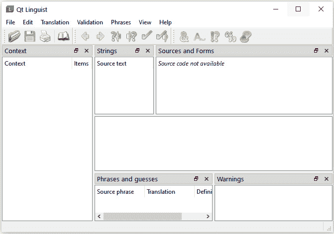

图 11.1 - Qt Linguist 用户界面

在上图中，您可以看到多个部分，并且工具栏中有一些禁用的按钮。您可以从**文件**菜单中打开一个`.ts`文件。我们将在本章的后面部分讨论一个示例时讨论这些部分。

您可以在以下网页了解更多关于 Qt Linguist 和 GUI 界面的信息：

[`doc.qt.io/qt-6/linguist-translators.html`](https://doc.qt.io/qt-6/linguist-translators.html)

在本节中，您熟悉了与国际化相关的术语和 Qt 框架提供的工具。在对基础知识有了很好的理解之后，我们准备在下一节中编写一个支持翻译的应用程序。

# 编写用于翻译的源代码

在本节中，我们将讨论如何标记字符串为可翻译字符串以及如何使用 Qt 提供的工具。无论您的应用程序在何处使用对用户可见的带引号的字符串，都要确保`QCoreApplication::translate()`方法对其进行处理。要做到这一点，只需使用`tr()`方法标记那些用于显示目的的可翻译字符串。此功能用于显示 C++源文件中哪些文本字符串是可翻译的。

例如，如果您想要使用`QLabel`在用户界面上显示文本，那么将文本嵌入`tr()`方法中如下：

`QLabel *label = new QLabel(tr("Welcome"));`

类名是`QObject`及其派生类的翻译上下文。要覆盖上下文，`QObject`派生类必须在其类定义中使用`Q_OBJECT`宏。此宏为派生类设置上下文。

Qt 为国际化提供了几个方便的宏和方法。一些最常用于翻译的宏如下：

+   如果在 C++源文件中有可用的翻译，`tr()`会返回一个翻译后的字符串。

+   如果在 QML 文件中有可用的翻译，`qsTr()`会返回一个翻译后的字符串。

+   `qtTrId()`在 C++文件中查找并返回一个由 ID 标识的翻译后的字符串。

+   `qsTrId()`在 QML 文件中查找并返回一个由 ID 标识的翻译后的字符串。

+   `QT_TR_NOOP()`告诉`lupdate`收集当前上下文中的字符串以便以后翻译。

+   `QT_TRID_NOOP()`标记动态翻译的 ID。

+   `QCoreApplication::translate()`通过查询已安装的翻译文件提供翻译。

+   `qsTranslate()`在 QML 文件中为给定上下文提供一个翻译版本。

+   `QQmlEngine::retranslate()`更新所有标记为翻译的字符串的绑定表达式。

在 C++文件中，可翻译的字符串使用`tr()`标记，在 QML 文件中使用`qsTr()`。我们将在本章中讨论这些宏和方法。

所有可翻译的字符串都由`lupdate`工具获取，并更新到**翻译源**（**TS**）中。TS 文件是一个 XML 文件。通常，TS 文件遵循以下命名约定：

`ApplicationName>_<LanguageCode>_<CountryCode>.ts`

在这个约定中，`LanguageCode`是小写的 ISO 639 语言代码，`CountryCode`是大写的 ISO 3166 两字母国家代码。您可以通过使用特定的国家代码为相同的语言创建不同国家的翻译。在通过 Qt Creator 的新项目向导创建 Qt 应用程序时，您可以创建一个带有语言代码和国家代码的默认翻译文件。

创建`.ts`文件后，您可以运行`lupdate`来更新所有用户可见的字符串的`.ts`文件。您可以从命令行以及从 Qt Creator 和 Visual Studio 插件运行`lupdate`。让我们使用 Qt 的命令提示符来运行`HelloWorld`应用程序的以下命令：

```cpp
>lupdate HelloWorld.pro
```

`lupdate`从不同的源文件（如`.cpp`、`.h`、`.qml`和`.ui`）中获取可翻译的字符串。为了使`lupdate`有效工作，您应该在应用的`.pro`文件中的`TRANSLATIONS`变量下指定翻译文件。看下面的`.pro`文件部分，我们已经添加了六个翻译源文件：

```cpp
TRANSLATIONS = \
        HelloWorld_de_DE.ts \
        HelloWorld_fi_FI \
        HelloWorld_es_ES.ts \
        HelloWorld_zh_CN.ts \
        HelloWorld_zh_TW.ts \
        HelloWorld_ru_RU.ts
```

您还可以使用`*.ts`添加基于通配符的翻译文件选择。

要翻译 Qt Quick 应用程序，使用`qsTr()`方法标记`.qml`文件中的字符串。您可以按以下方式为单个 QML 文件创建翻译文件：

```cpp
>lupdate main.qml -ts HelloWorld_de_DE.ts
```

您可以为不同语言创建多个翻译文件，并将它们放在`.qrc`文件中：

```cpp
RESOURCES += translations.qrc 
```

您可以按以下方式使用`lupdate`处理`.qrc`文件中的所有 QML 文件：

```cpp
>lupdate qml.qrc -ts HelloWorld_de_DE.ts
```

要处理所有 QML 文件而不使用`.qrc`文件，可以在 Qt 的命令提示符中输入以下内容：

```cpp
>lupdate -extensions qml -ts HelloWorld_de_DE.ts
```

您还可以将 C++源文件作为参数与资源文件一起传递。在`.pro`文件中提及翻译文件是可选的。您可以通过在命令行中指定翻译文件来实现：

```cpp
>lupdate qml.qrc messages.cpp -ts HelloWorld_de_DE.ts HelloWorld _es_ES.ts
```

`lrelease` 集成了标记为`finished`的翻译。如果一个字符串缺少翻译并且被标记为`unfinished`，那么将使用原始文本。翻译者或开发人员可以修改 TS 文件内容，并按以下步骤将其标记为`finished`：

1.  启动 Qt Linguist 并打开项目结构中的`.ts`文件，如下所示：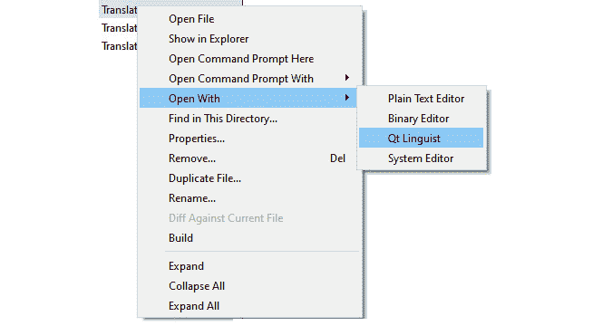

图 11.2 - 在 Qt Creator 中使用 Qt Linguist 选项打开

1.  然后点击**Context**视图中的任何上下文，以查看**Strings**视图中该上下文的可翻译字符串。

1.  在**Source text**视图中，输入当前字符串的翻译。您可以在**Phrases and Guesses**视图中找到现有的翻译和类似短语。

1.  翻译者可以在**Translator comments**字段中输入评论。

1.  要完成翻译，按下*Ctrl* + *Enter*并从工具栏中选择勾号图标。您将看到已翻译字符串的绿色勾号。

1.  最后，保存文件并退出 Qt Linguist 工具。

您可以在不指定`.pro`文件的情况下运行`lrelease`。当您运行`lrelease`来读取`.ts`文件时，它会生成应用程序在运行时使用的`.qm`文件：

```cpp
>lrelease *.ts
```

一旦生成了`.qm`文件，将它们添加到`.qrc`文件中。您的应用程序现在已准备好进行翻译。

您还可以使用基于文本 ID 的翻译机制。在这种方法中，应用程序中的每个可翻译字符串都被分配一个唯一的标识符。这些唯一的文本标识符直接用作源代码中实际字符串的替代。用户界面开发人员需要在这方面付出更多的努力，但是如果您的应用程序包含大量翻译字符串，这种方法更容易维护。

在某些应用程序中，某些类可能不使用`QObject`作为基类，或者在其类定义中使用`Q_OBJECT`宏。但是这些类可能包含一些需要翻译的字符串。为解决此问题，Qt 提供了一些宏来添加翻译支持。

您可以使用以下方式使用`Q_DECLARE_TR_FUNCTIONS(ClassName)`来启用非 Qt 类的翻译：

```cpp
class CustomClass
{
    Q_DECLARE_TR_FUNCTIONS(CustomClass)
public:
    CustomClass();
    ...
}; 
```

此宏在`qcoreapplication.h`中定义。当您添加此宏时，Qt 会向您的类添加以下函数以启用翻译：

```cpp
static inline QString tr(const char *sourceString, const char 
*disambiguation = nullptr, int n = -1)
{ 
    return QCoreApplication::translate(#className, sourceString, 
disambiguation, n); 
}
```

从上述代码中，您可以注意到 Qt 使用类名作为上下文调用`QCoreApplication::translate()`。

您还可以在类或方法之外使用可翻译字符串；`QT_TR_NOOP()`和`QT_TRANSLATE_NOOP()`用于标记这些字符串为可翻译。有不同的宏和函数可用于基于文本 ID 的翻译。您可以使用`qsTrId()`代替`qsTr()`，以及`QT_TRID_NOOP()`代替`QT_TR_NOOP()`。您可以在用户界面中使用相同的文本 ID 作为用户界面字符串，而不是在用户界面中使用普通字符串。

在 Qt Linguist 中，可以同时加载和编辑多个翻译文件。您还可以使用**phrase books**来重用现有的翻译。Phrase books 是包含典型短语及其翻译的标准 XML 文件。这些文件由 Qt Linguist 创建和更新，并可被任意数量的项目和应用程序使用。如果要翻译源字符串，而这些源字符串在短语书中可用，可以使用 Qt Linguist 的批量翻译功能。选择**Batch Translation**来指定批量翻译过程中要使用的短语书及其顺序。只有没有当前翻译的条目应该被考虑，批量翻译的条目应该被标记为**Accepted**。您还可以从**New Phrase Book**选项创建一个新的短语书。

重要提示

`lupdate`默认要求所有源代码以 UTF-8 编码。具有`CODECFORSRC`qmake 变量为`UTF-16`的文件将解析为 UTF-16 而不带 BOM。默认情况下，某些编辑器（如 Visual Studio）使用单独的编码。通过将源代码限制为 ASCII 并为可翻译的字符串使用转义序列，您可以避免编码问题。

在本节中，我们讨论了如何使用`lupdate`和`lrelease`创建和更新翻译文件。接下来，我们将学习如何安装翻译器并在 Qt 应用程序中加载翻译文件。

# 在 Qt 应用程序中加载翻译

在前一节中，我们创建了翻译文件并了解了工具的用途。在 TS 文件中查找翻译时，使用`QTranslator`函数。必须在应用程序的 GUI 对象之前实例化翻译器。

让我们看看如何在以下代码片段中使用`QTranslator`加载这些翻译文件：

```cpp
QTranslator translator;
if(translator.load(QLocale(),QLatin1String("MyApplication") 
            , QLatin1String("_"), QLatin1String(":/i18n"))) 
    {
         application.installTranslator(&translator);
    } 
    else 
    {
        qDebug() << "Failed to load. " 
                 << QLocale::system().name();
    }
```

在上面的代码中，您可以看到我们创建了一个`translator`对象并加载了相应的翻译文件。`QLocale`用于获取底层系统语言。您还可以使用`QLocale`本地化数字、日期、时间和货币字符串。

或者，您可以按以下方式加载翻译文件：

```cpp
QString fileName = ":/i18n/MyApplication_"+QLocale::
                   system().name()
+".qm";
translator.load(fileName); 
```

在这里，我们正在查看系统语言并加载相应的翻译文件。当您希望将系统语言用作应用程序语言时，前面的方法效果很好。但是，有些用户可能希望使用与系统语言不同的区域语言。在这种情况下，我们可以根据用户选择更改语言。我们将在下一节中学习如何做到这一点。

# 动态切换语言

到目前为止，您已经学会了如何为 Qt 应用程序使用系统语言或默认语言。在大多数应用程序中，您只需在`main()`中检测语言并加载适当的`.qm`文件。有时，您的应用程序必须能够在运行时支持用户语言设置的更改。需要在多人轮班使用的应用程序可能需要在无需重新启动的情况下切换语言。

要在基于 Qt Widgets 的应用程序中实现这一点，您可以重写`QWidget::changeEvent()`。然后，您必须检查事件是否属于`QEvent::LanguageChange`类型。您可以相应地重新翻译用户界面。

以下代码片段解释了如何在基于 Qt Widgets 的 GUI 中实现动态翻译：

```cpp
void CustomWidget::changeEvent(QEvent *event)
{
    if (QEvent::LanguageChange == event->type()) 
    {
        ui->retranslateUi(this);
    }
    QWidget::changeEvent(event);
}
```

`QEvent::LocaleChange`可能会导致安装的翻译器列表切换。您可以创建一个带有用户界面的应用程序，让用户选择更改当前应用程序语言的选项。当发生`QEvent::LanguageChange`事件时，`QWidget`子类的默认事件处理程序将调用此方法。如果您使用`QCoreApplication::installTranslator()`函数安装新的翻译，您将收到一个`LanguageChange`事件。此外，通过向其他小部件发送`LanguageChange`事件，GUI 将强制它们更新。任何其他事件都可以传递给基类进行进一步处理。

实现动态翻译，您可以在命令行或 GUI 中提供选项。默认情况下，Qt 将所有可翻译的字符串放在`.ui`文件中的`retranslateUi()`中。每当语言更改时，您都必须调用此函数。您还可以创建并调用自定义方法，根据`QEvent::LanguageChange`事件重新翻译通过 C++代码创建的字符串。

在本节中，我们讨论了如何在应用程序运行时实现动态翻译。在下一节中，我们将使用 Qt Widgets 创建一个支持翻译的应用程序。

# 使用 Qt Widgets 进行国际化

在前面的部分中，我们讨论了如何创建翻译文件以及如何使用`QTranslator`来加载翻译文件。让我们使用 Qt Widgets 创建一个简单的示例并实现我们的学习。

按照以下步骤创建示例应用程序：

1.  使用 Qt Creator 的新项目创建向导创建基于 Qt 小部件的应用程序，并按照之前章节中讨论的屏幕进行操作。

1.  在**翻译文件**屏幕上，选择**德语（德国）**作为语言选项，或者选择任何首选语言。

1.  完成项目创建。您将看到`Simplei18nDemo_de_DE.ts`在项目结构中创建了。

1.  接下来，将`QLabel`添加到.ui 文件中，并添加`欢迎`文本。

1.  接下来，运行`lupdate`。您可以从命令行以及从 Qt Creator 界面运行`lupdate`，如*图 11.3*所示：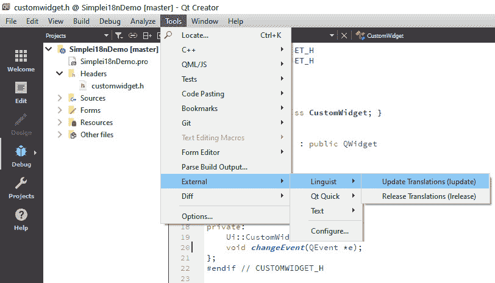

图 11.3 - Qt Creator 中的 Qt 语言家选项

1.  当您运行`lupdate`时，您将在控制台窗口中看到以下输出：

```cpp
C:\Qt6Book\Chapter11\Simplei18nDemo>lupdate Simplei18nDemo.pro
Info: creating stash file C:\Qt6Book\Chapter11\Simplei18nDemo\.qmake.stash
Updating 'Simplei18nDemo_de_DE.ts'...
    Found 2 source text(s) (2 new and 0 already existing)
```

1.  现在，.ts 文件已更新为字符串。使用纯文本编辑器打开`Simplei18nDemo_de_DE.ts`。您应该看到以下内容：

```cpp
<?xml version="1.0" encoding="utf-8"?>
<!DOCTYPE TS>
<TS version="2.1" language="de_DE">
<context>
    <name>CustomWidget</name>
    <message>
        <location filename="customwidget.ui" 
            line="14"/>
        <source>Simple i18n Demo</source>
        <translation type="unfinished"></translation>
    </message>
    <message>
        <location filename="customwidget.ui" 
            line="25"/>
        <source>Welcome</source>
        <translation type="unfinished"></translation>
    </message>
</context>
</TS>
```

您可以看到在.ts 文件中更新了用户界面字符串，并且在文件顶部定义了翻译的语言。通过修改代码中的此字段，您可以创建相应的翻译文件：

`<TS version="2.1" language="de_DE">`

您还会看到翻译状态为`未完成`。

1.  因此，让我们打开 Qt 语言家并完成翻译：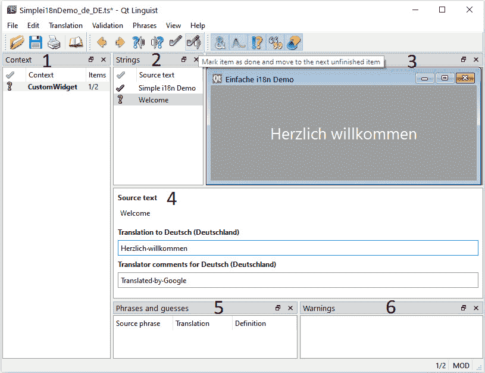

图 11.4 - 显示 Qt 语言家界面的不同部分的示例

1.  您将在用户界面中看到六个不同的部分。在**上下文**视图中选择上下文以加载相应的字符串。

1.  在**源文本**视图中添加翻译。您可以使用谷歌翻译将字符串翻译成所需的语言。在这里，我们使用谷歌翻译将字符串翻译成德语。

注意

有多种翻译被使用。如果字符串的确切含义不符，请忽略。我对德语不熟悉。我用这个来进行演示。因此，我添加了翻译者的评论。

1.  要完成翻译，请按下*Ctrl* + *Enter*，或者单击工具栏上的绿色勾号图标。

1.  下一步是保存翻译。对上下文中列出的所有可翻译字符串重复此操作。

1.  从 Qt 的命令提示符或 IDE 选项中运行`lrelease`。您将看到生成了`.qm`文件：

```cpp
C:\Qt6Book\Chapter11\Simplei18nDemo>lrelease *.ts
Updating 'Simplei18nDemo_de_DE.qm'...
    Generated 2 translation(s) (2 finished and 0 unfinished)
```

1.  让我们将翻译器添加到`main.cpp`并加载翻译文件：

```cpp
#include "customwidget.h"
#include <QApplication>
#include <QTranslator>
#include <QDebug>
int main(int argc, char *argv[])
{
    QApplication app(argc, argv);
    QTranslator translator;
    if(translator.load(":/translations
                       /Simplei18nDemo_de_DE.qm"))
    {
        app.installTranslator(&translator);
        qDebug()<<"Loaded successfully!";
    }
    else
    {
        qWarning()<<"Loading failed.";
    }
    CustomWidget customUI;
    customUI.show();
    return app.exec();
} 
```

1.  最后一步是运行 qmake 并构建应用程序。然后，点击左下角的**运行**按钮。

1.  我们已成功将 GUI 翻译成德语。您将看到以下输出：

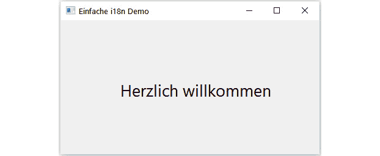

图 11.5 - 使用 Qt 小部件输出翻译示例

恭喜！您学会了如何将应用程序翻译成其他语言。您现在可以将 Qt 应用程序翻译成本地语言，并与朋友和同事分享。

在本节中，我们讨论了如何使用 Qt 小部件创建一个支持翻译的应用程序。在下一节中，我们将为 Qt 小部件应用程序添加动态翻译功能。

## 为 Qt 小部件应用程序添加动态翻译

在上一节中，您学习了如何创建一个基于 Qt 小部件的应用程序，并将语言更改为首选语言。然而，像大多数全球应用程序一样，您可能需要提供更多的翻译，并允许用户随时更改语言。

让我们修改前一节的示例，添加一些额外的实现：

1.  在.ui 文件中添加一个下拉框，并向其中添加三种语言。为了说明目的，我们使用了英语、德语和西班牙语。我们在中心添加了一条消息，并在下拉菜单中添加了语言切换选项：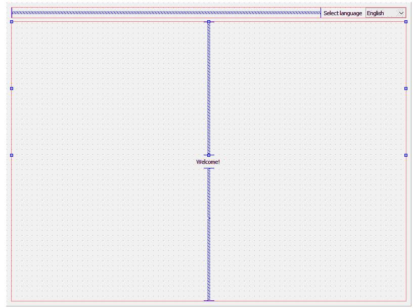

图 11.6 - 在 Qt Designer 中显示示例中使用的布局的表单

1.  将新的翻译文件添加到项目文件中如下：

```cpp
TRANSLATIONS += \
    WidgetTranslationDemo_en_US.ts \
    WidgetTranslationDemo_de_DE.ts \
    WidgetTranslationDemo_es_ES.ts 
```

1.  让我们修改`CustomWidget`类并添加以下方法进行动态翻译：

```cpp
#ifndef CUSTOMWIDGET_H
#define CUSTOMWIDGET_H
#include <QWidget>
#include <QTranslator>
QT_BEGIN_NAMESPACE
namespace Ui { class CustomWidget; }
QT_END_NAMESPACE
class CustomWidget : public QWidget
{
    Q_OBJECT
public:
    CustomWidget(QWidget *parent = nullptr);
    ~CustomWidget();
  public slots:
    void languageChanged(int index);
    void switchTranslator(const QString& filename);
    void changeEvent(QEvent *event);
private:
    Ui::CustomWidget *ui;
    QTranslator m_translator;
};
#endif // CUSTOMWIDGET_H 
```

1.  下一步是连接信号和槽。我们已经在构造函数中创建了连接：

```cpp
CustomWidget::CustomWidget(QWidget *parent)
    : QWidget(parent), ui(new Ui::CustomWidget)
{
    ui->setupUi(this);
    connect(ui->languageSelectorCmbBox, 
            SIGNAL(currentIndexChanged(int)),this, 
            SLOT(languageChanged(int)));
    qApp->installTranslator(&m_translator);
} 
```

1.  让我们将以下代码添加到槽定义中：

```cpp
void CustomWidget::languageChanged(int index)
{
    switch(index)
    {
    case 0: //English
        switchTranslator(":/i18n/
            WidgetTranslationDemo_en_US.qm");
        break;
    case 1: //German
        switchTranslator(":/i18n/
            WidgetTranslationDemo_de_DE.qm");
        break;
    case 2: //Spanish
        switchTranslator(":/i18n/
            WidgetTranslationDemo_es_ES.qm");
        break;
    }
}
```

在这里，我们通过组合框索引更改信号从用户界面接收语言选择。

1.  下一步是安装一个新的翻译器：

```cpp
void CustomWidget::switchTranslator(const QString& filename)
{
    qApp->removeTranslator(&m_translator);
    if(m_translator.load(filename))
    {
        qApp->installTranslator(&m_translator);
    }
} 
```

1.  最后一步是重新实现`changeEvent()`：

```cpp
void CustomWidget::changeEvent(QEvent *event)
{
    if (event->type() == QEvent::LanguageChange)
    {
        ui->retranslateUi(this);
    }
    QWidget::changeEvent(event);
}
```

1.  运行 qmake 并在 IDE 上点击**运行**按钮。

将出现以下屏幕：

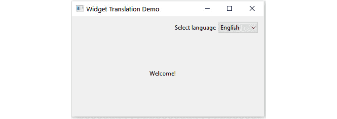

图 11.7 - 当选择英语时显示输出的示例

1.  从语言选择下拉菜单中更改语言。让我们选择**德语**作为新语言。您将看到整个 GUI 都使用德语字符串更改了：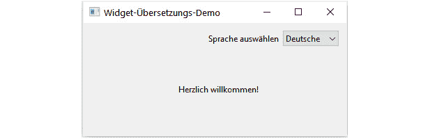

图 11.8 - 当选择德语时显示输出的示例

1.  再次将语言切换为**西班牙语**。您将看到 GUI 文本已更改为西班牙语：

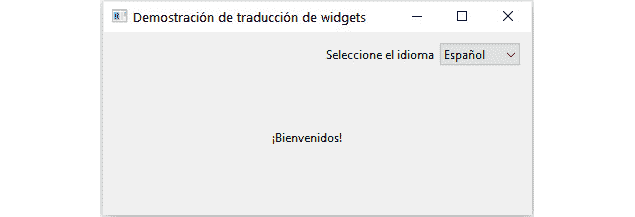

图 11.9 - 当选择西班牙语时显示输出的示例

恭喜！您已成功创建了一个多语言 Qt Widgets 应用程序。

在本节中，您学会了如何在运行时翻译基于 Qt Widgets 的 GUI。在下一节中，我们将使用 Qt Quick 创建一个具有翻译意识的应用程序。

# 使用 Qt Quick 进行国际化

在前一节中，我们讨论了 Qt Widgets 中的国际化。在本节中，我们将讨论国际化 Qt Quick 应用程序的不同方面。Qt Quick 应用程序中的基础本地化方案与 Qt Widgets 应用程序类似。Qt Quick 中也使用了 Qt Linguist 手册中描述的相同一组工具。您可以翻译同时使用 C++和 QML 的应用程序。

在 Qt 项目文件中，`SOURCES`变量用于 C++源文件。如果您在此变量下列出 QML 或 JavaScript 文件，则编译器将尝试将这些文件视为 C++文件来使用。作为一种解决方法，您可以使用`lupdate_only {...}`条件声明，使 QML 文件对`lupdate`工具可见，但对 C++编译器不可见。

考虑以下示例。应用程序的`.pro`文件片段列出了两个 QML 文件：

```cpp
lupdate_only {
SOURCES = main.qml \
          HomeScreen.qml
}
```

您还可以使用通配符匹配来指定 QML 源文件。由于搜索不是递归的，因此您必须列出源代码中可以找到用户界面字符串的每个目录：

```cpp
lupdate_only{
SOURCES = *.qml \
          *.js 
}
```

让我们创建一个简单的翻译示例。我们将创建一个与 Qt Widgets 应用程序中创建的类似屏幕相似的屏幕。按照以下步骤进行：

1.  使用 Qt Creator 的新项目创建向导创建基于 Qt Quick 的应用程序，并按照之前章节中讨论的屏幕进行操作。

1.  在**翻译文件**屏幕上，选择**德语（德国）**作为语言选项或任何首选语言。

1.  完成项目创建。您将看到`QMLTranslationDemo_de_DE.ts`已创建在您的项目结构中。

1.  接下来，在`.qml`文件中添加一个`Text`并添加`Welcome`文本：

```cpp
import QtQuick
import QtQuick.Window
Window {
    width: 512
    height: 512
    visible: true
    title: qsTr("QML Translation Demo")
    Text {
        id: textElement
        anchors.centerIn: parent
        text: qsTr("Welcome")
    }
}
```

1.  将以下代码添加到`main.cpp`中：

```cpp
#include <QGuiApplication>
#include <QQmlApplicationEngine>
#include <QTranslator>
#include <QDebug>
int main(int argc, char *argv[])
{
    QGuiApplication app(argc, argv);
    QTranslator translator;
    if(translator.load(":/translations/
        QMLTranslationDemo_de_DE.qm"))
    {
        app.installTranslator(&translator);
        qDebug()<<"Loaded successfully!";
    }
    else
    {
        qWarning()<<"Loading failed.";
    }
    QQmlApplicationEngine engine;
    const QUrl url(QStringLiteral("qrc:/main.qml"));
    QObject::connect(&engine, 
        &QQmlApplicationEngine::objectCreated,
             &app, url 
            {
              if (!obj && url == objUrl)
                  QCoreApplication::exit(-1);
            }, Qt::QueuedConnection);
    engine.load(url);
    return app.exec();
}
```

1.  这些步骤与 Qt Widgets 示例类似。接下来运行`lupdate`。

1.  按照相同的步骤使用 Qt Linguist 更新`.ts`文件中的翻译。

1.  从 Qt 的命令提示符或 IDE 选项中运行`lrelease`。您将看到生成了`.qm`文件。

1.  将`.qm`文件添加到资源（`.qrc`）文件中并运行 qmake。

1.  最后一步是构建和运行应用程序。在 Qt Creator 中点击**运行**按钮。

1.  您将看到与 Qt Widgets 示例中相同的输出：

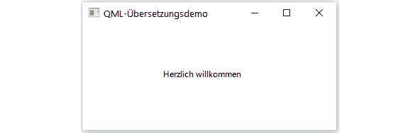

图 11.10 - 使用 Qt Quick 进行翻译示例的输出

在上面的示例中，我们将我们的 Qt Quick 应用程序翻译成了德语。

在本节中，我们讨论了如何使用 Qt Quick 创建一个支持翻译的应用程序。在下一节中，我们将为 Qt Quick 应用程序添加动态翻译功能。

## 在 Qt Quick 应用程序中进行动态翻译

在上一节中，您学习了如何创建一个基于 Qt Quick 的应用程序，以及如何将语言更改为首选语言。就像 Qt Widgets 示例一样，您也可以向 Qt Quick 应用程序添加动态翻译。

让我们通过一些额外的实现修改前面的示例：

1.  创建一个名为`TranslationSupport`的 i18n 支持类，并添加以下行：

```cpp
#ifndef TRANSLATIONSUPPORT_H
#define TRANSLATIONSUPPORT_H
#include <QObject>
#include <QTranslator>
class TranslationSupport : public QObject
{
    Q_OBJECT
public:
    explicit TranslationSupport(QObject *parent = 
                                nullptr);
public slots:
    void languageChanged(int index);
    void switchTranslator(const QString& filename);
signals:
    void updateGUI();
private:
    QTranslator m_translator;
};
#endif // TRANSLATIONSUPPORT_H
```

上述代码是一个辅助类，支持 QML 中的翻译功能。它用于更新翻译文件中的翻译。

1.  接下来，添加以下代码以切换翻译器：

```cpp
void TranslationSupport::switchTranslator(const QString& filename)
{
    qApp->removeTranslator(&m_translator);
    if(m_translator.load(filename))
    {
        qApp->installTranslator(&m_translator);
        emit updateGUI();
    }
}
```

1.  然后，在 QML 的`INVOKABLE`方法定义中添加以下代码：

```cpp
void TranslationSupport::languageChanged(int index)
{
    switch(index)
    {
    case 0: //English
        switchTranslator(":/i18n/
            QMLDynamicTranslation_en_US.qm");
        break;
    case 1: //German
        switchTranslator(":/i18n/
            QMLDynamicTranslation_de_DE.qm");
        break;
    case 2: //Spanish
        switchTranslator(":/i18n/
            QMLDynamicTranslation_es_ES.qm");
        break;
    }
} 
```

1.  在`main.cpp`文件中，添加以下代码。请注意，我们已将`TranslationSupport`实例暴露给 QML 引擎：

```cpp
#include <QGuiApplication>
#include <QQmlApplicationEngine>
#include <QQmlContext>
#include "translationsupport.h"
int main(int argc, char *argv[])
{
    QGuiApplication app(argc, argv);
    TranslationSupport i18nSupport;
    QQmlApplicationEngine engine;
    engine.rootContext()->setContextProperty(
        "i18nSupport", &i18nSupport);
    const QUrl url(QStringLiteral("qrc:/main.qml"));
    QObject::connect(&i18nSupport, 
        &TranslationSupport::updateGUI, &engine, 
        &QQmlApplicationEngine::retranslate);
    engine.load(url);
    return app.exec();
}
```

1.  然后使用`QQmlApplicationEngine::retranslate()`方法添加`updateGUI()`信号。

1.  让我们看一下`main.qml`文件。我们在`.qml`文件中添加了一个下拉框，并添加了三种语言。为了说明目的，我们使用了英语、德语和西班牙语：

```cpp
Text {
    id: textElement
    anchors.centerIn: parent
    text: qsTr("Welcome!")
} 
Row {
    anchors {
        top: parent.top;   topMargin: 10 ;
        right: parent.right; rightMargin: 10;
    }
    spacing: 10
    Text{
        text: qsTr("Select language")
        verticalAlignment: Text.AlignVCenter
        height: 20
    } 
    ComboBox {
        height: 20
        model: ListModel {
            id: model
            ListElement { text: qsTr("English")}
            ListElement { text: qsTr("German")}
            ListElement { text: qsTr("Spanish")}
        }
        onCurrentIndexChanged: {
            i18nSupport.languageChanged(currentIndex)
        }
    }
}
```

1.  运行`lupdate`并继续翻译过程。

1.  按照相同步骤使用 Qt Linguist 更新`.ts`文件中的翻译。

1.  从 Qt 的命令提示符或 IDE 选项中运行`lrelease`。您将看到生成了`.qm`文件。

1.  将`.qm`文件添加到资源（`.qrc`）文件中并运行 qmake。

1.  最后一步是构建和运行应用程序。在 Qt Creator 中点击**运行**按钮。

将出现以下屏幕：

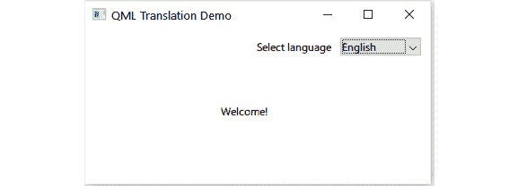

图 11.11 - 当选择英语语言时，Qt Quick 示例显示的输出

1.  从语言选择下拉框中更改语言。让我们选择**德语**作为新语言。您将看到整个 GUI 都改为了德语字符串：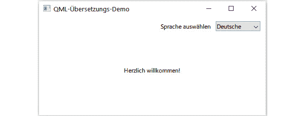

图 11.12 - 当选择德语语言时，Qt Quick 示例显示的输出

1.  再次将语言切换为**西班牙语**。您将看到 GUI 文本已更改为西班牙语：

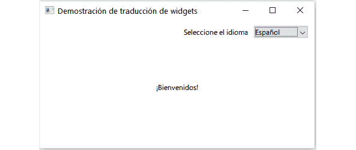

图 11.13 - 当选择西班牙语言时，Qt Quick 示例显示的输出

恭喜！您已成功创建了一个多语言 Qt Quick 应用程序。

在本节中，您学习了如何在运行时翻译基于 Qt Quick 的 GUI。在下一节中，我们将讨论如何部署翻译文件。

# 部署翻译

在之前的章节中，我们学习了如何使用 Qt Widgets 和 QML 创建支持翻译的应用程序。您不必将`.ts`文件与应用程序一起发布。要部署翻译，您的发布团队必须使用更新的`.qm`文件并将其与应用程序包一起发布。应用程序所需的`.qm`文件应放在`QTranslator`可以找到它们的位置。通常，这是通过将`qm`文件嵌入到资源（`.qrc`）文件中或指定包含`.qm`文件的路径相对于`QCoreApplication::applicationDirPath()`来完成的。`rcc`工具用于在构建过程中将翻译文件嵌入到 Qt 应用程序中。它通过生成包含指定数据的相应 C++文件来工作。

您可以通过将脚本添加到您的`.pro`文件中来自动生成`.qm`文件。您可以按照以下步骤进行操作：

1.  首先，在 Qt 项目（`.pro`）文件中使用语言代码来声明`LANGUAGES`变量下的语言。

1.  将`lrelease`和`embed_translations`添加到`CONFIG`变量中。

1.  然后添加一个函数来生成所需语言的`.ts`文件。

1.  最后，定义`TRANSLATIONS_FILES`变量，使用`lrelease`创建`.qm`文件，并将其嵌入到应用程序资源中。

前面的步骤将自动运行`lrelease`并生成`.qm`文件。`lrelease`工具处理`TRANSLATIONS`和`EXTRA_TRANSLATIONS`下列出的翻译文件。与`TRANSLATIONS`变量不同，列在`EXTRA_TRANSLATIONS`下的文件只由`lrelease`工具处理，而不是由`lupdate`处理。您需要将`.qm`文件嵌入到资源中或者将`.qm`文件与部署包一起发布。

您可以在这里了解更多关于自动化生成 QM 文件的信息：[`wiki.qt.io/Automating_generation_of_qm_files.`](https://wiki.qt.io/Automating_generation_of_qm_files)

在本节中，您学会了如何部署您的翻译文件。在下一节中，我们将总结本章的要点。

# 摘要

在本章中，我们深入了解了 Qt 中国际化和本地化的核心概念。我们讨论了 Qt 提供的不同国际化工具。我们学会了如何使用 Qt Linguist。我们还学习了如何将 Qt Widgets 应用程序翻译成不同的语言。然后，我们学会了如何动态翻译。

在本章的后半部分，我们讨论了如何翻译 Qt Quick 应用程序。之后，我们学会了如何在 Qt Quick 应用程序中动态切换语言。现在，您可以创建一个具有多种语言的应用程序，并与您在不同地理区域的客户或朋友分享。

在*第十二章*，*性能考虑*中，我们将学习有关在 Qt 应用程序中优化性能的工具和技巧。
