# 第十二章：性能考虑

在本章中，我们将概述性能优化技术以及如何在基于 Qt 的应用程序开发环境中应用它们。性能是应用程序成功的非常重要的因素。性能失败可能导致业务失败、客户关系恶化、竞争力降低和收入损失。延迟性能优化可能会在声誉和组织形象方面产生巨大的成本。因此，进行性能调优非常重要。

您还将了解性能瓶颈以及如何克服它们。我们将讨论不同的分析工具来诊断性能问题，特别关注一些流行的工具。然后，您将学习如何对性能进行分析和基准测试。本章还介绍了 Qt 建模语言（QML）分析器和火焰图，以找出 Qt Quick 应用程序中的潜在瓶颈。您还将了解在开发 Qt 应用程序时应遵循的一些最佳实践。

我们将讨论以下主题：

+   了解性能优化

+   优化 C++代码

+   使用并发、并行和多线程

+   使用 QML 分析器和火焰图对 Qt Quick 应用程序进行分析

+   其他 Qt Creator 分析工具

+   优化图形性能

+   创建基准测试

+   不同的分析工具和优化策略

+   Qt 小部件的性能考虑

+   学习 QML 编码的最佳实践

在本章结束时，您将学会为基于 C++和 QML 的应用程序编写高性能优化代码。

# 技术要求

本章的技术要求包括在最新的桌面平台上安装 Qt 6.0.0 和 Qt Creator 4.14.0 的最低版本，如 Windows 10、Ubuntu 20.04 或 macOS 10.14。

本章中使用的所有代码都可以从以下 GitHub 链接下载：[`github.com/PacktPublishing/Cross-Platform-Development-with-Qt-6-and-Modern-Cpp/tree/master/Chapter12/QMLPerformanceDemo`](https://github.com/PacktPublishing/Cross-Platform-Development-with-Qt-6-and-Modern-Cpp/tree/master/Chapter12/QMLPerformanceDemo)。

重要提示

本章中使用的屏幕截图是在 Windows 平台上拍摄的。您将在您的机器上看到基于底层平台的类似屏幕。

# 了解性能优化

性能优化是为了提高应用程序的性能。您可能想知道为什么这是必要的。应用程序需要性能优化有很多原因。当用户或质量保证团队报告性能问题时，开发人员可能会发现影响整体应用程序性能的问题。这可能是由于底层硬件限制、代码实现不佳或可扩展性挑战引起的。

优化是应用程序开发过程的一部分。这可能涉及对性能进行优化或对内存使用进行优化。优化旨在优化应用程序的行为，以满足产品对速度、内存占用、功耗等方面的要求。因此，优化几乎和在生产阶段编写功能一样重要。客户可能会报告性能问题，如故障、响应缓慢和功能缺失。更快的应用程序执行效率更高，同时消耗更少的资源，并且可以在相同的时间内处理更多的任务，而更慢的应用程序则不能。在当今竞争激烈的世界中，更快的软件意味着与竞争对手的竞争优势。性能在嵌入式和移动平台上非常重要，速度、内存和功耗等因素非常普遍。

在瀑布流程中，性能改进是在应用程序开发之后，在集成和验证阶段进行的。然而，在今天的敏捷世界中，代码性能应该在每两个迭代中进行评估，以提高整体应用程序性能。性能优化是一个持续的过程，而缺陷修复是一次性的任务。这是一个迭代的过程，在这个过程中，您总会发现有些地方可以改进，您的应用程序总会有改进的空间。根据约束理论，一个复杂应用程序通常会有一个限制应用程序达到最佳性能的问题。这些约束被称为瓶颈。一个应用程序的最佳性能受到瓶颈的限制，因此您应该在应用程序开发生命周期中考虑性能优化。如果忽视了这一点，您的新产品可能会变成一个完全的灾难，甚至可能会毁掉您的声誉。

在进行优化之前，您应该先确定一个目标。然后，您应该确定瓶颈或约束条件。之后，考虑如何解决约束条件。您可以改进您的代码并重新评估性能。如果达不到设定的目标，您需要重复这个过程。然而，请记住，过早的优化可能是万恶之源。在验证产品并实施早期用户反馈之前，您应该先实现主要功能。记住先让应用程序运行起来，然后确保其功能正确，最后再提高其速度。

当您设定性能目标时，您需要选择正确的技术。可能会有多个目标，比如更快的启动时间、更小的应用程序二进制文件，或者更少的随机访问内存（RAM）使用。一个目标可能会影响另一个目标，因此您必须根据预期的标准找到平衡点，例如，为了性能而优化代码可能会影响内存优化。提高整体性能的方法可能有很多，但您也应该遵循组织的编码准则和最佳实践。如果您正在为一个开源项目做贡献或者是自由应用程序开发人员，您应该遵循标准的编码实践以保持整体代码质量。

我们将遵循的一些重要技巧来提高性能如下：

+   使用更好的算法和库

+   使用最佳数据结构

+   负责分配内存和优化内存

+   避免不必要的复制

+   消除重复计算

+   增加并发性

+   使用编译器二进制优化标志

在接下来的章节中，我们将讨论如何改进我们的 C++代码以提高整体应用程序性能的机会。

# 优化 C++代码

在大多数 Qt 应用程序中，很大一部分编码是用 C++完成的，因此您应该了解 C++优化技巧。本节是关于在编写 C++代码时实施一些最佳实践。如果不对 C++实现进行优化，它们会运行缓慢并消耗大量资源。更好地优化您的 C++代码还可以更好地控制内存管理和复制。有许多机会可以改进算法，从小的逻辑块到使用标准模板库（STLs），再到编写更好的数据结构和库。关于这个主题有几本优秀的书籍和文章。我们将讨论一些重要的点，以使代码运行更快并使用更少的资源。

以下是一些重要的 C++优化技巧：

+   专注于算法，而不是微优化

+   不要不必要地构造对象和复制

+   使用 C++11 特性，如移动构造函数、lambda 和 constexpr 函数

+   选择静态链接和位置相关代码

+   优先选择 64 位代码和 32 位数据

+   最小化数组写入，优先使用数组索引而不是指针

+   优先选择正常的内存访问模式

+   减少控制流

+   避免数据依赖

+   使用最佳算法和数据结构

+   使用缓存

+   使用预计算表来避免重复计算

+   首选缓冲和批处理

由于本书需要对 C++有先前的了解，我们期望您已经了解这些最佳实践。作为一名 C++程序员，始终要了解最新的 C++标准，如 C++17 和 C++20。这将帮助您编写具有出色功能的高效代码。我们不会在本节详细讨论这些内容，而是留给您自行探索。

您可以在以下链接了解有关 C++核心指南的更多信息：[`isocpp.github.io/CppCoreGuidelines/CppCoreGuidelines`](https://isocpp.github.io/CppCoreGuidelines/CppCoreGuidelines)。

您可以在以下链接了解有关优化 C++代码的更多信息：[`www.agner.org/optimize/`](https://www.agner.org/optimize/)。

浏览列出的方法来改进您的 C++代码。接下来，我们将在下一节讨论如何通过并发和多线程来提高应用程序性能。

# 使用并发、并行和多线程

既然您已经是一名 C++开发人员，您可能已经了解这些术语，这些术语可以互换使用。然而，这些术语之间存在差异。让我们在这里重新审视这些术语：

+   **并发性**是同时执行多个程序（并发）。

+   **并行性**是在多核处理器中并行运行程序的一部分，利用多个核心。

+   **多线程**是**中央处理单元**（**CPU**）同时运行同一程序的多个线程的能力，由操作系统支持。

例如，您可以启动多个**便携式文档格式**（**PDF**）阅读器和 Qt Creator 的实例。Qt Creator 可以自行运行多个工具。您的系统任务管理器可以显示所有同时运行的进程。这被称为并发性。它也通常被称为多任务处理。

但是，如果您使用并行计算技术来处理数据，那么这被称为并行性。具有巨大数据处理需求的复杂应用程序使用这种技术。请注意，并行计算在单核处理器上是一种幻觉。

线程是进程的最小可执行单元。一个进程中可以有多个线程，但只有一个主线程。多线程是在同一进程内的并发。传统的单线程应用程序只使用一个核心。具有多个线程的程序可以分布到多个核心，从而实现真正的并发。因此，多线程应用程序在多核硬件上提供更好的性能。

让我们讨论 Qt 中提供并发和多线程的一些重要类，如下所示：

+   `QThread`用于在程序内管理一个线程控制。

+   `QThreadPool`用于管理和回收单个`QThread`对象，以帮助减少多线程应用程序中的线程创建成本。

+   `QRunnable`是一个表示需要执行的任务或代码片段的接口类。

+   `QtConcurrent`提供高级**应用程序编程接口**（**API**），帮助编写多线程程序而不使用低级线程原语。

+   `QFuture`允许线程在稍后的时间点同步多个计算结果。

+   `QFutureWatcher`使用信号和槽提供有关`QFuture`对象的信息和通知。

+   `QFutureSynchronizer`是一个方便的类，简化了一个或多个`QFuture`对象的同步。

线程主要用于两种情况，如下所示：

+   利用多核 CPU 加速处理

+   将长时间运行的处理或阻塞调用卸载到其他线程，以保持**图形用户界面**（**GUI**）线程或其他时间关键的线程的响应

让我们简要讨论一下最基本的并发概念，即`QThread`类在 Qt 中提供了一个线程抽象，并提供了方便的方法。您可以通过对`QThread`类进行子类化来启动一个新的自定义线程，如下所示：

```cpp
class CustomThread : public QThread
{
    public:
    void run(){…}
};
```

您可以创建此类的新实例并调用其`start()`函数。这将创建一个新线程，然后在这个新线程的上下文中调用`run()`函数。另一种方法是直接创建一个`QThread`对象并调用`start()`函数，这将启动一个事件循环。与传统的 C++线程类相比，`QThread`支持线程中断，而 C++11 及以后的版本不支持。您可能会想知道为什么我们不能只使用 C++标准线程类。这是因为您可以以多线程安全的方式使用`QThread`的信号和槽机制。

您还可以在 QML 中使用多线程机制，使用`WorkerScript`。 JavaScript 代码可以使用`WorkerScript` QML 类型与 GUI 线程并行执行。要在 Qt Quick 应用程序中启用线程的使用，可以按照以下方式导入模块：

```cpp
import QtQml.WorkerScript
```

每个`WorkerScript`对象可以附加一个 JavaScript。当调用`WorkerScript.sendMessage()`时，脚本将在不同的线程和 QML 上下文中运行。脚本完成后，它可以向 GUI 线程发送响应，调用`WorkerScript.onMessage()`信号处理程序。您可以使用信号和信号处理程序在线程之间交换数据。让我们看一个简单的`WorkerScript`用法，如下所示：

```cpp
WorkerScript {
   id: messagingThread
   source: "messaging.mjs"
   onMessage: (messageObject)=> textElement.text = 
               messageObject.reply
}
```

上述代码片段使用了一个名为`messaging.mjs`的 JavaScript 文件，在新线程中执行操作。让我们看一下示例脚本，如下所示：

```cpp
WorkerScript.onMessage = function(message) {
    //Perform complex operations here
    WorkerScript.sendMessage({ 'reply': 'Message '+
                              message})
}
```

您可以从按钮点击或基于某些用户操作发送消息。它将调用`sendMessage(jsobject message)`方法，其中将进行复杂的消息传递操作。您可以在以下链接了解有关不同线程机制和用例的更多信息：[`doc.qt.io/qt-6/threads-technologies.html`](https://doc.qt.io/qt-6/threads-technologies.html)。

由于本书是为有经验的 C++开发人员编写的，因此预期您将熟悉诸如`mutex`、`semaphore`、`read-write lock`等术语。Qt 提供了方便的类来使用这些机制来实现多线程应用程序。我们不会深入研究这些 Qt 类及其示例。您可以在以下链接了解有关`QMutex`、`QSemaPhore`、`QReadWriteLock`和`QWaitCondition`的使用：[`doc.qt.io/qt-6/threads-synchronizing.html`](https://doc.qt.io/qt-6/threads-synchronizing.html)。

在本节中，我们学习了如何使用并发机制来提高整体应用程序性能。不要为简单的任务不必要地实现它，因为这可能会导致性能下降。在下一节中，我们将讨论使用 QML Profiler 工具来对 Qt Quick 应用程序进行性能分析。

# 使用 QML Profiler 和 Flame Graph 对 Qt Quick 应用程序进行性能分析

Qt 6 中的 QML 利用**图形处理单元**（**GPU**）并使用硬件加速进行渲染。这个特性使得 QML 在性能方面优于 Qt Widgets。然而，您的 QML 代码中可能存在性能瓶颈。在本节中，我们将专注于使用内置工具来找到这些瓶颈。Qt Creator 提供了与多个工具的无缝集成。最重要的工具是**QML Profiler**。它由 Qt 提供，并在所有 Qt 支持的平台上工作。除了 QML Profiler，Qt Creator 还提供第三方工具，如**Valgrind**、**Heob**和**Performance Analyzer**。您可以在**关于插件...**（位于**帮助**菜单下）中启用新插件或删除一些插件。

让我们讨论一下 QML Profiler，这是您在大部分时间内用来找到 QML 代码中瓶颈的工具。QML Profiler 的目标是通过提供诸如代码块执行某个操作所需的时间等细节来帮助您识别瓶颈，之后您可以决定是否重新实现代码，使用合适的 GUI 元素或更好的数据结构或算法。

按照以下步骤开始分析和优化您的 Qt Quick 应用程序：

1.  打开现有的 Qt Quick 项目或使用 Qt Creator 的**新建项目**创建向导创建新的 Qt Quick 应用程序。

1.  项目创建后，向其中添加一些代码。然后，在**分析**菜单下选择**QML Profiler**运行 QML Profiler 工具。根据安装的插件，**分析**上下文菜单在不同平台上可能有所不同。以下截图显示了 Windows 平台上的**QML Profiler**选项。在 Linux 上，您可能会看到一些其他选项，例如**Valgrind Memory Analyzer**，**Valgrind Memory Analyzer with GDB**和**Valgrind Function Profiler**：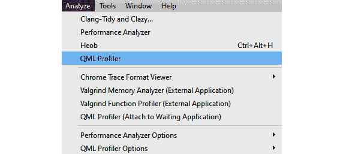

图 12.1 - Qt Creator 集成开发环境（IDE）中的 QML Profiler 选项

1.  当您点击**QML Profiler**选项时，您的 Qt Quick 应用程序将通过 QML Profiler 运行。您会看到**QML Profiler**窗口出现在代码编辑器下方。您可能还会看到以下消息：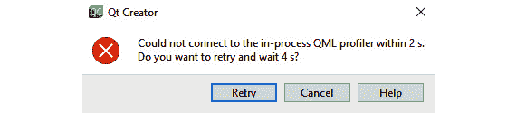

图 12.2 - QML Profiler 重试消息

1.  如果您看到此弹出窗口，只需点击**重试**。您会注意到分析将开始，并且您还会注意到输出屏幕。在示例应用程序中，我们在鼠标点击时创建新的矩形，如下截图所示：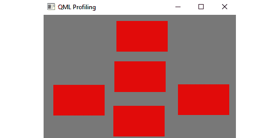

图 12.3 - 示例 Qt Quick 应用程序的输出

1.  在**用户界面**（**UI**）上执行一些用户交互 - 例如点击按钮执行某个操作。然后，点击分析器窗口标题栏上的**停止**按钮。您还会在**停止**按钮的两侧看到另外两个按钮。如果将鼠标悬停在它们上面，您会看到它们的功能，例如**开始 QML Profiler 分析**和**禁用分析**。

以下截图显示了**QML Profiler**窗口的概述：

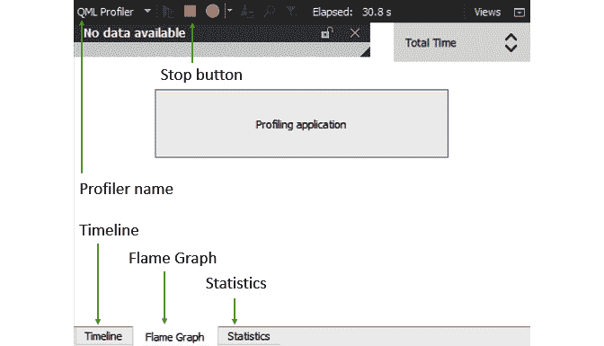

图 12.4 - 显示停止按钮和选项卡视图的 QML Profiler 窗口

1.  一旦您停止分析器，您会看到**QML Profiler**窗口已更新并显示了一些视图。您会注意到分析器窗口下有三个选项卡 - 分别是**时间轴**，**火焰图**和**统计**。

1.  让我们看看 QML Profiler 的第一个选项卡 - 点击**时间轴**选项卡。以下截图显示了输出的示例视图：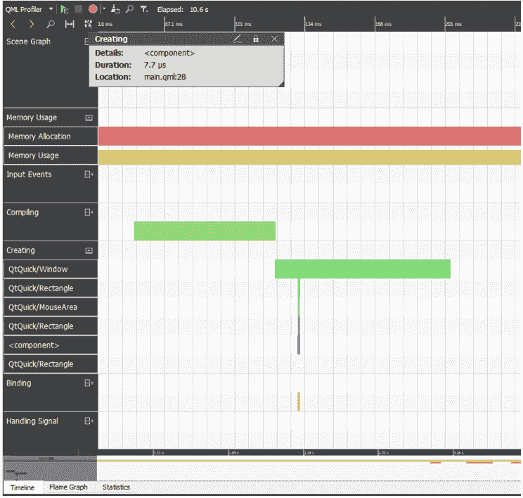

图 12.5 - 显示时间轴详细信息的 QML Profiler

您会注意到时间轴显示下有六个不同的部分：**场景图**，**内存使用**，**编译**，**创建**，**绑定**和**JavaScript**。这些部分给我们提供了应用程序处理的不同阶段的概述，例如编译，组件创建和逻辑执行。

1.  您可以在时间轴上找到彩色的条形图。您可以使用鼠标滚轮放大和缩小特定的时间轴部分。您还可以通过按住时间轴底部区域的鼠标左键并向任何方向移动来移动时间轴，以定位感兴趣的区域。

**时间轴**选项卡的不同部分如下截图所示：

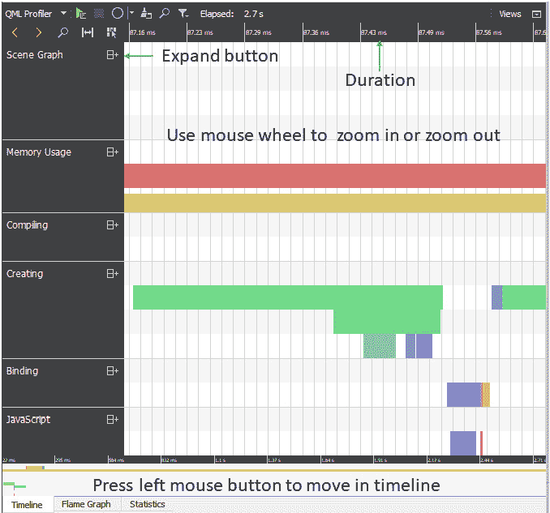

图 12.6 - 显示不同部分的时间轴选项卡

1.  您可以点击**展开**按钮以查看每个部分下的更多细节，如下图所示：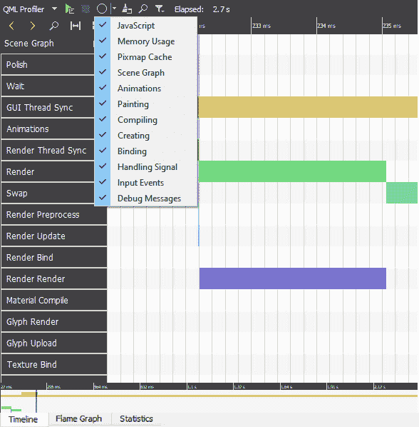

图 12.7 - 时间轴选项卡显示场景图下不同子部分和分析选项

1.  如果您点击`QtQuick/Rectangle`类型下的柱状图之一，将会显示创建对象所花费的总时间以及代码位置的弹出窗口，覆盖**QML Profiler**窗口。您可以使用左上角的黄色箭头跳转到上一个或下一个事件。本节在下图中有所说明：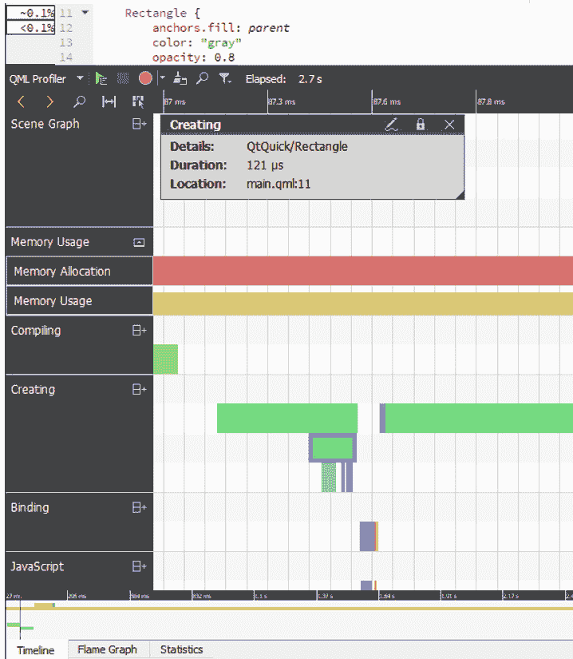

图 12.8 - 创建部分下对象的详细信息

1.  您可以在**QML Profiler**窗口底部在不同选项卡之间切换。一旦您探索了**时间轴**选项卡，让我们打开**火焰图**选项卡。在此选项卡下，您将以百分比形式找到应用程序的**总时间**、**内存**和**分配**的可视化。您可以通过单击**QML Profiler**窗口右上角的下拉菜单在这些视图之间切换，如下图所示：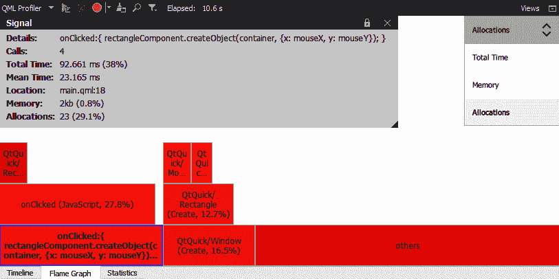

图 12.9 - 火焰图显示分配视图

1.  **火焰图**视图提供了更紧凑的统计摘要。水平条形图显示了针对某个函数收集的样本的一个方面，与所有样本组合的相同方面进行比较。嵌套表示呈现了一个调用树，例如显示了哪些函数调用了其他函数。

1.  如下截图所示，您还可以在代码编辑器的左侧看到显示的百分比值。根据哪个组件消耗了更多时间，您可以调整您的代码：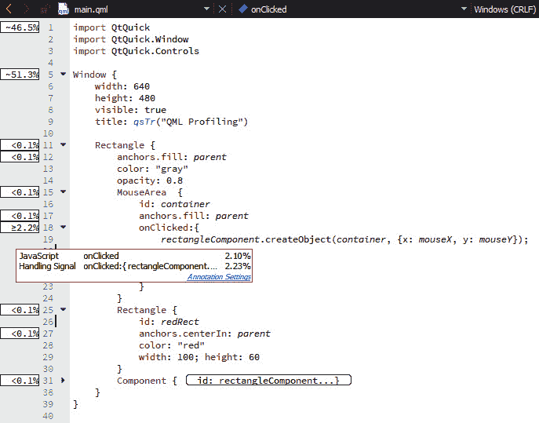

图 12.10 - QML Profiler 显示代码特定部分所花费的时间百分比

1.  由于数据收集需要时间，您可能会注意到数据显示之前有一点延迟。当您点击**启用分析**按钮时，数据将传输到 QML Profiler，因此不要立即终止应用程序。

1.  要禁用应用程序启动时自动开始数据收集，请选择**禁用分析**按钮。切换按钮时，数据收集将重新开始。

1.  让我们转到下一个选项卡：**QML Profiler**窗口。该选项卡以表格结构显示了有关进程的统计详细信息。下图说明了我们示例代码的代码执行统计信息：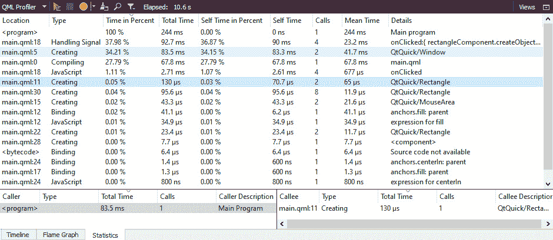

图 12.11 - QML Profiler 显示代码执行的统计信息

1.  您还可以通过**分析**菜单下的**QML Profiler（附加到等待应用程序）**将 QML Profiler 附加到外部启动的应用程序。选择该选项后，您将看到以下对话框：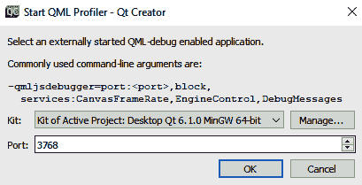

图 12.12 - QML Profiler 显示远程执行选项

1.  要保存收集的所有数据，请右键单击任何 QML Profiler 视图，并在上下文菜单中选择**保存 QML 跟踪**。您可以选择**加载 QML 跟踪**以查看保存的数据。您还可以将保存的数据发送给其他人进行审查，或加载他们保存的数据。

在本节中，我们讨论了 QML Profiler 中提供的不同选项。使用这个工具，您可以轻松找到导致性能问题的代码。更多详细信息请访问此链接：[`doc.qt.io/qtcreator/creator-qml-performance-monitor.html`](https://doc.qt.io/qtcreator/creator-qml-performance-monitor.html)。

在下一节中，我们将进一步讨论如何使用其他分析工具来优化您的 Qt 代码。

# 其他 Qt Creator 分析工具

在前面的部分，我们讨论了 QML Profiler，但您可能需要分析您的 C++和 Qt Widgets 代码。Qt Creator 提供了与一些著名分析工具的集成，以帮助您分析 Qt 应用程序。Qt Creator 附带的一些工具列在这里：

+   **Heob**

+   **性能分析器**

+   **Valgrind**

+   **Clang 工具：Clang-Tidy 和 Clazy**

+   **Cppcheck**

+   **Chrome 跟踪格式**（**CTF**）可视化器

在深入研究这些工具并熟悉它们的文档之前，让我们简要讨论一下。

要使用 Heob，您首先需要下载并安装它。使用 Heob 可以轻松检测缓冲区溢出和内存泄漏。它通过覆盖调用者进程的堆函数来工作。当发生缓冲区溢出时，会引发访问冲突，并记录违规代码和缓冲区分配的堆栈跟踪。当应用程序正常退出时，您将找到堆栈跟踪。它不需要重新编译或重新链接目标应用程序。

您可以在官方文档链接上阅读有关其用法的更多信息：[`doc.qt.io/qtcreator/creator-heob.html`](https://doc.qt.io/qtcreator/creator-heob.html)。

您可以从[SourceForge.net](http://SourceForge.net)下载二进制文件，也可以从源代码构建。Heob 的源代码可以在以下链接找到：[`github.com/ssbssa/heob`](https://github.com/ssbssa/heob)。

Linux 性能分析器工具与 Qt Creator 集成，可用于分析 Linux 桌面或基于 Linux 的嵌入式系统上的应用程序的 CPU 和内存利用率。`perf`工具定期对应用程序的调用树进行快照，并使用 Linux 内核附带的实用程序将它们可视化为时间线视图或火焰图。您可以在 Linux 机器上从**分析**菜单下的**性能分析器**选项中启动它，如下截图所示：

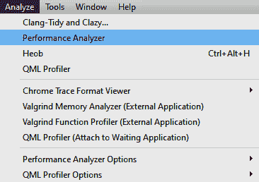

图 12.13 - Qt Creator 显示性能分析器选项

请注意，使用`perf`实用程序，您将会得到一个等效的警告对话框，如下截图所示：


图 12.14 - Qt Creator 显示性能分析器警告对话框

使用以下命令在您的 Ubuntu 机器上安装`perf`工具：

```cpp
$sudo apt install linux-tools-common
```

如果您使用不同的 Linux 发行版，您可以使用相应的命令。`perf`可能会因特定的 Linux 内核而失败，并显示有关内核版本的警告。在这种情况下，请使用适当内核版本的以下命令：

```cpp
$sudo apt install linux-tools-5.8.0-53-generic
```

完成`perf`设置后，您可以使用以下命令在命令提示符中查看预定义事件：

```cpp
$perf list
```

接下来，启动 Qt Creator 并打开一个 Qt 项目。选择`perf`工具，并在 Qt Creator 中创建几秒钟后，可能会出现一个额外的辅助程序。**处理延迟**字段包含此延迟的估计值。数据收集将持续进行，直到您单击**停止收集配置文件数据**按钮或关闭应用程序。

您还可以从**分析**菜单下的**性能分析器选项**加载`perf.data`并分析应用程序，如下所示：

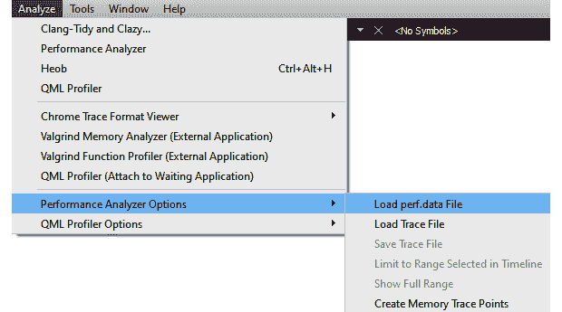

图 12.15 - 上下文菜单显示性能分析器选项

您可以在以下链接阅读有关性能分析器的更多用法：[`doc.qt.io/qtcreator/creator-cpu-usage-analyzer.html`](https://doc.qt.io/qtcreator/creator-cpu-usage-analyzer.html)。

在 macOS 上，有一个名为**Instructions**的等效工具；但是，这个工具没有与 Qt Creator 集成。您可以单独启动它，并查看**时间分析器**部分。

在 Linux 和 macOS 上，`memcheck`。您可以从分析器下拉选项中将其更改为`callgrind`。

您可以在以下链接了解有关 Valgrind 的更多信息：[`doc.qt.io/qtcreator/creator-valgrind-overview.html`](https://doc.qt.io/qtcreator/creator-valgrind-overview.html)。

Qt Creator 中的下一个工具是**Clang-Tidy**和**Clazy...**。这些工具可用于通过静态分析在您的 C++代码中定位问题。**Clang-Tidy**提供了常见编程错误的诊断和修复，如样式违规或接口误用。另一方面，**Clazy**突出显示与 Qt 相关的编译器错误，如浪费的内存分配和 API 使用，并建议重构活动以解决一些问题。Clang-Tidy 包括 Clang 静态分析器的功能。您无需单独设置 Clang 工具，因为它们已经与 Qt Creator 集成和分发。当您运行**Clang-Tidy 和 Clazy...**，如下面的屏幕截图所示，您将在**分析器**窗口下看到分析细节，并在代码编辑器下方的**应用程序输出**窗口中看到进度：

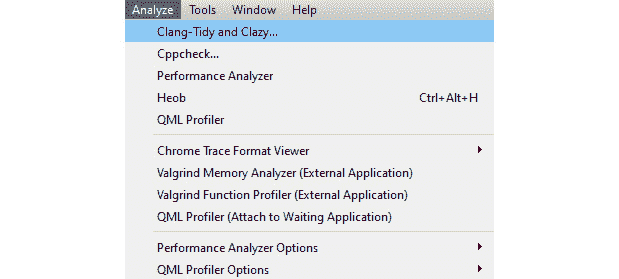

图 12.16 - 显示 Clang-Tidy 和 Clazy...选项的上下文菜单

让我们在现有的 Qt 示例上运行该工具。在应用程序窗口中，您将看到分析正在运行，并在分析器窗口中，您将看到结果。

您可以在以下链接进一步探索文档：[`doc.qt.io/qtcreator/creator-clang-tools.html`](https://doc.qt.io/qtcreator/creator-clang-tools.html)。

Qt Creator 还包括另一个工具称为**cppcheck**。这个工具与 Qt Creator 有实验性的集成。您可以在**帮助**菜单下的**关于插件...**中启用它。您可以使用它来检测未定义的行为和危险的编码结构。该工具提供了检查警告、样式、性能、可移植性和信息的选项。

与 Qt Creator 集成的最后一个分析工具是**CTF 可视化器**。您可以与 QML Profiler 一起使用它。跟踪信息可能会让您进一步了解 QML Profiler 收集的数据。您可以找出为什么简单的绑定需要这么长时间，比如可能受到 C++代码或慢磁盘操作的影响。完整的堆栈跟踪可以用于从顶层 QML 或 JavaScript 跟踪到 C++，一直跟踪到内核区域。这使您能够评估应用程序的性能，并确定性能不佳是由 CPU 还是同一系统上的其他程序引起的。跟踪提供了关于系统正在做什么以及应用程序为何以不希望的方式行为的见解。要查看 Chrome 跟踪事件，请使用 CTF 可视化器。

您可以在以下链接了解有关 CTF 可视化器的更多信息：[`doc.qt.io/qtcreator/creator-ctf-visualizer.html`](https://doc.qt.io/qtcreator/creator-ctf-visualizer.html)。

在本节中，我们讨论了 Qt Creator 中可用的不同分析工具。在下一节中，我们将进一步讨论如何优化和定位图形性能问题。

# 优化图形性能

我们在*第八章*中讨论了图形和动画，*图形和动画*。在本节中，我们将探讨影响图形和动画性能的因素。图形性能在任何应用程序中都是至关重要的。如果您的应用程序实现不佳，用户可能会在 UI 中看到闪烁，或者 UI 可能无法按预期更新。作为开发人员，您必须尽一切努力确保渲染引擎保持 60 帧每秒的刷新率。在每帧之间只有 16 毫秒，其中应该以 60 帧每秒的速度进行处理，这包括将绘制基元上传到图形硬件所需的处理。

为了避免图形性能出现任何故障，您应该尽可能使用异步、事件驱动的编程。如果您的应用程序具有巨大的数据处理需求和复杂的计算，则使用工作线程进行处理。您不应该手动旋转事件循环。不要在阻塞函数中每帧花费超过几毫秒的时间。如果不遵循这些要点，用户将看到 GUI 闪烁或冻结，导致糟糕的用户体验（UX）。在生成 UI 上的图形和动画方面，QML 引擎非常高效和强大。但是，您可以使用一些技巧使事情变得更快。不要编写自己的代码，而是利用 Qt 6 的内置功能。

在绘制图形时，如果可能的话，应选择不透明的基元。不透明的基元在渲染器上更快，也更快地绘制在 GPU 上。因此，在将照片传递给`QQuickImageProvider`时，应选择`QImage::Format_RGB32`。请注意，重叠的复合项无法进行批处理。尽量避免裁剪，因为它会破坏批处理。而是使用`QQuickImageProvider`裁剪图像。需要单色背景的应用程序应该使用`QQuickWindow::setColor()`而不是顶层的`Rectangle`元素。`QQuickWindow::setColor()`调用`glClear()`，速度更快。

在使用`Image`时，请使用`sourceSize`属性。`sourceSize`属性使 Qt 能够在将图像加载到内存之前将其缩小，确保巨大的图像消耗的内存不超过所需的量。当`smooth`属性设置为`true`时，Qt 会对图像进行滤波，使其在缩放或从原始大小更改时看起来更平滑。如果图像以与其`sourceSize`属性相同的大小呈现，则不会有任何区别。在一些较旧的硬件上，此属性将影响应用程序的性能。`antialiasing`属性指示 Qt 平滑处理图像边缘周围的混叠伪影。此属性将影响程序的性能。

通过有效的批处理可以实现更好的图形性能。渲染器可以提供有关批处理运行情况、使用了多少批处理、保留了哪些批处理、哪些是不透明的以及哪些不是的统计信息。要启用此功能，请添加一个环境变量，如`QSG_RENDERER_DEBUG`，并将值设置为`render`。除非图像太大，否则`Image`和`BorderImage` QML 类型将使用纹理图集。如果您正在使用 C++创建纹理，则调用`QQuickWindow::createTexture()`并传递`QQuickWindow::TextureCanUseAtlas`。您可以使用另一个环境变量`QSG_ATLAS_OVERLAY`来给图集纹理上色，这有助于轻松识别它们。

为了可视化场景图的默认渲染器的各个方面，可以将`QSG_VISUALIZE`环境变量设置为以下值之一。您可以在 Qt Creator 中通过转到`QSG_VISUALIZE`并设置该变量的值来执行此操作：

+   `QSG_VISUALIZE` = `overdraw`

+   `QSG_VISUALIZE` = `batches`

+   `QSG_VISUALIZE` = `clip`

+   `QSG_VISUALIZE` = `changes`

当`QSG_VISUALIZE`设置为`overdraw`时，渲染器中会可视化过度绘制。为了突出过度绘制，所有元素都以`Rectangle`形式可视化，只是为了绘制白色背景，因为`Window`也有白色背景。在这种情况下，使用`Item`属性而不是`Rectangle`可以提高性能。

将`QSG_VISUALIZE`设置为`batches`会导致批次在渲染器中可视化。未合并的批次以对角线图案绘制，而合并的批次以纯色绘制。少量不同的颜色表示有效的批处理。如果未合并的批次包含大量单独的节点，则是不理想的。

所有从`Item`派生的 QML 组件都有一个名为`clip`的属性。默认情况下，`clip`值设置为`false`。此属性通知场景图不要渲染超出其父级边界的任何子元素。当`QSG_VISUALIZE`设置为`clip`时，红点会出现在场景顶部以指示剪切。因为 Qt Quick `Items`默认不剪切，所以通常不会显示剪切。剪切会阻止将多个组件批处理在一起，这会影响图形性能。

当`QSG_VISUALIZE`设置为`changes`时，渲染器中的更改会显示出来。随机颜色的闪烁叠加用于突出显示场景图中的更改。对基元的修改显示为纯色，但对祖先的更改（例如对矩阵或不透明度的更改）则显示为图案。

在您的 Qt Quick 应用程序中尝试这些环境变量。您可以在以下链接了解有关这些渲染标志的更多信息：[`doc.qt.io/qt-6/qtquick-visualcanvas-scenegraph-renderer.html`](https://doc.qt.io/qt-6/qtquick-visualcanvas-scenegraph-renderer.html)。

Qt Quick 有助于构建具有流畅 UI 和动态过渡的出色应用程序。但是，您应该考虑一些因素以避免性能影响。当您向属性添加动画时，所有绑定都会受到影响并重新评估，这会引用该属性。为了避免性能问题，您可以在运行动画之前删除绑定，然后在动画完成后重新分配它。在动画期间，避免使用 JavaScript。应谨慎使用脚本动画，因为它们在主线程中运行。

您可以使用 Qt Quick 粒子创建漂亮的粒子效果。但是，其性能取决于底层硬件能力。要渲染更多粒子，您需要更快的图形硬件。您的图形硬件应能够以 60 FPS 或更高的速度绘制。您可以在以下链接了解有关优化粒子性能的更多信息：[`doc.qt.io/qt-6/qtquick-particles-performance.html`](https://doc.qt.io/qt-6/qtquick-particles-performance.html)。

在本节中，我们讨论了优化图形性能的不同考虑因素。在下一节中，我们将进一步讨论如何对应用程序进行基准测试。

# 创建基准测试

我们已经在*第九章*中学习了基准测试，*测试和调试*。让我们看一下基准测试的一些方面，以评估性能问题。我们已经讨论了 Qt Test 对基准测试的支持，这是对特定任务所需的平均时间的计算。`QBENCHMARK`宏用于对函数进行基准测试。

以下代码片段显示了对行编辑中关键点击的基准测试：

```cpp
void LineEditTest::testClicks()
{
    auto tstLineEdit = ui->lineEdit;
    QBENCHMARK {QTest::keyClicks(tstLineEdit, "Some 
                Inputs");}
}
```

您还可以对 Qt 提供的便利函数进行基准测试。以下代码对`QString::localeAwareCompare()`函数进行基准测试。让我们看一下这里的示例代码：

```cpp
void TestQStringBenchmark::simpleBenchmark()
{
    QString string1 = QLatin1String("Test string");
    QString string2 = QLatin1String("Test string");
    QBENCHMARK {string1.localeAwareCompare(string2);}
}
```

您还可以在 QML 中运行基准测试。Qt 基准测试框架将以`benchmark_`开头的函数运行多次，并记录运行的平均时间值。这类似于 C++版本的`QTestLib`中的`QBENCHMARK`宏。您可以在测试函数名称前加上`benchmark_once_`以获得`QBENCHMARK_ONCE`宏的效果。

您还可以使用`Benchmark`或`CreationBenchmark`。它还允许您执行自动化和手动基准测试。自动化测试可用于回归测试，而手动测试可用于了解新硬件的功能。它具有内置功能，如 FPS 计数器，对于 GUI 应用程序非常重要。您可以通过运行以下命令找到帧速率：

```cpp
>qmlbench --shell frame-count
```

您还可以通过简单的命令运行所有自动化测试，如下所示：

```cpp
>qmlbench benchmarks/auto/
```

要了解有关该工具的更多信息并查看示例，请参阅以下链接：[`github.com/qt-labs/qmlbench`](https://github.com/qt-labs/qmlbench)。

我们已经看到了在 Qt Widgets 和 QML 中基准测试对象创建，我们还对 Qt 函数进行了基准测试。您还可以在不使用任何宏的情况下进行分析。您可以简单地使用`QTime`或`QElapsedTimer`来测量代码或函数部分所花费的时间，如下面的代码片段所示：

```cpp
QTime* time = new QTime;
time->start();
int lastElapsedTime = 0;
qDebug()<<"Start:"<<(time->elapsed()-
        lastElapsedTime)<<"msec";
//Do some operation or call a function
qDebug()<<"End:"<<(time->elapsed()-
        lastElapsedTime)<<"msec";
```

在前面的代码片段中，我们使用了`elapsed()`来测量代码段所花费的时间。不同之处在于您可以在函数内评估几行代码，而不必编写单独的测试项目。这是一种快速找到性能问题的方法，而不必评估整个项目。

您还可以对您的 Qt Quick 3D 应用程序进行基准测试。以下是如何执行的文章：[`www.qt.io/blog/introducing-qtquick3d-benchmarking-application`](https://www.qt.io/blog/introducing-qtquick3d-benchmarking-application)。

在本节中，我们讨论了基准测试技术。在下一节中，我们将讨论更多的分析工具。

# 不同的分析工具和优化策略

您可以在代码级别以外的多个级别优化您的应用程序。优化也可以在内存或二进制上进行。您可以修改应用程序以使其更有效地使用更少的资源。但是，内存和性能之间可能存在权衡。根据您的硬件配置，您可以决定内存使用或处理时间哪个更重要。在一些具有内存限制的嵌入式平台上，您可以允许处理时间稍长一些，以使用更少的内存并保持应用程序的响应性。您还可以将优化任务的一部分委托给编译器。

让我们看看我们可以使用哪些不同的策略来构建、分析和部署更快。

## 内存分析和分析工具

在本节中，我们将讨论一些额外的工具，您可以使用这些工具来分析您的应用程序。请注意，我们不会详细讨论这些工具。您可以访问各自的工具网站，并从其文档中学习。除了 Qt Creator 中提供的工具之外，您还可以在 Windows 机器上使用以下工具。

让我们看看工具列表，如下所示：

+   **AddressSanitizer**（**ASan**）是由 Google 开发的地址监视工具，是 Sanitizers 的一部分。

+   **AQTime Pro**通过应用程序运行时分析和性能分析找到问题和内存泄漏。

+   **Deleaker**是一个面向 C++开发人员的工具，他们希望在其项目中找到所有可能的已知泄漏。它可以检测内存泄漏、**图形设备接口**（**GDI**）泄漏和其他泄漏。

+   **Intel Inspector XE**是英特尔的内存和线程调试器。

+   **PurifyPlus**是一个运行时分析工具套件，可在程序运行时监视您的程序并报告其行为的关键方面。

+   **Visual Leak Detector**是 Visual C++的免费、强大、开源的内存泄漏检测系统。

+   **Very Sleepy**是基于采样的 CPU 分析器。

+   **Visual Studio Profiler**（**VSTS**）可用于 CPU 采样、插装和内存分配。

+   **MTuner**采用一种新颖的方法进行内存分析和分析，保留了整个基于时间的内存操作历史记录。

+   **Memory Leak Detection Tool**是一个高性能的内存泄漏检测工具。

+   **Heob**可以检测缓冲区溢出和内存泄漏。集成到 Qt Creator 中。

+   **Process Explorer**可以查询和可视化每个进程的多个系统和性能计数器，我经常用它进行初步调查。

+   **System Explorer**显示任何运行进程发出的所有系统调用的长列表，并支持选择我们想要观察的进程的过滤器。

+   **RAMMap**检查系统的全局内存使用情况，这需要相当多的 Windows 内部知识。

+   **VMMap**显示单个应用程序的内存使用的详细信息。

+   **Coreinfo**提供有关处理器的详细信息，这是您在进行低级优化工作时可能需要的信息。

+   **Bloaty**对二进制文件进行深入分析。它旨在准确地将二进制文件的每个字节归因于产生它的符号或编译单元。

在本节中，我们向您简要介绍了一些第三方分析工具。在下一节中，我们将讨论如何在链接期间优化二进制文件。

## 链接期间进行优化

在前面的部分中，我们讨论了如何找到瓶颈并优化影响应用程序性能的代码段。幸运的是，大多数编译器现在都包括一种机制，允许您在保持代码的模块化和清晰性的同时进行这些优化。这被称为**链接时代码生成**（**LTCG**）或**链接时优化**（**LTO**）。LTO 是在链接过程中对程序进行优化。链接器收集所有目标文件并将它们集成到一个程序中。由于链接器可以查看整个程序，它可以进行整个程序的分析和优化。然而，链接器通常只在程序被转换为机器代码之后才能看到程序。我们不是将每个源文件逐个转换为机器代码，而是将代码生成过程推迟到最后—链接时间。在链接时间进行代码生成不仅可以智能地内联代码，还可以进行诸如取消虚拟函数和更好地消除冗余代码等优化。这种技术可用于改善应用程序的启动时间。

要在 Qt 中启用此机制，您必须从源代码构建。在配置步骤中，将`-ltcg`添加到命令行选项。在编译阶段一次性编译所有源代码将为您提供完整 LTO 的所有优化好处。您可以在工具链、平台和应用程序级别优化应用程序的启动时间。

在以下链接了解更多关于这些性能提示：[`wiki.qt.io/Performance_Tip_Startup_Time`](https://wiki.qt.io/Performance_Tip_Startup_Time)。

有时您可以将优化任务委托给编译器。当您启用优化标志时，编译器将尝试提高性能并优化代码块，代价是编译时间和—可能—调试能力。您可以为所需的编译器启用编译器级优化标志，如**GNU 编译器集合**（**GCC**）或 Clang。

查看 GCC 优化选项，可用 C++编译器的链接：[`gcc.gnu.org/onlinedocs/gcc/Optimize-Options.html`](http://gcc.gnu.org/onlinedocs/gcc/Optimize-Options.html)。

您可以在以下链接了解 Clang 中的不同标志：[`clang.llvm.org/docs/CommandGuide/clang.html`](https://clang.llvm.org/docs/CommandGuide/clang.html)。

在本节中，您了解了链接时优化。在下一节中，我们将讨论如何更快地构建您的 Qt 应用程序。

## 更快地构建 Qt 应用程序

在大型复杂项目中，构建项目所花费的时间越来越有价值。一般来说，构建时间越长，每天失去的时间就越多。如果将这个时间乘以一个完整团队的时间，你就会花费很多时间等待构建完成。虽然不得不等待每个小改动重新构建数小时可能会使您更加注意细节，并迫使您深入思考每一步，但它也可能限制更敏捷的流程或协作。在本节中，我们将提供一个简短的指南，介绍如何使用 Qt 处理 C++中的优化。

请注意以下几点，以加快构建过程：

+   使用并行构建标志

+   利用预编译头（`pch`）

+   从 makefile 中删除冗余的目标

+   在类中使用前向声明

在构建大型项目时，最有效的方法是使用并行构建方法。可以通过传递额外的参数来启用并行构建。在 Qt Creator 中，您可以启用`-j8`。您可以通过以下命令行语句指示编译器以并行方式构建：

```cpp
>make -j8
```

最后的数字取决于您的硬件。`-j8`指示并行运行八个线程。根据您的机器配置，您可以使用`-j4`。

您还可以为`-MP`标志启用并行构建。您可以通过在`.pro`文件中添加以下标志来指示`cl`并行运行：

```cpp
*msvc* {
    QMAKE_CXXFLAGS += -MP
}
```

预编译头是一种极大地减少编译器负担的优秀技术。当编译器解析文件时，它必须解析整个代码，包括标准头文件和其他第三方源。`pch`允许您定义哪些文件经常使用，以便编译器在开始构建之前对它们进行预编译，并在构建每个`.cpp`文件时利用结果。

要使用预编译头文件，请将以下代码添加到`.pro`文件中：

```cpp
PRECOMPILED_HEADER = ../pch/your_precompiled_header.h
CONFIG += precompile_header
```

如果您使用`Q_OBJECT`宏，元对象编译器会生成额外的文件。除非您需要相关功能，如信号和槽机制或翻译，否则不要不必要地使用`Q_OBJECT`宏。当您添加`Q_OBJECT`宏时，`moc`将生成一个`moc_<ClassName>.cpp`文件，这会增加编译的复杂性。

您可以在`.cpp`文件的末尾包含此文件，如下所示：

```cpp
#include "moc_<ClassName>.cpp"
```

您还可以通过在小型项目中使用前向声明和在大型项目中使用前向头文件来降低每个`.cpp`文件的依赖关系。前向类将缩短标准工作期间部分构建的持续时间。大多数类可以在`forwards.h`文件中包含前向声明。通过拥有这样的文件，您可以大大减少头文件中的包含数量，通常是包含`forwards.h`。

因此，`qmake`会注意到这一点，并将此文件从目标列表中删除。这将减少编译器的负担。

在本节中，您学会了如何减少应用程序的构建时间。在下一节中，我们将讨论基于 Qt Widgets 的应用程序中的一些最佳实践。

# Qt Widgets 的性能考虑

Qt Widgets 模块利用光栅引擎渲染小部件，这是一种使用 CPU 而不是 GPU 的软件渲染。在大多数情况下，它可以提供所需的性能。但是，Qt Widgets 模块非常古老，缺乏最新的功能。由于 QML 完全是硬件加速的，您应该考虑在应用程序的 UI 中采用它。

如果您的小部件不需要`mouseTracking`、`tabletTracking`或类似的事件捕获，请关闭它。由于此跟踪，您的应用程序将使用更多的 CPU 时间。保持较小的样式表，并将其全部放在一个样式表中，而不是应用于单个小部件。大型样式表将需要更长的时间才能将信息处理到渲染系统中，这可能会影响应用程序的性能。使用自定义样式而不是样式表，因为这可以为您提供更好的性能。

不要不必要地创建屏幕并将其隐藏。只有在需要时才创建屏幕。在使用`QStackedWidget`时，避免添加太多页面并用许多小部件填充它们。这需要 Qt 在渲染和事件处理阶段递归地发现它们，导致程序运行缓慢。

在可能的情况下，使用异步方法进行大型操作，以避免阻塞主进程，并保持软件平稳运行。多线程对于在事件循环中并行化多个进程非常有用。但是，如果不正确地执行，例如通过重复创建和删除线程或实现不良的线程间通信，可能会导致不良结果。

不同的 C++容器产生不同的速度。Qt 的向量容器比 STL 中的向量容器稍慢。总的来说，旧的 C++数组仍然是最快的，但它缺乏排序能力。使用最适合您需求的内容。

在本节中，您学习了在使用 Qt Widgets 模块时的最佳实践。在下一节中，我们将讨论 QML 的最佳实践。

# 学习 QML 编码的最佳实践

在 QML 编码时遵循某些最佳实践非常重要。您应该保持文件在一定的行限制内，并且应该具有一致的缩进和结构属性，以及遵循标准的命名约定。

您可以按照以下顺序结构化您的 QML 对象属性：

```cpp
Rectangle {
// id of the object
// property declarations
// signal declarations
// javascript functions
// object properties
// child objects
// states
// transitions
}
```

如果您正在使用一组属性中的多个属性，则使用组表示法，如下所示：

```cpp
Rectangle {
    anchors { 
        left: parent.left; top: parent.top
        right: parent.right; leftMargin: 20
    }
}
```

将一组属性视为一个块可以减少混乱，并有助于将属性与其他属性相关联。

QML 和 JavaScript 不像 C++那样强制执行私有属性。有必要隐藏这些私有属性，例如当属性是实现的一部分时。为了在 QML 项中有效地获得私有属性，您可以将其嵌入到`QtObject{...}`中以隐藏这些属性。这可以防止在 QML 文件和 JavaScript 之外访问这些属性。为了最小化对性能的影响，尝试将所有私有属性分组到同一个`QtObject`范围中。

以下代码片段说明了如何使用`QtObject`：

```cpp
Item {
    id: component
    width: 40; height: 40
    QtObject {
        id: privateObject
        property real area: width * height //private 
                                           //property
    }
}
```

属性解析需要时间。虽然查找的结果有时可以被缓存和重复使用，但通常最好避免额外的工作。您应该尝试在循环中只使用共同的基础一次。

如果任何属性发生变化，属性绑定表达式将被重新评估。如果您有一个循环，在其中进行一些处理，但只有结果很重要，那么最好创建一个临时累加器，然后将其赋值给要更新的属性，而不是逐步更新属性本身，以防止触发绑定表达式的重新评估。

为了避免因为它们是不可见元素的子元素而持续产生开销，它们应该在需要时进行延迟初始化，并在不再使用时进行销毁。使用`Loader`元素加载的对象可以通过重置`Loader`的`source`或`sourceComponent`属性来释放，但其他项目可以显式销毁。在某些情况下可能需要保持项目处于活动状态，在这种情况下应该使其不可见。

一般来说，不透明内容的绘制速度比半透明内容快得多。原因在于半透明内容需要混合，而渲染器可能能够更好地优化不透明内容。即使一幅图像只有一个半透明像素，它也被视为完全透明。对于具有半透明边缘的`BorderImage`元素也可以这样说。

避免在 QML 中进行长时间的逻辑计算。使用 C++来实现业务逻辑。如果仍然需要使用基于 JavaScript 的实现来执行一些复杂的操作或处理，则使用`WorkerScript`。

Qt Quick 编译器允许您将 QML 源代码编译成最终的二进制文件。通过启用这一功能，可以大大减少应用程序的启动时间。您不必将`.qml`文件与应用程序一起部署。您可以通过将以下行添加到 Qt 项目（`.pro`）文件中来启用 Qt Quick 编译器：

```cpp
CONFIG += qtquickcompiler
```

要了解更多关于 Qt Quick 最佳实践的信息，请阅读以下链接的文档：[`doc.qt.io/qt-6/qtquick-bestpractices.html`](https://doc.qt.io/qt-6/qtquick-bestpractices.html)。

您还可以在以下链接找到的文档中了解更多关于 Qt Quick 性能的信息：[`doc.qt.io/qt-6/qtquick-performance.html`](https://doc.qt.io/qt-6/qtquick-performance.html)。

在本节中，我们学习了在 QML 编码时的一些最佳实践。现在我们将在本章总结我们的学习。

# 总结

在本章中，我们讨论了性能考虑因素以及如何提高整体应用程序性能。我们从改进 C++代码开始。然后，我们解释了并发技术如何帮助加快应用程序速度。您了解了 QML Profiler 和其他性能分析工具的重要性。您还了解了在 Qt 编码时使用最佳实践的重要性。现在，您可以在日常编码中使用这些技术。您不必成为非凡的应用程序开发人员来进行性能优化。如果您遵循最佳实践、设计模式并编写更好的算法，那么您的应用程序将有更少的缺陷和更少的客户投诉。这是一个持续的过程，您将逐渐变得更好。

恭喜！您已经学会了性能优化的基础知识。如果您想了解更多，可以阅读专门为性能调优编写的更多书籍。在 Qt 中愉快地编码。记住，编写更好和高性能的代码可以减少 CPU 周期，从而减少碳足迹，因此，如果您编写更好的代码，您可以拯救地球，抵抗气候变化！
