# 揭秘软件架构模式

这将是软件定义的、数字化驱动的、云托管的、上下文感知的、面向服务的、事件驱动的和以人为本的时代。众所周知，反应性和认知软件在塑造预期的和明确的知识密集型服务和应用时代中起着非常重要的作用。也就是说，我们需要高度响应、可靠、可扩展、自适应和安全的软件套件和库来满足即将到来的知识时代的目标。有能力的**信息和通信技术**（**ICT**s）、工具、技术和技巧正在迅速出现和演变，以艺术地实现这类高级和精明的软件模块的实现。

模式领域的快速扩大已经存在了几十年。软件工程的复杂性也在无节制地增加。软件专家、传教士和倡导者已经阐述了软件模式在减轻软件工程日益增长的复杂性方面的巧妙和决定性的优势。因此，软件模式被广泛认为是构建弹性且多功能的软件包和程序的一种主要且至关重要的方法。专业人士和教授们一直在稳步挖掘新的模式。因此，大量开创性和有前景的架构、设计、部署、交付和集成模式正在迅速出现和演变，以加快和简化设计、开发、调试、部署和交付稳健且有益的软件应用的过程。

本章旨在解释突出的软件模式，特别是以下广泛讨论和详细说明的架构模式：

+   **面向对象的架构**（**OOA**）

+   **基于组件的组装**（**CBD**）架构

+   领域驱动设计架构

+   客户/服务器架构

+   多层分布式计算架构

+   分层/分层架构

+   **事件驱动架构**（**EDA**）

+   **面向服务的架构**（**SOA**）

+   **微服务架构**（**MSA**）

+   **基于空间的架构**（**SBA**）

+   专用架构

# 展望软件定义的世界

现在存在新的需求，如智能家居、酒店、医院等，而满足不断变化的企业和人们需求的信息和通信技术（**ICT**）的关键作用和责任正在稳步增长。目前，在神秘的 ICT 领域正在发生许多值得注意的趋势和转变。其中突出的包括以下内容：

+   通过云计算实现 IT 工业化

+   通过虚拟化和容器化实现 IT 分区

+   通过手持设备、可穿戴设备、手机、游牧设备等实现 IT 消费化

+   通过**物联网**（**IoT**）、**网络物理系统**（**CPSs**）等技术，各种物理、电气、机械和电子系统之间的极端和深层连接

+   认知 IT 使我们的日常系统能够认知其行为和反应

随着一切事物相互连接，生成、收集、清洗和处理的 数据量呈指数级增长。有集成平台用于大数据、快速、流式和物联网数据分析，以从数据堆中提取有用信息和可操作见解。数据库范式正在经历一系列的变化和挑战。

中间件领域正在提高赌注，因为需要集成异构的多个系统和服务，并使它们协同工作。我可以继续说下去。简而言之，IT 和商业领域每天都在变化。此外，企业期望他们的 IT 服务提供商具有创新性、颠覆性和变革性，以便用更少的资源实现更多。随着全球企业正在削减 IT 预算，IT 领域必须选择最新的进步，以便对利益相关者来说是正确和相关的。

如往常一样，软件工程领域也在稳步进步，取得了令人瞩目的进展。有敏捷编程模型来促进商业敏捷性。在最近过去，有 DevOps 方法在萌芽，以确保 IT 敏捷性。有新的软件基础设施和平台解决方案正在迅速出现，以满足不同利益相关者的各种需求。专业人士和教授们正在加班加点，以确保流程卓越和基础设施优化。合理的架构范式和风格正在被吸收。进一步来说，随着**人工智能**（**AI**）方法的采用，自动化水平将提高并达到新的高度。

如我们所知，软件工程中最强大的领域一直都在为商业加速、增强和自动化做出巨大的贡献。随着物联网和 CPS 范式的到来和阐述，软件领域正在稳步而明智地转向人们期待已久的赋能。相应地，对软件应用和服务智能赋能业务运营和产品，以及为个人、创新者和机构的日常决策、交易和行动做出贡献的需求越来越大。目前可用的编程模型、框架和工具正在帮助我们生产满足功能需求的应用程序。从现在起，软件专业人士和从业者面临的关键挑战是提供符合所有类型的**非功能性需求**（**NFRs**）/**服务质量**（**QoS**）属性的软件库和套件。也就是说，我们应该构建能够确保各种能力（如可靠性、可扩展性、可用性、可修改性、可持续性、安全性等）的应用程序。软件模式在这里非常有用。确切地说，软件模式的渗透、参与和普遍性一直在持续增加。

# 软件模式

如我们所知，模式是一种简化和更智能的解决方案，用于解决任何重要领域中的重复问题和持续挑战。在软件工程领域，主要存在许多设计、集成和架构模式。这些模式在迅速克服软件架构师、开发人员和集成人员在日常任务和工作中遇到的一些常规和新鲜问题时非常有用。设计模式非常受欢迎，用于专业设计企业级软件系统，而架构模式则用于巧妙地决定正在开发中的系统的优化和组织架构。通过巧妙地利用各种架构模式，可以大大处理变化和复杂性。架构模式使得在技术选择和工具选择方面做出一系列决策成为可能。各种系统组件、它们的独特能力以及它们如何相互连接和协作是构建和设计下一代软件系统的关键要素。架构模式在这里提供了巨大的服务。随着系统架构变得越来越复杂，架构模式的作用和责任持续增加。同样，随着我们走向分布式和去中心化的时代，集成模式非常重要，因为它们带来了许多值得称赞的简化和委托。

随着 DevOps 概念的蓬勃发展，IT 敏捷性中出现了更多的新模式。这些模式也勤奋地加速了构建更新、更强大的软件包的过程。除了以开发为中心的模式外，还有特定于部署和交付的模式。在随后的 DevOps 和无操作（NoOps）时代，部署模式将极大地有利于自动化耗时且繁琐的任务。同样，还有交付能力模式。模式随着使用量的增加和持续的改进而快速演变和稳定。模式也能够帮助克服新技术初期的困难。模式将成为 IT 在市场驱动、知识驱动和残酷竞争环境中生存和发光的关键因素。确切地说，模式是通过对软件开发者的工作量进行最小化，在构建复杂软件时的关键推动力。通过精心使用经过验证的软件模式，构建企业级、高质量和基于微服务应用的风险正在得到实质性缓解。

# 为什么是软件模式？

在 IT 领域，尤其是软件工程领域，正在发生许多值得注意的变革。由于业务期望的持续演变，最近软件解决方案的复杂性不断上升。对于复杂的软件，不仅软件开发活动变得非常困难，而且软件维护和增强任务也变得繁琐且耗时。软件模式为软件架构师、开发人员和操作人员提供了一个舒缓的因素。

软件系统正变得越来越复杂和精密，以满足新的业务需求。软件架构领域有助于平滑和直化通往生产定义明确和设计良好的软件套件的道路。软件架构主要是为了调节不断上升的软件复杂性和变化。因此，有所谓的努力提出软件架构模式，以实现易于实施和可持续的软件架构。本节从一些关于架构的基本知识开始，然后详细阐述一些广泛使用的软件架构模式。

架构对于由于持续添加新模块而日益复杂的系统至关重要。架构通常由三个关键方面决定：参与组件、每个组件的独特能力，以及最终，这些组件之间的连接性。建立软件架构不是一项容易的工作。在决定架构时需要考虑各种因素。需要仔细考虑许多架构决策，以加强最终架构。不仅需要记录功能需求，还需要记录非功能需求。通常，架构模式是为了设计一个系统的通用架构，例如软件解决方案。

# 软件模式的精华成分

文献中用于描述模式的格式多种多样，没有一种格式得到了广泛的认可。以下描述的元素将在大多数模式中找到，即使使用不同的标题来描述它们。在 Opengroup.org 网站上，使用了以下术语：

+   **名称（Name**）: 一个有意义且易于记忆的方式来引用模式，通常是单个单词或短语。

+   **问题（Problem**）: 这是对当前问题的简明描述。它必须对预期达到的目标和目的提供一些启示。

+   **上下文（Context**）: 上下文通常说明了在应用模式之前可以应用的先决条件。也就是说，这是在应用模式之前的初始状态描述。

+   **力（Forces**）: 这用于描述相关的力和约束以及它们如何相互作用/冲突。它记录了预期的目标和目的。描述应阐明问题的复杂性，并明确必须考虑的权衡类型。*力*的概念大致等同于架构师寻求获得和优化的*QoS 属性*（可用性、可伸缩性、安全性、可持续性、可组合性、机动性、弹性、可靠性、可重用性等），除了他们在设计架构时试图解决的问题之外。

+   **解决方案（Solution**）: 这全部关于清楚地解释如何实现预期的目标和目的。描述应识别解决方案的静态结构和动态行为。

+   **结果上下文（Resulting context**）: 这表明在应用模式后的后置条件。实施解决方案通常需要在竞争的力之间进行权衡。该元素描述了哪些力已被解决以及如何解决，哪些仍未解决。它还可能表明在新上下文中可能适用的其他模式。

+   **示例**：这是关于包含一些模式的样本应用，以说明每个元素（一个具体问题、上下文、一组力量、模式如何应用以及结果上下文）。

+   **理由**：有必要对整个模式或其中个别组件给出令人信服的解释/论证。理由必须表明模式实际上是如何工作的，以及它是如何解决力量以实现预期的目标和目的。

+   **相关模式**：存在其他类似模式，因此必须明确阐述此模式与其他模式之间的关系。这些可能是前导模式，其结果上下文对应于本模式的初始上下文。或者，这些可能是后续模式，其初始上下文对应于本模式的结果上下文。还可能有替代模式，它们描述了相同问题的不同解决方案，但处于不同的力量之下。最后，这些可能是相互依赖的模式，可能/必须与该模式一起应用。

+   **已知用途**：这需要详细说明模式在现有系统中的已知应用。这是为了验证模式确实描述了一个针对重复问题的经过验证的解决方案。已知用途还可以作为增值示例。

模式也可能从一个*摘要*开始，概述模式的内容并指出它解决的问题类型。摘要还可以确定目标受众以及关于读者的假设。

# 软件模式的类型

为了满足不同的需求，正在出现几种新的模式类型。本节将简要介绍这些模式。

**架构模式**表达了一个复杂系统的基本结构组织或方案。它提供了一套预定义的子系统，指定了它们的独特责任，并包括组织它们之间关系的决策启用规则和指南。软件系统的架构模式展示了整个软件解决方案的宏观结构。架构模式是一组原则和粗粒度模式，为系统族提供了一个抽象框架。架构模式通过提供针对频繁出现的常见问题的解决方案来提高分区并促进设计重用。精确地说，架构模式由一组塑造应用程序的原则组成。

**设计模式**提供了一种改进系统子系统或组件，或它们之间关系的方案。它描述了一种常见且重复出现的通信组件结构，该结构在特定上下文中解决了一般设计问题。软件系统的设计模式规定了构建软件组件的方法和手段。设计模式阐述了系统内部的各种组件如何相互协作，以实现所需的功能。

还有其他模式。大数据时代的到来要求分布式计算。企业级应用的庞大和单体特性要求以微服务为中心的应用。在这里，需要找到并集成应用服务，以提供综合的结果和视图。因此，存在支持集成的模式。同样，还有简化软件部署和交付的模式。其他复杂操作通过智能利用简单以及复合模式得到解决。在下一节中，我们将讨论 IT 的各个维度，目的是传达软件模式对下一代 IT 的巨大影响。

# 软件架构模式

本节用于描述突出和主导的软件架构模式。

与单体应用相关联的几个弱点：

+   **可伸缩性**：单体应用设计为在单个强大系统内运行。提高应用的速度或容量需要升级到更新、更快的硬件，这需要大量的规划和考虑。

+   **可靠性和可用性**：单体应用中的任何故障或错误都可能使整个应用离线。此外，更新应用通常需要停机时间以重启服务。

+   **敏捷性**：随着新功能的不断添加，单体代码库变得越来越复杂，发布周期通常以 6-12 个月或更长时间来衡量。

正如之前提到的，遗留应用在本质上具有单体特性，规模庞大。将它们重构和修复为支持 Web、云和服务将消耗大量时间、金钱和人才。随着企业持续削减 IT 预算，同时期望 IT 团队以更少的资源做更多的事情，利用各种架构模式单独或集体准备和部署现代化应用的时机已经到来。以下各节详细介绍了各种有希望和潜在的架构模式。

# 面向对象架构 (OOA)

对象是所有软件应用的基本和基础构建块。任何软件应用的结构和行为都可以通过使用多个互操作对象来表示。对象优雅地以优化和有序的方式封装了各种属性和任务。对象通过定义良好的接口连接、通信和协作。因此，面向对象架构风格已成为生产面向对象软件应用的主导风格。最终，软件系统被视为一组协作对象的动态集合，而不是一系列例程或程序性指令。

我们知道，有经过验证的面向对象编程方法和使能语言，如 C++、Java 等。面向对象分析（OOA）提供的继承、多态、封装和组合属性在产生高度模块化（高度内聚和松散耦合）、可使用和可重用的软件应用中非常有用。

如果我们想要将逻辑和数据封装在一起，以便在可重用组件中使用，面向对象风格是合适的。此外，需要抽象和动态行为的复杂业务逻辑可以有效地使用这种面向对象分析（OOA）。

# 基于组件的组装（CBD）架构

单一和大规模应用可以被分割成多个交互和较小的组件。当组件被找到、绑定和组合时，我们就得到了完整的软件应用。组件成为设计和开发企业级应用的基础构建块。因此，复杂应用的分解和组件的组合以达到高效应用方面受到了很多关注。组件为其他组件提供了定义良好的接口，以便发现和通信。这种设置提供了比面向对象设计原则更高层次的抽象。CBA 不关注诸如通信协议和共享状态等问题。组件是可重用的、可替换的、可替代的、可扩展的、独立的，等等。**依赖注入**（**DI**）模式或服务定位器模式等设计模式可以用来管理组件之间的依赖关系，促进松散耦合和重用。这些模式通常用于构建组合应用，这些应用结合并重用了跨多个应用中的组件。

**面向方面编程**（**AOP**）方面是另一个流行的应用构建块。通过巧妙地操作这个开发单元，可以构建和部署不同的应用。AOP 风格旨在通过允许分离横切关注点来增加模块化。AOP 包括支持在源代码级别关注点模块化的编程方法和工具。面向方面编程包括将程序逻辑分解成不同的部分（*关注点*，功能的一致区域）。所有编程范式本质上都通过提供抽象（例如，函数、过程、模块、类、方法等）来支持将关注点分组和封装到独立实体中。这些抽象可以用于实现、抽象和组合各种关注点。有些关注点无论如何都会跨越程序中的多个抽象，并违反这些实现形式。这些关注点被称为*横切关注点*或横向关注点。

记录日志是一个横切关注点，因为日志策略必然影响系统中的每个记录部分。因此，日志*横切*了所有记录的类和方法。简而言之，方面被表示为横切关注点，并且根据需要注入。通过关注点的分离，源代码的复杂性急剧下降，编码效率必然提高。

**面向代理的软件工程**（**AOSE**）是一种编程范式，其中软件的构建以软件代理的概念为中心。与核心是具有变量参数方法的对象的经过验证的面向对象编程相比，面向代理编程以具有接口和消息能力的外部指定的代理为核心。它们可以被认为是对象的抽象。交换的消息由接收*代理*以特定于其代理类的方式解释。

软件代理是一个持久、目标导向的计算机程序，它对其环境做出反应，无需持续的直接监督即可运行以执行为最终用户或另一个程序的功能。软件代理是自主机器人的计算机模拟。有一些特定的应用和行业垂直领域需要软件代理的独特服务。因此，我们有软件对象、组件、方面和代理作为构建各种不同能力应用的流行软件构造。

# 领域驱动设计（DDD）架构

领域驱动设计（DDD）是一种面向对象的方法，用于根据业务领域、其元素和行为以及它们之间的关系来设计软件。它旨在通过定义以业务领域专家的语言表达的领域模型，实现软件系统对底层业务领域的正确实现。领域模型可以被视为一个框架，从该框架中可以准备和合理化解决方案。

架构师必须对要建模的业务领域有很好的理解。开发团队往往与业务领域专家合作，以精确和完美的方式建模领域。在这方面，团队同意只使用一种专注于业务领域的单一语言，排除任何技术术语。由于软件的核心是领域模型，它是这种共享语言的直接投影，这使得团队能够通过分析其周围的语言来快速找到软件中的差距。DDD 过程不仅旨在实现所使用的语言，还旨在改进和精炼领域语言。这反过来又有利于正在构建的软件。

如果我们有一个复杂的领域并且希望提高开发团队内部的沟通和理解，DDD 是很好的。如果我们的企业数据场景庞大且复杂，难以使用现有技术管理，DDD 也可以是一个理想的方法。

# 客户端/服务器架构

此模式将系统分为两个主要应用，其中客户端向服务器发出请求。在许多情况下，服务器是一个数据库，应用逻辑以存储过程的形式表示。此模式有助于设计涉及客户端系统、服务器系统和连接网络的分布式系统。客户端/服务器架构的最简单形式涉及一个服务器应用程序，它被多个客户端直接访问。这被称为两层架构应用程序。Web 和应用服务器扮演服务器角色，以接收客户端请求、处理它们并将响应发送回客户端。以下图是客户端/服务器模式的图示：

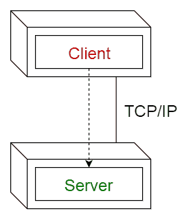

**对等网络**（**P2P**）的应用模式允许客户端和服务器交换它们的角色，以便在多个客户端之间分发和同步文件和信息。每个参与系统都可以扮演客户端和服务器角色。它们只是朝着实现业务功能的目标工作的对等体。它通过多个对请求的响应、共享数据、资源发现和对对等体移除的弹性扩展了客户端/服务器风格。

客户端/服务器架构模式的优点主要包括：

+   **更高的安全性**：所有数据都存储在服务器上，这通常比客户端机器提供更大的安全控制。

+   **集中式数据访问**：因为数据只存储在服务器上，所以对数据的访问和更新比其他架构风格更容易管理。

+   **易于维护**：服务器系统可以是单台机器或由多台机器组成的集群。服务器应用程序和数据库可以运行在单台机器上，或者跨多台机器复制以确保易于扩展性和高可用性。通过适当的网络，多台机器最终形成一个集群。最近，企业级服务器应用程序由多个子系统组成，每个子系统/微服务可以在集群中的单独服务器机器上运行。另一个趋势是每个子系统及其实例也正在被托管并在多台机器上运行。这种利用单个或多个服务器机器来执行服务器应用程序和数据库的做法确保了客户端对服务器维修、升级或迁移一无所知且不受影响。

然而，传统的两层客户端/服务器架构模式有许多缺点。首先，将应用程序和数据都保存在服务器上的趋势可能会对系统的可扩展性和可伸缩性产生负面影响。服务器可能成为单点故障。可靠性是这里的主要担忧。为了解决这些问题，客户端/服务器架构已经演变成更通用的三层（或 N 层）架构。这种多层架构不仅克服了上述问题，还带来了一系列新的好处。

# 多层分布式计算架构

两层架构既不灵活也不可扩展。因此，多层分布式计算架构吸引了大量关注。应用程序组件可以部署在多台机器上（这些机器可以是本地部署和地理分布的）。应用程序组件可以通过消息或**远程过程调用（RPCs**）、**远程方法调用（RMIs**）、**通用对象请求代理架构（CORBA**）、**企业 Java 豆（EJBs**）等方式进行集成。应用程序服务的分布式部署确保了高可用性、可扩展性、可管理性等。Web、云、移动和其他面向客户的应用程序都是使用这种架构进行部署的。

因此，根据业务需求和应用程序的复杂性，IT 团队可以选择简单的两层客户端/服务器架构或高级的多层分布式架构来部署他们的应用程序。这些模式旨在简化软件应用程序的部署和交付给订阅者和用户。

# 分层/层架构

这种模式是客户端/服务器架构模式的改进。这是最常用的架构模式。通常，一个企业级软件应用包含三个或更多层：表示/用户界面层、业务逻辑层和数据持久层。为了实现与第三方应用/服务的集成，可以轻松地在分层架构中添加额外的层。后端主要是数据库管理系统，中间层涉及应用和 Web 服务器，表示层主要是用户界面应用（胖客户端）或 Web 浏览器（瘦客户端）。随着移动设备的快速普及，移动浏览器也被附加到表示层。这种分层隔离在管理和维护每一层时非常有用。这种方法的插件和即插即用功能得到了实现。根据需要，可以添加额外的层。有许多符合**模型-视图-控制器**（**MVC**）模式框架，极大地简化了企业级和 Web 规模应用。MVC 是一种 Web 应用架构模式。分层架构的主要优势是**关注点的分离**。也就是说，每一层可以专注于其角色和责任。分层和分层模式使应用：

+   易于维护

+   可测试性

+   容易分配特定的和独立的*角色*

+   容易单独更新和增强层

这种架构模式非常适合快速开发、无风险地开发 Web 规模、生产级和云托管的软件应用。当前和传统的分层应用可以很容易地在每一层使用新技术和工具进行修改。这种模式显著地调节和最小化了软件应用的开发、运营和管理复杂性。系统参与的不同组件的分区可以被其他合适的组件替换和替代。当出现业务和技术变化时，这种分层架构在嵌入新事物以满足不断变化的企业需求时非常有用。

如下图中所示，可以有多个层来满足各种需求。某些层可以被称作开放的，以便在某些特定请求中绕过。在图中，服务层被标记为开放。这意味着请求可以绕过这个开放的层，直接到达其下的层。现在业务层可以直接访问持久层。因此，分层方法非常开放和灵活。

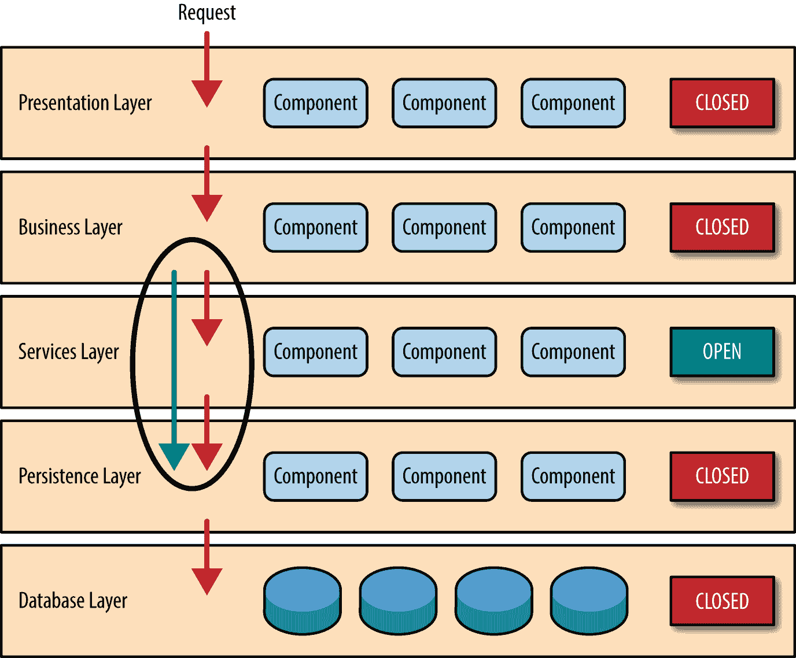

简而言之，分层或分层方法必然能够调节软件应用日益增长的复杂性。此外，绕过某些层，灵活性可以轻松地被整合。根据需要，可以嵌入额外的层，以实现高度同步的应用。

# 事件驱动架构（EDA）

通常，服务器应用程序响应用户请求。也就是说，根据著名的客户端-服务器架构风格，*请求和回复*方法是客户端和服务器之间交互的主要方式。这是一种从服务器拉取信息的方式。通信也是同步的。在这种情况下，客户端和服务器都必须在线才能启动和完成任务。进一步来说，当服务器机器正在处理和执行服务请求时，请求服务/客户端必须等待从服务器接收预期的响应。这意味着客户端在等待接收服务器的响应时不能做任何其他工作。

世界最终正在变成事件驱动的。也就是说，应用程序必须积极主动、预先、精确地敏感和响应。每当发生事件时，应用程序必须立即接收事件信息并投入必要的活动。*请求和回复*概念为*发送后即忘*原则铺平了道路。通信变得异步。不需要参与的应用程序始终在线。

事件是指在任何商业内部或外部发生的值得注意的事情。事件可能表示一个问题、一个机会、一个偏差、状态变化或阈值突破。每个事件发生都有一个事件头和事件体。事件头包含描述事件发生详细信息的元素，例如规范 ID、事件类型、名称、创建者、时间戳等。事件体简洁而明确地描述了发生了什么。事件体必须包含所有正确和相关的信息，以便任何感兴趣的方都能及时使用这些信息采取必要的行动。如果事件没有完全描述，那么感兴趣的方必须回到源系统去提取增值信息。

EDA 通常基于异步消息驱动的通信模型，在整个企业中传播信息。它通过将业务活动描述为一系列事件，支持与组织操作模型的更自然对齐。EDA 不会将功能不同的系统和团队绑定到同一集中式管理模式中。EDA 最终导致高度解耦的系统。通过采用经过验证和潜在的 EDA，系统依赖性引入的常见问题正在得到消除。

我们已经看到了在不同领域使用的各种事件形式。有业务和技术事件。系统通过发出事件来更新其状态和条件，以便捕获并对其进行各种调查，以精确理解当前情况。提交网页表单和点击某些超文本会生成需要捕获的事件。增量数据库同步机制、RFID 读取、电子邮件消息、**短信服务**（**SMS**）、即时消息等事件不容忽视。可能存在粗粒度和细粒度事件。通常，粗粒度事件由多个细粒度事件组成。也就是说，粗粒度事件被抽象成业务概念和活动。例如，外部网站上发生了新的客户注册，订单完成了结账流程，贷款申请在承保阶段获得批准，市场交易完成，向供应商提交了履行请求，等等。另一方面，如基础设施故障、应用程序异常、系统容量变化和变更部署等细粒度事件仍然很重要。但它们的范围是局部和有限的。

存在事件处理引擎、**面向消息的中间件**（**MoM**）解决方案，如消息队列和代理，用于收集和存储事件数据和消息。通过这些 MoM 解决方案，可以收集、解析并通过多个主题传递数百万事件。当事件源/生产者发布通知时，事件接收者可以选择监听或过滤特定事件，并在实时中对下一步做什么做出主动决策。

EDA 风格建立在事件通知的基本方面之上，以促进即时信息传播和反应式业务流程执行。在 EDA 环境中，信息可以实时传播到所有服务和应用程序。EDA 模式使得高度反应式的企业应用程序成为可能。随着 EDA 模式的日益流行，实时分析已成为新常态。

Anuradha Wickramarachchi 在他的博客中写道，这是最常见的分布式异步架构。这种架构能够产生高度可扩展的系统。该架构由单一用途的事件处理组件组成，这些组件监听事件并异步处理它们。事件驱动架构中有两种主要拓扑结构：

+   **调解器拓扑**：调解器拓扑有一个单独的事件队列和一个调解器，它将每个事件引导到相关的事件处理器。通常，事件通过事件通道输入到事件处理器，以过滤或预处理事件。事件队列的实现可以是简单的消息队列，也可以是通过利用大型分布式系统的消息传递接口，这本质上涉及复杂的消息协议。以下图表展示了调解器拓扑的架构实现：

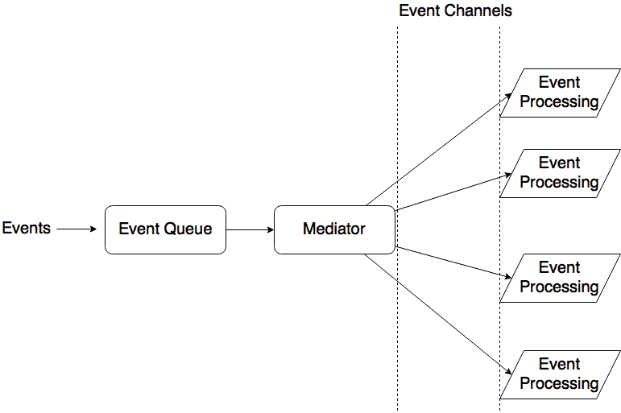

+   **经纪人拓扑**：这种拓扑不涉及事件队列。事件处理器负责获取事件、处理并发布另一个事件以指示结束。正如拓扑名称所暗示的，事件处理器充当经纪人以链式处理事件。一旦事件被处理器处理，就会发布另一个事件，以便另一个处理器可以继续。

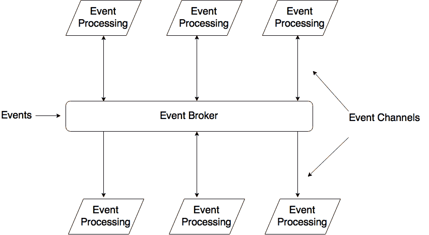

如图表所示，一些事件处理器仅处理事件而不留下痕迹，而另一些则倾向于发布新事件。某些任务的步骤以回调的方式链式连接。也就是说，当一个任务结束时，回调被触发，所有任务仍然保持异步的本质。

突出的例子包括使用 JavaScript 编写网页。这个应用程序涉及编写对鼠标点击或按键等事件做出反应的小模块。浏览器本身协调所有输入并确保只有正确的代码看到正确的事件。这与所有数据通常通过所有层传递的分层架构非常不同。

# EDA 的主要问题

EDA 模式缺乏事务的原子性，因为事件没有执行序列。这是因为事件处理器正在被实现为高度分布式、解耦和异步的。结果也预计将在未来某个时间通过回调提供。由于处理过程的异步性，对具有事件驱动架构的系统进行测试并不容易。最后，由于任务是异步和非阻塞的，执行是并行的，这保证了更高的性能。这种设置超过了队列机制的代价。

企业每天都会被大量简单和复杂的事件所轰炸，企业和云 IT 团队必须具备适当的事件捕获和处理引擎，以便采取纠正措施并在实时提供相关答案。众所周知的例子包括各种实时和现实世界的 IT 系统，例如贸易结算系统、航班预订系统、运输和物流公司的实时车辆位置数据、金融服务公司的流媒体股票数据等等。公司赋予这些系统处理大量复杂数据的能力，并能实时舒适地处理。

# 面向服务的架构（SOA）

我们一直在尝试面向对象、基于组件、面向方面和基于代理的软件开发流程。然而，随着服务范式的到来，软件包和库正被开发为一系列服务。也就是说，软件系统和它们的子系统越来越多地以服务的形式表达和暴露。服务能够在不依赖于底层技术的情况下独立运行。此外，服务可以使用任何编程和脚本语言来实现。

服务是自我定义的、自主的、互操作的，公开可发现、可评估、可访问、可重用和可堆肥的。服务通过消息相互交互。有服务提供者/开发者和消费者/客户端。有服务发现服务，这些服务天生利用私有和公共服务注册表和存储库。客户端服务可以通过服务发现服务动态地找到它们的服务。

每个服务都有两部分：接口和实现。接口是请求服务的单一接触点。接口在服务之间提供了所需的分离。所有类型的服务实现缺陷和差异都被服务接口所隐藏。为了使服务接口易于其他服务使用，使用一个定义消息结构的模式定义是一个好主意。当服务被多个其他服务使用时，使用合同正式化服务至关重要。合同将服务与模式、清晰的消息交换模式和策略绑定。策略定义了 QoS 属性，如可伸缩性、可持续性、安全性等。SOA 与客户端/服务器架构的区别在于，服务是普遍可用且无状态的，而客户端/服务器架构要求参与者之间紧密耦合。

具体来说，SOA 允许将应用功能作为一组服务提供，并创建利用软件服务的个人和专业应用程序。

# 基于服务的集成（SOI）

服务可以集成不同的分布式应用程序和数据源。**企业服务总线**（**ESB**）是服务中间件，它使得多个资产和资源的基于服务的集成成为可能。ESB 促进了服务互连、路由、修复、增强、治理等功能。ESB 是任何服务环境的集成中间件，其中消息是服务之间交互的基本单元。与之前的中间件解决方案（如 EAI 中心）相比，ESB 更轻量级。这是因为 ESB 消除了为集成流程/应用程序、数据源和 UIs 而使用定制连接器、驱动程序和适配器的需求。

让我们考虑一个示例场景。应用 A 只能将文件导出到特定目录，而应用 B 希望通过 HTTP 上的 SOAP 消息从导出的文件中获取一些信息。ESB 可以实现一个由应用 B 的 SOAP 请求消息触发的*messsage flow*，并使用文件适配器读取应用 A 导出文件中的请求信息。

ESB 收集所需信息并将其转换为符合约定 XML 模式的 SOAP 消息。然后，ESB 通过 HTTP 将 SOAP 消息发送回应用 B。

*消息流*是任何 ESB 解决方案的重要成分。消息流是一个定义，描述了消息的来源、如何到达 ESB，以及随后如何到达目标服务/应用程序。匹配是 ESB 提供的另一个突出功能。该功能规定了当消息到达 ESB 时，必须执行哪个消息流。

还有其他关键功能，包括路由、格式转换和消息格式转换。*路由*主要涉及将消息从一个服务路由到另一个服务。路由通常由消息流模块用来描述对于特定传入消息将调用哪个服务。第二个核心功能是协议*转换*。有许多应用程序和消息传输协议。ESB 可以将请求者协议转换为提供者兼容的协议。假设请求者支持 HTTP 协议，而提供者/接收者支持 FTP 协议。那么，ESB 的这个功能将 HTTP 协议转换为 FTP 协议，以便不同的分布式应用程序能够找到、绑定和交互。以下图是宏观层面的 SOA：

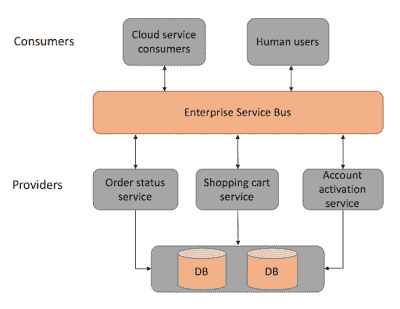

ESB 的最后一个核心功能是消息/数据格式转换。当请求者以 SOAP 格式发送消息时，ESB 可以使用 EDIFACT 消息格式调用提供者。此类消息格式转换背后的技术可以是经过验证的**XML 样式表语言转换**（**XSLT**）。

SOA 本质上是一组动态的服务集合，它们之间相互通信。这种通信可能涉及简单的数据传递，也可能涉及两个或更多服务协调某些活动。SOA 基于传统的请求-响应机制。服务消费者通过网络调用服务提供者，并必须等待提供者侧操作完成。回复以同步方式发送回消费者。

总之，异构应用程序在企业级和云 IT 环境中部署，以自动化业务操作、提供和输出。通过附加一个或多个接口，传统应用程序被服务化。通过将 ESB 置于中心，服务化应用程序可以轻松集成，以连接、通信、协作、证实和关联，从而产生预期的结果。简而言之，SOA 是为了实现单体和大规模应用程序的服务化和基于服务集成。通过智能利用服务范式，企业流程/应用程序集成的复杂性得到缓解。ESB 是使不同和分布式应用程序以无风险方式相互通信的最优中间件解决方案。

# 事件驱动的面向服务架构

今天，大多数 SOA 工作都热衷于实现同步请求-响应交互模式，以连接不同和分布式的流程。这种方法在高度集中的环境中效果良好，并在 IT 基础设施级别为分布式软件组件创建了一种松散耦合。然而，由于同步通信，SOA 导致应用程序功能紧密耦合。尽管如此，越来越多的企业环境正趋向于在交互、决策支持和执行方面实现动态和实时。SOA 模式可能难以确保下一代企业 IT 的压倒性需求。

如果需求仅仅是同步发送请求和接收响应，SOA 是一个不错的选择。但是，SOA 在处理异步实时事件方面还不够强大。这就是为什么事件驱动的 SOA 新模式，本质上结合了经过验证的 SOA 的请求-响应和 EDA 的事件发布-订阅范式，最近受到了很多关注和吸引力。也就是说，为了满足新引入的需求，需要这样的复合模式。这被吹捧为新一代 SOA（也被称为 SOA 2.0）。它基于异步消息驱动通信模型，在整个企业中传播各种企业级应用的信息。服务通过不同来源的事件被激活，结果的事件消息通过正确的服务传递以完成预定的业务操作。精确地说，参与和贡献的服务通过事件消息完全解耦并连接。在这个新模型中，各种依赖关系都被简单地消除了。

应用程序被设计、开发和部署得非常敏感且优雅，以实现高度响应。随着企业应用和大数据强制采用分布式计算模型，无疑事件驱动的 SOA 模式是未来的方向。通过这种新模式可以实现动态性、自主性和实时交互的目标。这种新的事件驱动 SOA 模式允许系统架构师和设计师处理事件消息和服务请求（RPC/RMI）。这使业务需求与相应的 IT 解决方案之间的亲和力和关联更加紧密。这不可避免地导致业务敏捷性、适应性、自主性和成本效益。

下面的图示说明了传统的请求-响应 SOA 风格。SOA 模式通常规定同步和基于拉取的方法：

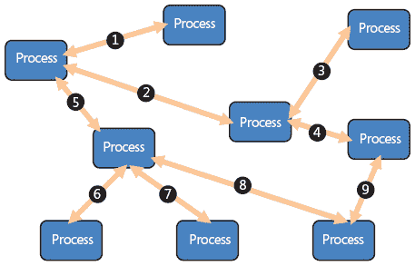

下面的图示展示了面向消息、事件驱动、异步和非阻塞的过程架构：

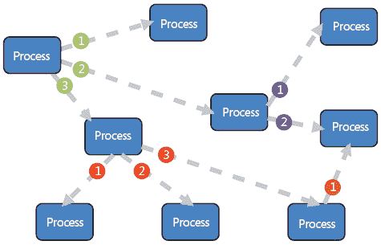

# EDA 的基本原则

在异步推送式消息模式中，EDA 模型基于发布/订阅模型，以“发射并遗忘”的方式向订阅的监听器推送各种实时通知和警报。这既不阻塞也不等待同步响应。此外，这是一个单向和异步的模式。

+   **自主消息**：事件以自主/自定义消息的形式进行通信。也就是说，每条消息只包含足够的细节来表示一个工作单元，这为通知接收者提供了决策能力。事件消息不应需要任何额外的上下文。它们也不应需要依赖于连接应用程序的内存会话状态。事件消息的简单目的是在企业内部传达每个应用程序、领域或工作组内每个应用程序的业务状态转换。

+   **解耦和分布式系统**：如前所述，EDA 模式在逻辑上解耦了连接的系统。SOA 保证松散和轻量级的耦合。也就是说，参与业务任务的应用程序不需要始终在线即可可用。中间件（ESB）负责在不引人注目的情况下将消息传递给目标应用程序。这里的问题是，发送系统必须知道目标应用程序的相关细节，以便在服务调用和处理完成时进行服务调用。

    在同步 SOA 情况下，连接和依赖的系统通常需要满足各种非功能性要求/服务质量（QoS）属性，例如可伸缩性、可用性、性能等。但在异步 EDA 的情况下，一个系统的交易负载不需要影响或依赖于下游系统的服务级别。这种解耦带来的自主性允许应用架构师在设计各自的物理架构和容量规划时更加无忧无虑。解耦的系统可以独立部署，并且具有横向可伸缩性，因为参与模块之间没有依赖关系。

+   **接收者驱动的流控制**：EDA 模式将大部分控制流的责任从事件源（或发送系统）转移出去，并将其分配/委托给事件接收者。以 EDA 为中心的连接系统在决定是否进一步传播事件方面具有更多的自主性。支持这些决策的知识被分散到架构中的离散步骤或阶段，并封装在所有权所在的区域。以下图表是 SOA 和 EDA 模式的宏伟混合：

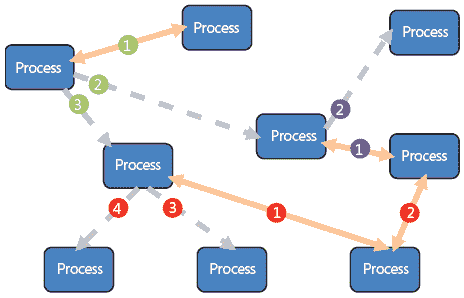

# ED-SOA 组合模式的好处

单一应用程序将所有功能放入单个进程中。为了扩展，必须复制整个应用程序。然而，将应用程序划分为一组动态应用程序服务可以促进选择和复制一个或多个应用程序组件/服务以进行扩展。因此，分而治之的技术在日益复杂的软件工程世界中仍然发挥着重要作用。本节说明了 SOA 和 EDA 模式结合的其他好处。

+   **有效的数据集成**：在同步请求驱动架构中，重点是重用远程持有的功能并实现面向过程的集成。这意味着数据集成，作为集成环境的重要方面，在 SOA 环境中本质上是不支持的。但在 EDA 的情况下，数据集成本质上是通过事件数据/消息作为通信和协作的基本单元来完成的。

+   **时效性和可靠性**：事件在所有参与的应用程序中实时传播，以实现实时数据捕获、处理、决策和执行。事件数据/消息的及时交换使得运营系统能够获得最准确和最新的业务状态/情况视图。基于精确和完美数据的决策将会是正确和有信息的。

+   **改进的可扩展性和可持续性**：异步系统与同步系统相比，通常具有更好的可扩展性，这是一个事实。单个进程阻塞较少，对远程/分布式进程的依赖性较低。此外，中间件（消息队列和代理）可以设计得更加无状态，从而降低分布式系统的整体复杂性。较低的依赖性最终导致它们具有高度的可扩展性、可靠性/依赖性、弹性、响应性和可管理性。在解耦系统中，任何类型的替换、替代和进步都可以轻松执行。

因此，SOA 和 EDA 模式的良好结合能够产生实时、自适应和可扩展的企业。这种混合模式已经准备好带来无数的创新、颠覆和变革。

# 微服务架构（MSA）

我们已经讨论了 SOA 模式在建立和维持服务驱动的环境和企业方面的独特贡献。面向服务的架构模式经过几十年的发展，能够表达和暴露任何遗留的、单体和大规模应用程序作为动态的、相互依赖的服务集合。服务拥有接口和实现。接口是任何服务驱动的应用的接触和合同机制。有标准、语言、模型、框架、平台、模式和一系列工具包来引导服务范式达到其逻辑结论。尽管 SOA 为 IT 企业做了很多事情，但仍然存在一些问题、缺点和局限性。

流行的 SOA 风格主要依赖于具有多个层次的结构化数据模型。在 SOA 中共享数据库往往会在服务和系统组件之间创建一种紧密的数据耦合。这种紧密耦合阻碍了数据库中所需变化的实现。也就是说，如果一些 RESTful 服务与后端数据库紧密耦合，并且如果对数据库模式有任何变更要求并实施，那么就需要重新测试服务以验证和确认服务在更改后的模式上如何工作。这种依赖性对于日益自动化和动态的世界来说有点麻烦。

另一个挑战是，SOA 风格中的服务通常是粗粒度的，因此重用性方面相当棘手。大多数遗留应用程序的应用组件都配备了面向服务的接口，以实现发现、集成和交互。在基础设施层面，没有依赖问题，因为这些服务化的应用程序组件实际上可以在任何地方运行。没有共置的限制。SOA 使用一种分层的组织架构，其中包含一个用于服务调用、中介和协调的集中式消息中间件。但这里棘手的问题是，应用程序组件需要知道彼此的相应细节，以便启动并完成所需的协作、协调和关联。还有其他挑战与高度成熟和稳定的 SOA 范式相关联。

让我们转向 MSA 模式，它正在以跳跃式的速度发展。微服务架构是定义、设计、开发、部署和交付分布式和企业级软件应用的新架构模式。这种快速涌现和演变的模式被定位为易于快速实现任何软件应用的非功能性需求，如可伸缩性、可用性和可靠性。

MSA 模式旨在生成细粒度、松耦合、水平可扩展、独立部署、互操作、公开可发现、网络可访问、易于管理和可组合的服务，这不仅是最优化的软件构建单元，还允许实现更快的软件部署和交付。在过去，软件公司组建了大量的工程师团队来构建应用程序，随着时间的推移，这些应用程序变得庞大且难以控制。传统应用程序紧密、庞大、难以维护、缺乏灵活性，且不符合现代标准。我们需要的是能够适应、动态、开放、易于修改和增强的应用程序。在理解了 MSA 模式的独特贡献之后，全球的企业今天都在积极战略规划和策划，以清晰和自信地拥抱这一新模式。因此，企业级的云、移动和嵌入式应用程序正在使用强大且开创性的 MSA 模式来构建。

工具辅助编排加速了以微服务为中心的应用程序的生产过程。借助工具辅助编排，微服务被巧妙地编排，以产生适用于业务自动化、加速和增强的多功能应用程序。

微服务建立在被称为边界上下文的概念之上，这导致单个服务与其数据之间有一个自包含的关联。对于受 MSA 启发的应用程序而言，没有技术或供应商锁定。每个微服务都配备了其自己的数据源，这可能是一个文件系统、SQL、NoSQL、NewSQL、内存缓存等等。有 API 网关解决方案来简化微服务的端到端生命周期管理。微服务完全依赖于服务间的通信。每个微服务根据需要调用另一个微服务以完成其功能。此外，被调用的微服务可以在一个称为服务链的过程中有需要时调用其他服务。微服务使用一个非协调的 API 层来覆盖组成应用程序的服务。随着 Docker 容器成为微服务的最合适的运行时，MSA 模式最近受到了很多关注。

每个微服务都被设计成一个原子化和自给自足的软件组件。实现一个应用程序通常需要组合对这些单一职责和分布式端点的多次调用。虽然当请求者期望立即响应时需要同步请求-响应调用，但基于事件和异步消息的集成模式提供了最大的可扩展性和弹性。微服务方法与典型的大数据部署非常吻合。

通过在许多通用硬件服务器上部署服务，我们可以获得所需的模块化、广泛的并行性和成本效益的扩展。微服务模块化促进了独立更新/部署，并有助于避免单点故障，这有助于防止大规模中断。

# 事件驱动微服务模式

正如之前提到的，微服务架构风格是一种将应用程序作为一系列离散但自给自足的服务构建的方法，这些服务围绕特定的业务能力。以微服务为中心的应用程序现在可以启用事件驱动。一些有趣的架构模式正在迅速出现和演变。在本节中，我们将探讨事件流模式。

就像多语言和去中心化持久化一样，去中心化多语言消息方法应该是实现微服务架构预期成功的关键。这允许不同的服务组以自己的节奏开发。此外，它最大限度地减少了高度协调和风险大的大爆炸式发布的需要。微服务方法为开发者提供了更多灵活性，以便选择最佳的消息中间件解决方案。每个用例都将有其特定的需求，要求使用不同的消息技术，如 Apache Kafka、RabbitMQ，甚至是事件驱动的 NoSQL 数据网格，如 Apache Geode / Pivotal GemFire。

在 MSA 方法中，一个常见的架构模式是使用如 Kafka 或 MapR Streams 这样的只追加事件流进行事件源，MapR Streams 实现了 Kafka。使用 MapR Streams，事件被分组到称为主题的逻辑事件集合中。主题被分区以实现并行处理。我们可以将分区主题视为一个队列。事件按接收顺序交付。与队列不同，事件被持久化，即使在交付后，它们仍然位于分区上，可供其他消费者使用。根据流的生存时间设置自动删除旧消息；如果设置为零，则它们永远不会被删除。读取消息时不会从主题中删除消息，并且主题可以有多个不同的消费者。这允许不同消费者以不同目的处理相同的消息。

在消费者丰富事件并将其发布到另一个主题的情况下，也可以实现流水线：

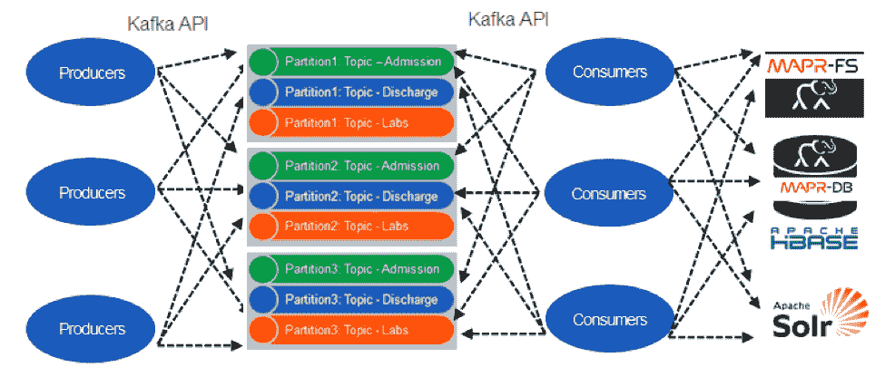

随着微服务架构的快速传播、渗透和参与，将出现新的模式来解决其日益增长和普遍的问题和限制。此外，现有模式可以无缝结合，产生更大、更好的模式，以实现以微服务为中心的应用程序的实现。我们在第九章，《微服务架构模式》中详细介绍了架构和设计模式。

# 基于空间的架构（SBA）

通常，企业应用程序都会配备一个后端数据库管理系统。只要数据库能够跟上负载，这些企业级应用程序就能良好运行。但当使用量达到峰值，数据库无法跟上不断挑战的记录交易日志时，应用程序注定会失败。在任何高流量应用程序中，如果并发用户负载极大，数据库通常会成为我们能够同时处理的交易数量的最终限制因素。虽然各种缓存技术和数据库扩展产品有助于解决这些问题，但将普通应用程序扩展到极端负载仍然是一个非常困难的提议。

空间架构的设计目的是使软件系统即使在用户负载很重的情况下也能正常工作。这是通过在多个服务器之间分割处理和存储来实现的。数据分散在许多节点上。空间架构模式被广泛用于解决和解决可扩展性和并发性问题。面向客户的应用程序非常不可预测，这种专门的架构足够强大和智能，能够支持大量用户。

通过去除中心数据库约束并使用内存中数据网格进行复制，实现了高可扩展性。应用程序数据保存在内存中，并在所有活动处理单元之间进行复制。处理单元可以根据用户负载的增加和减少动态启动和关闭，从而解决可变可扩展性问题。因为没有中心数据库，所以去除了数据库瓶颈，在应用程序中提供了近乎无限的扩展性。符合这种模式的大多数应用程序都是标准网站，它们接收来自浏览器的请求并执行某种操作。一个拍卖网站就是很好的例子。该网站会不断通过浏览器请求接收来自互联网用户的出价。应用程序会收到特定商品的出价，记录该出价的时间戳，更新该商品的最新出价信息，并将信息发送回浏览器。

具体来说，SBA 风格主要是为了确保更高的并发性目标。下一代应用程序必须具有可扩展性、可用性和可靠性。SBA 模式是一个强大的推动者。

# 结合架构模式

正如我们所知，世界正在变成一个软件定义的世界。一切事物都被软件填充以展现适应性。因此，诸如软件定义网络、存储、计算、安全和环境等术语如今正变得越来越重要。此外，软件定义一切的概念正变得突出且至关重要。因此，软件的角色和责任正在增加。随着软件的快速传播、渗透和参与，软件产品也正变得复杂。软件专家和倡导者建议结合我们之前讨论过的多种架构模式，以减轻并加速下一代软件解决方案和服务的实现。我们描述了如何将 SOA 和 EDA 结合起来，为产生动态和自适应的应用程序奠定刺激的基础。同样，其他架构模式也可以同步，以产生复合模式，从而产生有能力和多功能的软件。

# 专用架构

具有上下文感知的事件驱动服务导向架构（ALFONSO GARCÍA DE PRADO 及其团队）。

上下文感知已成为实现以人为本的 IT 应用的基本要求。人们离开家时，期望他们留下的灯光能自动关闭。手机可以警告人们，如果上班路上有交通拥堵。如果下雨，雨刷会自动打开。如果家中、酒店或医院有火灾的可能性，那么传感器必须相互集成，及时进行数据融合，以便于火灾、火焰和跌倒检测。我们当前的 IT 服务和系统通常不具备上下文感知能力。每个常见的、随意的和便宜的商品都必须具备自我、周围环境和情境感知，以便在决策、交易和行为中独一无二。软件包、库和套件必须具有事件驱动性，以便敏感和响应。它们必须被设计和部署成能够接收任何值得注意的事件，并相应地做出反应。我们已经讨论了面向服务和事件驱动的架构。它们需要与新一代技术，如物联网（IoT），相结合，以便在日益互联的世界中正确且相关。

连接的物体、传感器、执行器、机器人、无人机、信标、机器、设备、仪器、商品、用具和其他设备将赋予软件服务上下文感知能力。有物联网数据分析平台、不断增长的不同和分布式事件源、事件处理器的更快成熟和稳定性、流分析引擎、大量的连接器、驱动器和适配器、知识可视化仪表板以及其他旨在跨行业垂直领域产生上下文感知应用的使能框架、模式、流程、实践和产品。

作者设计了一种高级上下文感知的事件驱动服务导向架构：

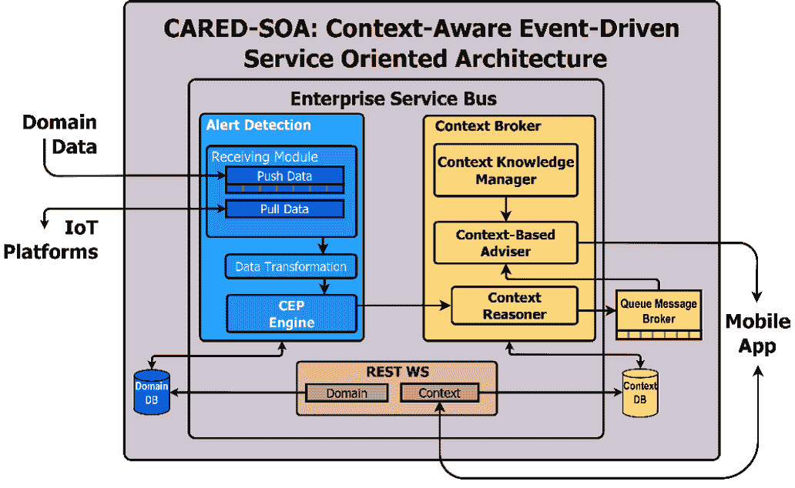

随着颠覆性的物联网时代的到来，应用和数据架构将同步以创建适用于各种用例的通用架构。

# 实时上下文感知预测架构

随着在个人、专业和社会环境中建立物联网环境以实现连接和智能环境的梦想，生成、收集、清洗和处理的多种结构化数据量正呈指数级增长。随着一系列特定和通用、消失的、可丢弃的但又不可或缺、轻薄、便携、时尚、嵌入式但联网的设备的到来，预期的大数据时代已经到来。这为企业和 IT 服务/解决方案提供商开辟了新的可能性和机会。

通过应用开创性的边缘技术，我们的制造车间、零售店、仓库、机场、火车站、公交车站，多学科诊所、购物中心、商场和超市，礼堂和体育场，娱乐中心和电影院，餐饮店等，正缓慢而稳步地变得更加智能。这意味着软件应用必须具备上下文感知能力，才能适应、包容和调整。

考虑到在 IT 领域发生的趋势和转型，一些研究人员（大卫·科拉尔-普拉扎及其团队）构想了一种全面的**事件驱动服务导向架构**（**ED-SOA**），它具有以下重要因素：

+   数据生产者应从多个来源（数据库、物联网传感器、社交网络等）收集数据，并将它们发送到数据收集器。

+   数据收集器执行必要的转换，以便接收到的信息可以在其解决方案的后续阶段中使用。它是一个中间层，执行同质化过程，因为在大多数情况下，信息很可能会以不同的格式和结构接收。

+   数据处理应提供**复杂事件处理**（**CEP**）、上下文感知和预测模块。

+   数据消费者，可以是数据库、最终用户或额外的端点，为协作架构铺平了道路。这些数据消费者通过 REST 接口与前面的模块进行通信：

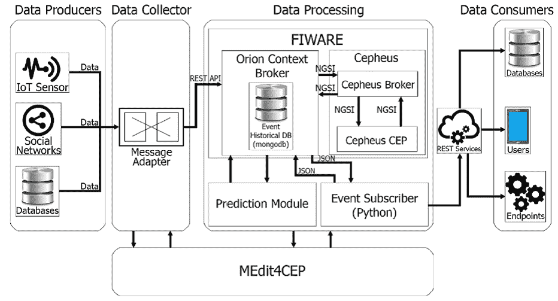

我们正朝着实时应用程序和企业的世界迈进。实时数据捕获、处理、知识发现和传播、决策和执行已成为新常态。IT 系统正在被赋予实时能力。前面的架构阐述了实现实时预测的方法和手段。

# 摘要

我们详细介绍了突出的和主导的软件架构模式，以及它们如何对于生产任何类型的面向企业级和生产级软件应用程序具有明显的根本性和基础性。为了适应演变和革命，以及克服由于商业和技术领域不断变化而产生的复杂性，建议巧妙地利用各种软件模式作为前进的道路。越来越明显，为了设计和开发复杂和智能的应用程序，各种架构模式正被精心选择和认知地组合在一起，以产生复合模式。

此外，还有许多由全球研究人员形成、验证和验证的应用和领域特定架构，作为研究贡献被提出。因此，架构模式领域持续增长，以支持并维持软件工程领域。接下来的章节将进一步深入探讨，为现有和新兴技术提供大量有用和可用的设计模式细节。我们已经涵盖了新兴和发展的技术，如 Docker 支持的容器化、**微服务架构**（**MSA**）、大数据分析、响应式编程、**高性能计算**（**HPC**）等。

# 其他阅读材料

要了解更多信息，您可以参考以下阅读资源：

+   .NET 容器化应用程序的微服务架构：[`docs.microsoft.com/en-us/dotnet/standard/microservices-architecture/`](https://docs.microsoft.com/en-us/dotnet/standard/microservices-architecture/)

+   SOA 模式：[`www.soapatterns.org/`](http://www.soapatterns.org/)

+   在高度分布式架构中使用事件：[`msdn.microsoft.com/en-us/library/dd129913.aspx`](https://msdn.microsoft.com/en-us/library/dd129913.aspx)

+   关于微服务和设计模式的全部内容：[`microservices.io/index.html`](http://microservices.io/index.html)

+   事件驱动架构模式：[`towardsdatascience.com/event-driven-architecture-pattern-b54fc50276cd`](https://towardsdatascience.com/event-driven-architecture-pattern-b54fc50276cd)

+   简要概述常见的软件架构模式：[`towardsdatascience.com/10-common-software-architectural-patterns-in-a-nutshell-a0b47a1e9013`](https://towardsdatascience.com/10-common-software-architectural-patterns-in-a-nutshell-a0b47a1e9013)
