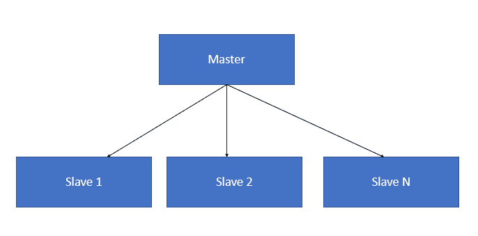

# 客户端/服务器多级架构模式

本章提供了一个客户端-服务器架构模式的鸟瞰图。它从两层客户端-服务器模式演化的需求开始，并强调了两层客户端-服务器模式的局限性如何导致了三层以及随后的*n*层客户端-服务器模式的演化。本章还深入解释了客户端-服务器模式的不同变体，如主从模式、对等网络模式等，并提供了相关的用例。本章的第二部分专注于 Web 应用程序框架。Web 应用程序的需求与客户端-服务器应用程序不同，关键的区别因素是基于底层数据的更改对 UI 的动态更新。本章的这一部分涵盖了 Web 应用程序设计中使用的所有流行模式。

本章涵盖的主要主题如下：

+   两层、三层和*n*层客户端-服务器模式

+   主从模式

+   对等网络模式

+   分布式客户端-服务器模式

+   模型-视图-控制器模式

+   模型-视图-表示者模式

+   模型-视图-模型模式

+   前端控制器模式

+   用于 Web 应用程序开发的常见设计模式

客户端-服务器模式是其中最古老的架构模式之一。简单来说，我们如何描述客户端和服务器？它被描述如下：

+   **客户端**: 这是请求服务的组件，向服务器发送各种类型服务的请求

+   **服务器**: 这是提供服务的组件，根据客户端提出的请求，持续不断地向客户端提供服务

客户端和服务器通常由分布式系统组成，它们通过网络进行通信。

下面的图是一个简单的图形，描述了客户端-服务器架构：

单个服务器可以服务的客户端数量没有上限。客户端和服务器是否位于不同的系统中也不是强制性的要求。根据系统的硬件配置和服务器提供的功能或服务类型，客户端和服务器可以位于同一系统中。客户端和服务器之间的通信是通过使用请求-响应模式交换消息来实现的。客户端基本上发送一个服务请求，服务器返回一个响应。客户端和服务器之间发生的这种请求-响应通信模式是进程间通信的一个很好的例子。为了使这种通信高效进行，有必要有一个定义良好的通信协议，该协议规定了通信规则，例如请求消息的格式、响应消息、错误处理等。所有用于客户端-服务器通信的通信协议都在协议栈的应用层工作。为了进一步简化客户端-服务器通信的过程，服务器有时会实现特定的**应用程序编程接口**（**API**），这些接口可以被客户端用来访问服务器上的任何特定服务。图中所示的这个客户端-服务器模式有两个层次：客户端层和服务器层，因此它也被称为**两层客户端-服务器模式**。

在客户端-服务器架构的上下文中，“服务”这个术语指的是资源的抽象。资源可以是任何类型，服务器根据服务器提供的资源（服务）来命名。例如，如果服务器提供网页，它被称为**网页服务器**；如果服务器提供文件，它被称为**文件服务器**，等等。服务器可以在特定时间点接收来自*n*个客户端的请求。但任何服务器都会有其处理能力的限制。因此，很多时候，服务器需要优先处理传入的请求，并根据其优先级提供服务。服务器中存在的调度系统帮助服务器分配优先级。针对不同用例的客户端-服务器模式的常见应用如下。

**邮件服务器**和**邮件客户端**：邮件服务器根据从邮件客户端收到的请求提供电子邮件。一些常用的企业级电子邮件解决方案包括来自微软的 Microsoft Exchange、来自 IBM 的 Lotus notes、来自谷歌的 Gmail 等。对电子邮件系统的工作描述如下。

邮件服务器，也称为电子邮件服务器，是处理和通过网络（通常是互联网）传递电子邮件的服务器。邮件服务器还配备了从客户端计算机接收电子邮件并将其传递到网络中其他邮件服务器的功能。电子邮件客户端是一个读取电子邮件的系统。它可以是台式机、笔记本电脑或支持电子邮件的智能手机。

以下图示展示了电子邮件系统的工作原理：

当从客户端发送电子邮件时，客户端系统中的电子邮件软件将连接到网络中的服务器，该服务器被称为**简单邮件传输协议**（**SMTP**）服务器。SMTP 指的是用于将电子邮件从客户端发送到服务器以及从一台服务器发送到另一台服务器的协议。

当使用客户端机器上现有的电子邮件软件下载电子邮件时，电子邮件软件将连接到另一个服务器，该服务器执行一个称为**邮局协议版本 3**（**POP3**）服务器的功能。POP3 服务器使用 POP3 协议。该协议的工作方式类似于邮局中使用的邮件投递系统，因此得名。这些协议的详细讨论超出了本章的范围。

# 域名服务（DNS）服务器和 DNS 客户端

DNS 是互联网上最重要的服务之一。互联网上有成千上万的设备都是其一部分，每个设备都被称为主机。每个主机都有一个与其关联的唯一 IP 地址。除了 IP 地址之外，每个主机还有一个与其关联的唯一主机名。例如，如果主机名为`LP471`并且位于域名`technest.com`中，那么该主机的**完全限定域名**（**FQDN**）就是`LP471.technest.com`。FQDN 用于在 DNS 命名空间内唯一标识主机。DNS 命名空间包含一些常用的名称后缀；它们如下所示：

+   `.com`: 商业组织

+   `.edu`: 教育机构

+   `.gov`: 政府组织

+   `.org`: 如 IEEE 等非营利组织

+   `.net`: 网络组织

除了这些常用的名称后缀之外，还有其他几个。

# DNS 的工作原理

DNS 使用基于客户端-服务器模型的分布式数据库概念来工作。DNS 客户端是需要进行域名解析（将主机名映射到 IP 地址）的实体。DNS 服务器维护用于域名解析所需的数据。以下图示给出了 DNS 客户端-服务器架构的高级示意图：

假设将 URL `www.xyzworks.com` 输入 DNS 客户端的浏览器中。浏览器会连接到 DNS 服务器以获取相应的 IP 地址。DNS 服务器通过首先连接到一个根 DNS 服务器来执行此任务。根服务器将存储处理顶级域名（如 `.edu`、`.com` 等）的所有 DNS 服务器的 IP 地址。在这个例子中，根服务器在获取顶级域名 `.com` 的 IP 地址后，向其发送一个查询请求，询问 `www.xyzworks.com` 的 IP 地址。处理 `.com` 域的 DNS 服务器将响应，提供处理 `www.xyzworks.com` 域的名称服务器的 IP 地址。

名称服务器然后将查询发送到 `www.xyzworks.com` DNS 服务器。该 DNS 服务器向名称服务器响应整个 IP 地址，名称服务器再将它发送回发起 DNS 请求的 DNS 客户端。DNS 客户端机器可以使用该 IP 地址访问所需的网页。

这种客户端-服务器架构的显著特点如下：

+   **冗余**：每个级别都有多个 DNS 服务器，这样即使一个服务器失败，另一个服务器可以接替其角色。

+   **缓存**：一旦 DNS 请求被解决，DNS 服务器会缓存它收到的 IP 地址。例如，DNS 服务器缓存 `.com` 域服务器的 IP 地址，以便任何后续对 `.com` 域的请求都可以由它处理，而无需启动重复的 DNS 查询机制。

# 两层客户端-服务器模式中的功能需求

在两层客户端-服务器模式中，关键的功能需求被分类如下表：

| **功能需求** | **描述** |
| --- | --- |
| 展示服务 | 提供用户界面和对话框控制 |
| 展示逻辑 | 用户交互和输入验证 |
| 商业逻辑 | 指定数据如何存储、创建和更改的一组商业规则 |
| 分发服务 | 通信管理 |
| 数据库逻辑 | 数据操作和管理数据完整性 |
| 数据库服务 | 管理数据库事务的各种属性 |
| 文件服务 | 文件操作和文件共享 |

# 在客户端-服务器模式中功能需求的分配

客户端被广泛分为以下两大类：

+   **胖客户端**：大部分功能服务由客户端组件执行。一个经典的胖客户端例子是文件服务器。

+   **瘦客户端**：如果是瘦客户端，它依赖于服务器组件来提供大部分的计算能力。

客户端的选择基于客户端-服务器模式类型，该模式是在系统中计划并实现的。例如，如果该模式涉及大量需要在客户端完成的功能，那么客户端的选择通常是胖客户端，反之亦然。本节讨论的功能需求将更好地说明选择客户端和服务器系统以实现特定客户端-服务器模式。

在客户端-服务器模式中，有多种方式可以实现功能需求。以下是一些实现客户端-服务器模式的主要方式：

+   远程数据访问客户端-服务器模式

+   远程表示客户端-服务器模式

+   分离逻辑数据客户端-服务器架构模式

# 远程数据访问客户端-服务器模式

在远程数据访问客户端-服务器模式中，应用程序位于客户端组件上，而数据管理则由服务器组件完成。执行数据管理的服务器通常被称为**数据库管理系统**（DBMS）或数据服务器。市场上大多数**关系型数据库管理系统**（RDBMS）产品都是使用这种模式实现的。这些 RDBMS 产品通常在客户端提供一层或组件的软件，该软件负责与数据服务器进行通信。这个软件组件被称为**数据操纵语言**（DML）。客户端系统支持表示层和业务逻辑，并使用 DML 与数据服务器进行交互。这些模式通常涉及使用胖客户端，因为客户端系统也执行大量的处理。

在以下图中展示了在远程数据访问客户端-服务器架构中实现功能需求：

# 远程表示客户端-服务器模式

在远程表示客户端-服务器模式中，**图形用户界面**（**GUI**）前端映射到现有应用程序的基于文本的屏幕。这个过程被称为远程映射或前端处理。这种模式的典型操作模式涉及使用智能工作站，这些工作站具备拦截从服务器系统发送的文本屏幕数据流的能力，并使用 GUI 在窗口系统中显示它们。然而，在这些系统中，大多数处理和计算仅在服务器端进行。这种实现的理想例子是 IBM 的 3270（主机）应用程序。在这个应用程序中，应用程序数据被发送到主机上的 3270 屏幕程序以进行显示。然后，数据以 3270 数据流的形式发送到客户端工作站。客户端工作站接收数据，对其进行解释，并将其转换为图形形式以在窗口中显示。如果用户通过客户端工作站的 GUI 窗口输入任何数据，运行在客户端工作站上的前端应用程序将数据转换为 3270 兼容格式并发送回服务器以进行下一步操作。远程表示客户端-服务器模式中功能分离的图示如下：

# 分离逻辑数据客户端-服务器架构模式

在分离逻辑数据客户端-服务器架构模式中，应用程序功能被分为两部分：一部分将在客户端实现，另一部分将在服务器端实现。与另外两种模式相比，这种模式非常复杂，因为客户端和服务器都需要为它们的运行分别编译应用程序程序。在实现此模式之前，开发者识别要在客户端和服务器端实现的功能，并列出应用程序程序在客户端和服务器端之间必须发生的通信对话类型非常重要。

# 三层模式/多层模式客户端-服务器

以下图表示了客户端-服务器交互：

在本节中，我们将讨论一些客户端-服务器模式的变体。客户端-服务器模式的一些显著变体如下：

+   主从模式

+   对等模式

让我们详细讨论它们。

# 主从模式

如果系统涉及需要重复执行且具有不同输入和上下文的相似或相同计算，则应用主从模式进行系统设计。主从模式提供了容错和并行计算的支持。

主从模式在以下图中展示：

主组件将工作分配给所有奴隶组件，并通过将每个奴隶返回的结果相加来计算最终结果。主从模式用于架构嵌入式系统，并用于设计执行大规模并行计算的系统。以下是主从模式的序列图：

# 主从模式的问题

主从模式基于分而治之的原则。在这个模式的工作中，协调概念与实际工作分离，因为所有奴隶都并行工作。因此，奴隶没有共享状态，并且它们独立工作。主从模式中的另一个问题是其延迟。这可能在响应时间非常关键的系统中引起问题，例如实时系统。此外，只有当问题可分解时，此模式才能应用于特定问题。

实现主从模式的一种方法是通过单个主线程，该线程创建多个奴隶线程。每个奴隶线程执行所需计算的变体，并将结果返回给主线程。一旦计算完成，主线程累积结果并终止奴隶线程。

客户端-队列-客户端模式这也可以称为被动队列架构。这是一种客户端-服务器架构的变体，其中所有组件，包括服务器，都仅被视为客户端系统。这是因为服务器被系统中的客户端视为被动队列，客户端使用它将消息传输到网络中其他客户端。这种架构可以被视为对等网络架构的早期演变之一，这在下一节中讨论，并且现在已过时。

# 对等模式

对等架构模式属于对称客户端-服务器模式的范畴。在这里，“对称”指的是在系统网络中不需要对客户端、服务器等进行严格划分。在对等模式中，单个系统既充当客户端也充当服务器。每个系统，也称为对等点，向网络中的其他对等点发送请求，并同时接收并处理来自网络中其他对等点的请求。这与传统客户端-服务器网络有很大的不同，在传统客户端-服务器网络中，客户端必须仅发送请求并等待服务器处理。

通常情况下，这种模式被用来实现一个使用分布式资源的去中心化系统网络，这些资源被期望执行特定的功能。分布式资源可以是处理能力、数据或带宽，这些资源可以用于任何分布式计算任务，如内容共享、通信等。对等网络模式的通用架构在以下图中展示（然而，可能存在一些变体，我们将在后面讨论）：

对等网络模式基本上有两种实现方式：

+   纯对等网络模式

+   混合对等网络模式

在纯对等网络模式中，网络中的所有系统都是对等节点，它们既充当客户端也充当服务器。没有对集中式服务器进行各种操作管理的依赖。这种架构的主要优势是其容错性。另一个优势是简单易实现，因为这种架构远离了集中化的概念。这种架构的缺点是由于网络中的所有对等节点请求的洪泛，导致网络带宽过度使用。Gnutella，一个流行的文件共享协议，就是使用纯对等网络模式实现的。前面的图示是一个纯对等网络模式的例子。

在混合对等网络模式中，存在一个中央服务器来执行某些必要的行政任务，以确保 P2P 服务的顺畅运行。这可以通过一个简单的例子来更好地解释。Napster，一个文件共享协议，就是基于混合对等网络模式设计的。在 Napster 中，有一个服务器，其主要功能是帮助网络中的对等系统查找文件。文件之间的传输是基于服务器返回的搜索结果来启动的。换句话说，只有文件目录存储在服务器上，而目录中实际存在的文件则分散在网络的各个对等系统中。与纯对等网络模式相比，这种模式由于依赖于集中式服务器组件，其容错性较低。然而，这种模式的主要好处是没有不必要的网络资源消耗，并且这种架构具有高度的扩展性。混合对等网络模式在以下图中展示：

虽然对等模式对于文件共享等应用程序非常有效，但它们也提供了许多安全威胁和恶意代码进入网络并传播到网络中其他对等系统的选项。因此，对等应用程序使用的 TCP 端口应始终受到监控，并置于**入侵检测系统**/**入侵预防系统**的监督之下。

# 双层客户端-服务器模式的优势

客户端-服务器系统的一些关键优势如下：

+   **安全性**：数据存储在服务器上。这提供了对服务器的更大控制，并且比保护散布在大量客户端机器上的数据提供更高的安全性，这可能涉及为每个客户端机器提供特殊的保护机制。

+   **集中访问数据**：由于大部分数据都存储在服务器上，因此对数据进行更新要容易得多。这是一种最简单的架构风格之一。

+   **易于维护**：在这个架构模式中，客户端不知道服务器的详细信息，因此服务器维护活动（如修复、升级等）不会影响客户端的功能。

# 设计考虑因素 - 何时使用双层客户端-服务器模式？

在阅读了大量关于双层客户端-服务器模式的内容之后，我们心中产生的下一个问题是何时在特定的架构设计中使用双层客户端-服务器模式。以下要点可以作为决定该问题的指南：

+   如果正在考虑的应用程序是基于服务器的并且将支持众多客户端，那么双层客户端-服务器模式是一个不错的选择。

+   一些与双层客户端-服务器模式配合良好的应用程序包括通过网页浏览器访问的 Web 应用程序，或可能在整个组织中使用的业务流程应用程序。

+   即使您正在考虑集中数据操作，如存储、备份和其他相关管理任务，双层客户端-服务器模式也是一个理想的选择。

# 双层客户端-服务器模式的局限性

以下是一些客户端-服务器模式的主要局限性：

+   **有限的扩展性、可伸缩性和可靠性**：在大多数实现中，应用程序数据和业务逻辑都驻留在同一个中央服务器上。这一方面影响了系统的扩展性、可伸缩性和可靠性。

+   **过度使用网络带宽**：客户端和服务器之间的通信消耗了过多的带宽。请求和响应数据通常需要转换为通用格式，因为它们在客户端和服务器端可能有不同的表示格式。这一方面也导致了额外的流量。

为了克服两层客户端-服务器模式的这些限制，开发了三层/多层客户端-服务器架构。当今大多数使用客户端-服务器架构开发的应用程序，其基础都是三层/多层架构模型，这在下一节中讨论。

由于它们架构上的细微差异，本章将三层架构和多层架构作为单独的主题处理，尽管在许多其他论坛中它们可能被交替使用。

# 三层客户端-服务器架构

该架构中存在的三层如下：

+   表示层

+   应用或业务逻辑层

+   数据层

描述三层客户端-服务器架构的图示如下：

在三层架构中，不同的层作为不同的模块开发和维护，有时甚至在不同的平台上。以下各层的功能如下：

+   **表示层**：这是应用程序中存在的第一层和最顶层。这一层提供表示服务，即通过图形用户界面向最终用户展示内容。这一层可以通过任何类型的客户端设备访问，如桌面、笔记本电脑、平板电脑、手机、瘦客户端等。为了向用户展示内容，相关的网页应由运行在客户端设备上的网络浏览器或其他表示组件获取。为了展示内容，这一层必须与它之前存在的其他层进行交互。

+   **应用层**：这是该架构的中间层。这是应用程序业务逻辑运行的那一层。业务逻辑是组织制定的指导方针下运行应用程序所需的规则集。这一层的组件通常运行在一个或多个应用服务器上。

+   **数据层**：这是该架构中的最低层，主要涉及应用程序数据的存储和检索。应用程序数据通常存储在数据库服务器、文件服务器或任何其他支持数据访问逻辑并提供必要步骤以确保仅暴露数据而不提供对数据存储和检索机制的访问的设备或媒体中。这是通过数据层通过向应用层提供 API 来实现的。提供此 API 确保了在此层进行的所有数据操作对应用层完全透明，而不会影响应用层。例如，此层中系统的更新或升级不会影响该架构的应用层。

三层架构的好处如下：

+   **可扩展性和灵活性**：这种架构的主要优势是其可扩展性和灵活性。该架构的每一层都是一个模块化组件，也就是说，对某一层进行的任何操作，如更改或升级，都不会影响或导致其他层的中断或停机。客户端执行的功能较少，并且不需要高端配置，对于存在于表示层的客户端系统。

+   **增强安全性**：将任务分配给各个层级可以提高每个层级的安全性。

虽然三层架构模式提供了许多好处，但当涉及到需要大规模可扩展性的网络，如互联网时，该架构的可扩展性仍然有限。

# 使用三层架构的设计考虑因素

以下是一些三层架构是不错的选择的场景：

+   如果你正在开发一个具有有限功能/配置的客户端系统的应用程序。在这种情况下，可以将架构的其他组件，如业务逻辑和数据逻辑，分配到其他层级。

+   如果你正在开发一个将在内部网络中部署的应用程序，其中所有服务器都位于特定的私有网络中。

+   如果你正在开发一个没有在 Web 或应用程序服务器公共网络上部署业务逻辑的安全约束的互联网应用程序。

提供大规模可扩展性的三层架构模式的变体是*n*层架构模式。在*n*层架构模式中，总层数为*n*，其中*n*的值大于三，以区别于三层架构模式。在*n*层架构中，应用层（即中间层）被分割成多个层级。应用代码和功能在各层级之间的分配因架构设计而异。*n*层架构模式的图示如下：

# 使用 n 层架构的设计考虑因素

以下是一些*n*层架构是不错的选择的场景：

+   如果你正在设计一个系统，可以将应用程序逻辑分割成更小的组件，这些组件可以分布在多个服务器上。这可能导致在应用层设计多个层级。

+   如果考虑的系统需要更快的网络通信、高可靠性和出色的性能，那么*n*层架构具有提供这些功能的能力，因为这种架构模式旨在减少由网络流量引起的开销。

# n 层架构的示例（购物车 Web 应用程序）

我们可以通过电子商务网站上普遍存在的购物车网络应用程序的例子来说明*n*层架构的工作原理。电子商务网站的用户使用购物车网络应用程序通过电子商务网站完成商品购买。

因此，应用程序应具有一些功能，使用户能够执行以下活动：

+   将选定的商品添加到购物车

+   改变购物车中物品的数量

+   进行支付

在购物车应用程序中存在的客户端层通过图形用户界面与最终用户交互。客户端层还与运行在多个层中的应用服务器中的应用程序进行交互。由于购物车是一个网络应用程序，客户端层包含网络浏览器。购物车应用程序中存在的表示层显示与浏览商品、购买商品、将商品添加到购物车等相关服务的相关信息。表示层通过向客户端层和所有网络中存在的其他层发送结果与这些层进行通信。

表示层还调用数据库存储过程和 Web 服务。所有这些活动都是为了提供快速响应时间给最终用户。表示层通过充当粘合剂，允许不同层中的功能相互通信，并通过网络浏览器向最终用户显示输出，从而发挥至关重要的作用。

在这个*n*层架构中，处理如计算运费等活动所需的企业逻辑从应用层拉到表示层。应用层还充当集成层，允许应用程序与数据层和表示层无缝通信。最后一层是数据层，用于维护数据。这一层通常包含数据库服务器。这一层独立于应用服务器和企业逻辑维护数据。这种方法为数据层提供了增强的可扩展性和性能。

# 分布式客户端-服务器架构

在前一部分讨论的购物车网络应用程序中使用的*n*层客户端-服务器架构是分布式客户端-服务器架构的理想例子。分布式架构通常有一些后端主机组件（如主机机、数据库服务器等），前端有一个智能客户端，中间有多个代理，负责处理所有与交易相关的活动，如交易处理、安全、消息处理等，以及用于通信的网络。

与分布式架构相关的关键概念如下：

+   **事务处理**：事务处理是指自动处理事务以更新共享数据库的过程。一般而言，事务处理应用程序将拥有许多用户，他们同时与系统交互，以便在共享数据库上处理业务事务。

+   **事务处理监视器**（**TP 监视器**）：TP 监视器的主要任务是高效地管理通过客户端/服务器系统的事务流。TP 监视器还致力于确保在共享数据库上发生的并发事务不会对数据库中现有的数据造成任何不一致性。

TP 监视器还提供以下功能：

+   它们帮助在客户端和服务器组件之间建立双向连接。

+   它们提供帮助进行事务跟踪、负载均衡以及自动重启服务器及其队列中的队列的服务。

# 开发网络应用程序模式的动机

大多数网络应用程序在本质上都是高度交互式的。这意味着当数据发生变化时，它应该立即在用户界面中反映出来，而不应有任何进一步的延迟。在此基础上，应用程序的不同用户可能要求以各种格式（如电子表格、条形图、饼图、仪表板等）输出结果，如下面的图所示：

当特定应用程序的功能发生变化时，应用程序的用户界面也应该能够通过添加新选项（如菜单、下拉菜单等）来反映这些变化。这强调了网络应用程序的用户界面始终会受到一系列变更请求的影响。这些**用户界面**（**UIs**）变更请求可能发生在各种情况下，如下所述：

+   最终用户/客户出于易用性、适应性等各种原因对 UI 功能变更的请求

+   将系统从一个平台迁移到另一个平台

+   系统升级到新版本

+   数据库设计的变更

从这个角度来看，我们可以推断出用户界面总是变化的目标。应用程序的不同用户对用户界面提出不同类型的冲突要求，以便使他们的操作变得容易。例如，使用基于表单的界面进行数据输入的行政人员可能需要在基于表单的界面中获得更多易用性，而负责报告的行政人员可能需要向报告界面添加更多功能。所有这些都要求有一个设计灵活的用户界面，能够容纳所有类型的 UI 范式。如果 UI 与应用程序的功能核心紧密耦合，则无法构建具有这种灵活性的系统。在这种情况下，开发和维护多种类型的软件应用程序成为必要，每种类型的用户界面都需要一个应用程序。以下是设计 Web 应用程序设计模式时需要考虑的主要方面：

+   应该能够在不同的窗口中以不同的格式表示相同的信息，例如，在一个窗口中以饼图的形式，在另一个窗口中以 Excel 表格的形式，等等。

+   应该能够在运行时轻松地更改 UI。

+   应该能够提供各种外观和感觉标准，并且用户界面的更改不应意味着应用程序代码的更改。

所有这些因素都是设计**模型-视图-控制器**（MVC）模式动机，该模式主要用于移动和 Web 应用程序的设计和开发。以下是 MVC 架构模式的主要组件：

+   **模型**：MVC 模式中模型组件的功能是封装核心数据和功能。模型组件具有独立运行的能力，不受输出表示和输入行为的影响。在设计术语中，模型本质上代表了一组用于表示业务逻辑的类。

+   **视图**：视图组件的功能是向最终用户显示信息。视图组件从模型获取要显示的数据。一个模型可以有任意数量的视图，具体取决于应用程序的需求。在设计术语中，视图本质上描述了 UI 组件，如 HTML、jQuery 等。

+   **控制器**：每个视图都与一个控制器相关联。控制器获取输入，通常是用户事件的形式。这些事件可能是鼠标点击、键盘按键等。这些事件被转换为服务请求并传递给模型或视图。控制器是用户与系统交互的唯一组件。

模型、视图和控制器的组件分离提供了灵活性，因为它允许对同一模型有多个视图。如果用户更改了使用视图组件的模型数据，那么使用相同数据的所有其他视图应立即更新以反映新的更改。这是通过模型在数据更改时通知所有视图来处理的。视图随后从模型获取更新后的数据并更新所有相关视图。所有这些动作序列都需要 MVC 模型中存在一个变更传播机制。这种传播机制的变更将在下一节中解释。

# MVC 模式的工作原理

模型组件导出用于应用特定处理的程序。这些程序由控制器组件在接收到用户输入时调用。模型组件还提供视图组件可以用来访问其数据的函数。

视图组件用于向最终用户展示信息。根据用户的需求，可能会有不同的视图以不同的方式提供信息。每个视图都与一个更新程序相关联，该程序由变更传播机制激活。变更传播机制通过维护模型中所有依赖组件的注册表来工作。所有受这些组件更改影响的关联视图和控制器也会注册他们的需求，以便他们能够了解所有更改。模型状态中的任何更改都会反过来触发变更传播机制。借助更新程序，视图组件从模型检索最新的数据值并在用户界面屏幕上显示它们。

控制器组件接受用户输入，形式为事件。这种事件数据传递给控制器的格式取决于用户界面平台。但一般来说，每个控制器执行与事件相关联的事件处理程序。MVC 模式的整体工作原理在本节给出的图形中展示：

在下一节中，我们将讨论一个流行的编程框架，该框架是使用 MVC 模式开发的。

# ASP.Net 框架

在 ASP.Net 中，视图组件和控制器组件的模式已经定义良好。只有模型组件的模式需要开发者根据具体的应用需求来设计。

**视图**：处理与视图组件相关的责任的文件是 ASPX 和 ASCX。在这个设计中，视图对象通常继承自控制器对象。

**控制器**：控制器组件的责任被分配到两个组件中。事件生成和传递由框架完成，更具体地说，由页面和控制类完成。事件处理由代码后置类负责。

**模型**：ASP.NET 不一定需要模型。是否创建模型类或放弃它由开发者选择。如果不使用模型，控制器中的事件处理程序可以用来执行任何计算并确保数据持久性。

# 模型-视图-表示者（MVP）模式

MVP 模式是 MVC 模式的变体，主要用于开发 Web 应用的用户界面。它主要是为了使自动化单元测试更容易而设计的。这里给出的图形描述了 MVP 模式的架构：

MVP 模式的各种组件如下：

+   **模型**：该组件指定要显示/从用户界面发送或接收的数据。

+   **视图**：表示逻辑位于表示组件中。它作用于模型和视图组件。它负责从模型获取数据，应用适当的逻辑，并将其发送回视图进行显示。与 MVC 模型中的视图和控制器组件相比，MVP 模式中的视图和表示组件是完全解耦的，并且通过接口进行通信。

+   **表示者**：视图组件仅作为被动接口。它显示模型中的数据，并将用户输入和命令发送到表示组件。这些用户输入和命令将被用来对数据进行操作。

以下是一些关于 MVP 模式的关键考虑因素：

+   最终用户仅与视图交互

+   一个视图组件仅映射到一个表示组件

+   视图引用表示者组件，但没有引用模型组件

+   该模式促进了视图组件和表示组件之间的双向通信

一些使用此模式的一些常见应用包括 ASP.Net 表单和 Windows 表单。

# 模型-视图-视图模型（MVVM）模式

MVVM 是一种流行的模式，用于开发可重用且易于测试的 Web 应用。MVVM 是 MVC 的现代变体，其核心目标是实现模型和视图组件之间的真正分离。模式的主要组件如下：

+   Model

+   View

+   ViewModel

该模式的分层架构在以下图中描述：

MVVM 模式的各种组件如下：

**模型**：该组件代表业务逻辑和数据。这意味着指定如何操作数据的业务逻辑存在于模型组件中。

**视图**：此组件代表 UI 组件，并将本质上包含 CSS、HTML 等 UI 元素。它仅负责表示数据，不对数据进行任何操作。然而，与 MVM 不同，MVVM 中的视图是一个活动组件，包含行为、事件和数据绑定，这些需要关于底层模型和 viewModel 组件的信息。

**ViewModel**：ViewModel 是架构中非常重要的组件，因为它有助于展示分离，即它有助于保持视图与模型分离，同时充当支持视图和模型组件之间交互和协调的控制器。ViewModel 组件还包含命令和方法，有助于维护视图的状态，并帮助根据在视图中执行的操作操纵模型。ViewModel 组件还帮助在视图组件本身中触发事件。

# MVVM 模式的关键优势

使用 MVVM 模式进行设计的以下关键优势：

+   **可维护性**：在此模式中，不同代码片段的清晰分离使得维护代码更加容易，同时也确保了使用代码的快速发布。

+   **可测试性**：在此模式中，不同的代码片段非常细粒度，并且与核心功能逻辑的关键距离。这使得单元测试变得非常容易。

+   **可扩展性**：细粒度的代码片段促进了代码的重用，并允许快速修改代码片段。

# 使用 MVVM 模式的设计考虑因素

MVVM 模式是设计需要以下方面的 Web 应用程序的正确选择：

+   对各个组件进行彻底的单元测试

+   使用可重用代码的概念开发应用程序，以及开发能够生成可重用代码片段的应用程序

+   能够在不更改代码库的情况下更改用户界面

在下一节中，我们将讨论一个使用 MVVM 模式构建的示例框架。

# Prism

Prism 是一个使用 MVVM 模式构建的框架。它有助于设计和开发灵活且易于维护的**Windows 演示基础**（**WPF**）桌面应用程序。它还帮助使用 Microsoft Silverlight 浏览器插件构建富互联网应用程序。以下 Prism 框架的关键特性：

+   它使用支持重要设计概念（如关注点分离和松散耦合组件）的架构模式。

+   Prism 有助于设计可轻松集成以形成应用程序的代码片段/组件。通过集成组件形成的应用程序称为复合应用程序。

Prism 的一些重要特性包括：

+   支持 MVVM 模式，这反过来又提供了一个可绑定基类。

+   它具有灵活的 ViewModelLocator，允许视图和 ViewModel 组件以松耦合的方式连接。因为它有几个松耦合的类库，所以它为模块化应用程序的开发提供了全面的支持。这些库可以在运行时以应用程序的形式组合在一起，供最终用户使用。代码库仍然保持解耦。

+   支持丰富的导航功能，支持如前进导航、后退导航等功能。Prism 的导航堆栈允许 ViewModel 直接参与导航过程。

+   Prism 支持发布/订阅事件的概念。这些是指一种松耦合事件机制，其中发布者和订阅者组件可以通过事件进行通信。发布者或订阅者组件不一定需要具有显式的引用或相同的生命周期。

# 网络应用程序开发的设计模式

除了在前几节中讨论的 MVC、MVP 和 MVVM 架构模式之外，还有一些设计模式与这些模式一起用于应用程序的设计。在本节中，我们将讨论一些常用的网络应用程序设计模式。以下表格描述了这些模式和它们的功能：

| **模式名称** | **功能** |
| --- | --- |
| **解释器设计模式** | 这种模式在开发编辑器和集成开发环境（IDE）等应用程序的菜单时广泛使用。这种模式通过解释以语言语法或符号形式编写的指令来工作。这种模式涉及实现一个表达式接口，用于解释给定的上下文。 |
| **中介者设计模式** | 这种模式的关键特性是它允许对象在不了解其结构的情况下相互交互。这是通过定义一个对象，通过封装它们与其他对象交互的方式实现的。这个特性也有助于代码的易于维护和重用。这种模式也广泛用于开发编辑器和 IDE 等应用程序的菜单。 |
| **备忘录设计模式** | 这种模式的关键特性是它有助于捕获对象当前状态并将其存储为原始状态，以便在需要时可以在稍后的时间点再次使用，而不必实际违反与对象封装相关的规则。 |
| **观察者设计模式** | 这种模式用于存在对象之间一对一关系的场景。在这种情况下，如果对象被修改，就必需通知其依赖对象关于这些变化的信息。这就是使用观察者设计模式的主要动机。这种模式允许一个称为主题的单个对象通知所有依赖它的其他观察者对象其状态的变化。 |
| **状态设计模式** | 此模式用于存在对象之间一对一关系的场景。在这种情况下，如果对象被修改，则必须通知其依赖对象关于更改的信息。此模式主要用于在对象内部状态发生变化时需要改变对象行为的情况。此模式通过创建一个对象来表示各种状态，以及一个相关的上下文对象，其行为根据创建对象的州变化而变化。 |
| **策略设计模式** | 此模式为客户端提供了在运行时从一组算法中选择任何特定算法的灵活性。它还为客户端提供了一个简单的方式来访问算法。此模式通过将算法从其宿主类中移除并将其放置在单独的类中来实现。这将有助于防止如果算法存在于宿主类中可能出现的代码相关问题。 |
| **模板方法设计模式** | 此模式提供了定义算法执行基本步骤的功能，同时允许特定的执行步骤被更改。这与策略设计模式非常相似；唯一的区别是它允许修改某些算法步骤而不是整个算法。 |
| **访问者设计模式** | 此模式提供了在不改变对象及其相关类的结构的情况下创建和执行一组对象上新操作的灵活性。此模式允许组件的松散耦合，因此可以在不改变现有对象结构的情况下对它们执行新操作。 |
| **桥接模式** | 此模式提供了将抽象与其实现分离的灵活性。这允许它们独立修改。通过提供一个接口来实现抽象类和实现类之间的桥梁，从而实现抽象与实现的分离。这种分离也使得实现类功能独立于抽象类功能。 |
| **组合模式** | 此模式提供了以相同方式处理一组对象和单个对象的灵活性。组合模式以树结构的形式排列对象，以表示部分以及整体层次结构。 |
| **工厂方法设计模式** | 此模式提供了在不暴露其创建逻辑的情况下创建对象的灵活性。在此模式中，使用接口来创建对象。子类决定需要实例化哪个类。对象的创建仅在需要时进行。 |
| **建造者设计模式** | 该模式允许我们通过逐步方法构建一个复杂对象。一个称为建造者接口的专用接口指定了构建最终对象所需的步骤。这个建造者接口与对象的创建过程无关。一个称为导演的类控制着对象的创建过程。该模式的另一个特点是它指定了一种将对象与其构造分离的方法。相同的构造方法可以用来创建同一对象的多个表示形式。 |
| **适配器模式** | 当需要提供两个不兼容接口之间的桥梁时，使用此模式。该模式提供了一个名为适配器的单一类，它促进了两个独立或不兼容接口之间的通信。**例如**：读卡器作为笔记本电脑中内存卡的适配器。这是通过将内存卡插入读卡器来完成的。然后，将读卡器插入笔记本电脑，以便可以通过笔记本电脑读取内存卡。 |

# 前端控制器模式

另一种在 Web 应用程序开发中流行的架构模式是前端控制器模式。该模式确保所有传入请求只有一个入口点。一个称为控制器的单一代码片段处理所有传入请求，然后将每个请求的处理委托给系统中的其他应用程序对象。该模式的这一核心特性通过代码的重用为 Web 应用程序开发者提供了必要的灵活性。前端控制器模式的架构在以下图形中展示：

以下是该模式的不同组件：

+   **前端控制器**：该组件处理应用程序所有类型的传入请求

+   **分发器**：该组件用于将请求分发给特定的处理器以进行进一步处理

+   **视图**：这些对应于请求的对象

在下一节中，我们将讨论一个使用前端控制器模式开发的流行框架。

# Spring 框架

Spring，一个非常流行的 Web 应用程序开发框架，在其设计中遵循了两种架构模式：前端控制器模式和 MVC 模式。架构在以下图形中展示：

分发器 Servlet 组件是作为前端控制器功能并处理所有传入请求的单个 Servlet。分发器 Servlet 随后调用处理器映射以找到可以处理请求的对象。然后将请求交给控制器对象，以便分发器可以自由执行与用户请求的业务逻辑满足相关的功能。控制器对象返回一个封装的对象，其中包含模型对象和视图对象。这由 ModelandView 类表示。如果 ModelandView 包含视图的逻辑名称，分发器 Servlet 将调用视图解析器以获取实际视图对象的详细信息。然后分发器 Servlet 将模型对象交给视图对象，以便它可以显示给最终用户。

# 摘要

在本章中，我们以两层客户端-服务器模式开始讨论。这是最早和最古老的客户端-服务器模式之一。随着信息技术产业的增长，这种两层客户端服务器模式不足以满足基础设施需求。这导致了三层客户端-服务器模式的演变，随后是*n*层客户端-服务器模式。本章还讨论了客户端-服务器模式的某些其他变体，如主从模式、对等模式等。本章还讨论了每种模式的适用应用程序和设计考虑因素。

网络应用程序开发，虽然后来才兴起，但由于其固有的局限性，无法使用客户端-服务器架构。这导致了某些专为网络应用程序开发量身定制的模式的演变。这些模式需要基本的灵活性，以便在不更改代码库的情况下更改用户界面。本章的后半部分主要讨论了这些模式。本部分讨论的主要模式是 MVC、MVP、MVVM 和前端控制器。

本章还讨论了一些与这些模式一起使用的常见设计模式。

本章的附加参考资料：[`www.dotnettricks.com/learn/designpatterns/adapter-design-pattern-dotnet`](http://www.dotnettricks.com/learn/designpatterns/adapter-design-pattern-dotnet)
