# 面向对象软件工程模式

软件工程中的面向对象（OO）概念并不新鲜，在我们深入探讨面向对象设计模式之前，让我们先简要介绍面向对象的概念。当你阅读本章时，环顾四周；你所看到的一切都是对象：书籍、书架、阅读灯、桌子、椅子等等。你周围的一切都可以想象成对象，它们都具备两个主要特征，如下：

+   状态

+   行为

阅读灯有“关闭”和“开启”两种状态，以及“开启”和“关闭”两种行为。对象也可能有多个状态和多个行为，有时甚至还有其他对象。

**面向对象设计**（**OOD**）旨在提供模块化、抽象（信息隐藏）、代码重用以及可插拔（即插即用）和易于代码调试。

Grady Booch 在其名为《面向对象分析与设计与应用》的书中定义了 OOD，如下所述：

"OOD 是一种设计方法，包括面向对象分解的过程，以及用于表示正在设计中的系统的逻辑、物理以及静态和动态模型的符号。"

本章涵盖了以下 OOD 的要素：

+   OOD 的基本和非基本要素

+   OOD 的主要特性

+   OOD 的核心原则

+   OOD 最常见的设计模式

+   面向对象设计模式的交叉引用

# OOD 的关键要素

OOD 有四个关键要素。具体如下：

+   **抽象**：隐藏内部复杂性和低级实现细节。

    例如，你看到可以切换开启和关闭的电气开关按钮，但它如何实现开启和关闭并未向外界展示，实际上，对于普通用户来说，这并不必要。

+   **封装**：将数据与其操作方法捆绑在一起，防止数据被意外或未经授权访问。

    例如，关闭功能应仅关闭目标元素，例如阅读灯，而不应影响同一电气系统中的其他任何电气功能。

+   **模块化**：将程序/函数分解成模块的过程，以降低整体复杂度。

    例如，开关开启和关闭是电气系统的常见功能。开关阅读灯的开启和关闭可能是一个独立的模块，并且与关闭洗衣机和空调等其他复杂功能解耦。

+   **层次结构**：抽象的排序和与子系统相关联的系统的层次结构。这些子系统可能还拥有其他子系统，因此层次结构有助于达到给定系统中组件的最小可能级别。

# OOD 的其他要素

OOD 有三个其他要素。具体如下：

+   **类型**：一组项目的特征。在面向对象编程中，类是一个独特的类型。它有两个子类型。具体如下：

    +   强类型

    +   弱类型

+   **并发性**: 操作系统允许同时执行多个任务或进程。

+   **坚持**: 类或对象占据空间并在特定时间内存在。

# 设计原则

本章和以下各节详细介绍了面向对象设计原则、其特征以及设计模式。每个模式部分都涵盖了其需求、设计考虑因素和最佳实践，以便读者了解模式及其应用。

让我们从通常被称为缩写“SOLID”的核心原则开始详细说明。

# 单一职责原则（SRP）- SOLID

在面向对象的编程风格中，*单一职责*强制每个类应代表一个且仅代表一个职责，因此如果它需要更改，那应该是只有一个原因，即一个类应该只有一个且仅有一个更改的原因。

当我们设计一个类或重构一个类，并且如果它需要多个原因来更改，那么将功能拆分为与类数量一样多的部分，因此每个类只代表一个职责。

在这个上下文中，职责是对功能/业务规则的任何更改，这会导致类发生变化；对连接的数据库模式、用户界面、报告格式或任何其他系统的任何更改都不应迫使该类也发生变化：

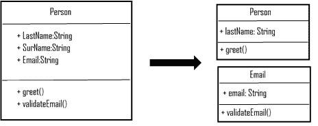

上述类图描述了一个**Person**类有两个职责：一个职责是用用户的姓氏或姓问候用户，另一个职责是验证电子邮件。如果我们需要在**Person**类上应用 SRP，我们可以将其分为两个；**Person**有一个问候方法，而**Email**有电子邮件验证。

SRP 不仅适用于类级别，也适用于方法、包和模块。

# 开放和封闭原则 – SOLID

面向对象编程的开放和封闭原则建议，面向对象的软件实体，如类、方法或函数以及模块，应该对扩展是开放的，但对任何修改是封闭的。

想象一个你永远不会更改的类，并且任何新功能都只能通过添加新方法或子类，或者通过重用现有代码来添加，因此我们可以防止对现有代码或功能引入任何新缺陷。

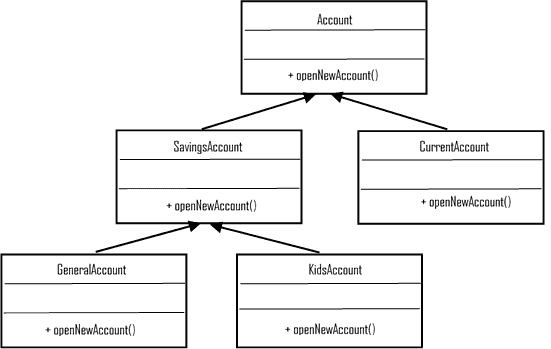

上述类图展示了在**Account**类及其子类上应用开放和封闭原则。账户可以是任何类型，如储蓄或活期。**SavingsAccount**可能被分类为**GeneralAccount**、**KidsAccount**等，因此我们可以强制 Account 和其他子类对增强是可用的，但对修改是封闭的。

开放和封闭原则带来了代码无需更改、不引入任何新缺陷的好处，但可能存在一个缺点，即现有的缺陷从未得到解决。

# 李斯克替换原则（LSP）- SOLID

这个原则指出，任何子类都不应该破坏父类的类型定义，换句话说，派生类应该可以替代其基类。

首先，让我们了解替代性原则的违反，然后我们看看如何通过使用我们之前关于账户类作为 LSP 是 OCP 主要启用者的例子来解决这个问题：

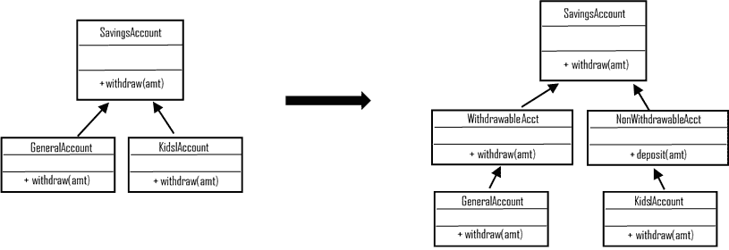

假设从儿童账户的提款是不允许的，与普通账户不同。正如你在前面的类图中看到的，儿童账户类中的*withdraw*方法违反了 LSP，因此通过引入从**SavingsAccount**类继承的其它可提款和非提款类来处理不可提款行为，我们可以消除这种违反，并且子类不会改变基类的行为：

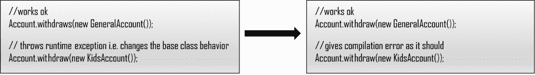

因此，**SavingsAccount**的行为在继承给**KidsAccount**时被保留。前面的代码片段证明了这一点。

# 接口分离原则（ISP）- SOLID

想象一下，你正在实现一个名为 pets 的类的接口，编译器抱怨你的**Cat**类中没有包含 bark 方法；这很奇怪，不是吗？

ISP 建议“任何类的接口都不应该强迫客户端包含任何对该客户端来说不必要的方 法”；在我们的例子中，**Cat**不需要实现 bark 方法，这是**Dog**类的专属：

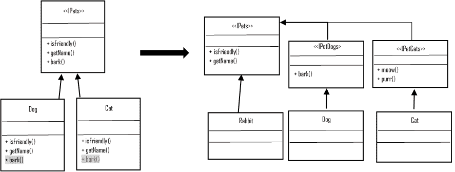

前面的图描述了 ISP 的违反以及如何通过将**<<IPets>>**接口拆分来表示**Cat**和**Dog**接口来消除这种违反。

# 依赖倒置原则（DIP）- SOLID

DIP 强制执行以下两点：

+   任何高级模块都不应该依赖于低级模块，而两者都应该依赖于抽象模块

+   模块的抽象不应依赖于其实施或细节，而实现应依赖于抽象

请参考前面的*接口分离原则（ISP）- SOLID*部分，以及示例类（图 3.5）Pets 类及其抽象类。**Dog**和**Cat**依赖于抽象（接口），并且任何对底层实现的任何更改都不会影响其他实现。

# 其他常见设计原则

其他常见原则如下；然而，每个原则的详细内容不在本章的范围内，如果您需要了解更多关于这些原则的信息，请参考其他材料：

+   封装

+   总是封装你认为迟早会改变代码

+   组合优于继承

+   在某些情况下，您可能需要在运行时更改类行为，并且这些情况更倾向于组合而不是继承

+   为接口编程（而不是实现）

+   为代码带来灵活性，并且可以与任何新的实现一起工作

+   **一般责任分配软件模式**（**GRASP**）

+   指导如何分配协作对象的责任

+   **不要重复自己**（**DRY**）

+   通过适当抽象公共代码到一处来避免代码重复

+   **单一层抽象原则**（**SLAP**）

+   方法中的每一行都应该处于相同的抽象级别

# 面向对象设计模式

面向对象设计模式解决了许多常见的软件设计问题，如下所述，建筑师每天都会遇到：

+   寻找合适的对象

+   确定对象粒度

+   指定对象接口

+   指定对象实现

+   面向接口编程，而非面向实现

+   利用重用机制

在本节中，我们将讨论一些常见问题以及设计模式如何解决这些问题，并详细介绍面向对象设计模式。

我们可以将模式分为三种类型：创建型、结构型和行为型。在我们继续详细讨论之前，请参考本章末尾的表格，该表格以简单参考的形式描述了模式和其类别。

# 创建型设计模式

创建型模式旨在提倡一种更好的创建对象或类的方法，其重点如下：

+   抽象类实例化过程

+   定义创建、组合和表示对象的方式，并从涉及系统中隐藏实现细节

+   强调避免硬编码一组固定的行为，而是定义一组较小的核心行为，这些行为可以组合成任意数量的（复杂）集合

创建型设计模式有两个基本特征：一是它们封装了关于系统使用哪个具体类的知识，二是它们隐藏了这些类的实例是如何创建和组合的。

类创建型模式使用继承进行实例化，而对象创建则委托给另一个对象。

下一节将处理每个模式，其一般结构和在大多数情况下的示例实现图。

# 工厂方法（虚拟构造函数）

此模式建议让子类实例化所需的类。工厂方法定义了一个接口，但实例化是由子类完成的：

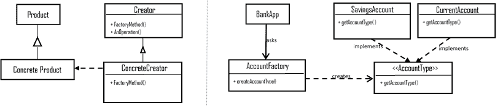

上述结构描述了一个工厂方法，应用程序使用工厂来创建具有接口的子类型。

使用此方法的优点如下所示：

+   **松耦合**：将应用程序与类及其子类分离

+   **定制钩子**：工厂方法为子类提供了一个提供对象扩展版本的钩子

使用这种方法的副作用是它创建了并行类层次结构（相互镜像结构），因此我们需要使用智能子模式或延迟识别状态变量模式以最佳方式来结构化。

# 抽象工厂（套件）

抽象工厂模式旨在提供接口，如果我们想创建相关或依赖对象的家庭，但又不明确指定它们的具体类：

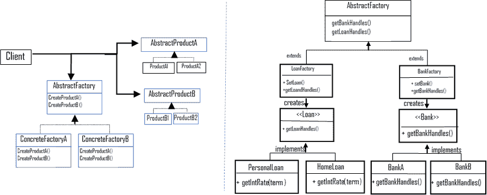

上述类图展示了**抽象工厂**类结构和为结合来自两个不同组（**<<Bank>>**和**<<Loan>>**）的不同集合（异构）产品而实现的应用程序的抽象工厂模式实时实现。

其好处如下：

+   隔离具体类

+   使交换产品族变得容易

+   促进产品之间的一致性

影响如下；支持新产品类型是困难的。

# 建造者

建造者旨在将复杂对象的构建与其表示分离，以便相同的构建过程可以创建不同的表示。换句话说，使用此模式以逐步方式通过简单对象简化复杂对象的构建：

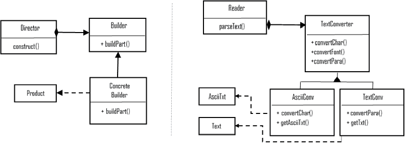

类图展示了典型的建造者模式结构和**建造者**模式的示例实现类。**建造者**（**TextConverter**）是一个抽象接口，用于创建产品页面的部分。**具体建造者**（**AsciiConv**，**TexConv**）通过接口实现构建和组装部分，**导演**（**Reader**）通过建造者接口构建对象，而**产品**（**AsciiTxt**，**Text**）是正在构建的复杂对象。

好处如下：

+   允许更改内部表示并定义新的建造者类型

+   隔离构建和表示的代码

+   提供对构建过程的更精细控制

影响如下：

+   导致为每种产品类型创建一个单独的具体建造者

+   导致可变的**建造者**类

# 原型

原型模式建议复制或克隆现有对象，并在需要时对其进行定制，而不是创建新对象。当系统应独立于其产品的创建、组合和表示时，选择此模式：

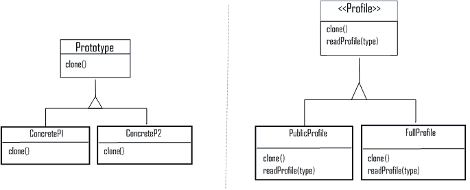

我们可以在运行时创建**PublicProfile**（有限信息）或**FullProfile**的副本。这两个类共享一些状态组合，因此将其设计为原型是很好的。

让我们看看它的好处：

+   在运行时添加和删除产品

+   通过改变值和结构来指定新对象

+   减少子类数量

+   动态类配置到应用程序中

影响是，每个子类都必须实现克隆操作，并且无法克隆循环引用类。

# 单例

此模式建议创建一个实例，并提供对创建对象的全球访问点：

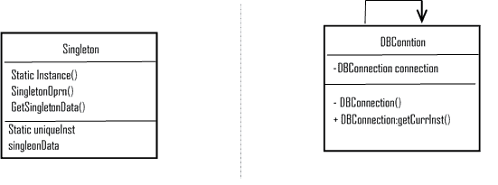

前面的图中数据库连接旨在作为单例，并为它的唯一对象提供一个获取器。

这里是其优点：

+   控制对唯一实例的访问

+   减少命名空间

+   操作和表示的细化灵活性

+   比类操作更灵活

影响如下：

+   在整个应用程序生命周期中携带状态，为单元测试创建额外的开销

+   一定程度违反单一职责原则

+   通过使用单例作为全局实例，它隐藏了应用程序的依赖关系；相反，它应该通过接口来暴露

# 结构设计模式

结构模式提供了根据面向对象设计原则组合类和对象以形成更大结构的指导方针。

结构类模式使用继承来组合接口或实现，而结构对象模式提倡组合对象和实现新功能的方法。

结构设计模式的一些关注领域如下：

+   提供不同接口的统一抽象（适配器）

+   在运行时更改组合并提供对象组合的灵活性；否则，使用静态类组合是不可能的

+   通过共享对象确保效率和一致性

+   动态添加对象责任

以下部分将描述每个结构模式，以及标准结构和示例实现结构图。

# 适配器类（包装器）

将一个类的接口转换为客户端想要的另一个接口。换句话说，适配器使异构类能够协同工作：

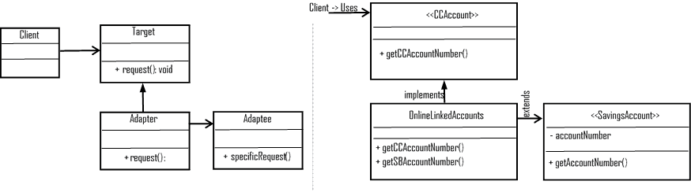

前面的类图描绘了一个名为**OnlineLinkedAccounts**的适配器，它采用储蓄账户的详细信息和一个目标接口**信用卡详情**，并将结果组合起来显示两个账户号码。

# 适配器（对象）

适配器对象依赖于对象组合，当我们需要使用几个现有的子类时，我们可以使用对象适配器来适配父类的接口：

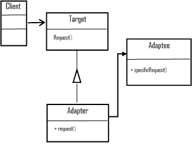

前面的图描绘了**适配器**的正式结构。

这些是优点：

+   通过模拟应用程序不同部分的行为，在开发和测试期间节省时间

+   为具有相似行为的新功能提供易于扩展

+   允许单个适配器与多个适配者一起工作（适配器对象）

影响如下：

+   导致类之间不必要的代码重复（较少使用继承类功能）

+   可能会导致嵌套适配以到达更长的链中的目标类型

+   使覆盖适配者行为更困难（适配器对象）

# 桥接（处理/主体）

桥接模式的目标是将抽象与其实现解耦，因此抽象和实现是独立的（不是在编译时绑定，因此不会影响客户端）：

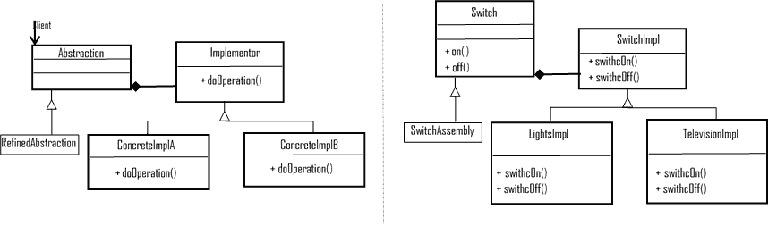

好处如上所述：

+   将接口与实现解耦

+   在运行时配置抽象的实现

+   消除了编译时依赖

+   改进了可扩展性

+   从客户端隐藏实现细节

影响是，引入了一定程度的复杂性。

# 组合

**组合**对象让客户端可以统一地对待单个对象和对象的组合。**组合**将对象层次表示为树结构。

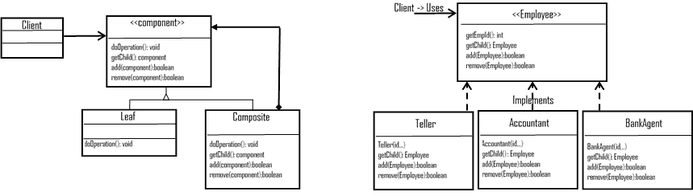

前面的图示描述了**组合**模式的标准结构和部分-整体层次结构的实现（代理的员工部分、**会计**和出纳员），以及对于**客户端**，所有对象都是**组合**的，并且结构统一。

这些是好处：

+   它通过隐藏复杂的通信（叶或组合组件）简化了客户端代码

+   添加新组件更容易，并且当添加新组件时，客户端不需要更改

影响如此之大，以至于它使得设计过于通用和开放，因为没有限制向组合类添加任何新组件。

# 装饰器

装饰器模式动态地为对象附加额外的责任。它提供了一种替代方法（通过组合）来子类化和在运行时扩展对象的功能。

此模式通过包装原始类来创建一个装饰器类，以提供额外的功能，而不会影响方法签名。

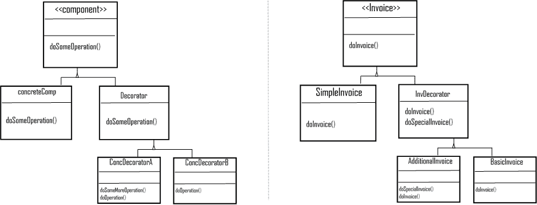

观察前面的图示，因为它动态（运行时）展示了通过组合扩展的发票功能

让我们列出好处：

+   它减少了升级所需的时间

+   它简化了从目标类增强功能，并将行为纳入对象中（改变类责任，而不是接口）

影响如下：

+   它倾向于引入更多类似的对象

+   由于它在运行时添加功能，因此会导致调试困难

# 外观

外观模式建议提供一个高级接口，该接口统一了子系统接口集，因此简化了子系统的使用。

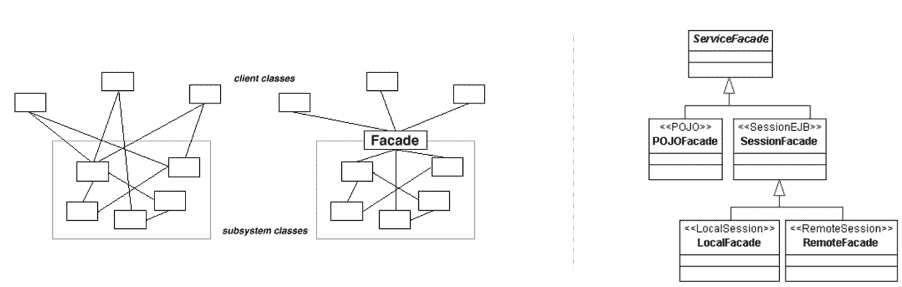

如前图所示，服务外观的示例实现，会话子系统与会话外观（本地和远程）统一。

让我们看看它的好处：

+   它促进了松散耦合（客户端和子系统之间）

+   它隐藏了子系统对客户端的复杂性

影响如此之大，以至于它可能导致外观检查子系统结构是否发生变化。

# 享元

**享元**建议使用大量细粒度对象的共享支持。我们可以使用**享元**模式来减少创建的对象数量（通过共享），从而减少内存占用并提高性能。

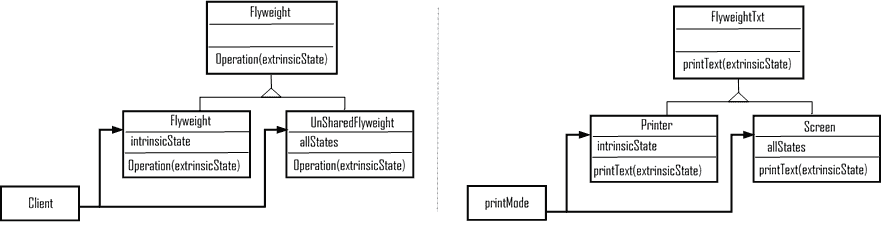

上述图展示了**享元**模式的一般结构和示例实现。考虑一个在打印机和屏幕之间共享的巨大对象；**享元**是一个很好的选择，也可以被缓存（例如，用于打印多份）。

这里是好处：

+   由于减少了实例总数（通过共享对象），它导致良好的性能。

+   它使得对象缓存实现变得容易

影响如此之大，以至于它可能会引入与传输、查找或计算外部（外部的）状态相关的运行时成本。

# 代理

代理模式建议提供一个占位符（代理）来控制另一个对象并获取对其的访问。这对于对象的延迟加载（直到需要使用时才创建和初始化）是最合适的。

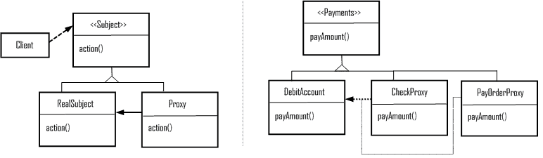

上述图展示了支付类代理模式的示例实现，支付可以是支票或汇票。然而，实际的访问将是到**DebitAccount**对象，因此**PayOrderProxy**和**CheckProxy**都是 Debit Account 的代理。

以下是一些好处：

+   它在访问对象时引入了正确级别的间接性（位于不同空间的对象的抽象）

+   按需创建对象

+   写时复制（如果未修改，可能减少重对象的复制）

影响如此之大，以至于它可能会因为间接性而使某些实现效率降低。

# 行为模式

行为模式为在对象之间分配责任提供了指导。这确实有助于实现算法以及类和对象之间的通信。

行为模式关注以下特性：

+   对象和类之间的通信

+   描述复杂的控制流；软件编程中的控制流（否则，在运行时很难跟踪）

+   强制使用对象组合而不是继承

+   同伴对象之间的松散耦合，同时，它们通过间接性相互了解

+   在对象中封装行为并将请求委托给它

有各种设计模式可用于强制执行上述行为焦点和特性。在本节中，我们将看到这些行为模式的详细信息。我们还提供了一些模式的示例实现结构图。

# 责任链

此模式建议通过使对象（多个）能够处理请求来避免将客户端对象（请求的发送者）与接收对象耦合。

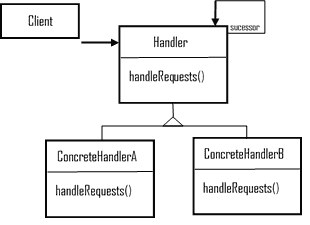

上述图展示了责任链的典型结构；处理者是定义请求的接口，并可选择表达后继者，包括可以处理请求的具体处理者，如果需要，可以转发请求。

这里列出了好处：

+   减少了耦合（对象不知道哪些其他对象处理请求）

+   在责任分配（对象）方面有更多的灵活性

影响是，请求处理器之间没有握手，因此无法保证其他对象处理请求，并且它可能在不被注意的情况下从链中脱落。

# 命令（动作/事务）

这个模式建议将请求封装为对象，用不同的请求参数化客户端；它可以放在消息队列上，可以记录，并支持撤销操作。

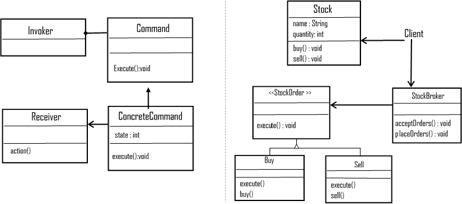

上述图示描述了命令模式的结构以及股票经纪人应用程序类的示例实现。**<<StockOrder>>** 接口是一个**命令**，**Stock** 具体类创建请求。**Buy** 和 **Sell** 是实现 **<<StockOrder>>** 的具体类。**StockBroker** 是调用者，其对象根据接收到的类型执行特定的命令。

这里是它的好处：

+   对象封装有助于部分更改请求（通过更改单个命令）而不会影响其余流程

+   将调用对象与实际执行动作的对象分离

+   容易添加新命令，而不会对现有类造成任何影响

影响是，随着时间的推移或取决于命令的数量（具体命令实现），类和对象的数量会增加。

# 解释器

这个模式建议定义语法以及使用表示的解析器，以便系统可以解释任何给定语言的句子。

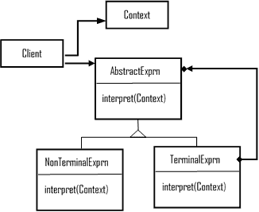

抽象表达式或正则表达式声明解释操作，终端表达式或字面表达式实现语法中的符号，而非终端表达式（选择、序列、重复）在语法中有非终端符号。

让我们看看它的好处：

+   容易更改和扩展语法

+   实现语法同样简单

+   有助于引入解释表达式的新方法

+   影响

+   为复杂的语法引入了维护开销

# 迭代器（光标）

这个模式建议提供一个方法，以顺序访问聚合对象的元素，同时隐藏底层实现。

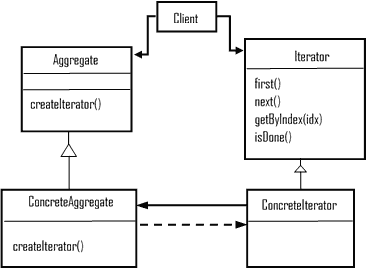

上述图示描述了迭代模式的结构，其中迭代器接口定义了遍历方法，具体的迭代器实现了接口。聚合定义了一个创建迭代器对象的接口，而具体的聚合实现了聚合接口以创建对象。

这里是它的好处：

+   它支持聚合遍历中的变化

+   迭代器简化了聚合接口

+   它可能包含空迭代器，并有助于更好地处理边界条件

+   影响

+   它可能引入额外的维护成本（多态迭代器的动态分配）

+   它可能具有特权访问权限，因此引入了定义新遍历方法在迭代器中的复杂性

# 中介者

**中介者**模式提倡定义封装对象之间交互的方式，而不依赖于彼此的显式引用。

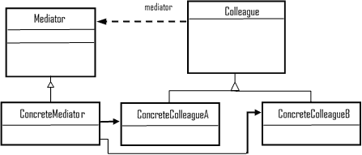

上述图示是**中介者**模式的典型结构，其中**中介者**或对话导演定义了一个与其他同事对象通信的接口；具体中介者通过协调同事对象来实现协作行为。

让我们看看它的好处：

+   限制子类化（通过本地化行为并限制行为分布到几个其他对象）

+   强制同事对象之间的解耦

+   简化对象协议（将多对多交互替换为一对一）

+   提供关于对象如何交互的明确说明

影响是集中控制，导致系统更加复杂和单一。

# 备忘录

此模式建议捕获和外部化对象内部状态，而不违反封装原则；因此，我们可以恢复捕获的对象。

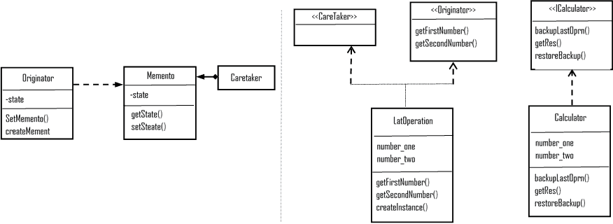

上述图示展示了备忘录模式的结构以及一个计算器应用的示例实现。**保管者**接口帮助恢复在**<<计算器>>**具体类中处理的前一个操作。

这些是它的好处：

+   它通过暴露仅限于发起者的信息来保持封装边界

+   它简化了发起者

影响如下：

+   备忘录实现可能成本高昂，因为它需要复制大量数据以存储到备忘录中

+   它可能难以实现（通过某些编程语言）并确保只有发起者可以访问备忘录的状态

+   它可能在保管者实现中产生隐藏的存储和维护成本

# 观察者（依赖者/发布/订阅）

**观察者**模式建议当一个对象改变状态时，它通知其依赖者并自动更新。当实现需要一对多依赖关系时，您会想使用此模式。

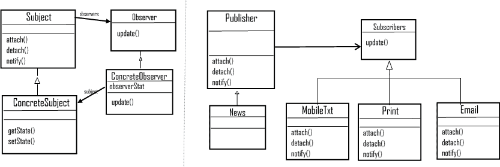

上述图示展示了**观察者**模式的结构以及一个出版物应用的示例实现；每当发生事件时，订阅者都需要被告知。订阅者有不同的发布模式（短信、印刷和电子邮件），并且未来可能还需要支持新的模式，因此最合适的选择是**观察者**，正如我们刚才看到的。

让我们来看看它的好处：

+   实现了通信的轻松广播

+   支持对象之间的松散耦合，因为它能够将数据发送到其他对象，而无需对主题进行任何更改

+   主题和观察者之间的抽象耦合（观察者的变化不会影响主题）

+   可以随时添加或删除观察者

影响如下：

+   意外的或非预期的更新对系统影响很大，因为它会级联到下层的观察者

+   可能导致性能问题

+   独立的通告可能导致不一致的状态或行为（没有握手）

# 状态（状态的对象）

这些允许对象在其内部状态变化时改变其行为，并看起来像类变化一样。

当一个对象的行为依赖于其状态，并且运行时状态的变化依赖于该状态时，使用状态模式。

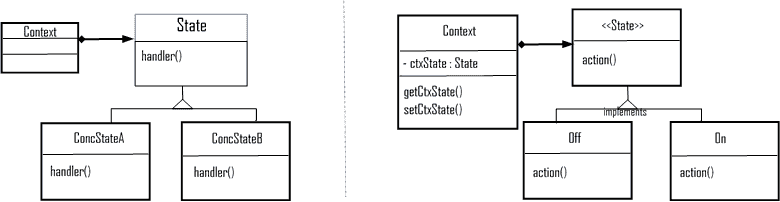

该图展示了状态模式的结构和示例实现；上下文类携带状态，**Off**和**On**类实现状态接口，以便上下文可以使用每个具体类的开/关操作。

列出的好处如下：

+   建议将特定于状态的行为本地化，并为不同状态划分行为（通过子类定义可以轻松添加新状态和转换）

+   使得状态转换明确

+   状态对象是可共享的

影响是，它可能使添加新的具体元素变得困难。

# 策略（策略）

策略模式，也称为策略，定义了一个算法家族或一组算法，封装每个算法，并使它们可互换。策略允许算法独立于使用它的客户端变化。当一组类仅在行为上有所不同时，最好将算法隔离在单独的类中，并提供在运行时选择不同算法的能力。

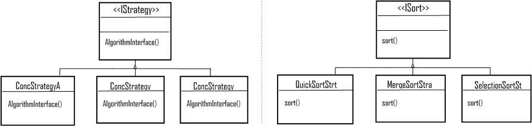

上述图显示了策略结构，以及排序算法（作为一个家族）的实现，它取决于输入的量，然后客户端可以使用预期的算法从具体的策略排序类中。

好处如上所述：

+   实现了开闭原则

+   实现了大规模的可重用性

+   消除了条件语句（导致代码清晰、职责明确、易于测试等）

影响如下：

+   客户需要了解不同的策略以及它们之间的差异

+   策略和上下文之间的通信开销

+   对象数量增加

# 模板方法

这表明提供算法操作的框架，并将一些步骤推迟到子类中。模板方法允许子类在不改变算法结构的情况下重新定义定义算法的几个特定操作。

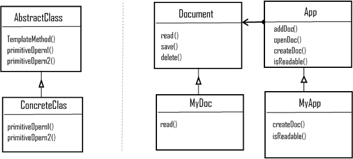

以下是一些好处：

+   代码重用的基本技术

+   允许在委托实现特定部分到实现对象的同时部分实现业务流程（在创建原型时灵活）

+   帮助实现好莱坞原则（反转控制结构，*别叫我们，我们会叫你*）

影响如下：

+   流程的顺序可能导致混淆

+   维护成本高，对代码的任何更改影响都很大

# 访问者

访问者模式表示对对象执行的操作。它允许我们定义一个新操作，而无需更改它所操作的类元素。简单来说，我们使用访问者类来根据访问者的变化来改变算法的执行。

>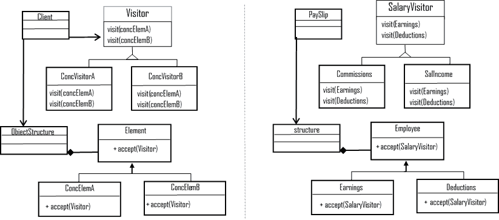

这里是它的好处：

+   在对象结构上添加新操作很简单且容易（通过添加一个新的访问者）。

+   访问者将无关操作分离并聚集相关操作。

影响如下：

+   当添加一个新的具体元素类时，访问者类层次结构可能难以维护。

+   实现通常迫使提供公共操作以访问元素的内状态（导致其封装性受损）。

# 并发模式

在软件范式中，软件应用能够同时执行多个任务（并发）是一个关键因素；大多数软件应用都有某种形式的并发。考虑到这一点，让我们简要地讨论一些并发模式，因为本书的其他章节详细介绍了许多（并发）相关模式。

# 并发设计模式

在许多情况下，自动化系统可能需要同时处理许多不同的事件，这被称为并发。面向对象编程提供了处理并发的充分手段（抽象、可重用性、分布式持久数据的共享、并行执行等）。本节将简要介绍一些并发模式。

# 生产者-消费者

生产者-消费者模式解耦了生产与消费数据的过程。该过程可能以不同的速率处理数据。生产者-消费者模式的并行循环可以分为两类：一类是生产数据，另一类是消费生产出的数据。

数据队列用于在生产者/消费者设计模式中的循环之间传递数据。这些队列在生产者和消费者循环之间提供数据缓冲。

# 活动对象

活动对象模式强制将方法执行与方法调用解耦，从而增强了并发性并简化了对驻留在它们（自己的）控制线程中的对象的同步访问。

我们使用此模式（实现同步）来处理多个客户端请求，以提高其服务质量。

# 监视对象

此模式建议对并发方法执行进行同步，以确保一次只有一个方法在对象中运行。监视器还允许对象的方法以协作的方式执行预定的序列。

我们使用此模式（实现同步）当多个线程调用修改对象内部状态的方法时。与活动对象相反，监视对象属于被动对象组；监视器没有自己的控制线程。

# 并发架构模式

**半同步**/**半异步**：在并发系统中，同步和异步服务处理的解耦带来了编程的简单性，而不会降低性能。半同步/半异步引入了两个相互通信的层，一个用于同步服务处理，另一个用于异步服务处理，中间有一个排队层。

此模式使得同步和异步处理服务能够相互通信，并帮助这些过程分解为层次。

**领导者**/**跟随者**：如果我们需要一个高效的并发模型，其中多个线程需要轮流共享一组检测、解复用、调度和处理事件源服务请求的事件源，那么在我们的系统中实现领导者/跟随者模式是最好的选择。

此模式的目的是提供一个优雅的解决方案，以同时处理多个事件，例如在多线程服务器应用程序中。

# 摘要

设计模式自 1992 年以来已经发展，即使在今天，在解决许多软件设计问题时，设计模式这种经过验证的技术和实践仍然是不可避免的。不难将任何特定的模式视为一种可以分析、实现和重用的解决方案或技术，但很难描述它解决的问题以及它最佳适用的情况。了解模式的目的至关重要，因为它有助于理解任何给定系统的现有设计。

通过本章，我们探讨了面向对象设计（OOD）的关键要素，包括抽象、封装、模块化和层次结构，以及一些额外的项目，如类型、并发性和持久性。

此外，我们还讨论了设计原则，希望读者能够对面向对象原则为面向对象软件设计师提供的帮助有一个*SOLID*的理解。我们相信，SOLID 原则是任何想要进入软件设计和开发领域的人的基本培训材料，即使在当今世界也是如此。

我们简要介绍了面向对象设计的三个广泛类别：创建型、结构型和行为型。我们还讨论了每种模式的益处和影响，以便读者能够轻松地描述它解决的问题以及它作为软件解决方案的最佳适用环境。

我们还增加了一个部分，希望读者能够对并发（设计和架构）模式有一个公平的介绍。

# 参考资料

以下表格是面向对象软件设计模式的交叉引用：

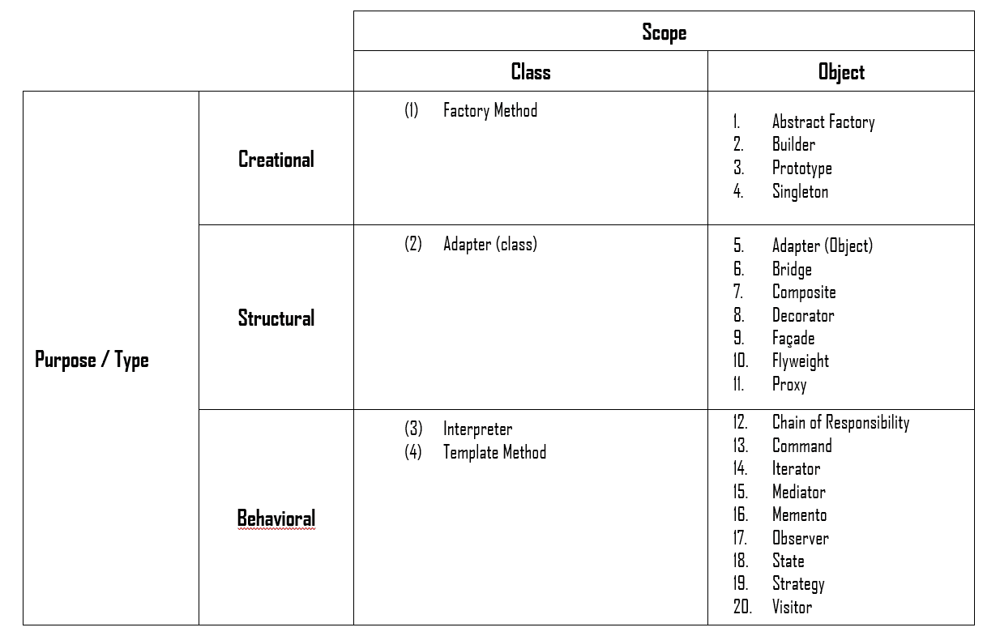

以下是一些参考书籍*：*

+   《设计模式：可复用面向对象软件元素》by Erich Gamma, Richard Helm, Ralph Johnson 和 John Vlissides

+   *《面向对象分析与设计：应用篇》（第 2 版）* by Grady Booch

本章的其他参考资料：

+   [`www.oodesign.com/`](http://www.oodesign.com/)

+   [`www.tutorialspoint.com/design_pattern`](https://www.tutorialspoint.com/design_pattern)

+   [`sourcemaking.com/design_patterns/`](https://sourcemaking.com/design_patterns/)

+   [`www.blackwasp.co.uk/GofPatterns.aspx`](http://www.blackwasp.co.uk/GofPatterns.aspx)

+   [`www.mif.vu.lt/~plukas/resources/DPBook/`](http://www.mif.vu.lt/~plukas/resources/DPBook/)

+   [www.dzone.com](http://www.dzone.com)

+   [`www.javaworld.com`](http://www.javaworld.com)

+   [`sudo.ch/unizh/concurrencypatterns/ConcurrencyPatterns.pdf`](https://sudo.ch/unizh/concurrencypatterns/ConcurrencyPatterns.pdf)

+   [`www.cs.wustl.edu/~schmidt/POSA/POSA2/conc-patterns.html`](http://www.cs.wustl.edu/~schmidt/POSA/POSA2/conc-patterns.html)

+   [`en.wikipedia.org/wiki/Concurrency_pattern`](https://en.wikipedia.org/wiki/Concurrency_pattern)
