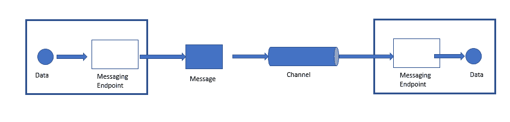

# 企业集成模式

本章将涵盖企业集成模式的更深入话题。这些话题包括：

+   集成模式的需求

+   企业中的集成场景

+   企业集成的主要挑战

+   开始使用消息模式

# 集成模式的需求

当今的企业由成千上万的应用程序组成。其中许多是商业化的现成应用；一些是内部应用，还有一些是长期作为企业一部分的遗留应用。尽管有数千个应用程序，但员工不可能使用单独的控制台分别访问每一个。

为什么企业需要这么多应用程序？这个问题的答案是，每个企业都有数千个业务功能，这些功能无法由单个应用程序完成。即使是像 ERP 这样的应用程序，与企业的实际需求相比，也只能执行非常有限的功能。

多个应用程序的另一个原因是，将各种功能分散到多个应用程序中可以确保更高的业务连续性水平，即即使一个应用程序失败，其他应用程序也会继续运行，而不会阻碍业务功能。

市场上的供应商也已经学会了开发专注于满足特定业务功能需求的应用程序的艺术。然而，随着各种业务功能动态的变化，供应商们正试图将多个功能集成到一个单一的业务应用程序中。例如，许多计费系统应用程序开始整合额外的会计功能。简而言之，在当前情况下，无法为应用程序定义清晰的边界。

用户，如客户和合作伙伴，往往在关注底层应用程序参与执行功能时不太关心。所有这些参数都要求在企业的生态系统中的各种应用程序之间有一个适当的集成机制。在过去，集成仅限于组织内部存在的应用程序。

在当今的背景下，有许多新的范例，如社交媒体应用、基于物联网（IoT）的应用、基于云的应用、支持微服务的应用等，仅举一些突出的例子。为了实现无缝的数据共享并支持企业内部业务流程，企业必须确保所有应用程序都是集成的。不同类型的应用程序使得企业需要为其集成平台开发一套强大的功能，以便他们能够在当今敏捷企业的动态环境中保持竞争力，这些企业处于不断变化的状态，以满足客户的需求和期望。

企业集成没有捷径。这是一个非常广泛且难以处理的领域，但对于当今的企业来说是不可避免的。企业集成模式不提供任何现成的代码，可以用于集成应用程序。实际上，它们建议经过验证和测试的方法来解决企业集成问题。如果正确使用，企业集成模式可以帮助组织填补其集成愿景与实际实施之间存在的巨大差距。

在下一节中，我们将检查企业中需要集成的各种不同场景。

# 企业集成场景

集成的概念是一个非常广泛的领域。然而，企业中最常见的集成场景包括以下几种：

+   信息门户

+   数据复制

+   共享商业功能

+   面向服务的架构

+   分布式商业流程

+   商业对商业集成

根据业务性质和它们处理的领域，企业可能会有几种其他场景。现在我们将检查一些突出的集成场景。

# 信息门户

组织中的许多用户将需要访问多个应用程序以执行单一的商业功能。例如，人力资源专业人士可能需要访问多个应用程序，如人才招聘、薪酬和福利、学习和开发、人才品牌等，以提取与人才管理各个方面相关的详细信息。这种场景使得他们难以以适当的速度执行日常业务功能。这就是信息门户概念对他们有所帮助的地方。信息门户可以从不同的系统中获取信息，汇总并在单一视图中展示。简单的信息门户将显示屏幕划分为几个区域。每个区域将显示来自特定应用程序的数据。这些信息门户还具有根据用户在另一个区域选择的信息在某个区域提供钻取信息的功能。以下是一个信息门户的示例：

# 数据复制

在企业中，许多应用程序将拥有相同数据的副本。例如，客户详细信息可能存在于订单管理系统、计费系统、广告和促销系统中等。因此，如果在一个系统中更新了地址，则必须确保在其他系统中也进行更新。复制是确保这种所需一致性的技术之一。数据复制是如何进行的？许多组织定义了政策，确保数据在规定的时间间隔内持续同步和复制，以确保所有系统上的数据保持最新。另一种技术是将数据导出到文件中，然后导入到其他系统中。另一种称为**面向消息的中间件**的技术用于将数据记录嵌入到消息中，并将它们发送到其他应用程序以进行同步目的：

# 共享业务函数

如果同一组数据存储在多个系统中，会导致数据冗余。用于处理这些数据的功能（如前例中的客户地址）可以一次实现为共享业务函数，并作为服务暴露给具有相同数据集的其他系统。

**共享业务函数**可以用作良好的功能来替换冗余数据。例如，让我们以客户地址为例，该地址存储在组织内的多个系统中。而不是在多个系统中存储相同的数据，一个名为`GetCustomerAddress`的业务函数可以被系统用来从其他系统中获取数据，而不是永久存储它。

使用冗余数据与共享业务函数之间的权衡基于几个标准。定义这些标准的参数包括以下内容：

+   对数据所在系统的控制程度（在某些情况下，调用`共享`函数可能比将数据加载到数据库中更耗费资源）

+   考虑的数据变化率（例如，客户地址可能非常频繁地需要，而可能很少改变）

以下是一个展示使用`共享`函数的图示：

# 面向服务的架构

我们之前讨论的共享业务函数通常被称为*服务*。服务通常是一个定义良好的函数，它对所有系统普遍可用，以执行特定操作。这些服务可供其他作为服务消费者的系统使用。一旦创建了一组服务，确保它们以适当的方式维护并提供给其他系统就非常重要。服务管理的两个重要方面如下：

+   **服务发现**：所有服务都通过一个集中的服务目录提供，其他应用程序可以通过该目录发现它们

+   **服务协商**：每个服务必须以这种方式描述其接口，使得企业中的其他应用能够与他们协商并建立通信合同。

**面向服务**的**架构**（**SOA**）也是一种应用集成的机制，这反过来又模糊了集成和分布式应用之间的界限。SOA 在第七章，《面向服务架构（SOA）》中进行了详细讨论。描述 SOA 的框图如下：

面向服务架构的另一个重要方面是**企业服务总线**（**ESB**）的概念，它以松耦合的方式提供 SOA 发送者和接收者组件之间的连接性。

# 分布式业务流程管理

正如我们之前讨论的，一个单一的商业功能可以分布在企业中存在的几个应用中。在这种情况下，确保各种应用之间的协调非常重要。这可以通过实施业务流程管理系统来实现。业务流程管理系统将与属于特定商业功能的全部相关应用协调，并确保无缝执行。然而，在这个背景下，重要的是要记住，业务流程管理和 SOA 之间存在一条非常模糊的界限。始终存在所有服务都作为服务提供，而一个业务流程功能可以作为应用程序提供，以便通过 SOA 访问所有服务的可能性。分布式流程管理系统的图示如下：

# 商业对商业集成

如本章开头所述，当今的企业需要与其生态系统之外的多个组件进行交互，例如客户、合作伙伴等。这些外部元素需要访问企业的一部分应用。例如，在产品组织的案例中，将会有几个合作伙伴实施产品的一部分服务。在这种情况下，合作伙伴能够访问一些关键的企业应用以了解新产品功能、更新、学习资源、产品用户论坛和群组非常重要。反之亦然，企业也严重依赖某些外部组织的一些功能，因此确保某些外部应用向企业传输数据非常重要。这些场景引发了需要企业对企业集成的情形。这并不是一个像企业内部应用集成那样非常直接的情况。这主要是因为在企业对企业集成时，还需要考虑许多其他方面，如安全性、法律影响和治理，以实现顺利集成。描述企业对企业集成场景的图形如下：

在下一节中，我们将分析在集成企业应用时存在的各种挑战。

# 企业集成的主要挑战

与企业应用集成相关的一些主要挑战如下：

+   **网络速度慢且不可靠**：企业集成应用需要将数据从一个应用传输到另一个应用。这些应用可能位于不同的州、国家或大陆。在这种情况下，数据需要通过 LAN、WAN 或两者的组合进行传输。通过不同的网络拓扑和协议传输数据引入了显著的传输延迟和其他类型的干扰，这些干扰成为企业应用集成的绊脚石。

+   **异构应用平台**：在集成多个应用时，重要的是要记住每个应用都将有自己的平台和操作系统。为了确保这些应用之间无缝集成，必须确保数据在应用之间以所有相关应用都能理解的形式进行传输。为了实现这一点，应该有一个中间件组件，将数据转换为所有应用都能理解的通用格式。

+   **应用更新和升级**：集成的应用将因系统更新而不断进行升级。在某些情况下，某些系统升级将对整体应用引入重大变化。这可能会影响所有参与集成的其他应用。对于集成解决方案来说，最小化集成中各个应用之间的依赖关系非常重要。实现这一目标的一种方法是通过确保应用之间的松散耦合。

+   **安全性**：在医疗保健和保险等领域的某些应用受到严格的网络安全政策和框架的约束。如果这些应用参与集成过程，遵守安全指南非常重要。否则，将导致违反法律指南。

用于克服上述挑战的一些关键技术如下：

让我们简要讨论这些技术。

# 文件传输

在这里，文件是需要在集成的应用之间传输数据的基本模式。一个应用将对文件执行写操作，该文件将被另一个应用读取。然而，为了成功执行并产生必要的影响，涉及的应用就以下关于文件的参数达成一致非常重要：

+   文件名和位置

+   文件格式

+   写入和读取文件的时间

+   文件将如何被删除

# 共享数据库

在这种情况下，数据库成为集成发生的点。需要集成的多个应用共享一个共同的数据库模式，该模式位于同一个数据库中。这防止了重复数据存储，并防止了从应用之间进行数据传输的需求。

# 远程过程调用

在这种情况下，应用的集成是通过一个应用暴露的功能来实现的。其他应用作为远程过程远程访问这些功能。将功能作为远程过程调用的过程称为**远程过程调用**。远程过程调用是实时发生的，是一种同步通信。

# 消息传递

在这种情况下，应用的集成是通过消息传递来实现的。其中一个应用向一个所有其他应用都可以访问的消息通道发布消息。其他应用访问消息通道并在稍后的某个时间点获取消息。这里唯一的条件是，涉及的应用应该就消息通道和发送到通道的消息格式有一个预定义的协议。在下一节中，我们将深入探讨消息传递的概念以及企业应用如何通过消息传递的概念进行集成。在下一节中，我们将深入探讨各种消息传递模式。

# 开始使用消息模式

消息传递是一种可靠的连接应用程序的技术，它使用称为**消息**的包的概念。这些包被发送到通道，这些通道是逻辑路径，提供各种应用程序之间的互连。这些通道也称为**队列**。可以在通道中排队多个消息，并在同一时间点使多个应用程序可访问。在消息传递中，主要有两种类型的应用程序，它们是：

+   发送者/生产者

+   接收者/消费者

发送者是一个向通道发送消息的应用程序。接收者是一个读取发送到通道的消息的应用程序。消息传递是一种异步通信模式，这意味着接收者不必在消息到达通道后立即从通道中读取消息。

消息可以是任何类型的数据结构，例如数组、字符串或对象。每个消息包含两个部分：

+   标题

+   消息体

标题包含有关消息的元数据，例如发送者、接收者、时间戳等详细信息。这些信息由消息系统使用，但通常被应用程序忽略。消息体包含应用程序实际发送的数据。消息体被消息系统忽略，但被应用程序使用。

消息传递功能由一个称为**面向消息的中间件**（**MOM**）的专用软件应用程序提供。MOM 也称为**消息系统**。MOM 是确保消息在应用程序之间平稳传输所必需的。MOM 存在的一个主要原因是连接系统的网络不可靠状态。即使应用程序发送了消息，如果网络不正常，也不一定能够到达预期的目的地。MOM 有助于克服这种与网络相关的限制和其他限制，并确保消息在到达目的地之前会重复传输。以下图表展示了通过消息传递的应用程序通信：

消息传输涉及的五个步骤如下：

在这些步骤中的每一个，都会执行以下活动：

1.  **创建**: 在这一步，发送者或生产者添加标题和数据，创建消息

1.  **发送**: 在这一步，发送者将消息发送到通道

1.  **投递**: 在这一步，消息队列（MOM）将消息从发送者的系统移动到接收者的系统，使消息对接收者可用

1.  **接收**: 在这一步，接收者或消费者从通道中读取消息

1.  **过程**: 在这一步，接收者从消息中提取数据

在下一节中，我们将探讨在企业系统设计中使用的突出消息模式。

# 管道和过滤器模式

在许多情况下，单一事件可能触发一系列动作，每个动作将执行特定的功能。因此，管道和过滤器模式被用来处理需要复杂消息处理同时保持灵活性和独立性的情况。一个大任务被分解成一系列较小的、顺序的、独立的任务（过滤器），这些任务通过通道（管道）连接起来。管道和过滤器模式的图示如下：

每个过滤器都有一个简单的接口，它由一个接收、处理并将结果发布到输出管道的输入管道组成。管道的作用是将一个过滤器连接到下一个过滤器。在管道和过滤器模式中，所有组件使用相同的外部接口，因此它们可以存在于不同的解决方案中。这些解决方案可以通过不同的管道相互连接。提供管道和过滤器之间连接的连接出口称为**端口**。通常，每个过滤器有一个输入端口和一个输出端口。

# 消息路由模式

这种模式用于那些步骤的顺序执行可能并不总是可行的情况。在某些情况下，过滤器的输出可能需要根据某些标准或条件传递到几个管道之一。在这种情况下，会使用消息路由模式。描述消息路由模式的图示如下：

# 消息翻译器模式

在本章的开头，我们讨论了可能需要将某些第三方应用程序/合作伙伴应用程序集成到企业中的一些应用程序的场景。这些应用程序将使用不同的数据模型，有时可能使用完全不同的数据格式进行通信。对于当今敏捷的企业来说，使用能够通过将数据从一种格式转换为另一种格式来连接不同类型应用程序的模式是必要的。这就是**消息翻译器模式**发挥关键作用的地方。消息翻译器模式充当其他过滤器或应用程序之间的特殊过滤器，将数据从一种格式转换为另一种格式。描述消息翻译器模式的图示如下：

# 消息端点模式

企业应用通过消息通道发送消息来相互通信。但接下来需要解决的问题是需要有一个机制来帮助应用连接到消息通道。这对于发送应用发送消息和接收应用接收消息都是适用的。这就是消息端点模式出现的地方。消息端点充当消息系统的客户端，发送和接收应用可以使用它来发送和接收消息。消息端点代码对应用和 MOM 的客户端 API 都是可访问的。剩余的应用不知道关于消息格式、消息通道或它通过消息通信的其他应用的任何细节。它只知道它已经向另一个应用发送了一些数据，或者它将接收来自另一个应用的数据。消息端点代码接收数据，将其转换为消息，并发送到正确的消息通道。同样，在接收端，消息端点接收消息，提取内容，并将其交给应用。描述消息端点模式的图如下：

# 点对点通道模式

考虑一个应用使用消息进行远程过程调用的场景。在这种情况下，必须确保只有一个接收者执行调用。这就是**点对点通道模式**帮助我们的地方。如果通过点对点通道发送消息，它将确保只有一个接收者会收到消息。如果通道有多个接收者，只有其中之一能够接收到消息。如果有多个接收者尝试消费消息，通道将确保其中只有一个能够成功。但这并不阻止通道有多个接收者，并且它们可以同时接收多个消息。这里唯一的条件是只有一个接收者会收到特定的消息：

# 发布-订阅通道模式

这种模式将适用于使用消息来宣布事件的那些应用。事件的宣布将涉及同时向多个接收者发送消息。如果消息是在发布-订阅通道上发送的，消息的副本将被发送到每个接收者：

发布-订阅通道基本上就像一个广播机制。它有一个输入通道，该通道被分成几个输出通道，每个订阅者一个。当一个事件在通道中发布时，消息的副本被发送到与之相连的每个输出通道。每个输出通道只有一个订阅者。每个订阅者只能消费消息一次。这样，每个订阅者只能得到一次消息，一旦被消费，消息副本就会从通道中消失。

# 数据类型通道模式

如果通过一个通道传输多种类型的数据，区分各种数据格式就很重要。这就是数据类型通道模式派上用场的地方。数据类型通道模式的图示如下：

如果为每种类型的数据使用数据类型通道，特定通道上的消息将只包含相同类型的数据。发送者应该知道数据的类型，并通过适合该类型数据的适当通道发送它。接收者应该能够根据接收数据所在的通道知道数据的类型。

# 消息总线模式

在企业中，将存在几个不同的系统。这些系统应该能够相互通信和共享数据，以便企业能够无缝地运作。这就是消息总线模式派上用场的地方。消息总线模式的架构在以下图中展示：

如果各种应用程序通过消息总线相互连接，它允许它们通过消息无缝地通信。以下是一个消息总线的主要组件：

+   **通用数据模型**

+   **常用命令集**

+   **消息基础设施**：该组件允许各种系统通过共享的接口进行通信

消息总线概念与计算机中使用的通信总线概念非常相似。通信总线促进了计算机各个组件（如 CPU、内存、外围设备等）之间的通信。

# 命令消息模式

如果一个应用程序想要调用另一个应用程序提供的功能，最常用的方法是远程过程调用。但如果必须结合消息的概念使用远程过程调用，命令消息模式就非常有用。**命令消息**模式的图示如下：

命令消息是一种可靠地用于调用在另一个应用程序中运行的程序的消息。命令消息没有特定的类型。命令消息是嵌入命令的正常消息。

# 事件消息模式

几个应用程序通过事件相互通信。如果基于消息的事件通信发生，则使用事件消息模式。以下图示了事件消息模式：

在事件消息模式中，如果主题需要宣布一个事件，它将首先创建一个事件对象。然后，这个对象被封装在一个消息中，并通过一个通道发送。观察者将从通道接收事件并处理它。事件中的消息传递不会改变事件通知；它只是确保通知到达观察者。

# 请求-回复模式

当应用程序通过消息通信时，通常是单向通信。假设如果应用程序想要双向通信，那么将使用请求-回复模式。在请求-回复模式中，请求消息和回复消息将有自己的通道。请求-回复模式的图示如下：

# 基于内容的路由器模式

在许多企业中，单个功能分布在几个系统中。在这种情况下，确保消息通过包含该功能的每个系统非常重要。在这种情况下，基于内容的路由器模式非常有帮助。以下图示了基于内容的路由器模式：

基于内容的路由器模式检查消息的内容，然后根据消息中包含的数据将消息路由到正确的通道。消息路由的参数可能是以下之一：

+   某些特定字段中存在或不存在某些数据值

+   消息中某些字段的呈现或缺失

在内容路由器中，确保实现的路由功能易于维护非常重要。也可以将基于内容的路由器维护为一种规则引擎，该引擎根据一组预配置的规则计算目标通道。

# 消息过滤器模式

在许多场景中，我们可能会对接收某些促销消息/折扣消息感兴趣，例如来自一个你可能感兴趣购买产品的电子商务网站。但这可能不适用于所有消息。因此，在这种情况下，确保不希望的消息被阻止或过滤非常重要。在这种情况下，消息过滤器模式非常有用。以下图示了消息过滤器模式：

消息过滤器只有一个输出通道。如果消息中的数据与消息过滤器提到的特定输出标准匹配，则消息将被路由到输出通道，否则将被丢弃。

# 重新排序模式

当使用消息路由模式时，消息会根据某些标准或规则的满足情况进行路由。但是，当消息通过多个系统时，它们可能会出现顺序混乱。在这些情况下，**重排序器**模式就派上用场。描述重排序器模式的图示如下：

重排序器是一个有状态的过滤器，可以用来重新排序消息，以便它们可以按照特定的顺序发布到输出通道。重排序器包含一个内部缓冲区，用于存储一系列消息，直到获得完整的序列。顺序正确的消息会立即发布到输出通道。顺序不正确的消息将保留在内部缓冲区中，直到它们被放置在正确的顺序，然后发送到输出通道。重排序器只是确保消息的顺序，通常不会修改消息的内容。

# 轮询消费者模式

在某些情况下，应用程序可能并不总是准备好消费消息。在这种情况下，应用程序希望在开始消费消息之前达到一个准备就绪的状态。在这种情况下，轮询消费者模式非常有帮助。轮询消费者模式的图示如下：

在这个模式中，应用程序使用轮询消费者，它在准备好接收消息时进行调用。轮询消费者也被称为**同步接收器**。这是因为接收线程在接收到消息之前处于阻塞状态。大多数消息 API 都提供了一个`receive`方法，该方法会阻塞直到消息被投递。

# 通道适配器

如果应用程序通过消息传递进行通信，确保应用程序可以连接到消息系统以发送和接收消息是必要的。这就是**通道适配器**发挥作用的地方。描述通道适配器模式的图示如下：

通道适配器应该能够访问应用程序的 API 或数据，并根据这些数据在通道上发布消息。它还应该能够调用应用程序内的功能并接收消息。理想情况下，适配器充当消息系统的客户端。通道适配器通过应用程序提供的接口调用应用程序的功能。这有助于应用程序在拥有适当的通道适配器的情况下与消息系统保持集成。在下一节中，我们将关注移动集成模式，即用于将移动设备集成到企业系统中的模式。

# 移动集成模式

我们需要一个更快的方法来使移动设备与企业服务集成，这需要移动集成模式。当我们谈论移动服务与企业集成时，在集成过程中可能会出现两种主要可能性：

+   与企业某些功能集成的移动应用程序向企业系统发送请求消息，并得到相应的响应

+   企业系统向移动应用程序发送推送通知消息

以下图表显示了该流程：

# 请求-响应模式

为了定义请求-响应模式，必须确保在 ESB 中创建的企业服务中存在移动就绪的接口。此模式为在 ESB 架构中集成移动服务提供支持。一种专门为移动服务定制的适配器，称为**移动集成适配器**，有助于将移动应用程序与在 ESB 中运行的与移动相关的服务集成。以下图表展示了该移动集成涉及的主要步骤：

下面是如何进行集成的：

1.  作为第一步，移动适配器将传入请求直接发送到企业服务。

1.  然后，存在于 ESB 中的企业服务与所需的后端系统建立连接以处理传入请求。ESB 还与后端系统协作以获取响应。

1.  最后，ESB 将响应发送到移动适配器，然后适配器将响应回传给移动应用程序。

# 定义推送通知模式

如果企业应用程序想要向移动设备发送推送通知，则使用推送通知模式。定义推送通知涉及的步骤在以下图表中展示：

企业应用程序通常使用在移动集成服务器上运行的后端服务来将通知消息推送到设备。以下是该流程的主要步骤：

1.  企业应用程序使用 ESB 和移动后端服务向移动设备发送推送通知

1.  一旦 ESB 收到通知，它就调用移动后端服务向移动设备发送推送通知

1.  消息通过移动集成服务器传递，以到达移动应用程序和移动设备

在本章的开头，我们讨论了几种外部应用程序与企业系统集成的类型。在下一节中，我们将概述 API 管理模式。在本节中，我们将简要关注在架构中使用基于微服务/API 的设计概念时的集成方面。

# API 管理模式

API 管理模式通过 API 将应用程序与企业系统和其他基于云的服务集成。以下是 API 管理模式的主要组成部分：

+   API 管理门户

+   API 用户

+   企业服务

每个 API 服务的消费者首先向 API 管理门户发送请求。API 管理门户在向消费者发送响应之前与企业服务进行交互。API 使用行业标准的消息格式，例如，对于 Web 服务使用 SOAP，对于表示状态转移使用 XML 或 JSON。API 管理门户充当简单的代理，并帮助将请求和响应消息转发到后端。

# 摘要

在本章的开始，我们检查了企业中存在的一些集成场景。企业中存在的一些关键集成场景包括以下内容：

+   信息门户

+   数据复制

+   共享业务功能

+   面向服务的架构

+   分布式业务流程

+   商业对商业集成

在涵盖这些主题之后，我们讨论了在应用集成中面临的主要挑战。同时也讨论了克服这些挑战的技术。在章节的下一段，我们详细讨论了几种消息模式。在消息模式之后，我们讨论了突出的移动集成模式。我们以对 API 管理模式的简要讨论结束了本章，这是行业中最新的趋势。
