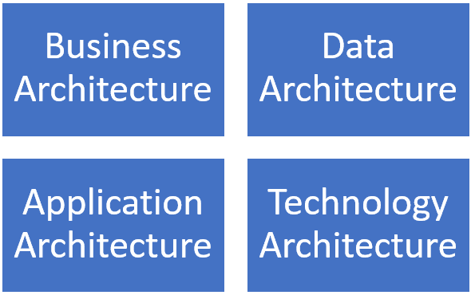
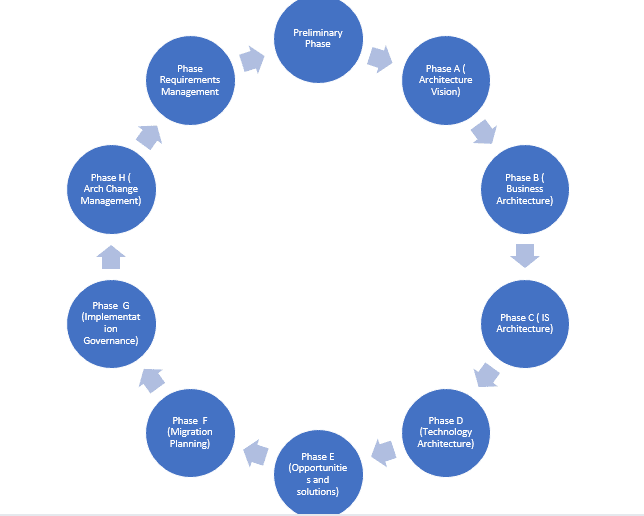
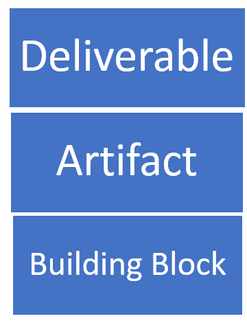
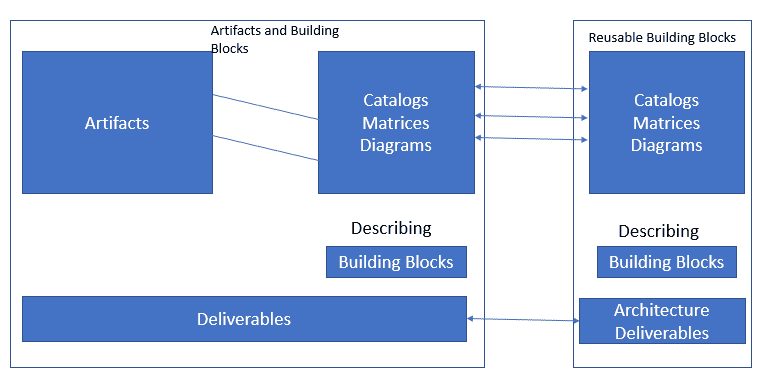
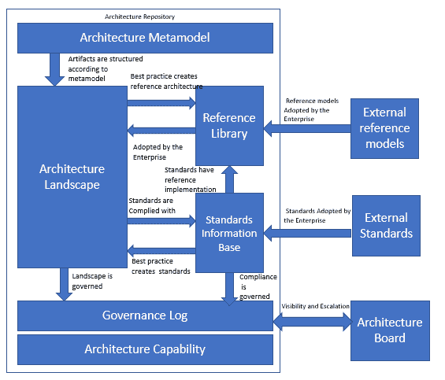
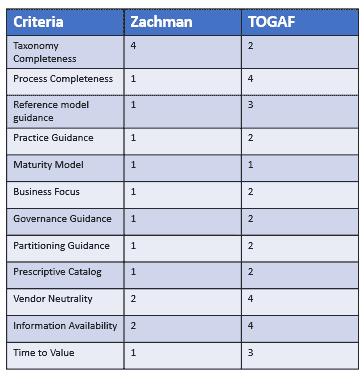
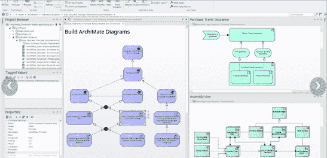

# 第六章：企业架构平台和工具

本章包含两个主要部分。本章的目标是概述目前在行业中使用的两个突出的企业模式。本章还涵盖了某些突出的企业架构平台和工具。第一部分重点关注目前使用的两个流行企业架构框架：

+   **开放集团架构框架**（**TOGAF**）

+   Zachman 框架

在第二部分，我们将重点关注组织使用的一些突出的企业架构（**EA**）平台和工具。我们将涵盖以下流行的平台：

+   企业架构师

+   Dragon1

+   ABACUS

# 企业架构框架概述

一个**企业架构框架**（**EAF**）有助于将企业内部所有与软件相关的开发过程映射到满足企业的目标和目标。EAF 还为企业提供了一个分析和理解其弱点和不一致性的框架。目前行业中有许多流行且建立良好的 EAF 框架。其中一些是为特定领域开发的，而另一些则具有更广泛的范围。市场上存在的一些 EAF 框架包括以下内容：

+   **国防部架构框架**（**DoDAF**）

+   **联邦企业架构框架**（**FEAF**）

+   **财政企业架构框架**（**TEAF**）

+   **开放集团架构框架**（**TOGAF**）

+   企业架构的 Zachman 框架

虽然在行业中存在四个或五个突出的企业架构框架（EAF），但最受欢迎和广泛使用的是 TOGAF 和企业架构的 Zachman 框架。因此，在本章中，我们的讨论将仅关注这两个框架。

# 开始使用 TOGAF

TOGAF 是一个非常流行的架构框架，用于设计企业架构。它提供了在企业架构的设计、生产和维护中使用的所有工具集和技术。它是基于一个使用行业最佳实践和一组可重用架构资产的过程模型开发的。

根据 TOGAF，**架构**被定义为 *系统的基本组织，体现在其组件中，它们之间的关系以及它们与环境的关系，以及指导其设计和演变的原理*（你可以参考[`pubs.opengroup.org/architecture/togaf9-doc/arch/`](http://pubs.opengroup.org/architecture/togaf9-doc/arch/) 获取更多信息）。简而言之，系统的架构为其实现提供了一个详细的计划。架构还突出了系统中存在的各种组件以及它们之间的相互关系。

TOGAF 旨在支持企业架构的四个架构域。以下图表中突出了这四个域：

前一图中列出的每个架构领域在定义企业架构中都发挥着至关重要的作用。角色如下列出：

+   **业务架构**提供了整体业务活动的蓝图，例如业务策略、组织、核心业务流程等。

+   **数据架构**提供了组织数据资产的蓝图，无论是逻辑的还是物理的。它还指定了组织的各种数据管理资源。

+   **应用架构**为组织必须部署的各种应用提供蓝图，包括它们与组织中存在的各种业务流程的交互和依赖关系。

+   **技术架构**提供了所需支持各种数据、应用和业务服务的硬件和软件资产的高级描述。技术架构主要关注基础设施组件、处理标准等。

# 架构开发方法 (ADM)

TOGAF 架构的核心是 ADM。它提供了一套经过测试和可重复的过程，用于开发企业架构。

以下是在 ADM 中捕获的关键活动：

+   建立架构框架

+   开发架构内容

+   提供架构实现的指导

所有的 ADM 活动都遵循一个迭代周期，包括架构定义和实现。这有助于组织以符合其业务目标和机会的逐步方式转换其架构。ADM 的阶段如下所示：

在 ADM 的每个阶段发生的活动如下所述：

+   **初步阶段**：进行架构能力建设所需的主要启动活动。本阶段进行的活动示例包括对 TOGAF 的定制、定义用于架构设计的原则等。

+   **阶段 A - 架构愿景**：在这个初始阶段，关键参与者参与范围的定义。其他一些活动包括利益相关者识别、获取架构设计和开发所需的所有必要批准等。

+   **阶段 B - 业务架构**：在这个阶段，达成协议以开发与组织架构愿景相一致的业务架构。

+   **阶段 C - 信息系统架构**：在这个阶段，达成协议以开发与组织架构愿景相一致的信息系统架构。

+   **阶段 D - 技术架构**：它主要涉及开发与组织架构愿景一致的蓝图。

+   **阶段 E - 机会和解决方案**：它涉及进行初始实施规划和识别不同格式的架构交付。

+   **阶段 F - 迁移规划**：它主要处理从基线迁移到最终目标架构的步骤。迁移涉及的各个步骤通常被捕获在实施和迁移计划中。

+   **阶段 G - 实施治理**：它提供了实施的整体概述。

+   **阶段 H - 架构变更管理**：它涉及制定一个变更管理计划来处理架构中出现的变更。

+   **需求管理**：它涉及管理在 ADM 各个阶段演变中的架构需求。

# 可交付成果、工件和构建块

在执行 ADM 的过程中，会产生几种类型的输出。其中一些是流程图、项目计划、合规性评估等。TOGAF 提供了一个架构内容框架，它为架构内容提供了一个结构模型。这个结构模型允许定义、结构化和以一致的方式呈现多种类型的工作产品。

架构内容框架基本上使用三种类型的类别来表示正在考虑的特定类型的架构工作产品。它们如下：

**可交付成果**是一种由利益相关者正式审查和同意的工作产品。可交付成果是项目的典型输出，它们以文档的形式存在。这些可交付成果在项目完成后要么存档，要么作为模型标准转移到架构存储库。

**工件**是一种描述架构某些特定方面的工作产品。

一些重要的工件类别如下：

+   目录（列出事物）

+   矩阵（显示各种事物之间的关系）

+   图表（描绘事物的图像）

一些常见的例子包括需求目录、用例图、交互图等。

**构建块**表示 IT 或架构能力的基本组件，它可以与其他构建块结合，以开发和交付架构。

构建块可以根据系统架构开发达到的阶段以不同详细程度进行指定。例如，在非常初级的阶段，构建块可能只是一个名称，这个名称可能后来会涉及到组件及其设计的完整规范。

有两种类型的构建块，它们是：

+   **架构构建块（ABBs**）：它们描述了从架构中期望的能力。然后，这种能力描述了将用于制作解决方案构建块的规范。例如，客户服务可能是一个企业内部所需能力的例子，这可能包含多个解决方案块，如应用程序、流程、数据等。

+   **解决方案构建块（SBBs**）：它们表示将在实现所需能力时使用的各种组件。

可交付成果、工件和构建块之间的关系在以下图中展示：

所有与架构相关的工件以某种方式相互关联。一个特定的架构定义文档可能引用几个其他互补的工件。这些工件可能属于构成所考虑架构的各个构建块。以下示例涉及目标呼叫处理过程。对其他构建块的引用在以下图中展示：

# 企业连续体

TOGAF 包含一个称为 **企业连续体** 的概念。这个概念解释了某些通用解决方案如何根据组织的特定需求进行定制和使用。企业连续体提供了一个架构存储库的视图，该视图提供了将架构和其他相关工件分类的方法和技术，这些工件从通用架构转变为适合组织特定需求的特定架构。企业连续体有两个与之相关的互补概念，它们是：

+   架构连续体

+   解决方案连续体

企业连续体的架构在以下图中展示：

# 架构存储库

TOGAF 的另一个重要概念是架构存储库。它可以用来存储各种类型的架构输出，每个输出在抽象级别上有所不同；这些输出是由 ADM 创建的。这个 TOGAF 概念有助于在组织内不同级别的实践者和架构师之间提供合作和协作。

企业连续体和架构存储库都允许架构师使用组织特定架构中可用的所有架构资源和资产。

通常，TOGAF ADM 可以被视为在组织内各个层面运作的过程生命周期。ADM 在整体治理框架下运作，并产生放置在架构存储库中的输出。企业连续性提供了很好的背景，以理解各种架构模型、构建块以及构建块之间的相互关系。以下图表展示了 TOGAF 架构存储库的结构：

以下列表显示了架构存储库的主要组件以及这些组件提供的功能：

+   **架构元模型**：该组件描述了架构框架，该框架根据组织的需要量身定制。

+   **架构能力**：该组件描述了支持架构存储库治理的参数、流程等内容。

+   **架构景观**：这是在任何时间点部署在组织内部的架构资产表示。景观总是存在于不同的抽象级别，这些级别与不同的架构目标集对齐。

+   **标准信息库**：该组件描述了新架构必须遵守的标准。在此上下文中，标准可能包括行业标准、组织内部部署的产品和服务标准等。

+   **参考库**：该组件提供指南、模板等，可以作为创建组织新架构的参考。

+   **治理日志**：该组件维护整个企业发生的治理活动日志。

# 使用 TOGAF 的优势

以下是使用 TOGAF 进行 EA 设计的主要好处：

+   TOGAF 框架提供了对将架构开发与与组织目标对齐的战略相结合的技术的好理解。

+   该框架提供了关于如何将架构治理与 IT 治理集成的明确指南。

+   该框架提供了许多清单，说明了如何在组织内部支持 IT 治理。

+   该框架提供了许多可重用的工件，可用于根据不同的需求创建组织多样化的架构。

+   该框架提供了许多选项来降低 IT 运营成本，并有助于设计可移植的应用程序。

# TOGAF 的局限性

同样也存在一些限制，具体如下：

+   该框架在企业中扮演设计权威的角色，并为架构师提供很少的功能来维护企业范围内的描述、标准、原则等。

+   该框架为解决方案架构师提供了非常有限的指导。

+   该框架假设企业将拥有自己的流程，这些流程将与 TOGAF 集成

+   它只是一个框架，而不是一种建模语言或任何其他可以被视为替代架构技能的组件

+   它与其支持的元模型并不非常一致

在下一个主题中，我们将探讨 Zachman 框架的细节，该框架在企业架构领域也获得了很大的知名度和影响力。

# Zachman 企业架构框架

*Zachman* 框架由 John Zachman 在 1987 年为 EA 发布。Zachman 受到信息系统设计中复杂性增加的启发，这迫使他思考一个逻辑结构来设计企业的架构，进而导致了 Zachman 企业架构框架的发展。该框架并不专注于提供任何形式的关于顺序、过程或实施的指导。核心重点是确保所有视图都得到良好建立，确保无论它们的建立顺序如何，都能形成一个完整的系统。Zachman 框架没有任何明确的合规规则，因为它不属于由专业组织编写的标准类别。

Zachman 框架最初是为 IBM 开发的，但现在已被标准化，可在企业间使用。Zachman 框架背后的主要动机是通过以一种便于企业管理并促进企业系统（如手动系统和自动化系统）的轻松开发的方式对企业的各种组件进行分类和组织，从而推导出一个简单逻辑结构。Zachman 框架的最简单形式具有以下描述：

+   在设计过程中描述的视角，即所有者、设计师和建造者。

+   产品抽象，例如它是由什么材料制成的以及它是如何（通过什么过程）工作的。

+   在哪里（组件之间相互关联的几何形状），谁（操作说明）在进行什么类型的工作，何时（事情发生的时间），为什么（由于工程方面导致事情发生）。在一些框架的较旧版本中，存在一些额外的视角，例如规划者、分包商等。

在 Zachman 框架中通常使用的各种视角，以及它们在企业架构领域的角色如下：

+   **规划者**：规划者将产品置于其环境背景中，并指定范围

+   **所有者**：所有者会对产品的商业效益感兴趣，包括它在组织中的使用方式以及它将为组织带来的增值

+   **设计师**：设计师会制定产品的规格，以确保它符合所有者的期望。产品设计的所有方面都由设计师负责

+   **建造商**：建造商管理产品各种组件的组装过程

+   **分包商**：分包商整合了由建造商指定的非上下文组件

请注意，根据企业景观的变化，Zachman 框架的视角也在不断变化。

框架的最简单描述包含以下组件：

# 优势

以下是 Zachman 框架的主要优势：

+   它提供了一个框架，用于提高组织内部多种类型的专业沟通

+   它提供了关于不使用任何架构视角的原因和风险的详细信息

+   它提供了探索和比较各种工具和/或方法的选择

+   它有选项将建议开发新的和改进的方法来生成各种架构表示

# 限制

Zachman 框架有以下局限性：

+   它可能导致过程密集/文档密集的方法，因为需要在用于捕获与框架相关的数据的单元格中填写大量数据

+   它没有提供设计新架构的逐步过程

+   它没有提供任何关于评估未来架构对组织适用性的指南

+   它没有提供在架构中实施治理的框架

# 选择 EAF 的指南

给定选择最适合您企业的架构的选项，您将使用哪些参数来做出决定？以下表格帮助您根据一些在行业景观中突出的常见参数（五点量表）来选择一个：

表格中使用的某些关键术语如下：

+   **过程完整性**：这一标准有助于找到框架为架构实施提供的逐步指导水平

+   **业务重点**：这一标准有助于我们找到技术选择灵活性，进而有助于与业务目标保持一致

+   **分区指导**：这一标准有助于判断框架为企业分区以有效管理复杂性的灵活性

+   **时间价值**：这一标准提供了关于使用此框架构建的解决方案为组织提供业务价值所需时间的指导

在下一节中，我们将检查可用于企业架构部署/设计的突出平台和工具。

# 企业架构平台和工具

以下是一些企业架构师在选择企业架构平台时需要考虑的主要参数：

+   **创新**：企业架构师将需要许多能够使他们以创新方式思考和工作的功能。同时，他们应能够访问任何 EA 环境中可用的所有工具和功能。

+   **可视化**：大多数 EA 工具也执行业务支持工具的功能。在这种情况下，工具提供大量丰富的可视化和动画功能变得必要，这些功能被视为正常业务支持活动的一部分。

+   **映射和建模**：EA 工具最重要的功能需求之一是建模。这些工具应能够提供多种类型的建模，如上下文建模、逻辑建模和物理建模。在当今以客户为中心的数字业务背景下，高级建模能力的需求变得更加突出。

+   **分析和设计**：任何 EA 工具的关键需求之一是支持分析和设计。现在，由于企业景观的变化，工具支持高级功能（如商业智能）变得必要。

+   **加速价值实现**：EA 工具应能够提供易于与许多第三方工具和接口集成的功能。这些能力将帮助它们快速实现业务价值。

+   **业务架构设计**：EA 工具应提供帮助适应快速变化特性的功能，作为架构设计的一部分。它们还应提供快速开发新型商业模式的功能。

在下一节中，我们将检查一些可用于企业架构设计和开发的流行平台和工具。

# Sparx Systems 的企业架构师

它是一个提供以下核心能力的企业架构平台，这些能力与企业架构设计相关：

+   分析

+   建模

+   设计

+   建筑

+   测试和管理

此工具提供对所有任务、阶段、组件、领域和生命周期管理的企业架构的集成支持和完全可追溯性。企业架构师结合了丰富的 UML 工具集和高效且交互式的用户界面，为架构师提供了一套先进的工具集。

以下截图展示了企业架构师工具直观的用户界面：

以下是企业架构工具支持的主要行业：

+   航空航天

+   银行

+   网络开发

+   工程

+   金融

+   医疗

+   军事

+   研究和教育

+   运输

+   零售

+   公用事业

企业架构师也是全球标准组织广泛使用的工具，用于组织他们的知识、模型和消息。此工具根据 UML 标准的变更持续更新。

Enterprise Architect 是一个经过验证的、可扩展的、有效的且经济实惠的全生命周期开发平台，用于：

+   战略建模

+   收集需求

+   业务分析

+   软件设计

+   软件分析

+   软件测试和调试

+   业务流程的建模和模拟

+   系统和软件工程

+   企业架构设计

+   数据库设计和工程

+   设计和开发 XML 模式

+   企业架构设计和开发的各个阶段的项目管理活动

+   应用程序的测试和维护

+   报告

Enterprise Architect 针对以下活动进行了优化，这些活动是企业架构设计的一部分：

+   从多个利益相关者创建、捕获和使用丰富多样的架构需求

+   根据组织需求建模、设计和架构各种软件系统

+   业务分析、根据组织需求建模业务流程和战略建模

+   系统建模、系统架构建模以及组件设计

+   比较设计、构建、建模和更新数据库系统

+   根据 XSD 和其他标准定义和生成模式

+   基于领域特定建模语言（如 UML）创建架构设计

+   模拟和可视化各种系统、任务及其相关流程

+   设计、开发、执行、调试和测试用各种软件语言编写的代码

+   模拟行为过程，设计状态机及其各种交互

+   根据架构设计构建状态机的可执行代码，并提供支持这些可执行代码模拟的环境

+   协作和共享信息

+   提供对复杂架构系统进行质量控制和质量测试的能力

+   管理与企业架构设计和开发相关的任务

+   基于云存储库概念的基于团队的协作功能，这些存储库针对通过不同类型的 LAN 和 WAN 网络进行访问进行了优化

# Dragon1

Dragon1 是一个非常受欢迎的企业架构平台，它提供了以下功能，这些功能对于企业架构的设计和开发是强制性的：

+   可用于根据组织业务目标导出架构的技术路线图

+   显示组织架构设计痛点的热图

+   提供能力图，展示组织中存在的各种能力

+   架构设计和开发中使用的术语表

+   架构描述文档

+   总概念决策矩阵草图

+   借鉴架构原则

+   企业架构蓝图

+   应用程序景观

+   模型图集

Dragon1 提供可用于组织各个级别的个人使用的功能。在组织中，将从使用 Dragon1 中受益的主要群体包括：

+   **分析师**：帮助他们进行影响分析

+   **架构师**：帮助各种类型的架构师（如业务、企业、信息、IT 等）根据其领域创建架构设计

+   **设计师**：帮助他们创建功能和技术设计

+   **经理**（IT 和业务）：提供工具集，帮助他们通过如仪表板等特性可视化地监控和管理运营

+   **项目和程序经理**：通过可视化方式实时监控和管理他们的进度变化

+   **CxOs**（CIO、CEO、CFO 等）：以易于理解的方式展示各种组织领域的仪表板视图

Dragon1 的一些核心能力如下：

+   **发布和报告**：可以使用 Dragon1 上传、存储和发布任何类型的文档/信息

+   **数据管理**：提供对任何类型数据的存储、更新和删除的支持

+   **需求管理**：提供全面的功能，用于从各种利益相关者那里收集需求

+   **流程、应用和元建模**：提供构建任何类型实体类（如流程、应用等）模型的能力和功能

+   **系统设计**：提供丰富的功能，允许在概念、逻辑或物理级别设计系统

+   **用户管理**：提供基于角色的功能，可供组织各个级别的员工使用

+   **架构可视化**：提供广泛的图形功能，有助于创建丰富的可视化效果

+   **仪表板和场景**：提供丰富的功能，能够创建仪表板功能和场景分析

要了解更多信息，您可以访问[`www.dragon1.com/products/enterprise-architecture-tool-comparison`](https://www.dragon1.com/products/enterprise-architecture-tool-comparison)。

# Avolution 软件的 ABACUS

根据 Gartner 的魔力象限，Avolution 的 ABACUS 套件是最佳 EA 建模工具之一。它包含大量适用于大多数常见平台的架构框架和模式库。它还支持从广泛的建模解决方案和第三方来源导入的数据。

ABACUS 有两种变体；如下所示：

+   标准版

+   专业版

ABACUS 的标准产品套件仅提供架构建模功能，而 ABACUS 的专业套件则提供架构建模和场景分析能力。ABACUS 基于组件、约束和连接框架提供企业建模能力。它还具备通过用户界面中的表格视图访问连接和组件属性的功能。

# ABACUS 的架构

ABACUS 由元模型和多个架构以及每个架构的视图组成。该解决方案提供了一组来自行业标准框架，如 TOGAF 和其他几个框架的库。ABACUS 使用基于 XML 的文件格式作为对象数据库。任何添加到 ABACUS 的新文件格式都作为对象数据库中的另一个对象存储。这一特性对于创建新的架构模型或对现有元模型进行增强极为有用，因为这些方面可以通过右键点击完成，而不需要像市场上其他 EA 工具那样对内部数据库进行任何更改。

定义元模型的 ABACUS 方法基本上使用三个关键单元，它们是：

+   组件

+   连接

+   约束

这些关键单元符合 IEEE1471 标准。ABACUS 随附不同的库，其中包含这些关键单元。ABACUS 中存在的库列表包括超过 50 个突出的架构模式。与市场上其他 EA 平台相比，Avolution 的灵活性为更多的架构框架提供了支持。ABACUS 具有允许用户在几分钟内创建新库或合并现有库以创建新库的功能。

除了本节中讨论的工具之外，以下图像所示的 Gartner 的魔力象限提供了在企业架构领域中突出的企业架构平台的列表。任何企业架构师都可以将其作为决策的基础。有关更多信息，请访问 [`www.gartner.com/doc/reprints?id=1-2Q45NIB&ct=151020&st=sb`](https://www.gartner.com/doc/reprints?id=1-2Q45NIB&ct=151020&st=sb)。

# 摘要

在本章的第一节中，我们讨论了当今突出的 Zachman 框架和 TOGAF 框架，并检查了这些框架的组成部分以及每个框架的优缺点。最后，我们提供了一套可以用于根据各种参数评估和选择最适合组织的 EA 框架的指标。接下来，我们考察了用于企业架构设计和开发的各个流行的 EA 平台和工具。我们通过提供由 Gartner 的魔力象限支持的 EA 工具列表来结束本章。

# 参考文献

[`www.sparxsystems.com.au/products/ea/`](https://www.sparxsystems.com.au/products/ea/)

[`www.avolutionsoftware.com/downloads/ABACUS%20TA001910ITM.pdf`](https://www.avolutionsoftware.com/downloads/ABACUS%20TA001910ITM.pdf)
