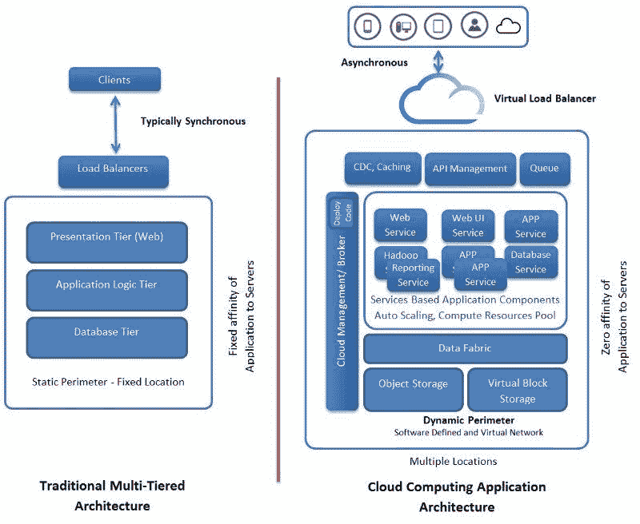
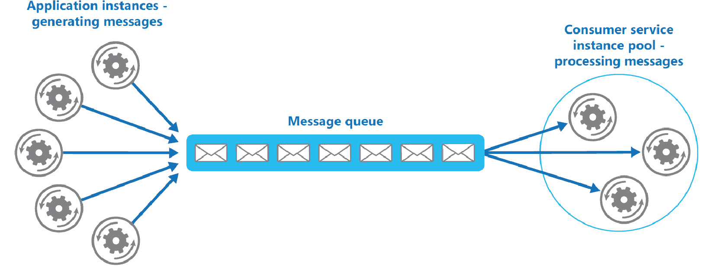
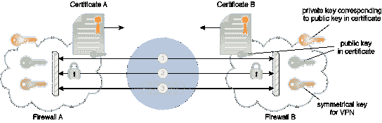

# 第十一章：软件定义云 - 架构和设计模式

云范式正在快速发展。云计算领域有许多颠覆性的进步，因此云概念的采用率持续上升。传统应用程序正相应地修改并迁移到云环境（私有、公共和混合）。云迁移、集成、编排、经纪、部署、交付和管理等方面涌现出大量支持工具，推动战略相关的云之旅。有集成流程、最佳实践、关键指南、评估指标、高度同步的平台等，使云理念深入人心、参与广泛、无处不在。此外，还有不断增长的架构和设计模式家族，用于生成优化的云环境和应用程序。本章专门准备，以充分阐明在云领域中出现的和演变的模式。本章将阐述这些模式如何被用来简化并简化云的采用。

# 反映云之旅

随着云计算的演变和革命性特征，数据中心优化和转型的章程已成为主要关注点。为了实现 IT 工业化，简化标准化措施正受到越来越多的关注。各种 IT 资源，如内存、磁盘存储、处理能力和 I/O 消耗，正被关键性地、认知性地监控、测量和管理，以实现其最大程度的利用。IT 解决方案和服务的池化和共享在战略 IT 优化中占据着至关重要的地位。同时，拥有动态的计算、存储和网络资源池，使 IT 服务提供商以及企业 IT 团队能够满足客户和用户在资源需求方面的任何波动和紧急情况。

因此，迷人的云范式已成为当今 IT 的主流概念。由于其云理论的广泛接受和采用，其核心和辅助技术正蓬勃发展。云化运动如今正蓬勃发展，大多数 IT 基础设施和平台，以及商业应用程序，正被系统地修复，以云就绪，以便充分利用云理念的最初预期好处。新的热门词汇**云赋能**迅速流行起来，有协作和协调的举措来挖掘技术、最佳实践、模式、指标、产品和其他使能器，以了解云的适用性，并使 IT 资产和软件应用程序适应即将到来的知识时代。

即使在云领域取得了前所未有的进步，对于 IT 教授和专业人士来说，在漫长的旅程中将云概念提升到下一个层次，仍然充满了未来和丰富的机会与可能性。因此，**软件定义云环境**（**SDCEs**）的概念在当今时代获得了广泛的认可。产品供应商、云服务提供商、系统集成商和其他主要利益相关者都热衷于为他们的客户、顾客和消费者提供这样先进和备受赞誉的环境。实现和维持软件定义云环境的正确和相关的技术正在迅速成熟和稳定，因此 SDCEs 的日子不会太远。

总结来说，各种技术演变和革命在世界范围内显著提升了人类生活的质量。精心选择并巧妙利用成熟稳定的技术解决方案和服务，以实现备受期待和赞誉的数字化转型，对于构建一个安全、智能和可持续的地球是必要的。

# 传统应用架构与云应用架构

如前所述，我们正朝着包含**软件定义计算**（**SDC**）、**软件定义存储**（**SDS**）和**软件定义网络**（**SDN**）的 SDCEs（软件定义云环境）迈进。虚拟化和容器化使得软件定义云能够实现工作负载感知和弹性基础设施。与僵化的基础设施相比，软件定义云的可操纵性或可编程性、可消费性、可访问性、可持续性和简单性都更优越。云基础设施和应用正在引入新的模式（架构和设计）。云概念的兴起对应用架构产生了显著影响。在本节中，我们将讨论云应用架构与传统的应用架构有何不同。

# 传统应用架构

大多数传统应用都是使用成熟的分层应用架构模式（表示层、中间层和数据层）构建的。每一层都运行在专用的服务器上，并且静态配置了它所依赖的其他层服务器的主机名和 IP 地址。这些应用对它们运行的基础设施了解甚少。如果基础设施发生变化或失败，这些应用也会失败。因此，这些应用必须托管在高度可靠和弹性的网络和服务器上。当负载（用户和/或数据）增加时，这些应用无法自动扩展或扩展。扩展是通过购买和安装额外的服务器机器手动完成的，这是一个耗时且复杂的过程。在 Web 和应用服务器前面设置了负载均衡器，以引入所需的自动扩展。然而，在传统的应用架构中，真正的可扩展性并没有得到实现。

# 云架构

如前所述，虚拟化的概念引入了可编程的基础设施。也就是说，应用的扩展性是通过基础设施组件的内在弹性来实现的。通过有意识地采用虚拟化基础设施，资源利用率显著提高。虚拟化理念如今已经渗透到每个基础设施模块，为 IT 环境带来了创新、颠覆、转型和优化的浪潮。这不仅包括服务器虚拟化，还包括网络虚拟化、存储虚拟化、服务虚拟化、数据库虚拟化等等，这些正在系统地实现，以带来原本预期的虚拟、开放、灵活和自适应的 IT 基础设施，这些基础设施本质上能够预见并应对业务变化和挑战。云技术、工具和技巧的智能使用正在导致业务感知的 IT 基础设施。工具生态系统正在稳步增长，以自动化诸如资源分配、软件部署、基础设施监控、测量和管理、编排、安全、治理等任务。

云管理层还为开发人员和架构师提供了用户界面，以便通过编程设计并构建他们运行应用程序所需的基础设施。云管理层提供的云 API 还允许应用程序控制其运行的基础设施。云应用程序可以动态地扩展或缩减，在基础设施上部署或移除应用程序组件。虚拟化和容器化的颠覆性概念使得可编程基础设施成为可能。也就是说，硬件模块正被表达为可被发现、使用甚至组合的服务。随着云运动的推进，硬件编程正变得日益真实。这样的场景正在使灵活和可操纵的基础设施时代成为可能，这些基础设施保证了工作负载感知、生产力和高利用率。

# 云应用程序架构

如前所述，为了获得云的好处，传统应用程序需要相应地进行现代化。现代应用程序的可扩展性和其他需求需要被嵌入到应用程序中。存在某些编程语言和架构模式，以便将**非功能性需求**（**NFRs**）附加到应用程序中。传统应用程序通常使用单个数据库来存储所有应用程序信息。该数据库根据需要向各种应用程序客户端（用户以及其他应用程序组件）提供存储在其内的信息。然而，随着数据的爆炸性增长，传统的数据库可能需要扩展。

SQL 数据库的横向扩展（可扩展性）面临着许多挑战。然而，由于云基础设施的规模庞大，云数据库必须使用新的数据库类型进行设计和开发，例如 NoSQL、NewSQL、内存数据库和数据库内数据库，用于数据存储和分析。对象存储在云时代非常流行。每个云服务提供商都在押注和投资云存储以满足不断增长的存储需求。除了数据库之外，还有企业级的数据仓库和数据湖。数据存储选项正在增加。缓存存储就是这样一种受到大量支持的选择。此外，还有分布式文件系统，如 HDFS 用于大数据存储和分析。在文件系统上存在数据库抽象，以便为开发人员、数据库管理员和业务提供多种可能性。此外，还有数据备份和归档选项，以确保数据和**灾难恢复**（**DR**）。以下图表生动地说明了云应用程序架构与传统应用程序在何处以及如何偏离和不同。随着多渠道、设备、媒体和模式客户端的出现，云应用程序正在有条不紊地进步：

云应用具有独特的差异。随着面向服务的应用成熟度和稳定性的提高，越来越多的应用正趋向于服务导向。在最近过去，为了应对新的需求，已经进行了进一步的改进和优化。多语言编程正在兴起。也就是说，有几种编程和脚本语言可以构建动态的微服务集合作为云应用。此外，还有大量的数据库管理系统。每种数据库类型都适用于某些应用需求。因此，通过最流行的**微服务架构**（**MSA**）促进多种技术、工具和技术链接以构建云应用的灵活性正在得到提升。随着容器（Docker）作为高度优化的应用程序承载和运行环境的广泛应用，多种技术正在迅速汇聚，以实现敏捷和加速的软件工程、部署、交付和管理。由容器化运动引领和引导的多容器和多主机云应用成为了热门话题。

简而言之，随着云迁移，下一代应用广泛讨论的**服务质量**（**QoS**）和**用户体验质量**（**QoE**）因素和方面正在被精确实现。云基础设施正在被巧妙地调整，以应对基础设施层面的潜在挑战。另一个突出的设计要求是设计云应用以处理延迟问题。也就是说，容错性是云应用、平台和基础设施的一个重要因素。需要从萌芽阶段开始阻止故障和错误的级联效应。由于云是基于通用服务器构建的，其故障率相当高。此外，还可能出现网络拥塞/中断、资源冲突、请求竞争和存储系统的 IOPS 挑战。此外，还可能出现硬件和软件故障。云环境正变得越来越复杂，因此需要实施可行的复杂度缓解和调节技术。系统必须优雅地应对任何类型的约束和级联问题和限制。解决延迟和故障的一个流行设计模式是请求/响应队列，其中请求和响应存储在队列中。此外，云和应用程序接口必须高度直观、信息丰富和指导性强。即使云资源和资产不响应，用户体验也必须得到保持。

# 云集成模式

在云计算领域，正在发生许多值得注意的进步。模式对于复杂且不断发展的云计算主题非常有用。正在挖掘模式，目的是简化对云范式的深入理解和采用。在云空间中，许多潜在领域，如**基础设施即服务**（**IaaS**）、**平台即服务**（**PaaS**）、**软件即服务**（**SaaS**）、**业务流程即服务**（**BPaaS**）等，正在被重新审视，以提出新鲜和有能力的模式。正在为云应用开发准备特殊的模式。存在云集成平台（**集成平台即服务**（**IPaaS**）），用于实现不同和分布式云应用及数据源之间的一种无缝和自发的集成。因此，正在形成和阐述特定的集成模式。

这些天，云概念已经成熟并稳定下来，为企业和个人提供了数百种新颖的服务。在数据服务方面，我们有**数据库即服务**（**DBaaS**）、**数据仓库即服务**（**DWaaS**）、**数据湖即服务**（**DLaaS**）等。出现了新的数据库，以应对不同的需求。我们都听说过、阅读过，甚至体验过 NoSQL 和 NewSQL 数据库。然后还有内存数据库和**内存数据网格**（**IMDGs**）。数据分析在数据库内部进行，因此我们了解到数据库内分析。同样，云环境被指定为各种其他应用领域的最佳环境。各种操作、事务和分析应用都通过云基础设施和平台托管、管理和交付。然后还有新一代的 Web、移动、游戏、可穿戴、嵌入式、企业、物联网和区块链应用正在通过云基础设施和实例开发和交付。一切都被表达和暴露为服务，毫无疑问，云是优雅的、启用的和执行环境。在最近过去，我们听到了更多关于云编排、配置、部署、迁移、治理和经纪服务。**DevOps**是云景观中的另一个热门词汇。随着如此众多的云服务，许多人和集体呼吁创建有益的云中心模式，以满足各种 IT 和业务能力。

# 基于层级的分解

此应用程序的复杂功能被划分为多个离散的、易于管理和松散耦合的组件。每个组件都被指定执行一项任务。这种应用程序功能的分区或组件化导致了原始应用程序的逻辑分解。这些逻辑上分离的组件在服务器集群的多个层级上运行，这种分割是在基础设施级别进行的。

# 基于过程的分解

下一个是基于过程的分解。企业级和复杂的应用程序通常是过程中心的。在这里，我们可以引入基于过程的分解。每个过程内部包含许多需要按一定顺序执行的任务。每个任务单独完成，并按所需顺序聚合以获得应用程序功能。有许多自动化工具可以启用这种分解、自动化，最终实现编排。

# 基于“管道-过滤器”的分解

第三种分解类型是基于“管道-过滤器”的分解，它侧重于应用程序的数据中心处理。每个过滤器提供一种在输入数据上执行并在处理后产生输出数据的函数。多个过滤器通过管道相互连接，即通过消息传递。

这些分层和分解模式恰当地将应用程序分解为逻辑层，使得独立部署和水平扩展成为可能。应用程序和云基础设施的分层正在被吹捧为开发、部署和交付下一代分布式应用的最重要需求。

# 服务消息模式

**消息作为统一机制**：消息是不同且分布式的云服务中最统一的因素。云服务集成的目标通过消息传递来实现。下文将列出并详细说明各种服务消息模式。服务消息可以通过认证、路由、丰富、过滤、安全化和组合来满足联邦云的期望。云中介和修复可以通过智能消息传递来完成。通过创新地使用服务消息，可以构建和部署具有突破性和以前未知的服务。

不同的分布式和去中心化的云服务如何以松散耦合和去耦合的方式找到、绑定、访问和协作？

| **问题** | 服务可以在一个虚拟机上运行，或者在云环境中的不同虚拟机上运行。服务甚至可以在地理上分布的云上运行。有公共、私有和混合云，还有一些通信协议。传统的协议可能导致服务之间紧密耦合的可能性。这些反过来又对服务的可重用性、可测试性和可修改性施加了某些限制。 |
| --- | --- |
| **解决方案** | 从现在开始，松耦合和解耦是可行且有价值的解决方案方法。即使松耦合也有一些限制，服务之间的解耦被吹捧为最有希望的解决方案，而消息是建立解耦通信的方式，这反过来又消除了传统通信方法的缺点 |
| **影响** | 消息技术带来了一些 QoS 问题，如可靠交付、安全性、性能和事务。 |

**问题**：不同的应用程序通常使用不同的语言、数据格式和技术平台。当一个应用程序（组件）需要与另一个应用程序交换信息时，必须尊重目标应用程序的格式。直接向目标应用程序发送消息会导致发送者和接收者之间紧密耦合，因为格式变化直接影响两者实现。此外，直接发送还紧密耦合了应用程序，使其可以通过地址到达。

云应用程序和服务使用各种协议进行通信。**远程过程调用**（**RPC**）、**远程方法调用**（**RMI**）、**Windows Communication Framework**（**WCF**）以及服务协议（HTTP 上的 SOAP 和 REST）是云资源连接和协作的一些主要机制。然而，所有这些都导致了一种紧密耦合，这反过来又成为服务无缝和自发合作以实现更大更好事物的障碍。因此，迫切需要松耦合和解耦。云应用程序服务如何在位置和消息格式上松耦合的情况下通过消息进行远程通信？另一个正在酝酿的要求是使服务之间实现完全解耦。

**解决方案**：背景是分布式应用程序或其服务组件通过消息交换信息。消息作为可行的替代通信方案，不依赖于持久连接。相反，消息作为独立的通信单元被传输，通过底层基础设施路由。也就是说，只需通过一个中介连接应用程序；面向消息的中间件隐藏了通信伙伴的寻址和可用性的复杂性，并支持不同消息格式的转换。

通信伙伴现在可以通过消息进行通信，而无需知道通信伙伴使用的消息格式或其可到达的地址。面向消息的中间件提供消息通道（也称为**队列**）。消息可以写入这些队列或从中读取。此外，面向消息的中间件包含组件，这些组件在通道之间路由消息到目标接收者，并处理消息格式的转换。

消息框架必须具备以下能力：

+   保证每条消息的投递或保证失败投递的通知

+   在传输之外保护消息内容

+   在服务活动之间管理状态和上下文数据

+   将消息高效地作为实时交互的一部分进行传输

+   协调跨服务事务

如果没有这些类型的扩展，服务的可用性、可靠性和可重用性将施加限制，可能会损害与云托管服务相关的战略目标。

# 消息元数据模式

| **问题** | 服务通常以无状态方式工作。也就是说，它们不存储任何状态数据以方便后续操作。由于消息是中介，以便不同的和分布式的服务能够共同交互以完成业务交易和操作，它们需要拥有或携带所有状态数据（元数据）。 |
| --- | --- |
| **解决方案** | 因此，消息信封内封装的内容必须补充以活动特定的元数据，这些元数据可以在运行时单独解释和处理。 |
| **影响** | 对消息元数据的解释和处理会增加运行时性能开销，并增加服务活动设计复杂性。 |

**问题**：在传统方法中，当前服务交互的状态和上下文数据被放置在内存中。然而，在服务环境中，服务被设计、开发和部署为无状态资源，以实现高度可重用性。因此，在服务之间传输的消息必须携带正确和相关的数据，以依次启动正确的操作，从而完成业务流程任务。

**解决方案**：由于消息携带状态数据、业务规则甚至处理指令，服务可以以非常通用的方式设计。服务复杂性将降低，可重用性水平将提高，可修改性将更容易，丰富性将更快，等等。

虽然通过避免持久二进制连接减少了整体内存消耗，但服务在运行时解释和处理元数据的要求增加了性能需求。特别是无状态服务可能会施加更多的运行周期，因为它们可能需要配备高度通用的例程，能够解释和处理不同类型的消息头，以便有效地参与多个组合活动。由于存在广泛的技术标准，这些标准本质上支持并基于消息元数据，因此可以设计出各种复杂的消息交换。这可能导致过于创新和复杂的消息路径，可能难以管理和演变。

# 服务代理模式

如何将事件捕获和处理逻辑分离并独立管理？

| **问题** | 服务组合（编排和协调）可能会变得庞大且效率低下，尤其是在需要调用多个服务中的细粒度能力时。 |
| --- | --- |
| **解决方案** | 事件驱动的服务组合正成为构建复合服务的一个重要因素。事件驱动的逻辑可以轻松地延迟到不需要显式调用的事件驱动程序中，从而减少服务组合的大小和性能压力。 |
| **影响** | 当组合逻辑分布在服务中时，其复杂性会增加，并且事件驱动代理和依赖服务代理可以进一步将库存架构绑定到专有供应商技术。 |

**问题**：分解和组合是简化并简化软件工程的非常成功的方法。在服务环境中，应用程序是通过组装各种服务来构建的。在软件工程中，要实现的应用程序是从一系列业务流程（简单和复合）开始的，每个流程反过来又通过利用多个服务（流程元素）来实现。也就是说，应用程序被分解为一系列互操作和交互式服务，并且服务被智能地组合成下一代应用程序。

服务组合逻辑由一系列服务调用组成，每个调用都要求一个服务执行整体父业务流程逻辑的一部分。较大的业务流程可能非常复杂，尤其是在需要通过补偿和异常处理子流程包含许多“如果...怎么办？”条件时。因此，服务组合可以相应地变得很大。此外，每个服务调用都会带来性能损失，这是由于必须显式调用并与服务本身进行通信。较大的组合可能会因为需要调用多个服务来自动化单个任务而产生的总体开销而受到影响。

**解决方案**：*关注点分离*是软件工程中的一个有趣技术。由可预测事件触发的服务逻辑可以被隔离到专门为事件发生时自动调用而设计的独立程序中。这减少了需要在服务中驻留的组成逻辑的数量，并进一步减少了给定组合所需的服务调用次数。

事件驱动代理为多个服务组合形成依赖关系提供了另一层抽象。尽管感知到的组合大小可能减少，但组合本身的实际复杂性并没有减少。组合逻辑只是更加分散，因为它现在还涵盖了自动执行整体任务部分的服务代理。

# 中间路由模式

动态运行时因素如何影响消息路径？：

| **问题** | 服务组合越大、越复杂，提前预想和设计所有可能的运行时场景就越困难，尤其是在异步和基于消息的通信中。 |
| --- | --- |
| **解决方案** | 通过使用中间件路由逻辑，可以动态确定消息路径。 |
| **影响** | 动态确定消息路径会增加处理逻辑的层级，相应地可能会增加性能开销。此外，使用多个路由逻辑可能导致服务活动过于复杂。 |

**问题**：服务组合可以看作是组合参与者之间的一系列点对点数据交换。这些交换共同自动化一个父级业务流程。消息路由逻辑（决定消息如何从一个服务传递到另一个服务的决策逻辑）可以嵌入到组合中每个服务的逻辑中。这允许成功执行预定的消息路径。然而，可能存在未考虑到的因素，这些因素可能导致未预见的系统故障。例如：

+   消息正在传输到的目标服务暂时（甚至永久）不可用

+   嵌入的路由逻辑包含一个*通配符*条件来处理异常，但结果的消息目的地仍然不正确

+   原计划的消息路径无法执行，导致服务的前一个消费者拒绝消息

或者，可能只是存在动态的功能需求，而服务无法提前设计。

**解决方案**：通用的多用途路由逻辑可以被抽象化，使其作为架构的独立部分存在，以支持多个服务和服务组合。最常见的是，这通过使用事件驱动的服务代理来实现，这些代理可以透明地拦截消息并动态确定它们的路径。

这种模式通常作为服务代理的专用实现应用。需要执行动态路由的路由中心代理通常由消息中间件提供，是企业服务总线（**ESB**）产品的基本组件。这些类型的即用型代理可以被配置为执行一系列路由功能。然而，创建自定义路由代理也是可能的，并且并不罕见，尤其是在需要支持具有特殊要求复杂服务组合的环境中。

# 状态消息模式

如何在保持无状态的同时，为有状态交互做出贡献？

| **问题** | 当服务需要在消息交换与消费者之间在内存中维护状态信息时，它们的可扩展性可能会受损，并且它们可能成为周围基础设施的性能瓶颈。 |
| --- | --- |
| **解决方案** | 不是在内存中保留状态数据，而是临时将其存储委托给消息。 |
| **影响** | 此模式可能不适用于所有形式的状态数据，并且如果消息丢失，它们携带的任何状态信息也可能丢失。 |

**问题**：服务有时需要参与跨越多个消息交换的运行时活动。在这些情况下，服务可能需要保留状态信息，直到整体任务完成。这对于充当组合控制器的服务尤其常见。默认情况下，服务通常设计为将此状态数据保留在内存中，以便易于访问，并且基本上在服务实例活跃期间保持活跃。然而，这种设计方法可能导致严重的可扩展性问题，并且进一步违反了服务无状态设计原则。

**解决方案**：服务不是在内存中维护状态数据，而是将其移动到消息中。在对话交互期间，服务从下一个输入消息中检索最新的状态数据。

应用此模式有两种常见方法，这两种方法都会影响服务消费者与状态数据的关系。消费者在内存中保留最新状态数据的副本，而只有服务从将状态数据委托给消息中受益。这种方法适用于使用 WS-Addressing 实现此模式时，由于端点引用（**EPRs**）的单向对话性质。

消费者和服务都使用消息来临时卸载状态数据。当消费者和服务都是更大组合中的实际服务时，这种与状态数据的双向交互可能是合适的。此技术可以通过自定义消息头部实现。

当遵循带有自定义头部的双向模型时，由于运行时失败或异常条件而丢失的消息将进一步丢失状态数据，从而将整体任务置于危险之中。同时，考虑放置在消息层上的状态数据的安全影响也很重要。对于处理敏感或私人数据的服务，相应的状态信息应适当加密和/或数字签名，消费者无法访问受保护的状态数据的情况并不少见。

此外，由于此模式要求状态数据存储在每次请求和响应中传递和回传的消息中，因此考虑此信息的大小及其对带宽和运行时延迟的影响很重要。与其他需要新基础设施扩展的模式一样，建立库存范围内的状态消息支持将引入成本和努力，这是由于必要的基础设施升级所导致的。

# 服务回调模式

服务如何异步与其消费者同步？：

| **问题** | 当服务需要响应消费者请求以发送多个消息，或者服务消息处理需要大量时间时，通常无法进行同步通信。 |
| --- | --- |
| **解决方案** | 服务可以要求消费者异步与其通信，并提供一个回调地址，服务可以将响应消息发送到该地址。 |
| **影响** | 异步通信可能会引入可靠性问题，并可能需要升级周围的基础设施以完全支持必要的回调关联。 |

**问题**：当服务逻辑需要用多个消息来响应消费者请求时，标准的请求-响应消息交换是不合适的。同样，当特定的消费者请求需要服务在能够响应之前进行长时间处理时，同步通信是不可能的，这可能会危及服务及其周围架构的可扩展性和可靠性。

**解决方案**：服务被设计成消费者提供一个回调地址，服务在接收到初始消费者请求消息后，在某个时间点可以通过该地址联系消费者。此外，还要求消费者提供关联细节，以便服务可以在未来的消息中发送一个标识符，从而消费者可以将它们与原始任务关联起来。

# 服务实例路由

如何在不需要专有处理逻辑的情况下，让消费者联系和交互服务实例？

| **问题** | 当需要反复访问特定的状态化服务实例时，消费者必须依赖于将它们与服务更紧密耦合的自定义逻辑。 |
| --- | --- |
| **解决方案** | 服务以标准化的格式提供实例标识符及其目标信息，从而保护消费者免于需要使用自定义逻辑。 |
| **影响** | 这种模式可能会引入对重大基础设施升级的需求，并且如果滥用，还可能导致过度状态化的消息活动，从而违反服务无状态原则。 |

**问题**：存在消费者向服务发送多个消息，并且这些消息需要在同一运行时上下文中处理的情况。这类服务被有意设计成保持状态化，以便它们可以执行对话或以会话为中心的消息交换。然而，服务合同通常不提供一种标准化的方式来表示或定位服务实例。因此，消费者和服务设计者需要求助于将专有实例标识符作为常规消息数据的一部分传递，这导致需要专有实例处理逻辑。

**解决方案**：底层基础设施扩展以支持处理消息元数据，这使得可以将服务实例标识符放入对服务整体目标的引用中。此引用（也称为**端点引用**）由消息基础设施管理，以便消费者发出的消息自动路由到由引用表示的目标。因此，实例 ID 的处理不会对消费者到服务的耦合产生负面影响，因为消费者不需要包含专有的服务实例处理逻辑。由于实例 ID 是由基础设施管理的引用的一部分，因此对消费者来说是透明的。这意味着消费者不需要知道他们是否正在向服务或其实例发送消息，因为这是由消息基础设施内部的路由逻辑负责的。

# 异步队列模式

如何让服务和其消费者适应隔离故障并避免不必要地锁定资源？：

| **问题** | 当服务能力要求消费者同步与之交互时，它可能会抑制性能并损害可靠性。 |
| --- | --- |
| **解决方案** | 服务可以通过中介缓冲区与其消费者交换消息，允许服务和消费者通过保持时间解耦独立处理消息。 |
| **影响** | 可能不会有成功消息交付的确认，并且原子事务可能不可行。 |

**问题**：同步通信要求对每个请求立即做出响应，因此强迫每个服务交互进行双向数据交换。当服务需要执行同步通信时，服务和消费者都必须可用并准备好完成数据交换。这可能会在服务无法保证其接收请求消息的可用性或服务消费者无法保证其接收请求响应的可用性时引入可靠性问题。由于其顺序性，同步消息交换还可以进一步增加处理开销，因为服务消费者需要等待收到其原始请求的响应后才能进行其下一项操作。长时间的响应可以通过暂时锁定消费者和服务来引入延迟。

强制同步通信可能导致的另一个问题是，需要大量并发访问的服务可能会过载。因为服务预计会立即处理接收到的请求，所以使用阈值更容易达到，从而使得服务暴露于多消费者延迟或整体故障。

**解决方案**：引入一个队列作为中介缓冲区，接收请求消息，然后代表服务消费者转发它们。如果目标服务不可用，队列充当临时存储并保留消息。然后它定期尝试重新传输。同样，如果有响应，它可以通过同一个队列发出，当消费者可用时，该队列会将它转发回服务消费者。当服务或消费者处理消息内容时，另一方可以停用自己（或继续其他处理），以最小化内存消耗。|

# 可靠消息模式

我们如何在不可靠的环境中启用并确保服务可靠地交互？：

| **问题** | 消息需要到达正确的服务，并且在其路径中不应被篡改。也就是说，不可靠的通信协议和服务环境被认为是服务可靠性的主要障碍。 |
| --- | --- |
| **解决方案** | 必须实施一个中间可靠性机制，以确保消息能够到达正确的服务，并且它们的完整性和保密性得到适当的维护。此外，这个中间件还必须保证消息的投递。 |
| **影响** | 使用可靠性框架会增加处理开销，这可能会影响服务活动性能。它还增加了组合设计复杂性，并且可能不兼容原子服务事务。 |

**问题**：当服务被设计为通过消息激活和行动时，由于底层消息协议（如 HTTP）的无状态特性，自然会有服务质量下降的趋势。二进制通信协议在发送者和接收者之间的数据传输完成之前保持持久连接。然而，在消息交换中，运行时平台可能无法向发送者提供反馈，告知消息是否成功送达目标服务端点。随着服务和网络链路的增加，服务组合的复杂性相应增加。|

如果正在使用的中间件基础设施无法保证可靠的消息投递，那么风险就会爆发。如何在系统或通信失败的情况下保证消息交换，同时确保消息不会丢失？可靠性代理通过正（ACK）和负（NACK）确认通知进一步管理成功和失败的消息投递的确认。消息可以单独传输和确认，也可以捆绑成消息序列，这些序列以组的形式确认（并且也可能有与序列相关的投递规则）。

当在分布式系统中交换消息时，在通信链路上传输消息或在系统组件中处理消息时可能会发生错误。在这些条件下，应保证没有消息丢失，并且在系统故障后最终可以恢复消息。

**解决方案：**底层基础设施配备了一个可靠性框架，该框架跟踪和临时持久化消息传输，并向消息发送者发出成功和失败确认，以传达成功和失败的消息传输。在通信伙伴之间进行消息交换是在事务上下文中执行的，保证了 ACID 行为。在云中，有几个消息系统可以作为服务访问，例如 Amazon SQS 或 Windows Azure 存储的队列服务。

如前所述，云集成模式对于基于云的分布式应用程序的开发、部署和交付至关重要。有专门的适配器、连接器、驱动程序和其他插件来简化并简化云集成需求。集成模式对于云范式的成功至关重要。

# 云设计模式

本节将讨论各种对在云中构建可靠、可扩展和安全的云应用程序非常有用的云应用程序设计模式。读者可以在 Microsoft 网站上找到有关这些模式的更深入和决定性的细节：[`docs.microsoft.com/en-us/azure/architecture/patterns/`](https://docs.microsoft.com/en-us/azure/architecture/patterns/)。

# 缓存旁路模式

该模式的核心是从数据存储中按需将数据加载到缓存中。此模式可以提高性能，并有助于保持缓存中保留的数据与数据存储中的数据之间的一致性。应用程序使用缓存来优化对数据存储中保留信息的重复访问。然而，通常不切实际地期望缓存数据始终与数据存储中的数据完全一致。

有许多商业缓存系统提供读取通过和写入通过/写入后操作。在这些系统中，应用程序通过引用缓存来检索数据。如果数据不在缓存中，它将透明地从远程数据存储中检索并添加到缓存中。对缓存中保留的数据的任何修改都将自动写回数据存储。对于不提供此功能的缓存，维护缓存中的数据是使用缓存的应用程序的责任。应用程序可以通过实现缓存旁路策略来模拟读取通过缓存的函数。此策略有效地按需将数据加载到缓存中。

云应用性能经常受到许多人的质疑。因此，涌现出大量性能提升技术和技巧。这种模式就是这样一个突破性的解决方案技术，旨在为应用设计师提供所有正确和相关的信息，以显著提高云性能。

使用场景包括：

+   缓存不提供原生的读透和写透操作

+   资源需求是不可预测的

# 断路器模式

我们都知道，分布式计算是新代企业的发展方向。在分布式计算环境中，连接到远程服务和资源是一个核心需求。远程连接有故障的倾向。也就是说，应用试图连接到远程服务或数据源，但由于某些暂时性故障（如网络连接缓慢、超时、资源过载、暂时不可用等）而无法访问。这些故障通常在短时间内自行纠正，一个健壮的云应用应准备好通过使用如重试模式所描述的良好策略来克服这些故障。

然而，也可能出现故障由难以预料的事件引起的特殊情况。此外，这些故障可能需要更长的时间才能得到修复。这些故障的严重程度可能从部分连接丢失到服务的完全失败不等。在这些情况下，应用不断重试执行不太可能成功的操作可能毫无意义，相反，应用应迅速接受操作已失败，并相应地处理故障。

断路器模式可以防止应用反复尝试执行可能失败的操作，允许它在等待故障修复或确定故障持续时间较长时继续运行，而不会浪费 CPU 周期。断路器模式还使应用能够检测故障是否已解决。如果问题似乎已经得到解决，应用可以尝试调用操作。

断路器模式与重试模式不同。重试模式允许应用在有成功期望的情况下重试操作，但断路器模式阻止应用执行可能失败的操作。应用可以通过使用断路器通过重试模式调用操作来结合这两种模式。然而，重试逻辑应敏感于断路器返回的任何异常，并在断路器指示故障不是暂时性的情况下放弃重试尝试。

断路器充当可能失败的操作的代理。代理应监控最近发生的失败次数，然后使用这些信息来决定是否允许操作继续进行，或者立即返回异常。

# 补偿事务模式

我们都知道，任何商业和金融交易都必须严格满足 ACID 属性。随着事务性应用程序在云环境中的部署，这些属性正逐渐得到满足。现在，在大数据时代，分布式计算已成为主流计算模型。NoSQL 数据库如今非常突出和主导，以适应大数据的需求。越来越多的数据源和存储被分割但相互连接，以执行高性能的数据访问、处理和检索。在这种情况下，强事务一致性没有得到保持。相反，应用程序应追求最终一致性。在这些步骤执行过程中，系统的整体状态可能不一致，但一旦操作完成并且所有步骤都已执行，系统应再次变得一致。

在最终一致性模型中，一个重大挑战是如何处理一个无法恢复的失败步骤。在这种情况下，可能需要撤销操作中之前步骤完成的所有工作。然而，数据不能简单地回滚，因为其他并发实例的应用程序可能已经更改了它。即使在数据没有被并发实例更改的情况下，撤销一个步骤可能不仅仅是恢复原始状态的问题。可能需要应用各种特定于业务规则。

补偿机制是事务失败时的典型响应。这种模式主要是撤销一系列步骤所执行的工作，这些步骤共同定义了一个最终一致性操作，如果其中一个或多个步骤失败。补偿事务可能无法简单地用操作开始时系统的状态替换当前状态，因为这种方法可能会覆盖其他并发应用程序实例所做的更改。相反，它必须是一个智能过程，考虑到任何并发实例完成的工作。这个过程通常将是特定于应用程序的，由原始操作执行的工作的性质驱动。

实现需要补偿的最终一致性操作的常见方法是用工作流。随着原始操作的进行，系统记录有关每个步骤以及该步骤执行的工作如何撤销的信息。如果操作在任何一点失败，工作流将回滚到已完成的步骤，并执行每个步骤的反向工作。

# 竞争消费者模式

随着 Web 规模应用程序的日益流行，可能会有来自世界各地的许多请求。用户和数据负载通常是不可预测的。任务/操作复杂性也是不可预测的。由于负载沉重，云应用程序发现很难在规定的时间内处理每个请求并给出回复。一个选择是添加新的服务器实例。在集群和负载均衡环境中也存在一些实际困难。然而，这些消费者必须协调一致，以确保每个消息只被发送给单个消费者。工作负载也需要在消费者之间进行负载均衡，以防止实例成为瓶颈。

在这里的一个压倒性的解决方案是，在请求应用程序/用户和处理应用程序之间使用消息系统（消息队列或代理）。**面向消息的中间件（MOM**）是满足大量并发消费者需求的一种方法。这种中间件方法支持异步通信和处理，因此可以快速响应大量请求。

消息队列/代理/总线用于在应用程序和消费者服务实例之间建立通信通道。应用程序将请求以消息的形式发布到队列中，消费者服务实例从队列中接收消息并处理它们。这种方法使得同一池的消费者服务实例可以处理来自应用程序任何实例的消息。以下图示说明了这种架构：

此模式允许多个并发消费者处理同一消息通道接收到的消息。此模式允许系统并发处理多个消息以优化吞吐量，提高可扩展性和可用性，并平衡工作负载。

# 计算资源整合模式

存在几种架构模式，如 MVC、**面向服务的架构（SOA**）、**事件驱动架构（EDA**）、**资源导向架构（ROA**）、**微服务架构（MSA**）等，推荐应用分区以获得各种好处。然而，有时将多个任务或操作整合到一个计算单元中会带来许多优势。

一种常见的做法是寻找具有相似的可扩展性、生命周期和处理要求的任务。将这些项目分组在一起可以使它们作为一个单元进行扩展。许多云环境提供的弹性使得可以根据工作负载启动和停止计算单元的额外实例。这种模式可以提高计算资源利用率，并减少在云托管应用程序中执行计算处理相关的成本和管理开销。

# 命令和查询责任分离（CQRS）模式

在传统的数据库管理系统（DBMS）中，命令（对数据的更新）和查询（对数据的要求）都是针对单个数据仓库中的同一组实体执行的。这些实体可能是 RDBMS 中一个或多个表中的行的一个子集。通常，在这些系统中，所有**创建**、**读取**、**更新**和**删除**（**CRUD**）操作都应用于实体的同一表示。当对数据操作应用的业务逻辑有限时，传统的 CRUD 设计效果良好。与 CRUD 方法相关联存在一些严重问题，如下所述：

+   数据的读取和写入表示之间可能存在不匹配，例如，即使它们不是操作的一部分，也必须正确更新额外的列或属性

+   在数据存储中锁定记录时，可能会在协作域（多个操作者在同一组数据上并行操作）中遇到数据竞争，或者在乐观锁定时由于并发更新而引起更新冲突

此模式通过使用单独的接口将读取数据的操作与更新数据的操作分开，从而隔离操作。此模式可以最大化性能、可伸缩性和安全性，通过更高的灵活性支持系统随时间的演变，并防止更新命令在域级别引起合并冲突。

**事件溯源模式和 CQRS 模式**：基于 CQRS 的系统使用单独的读取和写入数据模型。每个模型都针对相关任务进行定制，并且通常位于物理上分开的存储中。当与事件溯源一起使用时，事件存储是写入模型，这是信息的权威来源。基于 CQRS 的系统中的读取模型提供数据的高度反规范化视图。这些视图针对应用程序的接口和显示要求进行定制，这有助于最大化显示和查询性能。

使用事件流作为写入存储，而不是在某个时间点的实际数据，避免了单个聚合上的更新冲突，并最大化了性能和可伸缩性。这些事件可以用来异步生成用于填充读取存储的数据的物化视图。

# 事件溯源模式

大多数应用程序都与数据一起工作，最常见的方法是应用程序通过在用户操作数据时更新数据来维护数据的当前状态。例如，在 CRUD 模型中，数据处理过程从存储中读取数据，对其进行一些修改，并使用新值更新数据的当前状态。这种方法的缺点是直接对数据存储执行更新操作可能会降低性能和响应速度。可扩展性方面也可能受到影响。在协作环境中，有众多并发用户，因此数据更新冲突的可能性很高，因为更新操作是在单个数据项上进行的。

事件被持久化在事件存储中，该存储作为数据当前状态的真相来源。事件存储通常发布这些事件，以便消费者可以收到通知并在需要时处理它们。例如，消费者可以启动任务，将事件中的操作应用于其他系统。需要注意的是，生成事件的应用程序代码与订阅事件的系统是解耦的。

解决方案是使用只追加存储来记录描述在域中对数据执行的操作的完整事件序列，而不是仅存储当前状态，以便存储可以用来实例化域对象。这种模式可以通过避免同步数据模型和业务域的要求来简化复杂域中的任务。这种模式提高了性能、可扩展性和响应速度。此外，它为事务数据提供了一致性，并维护了完整的审计跟踪和历史记录，这可能使补偿操作成为可能。

# 外部配置存储模式

大多数应用程序的运行时环境包括配置信息，这些信息存储在与应用程序一起部署的文件中，位于应用程序文件夹内。在某些情况下，可以编辑这些文件来更改已部署应用程序的行为。然而，在许多情况下，对配置的更改需要重新部署应用程序，从而导致不可接受的停机时间和额外的管理开销。

本地配置文件也限制了配置仅限于单个应用程序，而在某些场景中，跨多个应用程序共享配置设置会很有用。管理多个应用程序运行实例之间的本地配置更改是另一个挑战。解决方案是将配置信息存储在外部存储中。这把配置信息从应用程序部署包移至集中位置。这种模式可以提供更易于管理和控制配置数据的机会，以及跨应用程序和应用程序实例共享配置数据的机会**。**

# 联邦身份模式

有许多应用由不同的云服务提供商托管。主要的是电子邮件和社交网络应用。这些应用被来自世界各地的人们订阅和使用。通常，用户需要记住并使用不同的凭证来访问这些以客户为中心的、协作的和云应用中的每一个。管理多个凭证是一项艰巨的任务。解决方案是实现一种可以使用联邦身份这一经过验证的概念的认证机制。这是通过将用户认证方面与应用逻辑代码分离，并将认证需求委托给受信任的第三方身份服务提供商来实现的。受信任的身份提供者可以代表应用服务提供商认证用户。例如，身份服务提供商拥有微软、谷歌、雅虎！或 Facebook 账户。这种身份模式可以简化开发，减少用户管理的需求，并提高应用的用户体验。

# 守门人模式

云应用需要保护免受恶意用户的侵害。此外，一些云应用由多个云服务提供商提供。因此，用户可以根据自己的条款选择一个服务提供商。云代理是一种新的软件产品，使用户能够缩小合适的云服务提供商。因此，需要一种守门人软件解决方案来作为应用客户端和应用服务之间的经纪人，验证和清理请求，并在它们之间传递请求和数据。这可以提供额外的安全层，并限制系统的攻击面。

此模式最小化了客户端获取敏感信息和服务的风险。此网关解决方案作为一个门面或专门的任务，与客户端交互，然后将请求通过解耦接口传递给处理请求的主机或任务。

# 应用健康监控模式

云应用应满足通过 SLA 协议正式签订的各种服务和运营期望。因此，拥有一个能够精确和细致监控云应用、数据库系统、中间件解决方案等运行和健康状况的健康监控系统是相关的。因此，健康检查是确保协议质量参数的重要因素。监控并非易事。由于规模巨大，如日益软件定义、联邦化和共享，云环境非常复杂。前进的道路是将健康监控系统实施到位，以便向应用端点发送请求，以捕获正确和相关的数据，以便清晰和自信地采取行动。

# 领导选举模式

云应用极其复杂且精密。多个云应用实例可以在云环境中运行。同样，应用程序的不同组件也可以在云上运行。任务可能会并行工作，以执行复杂计算的各个部分。

任务实例可能大部分时间都在单独运行，但有时也可能需要协调每个实例的行动，以确保它们不会产生任何冲突，不会对共享资源造成竞争，或者意外干扰其他任务实例正在执行的工作。因此，需要熟练的协调软件；每个动作都必须得到协调。

应该选择一个单独的任务实例作为领导者，并且这个实例应该协调其他从属任务实例的行动。如果所有任务实例都在运行相同的代码，那么一个实例可以充当领导者。然而，领导者的选举必须做得聪明。必须有一个健壮的领导者选择机制。这种选择方法必须能够处理诸如网络中断或进程故障等事件。在许多解决方案中，从属任务实例通过某种心跳方法或轮询来监控领导者。如果指定的领导者意外终止，或者网络故障使领导者对从属任务实例不可用，那么他们必须选举一个新的领导者。

# 物化视图模式

在存储数据时，开发人员和数据库管理员更关心数据是如何存储的。他们最不关心的是数据如何被读取。选择的数据存储格式通常与数据的格式、管理数据大小和数据完整性的要求以及所使用的存储类型密切相关。例如，当使用 NoSQL 文档存储时，数据通常表示为一系列聚合，每个聚合包含该实体的所有信息。然而，这可能会对查询产生负面影响。当查询只需要从某些实体中获取数据的一个子集时，例如，几个客户的订单摘要而不包括所有订单详情，它必须提取相关实体的所有数据以获取所需详情。

为了支持高效的查询，一个常见的解决方案是在预先生成一个视图，该视图以适合所需结果集的格式实现数据。物化视图模式描述了在源数据不适合查询、生成合适的查询困难或由于数据或数据存储的性质导致查询性能较差的环境中生成预填充的数据视图。

这些仅包含查询所需数据的物化视图，允许应用程序快速获取所需的信息。除了连接表或组合数据实体之外，物化视图还可以包括计算列或数据项的当前值，对数据项进行组合值或执行转换的结果，以及作为查询一部分指定的值。物化视图甚至可以针对单个查询进行优化。这种模式可以帮助支持高效的查询和数据提取，并提高应用程序性能。

# 管道和过滤器模式

应用程序必须执行其在接收、处理和呈现信息时遇到的各种不同复杂性的任务。传统上，为了完成这项任务，会生成一个单体应用程序。然而，由于各种原因（可修改性、可替换性、可重用性、可替代性、简单性、可访问性、可持续性、可扩展性等），单体架构和方式注定会在某个时候失败。因此，经过验证的“分而治之”技术已经成为软件工程领域的一种首选方法。**面向方面编程**（**AOP**）是一种流行的方法。还有其他分解方法。

此外，单体模块执行的一些任务在功能上非常相似，但模块是分别设计的。一些任务可能是计算密集型的，可能从在强大的硬件上运行中受益，而其他任务可能不需要这样昂贵的资源。此外，未来可能需要额外的处理，或者处理执行任务的顺序可能会改变。

考虑到所有这些限制，推荐的方法是将每个任务流所需的处理分解成一组单独的组件（过滤器），并将每个组件（过滤器）分配以执行单个任务。通过标准化每个组件接收和发送的数据格式，这些过滤器可以组合成一个管道。这有助于避免代码重复，并使得在处理需求发生变化时，轻松地移除、替换或集成额外的组件变得容易。这种独特的模式可以通过允许执行处理的任务元素独立部署和扩展，从而显著提高性能、可扩展性和可重用性。

# 优先队列模式

应用程序可以将特定任务委托给其他服务执行，例如一些后台处理或与第三方或外部应用程序或服务的集成。采用中间件解决方案来执行这些中间任务已经成为一种广泛遵循的活动。消息队列在企业级和云环境中是实现诸如中介、丰富、过滤和导流等任务的突出工具。在这里，请求的顺序并不重要。也就是说，在某些场景下，对特定任务给予一种优先级是必须坚持的。这些请求应该比应用程序先前发送的优先级较低的请求先被处理。

队列通常是一个**先进先出**（**FIFO**）结构，消费者通常以它们被发布到队列中的相同顺序接收消息。然而，一些消息队列支持优先级消息。发布消息的应用程序可以分配一个优先级，队列中的消息将自动重新排序，以便具有更高优先级的消息将在具有较低优先级的消息之前被接收。这种模式在为个别客户提供不同服务级别保证的应用程序中非常有用。

# 基于队列的负载均衡模式

云应用程序有时可能会面临沉重的负载（用户和数据）。应用程序据此被设计和开发，并部署在集群环境中以应对突然或季节性的高峰。当应用程序承受重负载时，应用程序的性能可能会下降。特别是，一些作为应用程序一部分的关键任务可能会受到重压。

可行的做法是对应用程序进行重构，并在任务和服务之间引入一个队列。这里的想法是任务和服务异步运行。任务将包含服务所需数据的消息发布到队列中。队列充当缓冲区，存储消息直到被服务检索。服务从队列中检索消息并处理它们。来自多个任务（这些任务可以以高度可变的速度生成）的请求可以通过同一个消息队列传递到服务。这种模式可以帮助最小化需求高峰对任务和服务可用性和响应性的影响。

# 重试模式

应用程序分布在多个云中，跨越大陆、国家、县和城市。不仅公共云被用作应用程序部署、交付和管理平台，而且关键任务、高性能和安全的应用程序和数据存储也通过私有云进行部署和交付。一些企业继续使用传统的 IT 环境。应用程序实际上必须连接、访问和使用附近的，以及远程持有的应用程序或数据库，通常作为成功满足任何正在酝酿的业务流程需求的一部分。但是，与附近或异地环境中的其他应用程序连接和协作的应用程序并不那么简单。

在访问其他应用程序的方式中可能会出现短暂的故障。网络连接问题、由于过载导致的请求应用程序的失败、应用程序的暂时不可用等问题，都被视为在任意网络中相互通信的应用程序所面临的挑战。

应用程序应该设计成尝试再次连接并继续完成任务。如果应用程序请求失败，应用程序可以等待并再次尝试。如果需要，这个过程可以在尝试请求之间增加延迟，直到尝试了最大数量的请求。延迟可以按增量或指数方式增加，具体取决于失败类型和在此期间得到纠正的概率。

# 运行时重新配置模式

传统上，静态配置一直是任何应用程序的方式。如果需要更改配置，那么在合并配置更改后，应用程序必须关闭并重新启动。现在在互联网世界中，停机时间不受欢迎。因此，需要一种可行的技术来实现运行时配置。也就是说，当应用程序仍在运行并交付其服务时，必须引入所需的配置。应用程序必须立即考虑这些更改并采取行动。同样，应用程序必须将其配置更改传达给所有其组件。

这种模式的成功完全取决于应用程序运行时环境中的功能。通常，应用程序代码将对托管基础设施在检测到应用程序配置更改时引发的一个或多个事件做出响应。这通常是由于上传新的配置文件，或者通过管理门户或通过访问 API 对配置进行更改的结果。

处理配置更改事件的源代码可以检查更改并将它们应用到应用程序的组件中。这些组件必须检测并响应更改。组件应使用新值，以便实现预期的应用程序行为。这有助于保持可用性并最小化停机时间。

# 调度代理监督者模式

企业级应用被安排按顺序或并行执行许多任务。每个任务都由一个可以在 Docker 容器内舒适运行的微服务架构执行。一些任务可能需要连接和协作与远程应用程序服务或第三方服务。如前所述，远程连接面临着许多挑战，因为还有其他组件在贡献远程连接和访问。现在，通过包括控制流和数据流在内的流程流简化了复杂应用。这意味着一个应用必须编排所有步骤/服务以确保其消费者能力。在分布式计算领域，所有服务都必须扮演其独特角色并为应用提供价值。如果有人未能完成交易，则可以利用重试模式。如果这也未能起飞，那么整个操作必须被取消。

解决方案是使用调度代理监督者模式，该模式巧妙地编排所有正确且相关的步骤以完成预期的任务。这种编排软件解决方案以弹性和有奖的方式管理分布式工作环境中所有参与和贡献的步骤。调度器，作为调度代理监督者的主要组件，负责安排构成任务的步骤执行，并编排它们的操作。这些步骤可以组合成一个管道或工作流程。调度器负责确保此工作流程中的步骤按正确顺序执行。服务的自我恢复被称作新一代软件服务的首要属性之一。

# 分片模式

在大数据世界中，数据存储需要存储大量的数据。由于数据收集、存储、处理和分析的非凡增长，出现了包括存储空间在内的几个操作和管理挑战。此外，交互式查询和数据检索也困难重重。

数据正在变成大数据，这反过来又承诺带来深刻的见解。批处理和实时处理大数据也被企业所要求。新的常态是多结构化数据。因此，大量多结构化数据在结构和操作上对传统的 SQL 数据库管理系统构成了挑战。也就是说，在新世界秩序中，NoSQL 和 NewSQL 数据库非常流行。这一新趋势的主要原因是对分片（将大型数据库明确划分为更小且可管理的数据库）的成熟度和稳定性的更快提升。这些隔离的数据库正在不同的分布式通用服务器机器上运行。分片本质上支持水平可扩展性（向外扩展），而 SQL 数据库支持向上扩展（垂直可扩展性）。NoSQL 数据库还支持运行时模式更改的集成。

这种模式具有以下优点：

+   数据库系统可以通过添加运行在额外存储节点上的更多分片来向外扩展。

+   系统可以使用现成的硬件，而不是为每个存储节点使用专用和昂贵的计算机。

+   通过在分片之间平衡工作负载，您可以减少竞争并提高性能。

+   在云中，数据分片可以物理上靠近将访问数据的用户。

# 节流模式

云应用程序的负载通常根据活跃用户数量或他们执行的活动类型随时间变化。在办公时间内可能会有更多用户。在节日期间，更多用户会访问电子商务和电子商务应用。也可能会有突然和不可预见的活动高峰。如果系统的处理需求超过了可用资源的容量，它将遭受性能下降，甚至可能失败。如果系统必须满足约定的服务水平，这类故障可能是不被接受的。

有几种策略和解决方案可以应对这一重要挑战。一个可行的解决方案是仅使用到一定限度的资源，然后在达到分配的极限时进行节流。另一种替代自动扩展的策略是允许应用程序仅使用到一定限度的资源，然后在达到这个极限时进行节流。

系统应该监控其资源使用情况，以便在超过阈值时，可以限制一个或多个用户的请求。这将使系统能够继续运行并满足任何现有的**服务水平协议**（**SLAs**）。

# 工作负载分配模式

IT 资源和业务工作负载有时会面临高负载。当用户数量急剧增加时，可能会出现性能下降、可用性降低、可靠性等问题，这些问题可能会阻塞系统。目前有一些有趣的解决方案被推荐用于克服这些问题。水平扩展和利用负载均衡器在 Web、应用和数据库服务器前进行广泛和明智的实施，以满足提供商和用户之间达成的 SLA。需要将工作负载实例分布以应对高用户负载。

# 云工作负载调度器模式

云工作负载调度器自动化、监控和控制整个云基础设施中的工作负载。这种自动化通常每天从单一控制点管理数十万个工作负载。云调度器也可以是一个自动调度工作负载的编排引擎。调度器必须提供，以及工作负载所需的安全级别。

有新的设计模式用于加速云应用程序设计。虽然云理念发展迅速且越来越受欢迎，但可能会有更多的设计模式。我们将遇到专为云经纪服务和编排能力设计的独特而优雅的模式。将重点关注挖掘更深入和决定性的云活动自动化解决方案和模式。**自助服务**也是一个被赋予极高重要性的热门词汇，以便云变得对商业友好且具有商业意识。无服务器计算是云领域深入研究和研究的另一个实用且热门的话题。容器化的 Docker 是讨论和讨论的主流话题，不久的将来，我们将听到更多关于容器化云基础设施、平台和应用工作负载的消息。高度有益的设计模式将出现并赋予下一代云应用程序能力。

# 云可靠性及弹性模式

必须通过技术可靠的解决方案来确保云应用程序的可靠性和可靠性。云基础设施也必须相应地获得能力以确保可靠性。第二个方面是云弹性。随着业务工作负载和 IT 平台越来越多地现代化并迁移到云环境中，对云弹性的需求急剧增加。云专业人员正在努力工作，以增强人们对云范式的信心。对于这些重复需求和常见问题，拥有有能力的模式是解决 QoS 和 QoE 因素的一种可靠方式。本节致力于说明突出的云可靠性和弹性模式。

# 资源池化模式

为了可扩展性，IT 资源必须按需集中管理，以便在需要时提供额外的资源。当适当的资源被集中时，可以实现自动扩展能力。这里的挑战是手动在共享资源集合中建立和维护所需同步性的水平。共享 IT 资源之间的任何差异或差异都可能导致不一致性，有时甚至导致风险操作。解决方案是获取相同的 IT 资源并将它们集中起来，以便在必要时使用。关键资源包括**裸机**（**BM**）服务器、**虚拟机**（**VMs**）和容器。此外，细粒度资源包括内存、存储、处理核心、I/O 等等。已经部署了多种监控、测量和管理工具，用于资源分配、复制和利用。

# 资源预留模式

容量规划是实现高度优化的 IT 基础设施和资源以满足应用各种复杂需求的重要因素。如果没有得到妥善处理，那么可能会遇到资源限制的问题。当更多的云用户尝试访问一个没有能力满足用户处理需求的共享 IT 资源时，这种资源限制的情况就会发生。结果可能是性能下降，甚至可能完全无法满足请求。这取决于 IT 资源如何设计用于共享使用，以及它们可用的容量水平，并发访问可能导致称为**资源限制**的运行时异常条件。

资源限制是在两个或多个云用户被分配到共享一个没有能力容纳云用户全部处理需求的 IT 资源时发生的情况。结果，一个或多个用户可能会遇到某种性能下降，或者完全被拒绝。

解决方案主要是动态容量规划和建立一个 IT 资源预留系统，以保护云服务消费者。这个预留系统为每个云消费者保证了一定数量的 IT 资源。

# 虚拟机管理程序集群模式

任何 IT 基础设施和资源在任何时候都可能发生故障。预期 IT 系统会失败是一种良好的做法，以便更好地设计 IT 系统。现在，虚拟机管理程序，也被称为**虚拟机监控程序**（**VMMs**），为了模拟底层硬件而提供了一个额外的抽象层。问题是虚拟机管理程序也可能发生故障。当虚拟机管理程序失败时，它们上面的所有虚拟机也必然失败。因此，确保虚拟机管理程序的高可用性变得至关重要。

创建一个高可用性虚拟机管理程序集群，以建立一个跨越物理服务器的虚拟机管理程序组。结果，如果某个物理服务器或虚拟机管理程序变得不可用，托管虚拟服务器可以被移动到另一个物理服务器或虚拟机管理程序。

# 冗余存储模式

由于增强了灵活性和极端的性价比，云存储最近受到了很多关注。有块存储、对象存储、文件存储等等。存储设备也可能会因各种原因而出现故障和中断，包括网络连接问题、存储控制器故障、通用硬件故障和安全漏洞。当云存储系统受到损害时，结果将是前所未有的。一个辅助云存储设备被纳入一个系统，该系统与其主云存储设备中的数据进行同步。当主设备失败时，存储服务网关会自动将请求重定向到辅助设备，以满足**业务连续性**（**BC**）的要求。

此模式基本依赖于资源复制机制，以保持主云存储设备与辅助云存储设备同步。云服务提供商可能会将辅助存储设备放置在地理位置不同的位置，以确保数据备份和灾难恢复。

# 动态故障检测和恢复模式

云环境以集中和统一的方式包含大量 IT 基础设施，以满足全球消费者多变的 IT 需求。云环境确保了自助服务能力。IT 基础设施的主要部分包括虚拟化、共享和商品化的服务器、存储设备和网络解决方案。故障率相当高，因此主动检测故障正成为成功运行云环境的关键要求。

必须建立一个有弹性的看门狗系统来监控、测量和响应更广泛的预定义故障场景。该系统还能够通知并升级某些它无法自动解决的故障条件。

# 虚拟服务器的冗余物理连接模式

虚拟服务器通过虚拟交换机上行链路端口连接到外部网络。如果上行链路失败（由于电缆断开、端口故障或任何其他事故和事件），虚拟服务器就会变得孤立，并从外部网络断开连接。建立并置于待机模式的一个或多个冗余上行链路连接。当主上行链路连接不可用或出现故障条件时，冗余上行链路连接可以接管作为活动上行链路连接。

云环境承诺具有一些独特的功能，例如基础设施弹性和应用程序可伸缩性。这些增强了云的可用性。正在尝试技术和模式以确保云的可靠性/可信赖性。此外，云教授们正在给予足够的推动力，以便能够轻松且快速地实现云资产可靠性和弹性的目标。

# 云安全模式

如广泛接受和阐述的那样，云安全问题是个人、机构和创新者利用云环境的主要障碍，尤其是对于托管和交付他们企业级、业务关键和高性能应用程序和数据库（客户、公司和机密）的公共云。在本节中，我们将讨论一些突出的云安全模式，以便为云安全架构师、顾问和传教士提供所有正确的细节。

# 密码学密钥管理系统模式

密码学是确保数据安全的独特方法。加密和解密是这个数学理论的两个主要组成部分。密钥被安全生成和存储，并且在使用过程中流畅地用于保护数据，无论是传输中、静止还是被软件应用程序使用。这里的担忧是如何安全地存储生成的密钥。如果密钥丢失，那么加密的数据将无法解密。因此，行业推荐使用**密码学密钥管理系统**（**CKMS**），它包括用于保护、管理和分发密码学密钥以及某些特定信息（称为**元数据**）的政策、程序、组件和设备。CKMS 包括所有可以访问未加密密钥或其元数据的设备或子系统。加密密钥及其密码学保护的元数据可以由计算机处理，并通过通信系统传输，存储在不被视为 CKMS 一部分的媒体中。

# 虚拟专用网络（VPN）模式

在互联的世界中，互联网是廉价、开放、灵活和公共通信基础设施。**虚拟专用网络**（**VPN**）是一个使用公共电信基础设施（如互联网）来为消费者提供对其组织网络的加密连接的网络。VPN 通过安全程序和隧道协议（包括**二层隧道协议**（**L2TP**））确保隐私。数据在发送端加密以进行传输，并在接收端解密，如下面的图所示：

图中显示了两个防火墙在两个云之间建立 VPN。它们首先交换彼此的证书，并使用非对称加密来安全地交换密钥材料，以建立有效的对称密钥加密。IPsec 是在公共网络上进行私有通信的开放标准框架。它是一种网络层安全控制，用于创建 VPN。

# 云认证网关模式

云消费者被迫支持多种身份验证、通信和会话协议，以便访问和使用各种云服务。身份验证服务用于验证云消费者访问云服务。身份验证服务使用云服务提供商为验证云消费者所需的多种协议。

可以在云消费者和云资源之间建立一个**身份验证网关服务**（**AGS**），作为反向代理前端。此 AGS 拦截并终止消费者的加密网络连接，并验证云消费者。此外，它还验证自身和消费者到云提供商，然后代理两者之间的所有通信。

# 在传输中的云数据加密模式

数据安全是云概念持续增长的重要组件。随着数据分析获得广泛的重视，对安全数据捕获、传输、交换、持久化和使用的需求大大增加。数据传输网络、数据管理系统、数据分析平台、数据存储设备、文件系统等，是下一代知识时代的重要成分。加密是保护数据源和服务器之间交换数据的主要机制。

# 云存储设备屏蔽模式

如前所述，数据安全对于增强云消费者对基于云的企业应用程序和数据库的信心至关重要。授权数据访问是确保最高数据安全的首要任务。存储在共享云环境中的数据可能容易受到许多安全风险、威胁、漏洞和漏洞的影响。LUN 屏蔽机制可以在物理存储阵列中强制执行定义的政策，以防止未经授权的云消费者在共享云环境中访问特定的云存储设备。

# 静态云存储数据加密模式

存储在云环境中的数据需要防止访问构成云存储设备的物理硬盘。解决方案是利用物理存储阵列支持的任何加密机制，自动加密存储在硬盘上的数据，并解密离开硬盘的数据。

# 端点威胁检测和响应模式

端点安全是指通过远程设备（如智能手机、平板电脑和笔记本电脑）访问组织网络时的保护。**端点威胁检测和响应**（**ETDR**）侧重于端点而不是网络。建议利用集成安全工具来了解边缘设备的安全漏洞，以加强云网络和服务器。

# 威胁情报处理模式

分析行为日益普遍。IT 环境的操作、行为、安全、日志和性能数据被有意识地收集并接受各种调查。对安全相关数据的深入和决定性分析为安全分析师、架构师和顾问提供了大量有用的信息。提取的见解有助于主动建立适当的网络安全机制，以防范任何类型的网络安全攻击和利用。

可以建立一个威胁情报系统来接收和处理外部情报源，以及从分析内部攻击中获得情报。接收和收集的详细信息可以输入到安全增强系统中，例如安全信息和**事件管理系统**（**SIEMs**）、**网络取证监控器**（**NFM**）、**端点威胁检测和响应系统**（**ETDRs**）、**入侵检测和保护系统**（**IDPSs**）等。此外，这些敏感的详细信息可以在云安全运营团队之间共享，以便他们能够考虑并采取最佳行动。

# 云拒绝服务（DoS）保护模式

云拒绝服务（DoS）攻击是多方面的，阻止了云服务的消费者访问他们的云资源。必须将云 DoS 保护服务纳入安全架构中，以保护云服务提供商免受 DoS 攻击。网络 DoS 保护服务更新**域名服务**（**DNS**），将所有云服务提供商的流量路由通过保护服务，该服务过滤攻击流量，并将合法流量仅路由到云服务提供商。或者，当云服务提供商遭受攻击时，可以将其流量路由到 DoS 保护服务，或者创建自己的 DoS 保护服务。考虑到对坚不可摧和无法渗透的云安全解决方案的坚持，安全专家和研究人员正在挖掘新的云安全模式。未来，将出现更多与安全相关的模式。

# 摘要

模式一直是战略和简化设计以及各种商业和社会系统工程的根本工具。IT 领域也采纳了模式这一经过验证和具有潜力的概念，以便克服 IT 系统和服务的工程固有限制。本章专门编写，用于描述各种云计算专业人士正在挖掘和阐述的各类架构和设计模式。读者可以找到每个模式所需的确切细节。随着云范式的高速发展，有必要详细阐述各种最近提出的云模式及其正确细节。本章对有兴趣了解云相关模式的 IT 人士来说非常有用。

# 参考文献

云模式注册表：[`cloudpatterns.org/`](http://cloudpatterns.org/)

微软的云设计模式：[`docs.microsoft.com/en-us/azure/architecture/patterns/`](https://docs.microsoft.com/en-us/azure/architecture/patterns/)

云计算模式：[`www.cloudcomputingpatterns.org/`](http://www.cloudcomputingpatterns.org/)

亚马逊网络服务的云设计模式：[`en.clouddesignpattern.org/index.php/Main_Page`](http://en.clouddesignpattern.org/index.php/Main_Page)

云架构模式：[`shop.oreilly.com/product/0636920023777.do`](http://shop.oreilly.com/product/0636920023777.do)
