# 第十二章：大数据架构和设计模式

大数据是我们在当今数字世界中使用互联网和其他数字技术时产生的数字痕迹。我们在数字上所做的任何事情都会留下大量数据。有趣的是，我们可以用这些痕迹进行更智能的分析，因此可以做出更明智的决策。例如，当你登录任何网站时，它会显示你之前搜索或浏览过的产品的广告，即使它是在一个完全不同的网站上。所以通过展示你感兴趣的产品，无论具体的产品销售网站是什么，大数据分析以及一种聪明的销售方式意味着最终用户可能会喜欢这个产品，更有可能购买它。

本章旨在向读者介绍更常见的大数据架构模式。概述了大数据的核心部分、其核心原则和特性的一些简要细节，包括分析原则、大数据工作负载模式和最佳决策模式。

请注意，本章仅是对模式的一个简单介绍。读者需要参考其他在线和离线的材料（参考文献部分）。

# 大数据的四个 V

大数据在各个行业中有许多定义和不同的实现方式。然而，任何大数据定义都有四个共同要素，通常被称为大数据的 V。它们如下：

+   **速度**：这指的是数据积累的速度

+   **体积**：这指的是数据的规模或数据存储增长阶段

+   **多样性**：这指的是数据的多样性，例如结构化、半结构化、非结构化等

+   **真实性**：这指的是收集到的数据的准确性及其对事实的反映

V 群组的最新成员是**价值**。这指的是我们将积累的数据转化为有价值事物的能力和需求。这不仅仅是商业价值，还可以是任何对社交、医疗和公共事业具有显著附加价值的事物。

# 大数据分析和技术概念

让我们从大数据分析的技术先决条件开始，然后我们将涵盖大数据分析的生命周期。这些先决条件包括：

+   灵活的架构，支持各种数据类型和模式

+   优化数据相关性的上游分析使用

+   高级分析和实时可视化以加速行动和了解

+   协作方法以协调利益相关者

# 数据分析生命周期

大数据分析生命周期为组织与数据获取、处理、分析及再利用相关的数据活动和工作任务提供了一步步的方法论。以下是大数据分析生命周期的各个阶段及其简要概述。

+   **数据发现**：了解业务领域，将业务问题作为分析挑战来构建，并制定和形成初始假设以开始学习数据。

+   **数据准备**：使用数据**提取**、**加载**和**转换**（**ELT**）以及数据**提取**、**转换**和**加载**（**ETL**）来熟悉数据。

+   **模型规划**：确定和制定要遵循的技术、工作流程和最佳实践。了解变量之间的关系并选择最合适的方法。

+   **模型构建**：开发用于测试、训练和生产部署的数据集。评估运行模型所需的工具，并在需要时建议额外的工具、工作流程和执行环境。

+   **沟通结果**：确定关键发现，量化当前练习的商业价值、成功标准、风险和缓解措施，并向利益相关者展示。

+   **实施**：交付概念验证、最终报告和技术文档。

# 大数据分析与数据科学

大数据是收集和管理大量多样化数据的结果；数据挖掘就是搜索数据以寻找未识别的模式。

# 数据分析

数据分析是关于打破挖掘出的数据并评估那些未识别方法的影响。它甚至可能在一段时间内创建新的模式，并有助于开发工作应用。

# 数据科学

数据科学是清理、挖掘和分析数据以从中提取有价值见解的过程。通过探索性数据分析与建模的组合来提取数据见解。数据科学是从数据中提炼见解以指导决策的过程。

数据科学创建的模型能够捕捉复杂系统的潜在模式，并帮助这些模型成为工作应用：

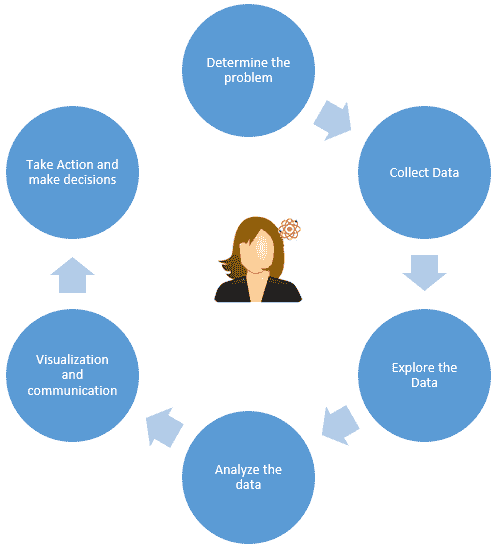

上述图表旨在表示数据科学家遵循的数据科学过程。

# 大数据平台

任何软件或硬件平台都应该支持大量数据集；否则，使用传统的数据库工具很难支持这些大量数据集：

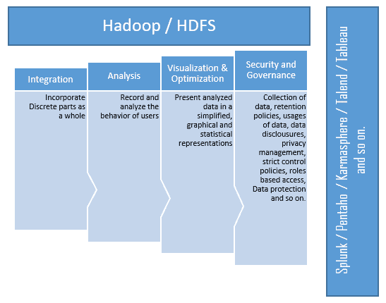

上述图表描绘了一个示例大数据平台，其中包含支持的样本工具、服务器、硬件等。

# 大数据工程

大数据工程从任何大数据平台的大量不同数据、数据暂存、数据概要和数据处理中获取最大价值。它还代表了将数据从后台系统迁移到前台以帮助数据分析师和数据科学家的最佳方式：

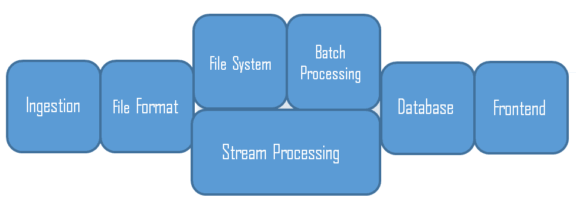

上述图表考虑了大数据工程景观的一个示例生态系统。在大数据景观的每个阶段都可以找到许多工具。以下是一些这些工具的例子：Hadoop、Oozie、Flume、Hive、HBase、Apache Pig、Apache Spark、MapReduce、YARN、Sqoop、ZooKeeper、文本分析等。然而，我们不会在这里讨论所有这些工具，因为这超出了本章的范围。

# 大数据治理

任何大数据企业都需要通过引入优化和隐私的规则或政策来发展和完善更广泛的 企业信息治理，同时找到货币化（价值）的途径，同时确保合规性和促进谨慎的风险管理：

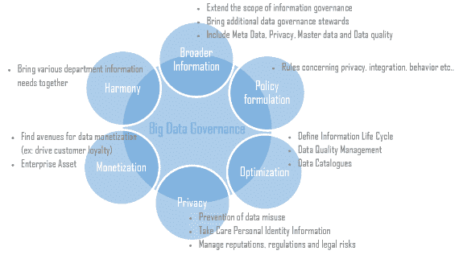

# 大数据架构景观和层

您应该能够从大量数据中提取有价值、有意义的信息（洞察），以改善涉及各种挑战的组织决策，例如数据法规、快速决策、与客户的互动、处理遗留系统、不同的数据源等。因此，为了有效地解决所有这些挑战，研究人员提出了一个由不同层级的层组成的统一架构：

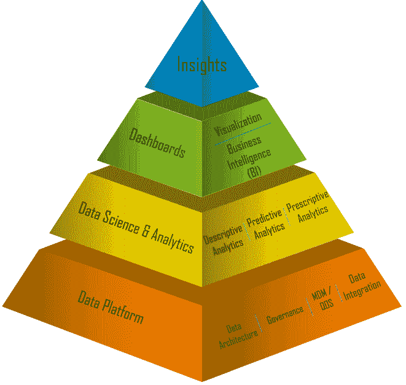

上述金字塔描绘了大数据层的重要属性以及每一层解决的问题。正如我们之前提到的，大数据不是解决一组用例的单个技术或框架；它是一套工具、流程、技术和系统基础设施，帮助企业基于大量数据痕迹进行更智能的分析和做出更明智的决策。

统一的大数据架构由多个层级组成。它提供了一种组织不同组件以解决问题的方式，并代表独特的功能：

+   **大数据来源**：来自多个渠道的数据，例如手持设备、软件应用、传感器、遗留数据库等

+   **数据消息和存储**：从数据源获取数据，数据合规性和存储格式化

+   **数据分析**：数据模型管理、分析引擎****和访问数据消息存储

+   **数据消耗**：仪表板、洞察、报告等

上述图表描绘了大数据景观的不同层级和层。这些层可能被视为我们之前对大数据概念介绍和每一层价值实现的总结。

在我们查看模式之前，让我们总结大数据架构原则如下：

+   解耦的数据总线

+   适合工作的正确工具

+   数据结构、延迟、吞吐量、访问模式

+   Lambda 架构

+   不可变日志、批量/速度/服务层

+   基于云的基础设施

+   低或无管理员系统维护

+   经济高效

# 大数据架构模式

在本节中，我们将根据以下大数据架构模式，带您了解大数据设计模式，并对大数据架构模式进行简要概述。

# MapReduce 模式

MapReduce 是一种软件框架实现，通过在集群基础设施上应用并行和分布式算法来处理和生成大数据集。

MapReduce 的主要方法如下：

+   **Map**：负责过滤和排序

+   **Reduce**：负责操作（例如，统计记录数）

# Lambda 架构模式

为了应对大数据挑战（在本章前面已描述），需要有一个数据处理架构来处理大量数据，并快速使用批量处理和流处理方法。

Lambda 架构的一些基本特征如下：

+   它依赖于底层数据的只增不减、不可变和原子性原则

+   它在平衡延迟、吞吐量和容错性方面茁壮成长

+   它与大数据和实时分析的增长相关

+   它有助于减轻 MapReduce 的延迟

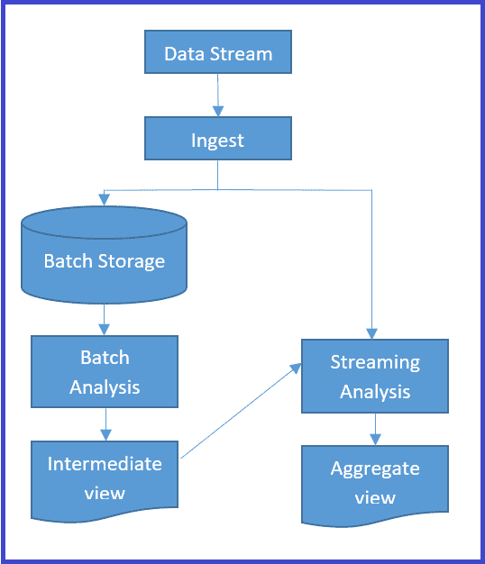

上一图展示了具有三个主要层（批量处理层、速度或实时处理层和用于响应查询的服务层）的 Lambda 架构。

这里解释了三个主要层：

+   **批量层**：此层预先计算结果，使用分布式处理系统输出到只读数据存储，并通过替换现有的预先计算视图来更新视图。批量作业中的视图数据精度高（精度高于延迟）。

+   **速度**/**实时层**：此层实时处理数据流，视图几乎即时生成，但可能数据精度较低（延迟高于精度）。然而，这些视图可以通过批量方法稍后更新（精度高于延迟）。

+   **服务层**：此层存储批量层和速度层的输出，以通过预计算视图或处理数据的新视图来响应即席查询。

# 数据湖架构模式

在成熟的企业中，最常见的业务案例是利用现有的数据基础设施以及大数据实施。数据湖架构模式提供了有效的方法来实现重用大部分数据基础设施，同时获得大数据范式转变的好处。

数据湖具有以下基本特征以应对：

+   管理大量未处理的数据

+   尽可能长时间保留数据

+   管理数据转换的能力

+   支持动态模式

以下图表描述了数据湖模式实现。它将来自不同数据源的原生数据引入数据存储。此外，接收到的数据需要在数据仓库中尽可能长时间保留。只有在确定数据源用于主线分析时，才会进行条件处理：

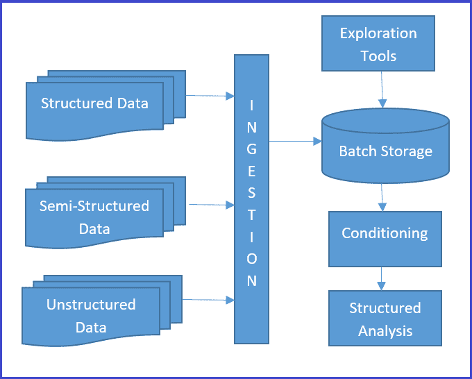

数据湖提供了一种机制，可以捕获和探索可能有用的数据，而无需承担额外的交易系统存储成本，或任何将数据源带入这些交易系统的条件处理工作。

数据湖实现包括 HDFS、AWS S3、分布式文件系统等。微软、亚马逊、EMC、Teradata 和 Hortonworks 是数据湖实现方面的主要供应商，它们在其产品中提供这些技术，并销售这些技术。数据湖也可以是云**基础设施即服务（IaaS**）。

# 大数据设计模式

本节涵盖了各种数据层（如数据源和摄取层、数据存储层和数据访问层）中最突出的大数据设计模式。

# 数据源和摄取层

企业大数据系统面临着各种数据源，其中包含非相关信息（噪声）以及相关（信号）数据。与信号相比，噪声比率非常高，因此从相关信息中过滤噪声、处理大量数据和数据速度是非常重要的。这是摄取层的责任。摄取层中常见的挑战如下：

+   多数据源加载和优先级排序

+   摄取数据索引和标记

+   数据验证和清洗

+   数据转换和压缩

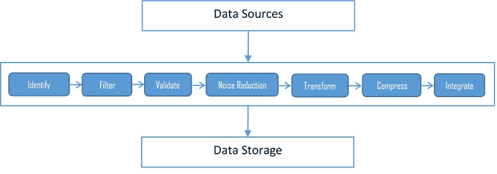

上述图表描述了摄取层的构建块及其各种组件。我们需要模式来应对数据源到摄取层通信的挑战，该通信负责处理性能、可扩展性和可用性需求。

在本节中，我们将讨论以下摄取和流模式以及它们如何帮助解决摄取层的挑战。我们还将简要提及一些常见的工作负载模式，包括：

+   多源提取器

+   多目的地

+   协议转换器

+   **即时**（**JIT**）转换

+   实时流模式

# 多源提取器

一种从多个数据源高效摄取多种数据类型的方法被称为*多源提取器*。效率代表了许多因素，如数据速度、数据大小、数据频率，以及在不稳定的网络、混合网络带宽、不同技术和系统上管理各种数据格式：

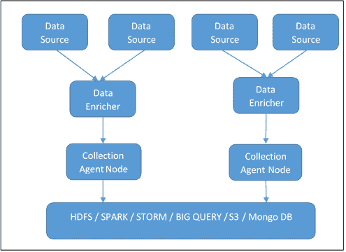

多源提取器系统确保高可用性和分布。它还确认大量数据被分割到不同节点上的多个批次。单个节点实现对于少量来自少量客户端的数据仍然有帮助，当然，对于批量处理的大量来自多个客户端的数据也是一样。在集群中将数据分割成小批量产生优秀的结果。

数据丰富器有助于进行初始数据聚合和数据清洗。丰富器确保文件传输的可靠性、验证、噪声减少、压缩以及从原生格式到标准格式的转换。收集代理节点代表中间集群系统，有助于最终数据处理和将数据加载到目标系统。

以下是多源提取器的益处：

+   为存储和消耗数据提供合理的速度

+   更好的数据优先级和数据处理

+   推动业务决策的改进

+   与数据生产解耦且独立于数据消费

+   数据语义和变更数据检测

+   可扩展和容错系统

以下是多源提取器的影响：

+   难以实现或不可能实现近乎实时数据处理

+   需要在丰富器和收集代理中维护多个副本，导致数据冗余以及每个节点上的巨大数据量

+   高可用性与高成本管理系统容量增长之间的权衡

+   基础设施和配置复杂性增加，以维护批量处理

# 多目标模式

在多源中，我们看到了原始数据被摄入到 HDFS，但在大多数常见情况下，企业需要将原始数据摄入到新的 HDFS 系统，同时也需要摄入到他们现有的传统数据存储，例如 Informatica 或其他分析平台。在这种情况下，额外的数据流数量导致了许多挑战，例如存储溢出、数据错误（也称为数据遗憾）、数据传输和处理时间的增加等等。

多目标模式被认为是克服先前提到的所有挑战的更好方法。这种模式与多源非常相似，直到它准备好与多个目标集成（参考以下图表）。路由器发布改进后的数据，然后将其广播到订阅目标（已在路由器上的发布代理中注册）。丰富器可以充当发布者以及订阅者：

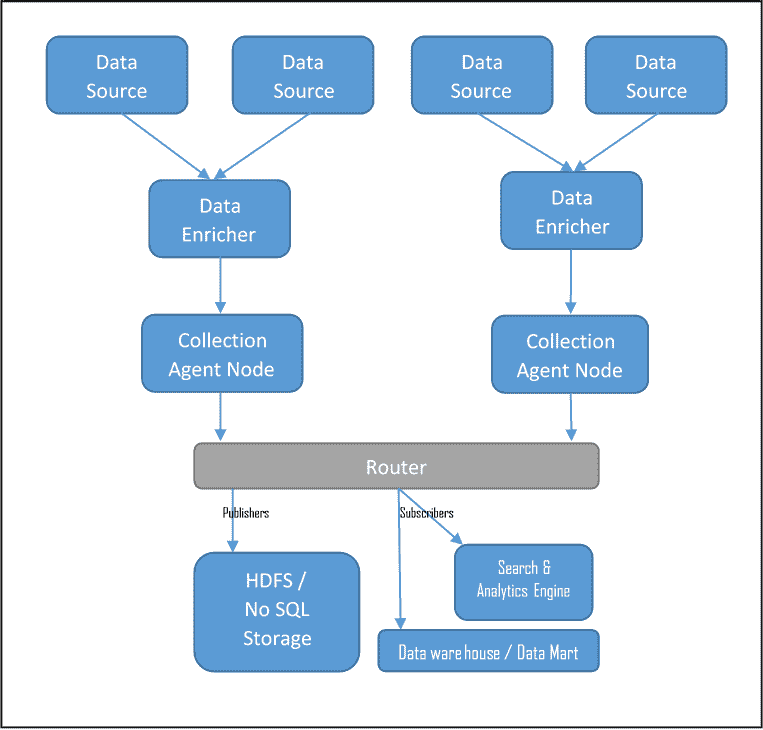

在集群环境中部署路由器也推荐用于高流量和大量订阅者。

以下是多目标模式的益处：

+   高度可扩展、灵活、快速、对数据故障有弹性且成本效益高

+   组织可以开始将数据摄入到多个数据存储中，包括其现有的 RDBMS 以及 NoSQL 数据存储

+   允许您使用简单的查询语言，如 Hive 和 Pig，以及传统的分析

+   提供了数据分区的能力，以实现灵活访问和去中心化处理

+   数据节点中实现去中心化计算的可能性

+   由于 HDFS 节点上的复制，没有数据丢失

+   自给自足的数据节点可以无延迟地添加更多节点

以下是多目的地模式的以下影响：

+   需要复杂或额外的基础设施来管理分布式节点

+   需要在安全网络中管理分布式数据以确保数据安全

+   需要实施、治理和严格的实践来管理数据的完整性和一致性

# 协议转换器

这是一种中介方法，为来自各种系统的传入数据提供抽象。协议转换器模式提供了一种有效的方法，从多个数据源和不同协议中摄取各种非结构化数据。

消息交换器处理来自各种协议和处理器的同步和异步消息，如下所示图所示。它执行各种中介功能，如文件处理、Web 服务消息处理、流处理、序列化等：

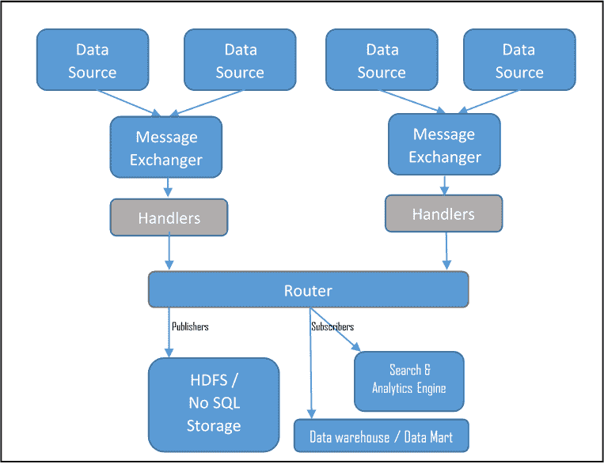

在协议转换器模式中，摄取层承担着识别传入事件的各个通道、确定传入数据结构、为多个协议提供中介服务到合适的接收器、提供一种表示传入消息的标准方式、提供管理各种请求类型的处理器以及从传入协议层提供抽象等责任。

# 实时（JIT）转换模式

JIT 转换模式在需要将原始数据在转换和处理之前预先加载到数据存储中的情况下是最合适的。在这种业务案例中，此模式运行独立的预处理批处理作业，进行清理、验证、关联和转换，然后将转换后的信息存储到相同的数据存储（HDFS/NoSQL）中；也就是说，它可以与原始数据共存：

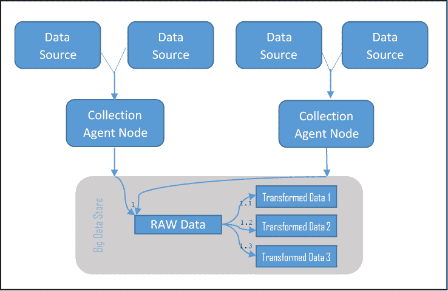

上述图示展示了包含原始数据存储以及转换数据集的数据存储。请注意，在多数据源模式中缺失的数据增强器在此模式中不存在，并且可以并行运行多个批处理作业以在大数据存储（如 HDFS、Mongo DB 等）中按需转换数据。

# 实时流模式

大多数现代企业需要对其企业大数据应用进行连续和实时的非结构化数据处理。

实时流实现需要具备以下特性：

+   通过使用大内存来最小化延迟

+   事件处理器是原子性的，并且相互独立，因此易于扩展

+   提供解析实时信息的 API

+   任何节点都可以独立部署的脚本，没有集中式主节点实现

实时流模式建议引入适当数量的事件处理节点来消费来自不同数据源的不同输入数据，并引入监听器来处理事件处理引擎中生成的事件（来自事件处理节点）：

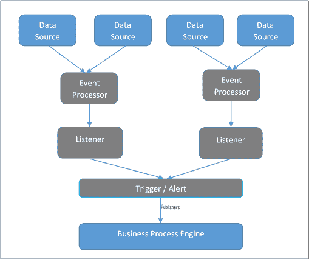

事件处理引擎（事件处理器）具有相当大的内存容量，事件处理器由特定事件触发。触发器或警报负责将内存中的大数据分析结果发布到企业业务流程引擎，并反过来被重定向到各种发布渠道（移动、CIO 桌面等）。

# 大数据工作负载模式

工作负载模式有助于有效地解决与不同领域和业务案例相关的数据工作负载挑战。大数据设计模式体现在解决方案结构中，因此工作负载挑战可以与正确的架构结构相对应，从而服务于工作负载。

以下图表描述了最常见的 workload 模式及其相关的架构结构：

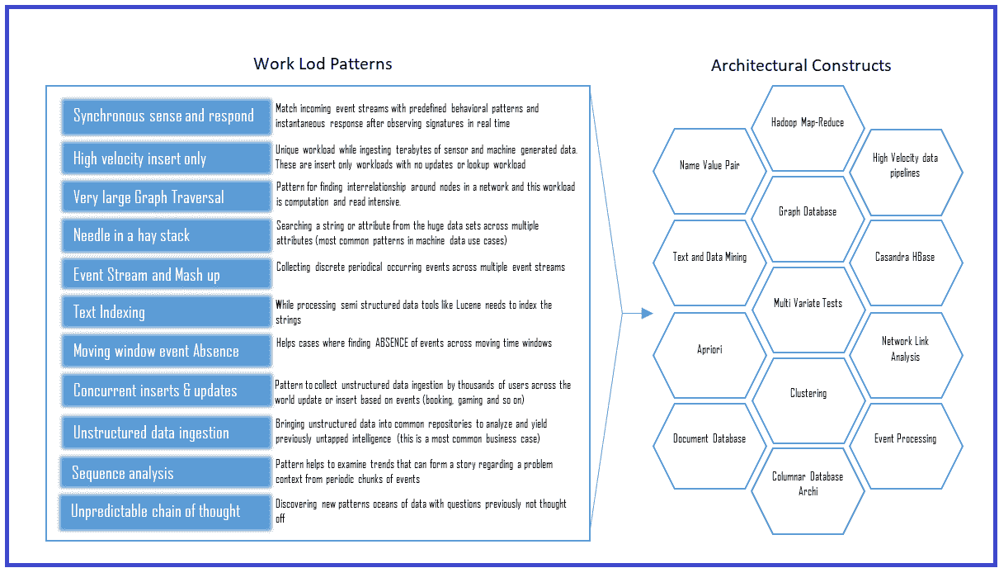

工作负载设计模式有助于简化并将业务用例分解为工作负载。然后，这些工作负载可以系统地映射到大数据解决方案架构的各个构建块。

# 数据存储层

数据存储层负责获取从各种数据源收集的所有数据，并且它还负责（如果需要）将收集的数据转换为可以分析的形式。以下部分将更详细地讨论数据存储层模式。

# ACID 与 BASE 与 CAP

传统的关系型数据库管理系统（RDBMS）遵循**原子性**、**一致性**、**隔离性**、**持久性**（**ACID**）来为数据库的任何用户提供可靠性。然而，如果存储强制执行 ACID 规则，则搜索大量大数据并从这些数据量中检索数据将消耗大量时间。因此，大数据遵循**基本可用性**、**软状态**、**最终一致性**（**BASE**），这是在大数据空间中进行任何搜索的现象。

数据库理论表明，NoSQL 大型数据库可能主要满足两个属性，并在第三个属性上放宽标准，这些属性是**一致性**、**可用性**、**分区容错性**（**CAP**）。

在 ACID、BASE 和 CAP 范式下，大数据存储设计模式获得了动力和目的。在本节中，我们将详细探讨这些模式。这些模式包括：

+   外观模式

+   NoSQL 模式

+   多语言模式

# 外观模式

此模式提供了一种使用现有或**传统现有数据仓库**以及大数据存储（如 Hadoop）的方法。它可以作为企业数据仓库和商业智能工具的外观。

在外观模式中，在转换之前，或甚至在加载到**传统现有数据仓库**之前，来自不同数据源的数据被聚合到 **HDFS**：

外观模式允许在以结构化存储的形式摄入 HDFS 后，即使数据以结构化存储在 **RDBMS**、NoSQL 数据库或内存缓存中，也能进行结构化数据存储。外观模式确保数据大小减少，因为只有必要的数据驻留在结构化存储中，以及从存储中更快地访问。

# NoSQL 模式

此模式涉及用 NoSQL 替代传统的 RDBMS，以促进对大数据的快速访问和查询。NoSQL 数据库以列式、非关系式的方式存储数据。由于它对 HDFS 有意识，因此它可以在本地磁盘以及 HDFS 上存储数据。因此，数据可以分布在数据节点上，并且可以非常快速地检索。

让我们简要地看看四种类型的 NoSQL 数据库：

+   **列式数据库管理系统**：简称为列存储或大数据表存储，它为每个元组拥有大量的列。每个列都有一个列键。列族限定符代表相关的列，以便可以检索列和限定符，因为每个列都有一个列键。这些数据存储适合快速写入。

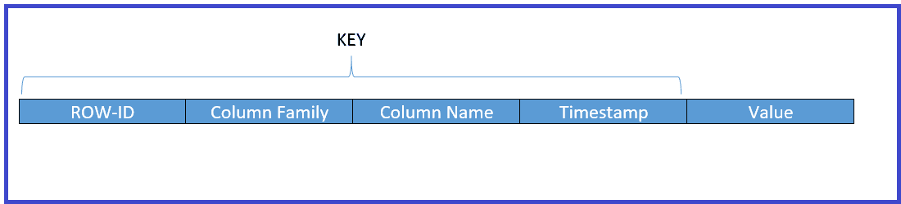

+   **键值对数据库**：键值数据库是一种数据存储，当提供一个简单的字符串（键）时，返回任意大小的数据（值）。键绑定到值，直到将其新值分配到或从数据库中。键值数据存储不需要有查询语言。它提供了一种添加和删除键值对的方法。键值存储是一种字典类型的数据存储，其中包含一个单词列表，每个单词代表一个或多个定义。

+   **图数据库**：这是包含一系列节点和关系的系统的表示，当结合在一起时，创建了一个图。图表示三个数据字段：节点、关系和属性。一些类型的图存储被称为三元存储，因为它们的节点-关系-节点结构。你可能熟悉提供类似或可能特征评估的应用程序，作为搜索的一部分（例如，一个用户购买了此物品也购买了...是图存储实现的良好示例）。

+   **文档数据库**：我们可以将图数据存储表示为树结构。文档树有一个根元素，有时甚至有多个根元素。注意，在根元素下面有一个分支、子分支和值的序列。每个分支都可以有一个表达式或相对路径来确定从起源节点（根）到任何给定分支、子分支或值的遍历路径。每个分支可能都与该分支相关联一个值。有时树中分支的存在具有特定的意义，有时分支必须具有特定的值才能正确解释。

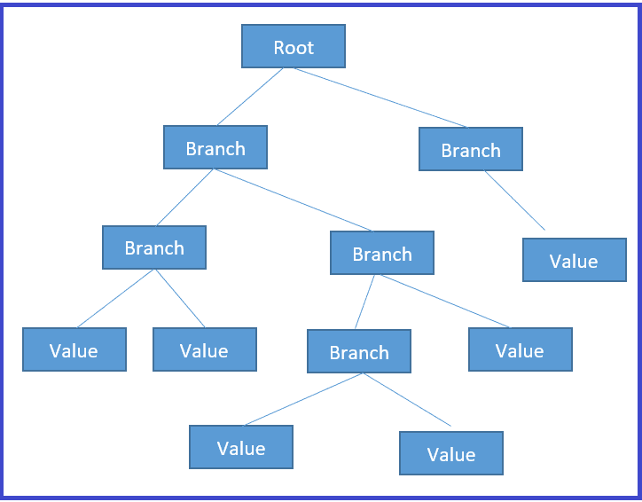

下表总结了可能需要考虑 NoSQL 模式的某些 NoSQL 用例、提供商、工具和场景。大多数这种模式实现已经是各种供应商实现的一部分，它们作为开箱即用的实现和即插即用，以便任何企业都可以快速利用。

| **要使用的 NoSQL 数据库** | **场景** | **供应商/应用程序/工具** |
| --- | --- | --- |
| 列数据库 | 需要根据给定的字符串获取整个相关列族的应用程序：例如，搜索引擎 | SAP HANA / IBM DB2 BLU / ExtremeDB / EXASOL / IBM Informix / MS SQL Server / MonetDB |
| 关键值对数据库 | 棋盘针应用（参考本节中给出的*大数据工作负载模式*） | Redis / Oracle NoSQL DB / Linux DBM / Dynamo / Cassandra |
| 图数据库 | 推荐引擎：提供“类似/喜欢”评估的应用程序：例如，*购买此物品的用户也购买了* | ArangoDB / Cayley / DataStax / Neo4j / Oracle Spatial and Graph / Apache Orient DB / Teradata Aster |
| 文档数据库 | 评估社交媒体数据或非企业数据流失管理的应用程序 | Couch DB / Apache Elastic Search / Informix / Jackrabbit / Mongo DB / Apache SOLR |

# 多语言模式

传统（RDBMS）和多种存储类型（文件、CMS 等）与大数据类型（NoSQL/HDFS）共存，以解决商业问题。

大多数现代商业案例都需要传统数据库与大数据技术的共存。同时，他们还需要采用最新的大数据技术。替换整个系统不可行，也不切实际。多语言模式提供了一种有效的方法来组合和使用多种存储机制，例如 Hadoop 和 RDBMS。大数据设备在存储解决方案中共存：

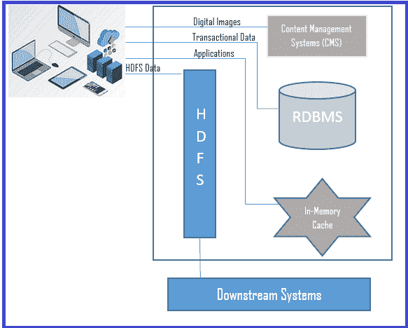

上述图表展示了多语言模式在不同存储类型中存储数据的方式，例如关系型数据库管理系统（RDBMS）、键值存储、NoSQL 数据库、内容管理系统（CMS）等。与将所有信息存储在单一数据源的传统方式不同，多语言模式使得来自多个来源（RDBMS、CMS、Hadoop 等）的所有应用程序的数据都能进入不同的存储机制，如内存、RDBMS、HDFS、CMS 等。

# 数据访问层

在传统数据库中，数据访问涉及 JDBC 连接和文档的 HTTP 访问。然而，在大数据中，即使有缓存实现，使用传统方法进行数据访问也需要花费太多时间来获取数据，因为数据量非常大。

因此，我们需要一种机制来高效快速地获取数据，同时减少开发周期，降低维护成本等。

数据访问模式主要关注访问两种主要类型的大数据资源：

+   端到端用户驱动 API（通过简单查询访问）

+   开发者 API（通过 API 方法提供访问）

在本节中，我们将讨论以下数据访问模式，这些模式在更广泛的数据访问中实现了高效的数据访问、提高了性能、减少了开发周期和降低了维护成本：

+   连接器模式

+   轻量级无状态模式

+   服务定位器模式

+   近实时模式

+   阶段转换模式

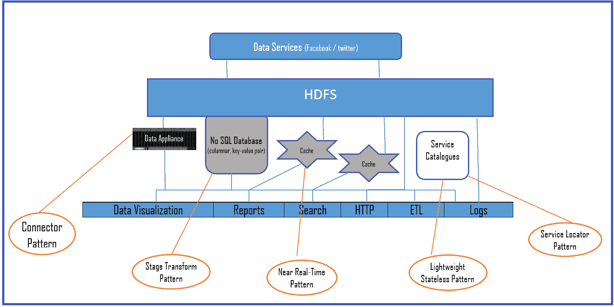

上述图表展示了大数据架构布局，其中大数据访问模式有助于数据访问。我们将在以下章节中详细讨论整个机制。

# 连接器模式

开发者 API 方法涉及通过 API 快速传输和访问数据服务。它创建了优化后的数据集，以实现高效加载和分析。尽管底层数据存储在 HDFS 或自定义文件系统实现中，一些大数据设备甚至抽象化 NoSQL 数据库中的数据，以便数据访问非常高效和快速。

连接器模式包括提供开发者 API 和类似 SQL 的查询语言来访问数据，从而显著减少开发时间。正如我们在早期图表中看到的，大数据设备自带连接器模式实现。大数据设备本身是一个完整的大数据生态系统，支持虚拟化、冗余、**使用协议进行复制**（**RAID**），并且一些设备还托管 NoSQL 数据库。

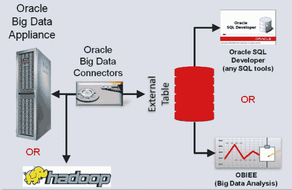

上述图表显示了 Oracle 大数据设备的示例连接器实现。数据连接器可以连接到 Hadoop 和大数据设备。这是我们之前描述的定制实现的一个例子，旨在通过减少开发时间来促进更快的数据访问。

# 轻量级无状态模式

此模式涉及通过 Web 服务提供数据访问，因此它独立于平台或语言实现。数据通过 RESTful HTTP 调用获取，这使得该模式在云部署中最为受欢迎。WebHDFS 和 HttpFS 是 HDFS HTTP 访问的轻量级无状态模式实现示例。它使用 HTTP REST 协议。HDFS 系统向分析大数据的消费者公开 REST API（Web 服务）。此模式降低了企业的拥有成本（按使用付费），因为实现可以是**集成平台即服务**（**iPaaS**）的一部分：

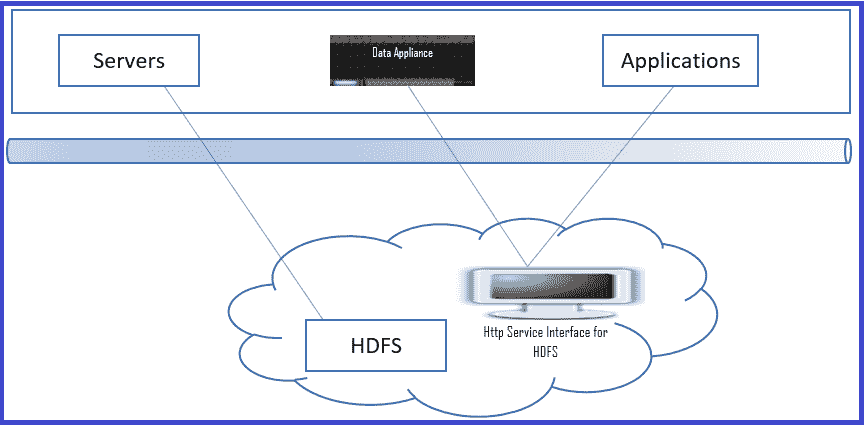

前面的图示展示了 HDFS 存储的一个示例实现，该实现通过 HTTP 网络界面公开 HTTP 访问。

# 服务定位器模式

在大数据存储环境中，存在不同类型的数据格式（多语言持久性），如果需要从存储数据的列表中选择并分析特定的存储类型，那么服务定位器模式就派上用场。当存储访问采用 SaaS 模型时，它提供了操作、过滤、选择和关联服务目录中服务的灵活性：

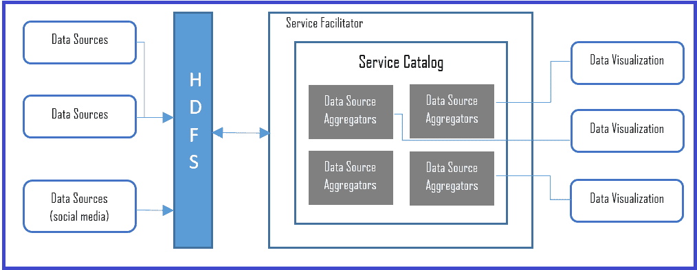

前面的图示展示了服务定位器模式的一个示例实现。来自各种来源的观测数据被聚合并通过服务目录公开，可用于可视化，或者可能用于进一步分析。服务聚合器可以在企业内部或外部聚合服务。不同的可视化工具可以混合匹配这些服务，以在企业数据旁边显示社交媒体，其格式与其他数据源格式不同。

# 近实时模式

对于任何企业要实现实时数据访问或近实时数据访问，需要解决的关键挑战是：

+   **快速数据确定**：确保快速确定数据，并在数据变得无意义之前（几秒钟内，而不是几分钟）迅速做出决策。

+   **快速分析**：能够实时分析数据，发现异常并将它们与业务事件相关联，在数据到达的瞬间提供可视化并生成警报

需要实时数据分析的一些系统示例是：

+   雷达系统

+   客户服务应用程序

+   自动柜员机

+   社交媒体平台

+   入侵检测系统

Storm 和内存中的应用，如 Oracle Coherence、Hazelcast IMDG、SAP HANA、TIBCO、Software AG（Terracotta）、VMware 和 Pivotal GemFire XD 是一些可以实施近实时数据访问模式应用的内存计算供应商/技术平台：

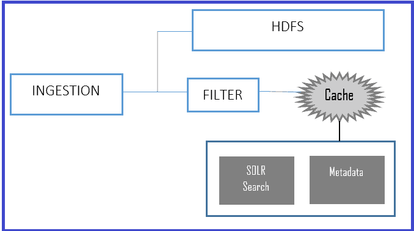

如前图所示，在摄取阶段实现多级缓存，并在多个存储目的地（此处其中一个目的地是缓存）中过滤和排序数据，可以实现近乎实时的访问。缓存可以是 NoSQL 数据库，也可以是前面提到的任何内存实现工具。前图描述了使用 SOLR 作为搜索引擎的典型日志搜索实现。

# 阶段转换模式

在大数据世界中，大量数据可以进入数据存储。然而，并非所有数据在每个业务案例中都是必需的或具有意义的。阶段转换模式提供了一种减少扫描数据量的机制，并只检索相关数据。

HDFS 在 NoSQL 数据库中包含原始数据和特定业务数据，该数据库可以提供面向应用的结构，并且只以所需格式检索相关数据：

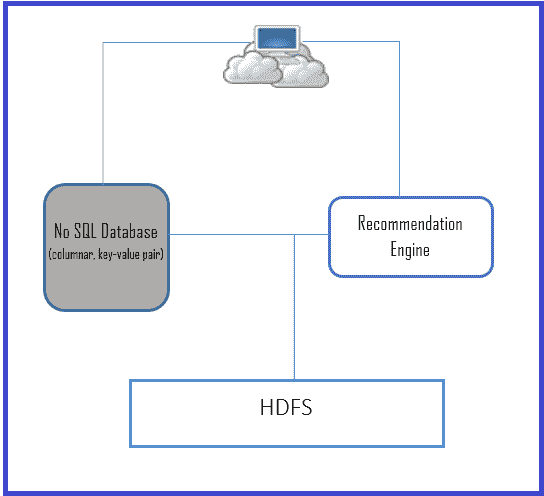

在需要减少数据扫描的情况下，结合阶段转换模式和 NoSQL 模式是推荐的方法。前图描述了一个这样的案例，即推荐引擎，我们需要显著减少扫描的数据量以改善客户体验。

将 HDFS 中的数据虚拟化到 NoSQL 数据库中，并与大数据设备集成，是一种高度推荐的数据快速或加速检索机制。我们已经在前面本节中展示的近实时实现中看到了这一点。

# 快速数据分析模式

为了更快的数据处理和访问，企业可以在其数据景观中选择以下任何一种工具。每种实现都有其自身的优点和用途；我们建议您详细阅读我们提供的参考资料中的每个实现，并根据您的企业需求选择最佳方案：

+   Apache Hadoop

+   Bash Reduce

+   Disco（诺基亚研究）

+   Apache Spark

+   Graph Lab

+   Apache Storm

+   Google Big Query

# 数据发现和分析层

大数据中的数据发现和分析不同于从有限集合中分析结构化 RDBMS 数据的传统分析。大数据分析需要更复杂的机制，因为它涉及自然语言处理、非结构化文本、视频和图像、RFID 数据等。本节涉及一些数据发现和分析模式，并提到了支持这些模式的工具。鼓励读者阅读其他参考资料以获得对每个模式更深入的理解：

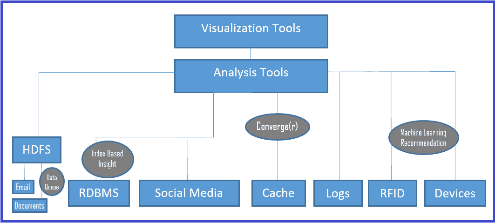

# 数据排队模式

在数据分析过程中，系统需要处理峰值情况是一种非常常见的情况。此模式引入了一个工作流程或过程，用于排队额外的数据块，然后将它们路由到可用的节点：

上述图示描述了数据队列和用于额外工作流程和路由到可用节点（多个节点）的处理器的一个示例实现。

使用云 IaaS 是处理动态峰值并实现更好成本节约的最佳选择。根据需要启动额外的虚拟机，峰值时更多，流量慢或平均时更少）。

# 基于索引的洞察模式

此模式根据与客户互动的用户输入定义索引（键）。迭代地，找到一系列索引是索引洞察模式建议的机制。它将分析机制或模式设置为索引变量，并提供对常见行为（如父母购买玩具，以及一个社区中所有 13 岁以上的儿童）的洞察。此模式有助于找到关键高效的查找，但保持相关列在一起。

# 机器学习模式

此模式有助于找到来自异构设备（如 RFID 设备、能源计量器、信号设备、与天气相关的设备等）生成数据输入的模式。

理解由自动化系统或无需人工干预的设备生成数据是一项具有挑战性的任务，需要依赖算法和统计方法。幸运的是，有一些出色的算法有助于分析这些数据，以下是一些传统算法：

+   简单贝叶斯分类器算法

+   K 均值聚类算法

+   支持向量机算法

+   Apriori 算法

+   线性回归

+   假设检验

+   聚类

+   方差分析（ANOVA）

+   逻辑回归

+   神经网络/人工神经网络

+   随机森林

+   决策树

+   最近邻

+   主成分分析

+   联合分析

+   集成方法

我们可以根据需要使用这些算法的一个或多个组合。鼓励读者参考其他材料以深入了解每个算法，因为本节的范围不包括它们。

# 收敛（r）模式

在大多数业务案例中，正如我们之前所看到的，企业需要处理传统（结构化）数据，同时利用大数据以获得企业级洞察。收敛（r）模式提供了一种有效的方法将非结构化数据与结构化数据合并，并获取洞察和做出决策。

在某些业务案例中，企业可能需要了解其产品来自社交媒体的情感（观点和意见）。结合外部数据格式与内部企业数据格式的收敛（r）模式是最佳选择之一。此模式涉及将社交媒体中的观点和意见与内部数据分析相结合，以获得综合数据洞察。

在分析企业数据之前，数据收敛需要发生。因此，我们可以使用外观模式（参考本章的“*数据存储层*”部分），并且还可以使用机器学习模式来使用来自社交媒体的分组数据（对于影响、收入、品牌形象、流失率等）。

DrivenData、天池、众包分析、InfoChimps、Kaggle 和 TopCoder 等工具提供现成的汇聚器实现，我们可以使用这些工具以及 ETL 工具进行数据转换、清洗和丰富，并通过结合数据获得见解。

# 数据可视化层

数据可视化的主要责任是通过使用视觉表示，如统计报告、图表等，从大量数据中提供更多见解。洞察力的可视化是利益相关者和赞助者最直观的部分；它是整个大数据范式中最具影响力的部分。

由于可视化最具影响力且考虑到可视化的广泛性，本节旨在仅简要介绍一些常见的可视化模式。然而，我们鼓励读者探索参考部分中提供的独特可视化材料。

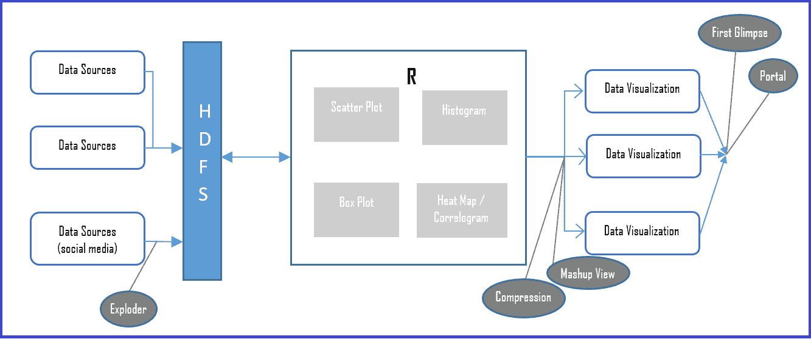

上述图表展示了样本大数据场景中的数据可视化模式。可视化模式需要支持高级视图和详细级别的细节作为视觉表示。此外，可视化模式可以与数据访问模式结合使用，以利用数据的快速访问及其展示。

# 初见模式

如其名所示，这是一种提供主要或简约可视化数据的方法，并且仅在需要时获取详细信息。

此模式涉及仅获取最关键和基本的数据（可能由机器学习模式、排名、分数等决定）作为第一印象，并在需要时获取钻取数据。一个例子是一个搜索应用程序仅显示一页（第一页）的搜索结果，并在用户需要时在后续页面上提供更多数据。

# 门户模式

在大多数常见情况下，企业已经拥有报告应用程序并打算重用这些应用程序进行大数据可视化，那么此模式涉及通过脚本框架增强网络应用程序（门户）以增强遗留可视化，从而为企业节省新可视化工具的成本。

以下列出了一些可能想要包含并增强企业门户以实现门户模式的脚本框架：

+   D3.js

+   Chart.js

+   HighChart.js

+   ChartList.js

+   Raphael

+   Processing.js

+   Pixi.js

+   Webix

+   AnyChart

+   Flot

+   Pykcharts

+   Cytoscape.js

# 混合视图模式

混合视图从异构数据存储（如 Hadoop、缓存和 RDBMS）创建聚合的混合视图，从而通过聚合查询结果来减少分析时间。

通过在 HIVE 层存储聚合的混合视图，它有助于提高查询性能，类似于传统的数据仓库。数据仓库的更新作为离线批处理作业进行：

| **支持的一些混合视图工具（供应商）** | **一些数据集成混合工具** |
| --- | --- |

|

+   IBM Netezza

+   Cassandra

+   Vertica, Cloudera Impala

+   Hortonworks Stinger

|

+   Damia

+   Yahoo Pipes

+   MS Popfly

+   **Google Mashup Editor** (**GME**)

+   Exhibit

+   Apatar

+   MashMaker

|

表 12.2：支持的混合视图工具和数据集成工具

你可能需要注意的一些混合视图的缺点包括文本/数据不匹配、对象标识符、模式不匹配、抽象级别不匹配以及较低的数据质量或准确性（由于从独立来源的数据集成）。

# 压缩模式

压缩是大数据分析中的一种数据减少方法，因为减少的数据大小在计算上更便宜。

压缩模式在需要访问数据而不进行聚合或混合的情况下提供了一个机制。通过拥有标准化的格式（无论数据来源如何都需要转换到标准化格式），压缩模式可以帮助从数据存储中更快地访问数据。拥有格式的优势是确保数据正确性和一致性。

最受欢迎的压缩数据分析平台是 R，也可以使用 ReRams 探索内存压缩。

# 爆炸模式

这是一个帮助数据分析师查看不同数据集、发现不同数据集之间关系的模式，同时也提供不同的视角。爆炸模式在企业需要各种数据视图且没有相同类型视觉模式限制的情况下是一个有用的模式。

它还允许用户通过点击从一个视图钻取到不同的图表类型或可视化模式。

# 摘要

尽管数据分析的开发领域并不新鲜，但随着企业、传感器、应用程序等产生的数据量巨大，它比以往任何时候都更加关键。一旦生成数据被存储，它可以提供非凡的洞察力，不仅帮助商业企业，也帮助政府和非政府企业、社会社区、经济等方面。

在当前的技术趋势中，大数据已经涉及到许多演变，从仅仅是 buzzwords 到从机器学习算法中处理数据。随着高速、高容量、高多样性以及数据源和流的真实性（四个 V）的指数级爆炸，大数据已经成为处理企业日益增长需求的架构、工具和技术的必然代表。

在本章中，我们简要介绍了大数据的四个“V”（Volume、Velocity、Variety、Veracity），数据分析技术和概念。我们还讨论了大数据生命周期以及它是如何帮助不同利益相关者实现和实现他们的数据洞察的。一个简短的章节涵盖了大数据景观、数据层以及与大数据相关的多数架构模式，包括数据管道：即数据采集、集成、摄取、快速处理、存储、快速访问和分析阶段的有序组合。

本书最关键的主题是架构模式，本章在其大数据架构和设计模式部分反映了这一点，包括一系列架构模式，如 MapReduce、Lambda 和数据湖。然后我们按层覆盖了最常见的（应用）大数据设计模式：即在各种大数据架构层中的模式，如数据源和摄取层、数据存储层、数据访问层、数据发现和分析层以及数据可视化层。

在一个章节中涵盖大数据架构模式对我们来说是一项非常大的挑战，我们通过提供大数据概念和最常见模式的样本，尽力帮助数据架构师和其他数据技术利益相关者。我们希望这一章能为他们的大数据之旅提供一个良好的开端。正如本章许多地方所提到的，我们强烈建议读者在需要获取独家模式和实现细节时参考引用部分。

# 参考文献

引用和参考资料：

+   **大数据**：Nitin Sawant 和 Himanshu Shah 著，《应用架构问答，问题-解决方案方法》（Apress 2013）

+   **大数据治理**：Sunil Soares 著，《一个新兴的必要性》（MC Press，2012 年 10 月）

其他来源：

+   [`assured-cloud-computing.illinois.edu/files/2015/02/Cristina_Abad.pdf`](http://assured-cloud-computing.illinois.edu/files/2015/02/Cristina_Abad.pdf)

+   [`bigr.io/architecture/`](http://bigr.io/architecture/)

+   [`blog.flutura.com//2012/08/11-core-big-data-workload-design.html`](http://blog.flutura.com//2012/08/11-core-big-data-workload-design.html)

+   [`ercoppa.github.io/HadoopInternals/HadoopArchitectureOverview.html`](http://ercoppa.github.io/HadoopInternals/HadoopArchitectureOverview.html)

+   [`insightdatascience.com`](http://insightdatascience.com)

+   [`www.bcs.org/upload/pdf/enterprise-architecture-patterns-201016.pdf`](http://www.bcs.org/upload/pdf/enterprise-architecture-patterns-201016.pdf)

+   [`www.bigdatapatterns.org/design_patterns/automated_dataset_execution`](http://www.bigdatapatterns.org/design_patterns/automated_dataset_execution)

+   [`www.bigdatapatterns.org/overview`](http://www.bigdatapatterns.org/overview)

+   [`www.bigdatascienceschool.com/selfstudy`](http://www.bigdatascienceschool.com/selfstudy)

+   [`www.infoworld.com/article/2616959/big-data/7-top-tools-for-taming-big-data.html`](http://www.infoworld.com/article/2616959/big-data/7-top-tools-for-taming-big-data.html)

+   [`www.pentaho.com/sites/default/files/uploads/resources/forrester_patterns_in_big_data.pdf`](http://www.pentaho.com/sites/default/files/uploads/resources/forrester_patterns_in_big_data.pdf)

+   [`www.refcodes.org/resources/Big%20data%20processing%20the%20lean%20way%20-%20a%20case%20study%20-%20v1.7.pdf`](http://www.refcodes.org/resources/Big%20data%20processing%20the%20lean%20way%20-%20a%20case%20study%20-%20v1.7.pdf)

+   [`www.yottastor.com/design-principles-big-data`](http://www.yottastor.com/design-principles-big-data)

+   [`arxiv.org/ftp/arxiv/papers/1201/1201.4479.pdf`](https://arxiv.org/ftp/arxiv/papers/1201/1201.4479.pdf)

+   [`bigdatawg.nist.gov/_uploadfiles/M0060_v1_8912129783.pdf`](https://bigdatawg.nist.gov/_uploadfiles/M0060_v1_8912129783.pdf)

+   [`blogs.msmvps.com/abu/2010/10/16/data-architecture-patterns-design-patterns-and-solution-patterns/`](https://blogs.msmvps.com/abu/2010/10/16/data-architecture-patterns-design-patterns-and-solution-patterns/)

+   [`conferences.oreilly.com/strata/big-data-conference-ca-2015/public/schedule/detail/38774`](https://conferences.oreilly.com/strata/big-data-conference-ca-2015/public/schedule/detail/38774)

+   [`conferences.oreilly.com/strata/strataeu2014/public/schedule/detail/37305`](https://conferences.oreilly.com/strata/strataeu2014/public/schedule/detail/37305)

+   [`hackernoon.com/ingestion-and-processing-of-data-for-big-data-and-iot-solutions-659431e37b52`](https://hackernoon.com/ingestion-and-processing-of-data-for-big-data-and-iot-solutions-659431e37b52)

+   [`iwringer.wordpress.com/2015/08/03/patterns-for-streaming-realtime-analytics/`](https://iwringer.wordpress.com/2015/08/03/patterns-for-streaming-realtime-analytics/)

+   [`link.springer.com/book/10.1007%2F978-1-4302-6293-0`](https://link.springer.com/book/10.1007%2F978-1-4302-6293-0)

+   [`static1.squarespace.com/static/55007c24e4b001deff386756/t/564a2b7de4b0c1a8406915fb/1447701373291/Maniyam%2C+Sujee.pdf`](https://static1.squarespace.com/static/55007c24e4b001deff386756/t/564a2b7de4b0c1a8406915fb/1447701373291/Maniyam%2C+Sujee.pdf)

+   [`vision.cloudera.com/the-six-principles-of-modern-data-architecture/`](https://vision.cloudera.com/the-six-principles-of-modern-data-architecture/)

+   [`www.datameer.com/wp-content/uploads/pdf/white_paper/Data-Preparation-Modern-BI-Common-Design-Patterns.pdf`](https://www.datameer.com/wp-content/uploads/pdf/white_paper/Data-Preparation-Modern-BI-Common-Design-Patterns.pdf)

+   [`www.dezyre.com/article/types-of-analytics-descriptive-predictive-prescriptive-analytics/209`](https://www.dezyre.com/article/types-of-analytics-descriptive-predictive-prescriptive-analytics/209)

+   [IBM 开发者工作区：大数据架构模式](https://www.ibm.com/developerworks/library/bd-archpatterns1/index.html)

+   [最佳大数据工具使用指南](https://www.import.io/post/best-big-data-tools-use/)

+   [大数据架构的十大指导原则](https://www.linkedin.com/pulse/top-10-guiding-principles-big-data-architecture-ram-narasimhan)

+   [工业大数据平台中的设备数据采集：案例研究](https://www.researchgate.net/publication/296634867_Device_Data_Ingestion_for_Industrial_Big_Data_Platforms_with_a_Case_Study)

+   [大数据架构模式和最佳实践](https://www.slideshare.net/AmazonWebServices/big-data-architectural-patterns-and-best-practices)

+   [SAS 纽约大数据会议](https://www.slideshare.net/AsterData/sas-ny-big-analytics-conference)

+   [大数据平台概述](https://www.slideshare.net/cscyphers/big-data-platforms-an-overview)

+   [7 个设计原则](https://www.slideshare.net/ZachGemignani/7-design-principles-44395597)
