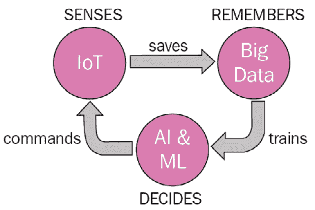
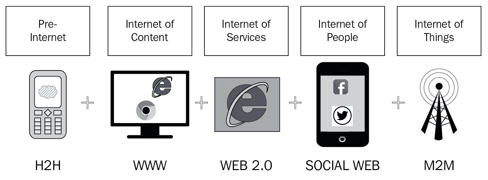
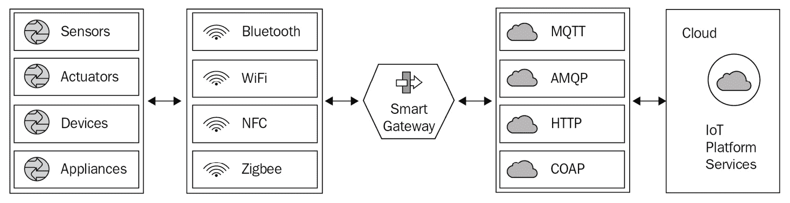
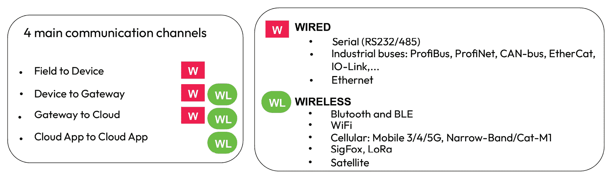

# 第一章：物联网和 Arduino 简介

将任何设备或机械连接到世界上最先进的通信网络——互联网，为人类进步开辟了无限可能。

实现一个互联互通的世界涉及许多不同的技术和技术方面、法规，甚至伦理原则。

在本章中，你将了解端到端**物联网（IoT**）应用的整个架构，包括其不同软件层以及其各个组件之间所需的通信渠道。我们还将分析物联网与其工业版本——**工业物联网（IIoT**）之间的相似之处和不同之处，并探讨**工业 4.0**概念以及工业数字化转型意味着什么。

这条信息对于理解物联网、工业物联网（IIoT）和 I4，以及评估其对我们日常生活的影响是基本性的。

最后，我们将介绍 Arduino 采用的开放源代码许可模型背后的原则和好处，以及一些保护项目源代码中知识产权的方法。

到本章结束时，你将能够指定一个商业物联网应用的技术要求，该应用实现了由物联网启用的新的数字商业模式模式，并基于**Arduino IoT Cloud**平台构建，考虑到 Arduino 商标。

在本章中，我们将涵盖以下主要主题：

+   物联网是什么？

+   用户的好处

+   不同的商业模式得以实现

+   端到端物联网应用的架构

+   通信技术和协议

+   安全方面和设备配置

+   开源

# 物联网是什么？

物联网没有单一的官方定义，但以下句子涵盖了这一概念的全部内容：

*物联网，简称 IoT，是将物理对象连接到网络，并将其他设备连接到网络，以便它们能够相互交互并与人类交互，通过互联网共享信息和采取行动的概念。*

这些物理对象是使用不同的电信技术连接到网络的电子设备。选择互联网作为网络并不令人惊讶，这不仅是因为这种技术的名称，还因为互联网本身的特性：

+   数字网络

+   全球覆盖

+   标准化规范

+   广泛用于个人和职业通讯

物联网设备通常被称为**物联网节点**，因为它们是这个网络的一部分。

它们配备了传感器来检测或测量物理属性，例如环境的温度或车辆的行驶速度。在其他情况下，它们连接到外部机械、设备或家用电器，始终具有相同的目的：收集物理属性的值，通常称为**遥测元素**，并将它们传输到互联网。一旦这些值到达互联网，它们几乎可以在世界上的任何地方在几百分之一秒内到达。

您可以考虑将物联网节点连接到工业机器，以远程传输其运行状态的信息，并在出现故障时通知维护操作员。或者，将节点连接到您的咖啡机，以测量咖啡粉的水平，并有可能在您在超市时远程检查它，这样您只有在需要时才购买另一包。

实际上，物联网开辟了几乎无限的应用可能性，因为将设备连接到互联网意味着可以远程监控环境和向节点发送命令。

事实上，物联网中使用的电信技术是双向的，信息可以从物联网节点流向互联网，反之亦然。物联网节点之间的交互主要与通过互联网作为通信媒体交换数字信息有关。

## 边缘智能与云智能

重要的是要强调，物联网节点也具有不同程度的处理能力；它们可以被编程以从互联网接收信息并相应地执行一些逻辑。

另一个例子可能有助于说明。您可以将物联网**节点 #1**连接到气象站，收集关于预报的信息，并将其传输到连接到您自动灌溉单元的物联网**节点 #2**。您可能编程**节点 #2**以防止在接下来的几小时内下雨时浪费水。另一个节点，**节点 #3**，可以嵌入传感器，并通过互联网与**节点 #2**共享土壤湿度值，以便在预报良好且土壤需要水分时，必要时激活灌溉。

这可能对我的小花园来说并不相关，但您可能考虑在广阔的田野中的好处，因为不同的区域可能根据作物的需求进行灌溉。

当控制逻辑直接在节点上编程时，我们说它在**边缘**，指的是物理世界和数字世界之间的边缘。

逻辑也可以在云端进行编程。在这种情况下，有一个运行在连接到互联网的计算机上的应用程序。实际上，云端使大量连接在一起并连接到互联网的计算机获得力量，目的是共享计算和存储能力，以及在多个系统之间平衡计算负载。采用*云端*方法时，云上的应用程序从一个或多个物联网节点接收遥测元素，汇总信息，并定义发送回相同或其他物联网节点的命令。

我提到命令，因为物联网节点还可以与执行器接口，例如电机、泵、电磁阀、电气继电器以及任何其他负责移动和控制机械的设备。这意味着物联网节点可以通过执行物理、编程动作作为对某些措施的响应来与物理世界交互。

以灌溉为例，物联网节点通过电气连接到液压伺服阀，并驱动它来控制水流到喷嘴。

即使应用的智能位于云端，物联网节点也总是在一定程度上实现嵌入式控制逻辑。这是为了接收、解释和响应来自云端应用服务器的命令。

*边缘* 和 *云端* 之间的区别主要与应用的真正智能相关，例如基于预测和土壤湿度来理解何时需要灌溉的能力。

因此，边缘的智能完全通过在节点上用结构化语言（如 C++或 MicroPython）编写软件代码或采用基于神经网络的智能模型来实现。采用*云端*方法时，由运行在云服务器上的应用程序软件负责决定自动触发阀门。

在边缘和云端实现之间的选择主要是由应用和所需响应时间驱动的。云端的实现允许在可编程功能方面有更多的自由度。这是因为云由多个协同工作的服务器组成，它几乎没有内存和计算能力的限制。另一方面，边缘的部署消除了与通信网络延迟相关的某些瓶颈，减少了物联网节点的响应时间，并允许它实时与物理世界交互。

值得注意的是，在边缘的部署并不排除在自动控制之外还实施手动远程控制节点的好处。例如，操作员可以通过网页上可视化的图形用户界面（称为*仪表板*）与现场设备进行交互。他们会看到环境条件的实际值，并可以按自己的意愿触发阀门。

应用程序的程序员负责定义和配置仪表板，仪表板可以像所需的那样复杂，带有用于可视化并插入数据（如图表和文本框）的小部件，以及触发开关、滑块、按钮等命令。

市场上出现了越来越多的边缘应用，适用于各种用例，在这些用例中，微控制器设备可以作为物联网节点的控制单元成功采用。这一趋势导致了硬件组件的持续、快速改进，计算能力增强，成本随之降低，以及无线电信技术的广泛应用，这些技术以非常低的功耗和长距离传输范围为特点。

当我们考虑在偏远且不易到达的地区安装物联网节点时，能源自给自足是一个非常重要的方面：我们希望尽可能减少对电池充电的需求，以降低人工干预的成本。理想情况下，一个好的物联网应用应该是完全自足的！

当你采用**低功耗广域网**（**LPWAN**）技术之一时，你需要考虑的是，降低功耗是以减少单条消息可以传输的数据量以及消息之间的更高间隔为代价的。这就像将数据视为一种能量形式，并应用能量守恒定律：如果你降低功率，你减少的不仅是传输范围，还有数据量。

每条消息的数据量减少以及两次传输之间的间隔变长意味着你需要减少与云交换的信息，这样云就需要更少的时间来收集所有值以进行处理。

当这个持续时间，我们可能称之为**云延迟时间**，过长时，那么在边缘实现智能就值得考虑了。

## Arduino 生态系统

不可能以相同的方式将单个设备连接到每种传感器、执行器、外部机械和设备，因为每个元素都实现了不同的电气接口和通信方式。

制造商生产物联网节点或适合构建物联网节点的组件，专注于定义的使用案例和技术，并采用市场上可用的各种标准。每个开发物联网项目的人都有责任选择最适合其应用的节点。当市场上没有现成的具有所需功能的产品时，你可以使用电子模块按需构建你的物联网节点。这就是 Arduino 派上用场的时候。

由于您正在阅读这本书，我们假设您已经了解 Arduino 是什么。无论如何，我认为值得提一下的是，Arduino 不仅仅是一种技术，而是一个由同名商业业务维护的生态系统。这个模块化生态系统由基于电子微控制器的开发板、固件、软件库以及用于编程板和本书中描述的云平台的工具组成。

Arduino 团队工程师对每个组件都进行了特别关注，以确保其可用性和用户体验，这符合公司的使命，即*“通过使复杂技术开放和易于使用，让每个人都能创新。”*（M. Banzi，Arduino 联合创始人）。

Arduino Cloud 也遵循同样的方法，您将看到如何轻松地使用 Arduino Cloud 开发物联网云应用，无需编程，只需配置即可。Arduino Cloud 的易用性与本地的边缘模型有关：Arduino 遵循在节点上实现智能的技术趋势，将数据存储和可视化任务留给云。

当您将 Arduino Cloud 与第三方服务接口时，其中应用程序逻辑和智能在第三方服务中实现，您仍然可以使用 Arduino Cloud 在云上部署物联网解决方案。

除了官方的 Arduino 兼容开发板外，您还可以使用 ESP32 & ESP8266 系列等流行的开发板，通过 Arduino IoT Cloud 来使用。这一特性帮助开发者使用现有的硬件解决方案将产品迁移到 Arduino IoT Cloud，而无需更改现有的硬件技术。

Arduino 生态系统中的另一个重要方面与使技术开放相关。Arduino 生产的大部分硬件和软件都公开发布在开源许可下，到本章结束时，您将了解与开源许可相关的利益和义务，以及如何保护您的知识产权。Arduino 还为工业应用提供专业硬件设备，例如**Portenta**系列，该系列专为物联网和人工智能解决方案设计。**Arduino Opta** **可编程逻辑控制器**（**PLCs**）是 PRO 系列中的新产品线，专为工业部署设计。有关 PRO 系列的更多详细信息，请访问[`store-usa.arduino.cc/collections/pro-family`](https://store-usa.arduino.cc/collections/pro-family)。

## 物联网、大数据、人工智能和机器学习

我们已经看到，物联网应用涉及物理世界和数字世界之间的连接，以创建某种形式的物理过程数字化自动化。结果是以下内容的综合：

+   将设备连接到互联网

+   允许设备共享信息以交互和协作

+   实现能够采取智能行动的智能应用

当我们谈论数字化时，其他热门词汇经常与物联网一起使用：**大数据**、**人工智能**和**机器学习**。这些是互补的科学，可以用来实现复杂的数字项目。我们将描述它们是什么以及它们如何与物联网结合使用。

**大数据**指的是极其庞大且复杂的数据集以及研究如何处理这些数据科学的领域。由于数据集的大小以及它们的非结构化和非聚合性质，传统的数据处理软件无法在合理的时间内处理大数据，因此需要专门的技术来提取有价值的信息和知识，这些信息用于支持决策和战略规划。

当我们考虑数百或数千个物联网节点实时共享来自物理世界的不同值时，你可能理解到数据的大小和种类需要比传统的数据库更多。

大数据涉及在云上实现逻辑。即使在物理世界中使用边缘模型以实现快速响应时间，数据也可以发送到云中进行无时间限制的长期处理。在这里，大数据可以提供支持。

例如，以我们智能灌溉的例子为例，一个节点可以使用土壤湿度传感器的值来控制边缘的水压阀，并与使用来自多个节点的数据来调整考虑天气预测模型的云应用共享信息，同时还包括来自国家气象站的其他信息。

你可以将大数据视为云应用处理原始数据以提取和存储有价值信息的应用。

人工智能和机器学习通常被称作是同一科学，但实际上它们不是。**人工智能**（**AI**）是一个广泛的领域，包括许多不同的子学科，其中**机器学习**（**ML**）是其中之一。

人工智能是一个更广泛的概念，指的是机器能够以通常需要人类智能的方式进行任务，例如视觉感知、语音识别、决策、语言翻译等。

机器学习是人工智能的一个特定子领域，专注于使计算机能够从数据中学习并做出预测或决策，而不需要明确编程来实现这一点。通常，机器学习涉及在数据集上训练一个模型，并使用训练好的模型对新数据进行预测或决策。

总结来说，人工智能是机器模仿人类智能的更广泛概念，而机器学习是实现人工智能的特定方法/技术，它允许机器从数据中学习，而不是被明确编程。

人工智能和机器学习模型可以通过使用大数据工具收集的数据进行训练，并用于解释来自同一或另一个大数据平台的新数据。

一旦训练完成，模型可以根据其大小和节点的技术特性部署在云上和边缘上。

当大数据工具直接使用分析模型处理数据时，AI/ML 则专注于数据中的模式，以识别情况和趋势。

例如，您可以使用大数据提取广泛区域土壤湿度的趋势，该区域每小时有数千个传感器收集值，大数据可以帮助您在数年的时间里区分日、月和季节性的变化。

机器学习（ML）的工作方式不同；它摄入不同类型的数据值，例如天气预报参数，并识别影响您观察到的模式。您可以通过训练一个神经网络，使用温度、大气压力、湿度、风速和土壤湿度值在一段时间内创建一个 ML 模型。然后您提供另一组来自不同时期的数据，没有土壤湿度值，该模型能够提出关于灌溉需求的指示。

参考以下图表，您可以看到一个复杂应用的完整数据流，其中物联网感知物理世界，在需要时立即在边缘做出反应，并将值转发到大数据进行离线或批量处理（非实时）：

图 1.1 – 与其他技术的数据集成

大数据存储和汇总用于训练和运行 AI/ML 模型的值。这些模型做出决策，并将命令发送回与物理世界交互的物联网节点。

## 物联网（IoT）、工业物联网（IIoT）和工业 4.0

物联网概念已被广泛应用于我们生活的各个方面，一些应用已经成为我们日常生活的常规部分。

例如，您可能只需花费几十美元在线购买一个智能门铃。该设备集成了麦克风和扬声器，并连接到您的 Wi-Fi。当有人按门铃时，这个物联网节点会通过您的手机远程提醒您，并允许您与门前的访客进行对话，即使您在家外数英里处。某些型号甚至可以解锁门。

您是否曾经通过要求 Alexa®、Google Assistant™或 Apple 的 Siri 打开家中的灯光？所有这些物联网节点都是智能建筑和家居垂直领域应用的例子。

高级解决方案根据环境情况（通过存在检测、温度和阳光传感器测量）来管理空调、窗户和窗帘。

我们已经在农业市场介绍了一个应用，其他相关应用包括通过 GPS 技术定位活体动物及其状况，并测量其生命体征参数。例如，快速心率可能是由于过热或捕食者存在而导致的压力症状。

我们都喜欢收到关于我们最近一次在线购买的频繁更新的跟踪信息。对于货运公司来说，在线跟踪交付也有助于减少投诉和相关的运营成本。所有这一切都得益于使用连接到互联网的手持设备和附着在贵重商品上的小型物联网节点，它们能够无线地将它们的位置发送到云端应用程序。物流无疑是物联网成功应用的领域之一，但医疗保健、零售、智能基础设施、安全和监控市场也提供了许多物联网应用的例子。

在工业环境中部署物联网应用通常被称为 IIoT。

工业物联网（IIoT）应用主要关注从物理世界收集数据，以更好地理解如何改进工业流程，更好地利用工厂，并优化能源、水、人力和其他参与活动的资源消耗。

主要目标是提高所有部门的性能并降低成本。

重要提示

这里不是讨论劳动力影响的地方，但我想说的是，IIoT 并不直接意味着操作员的减少，但他们的培训和技能增长可以在采用良好的公平就业政策时从成本节约的角度进行管理。

在工业环境中采用物联网原则需要特别注意节点的实施和部署，因为环境在温度、振动和电磁污染方面可能更为恶劣。

某些工业环境中由于温度较高而引起的过热会导致节点电子组件的故障，并缩短其使用寿命。

振动疲劳是电子设备故障的另一个主要原因。当节点安装在接触机器时，振动会传递到电子板上，并给组件施加应力，导致早期故障。

工业环境非常密集，机器中有工业电机，有电力电缆，有操作员的蜂窝设备，以及其他电磁场来源。

前述方面仅影响 IIoT 节点，而物联网在工业环境中的应用对云方面有其他影响：

+   **可扩展性**：工业物联网的云基础设施通常需要能够轻松处理和存储来自大量物联网设备的大量数据

+   **数据安全**：工业市场需要改进云安全措施，以保护云应用程序和 IIoT 设备免受网络威胁

+   **数据本地化**：工业市场的一个常见要求是所有数据都保持机密并限制在本国境内

几个原因可以证明请求云数据留在本地国家的合理性。当你考虑到将数据保留在某个国家可以确保其受到当地法律管辖和保护时，数据隐私和安全问题就显而易见了。

此外，一些国家在存储和处理敏感数据方面有严格的规定，将数据保留在本国有助于组织遵守这些规定。

最后但同样重要的是，与性能和成本效益相关的考虑：访问存储在远程位置的数据和应用可能会导致性能降低和更高的延迟。同样，跨国界传输数据可能既昂贵又复杂，因此在国家内部存储数据更具成本效益。

**工业 4.0**，也被称为**第四次工业革命**，是一个比 IIoT 更广泛的概念，它特指在智能工厂中应用 IIoT 技术以生产消费品。

以这种方式，生产过程得到实时控制和监控，数字化赋予机器和设备做出决策的能力，从而释放人力资源从事更高层次的任务。这是一个去中心化的决策方法，生产由机器和设备收集和分析的数据驱动，以加快生产过程的持续改进。

灵活的制造流程允许以单个客户在在线购物时定义的特征进行批量生产定制产品。

工业 4.0 意味着将一个完全自动化的工厂连接到互联网，以提升客户体验并优化整体业务性能。

客户可以前往他们偏好的在线商店购买一双运动鞋，选择型号，选择材料，配置不同部件的颜色，并下订单。通过信用卡支付后，订单以数字形式到达工厂，那里的机器和设备会实时配置，从仓库获取材料，生产定制的鞋子，包括在鞋子和盒子上打印你的名字，然后将盒子返回仓库，准备发货。

整个过程中没有打印出任何一张纸。设施管理人员可以在线咨询有关工厂性能的指标，而客户则在家中收到他们定制的鞋子。

这不是梦想，制造商耐克®（Nike®）已经在全球范围内实现了这一点。

工业 4.0 需要比 IIoT 云更广泛的软件架构。

你可能会认为 IIoT 云已经与 IIoT 应用中生产工厂的机器和设备接口。工业 4.0 还连接了企业不同部门的数字系统，包括以下内容：

+   **企业资源规划**（**ERP**）：自动化和管理核心业务流程以实现最佳性能

+   **计算机化维护管理系统**（**CMMS**）：管理资产、安排维护和跟踪工作订单

+   **仓储管理系统**（**WMSs**）：支持库存和管理供应链履行操作

在这里，我们详细讨论了物联网（IoT），以及云与边缘处理和人工智能的实施。我们涵盖了一些关于 Arduino 生态系统的细节，包括他们的 PRO 产品线。稍后，我们讨论了物联网、大数据、人工智能和机器学习，包括工业物联网（IIoT），因为它们都是高级项目中非常重要的支柱。在下一节中，我们将讨论在日常生活和工业中实施物联网对用户有哪些好处。

# 用户的好处

基于这些智能技术的应用为最终用户提供了巨大好处，例如自动化任务和使事物能够远程控制和监控。

物联网和工业物联网通过让物联网应用程序优化资源使用并允许我们降低成本来提高我们的效率。它们还增强了我们的安全和安保，因为物联网设备可以提供实时监控和警报。

物联网节点收集和分析数据可以用于个性化我们的体验，物联网解决方案提供的增强连接性创造了新的沟通和协作可能性。

最后，物联网和工业物联网通过下一节将要展示的新颖和现代商业模式，使企业能够实现新的发展。

你可能会问为什么这一切现在才发生，以及它是否没有代价。

物联网的历史可以追溯到 20 世纪 80 年代，当时英国技术先驱凯文·阿什顿（Kevin Ashton）在关于互联设备潜力的演示中首次使用了这个术语。

在 2000 年代初，无线网络标准如蓝牙和 Wi-Fi 的发展使得将设备连接到互联网变得更加容易，而蜂窝连接也成为了消费市场。

十年后，像微软、谷歌和亚马逊这样的主要科技公司开始投资物联网云平台。

今天，经过 40 年，软件技术的进步使得大数据、数据分析工具和云平台对大多数人来说变得可访问和负担得起。互联网是主要的通信媒介，电子设备的成本降低，以及 Arduino 等生态系统，使得技术易于使用。

物联网间接地为各个规模的企业带来成本，因为它们需要抓住时机，采用这些技术，并跟上进步以在市场上保持竞争力。

物联网的社会影响与引入不同的行为以及人类失去一些手动和实用能力风险相关。例如，在手机上可使用导航应用程序之前，人们开车旅行时有一定的方向感；如今，这种技能几乎消失了。

工业物联网引入了误导管理者认为这些技术通过减少劳动力来支持成本节约的风险，因为一切都被自动化了。实际上，人员需要培训来维护、故障排除和改进新系统，而且重要的是商业管理者要理解这一点。

最后，参与物联网项目的每个人都必须考虑应用并妥善管理社会影响。这意味着这也是读者的责任。

# 不同商业模式的实现

宾夕法尼亚大学安南伯格传播学院的罗伯特·刘易斯·谢扬通信学教授约瑟夫·图罗说：“尽管存在黑客攻击和隐私问题，但人们仍会感到需要保持联系，部分原因是公司会为此奖励他们（或者如果他们不这样做，会使生活变得困难）。”

事物与人们之间这种改进的连通性对数字商业模式模式的演变有直接的影响。

下图来自博世物联网实验室的白色纸张《商业模式与物联网》，展示了网络技术的演变以及在各个阶段启用了哪些商业模式：

图 1.2 – 网络技术演变

我们现在完全处于 Web 3.0 阶段，物联网在创造和获取商业价值方面需要心态上的巨大转变。哈佛大学商学院注意到了这种变化，并强调了这一系列影响。

首先，客户要求他们的需求得到实时解决。物联网甚至允许企业以预测的方式解决突发需求。

物联网提供的可能性改变了产品在其生命周期中的管理流程。产品的过时性减少，并且发生的时间更长，因为产品的新版本是通过考虑从产品本身自动收集的关于使用情况的聚合信息来评估的，并进行分析以确定有效需求。此外，提出的使用体验明确基于产品与其他产品的*协作*，最终由第三方制造。

这改变了产品的价值，使得客户在产品的个性化和其功能方面感知到的利益，比在商品优势（如低成本、高质量和即时可用性）方面感知到的利益更多。或者，在专业和工业产品的案例中，品牌和知识产权的所有权。

对物联网产品协作能力的欣赏也表明，制造商应该投资资源来了解其他生态系统如何运作和盈利，目的是开发一定程度的兼容性，而不仅仅是努力利用内部核心能力和现有资源及流程。

一旦确定了新版本的特性并实施，制造商通常可以同时更新许多产品，并且通过远程空中进行更新。这是可以作为产品内在价值或为订阅者提供的付费服务提供的一项吸引人的服务。

提供额外服务的可能性增加，将业务战略中的盈利途径转向。新的方法是在即时收入和持续收入之间寻找最佳平衡。与传统的核心业务相关的即时收入通常需要大量努力和大量投资来扩大销售产品的数量。另一方面，基于物联网能力建立和维护良好服务所需的行动，保证了在一段时间内持续的收入。

## 物联网推动的商业模式

当你从两个或三个主要制造商之一购买一部手机时，通常情况下，你并不支付设备的真实价值，而是产品的感知价值。许多人热衷于在代表地位象征的手机上花费更多，而不是在匿名型号上，即使它们具有相同的功能。地位象征被视为产品价值的一种利益。

以类似的方式，我们可以根据物联网解决方案提供的效益来计算其价格，而不是其成本。例如，我们可以考虑一个智能建筑项目以提高能源效率：物联网系统跟踪和分析能源使用情况，自动控制公共区域的照明，并允许建筑物的所有者确定需要改进的区域并降低其能源成本。

根据这个被称为**基于结果**的模型，解决方案提供商可能会提出一个系统，该系统占客户能源账单节省额的一定比例，加上安装和拆除成本。他们使用自己的物联网硬件维护财产，而不出售它，但在关闭合同时，他们为一定时间创造了一个持续收入的来源。在合同期满时，他们拆除并重复使用物联网产品进行另一项安装。这样，物联网硬件的成本是解决方案提供商的投资，考虑到之前提到的产品生命周期和这些设备的低磨损水平，它可以产生良好的回报。

为提供的好处付费并不隐含地意味着支付超过产品的价值，但它仍然对双方都方便。这就是**按使用付费**模式的情况。回到智能灌溉的例子，农民可以使用水公司提供的物联网应用来灌溉作物，费用基于使用的水量。目标不是从物联网设备本身赚钱，而是利用节点产生的数据来跟踪使用情况。

**资产共享**模式是一种按使用付费的商业模式，其特点是物联网节点监控的资产被多个客户共享。例如，在过去的几年里，许多企业在世界各地的许多城市购买了并出租了电动滑板车。用户在提供商的平台上注册，并使用他们的手机（连接到互联网）来启动和停止租赁，并相应地启用滑板车。这是一个物联网在智能城市垂直领域的很好应用例子：用户的手机和滑板车都连接到互联网，并通过互联网进行交互。在这种情况下，用户为在特定地区骑行的便利付费，比他们购买自己的滑板车要少，因为他们与当地社区共享物联网产品——滑板车。资产共享模式基于向市场销售额外容量的概念，并解决了人们在购买昂贵设备时普遍关心的问题：我能否充分利用它？

当我们谈论与服务销售相关的商业模式时，**订阅**模式是最为人所知的：用户不需要支付拥有解决方案的费用，而是定期支付一定金额来使用它。这种模式通常被提供智能家居设备（如智能恒温器、安全摄像头和智能锁）的公司采用。客户支付每月或年度费用以获取设备的访问权限，以及通过移动应用控制和监控设备的能力。

在采用趋势日益增长的一种物联网订阅商业模式是**资产追踪**。随着功耗和尺寸的降低，以及物联网节点尺寸和成本的降低，使得逐步采用本地化不同资产成为可能。在这种情况下，订阅者不需要为物联网节点付费，而是为定期访问定位数据和资产的移动付费。

物联网支持其他类型服务的提案；例如，一个预测性维护的物联网解决方案可以提供便捷的维护服务，这种合同对承包商和客户都有吸引力。承包商可以保持较低的费率，因为他们不需要定期安排到客户那里进行访问：系统会提前通知他们，以便在紧急之前计划干预。同时，他们可以扩大客户群，以证明安装解决方案的成本是合理的。

咨询公司可以安装物联网解决方案来测量生产工厂中机械的性能，而无需停止任何机器，因为所有数据都是由不需要与现有工厂接口的自主物联网节点收集的。数据用于衡量**总体设备效率**（**OEE**）并建议如何优化工厂的使用。在这种情况下，公司的核心业务不是销售物联网解决方案，而是从物联网应用收集的数据中衍生出的服务。

物联网中的**剃须刀-刀片**商业模式与传统模式相似，但增加了物联网技术的便利性和定制化。目标是让产品以成本或更低的价格进入客户手中，开始销售您的其他产品。这个名称来源于公司吉列®，它是发明者和第一个采用者：其主要收入来自刀片的销售，而剃须刀只是带来刀片销售的主要手段，因为每卖出一把剃须刀就会产生多把刀片的购买。以类似的方式，惠普®以非常低的价格销售喷墨打印机，目的是从墨盒的销售中获得收入。物联网可以监控客户的习惯并建议最佳的消耗品模型。它还可以增加重新订购的可能性，因为设备可以自动下单。

有一些情况下，企业免费提供物联网应用硬件，因为其目的是通过收集和转售用户数据来盈利。这与涉及驾驶习惯监控设备的情况有关。虽然这些设备为用户提供有价值的见解，但保险公司通过分析大量个人的驾驶模式获得了显著的好处。引入这种模式可以被视为你主要业务的扩展，你最初专注于满足最终用户的需求，随后探索从他们的数据中产生收入的机会。这两种方法可以和谐共存，只要你优先考虑向客户透明地说明数据使用情况，并采取必要措施保护他们的隐私。

在上一节中，我们讨论了由于智能产品而受益的创新和改进。物联网不仅改善了最终用户的生活方式，还帮助新的商业模式出现，并帮助行业向工业 4.0 转型，这有助于行业安全、快速且经济高效地运行生产线。

# 物联网端到端应用架构

现在我们对物联网有了更多的了解，我们看到了其原理和一些不同应用的例子，现在是时候深入探讨技术方面，通过分析物联网应用架构来进行分析了。

我们已经介绍了物联网节点、云平台和应用。一图胜千言，以下图表展示了物联网解决方案的整体架构：

图 1.3 – 物联网系统的高级架构

云平台和云应用之间存在一个重要的区别。**云平台**实现通信、用户和设备管理、数据存储和安全等基本服务；**云应用**实现应用程序的逻辑、仪表板以及应用程序的所有具体方面。

在这种意义上，Arduino IoT Cloud 可以被视为运行在 AWS 云平台上的云应用。

多亏了互联网提供的连接性，您只需利用第三方已经实施并通过互联网相互连接的多个云应用、框架和服务，就可以设置一个具有许多不同功能的复杂物联网解决方案。这意味着您不需要从头开始开发或配置一切，您可以节省时间和精力；这也解释了为什么多个云平台和云应用在前面的图中被可视化。

这些功能的例子可以是**单点登录**（**SSO**），一种用户身份验证服务，允许用户使用一组登录凭证（例如，用户名和密码）访问多个应用程序——例如社交媒体平台和其他大量应用程序。您只需决定您需要什么，在互联网上搜索首选提供商，然后轻松地将这些功能集成到您的应用程序中，而无需编程。这也适用于 Arduino Cloud 平台，该平台提供了几种与第三方应用程序接口的不同方式，正如我们将在*第十二章*中看到的那样。

网关是我们需要讨论的最后一种模块。**网关**支持节点和云平台之间的连接。或者更准确地说，它们是连接节点到互联网并允许节点和云应用之间交换数据的桥梁。存在许多不同类型的网关，它们的特点是它们实现的通信技术。

您的 Wi-Fi 路由器是网关的一个完美例子：它连接到互联网，并通过 Wi-Fi 接受来自其他设备的连接。它将 Wi-Fi 设备转换为您的互联网提供商的数据传输技术（有线、以太网或光纤电缆）。

网关还可以实现其他功能，例如数据过滤、协议转换和安全。每个物联网应用都包括网关在架构中，即使它们不是由您或解决方案的程序员直接管理。

让我们考虑一个使用蜂窝连接的节点应用。它可能看起来节点是直接连接到互联网的，但实际上并非如此。实际上，节点既连接到蜂窝网络，也连接到由网络提供商管理的专用网关。清楚地了解架构中所有组件的存在非常重要，因为每个部分在出现问题时都可能成为弱点，并可能使故障排除变得更加漫长和复杂。

# 通信技术和协议

数据在物联网节点和云应用之间的往返过程中通过多个不同的设备流动。这些设备实现了各种通信技术和协议，以下图表显示了最常见的选项：

图 1.4 – 通信技术和协议

在整个链中的四个主要通信路径中，主要区别与通信的无线或有线性质相关。

根据前面的图示，*现场到设备*路径通常是线性的：传感器、执行器和设备通过电线连接到物联网节点。它们根据图示中显示的有线接口标准之一打包和交换数据。

*设备到网关*路径可以是有线或无线，具体取决于节点对每个特定应用的技术要求。与有线物联网节点相比，无线物联网节点提供以下好处：

+   **移动性**：无线物联网节点不受物理连接的限制，可以轻松移动或重新定位，提供更大的灵活性和自由度

+   **安装简便性**：无线节点不需要布线，可以更快、更轻松地安装，从而降低安装成本和时间

+   **可扩展性**：向无线物联网网络添加新节点或设备比添加有线节点更容易且成本更低

+   **无基础设施需求**：无线物联网节点不需要现有的有线基础设施，这使得它们非常适合偏远或难以到达的地方

+   **提高可靠性**：无线节点不太可能因电缆的物理损坏而失效，这使得它们对于许多物联网应用来说更加可靠。

然而，值得注意的是，无线物联网节点可能会受到其他无线设备的干扰，范围有限，以及潜在的安全问题，因此在选择有线和无线物联网节点时，考虑这些限制是很重要的。

例如，对于河流上桥梁的负载、振动和结构监测的物联网节点，它们分别提供有关维护、交通平衡和改进需求的有用信息，这些节点不需要无线连接。另一方面，许多智能农业应用得益于长距离无线技术，因为这些技术在覆盖广阔区域的有线网络中存在困难和安装成本。

考虑到儿童公园有很多物联网节点，我们可以将不同市场垂直领域的应用大致分为四个主要组：

+   **传输范围非常短的消费设备**：可穿戴设备、安全设备、遥控器和玩具通常使用蓝牙或**蓝牙低功耗**（**BLE**）连接到一部手机，该手机共享互联网连接。这种方法展示了使用不同技术的多个网关级联以实现所需连接的可能性。

+   **传输范围较短的消费设备**：这是家庭自动化设备的情况，例如你家的恒温器或家用电器，娱乐设备、个人乐器和通过有线 Wi-Fi 接入点连接到互联网的医疗保健设备。

+   **无线专业设备**：汽车、智能农业、采矿以及一些物流和户外工业应用需要最新的蜂窝技术提供的非常长的传输距离，这包括 3G/4G/5G 或 LPWAN。

+   **有线专业设备**：一些基础设施项目，如桥梁和水库的监控或室内工业项目，需要有线节点来提高可靠性、增加传输的数据吞吐量、减少电池更换的维护需求，并提高数据安全性。

在大多数物联网应用中，*网关到云*的连接是有线的，最终网关提供回程无线连接到互联网。这是专业 Wi-Fi 和 LoRa 网关实现以太网接口和蜂窝调制解调器的情况：如果以太网连接失败，网关会自动切换到蜂窝网络。

定义*云到云*通信路径的性质有点棘手，因为我们需要考虑云应用运行在云平台上，这些平台由相互连接的服务器组成。服务器之间的物理连接肯定是线性的，但我们可以将云应用之间的逻辑连接视为无线，因为与安装在互联网上单个服务器上的应用相比，无线和有线物联网节点提供相同的优势。

图 1.5 – 有线/无线通信技术

在本节中，我们讨论了具有多个节点、网关和云的端到端物联网应用的高级架构。在本节的第二部分，我们讨论了通信技术和协议，我们将不同的通信技术分为无线和有线介质，以便更好地理解。在下一节中，我们将详细讨论物联网解决方案的安全性以及设备配置服务。

# 安全方面和设备配置

在许多应用中，物联网设备收集和传输敏感数据，如个人信息或财务数据，如果数据没有得到适当的保护，这些数据可能会面临被盗或未经授权访问的风险。在任何物联网应用的设计和实施中，安全必须是首要任务，以确保通过系统传输的数据的安全性和隐私性。

在物联网架构的安全链中，最薄弱的环节是物联网节点以及物联网设备和云之间的接口。

我知道我们说过物联网节点和云之间总是有一个网关。事实上，网关实现了设备与云之间可靠端到端通信通道的所有通信层。节点和云是这个通道的两端，主要在这一层，数据可能容易受到黑客攻击、篡改或未经授权的访问，从而可能损害其安全性和隐私。

## 硬件安全

攻击者可以利用过时或未打补丁的软件中的安全漏洞，当节点基于运行常见操作系统的微计算机时，这种情况更为可能。当节点具有运行在裸机上的微控制器作为固件时，如 Arduino 生态系统中的情况，这种可能性会显著降低。这是因为设备上运行的软件减少到仅严格必要的最小值以运行设备。

在节点上采用强大的数据加密算法可以保护通过网络传输的数据，使其更不易受到窃听或篡改。在这种情况下，Arduino 生态系统也证明了它是实现物联网应用的不错选择：用于物联网的 Arduino 设备嵌入称为**加密芯片**的安全元素，能够在硬件级别生成和管理安全密钥，无需在节点应用程序的源代码中包含密码。我们将在本节末尾看到这意味着什么以及它是如何工作的，但现在有必要讨论与物联网节点相关的另一个安全风险。

这是不充分的访问控制：一些访问控制不充分的物联网设备可能允许未经授权的个人访问或控制设备，从而可能危及整个系统的安全性。

访问可以是远程的，甚至可以直接访问设备以提取原始固件并将其覆盖为黑客编写的不同版本。固件的提取也可以仅用于在兼容但复制的硬件上复制原始设备的功能，从而威胁到物联网业务的成果。

Arduino 为其传统的引导加载程序（bootloader）设计了一个安全版本，以防止这些风险。**引导加载程序**是设备上首先执行的软件，负责加载固件并初始化设备的硬件。

**Arduino 安全引导加载程序**通过实现固件故障安全认证和安全更新的机制，在传统的引导加载程序中添加了一个安全环境。这些机制防止了对设备固件的未经授权访问，并确保只有授权的固件可以在设备上执行。

固件的真实性检查基于数字签名并保证安全性：引导加载程序在将固件加载到设备内存之前检查其数字签名，并在遇到未经授权或错误签名的固件时不继续执行，从而防止设备启动。同样，安全引导加载程序可以防止篡改、数据损坏和逆向工程：它在覆盖旧版本之前验证新版本的固件，并且可以配置为防止从设备读取实际固件。

物联网节点（IoT node）的程序员生成并管理他们的数字签名，保持对设备的完全控制，但同时也排除了其他人。

我建议在任何物联网项目中采用安全的引导加载程序，因为实现它的最小努力立即在设备和数据的安全性和完整性方面得到回报。

基于微控制器的节点，具有强大的硬件加密能力和安全启动机制，解决了节点上的大部分安全担忧。定期的安全审计确保物联网设备和后端系统之间交换的数据得到保护，而云平台和云应用提供商负责通过实施安全数据存储实践和定期备份，以及定期监控系统以检测和及时响应潜在的安全事件，来保护云上处理和存储数据的后端系统。

## 安全通信的加密

Arduino 将其物联网云和基于 Arduino 的物联网节点的安全性视为首要任务。Arduino 物联网云需要使用 SSL/TLS 加密进行连接，未实现该加密的设备无法配置到云中。Arduino 物联网云定期更新其安全措施以应对新的威胁和漏洞，并运行在 Amazon AWS 平台上，该平台拥有符合最安全敏感组织需求的数据中心和网络架构。

物联网节点的配置是指配置和设置设备以进行操作，并将其连接到网络或平台的过程，以便它可以与它交换数据并与其他设备交互。在此过程中，设备应配置为建立与云的安全连接的信息，云应配置为接受来自已注册的知名设备的连接，并管理与其交换的数据。

一旦设备配置完成，它就可以在需要时连接到云，并以安全的方式交换数据。

SSL/TLS 安全协议是互联网上用于安全通信最广泛采用的协议，并使用对称加密和非对称加密的组合：

+   **非对称加密**：公钥密码学，也称为非对称加密，使用一对公钥和私钥来对数据进行加密和解密。在此方法中，公钥用于加密数据，而私钥用于解密数据。

+   **对称加密**，另一方面，使用单个共享密钥来加密和解密数据。它比非对称加密更快、更高效，但需要在客户端和服务器之间安全地交换密钥。

在 SSL/TLS 中，客户端和服务器之间的初始握手使用非对称加密执行。客户端和服务器同意一个共享密钥，然后使用该密钥对它们之间传输的数据进行对称加密。这种方法既提供安全性又提供性能，使其成为物联网环境中保护通信的加密协议。

最后，设备需要知道 SSL/TLS 握手的公钥，而云需要知道一个唯一的设备密钥或设备标识以识别来自合法设备的连接。这些数据应在为我们的应用程序部署的每个物联网设备配置阶段进行配置。

对于有限数量的设备配置通常是手动或半自动化的，并在每个单独设备的编程过程中执行。在这个阶段，程序员定义他们设备的唯一标识符，并在云上注册它，然后生成云上的安全密钥，并将其复制到设备上。这不是一个困难的过程，但它可能会变得复杂，因为不同的云有不同的架构和执行方式。

## 批量设备配置

需要中等或大量部署节点的物联网解决方案通常采用从电子产品生产开始的完全自动化流程。物联网解决方案的所有者将唯一设备标识符列表和安全证书提供给设备制造商。制造商从列表中为每个设备分配一个设备标识符，存储证书，并最终在设备上刷写应用程序固件，使每个节点准备好从工厂运行。

Arduino IoT Cloud 主要提供半自动化的配置，我们将在下一章中详细看到。用户将设备连接到编程 PC 的 USB 端口，而向导负责剩余的工作。向导识别 Arduino 板型号，并在其上刷写负责在加密芯片上生成和存储安全密钥的固件。最后，它完成在 Arduino IoT Cloud 上设备的注册。

尽管向导会完成所有工作，但我仍然认为这个过程是半自动化的；实际上，如果您有多个设备，您需要逐个将它们连接到 USB 端口。实际上，您可以通过为 Arduino CLI 编写一个良好的脚本，并使用一个可以灵活地在端口之间切换主机连接性的智能 USB 集线器，在 Arduino IoT Cloud 上实现更自动化的 Arduino 板配置，但这超出了本书的范围。

## Arduino PRO 适用于商业用途案例

Arduino PRO 可以通过在生产过程中预先配置设备来支持企业在大量部署方面的需求，当涉及数百或数千台设备时。您可以通过 Arduino 网站联系 Arduino PRO 团队，与他们讨论您的项目。

我们已经多次提到加密芯片，因此我们将以此部分结束，讨论这个组件。加密芯片，也称为**安全元素**或**可信平台模块**（**TPM**），是一种用于安全存储和管理加密密钥以及执行加密操作的硬件组件。它拥有自己的安全处理器和内存，提供了一个信任的根，这意味着它作为设备上安全操作的基础。

将设备的唯一标识符或安全证书存储在安全元件中，以及用于加密和解密数据的任何其他加密密钥，比将它们写入设备的固件或软件代码中要安全得多。这是因为加密芯片在硬件级别执行加密操作，密钥不会存储在硬件上。即使逆向工程活动也无法揭示设备上包含的敏感信息。

在本节中，我们详细讨论了安全方面和设备配置。为了解决安全问题，Arduino 物联网设备嵌入称为加密芯片的安全元件。建议在物联网项目中采用安全引导加载程序以获得更好的安全性。使用 SSL/TLS 进行设备到云的通信，这将为您设备的进出操作提供安全通道。接下来，我们将随着本章的进行讨论开源。

# 开源

开源软件和开源许可证的概念最早在 20 世纪 60 年代末和 70 年代初由计算机科学家和程序员提出，他们认为软件代码的共享和协作将导致更好的、更可靠的、更具创新性的软件。

Arduino 被认为是世界上最早采用开源许可证进行硬件工程的公司之一。该公司于 2005 年发布了 Arduino 板的第一版，包括板子的原理图和核心固件的源代码，均以开源许可证发布。

这使得任何人都可以自由地使用、修改和重新分发设计，这对 Arduino 平台的成功和普及做出了巨大贡献。开源方法还使得一群开发者和制造商能够协作并改进平台，创建了今天仍在使用的广泛库、教程和项目。

## 不同开源许可证的权益和义务

开源许可证是法律协议，定义了许可软件或硬件可以使用、修改和分发的条款和条件。有几种不同类型的开源许可证，每种许可证都有自己的条款和条件，但主要概念通常是相同的。

开源许可证通常保留软件或硬件的版权，但它们允许用户在特定条件下自由使用、修改和分发代码或设计。用户可以根据原始软件或硬件创建衍生作品（修改），但这些衍生作品也必须以相同的开源许可证提供，并且必须与产品一起分发许可证副本。

大多数许可证要求在使用或分发软件或硬件时给予原始作者信用，并接受免责声明，排除作者和分销商对使用受许可软件或硬件可能产生的任何损害或问题的任何责任。

在物联网项目中，您可能会发现以下一些主要的开源许可证：

+   **MIT 许可证**：这是最宽松的开源许可证之一，允许用户为任何目的使用、修改和分发软件或硬件，包括商业目的，无需署名。

+   **GNU 通用公共许可证**（**GPL**）：这是第一个被广泛认可的开放源代码软件许可证，由**自由软件基金会**于 1989 年发布。

+   **GNU Lesser 通用公共许可证**（**LGPL**）：LGPL 主要用于软件库，尽管它也被一些独立应用程序使用。LGPL 是在 GNU GPL 的强 copyleft 和更宽松的许可证（如 BSD 许可证和 MIT 许可证）之间的一种折衷方案。

+   **自由软件基金会**（**FSF**）：其设计目的是确保软件或硬件保持开源和免费。

+   **Apache 许可证**：这是一种宽松的开源许可证，允许用户为任何目的使用、修改和分发软件或硬件，包括商业目的。然而，用户必须提供署名，并且不得使用原始作者的姓名或商标来推广他们的产品。

+   **BSD 许可证，包括新 BSD 许可证和简化 BSD 许可证**：这些是宽松的开源许可证，允许用户为任何目的使用、修改和分发软件或硬件，包括商业目的，无需署名。

+   **Mozilla 公共许可证**（**MPL**）：MPL 是一种 copyleft 许可证，要求用户将软件或硬件的任何修改以相同的许可证提供，但允许他们向软件或硬件添加专有扩展。

开源许可模式提供了几个好处。

开源许可证鼓励协作和共享，这可能导致创新更快，软件或硬件质量更好。开源软件或硬件工程通常是免费的，这可以为用户带来显著的成本节约：他们可以修改工程和产品以满足他们的特定需求，而无需担心专有限制。开源提高了透明度和安全性，因为受许可的产品由许多人审查和审计，而不仅仅是少数专有开发者。

Arduino 以组合开源许可证发布软件和硬件。Arduino 的**集成开发环境**（**IDE**）软件是在 GPL v2 许可证下发布的；硬件设计，包括原理图和板布局，是在**创意共享署名共享相同许可**下发布的；而软件库是在 GPL v2、LGPL v2.1 和 MIT 许可证等下发布的。

## 保护你的知识产权

Arduino 用户的社区欣赏开源许可模式，因为之前已经提到的利益，而专业人士仍然对出于商业目的采用开源持一些犹豫态度。

他们可能对与其他专有产品相比所能获得的较低或不同级别的支持和维护有所顾虑，但在许多情况下，他们采购开源产品是因为开源带来的成本节约补偿了那种感觉。然而，在发布自己的产品时考虑知识产权是另一回事：这是一个关键的障碍，而且大多数时候，专业人士更倾向于采用专有许可证。

在我看来，更好地了解许可证的条款和条件以及可用的技术，将使所有专业人士都能选择加入开源，从而在获得它提供的利益的同时，不会失去对未经授权使用或侵犯其专有解决方案的某些保护。

例如，正如我们所见，你不仅可以通过采用安全的引导加载程序来保护你的开源物联网节点的复制，而且你还可以利用开源软件库，而不必发布你项目的源代码，同时遵守开源许可证。

为了做到这一点，你需要进行轻微的思维转变，将你的软件视为由两部分组成：主软件，它调用第三方库提供的功能，以及你的专有库，其中包含你的专有技术和知识。

如果你通过将设备的智能从主应用程序移动到专有库来构建你的项目，而开源库将它们的函数提供给主应用程序而不是直接提供给你的专有库，那么游戏就结束了。实际上，你的专有库可以保持为二进制库，无需发布其源代码，而你只需要发布主应用程序和库的二进制代码。你的主应用程序不包含任何战略或有价值的知识，只是对调用和回调你的专有和第三方库的封装。

现在，这种方法需要一些编程技能，但您可以从 Arduino 及其系统集成合作伙伴网络获得付费支持。这些是加入合作伙伴计划并正式由 Arduino 认可的工业系统集成商。这个网络还解决了基于 Arduino 的物联网节点和应用的售后服务支持问题。

## 在商业应用中尊重 Arduino 商标

我们已经看到，Arduino 生态系统在技术和许可要求方面满足了物联网应用的所有要求。现在，我们需要了解您是否可以在不侵犯任何商标、不引起法律纠纷的情况下，甚至将其用于商业应用。

Arduino 技术是开源的，您可以复制 Arduino 开源硬件设计以进一步开发成您自己的产品，但您必须使用自己的品牌名称和标志。

您可以免费使用 Arduino 软件工具，如 IDE，按原样编程硬件，甚至用于商业目的。

如果您想修改和进一步开发它们，您可以根据包含的开源软件许可证重新分发它们。因此，销售衍生工具或将其包含在商业软件产品中并不被禁止，但可能需要修改才能在相同许可证下开源。

使用 Arduino 商标来识别非 Arduino 生产和维护的硬件或软件产品始终是禁止的。如果您愿意，可以称它们为*Arduino 兼容*，并使用您自己的标志进行品牌化。

您可以在互联网和 Arduino 网站上找到许多不同的成功案例，这些案例展示了不同垂直领域的商业企业如何成功采用该生态系统用于商业物联网解决方案，并尊重这里提到的原则。

一些拥有大量项目的公司也成功地向 Arduino 寻求联合品牌或定制生产许可。

在上一节中，我们讨论了开源概念，并讨论了在使用这些工具和相关代码时不同开源许可证的细节以及责任。我们还讨论了知识产权，它与商业使用和防止您的产品成为复制或克隆产品密切相关。这是本书的第一章，我们深入讨论了物联网（IoT）是什么，它的好处，通信协议和技术，以及许多其他主题，在开始本书剩余部分之前，为您提供了一个物联网架构的广泛概述。

# 摘要

我们已经看到，两个电子设备可以通过互联网相互交互并交换信息，而无需它们之间有直接的物理连接。节点可以与其他对象和云应用进行接口，这种架构允许在不同市场和为用户提供巨大利益的情况下实现智能解决方案。

我们已经看到了物联网解决方案的架构、不同的电信技术以及涉及的安全方面。

我们已经讨论了如何保护您的知识产权免受产品复制的侵害，以及如何在无需发布源代码的情况下采用开源库。

最后，在基于 Arduino 生态系统实现商业解决方案时，请尊重 Arduino 商标。

所有这些信息都是理解物联网应用背后的工作原理以及您考虑您下一个物联网解决方案的正确方法所必需的。

在进入下一章之前，基于 Arduino IoT Cloud 的第一个物联网项目示例，回顾一下构建良好物联网解决方案的主要步骤是值得的：

1.  确定应用并定义商业模式。

1.  确定物联网应用的需求和目标。

1.  区分边缘计算与云计算，以及结构化代码与 AI/ML 模型需求。

1.  选择最合适的电信技术。

1.  选择适合物联网节点的适当硬件。

1.  根据项目规模选择相应的配置模式。

1.  为节点开发软件并配置云，正如我们将在以下章节中看到的。

1.  部署应用并定期监控性能和安全。
