# 初识 Arduino IoT Cloud

每个开发者/程序员/云工程师，当他们开始他们的编码/云之旅时，都非常渴望立即开始使用这个平台。好吧，伙计们，你们的等待结束了，我们以一个*Hello World*问候语欢迎你们进入这一章。这一章不仅提供了一个*Hello World*示例，还包含了**Arduino IoT Cloud**如何工作的许多重要核心概念。这是对所有读者来说最重要的章节，因为这一章将为您概述如何开始使用 Arduino IoT Cloud，因为 Arduino IoT Cloud 平台与其他平台相比有显著的不同。这一章分为两部分；在第一部分，您将学习如何使用**Arduino MKR Wi-Fi 1010**板与 Arduino IoT Cloud 平台交互，在第二部分，您将学习如何使用**Node-RED**的**API**与云平台进行通信。

除了这些示例，您还将了解**实体**和**设备**之间的区别，什么是**变量**，以及实体的不同属性。您还将体验**Arduino Web Editor**，这是一个具有有趣功能的出色特性。之后，我们将转向仪表板，它帮助用户控制实体并可视化传感器数据。所以，伙计们，准备好开始这段有趣的旅程吧。

本章将涵盖以下主题：

+   理解 Arduino IoT Cloud 的工作原理

+   Arduino IoT Cloud 和 MKR1010 的 Hello World 示例

+   Node-RED 简介

+   Arduino IoT Cloud 和 Node-RED 的 Hello World 示例

# 技术要求

在我们开始之前，我们首先需要设置一个与 Arduino IoT Cloud 兼容的板子。我推荐 Arduino MKR Wi-Fi 1010，但您可以在[`docs.arduino.cc/arduino-cloud/getting-started/technical-reference#compatible-hardware`](https://docs.arduino.cc/arduino-cloud/getting-started/technical-reference#compatible-hardware)找到完整的兼容板子列表，您可以根据您的需求进行选择。

第二，您应该有一个 Arduino IoT Cloud 账户。如果没有，请在[`cloud.arduino.cc/`](https://cloud.arduino.cc/)注册并根据自己的需求选择一个计划。

第三，我们需要下载并安装**Arduino Create Agent**。Arduino 为安装创建了一个美丽的基于 Web 的指南，您可以在[`create.arduino.cc/getting-started/plugin/welcome`](https://create.arduino.cc/getting-started/plugin/welcome)找到。

本章的第二部分与 Node-RED 相关，它将用于那些未由 Arduino IoT Cloud 官方支持的设备，例如 Raspberry Pi 和较老的 Arduino 开发板版本。请根据您的操作系统从[`nodered.org/docs/getting-started/local`](https://nodered.org/docs/getting-started/local)下载并安装 Node-RED。

重要提示

所有 Arduino IoT Cloud 计划都在 Arduino IoT Cloud 网站上提供。你可以访问以下链接获取最新的计划、定价和功能：[`cloud.arduino.cc/plans/`](https://cloud.arduino.cc/plans/)。如果你来自教育机构，那么有大量的学生和教师计划。Arduino 还根据其需求为商业组织提供定制计划。

# 理解 Arduino IoT Cloud 的工作原理

因此，在我们开始 Arduino IoT Cloud 之旅之前，我们需要了解它是如何运作的，因为它与传统物联网云平台略有不同。结果，Arduino IoT Cloud 是一个更灵活、更安全、更适合行业部署的物联网解决方案。首先，我们将通过以下图表了解 Arduino IoT Cloud 的设计，这将帮助你理解 Arduino IoT Cloud 的关键支柱：


图 2.1 – Arduino IoT Cloud 架构

大多数云平台与设备和传感器的概念一起工作，但在 Arduino IoT Cloud 中，我们有“物”的概念，它包括设备和称为**传感器**/**执行器**的变量。你可能认为“物”和“设备”是相同的；实际上，它们并不相同。做出这种区分很重要，因为如果我们不理解它，那么在未来的发展中将会产生更多的复杂性。

为了理解“物”和设备之间的区别，我将从现实生活中举一个例子。假设我们有一个空盒子。如果我们把一些东西放进这个盒子，它就会变成一个装满东西的盒子。然而，如果我们在这个盒子上贴上运输标签呢？它还是盒子吗？不，现在它成了一件包裹。因此，我们可以理解包裹只是一个逻辑容器，它由盒子、盒子里的东西以及运输标签组成。

就像前面的例子一样，一个“物”是一个逻辑容器，它由一个开发板、作为云与传感器/执行器之间桥梁的变量以及使“物”在生态系统中活跃的网络连接组成（这就像盒子中的运输标签类比）。

接下来，我们需要了解设备配置在 Arduino IoT Cloud 中的工作方式。在这里，我们讨论的不是**网络连接**，而是**设备配置**。一些云平台为设备配置提供**Arduino IDE**库或**软件开发工具包**（**SDKs**），但 Arduino 有一个不同且更为严格的系统。首先，Arduino IoT Cloud 有两种设备配置方式；第一种是通过 Arduino Create Agent 使用兼容的板（在下一节中，你将深入了解 Arduino Create Agent），第二种是通过 API，用于非兼容设备。

那么，为什么 Arduino 对设备连接有这种限制呢？Arduino 关心物联网设备的安全性，安全性与水对生物的重要性一样重要。此外，并非所有官方 Arduino 开发板都与 Arduino IoT Cloud 兼容。你可以在[`docs.arduino.cc/arduino-cloud/getting-started/technical-reference#compatible-hardware`](https://docs.arduino.cc/arduino-cloud/getting-started/technical-reference#compatible-hardware)找到 Arduino IoT Cloud 兼容设备的完整列表。Arduino IoT Cloud 除了直接支持 Arduino 官方兼容板之外，还支持一些著名的板，包括**ESP8266 系列**、**ESP32 系列**和**LoRaWAN 节点**。对于其他开发板，提供了一个 API，可以通过任何编程语言使用。在本章的后面部分，我们将解释如何使用 API 与 Node-RED 通信 Arduino IoT Cloud。

最后，对于**数据可视化**和**数据提取**有哪些选项可用？Arduino IoT Cloud 平台提供了各种选项。对于数据可视化，平台为网页和移动设备提供了灵活的仪表板选项，以及大量的小部件功能和共享功能。对于第三方应用程序集成，提供了**表示状态转移**（**REST**）**API**和**webhooks**。对于自定义应用程序开发或自定义集成，Arduino 提供了**JavaScript**和**Python SDKs**，这些 SDK 丰富了平台的可扩展性。组织可以通过使用这些 SDK 创建自定义仪表板可视化控件面板。

我们已经讨论了 Arduino IoT Cloud 的主要支柱；现在是时候通过实现基本示例来探索 Arduino IoT Cloud 了，这些示例将帮助你开始使用 Arduino MKR Wi-Fi 1010 开发板和 Arduino IoT Cloud。

# Arduino IoT Cloud 和 MKR1010 Hello World 示例

**Hello World 程序**是每个程序员在学习任何编程技术时第一次使用的程序，以了解平台。然而，当涉及到物联网方面时，情况就不同了；你将处理硬件和软件，这意味着*Hello World*示例将与传统的屏幕外观不同。在本节中，我们将演示如何使用 Arduino IoT Cloud 仪表板打开/关闭 Arduino MKR Wi-Fi 1010 开发板上的内置 LED，这是一个 Arduino IoT Cloud 的*Hello World*示例。

通过一系列步骤，你将学习如何使用与 Arduino IoT Cloud 兼容的板。这部分对于理解事物如何在 Arduino IoT Cloud 平台上工作非常重要。首先，你需要获取所需的硬件、软件和账户，如*技术要求*部分所述。

因此，在本节中，我们将使用 MKR Wi-Fi 1010 开始 Arduino IoT Cloud 的*Hello World*项目。在下一小节中，我们将介绍 Arduino Create Agent。接下来，我们将创建一个设备和一个云变量，将 MKR Wi-Fi 1010 设备与设备关联起来，并为设备提供网络配置。稍后，我们将讨论开发板的草图/编码。

## 什么是 Arduino Create Agent？

Arduino IoT Cloud 提供了一种不同的方式将设备连接到其云。出于安全原因，Arduino 没有公开其云连接技术。这就是为什么我们只有两种方式将设备与 Arduino IoT Cloud 连接 – 使用 Arduino Cloud IDE 或 API。此外，对于 Arduino Cloud IDE，必须在您的机器上安装 Arduino Create Agent。*图 2.2*展示了 Create Agent 帮助设备与 Arduino Web Editor 交互的完整过程。


图 2.2 – Arduino Create Agent 流程

由于 Arduino Web Editor 是一个基于 Web 的工具，无法通过浏览器与开发板进行通信。这就是为什么 Arduino 团队为包括 Windows、Linux 和 macOS 在内的所有主要操作系统开发了软件，称为 Arduino Create Agent。Create Agent 充当设备与 Arduino Web Editor 之间的桥梁。前面的图示详细解释了该过程。

要在您的机器上获取 Create Agent，请访问[`create.arduino.cc/getting-started/plugin/welcome`](https://create.arduino.cc/getting-started/plugin/welcome)并按照步骤操作。安装后，启动 Create Agent，因为仅仅安装它并不足以实现连接。Create Agent 将作为一个后台进程运行，以提供设备与浏览器之间的持续集成。以下是一个描述 Arduino Create Agent 所有选项的图示：

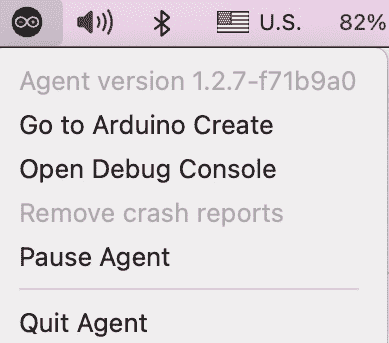

图 2.3 – Arduino Create Agent 菜单

当我们点击 Create Agent 图标时，它会显示 Create Agent 版本、一个**转到 Arduino Create**选项和一个**打开调试控制台**选项，这就像一个串行监视器，您可以在其中执行不同的命令以获取当前过程、设备和端口的状况和信息。此外，从这个菜单中，您可以暂停/恢复 Create Agent，或者如果您想正常关闭它，则点击**退出代理**。

## 设置设备、变量

在本节中，我们将创建一个设备并为其命名。我们还将学习如何添加设备，包括网络配置和云变量。

### 创建设备

当您首次打开 Arduino IoT 云平台的仪表板（*图 2.4*）时，您将看到**事物**、**仪表板**、**设备**、**集成**和**模板**等菜单链接，以及**创建您的第一个事物**的消息。只需点击**创建事物**按钮，您的旅程就开始了。

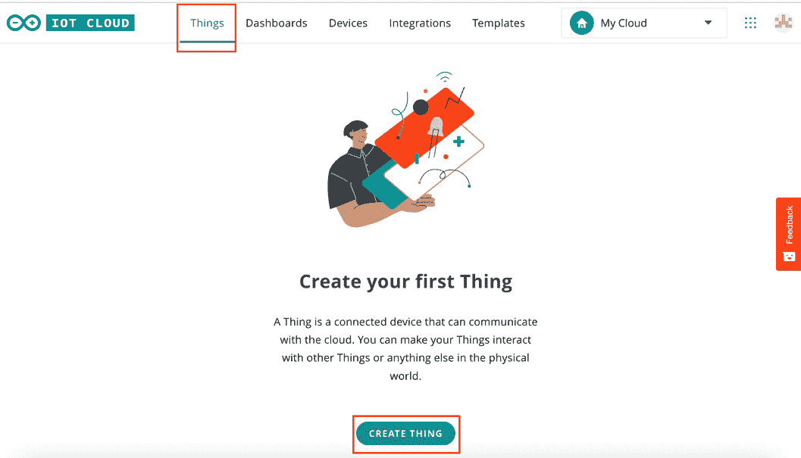

图 2.4 – 事物仪表板

添加事物与其他物联网云平台相比完全不同，因为事物是多个成分的组合。以下图示描述了事物的所有成分，例如名称、云变量、设备、网络设置、代码和事物元数据：


图 2.5 – 事物创建

上一张截图中的所有方面将按以下步骤逐一解释：

1.  为事物分配一个名称；名称应与设备的位置和功能相关，这将帮助您在以下向导中轻松找到事物。

1.  点击**选择设备**将显示一个弹出窗口，您可以在其中选择旧设备或设置新设备，如稍后详细讨论的那样。

1.  在连接设备后，我们需要通过提供 Wi-Fi SSID 和密码使设备网络就绪。只需点击**配置**按钮，您将看到网络设置的弹出窗口。

1.  最后，我们需要为传感器/执行器添加一个变量以执行读写操作。Arduino IoT 云平台提供了不同类型的变量，就像 Arduino IDE 一样；唯一的区别在于在 Arduino IDE 中，我们声明变量，而在这里，我们需要通过界面创建变量。

在本节中，我们已经创建了事物并为其命名。还需要三个进一步步骤：添加设备、网络配置和添加云变量。我们将在以下子节中介绍剩余的步骤。

### 添加设备

在为事物分配名称后，我们需要将其与设备关联。当您点击**选择设备**按钮时，您将看到一个弹出窗口，显示可用的设备以及添加新设备的选项。如果没有设备，您将看到以下图示以设置新设备：

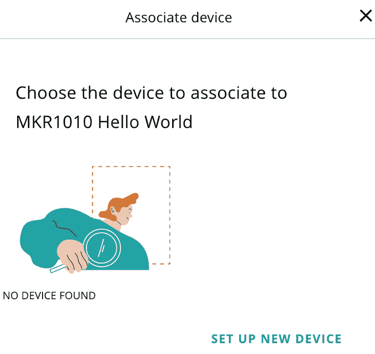

图 2.6 – 关联设备

在我们的情况下，我们在门户中没有任何设备，因此我们将点击**设置新设备**以在帐户中配置新设备。

接下来，您将在弹出窗口中看到两个选项。第一个选项是**Arduino 板**，第二个选项是**第三方设备**。在这里，您将在两个名称前面看到一个图标，这意味着您需要使用与 Arduino IoT 云平台兼容的设备。接下来，您将看到两个选项：一个是 Arduino 官方开发板，另一个是第三方开发板。


图 2.7 – 选择开发设备

根据可用的设备选择一个选项。在本章中，我们将点击**Arduino 板**，因为在本章中，我们将使用 MKR Wi-Fi 1010 板。在添加设备之前，请确保 Arduino Create Agent 在你的机器上运行。

重要提示

你可以在[`store-usa.arduino.cc/pages/cloud-compatible-boards`](https://store-usa.arduino.cc/pages/cloud-compatible-boards)找到 Arduino IoT Cloud 兼容的板，对于第三方设备，我们有三种选项，分别是**ESP8266**、**ESP32**和**LoRaWAN**设备。对于某些设备，我们有 API 访问权限，这将在本章的第二部分讨论。

接下来，你将看到**设置设备**弹出窗口，它将开始搜索你的设备。所以，确保设备已经正确连接到你的机器。当 Arduino Create Agent 检测到兼容的开发板设备时，将显示以下弹出窗口：

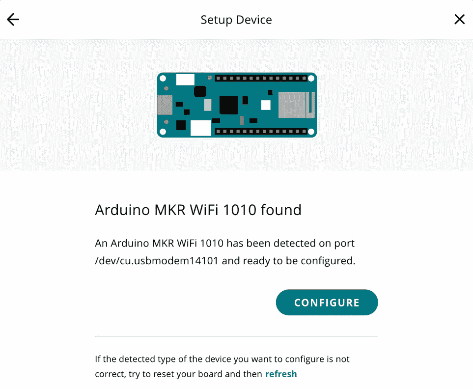

图 2.8 – 设置设备

向导将找到并列出所有连接的板及其名称和端口详情。点击**配置**按钮继续。如果向导在搜索后没有显示设备，尝试插入不同的端口并点击底部位置的**刷新**链接。在 Arduino IoT Cloud 处理开发板配置后，你将看到一个弹出窗口，需要提供你的设备名称：

在下一个配置向导中，提供设备的名称（注意设备名称中不允许有空格和特殊字符），然后点击**下一步**按钮。


图 2.9 – 设备配置名称

之后，向导将开始设备配置过程，这个过程可能需要五分钟。但在大多数情况下，配置设备只需要一分钟。

最终，你将看到一个弹出窗口，显示**恭喜！你已经设置好了**的消息。点击**完成**按钮，设备将被连接到你的“物”。

在“物”页面上，你会看到设备详情，如下图中红色方框所示：

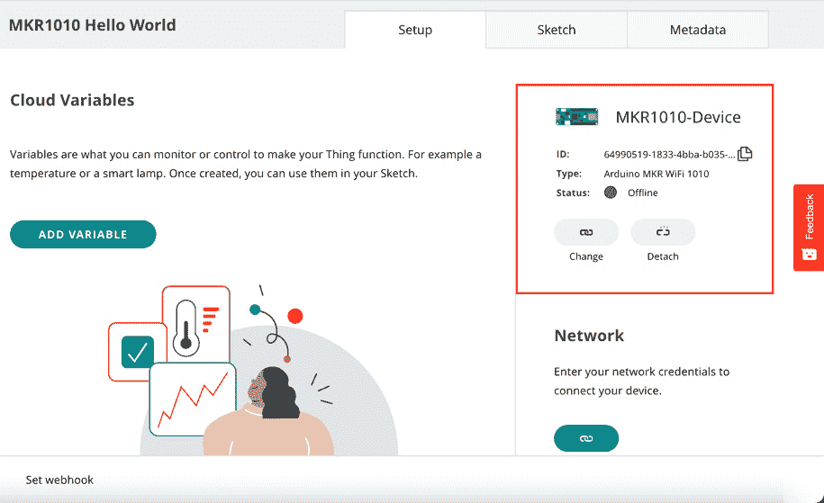

图 2.10 – 连接到“物”的设备

页面显示了设备名称、设备 ID、其类型、其状态（可以是**在线**或**离线**），以及两个按钮，**更改**和**断开连接**：

+   **更改**用于在设备之间切换 – 例如，如果你选择了错误的设备，那么你可以通过此选项选择不同的设备。

+   **断开连接**意味着将设备从“物”中移除。为什么我们可能需要断开连接？例如，你可能已经创建了一个“物”并将设备与之关联，但现在你不再使用那个“物”。如果你想用那个设备设置一个新的“物”，如果它已经与旧“物”关联，平台将不允许你这样做。

重要提示

设备和“设备”之间存在一对一的关系。如果您想使用一个新“设备”的设备，请确保它没有与另一个设备关联。

既然我们已经添加了设备，让我们转向网络配置。

### 配置网络

将设备连接到“设备”后，我们可以看到设备处于离线状态。要将其上线，我们需要提供 Wi-Fi 详细信息。以下图表示网络配置弹出窗口，它仅包含两个字段：

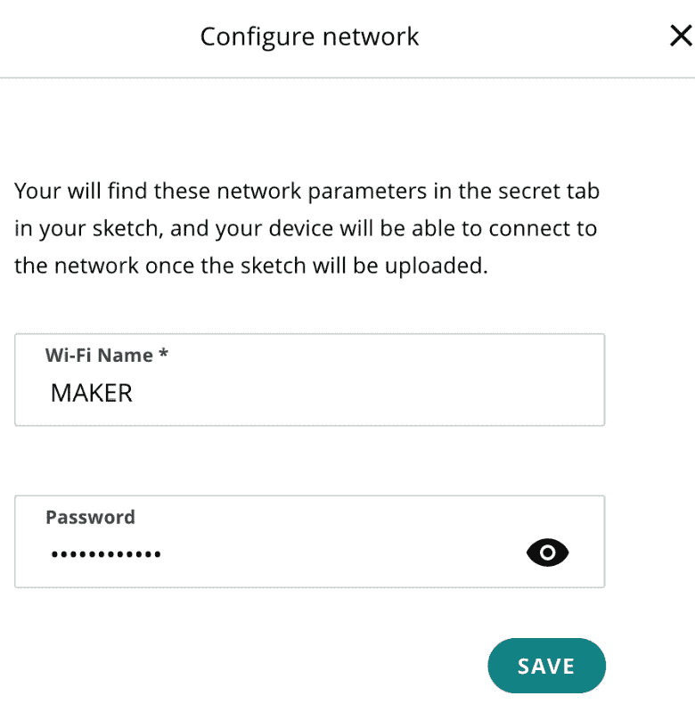

图 2.11 – 网络配置

在 *图 2**.5* 所示的“设备”页面中，在 **网络** 选项卡下，点击 **配置** 按钮，这将带您进入包含两个字段 **Wi-Fi 名称** 和 **密码** 的 **配置网络** 弹出窗口。输入 Wi-Fi SSID 和密码，然后点击 **保存** 按钮。

在本节中，我们已经为我们的设备配置了网络，该设备是 MKR Wi-Fi 1010，在下一小节中，我们将创建云变量。

### 添加云变量

最后的部分是添加云变量。在添加变量之前，您必须对您项目所需的变量类型有一个概念，包括 **变量类型**、**变量权限** 和 **变量更新策略**。

对于当前示例，我们需要一个变量来控制内置 LED，因此变量类型将是 **布尔**（开/关）：

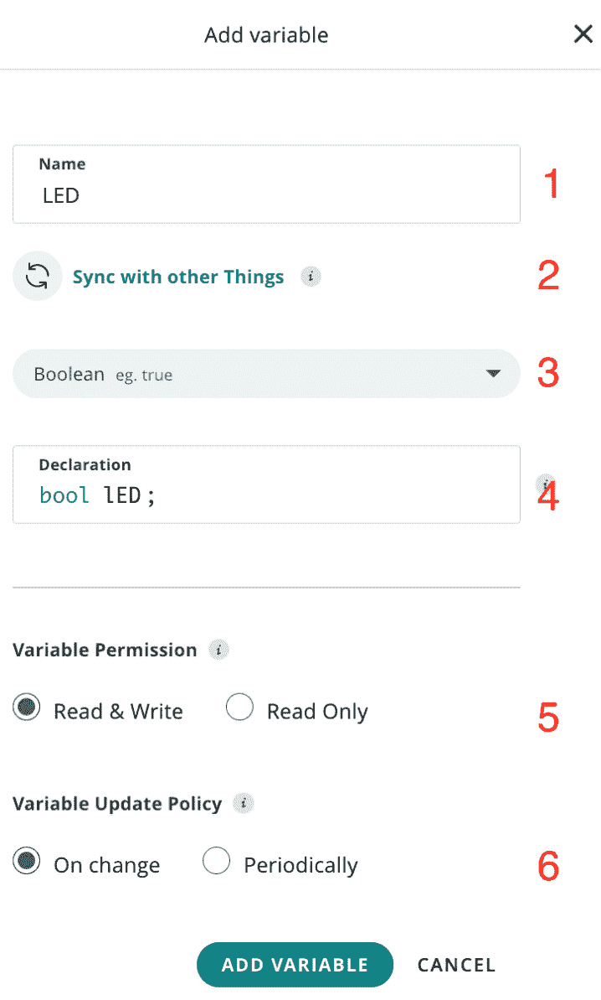

图 2.12 – 添加变量

这样，我们将通过仪表板控制 LED：

1.  为变量分配一个有意义的名称，与传感器/执行器类型相关。请记住，名称中不允许使用空格和特殊字符。

1.  如果您想将变量与其他设备的变量同步，请点击 **与其他设备同步选项**。如果您想在其他设备之间共享数据，同步选项非常有用。同步将在后续章节中与实际演示一起解释。

1.  从下拉菜单中选择变量类型；平台提供了数十种变量类型。对于本例，我们需要一个 **布尔** 类型的变量来控制 LED。

1.  选择变量类型后，您将看到变量 `LED`，但系统已将第一个字母转换为小写，其余字符保持不变，使名称变为 **lED**。这部分声明非常重要；您可以根据您的需求更改声明，但请记住声明，因为它将在编码中使用。

1.  变量权限提供了两个选项，**读写**和**只读**。权限为设备的控制提供了额外的安全层。如果传感器仅感应数据，如温度/湿度，则选择**只读**选项。如果您想控制继电器和 LED 等执行器，则选择**读写**选项。对于我们的示例，我们需要将数据写入变量以控制 LED，因此我们将简单地选择**读**和**写**。

1.  最后，我们需要根据我们的需求选择一个更新策略。一个选项是事件驱动（在屏幕上显示为**更改时**），它仅在发生变化时才工作。当接收到如开启/关闭继电器或 LED 的命令时，它才会工作。第二个选项是**周期性**，这意味着在特定时间后从变量（如温度、湿度、空气压力或**光敏电阻**（**LDR**）值）中获取数据。当您将选项更改为**周期性**时，它将要求您输入以秒为单位的时间，而对于**更改时**，有一个阈值选项。

添加变量后，我们的设备现在拥有了所有必需的成分。以下图示描述了完成云变量、设备和网络设置后所有的设置和配置。接下来，我们需要跳转到**草图**选项卡进行编码：

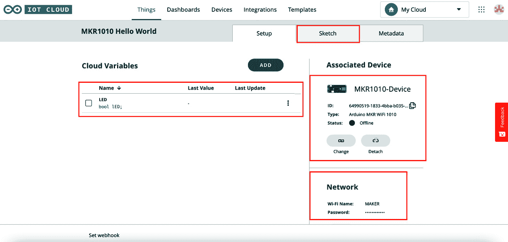

图 2.13 – 配置后的设备

上述截图说明了设备关联、网络配置和变量设置，这些都是设备的基本组件。接下来，点击**草图**选项卡，您将打开 Arduino Web Editor 进行编码。在这里，我们将添加与 LED 变量关联的代码。在本节中，我们已通过拖放完成了所有任务，但现在我们需要通过在开发板上编写一些代码来做一些工作。在下一节中，我们将探讨草图。

## 编写草图

大多数设备都是通过**图形用户界面**（**GUI**）在云中设置的，但我们仍然需要进行一些编码。以下图示描述了小型网页编辑器的所有选项，例如验证和上传代码、在特定端口选择开发板，以及编写和编辑代码的区域。

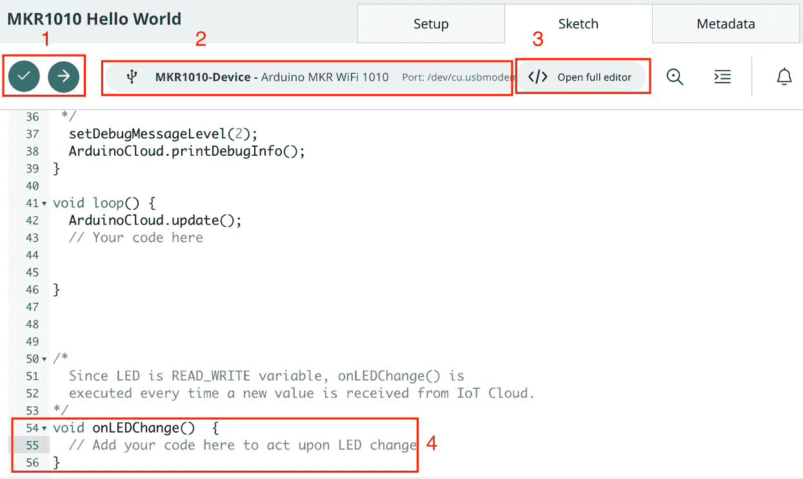

图 2.14 – 小型网页编辑器

代码将关联一个变量与物理传感器/执行器，以使其正常工作。请参阅以下步骤：

1.  在这里，您将看到两个按钮，就像在 Arduino IDE 中一样。勾选按钮用于验证代码，而箭头图标按钮用于将代码上传到开发板。

1.  这一部分显示了您的设备是否连接到您的机器。如果开发板已连接，则将显示带有端口的设备名称。

1.  Arduino 云编辑器有两种版本——一个是基础版，另一个是完整版。在*图 2.14*中显示的**“事物”**标签页中，我们可以看到编辑器的迷你版，但如果你想要移动到完整版以安装库或其他内容，那么请点击**</>**按钮。

1.  滚动编辑器，在底部，你会看到与**LED**变量关联的`OnLEDChange()`函数。在这个函数中，我们需要编写代码以提供与开发板传感器/物理引脚的连接。

根据我们当前的示例项目，我们只需要一个开/关的内置 LED 用于开发板。以下是在函数中使用的代码：

```cpp
if(lED==1)
  {
    digitalWrite(LED_BUILTIN,1);
  }else{
    digitalWrite(LED_BUILTIN,0);
  }
```

首先，让我们回顾一下在变量创建期间使用的声明，如图*图 2.12*所示。代码的作用是，如果`LED`变量包含一个 true 值，则打开内置 LED；否则，关闭内置 LED。

要在开发板的引脚上写入布尔值，我们有一个名为`digitalWrite`的方法，它接受两个参数。第一个参数是引脚号，在第二个参数中我们将放置`true`/`false`或`1`/`0`，而当我们使用`LED_BUILTIN`时，它是一个常量，包含*PIN #13*。第二个参数是值，可以是`1`或`0`。此参数根据`LED`变量的状态而变化。现在我们已经完成了我们的编码练习。现在是时候创建一个图形用户界面，从那里我们可以打开/关闭 LED。在下一节中，我们将设置仪表盘以控制 LED。

## 创建带有交互式小部件的 Web 和移动仪表盘

在设置好一个完整的“事物”之后，我们就完成了设备设置、网络设置、变量和变量编码。接下来要问的问题是，我们如何打开/关闭 LED？为此，我们需要创建一个仪表盘。*图 2.15*展示了仪表盘。点击顶部菜单中的**仪表盘**链接。首次加载仪表盘页面时，你将看到一个底部有一个绿色按钮的空白页面——**构建仪表盘**。


图 2.15 – Things 仪表盘

点击按钮，你将被带到仪表盘构建页面，以创建一个用于设备控制的新颖仪表盘，如下所示：

1.  仪表盘有两种模式，查看和编辑。默认情况下，它是编辑模式，这由一个编辑图标表示，我们可以通过点击眼睛图标切换到查看模式。在查看模式下，我们无法修改小部件的设置和对齐。

1.  要在仪表盘上添加控件，请点击绿色**添加**按钮，将出现一个下拉菜单，其中包含各种小部件。在这里，你可以通过滚动或搜索来选择一个小部件。

1.  此按钮用于排列小部件。在编辑过程中，你无法导航、调整大小或移动小部件控件。

1.  如移动图标所示，它通过其图标表示其工作状态，这意味着通过点击此图标，你可以调整移动设备的仪表盘。Arduino 为桌面和移动设备提供了仪表盘的两种视图。你可以通过点击移动/桌面图标在它们之间切换。

1.  在文本框中输入仪表盘名称。

现在我们已经创建了仪表盘，是时候在上面放置一个小部件了。小部件将帮助我们控制/查看传感器/执行器。当你点击**添加**按钮时，你会看到小部件列表。在这里，你可以通过滚动列表或通过搜索栏搜索小部件来选择小部件，如下所示：

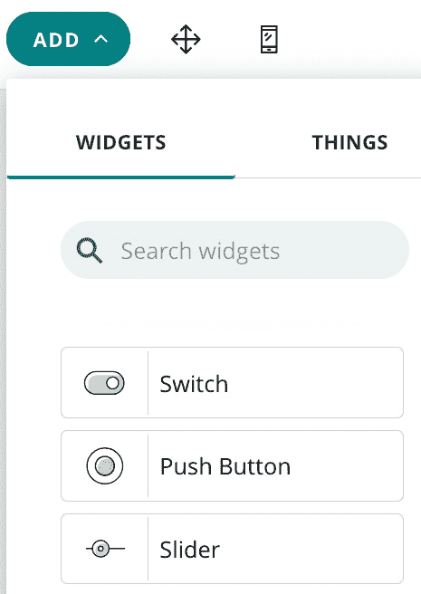

图 2.16 – 小部件列表

为当前示例项目选择**开关**小部件控制。选择小部件控制后，将出现一个弹出窗口，我们需要将事物变量与小部件控制链接起来以读取/写入设备传感器的数据。这是因为变量是仪表盘小部件控制与事物传感器之间读取和写入数据的桥梁。

在小部件弹出窗口中，我们有不同的设置，如下所示：

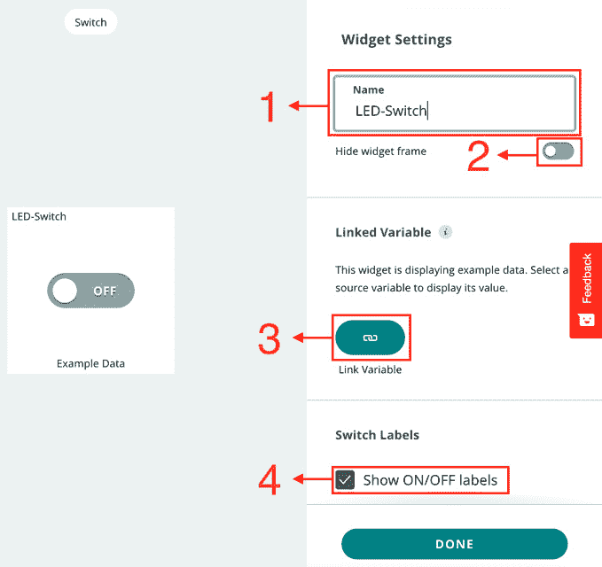

图 2.17 – 小部件设置

小部件设置如下详细说明：

1.  首先，我们需要为我们的小部件分配一个名称。确保给它一个合适的名称，以表示传感器的名称。在这里，我使用了名称**LED-Switch**。

1.  隐藏或显示小部件框架内容，该内容位于小部件的顶部和底部。

1.  点击**链接变量**将事物变量附加到小部件控制，这将在下一图中解释。

1.  隐藏/显示小部件标签以隐藏覆盖小部件控制的文本。在先前的图中，它切换了**开**/**关**按钮文本。

是时候将小部件控制附加到变量上了。请注意，我们可以在同一仪表盘上添加多个控制，这些控制与不同事物的变量链接，这显示了 Arduino IoT Cloud 仪表盘的通用性，如下所示：


图 2.18 – 将事物变量链接到小部件控制

如*图 2.18*所示，我们将以下步骤分配给小部件控制以将云变量分配给小部件控制：

1.  从**事物**列表中选择一个事物。选择事物后，它将显示与该事物关联的变量。

1.  从**变量**列表中选择一个变量。

1.  在这里，你可以看到变量的所有详细信息，例如事物名称、**类型**、**最后值**、**权限**、**更新策略**和**最后更新**。此详细摘要的目的是确保验证你是否已将正确的变量附加到小部件控制。

在从特定设备中选择变量后，点击**链接变量**按钮，你将在小部件控制弹出窗口中看到变量详情。从那里，你可以更改或断开变量。最后，点击**完成**按钮；现在，我们的仪表板已经准备好了，有一个小部件控制可以发送命令到设备。只需点击仪表板上的眼睛图标使其可用。之后，开始测试仪表板控制。

在这里，我们完成了使用 Arduino MKR1010 和 Arduino IoT Cloud 的第一个示例项目。接下来，你需要解决本节中的*作业 1*。之后，你将进入本章的第二部分，在那里你将学习如何通过 Node-RED 使用与 Arduino IoT Cloud 不兼容的设备，例如 Arduino Uno、Raspberry Pi 等。

## 作业 1

恭喜！你已经成功完成了本章的第一部分，希望你喜欢这段旅程。现在，是时候通过给你一个小作业来验证你所学的内容了：

1.  将三种不同颜色的 LED 灯（最好是红色、黄色和绿色）分别连接到 Arduino MKR1010 开发板的 1 号、2 号和 3 号引脚。

1.  设置一个名为`基于物联网的交通灯` `控制`的新设备。

1.  将设备关联起来，配置其网络设置，并根据 LED 灯的数量创建变量。变量名称应基于 LED 颜色，例如`LED_Red`。

1.  编写代码，根据变量值来开关 LED 灯。在为每个 LED 编写代码后，验证并上传代码到开发板。

1.  最后，设置名为`交通灯` `控制仪表板`的仪表板。

1.  根据 LED 灯的数量添加**开关**按钮，并将它们与相应的变量链接。

1.  通过仪表盘开关来测试 LED 灯。

重要提示

尝试使用**按钮**小部件控制和**开关**按钮小部件控制。验证一个变量是否允许你连接到多个小部件。此外，通过开关**开关**按钮来验证**按钮**小部件控制的行为。

我们的世界充满了各种类型的技术。每当市场上出现一项新的创新时，它总是与旧设备保持兼容。在 Arduino IoT Cloud 中，我们有一个当前支持的设备列表，但还有数百万个设备与 Arduino IoT Cloud 不兼容。因此，在上一章节的上一部分，我们使用与 Arduino IoT Cloud 兼容的开发板进行了示例练习，接下来，我们将探讨如何将非兼容设备连接/使用到 Arduino IoT Cloud 中，例如 Arduino UNO、Raspberry Pi、BeagleBone 等。

# 介绍 Node-RED

Node-RED 是一个免费的开源物联网和其他应用的视觉编程工具。它由 IBM 新兴技术部门开发，并于 2013 年首次发布。Node-RED 提供了一个基于网页的界面，以新颖有趣的方式连接硬件设备、API 和在线服务。该工具使用基于**图形流程**的编程语言，使得编程经验很少或没有的用户也能轻松构建复杂的物联网系统。Node-RED 因其易用性和能够与广泛设备和服务集成而受到物联网和智能家居社区的欢迎。

Node-RED 是一个基于流程的物联网和其他应用的开发工具。它提供了一个视觉拖放界面，用于连接不同的设备、API 和在线服务。使用 Node-RED，用户可以将输入、输出和功能连接起来，以创建复杂的物联网解决方案。除了开源和免费使用外，Node-RED 还拥有庞大的用户社区和预构建组件库。

在所有 Node-RED 的上述优点的基础上，以下问题随之而来：为什么我们需要使用 Arduino IoT Cloud？在章节的开头，我提到 Arduino IoT Cloud 仅原生支持少数几款开发板。即使是 Arduino，也不支持它们所有的开发板，尤其是 Arduino UNO、Arduino Mega 以及来自树莓派基金会的树莓派，这些在创客和爱好者中非常著名，并被工业界所使用。Node-RED 就是解决这个问题的方案，它与大多数开发板兼容，并拥有 Arduino IoT Cloud 模块，这使得开发者更容易将不兼容的设备集成到 Arduino IoT Cloud 中。

Node-RED 与 Arduino IoT Cloud 结合使用，具有以下好处：

+   **开发简便**：Node-RED 的视觉拖放界面使得用户能够轻松地将 Arduino 板连接到云端并快速构建物联网应用。

+   **与 Arduino IoT Cloud 集成**：Node-RED 内置了对 Arduino IoT Cloud 的支持，使用户能够轻松地将他们的 Arduino 板以及其他开发板连接起来，并将数据发送到云端。

+   **灵活性**：Node-RED 的基于流程的编程模型使得构建和修改复杂系统变得容易。

+   **基于流程的编程**：Node-RED 的基于流程的编程模型非常适合构建物联网应用，因为它允许用户快速连接输入、输出和功能，以创建复杂的系统。

+   **开源**：Node-RED 是开源的，允许用户访问源代码并在必要时进行修改。

+   **庞大的用户社区**：Node-RED 拥有庞大且活跃的用户社区，提供丰富的信息和预构建组件。

这些优势使 Node-RED 成为开发基于 Arduino 的物联网应用并将其连接到云端的良好选择。通过使用 Node-RED，用户可以利用云的力量来存储、分析和可视化其物联网系统中的数据。在本节中，我们讨论了 Node-RED 的功能和优势。现在，是时候通过实现示例项目来实际看看了。接下来的几节将逐步引导您完成项目的实现。

# Arduino IoT Cloud 和 Node-RED Hello World 示例

在本节中，我们将通过 Node-RED 向我们的系统添加一些额外的功能，以扩展我们的项目。这将帮助您了解如何使用 Node-RED 将不兼容的设备与 Arduino IoT Cloud 集成。

Node-RED 将根据一个值监控 LED 状态，该值可以是`LEDStatus`，它将链接到**状态**小部件，显示 LED 是开启还是关闭。通过这个示例，您将学习如何从设备属性/变量中读取数据以及如何将数据写入设备属性/变量。

Node-RED 有一个由 Arduino 官方开发的模块，用于与 Arduino IoT Cloud 连接。它提供了五个节点来执行不同类型的操作。有关更多详细信息，请访问[`flows.nodered.org/node/@arduino/node-red-contrib-arduino-iot-cloud`](https://flows.nodered.org/node/@arduino/node-red-contrib-arduino-iot-cloud)。

## Node-RED 编辑器的游览

在继续之前，我想首先提醒您，您需要在您的机器上设置 Node-RED。如果您已经设置好了，那太好了；否则，您需要通过访问[`nodered.org/docs/getting-started/local`](https://nodered.org/docs/getting-started/local)在本地机器上设置。如果您正在寻找更多云/开发板选项，请访问[`nodered.org/docs/getting-started/`](https://nodered.org/docs/getting-started/)。

安装完成后，启动 Node-RED，并在浏览器地址栏中输入`127.0.0.1:1880`或`localhost:1880`。之后，您将看到一个界面，其中包含一个空白区域和左侧边栏上的几个不同颜色的盒子；在这里，我已经用不同的编号标记了以下图中的盒子，这些盒子将在图后详细解释：

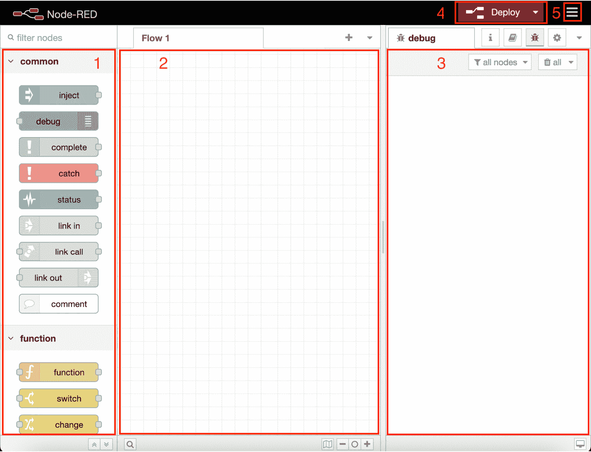

图 2.19 – Node-RED 界面概览

前图的各种部分解释如下：

1.  这些彩色盒子被称为**节点**。Node-RED 将不同类型的节点分为不同的组，例如**常用**和**函数**。

1.  这是工作区域，或画布区域，您将在这里拖放和放置节点。

1.  **调试**区域用于调试不同操作的输出和输入，以验证一切是否运行正常。

1.  就像在其他开发环境中一样，我们可以使用 **部署** 选项执行/运行程序。**部署** 有不同的选项；如果您点击小向下箭头图标，您将获得一个选项列表，例如 **全部**、**修改的流程**、**修改的节点** 和 **重启流程**。

1.  顶部右边的汉堡图标是主要导航按钮，在这里你可以找到所有控制 Node-RED 配置的选项，特别是模块的安装选项。在我们的例子中，我们将安装 Arduino IoT Cloud 模块。

在这里，我们已经讨论了 Node-RED 与所有主要选项的接口。在下一节中，我们将探讨如何安装 Node-RED 的 Arduino IoT Cloud 模块，在随后的章节中，我们将看到其实现。

## 安装 Node-RED 的 Arduino IoT Cloud 模块

为了让 Node-RED 与 Arduino IoT Cloud 通信，我们需要安装由 Arduino 团队官方开发的 Arduino IoT Cloud 模块。

点击应用右上角的导航图标，然后点击 **管理调色板**。之后，您将看到一个类似于以下图的弹出窗口：


图 2.20 – Arduino IoT Cloud 模块安装

从那个弹出窗口中，我们将安装一个模块：

1.  要安装一个模块，请点击 **调色板**。

1.  接下来，选择 **安装** 选项卡。

1.  初始时，您将看到一个空白区域。在搜索栏中输入 `Arduino`，这将显示不同的模块。

1.  找到 **@arduino/node-red-contrib-arduinio-iot-cloud** 模块，并点击 **安装**。在之前的图中，你可以看到我已经安装了该模块。

现在我们已经安装了模块，是时候看看 Arduino IoT Cloud 模块中可用的节点类型了。关闭安装调色板，滚动节点到底部，您将到达 **Arduino IoT Cloud** 部分，如图所示：


图 2.21 – Arduino IoT Cloud 节点

下面是 *图 2**.21* 中显示的节点的分解：

1.  第一个是一个 *IN* 节点（在 Node-RED 中，我们有节点；这就是我为什么用 node 而不是 property 来从 Thing 属性/变量中获取值的原因）。

1.  第二个是一个 *OUT* 节点，用于将值写入 Thing 属性/变量。

1.  第三个是 **历史** 节点，用于从特定属性获取数据直到特定时间。当您想要获取特定传感器的值集，例如温度/湿度时，此节点非常有用。

1.  第四个是 **周期性** 的，当您想要在特定时间段后获取特定属性的值时非常有用，例如在特定时间间隔后获取土壤湿度的值。

1.  第五个，也就是我们的最后一个节点，是**注入**。这个节点用于在接收到某种输入后向 Arduino IoT Cloud 变量的流程中添加值。"OUT"不同，因为它只发送数据，但这个节点将值注入到 Arduino IoT Cloud 变量中。

在本节中，我们讨论了与 Arduino IoT Cloud 一起工作的节点，这些节点可供开发者在 Arduino IoT Cloud 模块中使用。接下来，我们将设置 API、云变量和仪表板，以便进一步操作。

## 设置 API、变量和仪表板小部件

安装 Arduino IoT Cloud 模块后，是时候在 Arduino IoT Cloud 中设置 API 了。在 Arduino IoT Cloud 的旧界面中，在**集成**选项卡下有 API 选项，但现在，Arduino 团队已将 API 选项移动到 Arduino IoT Cloud，可在[`cloud.arduino.cc/home/`](https://cloud.arduino.cc/home/)找到。

点击**API 密钥**。之后，您将被带到 API 页面；点击**创建 API 密钥**。将出现一个弹出窗口；输入 API 名称并点击**继续**按钮。以下向导将花费几秒钟生成密钥，然后会出现一个新的弹出窗口显示它们：

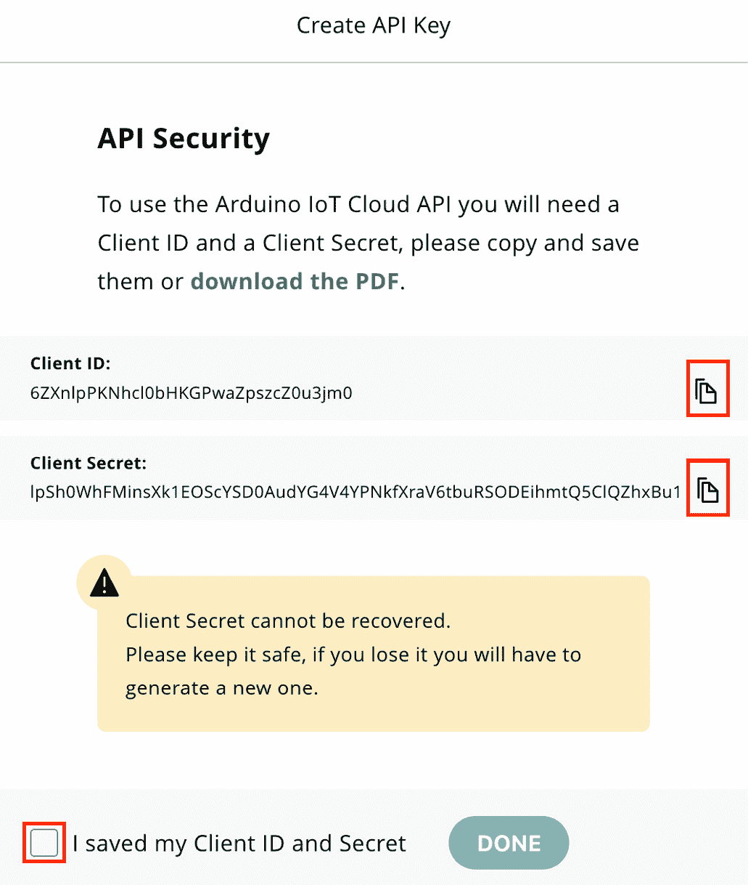

图 2.22 – API 密钥

通过点击复制图标复制客户端 ID 和客户端密钥；永远不要尝试通过选择它来复制密钥名称，因为它太长了。将客户端 ID 和客户端密钥保存在安全的位置，然后点击**我已经保存我的客户端 ID 和密钥**旁边的复选框以确认您已保存您的密钥。最后，点击**完成**按钮，您将在面板中看到您的 API 密钥，准备使用。

重要提示

一个 API 密钥可以访问所有设备和它们的变量。因此，使用一个 API 密钥来访问所有设备而不是为每个设备创建单独的 API 密钥是很好的。另一方面，请注意您的密钥，因为丢失它们可能是一个很大的安全风险。

在生成 API 密钥后，我们需要设置一个额外的变量，该变量将接收 Node-RED 的值，以及一个根据变量值进行操作的**状态**小部件。

对于变量创建，返回到*图 2.12*所示的 IoT Cloud 仪表板。选择所需的设备，创建一个名为`LEDStatus`的新变量，并选择我们之前为 LED 创建的布尔类型。然后，返回到仪表板并选择我们为之前练习开发的仪表板。点击带有**状态**小部件的`LEDStatus`变量。

在这里，我们已经在 Arduino IoT Cloud 中为 Node-RED 创建了 API 密钥，以及一个新的带有云变量和仪表板的新设备。接下来，我们将配置 Node-RED 中的 API 密钥，以便与 Arduino IoT Cloud 进行适当的通信。

## 使用 Node-RED 创建第一个项目

我们已经完成了迄今为止旅程中所需的所有强制性内容。返回到*图 2.19*中显示的 Node-RED 仪表板，向下滚动左侧，并将您的节点移动到 Arduino IoT Cloud。

点击第一个节点，即*IN*节点，将其拖动到流程区域。双击节点，您将看到以下节点配置的弹出窗口：

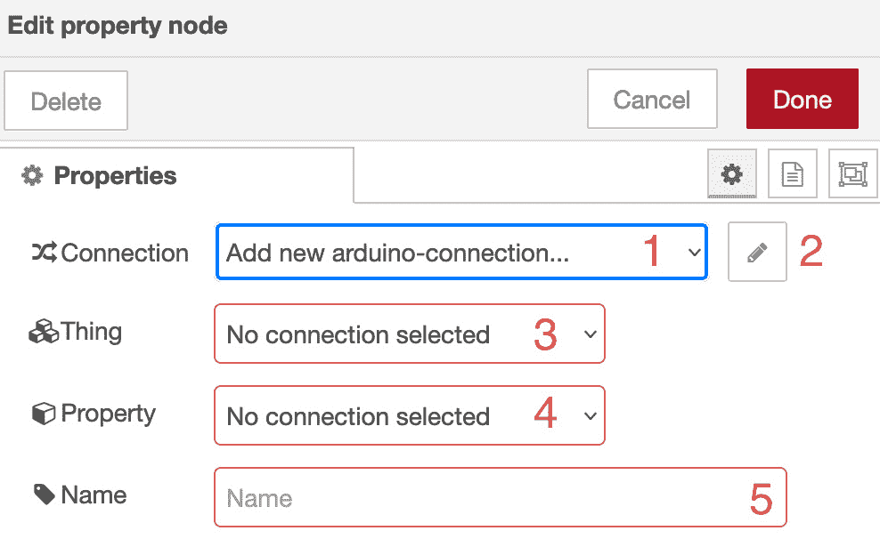

*图 2.23* – Arduino IN 节点配置

要编辑属性节点，请按照以下步骤操作：

1.  从下拉菜单中选择 Arduino 连接（如果您的 Arduino IoT Cloud 连接有多个，下拉菜单才会出现）。

1.  如果您没有连接，点击铅笔图标，它将带您到一个新的弹出窗口，在那里您需要提供连接的名称，以及在前一节*图 2.22*中生成的客户端 ID 和客户端密钥。当您保存连接时，它将出现在**连接**下拉菜单下。

1.  在成功创建并选择连接后，将出现与该连接关联的物件的列表。从**物件**下拉菜单中选择您将在流程中使用的目标物件。如果您在下拉菜单中没有看到任何内容，这意味着连接存在问题。

1.  在选择物件后，**属性**下拉菜单将列出与所选物件关联的所有变量。选择一个您想要感知的变量；在我们的练习中，我选择了**LED**变量以获取其状态。

1.  为节点分配一个名称，点击**完成**按钮，然后您就完成了配置。

以下是一个完整的节点流程。它显示了整个工作流程，从获取变量值到最后一个节点，该节点根据输入将值发送到云中：

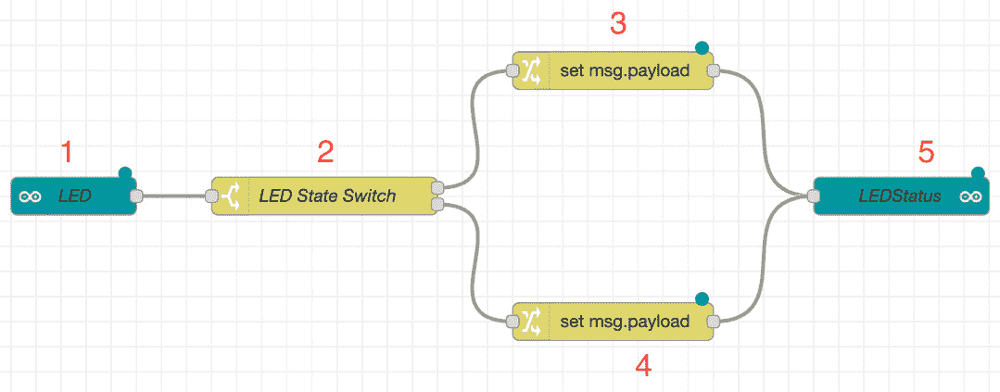

*图 2.24* – Node-RED 项目的完整流程

节点工作流程分解如下：

1.  第一个节点是*IN*节点。选择您想要读取的变量；我选择了**LED**变量。

1.  添加*switch*节点（页面左侧侧边栏的**函数**选项卡上的节点。此节点负责从节点**1**获取值，并根据该值选择**3**或**4**中的特定节点。将 Arduino *IN*节点链接到*switch*节点。链接后，双击*switch*节点，我们需要指定开关情况。

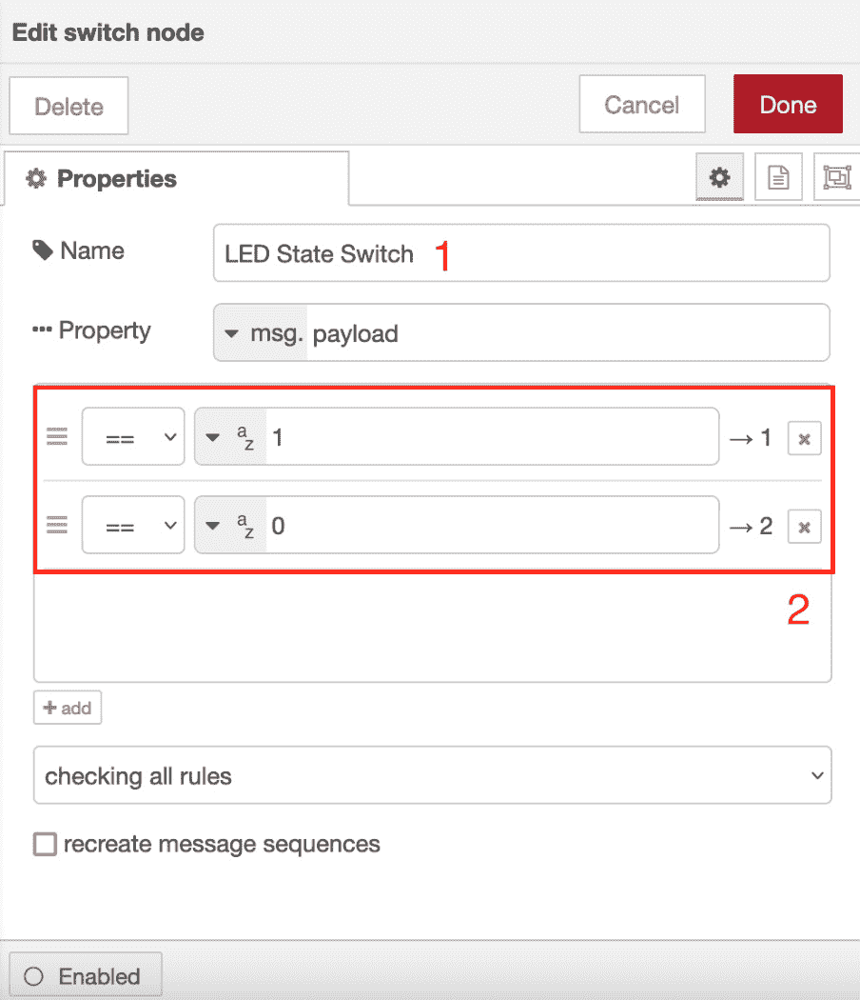

*图 2.25* – Switch 节点选项

要编辑*switch*节点，请按照以下步骤操作：

1.  首先，为节点分配一个名称，然后添加开关情况。

1.  在我们当前的练习中，我们有两个 switch 语句：LED 是*true*或*false*，这意味着开或关。默认情况下，只有一个选项 – 点击小的`1`和`0`，然后我们将有两个流程。

*更改*节点（`True`/`1`/`On`值。双击此节点。现在，点击下拉图标，如图中红色方框所示，选择**布尔**类型，然后选择**true**。


图 2.26 – 更改节点配置

要编辑更改节点，请按照以下步骤操作：

1.  再次，插入*更改*节点并将其与*开关*节点（节点`False`/`0`/`Off`值）连接。双击*更改*节点，选择布尔数据类型，并选择**false**值。

1.  现在一切准备就绪。我们只需要添加一个节点，该节点将数据发送到特定的 Arduino IoT Cloud 事物变量。要发送数据，我们需要 Arduino *OUT*节点，这是在*图 2**.21*中 Arduino IoT Cloud 标签下的第二个节点。拖动此节点，并将其连接到两个*更改*节点（`LEDStatus`变量）。

最后，我们完成了所有节点配置和链接。根据 Node-RED 的**LED**变量，点击`LEDStatus` Arduino IoT Cloud 变量，状态小部件将相应地更改。

本章的第二部分，我们探讨了如何使用 Node-RED 和 Arduino API 接口将不兼容的物联网开发板与 Arduino IoT Cloud 连接。接下来是*练习 2*，这个练习专门为你设计，以便进行不同的实验。

## 练习 2

继续上一个练习，其中你将三个 LED 连接到 MKR Wi-Fi 1010 和 Arduino IoT Cloud 设置：

1.  在事物中创建三个状态变量，根据 LED 名称（如红色、黄色和绿色）到之前设置的 Thing。

1.  在之前设置的仪表板上添加三个状态小部件，并将新创建的状态变量附加到它们上。

1.  为每个 LED 设置三个不同的流程并部署这些流程。

1.  通过使用**开关**按钮小部件打开/关闭 LED 来验证状态小部件。

# 摘要

本章是第一章节，我们通过一个基本的 LED 开关示例探讨了如何使用 Arduino IoT Cloud 连接设备。在第一部分，我们使用了一个与 Arduino IoT Cloud 兼容的开发板，即 MKR Wi-Fi 1010 板，在那里我们学习了如何创建事物和云变量，如何关联设备，如何配置网络，以及如何创建草图。在该部分的结尾，有一个练习任务供你实践。

在本章的第二部分，我们探讨了如何使用 Node-RED 和 Arduino API 接口将不兼容的开发板，如 Arduino UNO、Arduino Mega 和 Raspberry Pi，与 Arduino IoT Cloud 连接。在这里，我们探讨了 Node-RED、Arduino IoT Cloud 的 Node-RED 模块以及如何在云中生成 API 密钥。这一章节的部分内容帮助你学习如何使用不兼容的现有技术与 Arduino IoT Cloud。

Arduino 在 Arduino IoT Cloud 中提供了许多选项，例如事物、设备、仪表盘以及大量用于仪表盘和 Arduino Web 编辑器的部件。因此，在下一章中，我们将在继续前进之前详细探讨所有这些选项。*第三章* 对于您更好地理解所有 Arduino IoT Cloud 选项非常重要。
