# 第三章：Arduino IoT Cloud 平台和 Web 编辑器的见解

在开始任何开发或云平台之前，了解该平台的功能非常重要，包括其功能、控制、小部件等。这些平台就像一个装满了香料、蔬菜、肉类和其他成分的厨房。要在新的厨房里做出美味的饭菜，你需要了解厨房里有什么——有什么类型的工具、成分、香料和其他物品可用。产品开发就像烹饪一样——如果你对平台提供的内容有很好的了解，那么你将能够开发出令人惊叹的项目。了解平台概述的另一个好处是，它将节省你长远的时间，并增强你对产品设计的信心，因为你已经对平台有了很好的理解，可以逻辑地组合不同的事物，根据你的需求开发新的东西。

因此，在本章中，我们将首先详细介绍 Arduino IoT Cloud 的主要组成部分，即**事物**、**设备**、**仪表板**、**集成**和**模板**。在下一部分，我们将查看所有**仪表板输入**/**输出小部件**，并详细了解它们的目的、使用位置以及它们支持的变量类型。我们还将简要比较一些相似的控制小部件。

在最后一部分，我们将涵盖完整的**Arduino Web 编辑器**功能，学习如何导入新的库、Web 编辑器的存储和内存限制是什么、如何与他人分享代码以及如何使用**基于云的****串行监视器**进行代码调试。

在本章中，我们将涵盖以下主题：

+   介绍 Arduino IoT Cloud 界面

+   输入控制

+   输出控制

+   Arduino Web 编辑器

+   一个任务

# 技术要求

仅对本章而言，需要 Arduino IoT Cloud 访问权限来探索本章中我们将涵盖的不同功能性和仪表板控制小部件。

# 介绍 Arduino IoT Cloud 界面

Arduino IoT Cloud 的主界面由五个主要组件组成——事物、设备、仪表板、集成和模板，如*图 3.1*所示。每个组件都有其自身的属性，这些属性将在本节中详细讨论。

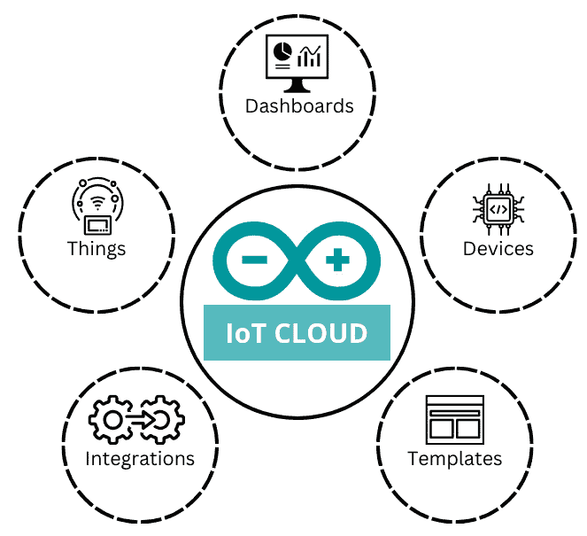

图 3.1 – Arduino IoT Cloud 组件

在每个项目中，事物、设备和仪表板都高度耦合。例如，即使是小型项目，我们也需要一个事物和一个设备来连接到云平台。仅仅配置一个事物和一个设备就足够了吗？不——仪表板也是必需的，用户可以通过仪表板向事物输入，系统也可以通过仪表板向用户展示事物数据以供可视化。

然而，集成是一个更可选的组件，其用例因项目而异，只有当开发者想要将任何不兼容的设备连接到 Arduino IoT 云平台、构建自定义界面以从 Arduino IoT 云平台获取数据或与第三方服务（如**Zapier**和**AWS 服务**）集成时才会使用。

模板对初学者和专家都很好，提供现成的通用项目，包括文档、代码、云模板以及给定项目中使用的硬件列表。通过使用这些模板，你可以接触新事物，这对学习很有帮助。

在这里，我们讨论了 Arduino IoT 云平台的关键界面组件。在下一节中，我们将逐步详细讨论所有组件。本章对于所有 Arduino IoT 云平台功能来说非常重要。

## 设备和事物

在**第二章**中，我们探讨了**hello world**示例，其中我们使用了设备、事物和其他东西来完成示例。在本节中，我们将更详细地讨论设备和事物。

设备是一种**Wi-Fi**/**LoRa**启用型微控制器，它充当 Arduino IoT 云平台和传感器之间的桥梁。Arduino IoT 云平台有一个非常具体的兼容开发板列表。遵循[`support.arduino.cc/hc/en-us/articles/360016077320-What-devices-can-be-used-with-Arduino-IoT-Cloud`](https://support.arduino.cc/hc/en-us/articles/360016077320-What-devices-can-be-used-with-Arduino-IoT-Cloud)查看完整的兼容板列表。除了这些官方板子之外，**ESP8266**和**ESP32**板也与物联网云平台兼容，它们是非常低成本且广泛使用的开发板。对于**LoRaWAN**爱好者来说有好消息——任何品牌的 LoRaWAN 节点都与 Arduino IoT 云平台兼容。

现在，是时候查看设备页面了。在仪表板上点击**设备**菜单。在这个页面上，我们有三个主要部分。第一个是搜索栏，我们可以通过名称搜索设备，也可以使用四个可用的设备过滤器——**设备类型**、**序列号**、**设备状态**或**事物**。搜索过滤器为那些连接到平台上的设备数量众多的情况提供了出色的功能。第二个值得注意的部分是这个页面上的**添加**按钮，通过它我们将新设备附加到 Arduino IoT 云平台。第三个是设备列表表，它显示了连接到 Arduino IoT 云平台的设备及其状态，无论是在线还是离线。

从设备列表表中，我们可以看到给定设备与事物之间的关系。设备要么连接到事物，要么仍然可以与其他事物连接。一个设备一次只能连接到一个事物。除此之外，设备列表还显示了其他重要的属性，这些属性可以通过**表格设置**图标根据您的需求显示/隐藏。当设置为显示时，您可以在表格设置下看到许多新的属性，例如 ID、类型、**完全限定板名**（**FQBN**）、序列号、连接模块固件、最后活动时间和设备添加日期。

您也可以通过点击设备来获取所有设备属性。在上述所有设备属性中，**最后活动**是最重要的之一，因为它有助于衡量设备停机时间。您可以逐个删除设备，或者使用复选框选项批量删除设备。在**表格设置**图标下方还有一个**更新**图标，用于刷新设备表格列表。

重要提示

一个设备在一个一对一的关系中只能连接到一个事物。如果您想使用与任何其他事物关联的设备，那么在将其与新事物关联之前，必须先从先前关联的事物中分离该设备。

事物的概念有点像包含牛排、蔬菜、土豆泥等食材的菜肴。事物包含云变量、网络连接和设备，并负责管理代码和元数据，例如设备时区和事物的**元标签**。

现在，是时候在 Arduino IoT Cloud 中更深入地探索事物了。以下图表总结了整个事物界面：

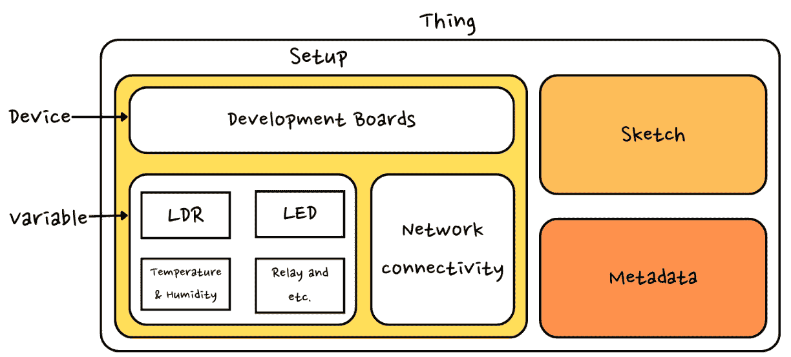

图 3.2 – 事物界面

让我们从点击**事物**菜单开始，探索事物主页面（如*第二章*中*图 2.4*所示），这与设备菜单非常相似，但在**搜索**和**事物**表格列表中有一些不同。我们可以看到一个用于事物创建的**创建**按钮，而不是设备中的**添加**按钮。与设备相比，事物的搜索功能有完全不同的过滤器，允许我们通过**设备**、**设备类型**和**时区**来过滤事物。

由于设备和 Things 之间是一对一的关系，它只会显示一个 Things，但**设备类型**是一个很好的功能，可以显示具有特定设备类型的所有 Things。例如，假设我们部署了两个不同的项目，每个项目包含 25 个节点。一个项目是由**MKR Wi-Fi 1010**开发的，而另一个是由**ESP32**开发的。**设备类型**过滤器为您提供选项，仅筛选使用 ESP32 板型的 Things。第三个过滤器是**时区**，如果您在世界不同地区部署了项目，这将非常有用。要返回特定地区的设备，您只需使用这个**时区**过滤器即可。

默认情况下，Things 列表表为我们提供了一个包含**设备**、**变量**和**最后修改**属性的 Things 列表。我们可以通过点击属性列按任何属性以升序或降序重新排列列表。Things**选项**菜单提供了删除 Things 的选项。在设备属性中，它显示关联的设备或为您提供关联设备的选项。**最后修改**属性对于审计目的很有用，指示您的 Things 上次修改的时间。

除了所有这些属性之外，我们还有一些隐藏的属性，**创建日期**和**时区**，可以通过页面右侧的**表格设置**图标启用。如果我们为 Things 添加元标签，那么它也会出现在**表格设置**下。元标签将在接下来的几段中详细介绍。

是时候探索 Things 的内部选项了（*图 2.5*来自*第二章*）。点击**创建**按钮或点击表格中的任何 Things。在出现的页面上，您将看到三个不同的标签，**设置**、**草图**和**元数据**，以及以粗体字显示的 Things 名称。您也可以通过点击它来修改 Things 的名称。

**设置**标签用于创建云变量并将设备与 Things 关联（如果尚未链接）。对于与 Things 关联的设备，有**更改/断开设备**选项。最后，还有配置开发板 Wi-Fi 网络设置的选项。

第二个标签是**草图**，它提供了一个 Arduino Web 编辑器的迷你版本，从这里我们可以编写/修改代码，以及验证和上传到相关设备。我喜欢**草图**选项用于 Things，因为它帮助我们为每个设备在单独的 Thing 容器中维护代码，无需进行本地备份或代码管理。迷你云编辑器还提供了打开完整编辑器的选项。旁边是搜索图标，它打开基于 Web 的串行监视器以验证您的设备是否正常工作。

第三个标签用于事物元数据。通常，人们不会关注这些设置，但当你拥有数十个事物时，它们被用来分类并提供便于管理。在这里，我们可以添加标签来分类我们的事物。**标签**也出现在事物表格列表中，以及搜索栏中的过滤器选项。那么，让我们看看标签是如何工作的。一个标签由两部分组成——一部分是键，另一部分是值。键用于搜索过滤器。例如，如果你有数十个属于不同组织的设备，并且每个组织包含多个设备，那么你如何过滤特定组织的设备？答案是使用标签；你创建一个标签，其中键将是组织名称，值将是设备类型。当你输入组织名称到搜索栏时，你会看到所有与这些元标签相关联的设备。下一个选项是时区，这是根据其原生地区的时区获取事物数据的完美选项。默认情况下，它显示根据你所在位置的时间区，但你可以手动覆盖时间区。重置它将显示一些关于事物的详细信息，例如**事物 ID**、**最后修改**、**最后同步**和**创建时间**。

到目前为止，以下问题出现了：*“最后修改”和“最后同步”之间有什么区别？*

我建议你在继续之前先思考一下，并找到解决方案。

重要提示

让我们假设你已经为事物编写了代码，并且它与 MKR Wi-Fi 1010 设备相关联，但你已经将设备的关联更改为**Arduino Nano RP2040**或任何其他开发板。在这种情况下，你将获得为 RP2040 预写的代码。你将获得此代码，因为代码属于事物，而不是设备。然而，可能需要对代码进行一些小的修改，因为引脚和库在不同开发板之间是不同的。

在本节中，我们详细讨论了设备和事物页面，包括页面上的搜索选项、创建和其他选项。现在，我们将讨论**仪表板**，它将帮助我们创建美丽的图形用户界面来控制和显示设备数据。

## 仪表板

Arduino IoT Cloud 提供了非常灵活的仪表板，具有许多选项，为用户提供极佳的体验。**仪表板**由不同的功能组成，包括小部件，它们被分类为输入和输出，移动和网页的响应式设计选项，以及许多其他功能。以下图总结了仪表板的所有功能，这些功能将在以下章节中逐步详细讨论：

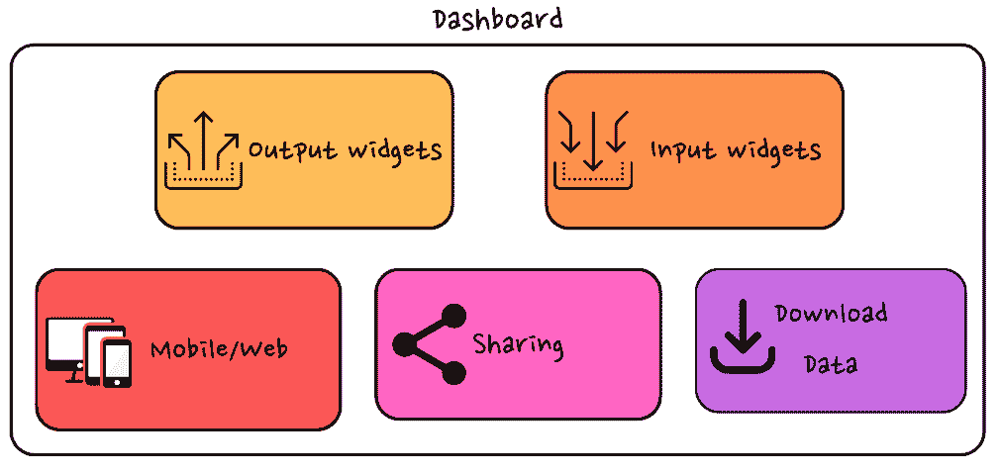

图 3.3 – Arduino IoT Cloud 仪表板

仪表盘界面与物和设备界面非常相似，但在搜索和表格方面更简单。现在让我们在物联网云的背景下检查输入/输出小部件，而不是从设备的角度来看（尽管设备是相关的，因为如果我们向物联网云提供输入，它将反过来向物提供输入，如果设备向物联网云发送输出数据，它将在仪表盘上显示）。

Arduino 物联网仪表盘提供了丰富的输入/输出小部件控制。我们将在稍后详细检查所有的小部件，而在这里，我们将讨论一些其他主要功能，例如*响应式设计*和*数据共享和下载*。

仪表盘为移动端和网页端提供响应式网格设计系统。要进入编辑模式，首先在**仪表盘**页面点击**编辑**图标（见*第二章*中的*图 2.15*），然后点击**导航**图标，也称为*排列小部件*。你可以通过调整小部件的大小或拖动它们到画布上的任何位置来修改设计。你还会在每个小部件控制上看到**锁定**图标，它允许你固定它们的位置。将小部件放置在适当的位置后，点击该锁定图标以固定位置。在靠近**添加**按钮的顶部菜单中，有一个用于移动/桌面模式的图标，用于对齐小部件。

将来会有需要与利益相关者共享这些仪表盘的时候，以便他们可以轻松地监控系统。Arduino 物联网云提供了一个安全的方式来与他人共享你的仪表盘。只需点击**共享**图标 - 从那里，我们可以与其他用户共享我们的仪表盘（尽管请注意，所有用户的电子邮件必须注册到 Arduino 物联网云才能参与共享）。

从云中获取传感器数据是物联网云平台的一个基本要素，因为研究人员在多种应用中使用数据，包括训练**机器学习**/**人工智能**（**ML**/**AI**）模型或在不同的平台上可视化数据，例如**Google Looker**和**Tableau**。Arduino 提供了一个功能强大的向导，可以下载所有数据或特定云变量的数据。点击**下载**图标，你会得到很多选项。从那里，你可以选择变量（根据你的需求，可以是单个、多个或全部）并指定日期范围。Arduino 将根据你的查询处理数据，并以 CSV 格式通过你注册的电子邮件与你共享。

在这里，我们讨论了仪表盘的不同功能，例如小部件的对齐、移动和网页仪表盘的响应式设计，以及如何下载传感器数据。在下一节中，我们将介绍集成和模板。

## 集成和模板

**模板**页面包含用于学习和实践目的的示例项目，非常适合初学者尝试不同层次的项目，从入门级到高级。每个项目都附有项目描述、硬件清单、代码和导入的云模板。在**模板**页面，您最初会看到一个非常小的项目列表，但更多项目可以在[`projecthub.arduino.cc/`](https://projecthub.arduino.cc/)找到，全球的创客/专业人士在此上传他们创建的项目，并附带完整文档。

**集成**提供了将 Arduino IoT Cloud 与其他第三方服务以及自定义开发的应用程序连接起来的互操作性。Arduino 提供了三种与不同平台交互的方式，**应用程序编程接口**（**API**）、**Webhooks**和**软件开发工具包**（**SDKs**），如图所示：

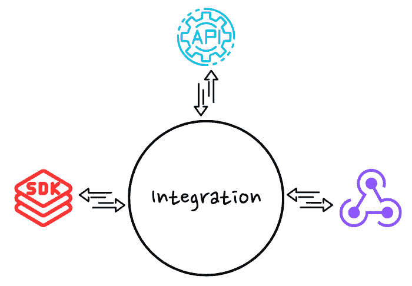

图 3.4 – Arduino IoT 云集成

首先，让我们谈谈 API，因为这种技术被开发者广泛用于与不同平台交互。在 Arduino IoT Cloud 中，API 用于两个目的——第一个目的是将不兼容的设备与物联网云连接起来，包括**树莓派**和**贝格尔骨**，而第二个目的是使用不同的预定义 API 从物联网云中获取数据。这些 API 将在*第八章*中详细讨论。

当事物中发生指定事件时，例如云变量的更新，Webhooks 用作触发器。要设置 Webhook，您需要访问特定事物的页面，点击带有大量详细信息的`JSON`格式，这将在*第十二章*中进一步讨论。

理解 API 和 Webhooks 背后的概念非常重要。第三方应用程序使用 API 的接口从云中请求数据，但使用 Webhooks，当事物内部发生任何预定事件时，Arduino IoT Cloud 会将数据发送到特定的平台。因此，如果您开发一个警报系统，那么 Webhooks 是首选选择，因为它们在检测到事物内部任何变化时立即发送数据。相反，如果您开发的应用程序只需要定期获取数据，那么 API 是最佳解决方案。简单来说，Webhooks 就像**推送请求**，而 API 就像**拉取请求**。

Arduino IoT Cloud 团队还发布了针对不同编程语言的官方 SDK，例如**JavaScript**（**Node.js**）、**Python**和**GoLang**。SDK 通过允许开发者使用预定义函数从云中获取数据，而不是与原始 API 打交道，使开发变得简单。出于认证目的，SDK 使用 API 密钥进行访问和认证。Node.js SDK 将在*第八章*中详细讨论。

在本节中，我们讨论了 API、SDK 和 Webhooks。现在，我们将探索仪表板的控件。我们将 Arduino 仪表板控件分为两类，*输入*和*输出*。在下一节中，我们将首先探索完整的输入控件范围，在随后的章节中，我们将探索完整的输出控件范围。

# 探索输入控件

**输入控件**在物联网产品开发中非常重要，用户根据指标控制操作流程。用户界面/用户体验（**UI**/**UX**）领域的最新趋势和技术带来了许多不同尺寸、形状和设计的输入控件，从而提供了更好的终端用户体验。

Arduino 物联网云团队考虑了市场上的最新趋势，并提供了九种不同、令人惊叹的输入小部件，每个小部件都为用户提供以各种方式向设备输入的能力。每个小部件都链接到单个云变量；您可以将多个小部件链接到单个云变量，但数据类型必须是控件指定的类型。在以下小节中，我已经根据它们之间的相似性将输入小部件分为不同的组。

## 开关、按钮、滑块和步进器

让我们从最基本的输入控件小部件开始——**开关**、**按钮**、**滑块**和**步进器**。这些小部件允许用户以有效和高效的方式控制他们的设备。所有小部件均显示在*图 3.5*中：

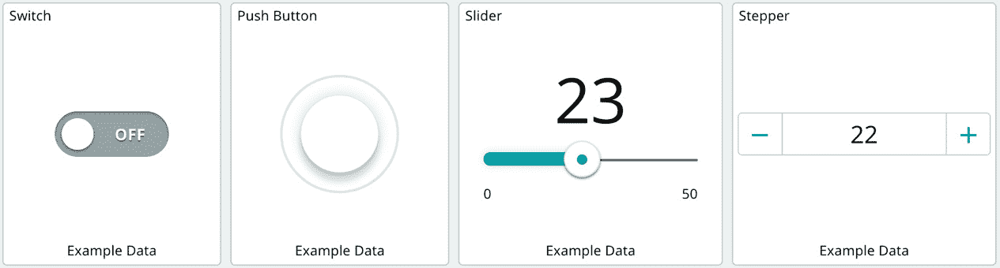

图 3.5 – 开关、按钮、滑块和步进器

(`on`/`off`)并消耗布尔类型云变量。这两个控件之间的唯一区别是 UI/UX 设计。当用户点击开关控件时，它会滑动开/关并保持在同一状态，直到再次点击。**按钮**也保留其状态，但通过按下或释放来在开/关状态之间切换。

重要提示

要理解**开关**和**按钮**的正确工作原理，只需将这两个控件放置在仪表板上并将它们链接到相同的云变量。之后，点击**按钮**并释放它，然后尝试点击开关。

`integer`或`float`类型的云变量。这些控件可用于控制步进电机角度、电机速度、光强度，甚至为温度和湿度监控系统设置警报系统的阈值。例如，假设您想设置温度和湿度值的警报阈值，以及天气。这些控件将帮助您通过仪表板从利益相关者那里获取值，并在设备中处理它们，而无需修改设备代码。

在这里，我们探讨了四种不同的输入小部件控件——**开关**、**按钮**、**滑块**和**步进器**，以及它们的具体用途。现在，我们将介绍与灯光控制相关的输入小部件控件。

## 颜色、昏暗的光和彩色光

Arduino 引入了三个针对灯光颜色和强度控制的新小部件，开发者可以在构建智能家居的实物产品时使用。*图 3.6*展示了这三个小部件，它们可以帮助您控制您的智能灯泡/灯光解决方案：

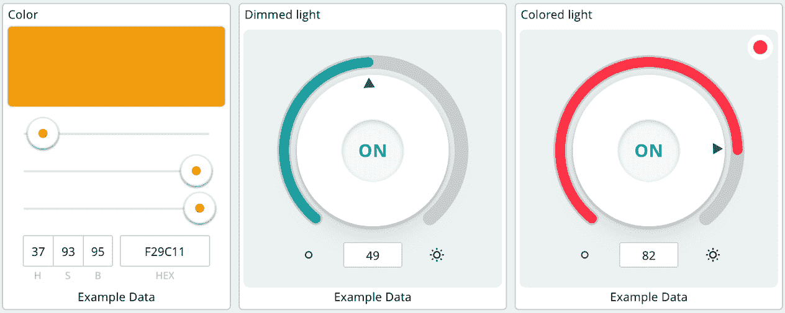

图 3.6 – 颜色和灯光小部件

在这里，我们已经看到了所有关于灯光/灯泡控制的小部件控制；现在，我们将逐步讨论所有小部件，在接下来的小节中。首先，我们将从**颜色**小部件控制开始。

### 颜色

我们在这里的第一个小部件是`Color`类型的云变量，我们使用 Arduino 代码从最终设备输入中获取**红绿蓝**（**RGB**）颜色值。颜色小部件提供了一个 RGB 滑块来调整颜色，或者可以直接以 RGB 或十六进制格式输入所需值。这个小部件对于控制 RGB LED 颜色、RGB 灯和**WS18B20**模块非常有用。

以下 Arduino IDE 或 Web 编辑器的代码片段展示了如何将颜色类型云变量转换为 RGB 变量：

```cpp
int red, green, blue;
RGBVariable.getValue().getRGB(red, green, blue);
```

`RGBVariable`是`Color`类型的一个云变量。我们必须使用 RGB 格式将我们的颜色代码输入到 RGB LED 中，因此我们将声明三个整型变量`red`、`green`和`blue`，并使用`RGBVariable.getValue().getRGB(red, green, blue);`将我们的单个云变量值转换为`RGB`格式。

### 暗淡灯光

包含开关状态和亮度值的`Dimmed Light`云变量。

在转向代码之前，我们首先需要了解开发板需要哪些值。这里需要两个值——开关状态和亮度级别。以下代码展示了如何从`Dimmed Light`云变量中获取亮度级别和开关状态：

```cpp
//retrieve and map brightness value from cloud variable
  int brightness = map(dimmedLightVariable.getBrightness(), 0, 100, 0, 255);
  //then check if switch is on/off
  if (dimmedLightVariable.getSwitch()) {
    analogWrite(5, brightness); //write brightness value to pin 5
  }
  else{
    analogWrite(5, LOW); //turn off lamp
  }
```

要获取亮度，我们需要使用`map`函数将`dimmedLightVariable`亮度属性值转换为`0`至`255`的范围。然后，我们需要通过调用该云变量的`getSwitch`属性来获取开关状态。如果它是开启的，那么我们将使用*引脚#5*上的`analogWrite`函数来调整亮度；如果开关是关闭的，LED/灯将被关闭。

### 彩色灯光

最后，是时候使用`Colored Light`云变量类型来玩多彩的条带了。

以下 Arduino IDE/Web 编辑器的代码用于从`Colored Light`变量类型获取值。在深入代码之前，请注意，我们需要从该云变量中获取三个值——RGB 颜色、亮度级别和开关状态：

```cpp
//retrieve RGB color values from cloud variable
int red, green, blue;
ColoredLightVariable.getValue().getRGB(red, green, blue);
//retrieve and map brightness value from cloud variable
int brightness = map(ColoredLightVariable.getBrightness(), 0, 100, 0, 255);
//then check if switch is on/off
bool switch= ColoredLightVariable.getSwitch();
```

首先，我们使用`ColoredLightVariable.getValue().getRGB`方法以`int`格式获取 RGB 颜色值。其次，我们使用`ColoredLightVariable.getBrightness()`方法获取亮度，并使用`map`方法转换值。最后，我们使用`ColoredLightVariable.getSwitch()`方法获取开关状态。所有这些值都存储在三个不同的变量中，可用于控制 LED/灯或 RGB 灯带功能。

在这里，我们详细讨论了智能灯/灯泡控件，包括**颜色**、**调暗** **灯光**和**彩色灯光**小部件控件，以及它们的代码来从它们中获取和设置值。现在，我们将讨论另一个重要的输入控件，即时间选择器，它用于配置。

## 时间选择器（配置）

**时间选择器**小部件是一个非常重要的配置小部件控件，用于在设备上设置/获取时间，而无需修改设备上的代码。有了这个功能，无需**实时时钟**（**RTC**）模块就可以轻松维护设备时间。每当一个设备开启时，它将自动将设备时间与时间云变量同步。

以下截图显示了带有日期和时间的**时间选择器**小部件，您可以选择设置日期、时间或两者。小部件还允许您根据您的地区更改日期和时间格式。


图 3.7 – 时间选择器小部件

时间选择器小部件与`Time`类型云变量链接，并将所有日期和时间数据存储为秒格式。以下代码从 Arduino 云获取本地时间并将其存储在一个变量中：

```cpp
CloudTimeVariable = ArduinoCloud.getLocalTime();
```

在获取本地时间后，您可以使用`CloudTimeVariable`来同步您的设备操作。在`setup`方法中使用前面的代码。

在本节中，我们讨论了时间选择器小部件，包括如何通过使用`Time`云变量类型来设置此小部件控件的时间。现在，我们将讨论另一个配置小部件控件，即调度器小部件控件，它可以帮助您设置时间来自动化物联网设备上的操作。

## 调度器（配置）

**调度器**是 Arduino 物联网云中的另一个重要实用工具，用于自动化流程。使用此小部件，我们可以自动化许多操作，无需人工干预，就像在特定时间执行进程/方法的**cron 作业**一样。

那么，我们可以在我们的物联网解决方案中何处使用这个调度器功能？有许多用例，包括户外灯光自动化、农业灌溉系统和家禽养殖场的动物喂食器。

以下**调度器**小部件的截图显示了安排我们的进程/方法的许多选项：

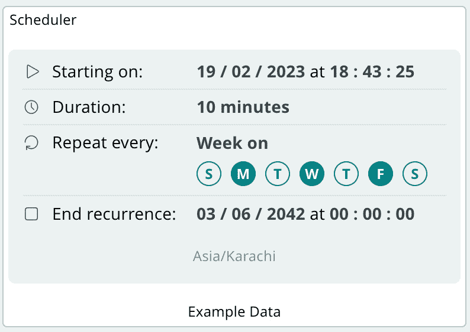

图 3.8 – 调度器小部件

调度器小部件使用`Schedule`云变量类型。在配置时，我们指定进程开始和结束的时间和日期。

以下代码片段非常简单，使用`true`/`false`接口分别启动/停止操作，而不是进入复杂的内容：

```cpp
  if (scheduleVariable.isActive()) {
    digitalWrite(LED, HIGH); // whenever the job is "active", turn on the LED
  }
  else{
    digitalWrite(LED, LOW); // whenever the job is "not active", turn off the LED
}
```

我们可以通过访问其`isActive()`方法来获取每个`Schedule`云变量的活动/非活动状态。在设备循环中使用上述代码 – 如果`Schedule`云变量是活动的，则执行给定的过程/方法；否则，停止它们。为什么我们需要在循环中执行前面的代码片段？因为`loop()`方法是 Arduino 的主要方法，它总是执行。

在本节中，我们详细讨论了调度器，讨论了此小部件使用的云变量类型，以及如何访问调度器状态以执行特定任务。这是输入小部件中的最后一个控制。现在，我们将查看输出控制小部件。在下一节中，将详细讨论所有输出控制，以便您更好地了解如何在您的专业项目中实现这些控制。

# 深入探讨输出控制

在前面的章节中，我们讨论了输入小部件控制。Arduino IoT Cloud 仪表板还具备令人惊叹的输出控制。这里有九个小部件（尽管有两个是非设备小部件 – **消息传递**和**便签**）。

## 值、状态、仪表、百分比和 LED

让我们从开发者几乎在每种解决方案中都常用的基本输出小部件开始。这些输出小部件用于以数值或图形格式显示单个值。*图 3.9*显示了所有主要和基本输出控制小部件：

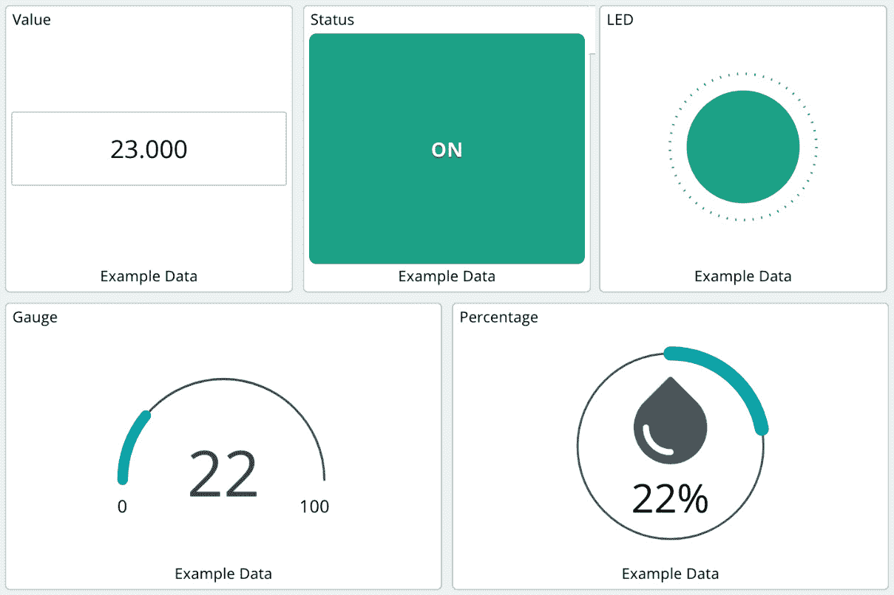

图 3.9 – 值、状态、LED、仪表和百分比小部件

在本节中，我们将详细讨论五个不同的输出小部件控制，分别在不同的部分进行。首先，我们将从值小部件控制开始。

### 值

`integer`类型变量，但我还用`time`变量测试过，它工作得很好，因为`time`变量以秒为单位存储所有信息。您还可以使用值小部件控制为传感器设置阈值，自动化流程。

以下简单的代码片段从模拟引脚#0 读取值并将其存储在`valueCloudVariable`中：

```cpp
valueCloudVariable = analogRead(A0);
```

在这里，我们讨论了值小部件控制，它用于输入和输出目的。现在，我们将探索状态和 LED 控制小部件。

### 状态和 LED

我们接下来的小部件是`true`或`false`。这些小部件仅显示状态；它们不提供任何控制选项，并且它们都与`bool`类型云变量一起工作。这些小部件的用例包括指示事物状态（开/关） – 例如，在智能农业中水泵的状态，或者在家居智能中门是打开还是关闭。只需将`true`/`false`分配给与状态小部件链接的`bool`云变量类型，在执行特定任务后即可。

以下示例代码演示了如何更改 `statusCloudVariable` 的值以更改状态/LED 小部件的外观：

```cpp
Void loop(){
digitalWrite(1,HIGH);
statusCloudVariable=true; //Assign true to Status Widget
delay(5000);
digitalWrite(1,LOW);
statusCloudVariable=false;//Assign false to Status Widget
delay(500);
}
```

上一段代码展示了在执行 `digitalWrite` 操作后，我们如何根据当前条件更改 `statusCloudVariable` 的值以更新状态小部件。

### 仪表和百分比

最后，我们有 `整数` 或 `浮点` 云变量类型。比较仪表和百分比小部件，我们可以看到 UI/UX 设计上的明显差异 – 仪表使用半圆来显示传感器读数，而百分比小部件使用带有图标的完整圆圈，你可以指定当值低于或高于给定阈值时的颜色。然而，这两个小部件的工作原理本质上是一样的。仪表可以用来显示与气体相关的读数，例如空气质量、二氧化碳水平、温度等，而百分比小部件最适合显示湿度、电池水平、**光敏电阻** (**LDR**) 值等。

这里，我没有提供仪表和百分比小部件的示例代码，因为它们与前面的例子非常相似 – 只需将传感器的值分配给仪表和百分比关联的云变量。

重要提示

作为一个小练习，创建一个名为 `MultiDimmVariable` 的整型变量，并在仪表板上放置一个仪表、百分比和滑动条小部件。将这些三个小部件与您创建的相同 `MultiDimmVariable` 云变量链接。现在，您可以有点乐趣；只需改变滑动条的位置，看看仪表和百分比小部件如何反应。

在本节中，我们逐步讨论了所有主要输出控制，包括值、状态、仪表、百分比和 LED，以及它们的用法和代码。现在，我们将查看地图和图表小部件，这些是显示位置和时间序列数据最重要的两个小部件。

## 地图和图表

我们接下来的两个小部件非常有趣 – 一个用于显示具有特定坐标的地图，另一个用于以图表格式显示 `整数`/`浮点` 类型传感器的读数。*图 3.10* 展示了 **地图** 和 **图表** 小部件的控制界面。地图小部件用于使用坐标显示设备的位置，而图表小部件用于以时间序列方式显示数值。

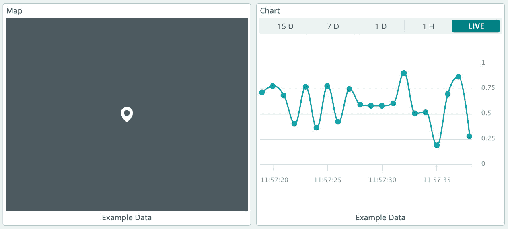

图 3.10 – 地图和图表小部件

首先，我们将从地图小部件开始，讨论如何显示位置，然后我们将探索图表小部件来显示传感器的历史数据。

### 地图

有许多用例需要我们在地图上显示对象的位置，这比简单的坐标值更容易直观理解。Arduino IoT 云为我们提供了一个 `location` 云变量类型，它由纬度和经度值组成。对象可以是孩子、动物，也可以是送餐自行车、快递卡车，甚至是食品/蔬菜包裹。

以下代码演示了如何将纬度和经度值分配给 `location` 云变量：

```cpp
location=Location(32.045948421308715, 72.72505696868048);
```

上述代码用于在您的设备从 **GPS 模块** 接收数据时分配位置。此地图小部件一次只能显示一个位置。如果您有多个对象需要显示跟踪，则每个对象都需要自己的地图小部件。

### 图表

因此，我们可以使用仪表或百分比小部件来显示传感器的当前值，但如果我们想同时显示当前值和历史数据呢？为此，**图表** 是您最佳的选择，它用于显示当前读数和历史读数，以便更好地可视化和比较。

`integer` 或 `float` 云变量类型，如前所述，适用于监控温度、湿度、空气质量等。只需将任何云变量与图表小部件链接即可进行数据可视化。其他用例包括光照水平、能耗以及工业中不同气体的水平。

重要提示

为了快速测试，只需将滑块和小部件图表拖放到仪表板上，并将它们与相同的 `integer` 云变量类型链接。之后，只需更改滑块的值，您就可以观察图表是如何工作的。

在这里，我们详细讨论了地图和图表小部件的控制面板。现在，我们将探索消息和粘性便签的控制面板。

## 消息传递者和粘性便签

我们最后两个小部件是 **消息传递者** 和 **粘性便签**。这两个小部件都不是必需的元素，但确实有助于使您的仪表板更具交互性。*图 3**.11* 展示了这两个小部件的控制面板：

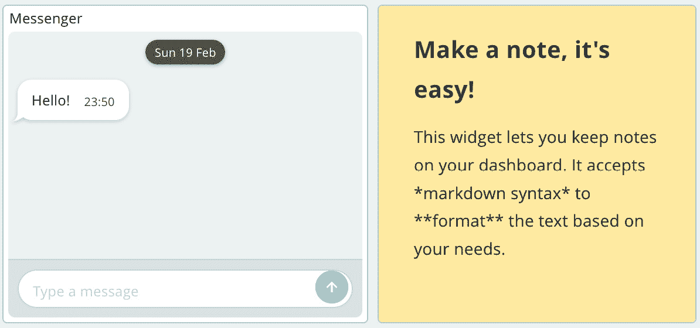

图 3.11 – 消息和粘性便签小部件

在图中，第一个小部件是 **消息传递者**，第二个小部件是粘性便签。这两个小部件将在以下章节中讨论。

### 消息传递者

**消息传递者** 小部件的工作方式类似于任何传统的消息应用。但问题来了，为什么我们需要在仪表板上使用这个小部件呢？在我看来，它目前在任何仪表板上都不是必需的，但将来它可能成为一个很棒的部件，并激发人们开发与事物进行文本交流的产品，就像我们已经有 **Amazon Echo Dot** 和 **Google Assistant** 设备，用户可以通过语音与之交互，向设备提问，设备会以声音做出回应。

在未来，您可能会看到许多与您的设备链接的信使应用程序，您可以提出诸如“我的孩子在哪里？”等问题，与您的孩子连接的设备会向您提供其确切位置。或者，您也可以询问有关您房间内温度/湿度条件的问题，设备会提供所需的答案。

您还可以使用信使小部件为您的设备创建某种小型搜索引擎，该搜索引擎理解一些关键词并响应用户的查询。记住，早起的鸟儿有虫吃。

信使小部件与 `string` 云变量类型一起工作。以下简单的代码片段演示了您如何从设备端写入信使小部件：

```cpp
stringMessengerVariable = "Hello Sir, My name is Arduino MKR1010 and I will be your host. How may I help you Sir?";
```

当您为字符串变量分配新值时，信使会将新内容附加到小部件上。以下代码用于在设备端清除整个小部件：

```cpp
stringMessengerVariable = PropertyActions::CLEAR;
```

您还可以通过 API 或 Zapier 集成将信使小部件与第三方工具如 **Slack** 和 **Discord** 集成。

### 便签

便签小部件的工作方式与简单的 Windows 操作系统便签类似。它帮助您记录项目进度，或者您可以在便签上写下任何内容以维护仪表板。在您有数十个仪表板且希望对特定仪表板添加一些评论的情况下，它可以帮助您。

如需获取有关仪表板小部件控制的最新更新和详细信息，请访问 [`docs.arduino.cc/arduino-cloud/getting-started/dashboard-widgets`](https://docs.arduino.cc/arduino-cloud/getting-started/dashboard-widgets)。

在本节中，我们讨论了信使和便签小部件。便签小部件使得维护项目和记录项目进度或维护的评论变得容易，而信使小部件有更广泛的应用。我们还讨论了传感器数据与人工智能的关系。我们现在已经完成了所有输入和输出小部件的控制，现在，我们将深入探讨 Arduino Web 编辑器，我们将逐步探索所有选项。

# 理解 Arduino Web 编辑器

Arduino 还推出了一种基于 Web 的编辑器，它独立于 Arduino IoT Cloud 和桌面 IDE。它适用于与 Arduino IDE 兼容的任何板，无需通过板管理器安装板。Web 编辑器与大多数网络浏览器兼容，包括 Chrome、Firefox、Microsoft Edge 和 Safari。要使用 Web 编辑器，您的机器应安装有 **Arduino Create Agent**，它作为设备与 Web 编辑器之间的桥梁。所有代码都存储在云端，因此不会丢失代码或需要备份。

要访问 Arduino Web 编辑器，请访问 [`create.arduino.cc/editor`](https://create.arduino.cc/editor)，您将看到如下内容：

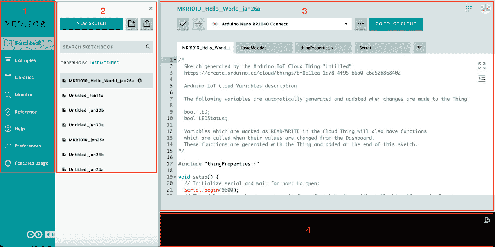

图 3.12 – Arduino Web 编辑器

上一张截图中的数字对应 Web 编辑器以下元素：

1.  这是 Web 编辑器的主菜单，您将在这里找到所有导航链接，例如**草图簿**、**示例**、**库**和**监视器**。

1.  此选项卡是子菜单，根据当前主菜单选择显示选项/内容。在截图中，此选项卡显示与草图簿相关的内容。

1.  此区域是编码/草图区域，您可以在此找到所有与代码相关的选项，例如代码验证/上传、板选择和代码编辑器。

1.  此选项卡是输出终端，它为您提供有关代码上传状态、代码中发现的任何错误等信息。

在这里，我们讨论了 Arduino Web 编辑器界面。现在，我们将详细讨论**草图簿**、**示例**、**库**、**监视器**、**参考**和**帮助**菜单，以及**首选项**和**功能**菜单。我们将深入讨论所有选项，以便您对 Arduino Web 编辑器有一个更全面的了解，让您在开发过程中充分利用其功能。

## 草图簿

此菜单选项负责草图组织、创建、代码下载和上传等。

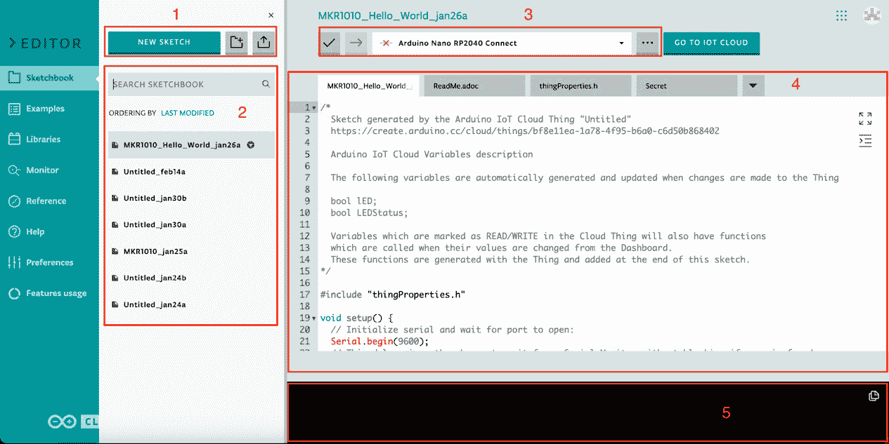

图 3.13 – Arduino Web 编辑器草图簿

上一张截图中的数字对应草图簿屏幕上的以下元素：

1.  **新建草图**按钮用于为新的项目初始化一组新文件。此按钮右侧有两个图标 – 第一个用于创建项目组织文件夹，第二个用于在需要时将任何现有的 Arduino IDE 代码/库导入 Web 编辑器。

1.  这里您可以找到所有您的草图/文件夹，您还可以使用搜索栏帮助搜索您的草图簿。

1.  用于验证代码的图标是滴答图标，而用于将代码上传到开发板的图标是箭头图标。从这些图标右侧的下拉菜单中，您可以选择开发板和端口。最后，省略号按钮包含一系列关于草图的操作选项，例如**保存**、**另存为**、**重命名草图**和**下载草图**。

1.  此区域是开发者的游乐场，用于编写设备代码。在这里，您可以在屏幕右侧找到两个图标，第一个用于使代码编辑器全屏，而第二个用于代码缩进。

1.  这是输出终端，您可以在此获取有关代码编译进度和代码中发现的任何错误的所有信息。

## 示例

Arduino IDE 的顶级功能之一是 **示例**，这是初学者的一大资源，他们可以从库和传感器开发者提供的示例中受益。这在 Arduino Web 编辑器中作为一个独立的菜单呈现。*图 3**.14* 展示了 **示例** 菜单，其中有两个不同的标签页。第一个标签页显示 **内置** 示例，而第二个标签页显示 **来自库** 的示例。

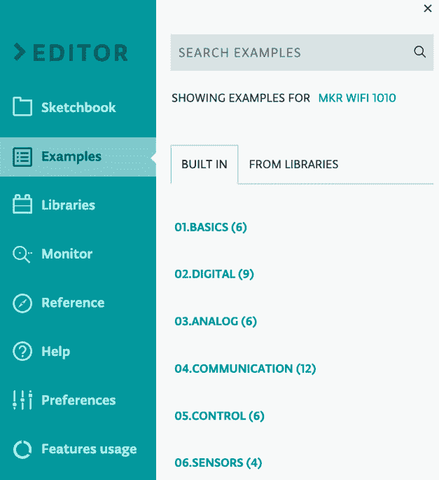

图 3.14 – Arduino Web 编辑器示例

当你点击 **示例** 菜单时，下一个标签页将显示，显示内置或来自库的示例选项。所有示例都组织在不同的类别中，就像在 Arduino IDE 中一样。你还可以使用搜索栏查找来自特定库的示例。默认情况下，Arduino Web 编辑器仅显示特定开发板的示例和库。前面的截图仅显示与 MKR Wi-Fi 1010 兼容的示例，但你可以点击 **MKR WIFI 1010** 链接切换到 **所有板**，反之亦然。

## 库和库管理器

Arduino 平台上有成千上万的库，由世界各地的开发者和传感器及模块制造商开发。这些库为 Arduino IDE 中的传感器/模块提供了广泛的集成可能性，默认情况下还提供了示例代码。库是初学者和专业开发人员学习的主要来源。*图 3**.15* 展示了 **库** 菜单，其中包括不同的选项，如 **库管理器**，它帮助我们安装库，以及 **默认**、**收藏**和**自定义**标签页，这些将在逐步讨论中详细介绍：

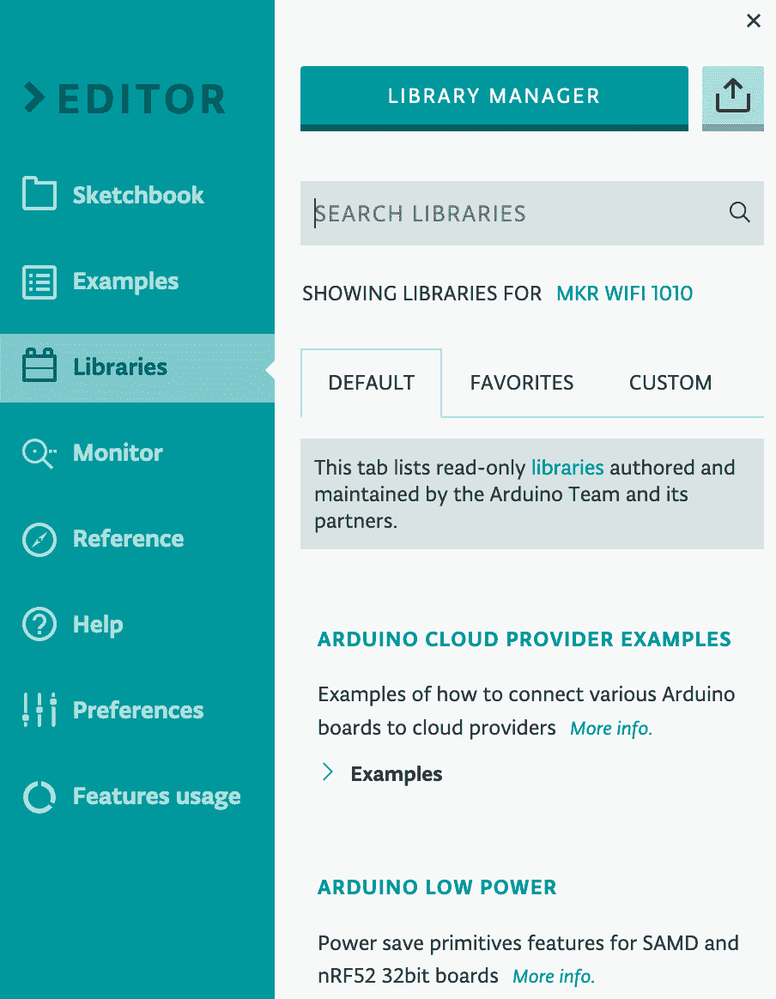

图 3.15 – Arduino Web 编辑器库

在 Arduino Web 编辑器中，我们可以访问大量预安装的库，并且可以将库标记为收藏并包含在我们的代码中。当我们打开 **库** 菜单选项时，我们将看到上述三个主要标签页 – **默认**、**收藏**和**自定义**。**默认**标签页显示由 Arduino 团队和验证合作伙伴开发的库。**收藏**标签页包含你在库管理器中标记为收藏的库。如果你找不到特定于你工作的库，那么你可以通过点击 **自定义** 标签将你自己的库导入 Arduino Web 编辑器。

库管理器包含来自世界各地的库的完整列表。要将库添加到你的项目中，而这些库在 **默认** 标签页中找不到，只需点击 **库管理器**，就会弹出一个新窗口，你可以通过库的名称或公司名称搜索库。找到后，通过点击星形图标将其标记为收藏。

## 监视器，又称串行监视器

**串行监控器**在**过程执行**、**传感器测试**和**代码调试**的验证中起着至关重要的作用。它的工作方式类似于网络浏览器中的控制台，开发者根据他们的需求打印消息以验证过程。在 Arduino Web 编辑器中，它已被重命名为**监控器**。

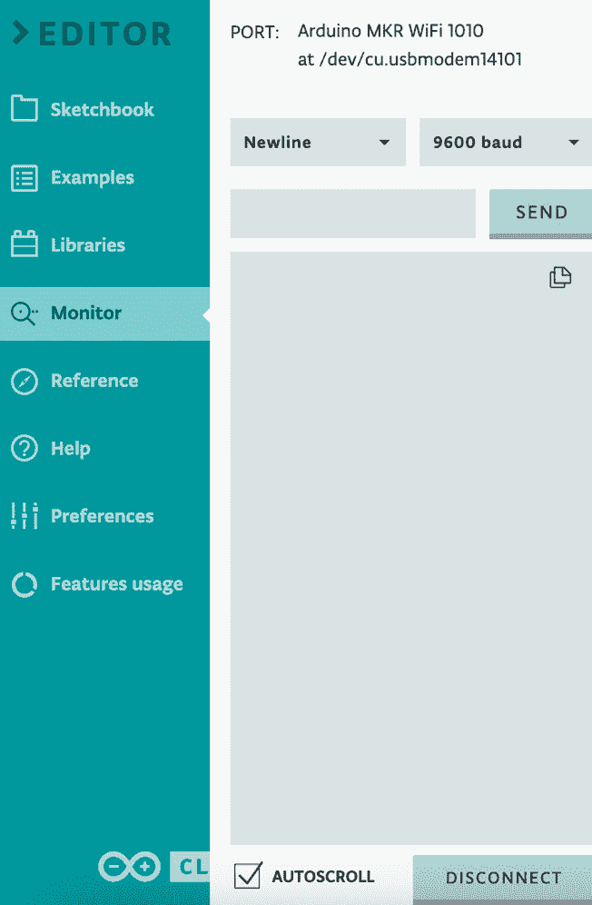

图 3.16 – Arduino Web 编辑器 | 监控器

点击**监控器**链接仅在系统连接了板子时才会激活监控器。确保您的 Arduino Create Agent 也正在后台运行。在**监控器**屏幕的顶部，您将看到开发板的名称以及它连接的端口名称/编号。

接下来，设置`Serial.begin()`方法。开发者通常使用 9600 波特率进行串行通信。监控器下半部分的较大文本区域显示了设备与开发者之间的所有通信。默认情况下，此窗口中启用了**自动滚动**，因此新消息将自动显示。

## 参考、帮助和偏好设置

`Delay`函数；只需找到并点击`Delay()`方法，它将显示描述，包括示例语法和代码，以便更好地理解。

**帮助**菜单提供了关于产品更新和其他许多新信息。信息分为三个标签页，**信息**、**教程**和**词汇表**。**信息**标签页提供了有关版本、兼容性和错误修复的最新更新。**教程**标签页包含链接到小型项目，帮助初学者学习新知识。**词汇表**就像一本书中的词汇表一样，但在这里，您将获得与 Arduino、电子、传感器等相关特定列表。

最后，我们来到了**偏好设置**菜单，从这里我们可以修改 Web 编辑器的主题和字体大小，显示/隐藏输出面板，以及设置代码自动保存或手动保存。

## Arduino IoT Web 编辑器功能

在 Arduino IDE 中，我们没有关于草图创建、编译或存储的限制，但在 Arduino Web 编辑器中，我们确实遇到了一些限制。这是因为，在桌面机器上的 Arduino IDE 中，我们使用自己的资源，但与 Web 编辑器相关的所有内容都托管在云端。在云端，所有东西都必须付费，包括代码验证和编译的存储、处理器和内存使用。

因此，Arduino Web 编辑器在存储大小、草图和编译方面有一些限制和限制。Arduino 为不同类型的订阅者提供了不同的资源配额，购买前应与其他计划进行比较。访问[`cloud.arduino.cc/plans`](https://cloud.arduino.cc/plans)获取完整详情和计划比较。

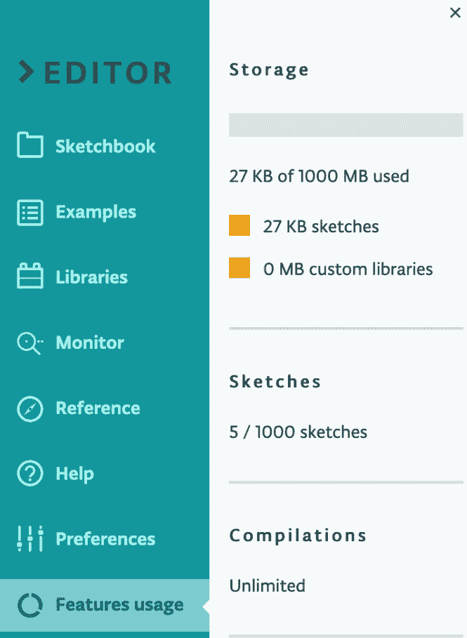

图 3.17 – Arduino Web 编辑器限制和用法

上一张截图显示了 Web Editor 功能的相关统计数据。首先，我们可以看到从订阅计划中提供的总存储空间中使用了多少。我的 Maker Pro 计划总共有 1,000 MB 的存储空间。截图还显示了可以创建多少个草图，以及最后允许进行多少次编译。在我的情况下，我拥有无限量，但免费计划只允许每天存储 100 MB 的草图空间，并且每天限制 25 次编译。

重要提示

Arduino Web Editor 的功能可能会随时间而变化，请访问官方网站获取最新信息：[`cloud.arduino.cc/plans`](https://cloud.arduino.cc/plans)。

在这里，我们深入讨论了新 Arduino Web Editor 中的不同选项，这将帮助您在开发项目中有效地使用编辑器，提高您的生产力。接下来的“任务”部分涵盖了不同的问题，这将帮助您测试在本章和通过互联网搜索中学到的知识，并帮助您有效地利用您的新技能。

# 任务

与前几章相比，本章篇幅更长，因为我们希望为您提供 Arduino IoT Cloud 及其主要支柱的深入概述，包括事物、设备、仪表板、集成和模板，进而过渡到后续章节。在本章中，我们详细讨论了仪表板、输入和输出控件以及 Arduino Web Editor。为了巩固您在本章学到的知识，我们为您创建了三个不同的任务。这些任务将帮助您理解继续阅读本书以及您在专业项目中所需的核心理念。

确保尝试所有给出的任务。

## 任务 1

ASNA 集团是巴基斯坦领先的 ISO 认证盐供应商组织。该组织根据国际标准加工盐，但他们面临着仓库监控的问题，他们希望保持温度/湿度符合标准，以避免成品出现质量问题。目前，他们有五个仓库需要监控。他们希望有多个视图进行数据监控和分析。在为 ASNA 集团开发解决方案时，您需要牢记以下问题：

1.  首先，确定需要哪些类型的工业级传感器/开发板来满足这种监控场景。

1.  是否需要对传感器进行校准？如果是，您将如何校准传感器？如果不是，请提供不强制校准的理由。

1.  需要哪些类型的控件来在仪表板上可视化信息？

1.  您如何在一个仪表板上可视化五个仓库的读数？

1.  在仪表板上，将使用哪些类型的控件来允许用户分析覆盖长时间段的读数？

1.  您将通过什么方式为公司提供对仪表板的访问？

## 任务 2

Imzlab Technologies Private Limited 是一家领先的智能农业解决方案提供商。该公司已在田间部署了定制设计的传感器，使用 ESP32 和 Arduino IoT Cloud 来测量土壤湿度、土壤温度和室外温度/湿度。在仪表板上，他们有不同的数据可视化小部件。他们现在有一个新的客户需求，需要集成水泵控制和显示其状态历史（开启/关闭）。客户还要求在星期一和星期四，水泵将在下午 5:00 到 7:00 之间运行，在星期日，从凌晨 4:00 到 6:00，在 GMT+5 时区。在其他日子里，水泵状态将由人工控制。在为 Imzlab Technologies Private Limited 开发解决方案时，你需要牢记以下问题：

1.  需要哪些控制小部件来显示和控制水泵状态？

1.  你如何为特定日期和特定时间提供自动泵控制解决方案？

1.  是否可以使用图表可视化水泵的开启/关闭状态历史？如果是这样，如何？如果不是，请提供一个替代方案以满足客户的需求。

## 作业 3

Imzlab Technologies Private Limited 的一组研究人员正在开发一个监控系统来监测二氧化碳水平。他们正在使用 MKR 1010 和 Arduino IoT Cloud，但他们正在尝试使用由 Tingstack LLC 开发的定制传感器。在 Arduino Web 编辑器中，没有这个传感器的库，但 Tingstack LLC 为 Arduino 平台开发了一个内部库。研究人员还希望与 Tingstack LLC 团队分享他们的代码以供审查。

从上一段中识别问题，并写下它们的解决方案。

# 摘要

这一章就像在我们开始烹饪之前理解我们拥有的成分和厨房工具一样。首先，我们学习了 Arduino IoT Cloud 组件的工作原理，包括事物、设备、仪表板、集成和模板。然后，我们研究了所有输入/输出小部件控制，以获得它们潜在用法的适当概念，包括一些示例代码和云变量类型。在下一节中，我们检查了 Arduino Web 编辑器是什么以及其不同功能的工作方式，包括示例、库和串行监视器。你现在应该对 Arduino IoT Cloud 和 Web 编辑器的所有不同成分以及如何适当使用它们有一个很好的理解。

在开始下一章之前，这一章非常重要，因为它为你提供了 Arduino IoT Cloud 所有主要支柱的深入概述以及它们如何实时工作，这将帮助你理解 Arduino IoT Cloud 是如何工作的。Arduino 仪表板小部件对我们来说也非常重要，因为我们将在这本书的不同项目中使用不同的小部件，所以在这里提供一个概述已经为你即将到来的章节做好了准备，帮助你了解专业项目中哪些类型的事物是强制性的，以及哪些类型的控制可以使你的项目更加稳健和专业。

在下一章中，我们将开始我们的第一个项目，我们将从头开始构建一个空气质量监控系统，直到部署。你将了解为什么空气质量监测是必要的，以及需要哪些类型的开发板/传感器。我们还将使用一个**印刷电路板**（**PCB**）进行适当的部署，这将在深度解释。在必要的硬件部分之后，我们将设置 Things、云变量、设备和网络配置以及为设备编写代码，以及用于适当数据可视化的仪表板。所以，准备好即将到来的章节，这将让你们所有人都感到有趣。

# 第二部分：亲身体验不同的通信技术

书的第二部分描述了物联网项目中涉及的不同通信技术，并提供了四个不同的实际项目来展示它们的用法以及如何结合 Arduino IoT Cloud 采用第三方组件。

本部分包含以下章节：

+   *第四章*，*项目#1 – 为环境感知创建一个更智能的设置*

+   *第五章*，*项目#2 – 使用 MKR GSM 1400 创建一个便携式物品追踪器*

+   *第六章*，*项目#3 – 使用 LoRaWAN 的远程警报应用*
