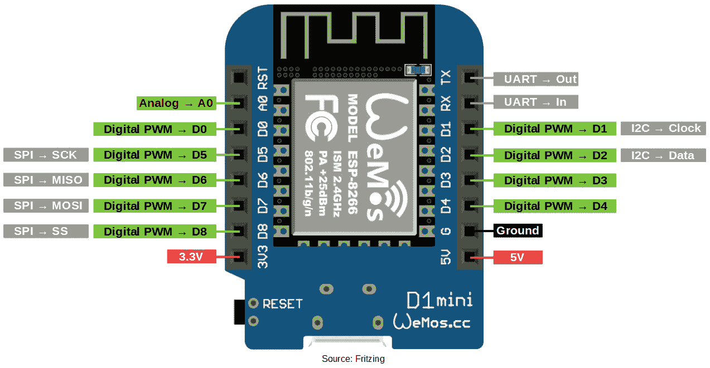
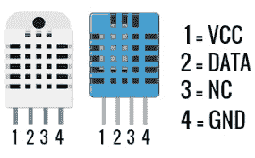
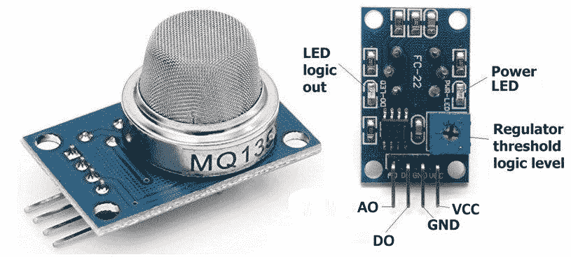
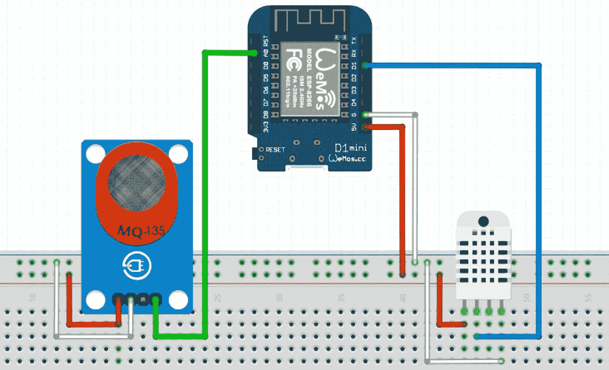
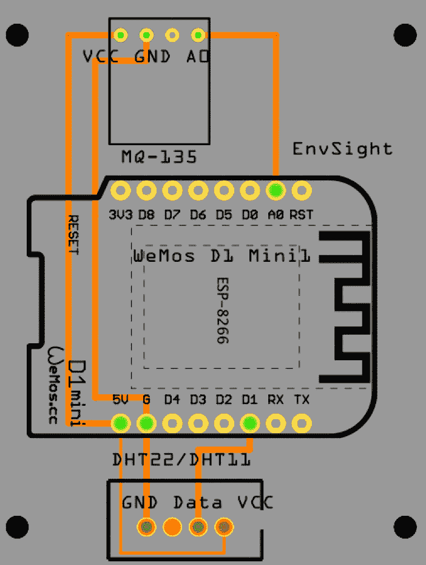
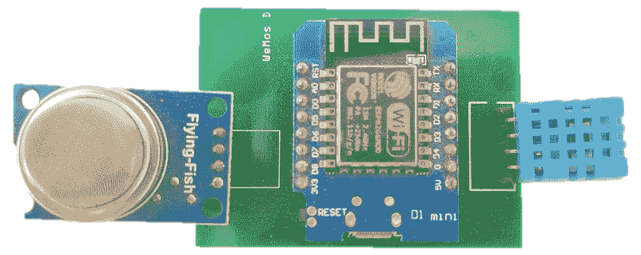
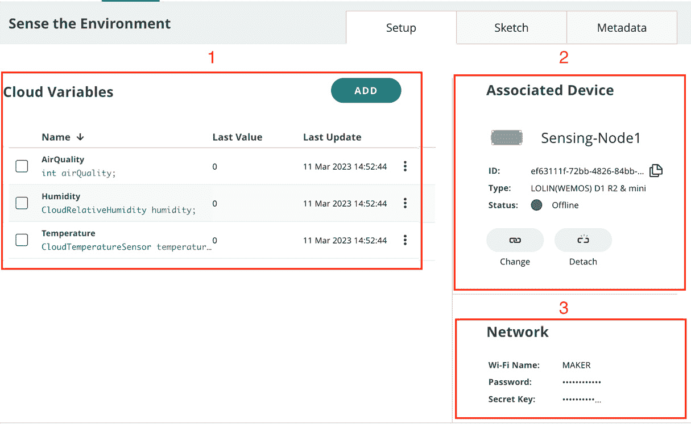
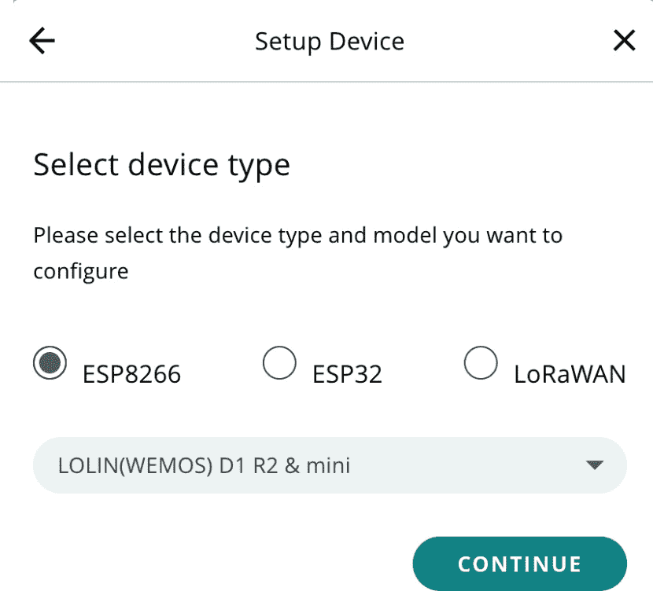
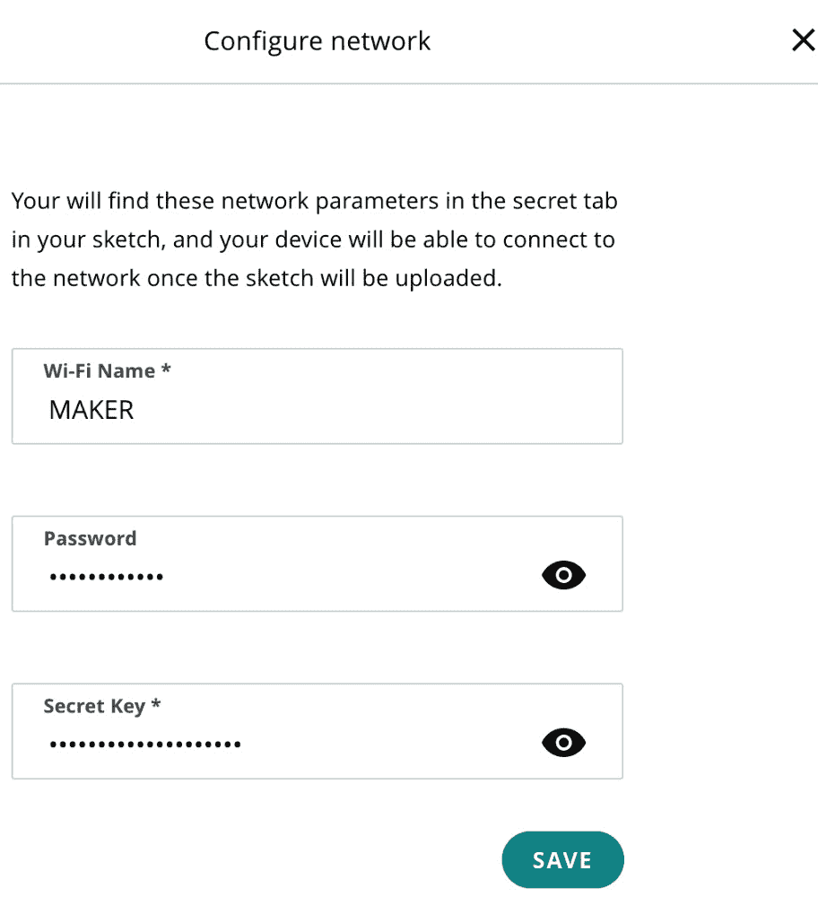
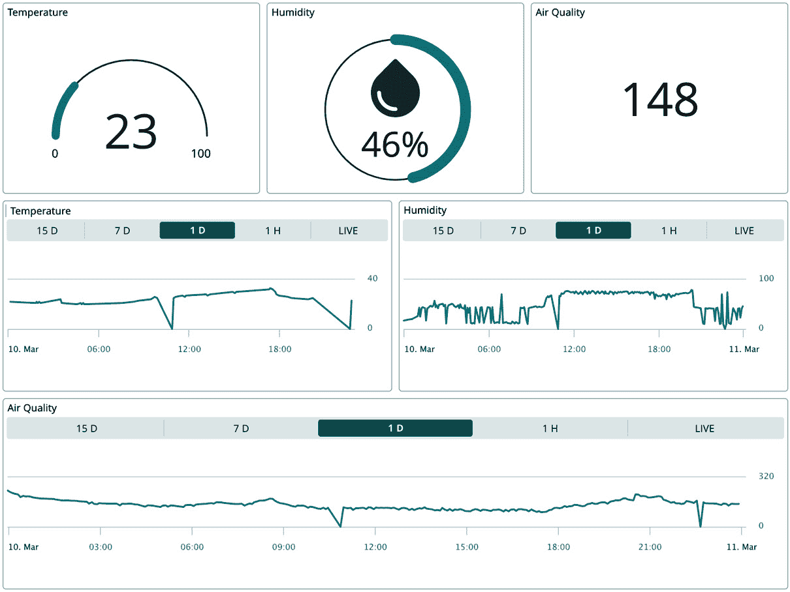

# 第四章：项目#1 - 智能化环境感知设置

本章将指导您了解为什么清洁的环境对人类来说是必要的，以及如何通过使用低成本**ESP 系列板**、不同的开源传感器和**Arduino IoT Cloud**来实现空气质量、温度和湿度监测。此外，您还将学习如何可视化相关数据，并使用 Arduino IoT Cloud 功能来扩展您应用程序/项目的功能。

在本章中，我们将通过展示**印刷电路板**（**PCB**）设计、其实施和在现实世界中的应用来展示如何构建实际解决方案。我们将涵盖以下主题：

+   为什么空气质量监测是必要的？

+   硬件组件 - 传感器和开发板

+   项目架构

+   设置**Thing**、网络凭据、云变量和代码

+   设置网页和移动端仪表板

+   接下来是什么？

# 技术要求

以下硬件组件是理解本章所必需的：

+   **WeMos D1** **MINI ESP8266**

+   **DHT11**/**DHT22**传感器/模块

+   **MQ-135**空气质量模块

+   PCB（在*PCB 设计和组装硬件* *组件*部分有链接）

+   女性端子

+   跳线

对于编码，我们将使用**Arduino Web Editor**，它包含大量开发板和传感器库，以及**Arduino IoT Cloud**用于 Thing 和仪表板设置。为了开发硬件和传感器设计，我们需要**Fritzing**桌面软件。

本章的代码可在本书的官方 GitHub 仓库中找到，或者您可以通过以下链接直接下载代码：[`github.com/PacktPublishing/Arduino-IoT-Cloud-for-Developers/tree/main/Chapter%234%20Project%231%20Sensing%20and%20Monitoring%20the%20Air%20for%20Clean%20Environment`](https://github.com/PacktPublishing/Arduino-IoT-Cloud-for-Developers/tree/main/Chapter%234%20Project%231%20Sensing%20and%20Monitoring%20the%20Air%20for%20Clean%20Environment).

# 为什么空气质量监测是必要的？

空气质量监测对人类来说是必要的，因为空气污染可能对我们的健康和福祉产生重大的负面影响。糟糕的空气质量可能导致各种呼吸和心血管问题，如哮喘、慢性支气管炎、肺癌和心脏病。它还可能加剧现有的健康问题，并降低我们抵抗感染和疾病的能力。

空气污染也可能影响环境，包括生态系统、野生动物和植物。受污染的空气可能导致**酸雨**，损害农作物、森林和水源，并危害野生动物。它还可能导致臭氧层的耗尽，这层臭氧层保护我们免受有害的紫外线辐射。

通过监测空气质量，我们可以确定污染水平高的区域，并采取措施减少暴露。这包括减少工厂、发电厂和交通部门的排放，以及鼓励使用清洁能源和交通替代方案。通过改善空气质量，我们可以帮助保护我们的健康，支持环境，并促进可持续发展。

空气质量监测是评估我们呼吸的空气中污染物水平所必需的。它有助于确定污染源，并跟踪空气质量随时间的变化。空气质量监测之所以重要，有几个原因：

+   **合规性要求**：许多国家已经制定了法规，限制可以排放到空气中的污染物数量。空气质量监测是确保这些法规得到遵守并确定可能需要额外法规的区域的必要手段。

+   **经济关注**：糟糕的空气质量会对经济活动产生负面影响，包括降低生产力、增加医疗保健成本和减少旅游业。监测空气质量可以帮助确定污染水平高的区域，并采取措施改善空气质量以支持经济增长。

总体而言，空气质量监测是保护公共健康、保护环境和促进可持续经济发展的关键工具。现在我们已经对空气质量监测进行了理论回顾，是时候实际探索这个项目了。首先，我们将从硬件开始，探索所有必需的组件，例如开发板、传感器、设计图和 PCB 设计以供实施。之后，我们将设置设备和云变量，上传代码到开发板，并设置仪表盘以进行数据可视化。

# 探索硬件需求

在继续前进之前，我们首先将查看完成项目所需的开发板和传感器的类型。我们的目标是使用提供 Wi-Fi 连接、体积小且成本低的板子。如果我们谈论具有 Wi-Fi 功能的开发板，那么有很多组织提供这些板子，例如**Arduino**、**ESP32 系列**和**ESP8266 系列**。与 ESP32 和 ESP8266 相比，Arduino 开发板如**MKR Wi-Fi 1010**和**MKR Wi-Fi 1000**价格较高。现在，我们有两个选择：我们要么选择 ESP32 或 ESP8266，并放弃 Arduino 开发板。在这个项目中，我们将使用 ESP8266 系列的 WeMos D1 Mini。尽管 ESP32 系列提供类似的功能，但它配备了**低功耗蓝牙**（**BLE**）连接，目前与本项目不兼容。因此，我们选择了 ESP8266 系列开发板，这些开发板不仅体积紧凑，而且价格更实惠。

在传感器中，有各种选项可以测量温度、湿度和空气质量。然而，我们的主要目标是提供对全球用户来说既经济又容易获得的传感器。对于温度和湿度测量，我们依赖于广泛可用且价格合理的 DHT11/DHT22 传感器。MQ-135 传感器提供广泛的检测范围，快速响应和高灵敏度。它是一种稳定且寿命长的简单驱动电路应用。这些传感器用于空气质量控制设备，适用于检测 NH3、NOx、酒精、苯、烟雾、CO2 等。它们在市场上容易获得，非常适合小型项目。

ESP8266 系列拥有多种大小和引脚数不同的开发板。在本章中，我使用 WeMos D1 Mini 开发板，因为它与其他板相比非常紧凑，当然，成本也更低，并且它提供 5V 和 3.3V 引脚。以下图是 WeMos D1 Mini 板的完整概述，并展示了所有基于 Arduino 的数字/模拟引脚编号、地线和电源引脚等：



图 4.1 – WeMos D1 Mini ESP8266

WeMos 提供了多个数字输入/输出引脚，但只有一个模拟引脚用于输入/输出操作。如果您想使用多个模拟传感器，则可以使用**模数转换器**。最著名的模数转换器之一是**ADS1115**/**ADS1015 模块**，它提供四个模拟引脚，有助于满足使用多个传感器的需求。

然而，对于当前项目，我们需要一个数字引脚用于**DHT11**/**DHT22 传感器**，以及一个模拟引脚用于**MQ-135 空气质量传感器**。WeMos D1 Mini 开发板的一个最佳特性是 5V 电源引脚，这在大多数 ESP8266 系列开发板上是不可用的。

接下来，我们将使用 DHT11 传感器来检测温度和湿度，但根据您的需求，您也可以使用 DHT22 传感器。就功能而言，DHT22 提供的检测范围比 DHT11 更广，但其成本更高。以下图表显示了两个传感器的引脚布局：



图 4.2 – DHT22 和 DHT11 引脚布局

引脚#1 是**电压共集电极**（**VCC**），与 3.3V 和 5V 都兼容。引脚#2 是一个**数据**引脚，可以连接到开发板上的任何数字引脚，而引脚#4 是一个**地**（**GND**）引脚，可以连接到开发板的 GND 引脚。传感器中还有一个引脚，即引脚#3，它是**未连接**（**NC**）的 – 在开发过程中我们不使用这个引脚。

下表解释了 DHT22 和 DHT11 之间的所有规格差异；最值得注意的是**检测范围**和**检测周期**：

| **型号** | **DHT22** | **DHT11** |
| --- | --- | --- |
| 电源电压 | 3.3–5V |
| 输出信号 | 通过单总线输出数字信号 |
| 感测元件 | 聚合物电容器 |
| 感测范围 | 湿度：0–100% RH 温度：40~80 摄氏度 | 湿度：20–90% RH 温度：0~50 摄氏度 |
| 准确度 | 湿度：± 2% RH（最大 ±5% RH）温度：<±0.5 摄氏度 | 湿度：±1% RH（最大 ± 5% RH）温度：<±2 摄氏度 |
| 感测周期 | 平均 2 秒 | 平均 1 秒 |

表 4.1 – DHT11 与 DHT22 比较

最后，我们将查看我们项目的核心传感器。MQ-135 传感器用于监测特定区域的空气质量。它是一种低成本的环境监测传感器，它可以监测广泛的参数，如烟雾、二氧化碳、氨、苯、氮氧化物和酒精。MQ-135 可以检测所有这些参数，并提供空气质量**百万分之一**（**ppm**）的值。以下图显示了 MQ-135 的形状及其引脚布局图以及 LED 和调节器的指示器：



图 4.3 – MQ-135 传感器和引脚布局

MQ-135 传感器模块由四个引脚组成，每个引脚都标有代码：**模拟输出**（**AO**）、**数字输出**（**DO**）、GND 和 VCC。该模块提供模拟和数字模式下的读数，但模拟模式最适合获取 PPM 值。该传感器在 5V 电源下运行效果更好，但您仍然可以使用 3.3V，尽管我推荐前者。MQ-135 需要 20 秒的预热才能提供更好的读数，因此请确保每隔 20 秒读取一次，或者至少在开发板首次启动后等待 20 秒。

该模块还包含一个调节器，用于控制传感器的灵敏度，可以根据环境进行调整。不同的指示**表面贴装器件**（**SMD**）LED 可用于验证模块状态，包括**逻辑输出 LED**和**电源 LED**。

# 理解项目架构

在前面的章节中，我们详细讨论了传感器和开发板。现在，是时候准备食谱了。在硬件开发中，在开始使用传感器和开发板之前，我们需要开发设计概念，以便更好地理解事物如何连接。有许多软件可用于设计和发展有关电子项目的概念，但我们将选择 Fritzing。

在下一小节中，我们将讨论项目的电路图和设计，这将解释如何将引脚连接到开发板。在下一小节中，我们将讨论 PCB 设计和其实施，以便将产品部署到现场。

## 电路图和设计

我们设计的目的是清楚地了解传感器如何与开发板连接。它帮助工程师通过使用我们的设计文件在 **面包板** 或 **Veroboard** 上开发原型。设计的主要好处之一是 Fritzing 会根据你的设计在后台构建硬件原理图和 PCB 设计，设计师可以根据系统要求进行调整。以下设计提供了如何将传感器连接到开发板的全面概述：



图 4.4 – 空气质量监测系统设计

为了更好地理解，我们开发了如 *图 4**.4* 所示的原理图以及 *表 4.2* 以便于理解。引脚配置将在下一段详细讨论。

| **WeMos** **D1 mini** | **MQ-135** | **DHT22** |
| --- | --- | --- |
| 5V | VCC | VCC |
| GND | GND | GND |
| A0 | A0 | - |
| D1 | - | 数据 |

表 4.2 – 传感器引脚配置表

根据设计（*图 4**.4* 和 *表 4.2*），我们从开发板到两个传感器都有共同的 5V 输出和 GND。MQ-135 传感器是一个模拟传感器，因此我们将它的 AO 引脚连接到 WeMos 开发板的 AO 引脚，而 DHT11/DHT22 是数字传感器，它们的 2 号引脚连接到开发板的 D1 引脚。

## PCB 设计和硬件组件的组装

在前面的子节中，我们查看了一个非常适合使用面包板或 Veroboard 制作原型设计的方案，但如果我们想在现场部署该解决方案怎么办？**Fritzing** 是一个很好的工具，它提供了设计 PCB 的选项，但在你开发设计时，它会在后台自动创建 PCB 设计，这可以通过 **PCB 设计** 选项卡访问。自动 PCB 设计只是一个基本的封装，不适合直接生产，因此必须根据专业实践进行审查和重新排列。以下图表展示了项目的最终 PCB 设计：



图 4.5 – 空气质量监测系统 PCB 设计

开发 PCB 很容易；只需确保连接线不要与其他连接线交叉。有许多不同的 PCB 设计工具可用，如 EasyEDA、CircuitMaker 和 Altium，但多亏了 Fritzing，我才能如此轻松地创建该设计。

PCB 设计完成后，你有两个选择。首先，你可以使用 DIY 方法自行开发 PCB，这对于学习很有帮助，但不适合大规模产品。第二种方法是选择一个专业机构来专业制造 PCB。中国有许多组织提供 PCB 制造和加工服务，例如 **Seeed Studio**、**JLCPCB** 和 **PCBWay**。我尝试过 PCBWay，并对他们的制造和交货时间印象深刻。我已经将 PCB 设计上传到 PCBWay 项目仓库；从那里，你可以轻松选择和订购：[`www.pcbway.com/project/shareproject/Low_cost_Outdoor_Air_Quality_Monitoring_System_0157f1af.html`](https://www.pcbway.com/project/shareproject/Low_cost_Outdoor_Air_Quality_Monitoring_System_0157f1af.html)。

在获得 PCB 板后，是时候焊接开发板和传感器的雌性引脚了。永远不要直接在 PCB 上焊接开发板和传感器，因为如果任何东西停止工作，那么很容易拆卸和更换。所以最终，我们有一个产品准备好了，其中传感器和开发板已经焊接在 PCB 上，以便最终部署。



图 4.6 – PCB 上的空气质量监测系统

在将雌性引脚焊接到 PCB 上后，WeMos 和其他传感器被插入到引脚中，如前图所示。在本节和前一节中，我们探讨了项目中将使用哪些类型的传感器和开发板，本节的后半部分讨论了设计，展示了传感器和 WeMos D1 Mini 之间的连接线路系统。最后，我们探讨了 PCB 设计并组装了 PCB 的所有组件。接下来，我们需要在 Arduino IoT Cloud 中设置 Thing、代码和仪表盘，为最终产品做好准备。

# 设置 Thing、网络凭证、云变量和代码

在设置好硬件后，是时候在 Arduino IoT Cloud 中设置 Thing 了。对于这个项目，我们需要三个云变量来从设备获取监测参数，由于基于 ESP 系列的开发板，Wi-Fi 网络设置将与 Arduino 开发板不同。以下图提供了 Thing 的概述，包括 **云变量**、**关联设备**和**网络**设置，这些将在下一步逐一讨论：



图 4.7 – 空气质量监测系统 Thing 设置

使用名称 `Sense the Environment` 创建一个新的 Thing。按照以下步骤创建变量、相关设备、网络配置，最后是代码：

1.  首先，我们需要设置关于空气质量、湿度和温度的三个云变量。有关云变量的完整详细信息可在下一子节中找到。

1.  之后，我们需要将设备与实体关联起来。在当前项目中，我们将使用 WeMos D1 Mini，因此向导将与 Arduino 板不同。完整的详细信息可在 *关联设备* 子节中找到。

1.  最后，我们需要设置设备的网络配置，但这次，我们需要为 ESP 系列板提供一个安全密钥，以确保连接的安全性。Arduino 兼容的板在设备设置向导期间由 Arduino IoT Cloud 自动配置。

1.  在设置云变量、设备和网络设置之后，我们将审查代码。

这里，我们概述了实体，并讨论了完成实体设置所需执行的要求步骤。

## 云变量

下表解释了我们在创建云变量时需要使用的变量的所有属性。整数是一个非常著名的数据类型，但我们将使用两种新的变量类型来测量湿度（`CloudRelativeHumidity`）和温度（`CloudTemperatureSensor`），分别以百分比和摄氏度为单位。接下来，请确保变量的声明与给定表格中的声明完全一致，包括大小写敏感的名称和变量类型。如果示例代码与您的命名不匹配，您需要相应地修改它。

| **S#** | **变量名** | **变量类型** | **声明** | **权限** | **更新策略** |
| --- | --- | --- | --- | --- | --- |
| 1 | `AirQuality` | `int` | `airQuality` | 只读 | **变更时** |
| 2 | `Humidity` | `CloudRelative Humidity` | `humidity` | 只读 | **变更时** |
| 3 | `Temperature` | `CloudTemperature Sensor` | `temperature` | 只读 | **变更时** |

表 4.3 – 云变量详细信息

在这里，我们将 **权限** 设置为只读；尽管我们有读写选项，但在我们的项目中，我们只想从设备接收数据，而不是修改仪表板。这就是为什么使用只读模式来防止数据一致性问题的原因。**更新策略** 设置为 **变更时**，因为设备将在五分钟后发送数据，这个选项比定期更新更合适。

## 关联设备

在创建变量后，是时候添加设备并将其与实体关联起来。在添加设备之前，将开发板连接到计算机并打开 **Arduino Create Agent** 应用程序。以下图显示了 Arduino IOT Cloud 支持的不同类型的第三方板，在那个步骤中，我们将选择 **ESP8266** 系列板。



图 4.8 – 设备选择向导

请按照以下步骤将设备添加到 Arduino IoT Cloud：

1.  在“关联设备”部分下点击**选择设备**按钮。

1.  将会出现一个弹出窗口，其中您可以查看所有已可用的设备。如果您已经添加了您的 WeMos D1 Mini，请选择它。否则，点击**设置****新设备**。

1.  接下来，点击**第三方****设备**选项。

1.  从下拉菜单中选择**ESP8266**和**LOLIN(WEMOS) D1 R2 mini**，然后点击**继续**按钮。

1.  提供设备名称并点击**下一步**按钮。

1.  在最后的向导中，将显示设备 ID 和密钥。将密钥复制到安全的地方，因为它将在网络配置过程中使用。

在设置好设备并将其与“物”关联之后，现在是时候配置设备网络设置了。以下部分将涵盖配置设备以连接 Wi-Fi 网络的全部步骤。

## 网络

在将设备与“物”关联后，现在是时候配置设备通信的 Wi-Fi 设置了。填写带有**Wi-Fi 名称**和**密码**的表格：



图 4.9 – “物”的网络配置

在*图 4*.9 中，您将找到一个新的**密钥**字段。粘贴我们在设备关联过程中从系统中收到的密钥，该过程在上一个子节中解释为*步骤 6*。

现在，我们已经完成了设备与“物”的关联以及网络设置。下一步是理解和上传代码。以下部分将指导您通过代码。

## 编码

该章节的代码可在本书的官方 GitHub 仓库中找到，或者您可以通过以下链接直接下载代码：[`github.com/PacktPublishing/Arduino-IoT-Cloud-for-Developers/tree/main/Chapter%234%20Project%231%20Sensing%20and%20Monitoring%20the%20Air%20for%20Clean%20Environment/Sense_the_Environment_feb24a`](https://github.com/PacktPublishing/Arduino-IoT-Cloud-for-Developers/tree/main/Chapter%234%20Project%231%20Sensing%20and%20Monitoring%20the%20Air%20for%20Clean%20Environment/Sense_the_Environment_feb24a)

您可以通过导航到`delay`方法来下载代码并将其放入您的“物”中，因为它将阻塞`ArduinoCloud.update()`方法，然后每五分钟调用一次`STHAM`方法。以下代码演示了如何从`dht`对象中获取温度和湿度值，对于`airQuality`，我们简单地使用`analogRead()`方法。

```cpp
  dht.temperature().getEvent(&event);
  if (isnan(event.temperature)) {
    temperature=0;
  }
  else {
    //Send Temperature to Cloud
    temperature=event.temperature;
  }
  // Get humidity event and print its value.
  dht.humidity().getEvent(&event);
  if (isnan(event.relative_humidity)) {
    humidity=0;
  }
  else {
    //Send Humidity to Cloud
    humidity=event.relative_humidity;
  }
  //Send Air Quality to Cloud
  airQuality=analogRead(A0);
```

上述代码片段是从`STHAM`方法中提取的；在这里，我们只是修改了代码，以向您展示我们如何在从传感器获取值后向 Arduino IoT Cloud 发送值。

在前面的部分，我们创建了云变量。只需回忆一下云变量声明，并将传感器读数分配给这些变量。这个云变量声明可以在`thingProperties.h`文件中找到。因此，当你将这些值分配给这些变量时，循环中的`ArduinoCloud.update()`方法将自动将数据发送到云。

将代码上传到设备并验证连接性和读数。如果您想更改读数时间，只需修改`interval`变量的值。请确保您提供的时间以毫秒为单位，其中 1 秒等于 1,000 毫秒。

重要提示

如果您在变量声明中使用了不同的命名，那么根据您的命名方案更新代码。然而，最好您首先按照书中的所有步骤进行，然后再更改云变量名称并修改您的代码，按照这个顺序。

永远不要尝试使用`delay`方法，这将为`ArduinoCloud.update()`方法创建一个阻塞。始终使用毫秒来计算等待时间。回顾`loop()`方法，了解我们如何在 5 分钟后调用该方法。

Arduino IoT Cloud 仅在变量值更改时更新仪表板上的值。例如，如果温度是 30 度，并且 5 分钟后仍然相同，那么 Arduino IoT Cloud 将不会记录该值，所以如果图表上的值没有变化，请不要感到困惑。这是 Arduino IoT Cloud 的另一个好处：当您导出内容时，您将不会得到重复的数据。

我们已经成功设置了设备，包括云变量、设备关联、网络配置和代码，并将其上传到开发板。现在，是时候在下一节探索仪表板和传感器值可视化。

# 设置网页和移动设备的仪表板

在将代码上传到设备后，是时候为网页和移动设备设置仪表板，以便使用不同的小部件可视化数据。有关小部件及其使用的详细信息，请参阅*第三章*。如果您直接跳到了这一章，我建议您回到*第三章*，以获取小部件及其使用的详细概述，这将有助于您了解小部件的工作原理及其在不同用例中的使用。以下图示展示了使用不同小部件的读数可视化：



图 4.10 – 设备仪表板

我们有三个不同的读数，**温度**、**湿度**和**空气质量**。对于每个读数，我们使用不同的小部件控件来展示它们如何工作，但对于历史数据，图表是最好的小部件。

**温度**读数通过**仪表**进行可视化，**湿度**读数连接到**百分比**小部件，而**空气质量**读数连接到**值**小部件。这些小部件只能显示传感器的当前读数。然而，我们还想监控历史数据，图表是显示实时以及更早数据的最佳小部件。在这里，我们使用了三个图表，每个图表都连接到一个特定的云变量。

# 接下来是什么？

我们仍然有很多选项可供探索，但现在轮到你使用不同的传感器和开发板进行更多实验并从中学习。在本章中，我们只使用了两个传感器，它们只提供三个参数，但市场上有很多传感器提供广泛的性能，例如空气压力和不同气体的测量。

尝试以下传感器以增强你的实践知识，并从功能、范围和成本方面与其他传感器进行比较：

+   **BMP280**（压力和温度）传感器

+   **MH-Z19C/D/E 系列**二氧化碳监测传感器

+   **MQ 系列**传感器，设计用于检测不同的特定气体，包括 MQ-2、MQ-3、MQ-4、MQ-5、MQ-7、MQ-8 和 MQ-9

+   **Seeed Studio SCD30**（温度、湿度和 CO2）

+   **Gravity**：**模拟电化学二氧化碳传感器**（0–10,000 PPM）

# 摘要

在本章中，我们探讨了如何使用 DHT11、MQ-135 和 WeMos D1 Mini 开发板开发一个低成本空气质量监控系统。我们设置了“物”，这包括创建云变量、关联设备、配置网络和编写开发板代码。后来，我们创建了一个仪表板，使用不同类型的小部件可视化“物”的传感器读数，借助图表显示当前读数以及历史数据。通过这个项目，你将获得在实际中设置“物”并使用 PCB 在野外部署的信心。你已经了解了用于传感器读数和存储的新类型云变量，以及处理不同类型的仪表板小部件。

在下一章中，我们将研究物联网的 GSM 技术。我们将了解不同类型的全球物联网 SIM 卡及其使用方法。这个项目还将演示一个智能资产追踪示例，我们将使用 GPS 模块跟踪资产并将数据通过全球物联网 SIM 卡发送到 Arduino IoT 云。最后，你还将了解 Arduino IoT 云中的新小部件，用于基于 GPS 坐标可视化你的资产位置。
