# 5

# 项目#2 - 使用 MKR GSM 1400 创建便携式设备跟踪器

本章致力于**智能交通**和**智能远程监控**。它展示了如何将支持蜂窝通信的设备集成到**Arduino IoT Cloud**平台，同时也提供了一个使用**全球物联网 SIM 卡**进行通信的示例。

在这里，我们将实际探索**长期演进**（**LTE**）技术，这些技术在远程监控和控制中非常有用，无论是涉及资产跟踪还是远程操作监控。本项目使用**Arduino MKR GSM 1400**开发板，它配备了最新的通信频段，并专门为**工业物联网**（**IIoT**）和**物联网**（**IoT**）用例设计。本项目实际解释了如何根据不同的用例开发基于蜂窝通信的跟踪解决方案。本章将帮助您了解蜂窝通信技术、全球物联网 SIM 卡以及使用蜂窝技术集成 Arduino IoT Cloud 的方法。到本章结束时，您将能够开发使用蜂窝技术的远程地区解决方案。

本章将涵盖以下主要内容：

+   通过物联网资产跟踪和远程控制增强操作

+   探索 GSM/LTE/NB-IoT 通信技术的优势

+   使用物联网 SIM 卡实现无缝全球连接

+   构建模块 - 物联网传感器和开发板

+   设计项目架构

+   激活物联网部署的 SIM 卡

+   配置设备、网络凭据、云变量和代码

+   创建全面的网页和移动仪表盘

# 技术要求

完成本章所需的硬件组件如下：

+   MKR GSM 1400/MKR NB 1500

+   一张 Hologram 全球物联网 SIM 卡

+   一款 NEO-6M GPS 模块

+   一块面包板

+   跳线

对于编程，我们将使用**Arduino Web Editor**，它包含大量开发板和传感器库，以及用于设备和仪表盘设置的 Arduino IoT Cloud。为了开发硬件和传感器设计，我们需要**Fritzing**桌面软件，以及用于 GPS 模块测试的**Arduino IDE**。

在本章中，我们将使用**Arduino IoT SIM 卡**进行通信，而不是使用本地 SIM 卡提供商。Arduino 为全球物联网 SIM 卡提供多种数据计划，可以根据需求进行选择。本章的代码可在本书官方 GitHub 仓库中找到，链接为：https://github.com/PacktPublishing/Arduino-IoT-Cloud-for-Developers。

# 通过物联网资产跟踪和远程控制增强操作

**物联网**技术对于资产追踪和远程控制与监控操作非常有用。通过在资产上安装传感器并将它们连接到中央网络，您可以实时跟踪资产的位置和状态。以下是物联网在资产追踪和远程控制与监控操作中的一些应用方式：

+   **资产追踪**：通过在您的资产上安装 GPS 跟踪器或 RFID 标签，您可以实时跟踪它们的位置和移动情况。这对于物流和供应链管理以及车队管理非常有用。

+   **状态监控**：通过在您的资产上安装传感器，您可以实时监控它们的状况和性能。这可以帮助您在问题变得严重之前识别潜在问题，并采取纠正措施以防止停机并降低维护成本。

+   **预测性维护**：通过分析传感器的数据，您可以使用机器学习算法预测您的资产何时需要维护。这可以帮助您在最方便的时间安排维护，并避免计划外的停机时间。

+   **远程控制**：通过将您的资产连接到中央网络，您可以从中央位置远程控制它们。这对于位于偏远地区或难以到达的操作非常有用。

+   **远程监控**：通过在您的资产上安装摄像头和其他传感器，您可以实时远程监控它们的操作。这可以帮助您快速识别潜在问题并采取纠正措施。

总体而言，物联网技术对于资产追踪和远程控制与监控操作非常有用。通过利用传感器的力量、数据分析以及机器学习，您可以提高操作效率并降低成本和停机时间。在本节中，我们讨论了使用蜂窝技术进行物联网资产追踪和远程监控。接下来，我们将介绍目前市场上可用的以及未来即将推出的不同通信技术。

# 探索 GSM/LTE/NB-IoT 通信技术的优势

**全球移动通信系统**（**GSM**）、LTE 和 **窄带物联网**（**NB-IoT**）都是广泛用于移动通信和物联网设备的无线通信技术。每种技术都有其自身的优缺点，选择哪种技术取决于具体需求和解决方案设计。

以下是选择 GSM、LTE 或 NB-IoT 而不是其他通信技术的一些原因：

+   **广泛覆盖**：GSM 和 LTE 网络覆盖范围广泛，几乎遍布全球，这使得它们非常适合全球连接。另一方面，NB-IoT 是专门为物联网设备设计的，在难以到达的地区提供更广泛的覆盖。

+   **高数据速率**：LTE 提供高数据速率，使其适用于需要快速可靠数据传输的应用。尽管速度较慢，但 NB-IoT 仍然比其他 **低功耗广域网（LPWAN**）技术提供更好的数据速率。

+   **安全性**：GSM 和 LTE 网络提供高安全级别，具有加密和身份验证等特性，以防止窃听和其他形式的网络攻击。NB-IoT 也为数据安全提供端到端加密。

+   **兼容性**：GSM 和 LTE 网络与之前的技术版本向后兼容，允许与现有基础设施无缝集成。NB-IoT 也被设计成与 LTE 网络兼容，这使得向现有 LTE 网络添加物联网功能变得容易。

+   **电池寿命**：NB-IoT 和其他低功耗广域网（LPWAN）技术被设计成消耗最少的电力，从而延长连接设备的电池寿命。

总体而言，GSM、LTE 和 NB-IoT 是广泛使用的通信技术，提供可靠的连接性、高数据速率、安全性和与现有基础设施的兼容性。在此，我们讨论了 GSM/LTE/NB-IoT 通信技术相对于其他无线通信技术的优势。在下一节中，我们将介绍全球物联网 SIM 卡，这是本章的主要内容支柱。

# 通过物联网 SIM 卡实现无缝全球连接

全球物联网 SIM 卡专门设计用于需要通过蜂窝网络连接到互联网或其他连接设备的物联网设备。这些 SIM 卡提供对多个网络的访问，允许设备在不同国家和区域之间漫游，无需在 SIM 卡之间切换。

全球物联网 SIM 卡通常提供以下功能：

+   **多网络覆盖**：这些 SIM 卡可以连接到多个蜂窝网络，包括 GSM、LTE 以及其他新兴技术，如 NB-IoT 和 **Cat-M**，以在不同地点提供可靠的覆盖。

+   **空中更新**（**OTA**）**更新**：许多全球物联网 SIM 卡提供商提供空中更新服务，使设备能够接收固件和软件更新，无需物理干预，提高效率并降低维护成本。

+   **数据计划**：全球物联网 SIM 卡提供商提供灵活的数据计划，可以根据设备或应用的具体需求进行定制。这包括数据配额、数据速度以及根据需要添加更多数据的能力。

+   **安全性**：全球物联网 SIM 卡通常包含加密和身份验证等安全特性，以保护数据并防止未经授权的访问。

+   **管理工具**：许多全球物联网 SIM 卡提供商提供基于网页的门户或移动应用程序，使用户能够监控和管理他们的 SIM 卡，包括数据使用、网络性能和账单信息。

全球物联网 SIM 卡为公司提供了一种经济实惠且灵活的解决方案，使他们能够在全球范围内部署物联网设备。它们允许无缝连接，确保设备始终连接到最佳可用网络，无论位置如何。

有许多物联网全球 SIM 服务提供商。以下是一些提供商的列表：

+   Hologram

+   Soracom

+   Arduino SIM

+   Twilio

+   Emnify

+   Aeris

+   KORE Wireless

+   Sierra Wireless

+   Teleena

+   泰雷兹集团

+   Truphone

+   UROS

+   1oT

重要提示

在从任何服务提供商购买物联网全球 SIM 卡之前，请验证它是否在您的地区工作，以及如果工作，它提供哪些类型的服务，例如 GSM、**3G**/**4G**或 NB-IoT，因为有许多地区，例如 NB-IoT 服务仍然不可用。

请注意，这并不是一个完整的列表，市场上还有许多其他物联网 SIM 卡提供商。在做出决定之前，根据您的具体需求和需求研究并比较不同的提供商非常重要。

在这里，我们详细讨论了全球物联网 SIM 卡，并列出了所有顶级全球物联网 SIM 卡服务提供商。接下来，我们将介绍完成本章项目所需的硬件和传感器类型。

# 建筑模块 – 物联网传感器和开发板

Arduino 系列拥有多种开发板，这些开发板在尺寸、引脚和通信技术方面各不相同。在本章中，我将使用 Arduino MKR GSM 1400 开发板，因为它体积紧凑，支持电池供电，并提供 GSM/3G/4G 的支持。*图 5.1*显示了 MKR GSM 1400 的引脚图。

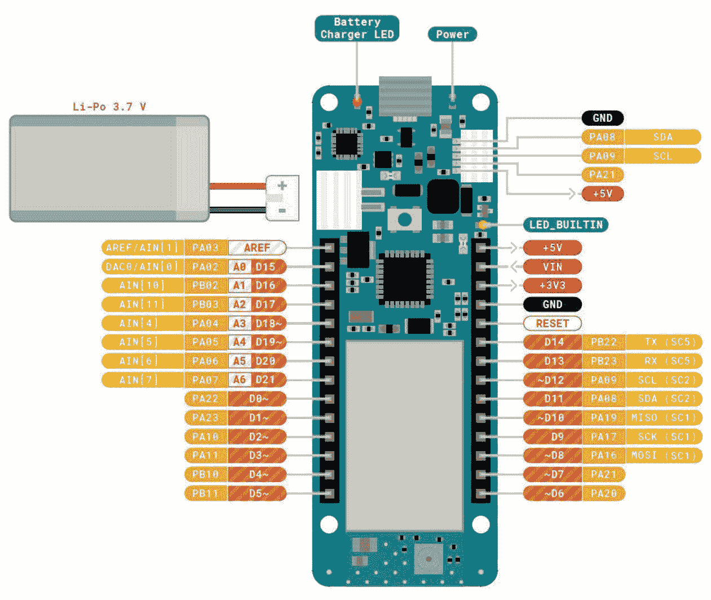

图 5.1 – Arduino MKR GSM 1400

Arduino MKR GSM 1400 提供 7 个模拟引脚和 14 个数字输入/输出引脚，内置电池充电和 LiPo 电池连接器用于备用电源，这有助于开发者构建远程监控/操作的原型和解决方案，无需担心电源备份。有关更多详情，请访问官方网站[`store-usa.arduino.cc/products/arduino-mkr-gsm-1400`](https://store-usa.arduino.cc/products/arduino-mkr-gsm-1400)。

Arduino 最新的开发板 MKR NB 1500 仅支持 NB-IoT、**LTE-M**和**增强型 GPRS**（**EGPRS**）用于短信。NB-IoT 和 LTE-M 是专门为物联网设备设计的，它们在不同地区的普及速度非常快。有关完整详情和规格，请访问[`store-usa.arduino.cc/products/arduino-mkr-nb-1500`](https://store-usa.arduino.cc/products/arduino-mkr-nb-1500)。有关 NB-IoT 和 LTE-M 部署的更新地区列表，请访问[`www.gsma.com/iot/deployment-map/`](https://www.gsma.com/iot/deployment-map/)。

在本章中，我们将根据 GPS 位置追踪资产。为了获取 GPS 坐标，我们将使用 **GY-GPS6MV2 GPS 模块**，该模块基于 **NEO-6M u-blox** 芯片。GPS 模块通过软件串行和硬件串行端口进行通信，但 MKR GSM 1400 提供了内置硬件串行端口，因此我们将使用 *引脚 13* 和 *引脚 14* 与 GPS 模块进行通信。

GPS 模块提供纬度、经度、卫星数量、海拔英尺和每英里速度数据。我们将将这些属性显示在仪表板上，以便进行适当的资产追踪。此模块是在中国开发的，并且以可承受的价格在市场上销售，但还有许多其他组织基于 NEO-6M u-blox 芯片开发 GPS 模块，例如 **SparkFun**、**Seeed Studio** 和 **Adafruit**。*图 5.2* 显示了 NEO-6M u-blox GPS 模块及其引脚图：

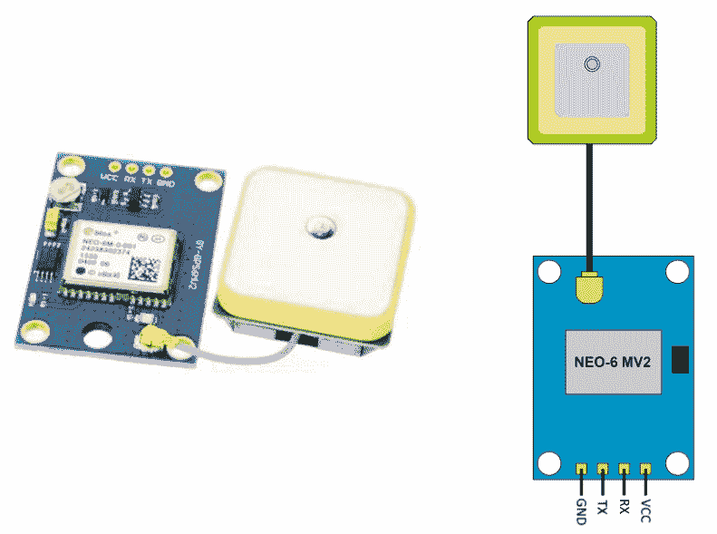

图 5.2 – NEO-6M u-blox GY-GPS6MV2 GPS 模块和引脚图

前面的图示说明了 GPS 模块的引脚布局。*引脚 #1* 是一个 **地**（**GND**）引脚，它与板上的 GND 相连接，而 *引脚 #2* 和 *引脚 #3* 分别是 **发送**（**TX**）和 **接收**（**RX**）引脚，分别连接到 MKR GSM 1400 的 *引脚 #13* 和 *引脚 #14*。*引脚 #4* – **电压公共收集器**（**VCC**）– 与板上的 VCC 和 5V 引脚一起工作。你可以将带有 GPS 模块的雄性接插件焊接，或者直接焊接电缆而不使用任何接插件。

重要提示

GPS 模块在户外环境中工作效果最佳。确保在测试和部署过程中没有屋顶，以便从卫星接收适当的信号。

如果你在一个实验室中使用该模块，那么 GPS 模块可能无法正常工作。记住，GPS 模块中有一个内置的灯，当你开始接收来自卫星的信号时，它会闪烁。

在本节中，我们讨论了带有 SIM 卡的 MKR GSM 1400 开发板和提供 GPS 坐标给开发板的 NEO-6M u-blox GPS 模块，我们还讨论了它们的引脚布局。接下来，我们将讨论如何将 GPS 模块与 MKR GSM 1400 开发板连接。

# 设计项目架构

在前面的章节中，我们详细讨论了模块和开发板。现在，是时候准备食谱了。在硬件开发中，在开始与传感器和开发板一起工作之前，我们需要开发设计概念，以便更好地理解事物如何连接。有许多软件可用于设计和发展电子项目的概念设计，但在此情况下，我们将使用 Fritzing。

在接下来的两个小节中，我们将讨论原理图和项目设计，同时解释如何将引脚与开发板连接和焊接。然后，我们将进行一些测试以获取 GPS 坐标，这在将数据发送到云之前非常重要。

## 原理图设计和组装

您的原理图设计目的是清楚地了解传感器如何与开发板连接。原理图有助于您在面包板或**Veroboard**上开发原型，如图*图 5**.3*所示。设计的主要好处之一是 Fritzing 会根据您的设计在后台构建硬件原理图和 PCB 设计，可以根据系统要求进行调整。*图 5**.3*显示了如何连接 MKR GSM 1400 与 NEO-6M u-blox GPS 模块的原理图：

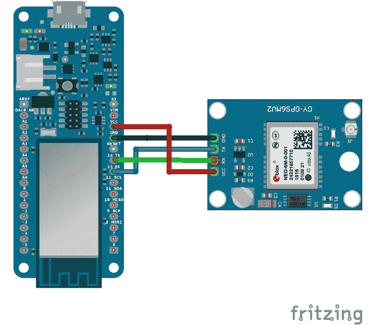

图 5.3 – MKR GSM 1400 和 GPS 模块原理图

*图 5**.3*是项目的原理图，但为了方便，我还创建了*表 5.1*，它展示了 MKR GSM 1400 到 GPS 模块的引脚编号和名称。

| **MKR GSM** **1400 板** | **GPS 模块** |
| --- | --- |
| 5V | VCC |
| GND | GND |
| 14 TX | RX |
| 13 RX | TX |

表 5.1 – MKR GSM 1400 和 GPS 模块引脚连接列表

之前的设计提供了如何将模块连接到开发板的全面概述。根据我们的设计，我们从开发板到 GPS 模块有 5V 和 GND。GPS 模块的 TX 连接到开发板的 RX（*引脚#13*），GPS 模块的 RX 引脚连接到开发板的 TX（*引脚#14*）。*表 5.1*显示了引脚信息。最后，我们使用面包板构建了我们的原型，如图*图 5**.4*所示：

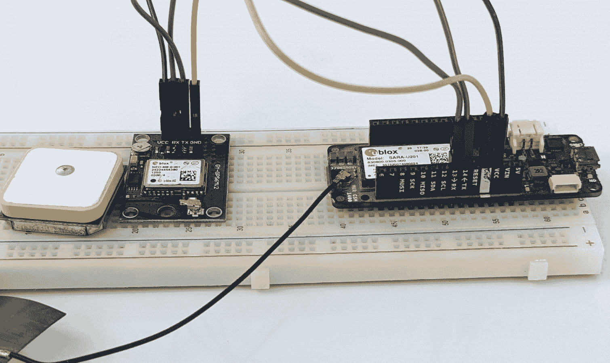

图 5.4 – 最终原型

在将公头焊接至 GPS 模块后，根据原理图连接引脚。只有一个传感器，因此没有 Veroboard 的要求。接下来，我们将使用串行监视器测试 GPS 模块，以验证我们的 GPS 模块是否正常工作并获取 GPS 值。

## 测试 GPS 模块数据

对于模块测试，我们需要在搜索栏中输入`tinygps`。

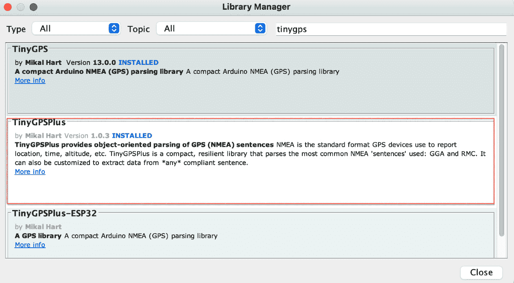

图 5.5 – TinyGPSPlus 库

在搜索后，**库管理器**显示了许多库。选择**TinyGPSPlus**库并安装其最新版本。该库附带了许多示例，但所有示例都基于软件串行。然而，**Arduino SAMD**板提供硬件串行，所以我修改了使用硬件串行与 GPS 模块通信的代码。

从本书官方 GitHub 仓库的章节文件夹中下载代码，打开`MKR-1400-NEO-6M-GPS-Module`代码，并将其上传到开发板：

```cpp
while(Serial1.available()>0)//While there are characters to come from the GPS
  {
    gps.encode(Serial1.read());//This feeds the serial NMEA data into the library one char at a time
  }
  if(gps.location.isUpdated())//This will pretty much be fired all the time anyway but will at least reduce it to only after a package of NMEA data comes in
  {
    //Get the latest info from the gps object which it derived from the data sent by the GPS unit
    Serial.println("Satellite Count:");
    Serial.println(gps.satellites.value());
    Serial.println("Latitude:");
    Serial.println(gps.location.lat(), 6);
    Serial.println("Longitude:");
    Serial.println(gps.location.lng(), 6);
    Serial.println("Speed MPH:");
    Serial.println(gps.speed.mph());
    Serial.println("Altitude Feet:");
    Serial.println(gps.altitude.feet());
    Serial.println("");
  }
```

在设置中，我们初始化了`Serial`和`Serial1`。`Serial`用于在串行监视器上显示内容，而`Serial1`是用于与 GPS 模块通信的硬件串行。前面的代码属于`loop()`方法。

首先，GPS 模块将使用`Serial1.read()`方法从卫星读取数据，并通过`gps.encode()`方法编码数据。`Serial1`一次只读取一个字符，因此更新值需要一点时间。接下来，我们将使用`gps.location.isUpdated()`方法验证位置是否有更新。如果有变化，数据将打印在串行监视器上。

重要提示

确保你的 GPS 模块放置在一个开阔的环境中，那里有清晰的视野，没有任何障碍物，如屋顶或类似的东西，以便正确接收来自卫星的信号。

GPS 模块有一个内置的 LED 灯，当它从 GPS 接收数据时开始闪烁。

同样的代码无需修改即可在 MKR NB 1500 上运行。

*图 5**.6*显示了包含纬度和经度以及其他参数的 GPS 值的串行监视器：

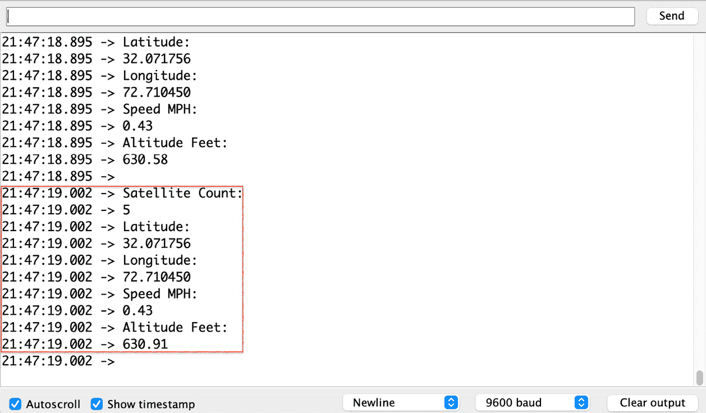

图 5.6 – 串行监视器上的 GPS 模块数据

前面的图示显示了 GPS 模块从 GPS 卫星接收到的数据，并在串行监视器上打印出来。这些数据包括卫星数量、代表位置坐标的纬度和经度、基于当前和之前 GPS 坐标的速度（以每小时英里数**MPH**表示），以及以英尺为单位的海拔高度。

在本节中，我们在 Arduino IDE 中测试了 NEO-6M u-blox GPS 模块。首先，我们为该模块安装了 TinyGPSPlus 库，然后我们使用了前面代码中的开发板代码，该代码在串行监视器上显示读数。在下一节中，我们将开始全球物联网 SIM 卡的激活。

# 激活物联网部署的 SIM 卡

在将 GPS 模块与 MKR GSM 1400 组装并测试后，现在是时候激活 Hologram 全球物联网 SIM 卡了，它将作为设备与 Arduino 物联网云之间的桥梁。你可以从[`store.hologram.io/store/`](https://store.hologram.io/store/)购买物联网 SIM 卡。它为不同行业提供不同类型的 SIM 卡，例如**Hyper EUICC 物联网 SIM 卡**，这是一种适用于学习项目的工业级简单 SIM 卡，并且根据开发板上的 SIM 卡槽位提供不同尺寸。你可以免费订购其**试点 SIM 卡**，但需要支付其运费。

在收到 SIM 卡后，请在 [hologram.io](http://hologram.io) 上创建一个账户，在那里您将能够激活和管理您所有的 SIM 卡。Hologram 仪表板提供了有关设备、套餐、计费和路由的数据使用详情。通过设置路由，您可以将设备数据直接发送到 Hologram 云之外的其他物联网云。然而，在我们的案例中，我们只需将 Hologram SIM 卡作为载体，将设备数据直接传输到 Arduino IoT 云，因此不需要设置路由。只需激活 SIM 卡并将其插入 MKR GSM 1400 开发板即可。

在本节中，我们讨论了如何进行 Hologram 全球物联网 SIM 卡的激活，以及 [hologram.io](http://hologram.io) 上为研究人员和工业界提供的不同类型的 SIM 卡。在下一节中，我们将设置 Arduino IoT 云中的物品，这包括云变量创建、设备关联、网络配置和代码。

# 配置物品、网络凭证、云变量和代码

在设置好硬件之后，现在是时候在 Arduino IoT 云中设置物品了。对于这个项目，我们需要四个云变量来从设备获取不同的属性。由于我们使用的是 GSM 系列板而不是 Wi-Fi，网络设置将会有所不同。*图 5.7* 展示了物品的完整概览：

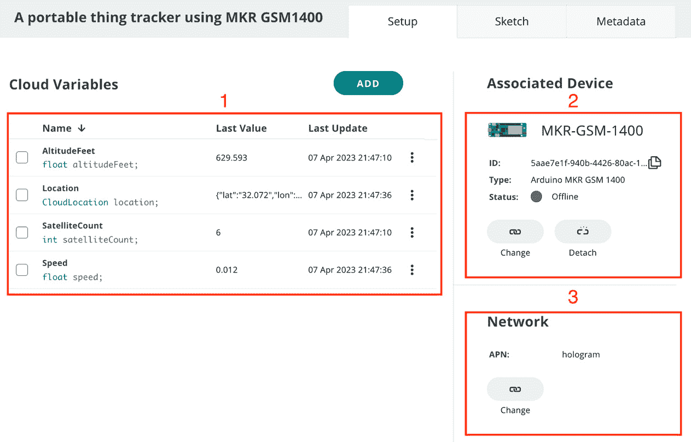

图 5.7 – 使用 MKR GSM 1400 Thing 设置的便携式物品追踪器

使用名称 `A portable thing tracker using MKR GSM1400` 设置一个新的物品。然后，按照以下步骤创建云变量、关联设备、网络配置，最后是代码：

1.  首先，我们需要为位置、海拔英尺、卫星数量和速度设置四个云变量。有关这些云变量的完整详情将在以下部分提供。

1.  然后，我们需要将设备与物品关联起来。在当前项目中，我们将使用 MKR GSM 1400，因此向导将与用于 Arduino 板的向导相同。完整详情可在 *关联设备* 部分。

1.  最后，我们需要为设备设置网络配置，但这次，我们需要为 GSM 板提供不同的设置，这将在 *网络* 子节中介绍。

在这里，我们讨论了在物品创建过程中将涉及哪些步骤。在接下来的子节中，我们将逐步创建云变量、将设备关联到物品，并在单独的子节中设置网络配置。

## 云变量

以下表格解释了我们在创建云变量期间需要使用到的所有属性。对于 `位置`，我们需要两个不同的变量来存储纬度和经度，但多亏了 Arduino IoT Cloud 扩展变量组，我们有一个 `位置` 类型的变量。接下来，确保每个变量与表中的声明相匹配；否则，你需要根据你的命名修改示例代码。

在 *表 5.2* 中，在创建云变量期间，我将权限设置为 *只读*。虽然我们有读写选项，但在本项目，我们只想从设备接收数据而不是在仪表板上修改它。这就是为什么使用只读模式的原因——以防止数据一致性出现问题的**更新策略**设置为**变更时**，因为设备会在 GPS 模块从卫星接收到新数据时发送数据。

| **#** | **变量名** | **变量类型** | **声明** | **权限** | **更新策略** |
| --- | --- | --- | --- | --- | --- |
| 1 | `AltitudeFeet` | `Float` | `altitudeFeet` | 只读 | **变更时** |
| 2 | `位置` | `CloudLocation` | `location` | 只读 | **变更时** |
| 3 | `SatelliteCount` | `Int` | `satelliteCount` | 只读 | **变更时** |
| 4 | `Speed` | `Float` | `speed` | 只读 | **变更时** |

表 5.2 – Thing 的云变量列表

在本节中，我们讨论了本项目所需的云变量类型。在这里，我们列出了四种不同类型的云变量，但处于只读模式，因为我们只想从设备中获取值。在下一个小节中，我们将关联 MKR GSM 1400 与 Thing。

## 关联设备

在创建变量之后，是时候添加设备并将其与 Thing 关联了。在添加设备之前，将开发板连接到计算机并打开 **Arduino Create Agent** 应用程序。*图 5.8* 显示了一个弹出窗口，其中我们有两个选项：选择现有设备进行关联或设置列表中不可用的新设备：

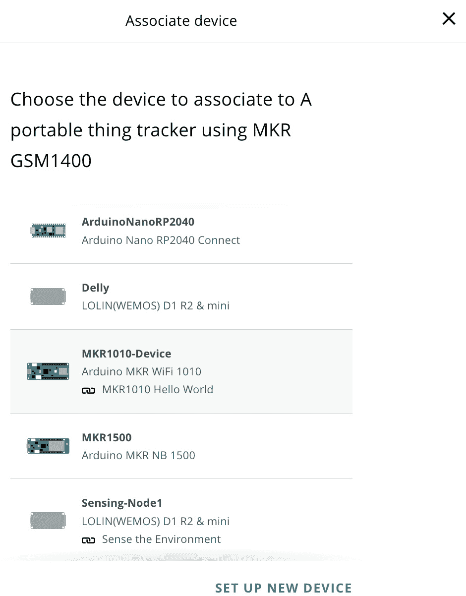

图 5.8 – 关联设备

在我们的案例中，我们已经在门户中有了不同的设备，但我们要添加一个新的 MKR GSM 1400 设备，所以只需点击 **设置新设备** 来在账户中配置新设备。

然后，你将在弹出窗口中看到两个选项（*图 5.9*）。第一个选项是设置 Arduino 板，第二个选项是设置第三方设备。在这里，你将在两个选项下方看到一个备注，**兼容设备** ()，这意味着你只能使用某些类型的 Arduino 设备以及 Arduino IoT Cloud 中的第三方设备。

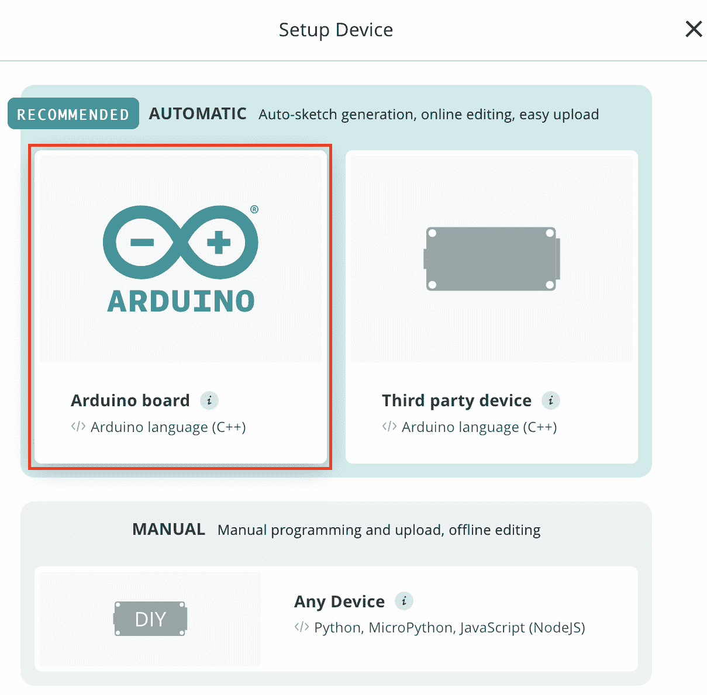

图 5.9 – 选择开发设备

根据可用的设备，我们可以从弹出菜单中选择任何一个选项。然而，在这种情况下，请点击设置 Arduino 设备的选项，因为在本章中，我们将使用 MKR GSM 1400 板。在添加设备之前，请确保 Arduino Create Agent 在您的机器上运行。

在本小节中，我们将 MKR GSM 1400 开发板与“物”关联起来。接下来，我们将在“物”选项卡中配置网络设置。

## 网络

在将设备与“物”关联后，是时候配置设备通信的网络设置了。这些网络设置与 Wi-Fi 网络设置不同。MKR GSM 1400 和 MKR NB 1500 开发板都使用 SIM 技术进行通信。因此，它们的网络配置不同，并且将根据 IoT SIM 卡服务提供商而变化。以下图（*图 5**.10*）显示了 MKR GSM 1400 的“配置网络”弹出窗口，由于蜂窝通信，它与 Wi-Fi 配置完全不同：

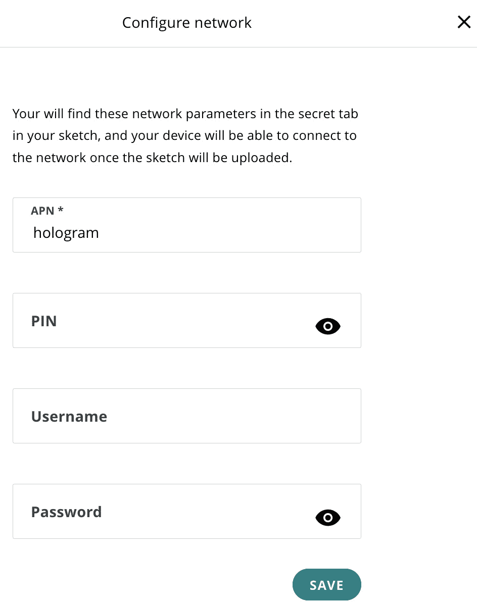

图 5.10 – MKR GSM 1400 的网络配置

目前，我们正在使用 Hologram 全球 IoT SIM 卡，并且只需在`prepay.pelion`、`0000`和`arduino`下提及`hologram`。在使用任何其他全球 IoT SIM 卡之前，首先获取其 APN 信息以正确设置网络。

在这里，我们讨论了 Arduino MKR GSM 1400 的网络配置，包括 APN、PIN、用户名和密码。在下一节中，我们将介绍开发板的代码。

## 编码

本章的代码可在本书的官方 GitHub 仓库中找到。下载`A_portable_thing_tracker_using_MKR_GSM1400_apr07a.zip`并将其导入到 Arduino Web Editor 中。

您可以通过导航到`setup()`方法下载代码并将其放入您的“物”中；请记住，永远不要尝试使用`delay`方法，因为它将阻塞`ArduinoCloud.update()`方法：

```cpp
TinyGPSPlus gps;
unsigned long previousMillis = 0;
const long interval = 30000; //milliseconds
```

在前面的代码片段中，我们声明了`gps`实例和两个变量，这些变量将在读取下一个值之前等待 30,000 毫秒（30 秒）而不阻塞代码。

接下来，我们将转向`loop`方法。在这里，我们每 30 分钟调用一次`FetchGPS()`方法，这是通过比较`currentMillis`和`previousMillis`而不使用`delay`来完成的：

```cpp
  unsigned long currentMillis = millis();
  if (currentMillis - previousMillis >= interval) {
    //speed=currentMillis;
    FetchGPS();
    previousMillis = currentMillis;
  }
```

在以下代码片段中，我只是从`FetchGPS()`方法中选取了一小部分代码。在这里，我将 GPS 模块的最新值分配给 Arduino 云变量，这些变量将用于向云端发送数据以及在串行监视器上打印数据：

```cpp
if (gps.location.isUpdated())
  {
    altitudeFeet = gps.altitude.feet();
    satelliteCount = gps.satellites.value();
    speed = gps.speed.mph();
    location = Location(gps.location.lat(), gps.location.lng());
    Location cordinates = location.getValue();
 .
 .
 .
}
```

将代码上传到设备，并打开 Arduino Web Editor 的串行监视器以验证值。在成功将数据上传到云端后，是时候为最终用户设置一个漂亮的网页和移动仪表盘了。

重要提示

如果你变量声明中使用了不同的名称，那么根据你的命名方案更新代码。然而，最好首先按照书中的所有步骤进行，然后再更改云变量名称，分别修改你的代码。

永远不要尝试使用 `delay` 方法，这将为 `ArduinoCloud.update()` 方法创建一个阻塞。

Arduino IoT Cloud 仅在变量值更改时在仪表板上更新一个值。例如，如果设备的 GPS 位置在一段时间后保持不变，那么这意味着设备没有移动。然后，Arduino IoT Cloud 不会记录该值，所以如果地图上的值没有变化，请不要感到困惑。这个功能的另一个好处是，当你导出内容时，你不会得到重复的数据。

相同的代码在 MKR NB 1500 上无需修改即可工作。然而，在这里，你需要将 MKR NB 1500 设备与 The Thing 相关联，而不是 MKR GSM 1400。

# 创建全面的网页和移动仪表板

将代码上传到设备后，是时候为网页和移动设备设置仪表板，使用不同的小部件可视化数据了。以下图示展示了使用不同小部件的读取数据可视化：

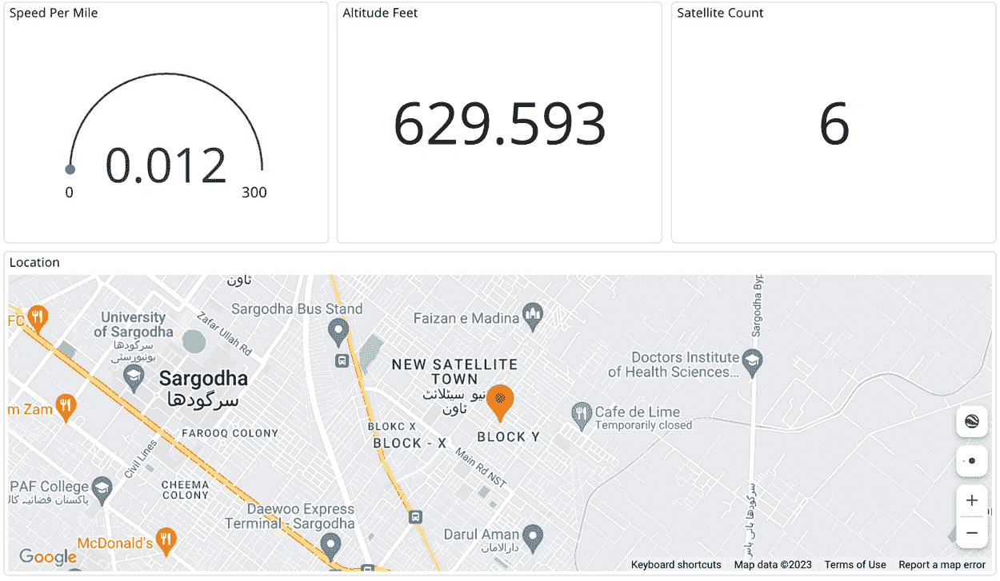

图 5.11 – The Thing 仪表板

我们有来自 GPS 模块的四个读取值用于可视化；在这里，我使用了三个小部件，`location` 变量。目前，地图小部件只能根据坐标显示资产设备的位置；如果你有多个资产需要跟踪，那么你需要根据跟踪设备的数量设置多个地图小部件。

好吧，这是我们章节的最后一部分。在这里，我们创建了一个令人惊叹的 GPS 跟踪仪表板，它使用仪表板上的地图小部件显示位置，每英里的速度，以及其他一些参数。

# 接下来是什么？

我们还有很多选项可供探索，但现在是你使用不同的传感器和开发板进行更多实验并从中学习的时候了。在当前章节中，我们只使用了一个 GPS 模块，它只提供了四个参数，但在市场上，有很多 GPS 模块提供广泛的性能；它们在屋顶下以及晴朗的天空下都能工作，并且具有多个精度功能。

在监控资产位置的同时，不同行业中还有一些其他重要参数需要监控，例如温度和湿度，这在食品和医疗产品中非常重要。在燃料运输期间，监控 CO2 和 LPG 气体非常重要。尝试使用带有 GPS 模块的不同传感器，为不同行业设置不同的跟踪原型。

# 摘要

在本章中，我们探讨了如何使用全球物联网 SIM 卡和 GPS 模块开发一个基于 GPS 的跟踪系统。我们设置了“物”，包括创建云变量、设备关联、GSM 网络配置以及编写开发板代码。随后，我们创建了一个仪表盘，使用不同类型的控件来可视化“物”的读数，其中本章最重要的控件是地图控件。这是一个非常有趣且重要的控件，用于显示物联网设备的 GPS 坐标位置。

GPS 跟踪是本章中我们讨论的一个重要方面，它帮助我们开发用于资产跟踪的设备，这将有助于我们在资产跟踪和监控方面。本章演示了如何在仪表盘上显示设备的地理位置，这为您构建更多关于资产跟踪的解决方案提供了信心。在下一章中，我们将探讨另一种长距离通信技术，称为**LoRaWAN**。我们将使用这项技术来构建远程监控偏远地区的解决方案，并将该技术与 GSM/4G/LTE 和 NB-IoT 技术进行比较，以提供适当的指导。
