# 启用不同设备之间的通信

本章致力于**物与物通信（TTC**），这是物联网（IoT）领域的一个重要概念和需求。您也可以称之为**设备到设备（D2D**）通信。在复杂系统中，一个设备的操作完全依赖于另一个设备时，D2D 通信发挥着至关重要的作用。例如，假设您想根据室外天气条件控制房间的空调；在这里，D2D 通信通过将室外温度发送到房间的空调控制器设备，使其知道是否需要根据外面的天气来冷却或加热房间，发挥着至关重要的作用。

Arduino IoT Cloud 为多个设备以及仪表盘提供了云变量同步功能，这有助于我们轻松构建复杂系统。本章解释了同步功能的使用，用于实现云**图形用户界面（GUI**）和点对点（D2D）通信。

在本章中，您将学习如何使用图形用户界面（GUI）同步跨多个设备上的云变量，而无需编写任何复杂的代码。本章将帮助您通过几个点击设置设备之间的通信，而无需编写任何冗长的代码。它还将帮助您开发完全依赖于其他设备传感器数据的解决方案。您还将学习如何为多个设备创建单个仪表盘，以便您可以在一个地方显示它们的读数，这有助于用户从单个显示屏监控一切，而无需导航到其他仪表盘。

在本章中，我们将涵盖以下主要主题：

+   物联网云中的 D2D 通信是什么？

+   Arduino IoT Cloud 物与物通信的好处

+   硬件组件 - 传感器和开发板

+   项目架构

+   设置设备

+   使用同步云变量实现 GUI

+   云变量/属性同步的限制

+   接下来是什么？

# 技术要求

完成本章练习所需的以下内容：

+   完成本书的**第四章**（B19752_04.xhtml#_idTextAnchor085）

+   MKR Wi-Fi 1010

+   1 个 5 毫米红色 LED 和 1 个 5 毫米绿色 LED

+   面包板

+   跳线

我们将使用**Arduino Web Editor**进行编码，它包括大量开发板和传感器库，以及**Arduino IoT Cloud**进行设备和仪表盘设置。本章代码可在官方书籍 GitHub 仓库中找到，请通过以下链接访问：[`github.com/PacktPublishing/Arduino-IoT-Cloud-for-Developers`](https://github.com/PacktPublishing/Arduino-IoT-Cloud-for-Developers)。

# 物联网云中的 D2D 通信是什么？

物联网和物联网云环境中的 D2D 通信是指物联网设备能够直接相互交换数据或信息，而不依赖于中央服务器或基于云的服务作为中介。这种通信形式也被称为物联网设备之间的**点对点**（**P2P**）通信。

下面是关于物联网云中 D2D 通信的一些关键点：

+   **直接通信**: 在传统的物联网架构中，设备将数据发送到云平台，在那里进行处理，并可能与其他设备共享。D2D 通信允许设备直接相互通信，在必要时绕过云平台。

+   **低延迟**: D2D 通信可以降低延迟，因为数据不需要往返于远程服务器。这在需要实时或近实时响应的应用中至关重要，如工业自动化或联网汽车。

+   **效率**: 通过使设备能够直接通信，可以减少云服务器的负载和带宽使用，使物联网系统更加高效和成本效益。

+   **离线操作**: D2D 通信即使在设备未连接到互联网或云的情况下也能工作。这在间歇性连接常见的场景中特别有用，例如在偏远地区或紧急情况下。

+   **安全性**: 实现设备之间的直接通信需要强大的安全措施来保护数据并确保消息的真实性。加密和身份验证机制对于防止未授权访问是必不可少的。

+   **用例**: D2D 通信可用于各种物联网应用。例如，在智能家居中，恒温器和灯光等物联网设备可以直接通信以协调动作，而无需将数据发送到中央服务器。在农业中，农业设备上的传感器可以直接通信以优化任务。

+   **协议**: 在物联网中，各种通信协议可以促进 D2D 通信，包括**消息队列遥测传输**（**MQTT**）、**约束应用协议**（**CoAP**）、蓝牙和**Zigbee**。协议的选择取决于范围、数据量和功耗等因素。

+   **挑战**: 虽然 D2D 通信提供了许多好处，但也带来了挑战，例如确保来自不同制造商的设备之间的互操作性以及管理去中心化通信的复杂性。

总结来说，物联网云环境中的 D2D 通信允许物联网设备直接相互通信，这提供了降低延迟、提高效率和离线操作等好处。然而，它也需要仔细规划和安全措施，以确保通信网络的可靠性和完整性。

在本节中，我们探讨了 D2D 通信的好处和挑战，这在物联网基础设施和解决方案开发中非常重要。在下一节中，我们将探讨 Arduino IoT Cloud 为 TTC 提供的哪种类型选项。

# Arduino IoT Cloud 设备间通信的好处

Arduino IoT Cloud 是一个专为简化使用 Arduino 板和其他兼容硬件的物联网项目开发和管理的平台。在 Arduino IoT Cloud 的上下文中，TTC 有几个好处：

+   **易于集成**：Arduino IoT Cloud 提供了一个用户友好的界面，用于连接和配置物联网设备，这使得建立设备之间的通信更加容易。用户可以快速设置和管理他们 Arduino 板与其他物联网设备之间的连接。

+   **遥控**：您可以使用 TTC 从一台 Arduino 设备控制另一台。例如，您可以使用一台 Arduino 设备控制另一个房间的灯泡。

+   **可扩展性**：Arduino IoT Cloud 允许您轻松扩展您的物联网项目。您可以向您的网络添加新设备并配置它们的通信参数，而无需进行大量编程，这使得它适用于从小型到大型物联网部署。

+   **降低延迟**：在同一网络内物联网设备之间的直接通信可以显著降低与发送数据到外部云服务器并返回相比的延迟。这对于需要低延迟的实时应用至关重要。

+   **节能**：Arduino IoT Cloud 允许您通过控制设备之间何时以及如何通信来优化设备的功耗。这可以延长电池供电的物联网设备的电池寿命。

+   **可定制逻辑**：您可以为 TTC 编程定制逻辑以满足您特定的项目需求。这种灵活性使您能够在物联网系统中实现复杂的行为和自动化。

+   **安全性**：Arduino IoT Cloud 提供安全功能以帮助保护您的设备之间的通信，包括加密和认证机制。这确保了设备之间交换的数据保持安全。

+   **成本效益**：通过减少对外部云服务的依赖并最小化数据传输成本，Arduino IoT Cloud 可以成为物联网项目的经济高效解决方案，尤其是在处理大量设备时。

+   **兼容性**：Arduino IoT Cloud 支持广泛的 Arduino 板和兼容硬件，使其对广泛的用户群体可访问。这种兼容性简化了在基于 Arduino 的物联网项目中实现 TTC 的过程。

总结来说，Arduino IoT Cloud 简化了物联网项目中的 TTC，提供了易于集成、可扩展性、降低延迟、节能、离线操作、定制、安全性、成本效益和广泛的硬件兼容性等功能。这些特性使其成为开发和管理依赖设备间直接通信的物联网系统的宝贵平台。

在本节中，我们讨论了 Arduino IoT Cloud TTC 的好处。在下一节中，我们将探讨完成本章练习所需的硬件组件。

# 硬件组件 – 传感器和开发板

在本章中，我们将探讨如何在多个 Arduino IoT Cloud 项目之间同步云变量。因此，这里我们将使用与 *第四章* 中相同的设备，包括开发板和传感器。为了本章的演示，我们将使用 Arduino MKR Wi-Fi 1010 以及两个 5 毫米 LED 灯，一个红色和一个绿色。完整的项目总结在 *图 7**.1* 中。

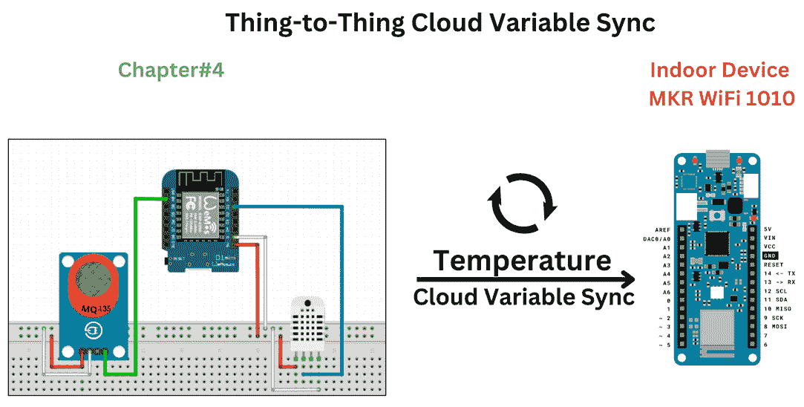

图 7.1 – 项目架构

如 *图 7**.1* 所示，我们使用了一个基于 ESP8266 的 WeMos D1 mini 开发板，整个项目在 *第四章* 中进行了演示。本章使用不同类型的板子的目的是为了展示在不同类型的开发板之间同步云变量是多么容易。在下一节中，我们将详细讨论项目架构。

# 项目架构

在本节中，我们将讨论云变量同步的工作原理。如 *图 7**.1* 所示，我们是从 *第四章* 中的项目开始的。在那个项目中，我们设置了一个监控户外温度、湿度和空气质量的设备。现在，我们希望将户外温度与我们的室内设备（MKR Wi-Fi 1010）共享。为了使事情更简单，我们只使用了 MKR Wi-Fi 1010 和 LED，如 *图 7**.2* 所示。我们的室内设备将在温度超过指定阈值时打开红色 LED，如果温度低于指定阈值则打开绿色 LED。您也可以使用继电器代替 LED 来控制您房间的加热和冷却系统。

我们已经在 Arduino IoT Cloud 中有一个正在运行的项目，但现在我们需要为 MKR Wi-Fi 1010 创建另一个项目，命名为 **室内 MKR Wi-Fi 1010**，并附带一系列云变量。然后我们将室内 MKR Wi-Fi 1010 项目的温度云变量与在 *第四章* 中创建的“感知环境”项目同步。

在前面的章节中，我们详细讨论了模块和开发板。现在，是时候开始练习了。在硬件开发中，在我们开始使用传感器和开发板之前，我们需要开发设计概念，以便更好地理解事物如何连接。有许多软件可用于设计电子项目的概念和开发，但在此情况下，我们将使用**Fritzing**。

在以下子节中，我们将讨论项目的原理图，同时解释如何将引脚与开发板连接。

## 原理图设计和组装

原理图设计的目的是清楚地了解传感器/LED 如何与开发板连接。这有助于工程师在面包板或**Veroboard**上开发原型。*图 7*.2 显示了 LED 如何连接到 MKR Wi-Fi 1010 开发板的原理图。

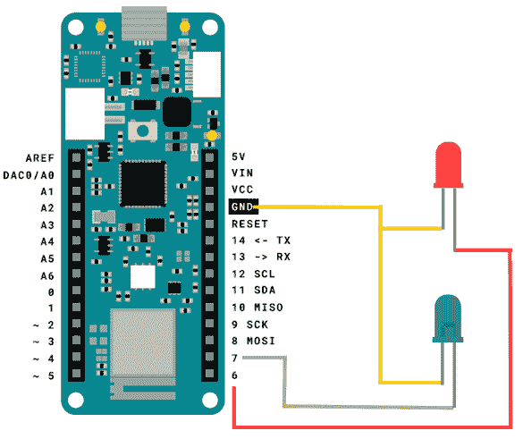

图 7.2 – MKR Wi-Fi 1010 和 LEDs 原理图

在*图 7*.2 中，我们有一个来自 MKR Wi-Fi 1010 的共同地线，它通过黄色线与两个 LED 共享。红色 LED 通过*引脚#6*连接到 MKR Wi-Fi 1010，绿色 LED 使用 MKR Wi-Fi 1010 开发板的*引脚#7*。

在本节中，我们讨论了云同步的工作原理以及如何将 LED 与 MKR Wi-Fi 1010 连接。在下一节中，我们将设置 MKR Wi-Fi 1010 的事物以及设备关联和网络配置；最重要的是，我们将创建云变量并将它们与其他事物同步。

# 设置事物

在设置硬件之后，是时候在 Arduino IoT Cloud 中设置事物了。对于这个项目，我们需要三个云变量。稍后，我们将把 MKR Wi-Fi 1010 与我们的事物关联起来。接下来，我们将执行 Wi-Fi 网络配置。*图 7*.3 显示了事物的完整概述：

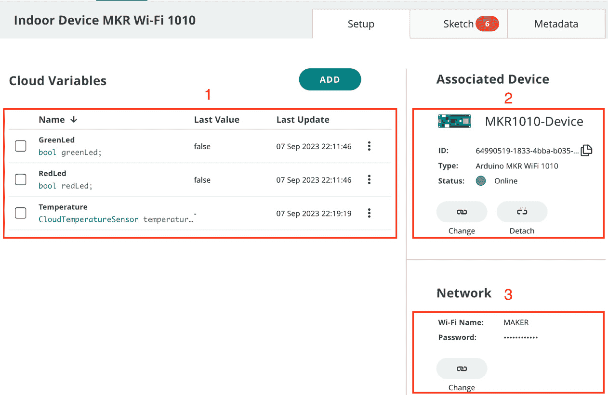

图 7.3 – 室内设备 MKR Wi-Fi 1010 事物设置

设置一个名为“室内设备 MKR Wi-Fi 1010”的新事物。在*图 7*.3 中，以下步骤用红色方框标记。按照这些步骤创建变量、关联设备、配置网络，最后编写代码：

1.  首先，我们需要为绿色 LED、红色 LED 和温度（将与另一个云变量同步）设置三个云变量。关于云变量的更详细讨论将在下一节中介绍。

1.  之后，我们需要将设备与事物关联。在当前项目中，我们使用 MKR Wi-Fi 1010。更多细节请参阅本章的*关联设备*子节。

1.  在连接设备后，我们需要通过提供 Wi-Fi 网络的 SSID 和密码来使设备网络就绪。只需点击**配置**按钮（如果网络为空，则您将看到**配置**按钮。否则，您将看到**更改**按钮）并您将看到网络设置的弹出窗口。

我们已经讨论了设置事物的过程，所有这些步骤将在后续小节中详细解释。我们将从**云变量**小节开始，在那里我们将为我们的事物创建云变量以及同步它们。

## 云变量

下表描述了我们需要配置的所有云变量的属性。对于这个项目，我们需要三个云变量，如*表 7.1*中所示。接下来，请确保每个变量与表中的**声明**相匹配；否则，您需要根据您的命名修改示例代码。

当我们创建云变量时，除了`Temperature`之外，我们为所有变量设置了只读权限，因为我们需要这个云变量与*第四章*中“感知环境”事物的`Temperature`云变量同步。这就是为什么这个变量的权限被设置为**读/写**。**更新策略**对所有变量都设置为**变更时**。

| **S#** | **变量名** | **变量类型** | **声明** | **权限** | **更新策略** |
| --- | --- | --- | --- | --- | --- |
| 1 | `GreenLed` | 布尔值 | `greenLed` | 只读 | 变更时 |
| 2 | `RedLed` | 布尔值 | `redLed` | 只读 | 变更时 |
| 3 | `Temperature` | 温度传感器 | `Temperature` | 读/写 | 变更时 |

表 7.1 – 事物云变量列表

使用**表 7.1**创建`GreenLed`和`RedLed`云变量。`Temperature`云变量的创建将分步骤讨论；我们将同步此云变量与*第四章*中的事物云变量。*图 7**.4*显示了创建`Temperature`云变量的第一步。

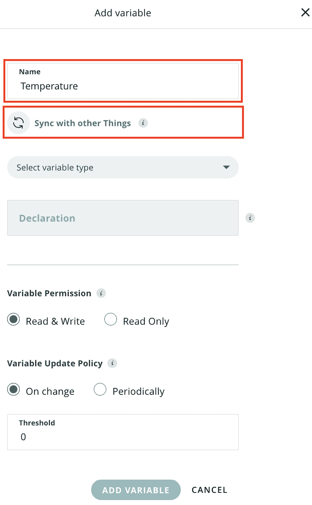

图 7.4 – 温度云变量步骤 1

在这一步，我们将为云变量分配一个名称，如*图 7**.4*所示。接下来，我们将点击**与其他事物同步**。这将打开一个新的弹出窗口，如*图 7**.5*所示。

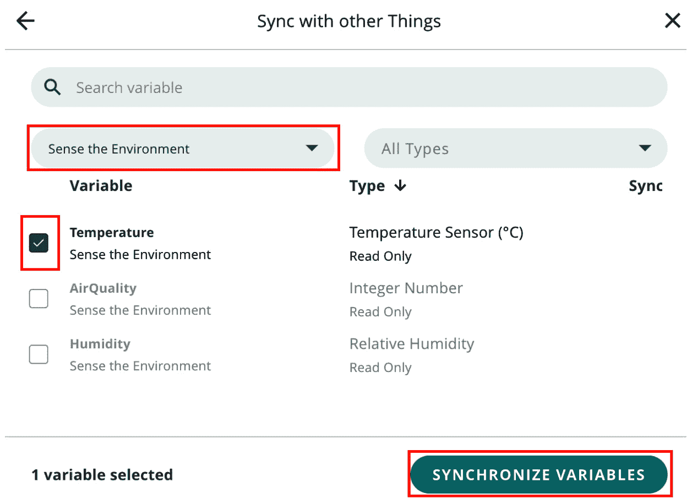

图 7.5 – 温度云变量步骤 2

在此弹出窗口中，您将找到所有在您的 Arduino IoT Cloud 中可用的云变量的完整列表。为了防止复杂性和错误，请选择一个特定的事物。我们从下拉菜单中选择了**感知环境**事物，这在*图 7.5*中被标记为红色框。在选择下拉菜单中的事物后，您将在弹出窗口中仅看到该事物的关联云变量。点击**温度**云变量复选框，然后点击**同步变量**按钮。*图 7.6*显示了最终的弹出窗口，其中您将找到云变量同步状态的最终状态。

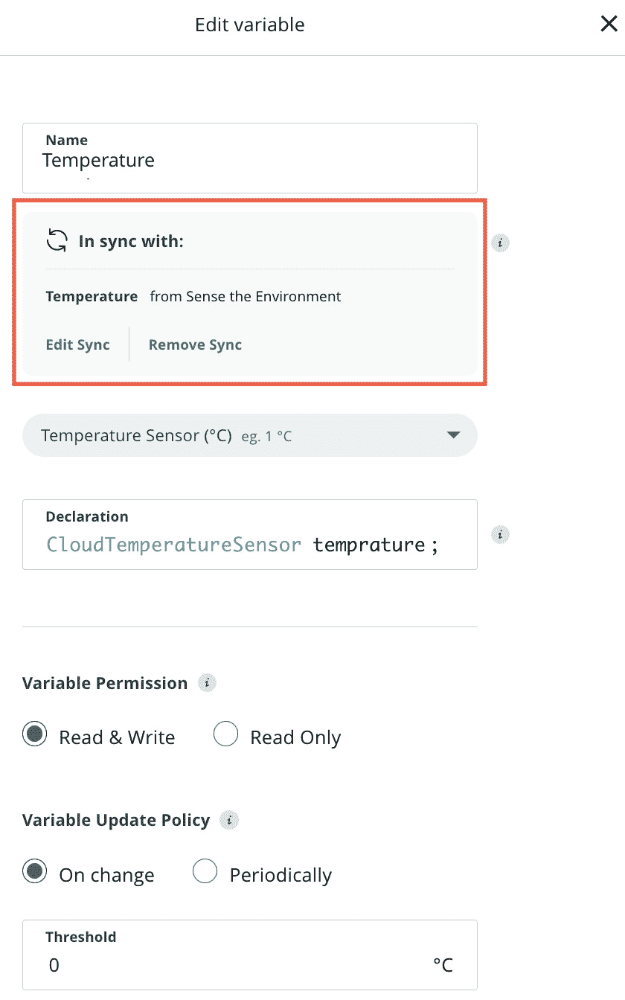

图 7.6 – 温度云变量步骤 3

在*图 7.6*中，您将看到云变量同步状态的状态，它被标记为红色框。请记住，对于同步变量，您必须选择**读/写**权限，否则它将无法正常工作。然后保存云变量，我们就可以出发了。完成这些步骤后，您应该对如何通过使用简单的界面在几秒钟内同步多个事物中的云变量有一个大致的了解。

重要提示

请记住，对于同步变量，您必须选择**读/写**权限，否则它将无法正常工作。

在本节中，我们讨论了本项目所需的云变量类型。我们列出了三种不同类型的云变量，并详细讨论了如何从一个事物同步云变量到另一个事物。接下来，我们将把 MKR Wi-Fi 1010 与事物关联起来。

## 关联设备

在创建变量后，是时候添加设备并将其与事物关联了：

1.  在添加设备之前，将开发板连接到计算机并打开**Arduino Create Agent**应用程序。*图 7.7*显示了弹出窗口，其中我们有两个选项：要么选择现有设备进行关联，要么如果列表中没有可用，则设置新设备：

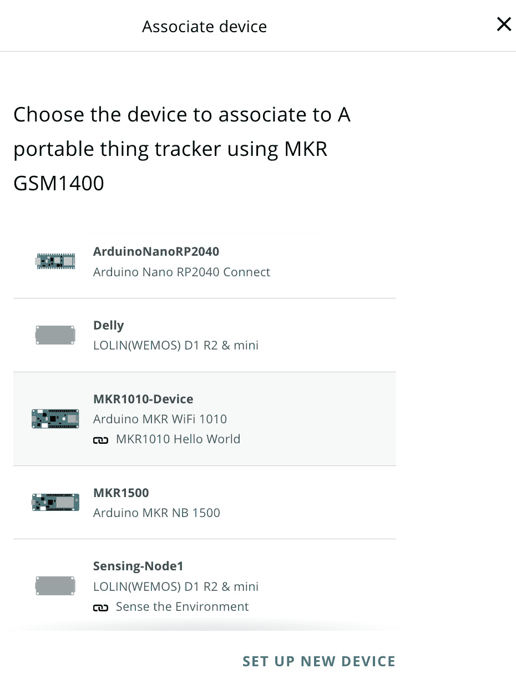

图 7.7 – 关联设备 – 选择设备

在我们的案例中，我们已经在门户中有了不同的设备，但我们要添加一个新的 MKR Wi-Fi 1010。只需点击**设置新设备**来配置账户中的新设备。

1.  接下来，您将在弹出窗口中看到三个选项。第一个选项是**Arduino 板**，第二个选项是**第三方设备**。第三个选项是**任何设备**，这是用于非兼容设备的。这意味着您可以使用任何类型的 Arduino 设备，以及支持 Python、MicroPython 和 JavaScript 的 Arduino IoT Cloud 第三方设备。

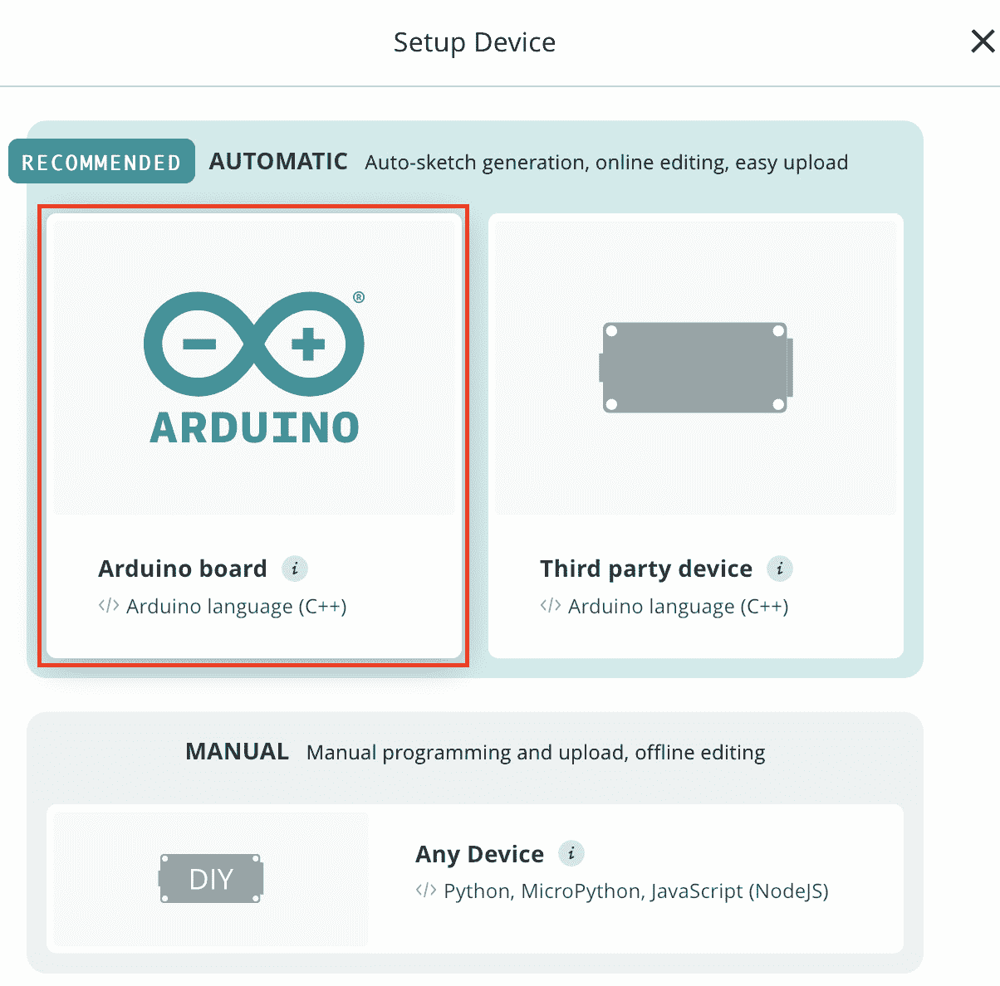

图 7.8 – 选择开发设备

1.  从弹出窗口中选择适合您项目的正确选项。在本例中，点击**Arduino 板**，因为在本章中，我们使用的是 MKR Wi-Fi 1010 板。在添加设备之前，请确保**Arduino Create Agent**在您的机器上运行。*图 7.9*显示 Arduino IoT Cloud 已检测到 MKR Wi-Fi 1010 设备。

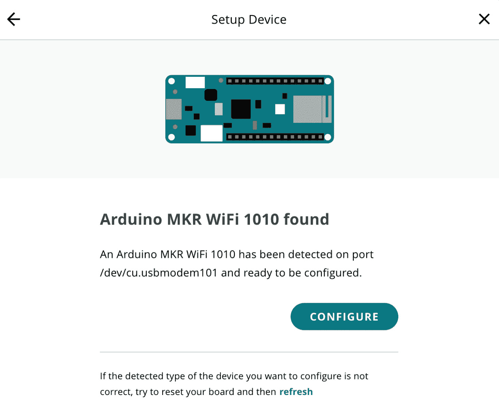

图 7.9 – 设备找到

当弹出窗口显示已找到设备时，只需点击**配置**按钮，这将带您进入下一个配置步骤，在那里您将提供设备的名称，稍后，另一个弹出窗口将在您的开发板上执行一些配置并将开发板与 Arduino IoT Cloud 关联。一旦完成，将显示成功的设备关联消息。

1.  当设备配置成功时，您将看到一个弹出窗口表示祝贺。只需点击**完成**按钮，您的设备将与您的“物”关联。

在本节中，我们将 MKR Wi-Fi 1010 设备与我们的“物”关联，在接下来的章节中，我们将讨论网络和代码。

## 网络

将设备连接到“物”之后，我们可以看到设备处于离线状态。为了将其上线，我们需要提供 Wi-Fi 详细信息。以下截图显示了网络配置弹出窗口，它只包含两个字段：

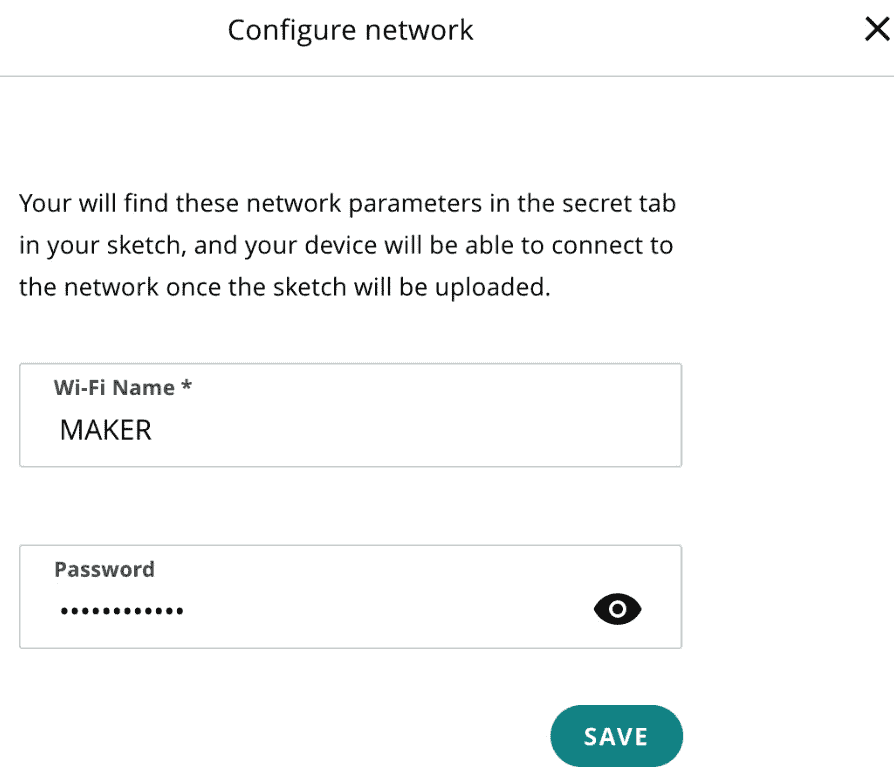

图 7.10 – 网络配置

在*图 7.10*所示的“物”页面上，在**网络**选项卡中，点击**配置**按钮，这将带您进入包含两个字段**Wi-Fi 名称**和**密码**的**配置网络**弹出窗口。输入 Wi-Fi SSID 和密码，然后点击**保存**按钮。

在本节中，我们已经为我们的设备配置了网络，该设备是 MKR Wi-Fi 1010。在下一小节中，我们将创建云变量。

## 编码

本章的代码可在本书的官方 GitHub 仓库中找到。下载`Indoor_Device_MKR_Wi-Fi_1010_sep07a.zip`并将其导入到您的 Arduino Web Editor 中。

您可以通过导航到以下片段中的`RLED`和`GLED`并将它们分别分配为引脚编号`6`和`7`来下载代码并将其放入您的设备中：

```cpp
#define RLED 6
#define GLED 7
```

然后，我们在`setup()`方法中初始化所有必需的引脚和方法。具体来说，我们使用`pinMode()`方法将引脚模式更改为输出：

```cpp
void setup() {
  pinMode(RLED, OUTPUT);
  pinMode(GLED, OUTPUT);
  // Initialize serial and wait for port to open:
  Serial.begin(9600);
  // This delay gives the chance to wait for a Serial Monitor without blocking if none is found
  delay(1500);
  // Defined in thingProperties.h
  initProperties();
  // Connect to Arduino IoT Cloud
  ArduinoCloud.begin(ArduinoIoTPreferredConnection);
  setDebugMessageLevel(2);
  ArduinoCloud.printDebugInfo();
}
```

下一个重要方法是`onTemperatureChange()`。每当 Sense the Environment 设备上的`Temperature`云变量值发生变化时，它将自动与室内设备 MKR Wi-Fi 1010 设备的`Temperature`云变量同步。然后，当值发生变化时，此方法将被调用：

```cpp
void onTemperatureChange()  {
  // Add your code here to act upon Temperature change
  if(temperature>30)
    {
      //if Temperature is more then 30 then turn on the Red LED and turn off Green LED
      redLed=true;
      greenLed=false;
    }else{
      //If Temperature is 30 or less then turn on Green LED and turn off Red LED
      redLed=false;
      greenLed=true;
    }
    digitalWrite(RLED,redLed);
    digitalWrite(GLED,greenLed);
}
```

在前面的代码片段中，我们已定义了`temperature`的手动阈值。如果`temperature`值大于 30 摄氏度，则将`redLed`赋值为`true`，将`greenLed`赋值为`false`；否则，将`redLed`赋值为`false`，将`greenLed`赋值为`true`。在方法末尾，我们根据`redLed`和`greenLed`的值控制 LED。在这里，你可以使用继电器而不是 LED 来控制室内环境的加热和冷却系统。

将代码上传到设备，你会看到红色或绿色 LED 之一会被点亮，这取决于温度。在成功将数据上传到云后，是时候为用户设置一个漂亮的仪表盘，用于网页和移动端。这次，我们将创建一个仪表盘，将显示两个事物的云变量值。

重要提示

如果你使用了不同的*命名*在变量声明中，那么根据你的命名方案更新代码。但最好是首先按照书中的所有步骤进行，然后再更改云变量名称并修改你的代码。

永远不要尝试使用`delay()`方法，这将创建一个阻塞`ArduinoCloud.update()`方法的块。也不要将代码放在循环末尾的方法中，因为它会在脉冲传感器读数中创建延迟。

在本节中，我们探讨了代码，并使用与*第四章*中的`Temperature`云变量同步的`Temperature`云变量，根据温度值开启和关闭 LED。在下一节中，我们将探讨如何在单个仪表盘上显示多个事物的云变量。

# 使用同步云变量实现 GUI

在将代码上传到设备后，是时候设置一个仪表盘，用于网页和移动端，以使用不同的小部件可视化数据。“图 7**.11**”展示了使用不同小部件的读数可视化。

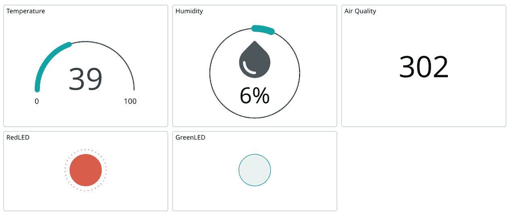

图 7.11 – 事物仪表盘

我们有三个不同的读数，**温度**、**湿度**和**空气质量**来自“感知环境”事物，以及来自“室内设备 MKR Wi-Fi 1010”事物的两个读数，**红 LED**和**绿 LED**。由于室内设备 MKR Wi-Fi 1010 事物的温度与“感知环境”事物同步，所以我们在这里只显示一个温度值。对于每个读数，我们使用不同的小部件控制来展示它们是如何工作的。但对于 LED 状态，我们使用了 LED 小部件控制。

关于这个仪表盘需要注意的主要事项是，我们正在使用来自两个不同事物但相同仪表盘的值来可视化这些值。这个例子演示了我们可以在一个仪表盘上显示多个事物的值。“图 7**.12**”展示了将任何云变量链接到小部件控制是多么容易。

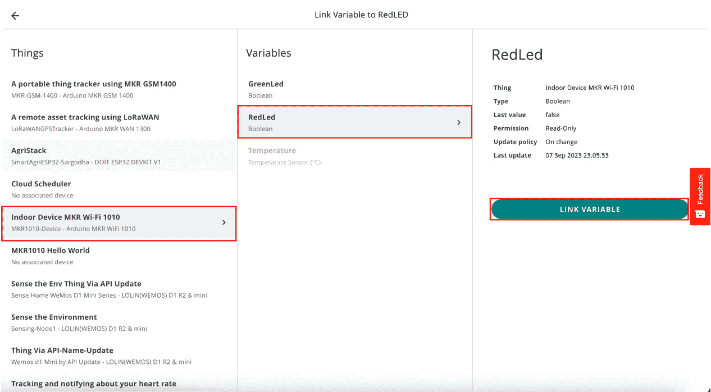

图 7.12 – 将云变量链接到小部件控制

*图 7.12* 展示了如何将来自**室内设备 MKR Wi-Fi 1010**的**RedLed**云变量链接到一个小部件。但是，正如你所看到的，你可以从任何事物中选择任何云变量并将其与小部件控制链接。因此，我们可以看到 Arduino IoT Cloud 仪表板如何使我们能够轻松地为多个事物创建单个仪表板。

在本节中，我们讨论了如何设置包含多个事物附加小部件的仪表板。在下一节中，我们将详细讨论限制和云变量同步。

# 云变量/属性同步的限制

Arduino IoT Cloud 提供了一个物联网设备管理和通信的平台，包括设备间的 TTC。虽然它为连接和管理物联网设备提供了有价值的特性，但也有一些缺点需要考虑：

+   **延迟**: TTC 可能会引入延迟，这是在一个设备上更改变量时与它在另一个设备上反映之间的延迟。这对于需要非常低延迟的应用程序来说可能是一个问题，例如实时控制机器人。

+   **离线设备挑战**: 暂时离线的设备可能会错过来自其他设备的重要消息或更新。确保设备在网络重新连接时能够赶上错过的通信可能很复杂。

+   **依赖互联网连接**: Arduino IoT Cloud 依赖于互联网连接来实现设备间的通信。如果互联网连接中断，设备可能会失去相互通信的能力。

+   **功能有限**: TTC 不如一些其他物联网通信协议灵活。例如，你不能使用 TTC 在设备之间发送任意数据。

+   **依赖云服务**: TTC 依赖于 Arduino IoT Cloud 才能运行。这意味着如果云服务不可用，你的 TTC 连接将无法工作。

当你在物联网项目中考虑使用 Arduino IoT Cloud 进行 TTC 时，必须权衡这些缺点与平台的优势，并评估它是否符合你特定的项目需求和限制。此外，探索替代的物联网平台和通信解决方案可能是必要的，以确保最适合你的需求。

在本节中，我们详细讨论了 Arduino IoT Cloud TTC 的限制。在下一节中，我们将探讨如何为不同类型的云变量使用 TTC。

# 接下来是什么？

我们还有很多选项可供探索，但现在轮到您使用不同的传感器和开发板进行更多实验并从中学习。在本章中，我们只使用了一个在两个事物之间同步的`温度`云变量，但您可以尝试使用此功能同步多个云变量与多个事物。接下来，为多个事物创建一个仪表板，以便在一个地方可视化所有值。我们配置了简单的 LED 灯根据温度开关，但您也可以使用继电器来控制室内家庭/办公室和仓库环境的供暖/冷却系统，或者您可以使用此 TTC 功能在温度升高时创建一个警报。

# 摘要

在本章中，我们探讨了点对点通信以及 Arduino IoT Cloud 在物与物通信中的优势。我们讨论了如何开发物与物通信的解决方案。我们还探讨了仅使用图形用户界面同步云变量与其他事物的简便性。我们设置了一个仪表板，其中将小部件控件与多个物云变量相连接。最后，我们详细讨论了 Arduino IoT Cloud 在物与物通信中的限制。

在下一章中，我们将探讨如何使用 Arduino IoT Cloud SDK。本章是为那些渴望学习如何使用 Arduino IoT Cloud 编程和开发自定义解决方案的开发者而准备的，这些解决方案可以使用 Arduino IoT Cloud 或将其与第三方平台集成。
