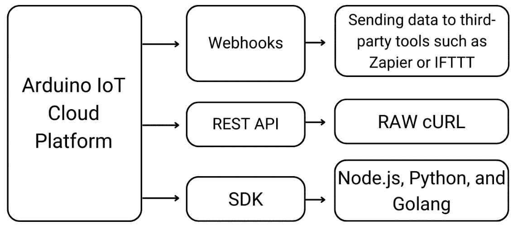
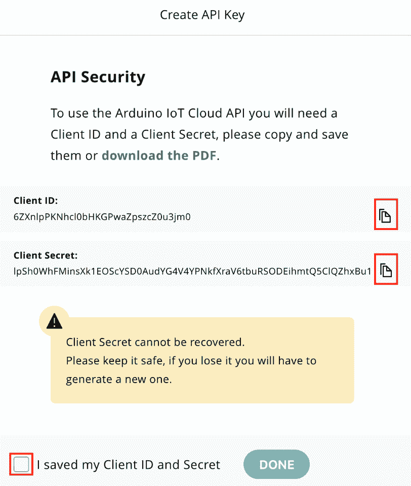
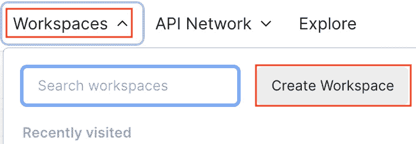
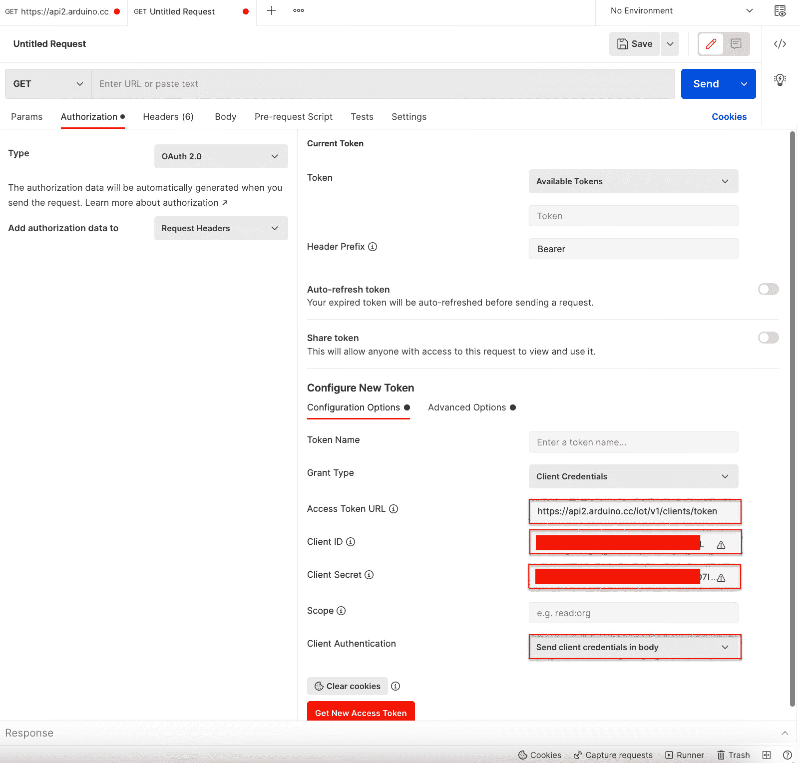
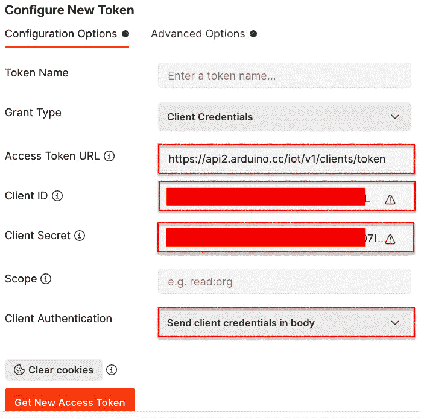
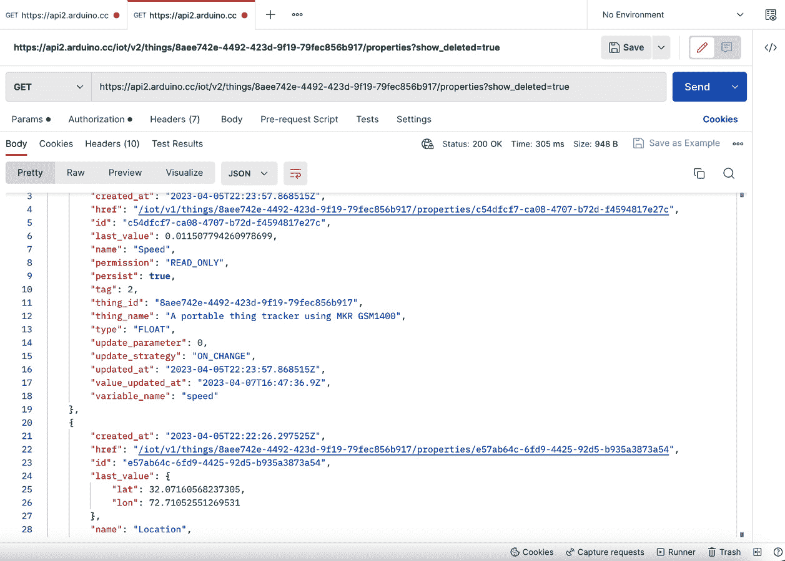

# 使用 Arduino IoT Cloud SDK 和 JavaScript 进行工作

每个平台都提供**APIs**和**SDKs**以使他们的产品与其他平台兼容，并且这些端点被开发者用来创建新的功能以解决现实世界的问题。同样，**Arduino IoT Cloud**也自带内置的功能和特性，但还有三种不同的方式来扩展 Arduino IoT Cloud 平台的功能或使其与其他工具和服务兼容：即**REST APIs**、**SDKs**和**webhooks**。

在本章中，我们将讨论 APIs 和 SDKs 以及它们的工作原理。具体来说，我们将使用**Node.js SDK**来展示不同的编码练习。本章将涵盖设备、事物、属性（即变量）和仪表板的**创建、读取、更新和删除**（**CRUD**）操作。除此之外，我们还将探索一些其他功能，例如如何设置/获取属性的值。

到本章结束时，你将了解如何通过 API 或 Node.js SDK 与 Arduino IoT Cloud 平台交互以创建自定义仪表板，使用其他工具/应用程序与数据交互，以及使用 SDK 进行大量设备创建和管理。

在本章中，我们将涵盖以下主要主题：

+   揭秘 Arduino IoT Cloud SDK – 功能和操作

+   保护访问权限 – 揭示 API 密钥和身份验证

+   步骤详解 – 安装 Arduino Node.js SDK 客户端

+   初步探索 – 使用 Postman 进行试驾

+   多平台兼容性 – 适用于各种环境的 SDKs

+   与设备交互 – 使用 Node.js SDK 进行实践

+   与事物互动 – Node.js SDK 实现指南

+   探索属性 – Node.js SDK 交互技巧

+   打造仪表板 – 通过 Node.js SDK 释放潜力

+   使用 Node.js SDK 进行微调 – 属性值管理

# 技术要求

本章没有特定的硬件要求，因为我们专注于 SDK，并将通过不同的编码练习在 Arduino IoT Cloud 平台上使用 Node.js SDK 执行不同的操作。为了跟随编码和测试练习，需要以下软件：

+   Node.js

+   已安装**Node.js Arduino IoT Cloud** **模块**

+   **VSCode 编辑器**

+   **Postman**

+   Arduino IoT Cloud 账户

将使用 Postman 进行**cURL 测试**和身份验证，这将帮助其他开发者在进行请求和响应测试时。对于 SDK 编码，我们将使用 Node.js 和 VSCode 编辑器。本章的代码可在书籍的官方 GitHub 仓库[`github.com/PacktPublishing/Arduino-IoT-Cloud-for-Developers`](https://github.com/PacktPublishing/Arduino-IoT-Cloud-for-Developers)中找到。

# 揭秘 Arduino IoT Cloud SDK – 功能和操作

Arduino IoT Cloud 提供了一系列功能，但不可避免地会有一些情况，开发者需要将他们的工具/系统/应用程序与 Arduino IoT Cloud 集成，以改善操作管理和控制。为了满足这些需求，Arduino IoT Cloud 提供了不同的技术和工具，供开发者和组织使用，以扩展产品的功能并解决现实世界的问题。

如以下图所示，Arduino IoT Cloud 为开发者提供了三个主要接口，以帮助他们满足需求。首先是 webhooks，我们在上一章中使用它将 Arduino IoT Cloud Thing 的数据发送到自定义 **端点** 或任何知名平台，包括 **Zapier** 或 **IFTTT** 以进行进一步集成。在 webhooks 之后，我们有 REST API 和 SDK，这两个都是开发者根据需求塑造系统的非常有用的功能。



图 8.1 – Arduino IoT Cloud 界面

在本章中，我们将特别关注 Node.js SDK。然而，首先对 Arduino IoT Cloud 的功能进行适当的概述是很重要的，这有助于开发者在与其他平台集成时做出更好的决策。Arduino 团队为不同的操作创建了 REST API 端点，例如 *创建*、*删除*、*列出*、*更新* 等，并根据 Arduino IoT Cloud 平台上使用的术语，如 Thing、设备、属性等，将它们放入不同的类别中。开发者可以通过不同的方法向这些端点发送请求，例如 `PUT`、`DELETE` 或 `GET`，并带有不同的参数，然后他们将从 Arduino IoT Cloud 获取所需的 JSON 格式响应，这些响应可以用于进一步的产品开发。

REST API 对开发者来说就像原材料，他们需要通过在首选语言中编写代码来处理它们，并使用 **cURL 库**发送和接收请求和响应。另一方面，Arduino 团队提供了一个 SDK，它基本上是 REST API 端点的编程包装器。这使我们能够节省时间，因为我们通过使用库方法获得对许多方法和示例代码的访问权限，从而完成我们的任务。在撰写本文时，Arduino 团队已经为三个编程平台开发了 SDK：Node.js、**Python** 和 **GoLang**。

在本章中，我们将专门使用 Node.js SDK 创建不同的脚本，以对 Thing、设备、属性和仪表板执行 CRUD 操作。我们还将开发允许您 *获取*/*设置* Thing 属性最新值的脚本，以及更多功能。总的来说，本章对开发者来说将会很有趣，因为我们将探索不同的技术和方法，这些方法将帮助我们从小规模扩展到企业级的物联网操作。

在本节中，我们讨论了 Arduino IoT Cloud API/SDK 为开发者提供哪些类型的功能。在下一节中，我们将讨论用于认证的 API 密钥。

# 保护访问权限 – 揭示 API 密钥和认证

在进入本章的主要内容之前，我们首先需要讨论平台的认证机制。Arduino IoT Cloud 使用`requests`/`responses`。

在我们开始 SDK 安装和用 Postman 进行测试之前，我们需要在 Arduino Cloud 中设置 API，它将为我们提供客户端 ID 和密钥。在旧版本的界面中，API 选项位于**集成**选项卡下，但现在已移动到 Arduino Cloud，可在[`cloud.arduino.cc/home/`](https://cloud.arduino.cc/home/)找到。

访问集成页面后，点击**API 密钥**，您将被带到 API 页面。点击**创建 API 密钥**。将出现一个弹出窗口；为 API 提供一个名称，然后点击**继续**按钮。出现的向导将花费几秒钟生成密钥，然后会出现一个新的弹出窗口显示密钥：



图 8.2 – API 密钥

通过点击复制图标复制**客户端 ID**和**客户端密钥**的值 – 千万不要尝试手动选择复制，因为**客户端密钥**非常长，所以点击复制图标是最好的选择。将客户端 ID 和客户端密钥保存在安全的位置，然后点击复选框确认您已保存您的密钥。最后，点击**完成**，您将在面板中看到您的 API 密钥 – 现在它已准备好使用。

重要提示

使用单个 API 密钥即可访问所有设备和它们的变量。只需一个 API 密钥就能访问所有基础设施非常方便，无需为每个设备创建单独的 API 密钥，但您必须保管好您的密钥！这是一个很大的安全风险，因为如果您丢失了密钥，黑客可能会获取到您的整个账户的访问权限。

在本节中，我们已经设置并创建了由客户端 ID 和客户端密钥组成的 API 认证密钥。本节非常重要，因为没有这些密钥，我们无法使用任何 API。在下一节中，我们将尝试使用 Postman 工具进行第一次 API 调用。

# 初步探索 – 使用 Postman 进行试驾

在深入研究 SDK 之前，我们将尝试使用 Postman 的**裸露的 REST API**端点，Postman 是一个帮助开发者调试其他编程语言平台（这些平台没有作为 SDK 提供）的请求/响应的工具。Postman 是后端开发者中广为人知的一个工具，用于在不进行任何编码的情况下公开 API 请求/响应。Postman 还帮助开发者通过**图形用户界面**（**GUI**）分析响应。

从[`www.postman.com/`](https://www.postman.com/)下载 Postman，选择适合您操作系统的正确版本。在开始使用 Postman 之前，首先为 Arduino IoT Cloud 创建一个新的工作区，以便将所有请求放入一个单独的组中。为此，点击**工作区**然后**创建工作区**：



图 8.3 – Postman 工作区

将会打开一个新窗口：提供工作区名称和描述，并根据您的需求设置可见性策略。创建新工作区后，导航到**文件** > **新建…**并选择**HTTP 请求**。在向 Arduino IoT Cloud 发送任何请求之前，必须有一个认证令牌。参考以下截图：点击**授权**选项卡，然后从**类型**下拉菜单中选择**OAuth 2.0**。滚动到**授权**页面以找到**配置新令牌**部分，并点击此部分下的**配置选项**选项卡。



图 8.4 – 授权配置选项

在**配置选项**下，我们需要提供三样东西。首先，将[`api2.arduino.cc/iot/v1/clients/token`](https://api2.arduino.cc/iot/v1/clients/token) URL 添加到**访问令牌 URL**字段，然后将我们在 Arduino IoT Cloud API 中之前生成的值插入到**客户端 ID**和**客户端密钥**字段。最后，从**客户端认证**下拉菜单中选择**在正文中发送客户端凭据**。现在点击**高级选项**选项卡，我们将在此设置接收请求的 API 受众。

*图 8.5*显示了**高级选项**，我们需要提供 Arduino IoT Cloud 认证 URL，以便我们可以认证和授权请求。



图 8.5 – 授权高级选项

将[`api2.arduino.cc/iot`](https://api2.arduino.cc/iot) URL 添加到**受众**字段。设置好配置后，点击**获取新的访问令牌**按钮。它将返回错误消息或成功消息。如果有任何错误，请逐个重复所有步骤，确保配置与之前描述的一致。如果成功，请点击**继续**，您将获得用于认证的令牌。

获取认证令牌后，是时候做一些实验了。Arduino 团队已经用 cURL 和 Node.js SDK 示例记录了所有端点，这些示例按不同类别提供，可在 [`www.arduino.cc/reference/en/iot/api/`](https://www.arduino.cc/reference/en/iot/api/) 找到。因此，我们想查看特定事物的云变量/属性列表。打开上述 API 文档 URL，找到 `https://api2.arduino.cc/iot/v2/things/{id}/properties?show_deleted=`。在这里，我们需要将 URL 中的 `{id}` 替换为特定事物的 ID (*图 8.6*）。事物 ID 在 URL 的 `show_deleted` 之后，位于事物的 `true` 之前。在将所有所需数据添加到 URL 后，它将看起来像 [`api2.arduino.cc/iot/v2/things/8aee742e-4492-423d-9f19-79fec856b917/properties?show_deleted=true`](https://api2.arduino.cc/iot/v2/things/8aee742e-4492-423d-9f19-79fec856b917/properties?show_deleted=true)。

点击 **发送**，你将收到来自 Arduino IoT Cloud 的 JSON 格式响应，其中包含事物的所有云变量属性，包括属性 ID、名称、类型、云变量的最后值等：



图 8.6 – Postman 请求响应

上一张截图显示了 Postman 中的响应。您可以将响应转换为纯文本以及其他格式，包括 **XHTML**、**HTML** 等，但 Postman 对 **JSON** 数据响应的视觉功能非常出色。这样，开发者可以轻松理解并调整响应的性质，并根据其数据结构准备脚本。这也有助于开发者更快地从响应中选择特定内容，从而减少所需的时间和精力。

在本节中，我们使用 Postman 向 Arduino IoT Cloud 发送了我们的第一个请求。我们首先在 Postman 中配置了 API 认证密钥，然后请求事物的云变量/属性列表。Arduino IoT Cloud 成功以 JSON 格式返回了包含所有所需数据的响应。在下一节中，我们将检查不同平台可用的 SDK。

# 多平台兼容性 – 各种环境的 SDK

在使用 Postman 测试 *请求*/*响应* 后，是时候探索 Arduino IoT Cloud 可用的 SDK 了。之前我提到，Arduino 团队为三个编程平台开发了官方 SDK，分别是 Node.js、Python 和 GoLang。

Node.js 是后端开发者中非常知名的语言，被网页和移动开发者广泛使用。因此，如果您计划为 Arduino IoT Cloud 自动化创建带有自定义可视化的移动或网页应用，那么 Node.js 是最佳语言，它提供了广泛的 HTTP 服务库。

另一方面，Python 也是在 Web、IoT 和 **AI**/**ML** 开发者中非常知名且快速发展的语言。Python 似乎正朝着 AI/ML 发展趋势，而 IoT 作为领域与 AI/ML 非常接近。如果你计划开发专注于 AI/ML 的解决方案，例如 **预测性维护**、**时间序列分析**或预测，那么 Python SDK 是与 Arduino IoT Cloud 交互的最佳选择。

GoLang 是 Arduino 团队为其开发的最后一个平台。GoLang 由 Google 开发，遵循 **C 类语法**。GoLang 平台非常适合操作系统和网络/API 服务开发。如果你计划使用 Arduino IoT Cloud 维护高性能系统或计划运行并发操作，那么 GoLang 是更好的选择。

我们在这里讨论了三种不同的平台及其专门的应用领域。Node.js 适用于 **Web APIs**，Python 适用于机器学习，而 GoLang 是高性能系统的绝佳选择。你可以根据项目需求选择一个 SDK 平台进行开发，或者消费所有 SDK。

在下一节中，我们将开始使用 Node.js SDK 的旅程，首先在我们的机器上安装官方 Arduino IoT Cloud Node.js SDK。

# 步骤-by-步骤 – 安装 Arduino Node.js SDK 客户端

从这个点开始，我们将使用 Node.js SDK 进行我们的练习和实验。在进入实际练习之前，我们首先需要安装 Arduino IoT Cloud 的 Node.js 包。从 [`nodejs.org/`](https://nodejs.org/) 下载并安装 Node.js。Node.js 安装完成后，打开 Windows/Mac/Linux 的 **终端** 并导航到使用 **VSCode** 设置编码工作空间的目录：

```cpp
npm install @arduino/arduino-iot-client
npm i request-promise
```

在 **终端** 中输入前两个命令，等待安装完成。安装成功后，打开 VSCode 并将（你安装 Node.js Arduino IoT Cloud SDK 的）文件夹添加到安装 Arduino IoT Cloud 和 request-promise 模块的 workspace 中。

导航到本书的官方 GitHub 仓库，并从本章文件夹中下载所有代码。将文件复制到 VSCode 的 `Workspace` 文件夹中，并解压下载的 `.zip` 文件。导航到 `start` 文件夹，并在 VSCode 中打开 `main.js` 文件。

在这里，我们有两种方法，`getToken()` 和 `ThingProperty()`。`getToken()` 方法将在编码练习中保持一致，并用于根据客户端 ID 和客户端密钥从 Arduino IoT Cloud 获取认证令牌：

```cpp
client_id: '-----Paste ClientID Here-----',             client_secret: '-----Paste Client Secret Here-----',
```

上述代码片段来自 `getToken()` 方法。将你的客户端 ID 插入 `client_id` 变量，将你的客户端密钥插入 `client_secret` 变量。同样，在 `ThingProperty()` 方法下的以下代码片段中插入你的 `Thing ID` 和 `Property ID`。你可以通过导航到 Arduino IoT Cloud 中的“设备”然后是 **元数据** 选项卡来获取你的 `Thing ID`。属性 ID 可以通过在 Arduino IoT Cloud 的设备页面上的云变量上点击来找到：

```cpp
var id = "Paste -----Thing ID-----"; // {String} The id of the thing
var pid = "-----Property ID-----"; // {String} The id of the property
```

打开 `main.js` 代码并在控制台提供响应：

```cpp
node main.js
```

如果一切正常，你将在控制台收到以下响应：

```cpp
API called successfully. Last Value of Property=259
```

如果你收到 `401` 错误，这意味着你的客户端 ID 和/或客户端密钥不正确。如果返回 `404` 错误，这意味着你没有使用正确的方法来获取属性数据。如果你得到 `500` 错误，这意味着服务器已关闭或你的 ISP 对 Arduino IoT Cloud 有网络阻塞。

在 *第一次使用 Postman 尝试* 部分，我们讨论了如何使用 Arduino IoT Cloud 端点与 Postman 进行请求/响应任务，以及安装云的 Node.js 模块并使用示例进行测试，其中我们获取了 Thing 云变量/属性的最后一个值。

在这个基础上，我们将开始一段新的旅程，我们将围绕 Arduino IoT Cloud 进行操作。首先，我们将从设备开始。在下一节中，我们将创建、更新、删除、列出和查看特定设备。在章节的后面，我们将对 Things、属性（也称为云变量）和仪表板做同样的操作。

# 与设备交互 - 使用 Node.js SDK 进行实际操作

在本节中，我们将亲自动手，使用设备进行实际操作。我们将对设备执行 CRUD 操作，以及列出所有设备并显示特定设备的所有参数。打开 VSCode 并导航到本章的示例代码。然后点击 `device` 文件夹：在这里你可以找到所有与设备操作相关的代码。

## 创建设备

首先，我们将从设备创建开始。设备创建的文档可以在 [`www.arduino.cc/reference/en/iot/api/#api-DevicesV2-devicesV2Create`](https://www.arduino.cc/reference/en/iot/api/#api-DevicesV2-devicesV2Create) 找到。在 VSCode 中 `device` 文件夹下打开 `create-device.js`。

代码中有两种方法：一种是 `getToken()`，这与我们所有的编码练习中的方法相同，帮助我们获取请求的认证令牌。第二种方法是 `CreateDevice()`，它负责设备创建。查阅文档，我们可以看到我们需要使用 `AiotApi.DevicesV2Api()` 对象初始化 `api` 变量，这与设备相关：

```cpp
var DeviceProperties = {
        'name':'Sense Home XIAO Series',
        'connection_type':'wifi',
        'fqbn':'esp32:esp32:XIAO_ESP32C3',
        'type':'login_and_secretkey_wifi'
    };
    var options = {
    };
    api.devicesV2Create(DeviceProperties, options).then(function(data) {
      console.log('Device Created successfully. Returned data: ' + util.inspect(data));
    }, function(error) {
      console.error(error);
    });
```

`api.devicesV2Create` 是负责设备创建的方法，它接受两个输入参数。`DeviceProperties` 包括设备名称、类型和 `name` 第一部分——这可以是任何您喜欢的，但请避免使用特殊字符。接下来，我们需要提供一个 `connection_type` 的选择，例如 Wi-Fi、GSM、LoRa WAN 等。所有可用类型都在文档中提供。对于 `fqbn`，我们需要提供开发板的详细信息。例如 `esp32:esp32:XIAO_ESP32C3`。

`options` 是可选的，所以我留空了，但你可以根据需求提供 `X-Organization` 的值。两个数组都传递给 `api.devicesV2Create` 方法，该方法将返回响应。使用 `util.inspect` 方法以适当的格式在控制台上显示 JSON 响应。输入以下命令以执行 `create-device.js` 程序：

```cpp
node create-device.js
```

脚本成功执行后，将打印出如下响应：

```cpp
Device Created successfully. Returned data: ArduinoDevicev2 {
  href: '/iot/v2/devices/e88b84a7-7ad7-4c2b-b79c-ab426e47dc67',
  id: 'e88b84a7-7ad7-4c2b-b79c-ab426e47dc67',
  label: 'Login and secret key for wifi device',
  name: 'Sense Home XIAO Series',
  serial: '',
  type: 'login_and_secretkey_wifi',
  user_id: 'f067c1e9-3ff8-4b9f-a9b4-f8c5c1d0ceb4',
  fqbn: 'esp32:esp32:XIAO_ESP32C3'
}
```

在响应中，您将获得设备 ID，它将在本章的设备创建部分使用，当我们将设备与设备关联时。其余属性与代码中已覆盖的相同。

重要注意事项

如果您无法获取正确的 FQBN，则可以从仪表板手动添加设备，通过下拉菜单查找并点击设备。这将提供 `fqbn`、`type` 和 `connection_type` 详细信息。您可以在 Node.js 脚本中稍后使用这些详细信息来自动创建设备。

## 更新设备

在本节中，我们将探讨如何使用设备 ID 更新设备。假设我们错误地添加了一个具有错误 FQBN 和名称的设备。我们将使用设备 ID 更新这两个属性。有关更新设备的文档可在 [`www.arduino.cc/reference/en/iot/api/#api-DevicesV2-devicesV2Update`](https://www.arduino.cc/reference/en/iot/api/#api-DevicesV2-devicesV2Update) 查找。在 VSCode 中打开 `device` 文件夹下的 `update-device.js` 文件：

```cpp
var api = new AiotApi.DevicesV2Api();
var DeviceID="e88b84a7-7ad7-4c2b-b79c-ab426e47dc67";
var DeviceProperties = {
        'name':'Sense Home WeMos D1 Mini Series',
        'connection_type':'wifi',
        'fqbn':'esp8266:esp8266:d1_mini',
        'type':'login_and_secretkey_wifi'
};
var options = {
};
api.devicesV2Update(DeviceID,DeviceProperties, options).then(function(data) {
      console.log('Device Created successfully. Returned data: ' + util.inspect(data));
    }, function(error) {
      console.error(error);
});
```

上述代码几乎与 `create-device` 代码相同。这里我们有一个额外的变量 `DeviceID`，我们将用它来更新特定的设备。其余的代码与之前相同，具有相同的设备属性和选项。现在，在 `DeviceProperties` 变量中填写正确的 `fqbn` 和 `name` 值。最后，我们调用 `api.devicesV2Update()` 方法。在终端中执行以下命令：

```cpp
node update-device.js
```

脚本成功执行后，将打印出如下响应：

```cpp
Device Updated successfully. Returned data: ArduinoDevicev2 {
  href: '/iot/v2/devices/e88b84a7-7ad7-4c2b-b79c-ab426e47dc67',
  id: 'e88b84a7-7ad7-4c2b-b79c-ab426e47dc67',
  label: 'Login and secret key for wifi device',
  name: 'Sense Home WeMos D1 Mini Series',
  serial: '',
  type: 'login_and_secretkey_wifi',
  user_id: 'f067c1e9-3ff8-4b9f-a9b4-f8c5c1d0ceb4',
  created_at: 2023-04-17T00:47:40.700Z,
  fqbn: 'esp8266:esp8266:d1_mini'
}
```

如我们所见，在更新后，响应会发送回新的内容。我们提供了名称和 FQBN 的更改，并且成功反映在响应中。

## 删除设备

在本节中，我们将探讨如何使用设备 ID 来删除设备。有关删除设备的文档可在[`www.arduino.cc/reference/en/iot/api/#api-DevicesV2-devicesV2Delete`](https://www.arduino.cc/reference/en/iot/api/#api-DevicesV2-devicesV2Delete)找到。

在 VSCode 中打开`device`文件夹下的`delete-device.js`文件：

```cpp
    var api = new AiotApi.DevicesV2Api();
    var DeviceID='e88b84a7-7ad7-4c2b-b79c-ab426e47dc67';
    var options = {
    };
    api.devicesV2Delete(DeviceID, options).then(function(data) {
      console.log('Device Deleted successfully. Returned data: ' + data);
    }, function(error) {
      console.error(error);
    });
```

上述代码片段是从`DeleteDevice()`方法中提取的。在此方法中，我们需要将`DeviceID`和`options`变量作为参数提供。`DeviceID`是删除过程的必需参数，而`options`变量不是必需的。请在终端中执行以下命令：

```cpp
node delete-device.js
```

脚本执行成功后，将在控制台打印一条响应，报告设备已成功删除。

## 列出设备

在本节中，我们将列出所有设备。请注意，列出设备和显示设备之间存在差异：*列出*设备意味着显示所有设备及其属性，而*显示*设备仅根据设备 ID 返回特定设备的属性。

列出设备的文档可在[`www.arduino.cc/reference/en/iot/api/#api-DevicesV2-devicesV2List`](https://www.arduino.cc/reference/en/iot/api/#api-DevicesV2-devicesV2List)找到。在 VSCode 中打开`device`文件夹下的`list-device.js`文件。以下代码片段是从`list-device.js`文件中的`ListDevice()`方法中提取的：

```cpp
   var api = new AiotApi.DevicesV2Api()
   var opts = {
        'acrossUserIds': true // {Boolean} If true, returns all the devices
      };
      api.devicesV2List(opts).then(function(data) {
        for(var i=0;i<data.length;i++){
            console.log("Device ID:"+data[i].id+" Device Name:"+data[i].name);
        }
    }, function(error) {
      console.error(error);
    });
```

在这里，我们需要提供用于过滤设备和返回所需响应的准则。在当前代码中，我们只提到了一个参数，即`'acrossUserIds'`，其值为`true`以获取所有类型的设备。但如果需要，你可以根据`tags`、`serial`和`X-Organization`来过滤列出的设备。请在终端中执行以下命令：

```cpp
node list-device.js
```

脚本执行成功后，将以 JSON 格式打印包含设备属性的响应，这将导致**终端**控制台输出大量信息。我修改了代码，只显示设备 ID 和设备名称在控制台上：

```cpp
Device ID:04d8025a-4270-4d7e-aa04-45db87a594f5
Device Name:SmartAgriESP32-Sargodha
Device ID:5aae7e1f-940b-4426-80ac-1c953839cdb2
Device Name:MKR-GSM-1400
Device ID:fae0951d-3169-4d6a-a8e5-739c347eafc1
Device Name:MKR1500
Device ID:ca711f68-6de9-497a-ac45-780219ad2bb8
Device Name:Wemos d1 Mini by API Update
Device ID:64990519-1833-4bba-b035-978fcaa33466
Device Name:MKR1010-Device
Device ID:62e8600b-2733-4f24-9654-1fac549af27f
Device Name:XIAO-ESP32C3-Pulse-Sensor
Device ID:e88b84a7-7ad7-4c2b-b79c-ab426e47dc67
Device Name:Sense Home WeMos D1 Mini Series
Device ID:b9f3ff20-ebf1-4260-ad16-f434466458ac
Device Name:ArduinoNanoRP2040
Device ID:047d8316-dcdb-4bf5-af30-4319bb5a5eb0
Device Name:Delly
```

在前面的代码中，我们在控制台显示了两个参数，但你可以通过指定它们的名称在 for 循环中自由选择并指定任意数量。使用这种方法，我们可以将输出以 JSON 格式发送到 Web/移动客户端，该客户端将在列表框或菜单中显示信息。

## 显示设备

这是“与设备交互 – 使用 Node.js SDK 动手实践”部分的倒数第二个小节。在这里，我们将通过提供设备 ID 来获取特定设备的所有属性。有关显示设备的文档可在[`www.arduino.cc/reference/en/iot/api/#api-DevicesV2-devicesV2Show`](https://www.arduino.cc/reference/en/iot/api/#api-DevicesV2-devicesV2Show)找到。

在 VSCode 中打开 `device` 文件夹下的 `show-device.js` 文件。以下代码片段是从 `show-device.js` 文件中的 `ShowDevice()` 方法中摘取的：

```cpp
var api = new AiotApi.DevicesV2Api()
    var id = '62e8600b-2733-4f24-9654-1fac549af27f'; // {String} The id of the device
    var opts = {
    };
    api.devicesV2Show(id, opts).then(function(data) {
      console.log('Device Created successfully. Returned data: ' + util.inspect(data));
    }, function(error) {
      console.error(error);
    });
```

`devicesV2Show()` 方法只接受两个参数：第一个是 `DeviceID`，第二个是 `options`，包括 `X-Organization`。`DeviceID` 是获取适当响应的必需参数，而 `opts` 变量是可选的，因此我们将其留空。在终端中执行以下命令：

```cpp
node show-device.js
```

脚本执行成功后，它将以 JSON 格式打印出包含设备属性以及任何关联变量的详情（如果有的话）：

```cpp
ArduinoDevicev2 {
  id: '62e8600b-2733-4f24-9654-1fac549af27f',
  label: 'Login and secret key for wifi device',
  name: 'XIAO-ESP32C3-Pulse-Sensor',
    ……………………………………..
  thing: ArduinoThing {
    id: '6b6cd076-5859-4a6d-9b4e-18879893c6cb',
    name: 'Tracking and notifying Your Heart Rate',
    ……………………………………..
    webhook_active: true,
    webhook_uri: 'https://hooks.zapier.com/hooks/catch/14930971/324me7k/'
  }
}
```

以下代码是关于设备属性的脚本编辑后的响应，包括给定设备的所有详细信息，如最后活动时间、云变量数量、与设备关联的 Thing ID、webhook 详细信息（如果处于活动状态）、sketch ID 等。

在本小节中，我们探讨了如何使用 Node.js SDK 从 Arduino IoT Cloud 获取所有设备列表。接下来，让我们探索如何获取与设备关联的云变量/属性列表。

## 设备属性/变量

在这里，我们将通过提供设备 ID 来获取特定设备的所有云变量详情。关于显示设备的文档可在 [`www.arduino.cc/reference/en/iot/api/#api-DevicesV2-devicesV2GetProperties`](https://www.arduino.cc/reference/en/iot/api/#api-DevicesV2-devicesV2GetProperties) 查找。

首先，在 VSCode 中打开 `device` 文件夹下的 `properties-device.js` 文件。以下代码片段是从 `properties-device.js` 文件中的 `ListPropDevice()` 方法中摘取的：

```cpp
    var api = new AiotApi.DevicesV2Api()
    var id = '62e8600b-2733-4f24-9654-1fac549af27f'; // {String} The id of the device
    var opts = {
    };
    api.devicesV2GetProperties(id, opts).then(function(data) {
      console.log('Device Properties.' + util.inspect(data));
    }, function(error) {
      console.error(error);
    });
```

`devicesV2GetProperties()` 方法只接受两个参数：第一个是设备 ID，第二个是选项，包括 `showDeleted` 和 `X-Organization`。`DeviceID` 是获取适当响应的必需参数，而 `opts` 变量是可选的，因此我们将其留空。在终端中执行以下命令：

```cpp
node properties-device.js
```

脚本执行成功后，它将以 JSON 格式打印出与特定设备 ID 相关的云变量详情：

```cpp
  Properties: [
    ArduinoProperty {
      href: '/iot/v1/things/6b6cd076-5859-4a6d-9b4e-18879893c6cb/properties/b357a513-ad2b-4e1f-a76b-6dac078e36d5',
      id: 'b357a513-ad2b-4e1f-a76b-6dac078e36d5',
      name: 'BPM',
      permission: 'READ_ONLY',
      thing_id: '6b6cd076-5859-4a6d-9b4e-18879893c6cb',
      type: 'HEART_BEATS',
      update_strategy: 'ON_CHANGE',
      created_at: 2023-03-31T16:41:33.103Z,
      persist: true,
      tag: 1,
      thing_name: 'Tracking and notifying Your Heart Rate',
      update_parameter: 0,
      updated_at: 2023-03-31T17:05:19.564Z,
      variable_name: 'bPM'
    }
  ]
```

以下响应是关于设备云变量的脚本编辑后的响应，包括 `variable_name`、`type`、`permission`、`thing_id`、`update_strategy` 等。我们已经看到了如何获取云变量详情，在下一节中，我们将继续介绍 Things。

# 与事物互动 – Node.js SDK 实现指南

Thing 是 Arduino IoT Cloud 中最重要的元素之一，它作为一个定义的容器，包含所有成分，如云变量、设备、设备的 sketch 以及设备的网络配置。在本节中，我们将尝试一系列不同的编码练习，以了解 Thing CRUD 操作。

## 创建一个 Thing

首先，我们将从创建 Thing 开始。相关文档可在[`www.arduino.cc/reference/en/iot/api/#api-ThingsV2-thingsV2Createe`](https://www.arduino.cc/reference/en/iot/api/#api-ThingsV2-thingsV2Createe)找到。在 VSCode 中打开位于 `thing` 文件夹下的 `create-thing.js` 文件。

此代码中有两种方法：一种是 `getToken()`，这与我们所有编码练习中的方法相同，帮助我们获取请求的认证令牌。第二种方法是 `CreateThing()`，它负责创建 Thing。根据文档，我们可以看到需要使用 `AiotApi.ThingsV2Api()` 对象初始化 `api` 变量，该对象与 Arduino IoT Cloud Thing 相关。该对象负责对 Thing 执行操作：

```cpp
    var api = new AiotApi.ThingsV2Api()
    var thingCreate = {'name':' Sense the Env Thing Via API'}; // {ThingCreate}
    var opts = {
      'force': true // {Boolean} If true, detach device from the other thing, and attach to this thing
    };
    api.thingsV2Create(thingCreate, opts).then(function(data) {
      console.log('Thing Created successfully. Returned data: ' + util.inspect(data));
    }, function(error) {
      console.error(error);
    });
```

`api.thingsV2Create` 是负责创建 Thing 的方法，它接受两个参数作为输入：`name` 和 `opts`。首先，我们从 `name` 开始，这可以是任何您喜欢的名称，但请确保避免特殊字符。目前，我们在变量中只提供了 Thing 名称，但在即将到来的更新部分，我们还将传递时区和设备 ID 参数。

`opts` 是可选的，因此我将其留空，但如有需要，您可以提供 `X-Organization` 值。这两个变量都传递给 `api.thingsV2Create` 方法，该方法将返回响应。`util.inspect` 方法用于在控制台上以适当的格式显示 JSON 响应。输入以下命令以执行 `create-device.js` 脚本：

```cpp
node create-thing.js
```

脚本执行成功后，将打印出如下响应：

```cpp
Thing Created successfully. Returned data: ArduinoThing {
  href: '/iot/v1/things/d99e244d-f245-4e27-9ead-717e52ac5a96',
  id: 'd99e244d-f245-4e27-9ead-717e52ac5a96',
  name: 'Sense the Env Thing Via API',
  timezone: 'America/New_York',
  user_id: 'f067c1e9-3ff8-4b9f-a9b4-f8c5c1d0ceb4',
  created_at: 2023-04-18T16:46:35.767Z,
  properties_count: 0,
  updated_at: 2023-04-18T16:46:35.767Z,
  webhook_active: false
}
```

在响应中，您将获得您的 Thing ID，该 ID 将在以下 Thing 更新/删除操作中很快使用——因此请确保将此 Thing ID 粘贴到记事本文件或其他类似文件中。同时返回的还有时区、属性计数和 webhook 状态。

## 更新一个 Thing

在本节中，我们将探讨如何使用 Thing ID 更新一个 Thing。假设我们错误地添加了 Thing，但没有设置正确的时间区域，也没有进行设备关联。在这种情况下，我们有选项使用新属性更新 Thing。有关更新设备的文档可在[`www.arduino.cc/reference/en/iot/api/#api-ThingsV2-thingsV2Update`](https://www.arduino.cc/reference/en/iot/api/#api-ThingsV2-thingsV2Update)找到。在 VSCode 中打开位于 `device` 文件夹下的 `update-thing.js` 文件：

```cpp
    var api = new AiotApi.ThingsV2Api()
    var id = 'd99e244d-f245-4e27-9ead-717e52ac5a96'; // {String} The id of the thing
    var thingUpdate = {
        'name':'Sense the Env Thing Via API Update',
        'timezone':'Asia/Karachi',
        'device_id':'e88b84a7-7ad7-4c2b-b79c-ab426e47dc67'
    };
    var opts = {
      'force': true // {Boolean} If true, detach device from the other thing, and attach to this thing
    };
    api.thingsV2Update(id,thingUpdate, opts).then(function(data) {
      console.log('Thing Updated successfully. Returned data: ' + util.inspect(data));
    }, function(error) {
      console.error(error);
    });
```

上述代码与 `create-thing` 代码类似。这里我们有一个额外的变量 `id`，它将帮助我们更新特定的 Thing。在 `thingupdate` 变量中，我们还有 `timezone`、`device_id` 和 `name`。最后，我们调用 `api.thingsV2Update()` 方法。在终端中执行以下命令：

```cpp
node update-thing.js
```

脚本执行成功后，将打印出如下响应：

```cpp
Thing Updated successfully. Returned data: ArduinoThing {
  href: '/iot/v1/things/d99e244d-f245-4e27-9ead-717e52ac5a96',
  id: 'd99e244d-f245-4e27-9ead-717e52ac5a96',
  name: 'Sense the Env Thing Via API Update',
  timezone: 'Asia/Karachi',
  user_id: 'f067c1e9-3ff8-4b9f-a9b4-f8c5c1d0ceb4',
  created_at: 2023-04-18T16:46:35.767Z,
  device_id: 'e88b84a7-7ad7-4c2b-b79c-ab426e47dc67',
  properties_count: 0,
  updated_at: 2023-04-18T16:46:35.767Z,
  webhook_active: false
}
```

更新后，响应将返回新的内容。我们提供了新的 `name` 和 `device_id` 值，以及正确的时间区域。所有内容都已成功更新并反映在响应中。

## 创建 Thing 草图

在完成 Thing 的创建后，我们现在需要为 Thing 创建一个草图。相关文档可在[`www.arduino.cc/reference/en/iot/api/#api-ThingsV2-thingsV2CreateSketch`](https://www.arduino.cc/reference/en/iot/api/#api-ThingsV2-thingsV2CreateSketch)找到。在 VSCode 中打开位于 `thing` 文件夹下的 `create-sketch-thing.js` 文件。

代码中有两种方法：一种是 `getToken()`，这是我们在所有编码练习中使用的相同方法，用于获取请求的认证令牌。第二种方法是 `CreateSketch()`，它处理为特定 Thing 创建草图：

```cpp
    var api = new AiotApi.ThingsV2Api()
    var id = 'd99e244d-f245-4e27-9ead-717e52ac5a96'; // {String} The id of the thing
    var thingSketch = {'sketch_version':'v1'}; // {ThingSketch}
    var opts = {
    };
    api.thingsV2CreateSketch(id, thingSketch, opts).then(function(data) {
      console.log('Thing Sketch Created successfully. Returned data: ' + util.inspect(data));
    }, function(error) {
      console.error(error);
    });
```

`api.thingsV2CreateSketch` 是负责创建 Thing 草图的方法，它接受三个输入参数。第一个参数是 Thing ID；第二个是草图版本。`opts` 是可选的，所以我留空了，但你可以根据需要提供 `X-Organization` 值。所有变量都传递给 `api.thingsV2CreateSketch` 方法，该方法将返回响应。使用 `util.inspect` 方法在控制台上以适当的格式显示 JSON 响应。输入以下命令以执行 `create-device.js` 脚本：

```cpp
node create-sketch-thing.js
```

脚本执行成功后，将打印以下响应：

```cpp
Thing Sketch Created successfully. Returned data: ArduinoThing {
  href: '/iot/v1/things/d99e244d-f245-4e27-9ead-717e52ac5a96',
  id: 'd99e244d-f245-4e27-9ead-717e52ac5a96',
  name: 'Sense the Env Thing Via API Update',
  timezone: 'Asia/Karachi',
  user_id: 'f067c1e9-3ff8-4b9f-a9b4-f8c5c1d0ceb4',
  created_at: 2023-04-18T16:46:35.767Z,
  device_id: 'e88b84a7-7ad7-4c2b-b79c-ab426e47dc67',
  properties_count: 0,
  sketch_id: '93297fc6-835d-46b3-89bc-1c6738a8ec7b',
  updated_at: 2023-04-18T17:10:34.779Z,
  webhook_active: false
}
```

在响应中，您将看到您的 Thing ID 以及一些其他属性，表明已成功创建了给定 Thing 的草图。您还可以通过在 Arduino IoT Cloud 中导航到指定的 Thing 来验证草图。

重要提示

在创建草图之前，将设备与 Thing 关联是很重要的。

在本节中，我们创建了 Thing 的草图，因为 Arduino IoT Cloud 默认不会这样做。因此，在 Arduino IoT Cloud 中创建 Thing 后，必须创建一个草图。接下来，我们将探讨如何使用 Arduino IoT Cloud API 删除一个 Thing。

## 删除 Thing

在本节中，我们将探讨如何使用 Thing ID 删除一个 Thing。关于 Thing 删除的文档可在[`www.arduino.cc/reference/en/iot/api/#api-ThingsV2-thingsV2Delete`](https://www.arduino.cc/reference/en/iot/api/#api-ThingsV2-thingsV2Delete)找到。在 VSCode 中打开位于 `thing` 文件夹下的 `delete-thing.js` 文件：

```cpp
    var api = new AiotApi.ThingsV2Api()
    var id = 'ac9fc5fd-a946-406e-983d-715dcc2571b6'; // {String} The id of the thing
    var opts = {
      'force': true // {Boolean} If true, detach device from the other thing, and attach to this thing
    };
    api.thingsV2Delete(id, opts).then(function(data) {
      console.log('Thing Deleted successfully. Returned data: ' + data);
    }, function(error) {
      console.error(error);
    });
```

上述代码片段来自 `DeleteThing()` 方法。在 `DeleteThing()` 方法中，我们需要将 `id`（Thing ID）和 `opts` 变量作为参数提供。`id`（Thing ID）是删除过程所必需的，而 `opts` 变量则不是。在终端中执行以下命令：

```cpp
node delete-thing.js
```

脚本执行成功后，将在控制台上打印一个响应，指示设备已成功删除。

## 列出 Things

在本节中，我们将列出所有的事物。请注意，*列出*事物和*显示*事物之间有区别：列出事物将显示所有事物的属性，而显示事物仅显示与特定事物 ID 相关的特定事物属性。

有关列出事物的相关文档可在[`www.arduino.cc/reference/en/iot/api/#api-ThingsV2-thingsV2List`](https://www.arduino.cc/reference/en/iot/api/#api-ThingsV2-thingsV2List)找到。在 VSCode 中打开`thing`文件夹下的`list-thing.js`文件。以下代码片段是从`ListThing()`方法中摘取的：

```cpp
    var api = new AiotApi.ThingsV2Api()
    var opts = {
        'acrossUserIds': false
    };
    api.thingsV2List(opts).then(function(data) {
        for(var i=0;i<data.length;i++){
            console.log("Thing ID:"+data[i].id+" Thing Name:"+data[i].name);
        }
      }, function(error) {
        console.error(error);
      });
```

在这里，我们需要提供用于过滤事物并返回响应的准则。在当前代码中，我们只提供了一个参数，即`'acrossUserIds'`，其值为`true`，因此将检索所有类型的事物。但你也可以根据标签、ID、X-Organization 等进行事物过滤。在终端中执行以下命令：

```cpp
node list-thing.js
```

脚本执行成功后，它将以 JSON 格式打印包含事物属性的响应，这将使控制台充满大量输出。我修改了代码，只显示控制台上的事物 ID 和事物名称：

```cpp
Thing ID:6b6cd076-5859-4a6d-9b4e-18879893c6cb Thing Name:Tracking and notifying Your Heart Rate
Thing ID:6e3d308c-dfb2-49ad-aa61-998227f214ab Thing Name:Thing Via API-Name-Update
Thing ID:85b04a9c-e335-4842-bf4b-c13f726e0522 Thing Name:AgriStack
Thing ID:8aee742e-4492-423d-9f19-79fec856b917 Thing Name:A portable thing tracker using MKR GSM1400
Thing ID:bf8e11ea-1a78-4f95-b6a0-c6d50b868402 Thing Name:MKR1010 Hello World
Thing ID:d99e244d-f245-4e27-9ead-717e52ac5a96 Thing Name:Sense the Env Thing Via API Update
```

如前所述输出所示，我在控制台上只显示两个参数，但你可以通过在 for 循环中指定它们的名称来选择你想要显示的任何参数。这样我们就可以将输出以 JSON 格式发送到 Web/移动客户端，信息将在列表框或菜单中显示。

## 显示事物

这是“与事物互动 – Node.js SDK 实现指南”部分的最后一个子部分。我们将通过提供事物 ID 来获取有关特定事物的所有属性。有关显示事物的文档可在[`www.arduino.cc/reference/en/iot/api/#api-ThingsV2-thingsV2Show`](https://www.arduino.cc/reference/en/iot/api/#api-ThingsV2-thingsV2Show)找到。在 VSCode 中打开`thing`文件夹下的`show-thing.js`文件。以下代码片段是从`ShowThing()`方法中摘取的：

```cpp
    var api = new AiotApi.ThingsV2Api()
    var thingid='6b6cd076-5859-4a6d-9b4e-18879893c6cb';
    var opts = {
    };
    api.thingsV2Show(thingid, opts).then(function(data) {
        console.log('API called successfully. Returned data: ' +util.inspect(data));
      }, function(error) {
        console.error(error);
      });
```

`thingsV2Show()`方法只接受两个参数：第一个是`thingid`，第二个是`opts`，其中包含`X-Organization`。`thingid`是获取适当响应的必需参数，而`opts`变量不是强制性的，因此我传递了这个空变量。在终端中执行以下命令：

```cpp
node show-thing.js
```

脚本执行成功后，它将以 JSON 格式打印响应，其中包含设备属性以及云变量的详细信息（如果有相关变量）：

```cpp
API called successfully. Returned data: ArduinoThing {
  name: 'Tracking and notifying Your Heart Rate',
  timezone: 'Asia/Karachi',
    ……………………………………..
  device_fqbn: 'esp32:esp32:XIAO_ESP32C3',
  device_id: '62e8600b-2733-4f24-9654-1fac549af27f',
  device_name: 'XIAO-ESP32C3-Pulse-Sensor',
  device_type: 'login_and_secretkey_wifi',
  properties: [
    ArduinoProperty {
      id: 'b357a513-ad2b-4e1f-a76b-6dac078e36d5',
      name: 'BPM',
      permission: 'READ_ONLY',
      thing_id: '6b6cd076-5859-4a6d-9b4e-18879893c6cb',
      type: 'HEART_BEATS',
      update_strategy: 'ON_CHANGE',
      created_at: 2023-03-31T16:41:33.103Z,
      last_value: 50,
    ……………………………………..
      variable_name: 'bPM'
    }
  ],
  properties_count: 1,
  sketch_id: 'f490fec5-b62a-41f9-9ff7-2b5c3f2ed7d1',
  updated_at: 2023-04-01T16:42:47.152Z,
  webhook_active: true,
  webhook_uri: 'https://hooks.zapier.com/hooks/catch/14930971/324me7k/'
}
```

上述代码片段显示了输出响应中关于事物属性的编辑部分，其中包括事物的所有详细信息，设备属性，云变量（如最后值），webhook 详细信息（如果处于活动状态），草图 ID 等。

在本节中，我们探讨了如何使用 JSON 格式的设备 ID 获取特定 Arduino IoT Cloud 事物的完整详细信息。接下来，我们将开始玩转云变量/属性。

# 探索属性 - Node.js SDK 交互技术

**属性**，也称为**云变量**，是 Arduino IoT Cloud 中事物最重要的组成部分之一，负责从设备到云或反之的数据存储。在本节中，我们将探讨如何使用 Node.js SDK 创建、更新、删除和列出云变量。

## 创建属性

首先，我们将从属性创建开始。属性创建文档可在[`www.arduino.cc/reference/en/iot/api/#api-PropertiesV2-propertiesV2Create`](https://www.arduino.cc/reference/en/iot/api/#api-PropertiesV2-propertiesV2Create)找到。在 VSCode 中打开位于 `properties` 文件夹下的 `create-property.js` 文件。

代码中有两种方法：一种是 `getToken()`，这是我们所有编码练习中用来获取请求认证令牌的相同方法。第二种方法是 `CreateProperty()`，它处理云变量创建。查阅文档，我们可以看到我们需要使用 `AiotApi` 和 `PropertiesV2Api()` 对象初始化 `api` 变量，这与属性相关：

```cpp
    var api = new AiotApi.PropertiesV2Api()
    var thing_id="d99e244d-f245-4e27-9ead-717e52ac5a96";
    var property = {
        'name':'Temperature',
        'variable_name':'temperature',
        'permission':"READ_ONLY",
        'persist':true,
        'type':'TEMPERATURE_C',
        'update_strategy':'ON_CHANGE'
    };
    api.propertiesV2Create(thing_id, property).then(function(data) {
        console.log('Property Created successfully. Returned data: ' +util.inspect(data));
      }, function(error) {
        console.error(error);
      });
```

`api.propertiesV2Create` 是负责属性创建的方法，它接受两个输入参数。一个是设备 ID，另一个变量包含有关云变量的强制详细资料。设备 ID 简单且易于从设备元数据中获取，但云变量有多种不同的参数，包括 `type`、`permission` 和 `update_strategy`，这些参数可以在官方文档页面上找到（该 URL 在本节开头已提供）。这两个变量都传递给 `api.devicesV2Create` 方法，该方法返回响应。使用 `util.inspect` 方法在控制台上以适当的格式显示 JSON 响应。输入以下命令以执行 `create-device.js` 脚本：

```cpp
node create-property.js
```

脚本执行成功后，将打印以下响应：

```cpp
Property Created successfully. Returned data: ArduinoProperty {
  href: '/iot/v1/things/d99e244d-f245-4e27-9ead-717e52ac5a96/properties/c4dc8f92-b62f-44df-9455-74cdd08041bc',
  id: 'c4dc8f92-b62f-44df-9455-74cdd08041bc',
  name: 'Temperature',
  permission: 'READ_ONLY',
  thing_id: 'd99e244d-f245-4e27-9ead-717e52ac5a96',
  type: 'TEMPERATURE_C',
  update_strategy: 'ON_CHANGE',
  created_at: 2023-04-18T23:49:46.610Z,
  persist: true,
  tag: 1,
  updated_at: 2023-04-18T23:49:46.610Z,
  variable_name: 'temperature'
}
```

在响应中，您将获得您的云变量 ID、创建日期和更新日期，以及其他在我们云变量创建练习中提到的其他详细信息。

## 更新属性

在本节中，我们将探讨如何使用云变量 ID 更新云变量。假设我们错误地添加了一个具有错误数据类型和一些其他参数的云变量——在这种情况下，我们有更新它的选项。有关更新属性的文档可在[`www.arduino.cc/reference/en/iot/api/#api-PropertiesV2-propertiesV2Update`](https://www.arduino.cc/reference/en/iot/api/#api-PropertiesV2-propertiesV2Update)找到。在 VSCode 中打开 `update-property.js` 文件，位于 `property` 文件夹下：

```cpp
   var api = new AiotApi.PropertiesV2Api()
    var thing_id="d99e244d-f245-4e27-9ead-717e52ac5a96";
    var property_id="c4dc8f92-b62f-44df-9455-74cdd08041bc"
    var property = {
        'name':'OutdoorTemperature',
        'variable_name':'outdoorTemperature',
        'permission':"READ_ONLY",
        'persist':true,
        'type':'TEMPERATURE_F',
        'update_strategy':'ON_CHANGE'
    };
    api.propertiesV2Update(thing_id,property_id, property).then(function(data) {
        console.log('Property Updated successfully. Returned data: ' +util.inspect(data));
      }, function(error) {
        console.error(error);
      });
```

前面的代码与`create-property`代码非常相似。这里我们有一个额外的变量`property_id`，用于更新指定的属性。除此之外，我们还有相同的云变量属性及其更新内容。最后，我们调用`api.propertiesV2Update()`方法。在终端中执行以下命令：

```cpp
node update-property.js
```

脚本执行成功后，它将打印出类似于以下内容的响应：

```cpp
Property Updated successfully. Returned data: ArduinoProperty {
  href: '/iot/v1/things/d99e244d-f245-4e27-9ead-717e52ac5a96/properties/c4dc8f92-b62f-44df-9455-74cdd08041bc',
  id: 'c4dc8f92-b62f-44df-9455-74cdd08041bc',
  name: 'OutdoorTemperature',
  permission: 'READ_ONLY',
  thing_id: 'd99e244d-f245-4e27-9ead-717e52ac5a96',
  type: 'TEMPERATURE_F',
  update_strategy: 'ON_CHANGE',
  created_at: 2023-04-18T23:49:46.610Z,
  persist: true,
  updated_at: 2023-04-18T23:58:07.496Z,
  variable_name: 'outdoorTemperature'
}
```

更新后，响应将返回新的内容。我们提供了名称、类型和变量名的更新信息，并在响应中成功反映出来。

## 删除属性

在本节中，我们将探讨如何使用设备 ID 和属性 ID 来删除属性。有关删除属性的文档可在[`www.arduino.cc/reference/en/iot/api/#api-PropertiesV2-propertiesV2Delete`](https://www.arduino.cc/reference/en/iot/api/#api-PropertiesV2-propertiesV2Delete)找到。在 VSCode 中打开`property`文件夹下的`delete-property.js`文件：

```cpp
    var api = new AiotApi.PropertiesV2Api()
    var thing_id="d99e244d-f245-4e27-9ead-717e52ac5a96";
    var property_id="c4dc8f92-b62f-44df-9455-74cdd08041bc";
    var options = {
        'force':true
    };
    api.propertiesV2Delete(thing_id,property_id, options).then(function(data) {
        console.log('Property Deleted successfully. Returned data: ' +data);
      }, function(error) {
        console.error(error);
      });
```

前面的代码片段是从`delete-property.js`文件中的`DeleteProperty()`方法中摘取的。在`DeleteProperty()`方法中，我们需要将`thing_ID`、`property_id`和`options`变量作为参数提供。`thing_id`和`property_id`都是删除过程的必需参数，而`options`变量是可选的。在终端中执行以下命令：

```cpp
node delete-property.js
```

脚本执行成功后，将在控制台打印出响应，表明属性已成功删除。

## 列出属性

在本节中，我们将使用设备 ID 列出给定设备的所有属性。正如之前在设备和设备中概述的那样，列出属性和显示属性之间存在差异。列出属性意味着显示设备的所有云变量，而显示属性仅显示与给定设备 ID 和属性 ID 相关的特定云变量属性。

列出属性的文档可在[`www.arduino.cc/reference/en/iot/api/#api-PropertiesV2-propertiesV2List`](https://www.arduino.cc/reference/en/iot/api/#api-PropertiesV2-propertiesV2List)找到。在 VSCode 中打开`property`文件夹下的`list-property.js`文件。以下代码片段是从`ListProperty()`方法中摘取的：

```cpp
    var api = new AiotApi.PropertiesV2Api()
    var thing_id="6b6cd076-5859-4a6d-9b4e-18879893c6cb";
    var options = {
        'showDeleted':true
    };
    api.propertiesV2List(thing_id, options).then(function(data) {
        console.log('Property Updated successfully. Returned data: ' +util.inspect(data));
      }, function(error) {
        console.error(error);
      });
```

这里我们只需要提供设备 ID 和选项，就可以获取与设备关联的所有云变量的完整列表。在终端中执行以下命令：

```cpp
node list-property.js
```

脚本执行成功后，它将以 JSON 格式打印出响应，包含云变量的属性。我选择了一个只有一个云变量的设备：

```cpp
Returned data: [
  ArduinoProperty {
    href: '/iot/v1/things/6b6cd076-5859-4a6d-9b4e-18879893c6cb/properties/b357a513-ad2b-4e1f-a76b-6dac078e36d5',
    id: 'b357a513-ad2b-4e1f-a76b-6dac078e36d5',
    name: 'BPM',
    permission: 'READ_ONLY',
    thing_id: '6b6cd076-5859-4a6d-9b4e-18879893c6cb',
    type: 'HEART_BEATS',
    update_strategy: 'ON_CHANGE',
    created_at: 2023-03-31T16:41:33.103Z,
    last_value: 50,
    persist: true,
    tag: 1,
    thing_name: 'Tracking and notifying Your Heart Rate',
    update_parameter: 0,
    updated_at: 2023-03-31T17:05:19.564Z,
    value_updated_at: 2023-04-01T16:43:12.293Z,
    variable_name: 'bPM'
  }
]
```

前面的响应包含了与云变量相关的所有值，例如最后值、更新时间等。如果您想获取一个云变量的最后值，那么这个方法可以在您的应用程序中用来实现这一点。

接下来，我们还有一个与显示单个云变量属性相关的 API 端点。代码位于`property`文件夹中，代码的执行以及如何检查其工作作为练习留给您。

在本节中，我们深入讨论了如何使用 Arduino IoT Cloud API 以 JSON 格式获取云变量/属性的完整详情，该 API 提供了包括`last_value`和`value_update_at`在内的大量数据。在下一节中，我们将开始处理仪表板，并学习如何使用 Node.js SDK 对它们进行操作。

# 构建仪表板——通过 Node.js SDK 释放潜力

仪表板是 Arduino IoT Cloud 中与**数据可视化**最重要的组成部分。在 SDK 中，我们有针对仪表板的特定方法来执行对仪表板的 CRUD 操作，以及其他操作，如共享、请求访问等，但在这里我们只关注 CRUD 操作。

## 创建仪表板

让我们先从仪表板创建开始。相关文档可以在[`www.arduino.cc/reference/en/iot/api/#api-DashboardsV2-dashboardsV2Create`](https://www.arduino.cc/reference/en/iot/api/#api-DashboardsV2-dashboardsV2Create)找到。在 VSCode 中打开`dashboard`文件夹下的`create-dashboard.js`文件。

在此代码中有两种方法：一种方法是`getToken()`，这与我们所有编码练习中的方法相同，用于获取请求的认证令牌。第二种方法是`CreateDashboard()`，它负责仪表板的创建。参考文档，我们可以看到我们需要使用`AiotApi.DashboardV2Api()`对象初始化`api`变量，该对象用于对仪表板对象执行操作：

```cpp
var api = new AiotApi.DashboardsV2Api();
    var dashboardprop = {
        'name':'Dashboard Created via API'
    };
    var opts = { };
    api.dashboardsV2Create(dashboardprop,opts).then(function(data) {
        console.log('Dashboard Created successfully. Returned data: ' + util.inspect(data));
        }, function(error) {
        console.error(error);
    });
```

`api.dashboardsV2Create`是负责创建仪表板的方法，它接受两个输入参数：第一个是仪表板属性，第二个变量是`opts`，它不是必需的，因此我将其留空。这两个变量都传递给`api.dashboardsV2Create`方法，该方法返回响应。使用`util.inspect`方法在控制台上以适当的格式显示 JSON 响应。输入以下命令以执行`create-dashboard.js`脚本：

```cpp
node create-dashboard.js
```

脚本执行成功后，它将打印出如下所示的响应：

```cpp
Dashboard Created successfully. Returned data: ArduinoDashboardv2 {
  id: '5b872702-059c-4895-a677-808981f31588',
  name: 'Dashboard Created via API',
  updated_at: 2023-04-19T17:31:39.487Z,
  created_by: ArduinoDashboardowner {
    user_id: 'f067c1e9-3ff8-4b9f-a9b4-f8c5c1d0ceb4',
    username: 'mafzalattari'
  }
}
```

在响应中，您将获得仪表板 ID、创建日期、更新日期以及其他我们在仪表板创建过程中已经讨论过的事项。

## 更新仪表板

在本节中，我们将探讨如何使用仪表板 ID 更新仪表板。通过 API 向仪表板添加组件是一个选项，但由于涉及 JSON 数据，这将使代码变得复杂得多。因此，我们将只更新仪表板名称而不是添加组件。有关更新属性的文档可在[`www.arduino.cc/reference/en/iot/api/#api-DashboardsV2-dashboardsV2Update`](https://www.arduino.cc/reference/en/iot/api/#api-DashboardsV2-dashboardsV2Update)找到。在 VSCode 中打开`dashboard`文件夹下的`update-dashboard.js`文件：

```cpp
  var api = new AiotApi.DashboardsV2Api()
    var dashboard_id="5b872702-059c-4895-a677-808981f31588";
    var dashboardprop = {
        'name':'Dashboard Created via API Update'
    };
    var opts = {
    };
    api.dashboardsV2Update(dashboard_id,dashboardprop, opts).then(function(data) {
      console.log('Dashboard Updated successfully.'+ util.inspect(data));
    }, function(error) {
      console.error(error);
    });
```

上述代码几乎与`create-dashboard`代码相同。这里我们有一个额外的变量`dashboard_id`，用于更新特定的仪表板。除此之外，我们还有相同的仪表板属性及其更新后的内容。最后，我们调用`api.dashboardsV2Update()`方法。在终端中执行以下命令：

```cpp
node update-dashboard.js
```

在脚本成功执行后，它将打印出以下类似的响应：

```cpp
Dashboard Updated successfully.ArduinoDashboardv2 {
  id: '5b872702-059c-4895-a677-808981f31588',
  name: 'Dashboard Created via API Update',
  updated_at: 2023-04-19T17:39:28.378Z,
  created_by: ArduinoDashboardowner {
    user_id: 'f067c1e9-3ff8-4b9f-a9b4-f8c5c1d0ceb4',
    username: 'mafzalattari'
  }
}
```

更新后，响应将返回新的内容，反映我们提供的名称的更新数据。

## 删除仪表板

在本节中，我们将探讨如何使用仪表板 ID 删除仪表板。有关删除仪表板的文档可在[`www.arduino.cc/reference/en/iot/api/#api-DashboardsV2-dashboardsV2Delete`](https://www.arduino.cc/reference/en/iot/api/#api-DashboardsV2-dashboardsV2Delete)找到。在 VSCode 中打开`dashboard`文件夹下的`delete-dashboard.js`文件：

```cpp
    var api = new AiotApi.DashboardsV2Api()
    var dashboard_id="3681cdbe-ecb2-4237-a834-e3423c6bd8e3";
    var opts = {
    };
    api.dashboardsV2Delete(dashboard_id, opts).then(function(data) {
      console.log('Dashboard Deleted successfully.');
    }, function(error) {
      console.error(error);
    });
```

上述代码片段是从`delete-dashboard.js`文件中的`DeleteDashboard()`方法中提取的。在`DeleteDashboard()`方法中，我们需要将`dashboard_id`和`opts`变量作为参数提供。`dashboard_id`是删除过程所必需的，而`opts`变量是可选的。在终端中执行以下命令：

```cpp
node delete-dashboard.js
```

在脚本成功执行后，它将在控制台上打印出响应，表明仪表板已成功删除。

## 列出仪表板

在本节中，我们将列出所有仪表板及其完整细节和组件。列出仪表板与显示仪表板之间的区别在于，列出仪表板将显示 Arduino IoT Cloud 中所有可用的仪表板，而显示仪表板仅显示与给定仪表板 ID 相关的特定仪表板属性和组件。

列出仪表板的文档可在[`www.arduino.cc/reference/en/iot/api/#api-DashboardsV2-dashboardsV2List`](https://www.arduino.cc/reference/en/iot/api/#api-DashboardsV2-dashboardsV2List)找到。在 VSCode 中打开`dashboard`文件夹下的`list-dashboard.js`文件。以下代码片段是从`ListDashboard()`方法中提取的：

```cpp
    var api = new AiotApi.DashboardsV2Api()
    var opts = { };
    api.dashboardsV2List().then(function(data) {
      console.log(util.inspect(data));
    }, function(error) {
      console.error(error);
    });
```

在终端中执行以下命令：

```cpp
node list-dashboard.js
```

在脚本成功执行后，它将以 JSON 格式打印出包含仪表板属性和组件的响应：

```cpp
[
  ArduinoDashboardv2 {
    id: '36287c03-5034-4a64-b40a-102740c998c6',
    name: 'SmartAgri-Sargodha',
    updated_at: 2023-03-05T11:00:18.395Z,
    created_by: ArduinoDashboardowner {
      user_id: 'f067c1e9-3ff8-4b9f-a9b4-f8c5c1d0ceb4',
      username: 'mafzalattari'
    },
    widgets: [
    ]
  },
  ArduinoDashboardv2 {
    id: '28ea7839-7a81-460e-a871-368d45d82cee',
    name: 'Tracking and notifying Your Heart Rate Dashboard',
    updated_at: 2023-04-19T16:41:36.604Z,
    created_by: ArduinoDashboardowner {
      user_id: 'f067c1e9-3ff8-4b9f-a9b4-f8c5c1d0ceb4',
      username: 'mafzalattari'
    },
    widgets: [ [ArduinoWidgetv2], [ArduinoWidgetv2] ]
  },
]
```

前面的响应包含与仪表板相关的所有属性，如小部件、创建日期、更新时间等。接下来，我们还有一个与显示仪表板相关的 API 端点，它用于显示单个仪表板的所有信息。代码位于`dashboard`文件夹中；代码的执行和检查其工作方式留给你作为独立练习。

在这些子部分中，我们讨论了如何使用 Arduino IoT Cloud Node.js SDK 编程方式与仪表板进行交互，包括仪表板创建、更新、删除以及通过仪表板列表显示仪表板等操作。在下一节中，我们将探讨如何使用 Node.js SDK 来微调我们的云变量/属性。

# 使用 Node.js SDK 进行微调 – 属性值管理

在本节中，我们将探讨如何使用 SDK 来*设置*/*获取*云变量值。这对于执行批量操作非常有用；例如，如果你有 100 个连接到 Arduino IoT Cloud 的灯，手动从仪表板控制它们将非常困难。假设从仪表板切换一个设备开关需要 3 秒钟 – 对于 100 个设备来说，这将需要 300 秒，总共 5 分钟，还有人为错误的可能性（也许用户在批量处理中遗漏了一个设备）。但是，有了 SDK 的帮助，我们可以在事物上执行批量操作，节省时间并提高我们实现零错误操作的信心。

## 获取属性值

让我们先看看如何获取云变量的最后一个值。为此，我们需要设备 ID 和云变量 ID。更确切地说，我们将在这里获取云变量的完整属性，以 JSON 格式呈现，但只会获取云变量的`last_value`。相关文档可以在[`www.arduino.cc/reference/en/iot/api/#api-PropertiesV2-propertiesV2Show.`](https://www.arduino.cc/reference/en/iot/api/#api-PropertiesV2-propertiesV2Show.)找到。在 VSCode 中打开`getset`文件夹下的`get-prop.js`文件：

```cpp
var api = new IotApi.PropertiesV2Api()
    var thingid = "8aee742e-4492-423d-9f19-79fec856b917"; // {String} The id of the thing
    var propertyid = "182d7319-5c36-4988-a5b8-ace2df7bd08a"; // {String} The id of the property
    var opts = {
    'showDeleted': false // {Boolean} If true, shows the soft deleted properties
    };
    api.propertiesV2Show(thingid, propertyid, opts).then(function(data) {
    console.log('Last Value of Property=' + data.last_value);
    }, function(error) {
    console.error(error);
    });
```

上述代码片段是从`GetProperty()`方法中摘取的。我们定义了`thingid`和`propertyid`，然后在代码片段的后面将这些变量传递给`api.propertiesV2Show`方法。在以 JSON 格式获取响应后，我们只使用`last_value`属性在控制台上显示其数据。在终端运行以下命令：

```cpp
node get-prop.js
```

执行成功后，你将获得包含值的响应。

## 设置属性值

在上一节中，我们讨论了如何获取云变量的最后一个值，在本节中，我们将探讨如何`设置`/`发布`值到云变量。相关文档可以在[`www.arduino.cc/reference/en/iot/api/#api-PropertiesV2-propertiesV2Publish`](https://www.arduino.cc/reference/en/iot/api/#api-PropertiesV2-propertiesV2Publish)找到。在 VSCode 中打开`getset`文件夹下的`set-prop.js`文件：

```cpp
var api = new IotApi.PropertiesV2Api()
    var thingid = "8aee742e-4492-423d-9f19-79fec856b917"; // {String} The id of the thing
    var propertyid = "182d7319-5c36-4988-a5b8-ace2df7bd08a"; // {String} The id of the property
    var propertyValue = {
        'device_id':'5aae7e1f-940b-4426-80ac-1c953839cdb2',
        'value':true
    }; // {PropertyValue}
    api.propertiesV2Publish(thingid, propertyid, propertyValue).then(function(data) {
    console.log('Value Published to Property Successfully');
    }, function(error) {
    console.error(error);
    });
```

以下代码片段是从`SetProperty()`方法中摘取的。在这里，我们向`api.propertiesV2Publish`方法提供了三个变量。第一个是`thingid`，第二个是`propertyid`，第三个变量包含两个进一步的属性`device_id`和`value`。在终端上运行以下命令以执行脚本：

```cpp
node set-prop.js
```

执行成功后，你将收到一个响应，表明值已成功更新。

在本节中，我们详细讨论了如何以编程方式获取/设置云变量的值。这有助于开发者获取值并在他们的自定义仪表板上显示它们，或将云变量的值设置为控制设备操作。接下来，你将有一个示例项目的练习任务，这将帮助你提高技能并深化对章节的学习。

# 任务

在玩 SDK 之后，现在是时候进行更多实验，以便你可以在新的场景中应用你的学习并巩固你的知识。对于这个任务，你将创建一个具有以下属性的设备自动化脚本：

1.  设置一个用于**WeMos D1 Mini**设备创建的方法。此设备属于**ESP8266**类别。

1.  设置一个名为`Sense Environment`的设备，并为设备创建一个草图。然后，将之前创建的设备与设备关联。

1.  为温度、湿度和空气质量创建三个云变量/属性，并将这些变量附加到之前创建的设备上。

在一个文件中创建所需的脚本，包含所有方法，我们只需提供设备名称，它将自动设置设备、设备和草图，处理设备与设备的关联，并负责变量的创建。成功完成这项任务将教会你高效有效地自动化工作流程和流程。

# 摘要

在本章中，我们介绍了 API 端点、SDK 以及我们在 Arduino IoT Cloud 上可用的 SDK 平台类型。我们还学习了如何使用 Postman 测试 API。接下来，我们通过在设备、设备、属性和仪表板上执行不同类型的操作，特别是 CRUD 操作，来探索 Node.js SDK。最后，我们看到了如何获取和设置云变量的值。

这章专门为寻求使用 Arduino IoT Cloud 作为基础并希望为其解决方案开发自定义前端的后端开发者设计。当你知道如何使用 Node.js SDK 以编程方式与 Arduino IoT Cloud 交互时，这成为可能。同样，创建自定义服务的功能使我们能够集成第三方云服务和应用程序。

下一章将会更加有趣，因为我们将要深入探讨智能农业，实施一个项目，在这个项目中你将学习如何测量土壤湿度、土壤温度和室外温度与湿度。我们将设计一个设备，使我们能够监控四种不同的作物/植物。你也可以使用这个项目来监控你家的植物，同时帮助那些在农业领域工作的朋友。
